<details>
<summary>📊 靜態圖表 (點擊展開)</summary>
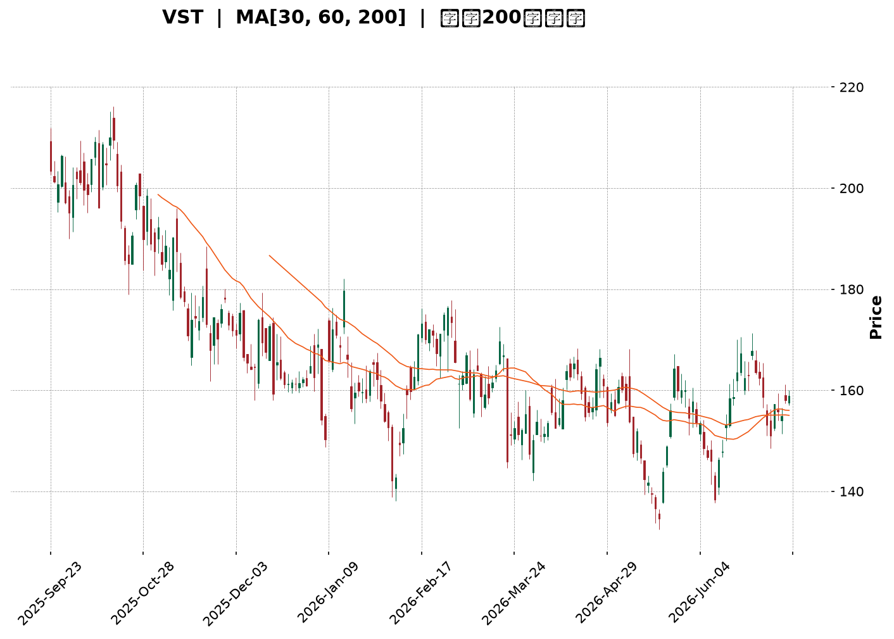
</details>

<html>
<head><meta charset="utf-8" /></head>
<body>
    <div style="height:500px; width:100%;">                        <script>window.PlotlyConfig = {MathJaxConfig: 'local'};</script>
        <script charset="utf-8" src="https://cdn.plot.ly/plotly-3.7.0.min.js" integrity="sha256-jvTGqxNp8AGWEcvNLVuKr+8j5dGe9Yw51LQkmDH+IYA=" crossorigin="anonymous"></script>                <div id="candlestick-chart" class="plotly-graph-div" style="height:100%; width:100%;"></div>            <script>                window.PLOTLYENV=window.PLOTLYENV || {};                                if (document.getElementById("candlestick-chart")) {                    Plotly.newPlot(                        "candlestick-chart",                        [{"close":{"dtype":"f8","bdata":"AAAAAJNsaUAAAACAGidpQAAAAAAVGWlAAAAAAIrLaUAAAACAz6NoQAAAAGBwY2hAAAAAoJMVaUAAAADA5zlpQAAAAKDfJGlAAAAAwIXyaEAAAADgWNloQAAAACAwtmlAAAAAYCEkakAAAADgZIFoQAAAAEDKFWpAAAAAwAuVaUAAAACgNz9qQAAAAGDgMGpAAAAAYHoQaUAAAADg5i1oQAAAAODiN2dAAAAA4OUhZ0AAAABAcdJnQAAAAEBNFGlAAAAAgCbPaEAAAAAAlrlnQAAAAGBh0WhAAAAAAIudZ0AAAAAgnHBnQAAAACCpB2hAAAAAoAcfZ0AAAABgWJNnQAAAAIBW+2ZAAAAAwKbGZ0AAAAAA+W9nQAAAAMBXTWZAAAAAQPswZkAAAADAJltlQAAAAGDlvmVAAAAAYMbIZUAAAADASrZlQAAAAKC0TGZAAAAAADeiZUAAAACAgfxkQAAAAIA8zWVAAAAAADVEZUAAAADgIgJmQAAAAGDIQ2ZAAAAAgG+dZUAAAABAs3plQAAAAAAFXmVAAAAAgN\u002fqZUAAAAAgQc9kQAAAAADLrWRAAAAAIAyEZEAAAAAAhY9kQAAAACAHvGVAAAAAQKAsZUAAAADAq\u002fFkQAAAAGBhl2VAAAAAQM\u002fpY0AAAAAgY69kQAAAAOBSS2RAAAAAAPojZEAAAADgKidkQAAAACBsMGRAAAAA4ConZEAAAACglyxkQAAAAMB7RWRAAAAAQFEcZEAAAAAAxphkQAAAAEBgT2RAAAAAYP4hZUAAAABAjUVjQAAAAMDnxWJAAAAAACe9ZEAAAAAgU4NlQAAAAIBOXmVAAAAAgB8QZUAAAABg2nVmQAAAAAB+xGRAAAAAgBOMY0AAAABgg\u002fJjQAAAAOBc\u002fWNAAAAAQLT1Y0AAAABg5stjQAAAAIDReWRAAAAAYNulZEAAAAAANURkQAAAAIA4vWNAAAAAoLM6Y0AAAABAfhJjQAAAAOAOxGFAAAAAIJzVYUAAAACglqdiQAAAACCJEWNAAAAAQBzlY0AAAABAqfZjQAAAAEDNVGRAAAAAgIpgZUAAAABAbaZlQAAAAKAuQ2VAAAAAgMWAZUAAAAAgq11lQAAAAEDJ6mRAAAAAYLBkZUAAAADgCdxlQAAAAGChCmZAAAAAACGtZUAAAADABrFkQAAAAAAgKGRAAAAAQBldZEAAAACABd5kQAAAAEDLxmNAAAAAIGVlZEAAAABgSX5kQAAAAMAR12NAAAAA4HjkY0AAAAAAXtBjQAAAACBhMWRAAAAAgA18ZEAAAABA0jRlQAAAAIAQ3WRAAAAAABs6YkAAAACAguJiQAAAAKA0EGNAAAAAIIrpYkAAAADgyAJjQAAAAABnaGNAAAAAYK1qYkAAAAAg1cNiQAAAAKDUN2NAAAAAoP7eYkAAAACgGOxiQAAAAODhLmNAAAAAAIF1Y0AAAAAgKhFjQAAAAIBvUGNAAAAAAFK\u002fY0AAAADAs3dkQAAAAODJVmRAAAAAYI2pZEAAAADAZ2dkQAAAAOAO7GNAAAAAIDBWY0AAAADgTnJjQAAAAGAulGNAAAAAgNiDZEAAAAAAG8tkQAAAAEChHGRAAAAAwGUyY0AAAAAA0bNjQAAAAOACYmNAAAAAgAAUZEAAAACg+wRkQAAAAEAywmNAAAAAwII3Y0AAAAAAbnBiQAAAAMDL+mJAAAAAgERVYkAAAABgI81hQAAAACBztmFAAAAAYIJvYUAAAABg4RFhQAAAACCx0GBAAAAAYI75YUAAAACA45tiQAAAAKClgWNAAAAAQI6KZEAAAAAgov1jQAAAAKDJAWRAAAAAgDAAZEAAAADgZFFjQAAAAID4t2NAAAAAoLcyY0AAAACghS9jQAAAAKCpkWJAAAAA4DlWYkAAAAAgf0BiQAAAAIAUS2FAAAAAIJxFYkAAAAAgBHpiQAAAACDFKWNAAAAAIGzMY0AAAADAc9NjQAAAACCscGRAAAAA4FHoZEAAAADgekxkQAAAAADXW2RAAAAA4KP4ZEAAAAAgrm9kQAAAAAApTGRAAAAAACnUY0AAAADAHiVjQAAAAKCZ4WJAAAAAQAqnY0AAAAAgXHdjQAAAAIA9WmNAAAAAIFy\u002fY0AAAAAghdtjQA=="},"high":{"dtype":"f8","bdata":"QKRBHD58akCxK\u002fSonqppQOkgeS42bWlAFiOzPHbUaUAGNVE\u002fk8hpQOgBxCVk9WhAwDtzDpCCaUDjva8oy4RpQNNs7fGAKmpAt014ASriaUA4hVILq19pQPf9KpYZuGlAKdeqhTpGakClX6fNp29qQA4nDmmJImpAJ1s8pnv\u002faUBIev32cuRqQAnTrz1jBmtAg+LPKrklakAdPOAxupRpQEGExjLFE2hALxsz0NmWZ0Dy1AZt5OxnQMOSPv4wJWlA8TD6fhdaaUDGmf7E5I9oQBUTNUu4\u002fGhAwZAindq\u002faEAybwBu4QJoQMQ5LfQsTGhAcafuRETWZ0BuaPPvp\u002fVnQMrTk5y9imdATzu0kwrJZ0DX4iNpe39oQDVLmDIjZWdAq\u002fO1DoqRZkBbBEovGidmQBzSg3ccaGZAM5PPrtBYZkBtSmXT5BVmQKzNw5Hpl2ZA4F+wYCiQZ0A0q\u002fvRtZ5lQApyKvYlz2VACWORtivAZUBpE1n5aCBmQMZPmjumgGZA0DAIQ\u002fD3ZUAoNkV8DOdlQHysXcEgpGVA0S26WvgpZkA4sBoauPxlQM46yL3342RAQm+KGpImZUBHUAVfm6pkQOdZt+VExWVAbIsDqBxoZkCiWLdeCollQPXUKTGtpmVA3iX1eDzNZUAX1OnFn2ZlQJLw+ipfVmVA\u002fWBvE2p7ZEAvlTa\u002f8mdkQP+rCwBeRGRAU90fMZxRZEAVvdNp53dkQGikS06GU2RAJmBSO3qBZECXgsIYBBplQE3qKVDOZWVAafBaJEiEZUAMlnY36QVlQETibZvYa2NAjiX69UDIZUCVsD3cEwhmQLAX1yvp3mVAjJ\u002fHzaVWZUDl6QyWzcFmQHkFh5i7VGVAHSfpTFixZEAdjB9UDzFkQC3tpciQYWRAZbRuGXZNZEDDfGZ5U5tkQG32H31OhWRAShc1NTfDZED3WL7XVu1kQI7wMkJ6gWRA3UebmjzxY0AHXLEmL4JjQK8CdvuNJ2NA08EgZGrwYUAEcGzD4PpiQFTSdh41a2NAqDUjfjAfZEBc1l9hU5tkQHfzEhcMuGRAZpd4SPdlZUC4t2ZgNAVmQHRfFrWB4GVAMzP3agGDZUBiVUDqrqBlQEs2oZG1a2VA53\u002fghJpmZUA\u002fsT4kjO5lQFmw+bu2F2ZAPovpuy06ZkBt9Z+FDgFmQI65eASGYmRArzRJSjl4ZEA\u002fIygeNvBkQP+m45lL\u002fWRA1kRjTKCFZEC1takJYQplQOeVqvczcWRAavQzEP5XZEA8UHaXF5lkQOXKtt+QYWRA7cE29hygZEBHUUcpupBlQAZxQlo6JGVAEtsNF5fHZEAo\u002fX\u002fQ0nVjQKwQqdBNPGNAydGc2FS3Y0D9ueaimw5jQCae5i07\u002f2NAPHKCw6XWY0CQPozwQuhiQLZxLjzig2NA2YaV5wBLY0C3k+EkghxjQLpvM6A4PmNABmuViLMiZEDwIVLWr0lkQF50DrIPzWNACrxYAdkPZEBzPwA+kKFkQOVL4zwwyWRAatNcU\u002fjVZEAUpSDgIwhlQJdRWkVCemRAKT+atv0bZEDHjyrvcNtjQHev5vu61GNA7ZgdbvSnZEB3z60r5wVlQHtHdF0XY2RA5gCWrjwdZEA1oEY+BO1jQDmzAFNQ\u002fWNAOkLKuOREZED8LLYRRXJkQL53EehiWGRAUMzp0\u002fEEZUC6dRFaEFljQKH3GhsqEWNAq8KC8ZvDYkAOqsz0aUJiQFkVxgQH42FAEkf1+JCcYUAh85gJCWthQFSH1lNIEGFAqi6e0FAWYkDq7nSVR6JiQKTPY1swq2NApA\u002fR9k7lZEApLBnQUZlkQIVY1GSkaWRAusF4ZgRCZEBhQng0gcpjQM2gz87DEWRAj2f+qQ22Y0C9y+b6YjpjQHj\u002fcQVgQmNAW0J0QeuiYkCIGzrC38JiQODlIVOO+WFA6RQP6zlWYkASuq\u002fWQ8liQH\u002fWwoNxZ2NAvcI6PyIoZEAXNWyEz0ZkQD5+vuFBQ2VAAAAAAABQZUAAAABgZrpkQAAAAOB6tGRAAAAAQDNrZUAAAACAwv1kQAAAAEAzs2RAAAAAYGauZEAAAACAPapjQAAAACCuh2NAAAAAIK6nY0AAAADAHu1jQAAAAOClj2NAAAAAgMIlZEAAAADgowBkQA=="},"hovertemplate":"\u003cb\u003e%{x|%Y-%m-%d}\u003c\u002fb\u003e\u003cbr\u003e\u958b: $%{open:.2f}\u003cbr\u003e\u9ad8: $%{high:.2f}\u003cbr\u003e\u4f4e: $%{low:.2f}\u003cbr\u003e\u6536: $%{close:.2f}\u003cextra\u003e\u003c\u002fextra\u003e","low":{"dtype":"f8","bdata":"AcYvwLdTaUDvaZF0DCFpQEPZQnlOZmhAFJuw4K8EaUDF2neHKZxoQAoslXgXvWdA2DPvsu\u002frZ0Bk\u002fEM8WbxoQBGezSVCFWlAB+M1v46TaEAeT7alUmJoQI92bhiB6WhAVeWIPXiPaUDJxPytwYBoQDaDJz408mhA4Su\u002fQhISaUBboGdQaLFpQOdXDU0x+mlAjLDr6gznaEDx+YtvPABoQFXNq8acGWdAg7aaNvVcZkC3UfjrEh5nQLPt9qhfOWhAVTb5AOx1aECDCebsjvZmQN2Tj\u002frklWdA9vZFAEJ4Z0A4wZDGSNhmQE+ZGlckYmdAAxMLoYP3ZkC3yTOHNwVnQA7+AC8iWWZAxJLePcP7ZUA8g7f5rexmQPuGO2QwQmZAm+aaS8ARZkDvtXF1AjplQIUcksOVnGRAzcyHP92MZUA\u002f2K6eeD5lQDtq9Cfrr2VA5AtszC6NZUA5b0yxhThkQNDFyE3IpmRAbOdYKvGmZEAm5WPXv4tlQOuU\u002fQCyKGZAksGhZil\u002fZUDYY50C8FRlQM35QVv6B2VAYWIpmnI4ZUB\u002ffi+I8rhkQHVcRH0lbGRACIHRd3+BZECwKyGkvr9jQEwoRnrzCmRA9i88VcXZZEAdlecFM8lkQLPTwQ1\u002fu2RAEjgHhlbBY0C7GuwI2j9kQN8kMLbOQGRA+s6oBQANZEAcBc4NBvZjQHKAUR6J6mNAuID2VAv9Y0AvE1YNc+9jQCmPnYGzE2RAXWRunM4YZEB2DYgIA25kQAxAoCzw92NAyZcsU4BqZEDYT+GUuSNjQEKzkt3omGJAT47qEoStZEDWQN44E3RkQN4tVu8oS2VACa4Q3vCyZEAsVkp6mmZlQJDn3cLtUWRARgMCqDR6Y0ATnnqgECtjQFLE1di\u002f1mNAF6uSKQ2yY0Cw9PEw3K5jQNij9nbWtmNAcm+2f+QWZECWPU4SJcpjQEf7qwysjWNAiUWnslwzY0DH8aJwRL9iQFHKelNYXGFAkH+d+rpEYUChUP\u002flbGBiQCnPTevpa2JAcjRhwUBMY0DeTzBJmsNjQFmO78Sj\u002fmNA4nRxJb4hZECbC7dsZS9lQGNbNPKLJGVAzczMjCX5ZEA29lmdFBFlQNLTDokimGRA7idC5sdNZECC7NZ0izNlQG8L4j4IdWRAbbigzGRNZUDEp7ed66tkQEGb0dHaEWNAS78hxaP+Y0BlTbqFfCdkQGyq6Qigu2NAn+Wx8FBSY0DDJKFFQXtkQNRxNWAaV2NAl+OE9pCIY0BJQKVSb6ljQB57CJ1i9WNAX\u002fJFEoc1ZECRbbWpY6FkQMK0e5bceGRA\u002fNIbIhQUYkAwnEilCaRiQMiCHFHoqmJA60APMm7FYkD1SzPvH0liQBIcw5o18WJA0ULJxKNMYkCIuoWJgsRhQPA6xlMG5mJArKadRB+9YkB6ffv2c7ViQEj7qRM8wmJAM5+on1RiY0DIQU9t7Q5jQDHMHg+rHGNAZv0D9fcNY0CDdIFH3QNkQCz33SyLPWRAp6jeMz5MZECUu17\u002fDkFkQNmc5Mknw2NAQeN\u002fT0M9Y0BQjn7XgVZjQLLd8wsWSWNAAcmUZNtdY0DcwbufatBjQDa4ZP7vz2NAV+BIorUbY0D2zDEMZHBjQGLbd6LTVmNAUqzs0AinY0B4oQzlcvJjQBWqTDwxjGNAn\u002fjcT8IxY0BarDNayFhiQPB5qp9ZQmJAU9p+HJouYkBN4Y2jE2phQOZVAgk+d2FAVbkIzMAzYUAxfbKbh7VgQEVGKvwuj2BAVb02ycAzYUDbOZY9rRViQLxT5\u002fxA0WJACwUJovW\u002fY0DHT6W098VjQCRDh9MlrGNAatvMwCOVY0DVR6iryeNiQLP\u002f\u002fY9RFWNAVUPwHI4XY0CRg6v1W79iQFECWi9maWJAjPD6FJxFYkD1bnYd8qphQAAam9fyNmFAaSJHo\u002f5rYUALD3bva1liQOPvJXk+wWJAQYPflrgTY0A1ZTJPr59jQDIRhX3M+WNAAAAAwMxcZEAAAADgo+RjQAAAAAAp\u002fGNAAAAA4FHAZEAAAACAFGZkQAAAAOCjIGRAAAAA4FGQY0AAAACgmeFiQAAAAAAAkGJAAAAA4FEAY0AAAADgUUBjQAAAAIA96mJAAAAAgD2uY0AAAACgmaFjQA=="},"name":"\u50f9\u683c","open":{"dtype":"f8","bdata":"AwWckKInakAdkeMaWE1pQH+3Fv24pWhAtoA4p7ILaUBYeNMPMSVpQHTkXyely2hAwcvl7B5GaED7c2ZmM2ZpQOAv\u002fZEUcGlAR\u002fFIZMKpaUAbEXwffRdpQKzS27rOF2lAfMVXTIfEaUCjnClaexxqQIOb8gcmCWlAiaG1\u002fPedaUA6Xk\u002fbdQ5qQJ5uWhnGvGpANRorB+HZaUCHlnK9EWlpQOOJaOuPAmhAdiBLsLVYZ0C3UfjrEh5nQM\u002fVnrUbeWhA8TD6fhdaaUDGmf7E5I9oQFTjOjQU8GdA62ozRew7aEDojN7KhOZnQKrOgsOYwGdAGIW2kTxqZ0BneWy3mS9nQFB65SY1xGZAojlrcE84ZkDZQStcvz9oQL5x5fPDJGdAXp1Bw6ByZkD+Uss7pAVmQG86aoeSz2RAAIAYRHrWZUDdCZ2rNH5lQB1XO7jfzWVAqiGQH7YBZ0CzC6VlLGllQOGegl28G2VAUr7qC3WrZUD3Oi9h6KhlQDdTWH4+SGZA1lbi+vXoZUD+tveLhdVlQBVgba80fmVAEDk9bfxlZUAOH9S2NvllQM46yL3342RATXJnmeSVZED4QW7Z75RkQC0Oj+QXLGRA6Q50GybPZUDCI48axIdlQExHEsiuvmRA56NS3TmpZUD9JKGTIp9kQCEHOdBGwGRArTj3lIVxZEA+IIIC+iNkQJ\u002fi98t3EWRAAAAA4ConZEBu+e9byRFkQOK4FMOyMWRAxPdPfhlOZEB2DYgIA25kQJF6ZTTjHGVAf8pbmhQRZUAMlnY36QVlQIN9eGlLWmNAQ00eeiu7ZUBCqG8j54ZkQO2bA5GjsGVAfnEKooYdZUAeFyYlupBlQKsEkefO4mRANhWAE2caZEDiA5czSNJjQHtDXsR2L2RAkEVA9t\u002fxY0BfmpXlswRkQE90Vdo84mNAAxIpXVixZED6kUmcEbBkQIk7MQ++IWRAExH34uGmY0D0nje9DnZjQEeQvVqOGGNAojQ1aI2TYUBr0Pv2wbJiQG77QP\u002fBsmJA\u002fxqKq6P+Y0C1aPPibpFkQJBUta8rCWRA+iaBjnY+ZECtz\u002fIHE01lQLOrpUH1sGVAzcyuyB4uZUB9UO2oY3plQOWAgVBqRWVA6lORNTHaZEBAJY8Z8XxlQAOzW2VkXGVAOU8LCo3QZUC18araXzdlQGjR0lnOJ2RAQRNeYJ0kZEBftYiA3i1kQIBPaMvhf2RAZPKZWQlvY0CG0uEN7JxkQCNnCejBZGRAdL73X7GUY0BdqwD+CSpkQMT20F\u002fJEWRAtkct+otLZECPW0sDXqlkQHRaFaWu1mRAEtsNF5fHZECbEcRqn+diQFVYRNzcymJAg3luRBBZY0AW3KxTT6liQBIcw5o18WJAw2d6eiucY0AS2UYqXPZhQP2SdgZD6GJAgJv6J\u002fTfYkD05QVNhdpiQNx2sMZ622JABWzocs4QZEA9BV0HgXVjQLWWVHchKWNAZv0D9fcNY0Bq0TQf2kVkQMEZRAyYqGRAEtt+H+CKZEC7gUEs4cBkQG2jFbpNWmRAmNfAOyARZEBJQhvZibJjQEubIrK9d2NATXwCgJCDY0B04M+5nZhkQIMv5nC6SGRAoLjdQFIUZEBSdtYhSYJjQBZ04OnVwmNAJT248wWvY0BA9fybtFhkQEL5jOicKGRACATW3ftZZEC6dRFaEFljQNTOhYVgeWJA+mVlnP2oYkAOqsz0aUJiQDsNAlXVpWFAvyBliYtyYUCsu0WZx1lhQGulTeOF82BAAAAAHNM5YUD8xES7hyhiQPBHu4cz2mJAx8ZiOgLWY0AqjOmlVpdkQK+CDJ\u002fF02NAQyCHAtf4Y0DC0GVW+ZhjQGPJmQEad2NAte0B1FCJY0AMOJaef+piQK8anKEy+WJAt\u002f3beEiDYkAxHOFLzIZiQAbrZwXJ5GFAytzu\u002fl6ZYUBWG6t6YHliQIKpSuIUE2NAm2MnZyQhY0CH1zPp+8pjQPBXPGSgO2RAAAAAAClwZEAAAABgjwJkQAAAAMD1YGRAAAAAwB7dZEAAAAAghbtkQAAAAGBmdmRAAAAAYI9SZEAAAAAAAIBjQAAAAGBmPmNAAAAAQAoPY0AAAAAAKYRjQAAAACCuP2NAAAAA4FHgY0AAAACgmbFjQA=="},"x":["2025-09-23T00:00:00-04:00","2025-09-24T00:00:00-04:00","2025-09-25T00:00:00-04:00","2025-09-26T00:00:00-04:00","2025-09-29T00:00:00-04:00","2025-09-30T00:00:00-04:00","2025-10-01T00:00:00-04:00","2025-10-02T00:00:00-04:00","2025-10-03T00:00:00-04:00","2025-10-06T00:00:00-04:00","2025-10-07T00:00:00-04:00","2025-10-08T00:00:00-04:00","2025-10-09T00:00:00-04:00","2025-10-10T00:00:00-04:00","2025-10-13T00:00:00-04:00","2025-10-14T00:00:00-04:00","2025-10-15T00:00:00-04:00","2025-10-16T00:00:00-04:00","2025-10-17T00:00:00-04:00","2025-10-20T00:00:00-04:00","2025-10-21T00:00:00-04:00","2025-10-22T00:00:00-04:00","2025-10-23T00:00:00-04:00","2025-10-24T00:00:00-04:00","2025-10-27T00:00:00-04:00","2025-10-28T00:00:00-04:00","2025-10-29T00:00:00-04:00","2025-10-30T00:00:00-04:00","2025-10-31T00:00:00-04:00","2025-11-03T00:00:00-05:00","2025-11-04T00:00:00-05:00","2025-11-05T00:00:00-05:00","2025-11-06T00:00:00-05:00","2025-11-07T00:00:00-05:00","2025-11-10T00:00:00-05:00","2025-11-11T00:00:00-05:00","2025-11-12T00:00:00-05:00","2025-11-13T00:00:00-05:00","2025-11-14T00:00:00-05:00","2025-11-17T00:00:00-05:00","2025-11-18T00:00:00-05:00","2025-11-19T00:00:00-05:00","2025-11-20T00:00:00-05:00","2025-11-21T00:00:00-05:00","2025-11-24T00:00:00-05:00","2025-11-25T00:00:00-05:00","2025-11-26T00:00:00-05:00","2025-11-28T00:00:00-05:00","2025-12-01T00:00:00-05:00","2025-12-02T00:00:00-05:00","2025-12-03T00:00:00-05:00","2025-12-04T00:00:00-05:00","2025-12-05T00:00:00-05:00","2025-12-08T00:00:00-05:00","2025-12-09T00:00:00-05:00","2025-12-10T00:00:00-05:00","2025-12-11T00:00:00-05:00","2025-12-12T00:00:00-05:00","2025-12-15T00:00:00-05:00","2025-12-16T00:00:00-05:00","2025-12-17T00:00:00-05:00","2025-12-18T00:00:00-05:00","2025-12-19T00:00:00-05:00","2025-12-22T00:00:00-05:00","2025-12-23T00:00:00-05:00","2025-12-24T00:00:00-05:00","2025-12-26T00:00:00-05:00","2025-12-29T00:00:00-05:00","2025-12-30T00:00:00-05:00","2025-12-31T00:00:00-05:00","2026-01-02T00:00:00-05:00","2026-01-05T00:00:00-05:00","2026-01-06T00:00:00-05:00","2026-01-07T00:00:00-05:00","2026-01-08T00:00:00-05:00","2026-01-09T00:00:00-05:00","2026-01-12T00:00:00-05:00","2026-01-13T00:00:00-05:00","2026-01-14T00:00:00-05:00","2026-01-15T00:00:00-05:00","2026-01-16T00:00:00-05:00","2026-01-20T00:00:00-05:00","2026-01-21T00:00:00-05:00","2026-01-22T00:00:00-05:00","2026-01-23T00:00:00-05:00","2026-01-26T00:00:00-05:00","2026-01-27T00:00:00-05:00","2026-01-28T00:00:00-05:00","2026-01-29T00:00:00-05:00","2026-01-30T00:00:00-05:00","2026-02-02T00:00:00-05:00","2026-02-03T00:00:00-05:00","2026-02-04T00:00:00-05:00","2026-02-05T00:00:00-05:00","2026-02-06T00:00:00-05:00","2026-02-09T00:00:00-05:00","2026-02-10T00:00:00-05:00","2026-02-11T00:00:00-05:00","2026-02-12T00:00:00-05:00","2026-02-13T00:00:00-05:00","2026-02-17T00:00:00-05:00","2026-02-18T00:00:00-05:00","2026-02-19T00:00:00-05:00","2026-02-20T00:00:00-05:00","2026-02-23T00:00:00-05:00","2026-02-24T00:00:00-05:00","2026-02-25T00:00:00-05:00","2026-02-26T00:00:00-05:00","2026-02-27T00:00:00-05:00","2026-03-02T00:00:00-05:00","2026-03-03T00:00:00-05:00","2026-03-04T00:00:00-05:00","2026-03-05T00:00:00-05:00","2026-03-06T00:00:00-05:00","2026-03-09T00:00:00-04:00","2026-03-10T00:00:00-04:00","2026-03-11T00:00:00-04:00","2026-03-12T00:00:00-04:00","2026-03-13T00:00:00-04:00","2026-03-16T00:00:00-04:00","2026-03-17T00:00:00-04:00","2026-03-18T00:00:00-04:00","2026-03-19T00:00:00-04:00","2026-03-20T00:00:00-04:00","2026-03-23T00:00:00-04:00","2026-03-24T00:00:00-04:00","2026-03-25T00:00:00-04:00","2026-03-26T00:00:00-04:00","2026-03-27T00:00:00-04:00","2026-03-30T00:00:00-04:00","2026-03-31T00:00:00-04:00","2026-04-01T00:00:00-04:00","2026-04-02T00:00:00-04:00","2026-04-06T00:00:00-04:00","2026-04-07T00:00:00-04:00","2026-04-08T00:00:00-04:00","2026-04-09T00:00:00-04:00","2026-04-10T00:00:00-04:00","2026-04-13T00:00:00-04:00","2026-04-14T00:00:00-04:00","2026-04-15T00:00:00-04:00","2026-04-16T00:00:00-04:00","2026-04-17T00:00:00-04:00","2026-04-20T00:00:00-04:00","2026-04-21T00:00:00-04:00","2026-04-22T00:00:00-04:00","2026-04-23T00:00:00-04:00","2026-04-24T00:00:00-04:00","2026-04-27T00:00:00-04:00","2026-04-28T00:00:00-04:00","2026-04-29T00:00:00-04:00","2026-04-30T00:00:00-04:00","2026-05-01T00:00:00-04:00","2026-05-04T00:00:00-04:00","2026-05-05T00:00:00-04:00","2026-05-06T00:00:00-04:00","2026-05-07T00:00:00-04:00","2026-05-08T00:00:00-04:00","2026-05-11T00:00:00-04:00","2026-05-12T00:00:00-04:00","2026-05-13T00:00:00-04:00","2026-05-14T00:00:00-04:00","2026-05-15T00:00:00-04:00","2026-05-18T00:00:00-04:00","2026-05-19T00:00:00-04:00","2026-05-20T00:00:00-04:00","2026-05-21T00:00:00-04:00","2026-05-22T00:00:00-04:00","2026-05-26T00:00:00-04:00","2026-05-27T00:00:00-04:00","2026-05-28T00:00:00-04:00","2026-05-29T00:00:00-04:00","2026-06-01T00:00:00-04:00","2026-06-02T00:00:00-04:00","2026-06-03T00:00:00-04:00","2026-06-04T00:00:00-04:00","2026-06-05T00:00:00-04:00","2026-06-08T00:00:00-04:00","2026-06-09T00:00:00-04:00","2026-06-10T00:00:00-04:00","2026-06-11T00:00:00-04:00","2026-06-12T00:00:00-04:00","2026-06-15T00:00:00-04:00","2026-06-16T00:00:00-04:00","2026-06-17T00:00:00-04:00","2026-06-18T00:00:00-04:00","2026-06-22T00:00:00-04:00","2026-06-23T00:00:00-04:00","2026-06-24T00:00:00-04:00","2026-06-25T00:00:00-04:00","2026-06-26T00:00:00-04:00","2026-06-29T00:00:00-04:00","2026-06-30T00:00:00-04:00","2026-07-01T00:00:00-04:00","2026-07-02T00:00:00-04:00","2026-07-06T00:00:00-04:00","2026-07-07T00:00:00-04:00","2026-07-08T00:00:00-04:00","2026-07-09T00:00:00-04:00","2026-07-10T00:00:00-04:00"],"type":"candlestick"},{"hovertemplate":"MA30: $%{y:.2f}\u003cextra\u003e\u003c\u002fextra\u003e","line":{"color":"#2196F3","dash":"dash","width":2},"mode":"lines","name":"MA30","x":["2025-09-23T00:00:00-04:00","2025-09-24T00:00:00-04:00","2025-09-25T00:00:00-04:00","2025-09-26T00:00:00-04:00","2025-09-29T00:00:00-04:00","2025-09-30T00:00:00-04:00","2025-10-01T00:00:00-04:00","2025-10-02T00:00:00-04:00","2025-10-03T00:00:00-04:00","2025-10-06T00:00:00-04:00","2025-10-07T00:00:00-04:00","2025-10-08T00:00:00-04:00","2025-10-09T00:00:00-04:00","2025-10-10T00:00:00-04:00","2025-10-13T00:00:00-04:00","2025-10-14T00:00:00-04:00","2025-10-15T00:00:00-04:00","2025-10-16T00:00:00-04:00","2025-10-17T00:00:00-04:00","2025-10-20T00:00:00-04:00","2025-10-21T00:00:00-04:00","2025-10-22T00:00:00-04:00","2025-10-23T00:00:00-04:00","2025-10-24T00:00:00-04:00","2025-10-27T00:00:00-04:00","2025-10-28T00:00:00-04:00","2025-10-29T00:00:00-04:00","2025-10-30T00:00:00-04:00","2025-10-31T00:00:00-04:00","2025-11-03T00:00:00-05:00","2025-11-04T00:00:00-05:00","2025-11-05T00:00:00-05:00","2025-11-06T00:00:00-05:00","2025-11-07T00:00:00-05:00","2025-11-10T00:00:00-05:00","2025-11-11T00:00:00-05:00","2025-11-12T00:00:00-05:00","2025-11-13T00:00:00-05:00","2025-11-14T00:00:00-05:00","2025-11-17T00:00:00-05:00","2025-11-18T00:00:00-05:00","2025-11-19T00:00:00-05:00","2025-11-20T00:00:00-05:00","2025-11-21T00:00:00-05:00","2025-11-24T00:00:00-05:00","2025-11-25T00:00:00-05:00","2025-11-26T00:00:00-05:00","2025-11-28T00:00:00-05:00","2025-12-01T00:00:00-05:00","2025-12-02T00:00:00-05:00","2025-12-03T00:00:00-05:00","2025-12-04T00:00:00-05:00","2025-12-05T00:00:00-05:00","2025-12-08T00:00:00-05:00","2025-12-09T00:00:00-05:00","2025-12-10T00:00:00-05:00","2025-12-11T00:00:00-05:00","2025-12-12T00:00:00-05:00","2025-12-15T00:00:00-05:00","2025-12-16T00:00:00-05:00","2025-12-17T00:00:00-05:00","2025-12-18T00:00:00-05:00","2025-12-19T00:00:00-05:00","2025-12-22T00:00:00-05:00","2025-12-23T00:00:00-05:00","2025-12-24T00:00:00-05:00","2025-12-26T00:00:00-05:00","2025-12-29T00:00:00-05:00","2025-12-30T00:00:00-05:00","2025-12-31T00:00:00-05:00","2026-01-02T00:00:00-05:00","2026-01-05T00:00:00-05:00","2026-01-06T00:00:00-05:00","2026-01-07T00:00:00-05:00","2026-01-08T00:00:00-05:00","2026-01-09T00:00:00-05:00","2026-01-12T00:00:00-05:00","2026-01-13T00:00:00-05:00","2026-01-14T00:00:00-05:00","2026-01-15T00:00:00-05:00","2026-01-16T00:00:00-05:00","2026-01-20T00:00:00-05:00","2026-01-21T00:00:00-05:00","2026-01-22T00:00:00-05:00","2026-01-23T00:00:00-05:00","2026-01-26T00:00:00-05:00","2026-01-27T00:00:00-05:00","2026-01-28T00:00:00-05:00","2026-01-29T00:00:00-05:00","2026-01-30T00:00:00-05:00","2026-02-02T00:00:00-05:00","2026-02-03T00:00:00-05:00","2026-02-04T00:00:00-05:00","2026-02-05T00:00:00-05:00","2026-02-06T00:00:00-05:00","2026-02-09T00:00:00-05:00","2026-02-10T00:00:00-05:00","2026-02-11T00:00:00-05:00","2026-02-12T00:00:00-05:00","2026-02-13T00:00:00-05:00","2026-02-17T00:00:00-05:00","2026-02-18T00:00:00-05:00","2026-02-19T00:00:00-05:00","2026-02-20T00:00:00-05:00","2026-02-23T00:00:00-05:00","2026-02-24T00:00:00-05:00","2026-02-25T00:00:00-05:00","2026-02-26T00:00:00-05:00","2026-02-27T00:00:00-05:00","2026-03-02T00:00:00-05:00","2026-03-03T00:00:00-05:00","2026-03-04T00:00:00-05:00","2026-03-05T00:00:00-05:00","2026-03-06T00:00:00-05:00","2026-03-09T00:00:00-04:00","2026-03-10T00:00:00-04:00","2026-03-11T00:00:00-04:00","2026-03-12T00:00:00-04:00","2026-03-13T00:00:00-04:00","2026-03-16T00:00:00-04:00","2026-03-17T00:00:00-04:00","2026-03-18T00:00:00-04:00","2026-03-19T00:00:00-04:00","2026-03-20T00:00:00-04:00","2026-03-23T00:00:00-04:00","2026-03-24T00:00:00-04:00","2026-03-25T00:00:00-04:00","2026-03-26T00:00:00-04:00","2026-03-27T00:00:00-04:00","2026-03-30T00:00:00-04:00","2026-03-31T00:00:00-04:00","2026-04-01T00:00:00-04:00","2026-04-02T00:00:00-04:00","2026-04-06T00:00:00-04:00","2026-04-07T00:00:00-04:00","2026-04-08T00:00:00-04:00","2026-04-09T00:00:00-04:00","2026-04-10T00:00:00-04:00","2026-04-13T00:00:00-04:00","2026-04-14T00:00:00-04:00","2026-04-15T00:00:00-04:00","2026-04-16T00:00:00-04:00","2026-04-17T00:00:00-04:00","2026-04-20T00:00:00-04:00","2026-04-21T00:00:00-04:00","2026-04-22T00:00:00-04:00","2026-04-23T00:00:00-04:00","2026-04-24T00:00:00-04:00","2026-04-27T00:00:00-04:00","2026-04-28T00:00:00-04:00","2026-04-29T00:00:00-04:00","2026-04-30T00:00:00-04:00","2026-05-01T00:00:00-04:00","2026-05-04T00:00:00-04:00","2026-05-05T00:00:00-04:00","2026-05-06T00:00:00-04:00","2026-05-07T00:00:00-04:00","2026-05-08T00:00:00-04:00","2026-05-11T00:00:00-04:00","2026-05-12T00:00:00-04:00","2026-05-13T00:00:00-04:00","2026-05-14T00:00:00-04:00","2026-05-15T00:00:00-04:00","2026-05-18T00:00:00-04:00","2026-05-19T00:00:00-04:00","2026-05-20T00:00:00-04:00","2026-05-21T00:00:00-04:00","2026-05-22T00:00:00-04:00","2026-05-26T00:00:00-04:00","2026-05-27T00:00:00-04:00","2026-05-28T00:00:00-04:00","2026-05-29T00:00:00-04:00","2026-06-01T00:00:00-04:00","2026-06-02T00:00:00-04:00","2026-06-03T00:00:00-04:00","2026-06-04T00:00:00-04:00","2026-06-05T00:00:00-04:00","2026-06-08T00:00:00-04:00","2026-06-09T00:00:00-04:00","2026-06-10T00:00:00-04:00","2026-06-11T00:00:00-04:00","2026-06-12T00:00:00-04:00","2026-06-15T00:00:00-04:00","2026-06-16T00:00:00-04:00","2026-06-17T00:00:00-04:00","2026-06-18T00:00:00-04:00","2026-06-22T00:00:00-04:00","2026-06-23T00:00:00-04:00","2026-06-24T00:00:00-04:00","2026-06-25T00:00:00-04:00","2026-06-26T00:00:00-04:00","2026-06-29T00:00:00-04:00","2026-06-30T00:00:00-04:00","2026-07-01T00:00:00-04:00","2026-07-02T00:00:00-04:00","2026-07-06T00:00:00-04:00","2026-07-07T00:00:00-04:00","2026-07-08T00:00:00-04:00","2026-07-09T00:00:00-04:00","2026-07-10T00:00:00-04:00"],"y":{"dtype":"f8","bdata":"AAAAAAAA+H8AAAAAAAD4fwAAAAAAAPh\u002fAAAAAAAA+H8AAAAAAAD4fwAAAAAAAPh\u002fAAAAAAAA+H8AAAAAAAD4fwAAAAAAAPh\u002fAAAAAAAA+H8AAAAAAAD4fwAAAAAAAPh\u002fAAAAAAAA+H8AAAAAAAD4fwAAAAAAAPh\u002fAAAAAAAA+H8AAAAAAAD4fwAAAAAAAPh\u002fAAAAAAAA+H8AAAAAAAD4fwAAAAAAAPh\u002fAAAAAAAA+H8AAAAAAAD4fwAAAAAAAPh\u002fAAAAAAAA+H8AAAAAAAD4fwAAAAAAAPh\u002fAAAAAAAA+H8AAAAAAAD4f7y7uzuT1mhAREREdOzCaEDNzMwMd7VoQKuqqipoo2hAREREZC2SaEAiIiKC6odoQDMzM+McdmhAREREJG1daEBVVVW1ZjxoQGZmZuZmH2hA3t3dDWkEaEARERFRpOlnQJqZmZmGzGdAq6qq2g+mZ0BmZmZGCIhnQERERAR7Y2dA7+7uDqc+Z0AzMzOzexpnQGZmZub6+GZAq6qqmovbZkCamZlZgcRmQAAAALC1tGZAvLu7m1eqZkDe3d3NopBmQN7d3e0Va2ZAq6qq6nJGZkCamZlZcitmQKuqqooiEWZAq6qq6k38ZUAzMzOjAedlQCIiInIy0mVAMzMzs9K2ZUBERERkKJ5lQGZmZlY5h2VARERElDNoZUBVVVW1LExlQKuqqtokOmVAq6qqCsAoZUBEREQ0qh5lQN7d3Z0VEmVAIiIics0DZUBVVVUFSfpkQN7d3b1O6WRAZmZmlgjlZECJiIjYZtZkQAAAALCOvGRAiYiIOA64ZECJiIgY1LNkQGZmZuYtrGRAiYiICHinZEBEREQ0169kQKuqqhq5qmRAq6qqGn+WZEAiIiJyI49kQImIiOhBiWRA7+7uPoOEZEBVVVX1\u002fX1kQAAAAHBAc2RAiYiIaMJuZEDv7u4u+mhkQFVVVQUsWWRARERExFVTZEB3d3dnkkVkQCIiIhL\u002fL2RAZmZmRlEcZEARERERiA9kQHd3d\u002ff3BWRAd3d3R8QDZEARERER+AFkQImIiMh6AmRA3t3dfUkNZECJiIiIRhZkQDMzMwNnHmRAiYiIyI8hZEBVVVWlbjNkQN7d3W26RWRAMzMzE1BLZECamZkZRU5kQImIiJgDVGRAERERYT9ZZEAiIiJCJ0pkQM3MzOzwRGRAVVVVlehLZEARERFBwlNkQJqZmZnwUWRAIiIisqlVZEDe3d3tm1tkQDMzMyMvVmRAvLu767xPZEC8u7tr4EtkQERERKS\u002fT2RAZmZm1nVaZEBmZmbWq2xkQDMzM9Mah2RAMzMzY3SKZEDv7u4ua4xkQFVVVdVfjGRAiYiIGP2DZEBEREQE3HtkQN7d3b36c2RAMzMzo7daZEB3d3f3GEJkQImIiAinMGRAiYiIeDEaZEARERFBVwVkQGZmZkaL9mNAIiIisgnmY0AAAABwNc5jQCIiIoLvtmNAzczMrHmmY0AiIiKCkKRjQERERLQepmNAvLu7G6uoY0CrqqrqtqRjQHd3d+f0pWNAq6qqmuqcY0Crqqra+5NjQDMzMxPBkWNAAAAAEBGXY0AiIiKybJ9jQCIiIqK7nmNAMzMzk76TY0AzMzMz6YZjQM3MzJxGemNAd3d3hxKKY0C8u7s7wZNjQGZmZhawmWNAERERcUmcY0C8u7uLaJdjQM3MzDzBk2NAq6qqigqTY0Crqqpq0YpjQFVVVdX4fWNAVVVV9bhxY0ARERFR6mFjQN7d3X21TWNAVVVVRQtBY0BERESEIj1jQERERHTGPmNAq6qquoxFY0AzMzMTe0FjQLy7u7ulPmNAERERgQA5Y0BEREQkvC9jQJqZman\u002fLWNAq6qq+tAsY0AiIiISlypjQLy7uwv5IWNAERERsWIPY0BERETUsvliQKuqqpql4WJAREREBMHZYkARERFBS89iQERERFRrzWJAREREhAjLYkCrqqraYcliQHd3d7cyz2JAVVVVBaDdYkARERFRfu1iQFVVVfVC+WJAMzMzI8YPY0Crqqo6QiZjQDMzM9NQPGNAd3d3x7xQY0BmZmYGcmJjQAAAAGATdGNA3t3dTWSCY0AAAAAgtYljQKuqqtpkiGNAq6qq6p6BY0ARERHRe4BjQA=="},"type":"scatter"},{"hovertemplate":"MA60: $%{y:.2f}\u003cextra\u003e\u003c\u002fextra\u003e","line":{"color":"#9C27B0","dash":"dash","width":2},"mode":"lines","name":"MA60","x":["2025-09-23T00:00:00-04:00","2025-09-24T00:00:00-04:00","2025-09-25T00:00:00-04:00","2025-09-26T00:00:00-04:00","2025-09-29T00:00:00-04:00","2025-09-30T00:00:00-04:00","2025-10-01T00:00:00-04:00","2025-10-02T00:00:00-04:00","2025-10-03T00:00:00-04:00","2025-10-06T00:00:00-04:00","2025-10-07T00:00:00-04:00","2025-10-08T00:00:00-04:00","2025-10-09T00:00:00-04:00","2025-10-10T00:00:00-04:00","2025-10-13T00:00:00-04:00","2025-10-14T00:00:00-04:00","2025-10-15T00:00:00-04:00","2025-10-16T00:00:00-04:00","2025-10-17T00:00:00-04:00","2025-10-20T00:00:00-04:00","2025-10-21T00:00:00-04:00","2025-10-22T00:00:00-04:00","2025-10-23T00:00:00-04:00","2025-10-24T00:00:00-04:00","2025-10-27T00:00:00-04:00","2025-10-28T00:00:00-04:00","2025-10-29T00:00:00-04:00","2025-10-30T00:00:00-04:00","2025-10-31T00:00:00-04:00","2025-11-03T00:00:00-05:00","2025-11-04T00:00:00-05:00","2025-11-05T00:00:00-05:00","2025-11-06T00:00:00-05:00","2025-11-07T00:00:00-05:00","2025-11-10T00:00:00-05:00","2025-11-11T00:00:00-05:00","2025-11-12T00:00:00-05:00","2025-11-13T00:00:00-05:00","2025-11-14T00:00:00-05:00","2025-11-17T00:00:00-05:00","2025-11-18T00:00:00-05:00","2025-11-19T00:00:00-05:00","2025-11-20T00:00:00-05:00","2025-11-21T00:00:00-05:00","2025-11-24T00:00:00-05:00","2025-11-25T00:00:00-05:00","2025-11-26T00:00:00-05:00","2025-11-28T00:00:00-05:00","2025-12-01T00:00:00-05:00","2025-12-02T00:00:00-05:00","2025-12-03T00:00:00-05:00","2025-12-04T00:00:00-05:00","2025-12-05T00:00:00-05:00","2025-12-08T00:00:00-05:00","2025-12-09T00:00:00-05:00","2025-12-10T00:00:00-05:00","2025-12-11T00:00:00-05:00","2025-12-12T00:00:00-05:00","2025-12-15T00:00:00-05:00","2025-12-16T00:00:00-05:00","2025-12-17T00:00:00-05:00","2025-12-18T00:00:00-05:00","2025-12-19T00:00:00-05:00","2025-12-22T00:00:00-05:00","2025-12-23T00:00:00-05:00","2025-12-24T00:00:00-05:00","2025-12-26T00:00:00-05:00","2025-12-29T00:00:00-05:00","2025-12-30T00:00:00-05:00","2025-12-31T00:00:00-05:00","2026-01-02T00:00:00-05:00","2026-01-05T00:00:00-05:00","2026-01-06T00:00:00-05:00","2026-01-07T00:00:00-05:00","2026-01-08T00:00:00-05:00","2026-01-09T00:00:00-05:00","2026-01-12T00:00:00-05:00","2026-01-13T00:00:00-05:00","2026-01-14T00:00:00-05:00","2026-01-15T00:00:00-05:00","2026-01-16T00:00:00-05:00","2026-01-20T00:00:00-05:00","2026-01-21T00:00:00-05:00","2026-01-22T00:00:00-05:00","2026-01-23T00:00:00-05:00","2026-01-26T00:00:00-05:00","2026-01-27T00:00:00-05:00","2026-01-28T00:00:00-05:00","2026-01-29T00:00:00-05:00","2026-01-30T00:00:00-05:00","2026-02-02T00:00:00-05:00","2026-02-03T00:00:00-05:00","2026-02-04T00:00:00-05:00","2026-02-05T00:00:00-05:00","2026-02-06T00:00:00-05:00","2026-02-09T00:00:00-05:00","2026-02-10T00:00:00-05:00","2026-02-11T00:00:00-05:00","2026-02-12T00:00:00-05:00","2026-02-13T00:00:00-05:00","2026-02-17T00:00:00-05:00","2026-02-18T00:00:00-05:00","2026-02-19T00:00:00-05:00","2026-02-20T00:00:00-05:00","2026-02-23T00:00:00-05:00","2026-02-24T00:00:00-05:00","2026-02-25T00:00:00-05:00","2026-02-26T00:00:00-05:00","2026-02-27T00:00:00-05:00","2026-03-02T00:00:00-05:00","2026-03-03T00:00:00-05:00","2026-03-04T00:00:00-05:00","2026-03-05T00:00:00-05:00","2026-03-06T00:00:00-05:00","2026-03-09T00:00:00-04:00","2026-03-10T00:00:00-04:00","2026-03-11T00:00:00-04:00","2026-03-12T00:00:00-04:00","2026-03-13T00:00:00-04:00","2026-03-16T00:00:00-04:00","2026-03-17T00:00:00-04:00","2026-03-18T00:00:00-04:00","2026-03-19T00:00:00-04:00","2026-03-20T00:00:00-04:00","2026-03-23T00:00:00-04:00","2026-03-24T00:00:00-04:00","2026-03-25T00:00:00-04:00","2026-03-26T00:00:00-04:00","2026-03-27T00:00:00-04:00","2026-03-30T00:00:00-04:00","2026-03-31T00:00:00-04:00","2026-04-01T00:00:00-04:00","2026-04-02T00:00:00-04:00","2026-04-06T00:00:00-04:00","2026-04-07T00:00:00-04:00","2026-04-08T00:00:00-04:00","2026-04-09T00:00:00-04:00","2026-04-10T00:00:00-04:00","2026-04-13T00:00:00-04:00","2026-04-14T00:00:00-04:00","2026-04-15T00:00:00-04:00","2026-04-16T00:00:00-04:00","2026-04-17T00:00:00-04:00","2026-04-20T00:00:00-04:00","2026-04-21T00:00:00-04:00","2026-04-22T00:00:00-04:00","2026-04-23T00:00:00-04:00","2026-04-24T00:00:00-04:00","2026-04-27T00:00:00-04:00","2026-04-28T00:00:00-04:00","2026-04-29T00:00:00-04:00","2026-04-30T00:00:00-04:00","2026-05-01T00:00:00-04:00","2026-05-04T00:00:00-04:00","2026-05-05T00:00:00-04:00","2026-05-06T00:00:00-04:00","2026-05-07T00:00:00-04:00","2026-05-08T00:00:00-04:00","2026-05-11T00:00:00-04:00","2026-05-12T00:00:00-04:00","2026-05-13T00:00:00-04:00","2026-05-14T00:00:00-04:00","2026-05-15T00:00:00-04:00","2026-05-18T00:00:00-04:00","2026-05-19T00:00:00-04:00","2026-05-20T00:00:00-04:00","2026-05-21T00:00:00-04:00","2026-05-22T00:00:00-04:00","2026-05-26T00:00:00-04:00","2026-05-27T00:00:00-04:00","2026-05-28T00:00:00-04:00","2026-05-29T00:00:00-04:00","2026-06-01T00:00:00-04:00","2026-06-02T00:00:00-04:00","2026-06-03T00:00:00-04:00","2026-06-04T00:00:00-04:00","2026-06-05T00:00:00-04:00","2026-06-08T00:00:00-04:00","2026-06-09T00:00:00-04:00","2026-06-10T00:00:00-04:00","2026-06-11T00:00:00-04:00","2026-06-12T00:00:00-04:00","2026-06-15T00:00:00-04:00","2026-06-16T00:00:00-04:00","2026-06-17T00:00:00-04:00","2026-06-18T00:00:00-04:00","2026-06-22T00:00:00-04:00","2026-06-23T00:00:00-04:00","2026-06-24T00:00:00-04:00","2026-06-25T00:00:00-04:00","2026-06-26T00:00:00-04:00","2026-06-29T00:00:00-04:00","2026-06-30T00:00:00-04:00","2026-07-01T00:00:00-04:00","2026-07-02T00:00:00-04:00","2026-07-06T00:00:00-04:00","2026-07-07T00:00:00-04:00","2026-07-08T00:00:00-04:00","2026-07-09T00:00:00-04:00","2026-07-10T00:00:00-04:00"],"y":{"dtype":"f8","bdata":"AAAAAAAA+H8AAAAAAAD4fwAAAAAAAPh\u002fAAAAAAAA+H8AAAAAAAD4fwAAAAAAAPh\u002fAAAAAAAA+H8AAAAAAAD4fwAAAAAAAPh\u002fAAAAAAAA+H8AAAAAAAD4fwAAAAAAAPh\u002fAAAAAAAA+H8AAAAAAAD4fwAAAAAAAPh\u002fAAAAAAAA+H8AAAAAAAD4fwAAAAAAAPh\u002fAAAAAAAA+H8AAAAAAAD4fwAAAAAAAPh\u002fAAAAAAAA+H8AAAAAAAD4fwAAAAAAAPh\u002fAAAAAAAA+H8AAAAAAAD4fwAAAAAAAPh\u002fAAAAAAAA+H8AAAAAAAD4fwAAAAAAAPh\u002fAAAAAAAA+H8AAAAAAAD4fwAAAAAAAPh\u002fAAAAAAAA+H8AAAAAAAD4fwAAAAAAAPh\u002fAAAAAAAA+H8AAAAAAAD4fwAAAAAAAPh\u002fAAAAAAAA+H8AAAAAAAD4fwAAAAAAAPh\u002fAAAAAAAA+H8AAAAAAAD4fwAAAAAAAPh\u002fAAAAAAAA+H8AAAAAAAD4fwAAAAAAAPh\u002fAAAAAAAA+H8AAAAAAAD4fwAAAAAAAPh\u002fAAAAAAAA+H8AAAAAAAD4fwAAAAAAAPh\u002fAAAAAAAA+H8AAAAAAAD4fwAAAAAAAPh\u002fAAAAAAAA+H8AAAAAAAD4f+\u002fu7tZiVGdAvLu7k988Z0CJiIi4zylnQImIiMBQFWdAREREfDD9ZkC8u7ubC+pmQO\u002fu7t4g2GZAd3d3lxbDZkDNzMx0iK1mQCIiIkK+mGZAAAAAQBuEZkAzMzOr9nFmQLy7u6vqWmZAiYiIOIxFZkB3d3ePNy9mQCIiItoEEGZAvLu7o1r7ZUDe3d3lJ+dlQGZmZmaU0mVAmpmZ0YHBZUDv7u5GLLplQFVVVWW3r2VAMzMzW2ugZUAAAAAg449lQDMzM+sremVAzczMFHtlZUB3d3cnuFRlQFVVVX0xQmVAmpmZKYg1ZUARERHp\u002fSdlQLy7uzuvFWVAvLu7OxQFZUDe3d1l3fFkQERERDSc22RAVVVVbULCZEAzMzNj2q1kQBEREWkOoGRAERERKUKWZECrqqoiUZBkQDMzMzNIimRAAAAAeIuIZEDv7u7GR4hkQImIiODag2RAd3d3L0yDZEDv7u6+6oRkQO\u002fu7o4kgWRA3t3dJa+BZEARERGZDIFkQHd3d78YgGRAzczMtFuAZEAzMzM7\u002f3xkQLy7uwPVd2RAAAAA2DNxZECamZnZcnFkQBEREUGZbWRAiYiIeBZtZECamZnxzGxkQJqZmcm3ZGRAIiIiqj9fZEBVVVVNbVpkQM3MzNR1VGRAVVVVzeVWZEDv7u4eH1lkQKuqqvKMW2RAzczM1GJTZEAAAACg+U1kQGZmZuYrSWRAAAAAsOBDZECrqqoK6j5kQDMzM8M6O2RAiYiIkAA0ZEAAAADALyxkQN7d3QWHJ2RAiYiIoOAdZEAzMzPzYhxkQCIiItoiHmRAq6qq4qwYZEDNzMxEPQ5kQFVVVY15BWRA7+7uhtz\u002fY0AiIiLiW\u002fdjQImIiNCH9WNAiYiI2En6Y0De3d2VPPxjQImIiMDy+2NAZmZmJkr5Y0BERETky\u002fdjQDMzMxv482NA3t3d\u002fWbzY0Dv7u6OpvVjQDMzM6M992NAzczMNBr3Y0DNzMyEyvljQAAAALiwAGRAVVVVdUMKZEBVVVU1FhBkQN7d3fUHE2RAzczMRCMQZEAAAABIoglkQFVVVf3dA2RA7+7uFuH2Y0ARERExdeZjQO\u002fu7u5P12NA7+7uNvXFY0ARERHJoLNjQCIiImIgomNAvLu7e4qTY0AiIiL6q4VjQDMzM\u002fvaemNAvLu7MwN2Y0CrqqrKBXNjQAAAADhicmNAZmZmztVwY0B3d3eHOWpjQImIiEj6aWNAq6qqyt1kY0BmZmZ2SV9jQHd3dw\u002fdWWNAiYiI4DlTY0AzMzPDj0xjQGZmZp4wQGNAvLu7y782Y0AiIiI6GitjQImIiPjYI2NA3t3dhY0qY0AzMzOLkS5jQO\u002fu7mZxNGNAMzMzu\u002fQ8Y0BmZmZuc0JjQBERERmCRmNA7+7uVmhRY0CrqqrSiVhjQERERNQkXWNAZmZm3jphY0C8u7srLmJjQO\u002fu7m7kYGNAmpmZybdhY0AiIiLSa2NjQHd3d6eVY2NAq6qq0pVjY0AiIiJy+2BjQA=="},"type":"scatter"},{"hovertemplate":"MA200: $%{y:.2f}\u003cextra\u003e\u003c\u002fextra\u003e","line":{"color":"#FF6F00","dash":"solid","width":2},"mode":"lines","name":"MA200","x":["2025-09-23T00:00:00-04:00","2025-09-24T00:00:00-04:00","2025-09-25T00:00:00-04:00","2025-09-26T00:00:00-04:00","2025-09-29T00:00:00-04:00","2025-09-30T00:00:00-04:00","2025-10-01T00:00:00-04:00","2025-10-02T00:00:00-04:00","2025-10-03T00:00:00-04:00","2025-10-06T00:00:00-04:00","2025-10-07T00:00:00-04:00","2025-10-08T00:00:00-04:00","2025-10-09T00:00:00-04:00","2025-10-10T00:00:00-04:00","2025-10-13T00:00:00-04:00","2025-10-14T00:00:00-04:00","2025-10-15T00:00:00-04:00","2025-10-16T00:00:00-04:00","2025-10-17T00:00:00-04:00","2025-10-20T00:00:00-04:00","2025-10-21T00:00:00-04:00","2025-10-22T00:00:00-04:00","2025-10-23T00:00:00-04:00","2025-10-24T00:00:00-04:00","2025-10-27T00:00:00-04:00","2025-10-28T00:00:00-04:00","2025-10-29T00:00:00-04:00","2025-10-30T00:00:00-04:00","2025-10-31T00:00:00-04:00","2025-11-03T00:00:00-05:00","2025-11-04T00:00:00-05:00","2025-11-05T00:00:00-05:00","2025-11-06T00:00:00-05:00","2025-11-07T00:00:00-05:00","2025-11-10T00:00:00-05:00","2025-11-11T00:00:00-05:00","2025-11-12T00:00:00-05:00","2025-11-13T00:00:00-05:00","2025-11-14T00:00:00-05:00","2025-11-17T00:00:00-05:00","2025-11-18T00:00:00-05:00","2025-11-19T00:00:00-05:00","2025-11-20T00:00:00-05:00","2025-11-21T00:00:00-05:00","2025-11-24T00:00:00-05:00","2025-11-25T00:00:00-05:00","2025-11-26T00:00:00-05:00","2025-11-28T00:00:00-05:00","2025-12-01T00:00:00-05:00","2025-12-02T00:00:00-05:00","2025-12-03T00:00:00-05:00","2025-12-04T00:00:00-05:00","2025-12-05T00:00:00-05:00","2025-12-08T00:00:00-05:00","2025-12-09T00:00:00-05:00","2025-12-10T00:00:00-05:00","2025-12-11T00:00:00-05:00","2025-12-12T00:00:00-05:00","2025-12-15T00:00:00-05:00","2025-12-16T00:00:00-05:00","2025-12-17T00:00:00-05:00","2025-12-18T00:00:00-05:00","2025-12-19T00:00:00-05:00","2025-12-22T00:00:00-05:00","2025-12-23T00:00:00-05:00","2025-12-24T00:00:00-05:00","2025-12-26T00:00:00-05:00","2025-12-29T00:00:00-05:00","2025-12-30T00:00:00-05:00","2025-12-31T00:00:00-05:00","2026-01-02T00:00:00-05:00","2026-01-05T00:00:00-05:00","2026-01-06T00:00:00-05:00","2026-01-07T00:00:00-05:00","2026-01-08T00:00:00-05:00","2026-01-09T00:00:00-05:00","2026-01-12T00:00:00-05:00","2026-01-13T00:00:00-05:00","2026-01-14T00:00:00-05:00","2026-01-15T00:00:00-05:00","2026-01-16T00:00:00-05:00","2026-01-20T00:00:00-05:00","2026-01-21T00:00:00-05:00","2026-01-22T00:00:00-05:00","2026-01-23T00:00:00-05:00","2026-01-26T00:00:00-05:00","2026-01-27T00:00:00-05:00","2026-01-28T00:00:00-05:00","2026-01-29T00:00:00-05:00","2026-01-30T00:00:00-05:00","2026-02-02T00:00:00-05:00","2026-02-03T00:00:00-05:00","2026-02-04T00:00:00-05:00","2026-02-05T00:00:00-05:00","2026-02-06T00:00:00-05:00","2026-02-09T00:00:00-05:00","2026-02-10T00:00:00-05:00","2026-02-11T00:00:00-05:00","2026-02-12T00:00:00-05:00","2026-02-13T00:00:00-05:00","2026-02-17T00:00:00-05:00","2026-02-18T00:00:00-05:00","2026-02-19T00:00:00-05:00","2026-02-20T00:00:00-05:00","2026-02-23T00:00:00-05:00","2026-02-24T00:00:00-05:00","2026-02-25T00:00:00-05:00","2026-02-26T00:00:00-05:00","2026-02-27T00:00:00-05:00","2026-03-02T00:00:00-05:00","2026-03-03T00:00:00-05:00","2026-03-04T00:00:00-05:00","2026-03-05T00:00:00-05:00","2026-03-06T00:00:00-05:00","2026-03-09T00:00:00-04:00","2026-03-10T00:00:00-04:00","2026-03-11T00:00:00-04:00","2026-03-12T00:00:00-04:00","2026-03-13T00:00:00-04:00","2026-03-16T00:00:00-04:00","2026-03-17T00:00:00-04:00","2026-03-18T00:00:00-04:00","2026-03-19T00:00:00-04:00","2026-03-20T00:00:00-04:00","2026-03-23T00:00:00-04:00","2026-03-24T00:00:00-04:00","2026-03-25T00:00:00-04:00","2026-03-26T00:00:00-04:00","2026-03-27T00:00:00-04:00","2026-03-30T00:00:00-04:00","2026-03-31T00:00:00-04:00","2026-04-01T00:00:00-04:00","2026-04-02T00:00:00-04:00","2026-04-06T00:00:00-04:00","2026-04-07T00:00:00-04:00","2026-04-08T00:00:00-04:00","2026-04-09T00:00:00-04:00","2026-04-10T00:00:00-04:00","2026-04-13T00:00:00-04:00","2026-04-14T00:00:00-04:00","2026-04-15T00:00:00-04:00","2026-04-16T00:00:00-04:00","2026-04-17T00:00:00-04:00","2026-04-20T00:00:00-04:00","2026-04-21T00:00:00-04:00","2026-04-22T00:00:00-04:00","2026-04-23T00:00:00-04:00","2026-04-24T00:00:00-04:00","2026-04-27T00:00:00-04:00","2026-04-28T00:00:00-04:00","2026-04-29T00:00:00-04:00","2026-04-30T00:00:00-04:00","2026-05-01T00:00:00-04:00","2026-05-04T00:00:00-04:00","2026-05-05T00:00:00-04:00","2026-05-06T00:00:00-04:00","2026-05-07T00:00:00-04:00","2026-05-08T00:00:00-04:00","2026-05-11T00:00:00-04:00","2026-05-12T00:00:00-04:00","2026-05-13T00:00:00-04:00","2026-05-14T00:00:00-04:00","2026-05-15T00:00:00-04:00","2026-05-18T00:00:00-04:00","2026-05-19T00:00:00-04:00","2026-05-20T00:00:00-04:00","2026-05-21T00:00:00-04:00","2026-05-22T00:00:00-04:00","2026-05-26T00:00:00-04:00","2026-05-27T00:00:00-04:00","2026-05-28T00:00:00-04:00","2026-05-29T00:00:00-04:00","2026-06-01T00:00:00-04:00","2026-06-02T00:00:00-04:00","2026-06-03T00:00:00-04:00","2026-06-04T00:00:00-04:00","2026-06-05T00:00:00-04:00","2026-06-08T00:00:00-04:00","2026-06-09T00:00:00-04:00","2026-06-10T00:00:00-04:00","2026-06-11T00:00:00-04:00","2026-06-12T00:00:00-04:00","2026-06-15T00:00:00-04:00","2026-06-16T00:00:00-04:00","2026-06-17T00:00:00-04:00","2026-06-18T00:00:00-04:00","2026-06-22T00:00:00-04:00","2026-06-23T00:00:00-04:00","2026-06-24T00:00:00-04:00","2026-06-25T00:00:00-04:00","2026-06-26T00:00:00-04:00","2026-06-29T00:00:00-04:00","2026-06-30T00:00:00-04:00","2026-07-01T00:00:00-04:00","2026-07-02T00:00:00-04:00","2026-07-06T00:00:00-04:00","2026-07-07T00:00:00-04:00","2026-07-08T00:00:00-04:00","2026-07-09T00:00:00-04:00","2026-07-10T00:00:00-04:00"],"y":{"dtype":"f8","bdata":"AAAAAAAA+H8AAAAAAAD4fwAAAAAAAPh\u002fAAAAAAAA+H8AAAAAAAD4fwAAAAAAAPh\u002fAAAAAAAA+H8AAAAAAAD4fwAAAAAAAPh\u002fAAAAAAAA+H8AAAAAAAD4fwAAAAAAAPh\u002fAAAAAAAA+H8AAAAAAAD4fwAAAAAAAPh\u002fAAAAAAAA+H8AAAAAAAD4fwAAAAAAAPh\u002fAAAAAAAA+H8AAAAAAAD4fwAAAAAAAPh\u002fAAAAAAAA+H8AAAAAAAD4fwAAAAAAAPh\u002fAAAAAAAA+H8AAAAAAAD4fwAAAAAAAPh\u002fAAAAAAAA+H8AAAAAAAD4fwAAAAAAAPh\u002fAAAAAAAA+H8AAAAAAAD4fwAAAAAAAPh\u002fAAAAAAAA+H8AAAAAAAD4fwAAAAAAAPh\u002fAAAAAAAA+H8AAAAAAAD4fwAAAAAAAPh\u002fAAAAAAAA+H8AAAAAAAD4fwAAAAAAAPh\u002fAAAAAAAA+H8AAAAAAAD4fwAAAAAAAPh\u002fAAAAAAAA+H8AAAAAAAD4fwAAAAAAAPh\u002fAAAAAAAA+H8AAAAAAAD4fwAAAAAAAPh\u002fAAAAAAAA+H8AAAAAAAD4fwAAAAAAAPh\u002fAAAAAAAA+H8AAAAAAAD4fwAAAAAAAPh\u002fAAAAAAAA+H8AAAAAAAD4fwAAAAAAAPh\u002fAAAAAAAA+H8AAAAAAAD4fwAAAAAAAPh\u002fAAAAAAAA+H8AAAAAAAD4fwAAAAAAAPh\u002fAAAAAAAA+H8AAAAAAAD4fwAAAAAAAPh\u002fAAAAAAAA+H8AAAAAAAD4fwAAAAAAAPh\u002fAAAAAAAA+H8AAAAAAAD4fwAAAAAAAPh\u002fAAAAAAAA+H8AAAAAAAD4fwAAAAAAAPh\u002fAAAAAAAA+H8AAAAAAAD4fwAAAAAAAPh\u002fAAAAAAAA+H8AAAAAAAD4fwAAAAAAAPh\u002fAAAAAAAA+H8AAAAAAAD4fwAAAAAAAPh\u002fAAAAAAAA+H8AAAAAAAD4fwAAAAAAAPh\u002fAAAAAAAA+H8AAAAAAAD4fwAAAAAAAPh\u002fAAAAAAAA+H8AAAAAAAD4fwAAAAAAAPh\u002fAAAAAAAA+H8AAAAAAAD4fwAAAAAAAPh\u002fAAAAAAAA+H8AAAAAAAD4fwAAAAAAAPh\u002fAAAAAAAA+H8AAAAAAAD4fwAAAAAAAPh\u002fAAAAAAAA+H8AAAAAAAD4fwAAAAAAAPh\u002fAAAAAAAA+H8AAAAAAAD4fwAAAAAAAPh\u002fAAAAAAAA+H8AAAAAAAD4fwAAAAAAAPh\u002fAAAAAAAA+H8AAAAAAAD4fwAAAAAAAPh\u002fAAAAAAAA+H8AAAAAAAD4fwAAAAAAAPh\u002fAAAAAAAA+H8AAAAAAAD4fwAAAAAAAPh\u002fAAAAAAAA+H8AAAAAAAD4fwAAAAAAAPh\u002fAAAAAAAA+H8AAAAAAAD4fwAAAAAAAPh\u002fAAAAAAAA+H8AAAAAAAD4fwAAAAAAAPh\u002fAAAAAAAA+H8AAAAAAAD4fwAAAAAAAPh\u002fAAAAAAAA+H8AAAAAAAD4fwAAAAAAAPh\u002fAAAAAAAA+H8AAAAAAAD4fwAAAAAAAPh\u002fAAAAAAAA+H8AAAAAAAD4fwAAAAAAAPh\u002fAAAAAAAA+H8AAAAAAAD4fwAAAAAAAPh\u002fAAAAAAAA+H8AAAAAAAD4fwAAAAAAAPh\u002fAAAAAAAA+H8AAAAAAAD4fwAAAAAAAPh\u002fAAAAAAAA+H8AAAAAAAD4fwAAAAAAAPh\u002fAAAAAAAA+H8AAAAAAAD4fwAAAAAAAPh\u002fAAAAAAAA+H8AAAAAAAD4fwAAAAAAAPh\u002fAAAAAAAA+H8AAAAAAAD4fwAAAAAAAPh\u002fAAAAAAAA+H8AAAAAAAD4fwAAAAAAAPh\u002fAAAAAAAA+H8AAAAAAAD4fwAAAAAAAPh\u002fAAAAAAAA+H8AAAAAAAD4fwAAAAAAAPh\u002fAAAAAAAA+H8AAAAAAAD4fwAAAAAAAPh\u002fAAAAAAAA+H8AAAAAAAD4fwAAAAAAAPh\u002fAAAAAAAA+H8AAAAAAAD4fwAAAAAAAPh\u002fAAAAAAAA+H8AAAAAAAD4fwAAAAAAAPh\u002fAAAAAAAA+H8AAAAAAAD4fwAAAAAAAPh\u002fAAAAAAAA+H8AAAAAAAD4fwAAAAAAAPh\u002fAAAAAAAA+H8AAAAAAAD4fwAAAAAAAPh\u002fAAAAAAAA+H8AAAAAAAD4fwAAAAAAAPh\u002fAAAAAAAA+H9I4XqUVtlkQA=="},"type":"scatter"}],                        {"template":{"data":{"barpolar":[{"marker":{"line":{"color":"rgb(17,17,17)","width":0.5},"pattern":{"fillmode":"overlay","size":10,"solidity":0.2}},"type":"barpolar"}],"bar":[{"error_x":{"color":"#f2f5fa"},"error_y":{"color":"#f2f5fa"},"marker":{"line":{"color":"rgb(17,17,17)","width":0.5},"pattern":{"fillmode":"overlay","size":10,"solidity":0.2}},"type":"bar"}],"carpet":[{"aaxis":{"endlinecolor":"#A2B1C6","gridcolor":"#506784","linecolor":"#506784","minorgridcolor":"#506784","startlinecolor":"#A2B1C6"},"baxis":{"endlinecolor":"#A2B1C6","gridcolor":"#506784","linecolor":"#506784","minorgridcolor":"#506784","startlinecolor":"#A2B1C6"},"type":"carpet"}],"choropleth":[{"colorbar":{"outlinewidth":0,"ticks":""},"type":"choropleth"}],"contourcarpet":[{"colorbar":{"outlinewidth":0,"ticks":""},"type":"contourcarpet"}],"contour":[{"colorbar":{"outlinewidth":0,"ticks":""},"colorscale":[[0.0,"#0d0887"],[0.1111111111111111,"#46039f"],[0.2222222222222222,"#7201a8"],[0.3333333333333333,"#9c179e"],[0.4444444444444444,"#bd3786"],[0.5555555555555556,"#d8576b"],[0.6666666666666666,"#ed7953"],[0.7777777777777778,"#fb9f3a"],[0.8888888888888888,"#fdca26"],[1.0,"#f0f921"]],"type":"contour"}],"heatmap":[{"colorbar":{"outlinewidth":0,"ticks":""},"colorscale":[[0.0,"#0d0887"],[0.1111111111111111,"#46039f"],[0.2222222222222222,"#7201a8"],[0.3333333333333333,"#9c179e"],[0.4444444444444444,"#bd3786"],[0.5555555555555556,"#d8576b"],[0.6666666666666666,"#ed7953"],[0.7777777777777778,"#fb9f3a"],[0.8888888888888888,"#fdca26"],[1.0,"#f0f921"]],"type":"heatmap"}],"histogram2dcontour":[{"colorbar":{"outlinewidth":0,"ticks":""},"colorscale":[[0.0,"#0d0887"],[0.1111111111111111,"#46039f"],[0.2222222222222222,"#7201a8"],[0.3333333333333333,"#9c179e"],[0.4444444444444444,"#bd3786"],[0.5555555555555556,"#d8576b"],[0.6666666666666666,"#ed7953"],[0.7777777777777778,"#fb9f3a"],[0.8888888888888888,"#fdca26"],[1.0,"#f0f921"]],"type":"histogram2dcontour"}],"histogram2d":[{"colorbar":{"outlinewidth":0,"ticks":""},"colorscale":[[0.0,"#0d0887"],[0.1111111111111111,"#46039f"],[0.2222222222222222,"#7201a8"],[0.3333333333333333,"#9c179e"],[0.4444444444444444,"#bd3786"],[0.5555555555555556,"#d8576b"],[0.6666666666666666,"#ed7953"],[0.7777777777777778,"#fb9f3a"],[0.8888888888888888,"#fdca26"],[1.0,"#f0f921"]],"type":"histogram2d"}],"histogram":[{"marker":{"pattern":{"fillmode":"overlay","size":10,"solidity":0.2}},"type":"histogram"}],"mesh3d":[{"colorbar":{"outlinewidth":0,"ticks":""},"type":"mesh3d"}],"parcoords":[{"line":{"colorbar":{"outlinewidth":0,"ticks":""}},"type":"parcoords"}],"pie":[{"automargin":true,"type":"pie"}],"scatter3d":[{"line":{"colorbar":{"outlinewidth":0,"ticks":""}},"marker":{"colorbar":{"outlinewidth":0,"ticks":""}},"type":"scatter3d"}],"scattercarpet":[{"marker":{"colorbar":{"outlinewidth":0,"ticks":""}},"type":"scattercarpet"}],"scattergeo":[{"marker":{"colorbar":{"outlinewidth":0,"ticks":""}},"type":"scattergeo"}],"scattergl":[{"marker":{"line":{"color":"#283442"}},"type":"scattergl"}],"scattermapbox":[{"marker":{"colorbar":{"outlinewidth":0,"ticks":""}},"type":"scattermapbox"}],"scattermap":[{"marker":{"colorbar":{"outlinewidth":0,"ticks":""}},"type":"scattermap"}],"scatterpolargl":[{"marker":{"colorbar":{"outlinewidth":0,"ticks":""}},"type":"scatterpolargl"}],"scatterpolar":[{"marker":{"colorbar":{"outlinewidth":0,"ticks":""}},"type":"scatterpolar"}],"scatter":[{"marker":{"line":{"color":"#283442"}},"type":"scatter"}],"scatterternary":[{"marker":{"colorbar":{"outlinewidth":0,"ticks":""}},"type":"scatterternary"}],"surface":[{"colorbar":{"outlinewidth":0,"ticks":""},"colorscale":[[0.0,"#0d0887"],[0.1111111111111111,"#46039f"],[0.2222222222222222,"#7201a8"],[0.3333333333333333,"#9c179e"],[0.4444444444444444,"#bd3786"],[0.5555555555555556,"#d8576b"],[0.6666666666666666,"#ed7953"],[0.7777777777777778,"#fb9f3a"],[0.8888888888888888,"#fdca26"],[1.0,"#f0f921"]],"type":"surface"}],"table":[{"cells":{"fill":{"color":"#506784"},"line":{"color":"rgb(17,17,17)"}},"header":{"fill":{"color":"#2a3f5f"},"line":{"color":"rgb(17,17,17)"}},"type":"table"}]},"layout":{"annotationdefaults":{"arrowcolor":"#f2f5fa","arrowhead":0,"arrowwidth":1},"autotypenumbers":"strict","coloraxis":{"colorbar":{"outlinewidth":0,"ticks":""}},"colorscale":{"diverging":[[0,"#8e0152"],[0.1,"#c51b7d"],[0.2,"#de77ae"],[0.3,"#f1b6da"],[0.4,"#fde0ef"],[0.5,"#f7f7f7"],[0.6,"#e6f5d0"],[0.7,"#b8e186"],[0.8,"#7fbc41"],[0.9,"#4d9221"],[1,"#276419"]],"sequential":[[0.0,"#0d0887"],[0.1111111111111111,"#46039f"],[0.2222222222222222,"#7201a8"],[0.3333333333333333,"#9c179e"],[0.4444444444444444,"#bd3786"],[0.5555555555555556,"#d8576b"],[0.6666666666666666,"#ed7953"],[0.7777777777777778,"#fb9f3a"],[0.8888888888888888,"#fdca26"],[1.0,"#f0f921"]],"sequentialminus":[[0.0,"#0d0887"],[0.1111111111111111,"#46039f"],[0.2222222222222222,"#7201a8"],[0.3333333333333333,"#9c179e"],[0.4444444444444444,"#bd3786"],[0.5555555555555556,"#d8576b"],[0.6666666666666666,"#ed7953"],[0.7777777777777778,"#fb9f3a"],[0.8888888888888888,"#fdca26"],[1.0,"#f0f921"]]},"colorway":["#636efa","#EF553B","#00cc96","#ab63fa","#FFA15A","#19d3f3","#FF6692","#B6E880","#FF97FF","#FECB52"],"font":{"color":"#f2f5fa"},"geo":{"bgcolor":"rgb(17,17,17)","lakecolor":"rgb(17,17,17)","landcolor":"rgb(17,17,17)","showlakes":true,"showland":true,"subunitcolor":"#506784"},"hoverlabel":{"align":"left"},"hovermode":"closest","mapbox":{"style":"dark"},"paper_bgcolor":"rgb(17,17,17)","plot_bgcolor":"rgb(17,17,17)","polar":{"angularaxis":{"gridcolor":"#506784","linecolor":"#506784","ticks":""},"bgcolor":"rgb(17,17,17)","radialaxis":{"gridcolor":"#506784","linecolor":"#506784","ticks":""}},"scene":{"xaxis":{"backgroundcolor":"rgb(17,17,17)","gridcolor":"#506784","gridwidth":2,"linecolor":"#506784","showbackground":true,"ticks":"","zerolinecolor":"#C8D4E3"},"yaxis":{"backgroundcolor":"rgb(17,17,17)","gridcolor":"#506784","gridwidth":2,"linecolor":"#506784","showbackground":true,"ticks":"","zerolinecolor":"#C8D4E3"},"zaxis":{"backgroundcolor":"rgb(17,17,17)","gridcolor":"#506784","gridwidth":2,"linecolor":"#506784","showbackground":true,"ticks":"","zerolinecolor":"#C8D4E3"}},"shapedefaults":{"line":{"color":"#f2f5fa"}},"sliderdefaults":{"bgcolor":"#C8D4E3","bordercolor":"rgb(17,17,17)","borderwidth":1,"tickwidth":0},"ternary":{"aaxis":{"gridcolor":"#506784","linecolor":"#506784","ticks":""},"baxis":{"gridcolor":"#506784","linecolor":"#506784","ticks":""},"bgcolor":"rgb(17,17,17)","caxis":{"gridcolor":"#506784","linecolor":"#506784","ticks":""}},"title":{"x":0.05},"updatemenudefaults":{"bgcolor":"#506784","borderwidth":0},"xaxis":{"automargin":true,"gridcolor":"#283442","linecolor":"#506784","ticks":"","title":{"standoff":15},"zerolinecolor":"#283442","zerolinewidth":2},"yaxis":{"automargin":true,"gridcolor":"#283442","linecolor":"#506784","ticks":"","title":{"standoff":15},"zerolinecolor":"#283442","zerolinewidth":2}}},"xaxis":{"rangeslider":{"visible":false},"title":{"text":"\u65e5\u671f"}},"font":{"size":11},"title":{"text":"VST  |  MA(30\u002f60\u002f200)  |  \u6700\u8fd1200\u4ea4\u6613\u65e5"},"yaxis":{"title":{"text":"\u80a1\u50f9 (USD)"}},"hovermode":"x unified","height":500},                        {"responsive": true}                    )                };            </script>        </div>
</body>
</html>

# VST 技術分析報告

> **報告日期**：2026-07-11 ｜ **語言**：繁體中文 ｜ **數據來源**：Yahoo Finance ｜ **當前價格**：$158.86

---

## 目錄

| 章節 | 內容 |
|------|------|
| [1. 技術面概覽](#1-技術面概覽) | 訊號儀表板、核心指標、評分卡 |
| [2. 趨勢分析](#2-趨勢分析) | 多時框趨勢、長中短期走勢 |
| [3. 圖表形態分析](#3-圖表形態分析) | 形態識別、K線組合、目標價 |
| [4. 支撐與阻力](#4-支撐與阻力) | 關鍵價位、斐波那契回調 |
| [5. 技術指標深度解讀](#5-技術指標深度解讀) | MA/RSI/MACD/布林/成交量 |
| [6. 動能與波動率](#6-動能與波動率) | 動能評估、ATR、Beta |
| [7. 多時框架總結](#7-多時框架總結) | 時框架評分矩陣 |
| [8. 交易策略建議](#8-交易策略建議) | 多空策略、風險報酬比 |
| [9. 風險提示與監控](#9-風險提示與監控) | 監控指標、風險場景 |

---

## 1. 技術面概覽

### 🎯 技術訊號儀表板

根據 VST 當前技術數據，各項指標呈現多空交織且偏向中性偏空的訊號。ADX 顯示趨勢強度不足，市場處於盤整格局。RSI 存在頂背離，MACD 柱狀圖為負值，成交量亦顯疲弱，這些都指向潛在的下行壓力或至少是上漲動能的缺乏。

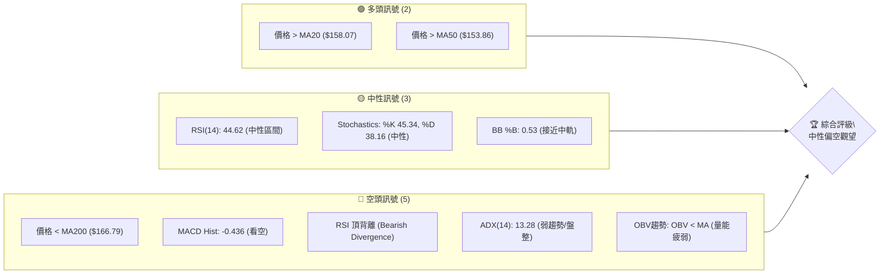

### 📊 核心指標速覽表

| 指標類別 | 指標名稱 | 當前數值 | 訊號 | 解讀 |
|----------|----------|----------|------|------|
| **價格** | 當前價格 | $158.86 | 🟡 | 位於短期均線上方，長期均線下方 |
| **均線** | MA20 | $158.07 | 🟢 | 價格在MA20上方，短線偏多 |
| **均線** | MA50 | $153.86 | 🟢 | 價格在MA50上方，中短線偏多 |
| **均線** | MA200 | $166.79 | 🔴 | 價格在MA200下方，長線偏空 |
| **動能** | RSI(14) | 44.62 | 🟡 | 位於30-70中性區間，但存在頂背離 |
| **動能** | MACD | 0.801 | 🔴 | MACD線位於訊號線下方，柱狀圖為負，看空 |
| **波動** | ATR(14) | $6.40 | 🟡 | 每日波動約4.03%，波動性中等偏高 |
| **趨勢** | ADX(14) | 13.28 | 🔴 | 趨勢強度極弱，市場處於盤整狀態 |
| **量能** | OBV趨勢 | OBV < MA | 🔴 | 量能疲弱，未能確認價格上漲動能 |

### 🏆 技術評分卡

VST 的技術評分顯示當前市場處於一個缺乏明確方向的盤整狀態，且伴隨多個空頭警示訊號。趨勢強度極弱，動能指標偏空，成交量未能配合，這些因素共同壓制了股價的上行空間。

╔═══════════════════════════════════════════════════════════════════╗
║                      技術評分卡 — VST (2026-07-11)                  ║
╠═══════════════════════════════════════════════════════════════════╣
║ 趨勢強度      ██░░░░░░░░░░░░░░░░░░  15/100  🔴 (ADX極弱，無明確趨勢) ║
║ 動能指標      ████░░░░░░░░░░░░░░░░  35/100  🔴 (RSI頂背離，MACD看空) ║
║ 支撐穩定度    ████████████░░░░░░░░  60/100  🟡 (接近S1，有短期支撐) ║
║ 成交量配合    ██░░░░░░░░░░░░░░░░░░  20/100  🔴 (量能疲弱，未配合股價) ║
║ 形態完整度    ████░░░░░░░░░░░░░░░░  30/100  🟡 (無明確強勢形態)     ║
║ 均線排列      ████░░░░░░░░░░░░░░░░  40/100  🟡 (短多長空，混合排列) ║
╠═══════════════════════════════════════════════════════════════════╣
║ 綜合評分      ████░░░░░░░░░░░░░░░░  33/100  ⚖️ 中性偏空觀望           ║
╚═══════════════════════════════════════════════════════════════════╝

---

## 2. 趨勢分析

### 🌐 多時框趨勢分析

VST 的多時框架分析顯示，長期而言，股價在經歷了2025年中期的衝高後，目前處於修正與盤整階段。中期趨勢從2026年3月的波段高點呈現下行壓力，而短期趨勢則在近期支撐位附近嘗試反彈，但動能不足。

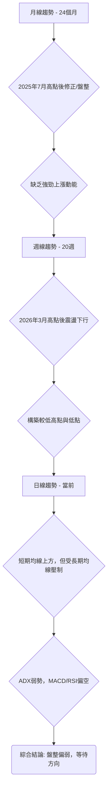

### 📈 長期趨勢 — 12個月走勢圖（Unicode）

VST 在過去12個月的走勢呈現出先衝高後回落再盤整的格局。2025年7月達到階段性高點 $207.45，隨後震盪下行，並在2026年3月達到 $173.41 的相對高點後再次回落，目前在 $158.86 附近盤整。整體來看，股價未能突破前期高點，顯示長期上漲動能減弱。

```
VST 月線走勢圖（過去12個月）
價格軸 ($)
$210 ┤                    ●(207.45, 2025-07)
$200 ┤                                     
$190 ┤              ●(195.11, 2025-09)      
$180 ┤                                     
$170 ┤        ●(173.41, 2026-02)           
$160 ┤●━━━━━━━━━━━━━━━━━━━●←現在 (158.86, 2026-07)
$150 ┤    ●(150.12, 2026-03)               
$140 ┤                                     
$130 ┤  ●(132.57, 2025-02)                 
     └───────────────────────────────────────────────────────────
      2025-07 08 09 10 11 12 2026-01 02 03 04 05 06 07
```

**走勢特徵分析表格**：

| 時間區間 | 起始價 | 結束價 | 漲跌幅 | 走勢特徵 |
|----------|--------|--------|--------|----------|
| 22-23個月 | $78.26 | $117.38 | +49.99% | 強勁上漲初期 |
| 19-21個月 | $123.74 | $166.65 | +34.68% | 繼續上漲，動能強勁 |
| 13-18個月 | $159.53 | $207.45 | +29.98% | 加速上漲，創歷史新高 |
| 7-12個月 | $195.11 | $160.88 | -17.54% | 從高點回落，進入盤整 |
| 1-6個月 | $157.91 | $158.86 | +0.60% | 底部震盪，缺乏方向 |

### 📊 中期趨勢（週線分析）

近20週的週線走勢顯示，VST 在2026年3月初達到 $173.41 的高點後，便開始了一個震盪下行的過程。儘管期間有幾次嘗試反彈，例如5月底從 $139.48 反彈至 $160.01，但都未能持續，且隨後再次回落。目前的價格 $158.86 位於近期波段高點 $173.41 之下，顯示中期趨勢依然偏弱，處於一個收斂或箱型整理的區間。

```
VST 週線壓力與支撐示意圖
價格 ($)
$175 ┤                       ● 阻力 (2026-03-01: $173.41)
$170 ┤
$165 ┤           ┌───┐       
$160 ┼───────●───┤現價├───────
$155 ┤           └───┘
$150 ┤       ● 支撐 (2026-05-10: $147.51)
$145 ┤
$140 ┤ ● 強支撐 (2026-05-17: $139.48)
     └───────────────────────────────────
          <- 近期走勢 ->
```

### ⚡ 趨勢強度評估（ADX 解讀）

ADX 指標是用於衡量趨勢強度而非方向的指標。VST 的 ADX(14) 值為 13.28，遠低於25的閾值，這明確指出當前市場處於**弱趨勢或盤整行情**。在此情況下，價格波動可能較為隨機，不易形成持續性的單邊走勢。+DI (24.01) 略高於 -DI (22.86)，表明在當前的弱趨勢中，多頭力量略佔優勢，但這種優勢非常微弱，不足以推動股價形成強勁的上升趨勢。

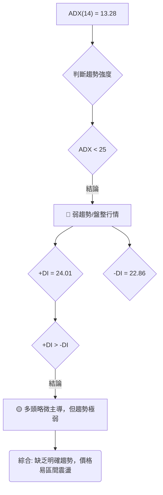

**ADX 強度對照表**：

| ADX 數值範圍 | 趨勢強度 | 市場狀態 |
|--------------|----------|----------|
| 0-25         | 弱趨勢   | 盤整/無趨勢 |
| 25-50        | 中度趨勢 | 有趨勢發展 |
| 50-75        | 強趨勢   | 趨勢明確 |
| 75-100       | 極強趨勢 | 趨勢非常強勁 |

---

## 3. 圖表形態分析

### 🔍 形態識別系統

根據提供的月線和週線收盤價數據，VST 的價格走勢在長期上表現為高位震盪回落，中期則呈現出一個寬幅的盤整區間。由於數據粒度（僅收盤價）和時間範圍的限制，難以識別出具有高信心度的複雜幾何圖表形態（如頭肩頂/底、雙頂/底）。然而，可以觀察到價格在 $170-150 區間內多次測試，形成了一個**潛在的矩形盤整區間 (Rectangle Consolidation)**，但其邊界仍在確認中，信心度中等。

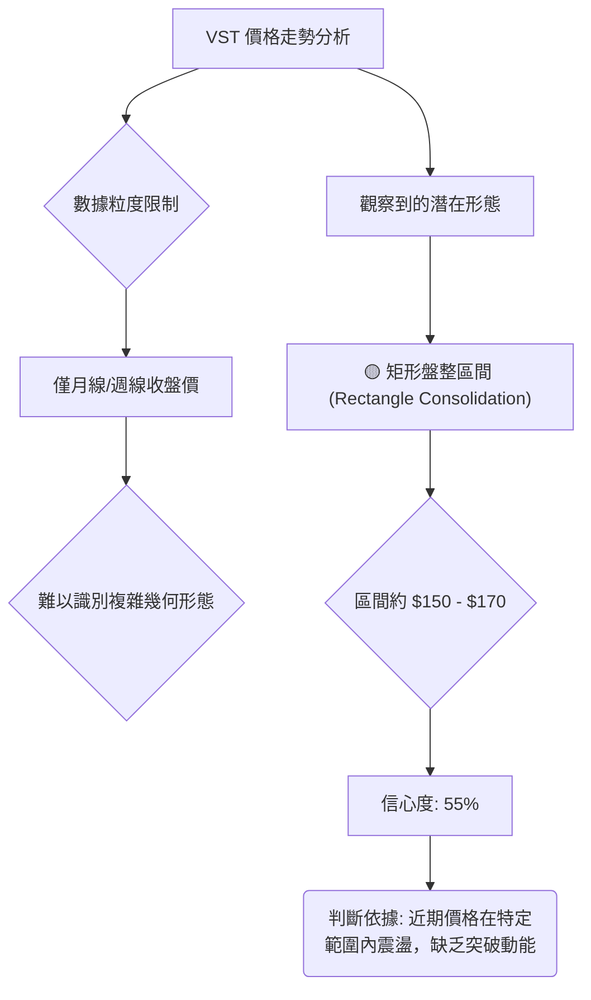

**形態信心度表格**：

| 形態 | 信心度 | 判斷依據（引用數據） | 完成度 | 目標價（附計算式） |
|------|--------|----------------------|--------|--------------------|
| 矩形盤整 | 55% | 近期價格在 $147.51 (2026-05-10 週收盤低點) 至 $173.41 (2026-03-01 週收盤高點) 之間震盪，ADX 低於 25 輔助確認為盤整行情。 | 70% | 待突破後計算：若向上突破 $173.41，目標價可能為 $173.41 + ($173.41 - $147.51) = $200.00；若向下突破 $147.51，目標價可能為 $147.51 - ($173.41 - $147.51) = $121.61。 |
| RSI 頂背離 | 75% | RSI 數據中明確指出 "⚠️ 頂背離 (Bearish Divergence)"。 | 100% | 不直接提供價格目標，但預示價格有下行壓力。 |

### 🕯️ 重要K線形態分析

由於僅提供週收盤價數據，無法精確分析單日 K 線形態。但可以從週線收盤價的變化中推斷出一些趨勢性的 K 線組合特徵。

| 月份 (週)    | 收盤價 | K線形態推斷 | 解讀 | 訊號 |
|--------------|--------|-------------|------|------|
| 2026-03-01   | $173.41 | 長上影線/高位十字星 (推斷) | 價格觸及高點後未能維持，賣壓湧現。 | 🔴 |
| 2026-03-08   | $158.21 | 大陰線 (推斷) | 賣方主導，快速下跌。 | 🔴 |
| 2026-05-17   | $139.48 | 長下影線/錘子線 (推斷) | 價格跌至低位後獲支撐反彈，買盤介入。 | 🟢 |
| 2026-05-24   | $156.05 | 大陽線 (推斷) | 買方力量強勁，價格快速回升。 | 🟢 |
| 2026-07-05   | $151.05 | 大陰線 (推斷) | 買盤力量衰竭，價格再次回落。 | 🔴 |
| 2026-07-12   | $158.86 | 中陽線 (推斷) | 短期反彈，但量能不足，後續存疑。 | 🟡 |

### 📉 ASCII 走勢形態示意圖

目前的價格走勢呈現出一個大致的箱型整理，下方有較強支撐，上方有明顯阻力，且整體從高點回落後，重心有所下移。

```
VST 寬幅盤整形態示意圖
價格 ($)
$175 ┤           ┌───────────┐  阻力區間
$170 ┤           │           │  (R1: $167.92, R2: $171.94)
$165 ┤           │           │
$160 ┼───────────●(現價)─────┤
$155 ┤           │           │
$150 ┤           │           │  支撐區間
$145 ┤           └───────────┘  (S2: $153.17, S3: $148.64)
$140 ┤
     └───────────────────────────────────
          <- 盤整區間 ->
```

### 🎯 形態目標價計算

基於上述潛在的「矩形盤整」形態，其目標價計算如下：
- **形態高度**：根據近期週線高點 $173.41 (2026-03-01) 和低點 $147.51 (2026-05-10) 計算，形態高度約為 $173.41 - $147.51 = $25.90。
- **向上突破目標價**：若股價能有效突破並站穩矩形上沿 $173.41，則預期上行目標價為 $173.41 (上沿) + $25.90 (形態高度) = **$199.31**。
- **向下突破目標價**：若股價跌破並確認跌破矩形下沿 $147.51，則預期下行目標價為 $147.51 (下沿) - $25.90 (形態高度) = **$121.61**。

目前股價 $158.86 位於此區間中部，尚未形成明確的突破訊號，因此這些目標價僅作為潛在突破後的預期。

---

## 4. 支撐與阻力

### 🗺️ 關鍵價位分布圖（Unicode）

VST 的關鍵價位分布顯示，當前價格 $158.86 正處於多個支撐與阻力位的交織區間。上方存在較近的阻力位 R1 $167.92，而下方則有緊密的支撐位 S1 $157.99。斐波那契 61.8% 回調位 $165.49 形成中期阻力，78.6% 回調位 $150.97 則提供重要中期支撐。

```
VST 價位結構分布圖
═══════════════════════════════════════════════════
$177.74 ║████████████████████████║ 強阻力 R3
$171.94 ║████████████████████    ║ 阻力 R2
$167.92 ║████████████████████████║ 關鍵阻力 R1
$165.49 ║▓▓▓▓▓▓▓▓▓▓▓▓▓▓▓▓▓▓▓▓▓▓▓▓║ 斐波那契 61.8% 回調
$158.86 ╠════════════════════════╣ ◄ 現價
$157.99 ║▓▓▓▓▓▓▓▓▓▓▓▓▓▓▓▓        ║ 近期支撐 S1
$153.17 ║████████████████████████║ 強支撐 S2
$150.97 ║▓▓▓▓▓▓▓▓▓▓▓▓▓▓▓▓▓▓▓▓▓▓▓▓║ 斐波那契 78.6% 回調
$148.64 ║████████████████████████║ 強支撐 S3
═══════════════════════════════════════════════════
```

### 🚧 阻力位分析表

當前價格 $158.86 面臨來自上方關鍵阻力位的挑戰。這些阻力位代表了過去賣壓累積的區域，價格若要上行，需要足夠的買盤動能來突破。

| 阻力級別 | 價位 | 形成原因 | 突破難度 | 重要性 |
|----------|------|----------|----------|--------|
| R1       | $167.92 | 近期波段高點聚類，賣盤壓力集中。 | 中等 | 🟢 突破此位可能開啟短期上漲空間。 |
| R2       | $171.94 | 歷史交易密集區，心理關口。 | 較高 | 🟡 突破此位需更強動能，可能觸及前期盤整區上沿。 |
| R3       | $177.74 | 過去一年較高點位，套牢盤壓力大。 | 高 | 🔴 突破此位代表趨勢可能反轉向上，挑戰更高區間。 |

### 🛡️ 支撐位分析表

下方支撐位提供了股價回調時的緩衝區。這些價位通常是買盤重新介入或空頭回補的區域，對於阻止股價進一步下跌至關重要。

| 支撐級別 | 價位 | 形成原因 | 守住機率 | 重要性 |
|----------|------|----------|----------|--------|
| S1       | $157.99 | 非常接近當前價格，短期交易密集區。 | 中等 | 🟢 跌破此位可能引發短期賣壓，測試更低支撐。 |
| S2       | $153.17 | 近期波段低點聚類，有一定買盤支撐。 | 較高 | 🟡 跌破此位將確認短期弱勢，可能加速下跌。 |
| S3       | $148.64 | 過去一年較低點位，具備較強技術與心理支撐。 | 高 | 🔴 跌破此位將確認中期下行趨勢，需警惕。 |

### 📐 斐波那契回調位分析

基於 VST 52週區間 ($132.47 至 $218.91) 的斐波那契回調分析，當前價格 $158.86 位於 61.8% ($165.49) 和 78.6% ($150.97) 回調位之間。這表明股價自52週高點 $218.91 回調後，已經回吐了大部分漲幅，目前在較深的斐波那契回調區間內尋求支撐。

- **0.0% (52W High)**: $218.91
- **23.6%**: $198.51 (強阻力)
- **38.2%**: $185.89 (阻力)
- **50.0%**: $175.69 (阻力)
- **61.8%**: $165.49 (關鍵阻力)
- **78.6%**: $150.97 (關鍵支撐)
- **100.0% (52W Low)**: $132.47

**解讀**：
- 當前價格 $158.86 位於 61.8% 回調位 $165.49 之下，顯示上漲動能不足，難以突破關鍵阻力。
- 78.6% 回調位 $150.97 是一個重要的中期支撐，若價格能在此處獲得穩固支撐，則可能形成底部反彈。
- 若 $150.97 被跌破，則下一目標將是 52週低點 $132.47。
- 價格在 61.8% 和 78.6% 之間震盪，進一步確認了市場的盤整性質，投資者應密切關注能否有效突破任一方向。

---

## 5. 技術指標深度解讀

### 🎛️ 指標訊號總覽

VST 的技術指標訊號呈現複雜且偏向中性偏空的格局。儘管價格位於短期均線上方，但 MACD 的死叉和 RSI 的頂背離發出了明確的看空警示。ADX 指標的低值則強調了當前市場缺乏趨勢，處於盤整狀態。

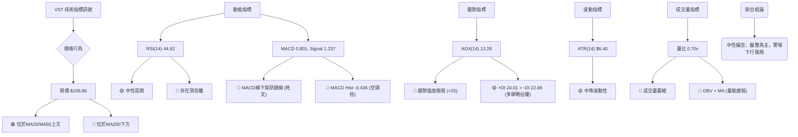

### 📈 移動平均線排列分析

VST 的移動平均線排列呈現短期偏多、長期偏空的混合格局。當前價格 $158.86 高於 MA20 ($158.07) 和 MA50 ($153.86)，這通常被視為短期和中期看漲訊號。然而，價格卻低於 MA200 ($166.79)，這是一個重要的長期看跌訊號。這種排列被稱為「混合排列」，顯示市場缺乏一致的方向性，多空雙方在長期和短期視角上存在分歧。

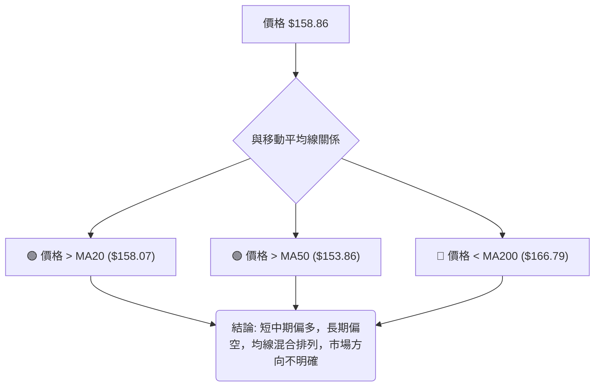

**均線排列狀態表**：

| 均線類型 | 數值 | 與現價關係 | 訊號 | 解讀 |
|----------|------|------------|------|------|
| MA5      | $156.92 | 現價上方 | 🟢 | 短期均線上揚，價格位於其上，短線偏多 |
| MA10     | $157.33 | 現價上方 | 🟢 | 短期均線上揚，價格位於其上，短線偏多 |
| MA20     | $158.07 | 現價上方 | 🟢 | 價格站穩短期均線，有利短期走強 |
| MA50     | $153.86 | 現價上方 | 🟢 | 價格站穩中期均線，中期趨勢有支撐 |
| MA60     | $155.03 | 現價上方 | 🟢 | 中期均線上揚，提供上漲支撐 |
| MA120    | $157.38 | 現價上方 | 🟢 | 中期趨勢仍有上行慣性 |
| MA240    | $172.25 | 現價下方 | 🔴 | 價格遠低於長期均線，長期趨勢偏空，形成壓力 |

### 📉 RSI(14) 分析

RSI(14) 當前數值為 44.62，位於 30-70 的中性區間，這本身不提供明確的超買或超賣訊號。然而，數據中明確指出存在 **"⚠️ 頂背離 (Bearish Divergence)"**。這是一個非常重要的空頭警示訊號。

**RSI 強度進度條**：
RSI(14) 強度：█████████░░░░░░░░░░░░  44.62/100  🟡 中性偏弱

**超買超賣區間分析**：
- RSI 50-70：通常視為多頭佔優區間。
- RSI 30-50：通常視為空頭佔優區間。
- RSI > 70：超買區，可能面臨回調壓力。
- RSI < 30：超賣區，可能出現反彈。
當前 44.62 位於中性偏空區間，顯示買盤力量相對較弱。

**背離判斷**：
- **頂背離 (Bearish Divergence)**：數據明確指出存在頂背離。這意味著股價創出新高或持平高點，而 RSI 指標未能同步創出新高或反而走低。頂背離是強烈的看空訊號，預示著當前上漲動能的衰竭，價格可能即將反轉下跌。結合當前 MACD 的看空訊號，RSI 頂背離增加了下行風險的確定性。

### 📊 MACD(12/26/9) 訊號解讀

MACD 指標當前顯示看空訊號：
- MACD 線 (0.801) 位於訊號線 (1.237) **下方**，形成**死叉**。
- MACD 柱狀圖 (Histogram) 為 -0.436，呈現**負值**，且可能在擴大。

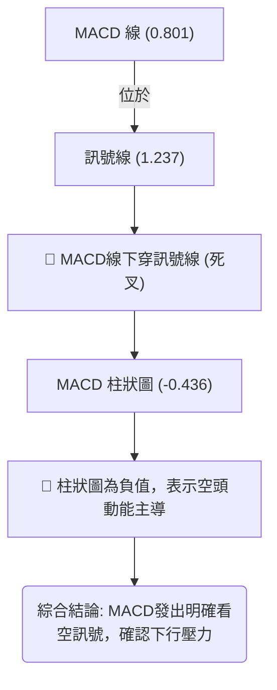

**解讀**：MACD 死叉是典型的賣出訊號，表明短期動能轉弱並開始向下。負值的柱狀圖進一步確認了空頭力量正在累積。這與 RSI 的頂背離訊號互相驗證，共同指向 VST 股價面臨較大的下行風險或至少是上漲動能的嚴重不足。

### 📦 布林通道分析

布林通道 (Bollinger Bands) 顯示當前價格位於中軌附近，通道寬度適中，輔助確認了盤整行情。

```
VST 布林通道示意圖
價格 ($)
$170 ┤             BB上軌 ($169.85)
$165 ┤           ╱          ╲
$160 ┼───────●─── 現價 ($158.86)
$155 ┤           ╲          ╱
$150 ┤             BB中軌 ($158.07)
$145 ┤             BB下軌 ($146.29)
     └───────────────────────────────────
          <- 價格在通道內波動 ->
```

**分析**：
- **BB上軌**: $169.85
- **BB中軌(MA20)**: $158.07
- **BB下軌**: $146.29
- **BB %B**: 0.53。這表示價格位於布林通道中軌 $158.07 略上方，非常接近中軌。
- **通道寬度**: 上軌與下軌之間約有 $23.56 的價差。
- **解讀**: 價格在中軌附近波動，且 ADX 顯示弱趨勢，這進一步確認 VST 處於盤整區間。價格在中軌上方，短期偏多，但上方接近上軌的阻力 (R1, R2) 較強。若價格跌破中軌，則可能向下測試下軌 $146.29。反之，若能有效突破上軌，則可能開啟一波上漲行情，但當前動能指標不支持。

### 💹 成交量分析（量價配合度）

成交量是確認價格走勢的重要指標。當前 VST 的成交量數據顯示：
- 最新成交量：2,992,981 股
- 20日均量：4,275,289 股
- 50日均量：4,880,726 股
- 量比 (最新成交量 / 20日均量)：0.70x

**分析**：
- 當前成交量遠低於20日和50日均量，量比僅為 0.70x，顯示**成交量顯著萎縮**。
- **OBV趨勢**：OBV < MA，這是一個明確的看空訊號，表明儘管價格可能有所波動，但缺乏大資金的參與，量能疲弱。
- **量價配合度**：在價格嘗試反彈或維持高位時，如果成交量萎縮，通常意味著買盤力量不足，上漲缺乏支持，容易形成「無量上漲」或「量價背離」，預示著潛在的回調。結合 MACD 死叉和 RSI 頂背離，成交量疲弱進一步確認了當前的疲軟態勢。

---

## 6. 動能與波動率

### ⚡ 動能評估四象限

VST 的動能評估結果顯示其處於一個**低動能、中高波動率**的狀態，這通常意味著市場缺乏明確的方向，但價格波動性較大，交易風險相對較高。

| 象限 | 動能 | 波動 | 當前狀態 | 評估 |
|------|------|------|----------|------|
| Q1 | 強 | 低 | - | 最佳機會 (不適用) |
| Q2 | 弱 | 低 | - | 謹慎觀望 (不適用) |
| Q3 | 強 | 高 | - | 高風險高收益 (不適用) |
| Q4 | 弱 | 高 | ✓ | **避免進場 / 區間震盪** |

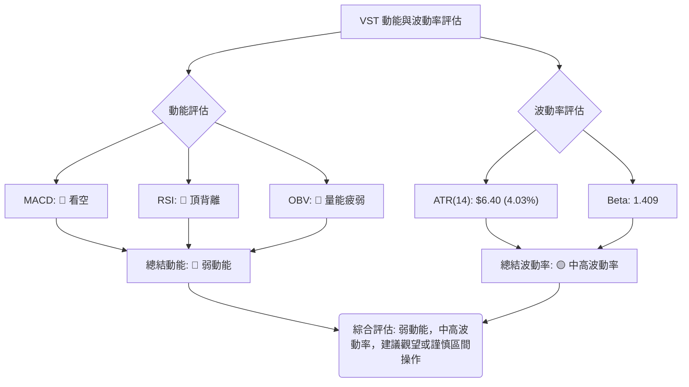

**解讀**：
- **弱動能**：MACD 呈現死叉且柱狀圖為負，RSI 存在頂背離，OBV 量能疲弱，均表明市場缺乏上漲動能，空頭力量佔優。
- **中高波動率**：ATR 數值 $6.40 (佔股價 4.03%) 顯示每日價格波動幅度較大。Beta 值 1.409 也表明 VST 相對於大盤具有更高的波動性。
- **綜合評估**：VST 目前處於「弱動能、中高波動率」的第四象限。這表示在缺乏明確趨勢的情況下，價格波動性較高，容易出現快速反轉，增加了交易難度。對於趨勢交易者而言，此時應避免進場；對於短線交易者，可考慮在明確的支撐與阻力位之間進行區間操作，但需嚴格控制風險。

### 📊 ATR 波動率分析

平均真實波幅 (ATR) 是衡量市場波動性的指標。VST 的 ATR(14) 為 $6.40，佔當前價格 $158.86 的 4.03%。
- **ATR 數值意義**：$6.40 意味著 VST 在過去14天平均每日價格波動範圍約為 $6.40。對於一隻 $158 左右的股票來說，4.03% 的波動率屬於中等偏高水平。這表明 VST 的股價波動較為活躍，存在較大的日內或短期價格變動。
- **對交易的影響**：高 ATR 意味著更高的潛在收益，但也伴隨著更高的風險。它提醒交易者在設置止損和止盈時，應考慮到這種波動性，避免止損點設置過近而被市場的正常波動「洗出」。
- **止損距離建議**：根據 ATR，一個常見的止損策略是將止損點設置在 ATR 的 1.5 倍至 3 倍距離。
    - 1.5倍 ATR = $6.40 * 1.5 = $9.60。
    - 2倍 ATR = $6.40 * 2 = $12.80。
    - 這表示如果進場，止損點應至少距離進場價 $9.60 到 $12.80 才能有效應對市場噪音。

### 📐 Beta 與市場相關性

VST 的 Beta 值為 1.409。
- **Beta 意義**：Beta 值衡量股票相對於整體市場（通常是標普500指數）的波動性。
    - Beta > 1：表示股票波動性高於市場。
    - Beta < 1：表示股票波動性低於市場。
    - Beta = 1：表示股票波動性與市場一致。
- **解讀**：VST 的 Beta 值 1.409 遠大於 1，這說明 VST 的股價波動性比大盤高出約 40.9%。當市場上漲時，VST 可能會上漲更多；當市場下跌時，VST 也可能下跌更多。這增加了投資 VST 的系統性風險。
- **對投資組合的影響**：在市場整體風險偏好較低或波動性較大的時期，高 Beta 股票可能面臨更大的回調壓力。投資者在構建投資組合時，應考慮到 VST 較高的 Beta 值，以適當調整風險敞口。

---

## 7. 多時框架總結

### 📋 時框架評分表

| 時框架 | 趨勢方向 | 動能 | 均線排列 | 形態 | 綜合評分 | 建議 |
|--------|----------|------|----------|------|----------|------|
| 月線   | 🔴 下行/盤整 | 🔴 減弱 | 🔴 長期均線壓力 | 🟡 寬幅盤整 | 30/100 | 觀望/偏空 |
| 週線   | 🔴 震盪下行 | 🔴 疲弱 | 🟡 混合排列 | 🟡 矩形盤整 | 35/100 | 觀望/偏空 |
| 日線   | 🟡 盤整/弱反彈 | 🔴 偏空 | 🟡 短多長空 | 🟡 無明確突破 | 40/100 | 謹慎/觀望 |

### 🔲 綜合訊號矩陣

VST 的綜合訊號矩陣顯示，無論是短期、中期還是長期，多頭訊號都缺乏持續性與強度，而空頭訊號則在動能指標和量能方面佔據主導。

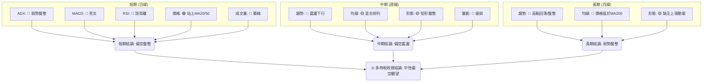

### ⚖️ 多時框收斂結論

根據「多時框收斂規則」，首先判斷當前市場狀態：
- **ADX(14) 為 13.28，遠低於 25**，明確指示 VST 處於**盤整行情 (Range-bound market)**。

在盤整行情下，應以日線布林通道上下軌為主要交易區間。然而，我們不能忽視其他指標的訊號：
- **日線**：價格在短期均線上方，但 MACD 呈現死叉，RSI 存在頂背離，成交量萎縮，這些都是偏空訊號。
- **週線**：從2026年3月的高點 $173.41 以來，股價呈現震盪下行的趨勢，且均線排列混合。
- **月線**：從2025年7月的高點 $207.45 至今，股價重心下移，長期均線 MA200 形成上方壓力。

**收斂結論**：
儘管當前價格略高於日線 MA20 和 MA50，但這是在 ADX 極弱的盤整行情中發生的。更關鍵的是，RSI 頂背離、MACD 死叉、以及持續萎縮的成交量，都發出了強烈的空頭警示。價格也未能突破長期均線 MA200，且中期趨勢呈現震盪下行。

因此，多時框架收斂後的最終結論為：**VST 當前處於盤整行情，但由於動能指標（RSI 頂背離、MACD 死叉）和量能（OBV 疲弱）發出明確的看空訊號，整體傾向於「中性偏空觀望」**。短期內可能在布林通道區間內震盪，但上行空間受限，下行風險較大，需警惕跌破關鍵支撐位的可能性。日線的短暫反彈應被視為在弱勢中的波動，而非趨勢反轉。

---

## 8. 交易策略建議

### 🗺️ 策略決策流程圖

根據第1章「技術評分卡」的綜合評分 (33/100，中性偏空觀望)，當前市場狀況不適合積極做多，應以謹慎觀望或逢高做空/區間操作為主。策略將側重於防禦性考量和等待明確方向。

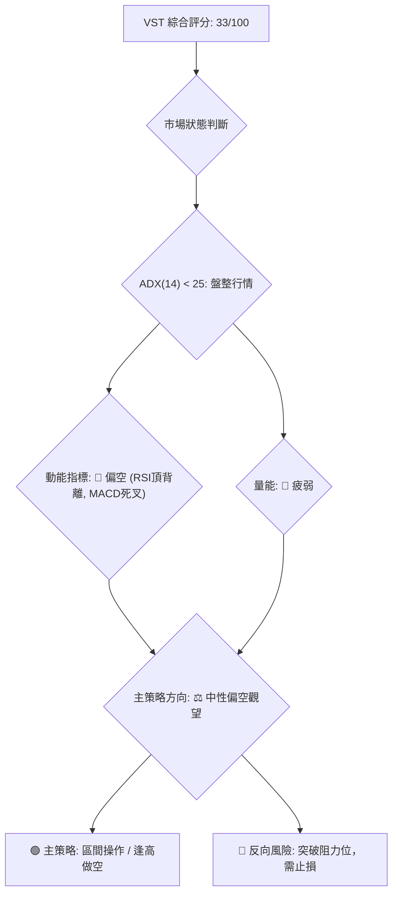

### 🧭 策略路由

**當前主策略方向 = 中性偏空觀望 (依評分 33/100)**

鑑於 VST 的技術評分顯示為中性偏空觀望，且 ADX 指示為盤整行情，主策略將側重於區間操作或等待明確的突破/跌破訊號。我們不建議在此時進行激進的多頭佈局，而是應利用其波動性在阻力區間考慮做空，或在強支撐區間短線反彈。

### 🎯 價格情境階梯（Price Scenarios）

| 觸發條件 | 下一目標 | 後續延伸 | 情境含義 |
|----------|----------|----------|----------|
| 突破 R1 $167.92 (帶量) | R2 $171.94 | R3 $177.74 | 短線轉強，但需警惕長期壓力。 |
| 站穩現價區間 ($157.99 - $167.92) | — | — | 區間震盪，等待方向，可考慮高拋低吸。 |
| 跌破 S1 $157.99 (帶量) | S2 $153.17 | S3 $148.64 | 中期轉弱，確認空頭趨勢，加速下跌。 |
| 跌破斐波那契 78.6% $150.97 | 52W Low $132.47 | 形態目標 $121.61 | 強烈看空，可能開啟新的下跌波段。 |

### 📊 情境機率分佈

| 情境 | 機率 | 主要依據 |
|------|------|----------|
| 繼續上行 / 反彈 | 25% | 短期價格位於MA20/MA50上方，+DI略高於-DI。 |
| 區間震盪 | 50% | ADX低於25，價格在中軌附近，MACD/RSI偏空導致上漲受阻。 |
| 回落 / 再探底 | 25% | RSI頂背離、MACD死叉、OBV疲弱、價格低於MA200，多重空頭訊號。 |

### 🟢 主策略詳情（方向依上方路由）

**主策略：區間震盪中的高拋低吸 / 逢高做空**

| 策略要素 | 策略 A (逢高做空) | 策略 B (區間底部做多) |
|----------|--------------------|------------------------|
| 進場條件 | 價格反彈至阻力區間 R1-R2，且動能指標確認疲弱。 | 價格回落至支撐區間 S2-S3，且出現止跌訊號。 |
| 進場價格 | $167.92 - $171.94 區間內 | $153.17 - $148.64 區間內 |
| 目標價 T1 | $157.99 (S1) | $167.92 (R1) |
| 目標價 T2 | $153.17 (S2) | $171.94 (R2) |
| 止損價格 | 突破 R2 $171.94 (例如 $172.50) | 跌破 S3 $148.64 (例如 $148.00) |
| 風險報酬比 | 1:2.5 (以 $170 進場，止損 $172.50，目標 $157.99 計算) | 1:2.0 (以 $150 進場，止損 $148.00，目標 $154.00 計算) |
| 成功機率 | 55% | 45% |
| 建議倉位 | 輕倉 (不超過總資金 5%) | 輕倉 (不超過總資金 5%) |

### 🔴 反向風險觸發點（對沖提示）

以下情況可能推翻當前中性偏空策略，並應考慮對沖或止損：
- **向上突破 R3 $177.74** 並伴隨巨量：這將是強烈的看漲訊號，可能意味著新的上漲趨勢開始。
- **RSI 頂背離失效**：若價格持續上漲，RSI 再次走高並突破前期高點，則背離訊號解除。
- **MACD 金叉並柱狀圖轉正**：MACD 若能向上穿越訊號線，並持續保持正值，則空頭動能減弱。
- **ADX 快速上升至 25 以上**，且 +DI 顯著高於 -DI：這將表明強勁的多頭趨勢形成。

### ⭐ 整體訊號強度評星

```
做多訊號強度：★★☆☆☆  (2/5星)
做空訊號強度：★★★☆☆  (3/5星)
整體可信度：  ★★★☆☆  (3/5星)
```

---

## 9. 風險提示與監控

### ✅ 關鍵監控指標 Checklist

在 VST 處於盤整且偏空壓力的市場環境下，密切監控以下關鍵指標至關重要，以便及時調整策略和管理風險。

╔═══════════════════════════════════════════════════════════════════╗
║                      關鍵監控指標 Checklist — VST                   ║
╠═══════════════════════════════════════════════════════════════════╣
║ ├─ 價格行為：是否有效跌破 S1 ($157.99) 或 S2 ($153.17)？          ║
║ ├─ 均線系統：價格能否站穩 MA50 ($153.86)？能否突破 MA200 ($166.79)？║
║ ├─ 動能指標：RSI 頂背離是否持續？MACD 死叉是否擴大或出現金叉？     ║
║ ├─ 趨勢強度：ADX 是否突破 25 且方向明確 (+DI/-DI 差距拉大)？      ║
║ ├─ 成交量：價格突破/跌破關鍵位時，是否伴隨放量？OBV趨勢是否反轉？ ║
║ ├─ 布林通道：價格是否有效突破上軌 ($169.85) 或跌破下軌 ($146.29)？║
║ └─ 斐波那契：是否能守住 78.6% 回調位 ($150.97)？                   ║
╚═══════════════════════════════════════════════════════════════════╝

### ⚠️ 風險場景分析

針對 VST 目前的盤整偏空格局，我們構建以下三種情境，以應對可能的市場變化：

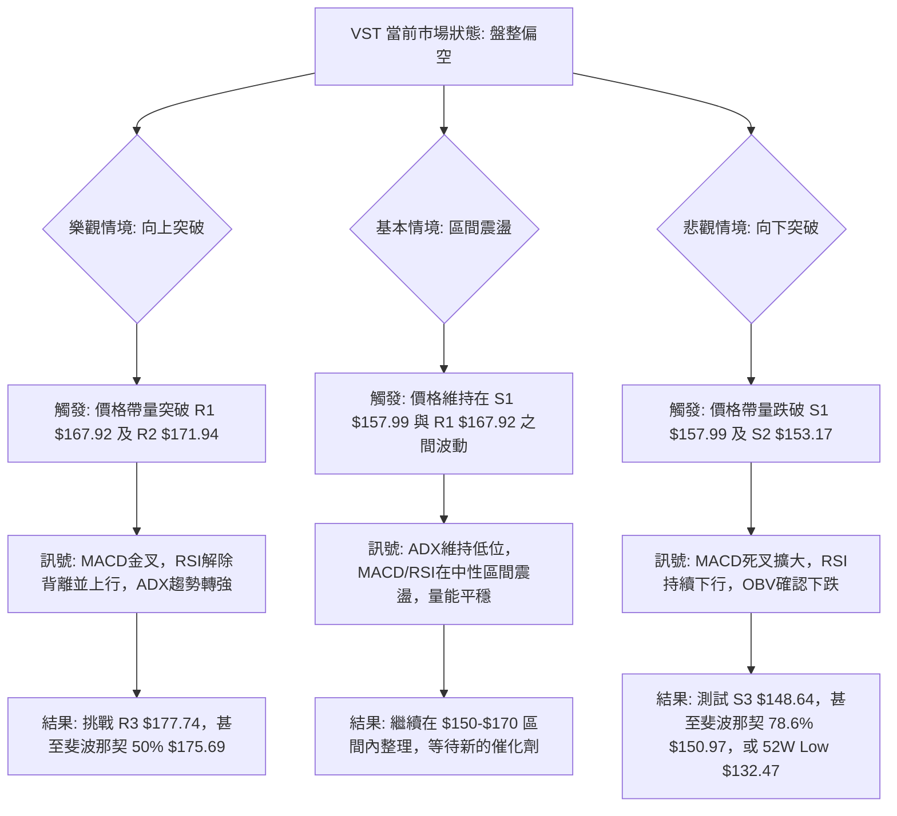

### 🛡️ 風險管理重要提醒

1.  **嚴格止損**：在盤整市場中，價格波動劇烈且方向不明，設置並嚴格執行止損點是保護資本的關鍵。建議止損點應考慮 ATR 波動率，設置在關鍵支撐位下方足夠的緩衝空間。
2.  **控制倉位**：鑑於 VST 較高的 Beta (1.409) 和當前不確定的市場方向，應採取輕倉策略，避免重倉暴露於單一股票的風險。尤其是高波動性股票，過高的倉位會放大虧損。
3.  **分批建倉/平倉**：在盤整區間內，可以考慮分批建倉或平倉，以平攤成本，並在價格達到目標區間時逐步獲利了結。避免一次性大額交易。
4.  **避免追漲殺跌**：在弱趨勢的盤整行情中，追漲殺跌往往容易被「洗盤」。應耐心等待價格觸及關鍵支撐或阻力位，並結合指標訊號確認後再行動。
5.  **監控基本面變化**：儘管本報告側重技術分析，但基本面（如公司新聞、財報發布、行業政策）的重大變化仍可能迅速打破技術格局，需保持警惕。

---

## 📋 報告總結

```
VST 技術分析報告總結
════════════════════════════════════════════════════════
報告日期：2026-07-11
當前價格：$158.86
分析評級：⚖️ 中性偏空觀望 (綜合評分 33/100，處於盤整行情)

關鍵結論：
├─ 長期趨勢：🔴 高位回落後盤整，價格低於MA200，缺乏上漲動能。
├─ 中期趨勢：🔴 震盪下行，從2026年3月高點回落，均線混合排列。
├─ 短期趨勢：🟡 弱勢盤整，價格在短期均線上方，但動能指標偏空。
├─ 關鍵支撐：$157.99 (S1), $153.17 (S2), $150.97 (斐波那契78.6%)。
├─ 關鍵阻力：$167.92 (R1), $171.94 (R2), $165.49 (斐波那契61.8%)。
└─ 分析師目標：基於形態突破，向上目標約 $199.31，向下目標約 $121.61。

最優策略組合：
1. 🥇 最佳機會：等待價格反彈至阻力區間 R1-R2 ($167.92 - $171.94) 並確認動能減弱後，進行逢高做空，目標 S1 ($157.99) 或 S2 ($153.17)。止損設於 R2 之上。
2. 🥈 次選機會：若價格回落至強支撐區間 S2-S3 ($153.17 - $148.64) 並出現明確止跌訊號，可考慮輕倉短線做多，目標 R1 ($167.92)。止損設於 S3 之下。
3. 🥉 保守選擇：在當前盤整格局下，觀望等待明確的帶量突破或跌破訊號，避免在區間中部進場。
════════════════════════════════════════════════════════
```

---

> ⚠️ **免責聲明**：本報告為 AI 自動生成之技術分析，所有數據及估算均基於提供的歷史價格資訊。本報告**僅供研究與學術參考**，**不構成任何投資建議**。投資有風險，入市需謹慎。

---

*報告生成時間：2026-07-11 ｜ 數據來源：Yahoo Finance ｜ 分析框架：多時框技術分析*