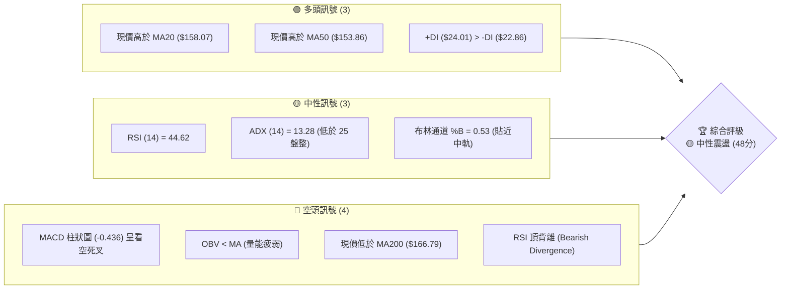
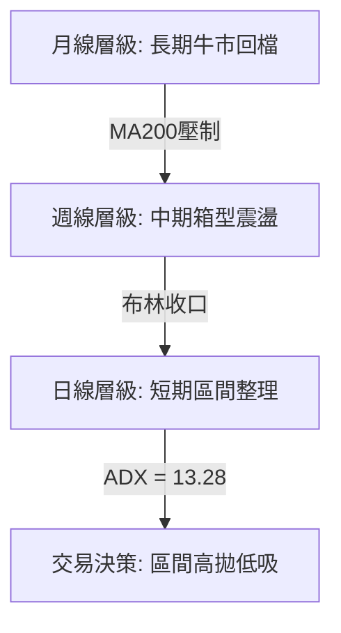
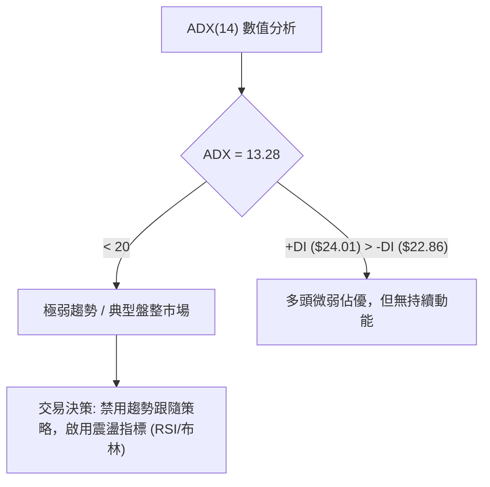
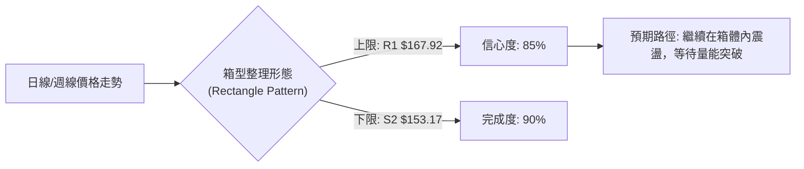
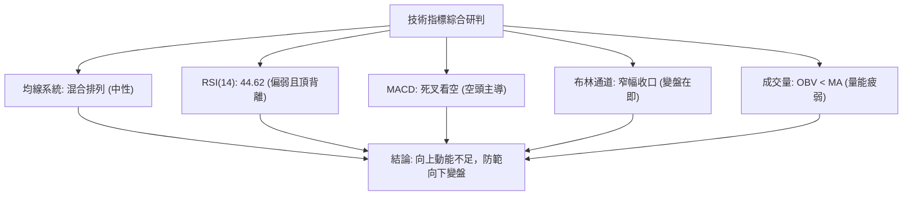
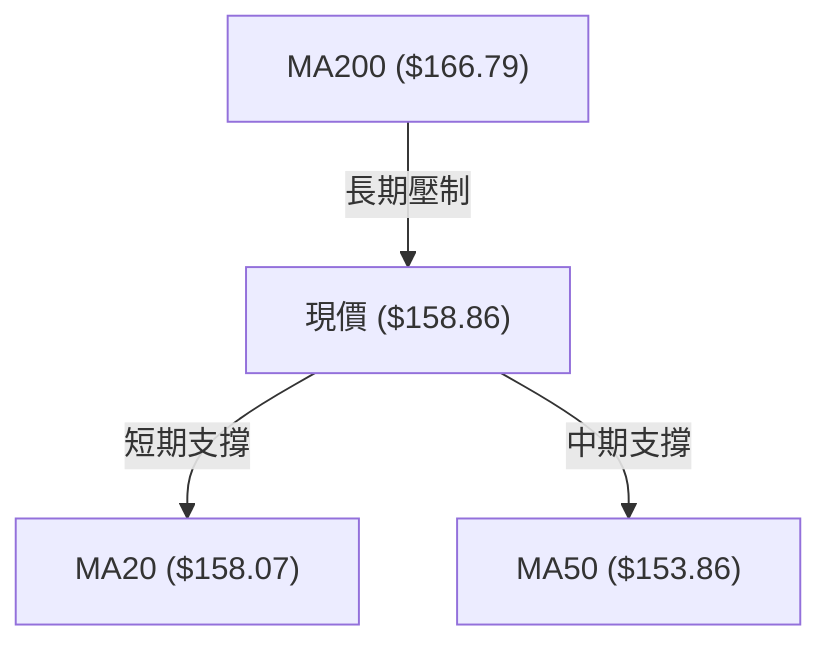
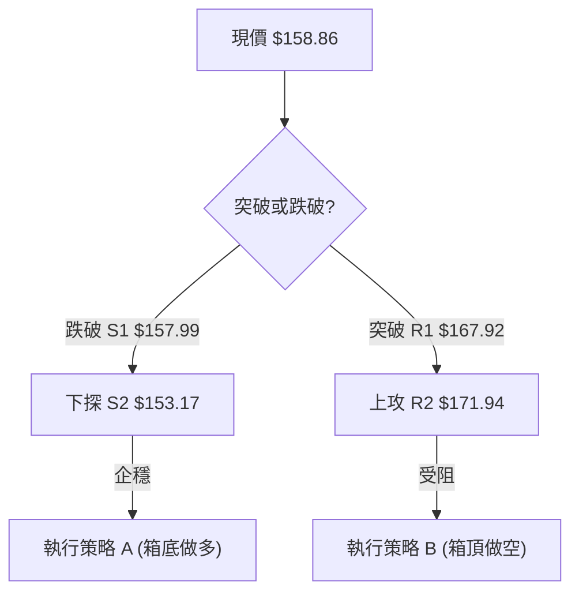
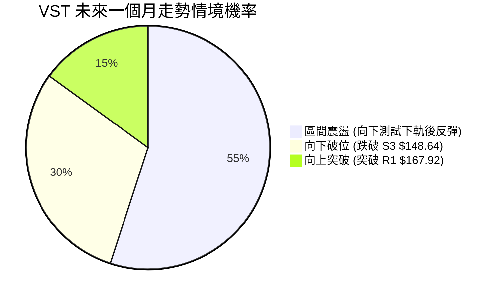
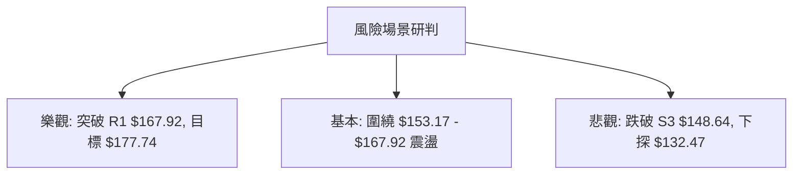

<details>
<summary>📊 靜態圖表 (點擊展開)</summary>

</details>

<html>
<head><meta charset="utf-8" /></head>
<body>
    <div style="height:500px; width:100%;">                        <script>window.PlotlyConfig = {MathJaxConfig: 'local'};</script>
        <script charset="utf-8" src="https://cdn.plot.ly/plotly-3.7.0.min.js" integrity="sha256-jvTGqxNp8AGWEcvNLVuKr+8j5dGe9Yw51LQkmDH+IYA=" crossorigin="anonymous"></script>                <div id="candlestick-chart" class="plotly-graph-div" style="height:100%; width:100%;"></div>            <script>                window.PLOTLYENV=window.PLOTLYENV || {};                                if (document.getElementById("candlestick-chart")) {                    Plotly.newPlot(                        "candlestick-chart",                        [{"close":{"dtype":"f8","bdata":"AAAAIJNsaUAAAACAGidpQAAAAAAVGWlAAAAAAIrLaUAAAACAz6NoQAAAAEBwY2hAAAAAoJMVaUAAAACg5zlpQAAAAIDfJGlAAAAA4IXyaEAAAAAAWdloQAAAAAAwtmlAAAAAYCEkakAAAADgZIFoQAAAAEDKFWpAAAAAwAuVaUAAAACgNz9qQAAAAGDgMGpAAAAAYHoQaUAAAADg5i1oQAAAAODiN2dAAAAA4OUhZ0AAAABAcdJnQAAAAEBNFGlAAAAAgCbPaEAAAAAAlrlnQAAAAEBh0WhAAAAAAIudZ0AAAABAnHBnQAAAACCpB2hAAAAAoAcfZ0AAAABgWJNnQAAAAIBW+2ZAAAAA4KbGZ0AAAADg+G9nQAAAAOBXTWZAAAAAQPswZkAAAADAJltlQAAAAIDlvmVAAAAAYMbIZUAAAADASrZlQAAAAIC0TGZAAAAAQDeiZUAAAACAgfxkQAAAAIA8zWVAAAAAADVEZUAAAADgIgJmQAAAAGDIQ2ZAAAAAYG+dZUAAAABAs3plQAAAAOAEXmVAAAAAoN\u002fqZUAAAAAAQc9kQAAAAEDLrWRAAAAAAAyEZEAAAAAAhY9kQAAAAEAHvGVAAAAAAKAsZUAAAADAq\u002fFkQAAAAIBhl2VAAAAAQM\u002fpY0AAAAAAY69kQAAAAOBSS2RAAAAAAPojZEAAAADgKidkQAAAACBsMGRAAAAA4ConZEAAAADAlyxkQAAAAMB7RWRAAAAAQFEcZEAAAADgxZhkQAAAAEBgT2RAAAAAYP4hZUAAAABAjUVjQAAAAMDnxWJAAAAAACe9ZEAAAAAAU4NlQAAAAIBOXmVAAAAAgB8QZUAAAACA2nVmQAAAAAB+xGRAAAAAoBOMY0AAAABgg\u002fJjQAAAAABd\u002fWNAAAAAQLT1Y0AAAABg5stjQAAAAKDReWRAAAAAYNulZEAAAAAgNURkQAAAAIA4vWNAAAAAgLM6Y0AAAABAfhJjQAAAAOAOxGFAAAAAIJzVYUAAAACglqdiQAAAACCJEWNAAAAAQBzlY0AAAABgqfZjQAAAACDNVGRAAAAAYIpgZUAAAABgbaZlQAAAAKAuQ2VAAAAAgMWAZUAAAAAAq11lQAAAAEDJ6mRAAAAAYLBkZUAAAAAACtxlQAAAAGChCmZAAAAA4CCtZUAAAADABrFkQAAAAOAfKGRAAAAAIBldZEAAAACABd5kQAAAAEDLxmNAAAAAIGVlZEAAAABASX5kQAAAAKAR12NAAAAA4HjkY0AAAAAAXtBjQAAAACBhMWRAAAAAgA18ZEAAAABA0jRlQAAAAIAQ3WRAAAAAABs6YkAAAACAguJiQAAAAKA0EGNAAAAAIIrpYkAAAADgyAJjQAAAAABnaGNAAAAAYK1qYkAAAAAg1cNiQAAAAKDUN2NAAAAAoP7eYkAAAACgGOxiQAAAAODhLmNAAAAAAIF1Y0AAAAAgKhFjQAAAAIBvUGNAAAAAAFK\u002fY0AAAADAs3dkQAAAAODJVmRAAAAAYI2pZEAAAADAZ2dkQAAAAOAO7GNAAAAAIDBWY0AAAADgTnJjQAAAAGAulGNAAAAAgNiDZEAAAAAAG8tkQAAAAEChHGRAAAAAwGUyY0AAAAAA0bNjQAAAAOACYmNAAAAAgAAUZEAAAACg+wRkQAAAAEAywmNAAAAAwII3Y0AAAAAAbnBiQAAAAMDL+mJAAAAAgERVYkAAAABgI81hQAAAACBztmFAAAAAYIJvYUAAAABg4RFhQAAAACCx0GBAAAAAYI75YUAAAACA45tiQAAAAKClgWNAAAAAQI6KZEAAAAAgov1jQAAAAKDJAWRAAAAAgDAAZEAAAADgZFFjQAAAAID4t2NAAAAAoLcyY0AAAACghS9jQAAAAKCpkWJAAAAA4DlWYkAAAAAgf0BiQAAAAIAUS2FAAAAAIJxFYkAAAAAgBHpiQAAAACDFKWNAAAAAIGzMY0AAAADAc9NjQAAAACCscGRAAAAA4FHoZEAAAADgekxkQAAAAADXW2RAAAAA4KP4ZEAAAAAgrm9kQAAAAAApTGRAAAAAACnUY0AAAADAHiVjQAAAAKCZ4WJAAAAAQAqnY0AAAAAgXHdjQAAAAIA9WmNAAAAAIFy\u002fY0AAAAAghdtjQA=="},"high":{"dtype":"f8","bdata":"ipOXPT58akCxK\u002fSonqppQOkgeS42bWlAFiOzPHbUaUAGNVE\u002fk8hpQP+ABAVk9WhAwDtzDpCCaUCEvlAIy4RpQPd0oNCAKmpAMrGrIiriaUD1fv8rq19pQMycKHYZuGlAKdeqhTpGakClX6fNp29qQA4nDmmJImpAJ1s8pnv\u002faUBIev32cuRqQAnTrz1jBmtAg+LPKrklakAdPOAxupRpQEGExjLFE2hALxsz0NmWZ0Dy1AZt5OxnQMOSPv4wJWlA8TD6fhdaaUDGmf7E5I9oQGEx\u002fSq4\u002fGhAwZAindq\u002faEBSH8iO4QJoQMQ5LfQsTGhAcafuRETWZ0BuaPPvp\u002fVnQMrTk5y9imdAxHK3swrJZ0D8LrFHe39oQDjBKVQjZWdAq\u002fO1DoqRZkBbBEovGidmQJbUfJgcaGZAM5PPrtBYZkBtSmXT5BVmQKzhV3Hpl2ZA5aFlpiiQZ0A0q\u002fvRtZ5lQApyKvYlz2VACWORtivAZUBpE1n5aCBmQMZPmjumgGZAhDSCIvD3ZUAoNkV8DOdlQJqt9KAgpGVAWE0We\u002fgpZkAwHEv4t\u002fxlQMzlb\u002f7342RAZO+M+ZEmZUBHUAVfm6pkQBD1xAVFxWVApvpJZBxoZkCiWLdeCollQICAQFGtpmVA3iX1eDzNZUAXXM6kn2ZlQJLw+ipfVmVA\u002fWBvE2p7ZEAvlTa\u002f8mdkQP+rCwBeRGRAU90fMZxRZEBmMkuK53dkQGikS06GU2RAJmBSO3qBZECntvn3AxplQE3qKVDOZWVAafBaJEiEZUAMlnY36QVlQETibZvYa2NAjiX69UDIZUAwOXi7EwhmQLAX1yvp3mVAjJ\u002fHzaVWZUBDH3m2zcFmQHkFh5i7VGVAv0DJblixZEAdjB9UDzFkQGJVRumQYWRAZbRuGXZNZEDDfGZ5U5tkQKbqMZ1OhWRAShc1NTfDZEDEZsn4Vu1kQI7wMkJ6gWRA6oRreTzxY0AHXLEmL4JjQK8CdvuNJ2NA08EgZGrwYUAEcGzD4PpiQFTSdh41a2NAqDUjfjAfZEA4yGeCU5tkQNm+dvYLuGRAfXhwKPdlZUDnzfKANAVmQHRfFrWB4GVAMzP3agGDZUDq9tvJrqBlQEs2oZG1a2VA53\u002fghJpmZUCPyVlEjO5lQFmw+bu2F2ZAFFEZmy06ZkBt9Z+FDgFmQIcDHOSFYmRAo5QeKjl4ZEA\u002fIygeNvBkQP+m45lL\u002fWRA1kRjTKCFZEAf9c7oYAplQPz7sdYzcWRAavQzEP5XZEA8UHaXF5lkQOXKtt+QYWRA7cE29hygZEBHUUcpupBlQAZxQlo6JGVAEtsNF5fHZEAo\u002fX\u002fQ0nVjQKwQqdBNPGNAydGc2FS3Y0D9ueaimw5jQCae5i07\u002f2NAPHKCw6XWY0CQPozwQuhiQLZxLjzig2NA2YaV5wBLY0C3k+EkghxjQLpvM6A4PmNABmuViLMiZEDwIVLWr0lkQF50DrIPzWNACrxYAdkPZEBzPwA+kKFkQOVL4zwwyWRAatNcU\u002fjVZEAUpSDgIwhlQJdRWkVCemRAKT+atv0bZEDHjyrvcNtjQHev5vu61GNA7ZgdbvSnZEB3z60r5wVlQHtHdF0XY2RA5gCWrjwdZEA1oEY+BO1jQDmzAFNQ\u002fWNAOkLKuOREZED8LLYRRXJkQL53EehiWGRAUMzp0\u002fEEZUC6dRFaEFljQKH3GhsqEWNAq8KC8ZvDYkAOqsz0aUJiQFkVxgQH42FAEkf1+JCcYUAh85gJCWthQFSH1lNIEGFAqi6e0FAWYkDq7nSVR6JiQKTPY1swq2NApA\u002fR9k7lZEApLBnQUZlkQIVY1GSkaWRAusF4ZgRCZEBhQng0gcpjQM2gz87DEWRAj2f+qQ22Y0C9y+b6YjpjQHj\u002fcQVgQmNAW0J0QeuiYkCIGzrC38JiQODlIVOO+WFA6RQP6zlWYkASuq\u002fWQ8liQH\u002fWwoNxZ2NAvcI6PyIoZEAXNWyEz0ZkQD5+vuFBQ2VAAAAAAABQZUAAAABgZrpkQAAAAOB6tGRAAAAAQDNrZUAAAACAwv1kQAAAAEAzs2RAAAAAYGauZEAAAACAPapjQAAAACCuh2NAAAAAIK6nY0AAAADAHu1jQAAAAOClj2NAAAAAgMIlZEAAAADgowBkQA=="},"hovertemplate":"\u003cb\u003e%{x|%Y-%m-%d}\u003c\u002fb\u003e\u003cbr\u003e\u958b: $%{open:.2f}\u003cbr\u003e\u9ad8: $%{high:.2f}\u003cbr\u003e\u4f4e: $%{low:.2f}\u003cbr\u003e\u6536: $%{close:.2f}\u003cextra\u003e\u003c\u002fextra\u003e","low":{"dtype":"f8","bdata":"63wQ4LdTaUDvaZF0DCFpQEPZQnlOZmhAFJuw4K8EaUDF2neHKZxoQJRvb1kXvWdA2DPvsu\u002frZ0DoQeMcWbxoQIZ94QVCFWlARxO83o6TaEA+CB3FUmJoQN40bfmA6WhAVeWIPXiPaUDJxPytwYBoQDaDJz408mhA4Su\u002fQhISaUBboGdQaLFpQOdXDU0x+mlAjLDr6gznaEDx+YtvPABoQFXNq8acGWdAg7aaNvVcZkC3UfjrEh5nQLPt9qhfOWhAVTb5AOx1aECDCebsjvZmQNtcJtzklWdA9vZFAEJ4Z0D6zMDlSNhmQE+ZGlckYmdAAxMLoYP3ZkC3yTOHNwVnQA7+AC8iWWZA8vR0W8P7ZUCyxWrarexmQP+FK4QwQmZAm+aaS8ARZkDvtXF1AjplQArn5uGVnGRAzcyHP92MZUA\u002f2K6eeD5lQI1n1Qjrr2VAhNMtDC+NZUA5b0yxhThkQNDFyE3IpmRAbOdYKvGmZEAm5WPXv4tlQOuU\u002fQCyKGZAPpPORil\u002fZUDYY50C8FRlQEzVwjv6B2VAFuEkuXI4ZUD6y1Fo8rhkQFIwebwlbGRACHvVV3+BZECwKyGkvr9jQDuIyJfzCmRAk542FsXZZEAdlecFM8lkQCXxeyx\u002fu2RAEjgHhlbBY0CNppjp2T9kQN8kMLbOQGRA+s6oBQANZEAcBc4NBvZjQHKAUR6J6mNAuID2VAv9Y0BOF\u002fUsc+9jQCmPnYGzE2RAXWRunM4YZEAgfcroAm5kQAxAoCzw92NAyZcsU4BqZEDYT+GUuSNjQEKzkt3omGJAT47qEoStZEDbunEaE3RkQN4tVu8oS2VACa4Q3vCyZEDs4MeYmmZlQJDn3cLtUWRA9MHkxzR6Y0ATnnqgECtjQCD0l\u002fi\u002f1mNAF6uSKQ2yY0Cw9PEw3K5jQM7rxZXWtmNAcm+2f+QWZEAvgo0xJcpjQEf7qwysjWNAT3yzklwzY0DH8aJwRL9iQFHKelNYXGFAkH+d+rpEYUChUP\u002flbGBiQCnPTevpa2JAcjRhwUBMY0AceN5omsNjQE8rd6Wj\u002fmNAtKxOB74hZECiHAeMZS9lQGNbNPKLJGVAzczMjCX5ZEApq8x9FBFlQNLTDokimGRA7idC5sdNZEBYROCTizNlQG8L4j4IdWRAFw0urWRNZUDEp7ed66tkQHBgi7PaEWNAtS62paP+Y0BlTbqFfCdkQGyq6Qigu2NAn+Wx8FBSY0Cj4KUlQXtkQDnXA0EaV2NAl+OE9pCIY0BJQKVSb6ljQB57CJ1i9WNAX\u002fJFEoc1ZECRbbWpY6FkQMK0e5bceGRA\u002fNIbIhQUYkAwnEilCaRiQMiCHFHoqmJA60APMm7FYkD1SzPvH0liQBIcw5o18WJA0ULJxKNMYkCIuoWJgsRhQPA6xlMG5mJArKadRB+9YkB6ffv2c7ViQEj7qRM8wmJAM5+on1RiY0DIQU9t7Q5jQDHMHg+rHGNAZv0D9fcNY0CDdIFH3QNkQCz33SyLPWRAp6jeMz5MZECUu17\u002fDkFkQNmc5Mknw2NAQeN\u002fT0M9Y0BQjn7XgVZjQLLd8wsWSWNAAcmUZNtdY0DcwbufatBjQDa4ZP7vz2NAV+BIorUbY0D2zDEMZHBjQGLbd6LTVmNAUqzs0AinY0B4oQzlcvJjQBWqTDwxjGNAn\u002fjcT8IxY0BarDNayFhiQPB5qp9ZQmJAU9p+HJouYkBN4Y2jE2phQOZVAgk+d2FAVbkIzMAzYUAxfbKbh7VgQEVGKvwuj2BAVb02ycAzYUDbOZY9rRViQLxT5\u002fxA0WJACwUJovW\u002fY0DHT6W098VjQCRDh9MlrGNAatvMwCOVY0DVR6iryeNiQLP\u002f\u002fY9RFWNAVUPwHI4XY0CRg6v1W79iQFECWi9maWJAjPD6FJxFYkD1bnYd8qphQAAam9fyNmFAaSJHo\u002f5rYUALD3bva1liQOPvJXk+wWJAQYPflrgTY0A1ZTJPr59jQDIRhX3M+WNAAAAAwMxcZEAAAADgo+RjQAAAAAAp\u002fGNAAAAA4FHAZEAAAACAFGZkQAAAAOCjIGRAAAAA4FGQY0AAAACgmeFiQAAAAAAAkGJAAAAA4FEAY0AAAADgUUBjQAAAAIA96mJAAAAAgD2uY0AAAACgmaFjQA=="},"name":"\u50f9\u683c","open":{"dtype":"f8","bdata":"knaHsaInakAdkeMaWE1pQH+3Fv24pWhAtoA4p7ILaUBYeNMPMSVpQOwp1waly2hAwcvl7B5GaEBgQy5GM2ZpQEd5nXEUcGlADfszhcKpaUBkF8w\u002ffRdpQEzwoJvOF2lAfMVXTIfEaUCjnClaexxqQIOb8gcmCWlAiaG1\u002fPedaUA6Xk\u002fbdQ5qQJ5uWhnGvGpANRorB+HZaUCHlnK9EWlpQOOJaOuPAmhAdiBLsLVYZ0C3UfjrEh5nQM\u002fVnrUbeWhA8TD6fhdaaUDGmf7E5I9oQNVjXRUU8GdA62ozRew7aEDZhH\u002frhOZnQKrOgsOYwGdAGIW2kTxqZ0BneWy3mS9nQFB65SY1xGZAeBlTjk84ZkDykg87vz9oQKeKGhXEJGdAXp1Bw6ByZkD+Uss7pAVmQNUMCqaSz2RAAIAYRHrWZUDdCZ2rNH5lQAlY8ZjfzWVAmfufY7YBZ0CzC6VlLGllQOGegl28G2VAUr7qC3WrZUD3Oi9h6KhlQDdTWH4+SGZABIdy2vXoZUD+tveLhdVlQC4sPY80fmVAdDR7jPxlZUD87gmVNvllQMzlb\u002f7342RAhZxLeeSVZED4QW7Z75RkQNY5QgIYLGRA\u002f9OI2SXPZUDCI48axIdlQLYd0eauvmRA56NS3TmpZUBiSbpzIp9kQCEHOdBGwGRArTj3lIVxZEA+IIIC+iNkQJ\u002fi98t3EWRAAAAA4ConZECbdMV7yRFkQOK4FMOyMWRAxPdPfhlOZEAgfcroAm5kQJF6ZTTjHGVAf8pbmhQRZUAMlnY36QVlQIN9eGlLWmNAQ00eeiu7ZUDHIOcE54ZkQO2bA5GjsGVAfnEKooYdZUC0pd9DupBlQKsEkefO4mRAoRRpNGcaZEDiA5czSNJjQHt3ruR2L2RAkEVA9t\u002fxY0BfmpXlswRkQMSPaPk84mNAAxIpXVixZEBW4fO8EbBkQIk7MQ++IWRAUApDwuGmY0D0nje9DnZjQEeQvVqOGGNAojQ1aI2TYUBr0Pv2wbJiQG77QP\u002fBsmJA\u002fxqKq6P+Y0Arf+sDb5FkQFVeLJArCWRAxWAzcHY+ZEBevm4nE01lQLOrpUH1sGVAzcyuyB4uZUB+TMKIY3plQOWAgVBqRWVA6lORNTHaZEAc7wM58XxlQAOzW2VkXGVAXgTX6YzQZUC18araXzdlQAdT0znOJ2RA4dW2QJ0kZEBftYiA3i1kQIBPaMvhf2RAZPKZWQlvY0BM\u002fLHt65xkQP\u002ffJMfBZGRAdL73X7GUY0BdqwD+CSpkQMT20F\u002fJEWRAtkct+otLZECPW0sDXqlkQHRaFaWu1mRAEtsNF5fHZECbEcRqn+diQFVYRNzcymJAg3luRBBZY0AW3KxTT6liQBIcw5o18WJAw2d6eiucY0AS2UYqXPZhQP2SdgZD6GJAgJv6J\u002fTfYkD05QVNhdpiQNx2sMZ622JABWzocs4QZEA9BV0HgXVjQLWWVHchKWNAZv0D9fcNY0Bq0TQf2kVkQMEZRAyYqGRAEtt+H+CKZEC7gUEs4cBkQG2jFbpNWmRAmNfAOyARZEBJQhvZibJjQEubIrK9d2NATXwCgJCDY0B04M+5nZhkQIMv5nC6SGRAoLjdQFIUZEBSdtYhSYJjQBZ04OnVwmNAJT248wWvY0BA9fybtFhkQEL5jOicKGRACATW3ftZZEC6dRFaEFljQNTOhYVgeWJA+mVlnP2oYkAOqsz0aUJiQDsNAlXVpWFAvyBliYtyYUCsu0WZx1lhQGulTeOF82BAAAAAHNM5YUD8xES7hyhiQPBHu4cz2mJAx8ZiOgLWY0AqjOmlVpdkQK+CDJ\u002fF02NAQyCHAtf4Y0DC0GVW+ZhjQGPJmQEad2NAte0B1FCJY0AMOJaef+piQK8anKEy+WJAt\u002f3beEiDYkAxHOFLzIZiQAbrZwXJ5GFAytzu\u002fl6ZYUBWG6t6YHliQIKpSuIUE2NAm2MnZyQhY0CH1zPp+8pjQPBXPGSgO2RAAAAAAClwZEAAAABgjwJkQAAAAMD1YGRAAAAAwB7dZEAAAAAghbtkQAAAAGBmdmRAAAAAYI9SZEAAAAAAAIBjQAAAAGBmPmNAAAAAQAoPY0AAAAAAKYRjQAAAACCuP2NAAAAA4FHgY0AAAACgmbFjQA=="},"x":["2025-09-23T00:00:00-04:00","2025-09-24T00:00:00-04:00","2025-09-25T00:00:00-04:00","2025-09-26T00:00:00-04:00","2025-09-29T00:00:00-04:00","2025-09-30T00:00:00-04:00","2025-10-01T00:00:00-04:00","2025-10-02T00:00:00-04:00","2025-10-03T00:00:00-04:00","2025-10-06T00:00:00-04:00","2025-10-07T00:00:00-04:00","2025-10-08T00:00:00-04:00","2025-10-09T00:00:00-04:00","2025-10-10T00:00:00-04:00","2025-10-13T00:00:00-04:00","2025-10-14T00:00:00-04:00","2025-10-15T00:00:00-04:00","2025-10-16T00:00:00-04:00","2025-10-17T00:00:00-04:00","2025-10-20T00:00:00-04:00","2025-10-21T00:00:00-04:00","2025-10-22T00:00:00-04:00","2025-10-23T00:00:00-04:00","2025-10-24T00:00:00-04:00","2025-10-27T00:00:00-04:00","2025-10-28T00:00:00-04:00","2025-10-29T00:00:00-04:00","2025-10-30T00:00:00-04:00","2025-10-31T00:00:00-04:00","2025-11-03T00:00:00-05:00","2025-11-04T00:00:00-05:00","2025-11-05T00:00:00-05:00","2025-11-06T00:00:00-05:00","2025-11-07T00:00:00-05:00","2025-11-10T00:00:00-05:00","2025-11-11T00:00:00-05:00","2025-11-12T00:00:00-05:00","2025-11-13T00:00:00-05:00","2025-11-14T00:00:00-05:00","2025-11-17T00:00:00-05:00","2025-11-18T00:00:00-05:00","2025-11-19T00:00:00-05:00","2025-11-20T00:00:00-05:00","2025-11-21T00:00:00-05:00","2025-11-24T00:00:00-05:00","2025-11-25T00:00:00-05:00","2025-11-26T00:00:00-05:00","2025-11-28T00:00:00-05:00","2025-12-01T00:00:00-05:00","2025-12-02T00:00:00-05:00","2025-12-03T00:00:00-05:00","2025-12-04T00:00:00-05:00","2025-12-05T00:00:00-05:00","2025-12-08T00:00:00-05:00","2025-12-09T00:00:00-05:00","2025-12-10T00:00:00-05:00","2025-12-11T00:00:00-05:00","2025-12-12T00:00:00-05:00","2025-12-15T00:00:00-05:00","2025-12-16T00:00:00-05:00","2025-12-17T00:00:00-05:00","2025-12-18T00:00:00-05:00","2025-12-19T00:00:00-05:00","2025-12-22T00:00:00-05:00","2025-12-23T00:00:00-05:00","2025-12-24T00:00:00-05:00","2025-12-26T00:00:00-05:00","2025-12-29T00:00:00-05:00","2025-12-30T00:00:00-05:00","2025-12-31T00:00:00-05:00","2026-01-02T00:00:00-05:00","2026-01-05T00:00:00-05:00","2026-01-06T00:00:00-05:00","2026-01-07T00:00:00-05:00","2026-01-08T00:00:00-05:00","2026-01-09T00:00:00-05:00","2026-01-12T00:00:00-05:00","2026-01-13T00:00:00-05:00","2026-01-14T00:00:00-05:00","2026-01-15T00:00:00-05:00","2026-01-16T00:00:00-05:00","2026-01-20T00:00:00-05:00","2026-01-21T00:00:00-05:00","2026-01-22T00:00:00-05:00","2026-01-23T00:00:00-05:00","2026-01-26T00:00:00-05:00","2026-01-27T00:00:00-05:00","2026-01-28T00:00:00-05:00","2026-01-29T00:00:00-05:00","2026-01-30T00:00:00-05:00","2026-02-02T00:00:00-05:00","2026-02-03T00:00:00-05:00","2026-02-04T00:00:00-05:00","2026-02-05T00:00:00-05:00","2026-02-06T00:00:00-05:00","2026-02-09T00:00:00-05:00","2026-02-10T00:00:00-05:00","2026-02-11T00:00:00-05:00","2026-02-12T00:00:00-05:00","2026-02-13T00:00:00-05:00","2026-02-17T00:00:00-05:00","2026-02-18T00:00:00-05:00","2026-02-19T00:00:00-05:00","2026-02-20T00:00:00-05:00","2026-02-23T00:00:00-05:00","2026-02-24T00:00:00-05:00","2026-02-25T00:00:00-05:00","2026-02-26T00:00:00-05:00","2026-02-27T00:00:00-05:00","2026-03-02T00:00:00-05:00","2026-03-03T00:00:00-05:00","2026-03-04T00:00:00-05:00","2026-03-05T00:00:00-05:00","2026-03-06T00:00:00-05:00","2026-03-09T00:00:00-04:00","2026-03-10T00:00:00-04:00","2026-03-11T00:00:00-04:00","2026-03-12T00:00:00-04:00","2026-03-13T00:00:00-04:00","2026-03-16T00:00:00-04:00","2026-03-17T00:00:00-04:00","2026-03-18T00:00:00-04:00","2026-03-19T00:00:00-04:00","2026-03-20T00:00:00-04:00","2026-03-23T00:00:00-04:00","2026-03-24T00:00:00-04:00","2026-03-25T00:00:00-04:00","2026-03-26T00:00:00-04:00","2026-03-27T00:00:00-04:00","2026-03-30T00:00:00-04:00","2026-03-31T00:00:00-04:00","2026-04-01T00:00:00-04:00","2026-04-02T00:00:00-04:00","2026-04-06T00:00:00-04:00","2026-04-07T00:00:00-04:00","2026-04-08T00:00:00-04:00","2026-04-09T00:00:00-04:00","2026-04-10T00:00:00-04:00","2026-04-13T00:00:00-04:00","2026-04-14T00:00:00-04:00","2026-04-15T00:00:00-04:00","2026-04-16T00:00:00-04:00","2026-04-17T00:00:00-04:00","2026-04-20T00:00:00-04:00","2026-04-21T00:00:00-04:00","2026-04-22T00:00:00-04:00","2026-04-23T00:00:00-04:00","2026-04-24T00:00:00-04:00","2026-04-27T00:00:00-04:00","2026-04-28T00:00:00-04:00","2026-04-29T00:00:00-04:00","2026-04-30T00:00:00-04:00","2026-05-01T00:00:00-04:00","2026-05-04T00:00:00-04:00","2026-05-05T00:00:00-04:00","2026-05-06T00:00:00-04:00","2026-05-07T00:00:00-04:00","2026-05-08T00:00:00-04:00","2026-05-11T00:00:00-04:00","2026-05-12T00:00:00-04:00","2026-05-13T00:00:00-04:00","2026-05-14T00:00:00-04:00","2026-05-15T00:00:00-04:00","2026-05-18T00:00:00-04:00","2026-05-19T00:00:00-04:00","2026-05-20T00:00:00-04:00","2026-05-21T00:00:00-04:00","2026-05-22T00:00:00-04:00","2026-05-26T00:00:00-04:00","2026-05-27T00:00:00-04:00","2026-05-28T00:00:00-04:00","2026-05-29T00:00:00-04:00","2026-06-01T00:00:00-04:00","2026-06-02T00:00:00-04:00","2026-06-03T00:00:00-04:00","2026-06-04T00:00:00-04:00","2026-06-05T00:00:00-04:00","2026-06-08T00:00:00-04:00","2026-06-09T00:00:00-04:00","2026-06-10T00:00:00-04:00","2026-06-11T00:00:00-04:00","2026-06-12T00:00:00-04:00","2026-06-15T00:00:00-04:00","2026-06-16T00:00:00-04:00","2026-06-17T00:00:00-04:00","2026-06-18T00:00:00-04:00","2026-06-22T00:00:00-04:00","2026-06-23T00:00:00-04:00","2026-06-24T00:00:00-04:00","2026-06-25T00:00:00-04:00","2026-06-26T00:00:00-04:00","2026-06-29T00:00:00-04:00","2026-06-30T00:00:00-04:00","2026-07-01T00:00:00-04:00","2026-07-02T00:00:00-04:00","2026-07-06T00:00:00-04:00","2026-07-07T00:00:00-04:00","2026-07-08T00:00:00-04:00","2026-07-09T00:00:00-04:00","2026-07-10T00:00:00-04:00"],"type":"candlestick"},{"hovertemplate":"MA30: $%{y:.2f}\u003cextra\u003e\u003c\u002fextra\u003e","line":{"color":"#2196F3","dash":"dash","width":2},"mode":"lines","name":"MA30","x":["2025-09-23T00:00:00-04:00","2025-09-24T00:00:00-04:00","2025-09-25T00:00:00-04:00","2025-09-26T00:00:00-04:00","2025-09-29T00:00:00-04:00","2025-09-30T00:00:00-04:00","2025-10-01T00:00:00-04:00","2025-10-02T00:00:00-04:00","2025-10-03T00:00:00-04:00","2025-10-06T00:00:00-04:00","2025-10-07T00:00:00-04:00","2025-10-08T00:00:00-04:00","2025-10-09T00:00:00-04:00","2025-10-10T00:00:00-04:00","2025-10-13T00:00:00-04:00","2025-10-14T00:00:00-04:00","2025-10-15T00:00:00-04:00","2025-10-16T00:00:00-04:00","2025-10-17T00:00:00-04:00","2025-10-20T00:00:00-04:00","2025-10-21T00:00:00-04:00","2025-10-22T00:00:00-04:00","2025-10-23T00:00:00-04:00","2025-10-24T00:00:00-04:00","2025-10-27T00:00:00-04:00","2025-10-28T00:00:00-04:00","2025-10-29T00:00:00-04:00","2025-10-30T00:00:00-04:00","2025-10-31T00:00:00-04:00","2025-11-03T00:00:00-05:00","2025-11-04T00:00:00-05:00","2025-11-05T00:00:00-05:00","2025-11-06T00:00:00-05:00","2025-11-07T00:00:00-05:00","2025-11-10T00:00:00-05:00","2025-11-11T00:00:00-05:00","2025-11-12T00:00:00-05:00","2025-11-13T00:00:00-05:00","2025-11-14T00:00:00-05:00","2025-11-17T00:00:00-05:00","2025-11-18T00:00:00-05:00","2025-11-19T00:00:00-05:00","2025-11-20T00:00:00-05:00","2025-11-21T00:00:00-05:00","2025-11-24T00:00:00-05:00","2025-11-25T00:00:00-05:00","2025-11-26T00:00:00-05:00","2025-11-28T00:00:00-05:00","2025-12-01T00:00:00-05:00","2025-12-02T00:00:00-05:00","2025-12-03T00:00:00-05:00","2025-12-04T00:00:00-05:00","2025-12-05T00:00:00-05:00","2025-12-08T00:00:00-05:00","2025-12-09T00:00:00-05:00","2025-12-10T00:00:00-05:00","2025-12-11T00:00:00-05:00","2025-12-12T00:00:00-05:00","2025-12-15T00:00:00-05:00","2025-12-16T00:00:00-05:00","2025-12-17T00:00:00-05:00","2025-12-18T00:00:00-05:00","2025-12-19T00:00:00-05:00","2025-12-22T00:00:00-05:00","2025-12-23T00:00:00-05:00","2025-12-24T00:00:00-05:00","2025-12-26T00:00:00-05:00","2025-12-29T00:00:00-05:00","2025-12-30T00:00:00-05:00","2025-12-31T00:00:00-05:00","2026-01-02T00:00:00-05:00","2026-01-05T00:00:00-05:00","2026-01-06T00:00:00-05:00","2026-01-07T00:00:00-05:00","2026-01-08T00:00:00-05:00","2026-01-09T00:00:00-05:00","2026-01-12T00:00:00-05:00","2026-01-13T00:00:00-05:00","2026-01-14T00:00:00-05:00","2026-01-15T00:00:00-05:00","2026-01-16T00:00:00-05:00","2026-01-20T00:00:00-05:00","2026-01-21T00:00:00-05:00","2026-01-22T00:00:00-05:00","2026-01-23T00:00:00-05:00","2026-01-26T00:00:00-05:00","2026-01-27T00:00:00-05:00","2026-01-28T00:00:00-05:00","2026-01-29T00:00:00-05:00","2026-01-30T00:00:00-05:00","2026-02-02T00:00:00-05:00","2026-02-03T00:00:00-05:00","2026-02-04T00:00:00-05:00","2026-02-05T00:00:00-05:00","2026-02-06T00:00:00-05:00","2026-02-09T00:00:00-05:00","2026-02-10T00:00:00-05:00","2026-02-11T00:00:00-05:00","2026-02-12T00:00:00-05:00","2026-02-13T00:00:00-05:00","2026-02-17T00:00:00-05:00","2026-02-18T00:00:00-05:00","2026-02-19T00:00:00-05:00","2026-02-20T00:00:00-05:00","2026-02-23T00:00:00-05:00","2026-02-24T00:00:00-05:00","2026-02-25T00:00:00-05:00","2026-02-26T00:00:00-05:00","2026-02-27T00:00:00-05:00","2026-03-02T00:00:00-05:00","2026-03-03T00:00:00-05:00","2026-03-04T00:00:00-05:00","2026-03-05T00:00:00-05:00","2026-03-06T00:00:00-05:00","2026-03-09T00:00:00-04:00","2026-03-10T00:00:00-04:00","2026-03-11T00:00:00-04:00","2026-03-12T00:00:00-04:00","2026-03-13T00:00:00-04:00","2026-03-16T00:00:00-04:00","2026-03-17T00:00:00-04:00","2026-03-18T00:00:00-04:00","2026-03-19T00:00:00-04:00","2026-03-20T00:00:00-04:00","2026-03-23T00:00:00-04:00","2026-03-24T00:00:00-04:00","2026-03-25T00:00:00-04:00","2026-03-26T00:00:00-04:00","2026-03-27T00:00:00-04:00","2026-03-30T00:00:00-04:00","2026-03-31T00:00:00-04:00","2026-04-01T00:00:00-04:00","2026-04-02T00:00:00-04:00","2026-04-06T00:00:00-04:00","2026-04-07T00:00:00-04:00","2026-04-08T00:00:00-04:00","2026-04-09T00:00:00-04:00","2026-04-10T00:00:00-04:00","2026-04-13T00:00:00-04:00","2026-04-14T00:00:00-04:00","2026-04-15T00:00:00-04:00","2026-04-16T00:00:00-04:00","2026-04-17T00:00:00-04:00","2026-04-20T00:00:00-04:00","2026-04-21T00:00:00-04:00","2026-04-22T00:00:00-04:00","2026-04-23T00:00:00-04:00","2026-04-24T00:00:00-04:00","2026-04-27T00:00:00-04:00","2026-04-28T00:00:00-04:00","2026-04-29T00:00:00-04:00","2026-04-30T00:00:00-04:00","2026-05-01T00:00:00-04:00","2026-05-04T00:00:00-04:00","2026-05-05T00:00:00-04:00","2026-05-06T00:00:00-04:00","2026-05-07T00:00:00-04:00","2026-05-08T00:00:00-04:00","2026-05-11T00:00:00-04:00","2026-05-12T00:00:00-04:00","2026-05-13T00:00:00-04:00","2026-05-14T00:00:00-04:00","2026-05-15T00:00:00-04:00","2026-05-18T00:00:00-04:00","2026-05-19T00:00:00-04:00","2026-05-20T00:00:00-04:00","2026-05-21T00:00:00-04:00","2026-05-22T00:00:00-04:00","2026-05-26T00:00:00-04:00","2026-05-27T00:00:00-04:00","2026-05-28T00:00:00-04:00","2026-05-29T00:00:00-04:00","2026-06-01T00:00:00-04:00","2026-06-02T00:00:00-04:00","2026-06-03T00:00:00-04:00","2026-06-04T00:00:00-04:00","2026-06-05T00:00:00-04:00","2026-06-08T00:00:00-04:00","2026-06-09T00:00:00-04:00","2026-06-10T00:00:00-04:00","2026-06-11T00:00:00-04:00","2026-06-12T00:00:00-04:00","2026-06-15T00:00:00-04:00","2026-06-16T00:00:00-04:00","2026-06-17T00:00:00-04:00","2026-06-18T00:00:00-04:00","2026-06-22T00:00:00-04:00","2026-06-23T00:00:00-04:00","2026-06-24T00:00:00-04:00","2026-06-25T00:00:00-04:00","2026-06-26T00:00:00-04:00","2026-06-29T00:00:00-04:00","2026-06-30T00:00:00-04:00","2026-07-01T00:00:00-04:00","2026-07-02T00:00:00-04:00","2026-07-06T00:00:00-04:00","2026-07-07T00:00:00-04:00","2026-07-08T00:00:00-04:00","2026-07-09T00:00:00-04:00","2026-07-10T00:00:00-04:00"],"y":{"dtype":"f8","bdata":"AAAAAAAA+H8AAAAAAAD4fwAAAAAAAPh\u002fAAAAAAAA+H8AAAAAAAD4fwAAAAAAAPh\u002fAAAAAAAA+H8AAAAAAAD4fwAAAAAAAPh\u002fAAAAAAAA+H8AAAAAAAD4fwAAAAAAAPh\u002fAAAAAAAA+H8AAAAAAAD4fwAAAAAAAPh\u002fAAAAAAAA+H8AAAAAAAD4fwAAAAAAAPh\u002fAAAAAAAA+H8AAAAAAAD4fwAAAAAAAPh\u002fAAAAAAAA+H8AAAAAAAD4fwAAAAAAAPh\u002fAAAAAAAA+H8AAAAAAAD4fwAAAAAAAPh\u002fAAAAAAAA+H8AAAAAAAD4f6uqqjqT1mhAIiIicuzCaECrqqoKd7VoQImIiChoo2hAMzMzYy2SaEAAAACA6odoQDMzM+McdmhAREREJG1daEBmZma2ZjxoQJqZmelmH2hAAAAAEGkEaEAiIiJSpOlnQKuqqpqGzGdA3t3d3Q+mZ0CamZlJCIhnQHd3dwd7Y2dAIiIiEqc+Z0BmZma2expnQJqZmen6+GZAzczMnIvbZkC8u7tbgcRmQBEREbG1tGZA3t3dnVeqZkDv7u7OopBmQBEREfEVa2ZAzczM7HJGZkC8u7tbcitmQO\u002fu7o4iEWZAzczM7E38ZUBERESkAedlQERERHQy0mVAVVVVtdK2ZUBVVVVlKJ5lQHd3d1c5h2VARERElDNoZUBmZma2LExlQKuqqtokOmVAq6qqCsAoZUBVVVU1qh5lQN7d3Z0VEmVAIiIics0DZUBEREQESfpkQN7d3b1O6WRARERElAjlZEBmZmbWZtZkQN7d3a2OvGRAZmZmNg64ZEBVVVUV1LNkQDMzM+MtrGRAZmZmBninZEAzMzMz169kQKuqqhq5qmRAq6qqGn+WZEAzMzNzI49kQImIiOhBiWRAAAAAQIOEZEBmZmb2\u002fX1kQBEREXFAc2RAvLu7a8JuZEAzMzMz+mhkQImIiAgsWWRAZmZmxlVTZECrqqpqkkVkQFVVVRX\u002fL2RAmpmZSVEcZEBEREQUiA9kQKuqqvr3BWRAq6qqSsQDZEBEREQU+AFkQKuqqsp6AmRA7+7ufkkNZEC8u7uLRhZkQGZmZgZnHmRAvLu7y48hZEB3d3enbjNkQAAAAHC6RWRAVVVVFVBLZEDe3d0dRU5kQM3MzJwDVGRAREREZD9ZZEBEREREJ0pkQN7d3e3wRGRARERElOhLZEAAAABAwlNkQHd3d5fwUWRAAAAAsKlVZECrqqrqm1tkQN7d3R0vVmRAZmZm5rxPZEBVVVVl4EtkQN7d3Z2\u002fT2RAERER0XVaZEARERHRq2xkQN7d3c0ah2RA3t3dXXSKZECamZkpa4xkQAAAANBfjGRAMzMzE\u002f2DZEDe3d3923tkQImIiLj6c2RA7+7unrdaZEAiIiLyGEJkQDMzMwOnMGRAMzMzczEaZEDNzMw8VwVkQCIiIkKL9mNA3t3drQnmY0CrqqpqNc5jQM3MzHzvtmNAiYiIqHmmY0De3d19kKRjQBEREbEepmNAmpmZGauoY0CJiIjotqRjQFVVVeX0pWNAiYiImOqcY0CamZnZ+5NjQDMzMxPBkWNAAAAAEBGXY0AiIiKybJ9jQCIiIqK7nmNAMzMzk76TY0AzMzMz6YZjQM3MzJxGemNAd3d3hxKKY0C8u7s7wZNjQGZmZhawmWNAERERcUmcY0C8u7uLaJdjQM3MzDzBk2NAq6qqigqTY0Crqqpq0YpjQFVVVdX4fWNAVVVV9bhxY0ARERFR6mFjQN7d3X21TWNAVVVVRQtBY0BERESEIj1jQERERHTGPmNAq6qquoxFY0AzMzMTe0FjQLy7u7ulPmNAERERgQA5Y0BEREQkvC9jQJqZman\u002fLWNAq6qq+tAsY0AiIiISlypjQLy7uwv5IWNAERERsWIPY0BERETUsvliQKuqqpql4WJAREREBMHZYkARERFBS89iQERERFRrzWJAREREhAjLYkCrqqraYcliQHd3d7cyz2JAVVVVBaDdYkARERFRfu1iQFVVVfVC+WJAMzMzI8YPY0Crqqo6QiZjQDMzM9NQPGNAd3d3x7xQY0BmZmYGcmJjQAAAAGATdGNA3t3dTWSCY0AAAAAgtYljQKuqqtpkiGNAq6qq6p6BY0ARERHRe4BjQA=="},"type":"scatter"},{"hovertemplate":"MA60: $%{y:.2f}\u003cextra\u003e\u003c\u002fextra\u003e","line":{"color":"#9C27B0","dash":"dash","width":2},"mode":"lines","name":"MA60","x":["2025-09-23T00:00:00-04:00","2025-09-24T00:00:00-04:00","2025-09-25T00:00:00-04:00","2025-09-26T00:00:00-04:00","2025-09-29T00:00:00-04:00","2025-09-30T00:00:00-04:00","2025-10-01T00:00:00-04:00","2025-10-02T00:00:00-04:00","2025-10-03T00:00:00-04:00","2025-10-06T00:00:00-04:00","2025-10-07T00:00:00-04:00","2025-10-08T00:00:00-04:00","2025-10-09T00:00:00-04:00","2025-10-10T00:00:00-04:00","2025-10-13T00:00:00-04:00","2025-10-14T00:00:00-04:00","2025-10-15T00:00:00-04:00","2025-10-16T00:00:00-04:00","2025-10-17T00:00:00-04:00","2025-10-20T00:00:00-04:00","2025-10-21T00:00:00-04:00","2025-10-22T00:00:00-04:00","2025-10-23T00:00:00-04:00","2025-10-24T00:00:00-04:00","2025-10-27T00:00:00-04:00","2025-10-28T00:00:00-04:00","2025-10-29T00:00:00-04:00","2025-10-30T00:00:00-04:00","2025-10-31T00:00:00-04:00","2025-11-03T00:00:00-05:00","2025-11-04T00:00:00-05:00","2025-11-05T00:00:00-05:00","2025-11-06T00:00:00-05:00","2025-11-07T00:00:00-05:00","2025-11-10T00:00:00-05:00","2025-11-11T00:00:00-05:00","2025-11-12T00:00:00-05:00","2025-11-13T00:00:00-05:00","2025-11-14T00:00:00-05:00","2025-11-17T00:00:00-05:00","2025-11-18T00:00:00-05:00","2025-11-19T00:00:00-05:00","2025-11-20T00:00:00-05:00","2025-11-21T00:00:00-05:00","2025-11-24T00:00:00-05:00","2025-11-25T00:00:00-05:00","2025-11-26T00:00:00-05:00","2025-11-28T00:00:00-05:00","2025-12-01T00:00:00-05:00","2025-12-02T00:00:00-05:00","2025-12-03T00:00:00-05:00","2025-12-04T00:00:00-05:00","2025-12-05T00:00:00-05:00","2025-12-08T00:00:00-05:00","2025-12-09T00:00:00-05:00","2025-12-10T00:00:00-05:00","2025-12-11T00:00:00-05:00","2025-12-12T00:00:00-05:00","2025-12-15T00:00:00-05:00","2025-12-16T00:00:00-05:00","2025-12-17T00:00:00-05:00","2025-12-18T00:00:00-05:00","2025-12-19T00:00:00-05:00","2025-12-22T00:00:00-05:00","2025-12-23T00:00:00-05:00","2025-12-24T00:00:00-05:00","2025-12-26T00:00:00-05:00","2025-12-29T00:00:00-05:00","2025-12-30T00:00:00-05:00","2025-12-31T00:00:00-05:00","2026-01-02T00:00:00-05:00","2026-01-05T00:00:00-05:00","2026-01-06T00:00:00-05:00","2026-01-07T00:00:00-05:00","2026-01-08T00:00:00-05:00","2026-01-09T00:00:00-05:00","2026-01-12T00:00:00-05:00","2026-01-13T00:00:00-05:00","2026-01-14T00:00:00-05:00","2026-01-15T00:00:00-05:00","2026-01-16T00:00:00-05:00","2026-01-20T00:00:00-05:00","2026-01-21T00:00:00-05:00","2026-01-22T00:00:00-05:00","2026-01-23T00:00:00-05:00","2026-01-26T00:00:00-05:00","2026-01-27T00:00:00-05:00","2026-01-28T00:00:00-05:00","2026-01-29T00:00:00-05:00","2026-01-30T00:00:00-05:00","2026-02-02T00:00:00-05:00","2026-02-03T00:00:00-05:00","2026-02-04T00:00:00-05:00","2026-02-05T00:00:00-05:00","2026-02-06T00:00:00-05:00","2026-02-09T00:00:00-05:00","2026-02-10T00:00:00-05:00","2026-02-11T00:00:00-05:00","2026-02-12T00:00:00-05:00","2026-02-13T00:00:00-05:00","2026-02-17T00:00:00-05:00","2026-02-18T00:00:00-05:00","2026-02-19T00:00:00-05:00","2026-02-20T00:00:00-05:00","2026-02-23T00:00:00-05:00","2026-02-24T00:00:00-05:00","2026-02-25T00:00:00-05:00","2026-02-26T00:00:00-05:00","2026-02-27T00:00:00-05:00","2026-03-02T00:00:00-05:00","2026-03-03T00:00:00-05:00","2026-03-04T00:00:00-05:00","2026-03-05T00:00:00-05:00","2026-03-06T00:00:00-05:00","2026-03-09T00:00:00-04:00","2026-03-10T00:00:00-04:00","2026-03-11T00:00:00-04:00","2026-03-12T00:00:00-04:00","2026-03-13T00:00:00-04:00","2026-03-16T00:00:00-04:00","2026-03-17T00:00:00-04:00","2026-03-18T00:00:00-04:00","2026-03-19T00:00:00-04:00","2026-03-20T00:00:00-04:00","2026-03-23T00:00:00-04:00","2026-03-24T00:00:00-04:00","2026-03-25T00:00:00-04:00","2026-03-26T00:00:00-04:00","2026-03-27T00:00:00-04:00","2026-03-30T00:00:00-04:00","2026-03-31T00:00:00-04:00","2026-04-01T00:00:00-04:00","2026-04-02T00:00:00-04:00","2026-04-06T00:00:00-04:00","2026-04-07T00:00:00-04:00","2026-04-08T00:00:00-04:00","2026-04-09T00:00:00-04:00","2026-04-10T00:00:00-04:00","2026-04-13T00:00:00-04:00","2026-04-14T00:00:00-04:00","2026-04-15T00:00:00-04:00","2026-04-16T00:00:00-04:00","2026-04-17T00:00:00-04:00","2026-04-20T00:00:00-04:00","2026-04-21T00:00:00-04:00","2026-04-22T00:00:00-04:00","2026-04-23T00:00:00-04:00","2026-04-24T00:00:00-04:00","2026-04-27T00:00:00-04:00","2026-04-28T00:00:00-04:00","2026-04-29T00:00:00-04:00","2026-04-30T00:00:00-04:00","2026-05-01T00:00:00-04:00","2026-05-04T00:00:00-04:00","2026-05-05T00:00:00-04:00","2026-05-06T00:00:00-04:00","2026-05-07T00:00:00-04:00","2026-05-08T00:00:00-04:00","2026-05-11T00:00:00-04:00","2026-05-12T00:00:00-04:00","2026-05-13T00:00:00-04:00","2026-05-14T00:00:00-04:00","2026-05-15T00:00:00-04:00","2026-05-18T00:00:00-04:00","2026-05-19T00:00:00-04:00","2026-05-20T00:00:00-04:00","2026-05-21T00:00:00-04:00","2026-05-22T00:00:00-04:00","2026-05-26T00:00:00-04:00","2026-05-27T00:00:00-04:00","2026-05-28T00:00:00-04:00","2026-05-29T00:00:00-04:00","2026-06-01T00:00:00-04:00","2026-06-02T00:00:00-04:00","2026-06-03T00:00:00-04:00","2026-06-04T00:00:00-04:00","2026-06-05T00:00:00-04:00","2026-06-08T00:00:00-04:00","2026-06-09T00:00:00-04:00","2026-06-10T00:00:00-04:00","2026-06-11T00:00:00-04:00","2026-06-12T00:00:00-04:00","2026-06-15T00:00:00-04:00","2026-06-16T00:00:00-04:00","2026-06-17T00:00:00-04:00","2026-06-18T00:00:00-04:00","2026-06-22T00:00:00-04:00","2026-06-23T00:00:00-04:00","2026-06-24T00:00:00-04:00","2026-06-25T00:00:00-04:00","2026-06-26T00:00:00-04:00","2026-06-29T00:00:00-04:00","2026-06-30T00:00:00-04:00","2026-07-01T00:00:00-04:00","2026-07-02T00:00:00-04:00","2026-07-06T00:00:00-04:00","2026-07-07T00:00:00-04:00","2026-07-08T00:00:00-04:00","2026-07-09T00:00:00-04:00","2026-07-10T00:00:00-04:00"],"y":{"dtype":"f8","bdata":"AAAAAAAA+H8AAAAAAAD4fwAAAAAAAPh\u002fAAAAAAAA+H8AAAAAAAD4fwAAAAAAAPh\u002fAAAAAAAA+H8AAAAAAAD4fwAAAAAAAPh\u002fAAAAAAAA+H8AAAAAAAD4fwAAAAAAAPh\u002fAAAAAAAA+H8AAAAAAAD4fwAAAAAAAPh\u002fAAAAAAAA+H8AAAAAAAD4fwAAAAAAAPh\u002fAAAAAAAA+H8AAAAAAAD4fwAAAAAAAPh\u002fAAAAAAAA+H8AAAAAAAD4fwAAAAAAAPh\u002fAAAAAAAA+H8AAAAAAAD4fwAAAAAAAPh\u002fAAAAAAAA+H8AAAAAAAD4fwAAAAAAAPh\u002fAAAAAAAA+H8AAAAAAAD4fwAAAAAAAPh\u002fAAAAAAAA+H8AAAAAAAD4fwAAAAAAAPh\u002fAAAAAAAA+H8AAAAAAAD4fwAAAAAAAPh\u002fAAAAAAAA+H8AAAAAAAD4fwAAAAAAAPh\u002fAAAAAAAA+H8AAAAAAAD4fwAAAAAAAPh\u002fAAAAAAAA+H8AAAAAAAD4fwAAAAAAAPh\u002fAAAAAAAA+H8AAAAAAAD4fwAAAAAAAPh\u002fAAAAAAAA+H8AAAAAAAD4fwAAAAAAAPh\u002fAAAAAAAA+H8AAAAAAAD4fwAAAAAAAPh\u002fAAAAAAAA+H8AAAAAAAD4f3d3d9diVGdAvLu7k988Z0AAAAC4zylnQAAAAMBQFWdAvLu7ezD9ZkAzMzObC+pmQO\u002fu7t4g2GZAd3d3lxbDZkDe3d11iK1mQLy7u0O+mGZAERERQRuEZkAzMzOr9nFmQERERKzqWmZAEREROYxFZkAAAACQNy9mQKuqqtoEEGZAREREpFr7ZUDe3d3lJ+dlQGZmZmaU0mVAmpmZ0YHBZUB3d3dHLLplQN7d3WW3r2VAREREXGugZUAREREh449lQM3MzOwremVAZmZmFntlZUAREREpuFRlQAAAAIAxQmVARERELIg1ZUC8u7vr\u002fSdlQGZmZj6vFWVA3t3dPRQFZUAAAABo3fFkQGZmZjac22RA7+7ubkLCZEBVVVVl2q1kQKuqqmoOoGRAq6qqKkKWZEDNzMwkUZBkQERERDRIimRAiYiIeIuIZEAAAADIR4hkQCIiIuLag2RAAAAAMEyDZEDv7u6+6oRkQO\u002fu7o4kgWRA3t3dJa+BZECamZmZDIFkQAAAAMAYgGRAVVVVtVuAZEC8u7s7\u002f3xkQERERATVd2RAd3d31zNxZECamZnZcnFkQAAAAECZbWRAAAAAeBZtZECJiIjwzGxkQHd3d8e3ZGRAERERqT9fZEBERERMbVpkQDMzM9N1VGRAvLu7y+VWZEDe3d0dH1lkQJqZmfGMW2RAvLu702JTZEDv7u6e+U1kQFVVVeUrSWRA7+7uruBDZEAREREJ6j5kQJqZmcE6O2RA7+7ujgA0ZEDv7u6+LyxkQM3MzASHJ2RAd3d3n+AdZEAiIiLyYhxkQBEREdkiHmRAmpmZ4awYZEBEREREPQ5kQM3MzIx5BWRAZmZmhtz\u002fY0ARERHhW\u002fdjQHd3d8+H9WNA7+7u1kn6Y0BERESUPPxjQGZmZr7y+2NAREREJEr5Y0AiIiLiy\u002fdjQImIiBj482NAMzMz+2bzY0C8u7uLpvVjQAAAAKA992NAIiIiMhr3Y0AiIiKCyvljQFVVVbWwAGRAq6qqckMKZECrqqoyFhBkQDMzM\u002fMHE2RAIiIiQiMQZEDNzMxEoglkQKuqqvrdA2RAzczMFOH2Y0BmZmYudeZjQEREROxP12NARERENPXFY0Dv7u7GoLNjQAAAAGAgomNAmpmZeYqTY0B3d3f3q4VjQImIiPjaemNAmpmZMQN2Y0CJiIjIBXNjQGZmZjZicmNAVVVVzdVwY0BmZmaGOWpjQHd3d0f6aWNAmpmZyd1kY0De3d11SV9jQHd3dw\u002fdWWNAiYiI4DlTY0AzMzPDj0xjQGZmZp4wQGNAvLu7y782Y0AiIiI6GitjQImIiPjYI2NA3t3dhY0qY0AzMzOLkS5jQO\u002fu7mZxNGNAMzMzu\u002fQ8Y0BmZmZuc0JjQBERERmCRmNA7+7uVmhRY0CrqqrSiVhjQERERNQkXWNAZmZm3jphY0C8u7srLmJjQO\u002fu7m7kYGNAmpmZybdhY0AiIiLSa2NjQHd3d6eVY2NAq6qq0pVjY0AiIiJy+2BjQA=="},"type":"scatter"},{"hovertemplate":"MA200: $%{y:.2f}\u003cextra\u003e\u003c\u002fextra\u003e","line":{"color":"#FF6F00","dash":"solid","width":2},"mode":"lines","name":"MA200","x":["2025-09-23T00:00:00-04:00","2025-09-24T00:00:00-04:00","2025-09-25T00:00:00-04:00","2025-09-26T00:00:00-04:00","2025-09-29T00:00:00-04:00","2025-09-30T00:00:00-04:00","2025-10-01T00:00:00-04:00","2025-10-02T00:00:00-04:00","2025-10-03T00:00:00-04:00","2025-10-06T00:00:00-04:00","2025-10-07T00:00:00-04:00","2025-10-08T00:00:00-04:00","2025-10-09T00:00:00-04:00","2025-10-10T00:00:00-04:00","2025-10-13T00:00:00-04:00","2025-10-14T00:00:00-04:00","2025-10-15T00:00:00-04:00","2025-10-16T00:00:00-04:00","2025-10-17T00:00:00-04:00","2025-10-20T00:00:00-04:00","2025-10-21T00:00:00-04:00","2025-10-22T00:00:00-04:00","2025-10-23T00:00:00-04:00","2025-10-24T00:00:00-04:00","2025-10-27T00:00:00-04:00","2025-10-28T00:00:00-04:00","2025-10-29T00:00:00-04:00","2025-10-30T00:00:00-04:00","2025-10-31T00:00:00-04:00","2025-11-03T00:00:00-05:00","2025-11-04T00:00:00-05:00","2025-11-05T00:00:00-05:00","2025-11-06T00:00:00-05:00","2025-11-07T00:00:00-05:00","2025-11-10T00:00:00-05:00","2025-11-11T00:00:00-05:00","2025-11-12T00:00:00-05:00","2025-11-13T00:00:00-05:00","2025-11-14T00:00:00-05:00","2025-11-17T00:00:00-05:00","2025-11-18T00:00:00-05:00","2025-11-19T00:00:00-05:00","2025-11-20T00:00:00-05:00","2025-11-21T00:00:00-05:00","2025-11-24T00:00:00-05:00","2025-11-25T00:00:00-05:00","2025-11-26T00:00:00-05:00","2025-11-28T00:00:00-05:00","2025-12-01T00:00:00-05:00","2025-12-02T00:00:00-05:00","2025-12-03T00:00:00-05:00","2025-12-04T00:00:00-05:00","2025-12-05T00:00:00-05:00","2025-12-08T00:00:00-05:00","2025-12-09T00:00:00-05:00","2025-12-10T00:00:00-05:00","2025-12-11T00:00:00-05:00","2025-12-12T00:00:00-05:00","2025-12-15T00:00:00-05:00","2025-12-16T00:00:00-05:00","2025-12-17T00:00:00-05:00","2025-12-18T00:00:00-05:00","2025-12-19T00:00:00-05:00","2025-12-22T00:00:00-05:00","2025-12-23T00:00:00-05:00","2025-12-24T00:00:00-05:00","2025-12-26T00:00:00-05:00","2025-12-29T00:00:00-05:00","2025-12-30T00:00:00-05:00","2025-12-31T00:00:00-05:00","2026-01-02T00:00:00-05:00","2026-01-05T00:00:00-05:00","2026-01-06T00:00:00-05:00","2026-01-07T00:00:00-05:00","2026-01-08T00:00:00-05:00","2026-01-09T00:00:00-05:00","2026-01-12T00:00:00-05:00","2026-01-13T00:00:00-05:00","2026-01-14T00:00:00-05:00","2026-01-15T00:00:00-05:00","2026-01-16T00:00:00-05:00","2026-01-20T00:00:00-05:00","2026-01-21T00:00:00-05:00","2026-01-22T00:00:00-05:00","2026-01-23T00:00:00-05:00","2026-01-26T00:00:00-05:00","2026-01-27T00:00:00-05:00","2026-01-28T00:00:00-05:00","2026-01-29T00:00:00-05:00","2026-01-30T00:00:00-05:00","2026-02-02T00:00:00-05:00","2026-02-03T00:00:00-05:00","2026-02-04T00:00:00-05:00","2026-02-05T00:00:00-05:00","2026-02-06T00:00:00-05:00","2026-02-09T00:00:00-05:00","2026-02-10T00:00:00-05:00","2026-02-11T00:00:00-05:00","2026-02-12T00:00:00-05:00","2026-02-13T00:00:00-05:00","2026-02-17T00:00:00-05:00","2026-02-18T00:00:00-05:00","2026-02-19T00:00:00-05:00","2026-02-20T00:00:00-05:00","2026-02-23T00:00:00-05:00","2026-02-24T00:00:00-05:00","2026-02-25T00:00:00-05:00","2026-02-26T00:00:00-05:00","2026-02-27T00:00:00-05:00","2026-03-02T00:00:00-05:00","2026-03-03T00:00:00-05:00","2026-03-04T00:00:00-05:00","2026-03-05T00:00:00-05:00","2026-03-06T00:00:00-05:00","2026-03-09T00:00:00-04:00","2026-03-10T00:00:00-04:00","2026-03-11T00:00:00-04:00","2026-03-12T00:00:00-04:00","2026-03-13T00:00:00-04:00","2026-03-16T00:00:00-04:00","2026-03-17T00:00:00-04:00","2026-03-18T00:00:00-04:00","2026-03-19T00:00:00-04:00","2026-03-20T00:00:00-04:00","2026-03-23T00:00:00-04:00","2026-03-24T00:00:00-04:00","2026-03-25T00:00:00-04:00","2026-03-26T00:00:00-04:00","2026-03-27T00:00:00-04:00","2026-03-30T00:00:00-04:00","2026-03-31T00:00:00-04:00","2026-04-01T00:00:00-04:00","2026-04-02T00:00:00-04:00","2026-04-06T00:00:00-04:00","2026-04-07T00:00:00-04:00","2026-04-08T00:00:00-04:00","2026-04-09T00:00:00-04:00","2026-04-10T00:00:00-04:00","2026-04-13T00:00:00-04:00","2026-04-14T00:00:00-04:00","2026-04-15T00:00:00-04:00","2026-04-16T00:00:00-04:00","2026-04-17T00:00:00-04:00","2026-04-20T00:00:00-04:00","2026-04-21T00:00:00-04:00","2026-04-22T00:00:00-04:00","2026-04-23T00:00:00-04:00","2026-04-24T00:00:00-04:00","2026-04-27T00:00:00-04:00","2026-04-28T00:00:00-04:00","2026-04-29T00:00:00-04:00","2026-04-30T00:00:00-04:00","2026-05-01T00:00:00-04:00","2026-05-04T00:00:00-04:00","2026-05-05T00:00:00-04:00","2026-05-06T00:00:00-04:00","2026-05-07T00:00:00-04:00","2026-05-08T00:00:00-04:00","2026-05-11T00:00:00-04:00","2026-05-12T00:00:00-04:00","2026-05-13T00:00:00-04:00","2026-05-14T00:00:00-04:00","2026-05-15T00:00:00-04:00","2026-05-18T00:00:00-04:00","2026-05-19T00:00:00-04:00","2026-05-20T00:00:00-04:00","2026-05-21T00:00:00-04:00","2026-05-22T00:00:00-04:00","2026-05-26T00:00:00-04:00","2026-05-27T00:00:00-04:00","2026-05-28T00:00:00-04:00","2026-05-29T00:00:00-04:00","2026-06-01T00:00:00-04:00","2026-06-02T00:00:00-04:00","2026-06-03T00:00:00-04:00","2026-06-04T00:00:00-04:00","2026-06-05T00:00:00-04:00","2026-06-08T00:00:00-04:00","2026-06-09T00:00:00-04:00","2026-06-10T00:00:00-04:00","2026-06-11T00:00:00-04:00","2026-06-12T00:00:00-04:00","2026-06-15T00:00:00-04:00","2026-06-16T00:00:00-04:00","2026-06-17T00:00:00-04:00","2026-06-18T00:00:00-04:00","2026-06-22T00:00:00-04:00","2026-06-23T00:00:00-04:00","2026-06-24T00:00:00-04:00","2026-06-25T00:00:00-04:00","2026-06-26T00:00:00-04:00","2026-06-29T00:00:00-04:00","2026-06-30T00:00:00-04:00","2026-07-01T00:00:00-04:00","2026-07-02T00:00:00-04:00","2026-07-06T00:00:00-04:00","2026-07-07T00:00:00-04:00","2026-07-08T00:00:00-04:00","2026-07-09T00:00:00-04:00","2026-07-10T00:00:00-04:00"],"y":{"dtype":"f8","bdata":"AAAAAAAA+H8AAAAAAAD4fwAAAAAAAPh\u002fAAAAAAAA+H8AAAAAAAD4fwAAAAAAAPh\u002fAAAAAAAA+H8AAAAAAAD4fwAAAAAAAPh\u002fAAAAAAAA+H8AAAAAAAD4fwAAAAAAAPh\u002fAAAAAAAA+H8AAAAAAAD4fwAAAAAAAPh\u002fAAAAAAAA+H8AAAAAAAD4fwAAAAAAAPh\u002fAAAAAAAA+H8AAAAAAAD4fwAAAAAAAPh\u002fAAAAAAAA+H8AAAAAAAD4fwAAAAAAAPh\u002fAAAAAAAA+H8AAAAAAAD4fwAAAAAAAPh\u002fAAAAAAAA+H8AAAAAAAD4fwAAAAAAAPh\u002fAAAAAAAA+H8AAAAAAAD4fwAAAAAAAPh\u002fAAAAAAAA+H8AAAAAAAD4fwAAAAAAAPh\u002fAAAAAAAA+H8AAAAAAAD4fwAAAAAAAPh\u002fAAAAAAAA+H8AAAAAAAD4fwAAAAAAAPh\u002fAAAAAAAA+H8AAAAAAAD4fwAAAAAAAPh\u002fAAAAAAAA+H8AAAAAAAD4fwAAAAAAAPh\u002fAAAAAAAA+H8AAAAAAAD4fwAAAAAAAPh\u002fAAAAAAAA+H8AAAAAAAD4fwAAAAAAAPh\u002fAAAAAAAA+H8AAAAAAAD4fwAAAAAAAPh\u002fAAAAAAAA+H8AAAAAAAD4fwAAAAAAAPh\u002fAAAAAAAA+H8AAAAAAAD4fwAAAAAAAPh\u002fAAAAAAAA+H8AAAAAAAD4fwAAAAAAAPh\u002fAAAAAAAA+H8AAAAAAAD4fwAAAAAAAPh\u002fAAAAAAAA+H8AAAAAAAD4fwAAAAAAAPh\u002fAAAAAAAA+H8AAAAAAAD4fwAAAAAAAPh\u002fAAAAAAAA+H8AAAAAAAD4fwAAAAAAAPh\u002fAAAAAAAA+H8AAAAAAAD4fwAAAAAAAPh\u002fAAAAAAAA+H8AAAAAAAD4fwAAAAAAAPh\u002fAAAAAAAA+H8AAAAAAAD4fwAAAAAAAPh\u002fAAAAAAAA+H8AAAAAAAD4fwAAAAAAAPh\u002fAAAAAAAA+H8AAAAAAAD4fwAAAAAAAPh\u002fAAAAAAAA+H8AAAAAAAD4fwAAAAAAAPh\u002fAAAAAAAA+H8AAAAAAAD4fwAAAAAAAPh\u002fAAAAAAAA+H8AAAAAAAD4fwAAAAAAAPh\u002fAAAAAAAA+H8AAAAAAAD4fwAAAAAAAPh\u002fAAAAAAAA+H8AAAAAAAD4fwAAAAAAAPh\u002fAAAAAAAA+H8AAAAAAAD4fwAAAAAAAPh\u002fAAAAAAAA+H8AAAAAAAD4fwAAAAAAAPh\u002fAAAAAAAA+H8AAAAAAAD4fwAAAAAAAPh\u002fAAAAAAAA+H8AAAAAAAD4fwAAAAAAAPh\u002fAAAAAAAA+H8AAAAAAAD4fwAAAAAAAPh\u002fAAAAAAAA+H8AAAAAAAD4fwAAAAAAAPh\u002fAAAAAAAA+H8AAAAAAAD4fwAAAAAAAPh\u002fAAAAAAAA+H8AAAAAAAD4fwAAAAAAAPh\u002fAAAAAAAA+H8AAAAAAAD4fwAAAAAAAPh\u002fAAAAAAAA+H8AAAAAAAD4fwAAAAAAAPh\u002fAAAAAAAA+H8AAAAAAAD4fwAAAAAAAPh\u002fAAAAAAAA+H8AAAAAAAD4fwAAAAAAAPh\u002fAAAAAAAA+H8AAAAAAAD4fwAAAAAAAPh\u002fAAAAAAAA+H8AAAAAAAD4fwAAAAAAAPh\u002fAAAAAAAA+H8AAAAAAAD4fwAAAAAAAPh\u002fAAAAAAAA+H8AAAAAAAD4fwAAAAAAAPh\u002fAAAAAAAA+H8AAAAAAAD4fwAAAAAAAPh\u002fAAAAAAAA+H8AAAAAAAD4fwAAAAAAAPh\u002fAAAAAAAA+H8AAAAAAAD4fwAAAAAAAPh\u002fAAAAAAAA+H8AAAAAAAD4fwAAAAAAAPh\u002fAAAAAAAA+H8AAAAAAAD4fwAAAAAAAPh\u002fAAAAAAAA+H8AAAAAAAD4fwAAAAAAAPh\u002fAAAAAAAA+H8AAAAAAAD4fwAAAAAAAPh\u002fAAAAAAAA+H8AAAAAAAD4fwAAAAAAAPh\u002fAAAAAAAA+H8AAAAAAAD4fwAAAAAAAPh\u002fAAAAAAAA+H8AAAAAAAD4fwAAAAAAAPh\u002fAAAAAAAA+H8AAAAAAAD4fwAAAAAAAPh\u002fAAAAAAAA+H8AAAAAAAD4fwAAAAAAAPh\u002fAAAAAAAA+H8AAAAAAAD4fwAAAAAAAPh\u002fAAAAAAAA+H8AAAAAAAD4fwAAAAAAAPh\u002fAAAAAAAA+H\u002fD9SiUVtlkQA=="},"type":"scatter"}],                        {"template":{"data":{"barpolar":[{"marker":{"line":{"color":"rgb(17,17,17)","width":0.5},"pattern":{"fillmode":"overlay","size":10,"solidity":0.2}},"type":"barpolar"}],"bar":[{"error_x":{"color":"#f2f5fa"},"error_y":{"color":"#f2f5fa"},"marker":{"line":{"color":"rgb(17,17,17)","width":0.5},"pattern":{"fillmode":"overlay","size":10,"solidity":0.2}},"type":"bar"}],"carpet":[{"aaxis":{"endlinecolor":"#A2B1C6","gridcolor":"#506784","linecolor":"#506784","minorgridcolor":"#506784","startlinecolor":"#A2B1C6"},"baxis":{"endlinecolor":"#A2B1C6","gridcolor":"#506784","linecolor":"#506784","minorgridcolor":"#506784","startlinecolor":"#A2B1C6"},"type":"carpet"}],"choropleth":[{"colorbar":{"outlinewidth":0,"ticks":""},"type":"choropleth"}],"contourcarpet":[{"colorbar":{"outlinewidth":0,"ticks":""},"type":"contourcarpet"}],"contour":[{"colorbar":{"outlinewidth":0,"ticks":""},"colorscale":[[0.0,"#0d0887"],[0.1111111111111111,"#46039f"],[0.2222222222222222,"#7201a8"],[0.3333333333333333,"#9c179e"],[0.4444444444444444,"#bd3786"],[0.5555555555555556,"#d8576b"],[0.6666666666666666,"#ed7953"],[0.7777777777777778,"#fb9f3a"],[0.8888888888888888,"#fdca26"],[1.0,"#f0f921"]],"type":"contour"}],"heatmap":[{"colorbar":{"outlinewidth":0,"ticks":""},"colorscale":[[0.0,"#0d0887"],[0.1111111111111111,"#46039f"],[0.2222222222222222,"#7201a8"],[0.3333333333333333,"#9c179e"],[0.4444444444444444,"#bd3786"],[0.5555555555555556,"#d8576b"],[0.6666666666666666,"#ed7953"],[0.7777777777777778,"#fb9f3a"],[0.8888888888888888,"#fdca26"],[1.0,"#f0f921"]],"type":"heatmap"}],"histogram2dcontour":[{"colorbar":{"outlinewidth":0,"ticks":""},"colorscale":[[0.0,"#0d0887"],[0.1111111111111111,"#46039f"],[0.2222222222222222,"#7201a8"],[0.3333333333333333,"#9c179e"],[0.4444444444444444,"#bd3786"],[0.5555555555555556,"#d8576b"],[0.6666666666666666,"#ed7953"],[0.7777777777777778,"#fb9f3a"],[0.8888888888888888,"#fdca26"],[1.0,"#f0f921"]],"type":"histogram2dcontour"}],"histogram2d":[{"colorbar":{"outlinewidth":0,"ticks":""},"colorscale":[[0.0,"#0d0887"],[0.1111111111111111,"#46039f"],[0.2222222222222222,"#7201a8"],[0.3333333333333333,"#9c179e"],[0.4444444444444444,"#bd3786"],[0.5555555555555556,"#d8576b"],[0.6666666666666666,"#ed7953"],[0.7777777777777778,"#fb9f3a"],[0.8888888888888888,"#fdca26"],[1.0,"#f0f921"]],"type":"histogram2d"}],"histogram":[{"marker":{"pattern":{"fillmode":"overlay","size":10,"solidity":0.2}},"type":"histogram"}],"mesh3d":[{"colorbar":{"outlinewidth":0,"ticks":""},"type":"mesh3d"}],"parcoords":[{"line":{"colorbar":{"outlinewidth":0,"ticks":""}},"type":"parcoords"}],"pie":[{"automargin":true,"type":"pie"}],"scatter3d":[{"line":{"colorbar":{"outlinewidth":0,"ticks":""}},"marker":{"colorbar":{"outlinewidth":0,"ticks":""}},"type":"scatter3d"}],"scattercarpet":[{"marker":{"colorbar":{"outlinewidth":0,"ticks":""}},"type":"scattercarpet"}],"scattergeo":[{"marker":{"colorbar":{"outlinewidth":0,"ticks":""}},"type":"scattergeo"}],"scattergl":[{"marker":{"line":{"color":"#283442"}},"type":"scattergl"}],"scattermapbox":[{"marker":{"colorbar":{"outlinewidth":0,"ticks":""}},"type":"scattermapbox"}],"scattermap":[{"marker":{"colorbar":{"outlinewidth":0,"ticks":""}},"type":"scattermap"}],"scatterpolargl":[{"marker":{"colorbar":{"outlinewidth":0,"ticks":""}},"type":"scatterpolargl"}],"scatterpolar":[{"marker":{"colorbar":{"outlinewidth":0,"ticks":""}},"type":"scatterpolar"}],"scatter":[{"marker":{"line":{"color":"#283442"}},"type":"scatter"}],"scatterternary":[{"marker":{"colorbar":{"outlinewidth":0,"ticks":""}},"type":"scatterternary"}],"surface":[{"colorbar":{"outlinewidth":0,"ticks":""},"colorscale":[[0.0,"#0d0887"],[0.1111111111111111,"#46039f"],[0.2222222222222222,"#7201a8"],[0.3333333333333333,"#9c179e"],[0.4444444444444444,"#bd3786"],[0.5555555555555556,"#d8576b"],[0.6666666666666666,"#ed7953"],[0.7777777777777778,"#fb9f3a"],[0.8888888888888888,"#fdca26"],[1.0,"#f0f921"]],"type":"surface"}],"table":[{"cells":{"fill":{"color":"#506784"},"line":{"color":"rgb(17,17,17)"}},"header":{"fill":{"color":"#2a3f5f"},"line":{"color":"rgb(17,17,17)"}},"type":"table"}]},"layout":{"annotationdefaults":{"arrowcolor":"#f2f5fa","arrowhead":0,"arrowwidth":1},"autotypenumbers":"strict","coloraxis":{"colorbar":{"outlinewidth":0,"ticks":""}},"colorscale":{"diverging":[[0,"#8e0152"],[0.1,"#c51b7d"],[0.2,"#de77ae"],[0.3,"#f1b6da"],[0.4,"#fde0ef"],[0.5,"#f7f7f7"],[0.6,"#e6f5d0"],[0.7,"#b8e186"],[0.8,"#7fbc41"],[0.9,"#4d9221"],[1,"#276419"]],"sequential":[[0.0,"#0d0887"],[0.1111111111111111,"#46039f"],[0.2222222222222222,"#7201a8"],[0.3333333333333333,"#9c179e"],[0.4444444444444444,"#bd3786"],[0.5555555555555556,"#d8576b"],[0.6666666666666666,"#ed7953"],[0.7777777777777778,"#fb9f3a"],[0.8888888888888888,"#fdca26"],[1.0,"#f0f921"]],"sequentialminus":[[0.0,"#0d0887"],[0.1111111111111111,"#46039f"],[0.2222222222222222,"#7201a8"],[0.3333333333333333,"#9c179e"],[0.4444444444444444,"#bd3786"],[0.5555555555555556,"#d8576b"],[0.6666666666666666,"#ed7953"],[0.7777777777777778,"#fb9f3a"],[0.8888888888888888,"#fdca26"],[1.0,"#f0f921"]]},"colorway":["#636efa","#EF553B","#00cc96","#ab63fa","#FFA15A","#19d3f3","#FF6692","#B6E880","#FF97FF","#FECB52"],"font":{"color":"#f2f5fa"},"geo":{"bgcolor":"rgb(17,17,17)","lakecolor":"rgb(17,17,17)","landcolor":"rgb(17,17,17)","showlakes":true,"showland":true,"subunitcolor":"#506784"},"hoverlabel":{"align":"left"},"hovermode":"closest","mapbox":{"style":"dark"},"paper_bgcolor":"rgb(17,17,17)","plot_bgcolor":"rgb(17,17,17)","polar":{"angularaxis":{"gridcolor":"#506784","linecolor":"#506784","ticks":""},"bgcolor":"rgb(17,17,17)","radialaxis":{"gridcolor":"#506784","linecolor":"#506784","ticks":""}},"scene":{"xaxis":{"backgroundcolor":"rgb(17,17,17)","gridcolor":"#506784","gridwidth":2,"linecolor":"#506784","showbackground":true,"ticks":"","zerolinecolor":"#C8D4E3"},"yaxis":{"backgroundcolor":"rgb(17,17,17)","gridcolor":"#506784","gridwidth":2,"linecolor":"#506784","showbackground":true,"ticks":"","zerolinecolor":"#C8D4E3"},"zaxis":{"backgroundcolor":"rgb(17,17,17)","gridcolor":"#506784","gridwidth":2,"linecolor":"#506784","showbackground":true,"ticks":"","zerolinecolor":"#C8D4E3"}},"shapedefaults":{"line":{"color":"#f2f5fa"}},"sliderdefaults":{"bgcolor":"#C8D4E3","bordercolor":"rgb(17,17,17)","borderwidth":1,"tickwidth":0},"ternary":{"aaxis":{"gridcolor":"#506784","linecolor":"#506784","ticks":""},"baxis":{"gridcolor":"#506784","linecolor":"#506784","ticks":""},"bgcolor":"rgb(17,17,17)","caxis":{"gridcolor":"#506784","linecolor":"#506784","ticks":""}},"title":{"x":0.05},"updatemenudefaults":{"bgcolor":"#506784","borderwidth":0},"xaxis":{"automargin":true,"gridcolor":"#283442","linecolor":"#506784","ticks":"","title":{"standoff":15},"zerolinecolor":"#283442","zerolinewidth":2},"yaxis":{"automargin":true,"gridcolor":"#283442","linecolor":"#506784","ticks":"","title":{"standoff":15},"zerolinecolor":"#283442","zerolinewidth":2}}},"xaxis":{"rangeslider":{"visible":false},"title":{"text":"\u65e5\u671f"}},"font":{"size":11},"title":{"text":"VST  |  MA(30\u002f60\u002f200)  |  \u6700\u8fd1200\u4ea4\u6613\u65e5"},"yaxis":{"title":{"text":"\u80a1\u50f9 (USD)"}},"hovermode":"x unified","height":500},                        {"responsive": true}                    )                };            </script>        </div>
</body>
</html>

# VST 技術分析報告

> **報告日期**：2026-07-12 ｜ **語言**：繁體中文 ｜ **數據來源**：Yahoo Finance ｜ **當前價格**：$158.86

---

## 目錄

| 章節 | 內容 |
|------|------|
| [1. 技術面概覽](#1-技術面概覽) | 訊號儀表板、核心指標、評分卡 |
| [2. 趨勢分析](#2-趨勢分析) | 多時框趨勢、長中短期走勢 |
| [3. 圖表形態分析](#3-圖表形態分析) | 形態識別、K線組合、目標價 |
| [4. 支撐與阻力](#4-支撐與阻力) | 關鍵價位、斐波那契回調 |
| [5. 技術指標深度解讀](#5-技術指標深度解讀) | MA/RSI/MACD/布林/成交量 |
| [6. 動能與波動率](#6-動能與波動率) | 動能評估、ATR、Beta |
| [7. 多時框架總結](#7-多時框架總結) | 時框架評分矩陣 |
| [8. 交易策略建議](#8-交易策略建議) | 多空策略、風險報酬比 |
| [9. 風險提示與監控](#9-風險提示與監控) | 監控指標、風險場景 |

---

## 1. 技術面概覽

### 🎯 技術訊號儀表板



### 📊 核心指標速覽表

| 指標類別 | 指標名稱 | 當前數值 | 訊號 | 解讀 |
|----------|----------|----------|------|------|
| **價格** | 當前價格 | $158.86 | 🟡 中性 | 處於 52W 高低區間的 30.5% 分位數，偏向中下軌道震盪 |
| **均線** | MA20 | $158.07 | 🟢 多頭 | 股價微幅站上中軌，短期獲得支撐 |
| **均線** | MA50 | $153.86 | 🟢 多頭 | 中期均線呈上行趨勢，提供實質支撐 |
| **均線** | MA200 | $166.79 | 🔴 空頭 | 股價受制於長期均線下方，壓制長期上行空間 |
| **動能** | RSI(14) | 44.62 | 🟡 中性 | 動能偏弱，且伴隨頂背離警訊，買盤追高意願不足 |
| **動能** | MACD | -0.436 (柱) | 🔴 空頭 | MACD 處於信號線下方，柱狀圖持續呈現負值，空頭佔優 |
| **波動** | ATR(14) | $6.40 (4.03%)| 🟡 中性 | 每日波動幅度適中，提供合理的止損設置空間 |

### 🏆 技術評分卡

```
技術評分卡 — VST (2026-07-12)
════════════════════════════════════════════════════
趨勢強度      ████░░░░░░░░░░░░░░░░  20/100  🔴 弱趨勢
動能指標      ████████░░░░░░░░░░░░  40/100  🟡 中性偏弱
支撐穩定度    ██████████████░░░░░░  70/100  🟢 良好支撐
成交量配合    ██████░░░░░░░░░░░░░░  30/100  🔴 量能不足
形態完整度    ████████████░░░░░░░░  60/100  🟡 箱型整理
均線排列      ██████████░░░░░░░░░░  50/100  🟡 混合排列
════════════════════════════════════════════════════
綜合評分      █████████░░░░░░░░░░░  48/100  🟡 中性觀望
════════════════════════════════════════════════════
```

---

## 2. 趨勢分析

### 🌐 多時框趨勢分析



### 📈 長期趨勢 — 12個月走勢圖（Unicode）

以下為 VST 過去 12 個月（2025-07 至 2026-07）的月線走勢圖，展示了股價從歷史高位回落，並在底部尋求支撐的完整過程：

```
VST 月線走勢圖（2025-07 至 2026-07）
價格軸 ($)
$210 ┤      ● (207.45)
$200 ┤          ● (195.11)
$190 ┤        ● (188.12)  ● (187.52)
$180 ┤                  ● (178.12)  ● (173.41)
$170 ┤
$160 ┤                      ● (160.88)  ● (157.91)              ● (160.01)
$150 ┤                                              ● (150.12)  ● (157.62)  ● (158.63) ══ ● 現在 ($158.86)
$140 ┤
     └───────────────────────────────────────────────────────────────────────────────
       07   08   09   10   11   12   01   02   03   04   05   06   07  (月份)
```

**走勢特徵分析表格**：

| 階段 | 時間區間 | 價格區間 | 走勢特徵 | 技術性解讀 |
|------|----------|----------|----------|------------|
| **第一階段** | 2025-07 ~ 2025-10 | $207.45 - $187.52 | 高位滯漲與初步回調 | 股價在突破 $200 後成交量未能持續放大，形成高位雙頂雛形。 |
| **第二階段** | 2025-11 ~ 2026-01 | $178.12 - $157.91 | 加速下跌與尋求支撐 | 跌破多條短期均線，空頭排列成型，股價向 MA200 靠攏。 |
| **第三階段** | 2026-02 ~ 2026-07 | $173.41 - $158.86 | 箱型築底與波動率收斂 | 股價在 $150.12 - $173.41 區間內反覆震盪，ADX 降至極低水平。 |

### 📊 中期趨勢（週線分析）

在中期週線圖上，VST 呈現出典型的「箱型整理」特徵。上方受制於中期阻力位 $167.92 (R1) 與長期均線 MA200 ($166.79)，下方則在 $153.17 (S2) 附近獲得強大支撐。

```
週線級別壓力與支撐示意圖：
══════════════════════════════════════════════════════════
[阻力區]  ================================== $167.92 (R1 / 週線高點密集區)
             ▲          ▲          ▲
             │          │          │   (多次衝高受阻回落)
             │          │          │
[現價]    ───┼──────────┼──────────┼────────── $158.86 (多空拉鋸中軸)
             │          │          │
             │          │          │   (震盪下探企穩)
             ▼          ▼          ▼
[支撐區]  ================================== $153.17 (S2 / 週線底部分水嶺)
══════════════════════════════════════════════════════════
```

### ⚡ 趨勢強度評估（ADX 解讀）



**ADX 趨勢強度對照表**：

| ADX 數值區間 | 趨勢狀態 | 適用交易策略 | VST 當前狀態評估 |
|--------------|----------|--------------|------------------|
| **0 - 20** | **極弱趨勢 / 盤整** | **網格交易 / 箱型高拋低吸** | **✓ 處於此區間 (13.28)。市場缺乏方向，追漲殺跌極易受損。** |
| 20 - 25 | 溫和趨勢 | 觀察突破 | 未達標準。 |
| 25 - 50 | 強趨勢 | 均線跟隨 / 突破進場 | 未達標準。 |
| > 50 | 極強趨勢 | 強勢持股 / 順勢加碼 | 未達標準。 |

---

## 3. 圖表形態分析

### 🔍 形態識別系統



**圖表形態信心度評估表**：

| 形態名稱 | 信心度 | 判斷依據（引用數據） | 完成度 | 目標價（附計算式） |
|----------|--------|----------------------|--------|--------------------|
| **箱型整理 (Rectangle)** | **85%** | 股價在過去20週內多次在 S2 ($153.17) 企穩，並在 R1 ($167.92) 附近遇阻。 | **90%** | 向上突破目標：$182.67<br>*(計算式：$167.92 + ($167.92 - $153.17))*<br>向下跌破目標：$138.42<br>*(計算式：$153.17 - ($167.92 - $153.17))* |
| **雙底形態 (Double Bottom)** | **45%** | 2026-05-17 低點 $139.48 與 2026-06-14 低點 $147.81 形成不標準雙底。 | **30%** | *訊號不足，不予計算目標價，僅做指標型解讀。* |

### 🕯️ 重要K線形態分析

根據近期日線與週線的 K 線表現，市場在關鍵節點出現了顯著的轉折訊號：

| 日期/月份 | 收盤價 | K線形態 | 技術性解讀 | 訊號強度 |
|-----------|--------|---------|------------|----------|
| **2026-05-17** | $139.48 | **長下影錘子線 (Hammer)** | 股價探底至近一年低點後獲得強力買盤支撐，為中期底部奠定基礎。 | 🟢🟢🟢 強烈看多 |
| **2026-06-21** | $163.52 | **大陽線突破 (Bullish Marubozu)** | 伴隨成交量溫和放大，一舉收復多條短期均線，確立箱體下軌反彈趨勢。 | 🟢🟢🟢 強烈看多 |
| **2026-07-05** | $151.05 | **陰線吞噬 (Bearish Engulfing)** | 在箱體中軌上方遭遇阻力，一根大陰線吞噬前幾日漲幅，顯示上方賣壓沉重。 | 🔴🔴🔴 強烈看空 |
| **2026-07-12** | $158.86 | **高腳十字星 (Long-legged Doji)** | 股價在 S1 ($157.99) 附近收窄波幅，多空雙方在此處達成暫時平衡，面臨方向選擇。 | 🟡🟡 中性 |

### 📉 ASCII 走勢形態示意圖

```
VST 箱型整理形態與關鍵K線位置
$170 ┤               [阻力 R1: $167.92] ═════════════════════════════════ (多次衝高受阻)
     │                 / \                 / \
$160 ┤                /   \   ●現價$158.86 /   \
     │               /     \ /   \        /     \
$150 ┤              /       ●     \      /       \
     │             /               \    /         \
$140 ┤  ● (5/17底)                  \  /           \
     └─[支撐 S2: $153.17] ═══════════● (6/14底) ═════● (7/5底) ══════════ (下軌強力支撐)
```

---

## 4. 支撐與阻力

### 🗺️ 關鍵價位分布圖（Unicode）

```
VST 價位結構分布圖
═══════════════════════════════════════════════════
$218.91 ║████████████████████████║ 52W 歷史高點 (Fib 0.0%)
$198.51 ║██████████████████      ║ 斐波那契 23.6% 回撤位
$185.89 ║████████████████        ║ 斐波那契 38.2% 回撤位
$177.74 ║████████████████████████║ 強阻力 R3 (波段高點聚類)
$171.94 ║████████████████████    ║ 阻力 R2
$167.92 ║████████████████████████║ 關鍵阻力 R1 (箱體上軌 / Fib 61.8% 附近)
$158.86 ╠════════════════════════╣ ◄ 現價
$157.99 ║▓▓▓▓▓▓▓▓▓▓▓▓▓▓▓▓        ║ 近期支撐 S1 (密集交易區)
$153.17 ║████████████████████████║ 強支撐 S2 (箱體下軌)
$148.64 ║████████████████████████║ 極強支撐 S3 (Fib 78.6% 支撐帶)
═══════════════════════════════════════════════════
```

### 🚧 阻力位分析表

| 阻力級別 | 價位 | 形成原因 | 突破難度 | 重要性 |
|----------|------|----------|----------|--------|
| **R1** | **$167.92** | 近一年波段高點聚類、日線布林上軌 ($169.85) 附近 | ▓▓▓▓▓▓░░░░ 60% | **極高**。此處為箱體整理的上軌，站穩此處才能打開中期上行空間。 |
| **R2** | **$171.94** | 前期密集成交套牢區、MA240 ($172.25) 下行壓制位 | ▓▓▓▓▓▓▓▓░░ 80% | **中**。屬於技術性反彈強壓區，預計會有大量獲利盤與解套盤湧出。 |
| **R3** | **$177.74** | 斐波那契 50.0% 回調位 ($175.69) 上方波段高點 | ▓▓▓▓▓▓▓▓▓░ 90% | **高**。突破此處代表中期趨勢徹底反轉為多頭。 |

### 🛡️ 支撐位分析表

| 支撐級別 | 價位 | 形成原因 | 守住機率 | 重要性 |
|----------|------|----------|----------|--------|
| **S1** | **$157.99** | 近期日線交易密集區、MA20 ($158.07) 支撐重合處 | ▓▓▓▓▓░░░░░ 50% | **中**。短期多空分水嶺，跌破則重回箱體下軌尋求支撐。 |
| **S2** | **$153.17** | 中期週線底部分水嶺、MA50 ($153.86) 支撐帶 | ▓▓▓▓▓▓▓░░░ 70% | **高**。箱體整理的下軌關鍵防線，不容有失。 |
| **S3** | **$148.64** | 斐波那契 78.6% 回調位 ($150.97) 下方波段低點聚類 | ▓▓▓▓▓▓▓▓▓░ 90% | **極高**。多頭的「馬奇諾防線」，跌破將引發恐慌性拋售。 |

### 📐 斐波那契回調位分析

現價 **$158.86** 目前正處於斐波那契 **61.8% ($165.49)** 與 **78.6% ($150.97)** 之間。

*   **下行防守**：斐波那契 78.6% ($150.97) 與我們的強支撐 S3 ($148.64) 形成了一個強大的**黃金支撐帶**。歷史數據顯示，股價在 2026-05-10 週收盤 ($147.51) 與 2026-06-14 週收盤 ($147.81) 均在此支撐帶止跌回升，驗證了該區間的極高可信度。
*   **上行阻力**：斐波那契 61.8% ($165.49) 是傳統的黃金分割強壓位，與阻力位 R1 ($167.92) 形成**黃金阻力帶**。在未能伴隨顯著放量之前，股價極難一蹴而就突破此區間。

---

## 5. 技術指標深度解讀

### 🎛️ 指標訊號總覽



### 📈 移動平均線排列分析

目前 VST 的均線系統呈現**混合排列**狀態，顯示市場處於無趨勢的混沌期：



*   **短期均線**：MA5 ($156.92) 與 MA10 ($157.33) 呈微幅金叉上行，價格站上 MA20 ($158.07)，短期有多頭嘗試抵抗。
*   **長期均線**：MA200 ($166.79) 與 MA240 ($172.25) 持續下行，對股價構成沉重的上方蓋頂壓力。

### 📉 RSI(14) 分析

RSI(14) 當前數值為 **44.62**，處於 30-70 的中性區間。

```
RSI(14) 強度：█████████░░░░░░░░░░░  44.62% (中性偏弱)
```

⚠️ **頂背離警訊 (Bearish Divergence)**：
在日線級別上，股價在 2026-06-21 創下反彈高點 $163.52，然而 RSI(14) 卻未能同步創出新高，反而呈現一峰比一峰低的下行態勢。這表明**股價反彈的內部動能正在急劇衰竭**，隨時可能引發新一輪的拋壓。

### 📊 MACD(12/26/9) 訊號解讀


雖然 MACD 雙線仍處於零軸之上，但雙線已於高位死叉，且柱狀圖負值持續放大。這表明中期修正尚未結束，空頭力量在短期內依然佔據主導地位。

### 📦 布林通道分析

*   **通道寬度**：布林上軌 $169.85，下軌 $146.29，中軌 $158.07。帶寬正在急劇收窄，這在技術上被稱為「布林擠壓 (Bollinger Squeeze)」，通常預示著**股價即將迎來劇烈的單邊突破行情**。
*   **現價位置**：%B 指標為 **0.53**，代表現價幾乎精確地錨定在布林中軌（$158.07）附近，多空雙方在此處進行慘烈的拉鋸戰。

### 💹 成交量分析（量價配合度）

*   **量能萎縮**：最新成交量為 2,994,200，僅為 20 日均量（4,275,350）的 **0.70x**。
*   **量價背離**：股價在過去一週從小幅回升，但成交量卻持續萎縮。這種「**無量反彈**」極其危險，表明市場缺乏實質性資金流入，僅為場內資金的存量博弈。
*   **OBV 趨勢**：OBV < MA 且持續下行，量能指標未能確認價格的短期反彈，多頭可信度極低。

---

## 6. 動能與波動率

### ⚡ 動能評估四象限

根據 VST 當前的技術特徵，我們將其分類至**第二象限（Q2）**：

| 象限 | 動能 | 波動 | 當前狀態 | 評估與交易指南 |
|------|------|------|----------|----------------|
| **Q1** | 強 | 低 | - | 最佳機會：順勢突破，安全邊際高。 |
| **Q2** | **弱** | **低** | **✓ VST 當前狀態** | **謹慎觀望：處於盤整蓄勢期，應耐心等待方向突破，不宜重倉。** |
| **Q3** | 強 | 高 | - | 高風險高收益：單邊暴漲暴跌，適合動能交易者。 |
| **Q4** | 弱 | 高 | - | 避免進場：無序震盪且波動巨大，極易被兩頭掃損。 |

### 📊 ATR 波動率分析

*   **當前 ATR(14)**：**$6.40** (佔股價的 4.03%)。
*   **止損設置建議**：在當前市場環境下，合理的技術止損寬度應設為 **1.5 倍至 2.0 倍 ATR**，即 **$9.60 - $12.80**。這能有效過濾掉日線級別的無序雜訊，避免被惡意洗盤。

### 📐 Beta 與市場相關性

*   **Beta 係數**：**1.409**。
*   VST 屬於高彈性標的，其波動幅度高於標普500指數約 41%。在大盤企穩時，其反彈力度通常更大；但在大盤系統性回調時，需提防其出現補跌風險。

---

## 7. 多時框架總結

### 📋 時框架評分表

| 時框架 | 趨勢方向 | 動能 | 均線排列 | 形態 | 綜合評分 | 建議 |
|--------|----------|------|----------|------|----------|------|
| **日線 (Short)** | 🟡 中性 | 🔴 空頭 | 🟡 混合 | 🟡 箱型 | 40/100 | 觀望，等待箱體邊緣機會 |
| **週線 (Medium)**| 🟡 中性 | 🟡 中性 | 🟡 混合 | 🟢 箱型築底 | 55/100 | 區間內高拋低吸 |
| **月線 (Long)** | 🟢 多頭 | 🟡 中性 | 🟢 多頭 | 🟡 高位回檔 | 70/100 | 長期逢低分批佈局 |

### 🔲 綜合訊號矩陣

```
            【 短期 (日線) 】       【 中期 (週線) 】       【 長期 (月線) 】
趨勢方向       🟡 中性                 🟡 中性                 🟢 多頭
動能指標       🔴 空頭                 🟡 中性                 🟡 中性
均線系統       🟡 混合                 🟡 混合                 🟢 多頭
量價配合       🔴 背離                 🔴 疲弱                 🟡 中性
```

### ⚖️ 多時框收斂結論

> **當前行情判定：盤整行情（ADX = 13.28 < 25）**

根據多時框收斂規則，由於當前市場無明顯趨勢，**日線布林通道上下軌 ($146.29 - $169.85) 將作為我們最核心的交易區間**。
*   **唯一方向性結論**：**中性偏弱震盪**。
*   雖然長期月線依然維持多頭格局，但日線級別的 MACD 死叉與 RSI 頂背離正在向下共振。因此，股價短期內大概率將向下測試箱體下軌，直至獲得實質性買盤支撐。

---

## 8. 交易策略建議

### 🗺️ 策略決策流程圖



### 🧭 策略路由

*   **當前主策略方向**：**區間震盪高拋低吸（中性，評分 48/100）**。
*   由於評分處於 40-60 的中性區間，且 ADX 指示極弱趨勢，此時**嚴禁任何突破追單操作**。策略應以「在箱體邊界進行反轉交易」為主。

### 🎯 價格情境階梯（Price Scenarios）

| 觸發條件 | 下一目標 | 後續延伸 | 情境含義 |
|----------|----------|----------|----------|
| **突破 R1 $167.92** | R2 $171.94 | R3 $177.74 | 中期轉強，箱體向上突破 |
| **站穩現價區間** | — | — | 繼續在 $153.17 - $167.92 之間無序震盪 |
| **跌破 S1 $157.99** | S2 $153.17 | S3 $148.64 | 短期轉弱，測試箱體下軌 |

### 📊 情境機率分佈



*   **主要依據**：
    1.  **區間震盪 (55%)**：ADX 處於 13.28 極低水平，布林通道窄幅收口，市場大概率繼續維持箱體震盪。
    2.  **向下破位 (30%)**：RSI 頂背離與 MACD 死叉共振，且 OBV 量能疲弱，向下變盤的機率顯著高於向上突破。

### 🟢 主策略詳情

#### 策略 A：箱體下軌逢低做多（主推）

*   **進場條件**：股價回落至 **S2 ($153.17)** 至 **S3 ($148.64)** 區間，且日線K線出現止跌訊號（如長下影線或陽線吞噬）。
*   **進場價格**：**$151.50** (黃金支撐帶中軸)。
*   **目標價 T1**：**$157.99** (近期支撐變阻力位)。
*   **目標價 T2**：**$167.92** (箱體上軌)。
*   **止損價格**：**$145.50** (跌破 S3 且預留 1.5 倍 ATR 空間)。
*   **風險報酬比**：**1 : 2.73**。
*   **成功機率**：**65%**。
*   **建議倉位**：**15%** (輕倉試探)。

#### 策略 B：箱體上軌逢高做空

*   **進場條件**：股價反彈至 **R1 ($167.92)** 附近受阻，且日線 RSI 進入超買區或出現見頂 K 線。
*   **進場價格**：**$167.00**。
*   **目標價 T1**：**$157.99** (箱體中軌)。
*   **目標價 T2**：**$153.17** (箱體下軌)。
*   **止損價格**：**$172.50** (突破 R2 $171.94 止損)。
*   **風險報酬比**：**1 : 2.51**。
*   **成功機率**：**60%**。
*   **建議倉位**：**10%**。

### 🔴 反向風險觸發點（對沖提示）

*   若日線收盤價**強勢放量突破 R2 ($171.94)**，必須立即手動平倉所有空頭部位，並可反手輕倉追多，中期目標上看 R3 ($177.74)。

### ⭐ 整體訊號強度評星

```
做多訊號強度：★★☆☆☆ (2/5星 - 短期動能不足)
做空訊號強度：★★★☆☆ (3/5星 - 指標共振看空)
整體可信度：  ★★★★☆ (4/5星 - 箱體邊界清晰，易於風控)
```

---

## 9. 風險提示與監控

### ✅ 關鍵監控指標 Checklist

```
╔══════════════════════════════════════════════════════════════╗
║              VST 每日交易監控清單 (Checklist)                 ║
╠══════════════════════════════════════════════════════════════╣
║ [ ] 價格是否跌破 S1 ($157.99)？  --> 若跌破，多頭應暫時離場  ║
║ [ ] MACD 柱狀圖是否開始收斂？    --> 若收斂，代表跌勢趨緩    ║
║ [ ] 成交量是否突破 20日均量？     --> 放量代表真實突破開始    ║
║ [ ] 日線 RSI 是否跌破 40？        --> 若跌破，防範加速下跌    ║
║ [ ] 布林帶寬是否重新放大？        --> 帶寬放大代表單邊行情啟動║
╚══════════════════════════════════════════════════════════════╝
```

### ⚠️ 風險場景分析



*   **悲觀場景防範**：若市場出現系統性風險，導致 VST 放量跌破 **S3 ($148.64)**，則中期箱型形態宣告破產，股價將直接下探 52W 低點 **$132.47 (Fib 100.0%)**。此時必須無條件執行止損。

### 🛡️ 風險管理重要提醒

1.  **嚴格控制倉位**：在 ADX < 20 的盤整市中，單一標的持倉比例不宜超過總資金的 **15%**。
2.  **拒絕追漲殺跌**：當前行情極易出現「假突破」與「假破位」，所有交易必須在價格貼近關鍵支撐/阻力位時才可執行。
3.  **注意 Beta 放大效應**：VST 的 Beta 高達 1.409，在大盤劇烈波動時，需手動調寬止損距離或降低單筆交易頭寸。

---

## 📋 報告總結

```
VST 技術分析報告總結
════════════════════════════════════════════════════════
報告日期：2026-07-12
當前價格：$158.86
分析評級：⚖️ 中性觀望 (箱型整理中)

關鍵結論：
├─ 長期趨勢：🟢 多頭 (月線級別多頭結構未破)
├─ 中期趨勢：🟡 中性 (在 $153.17 - $167.92 區間震盪)
├─ 短期趨勢：🔴 空頭 (MACD 死叉，RSI 頂背離，有下探風險)
├─ 關鍵支撐：$153.17 (S2 / 箱體下軌)
├─ 關鍵阻力：$167.92 (R1 / 箱體上軌)
└─ 分析師目標：$222.89 (共識強烈看多，但技術面需先築底)

最優策略組合：
1. 🥇 最佳機會：在 $151.50 附近逢低佈局多單，止損設 $145.50。
2. 🥈 次選機會：在 $167.00 附近逢高做空，止損設 $172.50。
3. 🥉 保守選擇：在布林通道未實現放量單邊突破前，保持觀望。
════════════════════════════════════════════════════════
```

---

> ⚠️ **免責聲明**：本報告為 AI 自動生成之技術分析，所有數據及估算均基於提供的歷史價格資訊。本報告**僅供研究與學術參考**，**不構成任何投資建議**。投資有風險，入市需謹慎。

---

*報告生成時間：2026-07-12 ｜ 數據來源：Yahoo Finance ｜ 分析框架：多時框技術分析*