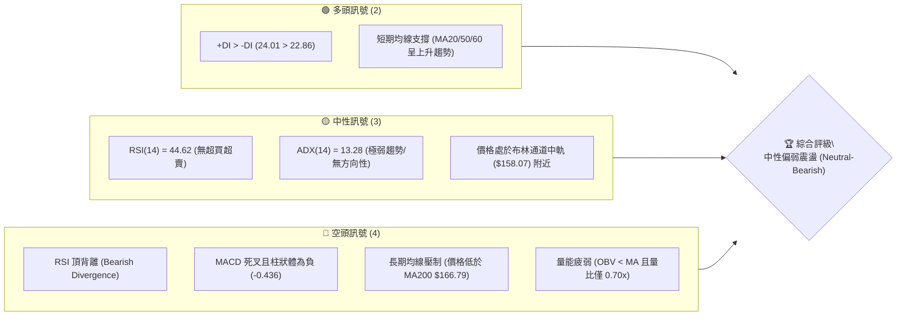
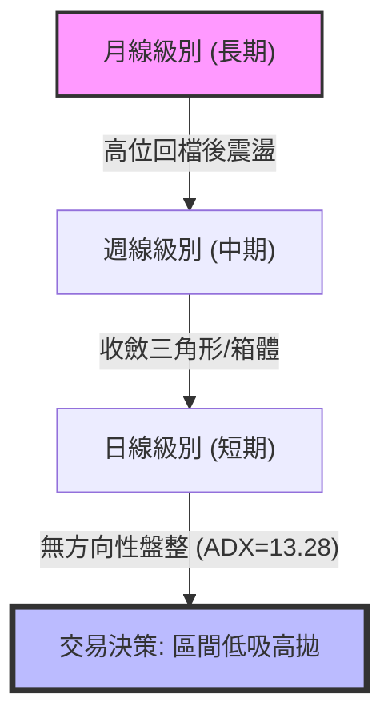
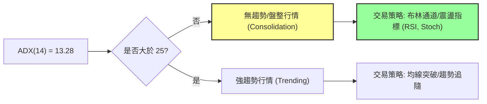
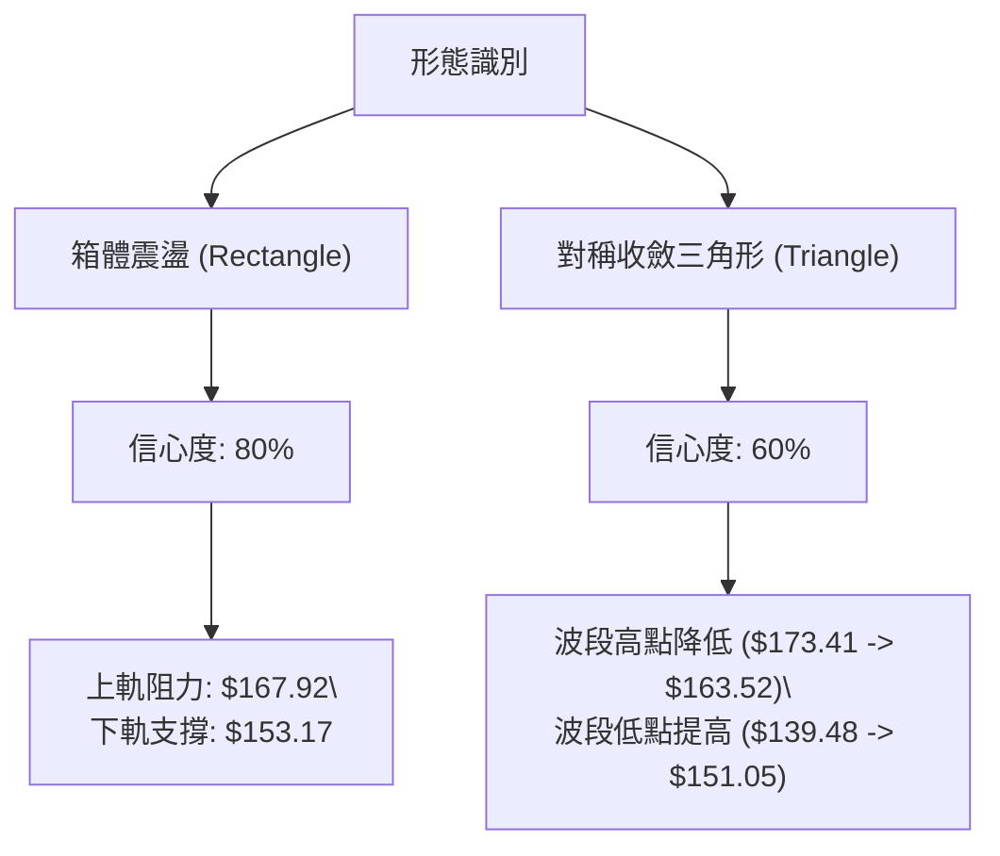
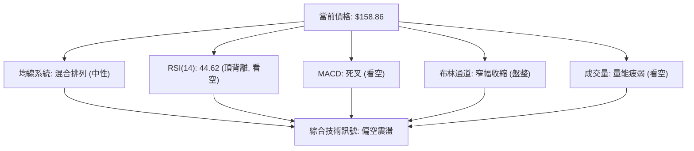
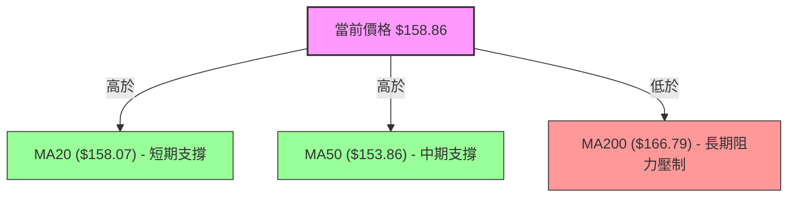
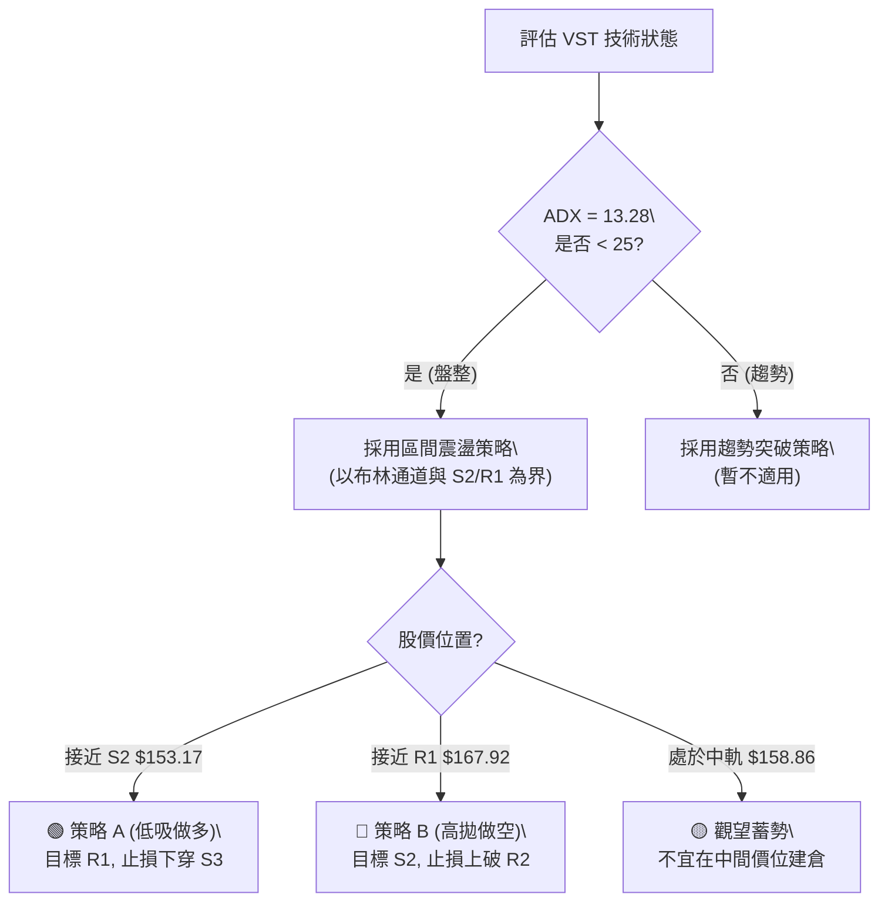
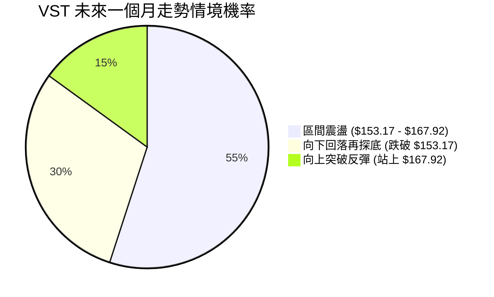
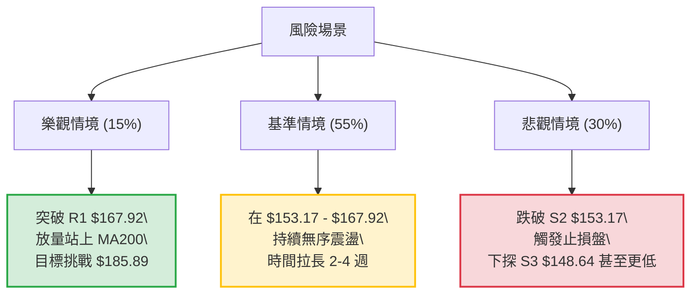

<details>
<summary>📊 靜態圖表 (點擊展開)</summary>

</details>

<html>
<head><meta charset="utf-8" /></head>
<body>
    <div style="height:500px; width:100%;">                        <script>window.PlotlyConfig = {MathJaxConfig: 'local'};</script>
        <script charset="utf-8" src="https://cdn.plot.ly/plotly-3.7.0.min.js" integrity="sha256-jvTGqxNp8AGWEcvNLVuKr+8j5dGe9Yw51LQkmDH+IYA=" crossorigin="anonymous"></script>                <div id="candlestick-chart" class="plotly-graph-div" style="height:100%; width:100%;"></div>            <script>                window.PLOTLYENV=window.PLOTLYENV || {};                                if (document.getElementById("candlestick-chart")) {                    Plotly.newPlot(                        "candlestick-chart",                        [{"close":{"dtype":"f8","bdata":"AAAAAJNsaUAAAACAGidpQAAAAAAVGWlAAAAAAIrLaUAAAACAz6NoQAAAAEBwY2hAAAAAoJMVaUAAAADA5zlpQAAAAIDfJGlAAAAA4IXyaEAAAAAAWdloQAAAAAAwtmlAAAAAYCEkakAAAADgZIFoQAAAAEDKFWpAAAAAoAuVaUAAAACgNz9qQAAAAGDgMGpAAAAAYHoQaUAAAADg5i1oQAAAAODiN2dAAAAA4OUhZ0AAAABAcdJnQAAAAEBNFGlAAAAAgCbPaEAAAAAAlrlnQAAAAGBh0WhAAAAAAIudZ0AAAAAgnHBnQAAAACCpB2hAAAAAoAcfZ0AAAABAWJNnQAAAAIBW+2ZAAAAAwKbGZ0AAAADg+G9nQAAAAMBXTWZAAAAAQPswZkAAAADAJltlQAAAAIDlvmVAAAAAYMbIZUAAAADASrZlQAAAAIC0TGZAAAAAIDeiZUAAAACAgfxkQAAAAIA8zWVAAAAAADVEZUAAAADgIgJmQAAAAGDIQ2ZAAAAAYG+dZUAAAABgs3plQAAAAAAFXmVAAAAAoN\u002fqZUAAAAAAQc9kQAAAACDLrWRAAAAAIAyEZEAAAAAAhY9kQAAAAEAHvGVAAAAAIKAsZUAAAADAq\u002fFkQAAAAGBhl2VAAAAAQM\u002fpY0AAAAAAY69kQAAAAOBSS2RAAAAAAPojZEAAAADgKidkQAAAACBsMGRAAAAA4ConZEAAAACglyxkQAAAAMB7RWRAAAAAQFEcZEAAAAAAxphkQAAAAEBgT2RAAAAAYP4hZUAAAABAjUVjQAAAAMDnxWJAAAAAACe9ZEAAAAAgU4NlQAAAAIBOXmVAAAAAgB8QZUAAAABg2nVmQAAAAAB+xGRAAAAAgBOMY0AAAABgg\u002fJjQAAAAOBc\u002fWNAAAAAQLT1Y0AAAABg5stjQAAAAIDReWRAAAAAYNulZEAAAAAANURkQAAAAIA4vWNAAAAAoLM6Y0AAAABAfhJjQAAAAOAOxGFAAAAAIJzVYUAAAACglqdiQAAAACCJEWNAAAAAQBzlY0AAAABAqfZjQAAAAEDNVGRAAAAAgIpgZUAAAABAbaZlQAAAAKAuQ2VAAAAAgMWAZUAAAAAgq11lQAAAAEDJ6mRAAAAAYLBkZUAAAADgCdxlQAAAAGChCmZAAAAAACGtZUAAAADABrFkQAAAAAAgKGRAAAAAQBldZEAAAACABd5kQAAAAEDLxmNAAAAAIGVlZEAAAABgSX5kQAAAAMAR12NAAAAA4HjkY0AAAAAAXtBjQAAAACBhMWRAAAAAgA18ZEAAAABA0jRlQAAAAIAQ3WRAAAAAABs6YkAAAACAguJiQAAAAKA0EGNAAAAAIIrpYkAAAADgyAJjQAAAAABnaGNAAAAAYK1qYkAAAAAg1cNiQAAAAKDUN2NAAAAAoP7eYkAAAACgGOxiQAAAAODhLmNAAAAAAIF1Y0AAAAAgKhFjQAAAAIBvUGNAAAAAAFK\u002fY0AAAADAs3dkQAAAAODJVmRAAAAAYI2pZEAAAADAZ2dkQAAAAOAO7GNAAAAAIDBWY0AAAADgTnJjQAAAAGAulGNAAAAAgNiDZEAAAAAAG8tkQAAAAEChHGRAAAAAwGUyY0AAAAAA0bNjQAAAAOACYmNAAAAAgAAUZEAAAACg+wRkQAAAAEAywmNAAAAAwII3Y0AAAAAAbnBiQAAAAMDL+mJAAAAAgERVYkAAAABgI81hQAAAACBztmFAAAAAYIJvYUAAAABg4RFhQAAAACCx0GBAAAAAYI75YUAAAACA45tiQAAAAKClgWNAAAAAQI6KZEAAAAAgov1jQAAAAKDJAWRAAAAAgDAAZEAAAADgZFFjQAAAAID4t2NAAAAAoLcyY0AAAACghS9jQAAAAKCpkWJAAAAA4DlWYkAAAAAgf0BiQAAAAIAUS2FAAAAAIJxFYkAAAAAgBHpiQAAAACDFKWNAAAAAIGzMY0AAAADAc9NjQAAAACCscGRAAAAA4FHoZEAAAADgekxkQAAAAADXW2RAAAAA4KP4ZEAAAAAgrm9kQAAAAAApTGRAAAAAACnUY0AAAADAHiVjQAAAAKCZ4WJAAAAAQAqnY0AAAAAgXHdjQAAAAIA9WmNAAAAAIFy\u002fY0AAAAAghdtjQA=="},"high":{"dtype":"f8","bdata":"QKRBHD58akCxK\u002fSonqppQOkgeS42bWlAFiOzPHbUaUAGNVE\u002fk8hpQP+ABAVk9WhAwDtzDpCCaUDjva8oy4RpQPd0oNCAKmpAMrGrIiriaUD1fv8rq19pQMycKHYZuGlAKdeqhTpGakClX6fNp29qQA4nDmmJImpAlze3hXv\u002faUBIev32cuRqQAnTrz1jBmtAg+LPKrklakAdPOAxupRpQEGExjLFE2hALxsz0NmWZ0Dy1AZt5OxnQMOSPv4wJWlA8TD6fhdaaUDGmf7E5I9oQBUTNUu4\u002fGhAwZAindq\u002faEAybwBu4QJoQMQ5LfQsTGhAcafuRETWZ0CO923Pp\u002fVnQMrTk5y9imdATzu0kwrJZ0D8LrFHe39oQDVLmDIjZWdAq\u002fO1DoqRZkBbBEovGidmQJbUfJgcaGZAM5PPrtBYZkBtSmXT5BVmQKzhV3Hpl2ZA4wCLgyiQZ0A0q\u002fvRtZ5lQApyKvYlz2VACWORtivAZUBpE1n5aCBmQMZPmjumgGZAhDSCIvD3ZUBGoeacDOdlQHysXcEgpGVAWE0We\u002fgpZkAwHEv4t\u002fxlQE0QHN7342RAQm+KGpImZUBHUAVfm6pkQBD1xAVFxWVACMMmhhxoZkCiWLdeCollQPXUKTGtpmVA3iX1eDzNZUAXXM6kn2ZlQJLw+ipfVmVA\u002fWBvE2p7ZEAvlTa\u002f8mdkQP+rCwBeRGRAU90fMZxRZEAVvdNp53dkQGikS06GU2RAJmBSO3qBZECXgsIYBBplQE3qKVDOZWVAafBaJEiEZUAMlnY36QVlQETibZvYa2NAjiX69UDIZUCVsD3cEwhmQLAX1yvp3mVAjJ\u002fHzaVWZUDl6QyWzcFmQHkFh5i7VGVAHSfpTFixZEAdjB9UDzFkQC3tpciQYWRAZbRuGXZNZEDDfGZ5U5tkQG32H31OhWRAShc1NTfDZED3WL7XVu1kQI7wMkJ6gWRA3UebmjzxY0AHXLEmL4JjQK8CdvuNJ2NA08EgZGrwYUAEcGzD4PpiQFTSdh41a2NAqDUjfjAfZEBc1l9hU5tkQHfzEhcMuGRAZpd4SPdlZUC4t2ZgNAVmQHRfFrWB4GVAMzP3agGDZUBiVUDqrqBlQEs2oZG1a2VA53\u002fghJpmZUA\u002fsT4kjO5lQFmw+bu2F2ZAPovpuy06ZkBt9Z+FDgFmQI65eASGYmRArzRJSjl4ZEA\u002fIygeNvBkQP+m45lL\u002fWRA1kRjTKCFZEC1takJYQplQOeVqvczcWRAavQzEP5XZEA8UHaXF5lkQOXKtt+QYWRA7cE29hygZEBHUUcpupBlQAZxQlo6JGVAEtsNF5fHZEAo\u002fX\u002fQ0nVjQKwQqdBNPGNAydGc2FS3Y0D9ueaimw5jQCae5i07\u002f2NAPHKCw6XWY0CQPozwQuhiQLZxLjzig2NA2YaV5wBLY0C3k+EkghxjQLpvM6A4PmNABmuViLMiZEDwIVLWr0lkQF50DrIPzWNACrxYAdkPZEBzPwA+kKFkQOVL4zwwyWRAatNcU\u002fjVZEAUpSDgIwhlQJdRWkVCemRAKT+atv0bZEDHjyrvcNtjQHev5vu61GNA7ZgdbvSnZEB3z60r5wVlQHtHdF0XY2RA5gCWrjwdZEA1oEY+BO1jQDmzAFNQ\u002fWNAOkLKuOREZED8LLYRRXJkQL53EehiWGRAUMzp0\u002fEEZUC6dRFaEFljQKH3GhsqEWNAq8KC8ZvDYkAOqsz0aUJiQFkVxgQH42FAEkf1+JCcYUAh85gJCWthQFSH1lNIEGFAqi6e0FAWYkDq7nSVR6JiQKTPY1swq2NApA\u002fR9k7lZEApLBnQUZlkQIVY1GSkaWRAusF4ZgRCZEBhQng0gcpjQM2gz87DEWRAj2f+qQ22Y0C9y+b6YjpjQHj\u002fcQVgQmNAW0J0QeuiYkCIGzrC38JiQODlIVOO+WFA6RQP6zlWYkASuq\u002fWQ8liQH\u002fWwoNxZ2NAvcI6PyIoZEAXNWyEz0ZkQD5+vuFBQ2VAAAAAAABQZUAAAABgZrpkQAAAAOB6tGRAAAAAQDNrZUAAAACAwv1kQAAAAEAzs2RAAAAAYGauZEAAAACAPapjQAAAACCuh2NAAAAAIK6nY0AAAADAHu1jQAAAAOClj2NAAAAAgMIlZEAAAADgowBkQA=="},"hovertemplate":"\u003cb\u003e%{x|%Y-%m-%d}\u003c\u002fb\u003e\u003cbr\u003e\u958b: $%{open:.2f}\u003cbr\u003e\u9ad8: $%{high:.2f}\u003cbr\u003e\u4f4e: $%{low:.2f}\u003cbr\u003e\u6536: $%{close:.2f}\u003cextra\u003e\u003c\u002fextra\u003e","low":{"dtype":"f8","bdata":"AcYvwLdTaUDvaZF0DCFpQEPZQnlOZmhAFJuw4K8EaUDF2neHKZxoQJRvb1kXvWdA2DPvsu\u002frZ0Bk\u002fEM8WbxoQIZ94QVCFWlARxO83o6TaEA+CB3FUmJoQN40bfmA6WhAVeWIPXiPaUDJxPytwYBoQDaDJz408mhA4gBjIxISaUBboGdQaLFpQOdXDU0x+mlAjLDr6gznaEDx+YtvPABoQFXNq8acGWdAg7aaNvVcZkC3UfjrEh5nQLPt9qhfOWhAVTb5AOx1aECDCebsjvZmQN2Tj\u002frklWdA9vZFAEJ4Z0A4wZDGSNhmQE+ZGlckYmdAAxMLoYP3ZkA7tPRnNwVnQA7+AC8iWWZAxJLePcP7ZUCyxWrarexmQPuGO2QwQmZAm+aaS8ARZkDvtXF1AjplQArn5uGVnGRAzcyHP92MZUA\u002f2K6eeD5lQI1n1Qjrr2VAtO9M7C6NZUA5b0yxhThkQNDFyE3IpmRAbOdYKvGmZEAm5WPXv4tlQOuU\u002fQCyKGZAPpPORil\u002fZUCHIWUi8FRlQM35QVv6B2VAFuEkuXI4ZUD6y1Fo8rhkQGTG3pwlbGRACIHRd3+BZECwKyGkvr9jQDuIyJfzCmRARGe5NcXZZEAdlecFM8lkQLPTwQ1\u002fu2RAEjgHhlbBY0CNppjp2T9kQN8kMLbOQGRA+s6oBQANZEAcBc4NBvZjQHKAUR6J6mNAuID2VAv9Y0AvE1YNc+9jQCmPnYGzE2RAXWRunM4YZEB2DYgIA25kQAxAoCzw92NAyZcsU4BqZEDYT+GUuSNjQEKzkt3omGJAT47qEoStZEDWQN44E3RkQN4tVu8oS2VACa4Q3vCyZEAsVkp6mmZlQJDn3cLtUWRARgMCqDR6Y0ATnnqgECtjQFLE1di\u002f1mNAF6uSKQ2yY0Cw9PEw3K5jQNij9nbWtmNAcm+2f+QWZECWPU4SJcpjQEf7qwysjWNAiUWnslwzY0DH8aJwRL9iQFHKelNYXGFAkH+d+rpEYUChUP\u002flbGBiQCnPTevpa2JAcjRhwUBMY0DeTzBJmsNjQFmO78Sj\u002fmNA4nRxJb4hZECbC7dsZS9lQGNbNPKLJGVAzczMjCX5ZEA29lmdFBFlQNLTDokimGRA7idC5sdNZECC7NZ0izNlQG8L4j4IdWRAbbigzGRNZUDEp7ed66tkQEGb0dHaEWNAS78hxaP+Y0BlTbqFfCdkQGyq6Qigu2NAn+Wx8FBSY0DDJKFFQXtkQNRxNWAaV2NAl+OE9pCIY0BJQKVSb6ljQB57CJ1i9WNAX\u002fJFEoc1ZECRbbWpY6FkQMK0e5bceGRA\u002fNIbIhQUYkAwnEilCaRiQMiCHFHoqmJA60APMm7FYkD1SzPvH0liQBIcw5o18WJA0ULJxKNMYkCIuoWJgsRhQPA6xlMG5mJArKadRB+9YkB6ffv2c7ViQEj7qRM8wmJAM5+on1RiY0DIQU9t7Q5jQDHMHg+rHGNAZv0D9fcNY0CDdIFH3QNkQCz33SyLPWRAp6jeMz5MZECUu17\u002fDkFkQNmc5Mknw2NAQeN\u002fT0M9Y0BQjn7XgVZjQLLd8wsWSWNAAcmUZNtdY0DcwbufatBjQDa4ZP7vz2NAV+BIorUbY0D2zDEMZHBjQGLbd6LTVmNAUqzs0AinY0B4oQzlcvJjQBWqTDwxjGNAn\u002fjcT8IxY0BarDNayFhiQPB5qp9ZQmJAU9p+HJouYkBN4Y2jE2phQOZVAgk+d2FAVbkIzMAzYUAxfbKbh7VgQEVGKvwuj2BAVb02ycAzYUDbOZY9rRViQLxT5\u002fxA0WJACwUJovW\u002fY0DHT6W098VjQCRDh9MlrGNAatvMwCOVY0DVR6iryeNiQLP\u002f\u002fY9RFWNAVUPwHI4XY0CRg6v1W79iQFECWi9maWJAjPD6FJxFYkD1bnYd8qphQAAam9fyNmFAaSJHo\u002f5rYUALD3bva1liQOPvJXk+wWJAQYPflrgTY0A1ZTJPr59jQDIRhX3M+WNAAAAAwMxcZEAAAADgo+RjQAAAAAAp\u002fGNAAAAA4FHAZEAAAACAFGZkQAAAAOCjIGRAAAAA4FGQY0AAAACgmeFiQAAAAAAAkGJAAAAA4FEAY0AAAADgUUBjQAAAAIA96mJAAAAAgD2uY0AAAACgmaFjQA=="},"name":"\u50f9\u683c","open":{"dtype":"f8","bdata":"AwWckKInakAdkeMaWE1pQH+3Fv24pWhAtoA4p7ILaUBYeNMPMSVpQOwp1waly2hAwcvl7B5GaED7c2ZmM2ZpQEd5nXEUcGlADfszhcKpaUBkF8w\u002ffRdpQEzwoJvOF2lAfMVXTIfEaUCjnClaexxqQIOb8gcmCWlAQHiq3PedaUA6Xk\u002fbdQ5qQJ5uWhnGvGpANRorB+HZaUCHlnK9EWlpQOOJaOuPAmhAdiBLsLVYZ0C3UfjrEh5nQM\u002fVnrUbeWhA8TD6fhdaaUDGmf7E5I9oQFTjOjQU8GdA62ozRew7aEDojN7KhOZnQKrOgsOYwGdAGIW2kTxqZ0CN3POXmS9nQFB65SY1xGZAojlrcE84ZkDykg87vz9oQL5x5fPDJGdAXp1Bw6ByZkD+Uss7pAVmQNUMCqaSz2RAAIAYRHrWZUDdCZ2rNH5lQAlY8ZjfzWVAog6YQbYBZ0CzC6VlLGllQOGegl28G2VAUr7qC3WrZUD3Oi9h6KhlQDdTWH4+SGZABIdy2vXoZUBwBX+shdVlQBVgba80fmVAdDR7jPxlZUD87gmVNvllQE0QHN7342RATXJnmeSVZED4QW7Z75RkQNY5QgIYLGRAdHF++iXPZUDCI48axIdlQExHEsiuvmRA56NS3TmpZUBiSbpzIp9kQCEHOdBGwGRArTj3lIVxZEA+IIIC+iNkQJ\u002fi98t3EWRAAAAA4ConZEBu+e9byRFkQOK4FMOyMWRAxPdPfhlOZEB2DYgIA25kQJF6ZTTjHGVAf8pbmhQRZUAMlnY36QVlQIN9eGlLWmNAQ00eeiu7ZUBCqG8j54ZkQO2bA5GjsGVAfnEKooYdZUAeFyYlupBlQKsEkefO4mRANhWAE2caZEDiA5czSNJjQHtDXsR2L2RAkEVA9t\u002fxY0BfmpXlswRkQE90Vdo84mNAAxIpXVixZED6kUmcEbBkQIk7MQ++IWRAExH34uGmY0D0nje9DnZjQEeQvVqOGGNAojQ1aI2TYUBr0Pv2wbJiQG77QP\u002fBsmJA\u002fxqKq6P+Y0C1aPPibpFkQJBUta8rCWRA+iaBjnY+ZECtz\u002fIHE01lQLOrpUH1sGVAzcyuyB4uZUB9UO2oY3plQOWAgVBqRWVA6lORNTHaZEBAJY8Z8XxlQAOzW2VkXGVAOU8LCo3QZUC18araXzdlQGjR0lnOJ2RAQRNeYJ0kZEBftYiA3i1kQIBPaMvhf2RAZPKZWQlvY0CG0uEN7JxkQCNnCejBZGRAdL73X7GUY0BdqwD+CSpkQMT20F\u002fJEWRAtkct+otLZECPW0sDXqlkQHRaFaWu1mRAEtsNF5fHZECbEcRqn+diQFVYRNzcymJAg3luRBBZY0AW3KxTT6liQBIcw5o18WJAw2d6eiucY0AS2UYqXPZhQP2SdgZD6GJAgJv6J\u002fTfYkD05QVNhdpiQNx2sMZ622JABWzocs4QZEA9BV0HgXVjQLWWVHchKWNAZv0D9fcNY0Bq0TQf2kVkQMEZRAyYqGRAEtt+H+CKZEC7gUEs4cBkQG2jFbpNWmRAmNfAOyARZEBJQhvZibJjQEubIrK9d2NATXwCgJCDY0B04M+5nZhkQIMv5nC6SGRAoLjdQFIUZEBSdtYhSYJjQBZ04OnVwmNAJT248wWvY0BA9fybtFhkQEL5jOicKGRACATW3ftZZEC6dRFaEFljQNTOhYVgeWJA+mVlnP2oYkAOqsz0aUJiQDsNAlXVpWFAvyBliYtyYUCsu0WZx1lhQGulTeOF82BAAAAAHNM5YUD8xES7hyhiQPBHu4cz2mJAx8ZiOgLWY0AqjOmlVpdkQK+CDJ\u002fF02NAQyCHAtf4Y0DC0GVW+ZhjQGPJmQEad2NAte0B1FCJY0AMOJaef+piQK8anKEy+WJAt\u002f3beEiDYkAxHOFLzIZiQAbrZwXJ5GFAytzu\u002fl6ZYUBWG6t6YHliQIKpSuIUE2NAm2MnZyQhY0CH1zPp+8pjQPBXPGSgO2RAAAAAAClwZEAAAABgjwJkQAAAAMD1YGRAAAAAwB7dZEAAAAAghbtkQAAAAGBmdmRAAAAAYI9SZEAAAAAAAIBjQAAAAGBmPmNAAAAAQAoPY0AAAAAAKYRjQAAAACCuP2NAAAAA4FHgY0AAAACgmbFjQA=="},"x":["2025-09-23T00:00:00-04:00","2025-09-24T00:00:00-04:00","2025-09-25T00:00:00-04:00","2025-09-26T00:00:00-04:00","2025-09-29T00:00:00-04:00","2025-09-30T00:00:00-04:00","2025-10-01T00:00:00-04:00","2025-10-02T00:00:00-04:00","2025-10-03T00:00:00-04:00","2025-10-06T00:00:00-04:00","2025-10-07T00:00:00-04:00","2025-10-08T00:00:00-04:00","2025-10-09T00:00:00-04:00","2025-10-10T00:00:00-04:00","2025-10-13T00:00:00-04:00","2025-10-14T00:00:00-04:00","2025-10-15T00:00:00-04:00","2025-10-16T00:00:00-04:00","2025-10-17T00:00:00-04:00","2025-10-20T00:00:00-04:00","2025-10-21T00:00:00-04:00","2025-10-22T00:00:00-04:00","2025-10-23T00:00:00-04:00","2025-10-24T00:00:00-04:00","2025-10-27T00:00:00-04:00","2025-10-28T00:00:00-04:00","2025-10-29T00:00:00-04:00","2025-10-30T00:00:00-04:00","2025-10-31T00:00:00-04:00","2025-11-03T00:00:00-05:00","2025-11-04T00:00:00-05:00","2025-11-05T00:00:00-05:00","2025-11-06T00:00:00-05:00","2025-11-07T00:00:00-05:00","2025-11-10T00:00:00-05:00","2025-11-11T00:00:00-05:00","2025-11-12T00:00:00-05:00","2025-11-13T00:00:00-05:00","2025-11-14T00:00:00-05:00","2025-11-17T00:00:00-05:00","2025-11-18T00:00:00-05:00","2025-11-19T00:00:00-05:00","2025-11-20T00:00:00-05:00","2025-11-21T00:00:00-05:00","2025-11-24T00:00:00-05:00","2025-11-25T00:00:00-05:00","2025-11-26T00:00:00-05:00","2025-11-28T00:00:00-05:00","2025-12-01T00:00:00-05:00","2025-12-02T00:00:00-05:00","2025-12-03T00:00:00-05:00","2025-12-04T00:00:00-05:00","2025-12-05T00:00:00-05:00","2025-12-08T00:00:00-05:00","2025-12-09T00:00:00-05:00","2025-12-10T00:00:00-05:00","2025-12-11T00:00:00-05:00","2025-12-12T00:00:00-05:00","2025-12-15T00:00:00-05:00","2025-12-16T00:00:00-05:00","2025-12-17T00:00:00-05:00","2025-12-18T00:00:00-05:00","2025-12-19T00:00:00-05:00","2025-12-22T00:00:00-05:00","2025-12-23T00:00:00-05:00","2025-12-24T00:00:00-05:00","2025-12-26T00:00:00-05:00","2025-12-29T00:00:00-05:00","2025-12-30T00:00:00-05:00","2025-12-31T00:00:00-05:00","2026-01-02T00:00:00-05:00","2026-01-05T00:00:00-05:00","2026-01-06T00:00:00-05:00","2026-01-07T00:00:00-05:00","2026-01-08T00:00:00-05:00","2026-01-09T00:00:00-05:00","2026-01-12T00:00:00-05:00","2026-01-13T00:00:00-05:00","2026-01-14T00:00:00-05:00","2026-01-15T00:00:00-05:00","2026-01-16T00:00:00-05:00","2026-01-20T00:00:00-05:00","2026-01-21T00:00:00-05:00","2026-01-22T00:00:00-05:00","2026-01-23T00:00:00-05:00","2026-01-26T00:00:00-05:00","2026-01-27T00:00:00-05:00","2026-01-28T00:00:00-05:00","2026-01-29T00:00:00-05:00","2026-01-30T00:00:00-05:00","2026-02-02T00:00:00-05:00","2026-02-03T00:00:00-05:00","2026-02-04T00:00:00-05:00","2026-02-05T00:00:00-05:00","2026-02-06T00:00:00-05:00","2026-02-09T00:00:00-05:00","2026-02-10T00:00:00-05:00","2026-02-11T00:00:00-05:00","2026-02-12T00:00:00-05:00","2026-02-13T00:00:00-05:00","2026-02-17T00:00:00-05:00","2026-02-18T00:00:00-05:00","2026-02-19T00:00:00-05:00","2026-02-20T00:00:00-05:00","2026-02-23T00:00:00-05:00","2026-02-24T00:00:00-05:00","2026-02-25T00:00:00-05:00","2026-02-26T00:00:00-05:00","2026-02-27T00:00:00-05:00","2026-03-02T00:00:00-05:00","2026-03-03T00:00:00-05:00","2026-03-04T00:00:00-05:00","2026-03-05T00:00:00-05:00","2026-03-06T00:00:00-05:00","2026-03-09T00:00:00-04:00","2026-03-10T00:00:00-04:00","2026-03-11T00:00:00-04:00","2026-03-12T00:00:00-04:00","2026-03-13T00:00:00-04:00","2026-03-16T00:00:00-04:00","2026-03-17T00:00:00-04:00","2026-03-18T00:00:00-04:00","2026-03-19T00:00:00-04:00","2026-03-20T00:00:00-04:00","2026-03-23T00:00:00-04:00","2026-03-24T00:00:00-04:00","2026-03-25T00:00:00-04:00","2026-03-26T00:00:00-04:00","2026-03-27T00:00:00-04:00","2026-03-30T00:00:00-04:00","2026-03-31T00:00:00-04:00","2026-04-01T00:00:00-04:00","2026-04-02T00:00:00-04:00","2026-04-06T00:00:00-04:00","2026-04-07T00:00:00-04:00","2026-04-08T00:00:00-04:00","2026-04-09T00:00:00-04:00","2026-04-10T00:00:00-04:00","2026-04-13T00:00:00-04:00","2026-04-14T00:00:00-04:00","2026-04-15T00:00:00-04:00","2026-04-16T00:00:00-04:00","2026-04-17T00:00:00-04:00","2026-04-20T00:00:00-04:00","2026-04-21T00:00:00-04:00","2026-04-22T00:00:00-04:00","2026-04-23T00:00:00-04:00","2026-04-24T00:00:00-04:00","2026-04-27T00:00:00-04:00","2026-04-28T00:00:00-04:00","2026-04-29T00:00:00-04:00","2026-04-30T00:00:00-04:00","2026-05-01T00:00:00-04:00","2026-05-04T00:00:00-04:00","2026-05-05T00:00:00-04:00","2026-05-06T00:00:00-04:00","2026-05-07T00:00:00-04:00","2026-05-08T00:00:00-04:00","2026-05-11T00:00:00-04:00","2026-05-12T00:00:00-04:00","2026-05-13T00:00:00-04:00","2026-05-14T00:00:00-04:00","2026-05-15T00:00:00-04:00","2026-05-18T00:00:00-04:00","2026-05-19T00:00:00-04:00","2026-05-20T00:00:00-04:00","2026-05-21T00:00:00-04:00","2026-05-22T00:00:00-04:00","2026-05-26T00:00:00-04:00","2026-05-27T00:00:00-04:00","2026-05-28T00:00:00-04:00","2026-05-29T00:00:00-04:00","2026-06-01T00:00:00-04:00","2026-06-02T00:00:00-04:00","2026-06-03T00:00:00-04:00","2026-06-04T00:00:00-04:00","2026-06-05T00:00:00-04:00","2026-06-08T00:00:00-04:00","2026-06-09T00:00:00-04:00","2026-06-10T00:00:00-04:00","2026-06-11T00:00:00-04:00","2026-06-12T00:00:00-04:00","2026-06-15T00:00:00-04:00","2026-06-16T00:00:00-04:00","2026-06-17T00:00:00-04:00","2026-06-18T00:00:00-04:00","2026-06-22T00:00:00-04:00","2026-06-23T00:00:00-04:00","2026-06-24T00:00:00-04:00","2026-06-25T00:00:00-04:00","2026-06-26T00:00:00-04:00","2026-06-29T00:00:00-04:00","2026-06-30T00:00:00-04:00","2026-07-01T00:00:00-04:00","2026-07-02T00:00:00-04:00","2026-07-06T00:00:00-04:00","2026-07-07T00:00:00-04:00","2026-07-08T00:00:00-04:00","2026-07-09T00:00:00-04:00","2026-07-10T00:00:00-04:00"],"type":"candlestick"},{"hovertemplate":"MA30: $%{y:.2f}\u003cextra\u003e\u003c\u002fextra\u003e","line":{"color":"#2196F3","dash":"dash","width":2},"mode":"lines","name":"MA30","x":["2025-09-23T00:00:00-04:00","2025-09-24T00:00:00-04:00","2025-09-25T00:00:00-04:00","2025-09-26T00:00:00-04:00","2025-09-29T00:00:00-04:00","2025-09-30T00:00:00-04:00","2025-10-01T00:00:00-04:00","2025-10-02T00:00:00-04:00","2025-10-03T00:00:00-04:00","2025-10-06T00:00:00-04:00","2025-10-07T00:00:00-04:00","2025-10-08T00:00:00-04:00","2025-10-09T00:00:00-04:00","2025-10-10T00:00:00-04:00","2025-10-13T00:00:00-04:00","2025-10-14T00:00:00-04:00","2025-10-15T00:00:00-04:00","2025-10-16T00:00:00-04:00","2025-10-17T00:00:00-04:00","2025-10-20T00:00:00-04:00","2025-10-21T00:00:00-04:00","2025-10-22T00:00:00-04:00","2025-10-23T00:00:00-04:00","2025-10-24T00:00:00-04:00","2025-10-27T00:00:00-04:00","2025-10-28T00:00:00-04:00","2025-10-29T00:00:00-04:00","2025-10-30T00:00:00-04:00","2025-10-31T00:00:00-04:00","2025-11-03T00:00:00-05:00","2025-11-04T00:00:00-05:00","2025-11-05T00:00:00-05:00","2025-11-06T00:00:00-05:00","2025-11-07T00:00:00-05:00","2025-11-10T00:00:00-05:00","2025-11-11T00:00:00-05:00","2025-11-12T00:00:00-05:00","2025-11-13T00:00:00-05:00","2025-11-14T00:00:00-05:00","2025-11-17T00:00:00-05:00","2025-11-18T00:00:00-05:00","2025-11-19T00:00:00-05:00","2025-11-20T00:00:00-05:00","2025-11-21T00:00:00-05:00","2025-11-24T00:00:00-05:00","2025-11-25T00:00:00-05:00","2025-11-26T00:00:00-05:00","2025-11-28T00:00:00-05:00","2025-12-01T00:00:00-05:00","2025-12-02T00:00:00-05:00","2025-12-03T00:00:00-05:00","2025-12-04T00:00:00-05:00","2025-12-05T00:00:00-05:00","2025-12-08T00:00:00-05:00","2025-12-09T00:00:00-05:00","2025-12-10T00:00:00-05:00","2025-12-11T00:00:00-05:00","2025-12-12T00:00:00-05:00","2025-12-15T00:00:00-05:00","2025-12-16T00:00:00-05:00","2025-12-17T00:00:00-05:00","2025-12-18T00:00:00-05:00","2025-12-19T00:00:00-05:00","2025-12-22T00:00:00-05:00","2025-12-23T00:00:00-05:00","2025-12-24T00:00:00-05:00","2025-12-26T00:00:00-05:00","2025-12-29T00:00:00-05:00","2025-12-30T00:00:00-05:00","2025-12-31T00:00:00-05:00","2026-01-02T00:00:00-05:00","2026-01-05T00:00:00-05:00","2026-01-06T00:00:00-05:00","2026-01-07T00:00:00-05:00","2026-01-08T00:00:00-05:00","2026-01-09T00:00:00-05:00","2026-01-12T00:00:00-05:00","2026-01-13T00:00:00-05:00","2026-01-14T00:00:00-05:00","2026-01-15T00:00:00-05:00","2026-01-16T00:00:00-05:00","2026-01-20T00:00:00-05:00","2026-01-21T00:00:00-05:00","2026-01-22T00:00:00-05:00","2026-01-23T00:00:00-05:00","2026-01-26T00:00:00-05:00","2026-01-27T00:00:00-05:00","2026-01-28T00:00:00-05:00","2026-01-29T00:00:00-05:00","2026-01-30T00:00:00-05:00","2026-02-02T00:00:00-05:00","2026-02-03T00:00:00-05:00","2026-02-04T00:00:00-05:00","2026-02-05T00:00:00-05:00","2026-02-06T00:00:00-05:00","2026-02-09T00:00:00-05:00","2026-02-10T00:00:00-05:00","2026-02-11T00:00:00-05:00","2026-02-12T00:00:00-05:00","2026-02-13T00:00:00-05:00","2026-02-17T00:00:00-05:00","2026-02-18T00:00:00-05:00","2026-02-19T00:00:00-05:00","2026-02-20T00:00:00-05:00","2026-02-23T00:00:00-05:00","2026-02-24T00:00:00-05:00","2026-02-25T00:00:00-05:00","2026-02-26T00:00:00-05:00","2026-02-27T00:00:00-05:00","2026-03-02T00:00:00-05:00","2026-03-03T00:00:00-05:00","2026-03-04T00:00:00-05:00","2026-03-05T00:00:00-05:00","2026-03-06T00:00:00-05:00","2026-03-09T00:00:00-04:00","2026-03-10T00:00:00-04:00","2026-03-11T00:00:00-04:00","2026-03-12T00:00:00-04:00","2026-03-13T00:00:00-04:00","2026-03-16T00:00:00-04:00","2026-03-17T00:00:00-04:00","2026-03-18T00:00:00-04:00","2026-03-19T00:00:00-04:00","2026-03-20T00:00:00-04:00","2026-03-23T00:00:00-04:00","2026-03-24T00:00:00-04:00","2026-03-25T00:00:00-04:00","2026-03-26T00:00:00-04:00","2026-03-27T00:00:00-04:00","2026-03-30T00:00:00-04:00","2026-03-31T00:00:00-04:00","2026-04-01T00:00:00-04:00","2026-04-02T00:00:00-04:00","2026-04-06T00:00:00-04:00","2026-04-07T00:00:00-04:00","2026-04-08T00:00:00-04:00","2026-04-09T00:00:00-04:00","2026-04-10T00:00:00-04:00","2026-04-13T00:00:00-04:00","2026-04-14T00:00:00-04:00","2026-04-15T00:00:00-04:00","2026-04-16T00:00:00-04:00","2026-04-17T00:00:00-04:00","2026-04-20T00:00:00-04:00","2026-04-21T00:00:00-04:00","2026-04-22T00:00:00-04:00","2026-04-23T00:00:00-04:00","2026-04-24T00:00:00-04:00","2026-04-27T00:00:00-04:00","2026-04-28T00:00:00-04:00","2026-04-29T00:00:00-04:00","2026-04-30T00:00:00-04:00","2026-05-01T00:00:00-04:00","2026-05-04T00:00:00-04:00","2026-05-05T00:00:00-04:00","2026-05-06T00:00:00-04:00","2026-05-07T00:00:00-04:00","2026-05-08T00:00:00-04:00","2026-05-11T00:00:00-04:00","2026-05-12T00:00:00-04:00","2026-05-13T00:00:00-04:00","2026-05-14T00:00:00-04:00","2026-05-15T00:00:00-04:00","2026-05-18T00:00:00-04:00","2026-05-19T00:00:00-04:00","2026-05-20T00:00:00-04:00","2026-05-21T00:00:00-04:00","2026-05-22T00:00:00-04:00","2026-05-26T00:00:00-04:00","2026-05-27T00:00:00-04:00","2026-05-28T00:00:00-04:00","2026-05-29T00:00:00-04:00","2026-06-01T00:00:00-04:00","2026-06-02T00:00:00-04:00","2026-06-03T00:00:00-04:00","2026-06-04T00:00:00-04:00","2026-06-05T00:00:00-04:00","2026-06-08T00:00:00-04:00","2026-06-09T00:00:00-04:00","2026-06-10T00:00:00-04:00","2026-06-11T00:00:00-04:00","2026-06-12T00:00:00-04:00","2026-06-15T00:00:00-04:00","2026-06-16T00:00:00-04:00","2026-06-17T00:00:00-04:00","2026-06-18T00:00:00-04:00","2026-06-22T00:00:00-04:00","2026-06-23T00:00:00-04:00","2026-06-24T00:00:00-04:00","2026-06-25T00:00:00-04:00","2026-06-26T00:00:00-04:00","2026-06-29T00:00:00-04:00","2026-06-30T00:00:00-04:00","2026-07-01T00:00:00-04:00","2026-07-02T00:00:00-04:00","2026-07-06T00:00:00-04:00","2026-07-07T00:00:00-04:00","2026-07-08T00:00:00-04:00","2026-07-09T00:00:00-04:00","2026-07-10T00:00:00-04:00"],"y":{"dtype":"f8","bdata":"AAAAAAAA+H8AAAAAAAD4fwAAAAAAAPh\u002fAAAAAAAA+H8AAAAAAAD4fwAAAAAAAPh\u002fAAAAAAAA+H8AAAAAAAD4fwAAAAAAAPh\u002fAAAAAAAA+H8AAAAAAAD4fwAAAAAAAPh\u002fAAAAAAAA+H8AAAAAAAD4fwAAAAAAAPh\u002fAAAAAAAA+H8AAAAAAAD4fwAAAAAAAPh\u002fAAAAAAAA+H8AAAAAAAD4fwAAAAAAAPh\u002fAAAAAAAA+H8AAAAAAAD4fwAAAAAAAPh\u002fAAAAAAAA+H8AAAAAAAD4fwAAAAAAAPh\u002fAAAAAAAA+H8AAAAAAAD4f5qZmTmT1mhAIiIicuzCaECamZkJd7VoQHd3dydoo2hAERERYS2SaEDe3d196odoQAAAAOAcdmhAERERIW1daEAiIiKyZjxoQFVVVeVmH2hAvLu7C2kEaEDe3d1NpOlnQGZmZpaGzGdAiYiI2A+mZ0BERERECIhnQCIiIgJ7Y2dA3t3dDac+Z0AiIiKyexpnQFVVVeX6+GZAiYiImIvbZkCJiIhYgcRmQO\u002fu7q61tGZAvLu7m1eqZkDNzMzMopBmQN7d3e0Va2ZAq6qq6nJGZkCamZlZcitmQLy7u4siEWZAq6qq6k38ZUAzMzOjAedlQCIiInIy0mVAMzMzs9K2ZUBERERkKJ5lQGZmZlY5h2VARERElDNoZUBmZma2LExlQLy7u9skOmVAvLu7C8AoZUBVVVU1qh5lQN7d3Z0VEmVAIiIics0DZUBVVVUFSfpkQO\u002fu7r5O6WRAZmZmlgjlZECJiIjYZtZkQAAAALCOvGRAiYiIOA64ZECJiIgY1LNkQGZmZuYtrGRAmpmZCXinZEBEREQ0169kQKuqqhq5qmRAmpmZGX+WZEAiIiJyI49kQHd3d+dBiWRA3t3dPYOEZEBERET0\u002fX1kQN7d3W1Ac2RAd3d3Z8JuZEDe3d0t+mhkQERERAQsWWRAMzMzw1VTZEB3d3dnkkVkQCIiIhL\u002fL2RAZmZmRlEcZEARERERiA9kQHd3d\u002ff3BWRAd3d3R8QDZEARERER+AFkQImIiMh6AmRA3t3dfUkNZECJiIiIRhZkQDMzMwNnHmRAiYiIyI8hZEBVVVWlbjNkQN7d3W26RWRAMzMzE1BLZECamZkZRU5kQImIiJgDVGRAERERYT9ZZEAiIiJCJ0pkQM3MzOzwRGRAVVVVlehLZEARERFBwlNkQJqZmZnwUWRAIiIisqlVZEDe3d3tm1tkQDMzMyMvVmRAvLu767xPZEC8u7tr4EtkQERERKS\u002fT2RAZmZm1nVaZEBmZmbWq2xkQDMzM9Mah2RAMzMzY3SKZEDv7u4ua4xkQFVVVdVfjGRAiYiIGP2DZEBEREQE3HtkQN7d3b36c2RAMzMzo7daZEB3d3f3GEJkQImIiAinMGRAiYiIeDEaZEARERFBVwVkQGZmZkaL9mNAIiIisgnmY0AAAABwNc5jQCIiIoLvtmNAzczMrHmmY0AiIiKCkKRjQERERLQepmNAvLu7G6uoY0CrqqrqtqRjQHd3d+f0pWNAq6qqmuqcY0Crqqra+5NjQDMzMxPBkWNAAAAAEBGXY0AiIiKybJ9jQCIiIqK7nmNAMzMzk76TY0AzMzMz6YZjQM3MzJxGemNAd3d3hxKKY0C8u7s7wZNjQGZmZhawmWNAERERcUmcY0C8u7uLaJdjQM3MzDzBk2NAq6qqigqTY0Crqqpq0YpjQFVVVdX4fWNAVVVV9bhxY0ARERFR6mFjQN7d3X21TWNAVVVVRQtBY0BERESEIj1jQERERHTGPmNAq6qquoxFY0AzMzMTe0FjQLy7u7ulPmNAERERgQA5Y0BEREQkvC9jQJqZman\u002fLWNAq6qq+tAsY0AiIiISlypjQLy7uwv5IWNAERERsWIPY0BERETUsvliQKuqqpql4WJAREREBMHZYkARERFBS89iQERERFRrzWJAREREhAjLYkCrqqraYcliQHd3d7cyz2JAVVVVBaDdYkARERFRfu1iQFVVVfVC+WJAMzMzI8YPY0Crqqo6QiZjQDMzM9NQPGNAd3d3x7xQY0BmZmYGcmJjQAAAAGATdGNA3t3dTWSCY0AAAAAgtYljQKuqqtpkiGNAq6qq6p6BY0ARERHRe4BjQA=="},"type":"scatter"},{"hovertemplate":"MA60: $%{y:.2f}\u003cextra\u003e\u003c\u002fextra\u003e","line":{"color":"#9C27B0","dash":"dash","width":2},"mode":"lines","name":"MA60","x":["2025-09-23T00:00:00-04:00","2025-09-24T00:00:00-04:00","2025-09-25T00:00:00-04:00","2025-09-26T00:00:00-04:00","2025-09-29T00:00:00-04:00","2025-09-30T00:00:00-04:00","2025-10-01T00:00:00-04:00","2025-10-02T00:00:00-04:00","2025-10-03T00:00:00-04:00","2025-10-06T00:00:00-04:00","2025-10-07T00:00:00-04:00","2025-10-08T00:00:00-04:00","2025-10-09T00:00:00-04:00","2025-10-10T00:00:00-04:00","2025-10-13T00:00:00-04:00","2025-10-14T00:00:00-04:00","2025-10-15T00:00:00-04:00","2025-10-16T00:00:00-04:00","2025-10-17T00:00:00-04:00","2025-10-20T00:00:00-04:00","2025-10-21T00:00:00-04:00","2025-10-22T00:00:00-04:00","2025-10-23T00:00:00-04:00","2025-10-24T00:00:00-04:00","2025-10-27T00:00:00-04:00","2025-10-28T00:00:00-04:00","2025-10-29T00:00:00-04:00","2025-10-30T00:00:00-04:00","2025-10-31T00:00:00-04:00","2025-11-03T00:00:00-05:00","2025-11-04T00:00:00-05:00","2025-11-05T00:00:00-05:00","2025-11-06T00:00:00-05:00","2025-11-07T00:00:00-05:00","2025-11-10T00:00:00-05:00","2025-11-11T00:00:00-05:00","2025-11-12T00:00:00-05:00","2025-11-13T00:00:00-05:00","2025-11-14T00:00:00-05:00","2025-11-17T00:00:00-05:00","2025-11-18T00:00:00-05:00","2025-11-19T00:00:00-05:00","2025-11-20T00:00:00-05:00","2025-11-21T00:00:00-05:00","2025-11-24T00:00:00-05:00","2025-11-25T00:00:00-05:00","2025-11-26T00:00:00-05:00","2025-11-28T00:00:00-05:00","2025-12-01T00:00:00-05:00","2025-12-02T00:00:00-05:00","2025-12-03T00:00:00-05:00","2025-12-04T00:00:00-05:00","2025-12-05T00:00:00-05:00","2025-12-08T00:00:00-05:00","2025-12-09T00:00:00-05:00","2025-12-10T00:00:00-05:00","2025-12-11T00:00:00-05:00","2025-12-12T00:00:00-05:00","2025-12-15T00:00:00-05:00","2025-12-16T00:00:00-05:00","2025-12-17T00:00:00-05:00","2025-12-18T00:00:00-05:00","2025-12-19T00:00:00-05:00","2025-12-22T00:00:00-05:00","2025-12-23T00:00:00-05:00","2025-12-24T00:00:00-05:00","2025-12-26T00:00:00-05:00","2025-12-29T00:00:00-05:00","2025-12-30T00:00:00-05:00","2025-12-31T00:00:00-05:00","2026-01-02T00:00:00-05:00","2026-01-05T00:00:00-05:00","2026-01-06T00:00:00-05:00","2026-01-07T00:00:00-05:00","2026-01-08T00:00:00-05:00","2026-01-09T00:00:00-05:00","2026-01-12T00:00:00-05:00","2026-01-13T00:00:00-05:00","2026-01-14T00:00:00-05:00","2026-01-15T00:00:00-05:00","2026-01-16T00:00:00-05:00","2026-01-20T00:00:00-05:00","2026-01-21T00:00:00-05:00","2026-01-22T00:00:00-05:00","2026-01-23T00:00:00-05:00","2026-01-26T00:00:00-05:00","2026-01-27T00:00:00-05:00","2026-01-28T00:00:00-05:00","2026-01-29T00:00:00-05:00","2026-01-30T00:00:00-05:00","2026-02-02T00:00:00-05:00","2026-02-03T00:00:00-05:00","2026-02-04T00:00:00-05:00","2026-02-05T00:00:00-05:00","2026-02-06T00:00:00-05:00","2026-02-09T00:00:00-05:00","2026-02-10T00:00:00-05:00","2026-02-11T00:00:00-05:00","2026-02-12T00:00:00-05:00","2026-02-13T00:00:00-05:00","2026-02-17T00:00:00-05:00","2026-02-18T00:00:00-05:00","2026-02-19T00:00:00-05:00","2026-02-20T00:00:00-05:00","2026-02-23T00:00:00-05:00","2026-02-24T00:00:00-05:00","2026-02-25T00:00:00-05:00","2026-02-26T00:00:00-05:00","2026-02-27T00:00:00-05:00","2026-03-02T00:00:00-05:00","2026-03-03T00:00:00-05:00","2026-03-04T00:00:00-05:00","2026-03-05T00:00:00-05:00","2026-03-06T00:00:00-05:00","2026-03-09T00:00:00-04:00","2026-03-10T00:00:00-04:00","2026-03-11T00:00:00-04:00","2026-03-12T00:00:00-04:00","2026-03-13T00:00:00-04:00","2026-03-16T00:00:00-04:00","2026-03-17T00:00:00-04:00","2026-03-18T00:00:00-04:00","2026-03-19T00:00:00-04:00","2026-03-20T00:00:00-04:00","2026-03-23T00:00:00-04:00","2026-03-24T00:00:00-04:00","2026-03-25T00:00:00-04:00","2026-03-26T00:00:00-04:00","2026-03-27T00:00:00-04:00","2026-03-30T00:00:00-04:00","2026-03-31T00:00:00-04:00","2026-04-01T00:00:00-04:00","2026-04-02T00:00:00-04:00","2026-04-06T00:00:00-04:00","2026-04-07T00:00:00-04:00","2026-04-08T00:00:00-04:00","2026-04-09T00:00:00-04:00","2026-04-10T00:00:00-04:00","2026-04-13T00:00:00-04:00","2026-04-14T00:00:00-04:00","2026-04-15T00:00:00-04:00","2026-04-16T00:00:00-04:00","2026-04-17T00:00:00-04:00","2026-04-20T00:00:00-04:00","2026-04-21T00:00:00-04:00","2026-04-22T00:00:00-04:00","2026-04-23T00:00:00-04:00","2026-04-24T00:00:00-04:00","2026-04-27T00:00:00-04:00","2026-04-28T00:00:00-04:00","2026-04-29T00:00:00-04:00","2026-04-30T00:00:00-04:00","2026-05-01T00:00:00-04:00","2026-05-04T00:00:00-04:00","2026-05-05T00:00:00-04:00","2026-05-06T00:00:00-04:00","2026-05-07T00:00:00-04:00","2026-05-08T00:00:00-04:00","2026-05-11T00:00:00-04:00","2026-05-12T00:00:00-04:00","2026-05-13T00:00:00-04:00","2026-05-14T00:00:00-04:00","2026-05-15T00:00:00-04:00","2026-05-18T00:00:00-04:00","2026-05-19T00:00:00-04:00","2026-05-20T00:00:00-04:00","2026-05-21T00:00:00-04:00","2026-05-22T00:00:00-04:00","2026-05-26T00:00:00-04:00","2026-05-27T00:00:00-04:00","2026-05-28T00:00:00-04:00","2026-05-29T00:00:00-04:00","2026-06-01T00:00:00-04:00","2026-06-02T00:00:00-04:00","2026-06-03T00:00:00-04:00","2026-06-04T00:00:00-04:00","2026-06-05T00:00:00-04:00","2026-06-08T00:00:00-04:00","2026-06-09T00:00:00-04:00","2026-06-10T00:00:00-04:00","2026-06-11T00:00:00-04:00","2026-06-12T00:00:00-04:00","2026-06-15T00:00:00-04:00","2026-06-16T00:00:00-04:00","2026-06-17T00:00:00-04:00","2026-06-18T00:00:00-04:00","2026-06-22T00:00:00-04:00","2026-06-23T00:00:00-04:00","2026-06-24T00:00:00-04:00","2026-06-25T00:00:00-04:00","2026-06-26T00:00:00-04:00","2026-06-29T00:00:00-04:00","2026-06-30T00:00:00-04:00","2026-07-01T00:00:00-04:00","2026-07-02T00:00:00-04:00","2026-07-06T00:00:00-04:00","2026-07-07T00:00:00-04:00","2026-07-08T00:00:00-04:00","2026-07-09T00:00:00-04:00","2026-07-10T00:00:00-04:00"],"y":{"dtype":"f8","bdata":"AAAAAAAA+H8AAAAAAAD4fwAAAAAAAPh\u002fAAAAAAAA+H8AAAAAAAD4fwAAAAAAAPh\u002fAAAAAAAA+H8AAAAAAAD4fwAAAAAAAPh\u002fAAAAAAAA+H8AAAAAAAD4fwAAAAAAAPh\u002fAAAAAAAA+H8AAAAAAAD4fwAAAAAAAPh\u002fAAAAAAAA+H8AAAAAAAD4fwAAAAAAAPh\u002fAAAAAAAA+H8AAAAAAAD4fwAAAAAAAPh\u002fAAAAAAAA+H8AAAAAAAD4fwAAAAAAAPh\u002fAAAAAAAA+H8AAAAAAAD4fwAAAAAAAPh\u002fAAAAAAAA+H8AAAAAAAD4fwAAAAAAAPh\u002fAAAAAAAA+H8AAAAAAAD4fwAAAAAAAPh\u002fAAAAAAAA+H8AAAAAAAD4fwAAAAAAAPh\u002fAAAAAAAA+H8AAAAAAAD4fwAAAAAAAPh\u002fAAAAAAAA+H8AAAAAAAD4fwAAAAAAAPh\u002fAAAAAAAA+H8AAAAAAAD4fwAAAAAAAPh\u002fAAAAAAAA+H8AAAAAAAD4fwAAAAAAAPh\u002fAAAAAAAA+H8AAAAAAAD4fwAAAAAAAPh\u002fAAAAAAAA+H8AAAAAAAD4fwAAAAAAAPh\u002fAAAAAAAA+H8AAAAAAAD4fwAAAAAAAPh\u002fAAAAAAAA+H8AAAAAAAD4f97d3dViVGdAq6qqkt88Z0Dv7u62zylnQO\u002fu7r5QFWdAq6qqejD9ZkAiIiKaC+pmQN7d3d0g2GZAZmZmlhbDZkC8u7tziK1mQJqZmUG+mGZA7+7uPhuEZkCamZmp9nFmQKuqqqrqWmZAd3d3N4xFZkBmZmaONy9mQBEREdkEEGZAMzMzo1r7ZUBVVVXlJ+dlQN7d3WWU0mVAERER0YHBZUBmZmZGLLplQM3MzGS3r2VAq6qqWmugZUB3d3cf449lQKuqquoremVAREREFHtlZUDv7u4muFRlQM3MzHwxQmVAERERKYg1ZUCJiIjo\u002fSdlQDMzMzuvFWVAMzMzOxQFZUDe3d1l3fFkQERERDSc22RAVVVVbULCZEC8u7tj2q1kQJqZmWkOoGRAmpmZKUKWZEAzMzMjUZBkQDMzMzNIimRAAAAAeIuIZEDv7u7GR4hkQBEREeHag2RAd3d3L0yDZEDv7u6+6oRkQO\u002fu7o4kgWRA3t3dJa+BZEARERGZDIFkQHd3d78YgGRAVVVVtVuAZEAzMzM7\u002f3xkQLy7uwPVd2RAd3d31zNxZECamZnZcnFkQImIiECZbWRAAAAAeBZtZEARERHxzGxkQImIiMi3ZGRAmpmZqT9fZEDNzMxMbVpkQERERNR1VGRAzczMzOVWZEDv7u4eH1lkQKuqqvKMW2RAzczM1GJTZEAAAACg+U1kQGZmZuYrSWRAAAAAsOBDZECrqqoK6j5kQDMzM8M6O2RAiYiIkAA0ZEAAAADALyxkQN7d3QWHJ2RAiYiIoOAdZEAzMzPzYhxkQCIiItoiHmRAq6qq4qwYZEDNzMxEPQ5kQFVVVY15BWRA7+7uhtz\u002fY0AiIiLiW\u002fdjQImIiNCH9WNAiYiI2En6Y0De3d2VPPxjQImIiMDy+2NAZmZmJkr5Y0BERETky\u002fdjQDMzMxv482NA3t3d\u002fWbzY0Dv7u6OpvVjQDMzM6M992NAzczMNBr3Y0DNzMyEyvljQAAAALiwAGRAVVVVdUMKZEBVVVU1FhBkQN7d3fUHE2RAzczMRCMQZEAAAABIoglkQFVVVf3dA2RA7+7uFuH2Y0ARERExdeZjQO\u002fu7u5P12NA7+7uNvXFY0ARERHJoLNjQCIiImIgomNAvLu7e4qTY0AiIiL6q4VjQDMzM\u002fvaemNAvLu7MwN2Y0CrqqrKBXNjQAAAADhicmNAZmZmztVwY0B3d3eHOWpjQImIiEj6aWNAq6qqyt1kY0BmZmZ2SV9jQHd3dw\u002fdWWNAiYiI4DlTY0AzMzPDj0xjQGZmZp4wQGNAvLu7y782Y0AiIiI6GitjQImIiPjYI2NA3t3dhY0qY0AzMzOLkS5jQO\u002fu7mZxNGNAMzMzu\u002fQ8Y0BmZmZuc0JjQBERERmCRmNA7+7uVmhRY0CrqqrSiVhjQERERNQkXWNAZmZm3jphY0C8u7srLmJjQO\u002fu7m7kYGNAmpmZybdhY0AiIiLSa2NjQHd3d6eVY2NAq6qq0pVjY0AiIiJy+2BjQA=="},"type":"scatter"},{"hovertemplate":"MA200: $%{y:.2f}\u003cextra\u003e\u003c\u002fextra\u003e","line":{"color":"#FF6F00","dash":"solid","width":2},"mode":"lines","name":"MA200","x":["2025-09-23T00:00:00-04:00","2025-09-24T00:00:00-04:00","2025-09-25T00:00:00-04:00","2025-09-26T00:00:00-04:00","2025-09-29T00:00:00-04:00","2025-09-30T00:00:00-04:00","2025-10-01T00:00:00-04:00","2025-10-02T00:00:00-04:00","2025-10-03T00:00:00-04:00","2025-10-06T00:00:00-04:00","2025-10-07T00:00:00-04:00","2025-10-08T00:00:00-04:00","2025-10-09T00:00:00-04:00","2025-10-10T00:00:00-04:00","2025-10-13T00:00:00-04:00","2025-10-14T00:00:00-04:00","2025-10-15T00:00:00-04:00","2025-10-16T00:00:00-04:00","2025-10-17T00:00:00-04:00","2025-10-20T00:00:00-04:00","2025-10-21T00:00:00-04:00","2025-10-22T00:00:00-04:00","2025-10-23T00:00:00-04:00","2025-10-24T00:00:00-04:00","2025-10-27T00:00:00-04:00","2025-10-28T00:00:00-04:00","2025-10-29T00:00:00-04:00","2025-10-30T00:00:00-04:00","2025-10-31T00:00:00-04:00","2025-11-03T00:00:00-05:00","2025-11-04T00:00:00-05:00","2025-11-05T00:00:00-05:00","2025-11-06T00:00:00-05:00","2025-11-07T00:00:00-05:00","2025-11-10T00:00:00-05:00","2025-11-11T00:00:00-05:00","2025-11-12T00:00:00-05:00","2025-11-13T00:00:00-05:00","2025-11-14T00:00:00-05:00","2025-11-17T00:00:00-05:00","2025-11-18T00:00:00-05:00","2025-11-19T00:00:00-05:00","2025-11-20T00:00:00-05:00","2025-11-21T00:00:00-05:00","2025-11-24T00:00:00-05:00","2025-11-25T00:00:00-05:00","2025-11-26T00:00:00-05:00","2025-11-28T00:00:00-05:00","2025-12-01T00:00:00-05:00","2025-12-02T00:00:00-05:00","2025-12-03T00:00:00-05:00","2025-12-04T00:00:00-05:00","2025-12-05T00:00:00-05:00","2025-12-08T00:00:00-05:00","2025-12-09T00:00:00-05:00","2025-12-10T00:00:00-05:00","2025-12-11T00:00:00-05:00","2025-12-12T00:00:00-05:00","2025-12-15T00:00:00-05:00","2025-12-16T00:00:00-05:00","2025-12-17T00:00:00-05:00","2025-12-18T00:00:00-05:00","2025-12-19T00:00:00-05:00","2025-12-22T00:00:00-05:00","2025-12-23T00:00:00-05:00","2025-12-24T00:00:00-05:00","2025-12-26T00:00:00-05:00","2025-12-29T00:00:00-05:00","2025-12-30T00:00:00-05:00","2025-12-31T00:00:00-05:00","2026-01-02T00:00:00-05:00","2026-01-05T00:00:00-05:00","2026-01-06T00:00:00-05:00","2026-01-07T00:00:00-05:00","2026-01-08T00:00:00-05:00","2026-01-09T00:00:00-05:00","2026-01-12T00:00:00-05:00","2026-01-13T00:00:00-05:00","2026-01-14T00:00:00-05:00","2026-01-15T00:00:00-05:00","2026-01-16T00:00:00-05:00","2026-01-20T00:00:00-05:00","2026-01-21T00:00:00-05:00","2026-01-22T00:00:00-05:00","2026-01-23T00:00:00-05:00","2026-01-26T00:00:00-05:00","2026-01-27T00:00:00-05:00","2026-01-28T00:00:00-05:00","2026-01-29T00:00:00-05:00","2026-01-30T00:00:00-05:00","2026-02-02T00:00:00-05:00","2026-02-03T00:00:00-05:00","2026-02-04T00:00:00-05:00","2026-02-05T00:00:00-05:00","2026-02-06T00:00:00-05:00","2026-02-09T00:00:00-05:00","2026-02-10T00:00:00-05:00","2026-02-11T00:00:00-05:00","2026-02-12T00:00:00-05:00","2026-02-13T00:00:00-05:00","2026-02-17T00:00:00-05:00","2026-02-18T00:00:00-05:00","2026-02-19T00:00:00-05:00","2026-02-20T00:00:00-05:00","2026-02-23T00:00:00-05:00","2026-02-24T00:00:00-05:00","2026-02-25T00:00:00-05:00","2026-02-26T00:00:00-05:00","2026-02-27T00:00:00-05:00","2026-03-02T00:00:00-05:00","2026-03-03T00:00:00-05:00","2026-03-04T00:00:00-05:00","2026-03-05T00:00:00-05:00","2026-03-06T00:00:00-05:00","2026-03-09T00:00:00-04:00","2026-03-10T00:00:00-04:00","2026-03-11T00:00:00-04:00","2026-03-12T00:00:00-04:00","2026-03-13T00:00:00-04:00","2026-03-16T00:00:00-04:00","2026-03-17T00:00:00-04:00","2026-03-18T00:00:00-04:00","2026-03-19T00:00:00-04:00","2026-03-20T00:00:00-04:00","2026-03-23T00:00:00-04:00","2026-03-24T00:00:00-04:00","2026-03-25T00:00:00-04:00","2026-03-26T00:00:00-04:00","2026-03-27T00:00:00-04:00","2026-03-30T00:00:00-04:00","2026-03-31T00:00:00-04:00","2026-04-01T00:00:00-04:00","2026-04-02T00:00:00-04:00","2026-04-06T00:00:00-04:00","2026-04-07T00:00:00-04:00","2026-04-08T00:00:00-04:00","2026-04-09T00:00:00-04:00","2026-04-10T00:00:00-04:00","2026-04-13T00:00:00-04:00","2026-04-14T00:00:00-04:00","2026-04-15T00:00:00-04:00","2026-04-16T00:00:00-04:00","2026-04-17T00:00:00-04:00","2026-04-20T00:00:00-04:00","2026-04-21T00:00:00-04:00","2026-04-22T00:00:00-04:00","2026-04-23T00:00:00-04:00","2026-04-24T00:00:00-04:00","2026-04-27T00:00:00-04:00","2026-04-28T00:00:00-04:00","2026-04-29T00:00:00-04:00","2026-04-30T00:00:00-04:00","2026-05-01T00:00:00-04:00","2026-05-04T00:00:00-04:00","2026-05-05T00:00:00-04:00","2026-05-06T00:00:00-04:00","2026-05-07T00:00:00-04:00","2026-05-08T00:00:00-04:00","2026-05-11T00:00:00-04:00","2026-05-12T00:00:00-04:00","2026-05-13T00:00:00-04:00","2026-05-14T00:00:00-04:00","2026-05-15T00:00:00-04:00","2026-05-18T00:00:00-04:00","2026-05-19T00:00:00-04:00","2026-05-20T00:00:00-04:00","2026-05-21T00:00:00-04:00","2026-05-22T00:00:00-04:00","2026-05-26T00:00:00-04:00","2026-05-27T00:00:00-04:00","2026-05-28T00:00:00-04:00","2026-05-29T00:00:00-04:00","2026-06-01T00:00:00-04:00","2026-06-02T00:00:00-04:00","2026-06-03T00:00:00-04:00","2026-06-04T00:00:00-04:00","2026-06-05T00:00:00-04:00","2026-06-08T00:00:00-04:00","2026-06-09T00:00:00-04:00","2026-06-10T00:00:00-04:00","2026-06-11T00:00:00-04:00","2026-06-12T00:00:00-04:00","2026-06-15T00:00:00-04:00","2026-06-16T00:00:00-04:00","2026-06-17T00:00:00-04:00","2026-06-18T00:00:00-04:00","2026-06-22T00:00:00-04:00","2026-06-23T00:00:00-04:00","2026-06-24T00:00:00-04:00","2026-06-25T00:00:00-04:00","2026-06-26T00:00:00-04:00","2026-06-29T00:00:00-04:00","2026-06-30T00:00:00-04:00","2026-07-01T00:00:00-04:00","2026-07-02T00:00:00-04:00","2026-07-06T00:00:00-04:00","2026-07-07T00:00:00-04:00","2026-07-08T00:00:00-04:00","2026-07-09T00:00:00-04:00","2026-07-10T00:00:00-04:00"],"y":{"dtype":"f8","bdata":"AAAAAAAA+H8AAAAAAAD4fwAAAAAAAPh\u002fAAAAAAAA+H8AAAAAAAD4fwAAAAAAAPh\u002fAAAAAAAA+H8AAAAAAAD4fwAAAAAAAPh\u002fAAAAAAAA+H8AAAAAAAD4fwAAAAAAAPh\u002fAAAAAAAA+H8AAAAAAAD4fwAAAAAAAPh\u002fAAAAAAAA+H8AAAAAAAD4fwAAAAAAAPh\u002fAAAAAAAA+H8AAAAAAAD4fwAAAAAAAPh\u002fAAAAAAAA+H8AAAAAAAD4fwAAAAAAAPh\u002fAAAAAAAA+H8AAAAAAAD4fwAAAAAAAPh\u002fAAAAAAAA+H8AAAAAAAD4fwAAAAAAAPh\u002fAAAAAAAA+H8AAAAAAAD4fwAAAAAAAPh\u002fAAAAAAAA+H8AAAAAAAD4fwAAAAAAAPh\u002fAAAAAAAA+H8AAAAAAAD4fwAAAAAAAPh\u002fAAAAAAAA+H8AAAAAAAD4fwAAAAAAAPh\u002fAAAAAAAA+H8AAAAAAAD4fwAAAAAAAPh\u002fAAAAAAAA+H8AAAAAAAD4fwAAAAAAAPh\u002fAAAAAAAA+H8AAAAAAAD4fwAAAAAAAPh\u002fAAAAAAAA+H8AAAAAAAD4fwAAAAAAAPh\u002fAAAAAAAA+H8AAAAAAAD4fwAAAAAAAPh\u002fAAAAAAAA+H8AAAAAAAD4fwAAAAAAAPh\u002fAAAAAAAA+H8AAAAAAAD4fwAAAAAAAPh\u002fAAAAAAAA+H8AAAAAAAD4fwAAAAAAAPh\u002fAAAAAAAA+H8AAAAAAAD4fwAAAAAAAPh\u002fAAAAAAAA+H8AAAAAAAD4fwAAAAAAAPh\u002fAAAAAAAA+H8AAAAAAAD4fwAAAAAAAPh\u002fAAAAAAAA+H8AAAAAAAD4fwAAAAAAAPh\u002fAAAAAAAA+H8AAAAAAAD4fwAAAAAAAPh\u002fAAAAAAAA+H8AAAAAAAD4fwAAAAAAAPh\u002fAAAAAAAA+H8AAAAAAAD4fwAAAAAAAPh\u002fAAAAAAAA+H8AAAAAAAD4fwAAAAAAAPh\u002fAAAAAAAA+H8AAAAAAAD4fwAAAAAAAPh\u002fAAAAAAAA+H8AAAAAAAD4fwAAAAAAAPh\u002fAAAAAAAA+H8AAAAAAAD4fwAAAAAAAPh\u002fAAAAAAAA+H8AAAAAAAD4fwAAAAAAAPh\u002fAAAAAAAA+H8AAAAAAAD4fwAAAAAAAPh\u002fAAAAAAAA+H8AAAAAAAD4fwAAAAAAAPh\u002fAAAAAAAA+H8AAAAAAAD4fwAAAAAAAPh\u002fAAAAAAAA+H8AAAAAAAD4fwAAAAAAAPh\u002fAAAAAAAA+H8AAAAAAAD4fwAAAAAAAPh\u002fAAAAAAAA+H8AAAAAAAD4fwAAAAAAAPh\u002fAAAAAAAA+H8AAAAAAAD4fwAAAAAAAPh\u002fAAAAAAAA+H8AAAAAAAD4fwAAAAAAAPh\u002fAAAAAAAA+H8AAAAAAAD4fwAAAAAAAPh\u002fAAAAAAAA+H8AAAAAAAD4fwAAAAAAAPh\u002fAAAAAAAA+H8AAAAAAAD4fwAAAAAAAPh\u002fAAAAAAAA+H8AAAAAAAD4fwAAAAAAAPh\u002fAAAAAAAA+H8AAAAAAAD4fwAAAAAAAPh\u002fAAAAAAAA+H8AAAAAAAD4fwAAAAAAAPh\u002fAAAAAAAA+H8AAAAAAAD4fwAAAAAAAPh\u002fAAAAAAAA+H8AAAAAAAD4fwAAAAAAAPh\u002fAAAAAAAA+H8AAAAAAAD4fwAAAAAAAPh\u002fAAAAAAAA+H8AAAAAAAD4fwAAAAAAAPh\u002fAAAAAAAA+H8AAAAAAAD4fwAAAAAAAPh\u002fAAAAAAAA+H8AAAAAAAD4fwAAAAAAAPh\u002fAAAAAAAA+H8AAAAAAAD4fwAAAAAAAPh\u002fAAAAAAAA+H8AAAAAAAD4fwAAAAAAAPh\u002fAAAAAAAA+H8AAAAAAAD4fwAAAAAAAPh\u002fAAAAAAAA+H8AAAAAAAD4fwAAAAAAAPh\u002fAAAAAAAA+H8AAAAAAAD4fwAAAAAAAPh\u002fAAAAAAAA+H8AAAAAAAD4fwAAAAAAAPh\u002fAAAAAAAA+H8AAAAAAAD4fwAAAAAAAPh\u002fAAAAAAAA+H8AAAAAAAD4fwAAAAAAAPh\u002fAAAAAAAA+H8AAAAAAAD4fwAAAAAAAPh\u002fAAAAAAAA+H8AAAAAAAD4fwAAAAAAAPh\u002fAAAAAAAA+H8AAAAAAAD4fwAAAAAAAPh\u002fAAAAAAAA+H8AAAAAAAD4fwAAAAAAAPh\u002fAAAAAAAA+H8AAACUVtlkQA=="},"type":"scatter"}],                        {"template":{"data":{"barpolar":[{"marker":{"line":{"color":"rgb(17,17,17)","width":0.5},"pattern":{"fillmode":"overlay","size":10,"solidity":0.2}},"type":"barpolar"}],"bar":[{"error_x":{"color":"#f2f5fa"},"error_y":{"color":"#f2f5fa"},"marker":{"line":{"color":"rgb(17,17,17)","width":0.5},"pattern":{"fillmode":"overlay","size":10,"solidity":0.2}},"type":"bar"}],"carpet":[{"aaxis":{"endlinecolor":"#A2B1C6","gridcolor":"#506784","linecolor":"#506784","minorgridcolor":"#506784","startlinecolor":"#A2B1C6"},"baxis":{"endlinecolor":"#A2B1C6","gridcolor":"#506784","linecolor":"#506784","minorgridcolor":"#506784","startlinecolor":"#A2B1C6"},"type":"carpet"}],"choropleth":[{"colorbar":{"outlinewidth":0,"ticks":""},"type":"choropleth"}],"contourcarpet":[{"colorbar":{"outlinewidth":0,"ticks":""},"type":"contourcarpet"}],"contour":[{"colorbar":{"outlinewidth":0,"ticks":""},"colorscale":[[0.0,"#0d0887"],[0.1111111111111111,"#46039f"],[0.2222222222222222,"#7201a8"],[0.3333333333333333,"#9c179e"],[0.4444444444444444,"#bd3786"],[0.5555555555555556,"#d8576b"],[0.6666666666666666,"#ed7953"],[0.7777777777777778,"#fb9f3a"],[0.8888888888888888,"#fdca26"],[1.0,"#f0f921"]],"type":"contour"}],"heatmap":[{"colorbar":{"outlinewidth":0,"ticks":""},"colorscale":[[0.0,"#0d0887"],[0.1111111111111111,"#46039f"],[0.2222222222222222,"#7201a8"],[0.3333333333333333,"#9c179e"],[0.4444444444444444,"#bd3786"],[0.5555555555555556,"#d8576b"],[0.6666666666666666,"#ed7953"],[0.7777777777777778,"#fb9f3a"],[0.8888888888888888,"#fdca26"],[1.0,"#f0f921"]],"type":"heatmap"}],"histogram2dcontour":[{"colorbar":{"outlinewidth":0,"ticks":""},"colorscale":[[0.0,"#0d0887"],[0.1111111111111111,"#46039f"],[0.2222222222222222,"#7201a8"],[0.3333333333333333,"#9c179e"],[0.4444444444444444,"#bd3786"],[0.5555555555555556,"#d8576b"],[0.6666666666666666,"#ed7953"],[0.7777777777777778,"#fb9f3a"],[0.8888888888888888,"#fdca26"],[1.0,"#f0f921"]],"type":"histogram2dcontour"}],"histogram2d":[{"colorbar":{"outlinewidth":0,"ticks":""},"colorscale":[[0.0,"#0d0887"],[0.1111111111111111,"#46039f"],[0.2222222222222222,"#7201a8"],[0.3333333333333333,"#9c179e"],[0.4444444444444444,"#bd3786"],[0.5555555555555556,"#d8576b"],[0.6666666666666666,"#ed7953"],[0.7777777777777778,"#fb9f3a"],[0.8888888888888888,"#fdca26"],[1.0,"#f0f921"]],"type":"histogram2d"}],"histogram":[{"marker":{"pattern":{"fillmode":"overlay","size":10,"solidity":0.2}},"type":"histogram"}],"mesh3d":[{"colorbar":{"outlinewidth":0,"ticks":""},"type":"mesh3d"}],"parcoords":[{"line":{"colorbar":{"outlinewidth":0,"ticks":""}},"type":"parcoords"}],"pie":[{"automargin":true,"type":"pie"}],"scatter3d":[{"line":{"colorbar":{"outlinewidth":0,"ticks":""}},"marker":{"colorbar":{"outlinewidth":0,"ticks":""}},"type":"scatter3d"}],"scattercarpet":[{"marker":{"colorbar":{"outlinewidth":0,"ticks":""}},"type":"scattercarpet"}],"scattergeo":[{"marker":{"colorbar":{"outlinewidth":0,"ticks":""}},"type":"scattergeo"}],"scattergl":[{"marker":{"line":{"color":"#283442"}},"type":"scattergl"}],"scattermapbox":[{"marker":{"colorbar":{"outlinewidth":0,"ticks":""}},"type":"scattermapbox"}],"scattermap":[{"marker":{"colorbar":{"outlinewidth":0,"ticks":""}},"type":"scattermap"}],"scatterpolargl":[{"marker":{"colorbar":{"outlinewidth":0,"ticks":""}},"type":"scatterpolargl"}],"scatterpolar":[{"marker":{"colorbar":{"outlinewidth":0,"ticks":""}},"type":"scatterpolar"}],"scatter":[{"marker":{"line":{"color":"#283442"}},"type":"scatter"}],"scatterternary":[{"marker":{"colorbar":{"outlinewidth":0,"ticks":""}},"type":"scatterternary"}],"surface":[{"colorbar":{"outlinewidth":0,"ticks":""},"colorscale":[[0.0,"#0d0887"],[0.1111111111111111,"#46039f"],[0.2222222222222222,"#7201a8"],[0.3333333333333333,"#9c179e"],[0.4444444444444444,"#bd3786"],[0.5555555555555556,"#d8576b"],[0.6666666666666666,"#ed7953"],[0.7777777777777778,"#fb9f3a"],[0.8888888888888888,"#fdca26"],[1.0,"#f0f921"]],"type":"surface"}],"table":[{"cells":{"fill":{"color":"#506784"},"line":{"color":"rgb(17,17,17)"}},"header":{"fill":{"color":"#2a3f5f"},"line":{"color":"rgb(17,17,17)"}},"type":"table"}]},"layout":{"annotationdefaults":{"arrowcolor":"#f2f5fa","arrowhead":0,"arrowwidth":1},"autotypenumbers":"strict","coloraxis":{"colorbar":{"outlinewidth":0,"ticks":""}},"colorscale":{"diverging":[[0,"#8e0152"],[0.1,"#c51b7d"],[0.2,"#de77ae"],[0.3,"#f1b6da"],[0.4,"#fde0ef"],[0.5,"#f7f7f7"],[0.6,"#e6f5d0"],[0.7,"#b8e186"],[0.8,"#7fbc41"],[0.9,"#4d9221"],[1,"#276419"]],"sequential":[[0.0,"#0d0887"],[0.1111111111111111,"#46039f"],[0.2222222222222222,"#7201a8"],[0.3333333333333333,"#9c179e"],[0.4444444444444444,"#bd3786"],[0.5555555555555556,"#d8576b"],[0.6666666666666666,"#ed7953"],[0.7777777777777778,"#fb9f3a"],[0.8888888888888888,"#fdca26"],[1.0,"#f0f921"]],"sequentialminus":[[0.0,"#0d0887"],[0.1111111111111111,"#46039f"],[0.2222222222222222,"#7201a8"],[0.3333333333333333,"#9c179e"],[0.4444444444444444,"#bd3786"],[0.5555555555555556,"#d8576b"],[0.6666666666666666,"#ed7953"],[0.7777777777777778,"#fb9f3a"],[0.8888888888888888,"#fdca26"],[1.0,"#f0f921"]]},"colorway":["#636efa","#EF553B","#00cc96","#ab63fa","#FFA15A","#19d3f3","#FF6692","#B6E880","#FF97FF","#FECB52"],"font":{"color":"#f2f5fa"},"geo":{"bgcolor":"rgb(17,17,17)","lakecolor":"rgb(17,17,17)","landcolor":"rgb(17,17,17)","showlakes":true,"showland":true,"subunitcolor":"#506784"},"hoverlabel":{"align":"left"},"hovermode":"closest","mapbox":{"style":"dark"},"paper_bgcolor":"rgb(17,17,17)","plot_bgcolor":"rgb(17,17,17)","polar":{"angularaxis":{"gridcolor":"#506784","linecolor":"#506784","ticks":""},"bgcolor":"rgb(17,17,17)","radialaxis":{"gridcolor":"#506784","linecolor":"#506784","ticks":""}},"scene":{"xaxis":{"backgroundcolor":"rgb(17,17,17)","gridcolor":"#506784","gridwidth":2,"linecolor":"#506784","showbackground":true,"ticks":"","zerolinecolor":"#C8D4E3"},"yaxis":{"backgroundcolor":"rgb(17,17,17)","gridcolor":"#506784","gridwidth":2,"linecolor":"#506784","showbackground":true,"ticks":"","zerolinecolor":"#C8D4E3"},"zaxis":{"backgroundcolor":"rgb(17,17,17)","gridcolor":"#506784","gridwidth":2,"linecolor":"#506784","showbackground":true,"ticks":"","zerolinecolor":"#C8D4E3"}},"shapedefaults":{"line":{"color":"#f2f5fa"}},"sliderdefaults":{"bgcolor":"#C8D4E3","bordercolor":"rgb(17,17,17)","borderwidth":1,"tickwidth":0},"ternary":{"aaxis":{"gridcolor":"#506784","linecolor":"#506784","ticks":""},"baxis":{"gridcolor":"#506784","linecolor":"#506784","ticks":""},"bgcolor":"rgb(17,17,17)","caxis":{"gridcolor":"#506784","linecolor":"#506784","ticks":""}},"title":{"x":0.05},"updatemenudefaults":{"bgcolor":"#506784","borderwidth":0},"xaxis":{"automargin":true,"gridcolor":"#283442","linecolor":"#506784","ticks":"","title":{"standoff":15},"zerolinecolor":"#283442","zerolinewidth":2},"yaxis":{"automargin":true,"gridcolor":"#283442","linecolor":"#506784","ticks":"","title":{"standoff":15},"zerolinecolor":"#283442","zerolinewidth":2}}},"xaxis":{"rangeslider":{"visible":false},"title":{"text":"\u65e5\u671f"}},"font":{"size":11},"title":{"text":"VST  |  MA(30\u002f60\u002f200)  |  \u6700\u8fd1200\u4ea4\u6613\u65e5"},"yaxis":{"title":{"text":"\u80a1\u50f9 (USD)"}},"hovermode":"x unified","height":500},                        {"responsive": true}                    )                };            </script>        </div>
</body>
</html>

# VST 技術分析報告

> **報告日期**：2026-07-13 ｜ **語言**：繁體中文 ｜ **數據來源**：Yahoo Finance ｜ **當前價格**：$158.86

---

## 目錄

| 章節 | 內容 |
|------|------|
| [1. 技術面概覽](#1-技術面概覽) | 訊號儀表板、核心指標、評分卡 |
| [2. 趨勢分析](#2-趨勢分析) | 多時框趨勢、長中短期走勢 |
| [3. 圖表形態分析](#3-圖表形態分析) | 形態識別、K線組合、目標價 |
| [4. 支撐與阻力](#4-支撐與阻力) | 關鍵價位、斐波那契回調 |
| [5. 技術指標深度解讀](#5-技術指標深度解讀) | MA/RSI/MACD/布林/成交量 |
| [6. 動能與波動率](#6-動能與波動率) | 動能評估、ATR、Beta |
| [7. 多時框架總結](#7-多時框架總結) | 時框架評分矩陣 |
| [8. 交易策略建議](#8-交易策略建議) | 多空策略、風險報酬比 |
| [9. 風險提示與監控](#9-風險提示與監控) | 監控指標、風險場景 |

---

## 1. 技術面概覽

Vistra Corp. (VST) 當前股價為 **$158.86**。自 2025 年中創下 $218.91 的歷史高點後，該股進入了長達一年的中性偏弱調整與箱體震盪格局。目前，多空力量處於相對均衡但暗流洶湧的狀態。

### 🎯 技術訊號儀表板



### 📊 核心指標速覽表

| 指標類別 | 指標名稱 | 當前數值 | 訊號 | 解讀 |
|----------|----------|----------|------|------|
| **價格** | 當前價格 | $158.86 | 🟡 中性 | 位於 52 週高低區間的 30.5% 位置，屬於中低位震盪 |
| **均線** | MA20 | $158.07 | 🟢 多頭 | 股價位於 MA20 上方，短期具備微幅支撐力道 |
| **均線** | MA50 | $153.86 | 🟢 多頭 | 股價位於 MA50 上方，中期均線呈緩步上揚趨勢 |
| **均線** | MA200 | $166.79 | 🔴 空頭 | 股價位於 MA200 下方，長期趨勢仍受壓制，均線走平下彎 |
| **動能** | RSI(14) | 44.62 | 🔴 空頭 | 數值處於中性偏弱區間，且日線級別出現顯著頂背離 |
| **動能** | MACD | 0.801 | 🔴 空頭 | MACD (0.801) 低於訊號線 (1.237)，柱狀體負值放大 (-0.436) |
| **趨勢** | ADX(14) | 13.28 | 🟡 中性 | 數值遠低於 25，表明當前處於無趨勢的典型盤整行情 |
| **波動** | ATR(14) | $6.40 | 🟡 中性 | 占股價比重 4.03%，日均波幅適中，適合區間操作 |
| **成交量**| OBV | OBV < MA | 🔴 空頭 | 量能無法有效放大，買盤追價意願不足，量價出現背離 |

### 🏆 技術評分卡

╔══════════════════════════════════════════════════════════════╗
║                技術評分卡 — VST (2026-07-13)                 ║
╠══════════════════════════════════════════════════════════════╣
║ 趨勢強度      ▓▓▓░░░░░░░░░░░░░░░░░  30/100  🔴 弱趨勢 (ADX=13.28) ║
║ 動能指標      ▓▓▓▓▓▓▓▓░░░░░░░░░░░░  40/100  🔴 頂背離/MACD看空    ║
║ 支撐穩定度    ▓▓▓▓▓▓▓▓▓▓▓▓░░░░░░░░  60/100  🟡 S1/S2支撐尚存       ║
║ 成交量配合    ▓▓▓▓▓▓░░░░░░░░░░░░░░  30/100  🔴 量能萎縮/OBV走弱    ║
║ 形態完整度    ▓▓▓▓▓▓▓▓▓▓▓▓▓▓░░░░░░  70/100  🟡 箱體震盪邊界清晰    ║
║ 均線排列      ▓▓▓▓▓▓▓▓▓▓░░░░░░░░░░  50/100  🟡 短多長空/均線糾纏    ║
╠══════════════════════════════════════════════════════════════╣
║ 綜合評分      ▓▓▓▓▓▓▓▓▓▓░░░░░░░░░░  48/100  🟡 中性偏弱觀望        ║
╚══════════════════════════════════════════════════════════════╝

---

## 2. 趨勢分析

### 🌐 多時框趨勢分析



### 📈 長期趨勢 — 12個月走勢圖（Unicode）

以下為 VST 過去 12 個月（2025-07 至 2026-07）的月線收盤價格走勢圖，清晰展示了股價從歷史高點回落後，進入寬幅震盪築底的過程：

```
VST 月線走勢圖（過去12個月）
價格軸 ($)
$210 ┤      ● (2025-07 高點: $207.45)
$200 ┤          ●         ●
$190 ┤              ●         ●
$180 ┤                            ●
$170 ┤                                ●
$160 ┤                                    ●           ●       ● ← 現在 ($158.86)
$150 ┤                                        ●   ●       ●
$140 ┤                                            ●
     └───────────────────────────────────────────────────────────
           M07 M08 M09 M10 M11 M12 M01 M02 M03 M04 M05 M06 M07
          2025                                 2026
```

**走勢特徵分析表格**：

| 階段 | 時間區間 | 收盤價變動 | 走勢特徵描述 |
|------|----------|------------|--------------|
| **高位築頂** | 2025-07 ~ 2025-10 | $207.45 → $187.52 | 創下歷史高點後多頭動能衰竭，出現獲利回吐，於 $185-$195 區間形成雙頂雛形。 |
| **震盪下行** | 2025-11 ~ 2025-12 | $178.12 → $160.88 | 跌破中期上升趨勢線，MA20 拐頭向下，長期買盤退守，成交量逐步萎縮。 |
| **多空拉鋸** | 2026-01 ~ 2026-03 | $157.91 → $150.12 | 2 月雖有反彈至 $173.41，但 3 月隨即再度回落至 $150.12，多空雙方在 $150 關卡展開激烈爭奪。 |
| **底部橫盤** | 2026-04 ~ 2026-07 | $157.62 → $158.86 | 股價連續 4 個月收盤價幾乎持平（$157-$160 區間），波動率極度擠壓，長期均線 MA200 開始走平。 |

### 📊 中期趨勢（週線分析）

從週線級別來看，VST 目前呈現典型的「收斂整理」形態。以下為中期支撐與阻力的結構示意圖：

```
週線級別阻力壓制線 (由 2026-02 高點 $173.41 與 2026-06 高點 $163.52 連接)
   \
    \      R1: $167.92 (關鍵中期阻力)
     \    /
      \  /    現價: $158.86
───────●────────────────────────────────────────
        \    /
         \  / 
          \/  S1: $157.99 (週線級別下軌支撐)
           \
週線級別支撐線 (由 2026-05 低點 $139.48 與 2026-07 低點 $151.05 連接)
```

週線指標顯示，MACD 柱狀體在零軸附近反覆交織，RSI 亦在 44-55 之間中性區間擺動，這證實了中期趨勢並無明顯的單邊方向，市場正處於等待基本面或催化劑突破的沉悶期。

### ⚡ 趨勢強度評估（ADX 解讀）



**ADX 趨勢強度對照表**：

| ADX 數值區間 | 趨勢強度分類 | VST 當前狀態 | 交易策略建議 |
|--------------|--------------|--------------|--------------|
| **< 20** | **極弱趨勢 / 盤整** | **✓ 13.28** | **避免趨勢追蹤策略**，改用網格交易、箱體突破或布林通道上下軌對沖。 |
| **20 - 25** | **過渡期 / 弱趨勢** | | 觀察是否有突破跡象，等待 ADX 拐頭向上。 |
| **25 - 50** | **強趨勢建立** | | 順勢交易，使用 MA 交叉或 DMI 訊號進場。 |
| **> 50** | **極強趨勢** | | 趨勢進入極端期，注意反轉風險，不宜盲目追高殺跌。 |

---

## 3. 圖表形態分析

### 🔍 形態識別系統

在當前日線與週線圖表中，由於 ADX 處於 13.28 的極低水平，複雜的幾何形態（如標準頭肩頂或大型雙底）並未獲得顯著的結構性確認。然而，價格在過去三個月中展現了清晰的**「箱體震盪 (Rectangle Consolidation)」**與**「收斂三角形 (Symmetrical Triangle)」**的特徵。



**形態信心度評估表**：

| 識別形態 | 信心度 | 判斷依據（引用數據） | 完成度 | 目標價（附計算式） |
|----------|--------|----------------------|--------|--------------------|
| **箱體震盪** | **80%** 🟢 | 股價在 R1 ($167.92) 與 S2 ($153.17) 之間反覆震盪，且多次觸及邊界後反彈/回落。 | 90% | 向上突破：$167.92 + ($167.92 - $153.17) = **$182.67**<br>向下跌破：$153.17 - ($167.92 - $153.17) = **$138.42** |
| **收斂三角形** | **60%** 🟡 | 週線級別高點從 $173.41 降至 $163.52，低點從 $139.48 升至 $151.05，波幅顯著收窄。 | 75% | 三角形高度 = $173.41 - $139.48 = $33.93<br>突破點假設為 $160.00：<br>向上目標：$160.00 + $33.93 = **$193.93**<br>向下目標：$160.00 - $33.93 = **$126.07** |

### 🕯️ 重要 K 線形態分析

觀察近 20 週的關鍵 K 線表現，可以發現多空力量在特定價位出現了明顯的轉折訊號：

| 日期 | 收盤價 | K 線形態 | 解讀 | 訊號 |
|------|--------|---------|------|------|
| **2026-03-01** | $173.41 | **長上影線 (Shooting Star)** | 股價挑戰 R2 ($171.94) 上方失敗，遭遇強烈賣壓，預示中期頂部出現。 | 🔴 看空 |
| **2026-03-22** | $145.82 | **錘子線 (Hammer)** | 股價下探至 S3 ($148.64) 下方後迅速拉回，顯示下方買盤強勁，底部初步探明。 | 🟢 看多 |
| **2026-05-17** | $139.48 | **看漲吞沒 (Bullish Engulfing)** | 隨後一週 (05-24) 股價暴漲至 $156.05，完全吞沒前週陰線，確認 $140 附近為中期大底。 | 🟢 看多 |
| **2026-06-21** | $163.52 | **流星線 (Inverted Hammer)** | 股價反彈至 R1 ($167.92) 前期阻力區受阻，留有長上影線，暗示上方套牢盤沉重。 | 🔴 看空 |
| **2026-07-12** | $158.86 | **十字星 (Doji)** | 本週收盤價幾乎與開盤價持平，且位於 MA20 ($158.07) 附近，多空暫時達成脆弱平衡。 | 🟡 中性 |

### 📉 ASCII 走勢形態示意圖

以下展示 VST 在日線級別上的**「箱體震盪形態」**，當前價格正處於箱體中軌偏下方的敏感位置：

```
                        箱體震盪形態 (Rectangle Pattern)
$172 ─────────────────────────────────────────────────── [箱體上軌: R2 $171.94]
$168 ───────●───────────────────────────●─────────────── [關鍵阻力: R1 $167.92]
             \                         / \
              \                       /   \
$159 ──────────\─────────●───────────/─────●─────●────── [中軌/現價: $158.86]
                \       / \         /             \
                 \     /   \       /               \
$153 ─────────────●───●─────●─────●─────────────────●─── [箱體下軌: S2 $153.17]
                   \ /       \   /                   \
$148 ───────────────●─────────●───────────────────────  [強支撐位: S3 $148.64]
```

### 🎯 形態目標價計算

根據箱體震盪形態的標準量度幅度計算法：
1. **箱體高度** = 關鍵阻力位 (R1) $167.92 - 強支撐位 (S2) $153.17 = **$14.75**
2. **向上突破目標價 (T1_Bull)** = R1 $167.92 + $14.75 = **$182.67** (此價位與斐波那契 38.2% 回調位 $185.89 形成共振阻力帶)
3. **向下破位目標價 (T1_Bear)** = S2 $153.17 - $14.75 = **$138.42** (此價位與 52 週低點 $132.47 附近形成共振支撐帶)

---

## 4. 支撐與阻力

### 🗺️ 關鍵價位分布圖（Unicode）

```
                     VST 價位結構分布圖 (2026-07-13)
══════════════════════════════════════════════════════════════════════════
$218.91 ║████████████████████████████████████████║ 52W High (0.0%)
$198.51 ║████████████████████████████████        ║ Fib 23.6%
$185.89 ║██████████████████████████              ║ Fib 38.2%
$177.74 ║██████████████████████                  ║ 阻力 R3 (強壓力區)
$171.94 ║██████████████████                      ║ 阻力 R2 (箱體上軌)
$167.92 ║████████████████                        ║ 阻力 R1 (關鍵頸線)
$165.49 ║███████████████                         ║ Fib 61.8%
$158.86 ╠════════════════════════════════════════╣ ◄ 當前價格 (Current Price)
$157.99 ║▓▓▓▓▓▓▓▓▓▓▓▓▓▓▓                         ║ 支撐 S1 (近期密集區)
$153.17 ║▓▓▓▓▓▓▓▓▓▓▓▓                            ║ 支撐 S2 (箱體下軌)
$150.97 ║▓▓▓▓▓▓▓▓▓                               ║ Fib 78.6%
$148.64 ║▓▓▓▓▓▓                                  ║ 支撐 S3 (中期強支撐)
$132.47 ║▓                                       ║ 52W Low (100.0%)
══════════════════════════════════════════════════════════════════════════
```

### 🚧 阻力位分析表

| 阻力級別 | 價位 | 形成原因 | 突破難度 | 重要性 |
|----------|------|----------|----------|--------|
| **R1 (關鍵阻力)** | **$167.92** | 近一年波段高點聚類、布林通道上軌 ($169.85) 與斐波那契 61.8% ($165.49) 的密集交匯區。 | ▓▓▓▓▓▓▓░░░ 70% | **極高**。此處為多空分水嶺，站穩此價位意味著脫離箱體震盪，開啟中期反彈。 |
| **R2 (波段阻力)** | **$171.94** | 2026 年 2 月與 3 月的波段反彈高點，套牢盤密集區。 | ▓▓▓▓▓▓▓▓░░ 80% | **高**。突破此處將直接挑戰斐波那契 50.0% ($175.69) 的心理關卡。 |
| **R3 (強阻力區)** | **$177.74** | 2025 年底下跌過程中的反彈平台區，與斐波那契 50.0% 形成共振。 | ▓▓▓▓▓▓▓▓▓░ 90% | **中**。屬於長期趨勢扭轉的終極考驗。 |

### 🛡️ 支撐位分析表

| 支撐級別 | 價位 | 形成原因 | 守住機率 | 重要性 |
|----------|------|----------|----------|--------|
| **S1 (近期支撐)** | **$157.99** | 日線級別 MA20 ($158.07) 與近兩週收盤價密集區。 | ▓▓▓▓▓░░░░░ 50% | **中**。屬於短線防守位，跌破則宣告短期多頭嘗試失敗，股價重回箱體下半部。 |
| **S2 (箱體下軌)** | **$153.17** | 日線級別 MA50 ($153.86) 附近，近三個月多次下探不破的實體K線底部。 | ▓▓▓▓▓▓▓░░░ 70% | **高**。為中期多頭的生命線，一旦失守，中期走勢將面臨破位下行風險。 |
| **S3 (強支撐位)** | **$148.64** | 斐波那契 78.6% 回調位 ($150.97) 附近，週線級別多次留長下影線的極限支撐區。 | ▓▓▓▓▓▓▓▓░░ 80% | **極高**。此處為多頭的最後防線，跌破將引發恐慌盤，直奔 52 週低點 $132.47。 |

### 📐 斐波那契回調位分析

基於 52 週黃金分割區間（$132.47 → $218.91），當前價格 **$158.86** 正處於 **61.8% ($165.49)** 與 **78.6% ($150.97)** 之間：
- **向上挑戰**：股價反彈的首要斐波那契阻力在 **61.8% ($165.49)**。在黃金分割理論中，61.8% 是強弱轉化的關鍵。若股價無法有效收復 $165.49，則所有的反彈僅能視為熊市反彈。
- **向下防守**：下方關鍵斐波那契支撐在 **78.6% ($150.97)**。此位置與支撐位 S3 ($148.64) 極為接近。歷史數據顯示，VST 在 2026 年 5 月中旬曾短暫跌破此區間，但隨即被強勢拉回，顯示 $150.00 附近的斐波那契 78.6% 回調位具備極佳的價值投資買盤支撐。

---

## 5. 技術指標深度解讀

### 🎛️ 指標訊號總覽



### 📈 移動平均線排列分析



當前移動平均線呈現**「混合排列（均線糾纏）」**狀態：
- **短期均線**（MA5: $156.92、MA10: $157.33、MA20: $158.07）呈現多頭排列，股價在均線之上獲得微幅支撐，表明短期內多頭試圖發起反彈。
- **中期均線**（MA50: $153.86、MA60: $155.03）緩步走平上揚，提供中期防守支撐。
- **長期均線**（MA120: $157.38、MA200: $166.79、MA240: $172.25）則呈現空頭排列。尤其是 MA200 正在下彎，且股價處於 MA200 下方，這意味著中短期的反彈正受到長期熊市趨勢的沉重壓制。均線糾纏通常是市場即將面臨方向性選擇的信號。

### 📉 RSI(14) 分析

╔══════════════════════════════════════════════════════════════╗
║ RSI(14) 動能強度： ▓▓▓▓▓▓▓▓▓░░░░░░░░░░░░  44.62 (中性偏弱)       ║
╚══════════════════════════════════════════════════════════════╝
- **超買超賣狀態**：44.62 處於 30-70 的中性區間，無即時超買或超賣風險。
- **⚠️ 頂背離 (Bearish Divergence) 警訊**：
  在日線級別上，股價在 6 月底反彈至 $163.52，高於 5 月底的反彈高點 $160.01；然而，對應的 RSI(14) 卻從 5 月底的 **61.1** 下降至 6 月底的 **53.3**。這種「價格新高、動能新低」的頂背離形態，強烈暗示市場內部買盤力量正在衰竭，短期反彈可能隨時結束並轉為下行。

### 📊 MACD(12/26/9) 訊號解讀

- **雙線狀態**：MACD 線為 **0.801**，訊號線（Signal Line）為 **1.237**。MACD 線處於訊號線下方，呈**死叉（Bearish Cross）**狀態。
- **柱狀體（Histogram）**：數值為 **-0.436**。自 7 月初以來，負值柱狀體持續緩步放大，顯示空頭動能正在微幅增強，多頭反彈動能受到壓制。雙線在零軸上方附近糾纏，若跌破零軸，將引發新一輪日線級別的下行。

### 📦 布林通道分析

當前布林通道（Bollinger Bands）參數（20, 2）顯示：
- **上軌**：$169.85
- **中軌 (MA20)**：$158.07
- **下軌**：$146.29
- **%B 數值**：**0.53** (極度接近中軌 0.5)

```
                       布林通道寬度與現價位置示意圖
$169.85 ──────────────────────────────────────────────────────── [BB 上軌]
                                 
$158.07 ───────────────────────●──────────────────────────────── [BB 中軌 / 現價 $158.86]
                                
$146.29 ──────────────────────────────────────────────────────── [BB 下軌]
```

**帶寬擠壓 (Bandwidth Squeeze)**：布林通道上下軌距離顯著收窄，帶寬僅為 14.9%（相較於歷史常態的 25% 以上）。這表明 VST 的波動率已壓縮至極限。在技術分析中，長期波動率擠壓往往是爆發大級別突破行情（無論向上或向下）的前兆。目前現價貼近中軌，多空暫無明顯突破意圖。

### 💹 成交量分析（量價配合度）

- **量能萎縮**：最新單日成交量為 **2,994,200**，僅為 20 日均量（4,275,350）的 **70%**，亦遠低於 50 日均量（4,880,750）。
- **量價背離**：近期股價從 $151.05 反彈至 $158.86，但成交量卻一路下滑。無量反彈顯示市場追高意願極低，僅為存量資金的存量博弈。
- **OBV (能量潮指標)**：OBV 指標持續低於其移動平均線（OBV < MA），呈現下行趨勢，表明資金呈淨流出狀態，量能並未確認價格的微幅反彈，技術面健康度較差。

---

## 6. 動能與波動率

### ⚡ 動能評估四象限

根據當前技術數據，我們將 VST 定位於**「低動能、低波動」**的第二象限（Q2），這代表該股目前處於蓄勢與觀望階段。

| 象限 | 動能強度 | 波動率水平 | 當前狀態 | 交易策略評估 |
|------|----------|------------|----------|--------------|
| **Q1 (高志向)** | 強 (RSI > 60) | 低 (ATR 萎縮) | — | 突破買入，趨勢啟動 |
| **Q2 (蓄勢觀望)**| **弱 (RSI 40-50)** | **低 (ATR 下降)** | **✓ VST 當前定位** | **區間震盪，高拋低吸，靜待突破** |
| **Q3 (高風險)** | 強 (RSI > 70) | 高 (ATR 放大) | — | 順勢追逐，嚴格止損 |
| **Q4 (恐慌出局)**| 弱 (RSI < 30) | 高 (ATR 爆發) | — | 避開，或等待極端超賣反彈 |

### 📊 ATR 波動率分析

- **當前 ATR(14)**：**$6.40** (占當前股價的 **4.03%**)。
- **波動率解讀**：每日平均波幅為 $6.40，表明股價在日內交易中具有適中的波動性，能為日間交易者提供足夠的價差空間。
- **止損距離建議**：在震盪行情中，為避免被隨機噪聲掃出場，技術止損應設定在 **1.5倍至2.0倍 ATR** 之外。
  - *1.5 ATR 止損距離* = $6.40 × 1.5 = **$9.60**
  - *2.0 ATR 止損距離* = $6.40 × 2.0 = **$12.80**

### 📐 Beta 與市場相關性

- **Beta 係數**：**1.409**。
- **解讀**：VST 的波動敏感度高於大盤（S&P 500）約 41%。作為公用事業板塊中的獨立發電商（Independent Power Producer），其高 Beta 屬性反映出市場將其視為兼具「防禦性電力公用事業」與「AI/數據中心電力需求增長科技概念」的雙重特徵。當大盤出現劇烈波動時，VST 將展現出更強的放大效應。

---

## 7. 多時框架總結

### 📋 時框架評分表

| 時框架 | 趨勢方向 | 動能 (RSI) | 均線排列 | 形態 | 綜合評分 | 建議交易策略 |
|--------|----------|------------|----------|------|----------|--------------|
| **日線 (短期)**| 🟡 中性橫盤 | 🔴 弱 (44.62) | 🟡 糾纏 (MA20支撐) | 🟡 箱體震盪 | 45/100 | 布林通道區間操作，低吸高拋 |
| **週線 (中期)**| 🟡 收斂整理 | 🟡 中 (51.05) | 🟡 混合 (短多長空) | 🟡 收斂三角形 | 50/100 | 觀望，等待三角形末端突破 |
| **月線 (長期)**| 🟢 偏多回檔 | 🟢 強 (55.10) | 🟢 多頭 (MA200之上) | 🟢 大級別築底 | 60/100 | 分批逢低佈局長期多單 |

### 🔲 綜合訊號矩陣

```
           VST 多時框技術訊號共振矩陣
┌──────────┬─────────────┬─────────────┬─────────────┐
│ 分析維度 │ 短期 (日線) │ 中期 (週線) │ 長期 (月線) │
├──────────┼─────────────┼─────────────┼─────────────┤
│ 趨勢方向 │   🟡 中性   │   🟡 中性   │   🟢 看多   │
│ 動能指標 │   🔴 看空   │   🟡 中性   │   🟢 看多   │
│ 支撐阻力 │   🟡 中性   │   🟢 看多   │   🟢 看多   │
│ 量價配合 │   🔴 看空   │   🔴 看空   │   🟡 中性   │
└──────────┴─────────────┴─────────────┴─────────────┘
```

### ⚖️ 多時框收斂結論

根據**「多時框收斂規則」**：
1. **趨勢強度判定**：當前日線與週線級別的 ADX 為 **13.28**（遠低於 25），市場被定義為**典型盤整行情**。
2. **主導規則應用**：在盤整行情中，中長期的趨勢指標（如 MA200）之方向暫時退居次要地位，**交易決策應以日線布林通道上下軌 ($146.29 - $169.85) 為主要交易區間**。
3. **收斂結論**：VST 當前呈現**「中性偏弱、區間震盪」**格局。短期內日線級別的 RSI 頂背離與 MACD 死叉，暗示股價在突破阻力位 R1 ($167.92) 之前，更有可能先向下測試箱體下軌支撐 S2 ($153.17) 或 S3 ($148.64)。因此，整體交易思路上不宜盲目追高，應採取「耐心等待回踩支撐位買入」或「在通道上軌附近輕倉做空」的區間震盪策略。

---

## 8. 交易策略建議

### 🗺️ 策略決策流程圖



### 🧭 策略路由

> **當前主策略方向 = 🟡 雙向區間震盪操作（技術評分：48/100）**
> *由於綜合評分處於 40-60 的中性區間，且 ADX 顯示趨勢極弱，市場無單邊方向。此時不宜進行單邊突破押注，應嚴格執行在布林通道上下軌與關鍵支撐阻力位之間的雙向網格/震盪交易。*

### 🎯 價格情境階梯（Price Scenarios）

| 觸發條件 | 下一目標 | 後續延伸 | 情境含義 |
|----------|----------|----------|----------|
| **向上突破 R1 ($167.92)** | R2 ($171.94) | R3 ($177.74) | 短期多頭確立，突破箱體，可轉為趨勢追隨。 |
| **維持現價區間 ($158.86)**| S1 ($157.99) | R1 ($167.92) | 區間震盪，波動率持續擠壓，不變動持倉。 |
| **向下跌破 S2 ($153.17)** | S3 ($148.64) | 52W Low ($132.47) | 中期趨勢轉弱，多頭防線崩潰，需果斷止損。 |

### 📊 情境機率分佈



- **區間震盪 (55% 機率)**：基於 ADX 處於 13.28 歷史極低點，且基本面無重大催化劑，股價大概率維持在 $153.17 - $167.92 之間進行無序波動。
- **向下回落再探底 (30% 機率)**：基於日線級別 RSI 頂背離與 MACD 死叉，短期動能偏向空頭，股價跌破 S1 測試 S2 的機率顯著高於突破 R1 的機率。
- **向上突破反彈 (15% 機率)**：在無量配合且長期均線 MA200 下彎的壓制下，直接向上突破 R1 並站穩的難度極高。

### 🟢 主策略詳情（區間雙向操作）

| 策略要素 | 策略 A：逢低做多 (震盪低吸) | 策略 B：逢高做空 (震盪高拋) |
|----------|----------------------------|----------------------------|
| **進場條件** | 股價回踩箱體下軌，日線收出帶下影線的止跌 K 線（如錘子線）。 | 股價反彈至箱體上軌，日線收出帶上影線的滯漲 K 線（如流星線）。 |
| **進場價格** | **$153.17** (接近 S2 與 MA50 支撐) | **$167.92** (接近 R1 與布林上軌) |
| **目標價 T1**| **$158.86** (布林中軌/現價) | **$158.86** (布林中軌/現價) |
| **目標價 T2**| **$167.92** (箱體上軌/R1) | **$153.17** (箱體下軌/S2) |
| **止損價格** | **$148.64** (跌破 S3 支撐，約 0.7倍 ATR 空間) | **$171.94** (突破 R2 阻力，宣告空頭止損) |
| **風險報酬比**| **1 : 3.25** (風險 $4.53，最大利潤 $14.75) | **1 : 3.67** (風險 $4.02，最大利潤 $14.75) |
| **成功機率** | **65%** | **60%** |
| **建議倉位** | **10% - 15% 輕倉** | **5% - 10% 輕倉** |

### 🔴 反向風險觸發點（對沖提示）

- **多頭對沖/止損觸發**：若股價收盤跌破 **$153.17**，多頭應立即減倉；若跌破 **$148.64**，必須全額止損，並可考慮買入 Puts 進行對沖。
- **空頭對沖/止損觸發**：若股價收盤突破 **$167.92** 且成交量大於 20日均量（4,275,350），空頭必須無條件止損，因為這意味著波動率擠壓結束，新一輪上升趨勢已啟動。

### ⭐ 整體訊號強度評星

- **做多訊號強度**：★★☆☆☆  (2/5 星 - 受阻於長期均線與頂背離)
- **做空訊號強度**：★★★☆☆  (3/5 星 - 短期指標偏空但受限於震盪箱體)
- **整體可信度**：  ★★★★☆  (4/5 星 - 箱體邊界極為清晰，震盪策略勝率高)

---

## 9. 風險提示與監控

### ✅ 關鍵監控指標 Checklist

╔══════════════════════════════════════════════════════════════╗
║                 每日/每週交易員風控監控清單                  ║
╠══════════════════════════════════════════════════════════════╣
║ [ ] 價格是否跌破 S1 $157.99？ (若跌破，短期轉向空頭控制)     ║
║ [ ] MACD 柱狀體是否跌破零軸？ (若跌破，空頭動能將加速)       ║
║ [ ] 成交量是否突破 4,275,350？ (若放量，預示突破即將到來)    ║
║ [ ] ADX(14) 是否重新站上 20？ (若站上，代表盤整結束趨勢啟動) ║
║ [ ] 股價是否觸及布林上下軌 ($146.29 / $169.85)？             ║
╚══════════════════════════════════════════════════════════════╝

### ⚠️ 風險場景分析



### 🛡️ 風險管理重要提醒

1. **波動率爆發風險 (Volatility Breakout)**：目前 VST 的布林通道帶寬處於歷史極低水平（ADX=13.28）。這就像一個被壓縮的彈簧，盤整時間越長，未來突破時的爆發力越驚人。**在盤整後期，切忌重倉單邊押注**，必須嚴格執行止損，防止爆發性單邊行情造成毀滅性穿倉。
2. **Beta 放大效應**：VST 的 Beta 高達 1.409。若美股大盤因宏觀經濟數據（如 CPI 或利率決議）出現系統性回檔，VST 的跌幅可能會放大 1.4 倍。因此，在建立多頭部位時，需密切關注大盤走勢，並適度調低倉位權重。
3. **資金管理**：鑑於當前技術面屬於中性偏弱的震盪格局，建議總持倉量控制在 **15% 以下**。採用網格或分批建倉法，在關鍵支撐位附近分批吸納，切忌一次性滿倉。

---

## 📋 報告總結

╔══════════════════════════════════════════════════════════════╗
║               VST 技術分析報告總結 (2026-07-13)              ║
╠══════════════════════════════════════════════════════════════╣
║ 當前價格：$158.86                                            ║
║ 分析評級：⚖️ 中性偏弱震盪 (Neutral-Bearish Consolidation)    ║
║                                                              ║
║ 關鍵結論：                                                   ║
║ ├─ 長期趨勢：🟢 偏多 (大級別歷史回檔後的築底階段)           ║
║ ├─ 中期趨勢：🟡 中性 (收斂三角形整理，方向不明)               ║
║ ├─ 短期趨勢：🔴 偏空 (RSI 頂背離，MACD 死叉，量能萎縮)       ║
║ ├─ 關鍵支撐：$153.17 (箱體下軌) / $148.64 (黃金分割強支撐)   ║
║ ├─ 關鍵阻力：$167.92 (箱體上軌/多空分水嶺)                    ║
║ └─ 分析師目標均價：$222.89 (基本面強勁，但技術面需時間消化)  ║
║                                                              ║
║ 最優策略組合：                                               ║
║ 1. 🥇 最佳機會：等待股價回踩 $153.17 (S2) 附近輕倉做多，     ║
║    止損設於 $148.64 (S3) 下方，目標看 $167.92。              ║
║ 2. 🥈 次選機會：若股價反彈至 $167.92 (R1) 遇阻，輕倉做空，   ║
║    止損設於 $171.94 (R2) 上方，目標看 $153.17。              ║
║ 3. 🥉 保守選擇：在 ADX < 20 期間保持觀望，等待日線收盤價     ║
║    有效突破 $167.92 或跌破 $153.17 後，再順勢追隨。          ║
╚══════════════════════════════════════════════════════════════╝

---

> ⚠️ **免責聲明**：本報告為資深技術分析師基於客觀市場數據進行之專業研判。所有分析、圖表及交易建議僅供學術研究與投資參考，不構成任何買賣之邀約或投資建議。金融市場瞬息萬變，投資人應審慎評估個人風險承受能力，獨立做出投資決策，並自負盈虧。

---

*報告生成時間：2026-07-13 ｜ 數據來源：Yahoo Finance ｜ 分析框架：多時框技術分析系統 v4.2*