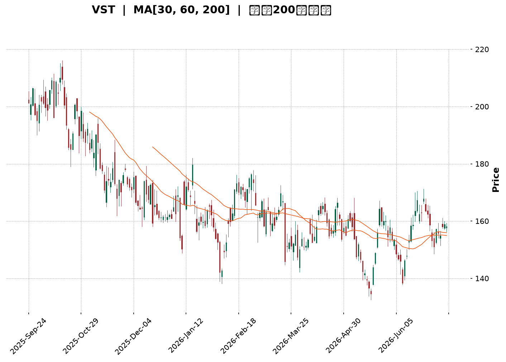
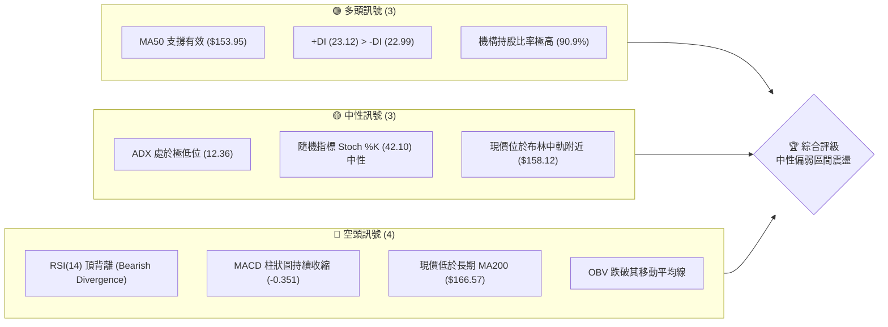
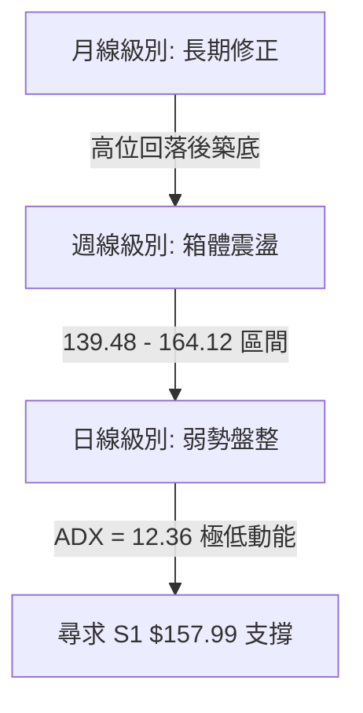
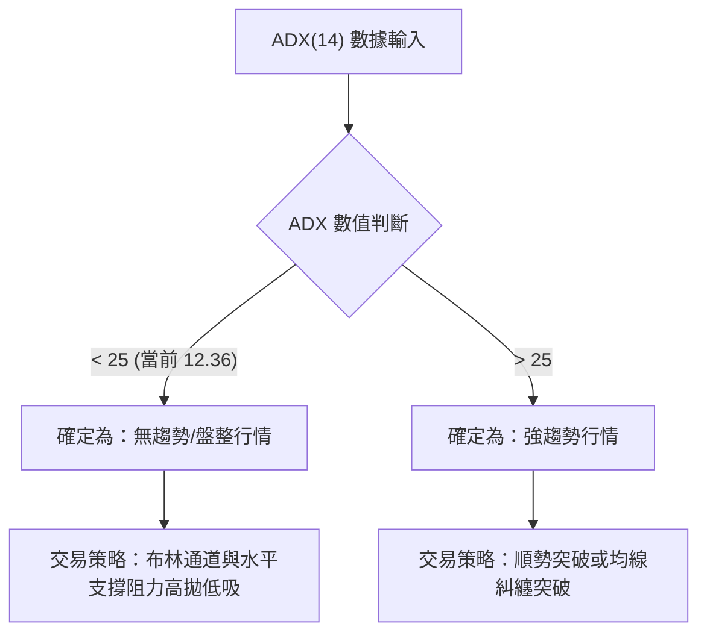
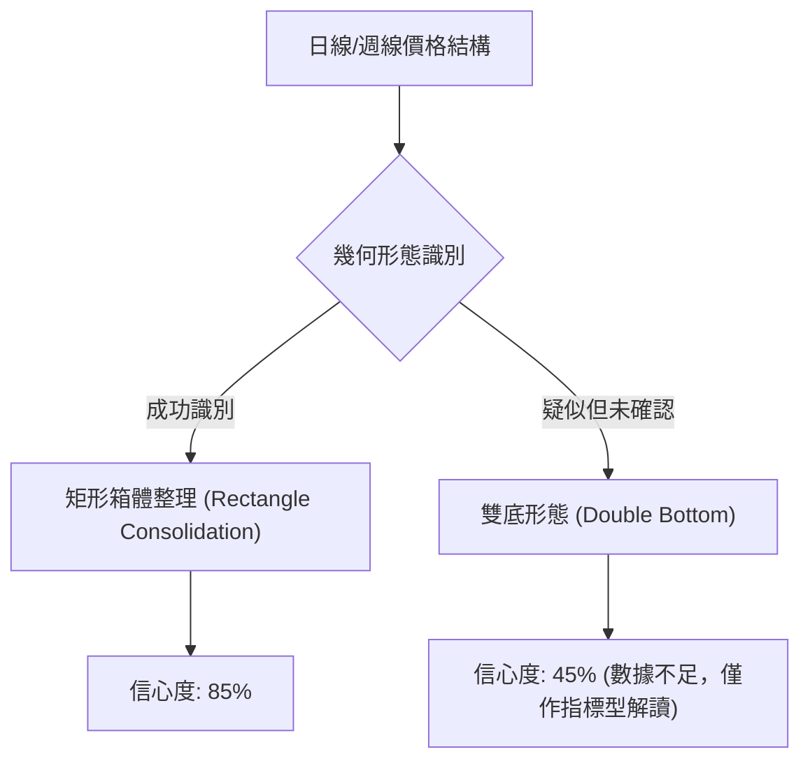
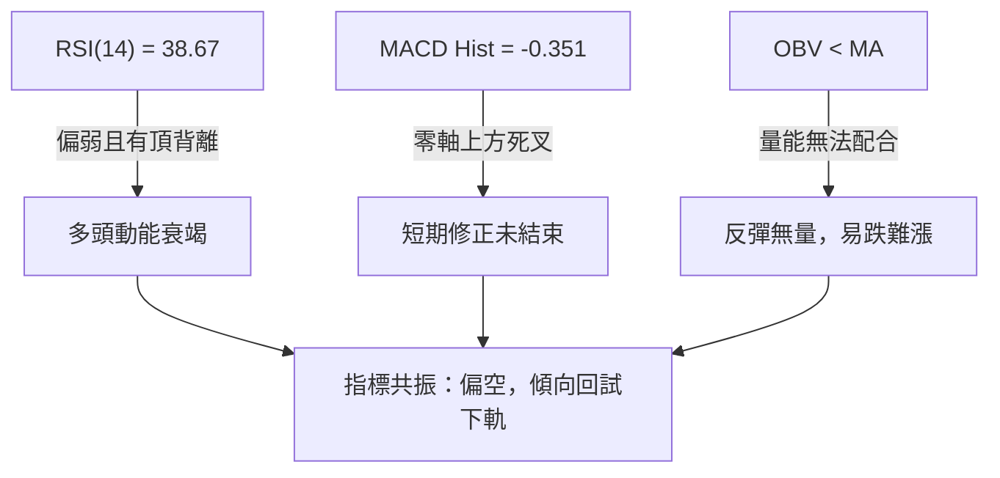
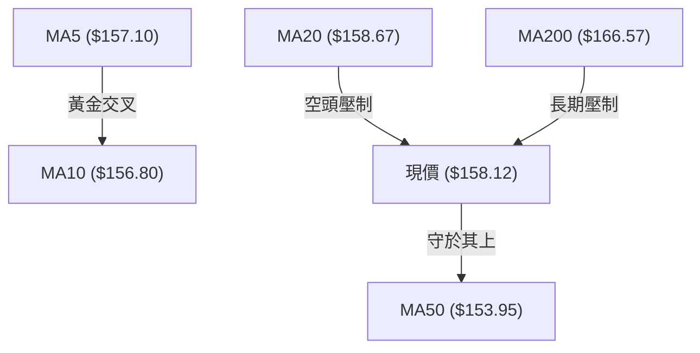
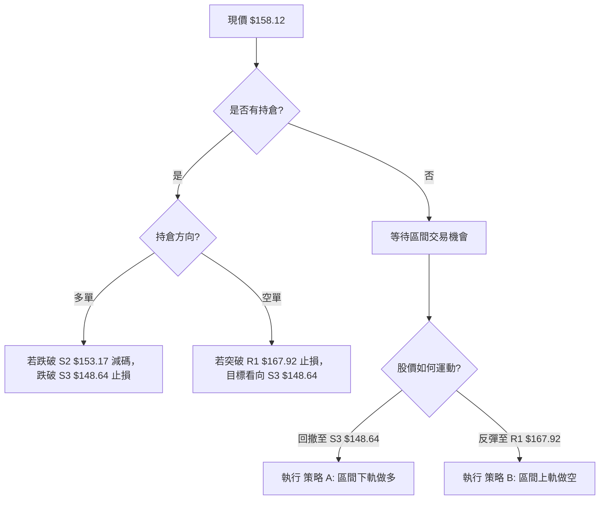
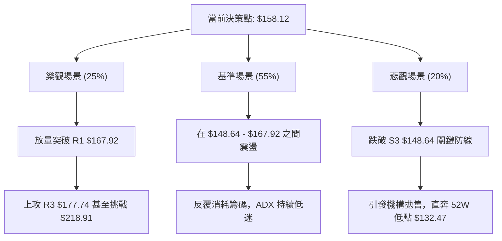

<details>
<summary>📊 靜態圖表 (點擊展開)</summary>

</details>

<html>
<head><meta charset="utf-8" /></head>
<body>
    <div style="height:500px; width:100%;">                        <script>window.PlotlyConfig = {MathJaxConfig: 'local'};</script>
        <script charset="utf-8" src="https://cdn.plot.ly/plotly-3.7.0.min.js" integrity="sha256-jvTGqxNp8AGWEcvNLVuKr+8j5dGe9Yw51LQkmDH+IYA=" crossorigin="anonymous"></script>                <div id="candlestick-chart" class="plotly-graph-div" style="height:100%; width:100%;"></div>            <script>                window.PLOTLYENV=window.PLOTLYENV || {};                                if (document.getElementById("candlestick-chart")) {                    Plotly.newPlot(                        "candlestick-chart",                        [{"close":{"dtype":"f8","bdata":"AAAAgBonaUAAAAAAFRlpQAAAAACKy2lAAAAAgM+jaEAAAABgcGNoQAAAAKCTFWlAAAAAwOc5aUAAAACg3yRpQAAAAMCF8mhAAAAA4FjZaEAAAAAgMLZpQAAAAGAhJGpAAAAA4GSBaEAAAABAyhVqQAAAAMALlWlAAAAAoDc\u002fakAAAABg4DBqQAAAAGB6EGlAAAAA4OYtaEAAAADg4jdnQAAAAODlIWdAAAAAQHHSZ0AAAABATRRpQAAAAIAmz2hAAAAAAJa5Z0AAAABgYdFoQAAAAACLnWdAAAAAIJxwZ0AAAAAgqQdoQAAAAKAHH2dAAAAAYFiTZ0AAAACAVvtmQAAAAMCmxmdAAAAAAPlvZ0AAAADAV01mQAAAAED7MGZAAAAAwCZbZUAAAABg5b5lQAAAAGDGyGVAAAAAwEq2ZUAAAACgtExmQAAAAAA3omVAAAAAgIH8ZEAAAACAPM1lQAAAAAA1RGVAAAAA4CICZkAAAABgyENmQAAAAIBvnWVAAAAAQLN6ZUAAAAAABV5lQAAAAIDf6mVAAAAAIEHPZEAAAAAAy61kQAAAACAMhGRAAAAAAIWPZEAAAAAgB7xlQAAAAECgLGVAAAAAwKvxZEAAAABgYZdlQAAAAEDP6WNAAAAAIGOvZEAAAADgUktkQAAAAAD6I2RAAAAA4ConZEAAAAAgbDBkQAAAAOAqJ2RAAAAAoJcsZEAAAADAe0VkQAAAAEBRHGRAAAAAAMaYZEAAAABAYE9kQAAAAGD+IWVAAAAAQI1FY0AAAADA58ViQAAAAAAnvWRAAAAAIFODZUAAAACATl5lQAAAAIAfEGVAAAAAYNp1ZkAAAAAAfsRkQAAAAIATjGNAAAAAYIPyY0AAAADgXP1jQAAAAEC09WNAAAAAYObLY0AAAACA0XlkQAAAAGDbpWRAAAAAADVEZEAAAACAOL1jQAAAAKCzOmNAAAAAQH4SY0AAAADgDsRhQAAAACCc1WFAAAAAoJanYkAAAAAgiRFjQAAAAEAc5WNAAAAAQKn2Y0AAAABAzVRkQAAAAICKYGVAAAAAQG2mZUAAAACgLkNlQAAAAIDFgGVAAAAAIKtdZUAAAABAyepkQAAAAGCwZGVAAAAA4AncZUAAAABgoQpmQAAAAAAhrWVAAAAAwAaxZEAAAAAAIChkQAAAAEAZXWRAAAAAgAXeZEAAAABAy8ZjQAAAACBlZWRAAAAAYEl+ZEAAAADAEddjQAAAAOB45GNAAAAAAF7QY0AAAAAgYTFkQAAAAIANfGRAAAAAQNI0ZUAAAACAEN1kQAAAAAAbOmJAAAAAgILiYkAAAACgNBBjQAAAACCK6WJAAAAA4MgCY0AAAAAAZ2hjQAAAAGCtamJAAAAAINXDYkAAAACg1DdjQAAAAKD+3mJAAAAAoBjsYkAAAADg4S5jQAAAAACBdWNAAAAAICoRY0AAAACAb1BjQAAAAABSv2NAAAAAwLN3ZEAAAADgyVZkQAAAAGCNqWRAAAAAwGdnZEAAAADgDuxjQAAAACAwVmNAAAAA4E5yY0AAAABgLpRjQAAAAIDYg2RAAAAAABvLZEAAAABAoRxkQAAAAMBlMmNAAAAAANGzY0AAAADgAmJjQAAAAIAAFGRAAAAAoPsEZEAAAABAMsJjQAAAAMCCN2NAAAAAAG5wYkAAAADAy\u002fpiQAAAAIBEVWJAAAAAYCPNYUAAAAAgc7ZhQAAAAGCCb2FAAAAAYOERYUAAAAAgsdBgQAAAAGCO+WFAAAAAgOObYkAAAACgpYFjQAAAAECOimRAAAAAIKL9Y0AAAACgyQFkQAAAAIAwAGRAAAAA4GRRY0AAAACA+LdjQAAAAKC3MmNAAAAAoIUvY0AAAACgqZFiQAAAAOA5VmJAAAAAIH9AYkAAAACAFEthQAAAACCcRWJAAAAAIAR6YkAAAAAgxSljQAAAACBszGNAAAAAwHPTY0AAAAAgrHBkQAAAAOBR6GRAAAAA4HpMZEAAAAAA11tkQAAAAOCj+GRAAAAAIK5vZEAAAAAAKUxkQAAAAAAp1GNAAAAAwB4lY0AAAACgmeFiQAAAAEAKp2NAAAAAIFx3Y0AAAACAPVpjQAAAACBcv2NAAAAAIIXbY0AAAAAA18NjQA=="},"high":{"dtype":"f8","bdata":"sSv0qJ6qaUDpIHkuNm1pQBYjszx21GlABjVRP5PIaUDoAcQlZPVoQMA7cw6QgmlA472vKMuEaUDTbO3xgCpqQLdNeAEq4mlAOIVSC6tfaUD3\u002fSqWGbhpQCnXqoU6RmpApV+nzadvakAOJw5piSJqQCdbPKZ7\u002f2lASHr99nLkakAJ0689YwZrQIPizyq5JWpAHTzgMbqUaUBBhMYyxRNoQC8bM9DZlmdA8tQGbeTsZ0DDkj7+MCVpQPEw+n4XWmlAxpn+xOSPaEAVEzVLuPxoQMGQIp3av2hAMm8AbuECaEDEOS30LExoQHGn7kRE1mdAbmjz76f1Z0DK05OcvYpnQE87tJMKyWdA1+IjaXt\u002faEA1S5gyI2VnQKvztQ6KkWZAWwRKLxonZkAc0oN3HGhmQDOTz67QWGZAbUpl0+QVZkCszcOR6ZdmQOBfsGAokGdANKv70bWeZUAKcir2Jc9lQAljkbYrwGVAaRNZ+WggZkDGT5o7poBmQNAwCEPw92VAKDZFfAznZUB8rF3BIKRlQNEtulr4KWZAOLAaGrj8ZUDOOsi99+NkQEJvihqSJmVAR1AFX5uqZEDnWbflRMVlQGyLA6gcaGZAoli3XgqJZUD11CkxraZlQN4l9Xg8zWVAF9TpxZ9mZUCS8PoqX1ZlQP1gbxNqe2RAL5U2v\u002fJnZED\u002fqwsAXkRkQFPdHzGcUWRAFb3Taed3ZEBopEtOhlNkQCZgUjt6gWRAl4LCGAQaZUBN6ilQzmVlQGnwWiRIhGVADJZ2N+kFZUBE4m2b2GtjQI4l+vVAyGVAlbA93BMIZkCwF9cr6d5lQIyfx82lVmVA5ekMls3BZkB5BYeYu1RlQB0n6UxYsWRAHYwfVA8xZEAt7aXIkGFkQGW0bhl2TWRAw3xmeVObZEBt9h99ToVkQEoXNTU3w2RA91i+11btZECO8DJCeoFkQN1Hm5o88WNAB1yxJi+CY0CvAnb7jSdjQNPBIGRq8GFABHBsw+D6YkBU0nYeNWtjQKg1I34wH2RAXNZfYVObZEB38xIXDLhkQGaXeEj3ZWVAuLdmYDQFZkB0Xxa1geBlQDMz92oBg2VAYlVA6q6gZUBLNqGRtWtlQOd\u002f4ISaZmVAP7E+JIzuZUBZsPm7thdmQD6L6bstOmZAbfWfhQ4BZkCOuXgEhmJkQK80SUo5eGRAPyMoHjbwZED\u002fpuOZS\u002f1kQNZEY0yghWRAtbWpCWEKZUDnlar3M3FkQGr0MxD+V2RAPFB2lxeZZEDlyrbfkGFkQO3BNvYcoGRAR1FHKbqQZUAGcUJaOiRlQBLbDReXx2RAKP1\u002f0NJ1Y0CsEKnQTTxjQMnRnNhUt2NA\u002fbnmopsOY0AmnuYtO\u002f9jQDxygsOl1mNAkD6M8ELoYkC2cS484oNjQNmGlecAS2NAt5PhJIIcY0C6bzOgOD5jQAZrlYizImRA8CFS1q9JZEBedA6yD81jQAq8WAHZD2RAcz8APpChZEDlS+M8MMlkQGrTXFP41WRAFKUg4CMIZUCXUVpFQnpkQCk\u002fmrb9G2RAx48q73DbY0B3r+b7utRjQO2YHW70p2RAd8+tK+cFZUB7R3RdF2NkQOYAlq48HWRANaBGPgTtY0A5swBTUP1jQDpCyrjkRGRA\u002fCy2EUVyZEC+dxHoYlhkQFDM6dPxBGVAunURWhBZY0Ch9xobKhFjQKvCgvGbw2JADqrM9GlCYkBZFcYEB+NhQBJH9fiQnGFAIfOYCQlrYUBUh9ZTSBBhQKountBQFmJA6u50lUeiYkCkz2NbMKtjQKQP0fZO5WRAKSwZ0FGZZECFWNRkpGlkQLrBeGYEQmRAYUJ4NIHKY0DNoM\u002fOwxFkQI9n\u002fqkNtmNAvcvm+mI6Y0B4\u002f3EFYEJjQFtCdEHromJAiBs6wt\u002fCYkDg5SFTjvlhQOkUD+s5VmJAErqv1kPJYkB\u002f1sKDcWdjQL3COj8iKGRAFzVshM9GZEA+fr7hQUNlQAAAAAAAUGVAAAAAYGa6ZEAAAADgerRkQAAAAEAza2VAAAAAgML9ZEAAAABAM7NkQAAAAGBmrmRAAAAAgD2qY0AAAAAgrodjQAAAACCup2NAAAAAwB7tY0AAAADgpY9jQAAAAIDCJWRAAAAA4KMAZEAAAACAwu1jQA=="},"hovertemplate":"\u003cb\u003e%{x|%Y-%m-%d}\u003c\u002fb\u003e\u003cbr\u003e\u958b: $%{open:.2f}\u003cbr\u003e\u9ad8: $%{high:.2f}\u003cbr\u003e\u4f4e: $%{low:.2f}\u003cbr\u003e\u6536: $%{close:.2f}\u003cextra\u003e\u003c\u002fextra\u003e","low":{"dtype":"f8","bdata":"72mRdAwhaUBD2UJ5TmZoQBSbsOCvBGlAxdp3hymcaEAKLJV4F71nQNgz77Lv62dAZPxDPFm8aEARns0lQhVpQAfjNb+Ok2hAHk+2pVJiaECPdm4YgeloQFXliD14j2lAycT8rcGAaEA2gyc+NPJoQOErv0ISEmlAW6BnUGixaUDnVw1NMfppQIyw6+oM52hA8fmLbzwAaEBVzavGnBlnQIO2mjb1XGZAt1H46xIeZ0Cz7faoXzloQFU2+QDsdWhAgwnm7I72ZkDdk4\u002f65JVnQPb2RQBCeGdAOMGQxkjYZkBPmRpXJGJnQAMTC6GD92ZAt8kzhzcFZ0AO\u002fgAvIllmQMSS3j3D+2VAPIO3+a3sZkD7hjtkMEJmQJvmmkvAEWZA77VxdQI6ZUCFHJLDlZxkQM3Mhz\u002fdjGVAP9iunng+ZUA7avQn669lQOQLbMwujWVAOW9MsYU4ZEDQxchNyKZkQGznWCrxpmRAJuVj17+LZUDrlP0AsihmQJLBoWYpf2VA2GOdAvBUZUDN+UFb+gdlQGFiKZpyOGVAf34viPK4ZEB1XER9JWxkQAiB0Xd\u002fgWRAsCshpL6\u002fY0BMKEZ68wpkQPYvPFXF2WRAHZXnBTPJZECz08ENf7tkQBI4B4ZWwWNAuxrsCNo\u002fZEDfJDC2zkBkQPrOqAUADWRAHAXODQb2Y0BygFEeiepjQLiA9lQL\u002fWNALxNWDXPvY0Apj52BsxNkQF1kbpzOGGRAdg2ICANuZEAMQKAs8PdjQMmXLFOAamRA2E\u002fhlLkjY0BCs5Ld6JhiQE+O6hKErWRA1kDeOBN0ZEDeLVbvKEtlQAmuEN7wsmRALFZKeppmZUCQ593C7VFkQEYDAqg0emNAE556oBArY0BSxNXYv9ZjQBerkikNsmNAsPTxMNyuY0DYo\u002fZ21rZjQHJvtn\u002fkFmRAlj1OEiXKY0BH+6sMrI1jQIlFp7JcM2NAx\u002fGicES\u002fYkBRynpTWFxhQJB\u002fnfq6RGFAoVD\u002f5WxgYkApz03r6WtiQHI0YcFATGNA3k8wSZrDY0BZju\u002fEo\u002f5jQOJ0cSW+IWRAmwu3bGUvZUBjWzTyiyRlQM3MzIwl+WRANvZZnRQRZUDS0w6JIphkQO4nQubHTWRAguzWdIszZUBvC+I+CHVkQG24oMxkTWVAxKe3neurZEBBm9HR2hFjQEu\u002fIcWj\u002fmNAZU26hXwnZEBsqukIoLtjQJ\u002flsfBQUmNAwyShRUF7ZEDUcTVgGldjQJfjhPaQiGNASUClUm+pY0AeewidYvVjQF\u002fyRRKHNWRAkW21qWOhZEDCtHuW3HhkQPzSGyIUFGJAMJxIpQmkYkDIghxR6KpiQOtADzJuxWJA9Usz7x9JYkASHMOaNfFiQNFCycSjTGJAiLqFiYLEYUDwOsZTBuZiQKymnUQfvWJAen379nO1YkBI+6kTPMJiQDOfqJ9UYmNAyEFPbe0OY0AxzB4PqxxjQGb9A\u002fX3DWNAg3SBR90DZEAs990siz1kQKeo3jM+TGRAlLte\u002fw5BZEDZnOTJJ8NjQEHjf09DPWNAUI5+14FWY0Cy3fMLFkljQAHJlGTbXWNA3MG7n2rQY0A2uGT+789jQFfgSKK1G2NA9swxDGRwY0Bi23ei01ZjQFKs7NAIp2NAeKEM5XLyY0AVqkw8MYxjQJ\u002f43E\u002fCMWNAWqwzWshYYkDweaqfWUJiQFPafhyaLmJATeGNoxNqYUDmVQIJPndhQFW5CMzAM2FAMX2ym4e1YEBFRir8Lo9gQFW9NsnAM2FA2zmWPa0VYkC8U+f8QNFiQAsFCaL1v2NAx0+ltPfFY0AkQ4fTJaxjQGrbzMAjlWNA1Ueoq8njYkCz\u002f\u002f2PURVjQFVD8ByOF2NAkYOr9Vu\u002fYkBRAlovZmliQIzw+hScRWJA9W52HfKqYUAAGpvX8jZhQGkiR6P+a2FACw9272tZYkDj7yV5PsFiQEGD35a4E2NANWUyT6+fY0AyEYV9zPljQAAAAMDMXGRAAAAA4KPkY0AAAAAAKfxjQAAAAOBRwGRAAAAAgBRmZEAAAADgoyBkQAAAAOBRkGNAAAAAoJnhYkAAAAAAAJBiQAAAAOBRAGNAAAAA4FFAY0AAAACAPepiQAAAAIA9rmNAAAAAoJmhY0AAAABgZoZjQA=="},"name":"\u50f9\u683c","open":{"dtype":"f8","bdata":"HZHjGlhNaUB\u002ftxb9uKVoQLaAOKeyC2lAWHjTDzElaUB05F8npctoQMHL5eweRmhA+3NmZjNmaUDgL\u002f2RFHBpQEfxSGTCqWlAGxF8H30XaUCs0tu6zhdpQHzFV0yHxGlAo5wpWnscakCDm\u002fIHJglpQImhtfz3nWlAOl5P23UOakCebloZxrxqQDUaKwfh2WlAh5ZyvRFpaUDjiWjrjwJoQHYgS7C1WGdAt1H46xIeZ0DP1Z61G3loQPEw+n4XWmlAxpn+xOSPaEBU4zo0FPBnQOtqM0XsO2hA6IzeyoTmZ0CqzoLDmMBnQBiFtpE8amdAZ3lst5kvZ0BQeuUmNcRmQKI5a3BPOGZA2UErXL8\u002faEC+ceXzwyRnQF6dQcOgcmZA\u002flLLO6QFZkBvOmqHks9kQACAGER61mVA3QmdqzR+ZUAdVzu4381lQKohkB+2AWdAswulZSxpZUDhnoJdvBtlQFK+6gt1q2VA9zovYeioZUA3U1h+PkhmQNZW4vr16GVA\u002frb3i4XVZUAVYG2vNH5lQBA5PW38ZWVADh\u002fUtjb5ZUDOOsi99+NkQE1yZ5nklWRA+EFu2e+UZEAtDo\u002fkFyxkQOkOdBsmz2VAwiOPGsSHZUBMRxLIrr5kQOejUt05qWVA\u002fSShkyKfZEAhBznQRsBkQK0495SFcWRAPiCCAvojZECf4vfLdxFkQAAAAOAqJ2RAbvnvW8kRZEDiuBTDsjFkQMT3T34ZTmRAdg2ICANuZECRemU04xxlQH\u002fKW5oUEWVADJZ2N+kFZUCDfXhpS1pjQENNHnoru2VAQqhvI+eGZEDtmwORo7BlQH5xCqKGHWVAHhcmJbqQZUCrBJHnzuJkQDYVgBNnGmRA4gOXM0jSY0B7Q17Edi9kQJBFQPbf8WNAX5qV5bMEZEBPdFXaPOJjQAMSKV1YsWRA+pFJnBGwZECJOzEPviFkQBMR9+LhpmNA9J43vQ52Y0BHkL1ajhhjQKI0NWiNk2FAa9D79sGyYkBu+0D\u002fwbJiQP8aiquj\u002fmNAtWjz4m6RZECQVLWvKwlkQPomgY52PmRArc\u002fyBxNNZUCzq6VB9bBlQM3MrsgeLmVAfVDtqGN6ZUDlgIFQakVlQOpTkTUx2mRAQCWPGfF8ZUADs1tlZFxlQDlPCwqN0GVAtfGq2l83ZUBo0dJZzidkQEETXmCdJGRAX7WIgN4tZECAT2jL4X9kQGTymVkJb2NAhtLhDeycZEAjZwnowWRkQHS+91+xlGNAXasA\u002fgkqZEDE9tBfyRFkQLZHLfqLS2RAj1tLA16pZEB0WhWlrtZkQBLbDReXx2RAmxHEap\u002fnYkBVWETc3MpiQIN5bkQQWWNAFtysU0+pYkASHMOaNfFiQMNnenornGNAEtlGKlz2YUD9knYGQ+hiQICb+if032JA9OUFTYXaYkDcdrDGettiQAVs6HLOEGRAPQVdB4F1Y0C1llR3ISljQGb9A\u002fX3DWNAatE0H9pFZEDBGUQMmKhkQBLbfh\u002fgimRAu4FBLOHAZEBtoxW6TVpkQJjXwDsgEWRASUIb2YmyY0BLmyKyvXdjQE18AoCQg2NAdODPuZ2YZECDL+ZwukhkQKC43UBSFGRAUnbWIUmCY0AWdODp1cJjQCU9uPMFr2NAQPX8m7RYZEBC+YzonChkQAgE1t37WWRAunURWhBZY0DUzoWFYHliQPplZZz9qGJADqrM9GlCYkA7DQJV1aVhQL8gZYmLcmFArLtFmcdZYUBrpU3jhfNgQAAAABzTOWFA\u002fMREu4coYkDwR7uHM9piQMfGYjoC1mNAKozppVaXZECvggyfxdNjQEMghwLX+GNAwtBlVvmYY0BjyZkBGndjQLXtAdRQiWNADDiWnn\u002fqYkCvGpyhMvliQLf923hIg2JAMRzhS8yGYkAG62cFyeRhQMrc7v5emWFAVhuremB5YkCCqUriFBNjQJtjJ2ckIWNAh9cz6fvKY0DwVzxkoDtkQAAAAAApcGRAAAAAYI8CZEAAAADA9WBkQAAAAMAe3WRAAAAAIIW7ZEAAAABgZnZkQAAAAGCPUmRAAAAAAACAY0AAAABgZj5jQAAAAEAKD2NAAAAAACmEY0AAAAAgrj9jQAAAAOBR4GNAAAAAoJmxY0AAAADAzLRjQA=="},"x":["2025-09-24T00:00:00-04:00","2025-09-25T00:00:00-04:00","2025-09-26T00:00:00-04:00","2025-09-29T00:00:00-04:00","2025-09-30T00:00:00-04:00","2025-10-01T00:00:00-04:00","2025-10-02T00:00:00-04:00","2025-10-03T00:00:00-04:00","2025-10-06T00:00:00-04:00","2025-10-07T00:00:00-04:00","2025-10-08T00:00:00-04:00","2025-10-09T00:00:00-04:00","2025-10-10T00:00:00-04:00","2025-10-13T00:00:00-04:00","2025-10-14T00:00:00-04:00","2025-10-15T00:00:00-04:00","2025-10-16T00:00:00-04:00","2025-10-17T00:00:00-04:00","2025-10-20T00:00:00-04:00","2025-10-21T00:00:00-04:00","2025-10-22T00:00:00-04:00","2025-10-23T00:00:00-04:00","2025-10-24T00:00:00-04:00","2025-10-27T00:00:00-04:00","2025-10-28T00:00:00-04:00","2025-10-29T00:00:00-04:00","2025-10-30T00:00:00-04:00","2025-10-31T00:00:00-04:00","2025-11-03T00:00:00-05:00","2025-11-04T00:00:00-05:00","2025-11-05T00:00:00-05:00","2025-11-06T00:00:00-05:00","2025-11-07T00:00:00-05:00","2025-11-10T00:00:00-05:00","2025-11-11T00:00:00-05:00","2025-11-12T00:00:00-05:00","2025-11-13T00:00:00-05:00","2025-11-14T00:00:00-05:00","2025-11-17T00:00:00-05:00","2025-11-18T00:00:00-05:00","2025-11-19T00:00:00-05:00","2025-11-20T00:00:00-05:00","2025-11-21T00:00:00-05:00","2025-11-24T00:00:00-05:00","2025-11-25T00:00:00-05:00","2025-11-26T00:00:00-05:00","2025-11-28T00:00:00-05:00","2025-12-01T00:00:00-05:00","2025-12-02T00:00:00-05:00","2025-12-03T00:00:00-05:00","2025-12-04T00:00:00-05:00","2025-12-05T00:00:00-05:00","2025-12-08T00:00:00-05:00","2025-12-09T00:00:00-05:00","2025-12-10T00:00:00-05:00","2025-12-11T00:00:00-05:00","2025-12-12T00:00:00-05:00","2025-12-15T00:00:00-05:00","2025-12-16T00:00:00-05:00","2025-12-17T00:00:00-05:00","2025-12-18T00:00:00-05:00","2025-12-19T00:00:00-05:00","2025-12-22T00:00:00-05:00","2025-12-23T00:00:00-05:00","2025-12-24T00:00:00-05:00","2025-12-26T00:00:00-05:00","2025-12-29T00:00:00-05:00","2025-12-30T00:00:00-05:00","2025-12-31T00:00:00-05:00","2026-01-02T00:00:00-05:00","2026-01-05T00:00:00-05:00","2026-01-06T00:00:00-05:00","2026-01-07T00:00:00-05:00","2026-01-08T00:00:00-05:00","2026-01-09T00:00:00-05:00","2026-01-12T00:00:00-05:00","2026-01-13T00:00:00-05:00","2026-01-14T00:00:00-05:00","2026-01-15T00:00:00-05:00","2026-01-16T00:00:00-05:00","2026-01-20T00:00:00-05:00","2026-01-21T00:00:00-05:00","2026-01-22T00:00:00-05:00","2026-01-23T00:00:00-05:00","2026-01-26T00:00:00-05:00","2026-01-27T00:00:00-05:00","2026-01-28T00:00:00-05:00","2026-01-29T00:00:00-05:00","2026-01-30T00:00:00-05:00","2026-02-02T00:00:00-05:00","2026-02-03T00:00:00-05:00","2026-02-04T00:00:00-05:00","2026-02-05T00:00:00-05:00","2026-02-06T00:00:00-05:00","2026-02-09T00:00:00-05:00","2026-02-10T00:00:00-05:00","2026-02-11T00:00:00-05:00","2026-02-12T00:00:00-05:00","2026-02-13T00:00:00-05:00","2026-02-17T00:00:00-05:00","2026-02-18T00:00:00-05:00","2026-02-19T00:00:00-05:00","2026-02-20T00:00:00-05:00","2026-02-23T00:00:00-05:00","2026-02-24T00:00:00-05:00","2026-02-25T00:00:00-05:00","2026-02-26T00:00:00-05:00","2026-02-27T00:00:00-05:00","2026-03-02T00:00:00-05:00","2026-03-03T00:00:00-05:00","2026-03-04T00:00:00-05:00","2026-03-05T00:00:00-05:00","2026-03-06T00:00:00-05:00","2026-03-09T00:00:00-04:00","2026-03-10T00:00:00-04:00","2026-03-11T00:00:00-04:00","2026-03-12T00:00:00-04:00","2026-03-13T00:00:00-04:00","2026-03-16T00:00:00-04:00","2026-03-17T00:00:00-04:00","2026-03-18T00:00:00-04:00","2026-03-19T00:00:00-04:00","2026-03-20T00:00:00-04:00","2026-03-23T00:00:00-04:00","2026-03-24T00:00:00-04:00","2026-03-25T00:00:00-04:00","2026-03-26T00:00:00-04:00","2026-03-27T00:00:00-04:00","2026-03-30T00:00:00-04:00","2026-03-31T00:00:00-04:00","2026-04-01T00:00:00-04:00","2026-04-02T00:00:00-04:00","2026-04-06T00:00:00-04:00","2026-04-07T00:00:00-04:00","2026-04-08T00:00:00-04:00","2026-04-09T00:00:00-04:00","2026-04-10T00:00:00-04:00","2026-04-13T00:00:00-04:00","2026-04-14T00:00:00-04:00","2026-04-15T00:00:00-04:00","2026-04-16T00:00:00-04:00","2026-04-17T00:00:00-04:00","2026-04-20T00:00:00-04:00","2026-04-21T00:00:00-04:00","2026-04-22T00:00:00-04:00","2026-04-23T00:00:00-04:00","2026-04-24T00:00:00-04:00","2026-04-27T00:00:00-04:00","2026-04-28T00:00:00-04:00","2026-04-29T00:00:00-04:00","2026-04-30T00:00:00-04:00","2026-05-01T00:00:00-04:00","2026-05-04T00:00:00-04:00","2026-05-05T00:00:00-04:00","2026-05-06T00:00:00-04:00","2026-05-07T00:00:00-04:00","2026-05-08T00:00:00-04:00","2026-05-11T00:00:00-04:00","2026-05-12T00:00:00-04:00","2026-05-13T00:00:00-04:00","2026-05-14T00:00:00-04:00","2026-05-15T00:00:00-04:00","2026-05-18T00:00:00-04:00","2026-05-19T00:00:00-04:00","2026-05-20T00:00:00-04:00","2026-05-21T00:00:00-04:00","2026-05-22T00:00:00-04:00","2026-05-26T00:00:00-04:00","2026-05-27T00:00:00-04:00","2026-05-28T00:00:00-04:00","2026-05-29T00:00:00-04:00","2026-06-01T00:00:00-04:00","2026-06-02T00:00:00-04:00","2026-06-03T00:00:00-04:00","2026-06-04T00:00:00-04:00","2026-06-05T00:00:00-04:00","2026-06-08T00:00:00-04:00","2026-06-09T00:00:00-04:00","2026-06-10T00:00:00-04:00","2026-06-11T00:00:00-04:00","2026-06-12T00:00:00-04:00","2026-06-15T00:00:00-04:00","2026-06-16T00:00:00-04:00","2026-06-17T00:00:00-04:00","2026-06-18T00:00:00-04:00","2026-06-22T00:00:00-04:00","2026-06-23T00:00:00-04:00","2026-06-24T00:00:00-04:00","2026-06-25T00:00:00-04:00","2026-06-26T00:00:00-04:00","2026-06-29T00:00:00-04:00","2026-06-30T00:00:00-04:00","2026-07-01T00:00:00-04:00","2026-07-02T00:00:00-04:00","2026-07-06T00:00:00-04:00","2026-07-07T00:00:00-04:00","2026-07-08T00:00:00-04:00","2026-07-09T00:00:00-04:00","2026-07-10T00:00:00-04:00","2026-07-13T00:00:00-04:00"],"type":"candlestick"},{"hovertemplate":"MA30: $%{y:.2f}\u003cextra\u003e\u003c\u002fextra\u003e","line":{"color":"#2196F3","dash":"dash","width":2},"mode":"lines","name":"MA30","x":["2025-09-24T00:00:00-04:00","2025-09-25T00:00:00-04:00","2025-09-26T00:00:00-04:00","2025-09-29T00:00:00-04:00","2025-09-30T00:00:00-04:00","2025-10-01T00:00:00-04:00","2025-10-02T00:00:00-04:00","2025-10-03T00:00:00-04:00","2025-10-06T00:00:00-04:00","2025-10-07T00:00:00-04:00","2025-10-08T00:00:00-04:00","2025-10-09T00:00:00-04:00","2025-10-10T00:00:00-04:00","2025-10-13T00:00:00-04:00","2025-10-14T00:00:00-04:00","2025-10-15T00:00:00-04:00","2025-10-16T00:00:00-04:00","2025-10-17T00:00:00-04:00","2025-10-20T00:00:00-04:00","2025-10-21T00:00:00-04:00","2025-10-22T00:00:00-04:00","2025-10-23T00:00:00-04:00","2025-10-24T00:00:00-04:00","2025-10-27T00:00:00-04:00","2025-10-28T00:00:00-04:00","2025-10-29T00:00:00-04:00","2025-10-30T00:00:00-04:00","2025-10-31T00:00:00-04:00","2025-11-03T00:00:00-05:00","2025-11-04T00:00:00-05:00","2025-11-05T00:00:00-05:00","2025-11-06T00:00:00-05:00","2025-11-07T00:00:00-05:00","2025-11-10T00:00:00-05:00","2025-11-11T00:00:00-05:00","2025-11-12T00:00:00-05:00","2025-11-13T00:00:00-05:00","2025-11-14T00:00:00-05:00","2025-11-17T00:00:00-05:00","2025-11-18T00:00:00-05:00","2025-11-19T00:00:00-05:00","2025-11-20T00:00:00-05:00","2025-11-21T00:00:00-05:00","2025-11-24T00:00:00-05:00","2025-11-25T00:00:00-05:00","2025-11-26T00:00:00-05:00","2025-11-28T00:00:00-05:00","2025-12-01T00:00:00-05:00","2025-12-02T00:00:00-05:00","2025-12-03T00:00:00-05:00","2025-12-04T00:00:00-05:00","2025-12-05T00:00:00-05:00","2025-12-08T00:00:00-05:00","2025-12-09T00:00:00-05:00","2025-12-10T00:00:00-05:00","2025-12-11T00:00:00-05:00","2025-12-12T00:00:00-05:00","2025-12-15T00:00:00-05:00","2025-12-16T00:00:00-05:00","2025-12-17T00:00:00-05:00","2025-12-18T00:00:00-05:00","2025-12-19T00:00:00-05:00","2025-12-22T00:00:00-05:00","2025-12-23T00:00:00-05:00","2025-12-24T00:00:00-05:00","2025-12-26T00:00:00-05:00","2025-12-29T00:00:00-05:00","2025-12-30T00:00:00-05:00","2025-12-31T00:00:00-05:00","2026-01-02T00:00:00-05:00","2026-01-05T00:00:00-05:00","2026-01-06T00:00:00-05:00","2026-01-07T00:00:00-05:00","2026-01-08T00:00:00-05:00","2026-01-09T00:00:00-05:00","2026-01-12T00:00:00-05:00","2026-01-13T00:00:00-05:00","2026-01-14T00:00:00-05:00","2026-01-15T00:00:00-05:00","2026-01-16T00:00:00-05:00","2026-01-20T00:00:00-05:00","2026-01-21T00:00:00-05:00","2026-01-22T00:00:00-05:00","2026-01-23T00:00:00-05:00","2026-01-26T00:00:00-05:00","2026-01-27T00:00:00-05:00","2026-01-28T00:00:00-05:00","2026-01-29T00:00:00-05:00","2026-01-30T00:00:00-05:00","2026-02-02T00:00:00-05:00","2026-02-03T00:00:00-05:00","2026-02-04T00:00:00-05:00","2026-02-05T00:00:00-05:00","2026-02-06T00:00:00-05:00","2026-02-09T00:00:00-05:00","2026-02-10T00:00:00-05:00","2026-02-11T00:00:00-05:00","2026-02-12T00:00:00-05:00","2026-02-13T00:00:00-05:00","2026-02-17T00:00:00-05:00","2026-02-18T00:00:00-05:00","2026-02-19T00:00:00-05:00","2026-02-20T00:00:00-05:00","2026-02-23T00:00:00-05:00","2026-02-24T00:00:00-05:00","2026-02-25T00:00:00-05:00","2026-02-26T00:00:00-05:00","2026-02-27T00:00:00-05:00","2026-03-02T00:00:00-05:00","2026-03-03T00:00:00-05:00","2026-03-04T00:00:00-05:00","2026-03-05T00:00:00-05:00","2026-03-06T00:00:00-05:00","2026-03-09T00:00:00-04:00","2026-03-10T00:00:00-04:00","2026-03-11T00:00:00-04:00","2026-03-12T00:00:00-04:00","2026-03-13T00:00:00-04:00","2026-03-16T00:00:00-04:00","2026-03-17T00:00:00-04:00","2026-03-18T00:00:00-04:00","2026-03-19T00:00:00-04:00","2026-03-20T00:00:00-04:00","2026-03-23T00:00:00-04:00","2026-03-24T00:00:00-04:00","2026-03-25T00:00:00-04:00","2026-03-26T00:00:00-04:00","2026-03-27T00:00:00-04:00","2026-03-30T00:00:00-04:00","2026-03-31T00:00:00-04:00","2026-04-01T00:00:00-04:00","2026-04-02T00:00:00-04:00","2026-04-06T00:00:00-04:00","2026-04-07T00:00:00-04:00","2026-04-08T00:00:00-04:00","2026-04-09T00:00:00-04:00","2026-04-10T00:00:00-04:00","2026-04-13T00:00:00-04:00","2026-04-14T00:00:00-04:00","2026-04-15T00:00:00-04:00","2026-04-16T00:00:00-04:00","2026-04-17T00:00:00-04:00","2026-04-20T00:00:00-04:00","2026-04-21T00:00:00-04:00","2026-04-22T00:00:00-04:00","2026-04-23T00:00:00-04:00","2026-04-24T00:00:00-04:00","2026-04-27T00:00:00-04:00","2026-04-28T00:00:00-04:00","2026-04-29T00:00:00-04:00","2026-04-30T00:00:00-04:00","2026-05-01T00:00:00-04:00","2026-05-04T00:00:00-04:00","2026-05-05T00:00:00-04:00","2026-05-06T00:00:00-04:00","2026-05-07T00:00:00-04:00","2026-05-08T00:00:00-04:00","2026-05-11T00:00:00-04:00","2026-05-12T00:00:00-04:00","2026-05-13T00:00:00-04:00","2026-05-14T00:00:00-04:00","2026-05-15T00:00:00-04:00","2026-05-18T00:00:00-04:00","2026-05-19T00:00:00-04:00","2026-05-20T00:00:00-04:00","2026-05-21T00:00:00-04:00","2026-05-22T00:00:00-04:00","2026-05-26T00:00:00-04:00","2026-05-27T00:00:00-04:00","2026-05-28T00:00:00-04:00","2026-05-29T00:00:00-04:00","2026-06-01T00:00:00-04:00","2026-06-02T00:00:00-04:00","2026-06-03T00:00:00-04:00","2026-06-04T00:00:00-04:00","2026-06-05T00:00:00-04:00","2026-06-08T00:00:00-04:00","2026-06-09T00:00:00-04:00","2026-06-10T00:00:00-04:00","2026-06-11T00:00:00-04:00","2026-06-12T00:00:00-04:00","2026-06-15T00:00:00-04:00","2026-06-16T00:00:00-04:00","2026-06-17T00:00:00-04:00","2026-06-18T00:00:00-04:00","2026-06-22T00:00:00-04:00","2026-06-23T00:00:00-04:00","2026-06-24T00:00:00-04:00","2026-06-25T00:00:00-04:00","2026-06-26T00:00:00-04:00","2026-06-29T00:00:00-04:00","2026-06-30T00:00:00-04:00","2026-07-01T00:00:00-04:00","2026-07-02T00:00:00-04:00","2026-07-06T00:00:00-04:00","2026-07-07T00:00:00-04:00","2026-07-08T00:00:00-04:00","2026-07-09T00:00:00-04:00","2026-07-10T00:00:00-04:00","2026-07-13T00:00:00-04:00"],"y":{"dtype":"f8","bdata":"AAAAAAAA+H8AAAAAAAD4fwAAAAAAAPh\u002fAAAAAAAA+H8AAAAAAAD4fwAAAAAAAPh\u002fAAAAAAAA+H8AAAAAAAD4fwAAAAAAAPh\u002fAAAAAAAA+H8AAAAAAAD4fwAAAAAAAPh\u002fAAAAAAAA+H8AAAAAAAD4fwAAAAAAAPh\u002fAAAAAAAA+H8AAAAAAAD4fwAAAAAAAPh\u002fAAAAAAAA+H8AAAAAAAD4fwAAAAAAAPh\u002fAAAAAAAA+H8AAAAAAAD4fwAAAAAAAPh\u002fAAAAAAAA+H8AAAAAAAD4fwAAAAAAAPh\u002fAAAAAAAA+H8AAAAAAAD4f0RERHTswmhAzczMDHe1aECrqqoqaKNoQERERGQtkmhAIiIiguqHaEAzMzPjHHZoQERERCRtXWhAVVVVtWY8aEBmZmbmZh9oQN7d3Q1pBGhAERERUaTpZ0CamZmZhsxnQKuqqtoPpmdAZmZmRgiIZ0BEREQEe2NnQO\u002fu7g6nPmdAMzMzs3saZ0BmZmbm+vhmQKuqqpqL22ZAmpmZWYHEZkAAAACwtbRmQLy7u5tXqmZA3t3dzaKQZkDe3d3tFWtmQKuqqupyRmZAmpmZWXIrZkCrqqqKIhFmQKuqqupN\u002fGVAMzMzowHnZUAiIiJyMtJlQDMzM7PStmVAREREZCieZUBmZmZWOYdlQERERJQzaGVAVVVVtSxMZUCrqqraJDplQKuqqgrAKGVARERENKoeZUDe3d2dFRJlQCIiInLNA2VAVVVVBUn6ZEDe3d29TulkQGZmZpYI5WRAiYiI2GbWZEAAAACwjrxkQImIiDgOuGRAiYiIGNSzZEBmZmbmLaxkQImIiAh4p2RARERENNevZECrqqoauapkQKuqqhp\u002flmRAIiIiciOPZECJiIjoQYlkQO\u002fu7j6DhGRAVVVV9f19ZEAAAABwQHNkQImIiGjCbmRA7+7uLvpoZEBVVVUFLFlkQERERMRVU2RAd3d3Z5JFZEAiIiIS\u002fy9kQGZmZkZRHGRAEREREYgPZEB3d3f39wVkQHd3d0fEA2RAEREREfgBZECJiIjIegJkQN7d3X1JDWRAiYiIiEYWZEAzMzMDZx5kQImIiMiPIWRAVVVVpW4zZEDe3d1tukVkQDMzMxNQS2RAmpmZGUVOZECJiIiYA1RkQBEREWE\u002fWWRAIiIiQidKZEDNzMzs8ERkQFVVVZXoS2RAERERQcJTZECamZmZ8FFkQCIiIrKpVWRA3t3d7ZtbZEAzMzMjL1ZkQLy7u+u8T2RAvLu7a+BLZEBERESkv09kQGZmZtZ1WmRAZmZm1qtsZEAzMzPTGodkQDMzM2N0imRA7+7uLmuMZEBVVVXVX4xkQImIiBj9g2RAREREBNx7ZEDe3d29+nNkQDMzM6O3WmRAd3d39xhCZECJiIgIpzBkQImIiHgxGmRAERERQVcFZEBmZmZGi\u002fZjQCIiIrIJ5mNAAAAAcDXOY0AiIiKC77ZjQM3MzKx5pmNAIiIigpCkY0BERES0HqZjQLy7uxurqGNAq6qq6rakY0B3d3fn9KVjQKuqqprqnGNAq6qq2vuTY0AzMzMTwZFjQAAAABARl2NAIiIismyfY0AiIiKiu55jQDMzM5O+k2NAMzMzM+mGY0DNzMycRnpjQHd3d4cSimNAvLu7O8GTY0BmZmYWsJljQBEREXFJnGNAvLu7i2iXY0DNzMw8wZNjQKuqqooKk2NAq6qqatGKY0BVVVXV+H1jQFVVVfW4cWNAERERUephY0De3d19tU1jQFVVVUULQWNAREREhCI9Y0BERER0xj5jQKuqqrqMRWNAMzMzE3tBY0C8u7u7pT5jQBEREYEAOWNAREREJLwvY0CamZmp\u002fy1jQKuqqvrQLGNAIiIiEpcqY0C8u7sL+SFjQBEREbFiD2NARERE1LL5YkCrqqqapeFiQERERATB2WJAERERQUvPYkBERERUa81iQERERIQIy2JAq6qq2mHJYkB3d3e3Ms9iQFVVVQWg3WJAERERUX7tYkBVVVX1QvliQDMzMyPGD2NAq6qqOkImY0AzMzPTUDxjQHd3d8e8UGNAZmZmBnJiY0AAAABgE3RjQN7d3U1kgmNAAAAAILWJY0CrqqraZIhjQKuqquqegWNAERER0XuAY0AiIiIya35jQA=="},"type":"scatter"},{"hovertemplate":"MA60: $%{y:.2f}\u003cextra\u003e\u003c\u002fextra\u003e","line":{"color":"#9C27B0","dash":"dash","width":2},"mode":"lines","name":"MA60","x":["2025-09-24T00:00:00-04:00","2025-09-25T00:00:00-04:00","2025-09-26T00:00:00-04:00","2025-09-29T00:00:00-04:00","2025-09-30T00:00:00-04:00","2025-10-01T00:00:00-04:00","2025-10-02T00:00:00-04:00","2025-10-03T00:00:00-04:00","2025-10-06T00:00:00-04:00","2025-10-07T00:00:00-04:00","2025-10-08T00:00:00-04:00","2025-10-09T00:00:00-04:00","2025-10-10T00:00:00-04:00","2025-10-13T00:00:00-04:00","2025-10-14T00:00:00-04:00","2025-10-15T00:00:00-04:00","2025-10-16T00:00:00-04:00","2025-10-17T00:00:00-04:00","2025-10-20T00:00:00-04:00","2025-10-21T00:00:00-04:00","2025-10-22T00:00:00-04:00","2025-10-23T00:00:00-04:00","2025-10-24T00:00:00-04:00","2025-10-27T00:00:00-04:00","2025-10-28T00:00:00-04:00","2025-10-29T00:00:00-04:00","2025-10-30T00:00:00-04:00","2025-10-31T00:00:00-04:00","2025-11-03T00:00:00-05:00","2025-11-04T00:00:00-05:00","2025-11-05T00:00:00-05:00","2025-11-06T00:00:00-05:00","2025-11-07T00:00:00-05:00","2025-11-10T00:00:00-05:00","2025-11-11T00:00:00-05:00","2025-11-12T00:00:00-05:00","2025-11-13T00:00:00-05:00","2025-11-14T00:00:00-05:00","2025-11-17T00:00:00-05:00","2025-11-18T00:00:00-05:00","2025-11-19T00:00:00-05:00","2025-11-20T00:00:00-05:00","2025-11-21T00:00:00-05:00","2025-11-24T00:00:00-05:00","2025-11-25T00:00:00-05:00","2025-11-26T00:00:00-05:00","2025-11-28T00:00:00-05:00","2025-12-01T00:00:00-05:00","2025-12-02T00:00:00-05:00","2025-12-03T00:00:00-05:00","2025-12-04T00:00:00-05:00","2025-12-05T00:00:00-05:00","2025-12-08T00:00:00-05:00","2025-12-09T00:00:00-05:00","2025-12-10T00:00:00-05:00","2025-12-11T00:00:00-05:00","2025-12-12T00:00:00-05:00","2025-12-15T00:00:00-05:00","2025-12-16T00:00:00-05:00","2025-12-17T00:00:00-05:00","2025-12-18T00:00:00-05:00","2025-12-19T00:00:00-05:00","2025-12-22T00:00:00-05:00","2025-12-23T00:00:00-05:00","2025-12-24T00:00:00-05:00","2025-12-26T00:00:00-05:00","2025-12-29T00:00:00-05:00","2025-12-30T00:00:00-05:00","2025-12-31T00:00:00-05:00","2026-01-02T00:00:00-05:00","2026-01-05T00:00:00-05:00","2026-01-06T00:00:00-05:00","2026-01-07T00:00:00-05:00","2026-01-08T00:00:00-05:00","2026-01-09T00:00:00-05:00","2026-01-12T00:00:00-05:00","2026-01-13T00:00:00-05:00","2026-01-14T00:00:00-05:00","2026-01-15T00:00:00-05:00","2026-01-16T00:00:00-05:00","2026-01-20T00:00:00-05:00","2026-01-21T00:00:00-05:00","2026-01-22T00:00:00-05:00","2026-01-23T00:00:00-05:00","2026-01-26T00:00:00-05:00","2026-01-27T00:00:00-05:00","2026-01-28T00:00:00-05:00","2026-01-29T00:00:00-05:00","2026-01-30T00:00:00-05:00","2026-02-02T00:00:00-05:00","2026-02-03T00:00:00-05:00","2026-02-04T00:00:00-05:00","2026-02-05T00:00:00-05:00","2026-02-06T00:00:00-05:00","2026-02-09T00:00:00-05:00","2026-02-10T00:00:00-05:00","2026-02-11T00:00:00-05:00","2026-02-12T00:00:00-05:00","2026-02-13T00:00:00-05:00","2026-02-17T00:00:00-05:00","2026-02-18T00:00:00-05:00","2026-02-19T00:00:00-05:00","2026-02-20T00:00:00-05:00","2026-02-23T00:00:00-05:00","2026-02-24T00:00:00-05:00","2026-02-25T00:00:00-05:00","2026-02-26T00:00:00-05:00","2026-02-27T00:00:00-05:00","2026-03-02T00:00:00-05:00","2026-03-03T00:00:00-05:00","2026-03-04T00:00:00-05:00","2026-03-05T00:00:00-05:00","2026-03-06T00:00:00-05:00","2026-03-09T00:00:00-04:00","2026-03-10T00:00:00-04:00","2026-03-11T00:00:00-04:00","2026-03-12T00:00:00-04:00","2026-03-13T00:00:00-04:00","2026-03-16T00:00:00-04:00","2026-03-17T00:00:00-04:00","2026-03-18T00:00:00-04:00","2026-03-19T00:00:00-04:00","2026-03-20T00:00:00-04:00","2026-03-23T00:00:00-04:00","2026-03-24T00:00:00-04:00","2026-03-25T00:00:00-04:00","2026-03-26T00:00:00-04:00","2026-03-27T00:00:00-04:00","2026-03-30T00:00:00-04:00","2026-03-31T00:00:00-04:00","2026-04-01T00:00:00-04:00","2026-04-02T00:00:00-04:00","2026-04-06T00:00:00-04:00","2026-04-07T00:00:00-04:00","2026-04-08T00:00:00-04:00","2026-04-09T00:00:00-04:00","2026-04-10T00:00:00-04:00","2026-04-13T00:00:00-04:00","2026-04-14T00:00:00-04:00","2026-04-15T00:00:00-04:00","2026-04-16T00:00:00-04:00","2026-04-17T00:00:00-04:00","2026-04-20T00:00:00-04:00","2026-04-21T00:00:00-04:00","2026-04-22T00:00:00-04:00","2026-04-23T00:00:00-04:00","2026-04-24T00:00:00-04:00","2026-04-27T00:00:00-04:00","2026-04-28T00:00:00-04:00","2026-04-29T00:00:00-04:00","2026-04-30T00:00:00-04:00","2026-05-01T00:00:00-04:00","2026-05-04T00:00:00-04:00","2026-05-05T00:00:00-04:00","2026-05-06T00:00:00-04:00","2026-05-07T00:00:00-04:00","2026-05-08T00:00:00-04:00","2026-05-11T00:00:00-04:00","2026-05-12T00:00:00-04:00","2026-05-13T00:00:00-04:00","2026-05-14T00:00:00-04:00","2026-05-15T00:00:00-04:00","2026-05-18T00:00:00-04:00","2026-05-19T00:00:00-04:00","2026-05-20T00:00:00-04:00","2026-05-21T00:00:00-04:00","2026-05-22T00:00:00-04:00","2026-05-26T00:00:00-04:00","2026-05-27T00:00:00-04:00","2026-05-28T00:00:00-04:00","2026-05-29T00:00:00-04:00","2026-06-01T00:00:00-04:00","2026-06-02T00:00:00-04:00","2026-06-03T00:00:00-04:00","2026-06-04T00:00:00-04:00","2026-06-05T00:00:00-04:00","2026-06-08T00:00:00-04:00","2026-06-09T00:00:00-04:00","2026-06-10T00:00:00-04:00","2026-06-11T00:00:00-04:00","2026-06-12T00:00:00-04:00","2026-06-15T00:00:00-04:00","2026-06-16T00:00:00-04:00","2026-06-17T00:00:00-04:00","2026-06-18T00:00:00-04:00","2026-06-22T00:00:00-04:00","2026-06-23T00:00:00-04:00","2026-06-24T00:00:00-04:00","2026-06-25T00:00:00-04:00","2026-06-26T00:00:00-04:00","2026-06-29T00:00:00-04:00","2026-06-30T00:00:00-04:00","2026-07-01T00:00:00-04:00","2026-07-02T00:00:00-04:00","2026-07-06T00:00:00-04:00","2026-07-07T00:00:00-04:00","2026-07-08T00:00:00-04:00","2026-07-09T00:00:00-04:00","2026-07-10T00:00:00-04:00","2026-07-13T00:00:00-04:00"],"y":{"dtype":"f8","bdata":"AAAAAAAA+H8AAAAAAAD4fwAAAAAAAPh\u002fAAAAAAAA+H8AAAAAAAD4fwAAAAAAAPh\u002fAAAAAAAA+H8AAAAAAAD4fwAAAAAAAPh\u002fAAAAAAAA+H8AAAAAAAD4fwAAAAAAAPh\u002fAAAAAAAA+H8AAAAAAAD4fwAAAAAAAPh\u002fAAAAAAAA+H8AAAAAAAD4fwAAAAAAAPh\u002fAAAAAAAA+H8AAAAAAAD4fwAAAAAAAPh\u002fAAAAAAAA+H8AAAAAAAD4fwAAAAAAAPh\u002fAAAAAAAA+H8AAAAAAAD4fwAAAAAAAPh\u002fAAAAAAAA+H8AAAAAAAD4fwAAAAAAAPh\u002fAAAAAAAA+H8AAAAAAAD4fwAAAAAAAPh\u002fAAAAAAAA+H8AAAAAAAD4fwAAAAAAAPh\u002fAAAAAAAA+H8AAAAAAAD4fwAAAAAAAPh\u002fAAAAAAAA+H8AAAAAAAD4fwAAAAAAAPh\u002fAAAAAAAA+H8AAAAAAAD4fwAAAAAAAPh\u002fAAAAAAAA+H8AAAAAAAD4fwAAAAAAAPh\u002fAAAAAAAA+H8AAAAAAAD4fwAAAAAAAPh\u002fAAAAAAAA+H8AAAAAAAD4fwAAAAAAAPh\u002fAAAAAAAA+H8AAAAAAAD4fwAAAAAAAPh\u002fAAAAAAAA+H8AAAAAAAD4f7y7u5PfPGdAiYiIuM8pZ0CJiIjAUBVnQERERHww\u002fWZAvLu7mwvqZkDv7u7eINhmQHd3d5cWw2ZAzczMdIitZkAiIiJCvphmQAAAAEAbhGZAMzMzq\u002fZxZkC8u7ur6lpmQImIiDiMRWZAd3d3jzcvZkAiIiLaBBBmQLy7u6Na+2VA3t3d5SfnZUBmZmZmlNJlQJqZmdGBwWVA7+7uRiy6ZUBVVVVlt69lQDMzM1troGVAAAAAIOOPZUAzMzPrK3plQM3MzBR7ZWVAd3d3J7hUZUBVVVV9MUJlQJqZmSmINWVAERER6f0nZUC8u7s7rxVlQLy7uzsUBWVA3t3dZd3xZEBEREQ0nNtkQFVVVW1CwmRAMzMzY9qtZEARERFpDqBkQBERESlClmRAq6qqIlGQZEAzMzMzSIpkQAAAAHiLiGRA7+7uxkeIZECJiIjg2oNkQHd3dy9Mg2RA7+7uvuqEZEDv7u6OJIFkQN7d3SWvgWRAERERmQyBZEB3d3e\u002fGIBkQM3MzLRbgGRAMzMzO\u002f98ZEC8u7sD1XdkQAAAANgzcWRAmpmZ2XJxZEARERFBmW1kQImIiHgWbWRAmpmZ8cxsZECamZnJt2RkQCIiIqo\u002fX2RAVVVVTW1aZEDNzMzUdVRkQFVVVc3lVmRA7+7uHh9ZZECrqqryjFtkQM3MzNRiU2RAAAAAoPlNZEBmZmbmK0lkQAAAALDgQ2RAq6qqCuo+ZEAzMzPDOjtkQImIiJAANGRAAAAAwC8sZEDe3d0FhydkQImIiKDgHWRAMzMz82IcZEAiIiLaIh5kQKuqquKsGGRAzczMRD0OZEBVVVWNeQVkQO\u002fu7obc\u002f2NAIiIi4lv3Y0CJiIjQh\u002fVjQImIiNhJ+mNA3t3dlTz8Y0CJiIjA8vtjQGZmZiZK+WNARERE5Mv3Y0AzMzMb+PNjQN7d3f1m82NA7+7ujqb1Y0AzMzOjPfdjQM3MzDQa92NAzczMhMr5Y0AAAAC4sABkQFVVVXVDCmRAVVVVNRYQZEDe3d31BxNkQM3MzEQjEGRAAAAASKIJZEBVVVX93QNkQO\u002fu7hbh9mNAERERMXXmY0Dv7u7uT9djQO\u002fu7jb1xWNAERERyaCzY0AiIiJiIKJjQLy7u3uKk2NAIiIi+quFY0AzMzP72npjQLy7uzMDdmNAq6qqygVzY0AAAAA4YnJjQGZmZs7VcGNAd3d3hzlqY0CJiIhI+mljQKuqqsrdZGNAZmZmdklfY0B3d3cP3VljQImIiOA5U2NAMzMzw49MY0BmZmaeMEBjQLy7u8u\u002fNmNAIiIiOhorY0CJiIj42CNjQN7d3YWNKmNAMzMzi5EuY0Dv7u5mcTRjQDMzM7v0PGNAZmZmbnNCY0AREREZgkZjQO\u002fu7lZoUWNAq6qq0olYY0BERETUJF1jQGZmZt46YWNAvLu7Ky5iY0Dv7u5u5GBjQJqZmcm3YWNAIiIi0mtjY0B3d3enlWNjQKuqqtKVY2NAIiIicvtgY0Dv7u52iF5jQA=="},"type":"scatter"},{"hovertemplate":"MA200: $%{y:.2f}\u003cextra\u003e\u003c\u002fextra\u003e","line":{"color":"#FF6F00","dash":"solid","width":2},"mode":"lines","name":"MA200","x":["2025-09-24T00:00:00-04:00","2025-09-25T00:00:00-04:00","2025-09-26T00:00:00-04:00","2025-09-29T00:00:00-04:00","2025-09-30T00:00:00-04:00","2025-10-01T00:00:00-04:00","2025-10-02T00:00:00-04:00","2025-10-03T00:00:00-04:00","2025-10-06T00:00:00-04:00","2025-10-07T00:00:00-04:00","2025-10-08T00:00:00-04:00","2025-10-09T00:00:00-04:00","2025-10-10T00:00:00-04:00","2025-10-13T00:00:00-04:00","2025-10-14T00:00:00-04:00","2025-10-15T00:00:00-04:00","2025-10-16T00:00:00-04:00","2025-10-17T00:00:00-04:00","2025-10-20T00:00:00-04:00","2025-10-21T00:00:00-04:00","2025-10-22T00:00:00-04:00","2025-10-23T00:00:00-04:00","2025-10-24T00:00:00-04:00","2025-10-27T00:00:00-04:00","2025-10-28T00:00:00-04:00","2025-10-29T00:00:00-04:00","2025-10-30T00:00:00-04:00","2025-10-31T00:00:00-04:00","2025-11-03T00:00:00-05:00","2025-11-04T00:00:00-05:00","2025-11-05T00:00:00-05:00","2025-11-06T00:00:00-05:00","2025-11-07T00:00:00-05:00","2025-11-10T00:00:00-05:00","2025-11-11T00:00:00-05:00","2025-11-12T00:00:00-05:00","2025-11-13T00:00:00-05:00","2025-11-14T00:00:00-05:00","2025-11-17T00:00:00-05:00","2025-11-18T00:00:00-05:00","2025-11-19T00:00:00-05:00","2025-11-20T00:00:00-05:00","2025-11-21T00:00:00-05:00","2025-11-24T00:00:00-05:00","2025-11-25T00:00:00-05:00","2025-11-26T00:00:00-05:00","2025-11-28T00:00:00-05:00","2025-12-01T00:00:00-05:00","2025-12-02T00:00:00-05:00","2025-12-03T00:00:00-05:00","2025-12-04T00:00:00-05:00","2025-12-05T00:00:00-05:00","2025-12-08T00:00:00-05:00","2025-12-09T00:00:00-05:00","2025-12-10T00:00:00-05:00","2025-12-11T00:00:00-05:00","2025-12-12T00:00:00-05:00","2025-12-15T00:00:00-05:00","2025-12-16T00:00:00-05:00","2025-12-17T00:00:00-05:00","2025-12-18T00:00:00-05:00","2025-12-19T00:00:00-05:00","2025-12-22T00:00:00-05:00","2025-12-23T00:00:00-05:00","2025-12-24T00:00:00-05:00","2025-12-26T00:00:00-05:00","2025-12-29T00:00:00-05:00","2025-12-30T00:00:00-05:00","2025-12-31T00:00:00-05:00","2026-01-02T00:00:00-05:00","2026-01-05T00:00:00-05:00","2026-01-06T00:00:00-05:00","2026-01-07T00:00:00-05:00","2026-01-08T00:00:00-05:00","2026-01-09T00:00:00-05:00","2026-01-12T00:00:00-05:00","2026-01-13T00:00:00-05:00","2026-01-14T00:00:00-05:00","2026-01-15T00:00:00-05:00","2026-01-16T00:00:00-05:00","2026-01-20T00:00:00-05:00","2026-01-21T00:00:00-05:00","2026-01-22T00:00:00-05:00","2026-01-23T00:00:00-05:00","2026-01-26T00:00:00-05:00","2026-01-27T00:00:00-05:00","2026-01-28T00:00:00-05:00","2026-01-29T00:00:00-05:00","2026-01-30T00:00:00-05:00","2026-02-02T00:00:00-05:00","2026-02-03T00:00:00-05:00","2026-02-04T00:00:00-05:00","2026-02-05T00:00:00-05:00","2026-02-06T00:00:00-05:00","2026-02-09T00:00:00-05:00","2026-02-10T00:00:00-05:00","2026-02-11T00:00:00-05:00","2026-02-12T00:00:00-05:00","2026-02-13T00:00:00-05:00","2026-02-17T00:00:00-05:00","2026-02-18T00:00:00-05:00","2026-02-19T00:00:00-05:00","2026-02-20T00:00:00-05:00","2026-02-23T00:00:00-05:00","2026-02-24T00:00:00-05:00","2026-02-25T00:00:00-05:00","2026-02-26T00:00:00-05:00","2026-02-27T00:00:00-05:00","2026-03-02T00:00:00-05:00","2026-03-03T00:00:00-05:00","2026-03-04T00:00:00-05:00","2026-03-05T00:00:00-05:00","2026-03-06T00:00:00-05:00","2026-03-09T00:00:00-04:00","2026-03-10T00:00:00-04:00","2026-03-11T00:00:00-04:00","2026-03-12T00:00:00-04:00","2026-03-13T00:00:00-04:00","2026-03-16T00:00:00-04:00","2026-03-17T00:00:00-04:00","2026-03-18T00:00:00-04:00","2026-03-19T00:00:00-04:00","2026-03-20T00:00:00-04:00","2026-03-23T00:00:00-04:00","2026-03-24T00:00:00-04:00","2026-03-25T00:00:00-04:00","2026-03-26T00:00:00-04:00","2026-03-27T00:00:00-04:00","2026-03-30T00:00:00-04:00","2026-03-31T00:00:00-04:00","2026-04-01T00:00:00-04:00","2026-04-02T00:00:00-04:00","2026-04-06T00:00:00-04:00","2026-04-07T00:00:00-04:00","2026-04-08T00:00:00-04:00","2026-04-09T00:00:00-04:00","2026-04-10T00:00:00-04:00","2026-04-13T00:00:00-04:00","2026-04-14T00:00:00-04:00","2026-04-15T00:00:00-04:00","2026-04-16T00:00:00-04:00","2026-04-17T00:00:00-04:00","2026-04-20T00:00:00-04:00","2026-04-21T00:00:00-04:00","2026-04-22T00:00:00-04:00","2026-04-23T00:00:00-04:00","2026-04-24T00:00:00-04:00","2026-04-27T00:00:00-04:00","2026-04-28T00:00:00-04:00","2026-04-29T00:00:00-04:00","2026-04-30T00:00:00-04:00","2026-05-01T00:00:00-04:00","2026-05-04T00:00:00-04:00","2026-05-05T00:00:00-04:00","2026-05-06T00:00:00-04:00","2026-05-07T00:00:00-04:00","2026-05-08T00:00:00-04:00","2026-05-11T00:00:00-04:00","2026-05-12T00:00:00-04:00","2026-05-13T00:00:00-04:00","2026-05-14T00:00:00-04:00","2026-05-15T00:00:00-04:00","2026-05-18T00:00:00-04:00","2026-05-19T00:00:00-04:00","2026-05-20T00:00:00-04:00","2026-05-21T00:00:00-04:00","2026-05-22T00:00:00-04:00","2026-05-26T00:00:00-04:00","2026-05-27T00:00:00-04:00","2026-05-28T00:00:00-04:00","2026-05-29T00:00:00-04:00","2026-06-01T00:00:00-04:00","2026-06-02T00:00:00-04:00","2026-06-03T00:00:00-04:00","2026-06-04T00:00:00-04:00","2026-06-05T00:00:00-04:00","2026-06-08T00:00:00-04:00","2026-06-09T00:00:00-04:00","2026-06-10T00:00:00-04:00","2026-06-11T00:00:00-04:00","2026-06-12T00:00:00-04:00","2026-06-15T00:00:00-04:00","2026-06-16T00:00:00-04:00","2026-06-17T00:00:00-04:00","2026-06-18T00:00:00-04:00","2026-06-22T00:00:00-04:00","2026-06-23T00:00:00-04:00","2026-06-24T00:00:00-04:00","2026-06-25T00:00:00-04:00","2026-06-26T00:00:00-04:00","2026-06-29T00:00:00-04:00","2026-06-30T00:00:00-04:00","2026-07-01T00:00:00-04:00","2026-07-02T00:00:00-04:00","2026-07-06T00:00:00-04:00","2026-07-07T00:00:00-04:00","2026-07-08T00:00:00-04:00","2026-07-09T00:00:00-04:00","2026-07-10T00:00:00-04:00","2026-07-13T00:00:00-04:00"],"y":{"dtype":"f8","bdata":"AAAAAAAA+H8AAAAAAAD4fwAAAAAAAPh\u002fAAAAAAAA+H8AAAAAAAD4fwAAAAAAAPh\u002fAAAAAAAA+H8AAAAAAAD4fwAAAAAAAPh\u002fAAAAAAAA+H8AAAAAAAD4fwAAAAAAAPh\u002fAAAAAAAA+H8AAAAAAAD4fwAAAAAAAPh\u002fAAAAAAAA+H8AAAAAAAD4fwAAAAAAAPh\u002fAAAAAAAA+H8AAAAAAAD4fwAAAAAAAPh\u002fAAAAAAAA+H8AAAAAAAD4fwAAAAAAAPh\u002fAAAAAAAA+H8AAAAAAAD4fwAAAAAAAPh\u002fAAAAAAAA+H8AAAAAAAD4fwAAAAAAAPh\u002fAAAAAAAA+H8AAAAAAAD4fwAAAAAAAPh\u002fAAAAAAAA+H8AAAAAAAD4fwAAAAAAAPh\u002fAAAAAAAA+H8AAAAAAAD4fwAAAAAAAPh\u002fAAAAAAAA+H8AAAAAAAD4fwAAAAAAAPh\u002fAAAAAAAA+H8AAAAAAAD4fwAAAAAAAPh\u002fAAAAAAAA+H8AAAAAAAD4fwAAAAAAAPh\u002fAAAAAAAA+H8AAAAAAAD4fwAAAAAAAPh\u002fAAAAAAAA+H8AAAAAAAD4fwAAAAAAAPh\u002fAAAAAAAA+H8AAAAAAAD4fwAAAAAAAPh\u002fAAAAAAAA+H8AAAAAAAD4fwAAAAAAAPh\u002fAAAAAAAA+H8AAAAAAAD4fwAAAAAAAPh\u002fAAAAAAAA+H8AAAAAAAD4fwAAAAAAAPh\u002fAAAAAAAA+H8AAAAAAAD4fwAAAAAAAPh\u002fAAAAAAAA+H8AAAAAAAD4fwAAAAAAAPh\u002fAAAAAAAA+H8AAAAAAAD4fwAAAAAAAPh\u002fAAAAAAAA+H8AAAAAAAD4fwAAAAAAAPh\u002fAAAAAAAA+H8AAAAAAAD4fwAAAAAAAPh\u002fAAAAAAAA+H8AAAAAAAD4fwAAAAAAAPh\u002fAAAAAAAA+H8AAAAAAAD4fwAAAAAAAPh\u002fAAAAAAAA+H8AAAAAAAD4fwAAAAAAAPh\u002fAAAAAAAA+H8AAAAAAAD4fwAAAAAAAPh\u002fAAAAAAAA+H8AAAAAAAD4fwAAAAAAAPh\u002fAAAAAAAA+H8AAAAAAAD4fwAAAAAAAPh\u002fAAAAAAAA+H8AAAAAAAD4fwAAAAAAAPh\u002fAAAAAAAA+H8AAAAAAAD4fwAAAAAAAPh\u002fAAAAAAAA+H8AAAAAAAD4fwAAAAAAAPh\u002fAAAAAAAA+H8AAAAAAAD4fwAAAAAAAPh\u002fAAAAAAAA+H8AAAAAAAD4fwAAAAAAAPh\u002fAAAAAAAA+H8AAAAAAAD4fwAAAAAAAPh\u002fAAAAAAAA+H8AAAAAAAD4fwAAAAAAAPh\u002fAAAAAAAA+H8AAAAAAAD4fwAAAAAAAPh\u002fAAAAAAAA+H8AAAAAAAD4fwAAAAAAAPh\u002fAAAAAAAA+H8AAAAAAAD4fwAAAAAAAPh\u002fAAAAAAAA+H8AAAAAAAD4fwAAAAAAAPh\u002fAAAAAAAA+H8AAAAAAAD4fwAAAAAAAPh\u002fAAAAAAAA+H8AAAAAAAD4fwAAAAAAAPh\u002fAAAAAAAA+H8AAAAAAAD4fwAAAAAAAPh\u002fAAAAAAAA+H8AAAAAAAD4fwAAAAAAAPh\u002fAAAAAAAA+H8AAAAAAAD4fwAAAAAAAPh\u002fAAAAAAAA+H8AAAAAAAD4fwAAAAAAAPh\u002fAAAAAAAA+H8AAAAAAAD4fwAAAAAAAPh\u002fAAAAAAAA+H8AAAAAAAD4fwAAAAAAAPh\u002fAAAAAAAA+H8AAAAAAAD4fwAAAAAAAPh\u002fAAAAAAAA+H8AAAAAAAD4fwAAAAAAAPh\u002fAAAAAAAA+H8AAAAAAAD4fwAAAAAAAPh\u002fAAAAAAAA+H8AAAAAAAD4fwAAAAAAAPh\u002fAAAAAAAA+H8AAAAAAAD4fwAAAAAAAPh\u002fAAAAAAAA+H8AAAAAAAD4fwAAAAAAAPh\u002fAAAAAAAA+H8AAAAAAAD4fwAAAAAAAPh\u002fAAAAAAAA+H8AAAAAAAD4fwAAAAAAAPh\u002fAAAAAAAA+H8AAAAAAAD4fwAAAAAAAPh\u002fAAAAAAAA+H8AAAAAAAD4fwAAAAAAAPh\u002fAAAAAAAA+H8AAAAAAAD4fwAAAAAAAPh\u002fAAAAAAAA+H8AAAAAAAD4fwAAAAAAAPh\u002fAAAAAAAA+H8AAAAAAAD4fwAAAAAAAPh\u002fAAAAAAAA+H8AAAAAAAD4fwAAAAAAAPh\u002fAAAAAAAA+H8zMzMzGNJkQA=="},"type":"scatter"}],                        {"template":{"data":{"barpolar":[{"marker":{"line":{"color":"rgb(17,17,17)","width":0.5},"pattern":{"fillmode":"overlay","size":10,"solidity":0.2}},"type":"barpolar"}],"bar":[{"error_x":{"color":"#f2f5fa"},"error_y":{"color":"#f2f5fa"},"marker":{"line":{"color":"rgb(17,17,17)","width":0.5},"pattern":{"fillmode":"overlay","size":10,"solidity":0.2}},"type":"bar"}],"carpet":[{"aaxis":{"endlinecolor":"#A2B1C6","gridcolor":"#506784","linecolor":"#506784","minorgridcolor":"#506784","startlinecolor":"#A2B1C6"},"baxis":{"endlinecolor":"#A2B1C6","gridcolor":"#506784","linecolor":"#506784","minorgridcolor":"#506784","startlinecolor":"#A2B1C6"},"type":"carpet"}],"choropleth":[{"colorbar":{"outlinewidth":0,"ticks":""},"type":"choropleth"}],"contourcarpet":[{"colorbar":{"outlinewidth":0,"ticks":""},"type":"contourcarpet"}],"contour":[{"colorbar":{"outlinewidth":0,"ticks":""},"colorscale":[[0.0,"#0d0887"],[0.1111111111111111,"#46039f"],[0.2222222222222222,"#7201a8"],[0.3333333333333333,"#9c179e"],[0.4444444444444444,"#bd3786"],[0.5555555555555556,"#d8576b"],[0.6666666666666666,"#ed7953"],[0.7777777777777778,"#fb9f3a"],[0.8888888888888888,"#fdca26"],[1.0,"#f0f921"]],"type":"contour"}],"heatmap":[{"colorbar":{"outlinewidth":0,"ticks":""},"colorscale":[[0.0,"#0d0887"],[0.1111111111111111,"#46039f"],[0.2222222222222222,"#7201a8"],[0.3333333333333333,"#9c179e"],[0.4444444444444444,"#bd3786"],[0.5555555555555556,"#d8576b"],[0.6666666666666666,"#ed7953"],[0.7777777777777778,"#fb9f3a"],[0.8888888888888888,"#fdca26"],[1.0,"#f0f921"]],"type":"heatmap"}],"histogram2dcontour":[{"colorbar":{"outlinewidth":0,"ticks":""},"colorscale":[[0.0,"#0d0887"],[0.1111111111111111,"#46039f"],[0.2222222222222222,"#7201a8"],[0.3333333333333333,"#9c179e"],[0.4444444444444444,"#bd3786"],[0.5555555555555556,"#d8576b"],[0.6666666666666666,"#ed7953"],[0.7777777777777778,"#fb9f3a"],[0.8888888888888888,"#fdca26"],[1.0,"#f0f921"]],"type":"histogram2dcontour"}],"histogram2d":[{"colorbar":{"outlinewidth":0,"ticks":""},"colorscale":[[0.0,"#0d0887"],[0.1111111111111111,"#46039f"],[0.2222222222222222,"#7201a8"],[0.3333333333333333,"#9c179e"],[0.4444444444444444,"#bd3786"],[0.5555555555555556,"#d8576b"],[0.6666666666666666,"#ed7953"],[0.7777777777777778,"#fb9f3a"],[0.8888888888888888,"#fdca26"],[1.0,"#f0f921"]],"type":"histogram2d"}],"histogram":[{"marker":{"pattern":{"fillmode":"overlay","size":10,"solidity":0.2}},"type":"histogram"}],"mesh3d":[{"colorbar":{"outlinewidth":0,"ticks":""},"type":"mesh3d"}],"parcoords":[{"line":{"colorbar":{"outlinewidth":0,"ticks":""}},"type":"parcoords"}],"pie":[{"automargin":true,"type":"pie"}],"scatter3d":[{"line":{"colorbar":{"outlinewidth":0,"ticks":""}},"marker":{"colorbar":{"outlinewidth":0,"ticks":""}},"type":"scatter3d"}],"scattercarpet":[{"marker":{"colorbar":{"outlinewidth":0,"ticks":""}},"type":"scattercarpet"}],"scattergeo":[{"marker":{"colorbar":{"outlinewidth":0,"ticks":""}},"type":"scattergeo"}],"scattergl":[{"marker":{"line":{"color":"#283442"}},"type":"scattergl"}],"scattermapbox":[{"marker":{"colorbar":{"outlinewidth":0,"ticks":""}},"type":"scattermapbox"}],"scattermap":[{"marker":{"colorbar":{"outlinewidth":0,"ticks":""}},"type":"scattermap"}],"scatterpolargl":[{"marker":{"colorbar":{"outlinewidth":0,"ticks":""}},"type":"scatterpolargl"}],"scatterpolar":[{"marker":{"colorbar":{"outlinewidth":0,"ticks":""}},"type":"scatterpolar"}],"scatter":[{"marker":{"line":{"color":"#283442"}},"type":"scatter"}],"scatterternary":[{"marker":{"colorbar":{"outlinewidth":0,"ticks":""}},"type":"scatterternary"}],"surface":[{"colorbar":{"outlinewidth":0,"ticks":""},"colorscale":[[0.0,"#0d0887"],[0.1111111111111111,"#46039f"],[0.2222222222222222,"#7201a8"],[0.3333333333333333,"#9c179e"],[0.4444444444444444,"#bd3786"],[0.5555555555555556,"#d8576b"],[0.6666666666666666,"#ed7953"],[0.7777777777777778,"#fb9f3a"],[0.8888888888888888,"#fdca26"],[1.0,"#f0f921"]],"type":"surface"}],"table":[{"cells":{"fill":{"color":"#506784"},"line":{"color":"rgb(17,17,17)"}},"header":{"fill":{"color":"#2a3f5f"},"line":{"color":"rgb(17,17,17)"}},"type":"table"}]},"layout":{"annotationdefaults":{"arrowcolor":"#f2f5fa","arrowhead":0,"arrowwidth":1},"autotypenumbers":"strict","coloraxis":{"colorbar":{"outlinewidth":0,"ticks":""}},"colorscale":{"diverging":[[0,"#8e0152"],[0.1,"#c51b7d"],[0.2,"#de77ae"],[0.3,"#f1b6da"],[0.4,"#fde0ef"],[0.5,"#f7f7f7"],[0.6,"#e6f5d0"],[0.7,"#b8e186"],[0.8,"#7fbc41"],[0.9,"#4d9221"],[1,"#276419"]],"sequential":[[0.0,"#0d0887"],[0.1111111111111111,"#46039f"],[0.2222222222222222,"#7201a8"],[0.3333333333333333,"#9c179e"],[0.4444444444444444,"#bd3786"],[0.5555555555555556,"#d8576b"],[0.6666666666666666,"#ed7953"],[0.7777777777777778,"#fb9f3a"],[0.8888888888888888,"#fdca26"],[1.0,"#f0f921"]],"sequentialminus":[[0.0,"#0d0887"],[0.1111111111111111,"#46039f"],[0.2222222222222222,"#7201a8"],[0.3333333333333333,"#9c179e"],[0.4444444444444444,"#bd3786"],[0.5555555555555556,"#d8576b"],[0.6666666666666666,"#ed7953"],[0.7777777777777778,"#fb9f3a"],[0.8888888888888888,"#fdca26"],[1.0,"#f0f921"]]},"colorway":["#636efa","#EF553B","#00cc96","#ab63fa","#FFA15A","#19d3f3","#FF6692","#B6E880","#FF97FF","#FECB52"],"font":{"color":"#f2f5fa"},"geo":{"bgcolor":"rgb(17,17,17)","lakecolor":"rgb(17,17,17)","landcolor":"rgb(17,17,17)","showlakes":true,"showland":true,"subunitcolor":"#506784"},"hoverlabel":{"align":"left"},"hovermode":"closest","mapbox":{"style":"dark"},"paper_bgcolor":"rgb(17,17,17)","plot_bgcolor":"rgb(17,17,17)","polar":{"angularaxis":{"gridcolor":"#506784","linecolor":"#506784","ticks":""},"bgcolor":"rgb(17,17,17)","radialaxis":{"gridcolor":"#506784","linecolor":"#506784","ticks":""}},"scene":{"xaxis":{"backgroundcolor":"rgb(17,17,17)","gridcolor":"#506784","gridwidth":2,"linecolor":"#506784","showbackground":true,"ticks":"","zerolinecolor":"#C8D4E3"},"yaxis":{"backgroundcolor":"rgb(17,17,17)","gridcolor":"#506784","gridwidth":2,"linecolor":"#506784","showbackground":true,"ticks":"","zerolinecolor":"#C8D4E3"},"zaxis":{"backgroundcolor":"rgb(17,17,17)","gridcolor":"#506784","gridwidth":2,"linecolor":"#506784","showbackground":true,"ticks":"","zerolinecolor":"#C8D4E3"}},"shapedefaults":{"line":{"color":"#f2f5fa"}},"sliderdefaults":{"bgcolor":"#C8D4E3","bordercolor":"rgb(17,17,17)","borderwidth":1,"tickwidth":0},"ternary":{"aaxis":{"gridcolor":"#506784","linecolor":"#506784","ticks":""},"baxis":{"gridcolor":"#506784","linecolor":"#506784","ticks":""},"bgcolor":"rgb(17,17,17)","caxis":{"gridcolor":"#506784","linecolor":"#506784","ticks":""}},"title":{"x":0.05},"updatemenudefaults":{"bgcolor":"#506784","borderwidth":0},"xaxis":{"automargin":true,"gridcolor":"#283442","linecolor":"#506784","ticks":"","title":{"standoff":15},"zerolinecolor":"#283442","zerolinewidth":2},"yaxis":{"automargin":true,"gridcolor":"#283442","linecolor":"#506784","ticks":"","title":{"standoff":15},"zerolinecolor":"#283442","zerolinewidth":2}}},"xaxis":{"rangeslider":{"visible":false},"title":{"text":"\u65e5\u671f"}},"font":{"size":11},"title":{"text":"VST  |  MA(30\u002f60\u002f200)  |  \u6700\u8fd1200\u4ea4\u6613\u65e5"},"yaxis":{"title":{"text":"\u80a1\u50f9 (USD)"}},"hovermode":"x unified","height":500},                        {"responsive": true}                    )                };            </script>        </div>
</body>
</html>

# VST 技術分析報告

> **報告日期**：2026-07-14 ｜ **語言**：繁體中文 ｜ **數據來源**：Yahoo Finance ｜ **當前價格**：$158.12

---

## 目錄

| 章節 | 內容 |
|------|------|
| [1. 技術面概覽](#1-技術面概覽) | 訊號儀表板、核心指標、評分卡 |
| [2. 趨勢分析](#2-趨勢分析) | 多時框趨勢、長中短期走勢 |
| [3. 圖表形態分析](#3-圖表形態分析) | 形態識別、K線組合、目標價 |
| [4. 支撐與阻力](#4-支撐與阻力) | 關鍵價位、斐波那契回調 |
| [5. 技術指標深度解讀](#5-技術指標深度解讀) | MA/RSI/MACD/布林/成交量 |
| [6. 動能與波動率](#6-動能與波動率) | 動能評估、ATR、Beta |
| [7. 多時框架總結](#7-多時框架總結) | 時框架評分矩陣 |
| [8. 交易策略建議](#8-交易策略建議) | 多空策略、風險報酬比 |
| [9. 風險提示與監控](#9-風險提示與監控) | 監控指標、風險場景 |
| [10. 報告總結](#📋-報告總結) | 核心結論與最優策略組合 |

---

## 1. 技術面概覽

### 🎯 技術訊號儀表板



### 📊 核心指標速覽表

| 指標類別 | 指標名稱 | 當前數值 | 訊號 | 解讀 |
|----------|----------|----------|------|------|
| **價格** | 當前價格 | $158.12 | 🟡 中性 | 處於 52 週高低區間的 29.7% 位置，短期橫盤 |
| **均線** | MA20 | $158.67 | 🔴 空頭 | 價格運行於 MA20 下方，且 MA20 扣高走平下行 |
| **均線** | MA50 | $153.95 | 🟢 多頭 | 價格守在 MA50 之上，中期支撐依然存在 |
| **均線** | MA200 | $166.57 | 🔴 空頭 | 價格低於年線，且 MA200 趨勢向下，長期承壓 |
| **動能** | RSI(14) | 38.67 | 🔴 空頭 | 數值低於 50 且伴隨頂背離，多頭動能衰退 |
| **動能** | MACD | 0.798 | 🔴 空頭 | MACD 柱狀圖為 -0.351，雙線死叉向下，空頭主導 |
| **波動** | ATR(14) | $6.09 | 🟡 中性 | 佔股價 3.85%，波動率處於中等水平，適合區間操作 |

### 🏆 技術評分卡

```
技術評分卡 — VST (2026-07-14)
════════════════════════════════════════════════════
趨勢強度      ███░░░░░░░░░░░░░░░░░  15/100  🔴 弱趨勢
動能指標      ████████░░░░░░░░░░░░  40/100  🔴 偏弱
支撐穩定度    ██████████████░░░░░░  70/100  🟢 良好
成交量配合    ████████░░░░░░░░░░░░  40/100  🔴 疲弱
形態完整度    ████████████░░░░░░░░  60/100  🟡 中性
均線排列      ██████████░░░░░░░░░░  50/100  🟡 混合
════════════════════════════════════════════════════
綜合評分      ██████████░░░░░░░░░░  46/100  🟡 中性觀望
════════════════════════════════════════════════════
```

---

## 2. 趨勢分析

### 🌐 多時框趨勢分析



### 📈 長期趨勢 — 12個月走勢圖（Unicode）

以下為 VST 過去 12 個月（2025-08 至 2026-07）的月線收盤價格走勢圖，展示了股價從歷史高點回落並進入中期底部箱體整理的完整歷程：

```
VST 月線走勢圖（過去12個月）
價格軸 ($)
$210 ┤            ● (歷史高點聚類區)
$200 ┤        ●       ●
$190 ┤    ●               ●
$180 ┤                        ●
$170 ┤                            ●
$160 ┤                                ●       ●               ● (現在: $158.12)
$150 ┤                                    ●       ●   ●   ●
     └─────────────────────────────────────────────────────────────
         08   09  10  11  12  01  02  03  04  05  06  07  (月份)
        '25  '25 '25 '25 '25 '26 '26 '26 '26 '26 '26 '26
```

**走勢特徵分析表格**：

| 階段 | 時間區間 | 收盤價變動 | 漲跌幅 | 走勢特徵 |
|------|----------|------------|--------|----------|
| **高位震盪期** | 2025-08 ~ 2025-10 | $188.12 → $187.52 | -0.32% | 高位見頂，成交量萎縮，買盤力道減弱。 |
| **主跌段修正** | 2025-11 ~ 2026-01 | $178.12 → $157.91 | -11.35% | 跌破多條短期均線，MA200 扣高開始下行，資金流出。 |
| **中期築底期** | 2026-02 ~ 2026-05 | $173.41 → $160.01 | -7.73% | 於 $139.48 - $150.12 區間獲得強烈支撐，展開反彈。 |
| **窄幅整理期** | 2026-06 ~ 2026-07 | $158.63 → $158.12 | -0.32% | 波幅顯著收窄，ADX 降至極低位，等待方向突破。 |

### 📊 中期趨勢（週線分析）

在中期（週線）尺度上，VST 呈現出典型的**矩形箱體整理形態**。

```
中期阻力與支撐結構示意圖
════════════════════════════════════════════════════════════
[阻力區]  R2: $171.94  ══════════════════════ (中期反彈極限)
               ▲
               │ (反彈波段)
               ▼
[阻力區]  R1: $167.92  ────────────────────── (箱體上軌阻力)
               ▲
               │ [當前震盪區間]  現價 $158.12
               ▼
[支撐區]  S1: $157.99  - - - - - - - - - - - - (近期密集支撐)
               ▲
               │ (回撤防守)
               ▼
[支撐區]  S3: $148.64  ══════════════════════ (箱體下軌強支撐)
════════════════════════════════════════════════════════════
```

### ⚡ 趨勢強度評估（ADX 解讀）



**ADX 趨勢強度對照表**：

| ADX 數值區間 | 趨勢強度 | 當前狀態 (12.36) | 交易策略導向 |
|--------------|----------|------------------|--------------|
| **0 - 15** | **極弱/無趨勢** | ▓▓▓▓▓▓▓▓▓▓░░░░░░░░░░ (70%) | **嚴格執行區間震盪操作**，避免追漲殺跌。 |
| **15 - 25** | **弱趨勢/過渡期**| ░░░░░░░░░░░░░░░░░░░░ (0%) | 觀察是否有突破箱體跡象，指標開始發散。 |
| **25 - 50** | **強趨勢** | ░░░░░░░░░░░░░░░░░░░░ (0%) | 趨勢建立，採用均線跟蹤系統。 |
| **50 - 100** | **極強趨勢** | ░░░░░░░░░░░░░░░░░░░░ (0%) | 極端行情，尋求超買超賣的反轉或強勢鈍化。 |

*分析結論*：ADX(14) 目前僅為 **12.36**，代表市場處於極度缺乏方向性的盤整期。在此Regime下，任何均線交叉的突破訊號均容易產生「假突破」或「鋸齒效應」（Whipsaw），應以布林通道邊界及水平支撐阻力位（S3 $148.64 至 R1 $167.92）作為主要交易依據。

---

## 3. 圖表形態分析

### 🔍 形態識別系統



#### 形態信心度評估表：

| 識別形態 | 信心度 | 判斷依據（引用數據） | 完成度 | 目標價（附計算式） |
|----------|--------|----------------------|--------|--------------------|
| **矩形箱體整理** | **85%** | 股價在近半年內多次於 $148.55 - $150.12 獲得支撐，並在 $163.52 - $164.12 遇阻回落。 | 90% | 向上突破目標：$179.60<br>*(計算式：$164.12 + ($164.12 - $148.64) = $179.60)* |
| **雙底形態** | **45%** | 2026-05-17 低點 $139.48 與前低 $132.47（52W Low）形成不對稱雙底。 | 50% | 數據不足以確認，因頸線位尚未放量突破，暫不作此預期。 |

### 🕯️ 重要K線形態分析

根據近 20 週的收盤數據，篩選出對後市有決定性影響的 K 線組合：

| 日期 | 收盤價 | K線形態 | 解讀 | 訊號 |
|------|--------|---------|------|------|
| **2026-05-17** | $139.48 | **長下影錘子線 (Hammer)** | 股價探底 $139.48 後強勢拉回，成交量顯著放大（28.9M），顯示下方買盤強勁，確立中期底部。 | 🟢 強烈看多 |
| **2026-05-24** | $156.05 | **大陽線啟明星 (Morning Star)** | 緊接前週錘子線，本週收出大陽線，收復大部分失土，成交量放大至 32.7M，確認底部反轉。 | 🟢 看多確認 |
| **2026-06-21** | $163.52 | **高位流星線 (Shooting Star)** | 股價上攻至 $163.52 遇阻，留下長上影線，表明 $164 附近阻力沉重，多頭上攻受阻。 | 🔴 看空 |
| **2026-07-19** | $158.12 | **十字星 (Doji)** | 成交量急劇萎縮（2.5M），股價收於 $158.12，多空雙方力量達到暫時平衡，面臨變盤。 | 🟡 中性 |

### 📉 ASCII 走勢形態示意圖（日線級別箱體）

```
$167.92 ─────────────────────────────────────────── (R1 阻力位)
$164.12 ───  ● (流星線阻力) ────── ● (前高阻力) ───
            / \                  / \
           /   \                /   \
          /     \              /     \   現價: $158.12 (十字星)
$158.12 ─/───────●────────────/───────●───────────
        /         \          /         \
       /           \        /           \
$148.64 ────────────●───────             ● (S3 支撐位)
                  (S3 探底)
```

### 🎯 形態目標價計算

基於「矩形箱體整理」形態的波動幅度進行測算：
*   **箱體上軌 (頸線)**：$164.12
*   **箱體下軌 (支撐)**：$148.64
*   **箱體高度 (H)**：$164.12 - $148.64 = $15.48
*   **向上突破目標價**：$164.12 + $15.48 = **$179.60**
*   **向下跌破目標價**：$148.64 - $15.48 = **$133.16** (接近 52W 低點 $132.47)

---

## 4. 支撐與阻力

### 🗺️ 關鍵價位分布圖

```
VST 價位結構分布圖
═══════════════════════════════════════════════════
$177.74 ║████████████████████████║ 強阻力 R3 (密集套牢區)
$171.94 ║████████████████████    ║ 阻力 R2 (中期反彈高點)
$167.92 ║████████████████████████║ 關鍵阻力 R1 (箱體上軌)
$158.12 ╠════════════════════════╣ ◄ 當前價格 $158.12
$157.99 ║▓▓▓▓▓▓▓▓▓▓▓▓▓▓▓▓        ║ 近期支撐 S1 (極近，日線防守)
$153.17 ║████████████████████    ║ 支撐 S2 (MA50 匯合點)
$148.64 ║████████████████████████║ 強支撐 S3 (箱體下軌/買盤區)
═══════════════════════════════════════════════════
```

### 🚧 阻力位分析表

| 阻力級別 | 價位 | 形成原因 | 突破難度 | 重要性 |
|----------|------|----------|----------|--------|
| **R1** | **$167.92** | 近一年波段高點密集區，亦是布林通道上軌（$169.03）附近。 | ▓▓▓▓▓▓░░░░ 60% | **極高**。突破此位意味著箱體整理結束，將重啟中期多頭趨勢。 |
| **R2** | **$171.94** | 前期下行波段的阻力反彈高點，與 MA240（$172.10）高度重合。 | ▓▓▓▓▓▓▓▓░░ 80% | **中等**。此處為長期均線壓制區，預計將有大量解套盤湧出。 |
| **R3** | **$177.74** | 近一年強震盪區間頂部，斐波那契 50.0% 回調位（$175.69）上方。 | ▓▓▓▓▓▓▓▓▓░ 90% | **高**。長期多頭防線，若能收復此位，則牛市格局確立。 |

### 🛡️ 支撐位分析表

| 支撐級別 | 價位 | 形成原因 | 守住機率 | 重要性 |
|----------|------|----------|----------|--------|
| **S1** | **$157.99** | 近期密集交易區的水平支撐，與當前股價極為接近。 | ▓▓▓▓░░░░░░ 40% | **低**。由於距離過近（-0.08%），極易在日內波動中被跌破。 |
| **S2** | **$153.17** | 5月中旬反彈的起漲點之一，與中期 MA50（$153.95）形成共振支撐。 | ▓▓▓▓▓▓▓░░░ 70% | **中等**。多頭中期防線，跌破此處將重新考驗箱體底部。 |
| **S3** | **$148.64** | 近一年波段低點聚類區，接近布林通道下軌（$148.30）與斐波那契 78.6% 回調位（$150.97）。 | ▓▓▓▓▓▓▓▓▓░ 90% | **極高**。此處為多頭終極防線，一旦失守，股價將直奔 52W 低點 $132.47。 |

### 📐 斐波那契回調位分析（52週區間 $132.47 → $218.91）

*   **0.0% (52W High)**: $218.91
*   **23.6%**: $198.51
*   **38.2%**: $185.89
*   **50.0%**: $175.69
*   **61.8%**: $165.49
*   **78.6%**: $150.97
*   **100.0% (52W Low)**: $132.47

**現價所處區間與意義解讀**：
當前價格 **$158.12** 運行於 **61.8% ($165.49)** 與 **78.6% ($150.97)** 之間。
1.  **78.6% ($150.97) 的支撐強度**：在黃金分割系統中，78.6% 是深幅回撤的最後防線。VST 過去數次在 $150.97 附近（如 2026-04-05 的 $150.97，2026-07-05 的 $151.05）獲得支撐反彈，證明該回調位具備極強的技術買盤支撐。
2.  **61.8% ($165.49) 的阻力強度**：此處為傳統黃金分割的多空分水嶺。股價在 6 月底反彈至 $163.52 附近即遭壓制，未能有效收復 61.8% 位置，說明市場反彈動能依然不足，仍需時間換取空間。

---

## 5. 技術指標深度解讀

### 🎛️ 指標訊號關係圖



### 📈 移動平均線排列分析



*   **均線狀態解讀**：
    *   短期均線（MA5、MA10）出現低位微幅金叉，暗示短期有跌勢放緩跡象。
    *   然而，**MA20 ($158.67)** 與 **MA200 ($166.57)** 均呈現下行趨勢，且現價處於其下方，表明中長期趨勢依然受到空頭主導。
    *   **MA50 ($153.95)** 依然向上發散，是目前多頭唯一的均線防線。

### 📉 RSI(14) 深度分析

*   **當前數值**：**38.67**（處於 30-50 的偏弱區間）
```
RSI(14) 強度條
░░░░░░░░░░░░░░░░░░░░░░░░░░░░░░░░░░░░░░░░  38.67 (偏弱)
[0]          [30]超賣       [50]中性       [70]超買        [100]
```
*   **頂背離警告（Bearish Divergence）**：
    *   *現象*：股價在 2026-06-21 達到波段高點 $163.52，但此時 RSI 僅為 53.3；對比 2026-04-26 股價在 $164.12 時，RSI 高達 65.1。
    *   *結論*：典型的**技術性頂背離**。這表明在股價試圖重新挑戰 $164 阻力時，內在的買盤動能已大幅流失，隨後股價果然自 $163.52 回落至目前的 $158.12。

### 📊 MACD(12/26/9) 訊號解讀

*   **MACD 線**：0.798
*   **Signal 線**：1.149
*   **柱狀圖 (Histogram)**：**-0.351** (🔴 看空)
*   *解讀*：MACD 雙線在零軸上方完成死叉，且柱狀圖持續在零軸下方發散。雖然雙線絕對值仍為正，但動能方向（柱狀圖）明確向下，預示短期內股價仍有向下尋找支撐的壓力。

### 📦 布林通道分析（BB）

```
布林通道寬度與價格位置示意圖
════════════════════════════════════════════════════════════
$169.03 ────────────────────────────────────── BB 上軌
               ▲
               │  %B = 0.47 (現價位於中軌下方)
               ▼
$158.67 ───────────────●────────────────────── BB 中軌 (MA20)
                     (現價: $158.12)
               ▲
               │  寬度收窄中 (擠壓狀態)
               ▼
$148.30 ────────────────────────────────────── BB 下軌
════════════════════════════════════════════════════════════
```
*   **當前狀態**：布林通道上下軌距離顯著收窄，顯示波動率降至低點。現價 $158.12 處於中軌（$158.67）下方，%B 值為 **0.47**。
*   **後市研判**：布林帶寬（Bandwidth）收窄通常是「變盤」的前兆。由於現價受制於中軌，且整體指標偏弱，短期內向下測試下軌 **$148.30** 的機率較高。

### 💹 成交量分析（量價配合度）

*   **最新成交量**：2,506,006
*   **20日均量**：4,144,370（量比：**0.60x** 🔴 極度縮量）
*   **OBV (能量潮)**：OBV < MA_OBV，量能呈現階梯式下滑。
*   *量價關係研判*：
    *   股價近兩週的反彈（自 $151.05 回升至 $158.12）並無成交量配合（成交量由 16.3M 縮至 15.9M，最新日量僅 2.5M）。
    *   **無量反彈視為弱勢**，表明市場缺乏主動買盤推升股價，多為散戶橫盤觀望，易被少量賣單擊穿支撐。

---

## 6. 動能與波動率

### ⚡ 動能評估四象限

根據 VST 的技術狀態，將其定位於**「弱動能、低波動」**的 Q2 象限：

| 象限 | 動能 | 波動 | 當前狀態 | 評估與交易策略 |
|------|------|------|----------|----------------|
| **Q1** | 強 | 低 | - | 最佳趨勢機會，適合順勢加碼。 |
| **Q2** | **弱** | **低** | **✓ (VST)** | **謹慎觀望，嚴格執行箱體內高拋低吸，不追突破。** |
| **Q3** | 強 | 高 | - | 高風險高收益，適合突破交易。 |
| **Q4** | 弱 | 高 | - | 避險區，面臨無規律劇烈洗盤。 |

### 📊 ATR 波動率分析

*   **ATR(14)**：**$6.09** (佔當前股價的 **3.85%**)
*   **止損距離建議**：
    *   在區間震盪交易中，建議使用 **1.5倍 ATR** 作為技術止損寬度：
        $$\text{止損寬度} = 1.5 \times \$6.09 = \$9.14$$
    *   若在 S3 $148.64 附近建倉多單，安全止損位應設於：
        $$\$148.64 - \$9.14 = \$139.50 \text{ (接近 2026-05-17 的低點 \$139.48)}$$

### 📐 Beta 與市場相關性

*   **Beta 係數**：**1.409**
*   *解讀*：VST 雖然屬於公用事業板塊（Utilities），但其 Beta 高達 1.409，顯示其股價波動性顯著高於標普500大盤。這主要是由於其獨立電力生產商（IPP）的定位與高槓桿財務結構（Debt/Equity = 355.19）。因此，大盤若出現系統性調整，VST 將承受放大的下行壓力。

---

## 7. 多時框架總結

### 📋 時框架評分表

| 時框架 | 趨勢方向 | 動能 | 均線排列 | 形態 | 綜合評分 | 建議 |
|--------|----------|------|----------|------|----------|------|
| **日線** | 🟡 橫盤 | 🔴 偏弱 | 🔴 空頭壓制 | 🟡 箱體中軌 | 40/100 | 觀望，不宜在此位追多。 |
| **週線** | 🟡 橫盤 | 🟡 中性 | 🟡 混合糾纏 | 🟢 箱體築底 | 55/100 | 尋求箱體下軌分批佈局。 |
| **月線** | 🔴 修正 | 🔴 偏弱 | 🔴 跌破年線 | 🟡 歷史高位回落 | 35/100 | 長期趨勢轉弱，防範深幅修正。 |

### 🔲 綜合訊號矩陣

```
            【 短期 (日線) 】 ───► 🔴 偏空修正
                   │
                   ▼
            【 中期 (週線) 】 ───► 🟡 區間震盪 ($148.64 - $167.92)
                   │
                   ▼
            【 長期 (月線) 】 ───► 🔴 趨勢下行壓制
```

### ⚖️ 多時框收斂結論

*   **行情模式研判**：當前 ADX 為 12.36（遠低於 25），明確定義為**「盤整行情」**。
*   **收斂規則執行**：依據規則 14，在盤整行情中，忽略長期均線的趨勢方向，**以日線布林通道上下軌（$148.30 - $169.03）及水平支撐阻力位（S3 $148.64 至 R1 $167.92）為主要交易區間**。
*   **唯一方向結論**：**中性偏弱，等待回調至箱體下軌（$148.64 附近）再行介入。現價 $158.12 處於尷尬的中間位置，不具備良好的風險報酬比。**

---

## 8. 交易策略建議

### 🗺️ 策略決策流程圖



### 🧭 策略路由

*   **當前技術評分**：**46/100 (中性)**
*   **主策略方向**：**區間震盪操作（高拋低吸）**。由於評分處於 40-60 的中性區間，**嚴禁盲目追漲殺跌**，必須耐心等待價格觸及邊界。

### 🎯 價格情境階梯（Price Scenarios）

| 觸發條件 | 下一目標 | 後續延伸 | 情境含義 |
|----------|----------|----------|----------|
| **向上突破 R1 $167.92** | R2 $171.94 | R3 $177.74 | 中期趨勢轉強，確認突破箱體。 |
| **跌破 S1 $157.99** | S2 $153.17 | S3 $148.64 | 短線走弱，尋求中期均線與箱體下軌支撐。 |
| **跌破 S3 $148.64** | 52W Low $132.47 | — | 箱體破位，中期多頭格局徹底瓦解。 |

### 📊 情境機率分佈

```
【情境機率分佈圖】
繼續上行/反彈 (25%): ▓▓▓▓▓░░░░░░░░░░░░░░░
區間震盪/橫盤 (55%): ▓▓▓▓▓▓▓▓▓▓▓░░░░░░░░░
跌破下軌/再探底 (20%): ▓▓▓▓░░░░░░░░░░░░░░░░
```

*   **主要依據**：ADX 處於 12.36 的極低歷史水平，且成交量持續萎縮。此類特徵通常伴隨著長時間的橫盤整理（55% 機率）。由於 RSI 存在頂背離且 MACD 死叉，短期內震盪重心可能偏向尋求下軌支撐。

### 🟢 交易策略詳情

根據上述路由，本報告提供兩套**區間邊界操作策略**：

| 策略要素 | 策略 A（低吸做多 — 主推薦） | 策略 B（高拋做空 — 次推薦） |
|----------|----------------------------|----------------------------|
| **進場條件** | 股價回撤至 S3 水平支撐，且日線收出下影線或止跌 K 線。 | 股價反彈至 R1 阻力位，且 RSI 出現超買回落。 |
| **進場價格** | **$148.64** | **$167.92** |
| **目標價 T1** | **$157.99** (S1 阻力) | **$157.99** (S1 支撐) |
| **目標價 T2** | **$167.92** (R1 阻力) | **$148.64** (S3 支撐) |
| **止損價格** | **$143.50** *(跌破 S3 並預留 1x ATR)* | **$172.50** *(突破 R2/MA240 阻力區)* |
| **風險報酬比** | **1 : 3.75** | **1 : 4.21** |
| **成功機率** | 65% | 60% |
| **建議倉位** | 15% (分批建倉) | 10% |

### 🔴 反向風險觸發點（對沖提示）

*   **多頭對沖觸發**：若股價收盤跌破 **$148.64**，應立即無條件止損所有多頭部位，並可適度建立對沖空單，目標直指 **$132.47**。
*   **空頭對沖觸發**：若股價放量突破 **$167.92**，空頭必須離場，此時市場可能已切換至趨勢模式。

### ⭐ 整體訊號強度評星

```
做多訊號強度：★★☆☆☆  (2/5星 - 現價過高，等待回調)
做空訊號強度：★★★☆☆  (3/5星 - 短期指標偏空，具備回測壓力)
整體可信度：  ★★★★☆  (4/5星 - 箱體結構清晰，邊界交易勝率高)
```

---

## 9. Risk Management & Scenarios

### ✅ 關鍵監控指標 Checklist

```
╔══════════════════════════════════════════════════════════════╗
║              VST 交易執行監控清單                             ║
╠══════════════════════════════════════════════════════════════╣
║ [ ] 監控日線收盤價是否跌破 S1 $157.99 (跌破則確立回調趨勢)      ║
║ [ ] 觀察成交量是否能突破 4.14M (20日均量)，無量反彈不跟進       ║
║ [ ] 追蹤 MACD 柱狀圖是否收窄至 0 軸附近，尋求金叉契機          ║
║ [ ] 檢查 RSI(14) 是否跌入 30 以下超賣區 (若觸及則為強買點)    ║
╚══════════════════════════════════════════════════════════════╝
```

### ⚠️ 風險場景分析



### 🛡️ 風險管理重要提醒

1.  **防範假突破與假跌破**：由於 ADX 僅為 12.36，市場極易出現日內刺穿阻力或支撐後拉回的「掃單行為」。在執行止損或突破進場時，**強烈建議以「日線收盤價」為準**，避免被日內雜訊洗盤出場。
2.  **倉位控管與 Beta 風險**：鑑於 VST 的 Beta 值高達 1.409，且債務比例極高（Debt/Equity = 355.19），其對利率環境與大盤波動極度敏感。單一標的持倉比例**不宜超過總投資組合的 15%**。

---

## 📋 報告總結

```
VST 技術分析報告總結
════════════════════════════════════════════════════════
報告日期：2026-07-14
當前價格：$158.12
分析評級：⚖️ 中性觀望 (區間橫盤整理)

關鍵結論：
├─ 長期趨勢：🔴 空頭壓制 (現價低於 MA200 $166.57)
├─ 中期趨勢：🟡 箱體震盪 ($148.64 - $167.92 區間)
├─ 短期趨勢：🔴 偏弱修正 (RSI頂背離，MACD死叉)
├─ 關鍵支撐：$148.64 (箱體下軌/斐波那契78.6%)
├─ 關鍵阻力：$167.92 (箱體上軌/布林上軌)
└─ 分析師目標均價：$222.89 (基本面強勁，但技術面需耐心等待)

最優策略組合：
1. 🥇 最佳機會：等待股價回踩 S3 $148.64 附近佈局多單，止損設於 $143.50，目標看向 $167.92。
2. 🥈 次選機會：若股價無量反彈至 R1 $167.92 附近，可輕倉嘗試做空，止損設於 $172.50。
3. 🥉 保守選擇：在 ADX < 25 期間，不進行任何突破交易，保持輕倉或現金觀望。
════════════════════════════════════════════════════════
```

---

> ⚠️ **免責聲明**：本報告為 AI 自動生成之技術分析，所有數據及估算均基於提供的歷史價格資訊。本報告**僅供研究與學術參考**，**不構成任何投資建議**。投資有風險，入市需謹慎。

---

*報告生成時間：2026-07-14 ｜ 數據來源：Yahoo Finance ｜ 分析框架：多時框技術分析*