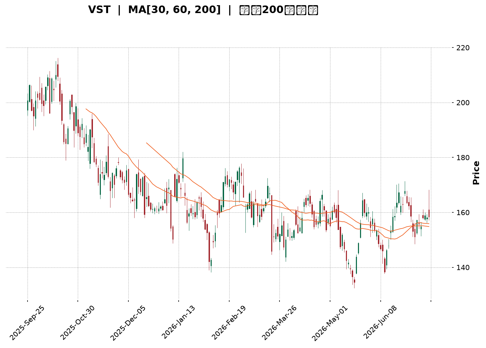
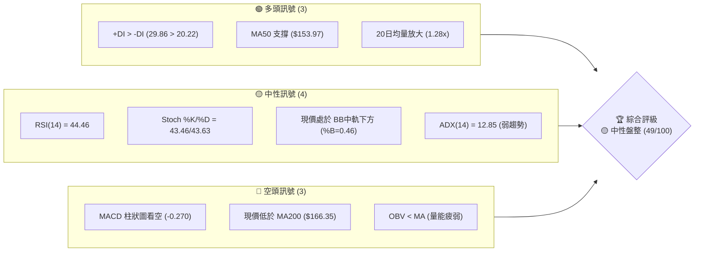
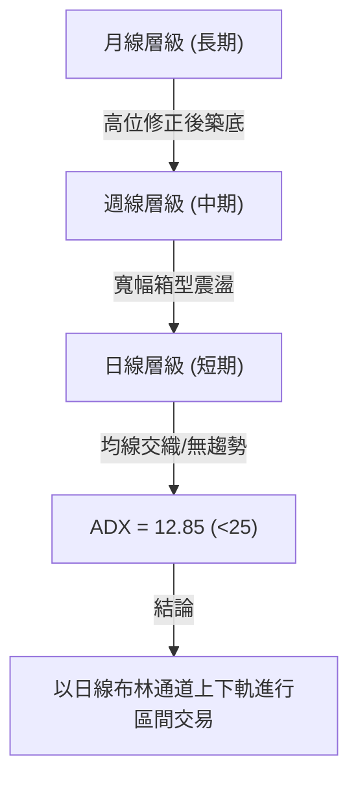
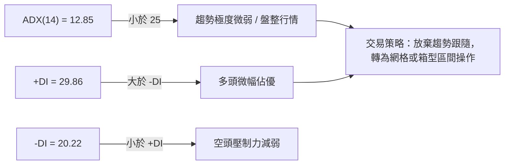
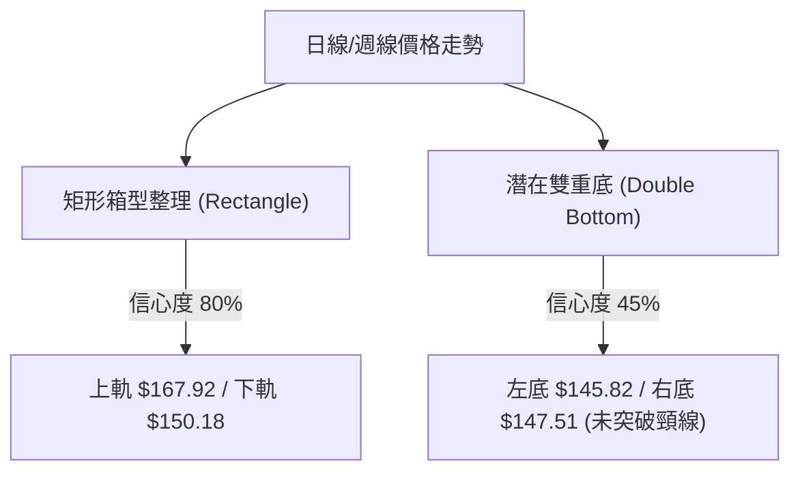
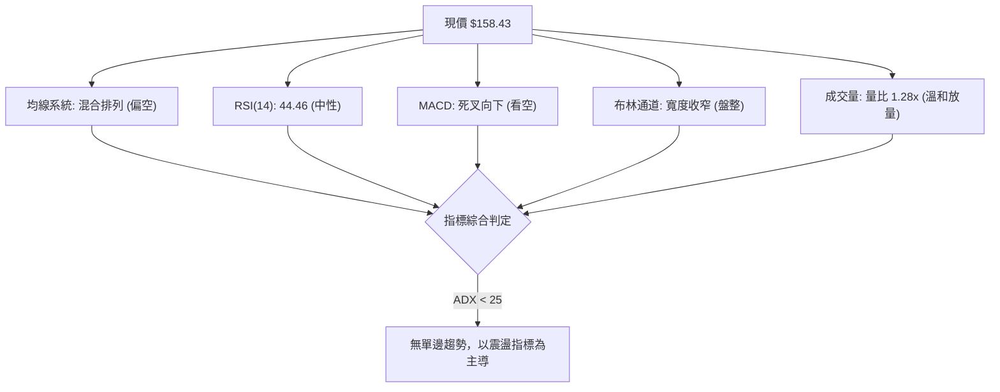
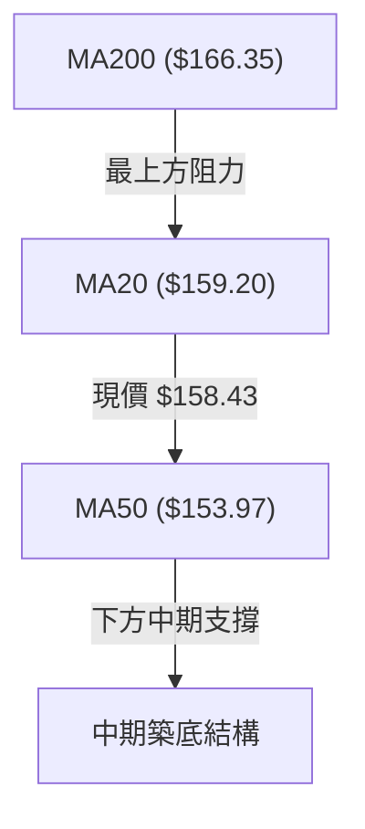
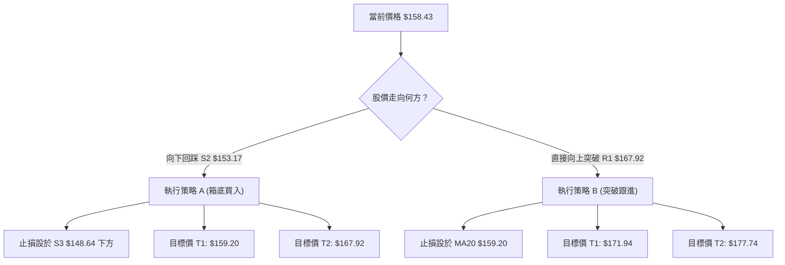
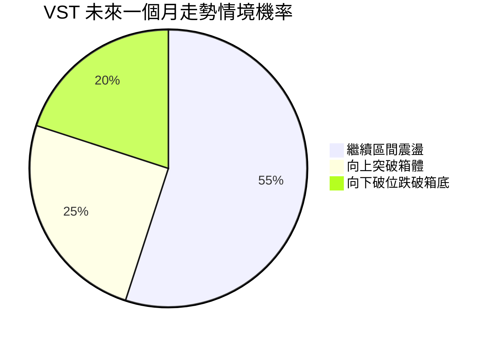
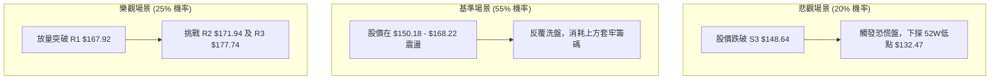

<details>
<summary>📊 靜態圖表 (點擊展開)</summary>

</details>

<html>
<head><meta charset="utf-8" /></head>
<body>
    <div style="height:500px; width:100%;">                        <script>window.PlotlyConfig = {MathJaxConfig: 'local'};</script>
        <script charset="utf-8" src="https://cdn.plot.ly/plotly-3.7.0.min.js" integrity="sha256-jvTGqxNp8AGWEcvNLVuKr+8j5dGe9Yw51LQkmDH+IYA=" crossorigin="anonymous"></script>                <div id="candlestick-chart" class="plotly-graph-div" style="height:100%; width:100%;"></div>            <script>                window.PLOTLYENV=window.PLOTLYENV || {};                                if (document.getElementById("candlestick-chart")) {                    Plotly.newPlot(                        "candlestick-chart",                        [{"close":{"dtype":"f8","bdata":"AAAAABUZaUAAAAAAistpQAAAAIDPo2hAAAAAQHBjaEAAAACgkxVpQAAAAKDnOWlAAAAAgN8kaUAAAADghfJoQAAAAABZ2WhAAAAAADC2aUAAAABgISRqQAAAAOBkgWhAAAAAQMoVakAAAADAC5VpQAAAAKA3P2pAAAAAYOAwakAAAABgehBpQAAAAODmLWhAAAAA4OI3Z0AAAADg5SFnQAAAAEBx0mdAAAAAQE0UaUAAAACAJs9oQAAAAACWuWdAAAAAQGHRaEAAAAAAi51nQAAAAECccGdAAAAAIKkHaEAAAACgBx9nQAAAAGBYk2dAAAAAgFb7ZkAAAADgpsZnQAAAAOD4b2dAAAAA4FdNZkAAAABA+zBmQAAAAMAmW2VAAAAAgOW+ZUAAAABgxshlQAAAAMBKtmVAAAAAgLRMZkAAAABAN6JlQAAAAICB\u002fGRAAAAAgDzNZUAAAAAANURlQAAAAOAiAmZAAAAAYMhDZkAAAABgb51lQAAAAECzemVAAAAA4AReZUAAAACg3+plQAAAAABBz2RAAAAAQMutZEAAAAAADIRkQAAAAACFj2RAAAAAQAe8ZUAAAAAAoCxlQAAAAMCr8WRAAAAAgGGXZUAAAABAz+ljQAAAAABjr2RAAAAA4FJLZEAAAAAA+iNkQAAAAOAqJ2RAAAAAIGwwZEAAAADgKidkQAAAAMCXLGRAAAAAwHtFZEAAAABAURxkQAAAAODFmGRAAAAAQGBPZEAAAABg\u002fiFlQAAAAECNRWNAAAAAwOfFYkAAAAAAJ71kQAAAAABTg2VAAAAAgE5eZUAAAACAHxBlQAAAAIDadWZAAAAAAH7EZEAAAACgE4xjQAAAAGCD8mNAAAAAAF39Y0AAAABAtPVjQAAAAGDmy2NAAAAAoNF5ZEAAAABg26VkQAAAACA1RGRAAAAAgDi9Y0AAAACAszpjQAAAAEB+EmNAAAAA4A7EYUAAAAAgnNVhQAAAAKCWp2JAAAAAIIkRY0AAAABAHOVjQAAAAGCp9mNAAAAAIM1UZEAAAABgimBlQAAAAGBtpmVAAAAAoC5DZUAAAACAxYBlQAAAAACrXWVAAAAAQMnqZEAAAABgsGRlQAAAAAAK3GVAAAAAYKEKZkAAAADgIK1lQAAAAMAGsWRAAAAA4B8oZEAAAAAgGV1kQAAAAIAF3mRAAAAAQMvGY0AAAAAgZWVkQAAAAEBJfmRAAAAAoBHXY0AAAADgeORjQAAAAABe0GNAAAAAIGExZEAAAACADXxkQAAAAEDSNGVAAAAAgBDdZEAAAAAAGzpiQAAAAICC4mJAAAAAoDQQY0AAAAAgiuliQAAAAODIAmNAAAAAAGdoY0AAAABgrWpiQAAAACDVw2JAAAAAoNQ3Y0AAAACg\u002ft5iQAAAAKAY7GJAAAAA4OEuY0AAAAAAgXVjQAAAACAqEWNAAAAAgG9QY0AAAAAAUr9jQAAAAMCzd2RAAAAA4MlWZEAAAABgjalkQAAAAMBnZ2RAAAAA4A7sY0AAAAAgMFZjQAAAAOBOcmNAAAAAYC6UY0AAAACA2INkQAAAAAAby2RAAAAAQKEcZEAAAADAZTJjQAAAAADRs2NAAAAA4AJiY0AAAACAABRkQAAAAKD7BGRAAAAAQDLCY0AAAADAgjdjQAAAAABucGJAAAAAwMv6YkAAAACARFViQAAAAGAjzWFAAAAAIHO2YUAAAABggm9hQAAAAGDhEWFAAAAAILHQYEAAAABgjvlhQAAAAIDjm2JAAAAAoKWBY0AAAABAjopkQAAAACCi\u002fWNAAAAAoMkBZEAAAACAMABkQAAAAOBkUWNAAAAAgPi3Y0AAAACgtzJjQAAAAKCFL2NAAAAAoKmRYkAAAADgOVZiQAAAACB\u002fQGJAAAAAgBRLYUAAAAAgnEViQAAAACAEemJAAAAAIMUpY0AAAAAgbMxjQAAAAMBz02NAAAAAIKxwZEAAAADgUehkQAAAAOB6TGRAAAAAANdbZEAAAADgo\u002fhkQAAAACCub2RAAAAAAClMZEAAAAAAKdRjQAAAAMAeJWNAAAAAoJnhYkAAAABACqdjQAAAACBcd2NAAAAAgD1aY0AAAAAgXL9jQAAAACCF22NAAAAAANfDY0AAAACAws1jQA=="},"high":{"dtype":"f8","bdata":"6SB5LjZtaUAWI7M8dtRpQAY1UT+TyGlA\u002f4AEBWT1aEDAO3MOkIJpQIS+UAjLhGlA93Sg0IAqakAysasiKuJpQPV+\u002fyurX2lAzJwodhm4aUAp16qFOkZqQKVfp82nb2pADicOaYkiakAnWzyme\u002f9pQEh6\u002ffZy5GpACdOvPWMGa0CD4s8quSVqQB084DG6lGlAQYTGMsUTaEAvGzPQ2ZZnQPLUBm3k7GdAw5I+\u002fjAlaUDxMPp+F1ppQMaZ\u002fsTkj2hAYTH9Krj8aEDBkCKd2r9oQFIfyI7hAmhAxDkt9CxMaEBxp+5ERNZnQG5o8++n9WdAytOTnL2KZ0DEcrezCslnQPwusUd7f2hAOMEpVCNlZ0Cr87UOipFmQFsESi8aJ2ZAltR8mBxoZkAzk8+u0FhmQG1KZdPkFWZArOFXcemXZkDloWWmKJBnQDSr+9G1nmVACnIq9iXPZUAJY5G2K8BlQGkTWfloIGZAxk+aO6aAZkCENIIi8PdlQCg2RXwM52VAmq30oCCkZUBYTRZ7+ClmQDAcS\u002fi3\u002fGVAzOVv\u002fvfjZEBk74z5kSZlQEdQBV+bqmRAEPXEBUXFZUCm+klkHGhmQKJYt14KiWVAgIBAUa2mZUDeJfV4PM1lQBdczqSfZmVAkvD6Kl9WZUD9YG8TantkQC+VNr\u002fyZ2RA\u002f6sLAF5EZEBT3R8xnFFkQGYyS4rnd2RAaKRLToZTZEAmYFI7eoFkQKe2+fcDGmVATeopUM5lZUBp8FokSIRlQAyWdjfpBWVAROJtm9hrY0COJfr1QMhlQDA5eLsTCGZAsBfXK+neZUCMn8fNpVZlQEMfebbNwWZAeQWHmLtUZUC\u002fQMluWLFkQB2MH1QPMWRAYlVG6ZBhZEBltG4Zdk1kQMN8ZnlTm2RApuoxnU6FZEBKFzU1N8NkQMRmyfhW7WRAjvAyQnqBZEDqhGt5PPFjQAdcsSYvgmNArwJ2+40nY0DTwSBkavBhQARwbMPg+mJAVNJ2HjVrY0CoNSN+MB9kQDjIZ4JTm2RA2b529gu4ZEB9eHAo92VlQOfN8oA0BWZAdF8WtYHgZUAzM\u002fdqAYNlQOr228muoGVASzahkbVrZUDnf+CEmmZlQI\u002fJWUSM7mVAWbD5u7YXZkAUURmbLTpmQG31n4UOAWZAhwMc5IViZECjlB4qOXhkQD8jKB428GRA\u002f6bjmUv9ZEDWRGNMoIVkQB\u002f1zuhgCmVA\u002fPux1jNxZEBq9DMQ\u002fldkQDxQdpcXmWRA5cq235BhZEDtwTb2HKBkQEdRRym6kGVABnFCWjokZUAS2w0Xl8dkQCj9f9DSdWNArBCp0E08Y0DJ0ZzYVLdjQP255qKbDmNAJp7mLTv\u002fY0A8coLDpdZjQJA+jPBC6GJAtnEuPOKDY0DZhpXnAEtjQLeT4SSCHGNAum8zoDg+Y0AGa5WIsyJkQPAhUtavSWRAXnQOsg\u002fNY0AKvFgB2Q9kQHM\u002fAD6QoWRA5UvjPDDJZEBq01xT+NVkQBSlIOAjCGVAl1FaRUJ6ZEApP5q2\u002fRtkQMePKu9w22NAd6\u002fm+7rUY0DtmB1u9KdkQHfPrSvnBWVAe0d0XRdjZEDmAJauPB1kQDWgRj4E7WNAObMAU1D9Y0A6Qsq45ERkQPwsthFFcmRAvncR6GJYZEBQzOnT8QRlQLp1EVoQWWNAofcaGyoRY0CrwoLxm8NiQA6qzPRpQmJAWRXGBAfjYUASR\u002fX4kJxhQCHzmAkJa2FAVIfWU0gQYUCqLp7QUBZiQOrudJVHomJApM9jWzCrY0CkD9H2TuVkQCksGdBRmWRAhVjUZKRpZEC6wXhmBEJkQGFCeDSBymNAzaDPzsMRZECPZ\u002f6pDbZjQL3L5vpiOmNAeP9xBWBCY0BbQnRB66JiQIgbOsLfwmJA4OUhU475YUDpFA\u002frOVZiQBK6r9ZDyWJAf9bCg3FnY0C9wjo\u002fIihkQBc1bITPRmRAPn6+4UFDZUAAAAAAAFBlQAAAAGBmumRAAAAA4Hq0ZEAAAABAM2tlQAAAAIDC\u002fWRAAAAAQDOzZEAAAABgZq5kQAAAAIA9qmNAAAAAIK6HY0AAAAAgrqdjQAAAAMAe7WNAAAAA4KWPY0AAAACAwiVkQAAAAOCjAGRAAAAAgMLtY0AAAABguAZlQA=="},"hovertemplate":"\u003cb\u003e%{x|%Y-%m-%d}\u003c\u002fb\u003e\u003cbr\u003e\u958b: $%{open:.2f}\u003cbr\u003e\u9ad8: $%{high:.2f}\u003cbr\u003e\u4f4e: $%{low:.2f}\u003cbr\u003e\u6536: $%{close:.2f}\u003cextra\u003e\u003c\u002fextra\u003e","low":{"dtype":"f8","bdata":"Q9lCeU5maEAUm7DgrwRpQMXad4cpnGhAlG9vWRe9Z0DYM++y7+tnQOhB4xxZvGhAhn3hBUIVaUBHE7zejpNoQD4IHcVSYmhA3jRt+YDpaEBV5Yg9eI9pQMnE\u002fK3BgGhANoMnPjTyaEDhK79CEhJpQFugZ1BosWlA51cNTTH6aUCMsOvqDOdoQPH5i288AGhAVc2rxpwZZ0CDtpo29VxmQLdR+OsSHmdAs+32qF85aEBVNvkA7HVoQIMJ5uyO9mZA21wm3OSVZ0D29kUAQnhnQPrMwOVI2GZAT5kaVyRiZ0ADEwuhg\u002fdmQLfJM4c3BWdADv4ALyJZZkDy9HRbw\u002ftlQLLFatqt7GZA\u002f4UrhDBCZkCb5ppLwBFmQO+1cXUCOmVACufm4ZWcZEDNzIc\u002f3YxlQD\u002fYrp54PmVAjWfVCOuvZUCE0y0ML41lQDlvTLGFOGRA0MXITcimZEBs51gq8aZkQCblY9e\u002fi2VA65T9ALIoZkA+k85GKX9lQNhjnQLwVGVATNXCO\u002foHZUAW4SS5cjhlQPrLUWjyuGRAUjB5vCVsZEAIe9VXf4FkQLArIaS+v2NAO4jIl\u002fMKZECTnjYWxdlkQB2V5wUzyWRAJfF7LH+7ZEASOAeGVsFjQI2mmOnZP2RA3yQwts5AZED6zqgFAA1kQBwFzg0G9mNAcoBRHonqY0C4gPZUC\u002f1jQE4X9Sxz72NAKY+dgbMTZEBdZG6czhhkQCB9yugCbmRADECgLPD3Y0DJlyxTgGpkQNhP4ZS5I2NAQrOS3eiYYkBPjuoShK1kQNu6cRoTdGRA3i1W7yhLZUAJrhDe8LJkQOzgx5iaZmVAkOfdwu1RZED0weTHNHpjQBOeeqAQK2NAIPSX+L\u002fWY0AXq5IpDbJjQLD08TDcrmNAzuvFlda2Y0Byb7Z\u002f5BZkQC+CjTElymNAR\u002furDKyNY0BPfLOSXDNjQMfxonBEv2JAUcp6U1hcYUCQf536ukRhQKFQ\u002f+VsYGJAKc9N6+lrYkByNGHBQExjQBx43miaw2NATyt3paP+Y0C0rE4HviFkQKIcB4xlL2VAY1s08oskZUDNzMyMJflkQCmrzH0UEWVA0tMOiSKYZEDuJ0Lmx01kQFhE4JOLM2VAbwviPgh1ZEAXDS6tZE1lQMSnt53rq2RAcGCLs9oRY0C1Lralo\u002f5jQGVNuoV8J2RAbKrpCKC7Y0Cf5bHwUFJjQKPgpSVBe2RAOdcDQRpXY0CX44T2kIhjQElApVJvqWNAHnsInWL1Y0Bf8kUShzVkQJFttaljoWRAwrR7ltx4ZED80hsiFBRiQDCcSKUJpGJAyIIcUeiqYkDrQA8ybsViQPVLM+8fSWJAEhzDmjXxYkDRQsnEo0xiQIi6hYmCxGFA8DrGUwbmYkCspp1EH71iQHp9+\u002fZztWJASPupEzzCYkAzn6ifVGJjQMhBT23tDmNAMcweD6scY0Bm\u002fQP19w1jQIN0gUfdA2RALPfdLIs9ZECnqN4zPkxkQJS7Xv8OQWRA2ZzkySfDY0BB439PQz1jQFCOfteBVmNAst3zCxZJY0AByZRk211jQNzBu59q0GNANrhk\u002fu\u002fPY0BX4EiitRtjQPbMMQxkcGNAYtt3otNWY0BSrOzQCKdjQHihDOVy8mNAFapMPDGMY0Cf+NxPwjFjQFqsM1rIWGJA8Hmqn1lCYkBT2n4cmi5iQE3hjaMTamFA5lUCCT53YUBVuQjMwDNhQDF9spuHtWBARUYq\u002fC6PYEBVvTbJwDNhQNs5lj2tFWJAvFPn\u002fEDRYkALBQmi9b9jQMdPpbT3xWNAJEOH0yWsY0Bq28zAI5VjQNVHqKvJ42JAs\u002f\u002f9j1EVY0BVQ\u002fAcjhdjQJGDq\u002fVbv2JAUQJaL2ZpYkCM8PoUnEViQPVudh3yqmFAABqb1\u002fI2YUBpIkej\u002fmthQAsPdu9rWWJA4+8leT7BYkBBg9+WuBNjQDVlMk+vn2NAMhGFfcz5Y0AAAADAzFxkQAAAAOCj5GNAAAAAACn8Y0AAAADgUcBkQAAAAIAUZmRAAAAA4KMgZEAAAADgUZBjQAAAAKCZ4WJAAAAAAACQYkAAAADgUQBjQAAAAOBRQGNAAAAAgD3qYkAAAACAPa5jQAAAAKCZoWNAAAAAYGaGY0AAAAAghaNjQA=="},"name":"\u50f9\u683c","open":{"dtype":"f8","bdata":"f7cW\u002fbilaEC2gDinsgtpQFh40w8xJWlA7CnXBqXLaEDBy+XsHkZoQGBDLkYzZmlAR3mdcRRwaUAN+zOFwqlpQGQXzD99F2lATPCgm84XaUB8xVdMh8RpQKOcKVp7HGpAg5vyByYJaUCJobX8951pQDpeT9t1DmpAnm5aGca8akA1GisH4dlpQIeWcr0RaWlA44lo648CaEB2IEuwtVhnQLdR+OsSHmdAz9WetRt5aEDxMPp+F1ppQMaZ\u002fsTkj2hA1WNdFRTwZ0DrajNF7DtoQNmEf+uE5mdAqs6Cw5jAZ0AYhbaRPGpnQGd5bLeZL2dAUHrlJjXEZkB4GVOOTzhmQPKSDzu\u002fP2hAp4oaFcQkZ0BenUHDoHJmQP5SyzukBWZA1QwKppLPZEAAgBhEetZlQN0Jnas0fmVACVjxmN\u002fNZUCZ+59jtgFnQLMLpWUsaWVA4Z6CXbwbZUBSvuoLdatlQPc6L2HoqGVAN1NYfj5IZkAEh3La9ehlQP6294uF1WVALiw9jzR+ZUB0NHuM\u002fGVlQPzuCZU2+WVAzOVv\u002fvfjZECFnEt55JVkQPhBbtnvlGRA1jlCAhgsZED\u002f04jZJc9lQMIjjxrEh2VAth3R5q6+ZEDno1LdOallQGJJunMin2RAIQc50EbAZECtOPeUhXFkQD4gggL6I2RAn+L3y3cRZEAAAADgKidkQJt0xXvJEWRA4rgUw7IxZEDE909+GU5kQCB9yugCbmRAkXplNOMcZUB\u002fyluaFBFlQAyWdjfpBWVAg314aUtaY0BDTR56K7tlQMcg5wTnhmRA7ZsDkaOwZUB+cQqihh1lQLSl30O6kGVAqwSR587iZEChFGk0ZxpkQOIDlzNI0mNAe3eu5HYvZECQRUD23\u002fFjQF+aleWzBGRAxI9o+TziY0ADEildWLFkQFbh87wRsGRAiTsxD74hZEBQCkPC4aZjQPSeN70OdmNAR5C9Wo4YY0CiNDVojZNhQGvQ+\u002fbBsmJAbvtA\u002f8GyYkD\u002fGoqro\u002f5jQCt\u002f6wNvkWRAVV4skCsJZEDFYDNwdj5kQF6+bicTTWVAs6ulQfWwZUDNzK7IHi5lQH5MwohjemVA5YCBUGpFZUDqU5E1MdpkQBzvAznxfGVAA7NbZWRcZUBeBNfpjNBlQLXxqtpfN2VAB1PTOc4nZEDh1bZAnSRkQF+1iIDeLWRAgE9oy+F\u002fZEBk8plZCW9jQEz8se3rnGRA\u002f98kx8FkZEB0vvdfsZRjQF2rAP4JKmRAxPbQX8kRZEC2Ry36i0tkQI9bSwNeqWRAdFoVpa7WZEAS2w0Xl8dkQJsRxGqf52JAVVhE3NzKYkCDeW5EEFljQBbcrFNPqWJAEhzDmjXxYkDDZ3p6K5xjQBLZRipc9mFA\u002fZJ2BkPoYkCAm\u002fon9N9iQPTlBU2F2mJA3HawxnrbYkAFbOhyzhBkQD0FXQeBdWNAtZZUdyEpY0Bm\u002fQP19w1jQGrRNB\u002faRWRAwRlEDJioZEAS234f4IpkQLuBQSzhwGRAbaMVuk1aZECY18A7IBFkQElCG9mJsmNAS5sisr13Y0BNfAKAkINjQHTgz7mdmGRAgy\u002fmcLpIZECguN1AUhRkQFJ21iFJgmNAFnTg6dXCY0AlPbjzBa9jQED1\u002fJu0WGRAQvmM6JwoZEAIBNbd+1lkQLp1EVoQWWNA1M6FhWB5YkD6ZWWc\u002fahiQA6qzPRpQmJAOw0CVdWlYUC\u002fIGWJi3JhQKy7RZnHWWFAa6VN44XzYEAAAAAc0zlhQPzERLuHKGJA8Ee7hzPaYkDHxmI6AtZjQCqM6aVWl2RAr4IMn8XTY0BDIIcC1\u002fhjQMLQZVb5mGNAY8mZARp3Y0C17QHUUIljQAw4lp5\u002f6mJArxqcoTL5YkC3\u002fdt4SINiQDEc4UvMhmJAButnBcnkYUDK3O7+XplhQFYbq3pgeWJAgqlK4hQTY0CbYydnJCFjQIfXM+n7ymNA8Fc8ZKA7ZEAAAAAAKXBkQAAAAGCPAmRAAAAAwPVgZEAAAADAHt1kQAAAACCFu2RAAAAAYGZ2ZEAAAABgj1JkQAAAAAAAgGNAAAAAYGY+Y0AAAABACg9jQAAAAAAphGNAAAAAIK4\u002fY0AAAADgUeBjQAAAAKCZsWNAAAAAwMy0Y0AAAAAAACBkQA=="},"x":["2025-09-25T00:00:00-04:00","2025-09-26T00:00:00-04:00","2025-09-29T00:00:00-04:00","2025-09-30T00:00:00-04:00","2025-10-01T00:00:00-04:00","2025-10-02T00:00:00-04:00","2025-10-03T00:00:00-04:00","2025-10-06T00:00:00-04:00","2025-10-07T00:00:00-04:00","2025-10-08T00:00:00-04:00","2025-10-09T00:00:00-04:00","2025-10-10T00:00:00-04:00","2025-10-13T00:00:00-04:00","2025-10-14T00:00:00-04:00","2025-10-15T00:00:00-04:00","2025-10-16T00:00:00-04:00","2025-10-17T00:00:00-04:00","2025-10-20T00:00:00-04:00","2025-10-21T00:00:00-04:00","2025-10-22T00:00:00-04:00","2025-10-23T00:00:00-04:00","2025-10-24T00:00:00-04:00","2025-10-27T00:00:00-04:00","2025-10-28T00:00:00-04:00","2025-10-29T00:00:00-04:00","2025-10-30T00:00:00-04:00","2025-10-31T00:00:00-04:00","2025-11-03T00:00:00-05:00","2025-11-04T00:00:00-05:00","2025-11-05T00:00:00-05:00","2025-11-06T00:00:00-05:00","2025-11-07T00:00:00-05:00","2025-11-10T00:00:00-05:00","2025-11-11T00:00:00-05:00","2025-11-12T00:00:00-05:00","2025-11-13T00:00:00-05:00","2025-11-14T00:00:00-05:00","2025-11-17T00:00:00-05:00","2025-11-18T00:00:00-05:00","2025-11-19T00:00:00-05:00","2025-11-20T00:00:00-05:00","2025-11-21T00:00:00-05:00","2025-11-24T00:00:00-05:00","2025-11-25T00:00:00-05:00","2025-11-26T00:00:00-05:00","2025-11-28T00:00:00-05:00","2025-12-01T00:00:00-05:00","2025-12-02T00:00:00-05:00","2025-12-03T00:00:00-05:00","2025-12-04T00:00:00-05:00","2025-12-05T00:00:00-05:00","2025-12-08T00:00:00-05:00","2025-12-09T00:00:00-05:00","2025-12-10T00:00:00-05:00","2025-12-11T00:00:00-05:00","2025-12-12T00:00:00-05:00","2025-12-15T00:00:00-05:00","2025-12-16T00:00:00-05:00","2025-12-17T00:00:00-05:00","2025-12-18T00:00:00-05:00","2025-12-19T00:00:00-05:00","2025-12-22T00:00:00-05:00","2025-12-23T00:00:00-05:00","2025-12-24T00:00:00-05:00","2025-12-26T00:00:00-05:00","2025-12-29T00:00:00-05:00","2025-12-30T00:00:00-05:00","2025-12-31T00:00:00-05:00","2026-01-02T00:00:00-05:00","2026-01-05T00:00:00-05:00","2026-01-06T00:00:00-05:00","2026-01-07T00:00:00-05:00","2026-01-08T00:00:00-05:00","2026-01-09T00:00:00-05:00","2026-01-12T00:00:00-05:00","2026-01-13T00:00:00-05:00","2026-01-14T00:00:00-05:00","2026-01-15T00:00:00-05:00","2026-01-16T00:00:00-05:00","2026-01-20T00:00:00-05:00","2026-01-21T00:00:00-05:00","2026-01-22T00:00:00-05:00","2026-01-23T00:00:00-05:00","2026-01-26T00:00:00-05:00","2026-01-27T00:00:00-05:00","2026-01-28T00:00:00-05:00","2026-01-29T00:00:00-05:00","2026-01-30T00:00:00-05:00","2026-02-02T00:00:00-05:00","2026-02-03T00:00:00-05:00","2026-02-04T00:00:00-05:00","2026-02-05T00:00:00-05:00","2026-02-06T00:00:00-05:00","2026-02-09T00:00:00-05:00","2026-02-10T00:00:00-05:00","2026-02-11T00:00:00-05:00","2026-02-12T00:00:00-05:00","2026-02-13T00:00:00-05:00","2026-02-17T00:00:00-05:00","2026-02-18T00:00:00-05:00","2026-02-19T00:00:00-05:00","2026-02-20T00:00:00-05:00","2026-02-23T00:00:00-05:00","2026-02-24T00:00:00-05:00","2026-02-25T00:00:00-05:00","2026-02-26T00:00:00-05:00","2026-02-27T00:00:00-05:00","2026-03-02T00:00:00-05:00","2026-03-03T00:00:00-05:00","2026-03-04T00:00:00-05:00","2026-03-05T00:00:00-05:00","2026-03-06T00:00:00-05:00","2026-03-09T00:00:00-04:00","2026-03-10T00:00:00-04:00","2026-03-11T00:00:00-04:00","2026-03-12T00:00:00-04:00","2026-03-13T00:00:00-04:00","2026-03-16T00:00:00-04:00","2026-03-17T00:00:00-04:00","2026-03-18T00:00:00-04:00","2026-03-19T00:00:00-04:00","2026-03-20T00:00:00-04:00","2026-03-23T00:00:00-04:00","2026-03-24T00:00:00-04:00","2026-03-25T00:00:00-04:00","2026-03-26T00:00:00-04:00","2026-03-27T00:00:00-04:00","2026-03-30T00:00:00-04:00","2026-03-31T00:00:00-04:00","2026-04-01T00:00:00-04:00","2026-04-02T00:00:00-04:00","2026-04-06T00:00:00-04:00","2026-04-07T00:00:00-04:00","2026-04-08T00:00:00-04:00","2026-04-09T00:00:00-04:00","2026-04-10T00:00:00-04:00","2026-04-13T00:00:00-04:00","2026-04-14T00:00:00-04:00","2026-04-15T00:00:00-04:00","2026-04-16T00:00:00-04:00","2026-04-17T00:00:00-04:00","2026-04-20T00:00:00-04:00","2026-04-21T00:00:00-04:00","2026-04-22T00:00:00-04:00","2026-04-23T00:00:00-04:00","2026-04-24T00:00:00-04:00","2026-04-27T00:00:00-04:00","2026-04-28T00:00:00-04:00","2026-04-29T00:00:00-04:00","2026-04-30T00:00:00-04:00","2026-05-01T00:00:00-04:00","2026-05-04T00:00:00-04:00","2026-05-05T00:00:00-04:00","2026-05-06T00:00:00-04:00","2026-05-07T00:00:00-04:00","2026-05-08T00:00:00-04:00","2026-05-11T00:00:00-04:00","2026-05-12T00:00:00-04:00","2026-05-13T00:00:00-04:00","2026-05-14T00:00:00-04:00","2026-05-15T00:00:00-04:00","2026-05-18T00:00:00-04:00","2026-05-19T00:00:00-04:00","2026-05-20T00:00:00-04:00","2026-05-21T00:00:00-04:00","2026-05-22T00:00:00-04:00","2026-05-26T00:00:00-04:00","2026-05-27T00:00:00-04:00","2026-05-28T00:00:00-04:00","2026-05-29T00:00:00-04:00","2026-06-01T00:00:00-04:00","2026-06-02T00:00:00-04:00","2026-06-03T00:00:00-04:00","2026-06-04T00:00:00-04:00","2026-06-05T00:00:00-04:00","2026-06-08T00:00:00-04:00","2026-06-09T00:00:00-04:00","2026-06-10T00:00:00-04:00","2026-06-11T00:00:00-04:00","2026-06-12T00:00:00-04:00","2026-06-15T00:00:00-04:00","2026-06-16T00:00:00-04:00","2026-06-17T00:00:00-04:00","2026-06-18T00:00:00-04:00","2026-06-22T00:00:00-04:00","2026-06-23T00:00:00-04:00","2026-06-24T00:00:00-04:00","2026-06-25T00:00:00-04:00","2026-06-26T00:00:00-04:00","2026-06-29T00:00:00-04:00","2026-06-30T00:00:00-04:00","2026-07-01T00:00:00-04:00","2026-07-02T00:00:00-04:00","2026-07-06T00:00:00-04:00","2026-07-07T00:00:00-04:00","2026-07-08T00:00:00-04:00","2026-07-09T00:00:00-04:00","2026-07-10T00:00:00-04:00","2026-07-13T00:00:00-04:00","2026-07-14T00:00:00-04:00"],"type":"candlestick"},{"hovertemplate":"MA30: $%{y:.2f}\u003cextra\u003e\u003c\u002fextra\u003e","line":{"color":"#2196F3","dash":"dash","width":2},"mode":"lines","name":"MA30","x":["2025-09-25T00:00:00-04:00","2025-09-26T00:00:00-04:00","2025-09-29T00:00:00-04:00","2025-09-30T00:00:00-04:00","2025-10-01T00:00:00-04:00","2025-10-02T00:00:00-04:00","2025-10-03T00:00:00-04:00","2025-10-06T00:00:00-04:00","2025-10-07T00:00:00-04:00","2025-10-08T00:00:00-04:00","2025-10-09T00:00:00-04:00","2025-10-10T00:00:00-04:00","2025-10-13T00:00:00-04:00","2025-10-14T00:00:00-04:00","2025-10-15T00:00:00-04:00","2025-10-16T00:00:00-04:00","2025-10-17T00:00:00-04:00","2025-10-20T00:00:00-04:00","2025-10-21T00:00:00-04:00","2025-10-22T00:00:00-04:00","2025-10-23T00:00:00-04:00","2025-10-24T00:00:00-04:00","2025-10-27T00:00:00-04:00","2025-10-28T00:00:00-04:00","2025-10-29T00:00:00-04:00","2025-10-30T00:00:00-04:00","2025-10-31T00:00:00-04:00","2025-11-03T00:00:00-05:00","2025-11-04T00:00:00-05:00","2025-11-05T00:00:00-05:00","2025-11-06T00:00:00-05:00","2025-11-07T00:00:00-05:00","2025-11-10T00:00:00-05:00","2025-11-11T00:00:00-05:00","2025-11-12T00:00:00-05:00","2025-11-13T00:00:00-05:00","2025-11-14T00:00:00-05:00","2025-11-17T00:00:00-05:00","2025-11-18T00:00:00-05:00","2025-11-19T00:00:00-05:00","2025-11-20T00:00:00-05:00","2025-11-21T00:00:00-05:00","2025-11-24T00:00:00-05:00","2025-11-25T00:00:00-05:00","2025-11-26T00:00:00-05:00","2025-11-28T00:00:00-05:00","2025-12-01T00:00:00-05:00","2025-12-02T00:00:00-05:00","2025-12-03T00:00:00-05:00","2025-12-04T00:00:00-05:00","2025-12-05T00:00:00-05:00","2025-12-08T00:00:00-05:00","2025-12-09T00:00:00-05:00","2025-12-10T00:00:00-05:00","2025-12-11T00:00:00-05:00","2025-12-12T00:00:00-05:00","2025-12-15T00:00:00-05:00","2025-12-16T00:00:00-05:00","2025-12-17T00:00:00-05:00","2025-12-18T00:00:00-05:00","2025-12-19T00:00:00-05:00","2025-12-22T00:00:00-05:00","2025-12-23T00:00:00-05:00","2025-12-24T00:00:00-05:00","2025-12-26T00:00:00-05:00","2025-12-29T00:00:00-05:00","2025-12-30T00:00:00-05:00","2025-12-31T00:00:00-05:00","2026-01-02T00:00:00-05:00","2026-01-05T00:00:00-05:00","2026-01-06T00:00:00-05:00","2026-01-07T00:00:00-05:00","2026-01-08T00:00:00-05:00","2026-01-09T00:00:00-05:00","2026-01-12T00:00:00-05:00","2026-01-13T00:00:00-05:00","2026-01-14T00:00:00-05:00","2026-01-15T00:00:00-05:00","2026-01-16T00:00:00-05:00","2026-01-20T00:00:00-05:00","2026-01-21T00:00:00-05:00","2026-01-22T00:00:00-05:00","2026-01-23T00:00:00-05:00","2026-01-26T00:00:00-05:00","2026-01-27T00:00:00-05:00","2026-01-28T00:00:00-05:00","2026-01-29T00:00:00-05:00","2026-01-30T00:00:00-05:00","2026-02-02T00:00:00-05:00","2026-02-03T00:00:00-05:00","2026-02-04T00:00:00-05:00","2026-02-05T00:00:00-05:00","2026-02-06T00:00:00-05:00","2026-02-09T00:00:00-05:00","2026-02-10T00:00:00-05:00","2026-02-11T00:00:00-05:00","2026-02-12T00:00:00-05:00","2026-02-13T00:00:00-05:00","2026-02-17T00:00:00-05:00","2026-02-18T00:00:00-05:00","2026-02-19T00:00:00-05:00","2026-02-20T00:00:00-05:00","2026-02-23T00:00:00-05:00","2026-02-24T00:00:00-05:00","2026-02-25T00:00:00-05:00","2026-02-26T00:00:00-05:00","2026-02-27T00:00:00-05:00","2026-03-02T00:00:00-05:00","2026-03-03T00:00:00-05:00","2026-03-04T00:00:00-05:00","2026-03-05T00:00:00-05:00","2026-03-06T00:00:00-05:00","2026-03-09T00:00:00-04:00","2026-03-10T00:00:00-04:00","2026-03-11T00:00:00-04:00","2026-03-12T00:00:00-04:00","2026-03-13T00:00:00-04:00","2026-03-16T00:00:00-04:00","2026-03-17T00:00:00-04:00","2026-03-18T00:00:00-04:00","2026-03-19T00:00:00-04:00","2026-03-20T00:00:00-04:00","2026-03-23T00:00:00-04:00","2026-03-24T00:00:00-04:00","2026-03-25T00:00:00-04:00","2026-03-26T00:00:00-04:00","2026-03-27T00:00:00-04:00","2026-03-30T00:00:00-04:00","2026-03-31T00:00:00-04:00","2026-04-01T00:00:00-04:00","2026-04-02T00:00:00-04:00","2026-04-06T00:00:00-04:00","2026-04-07T00:00:00-04:00","2026-04-08T00:00:00-04:00","2026-04-09T00:00:00-04:00","2026-04-10T00:00:00-04:00","2026-04-13T00:00:00-04:00","2026-04-14T00:00:00-04:00","2026-04-15T00:00:00-04:00","2026-04-16T00:00:00-04:00","2026-04-17T00:00:00-04:00","2026-04-20T00:00:00-04:00","2026-04-21T00:00:00-04:00","2026-04-22T00:00:00-04:00","2026-04-23T00:00:00-04:00","2026-04-24T00:00:00-04:00","2026-04-27T00:00:00-04:00","2026-04-28T00:00:00-04:00","2026-04-29T00:00:00-04:00","2026-04-30T00:00:00-04:00","2026-05-01T00:00:00-04:00","2026-05-04T00:00:00-04:00","2026-05-05T00:00:00-04:00","2026-05-06T00:00:00-04:00","2026-05-07T00:00:00-04:00","2026-05-08T00:00:00-04:00","2026-05-11T00:00:00-04:00","2026-05-12T00:00:00-04:00","2026-05-13T00:00:00-04:00","2026-05-14T00:00:00-04:00","2026-05-15T00:00:00-04:00","2026-05-18T00:00:00-04:00","2026-05-19T00:00:00-04:00","2026-05-20T00:00:00-04:00","2026-05-21T00:00:00-04:00","2026-05-22T00:00:00-04:00","2026-05-26T00:00:00-04:00","2026-05-27T00:00:00-04:00","2026-05-28T00:00:00-04:00","2026-05-29T00:00:00-04:00","2026-06-01T00:00:00-04:00","2026-06-02T00:00:00-04:00","2026-06-03T00:00:00-04:00","2026-06-04T00:00:00-04:00","2026-06-05T00:00:00-04:00","2026-06-08T00:00:00-04:00","2026-06-09T00:00:00-04:00","2026-06-10T00:00:00-04:00","2026-06-11T00:00:00-04:00","2026-06-12T00:00:00-04:00","2026-06-15T00:00:00-04:00","2026-06-16T00:00:00-04:00","2026-06-17T00:00:00-04:00","2026-06-18T00:00:00-04:00","2026-06-22T00:00:00-04:00","2026-06-23T00:00:00-04:00","2026-06-24T00:00:00-04:00","2026-06-25T00:00:00-04:00","2026-06-26T00:00:00-04:00","2026-06-29T00:00:00-04:00","2026-06-30T00:00:00-04:00","2026-07-01T00:00:00-04:00","2026-07-02T00:00:00-04:00","2026-07-06T00:00:00-04:00","2026-07-07T00:00:00-04:00","2026-07-08T00:00:00-04:00","2026-07-09T00:00:00-04:00","2026-07-10T00:00:00-04:00","2026-07-13T00:00:00-04:00","2026-07-14T00:00:00-04:00"],"y":{"dtype":"f8","bdata":"AAAAAAAA+H8AAAAAAAD4fwAAAAAAAPh\u002fAAAAAAAA+H8AAAAAAAD4fwAAAAAAAPh\u002fAAAAAAAA+H8AAAAAAAD4fwAAAAAAAPh\u002fAAAAAAAA+H8AAAAAAAD4fwAAAAAAAPh\u002fAAAAAAAA+H8AAAAAAAD4fwAAAAAAAPh\u002fAAAAAAAA+H8AAAAAAAD4fwAAAAAAAPh\u002fAAAAAAAA+H8AAAAAAAD4fwAAAAAAAPh\u002fAAAAAAAA+H8AAAAAAAD4fwAAAAAAAPh\u002fAAAAAAAA+H8AAAAAAAD4fwAAAAAAAPh\u002fAAAAAAAA+H8AAAAAAAD4f6uqqgp3tWhAiYiIKGijaEAzMzNjLZJoQAAAAIDqh2hAMzMz4xx2aEBEREQkbV1oQGZmZrZmPGhAmpmZ6WYfaEAAAAAQaQRoQCIiIlKk6WdAq6qqmobMZ0De3d3dD6ZnQJqZmUkIiGdAd3d3B3tjZ0AiIiISpz5nQGZmZrZ7GmdAmpmZ6fr4ZkDNzMyci9tmQLy7u1uBxGZAERERsbW0ZkDe3d2dV6pmQO\u002fu7s6ikGZAERER8RVrZkDNzMzsckZmQLy7u1tyK2ZA7+7ujiIRZkDNzMzsTfxlQERERKQB52VAREREdDLSZUBVVVW10rZlQFVVVWUonmVAd3d3VzmHZUBERESUM2hlQGZmZrYsTGVAq6qq2iQ6ZUCrqqoKwChlQFVVVTWqHmVA3t3dnRUSZUAiIiJyzQNlQERERARJ+mRA3t3dvU7pZEBERESUCOVkQGZmZtZm1mRA3t3drY68ZEBmZmY2DrhkQFVVVRXUs2RAMzMz4y2sZEBmZmYGeKdkQDMzMzPXr2RAq6qqGrmqZECrqqoaf5ZkQDMzM3Mjj2RAiYiI6EGJZEAAAABAg4RkQGZmZvb9fWRAERERcUBzZEC8u7trwm5kQDMzMzP6aGRAiYiICCxZZEBmZmbGVVNkQKuqqmqSRWRAVVVVFf8vZECamZlJURxkQERERBSID2RAq6qq+vcFZECrqqpKxANkQERERBT4AWRAq6qqynoCZEDv7u5+SQ1kQLy7u4tGFmRAZmZmBmceZEC8u7vLjyFkQHd3d6duM2RAAAAAcLpFZEBVVVUVUEtkQN7d3R1FTmRAzczMnANUZEBERERkP1lkQEREREQnSmRA3t3d7fBEZEBERESU6EtkQAAAAEDCU2RAd3d3l\u002fBRZEAAAACwqVVkQKuqquqbW2RA3t3dHS9WZEBmZmbmvE9kQFVVVWXgS2RA3t3dnb9PZEARERHRdVpkQBEREdGrbGRA3t3dzRqHZEDe3d1ddIpkQJqZmSlrjGRAAAAA0F+MZEAzMzMT\u002fYNkQN7d3f3be2RAiYiIuPpzZEDv7u6et1pkQCIiIvIYQmRAMzMzA6cwZEAzMzNzMRpkQM3MzDxXBWRAIiIiQov2Y0De3d2tCeZjQKuqqmo1zmNAzczMfO+2Y0CJiIioeaZjQN7d3X2QpGNAERERsR6mY0CamZkZq6hjQImIiOi2pGNAVVVV5fSlY0CJiIiY6pxjQJqZmdn7k2NAMzMzE8GRY0AAAAAQEZdjQCIiIrJsn2NAIiIiorueY0AzMzOTvpNjQDMzMzPphmNAzczMnEZ6Y0B3d3eHEopjQLy7uzvBk2NAZmZmFrCZY0ARERFxSZxjQLy7u4tol2NAzczMPMGTY0CrqqqKCpNjQKuqqmrRimNAVVVV1fh9Y0BVVVX1uHFjQBEREVHqYWNA3t3dfbVNY0BVVVVFC0FjQERERIQiPWNAREREdMY+Y0Crqqq6jEVjQDMzMxN7QWNAvLu7u6U+Y0ARERGBADljQERERCS8L2NAmpmZqf8tY0Crqqr60CxjQCIiIhKXKmNAvLu7C\u002fkhY0ARERGxYg9jQERERNSy+WJAq6qqmqXhYkBEREQEwdliQBEREUFLz2JAREREVGvNYkBERESECMtiQKuqqtphyWJAd3d3tzLPYkBVVVUFoN1iQBEREVF+7WJAVVVV9UL5YkAzMzMjxg9jQKuqqjpCJmNAMzMz01A8Y0B3d3fHvFBjQGZmZgZyYmNAAAAAYBN0Y0De3d1NZIJjQAAAACC1iWNAq6qq2mSIY0CrqqrqnoFjQBEREdF7gGNAIiIiMmt+Y0DNzMzcvHxjQA=="},"type":"scatter"},{"hovertemplate":"MA60: $%{y:.2f}\u003cextra\u003e\u003c\u002fextra\u003e","line":{"color":"#9C27B0","dash":"dash","width":2},"mode":"lines","name":"MA60","x":["2025-09-25T00:00:00-04:00","2025-09-26T00:00:00-04:00","2025-09-29T00:00:00-04:00","2025-09-30T00:00:00-04:00","2025-10-01T00:00:00-04:00","2025-10-02T00:00:00-04:00","2025-10-03T00:00:00-04:00","2025-10-06T00:00:00-04:00","2025-10-07T00:00:00-04:00","2025-10-08T00:00:00-04:00","2025-10-09T00:00:00-04:00","2025-10-10T00:00:00-04:00","2025-10-13T00:00:00-04:00","2025-10-14T00:00:00-04:00","2025-10-15T00:00:00-04:00","2025-10-16T00:00:00-04:00","2025-10-17T00:00:00-04:00","2025-10-20T00:00:00-04:00","2025-10-21T00:00:00-04:00","2025-10-22T00:00:00-04:00","2025-10-23T00:00:00-04:00","2025-10-24T00:00:00-04:00","2025-10-27T00:00:00-04:00","2025-10-28T00:00:00-04:00","2025-10-29T00:00:00-04:00","2025-10-30T00:00:00-04:00","2025-10-31T00:00:00-04:00","2025-11-03T00:00:00-05:00","2025-11-04T00:00:00-05:00","2025-11-05T00:00:00-05:00","2025-11-06T00:00:00-05:00","2025-11-07T00:00:00-05:00","2025-11-10T00:00:00-05:00","2025-11-11T00:00:00-05:00","2025-11-12T00:00:00-05:00","2025-11-13T00:00:00-05:00","2025-11-14T00:00:00-05:00","2025-11-17T00:00:00-05:00","2025-11-18T00:00:00-05:00","2025-11-19T00:00:00-05:00","2025-11-20T00:00:00-05:00","2025-11-21T00:00:00-05:00","2025-11-24T00:00:00-05:00","2025-11-25T00:00:00-05:00","2025-11-26T00:00:00-05:00","2025-11-28T00:00:00-05:00","2025-12-01T00:00:00-05:00","2025-12-02T00:00:00-05:00","2025-12-03T00:00:00-05:00","2025-12-04T00:00:00-05:00","2025-12-05T00:00:00-05:00","2025-12-08T00:00:00-05:00","2025-12-09T00:00:00-05:00","2025-12-10T00:00:00-05:00","2025-12-11T00:00:00-05:00","2025-12-12T00:00:00-05:00","2025-12-15T00:00:00-05:00","2025-12-16T00:00:00-05:00","2025-12-17T00:00:00-05:00","2025-12-18T00:00:00-05:00","2025-12-19T00:00:00-05:00","2025-12-22T00:00:00-05:00","2025-12-23T00:00:00-05:00","2025-12-24T00:00:00-05:00","2025-12-26T00:00:00-05:00","2025-12-29T00:00:00-05:00","2025-12-30T00:00:00-05:00","2025-12-31T00:00:00-05:00","2026-01-02T00:00:00-05:00","2026-01-05T00:00:00-05:00","2026-01-06T00:00:00-05:00","2026-01-07T00:00:00-05:00","2026-01-08T00:00:00-05:00","2026-01-09T00:00:00-05:00","2026-01-12T00:00:00-05:00","2026-01-13T00:00:00-05:00","2026-01-14T00:00:00-05:00","2026-01-15T00:00:00-05:00","2026-01-16T00:00:00-05:00","2026-01-20T00:00:00-05:00","2026-01-21T00:00:00-05:00","2026-01-22T00:00:00-05:00","2026-01-23T00:00:00-05:00","2026-01-26T00:00:00-05:00","2026-01-27T00:00:00-05:00","2026-01-28T00:00:00-05:00","2026-01-29T00:00:00-05:00","2026-01-30T00:00:00-05:00","2026-02-02T00:00:00-05:00","2026-02-03T00:00:00-05:00","2026-02-04T00:00:00-05:00","2026-02-05T00:00:00-05:00","2026-02-06T00:00:00-05:00","2026-02-09T00:00:00-05:00","2026-02-10T00:00:00-05:00","2026-02-11T00:00:00-05:00","2026-02-12T00:00:00-05:00","2026-02-13T00:00:00-05:00","2026-02-17T00:00:00-05:00","2026-02-18T00:00:00-05:00","2026-02-19T00:00:00-05:00","2026-02-20T00:00:00-05:00","2026-02-23T00:00:00-05:00","2026-02-24T00:00:00-05:00","2026-02-25T00:00:00-05:00","2026-02-26T00:00:00-05:00","2026-02-27T00:00:00-05:00","2026-03-02T00:00:00-05:00","2026-03-03T00:00:00-05:00","2026-03-04T00:00:00-05:00","2026-03-05T00:00:00-05:00","2026-03-06T00:00:00-05:00","2026-03-09T00:00:00-04:00","2026-03-10T00:00:00-04:00","2026-03-11T00:00:00-04:00","2026-03-12T00:00:00-04:00","2026-03-13T00:00:00-04:00","2026-03-16T00:00:00-04:00","2026-03-17T00:00:00-04:00","2026-03-18T00:00:00-04:00","2026-03-19T00:00:00-04:00","2026-03-20T00:00:00-04:00","2026-03-23T00:00:00-04:00","2026-03-24T00:00:00-04:00","2026-03-25T00:00:00-04:00","2026-03-26T00:00:00-04:00","2026-03-27T00:00:00-04:00","2026-03-30T00:00:00-04:00","2026-03-31T00:00:00-04:00","2026-04-01T00:00:00-04:00","2026-04-02T00:00:00-04:00","2026-04-06T00:00:00-04:00","2026-04-07T00:00:00-04:00","2026-04-08T00:00:00-04:00","2026-04-09T00:00:00-04:00","2026-04-10T00:00:00-04:00","2026-04-13T00:00:00-04:00","2026-04-14T00:00:00-04:00","2026-04-15T00:00:00-04:00","2026-04-16T00:00:00-04:00","2026-04-17T00:00:00-04:00","2026-04-20T00:00:00-04:00","2026-04-21T00:00:00-04:00","2026-04-22T00:00:00-04:00","2026-04-23T00:00:00-04:00","2026-04-24T00:00:00-04:00","2026-04-27T00:00:00-04:00","2026-04-28T00:00:00-04:00","2026-04-29T00:00:00-04:00","2026-04-30T00:00:00-04:00","2026-05-01T00:00:00-04:00","2026-05-04T00:00:00-04:00","2026-05-05T00:00:00-04:00","2026-05-06T00:00:00-04:00","2026-05-07T00:00:00-04:00","2026-05-08T00:00:00-04:00","2026-05-11T00:00:00-04:00","2026-05-12T00:00:00-04:00","2026-05-13T00:00:00-04:00","2026-05-14T00:00:00-04:00","2026-05-15T00:00:00-04:00","2026-05-18T00:00:00-04:00","2026-05-19T00:00:00-04:00","2026-05-20T00:00:00-04:00","2026-05-21T00:00:00-04:00","2026-05-22T00:00:00-04:00","2026-05-26T00:00:00-04:00","2026-05-27T00:00:00-04:00","2026-05-28T00:00:00-04:00","2026-05-29T00:00:00-04:00","2026-06-01T00:00:00-04:00","2026-06-02T00:00:00-04:00","2026-06-03T00:00:00-04:00","2026-06-04T00:00:00-04:00","2026-06-05T00:00:00-04:00","2026-06-08T00:00:00-04:00","2026-06-09T00:00:00-04:00","2026-06-10T00:00:00-04:00","2026-06-11T00:00:00-04:00","2026-06-12T00:00:00-04:00","2026-06-15T00:00:00-04:00","2026-06-16T00:00:00-04:00","2026-06-17T00:00:00-04:00","2026-06-18T00:00:00-04:00","2026-06-22T00:00:00-04:00","2026-06-23T00:00:00-04:00","2026-06-24T00:00:00-04:00","2026-06-25T00:00:00-04:00","2026-06-26T00:00:00-04:00","2026-06-29T00:00:00-04:00","2026-06-30T00:00:00-04:00","2026-07-01T00:00:00-04:00","2026-07-02T00:00:00-04:00","2026-07-06T00:00:00-04:00","2026-07-07T00:00:00-04:00","2026-07-08T00:00:00-04:00","2026-07-09T00:00:00-04:00","2026-07-10T00:00:00-04:00","2026-07-13T00:00:00-04:00","2026-07-14T00:00:00-04:00"],"y":{"dtype":"f8","bdata":"AAAAAAAA+H8AAAAAAAD4fwAAAAAAAPh\u002fAAAAAAAA+H8AAAAAAAD4fwAAAAAAAPh\u002fAAAAAAAA+H8AAAAAAAD4fwAAAAAAAPh\u002fAAAAAAAA+H8AAAAAAAD4fwAAAAAAAPh\u002fAAAAAAAA+H8AAAAAAAD4fwAAAAAAAPh\u002fAAAAAAAA+H8AAAAAAAD4fwAAAAAAAPh\u002fAAAAAAAA+H8AAAAAAAD4fwAAAAAAAPh\u002fAAAAAAAA+H8AAAAAAAD4fwAAAAAAAPh\u002fAAAAAAAA+H8AAAAAAAD4fwAAAAAAAPh\u002fAAAAAAAA+H8AAAAAAAD4fwAAAAAAAPh\u002fAAAAAAAA+H8AAAAAAAD4fwAAAAAAAPh\u002fAAAAAAAA+H8AAAAAAAD4fwAAAAAAAPh\u002fAAAAAAAA+H8AAAAAAAD4fwAAAAAAAPh\u002fAAAAAAAA+H8AAAAAAAD4fwAAAAAAAPh\u002fAAAAAAAA+H8AAAAAAAD4fwAAAAAAAPh\u002fAAAAAAAA+H8AAAAAAAD4fwAAAAAAAPh\u002fAAAAAAAA+H8AAAAAAAD4fwAAAAAAAPh\u002fAAAAAAAA+H8AAAAAAAD4fwAAAAAAAPh\u002fAAAAAAAA+H8AAAAAAAD4fwAAAAAAAPh\u002fAAAAAAAA+H8AAAAAAAD4fwAAALjPKWdAAAAAwFAVZ0C8u7t7MP1mQDMzM5sL6mZA7+7u3iDYZkB3d3eXFsNmQN7d3XWIrWZAvLu7Q76YZkARERFBG4RmQDMzM6v2cWZARERErOpaZkARERE5jEVmQAAAAJA3L2ZAq6qq2gQQZkBERESkWvtlQN7d3eUn52VAZmZmZpTSZUCamZnRgcFlQHd3d0csumVA3t3dZbevZUBERERca6BlQBERESHjj2VAzczM7Ct6ZUBmZmYWe2VlQBERESm4VGVAAAAAgDFCZUBEREQsiDVlQLy7u+v9J2VAZmZmPq8VZUDe3d09FAVlQAAAAGjd8WRAZmZmNpzbZEDv7u5uQsJkQFVVVWXarWRAq6qqag6gZECrqqoqQpZkQM3MzCRRkGRARERENEiKZECJiIh4i4hkQAAAAMhHiGRAIiIi4tqDZEAAAAAwTINkQO\u002fu7r7qhGRA7+7ujiSBZEDe3d0lr4FkQJqZmZkMgWRAAAAAwBiAZEBVVVW1W4BkQLy7uzv\u002ffGRAREREBNV3ZEB3d3fXM3FkQJqZmdlycWRAAAAAQJltZEAAAAB4Fm1kQImIiPDMbGRAd3d3x7dkZEARERGpP19kQERERExtWmRAMzMz03VUZEC8u7vL5VZkQN7d3R0fWWRAmpmZ8YxbZEC8u7vTYlNkQO\u002fu7p75TWRAVVVV5StJZEDv7u6u4ENkQBEREQnqPmRAmpmZwTo7ZEDv7u6OADRkQO\u002fu7r4vLGRAzczMBIcnZEB3d3ef4B1kQCIiIvJiHGRAERER2SIeZECamZnhrBhkQEREREQ9DmRAzczMjHkFZEBmZmaG3P9jQBEREeFb92NAd3d3z4f1Y0Dv7u7WSfpjQERERJQ8\u002fGNAZmZmvvL7Y0BEREQkSvljQCIiIuLL92NAiYiIGPjzY0AzMzP7ZvNjQLy7u4um9WNAAAAAoD33Y0AiIiIyGvdjQCIiIoLK+WNAVVVVtbAAZECrqqpyQwpkQKuqqjIWEGRAMzMz8wcTZEAiIiJCIxBkQM3MzESiCWRAq6qq+t0DZEDNzMwU4fZjQGZmZi515mNARERE7E\u002fXY0BEREQ09cVjQO\u002fu7sags2NAAAAAYCCiY0CamZl5ipNjQHd3d\u002ferhWNAiYiI+Np6Y0CamZkxA3ZjQImIiMgFc2NAZmZmNmJyY0BVVVXN1XBjQGZmZoY5amNAd3d3R\u002fppY0CamZnJ3WRjQN7d3XVJX2NAd3d3D91ZY0CJiIjgOVNjQDMzM8OPTGNAZmZmnjBAY0C8u7vLvzZjQCIiIjoaK2NAiYiI+NgjY0De3d2FjSpjQDMzM4uRLmNA7+7uZnE0Y0AzMzO79DxjQGZmZm5zQmNAERERGYJGY0Dv7u5WaFFjQKuqqtKJWGNARERE1CRdY0BmZmbeOmFjQLy7uysuYmNA7+7ubuRgY0CamZnJt2FjQCIiItJrY2NAd3d3p5VjY0CrqqrSlWNjQCIiInL7YGNA7+7udoheY0Dv7u6u3lpjQA=="},"type":"scatter"},{"hovertemplate":"MA200: $%{y:.2f}\u003cextra\u003e\u003c\u002fextra\u003e","line":{"color":"#FF6F00","dash":"solid","width":2},"mode":"lines","name":"MA200","x":["2025-09-25T00:00:00-04:00","2025-09-26T00:00:00-04:00","2025-09-29T00:00:00-04:00","2025-09-30T00:00:00-04:00","2025-10-01T00:00:00-04:00","2025-10-02T00:00:00-04:00","2025-10-03T00:00:00-04:00","2025-10-06T00:00:00-04:00","2025-10-07T00:00:00-04:00","2025-10-08T00:00:00-04:00","2025-10-09T00:00:00-04:00","2025-10-10T00:00:00-04:00","2025-10-13T00:00:00-04:00","2025-10-14T00:00:00-04:00","2025-10-15T00:00:00-04:00","2025-10-16T00:00:00-04:00","2025-10-17T00:00:00-04:00","2025-10-20T00:00:00-04:00","2025-10-21T00:00:00-04:00","2025-10-22T00:00:00-04:00","2025-10-23T00:00:00-04:00","2025-10-24T00:00:00-04:00","2025-10-27T00:00:00-04:00","2025-10-28T00:00:00-04:00","2025-10-29T00:00:00-04:00","2025-10-30T00:00:00-04:00","2025-10-31T00:00:00-04:00","2025-11-03T00:00:00-05:00","2025-11-04T00:00:00-05:00","2025-11-05T00:00:00-05:00","2025-11-06T00:00:00-05:00","2025-11-07T00:00:00-05:00","2025-11-10T00:00:00-05:00","2025-11-11T00:00:00-05:00","2025-11-12T00:00:00-05:00","2025-11-13T00:00:00-05:00","2025-11-14T00:00:00-05:00","2025-11-17T00:00:00-05:00","2025-11-18T00:00:00-05:00","2025-11-19T00:00:00-05:00","2025-11-20T00:00:00-05:00","2025-11-21T00:00:00-05:00","2025-11-24T00:00:00-05:00","2025-11-25T00:00:00-05:00","2025-11-26T00:00:00-05:00","2025-11-28T00:00:00-05:00","2025-12-01T00:00:00-05:00","2025-12-02T00:00:00-05:00","2025-12-03T00:00:00-05:00","2025-12-04T00:00:00-05:00","2025-12-05T00:00:00-05:00","2025-12-08T00:00:00-05:00","2025-12-09T00:00:00-05:00","2025-12-10T00:00:00-05:00","2025-12-11T00:00:00-05:00","2025-12-12T00:00:00-05:00","2025-12-15T00:00:00-05:00","2025-12-16T00:00:00-05:00","2025-12-17T00:00:00-05:00","2025-12-18T00:00:00-05:00","2025-12-19T00:00:00-05:00","2025-12-22T00:00:00-05:00","2025-12-23T00:00:00-05:00","2025-12-24T00:00:00-05:00","2025-12-26T00:00:00-05:00","2025-12-29T00:00:00-05:00","2025-12-30T00:00:00-05:00","2025-12-31T00:00:00-05:00","2026-01-02T00:00:00-05:00","2026-01-05T00:00:00-05:00","2026-01-06T00:00:00-05:00","2026-01-07T00:00:00-05:00","2026-01-08T00:00:00-05:00","2026-01-09T00:00:00-05:00","2026-01-12T00:00:00-05:00","2026-01-13T00:00:00-05:00","2026-01-14T00:00:00-05:00","2026-01-15T00:00:00-05:00","2026-01-16T00:00:00-05:00","2026-01-20T00:00:00-05:00","2026-01-21T00:00:00-05:00","2026-01-22T00:00:00-05:00","2026-01-23T00:00:00-05:00","2026-01-26T00:00:00-05:00","2026-01-27T00:00:00-05:00","2026-01-28T00:00:00-05:00","2026-01-29T00:00:00-05:00","2026-01-30T00:00:00-05:00","2026-02-02T00:00:00-05:00","2026-02-03T00:00:00-05:00","2026-02-04T00:00:00-05:00","2026-02-05T00:00:00-05:00","2026-02-06T00:00:00-05:00","2026-02-09T00:00:00-05:00","2026-02-10T00:00:00-05:00","2026-02-11T00:00:00-05:00","2026-02-12T00:00:00-05:00","2026-02-13T00:00:00-05:00","2026-02-17T00:00:00-05:00","2026-02-18T00:00:00-05:00","2026-02-19T00:00:00-05:00","2026-02-20T00:00:00-05:00","2026-02-23T00:00:00-05:00","2026-02-24T00:00:00-05:00","2026-02-25T00:00:00-05:00","2026-02-26T00:00:00-05:00","2026-02-27T00:00:00-05:00","2026-03-02T00:00:00-05:00","2026-03-03T00:00:00-05:00","2026-03-04T00:00:00-05:00","2026-03-05T00:00:00-05:00","2026-03-06T00:00:00-05:00","2026-03-09T00:00:00-04:00","2026-03-10T00:00:00-04:00","2026-03-11T00:00:00-04:00","2026-03-12T00:00:00-04:00","2026-03-13T00:00:00-04:00","2026-03-16T00:00:00-04:00","2026-03-17T00:00:00-04:00","2026-03-18T00:00:00-04:00","2026-03-19T00:00:00-04:00","2026-03-20T00:00:00-04:00","2026-03-23T00:00:00-04:00","2026-03-24T00:00:00-04:00","2026-03-25T00:00:00-04:00","2026-03-26T00:00:00-04:00","2026-03-27T00:00:00-04:00","2026-03-30T00:00:00-04:00","2026-03-31T00:00:00-04:00","2026-04-01T00:00:00-04:00","2026-04-02T00:00:00-04:00","2026-04-06T00:00:00-04:00","2026-04-07T00:00:00-04:00","2026-04-08T00:00:00-04:00","2026-04-09T00:00:00-04:00","2026-04-10T00:00:00-04:00","2026-04-13T00:00:00-04:00","2026-04-14T00:00:00-04:00","2026-04-15T00:00:00-04:00","2026-04-16T00:00:00-04:00","2026-04-17T00:00:00-04:00","2026-04-20T00:00:00-04:00","2026-04-21T00:00:00-04:00","2026-04-22T00:00:00-04:00","2026-04-23T00:00:00-04:00","2026-04-24T00:00:00-04:00","2026-04-27T00:00:00-04:00","2026-04-28T00:00:00-04:00","2026-04-29T00:00:00-04:00","2026-04-30T00:00:00-04:00","2026-05-01T00:00:00-04:00","2026-05-04T00:00:00-04:00","2026-05-05T00:00:00-04:00","2026-05-06T00:00:00-04:00","2026-05-07T00:00:00-04:00","2026-05-08T00:00:00-04:00","2026-05-11T00:00:00-04:00","2026-05-12T00:00:00-04:00","2026-05-13T00:00:00-04:00","2026-05-14T00:00:00-04:00","2026-05-15T00:00:00-04:00","2026-05-18T00:00:00-04:00","2026-05-19T00:00:00-04:00","2026-05-20T00:00:00-04:00","2026-05-21T00:00:00-04:00","2026-05-22T00:00:00-04:00","2026-05-26T00:00:00-04:00","2026-05-27T00:00:00-04:00","2026-05-28T00:00:00-04:00","2026-05-29T00:00:00-04:00","2026-06-01T00:00:00-04:00","2026-06-02T00:00:00-04:00","2026-06-03T00:00:00-04:00","2026-06-04T00:00:00-04:00","2026-06-05T00:00:00-04:00","2026-06-08T00:00:00-04:00","2026-06-09T00:00:00-04:00","2026-06-10T00:00:00-04:00","2026-06-11T00:00:00-04:00","2026-06-12T00:00:00-04:00","2026-06-15T00:00:00-04:00","2026-06-16T00:00:00-04:00","2026-06-17T00:00:00-04:00","2026-06-18T00:00:00-04:00","2026-06-22T00:00:00-04:00","2026-06-23T00:00:00-04:00","2026-06-24T00:00:00-04:00","2026-06-25T00:00:00-04:00","2026-06-26T00:00:00-04:00","2026-06-29T00:00:00-04:00","2026-06-30T00:00:00-04:00","2026-07-01T00:00:00-04:00","2026-07-02T00:00:00-04:00","2026-07-06T00:00:00-04:00","2026-07-07T00:00:00-04:00","2026-07-08T00:00:00-04:00","2026-07-09T00:00:00-04:00","2026-07-10T00:00:00-04:00","2026-07-13T00:00:00-04:00","2026-07-14T00:00:00-04:00"],"y":{"dtype":"f8","bdata":"AAAAAAAA+H8AAAAAAAD4fwAAAAAAAPh\u002fAAAAAAAA+H8AAAAAAAD4fwAAAAAAAPh\u002fAAAAAAAA+H8AAAAAAAD4fwAAAAAAAPh\u002fAAAAAAAA+H8AAAAAAAD4fwAAAAAAAPh\u002fAAAAAAAA+H8AAAAAAAD4fwAAAAAAAPh\u002fAAAAAAAA+H8AAAAAAAD4fwAAAAAAAPh\u002fAAAAAAAA+H8AAAAAAAD4fwAAAAAAAPh\u002fAAAAAAAA+H8AAAAAAAD4fwAAAAAAAPh\u002fAAAAAAAA+H8AAAAAAAD4fwAAAAAAAPh\u002fAAAAAAAA+H8AAAAAAAD4fwAAAAAAAPh\u002fAAAAAAAA+H8AAAAAAAD4fwAAAAAAAPh\u002fAAAAAAAA+H8AAAAAAAD4fwAAAAAAAPh\u002fAAAAAAAA+H8AAAAAAAD4fwAAAAAAAPh\u002fAAAAAAAA+H8AAAAAAAD4fwAAAAAAAPh\u002fAAAAAAAA+H8AAAAAAAD4fwAAAAAAAPh\u002fAAAAAAAA+H8AAAAAAAD4fwAAAAAAAPh\u002fAAAAAAAA+H8AAAAAAAD4fwAAAAAAAPh\u002fAAAAAAAA+H8AAAAAAAD4fwAAAAAAAPh\u002fAAAAAAAA+H8AAAAAAAD4fwAAAAAAAPh\u002fAAAAAAAA+H8AAAAAAAD4fwAAAAAAAPh\u002fAAAAAAAA+H8AAAAAAAD4fwAAAAAAAPh\u002fAAAAAAAA+H8AAAAAAAD4fwAAAAAAAPh\u002fAAAAAAAA+H8AAAAAAAD4fwAAAAAAAPh\u002fAAAAAAAA+H8AAAAAAAD4fwAAAAAAAPh\u002fAAAAAAAA+H8AAAAAAAD4fwAAAAAAAPh\u002fAAAAAAAA+H8AAAAAAAD4fwAAAAAAAPh\u002fAAAAAAAA+H8AAAAAAAD4fwAAAAAAAPh\u002fAAAAAAAA+H8AAAAAAAD4fwAAAAAAAPh\u002fAAAAAAAA+H8AAAAAAAD4fwAAAAAAAPh\u002fAAAAAAAA+H8AAAAAAAD4fwAAAAAAAPh\u002fAAAAAAAA+H8AAAAAAAD4fwAAAAAAAPh\u002fAAAAAAAA+H8AAAAAAAD4fwAAAAAAAPh\u002fAAAAAAAA+H8AAAAAAAD4fwAAAAAAAPh\u002fAAAAAAAA+H8AAAAAAAD4fwAAAAAAAPh\u002fAAAAAAAA+H8AAAAAAAD4fwAAAAAAAPh\u002fAAAAAAAA+H8AAAAAAAD4fwAAAAAAAPh\u002fAAAAAAAA+H8AAAAAAAD4fwAAAAAAAPh\u002fAAAAAAAA+H8AAAAAAAD4fwAAAAAAAPh\u002fAAAAAAAA+H8AAAAAAAD4fwAAAAAAAPh\u002fAAAAAAAA+H8AAAAAAAD4fwAAAAAAAPh\u002fAAAAAAAA+H8AAAAAAAD4fwAAAAAAAPh\u002fAAAAAAAA+H8AAAAAAAD4fwAAAAAAAPh\u002fAAAAAAAA+H8AAAAAAAD4fwAAAAAAAPh\u002fAAAAAAAA+H8AAAAAAAD4fwAAAAAAAPh\u002fAAAAAAAA+H8AAAAAAAD4fwAAAAAAAPh\u002fAAAAAAAA+H8AAAAAAAD4fwAAAAAAAPh\u002fAAAAAAAA+H8AAAAAAAD4fwAAAAAAAPh\u002fAAAAAAAA+H8AAAAAAAD4fwAAAAAAAPh\u002fAAAAAAAA+H8AAAAAAAD4fwAAAAAAAPh\u002fAAAAAAAA+H8AAAAAAAD4fwAAAAAAAPh\u002fAAAAAAAA+H8AAAAAAAD4fwAAAAAAAPh\u002fAAAAAAAA+H8AAAAAAAD4fwAAAAAAAPh\u002fAAAAAAAA+H8AAAAAAAD4fwAAAAAAAPh\u002fAAAAAAAA+H8AAAAAAAD4fwAAAAAAAPh\u002fAAAAAAAA+H8AAAAAAAD4fwAAAAAAAPh\u002fAAAAAAAA+H8AAAAAAAD4fwAAAAAAAPh\u002fAAAAAAAA+H8AAAAAAAD4fwAAAAAAAPh\u002fAAAAAAAA+H8AAAAAAAD4fwAAAAAAAPh\u002fAAAAAAAA+H8AAAAAAAD4fwAAAAAAAPh\u002fAAAAAAAA+H8AAAAAAAD4fwAAAAAAAPh\u002fAAAAAAAA+H8AAAAAAAD4fwAAAAAAAPh\u002fAAAAAAAA+H8AAAAAAAD4fwAAAAAAAPh\u002fAAAAAAAA+H8AAAAAAAD4fwAAAAAAAPh\u002fAAAAAAAA+H8AAAAAAAD4fwAAAAAAAPh\u002fAAAAAAAA+H8AAAAAAAD4fwAAAAAAAPh\u002fAAAAAAAA+H8AAAAAAAD4fwAAAAAAAPh\u002fAAAAAAAA+H\u002fD9ShwP8tkQA=="},"type":"scatter"}],                        {"template":{"data":{"barpolar":[{"marker":{"line":{"color":"rgb(17,17,17)","width":0.5},"pattern":{"fillmode":"overlay","size":10,"solidity":0.2}},"type":"barpolar"}],"bar":[{"error_x":{"color":"#f2f5fa"},"error_y":{"color":"#f2f5fa"},"marker":{"line":{"color":"rgb(17,17,17)","width":0.5},"pattern":{"fillmode":"overlay","size":10,"solidity":0.2}},"type":"bar"}],"carpet":[{"aaxis":{"endlinecolor":"#A2B1C6","gridcolor":"#506784","linecolor":"#506784","minorgridcolor":"#506784","startlinecolor":"#A2B1C6"},"baxis":{"endlinecolor":"#A2B1C6","gridcolor":"#506784","linecolor":"#506784","minorgridcolor":"#506784","startlinecolor":"#A2B1C6"},"type":"carpet"}],"choropleth":[{"colorbar":{"outlinewidth":0,"ticks":""},"type":"choropleth"}],"contourcarpet":[{"colorbar":{"outlinewidth":0,"ticks":""},"type":"contourcarpet"}],"contour":[{"colorbar":{"outlinewidth":0,"ticks":""},"colorscale":[[0.0,"#0d0887"],[0.1111111111111111,"#46039f"],[0.2222222222222222,"#7201a8"],[0.3333333333333333,"#9c179e"],[0.4444444444444444,"#bd3786"],[0.5555555555555556,"#d8576b"],[0.6666666666666666,"#ed7953"],[0.7777777777777778,"#fb9f3a"],[0.8888888888888888,"#fdca26"],[1.0,"#f0f921"]],"type":"contour"}],"heatmap":[{"colorbar":{"outlinewidth":0,"ticks":""},"colorscale":[[0.0,"#0d0887"],[0.1111111111111111,"#46039f"],[0.2222222222222222,"#7201a8"],[0.3333333333333333,"#9c179e"],[0.4444444444444444,"#bd3786"],[0.5555555555555556,"#d8576b"],[0.6666666666666666,"#ed7953"],[0.7777777777777778,"#fb9f3a"],[0.8888888888888888,"#fdca26"],[1.0,"#f0f921"]],"type":"heatmap"}],"histogram2dcontour":[{"colorbar":{"outlinewidth":0,"ticks":""},"colorscale":[[0.0,"#0d0887"],[0.1111111111111111,"#46039f"],[0.2222222222222222,"#7201a8"],[0.3333333333333333,"#9c179e"],[0.4444444444444444,"#bd3786"],[0.5555555555555556,"#d8576b"],[0.6666666666666666,"#ed7953"],[0.7777777777777778,"#fb9f3a"],[0.8888888888888888,"#fdca26"],[1.0,"#f0f921"]],"type":"histogram2dcontour"}],"histogram2d":[{"colorbar":{"outlinewidth":0,"ticks":""},"colorscale":[[0.0,"#0d0887"],[0.1111111111111111,"#46039f"],[0.2222222222222222,"#7201a8"],[0.3333333333333333,"#9c179e"],[0.4444444444444444,"#bd3786"],[0.5555555555555556,"#d8576b"],[0.6666666666666666,"#ed7953"],[0.7777777777777778,"#fb9f3a"],[0.8888888888888888,"#fdca26"],[1.0,"#f0f921"]],"type":"histogram2d"}],"histogram":[{"marker":{"pattern":{"fillmode":"overlay","size":10,"solidity":0.2}},"type":"histogram"}],"mesh3d":[{"colorbar":{"outlinewidth":0,"ticks":""},"type":"mesh3d"}],"parcoords":[{"line":{"colorbar":{"outlinewidth":0,"ticks":""}},"type":"parcoords"}],"pie":[{"automargin":true,"type":"pie"}],"scatter3d":[{"line":{"colorbar":{"outlinewidth":0,"ticks":""}},"marker":{"colorbar":{"outlinewidth":0,"ticks":""}},"type":"scatter3d"}],"scattercarpet":[{"marker":{"colorbar":{"outlinewidth":0,"ticks":""}},"type":"scattercarpet"}],"scattergeo":[{"marker":{"colorbar":{"outlinewidth":0,"ticks":""}},"type":"scattergeo"}],"scattergl":[{"marker":{"line":{"color":"#283442"}},"type":"scattergl"}],"scattermapbox":[{"marker":{"colorbar":{"outlinewidth":0,"ticks":""}},"type":"scattermapbox"}],"scattermap":[{"marker":{"colorbar":{"outlinewidth":0,"ticks":""}},"type":"scattermap"}],"scatterpolargl":[{"marker":{"colorbar":{"outlinewidth":0,"ticks":""}},"type":"scatterpolargl"}],"scatterpolar":[{"marker":{"colorbar":{"outlinewidth":0,"ticks":""}},"type":"scatterpolar"}],"scatter":[{"marker":{"line":{"color":"#283442"}},"type":"scatter"}],"scatterternary":[{"marker":{"colorbar":{"outlinewidth":0,"ticks":""}},"type":"scatterternary"}],"surface":[{"colorbar":{"outlinewidth":0,"ticks":""},"colorscale":[[0.0,"#0d0887"],[0.1111111111111111,"#46039f"],[0.2222222222222222,"#7201a8"],[0.3333333333333333,"#9c179e"],[0.4444444444444444,"#bd3786"],[0.5555555555555556,"#d8576b"],[0.6666666666666666,"#ed7953"],[0.7777777777777778,"#fb9f3a"],[0.8888888888888888,"#fdca26"],[1.0,"#f0f921"]],"type":"surface"}],"table":[{"cells":{"fill":{"color":"#506784"},"line":{"color":"rgb(17,17,17)"}},"header":{"fill":{"color":"#2a3f5f"},"line":{"color":"rgb(17,17,17)"}},"type":"table"}]},"layout":{"annotationdefaults":{"arrowcolor":"#f2f5fa","arrowhead":0,"arrowwidth":1},"autotypenumbers":"strict","coloraxis":{"colorbar":{"outlinewidth":0,"ticks":""}},"colorscale":{"diverging":[[0,"#8e0152"],[0.1,"#c51b7d"],[0.2,"#de77ae"],[0.3,"#f1b6da"],[0.4,"#fde0ef"],[0.5,"#f7f7f7"],[0.6,"#e6f5d0"],[0.7,"#b8e186"],[0.8,"#7fbc41"],[0.9,"#4d9221"],[1,"#276419"]],"sequential":[[0.0,"#0d0887"],[0.1111111111111111,"#46039f"],[0.2222222222222222,"#7201a8"],[0.3333333333333333,"#9c179e"],[0.4444444444444444,"#bd3786"],[0.5555555555555556,"#d8576b"],[0.6666666666666666,"#ed7953"],[0.7777777777777778,"#fb9f3a"],[0.8888888888888888,"#fdca26"],[1.0,"#f0f921"]],"sequentialminus":[[0.0,"#0d0887"],[0.1111111111111111,"#46039f"],[0.2222222222222222,"#7201a8"],[0.3333333333333333,"#9c179e"],[0.4444444444444444,"#bd3786"],[0.5555555555555556,"#d8576b"],[0.6666666666666666,"#ed7953"],[0.7777777777777778,"#fb9f3a"],[0.8888888888888888,"#fdca26"],[1.0,"#f0f921"]]},"colorway":["#636efa","#EF553B","#00cc96","#ab63fa","#FFA15A","#19d3f3","#FF6692","#B6E880","#FF97FF","#FECB52"],"font":{"color":"#f2f5fa"},"geo":{"bgcolor":"rgb(17,17,17)","lakecolor":"rgb(17,17,17)","landcolor":"rgb(17,17,17)","showlakes":true,"showland":true,"subunitcolor":"#506784"},"hoverlabel":{"align":"left"},"hovermode":"closest","mapbox":{"style":"dark"},"paper_bgcolor":"rgb(17,17,17)","plot_bgcolor":"rgb(17,17,17)","polar":{"angularaxis":{"gridcolor":"#506784","linecolor":"#506784","ticks":""},"bgcolor":"rgb(17,17,17)","radialaxis":{"gridcolor":"#506784","linecolor":"#506784","ticks":""}},"scene":{"xaxis":{"backgroundcolor":"rgb(17,17,17)","gridcolor":"#506784","gridwidth":2,"linecolor":"#506784","showbackground":true,"ticks":"","zerolinecolor":"#C8D4E3"},"yaxis":{"backgroundcolor":"rgb(17,17,17)","gridcolor":"#506784","gridwidth":2,"linecolor":"#506784","showbackground":true,"ticks":"","zerolinecolor":"#C8D4E3"},"zaxis":{"backgroundcolor":"rgb(17,17,17)","gridcolor":"#506784","gridwidth":2,"linecolor":"#506784","showbackground":true,"ticks":"","zerolinecolor":"#C8D4E3"}},"shapedefaults":{"line":{"color":"#f2f5fa"}},"sliderdefaults":{"bgcolor":"#C8D4E3","bordercolor":"rgb(17,17,17)","borderwidth":1,"tickwidth":0},"ternary":{"aaxis":{"gridcolor":"#506784","linecolor":"#506784","ticks":""},"baxis":{"gridcolor":"#506784","linecolor":"#506784","ticks":""},"bgcolor":"rgb(17,17,17)","caxis":{"gridcolor":"#506784","linecolor":"#506784","ticks":""}},"title":{"x":0.05},"updatemenudefaults":{"bgcolor":"#506784","borderwidth":0},"xaxis":{"automargin":true,"gridcolor":"#283442","linecolor":"#506784","ticks":"","title":{"standoff":15},"zerolinecolor":"#283442","zerolinewidth":2},"yaxis":{"automargin":true,"gridcolor":"#283442","linecolor":"#506784","ticks":"","title":{"standoff":15},"zerolinecolor":"#283442","zerolinewidth":2}}},"xaxis":{"rangeslider":{"visible":false},"title":{"text":"\u65e5\u671f"}},"font":{"size":11},"title":{"text":"VST  |  MA(30\u002f60\u002f200)  |  \u6700\u8fd1200\u4ea4\u6613\u65e5"},"yaxis":{"title":{"text":"\u80a1\u50f9 (USD)"}},"hovermode":"x unified","height":500},                        {"responsive": true}                    )                };            </script>        </div>
</body>
</html>

# VST 技術分析報告

> **報告日期**：2026-07-15 ｜ **語言**：繁體中文 ｜ **數據來源**：Yahoo Finance ｜ **當前價格**：$158.43

---

## 目錄

| 章節 | 內容 |
|------|------|
| [1. 技術面概覽](#1-技術面概覽) | 訊號儀表板、核心指標、評分卡 |
| [2. 趨勢分析](#2-趨勢分析) | 多時框趨勢、長中短期走勢 |
| [3. 圖表形態分析](#3-圖表形態分析) | 形態識別、K線組合、目標價 |
| [4. 支撐與阻力](#4-支撐與阻力) | 關鍵價位、斐波那契回調 |
| [5. 技術指標深度解讀](#5-技術指標深度解讀) | MA/RSI/MACD/布林/成交量 |
| [6. 動能與波動率](#6-動能與波動率) | 動能評估、ATR、Beta |
| [7. 多時框架總結](#7-多時框架總結) | 時框架評分矩陣 |
| [8. 交易策略建議](#8-交易策略建議) | 多空策略、風險報酬比 |
| [9. 風險提示與監控](#9-風險提示與監控) | 監控指標、風險場景 |
| [📋 報告總結](#-報告總結) | 核心結論與最優策略組合 |

---

## 1. 技術面概覽

### 🎯 技術訊號儀表板



### 📊 核心指標速覽表

| 指標類別 | 指標名稱 | 當前數值 | 訊號 | 解讀 |
|----------|----------|----------|------|------|
| **價格** | 當前價格 | $158.43 | 🟡 中性 | 位於52週區間的 30.0% 位置，處於中低位築底階段 |
| **均線** | MA20 | $159.20 | 🔴 空頭 | 價格在MA20下方，短期受到均線壓制 |
| **均線** | MA50 | $153.97 | 🟢 多頭 | 價格在MA50上方，中期上升趨勢結構未破 |
| **均線** | MA200 | $166.35 | 🔴 空頭 | 價格在MA200下方，長期趨勢面臨修正壓力 |
| **動能** | RSI(14) | 44.46 | 🟡 中性 | 處於 30-70 中性區間，無超買或超賣跡象 |
| **動能** | MACD | 0.812 | 🔴 空頭 | MACD 柱狀圖為 -0.270，雙線呈現死叉向下 |
| **波動** | ATR(14) | $6.30 | 🟡 中性 | 占股價 3.98%，波動率適中，適合區間操作 |

### 🏆 技術評分卡

```
技術評分卡 — VST (2026-07-15)
════════════════════════════════════════════════════
趨勢強度      ███░░░░░░░░░░░░░░░░░  13/100  🔴 弱趨勢
動能指標      █████████░░░░░░░░░░░  44/100  🟡 中性
支撐穩定度    ███████████████░░░░░  75/100  🟢 強支撐
成交量配合    ████████░░░░░░░░░░░░  40/100  🔴 疲弱
形態完整度    ████████████████░░░░  80/100  🟢 區間明確
均線排列      █████████░░░░░░░░░░░  45/100  🟡 混合
════════════════════════════════════════════════════
綜合評分      ██████████░░░░░░░░░░  49/100  🟡 中性盤整
════════════════════════════════════════════════════
```

---

## 2. 趨勢分析

### 🌐 多時框趨勢分析



### 📈 長期趨勢 — 12個月走勢圖（Unicode）

以下為 VST 過去 12 個月（2025-07 至 2026-07）的月線收盤走勢圖。股價自 2025 年 7 月高點 $207.45 一路修正，目前在 $150.00 - $160.00 區間進行橫盤築底。

```
VST 月線走勢圖（過去12個月）
價格軸 ($)
$210 ┤  ●
$200 ┤
$190 ┤      ●   ●   ●
$180 ┤                  ●
$170 ┤                          ●
$160 ┤                      ●       ●       ●   ●   ●   ●
$150 ┤                                  ●
$140 ┤
     └────────────────────────────────────────────────────
      07  08  09  10  11  12  01  02  03  04  05  06  07  (月份)
```

**走勢特徵分析表格**：

| 階段 | 時間區間 | 收盤價變動 | 漲跌幅 | 走勢特徵描述 |
|------|----------|------------|--------|--------------|
| 階段一 | 2025-07 至 2025-10 | $207.45 → $187.52 | -9.61% | 高位見頂後呈現震盪下行，賣壓逐步增強 |
| 階段二 | 2025-10 至 2025-12 | $187.52 → $160.88 | -14.21% | 修正速度加快，跌破多條短期支撐均線 |
| 階段三 | 2025-12 至 2026-03 | $160.88 → $150.12 | -6.69% | 於 $150 關卡附近尋求支撐，波動幅度收窄 |
| 階段四 | 2026-03 至 2026-07 | $150.12 → $158.43 | +5.54% | 進入橫盤築底階段，日線級別呈現箱型整理 |

### 📊 中期趨勢（週線分析）

從近 20 週的收盤數據來看，中期呈現典型的**寬幅箱型整理**。
- **中期壓力區**：集中於 $163.49 - $164.12 區間（4月下旬與6月下旬兩度衝高受阻）。
- **中期支撐區**：由 52 週低點 $132.47 以及 5 月中旬低點 $139.48 共同構成的漸進式上升支撐線，近期在 $147.81 - $151.05 獲得強力支撐。

```
週線支撐與壓力示意圖
───────────────────────────────────────────────────
[壓力區] ═══════════════════════════ $163.49 - $164.12 (多次上攻未果)
           ▲          ▲          ▲
           │          │          │
[現價] ───┼──────────┼──────────┼───────── $158.43
           │          │          │
           ▼          ▼          ▼
[支撐區] ═══════════════════════════ $147.81 - $151.05 (買盤積極介入)
───────────────────────────────────────────────────
```

### ⚡ 趨勢強度評估（ADX 解讀）



| ADX 數值區間 | 趨勢強度 | VST 當前狀態 (12.85) | 適用交易系統 |
|--------------|----------|----------------------|--------------|
| < 20 | 無趨勢 / 極弱 | **✓ 當前狀態** | **布林通道 / 震盪指標 (RSI, KD)** |
| 20 - 25 | 溫和趨勢 | - | 混合型策略 |
| > 25 | 強趨勢 | - | 均線系統 / 趨勢突破策略 |

---

## 3. 圖表形態分析

### 🔍 形態識別系統



#### 形態評估與信心度說明

| 識別形態 | 信心度 | 判斷依據（引用數據） | 完成度 | 目標價（附計算式） |
|----------|--------|----------------------|--------|--------------------|
| **矩形箱型整理** | 80% | 股價在 BB下軌 $150.18 與 R1 阻力位 $167.92 之間反覆震盪，且 ADX 僅 12.85。 | 90% | 突破 R1 後目標：<br>$167.92 + ($167.92 - $150.18) = **$185.66** |
| **潛在雙重底** | 45% | 週線級別在 2026-03-22 探底 $145.82，隨後於 2026-05-10 探底 $147.51，兩次低點相近。 | 50% | 需突破頸線 $164.12 始成立。<br>突破後目標：$164.12 + ($164.12 - $145.82) = **$182.42** |

*註：由於雙重底尚未突破頸線 $164.12，目前僅能視為「潛在」形態，主要交易仍應依據「矩形箱型整理」進行。*

### 🕯️ 重要K線形態分析

根據近 5 週的週線 K 線表現，市場多空爭奪激烈，呈現互有勝負的拉鋸狀態：

| 日期 | 收盤價 | K線形態 | 解讀 | 訊號 |
|------|--------|---------|------|------|
| 2026-06-14 | $147.81 | 長下影陰線 (Hammer-like) | 盤中一度跌破 $150 關卡，但隨後買盤強勢湧入，顯示下方支撐極強。 | 🟢 多頭守穩 |
| 2026-06-21 | $163.52 | 大陽線 (Bullish Marubozu) | 強勢收復失地，伴隨成交量放大，多頭展現反攻決心。 | 🟢 強勢看多 |
| 2026-06-28 | $163.49 | 高檔十字星 (Doji) | 在壓力位 $164 附近受阻，顯示上方解套盤與獲利了結賣壓沉重。 | 🟡 轉折中性 |
| 2026-07-05 | $151.05 | 大陰線 (Bearish Engulfing) | 回吐前週漲幅，再度測試下方支撐，表明箱型內震盪格局未變。 | 🔴 短期看空 |
| 2026-07-12 | $158.86 | 中陽線 (Bullish Spinning Top) | 股價再度自低位反彈，收盤價重回 MA20 附近，多空重回平衡。 | 🟡 中性 |

### 📉 ASCII 走勢形態示意圖（矩形箱型）

```
                     矩形箱型整理區間 (Rectangle Consolidation)
$168.22 ─────────────────────────────────────────── BB上軌 / 箱頂 (強阻力 R1 $167.92)
           ▲             ▲             ▲
           │             │             │
$158.43 ───┼─────────────┼─────────────┼─────────── 當前價格 (位於箱體中軸附近)
           │             │             │
           ▼             ▼             ▼
$150.18 ─────────────────────────────────────────── BB下軌 / 箱底 (強支撐 S2 $153.17)
```

### 🎯 形態目標價計算

若未來股價能夠放量突破箱頂阻力位 $167.92，依據形態等幅測量原理：
$$\text{箱體高度} = \text{箱頂} - \text{箱底} = 167.92 - 150.18 = 17.74$$
$$\text{向上突破目標價} = \text{突破點} + \text{箱體高度} = 167.92 + 17.74 = 185.66$$

同理，若不幸放量跌破箱底支撐：
$$\text{向下突破目標價} = \text{跌破點} - \text{箱體高度} = 150.18 - 17.74 = 132.44$$
*(此數值極度接近 52 週低點 $132.47，具備極高的技術面互證性)*

---

## 4. 支撐與阻力

### 🗺️ 關鍵價位分布圖

```
VST 價位結構分布圖
═══════════════════════════════════════════════════
$177.74 ║████████████████████████║ 強阻力 R3 (歷史波段高點)
$171.94 ║████████████████████    ║ 阻力 R2 (MA240 均線壓力)
$167.92 ║████████████████████████║ 關鍵阻力 R1 (布林上軌附近)
$158.43 ╠════════════════════════╣ ◄ 當前價格 $158.43
$157.99 ║▓▓▓▓▓▓▓▓▓▓▓▓▓▓▓▓        ║ 近期支撐 S1 (極近，日線級別防守線)
$153.17 ║████████████████████████║ 強支撐 S2 (MA50 支撐)
$148.64 ║████████████████████████║ 關鍵防守 S3 (箱底/週線波段低點)
═══════════════════════════════════════════════════
```

### 🚧 阻力位分析表

| 阻力級別 | 價位 | 形成原因 | 突破難度 | 重要性 |
|----------|------|----------|----------|--------|
| **R1** | **$167.92** | 近一年波段高點聚類、布林通道上軌（$168.22）重合區。 | ⚡⚡⚡ | **高**。此處為箱型整理的上限，突破代表新一輪多頭趨勢開啟。 |
| **R2** | **$171.94** | 長期均線 MA240 壓制位。 | ⚡⚡⚡⚡ | **中**。均線下行帶來的動態壓力，需放量才能站穩。 |
| **R3** | **$177.74** | 斐波那契 50.0% 回調位（$175.69）上方之波段高點。 | ⚡⚡⚡⚡⚡ | **極高**。屬於中期多空分水嶺。 |

### 🛡️ 支撐位分析表

| 支撐級別 | 價位 | 形成原因 | 守住機率 | 重要性 |
|----------|------|----------|----------|--------|
| **S1** | **$157.99** | 歷史密集交易區、極近距離之日線支撐。 | 🟢🟢 | **低**。距離現價僅 -0.28%，極易在盤中波動中被跌破。 |
| **S2** | **$153.17** | 中期均線 MA50（$153.97）與近一年波段低點聚類。 | 🟢🟢🟢🟢 | **高**。中期多頭防守的關鍵位置，不容有失。 |
| **S3** | **$148.64** | 斐波那契 78.6% 回調位（$150.97）下方之強支撐。 | 🟢🟢🟢🟢🟢 | **極高**。此處為箱體下軌終極防線，跌破意味著中期趨勢轉空。 |

### 📐 📐 斐波那契回調位分析

基於 52 週高低點（$132.47 → $218.91）進行的黃金分割回調分析：

```
0.0%  (52W High)   $218.91 ──────────────────────────────────────────────────
23.6%              $198.51 ──────────────────────────────────────────────────
38.2%              $185.89 ──────────────────────────────────────────────────
50.0%              $175.69 ──────────────────────────────────────────────────
61.8%              $165.49 ──────────────────────────────────────────────────
                                  ◄ [當前價格 $158.43 處於此區間]
78.6%              $150.97 ──────────────────────────────────────────────────
100.0% (52W Low)   $132.47 ──────────────────────────────────────────────────
```

*   **當前位置解讀**：現價 $158.43 處於 **61.8% ($165.49)** 與 **78.6% ($150.97)** 之間。
*   **技術意義**：黃金分割 61.8% 至 78.6% 區間通常被視為「深幅回調築底區」。股價在此區間反覆震盪，若能守穩 78.6%（$150.97），則代表長期多頭架構並未遭到破壞，此處的橫盤整理為後續的蓄勢反彈奠定基礎。

---

## 5. 技術指標深度解讀

### 🎛️ 指標訊號總覽



### 📈 移動平均線排列分析



*   **均線排列狀態**：混合排列。
*   **詳細解讀**：
    1.  短期均線 MA5（$157.64）與 MA10（$156.40）呈現微幅向上交叉，顯示短期有止跌企穩跡象。
    2.  然而，股價仍受到 MA20（$159.20）的直接壓制。
    3.  中期均線 MA50（$153.97）依然向上運行，提供強大支撐。
    4.  長期均線 MA200（$166.35）與 MA240（$171.94）在上方形成沉重壓力。
    5.  **結論**：均線系統未形成多頭或空頭排列，確認市場處於無趨勢的混沌盤整狀態。

### 📉 RSI(14) 分析

*   **當前數值**：**44.46**
*   **強度展示**：
    ```
    [0] ░░░░░░░░░░░░░ [30] ███████░░░░░░░ [70] ░░░░░░░░░░░░░ [100]  (44.46% 中性)
    ```
*   **背離分析**：目前 RSI 走勢與價格走勢基本同步，**無明顯頂背離或底背離**。
*   **解讀**：RSI 處於 40-50 的偏弱中性區間，顯示多空雙方力量基本均衡，未出現極端的超買或超賣，支持繼續在箱體內進行高拋低吸。

### 📊 MACD(12/26/9) 訊號解讀

*   **MACD 主線**：0.812
*   **Signal 訊號線**：1.081
*   **MACD 柱狀圖**：**-0.270** 🔴 看空
*   **訊號解讀**：MACD 雙線在零軸上方發生死叉，且柱狀圖持續呈現負值（-0.270），顯示短期下行動能仍未完全耗盡。在 MACD 柱狀圖未縮腳翻紅前，不宜盲目追高。

### 📦 布林通道分析

*   **BB 上軌**：$168.22
*   **BB 中軌** (MA20)：$159.20
*   **BB 下軌**：$150.18
*   **當前 %B 數值**：**0.46**（接近中軌，偏向下方）

```
布林通道現狀示意圖
───────────────────────────────────────────────────
$168.22 ─────────────────────────────────────────── [上軌] 阻力強勁
                                                 
$159.20 ─────────────────────────────────────────── [中軌] ◄ 現價 $158.43 (微幅低於中軌)
                                                 
$150.18 ─────────────────────────────────────────── [下軌] 支撐強勁
───────────────────────────────────────────────────
```

*   **解讀**：布林通道上下軌呈現水平延伸，通道寬度適中。現價 $158.43 處於中軌下方不遠處，%B 為 0.46，顯示股價正在中軌附近進行方向性選擇。由於通道未見明顯縮口或張口，預期股價將繼續在 $150.18 - $168.22 之間運行。

### 💹 成交量分析（量價配合度）

*   **最新成交量**：5,415,529
*   **20日均量**：4,241,836（**量比：1.28x**）
*   **OBV 趨勢**：OBV < MA（量能疲弱）
*   **量價關係解讀**：今日成交量較 20 日均量放大 28%，顯示在現價附近有部分買盤嘗試介入。然而，長期累積的 OBV 指標仍低於其移動平均線，這說明目前的上攻多為短線資金套利行為，缺乏中長期機構資金的大規模持續流入。量能尚未形成健康的「價漲量增」良性循環。

---

## 6. 動能與波動率

### ⚡ 動能評估四象限

根據 VST 當前的動能與波動率指標，我們將其定位於**第二象限（弱動能、低波動）**：

| 象限 | 動能強度 | 波動率水平 | 當前狀態 | 交易策略建議 |
|------|----------|------------|----------|--------------|
| **Q1 (強動能/低波動)** | 強 (RSI > 60) | 低 (ATR < 3%) | - | 趨勢突破，逢低加碼 |
| **Q2 (弱動能/低波動)** | 弱 (RSI 40-50) | 低 (ATR < 4%) | **✓ VST 當前定位** | **區間震盪，高拋低吸** |
| **Q3 (強動能/高波動)** | 強 (RSI > 60) | 高 (ATR > 5%) | - | 追隨趨勢，嚴格止損 |
| **Q4 (弱動能/高波動)** | 弱 (RSI < 40) | 高 (ATR > 5%) | - | 觀望為主，避免接刀 |

### 📊 ATR 波動率分析

*   **ATR(14) 數值**：**$6.30**（占股價的 3.98%）
*   **止損與波動幅度建議**：
    *   **短線交易波動容忍度**：1.0倍 ATR = **$6.30**
    *   **波段交易防守安全邊界**：1.5倍 ATR = **$9.45**
    *   **趨勢交易終極防守線**：2.0倍 ATR = **$12.60**
*   **應用**：若在現價 $158.43 附近進場，合理的短線止損應設在現價減去 1.5 倍 ATR，即 $158.43 - $9.45 = $148.98，此價位與關鍵支撐位 S3（$148.64）高度吻合。

### 📐 Beta 與市場相關性

*   **Beta 係數**：**1.409**
*   **解讀**：VST 的波動敏感度高於大盤（S&P 500）約 41%。這意味著在大盤出現系統性調整時，VST 的波動會被放大。但在當前個股處於低 ADX 的箱型整理期，其高 Beta 特性暫時受到壓制，表現為跟隨板塊（公用事業）的防守性震盪。

---

## 7. 多時框架總結

### 📋 時框架評分表

| 時框架 | 趨勢方向 | 動能 (RSI) | 均線排列 | 形態 | 綜合評分 | 建議 |
|--------|----------|------------|----------|------|----------|------|
| **日線 (短期)** | 🟡 橫盤 | 🟡 44.46 | 🔴 混合偏空 | 🟢 矩形箱型 | **45/100** | 區間內高拋低吸 |
| **週線 (中期)** | 🟡 震盪 | 🟡 44.50 | 🟢 MA50支撐強 | 🟡 潛在雙底 | **55/100** | 逢低佈局多單 |
| **月線 (長期)** | 🟢 多頭 | 🟡 50.10 | 🟢 長期均線向上 | 🟡 高位築底 | **65/100** | 長期持有，分批吸納 |

### 🔲 綜合訊號矩陣

```
┌───────────────────────────────────────────────────────────┐
│                    多時框訊號收斂矩陣                     │
├───────────────┬───────────────────────────────────────────┤
│ 短期 (日線)   │ 🔴 均線死叉 ｜ 🟡 RSI 中性 ｜ 🟢 箱底支撐強          │
├───────────────┼───────────────────────────────────────────┤
│ 中期 (週線)   │ 🟢 MA50 守穩 ｜ 🟡 MACD 走平 ｜ 🟡 震盪築底          │
├───────────────┼───────────────────────────────────────────┤
│ 長期 (月線)   │ 🟢 處於牛市回調的 61.8%-78.6% 黃金支撐帶內              │
└───────────────┴───────────────────────────────────────────┘
```

### ⚖️ 多時框收斂結論

> **⚖️ 最終判定：盤整行情（ADX = 12.85 < 25）**
> 
> 由於趨勢強度極弱，**日線級別的布林通道（$150.18 - $168.22）將主導短期股價走勢**。
> 雖然長期趨勢（月線）依然看多，但短期內缺乏推動股價突破的催化劑。週線與日線訊號在 $153.00 - $158.00 區域高度收斂，表明此處為極具價值的**安全墊區域**。
> 
> **方向性結論**：**中性偏多，適合「高拋低吸」的區間震盪策略。**

---

## 8. 交易策略建議

### 🗺️ 策略決策流程圖



### 🧭 策略路由

*   **當前主策略方向**：**區間震盪低吸策略（基於綜合評分 49/100，市場無明顯趨勢）**
*   **策略邏輯**：由於 ADX 僅為 12.85，追漲殺跌極易兩頭挨打。最優解是在箱體下軌（S2 $153.17）附近分批低吸，並在箱體上軌（R1 $167.92）附近逢高鎖定利潤。

### 🎯 價格情境階梯

| 觸發條件 | 下一目標 | 後續延伸 | 情境含義 |
|----------|----------|----------|----------|
| **放量突破 R1 $167.92** | R2 $171.94 | R3 $177.74 | 箱型突破，轉為單邊上升趨勢 |
| **站穩現價區間 $158.43** | BB中軌 $159.20 | R1 $167.92 | 繼續在箱體中軸至上軌間震盪 |
| **跌破 S1 $157.99** | S2 $153.17 | S3 $148.64 | 回踩箱底，尋求中期均線支撐 |

### 📊 情境機率分佈



*   **繼續區間震盪 (55%)**：ADX 極低，且公用事業板塊近期無重大催化劑，市場維持現狀機率最高。
*   **向上突破箱體 (25%)**：+DI > -DI，且長期多頭趨勢背景支持震盪後向上。
*   **向下破位跌破箱底 (20%)**：MACD 死叉未解，若大盤系統性回檔，可能拖累股價短暫破位。

### 🟢 主策略詳情

| 策略要素 | 策略 A (箱底低吸 - 主力推薦) | 策略 B (突破追擊 - 備用) |
|----------|----------------------------|--------------------------|
| **進場條件** | 股價回踩 S2 附近，且日線 RSI 止跌回升 | 日線收盤價放量站穩 R1 $167.92 上方 |
| **進場價格** | **$153.17** | **$168.50** (突破確認) |
| **目標價 T1** | **$159.20** (BB中軌/MA20) | **$171.94** (R2 阻力) |
| **目標價 T2** | **$167.92** (R1 箱頂) | **$177.74** (R3 強阻力) |
| **止損價格** | **$148.64** (跌破 S3 止損) | **$159.20** (重回 BB中軌下方止損) |
| **風險報酬比** | **1 : 3.25** | **1 : 0.99** |
| **成功機率** | **65%** | **45%** |
| **建議倉位** | **15%** | **8%** |

### 🔴 反向風險觸發點（對沖提示）

*   **空頭預警訊號**：若日線收盤價跌破 **$148.64**（S3），宣告箱型整理失敗，中期趨勢轉空。此時應立即無條件止損所有多頭部位，並可考慮輕倉建立空頭合約，目標指向 52 週低點 **$132.47**。

### ⭐ 整體訊號強度評星

```
做多訊號強度：★★★☆☆ (3/5星，長期趨勢支持，但短期缺乏動能)
做空訊號強度：★★☆☆☆ (2/5星，下方支撐重重，做空空間有限)
整體可信度：  ★★★★☆ (4/5星，箱體邊界極其清晰，指標高度收斂)
```

---

## 9. 風險提示與監控

### ✅ 關鍵監控指標 Checklist

```
╔══════════════════════════════════════════════════════════════╗
║              VST 每日交易監控清單 (Checklist)                ║
╠══════════════════════════════════════════════════════════════╣
║ [ ] 價格是否跌破 S1 $157.99？ (若跌破，準備在 S2 $153.17 接單)  ║
║ [ ] MACD 柱狀圖是否由負變正？ (若翻紅，代表短期動能轉強)       ║
║ [ ] 成交量是否突破 5,000,000 股？ (確認突破的真實性)          ║
║ [ ] RSI(14) 是否跌破 30 或突破 70？ (防範極端超買超賣)          ║
║ [ ] ADX(14) 是否重新站上 20？ (確認新趨勢是否正在誕生)         ║
╚══════════════════════════════════════════════════════════════╝
```

### ⚠️ 風險場景分析



### 🛡️ 風險管理重要提醒

1.  **防範 Beta 放大效應**：VST 的 Beta 達 1.409，若美股大盤（S&P 500）出現單日 2% 以上的跌幅，VST 極易出現超跌。在進場佈局多單時，務必採用**分批建倉**策略，切忌一次性滿倉。
2.  **嚴格執行 ATR 止損**：當前市場流動性與量能（OBV < MA）不支持無腦持有。一旦股價收盤跌破 **$148.64**，必須堅決執行止損，防範股價向 $132.47 深度回落。

---

## 📋 報告總結

```
VST 技術分析報告總結
════════════════════════════════════════════════════════
報告日期：2026-07-15
當前價格：$158.43
分析評級：⚖️ 🟡 中性盤整 (區間操作)

關鍵結論：
├─ 長期趨勢：🟢 偏多 (月線處於黃金分割深幅回調築底區)
├─ 中期趨勢：🟡 震盪 (週線級別寬幅箱型整理)
├─ 短期趨勢：🔴 偏空 (日線受到 MA20 與 MACD 死叉壓制)
├─ 關鍵支撐：$153.17 (S2 強支撐) ｜ $148.64 (S3 終極防線)
├─ 關鍵阻力：$167.92 (R1 箱頂)   ｜ $171.94 (R2 均線阻力)
└─ 分析師共識目標：$222.89 (目前現價具備 40.6% 的潛在溢價空間)

最優策略組合：
1. 🥇 最佳機會：在 $153.17 附近逢低佈局多單，止損設於 $148.64，目標看 $167.92。
2. 🥈 次選機會：若股價直接放量突破 $167.92，輕倉追多，目標看 $177.74。
3. 🥉 保守選擇：在 ADX 重新站回 20 之前，保持觀望，或僅進行極小倉位的網格交易。
════════════════════════════════════════════════════════
```

---

> ⚠️ **免責聲明**：本報告為 AI 自動生成之技術分析，所有數據及估算均基於提供的歷史價格資訊。本報告**僅供研究與學術參考**，**不構成任何投資建議**。投資有風險，入市需謹慎。

---

*報告生成時間：2026-07-15 ｜ 數據來源：Yahoo Finance ｜ 分析框架：多時框技術分析*