<details>
<summary>📊 靜態圖表 (點擊展開)</summary>
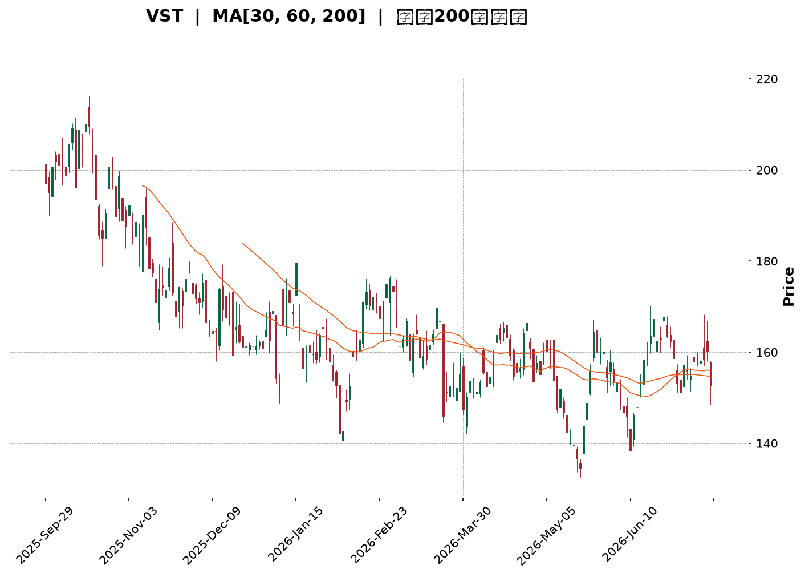
</details>

<html>
<head><meta charset="utf-8" /></head>
<body>
    <div style="height:500px; width:100%;">                        <script>window.PlotlyConfig = {MathJaxConfig: 'local'};</script>
        <script charset="utf-8" src="https://cdn.plot.ly/plotly-3.7.0.min.js" integrity="sha256-jvTGqxNp8AGWEcvNLVuKr+8j5dGe9Yw51LQkmDH+IYA=" crossorigin="anonymous"></script>                <div id="candlestick-chart" class="plotly-graph-div" style="height:100%; width:100%;"></div>            <script>                window.PLOTLYENV=window.PLOTLYENV || {};                                if (document.getElementById("candlestick-chart")) {                    Plotly.newPlot(                        "candlestick-chart",                        [{"close":{"dtype":"f8","bdata":"AAAAgM+jaEAAAABAcGNoQAAAAKCTFWlAAAAAoOc5aUAAAACA3yRpQAAAAOCF8mhAAAAAAFnZaEAAAAAAMLZpQAAAAGAhJGpAAAAA4GSBaEAAAABAyhVqQAAAAMALlWlAAAAAoDc\u002fakAAAABg4DBqQAAAAGB6EGlAAAAA4OYtaEAAAADg4jdnQAAAAODlIWdAAAAAQHHSZ0AAAABATRRpQAAAAIAmz2hAAAAAAJa5Z0AAAABAYdFoQAAAAACLnWdAAAAAQJxwZ0AAAAAgqQdoQAAAAKAHH2dAAAAAYFiTZ0AAAACAVvtmQAAAAOCmxmdAAAAA4PhvZ0AAAADgV01mQAAAAED7MGZAAAAAwCZbZUAAAACA5b5lQAAAAGDGyGVAAAAAwEq2ZUAAAACAtExmQAAAAEA3omVAAAAAgIH8ZEAAAACAPM1lQAAAAAA1RGVAAAAA4CICZkAAAABgyENmQAAAAGBvnWVAAAAAQLN6ZUAAAADgBF5lQAAAAKDf6mVAAAAAAEHPZEAAAABAy61kQAAAAAAMhGRAAAAAAIWPZEAAAABAB7xlQAAAAACgLGVAAAAAwKvxZEAAAACAYZdlQAAAAEDP6WNAAAAAAGOvZEAAAADgUktkQAAAAAD6I2RAAAAA4ConZEAAAAAgbDBkQAAAAOAqJ2RAAAAAwJcsZEAAAADAe0VkQAAAAEBRHGRAAAAA4MWYZEAAAABAYE9kQAAAAGD+IWVAAAAAQI1FY0AAAADA58ViQAAAAAAnvWRAAAAAAFODZUAAAACATl5lQAAAAIAfEGVAAAAAgNp1ZkAAAAAAfsRkQAAAAKATjGNAAAAAYIPyY0AAAAAAXf1jQAAAAEC09WNAAAAAYObLY0AAAACg0XlkQAAAAGDbpWRAAAAAIDVEZEAAAACAOL1jQAAAAICzOmNAAAAAQH4SY0AAAADgDsRhQAAAACCc1WFAAAAAoJanYkAAAAAgiRFjQAAAAEAc5WNAAAAAYKn2Y0AAAAAgzVRkQAAAAGCKYGVAAAAAYG2mZUAAAACgLkNlQAAAAIDFgGVAAAAAAKtdZUAAAABAyepkQAAAAGCwZGVAAAAAAArcZUAAAABgoQpmQAAAAOAgrWVAAAAAwAaxZEAAAADgHyhkQAAAACAZXWRAAAAAgAXeZEAAAABAy8ZjQAAAACBlZWRAAAAAQEl+ZEAAAACgEddjQAAAAOB45GNAAAAAAF7QY0AAAAAgYTFkQAAAAIANfGRAAAAAQNI0ZUAAAACAEN1kQAAAAAAbOmJAAAAAgILiYkAAAACgNBBjQAAAACCK6WJAAAAA4MgCY0AAAAAAZ2hjQAAAAGCtamJAAAAAINXDYkAAAACg1DdjQAAAAKD+3mJAAAAAoBjsYkAAAADg4S5jQAAAAACBdWNAAAAAICoRY0AAAACAb1BjQAAAAABSv2NAAAAAwLN3ZEAAAADgyVZkQAAAAGCNqWRAAAAAwGdnZEAAAADgDuxjQAAAACAwVmNAAAAA4E5yY0AAAABgLpRjQAAAAIDYg2RAAAAAABvLZEAAAABAoRxkQAAAAMBlMmNAAAAAANGzY0AAAADgAmJjQAAAAIAAFGRAAAAAoPsEZEAAAABAMsJjQAAAAMCCN2NAAAAAAG5wYkAAAADAy\u002fpiQAAAAIBEVWJAAAAAYCPNYUAAAAAgc7ZhQAAAAGCCb2FAAAAAYOERYUAAAAAgsdBgQAAAAGCO+WFAAAAAgOObYkAAAACgpYFjQAAAAECOimRAAAAAIKL9Y0AAAACgyQFkQAAAAIAwAGRAAAAA4GRRY0AAAACA+LdjQAAAAKC3MmNAAAAAoIUvY0AAAACgqZFiQAAAAOA5VmJAAAAAIH9AYkAAAACAFEthQAAAACCcRWJAAAAAIAR6YkAAAAAgxSljQAAAACBszGNAAAAAwHPTY0AAAAAgrHBkQAAAAOBR6GRAAAAA4HpMZEAAAAAA11tkQAAAAOCj+GRAAAAAIK5vZEAAAAAAKUxkQAAAAAAp1GNAAAAAwB4lY0AAAACgmeFiQAAAAEAKp2NAAAAAIFx3Y0AAAACAPVpjQAAAACBcv2NAAAAAIIXbY0AAAAAA18NjQAAAAIDCzWNAAAAAIFwHZEAAAACA6xFjQA=="},"high":{"dtype":"f8","bdata":"BjVRP5PIaUD\u002fgAQFZPVoQMA7cw6QgmlAhL5QCMuEaUD3dKDQgCpqQDKxqyIq4mlA9X7\u002fK6tfaUDMnCh2GbhpQCnXqoU6RmpApV+nzadvakAOJw5piSJqQCdbPKZ7\u002f2lASHr99nLkakAJ0689YwZrQIPizyq5JWpAHTzgMbqUaUBBhMYyxRNoQC8bM9DZlmdA8tQGbeTsZ0DDkj7+MCVpQPEw+n4XWmlAxpn+xOSPaEBhMf0quPxoQMGQIp3av2hAUh\u002fIjuECaEDEOS30LExoQHGn7kRE1mdAbmjz76f1Z0DK05OcvYpnQMRyt7MKyWdA\u002fC6xR3t\u002faEA4wSlUI2VnQKvztQ6KkWZAWwRKLxonZkCW1HyYHGhmQDOTz67QWGZAbUpl0+QVZkCs4Vdx6ZdmQOWhZaYokGdANKv70bWeZUAKcir2Jc9lQAljkbYrwGVAaRNZ+WggZkDGT5o7poBmQIQ0giLw92VAKDZFfAznZUCarfSgIKRlQFhNFnv4KWZAMBxL+Lf8ZUDM5W\u002f+9+NkQGTvjPmRJmVAR1AFX5uqZEAQ9cQFRcVlQKb6SWQcaGZAoli3XgqJZUCAgEBRraZlQN4l9Xg8zWVAF1zOpJ9mZUCS8PoqX1ZlQP1gbxNqe2RAL5U2v\u002fJnZED\u002fqwsAXkRkQFPdHzGcUWRAZjJLiud3ZEBopEtOhlNkQCZgUjt6gWRAp7b59wMaZUBN6ilQzmVlQGnwWiRIhGVADJZ2N+kFZUBE4m2b2GtjQI4l+vVAyGVAMDl4uxMIZkCwF9cr6d5lQIyfx82lVmVAQx95ts3BZkB5BYeYu1RlQL9AyW5YsWRAHYwfVA8xZEBiVUbpkGFkQGW0bhl2TWRAw3xmeVObZECm6jGdToVkQEoXNTU3w2RAxGbJ+FbtZECO8DJCeoFkQOqEa3k88WNAB1yxJi+CY0CvAnb7jSdjQNPBIGRq8GFABHBsw+D6YkBU0nYeNWtjQKg1I34wH2RAOMhnglObZEDZvnb2C7hkQH14cCj3ZWVA583ygDQFZkB0Xxa1geBlQDMz92oBg2VA6vbbya6gZUBLNqGRtWtlQOd\u002f4ISaZmVAj8lZRIzuZUBZsPm7thdmQBRRGZstOmZAbfWfhQ4BZkCHAxzkhWJkQKOUHio5eGRAPyMoHjbwZED\u002fpuOZS\u002f1kQNZEY0yghWRAH\u002fXO6GAKZUD8+7HWM3FkQGr0MxD+V2RAPFB2lxeZZEDlyrbfkGFkQO3BNvYcoGRAR1FHKbqQZUAGcUJaOiRlQBLbDReXx2RAKP1\u002f0NJ1Y0CsEKnQTTxjQMnRnNhUt2NA\u002fbnmopsOY0AmnuYtO\u002f9jQDxygsOl1mNAkD6M8ELoYkC2cS484oNjQNmGlecAS2NAt5PhJIIcY0C6bzOgOD5jQAZrlYizImRA8CFS1q9JZEBedA6yD81jQAq8WAHZD2RAcz8APpChZEDlS+M8MMlkQGrTXFP41WRAFKUg4CMIZUCXUVpFQnpkQCk\u002fmrb9G2RAx48q73DbY0B3r+b7utRjQO2YHW70p2RAd8+tK+cFZUB7R3RdF2NkQOYAlq48HWRANaBGPgTtY0A5swBTUP1jQDpCyrjkRGRA\u002fCy2EUVyZEC+dxHoYlhkQFDM6dPxBGVAunURWhBZY0Ch9xobKhFjQKvCgvGbw2JADqrM9GlCYkBZFcYEB+NhQBJH9fiQnGFAIfOYCQlrYUBUh9ZTSBBhQKountBQFmJA6u50lUeiYkCkz2NbMKtjQKQP0fZO5WRAKSwZ0FGZZECFWNRkpGlkQLrBeGYEQmRAYUJ4NIHKY0DNoM\u002fOwxFkQI9n\u002fqkNtmNAvcvm+mI6Y0B4\u002f3EFYEJjQFtCdEHromJAiBs6wt\u002fCYkDg5SFTjvlhQOkUD+s5VmJAErqv1kPJYkB\u002f1sKDcWdjQL3COj8iKGRAFzVshM9GZEA+fr7hQUNlQAAAAAAAUGVAAAAAYGa6ZEAAAADgerRkQAAAAEAza2VAAAAAgML9ZEAAAABAM7NkQAAAAGBmrmRAAAAAgD2qY0AAAAAgrodjQAAAACCup2NAAAAAwB7tY0AAAADgpY9jQAAAAIDCJWRAAAAA4KMAZEAAAACAwu1jQAAAAGC4BmVAAAAAgBTeZEAAAABAM8NjQA=="},"hovertemplate":"\u003cb\u003e%{x|%Y-%m-%d}\u003c\u002fb\u003e\u003cbr\u003e\u958b: $%{open:.2f}\u003cbr\u003e\u9ad8: $%{high:.2f}\u003cbr\u003e\u4f4e: $%{low:.2f}\u003cbr\u003e\u6536: $%{close:.2f}\u003cextra\u003e\u003c\u002fextra\u003e","low":{"dtype":"f8","bdata":"xdp3hymcaECUb29ZF71nQNgz77Lv62dA6EHjHFm8aECGfeEFQhVpQEcTvN6Ok2hAPggdxVJiaEDeNG35gOloQFXliD14j2lAycT8rcGAaEA2gyc+NPJoQOErv0ISEmlAW6BnUGixaUDnVw1NMfppQIyw6+oM52hA8fmLbzwAaEBVzavGnBlnQIO2mjb1XGZAt1H46xIeZ0Cz7faoXzloQFU2+QDsdWhAgwnm7I72ZkDbXCbc5JVnQPb2RQBCeGdA+szA5UjYZkBPmRpXJGJnQAMTC6GD92ZAt8kzhzcFZ0AO\u002fgAvIllmQPL0dFvD+2VAssVq2q3sZkD\u002fhSuEMEJmQJvmmkvAEWZA77VxdQI6ZUAK5+bhlZxkQM3Mhz\u002fdjGVAP9iunng+ZUCNZ9UI669lQITTLQwvjWVAOW9MsYU4ZEDQxchNyKZkQGznWCrxpmRAJuVj17+LZUDrlP0AsihmQD6TzkYpf2VA2GOdAvBUZUBM1cI7+gdlQBbhJLlyOGVA+stRaPK4ZEBSMHm8JWxkQAh71Vd\u002fgWRAsCshpL6\u002fY0A7iMiX8wpkQJOeNhbF2WRAHZXnBTPJZEAl8Xssf7tkQBI4B4ZWwWNAjaaY6dk\u002fZEDfJDC2zkBkQPrOqAUADWRAHAXODQb2Y0BygFEeiepjQLiA9lQL\u002fWNAThf1LHPvY0Apj52BsxNkQF1kbpzOGGRAIH3K6AJuZEAMQKAs8PdjQMmXLFOAamRA2E\u002fhlLkjY0BCs5Ld6JhiQE+O6hKErWRA27pxGhN0ZEDeLVbvKEtlQAmuEN7wsmRA7ODHmJpmZUCQ593C7VFkQPTB5Mc0emNAE556oBArY0Ag9Jf4v9ZjQBerkikNsmNAsPTxMNyuY0DO68WV1rZjQHJvtn\u002fkFmRAL4KNMSXKY0BH+6sMrI1jQE98s5JcM2NAx\u002fGicES\u002fYkBRynpTWFxhQJB\u002fnfq6RGFAoVD\u002f5WxgYkApz03r6WtiQHI0YcFATGNAHHjeaJrDY0BPK3elo\u002f5jQLSsTge+IWRAohwHjGUvZUBjWzTyiyRlQM3MzIwl+WRAKavMfRQRZUDS0w6JIphkQO4nQubHTWRAWETgk4szZUBvC+I+CHVkQBcNLq1kTWVAxKe3neurZEBwYIuz2hFjQLUutqWj\u002fmNAZU26hXwnZEBsqukIoLtjQJ\u002flsfBQUmNAo+ClJUF7ZEA51wNBGldjQJfjhPaQiGNASUClUm+pY0AeewidYvVjQF\u002fyRRKHNWRAkW21qWOhZEDCtHuW3HhkQPzSGyIUFGJAMJxIpQmkYkDIghxR6KpiQOtADzJuxWJA9Usz7x9JYkASHMOaNfFiQNFCycSjTGJAiLqFiYLEYUDwOsZTBuZiQKymnUQfvWJAen379nO1YkBI+6kTPMJiQDOfqJ9UYmNAyEFPbe0OY0AxzB4PqxxjQGb9A\u002fX3DWNAg3SBR90DZEAs990siz1kQKeo3jM+TGRAlLte\u002fw5BZEDZnOTJJ8NjQEHjf09DPWNAUI5+14FWY0Cy3fMLFkljQAHJlGTbXWNA3MG7n2rQY0A2uGT+789jQFfgSKK1G2NA9swxDGRwY0Bi23ei01ZjQFKs7NAIp2NAeKEM5XLyY0AVqkw8MYxjQJ\u002f43E\u002fCMWNAWqwzWshYYkDweaqfWUJiQFPafhyaLmJATeGNoxNqYUDmVQIJPndhQFW5CMzAM2FAMX2ym4e1YEBFRir8Lo9gQFW9NsnAM2FA2zmWPa0VYkC8U+f8QNFiQAsFCaL1v2NAx0+ltPfFY0AkQ4fTJaxjQGrbzMAjlWNA1Ueoq8njYkCz\u002f\u002f2PURVjQFVD8ByOF2NAkYOr9Vu\u002fYkBRAlovZmliQIzw+hScRWJA9W52HfKqYUAAGpvX8jZhQGkiR6P+a2FACw9272tZYkDj7yV5PsFiQEGD35a4E2NANWUyT6+fY0AyEYV9zPljQAAAAMDMXGRAAAAA4KPkY0AAAAAAKfxjQAAAAOBRwGRAAAAAgBRmZEAAAADgoyBkQAAAAOBRkGNAAAAAoJnhYkAAAAAAAJBiQAAAAOBRAGNAAAAA4FFAY0AAAACAPepiQAAAAIA9rmNAAAAAoJmhY0AAAABgZoZjQAAAACAGoWNAAAAAgBS+Y0AAAADgkZBiQA=="},"name":"\u50f9\u683c","open":{"dtype":"f8","bdata":"WHjTDzElaUDsKdcGpctoQMHL5eweRmhAYEMuRjNmaUBHeZ1xFHBpQA37M4XCqWlAZBfMP30XaUBM8KCbzhdpQHzFV0yHxGlAo5wpWnscakCDm\u002fIHJglpQImhtfz3nWlAOl5P23UOakCebloZxrxqQDUaKwfh2WlAh5ZyvRFpaUDjiWjrjwJoQHYgS7C1WGdAt1H46xIeZ0DP1Z61G3loQPEw+n4XWmlAxpn+xOSPaEDVY10VFPBnQOtqM0XsO2hA2YR\u002f64TmZ0CqzoLDmMBnQBiFtpE8amdAZ3lst5kvZ0BQeuUmNcRmQHgZU45POGZA8pIPO78\u002faECnihoVxCRnQF6dQcOgcmZA\u002flLLO6QFZkDVDAqmks9kQACAGER61mVA3QmdqzR+ZUAJWPGY381lQJn7n2O2AWdAswulZSxpZUDhnoJdvBtlQFK+6gt1q2VA9zovYeioZUA3U1h+PkhmQASHctr16GVA\u002frb3i4XVZUAuLD2PNH5lQHQ0e4z8ZWVA\u002fO4JlTb5ZUDM5W\u002f+9+NkQIWcS3nklWRA+EFu2e+UZEDWOUICGCxkQP\u002fTiNklz2VAwiOPGsSHZUC2HdHmrr5kQOejUt05qWVAYkm6cyKfZEAhBznQRsBkQK0495SFcWRAPiCCAvojZECf4vfLdxFkQAAAAOAqJ2RAm3TFe8kRZEDiuBTDsjFkQMT3T34ZTmRAIH3K6AJuZECRemU04xxlQH\u002fKW5oUEWVADJZ2N+kFZUCDfXhpS1pjQENNHnoru2VAxyDnBOeGZEDtmwORo7BlQH5xCqKGHWVAtKXfQ7qQZUCrBJHnzuJkQKEUaTRnGmRA4gOXM0jSY0B7d67kdi9kQJBFQPbf8WNAX5qV5bMEZEDEj2j5POJjQAMSKV1YsWRAVuHzvBGwZECJOzEPviFkQFAKQ8LhpmNA9J43vQ52Y0BHkL1ajhhjQKI0NWiNk2FAa9D79sGyYkBu+0D\u002fwbJiQP8aiquj\u002fmNAK3\u002frA2+RZEBVXiyQKwlkQMVgM3B2PmRAXr5uJxNNZUCzq6VB9bBlQM3MrsgeLmVAfkzCiGN6ZUDlgIFQakVlQOpTkTUx2mRAHO8DOfF8ZUADs1tlZFxlQF4E1+mM0GVAtfGq2l83ZUAHU9M5zidkQOHVtkCdJGRAX7WIgN4tZECAT2jL4X9kQGTymVkJb2NATPyx7eucZED\u002f3yTHwWRkQHS+91+xlGNAXasA\u002fgkqZEDE9tBfyRFkQLZHLfqLS2RAj1tLA16pZEB0WhWlrtZkQBLbDReXx2RAmxHEap\u002fnYkBVWETc3MpiQIN5bkQQWWNAFtysU0+pYkASHMOaNfFiQMNnenornGNAEtlGKlz2YUD9knYGQ+hiQICb+if032JA9OUFTYXaYkDcdrDGettiQAVs6HLOEGRAPQVdB4F1Y0C1llR3ISljQGb9A\u002fX3DWNAatE0H9pFZEDBGUQMmKhkQBLbfh\u002fgimRAu4FBLOHAZEBtoxW6TVpkQJjXwDsgEWRASUIb2YmyY0BLmyKyvXdjQE18AoCQg2NAdODPuZ2YZECDL+ZwukhkQKC43UBSFGRAUnbWIUmCY0AWdODp1cJjQCU9uPMFr2NAQPX8m7RYZEBC+YzonChkQAgE1t37WWRAunURWhBZY0DUzoWFYHliQPplZZz9qGJADqrM9GlCYkA7DQJV1aVhQL8gZYmLcmFArLtFmcdZYUBrpU3jhfNgQAAAABzTOWFA\u002fMREu4coYkDwR7uHM9piQMfGYjoC1mNAKozppVaXZECvggyfxdNjQEMghwLX+GNAwtBlVvmYY0BjyZkBGndjQLXtAdRQiWNADDiWnn\u002fqYkCvGpyhMvliQLf923hIg2JAMRzhS8yGYkAG62cFyeRhQMrc7v5emWFAVhuremB5YkCCqUriFBNjQJtjJ2ckIWNAh9cz6fvKY0DwVzxkoDtkQAAAAAApcGRAAAAAYI8CZEAAAADA9WBkQAAAAMAe3WRAAAAAIIW7ZEAAAABgZnZkQAAAAGCPUmRAAAAAAACAY0AAAABgZj5jQAAAAEAKD2NAAAAAACmEY0AAAAAgrj9jQAAAAOBR4GNAAAAAoJmxY0AAAADAzLRjQAAAAAAAIGRAAAAAAABQZEAAAAAA17tjQA=="},"x":["2025-09-29T00:00:00-04:00","2025-09-30T00:00:00-04:00","2025-10-01T00:00:00-04:00","2025-10-02T00:00:00-04:00","2025-10-03T00:00:00-04:00","2025-10-06T00:00:00-04:00","2025-10-07T00:00:00-04:00","2025-10-08T00:00:00-04:00","2025-10-09T00:00:00-04:00","2025-10-10T00:00:00-04:00","2025-10-13T00:00:00-04:00","2025-10-14T00:00:00-04:00","2025-10-15T00:00:00-04:00","2025-10-16T00:00:00-04:00","2025-10-17T00:00:00-04:00","2025-10-20T00:00:00-04:00","2025-10-21T00:00:00-04:00","2025-10-22T00:00:00-04:00","2025-10-23T00:00:00-04:00","2025-10-24T00:00:00-04:00","2025-10-27T00:00:00-04:00","2025-10-28T00:00:00-04:00","2025-10-29T00:00:00-04:00","2025-10-30T00:00:00-04:00","2025-10-31T00:00:00-04:00","2025-11-03T00:00:00-05:00","2025-11-04T00:00:00-05:00","2025-11-05T00:00:00-05:00","2025-11-06T00:00:00-05:00","2025-11-07T00:00:00-05:00","2025-11-10T00:00:00-05:00","2025-11-11T00:00:00-05:00","2025-11-12T00:00:00-05:00","2025-11-13T00:00:00-05:00","2025-11-14T00:00:00-05:00","2025-11-17T00:00:00-05:00","2025-11-18T00:00:00-05:00","2025-11-19T00:00:00-05:00","2025-11-20T00:00:00-05:00","2025-11-21T00:00:00-05:00","2025-11-24T00:00:00-05:00","2025-11-25T00:00:00-05:00","2025-11-26T00:00:00-05:00","2025-11-28T00:00:00-05:00","2025-12-01T00:00:00-05:00","2025-12-02T00:00:00-05:00","2025-12-03T00:00:00-05:00","2025-12-04T00:00:00-05:00","2025-12-05T00:00:00-05:00","2025-12-08T00:00:00-05:00","2025-12-09T00:00:00-05:00","2025-12-10T00:00:00-05:00","2025-12-11T00:00:00-05:00","2025-12-12T00:00:00-05:00","2025-12-15T00:00:00-05:00","2025-12-16T00:00:00-05:00","2025-12-17T00:00:00-05:00","2025-12-18T00:00:00-05:00","2025-12-19T00:00:00-05:00","2025-12-22T00:00:00-05:00","2025-12-23T00:00:00-05:00","2025-12-24T00:00:00-05:00","2025-12-26T00:00:00-05:00","2025-12-29T00:00:00-05:00","2025-12-30T00:00:00-05:00","2025-12-31T00:00:00-05:00","2026-01-02T00:00:00-05:00","2026-01-05T00:00:00-05:00","2026-01-06T00:00:00-05:00","2026-01-07T00:00:00-05:00","2026-01-08T00:00:00-05:00","2026-01-09T00:00:00-05:00","2026-01-12T00:00:00-05:00","2026-01-13T00:00:00-05:00","2026-01-14T00:00:00-05:00","2026-01-15T00:00:00-05:00","2026-01-16T00:00:00-05:00","2026-01-20T00:00:00-05:00","2026-01-21T00:00:00-05:00","2026-01-22T00:00:00-05:00","2026-01-23T00:00:00-05:00","2026-01-26T00:00:00-05:00","2026-01-27T00:00:00-05:00","2026-01-28T00:00:00-05:00","2026-01-29T00:00:00-05:00","2026-01-30T00:00:00-05:00","2026-02-02T00:00:00-05:00","2026-02-03T00:00:00-05:00","2026-02-04T00:00:00-05:00","2026-02-05T00:00:00-05:00","2026-02-06T00:00:00-05:00","2026-02-09T00:00:00-05:00","2026-02-10T00:00:00-05:00","2026-02-11T00:00:00-05:00","2026-02-12T00:00:00-05:00","2026-02-13T00:00:00-05:00","2026-02-17T00:00:00-05:00","2026-02-18T00:00:00-05:00","2026-02-19T00:00:00-05:00","2026-02-20T00:00:00-05:00","2026-02-23T00:00:00-05:00","2026-02-24T00:00:00-05:00","2026-02-25T00:00:00-05:00","2026-02-26T00:00:00-05:00","2026-02-27T00:00:00-05:00","2026-03-02T00:00:00-05:00","2026-03-03T00:00:00-05:00","2026-03-04T00:00:00-05:00","2026-03-05T00:00:00-05:00","2026-03-06T00:00:00-05:00","2026-03-09T00:00:00-04:00","2026-03-10T00:00:00-04:00","2026-03-11T00:00:00-04:00","2026-03-12T00:00:00-04:00","2026-03-13T00:00:00-04:00","2026-03-16T00:00:00-04:00","2026-03-17T00:00:00-04:00","2026-03-18T00:00:00-04:00","2026-03-19T00:00:00-04:00","2026-03-20T00:00:00-04:00","2026-03-23T00:00:00-04:00","2026-03-24T00:00:00-04:00","2026-03-25T00:00:00-04:00","2026-03-26T00:00:00-04:00","2026-03-27T00:00:00-04:00","2026-03-30T00:00:00-04:00","2026-03-31T00:00:00-04:00","2026-04-01T00:00:00-04:00","2026-04-02T00:00:00-04:00","2026-04-06T00:00:00-04:00","2026-04-07T00:00:00-04:00","2026-04-08T00:00:00-04:00","2026-04-09T00:00:00-04:00","2026-04-10T00:00:00-04:00","2026-04-13T00:00:00-04:00","2026-04-14T00:00:00-04:00","2026-04-15T00:00:00-04:00","2026-04-16T00:00:00-04:00","2026-04-17T00:00:00-04:00","2026-04-20T00:00:00-04:00","2026-04-21T00:00:00-04:00","2026-04-22T00:00:00-04:00","2026-04-23T00:00:00-04:00","2026-04-24T00:00:00-04:00","2026-04-27T00:00:00-04:00","2026-04-28T00:00:00-04:00","2026-04-29T00:00:00-04:00","2026-04-30T00:00:00-04:00","2026-05-01T00:00:00-04:00","2026-05-04T00:00:00-04:00","2026-05-05T00:00:00-04:00","2026-05-06T00:00:00-04:00","2026-05-07T00:00:00-04:00","2026-05-08T00:00:00-04:00","2026-05-11T00:00:00-04:00","2026-05-12T00:00:00-04:00","2026-05-13T00:00:00-04:00","2026-05-14T00:00:00-04:00","2026-05-15T00:00:00-04:00","2026-05-18T00:00:00-04:00","2026-05-19T00:00:00-04:00","2026-05-20T00:00:00-04:00","2026-05-21T00:00:00-04:00","2026-05-22T00:00:00-04:00","2026-05-26T00:00:00-04:00","2026-05-27T00:00:00-04:00","2026-05-28T00:00:00-04:00","2026-05-29T00:00:00-04:00","2026-06-01T00:00:00-04:00","2026-06-02T00:00:00-04:00","2026-06-03T00:00:00-04:00","2026-06-04T00:00:00-04:00","2026-06-05T00:00:00-04:00","2026-06-08T00:00:00-04:00","2026-06-09T00:00:00-04:00","2026-06-10T00:00:00-04:00","2026-06-11T00:00:00-04:00","2026-06-12T00:00:00-04:00","2026-06-15T00:00:00-04:00","2026-06-16T00:00:00-04:00","2026-06-17T00:00:00-04:00","2026-06-18T00:00:00-04:00","2026-06-22T00:00:00-04:00","2026-06-23T00:00:00-04:00","2026-06-24T00:00:00-04:00","2026-06-25T00:00:00-04:00","2026-06-26T00:00:00-04:00","2026-06-29T00:00:00-04:00","2026-06-30T00:00:00-04:00","2026-07-01T00:00:00-04:00","2026-07-02T00:00:00-04:00","2026-07-06T00:00:00-04:00","2026-07-07T00:00:00-04:00","2026-07-08T00:00:00-04:00","2026-07-09T00:00:00-04:00","2026-07-10T00:00:00-04:00","2026-07-13T00:00:00-04:00","2026-07-14T00:00:00-04:00","2026-07-15T00:00:00-04:00","2026-07-16T00:00:00-04:00"],"type":"candlestick"},{"hovertemplate":"MA30: $%{y:.2f}\u003cextra\u003e\u003c\u002fextra\u003e","line":{"color":"#2196F3","dash":"dash","width":2},"mode":"lines","name":"MA30","x":["2025-09-29T00:00:00-04:00","2025-09-30T00:00:00-04:00","2025-10-01T00:00:00-04:00","2025-10-02T00:00:00-04:00","2025-10-03T00:00:00-04:00","2025-10-06T00:00:00-04:00","2025-10-07T00:00:00-04:00","2025-10-08T00:00:00-04:00","2025-10-09T00:00:00-04:00","2025-10-10T00:00:00-04:00","2025-10-13T00:00:00-04:00","2025-10-14T00:00:00-04:00","2025-10-15T00:00:00-04:00","2025-10-16T00:00:00-04:00","2025-10-17T00:00:00-04:00","2025-10-20T00:00:00-04:00","2025-10-21T00:00:00-04:00","2025-10-22T00:00:00-04:00","2025-10-23T00:00:00-04:00","2025-10-24T00:00:00-04:00","2025-10-27T00:00:00-04:00","2025-10-28T00:00:00-04:00","2025-10-29T00:00:00-04:00","2025-10-30T00:00:00-04:00","2025-10-31T00:00:00-04:00","2025-11-03T00:00:00-05:00","2025-11-04T00:00:00-05:00","2025-11-05T00:00:00-05:00","2025-11-06T00:00:00-05:00","2025-11-07T00:00:00-05:00","2025-11-10T00:00:00-05:00","2025-11-11T00:00:00-05:00","2025-11-12T00:00:00-05:00","2025-11-13T00:00:00-05:00","2025-11-14T00:00:00-05:00","2025-11-17T00:00:00-05:00","2025-11-18T00:00:00-05:00","2025-11-19T00:00:00-05:00","2025-11-20T00:00:00-05:00","2025-11-21T00:00:00-05:00","2025-11-24T00:00:00-05:00","2025-11-25T00:00:00-05:00","2025-11-26T00:00:00-05:00","2025-11-28T00:00:00-05:00","2025-12-01T00:00:00-05:00","2025-12-02T00:00:00-05:00","2025-12-03T00:00:00-05:00","2025-12-04T00:00:00-05:00","2025-12-05T00:00:00-05:00","2025-12-08T00:00:00-05:00","2025-12-09T00:00:00-05:00","2025-12-10T00:00:00-05:00","2025-12-11T00:00:00-05:00","2025-12-12T00:00:00-05:00","2025-12-15T00:00:00-05:00","2025-12-16T00:00:00-05:00","2025-12-17T00:00:00-05:00","2025-12-18T00:00:00-05:00","2025-12-19T00:00:00-05:00","2025-12-22T00:00:00-05:00","2025-12-23T00:00:00-05:00","2025-12-24T00:00:00-05:00","2025-12-26T00:00:00-05:00","2025-12-29T00:00:00-05:00","2025-12-30T00:00:00-05:00","2025-12-31T00:00:00-05:00","2026-01-02T00:00:00-05:00","2026-01-05T00:00:00-05:00","2026-01-06T00:00:00-05:00","2026-01-07T00:00:00-05:00","2026-01-08T00:00:00-05:00","2026-01-09T00:00:00-05:00","2026-01-12T00:00:00-05:00","2026-01-13T00:00:00-05:00","2026-01-14T00:00:00-05:00","2026-01-15T00:00:00-05:00","2026-01-16T00:00:00-05:00","2026-01-20T00:00:00-05:00","2026-01-21T00:00:00-05:00","2026-01-22T00:00:00-05:00","2026-01-23T00:00:00-05:00","2026-01-26T00:00:00-05:00","2026-01-27T00:00:00-05:00","2026-01-28T00:00:00-05:00","2026-01-29T00:00:00-05:00","2026-01-30T00:00:00-05:00","2026-02-02T00:00:00-05:00","2026-02-03T00:00:00-05:00","2026-02-04T00:00:00-05:00","2026-02-05T00:00:00-05:00","2026-02-06T00:00:00-05:00","2026-02-09T00:00:00-05:00","2026-02-10T00:00:00-05:00","2026-02-11T00:00:00-05:00","2026-02-12T00:00:00-05:00","2026-02-13T00:00:00-05:00","2026-02-17T00:00:00-05:00","2026-02-18T00:00:00-05:00","2026-02-19T00:00:00-05:00","2026-02-20T00:00:00-05:00","2026-02-23T00:00:00-05:00","2026-02-24T00:00:00-05:00","2026-02-25T00:00:00-05:00","2026-02-26T00:00:00-05:00","2026-02-27T00:00:00-05:00","2026-03-02T00:00:00-05:00","2026-03-03T00:00:00-05:00","2026-03-04T00:00:00-05:00","2026-03-05T00:00:00-05:00","2026-03-06T00:00:00-05:00","2026-03-09T00:00:00-04:00","2026-03-10T00:00:00-04:00","2026-03-11T00:00:00-04:00","2026-03-12T00:00:00-04:00","2026-03-13T00:00:00-04:00","2026-03-16T00:00:00-04:00","2026-03-17T00:00:00-04:00","2026-03-18T00:00:00-04:00","2026-03-19T00:00:00-04:00","2026-03-20T00:00:00-04:00","2026-03-23T00:00:00-04:00","2026-03-24T00:00:00-04:00","2026-03-25T00:00:00-04:00","2026-03-26T00:00:00-04:00","2026-03-27T00:00:00-04:00","2026-03-30T00:00:00-04:00","2026-03-31T00:00:00-04:00","2026-04-01T00:00:00-04:00","2026-04-02T00:00:00-04:00","2026-04-06T00:00:00-04:00","2026-04-07T00:00:00-04:00","2026-04-08T00:00:00-04:00","2026-04-09T00:00:00-04:00","2026-04-10T00:00:00-04:00","2026-04-13T00:00:00-04:00","2026-04-14T00:00:00-04:00","2026-04-15T00:00:00-04:00","2026-04-16T00:00:00-04:00","2026-04-17T00:00:00-04:00","2026-04-20T00:00:00-04:00","2026-04-21T00:00:00-04:00","2026-04-22T00:00:00-04:00","2026-04-23T00:00:00-04:00","2026-04-24T00:00:00-04:00","2026-04-27T00:00:00-04:00","2026-04-28T00:00:00-04:00","2026-04-29T00:00:00-04:00","2026-04-30T00:00:00-04:00","2026-05-01T00:00:00-04:00","2026-05-04T00:00:00-04:00","2026-05-05T00:00:00-04:00","2026-05-06T00:00:00-04:00","2026-05-07T00:00:00-04:00","2026-05-08T00:00:00-04:00","2026-05-11T00:00:00-04:00","2026-05-12T00:00:00-04:00","2026-05-13T00:00:00-04:00","2026-05-14T00:00:00-04:00","2026-05-15T00:00:00-04:00","2026-05-18T00:00:00-04:00","2026-05-19T00:00:00-04:00","2026-05-20T00:00:00-04:00","2026-05-21T00:00:00-04:00","2026-05-22T00:00:00-04:00","2026-05-26T00:00:00-04:00","2026-05-27T00:00:00-04:00","2026-05-28T00:00:00-04:00","2026-05-29T00:00:00-04:00","2026-06-01T00:00:00-04:00","2026-06-02T00:00:00-04:00","2026-06-03T00:00:00-04:00","2026-06-04T00:00:00-04:00","2026-06-05T00:00:00-04:00","2026-06-08T00:00:00-04:00","2026-06-09T00:00:00-04:00","2026-06-10T00:00:00-04:00","2026-06-11T00:00:00-04:00","2026-06-12T00:00:00-04:00","2026-06-15T00:00:00-04:00","2026-06-16T00:00:00-04:00","2026-06-17T00:00:00-04:00","2026-06-18T00:00:00-04:00","2026-06-22T00:00:00-04:00","2026-06-23T00:00:00-04:00","2026-06-24T00:00:00-04:00","2026-06-25T00:00:00-04:00","2026-06-26T00:00:00-04:00","2026-06-29T00:00:00-04:00","2026-06-30T00:00:00-04:00","2026-07-01T00:00:00-04:00","2026-07-02T00:00:00-04:00","2026-07-06T00:00:00-04:00","2026-07-07T00:00:00-04:00","2026-07-08T00:00:00-04:00","2026-07-09T00:00:00-04:00","2026-07-10T00:00:00-04:00","2026-07-13T00:00:00-04:00","2026-07-14T00:00:00-04:00","2026-07-15T00:00:00-04:00","2026-07-16T00:00:00-04:00"],"y":{"dtype":"f8","bdata":"AAAAAAAA+H8AAAAAAAD4fwAAAAAAAPh\u002fAAAAAAAA+H8AAAAAAAD4fwAAAAAAAPh\u002fAAAAAAAA+H8AAAAAAAD4fwAAAAAAAPh\u002fAAAAAAAA+H8AAAAAAAD4fwAAAAAAAPh\u002fAAAAAAAA+H8AAAAAAAD4fwAAAAAAAPh\u002fAAAAAAAA+H8AAAAAAAD4fwAAAAAAAPh\u002fAAAAAAAA+H8AAAAAAAD4fwAAAAAAAPh\u002fAAAAAAAA+H8AAAAAAAD4fwAAAAAAAPh\u002fAAAAAAAA+H8AAAAAAAD4fwAAAAAAAPh\u002fAAAAAAAA+H8AAAAAAAD4fzMzM2MtkmhAAAAAgOqHaEAzMzPjHHZoQERERCRtXWhAZmZmtmY8aECamZnpZh9oQAAAABBpBGhAIiIiUqTpZ0CrqqqahsxnQN7d3d0PpmdAmpmZSQiIZ0B3d3cHe2NnQCIiIhKnPmdAZmZmtnsaZ0CamZnp+vhmQM3MzJyL22ZAvLu7W4HEZkARERGxtbRmQN7d3Z1XqmZA7+7uzqKQZkARERHxFWtmQM3MzOxyRmZAvLu7W3IrZkDv7u6OIhFmQM3MzOxN\u002fGVAREREpAHnZUBERER0MtJlQFVVVbXStmVAVVVVZSieZUB3d3dXOYdlQERERJQzaGVAZmZmtixMZUCrqqraJDplQKuqqgrAKGVAVVVVNaoeZUDe3d2dFRJlQCIiInLNA2VAREREBEn6ZEDe3d29TulkQERERJQI5WRAZmZm1mbWZEDe3d2tjrxkQGZmZjYOuGRAVVVVFdSzZEAzMzPjLaxkQGZmZgZ4p2RAMzMzM9evZECrqqoauapkQKuqqhp\u002flmRAMzMzcyOPZECJiIjoQYlkQAAAAECDhGRAZmZm9v19ZEARERFxQHNkQLy7u2vCbmRAMzMzM\u002fpoZECJiIgILFlkQGZmZsZVU2RAq6qqapJFZEBVVVUV\u002fy9kQJqZmUlRHGRAREREFIgPZECrqqr69wVkQKuqqkrEA2RAREREFPgBZECrqqrKegJkQO\u002fu7n5JDWRAvLu7i0YWZEBmZmYGZx5kQLy7u8uPIWRAd3d3p24zZEAAAABwukVkQFVVVRVQS2RA3t3dHUVOZEDNzMycA1RkQERERGQ\u002fWWRARERERCdKZEDe3d3t8ERkQERERJToS2RAAAAAQMJTZEB3d3eX8FFkQAAAALCpVWRAq6qq6ptbZEDe3d0dL1ZkQGZmZua8T2RAVVVVZeBLZEDe3d2dv09kQBEREdF1WmRAERER0atsZEDe3d3NGodkQN7d3V10imRAmpmZKWuMZEAAAADQX4xkQDMzMxP9g2RA3t3d\u002fdt7ZECJiIi4+nNkQO\u002fu7p63WmRAIiIi8hhCZEAzMzMDpzBkQDMzM3MxGmRAzczMPFcFZEAiIiJCi\u002fZjQN7d3a0J5mNAq6qqajXOY0DNzMx877ZjQImIiKh5pmNA3t3dfZCkY0ARERGxHqZjQJqZmRmrqGNAiYiI6LakY0BVVVXl9KVjQImIiJjqnGNAmpmZ2fuTY0AzMzMTwZFjQAAAABARl2NAIiIismyfY0AiIiKiu55jQDMzM5O+k2NAMzMzM+mGY0DNzMycRnpjQHd3d4cSimNAvLu7O8GTY0BmZmYWsJljQBEREXFJnGNAvLu7i2iXY0DNzMw8wZNjQKuqqooKk2NAq6qqatGKY0BVVVXV+H1jQFVVVfW4cWNAERERUephY0De3d19tU1jQFVVVUULQWNAREREhCI9Y0BERER0xj5jQKuqqrqMRWNAMzMzE3tBY0C8u7u7pT5jQBEREYEAOWNAREREJLwvY0CamZmp\u002fy1jQKuqqvrQLGNAIiIiEpcqY0C8u7sL+SFjQBEREbFiD2NARERE1LL5YkCrqqqapeFiQERERATB2WJAERERQUvPYkBERERUa81iQERERIQIy2JAq6qq2mHJYkB3d3e3Ms9iQFVVVQWg3WJAERERUX7tYkBVVVX1QvliQDMzMyPGD2NAq6qqOkImY0AzMzPTUDxjQHd3d8e8UGNAZmZmBnJiY0AAAABgE3RjQN7d3U1kgmNAAAAAILWJY0CrqqraZIhjQKuqquqegWNAERER0XuAY0AiIiIya35jQM3MzNy8fGNAMzMzo82CY0C8u7urRH1jQA=="},"type":"scatter"},{"hovertemplate":"MA60: $%{y:.2f}\u003cextra\u003e\u003c\u002fextra\u003e","line":{"color":"#9C27B0","dash":"dash","width":2},"mode":"lines","name":"MA60","x":["2025-09-29T00:00:00-04:00","2025-09-30T00:00:00-04:00","2025-10-01T00:00:00-04:00","2025-10-02T00:00:00-04:00","2025-10-03T00:00:00-04:00","2025-10-06T00:00:00-04:00","2025-10-07T00:00:00-04:00","2025-10-08T00:00:00-04:00","2025-10-09T00:00:00-04:00","2025-10-10T00:00:00-04:00","2025-10-13T00:00:00-04:00","2025-10-14T00:00:00-04:00","2025-10-15T00:00:00-04:00","2025-10-16T00:00:00-04:00","2025-10-17T00:00:00-04:00","2025-10-20T00:00:00-04:00","2025-10-21T00:00:00-04:00","2025-10-22T00:00:00-04:00","2025-10-23T00:00:00-04:00","2025-10-24T00:00:00-04:00","2025-10-27T00:00:00-04:00","2025-10-28T00:00:00-04:00","2025-10-29T00:00:00-04:00","2025-10-30T00:00:00-04:00","2025-10-31T00:00:00-04:00","2025-11-03T00:00:00-05:00","2025-11-04T00:00:00-05:00","2025-11-05T00:00:00-05:00","2025-11-06T00:00:00-05:00","2025-11-07T00:00:00-05:00","2025-11-10T00:00:00-05:00","2025-11-11T00:00:00-05:00","2025-11-12T00:00:00-05:00","2025-11-13T00:00:00-05:00","2025-11-14T00:00:00-05:00","2025-11-17T00:00:00-05:00","2025-11-18T00:00:00-05:00","2025-11-19T00:00:00-05:00","2025-11-20T00:00:00-05:00","2025-11-21T00:00:00-05:00","2025-11-24T00:00:00-05:00","2025-11-25T00:00:00-05:00","2025-11-26T00:00:00-05:00","2025-11-28T00:00:00-05:00","2025-12-01T00:00:00-05:00","2025-12-02T00:00:00-05:00","2025-12-03T00:00:00-05:00","2025-12-04T00:00:00-05:00","2025-12-05T00:00:00-05:00","2025-12-08T00:00:00-05:00","2025-12-09T00:00:00-05:00","2025-12-10T00:00:00-05:00","2025-12-11T00:00:00-05:00","2025-12-12T00:00:00-05:00","2025-12-15T00:00:00-05:00","2025-12-16T00:00:00-05:00","2025-12-17T00:00:00-05:00","2025-12-18T00:00:00-05:00","2025-12-19T00:00:00-05:00","2025-12-22T00:00:00-05:00","2025-12-23T00:00:00-05:00","2025-12-24T00:00:00-05:00","2025-12-26T00:00:00-05:00","2025-12-29T00:00:00-05:00","2025-12-30T00:00:00-05:00","2025-12-31T00:00:00-05:00","2026-01-02T00:00:00-05:00","2026-01-05T00:00:00-05:00","2026-01-06T00:00:00-05:00","2026-01-07T00:00:00-05:00","2026-01-08T00:00:00-05:00","2026-01-09T00:00:00-05:00","2026-01-12T00:00:00-05:00","2026-01-13T00:00:00-05:00","2026-01-14T00:00:00-05:00","2026-01-15T00:00:00-05:00","2026-01-16T00:00:00-05:00","2026-01-20T00:00:00-05:00","2026-01-21T00:00:00-05:00","2026-01-22T00:00:00-05:00","2026-01-23T00:00:00-05:00","2026-01-26T00:00:00-05:00","2026-01-27T00:00:00-05:00","2026-01-28T00:00:00-05:00","2026-01-29T00:00:00-05:00","2026-01-30T00:00:00-05:00","2026-02-02T00:00:00-05:00","2026-02-03T00:00:00-05:00","2026-02-04T00:00:00-05:00","2026-02-05T00:00:00-05:00","2026-02-06T00:00:00-05:00","2026-02-09T00:00:00-05:00","2026-02-10T00:00:00-05:00","2026-02-11T00:00:00-05:00","2026-02-12T00:00:00-05:00","2026-02-13T00:00:00-05:00","2026-02-17T00:00:00-05:00","2026-02-18T00:00:00-05:00","2026-02-19T00:00:00-05:00","2026-02-20T00:00:00-05:00","2026-02-23T00:00:00-05:00","2026-02-24T00:00:00-05:00","2026-02-25T00:00:00-05:00","2026-02-26T00:00:00-05:00","2026-02-27T00:00:00-05:00","2026-03-02T00:00:00-05:00","2026-03-03T00:00:00-05:00","2026-03-04T00:00:00-05:00","2026-03-05T00:00:00-05:00","2026-03-06T00:00:00-05:00","2026-03-09T00:00:00-04:00","2026-03-10T00:00:00-04:00","2026-03-11T00:00:00-04:00","2026-03-12T00:00:00-04:00","2026-03-13T00:00:00-04:00","2026-03-16T00:00:00-04:00","2026-03-17T00:00:00-04:00","2026-03-18T00:00:00-04:00","2026-03-19T00:00:00-04:00","2026-03-20T00:00:00-04:00","2026-03-23T00:00:00-04:00","2026-03-24T00:00:00-04:00","2026-03-25T00:00:00-04:00","2026-03-26T00:00:00-04:00","2026-03-27T00:00:00-04:00","2026-03-30T00:00:00-04:00","2026-03-31T00:00:00-04:00","2026-04-01T00:00:00-04:00","2026-04-02T00:00:00-04:00","2026-04-06T00:00:00-04:00","2026-04-07T00:00:00-04:00","2026-04-08T00:00:00-04:00","2026-04-09T00:00:00-04:00","2026-04-10T00:00:00-04:00","2026-04-13T00:00:00-04:00","2026-04-14T00:00:00-04:00","2026-04-15T00:00:00-04:00","2026-04-16T00:00:00-04:00","2026-04-17T00:00:00-04:00","2026-04-20T00:00:00-04:00","2026-04-21T00:00:00-04:00","2026-04-22T00:00:00-04:00","2026-04-23T00:00:00-04:00","2026-04-24T00:00:00-04:00","2026-04-27T00:00:00-04:00","2026-04-28T00:00:00-04:00","2026-04-29T00:00:00-04:00","2026-04-30T00:00:00-04:00","2026-05-01T00:00:00-04:00","2026-05-04T00:00:00-04:00","2026-05-05T00:00:00-04:00","2026-05-06T00:00:00-04:00","2026-05-07T00:00:00-04:00","2026-05-08T00:00:00-04:00","2026-05-11T00:00:00-04:00","2026-05-12T00:00:00-04:00","2026-05-13T00:00:00-04:00","2026-05-14T00:00:00-04:00","2026-05-15T00:00:00-04:00","2026-05-18T00:00:00-04:00","2026-05-19T00:00:00-04:00","2026-05-20T00:00:00-04:00","2026-05-21T00:00:00-04:00","2026-05-22T00:00:00-04:00","2026-05-26T00:00:00-04:00","2026-05-27T00:00:00-04:00","2026-05-28T00:00:00-04:00","2026-05-29T00:00:00-04:00","2026-06-01T00:00:00-04:00","2026-06-02T00:00:00-04:00","2026-06-03T00:00:00-04:00","2026-06-04T00:00:00-04:00","2026-06-05T00:00:00-04:00","2026-06-08T00:00:00-04:00","2026-06-09T00:00:00-04:00","2026-06-10T00:00:00-04:00","2026-06-11T00:00:00-04:00","2026-06-12T00:00:00-04:00","2026-06-15T00:00:00-04:00","2026-06-16T00:00:00-04:00","2026-06-17T00:00:00-04:00","2026-06-18T00:00:00-04:00","2026-06-22T00:00:00-04:00","2026-06-23T00:00:00-04:00","2026-06-24T00:00:00-04:00","2026-06-25T00:00:00-04:00","2026-06-26T00:00:00-04:00","2026-06-29T00:00:00-04:00","2026-06-30T00:00:00-04:00","2026-07-01T00:00:00-04:00","2026-07-02T00:00:00-04:00","2026-07-06T00:00:00-04:00","2026-07-07T00:00:00-04:00","2026-07-08T00:00:00-04:00","2026-07-09T00:00:00-04:00","2026-07-10T00:00:00-04:00","2026-07-13T00:00:00-04:00","2026-07-14T00:00:00-04:00","2026-07-15T00:00:00-04:00","2026-07-16T00:00:00-04:00"],"y":{"dtype":"f8","bdata":"AAAAAAAA+H8AAAAAAAD4fwAAAAAAAPh\u002fAAAAAAAA+H8AAAAAAAD4fwAAAAAAAPh\u002fAAAAAAAA+H8AAAAAAAD4fwAAAAAAAPh\u002fAAAAAAAA+H8AAAAAAAD4fwAAAAAAAPh\u002fAAAAAAAA+H8AAAAAAAD4fwAAAAAAAPh\u002fAAAAAAAA+H8AAAAAAAD4fwAAAAAAAPh\u002fAAAAAAAA+H8AAAAAAAD4fwAAAAAAAPh\u002fAAAAAAAA+H8AAAAAAAD4fwAAAAAAAPh\u002fAAAAAAAA+H8AAAAAAAD4fwAAAAAAAPh\u002fAAAAAAAA+H8AAAAAAAD4fwAAAAAAAPh\u002fAAAAAAAA+H8AAAAAAAD4fwAAAAAAAPh\u002fAAAAAAAA+H8AAAAAAAD4fwAAAAAAAPh\u002fAAAAAAAA+H8AAAAAAAD4fwAAAAAAAPh\u002fAAAAAAAA+H8AAAAAAAD4fwAAAAAAAPh\u002fAAAAAAAA+H8AAAAAAAD4fwAAAAAAAPh\u002fAAAAAAAA+H8AAAAAAAD4fwAAAAAAAPh\u002fAAAAAAAA+H8AAAAAAAD4fwAAAAAAAPh\u002fAAAAAAAA+H8AAAAAAAD4fwAAAAAAAPh\u002fAAAAAAAA+H8AAAAAAAD4fwAAAAAAAPh\u002fAAAAAAAA+H8AAAAAAAD4f7y7u3sw\u002fWZAMzMzmwvqZkDv7u7eINhmQHd3d5cWw2ZA3t3ddYitZkC8u7tDvphmQBEREUEbhGZAMzMzq\u002fZxZkBERESs6lpmQBERETmMRWZAAAAAkDcvZkCrqqraBBBmQERERKRa+2VA3t3d5SfnZUBmZmZmlNJlQJqZmdGBwWVAd3d3Ryy6ZUDe3d1lt69lQERERFxroGVAERERIeOPZUDNzMzsK3plQGZmZhZ7ZWVAERERKbhUZUAAAACAMUJlQERERCyINWVAvLu76\u002f0nZUBmZmY+rxVlQN7d3T0UBWVAAAAAaN3xZEBmZmY2nNtkQO\u002fu7m5CwmRAVVVVZdqtZECrqqpqDqBkQKuqqipClmRAzczMJFGQZEBEREQ0SIpkQImIiHiLiGRAAAAAyEeIZEAiIiLi2oNkQAAAADBMg2RA7+7uvuqEZEDv7u6OJIFkQN7d3SWvgWRAmpmZmQyBZEAAAADAGIBkQFVVVbVbgGRAvLu7O\u002f98ZEBEREQE1XdkQHd3d9czcWRAmpmZ2XJxZEAAAABAmW1kQAAAAHgWbWRAiYiI8MxsZEB3d3fHt2RkQBEREak\u002fX2RARERETG1aZEAzMzPTdVRkQLy7u8vlVmRA3t3dHR9ZZECamZnxjFtkQLy7u9NiU2RA7+7unvlNZEBVVVXlK0lkQO\u002fu7q7gQ2RAERERCeo+ZECamZnBOjtkQO\u002fu7o4ANGRA7+7uvi8sZEDNzMwEhydkQHd3d5\u002fgHWRAIiIi8mIcZEARERHZIh5kQJqZmeGsGGRARERERD0OZEDNzMyMeQVkQGZmZobc\u002f2NAERER4Vv3Y0B3d3fPh\u002fVjQO\u002fu7tZJ+mNARERElDz8Y0BmZma+8vtjQERERCRK+WNAIiIi4sv3Y0CJiIgY+PNjQDMzM\u002ftm82NAvLu7i6b1Y0AAAACgPfdjQCIiIjIa92NAIiIigsr5Y0BVVVW1sABkQKuqqnJDCmRAq6qqMhYQZEAzMzPzBxNkQCIiIkIjEGRAzczMRKIJZECrqqr63QNkQM3MzBTh9mNAZmZmLnXmY0BERETsT9djQERERDT1xWNA7+7uxqCzY0AAAABgIKJjQJqZmXmKk2NAd3d396uFY0CJiIj42npjQJqZmTEDdmNAiYiIyAVzY0BmZmY2YnJjQFVVVc3VcGNAZmZmhjlqY0B3d3dH+mljQJqZmcndZGNA3t3ddUlfY0B3d3cP3VljQImIiOA5U2NAMzMzw49MY0BmZmaeMEBjQLy7u8u\u002fNmNAIiIiOhorY0CJiIj42CNjQN7d3YWNKmNAMzMzi5EuY0Dv7u5mcTRjQDMzM7v0PGNAZmZmbnNCY0AREREZgkZjQO\u002fu7lZoUWNAq6qq0olYY0BERETUJF1jQGZmZt46YWNAvLu7Ky5iY0Dv7u5u5GBjQJqZmcm3YWNAIiIi0mtjY0B3d3enlWNjQKuqqtKVY2NAIiIicvtgY0Dv7u52iF5jQO\u002fu7q7eWmNAvLu740RZY0CrqqoqolVjQA=="},"type":"scatter"},{"hovertemplate":"MA200: $%{y:.2f}\u003cextra\u003e\u003c\u002fextra\u003e","line":{"color":"#FF6F00","dash":"solid","width":2},"mode":"lines","name":"MA200","x":["2025-09-29T00:00:00-04:00","2025-09-30T00:00:00-04:00","2025-10-01T00:00:00-04:00","2025-10-02T00:00:00-04:00","2025-10-03T00:00:00-04:00","2025-10-06T00:00:00-04:00","2025-10-07T00:00:00-04:00","2025-10-08T00:00:00-04:00","2025-10-09T00:00:00-04:00","2025-10-10T00:00:00-04:00","2025-10-13T00:00:00-04:00","2025-10-14T00:00:00-04:00","2025-10-15T00:00:00-04:00","2025-10-16T00:00:00-04:00","2025-10-17T00:00:00-04:00","2025-10-20T00:00:00-04:00","2025-10-21T00:00:00-04:00","2025-10-22T00:00:00-04:00","2025-10-23T00:00:00-04:00","2025-10-24T00:00:00-04:00","2025-10-27T00:00:00-04:00","2025-10-28T00:00:00-04:00","2025-10-29T00:00:00-04:00","2025-10-30T00:00:00-04:00","2025-10-31T00:00:00-04:00","2025-11-03T00:00:00-05:00","2025-11-04T00:00:00-05:00","2025-11-05T00:00:00-05:00","2025-11-06T00:00:00-05:00","2025-11-07T00:00:00-05:00","2025-11-10T00:00:00-05:00","2025-11-11T00:00:00-05:00","2025-11-12T00:00:00-05:00","2025-11-13T00:00:00-05:00","2025-11-14T00:00:00-05:00","2025-11-17T00:00:00-05:00","2025-11-18T00:00:00-05:00","2025-11-19T00:00:00-05:00","2025-11-20T00:00:00-05:00","2025-11-21T00:00:00-05:00","2025-11-24T00:00:00-05:00","2025-11-25T00:00:00-05:00","2025-11-26T00:00:00-05:00","2025-11-28T00:00:00-05:00","2025-12-01T00:00:00-05:00","2025-12-02T00:00:00-05:00","2025-12-03T00:00:00-05:00","2025-12-04T00:00:00-05:00","2025-12-05T00:00:00-05:00","2025-12-08T00:00:00-05:00","2025-12-09T00:00:00-05:00","2025-12-10T00:00:00-05:00","2025-12-11T00:00:00-05:00","2025-12-12T00:00:00-05:00","2025-12-15T00:00:00-05:00","2025-12-16T00:00:00-05:00","2025-12-17T00:00:00-05:00","2025-12-18T00:00:00-05:00","2025-12-19T00:00:00-05:00","2025-12-22T00:00:00-05:00","2025-12-23T00:00:00-05:00","2025-12-24T00:00:00-05:00","2025-12-26T00:00:00-05:00","2025-12-29T00:00:00-05:00","2025-12-30T00:00:00-05:00","2025-12-31T00:00:00-05:00","2026-01-02T00:00:00-05:00","2026-01-05T00:00:00-05:00","2026-01-06T00:00:00-05:00","2026-01-07T00:00:00-05:00","2026-01-08T00:00:00-05:00","2026-01-09T00:00:00-05:00","2026-01-12T00:00:00-05:00","2026-01-13T00:00:00-05:00","2026-01-14T00:00:00-05:00","2026-01-15T00:00:00-05:00","2026-01-16T00:00:00-05:00","2026-01-20T00:00:00-05:00","2026-01-21T00:00:00-05:00","2026-01-22T00:00:00-05:00","2026-01-23T00:00:00-05:00","2026-01-26T00:00:00-05:00","2026-01-27T00:00:00-05:00","2026-01-28T00:00:00-05:00","2026-01-29T00:00:00-05:00","2026-01-30T00:00:00-05:00","2026-02-02T00:00:00-05:00","2026-02-03T00:00:00-05:00","2026-02-04T00:00:00-05:00","2026-02-05T00:00:00-05:00","2026-02-06T00:00:00-05:00","2026-02-09T00:00:00-05:00","2026-02-10T00:00:00-05:00","2026-02-11T00:00:00-05:00","2026-02-12T00:00:00-05:00","2026-02-13T00:00:00-05:00","2026-02-17T00:00:00-05:00","2026-02-18T00:00:00-05:00","2026-02-19T00:00:00-05:00","2026-02-20T00:00:00-05:00","2026-02-23T00:00:00-05:00","2026-02-24T00:00:00-05:00","2026-02-25T00:00:00-05:00","2026-02-26T00:00:00-05:00","2026-02-27T00:00:00-05:00","2026-03-02T00:00:00-05:00","2026-03-03T00:00:00-05:00","2026-03-04T00:00:00-05:00","2026-03-05T00:00:00-05:00","2026-03-06T00:00:00-05:00","2026-03-09T00:00:00-04:00","2026-03-10T00:00:00-04:00","2026-03-11T00:00:00-04:00","2026-03-12T00:00:00-04:00","2026-03-13T00:00:00-04:00","2026-03-16T00:00:00-04:00","2026-03-17T00:00:00-04:00","2026-03-18T00:00:00-04:00","2026-03-19T00:00:00-04:00","2026-03-20T00:00:00-04:00","2026-03-23T00:00:00-04:00","2026-03-24T00:00:00-04:00","2026-03-25T00:00:00-04:00","2026-03-26T00:00:00-04:00","2026-03-27T00:00:00-04:00","2026-03-30T00:00:00-04:00","2026-03-31T00:00:00-04:00","2026-04-01T00:00:00-04:00","2026-04-02T00:00:00-04:00","2026-04-06T00:00:00-04:00","2026-04-07T00:00:00-04:00","2026-04-08T00:00:00-04:00","2026-04-09T00:00:00-04:00","2026-04-10T00:00:00-04:00","2026-04-13T00:00:00-04:00","2026-04-14T00:00:00-04:00","2026-04-15T00:00:00-04:00","2026-04-16T00:00:00-04:00","2026-04-17T00:00:00-04:00","2026-04-20T00:00:00-04:00","2026-04-21T00:00:00-04:00","2026-04-22T00:00:00-04:00","2026-04-23T00:00:00-04:00","2026-04-24T00:00:00-04:00","2026-04-27T00:00:00-04:00","2026-04-28T00:00:00-04:00","2026-04-29T00:00:00-04:00","2026-04-30T00:00:00-04:00","2026-05-01T00:00:00-04:00","2026-05-04T00:00:00-04:00","2026-05-05T00:00:00-04:00","2026-05-06T00:00:00-04:00","2026-05-07T00:00:00-04:00","2026-05-08T00:00:00-04:00","2026-05-11T00:00:00-04:00","2026-05-12T00:00:00-04:00","2026-05-13T00:00:00-04:00","2026-05-14T00:00:00-04:00","2026-05-15T00:00:00-04:00","2026-05-18T00:00:00-04:00","2026-05-19T00:00:00-04:00","2026-05-20T00:00:00-04:00","2026-05-21T00:00:00-04:00","2026-05-22T00:00:00-04:00","2026-05-26T00:00:00-04:00","2026-05-27T00:00:00-04:00","2026-05-28T00:00:00-04:00","2026-05-29T00:00:00-04:00","2026-06-01T00:00:00-04:00","2026-06-02T00:00:00-04:00","2026-06-03T00:00:00-04:00","2026-06-04T00:00:00-04:00","2026-06-05T00:00:00-04:00","2026-06-08T00:00:00-04:00","2026-06-09T00:00:00-04:00","2026-06-10T00:00:00-04:00","2026-06-11T00:00:00-04:00","2026-06-12T00:00:00-04:00","2026-06-15T00:00:00-04:00","2026-06-16T00:00:00-04:00","2026-06-17T00:00:00-04:00","2026-06-18T00:00:00-04:00","2026-06-22T00:00:00-04:00","2026-06-23T00:00:00-04:00","2026-06-24T00:00:00-04:00","2026-06-25T00:00:00-04:00","2026-06-26T00:00:00-04:00","2026-06-29T00:00:00-04:00","2026-06-30T00:00:00-04:00","2026-07-01T00:00:00-04:00","2026-07-02T00:00:00-04:00","2026-07-06T00:00:00-04:00","2026-07-07T00:00:00-04:00","2026-07-08T00:00:00-04:00","2026-07-09T00:00:00-04:00","2026-07-10T00:00:00-04:00","2026-07-13T00:00:00-04:00","2026-07-14T00:00:00-04:00","2026-07-15T00:00:00-04:00","2026-07-16T00:00:00-04:00"],"y":{"dtype":"f8","bdata":"AAAAAAAA+H8AAAAAAAD4fwAAAAAAAPh\u002fAAAAAAAA+H8AAAAAAAD4fwAAAAAAAPh\u002fAAAAAAAA+H8AAAAAAAD4fwAAAAAAAPh\u002fAAAAAAAA+H8AAAAAAAD4fwAAAAAAAPh\u002fAAAAAAAA+H8AAAAAAAD4fwAAAAAAAPh\u002fAAAAAAAA+H8AAAAAAAD4fwAAAAAAAPh\u002fAAAAAAAA+H8AAAAAAAD4fwAAAAAAAPh\u002fAAAAAAAA+H8AAAAAAAD4fwAAAAAAAPh\u002fAAAAAAAA+H8AAAAAAAD4fwAAAAAAAPh\u002fAAAAAAAA+H8AAAAAAAD4fwAAAAAAAPh\u002fAAAAAAAA+H8AAAAAAAD4fwAAAAAAAPh\u002fAAAAAAAA+H8AAAAAAAD4fwAAAAAAAPh\u002fAAAAAAAA+H8AAAAAAAD4fwAAAAAAAPh\u002fAAAAAAAA+H8AAAAAAAD4fwAAAAAAAPh\u002fAAAAAAAA+H8AAAAAAAD4fwAAAAAAAPh\u002fAAAAAAAA+H8AAAAAAAD4fwAAAAAAAPh\u002fAAAAAAAA+H8AAAAAAAD4fwAAAAAAAPh\u002fAAAAAAAA+H8AAAAAAAD4fwAAAAAAAPh\u002fAAAAAAAA+H8AAAAAAAD4fwAAAAAAAPh\u002fAAAAAAAA+H8AAAAAAAD4fwAAAAAAAPh\u002fAAAAAAAA+H8AAAAAAAD4fwAAAAAAAPh\u002fAAAAAAAA+H8AAAAAAAD4fwAAAAAAAPh\u002fAAAAAAAA+H8AAAAAAAD4fwAAAAAAAPh\u002fAAAAAAAA+H8AAAAAAAD4fwAAAAAAAPh\u002fAAAAAAAA+H8AAAAAAAD4fwAAAAAAAPh\u002fAAAAAAAA+H8AAAAAAAD4fwAAAAAAAPh\u002fAAAAAAAA+H8AAAAAAAD4fwAAAAAAAPh\u002fAAAAAAAA+H8AAAAAAAD4fwAAAAAAAPh\u002fAAAAAAAA+H8AAAAAAAD4fwAAAAAAAPh\u002fAAAAAAAA+H8AAAAAAAD4fwAAAAAAAPh\u002fAAAAAAAA+H8AAAAAAAD4fwAAAAAAAPh\u002fAAAAAAAA+H8AAAAAAAD4fwAAAAAAAPh\u002fAAAAAAAA+H8AAAAAAAD4fwAAAAAAAPh\u002fAAAAAAAA+H8AAAAAAAD4fwAAAAAAAPh\u002fAAAAAAAA+H8AAAAAAAD4fwAAAAAAAPh\u002fAAAAAAAA+H8AAAAAAAD4fwAAAAAAAPh\u002fAAAAAAAA+H8AAAAAAAD4fwAAAAAAAPh\u002fAAAAAAAA+H8AAAAAAAD4fwAAAAAAAPh\u002fAAAAAAAA+H8AAAAAAAD4fwAAAAAAAPh\u002fAAAAAAAA+H8AAAAAAAD4fwAAAAAAAPh\u002fAAAAAAAA+H8AAAAAAAD4fwAAAAAAAPh\u002fAAAAAAAA+H8AAAAAAAD4fwAAAAAAAPh\u002fAAAAAAAA+H8AAAAAAAD4fwAAAAAAAPh\u002fAAAAAAAA+H8AAAAAAAD4fwAAAAAAAPh\u002fAAAAAAAA+H8AAAAAAAD4fwAAAAAAAPh\u002fAAAAAAAA+H8AAAAAAAD4fwAAAAAAAPh\u002fAAAAAAAA+H8AAAAAAAD4fwAAAAAAAPh\u002fAAAAAAAA+H8AAAAAAAD4fwAAAAAAAPh\u002fAAAAAAAA+H8AAAAAAAD4fwAAAAAAAPh\u002fAAAAAAAA+H8AAAAAAAD4fwAAAAAAAPh\u002fAAAAAAAA+H8AAAAAAAD4fwAAAAAAAPh\u002fAAAAAAAA+H8AAAAAAAD4fwAAAAAAAPh\u002fAAAAAAAA+H8AAAAAAAD4fwAAAAAAAPh\u002fAAAAAAAA+H8AAAAAAAD4fwAAAAAAAPh\u002fAAAAAAAA+H8AAAAAAAD4fwAAAAAAAPh\u002fAAAAAAAA+H8AAAAAAAD4fwAAAAAAAPh\u002fAAAAAAAA+H8AAAAAAAD4fwAAAAAAAPh\u002fAAAAAAAA+H8AAAAAAAD4fwAAAAAAAPh\u002fAAAAAAAA+H8AAAAAAAD4fwAAAAAAAPh\u002fAAAAAAAA+H8AAAAAAAD4fwAAAAAAAPh\u002fAAAAAAAA+H8AAAAAAAD4fwAAAAAAAPh\u002fAAAAAAAA+H8AAAAAAAD4fwAAAAAAAPh\u002fAAAAAAAA+H8AAAAAAAD4fwAAAAAAAPh\u002fAAAAAAAA+H8AAAAAAAD4fwAAAAAAAPh\u002fAAAAAAAA+H8AAAAAAAD4fwAAAAAAAPh\u002fAAAAAAAA+H8AAAAAAAD4fwAAAAAAAPh\u002fAAAAAAAA+H9mZmauJrxkQA=="},"type":"scatter"}],                        {"template":{"data":{"barpolar":[{"marker":{"line":{"color":"rgb(17,17,17)","width":0.5},"pattern":{"fillmode":"overlay","size":10,"solidity":0.2}},"type":"barpolar"}],"bar":[{"error_x":{"color":"#f2f5fa"},"error_y":{"color":"#f2f5fa"},"marker":{"line":{"color":"rgb(17,17,17)","width":0.5},"pattern":{"fillmode":"overlay","size":10,"solidity":0.2}},"type":"bar"}],"carpet":[{"aaxis":{"endlinecolor":"#A2B1C6","gridcolor":"#506784","linecolor":"#506784","minorgridcolor":"#506784","startlinecolor":"#A2B1C6"},"baxis":{"endlinecolor":"#A2B1C6","gridcolor":"#506784","linecolor":"#506784","minorgridcolor":"#506784","startlinecolor":"#A2B1C6"},"type":"carpet"}],"choropleth":[{"colorbar":{"outlinewidth":0,"ticks":""},"type":"choropleth"}],"contourcarpet":[{"colorbar":{"outlinewidth":0,"ticks":""},"type":"contourcarpet"}],"contour":[{"colorbar":{"outlinewidth":0,"ticks":""},"colorscale":[[0.0,"#0d0887"],[0.1111111111111111,"#46039f"],[0.2222222222222222,"#7201a8"],[0.3333333333333333,"#9c179e"],[0.4444444444444444,"#bd3786"],[0.5555555555555556,"#d8576b"],[0.6666666666666666,"#ed7953"],[0.7777777777777778,"#fb9f3a"],[0.8888888888888888,"#fdca26"],[1.0,"#f0f921"]],"type":"contour"}],"heatmap":[{"colorbar":{"outlinewidth":0,"ticks":""},"colorscale":[[0.0,"#0d0887"],[0.1111111111111111,"#46039f"],[0.2222222222222222,"#7201a8"],[0.3333333333333333,"#9c179e"],[0.4444444444444444,"#bd3786"],[0.5555555555555556,"#d8576b"],[0.6666666666666666,"#ed7953"],[0.7777777777777778,"#fb9f3a"],[0.8888888888888888,"#fdca26"],[1.0,"#f0f921"]],"type":"heatmap"}],"histogram2dcontour":[{"colorbar":{"outlinewidth":0,"ticks":""},"colorscale":[[0.0,"#0d0887"],[0.1111111111111111,"#46039f"],[0.2222222222222222,"#7201a8"],[0.3333333333333333,"#9c179e"],[0.4444444444444444,"#bd3786"],[0.5555555555555556,"#d8576b"],[0.6666666666666666,"#ed7953"],[0.7777777777777778,"#fb9f3a"],[0.8888888888888888,"#fdca26"],[1.0,"#f0f921"]],"type":"histogram2dcontour"}],"histogram2d":[{"colorbar":{"outlinewidth":0,"ticks":""},"colorscale":[[0.0,"#0d0887"],[0.1111111111111111,"#46039f"],[0.2222222222222222,"#7201a8"],[0.3333333333333333,"#9c179e"],[0.4444444444444444,"#bd3786"],[0.5555555555555556,"#d8576b"],[0.6666666666666666,"#ed7953"],[0.7777777777777778,"#fb9f3a"],[0.8888888888888888,"#fdca26"],[1.0,"#f0f921"]],"type":"histogram2d"}],"histogram":[{"marker":{"pattern":{"fillmode":"overlay","size":10,"solidity":0.2}},"type":"histogram"}],"mesh3d":[{"colorbar":{"outlinewidth":0,"ticks":""},"type":"mesh3d"}],"parcoords":[{"line":{"colorbar":{"outlinewidth":0,"ticks":""}},"type":"parcoords"}],"pie":[{"automargin":true,"type":"pie"}],"scatter3d":[{"line":{"colorbar":{"outlinewidth":0,"ticks":""}},"marker":{"colorbar":{"outlinewidth":0,"ticks":""}},"type":"scatter3d"}],"scattercarpet":[{"marker":{"colorbar":{"outlinewidth":0,"ticks":""}},"type":"scattercarpet"}],"scattergeo":[{"marker":{"colorbar":{"outlinewidth":0,"ticks":""}},"type":"scattergeo"}],"scattergl":[{"marker":{"line":{"color":"#283442"}},"type":"scattergl"}],"scattermapbox":[{"marker":{"colorbar":{"outlinewidth":0,"ticks":""}},"type":"scattermapbox"}],"scattermap":[{"marker":{"colorbar":{"outlinewidth":0,"ticks":""}},"type":"scattermap"}],"scatterpolargl":[{"marker":{"colorbar":{"outlinewidth":0,"ticks":""}},"type":"scatterpolargl"}],"scatterpolar":[{"marker":{"colorbar":{"outlinewidth":0,"ticks":""}},"type":"scatterpolar"}],"scatter":[{"marker":{"line":{"color":"#283442"}},"type":"scatter"}],"scatterternary":[{"marker":{"colorbar":{"outlinewidth":0,"ticks":""}},"type":"scatterternary"}],"surface":[{"colorbar":{"outlinewidth":0,"ticks":""},"colorscale":[[0.0,"#0d0887"],[0.1111111111111111,"#46039f"],[0.2222222222222222,"#7201a8"],[0.3333333333333333,"#9c179e"],[0.4444444444444444,"#bd3786"],[0.5555555555555556,"#d8576b"],[0.6666666666666666,"#ed7953"],[0.7777777777777778,"#fb9f3a"],[0.8888888888888888,"#fdca26"],[1.0,"#f0f921"]],"type":"surface"}],"table":[{"cells":{"fill":{"color":"#506784"},"line":{"color":"rgb(17,17,17)"}},"header":{"fill":{"color":"#2a3f5f"},"line":{"color":"rgb(17,17,17)"}},"type":"table"}]},"layout":{"annotationdefaults":{"arrowcolor":"#f2f5fa","arrowhead":0,"arrowwidth":1},"autotypenumbers":"strict","coloraxis":{"colorbar":{"outlinewidth":0,"ticks":""}},"colorscale":{"diverging":[[0,"#8e0152"],[0.1,"#c51b7d"],[0.2,"#de77ae"],[0.3,"#f1b6da"],[0.4,"#fde0ef"],[0.5,"#f7f7f7"],[0.6,"#e6f5d0"],[0.7,"#b8e186"],[0.8,"#7fbc41"],[0.9,"#4d9221"],[1,"#276419"]],"sequential":[[0.0,"#0d0887"],[0.1111111111111111,"#46039f"],[0.2222222222222222,"#7201a8"],[0.3333333333333333,"#9c179e"],[0.4444444444444444,"#bd3786"],[0.5555555555555556,"#d8576b"],[0.6666666666666666,"#ed7953"],[0.7777777777777778,"#fb9f3a"],[0.8888888888888888,"#fdca26"],[1.0,"#f0f921"]],"sequentialminus":[[0.0,"#0d0887"],[0.1111111111111111,"#46039f"],[0.2222222222222222,"#7201a8"],[0.3333333333333333,"#9c179e"],[0.4444444444444444,"#bd3786"],[0.5555555555555556,"#d8576b"],[0.6666666666666666,"#ed7953"],[0.7777777777777778,"#fb9f3a"],[0.8888888888888888,"#fdca26"],[1.0,"#f0f921"]]},"colorway":["#636efa","#EF553B","#00cc96","#ab63fa","#FFA15A","#19d3f3","#FF6692","#B6E880","#FF97FF","#FECB52"],"font":{"color":"#f2f5fa"},"geo":{"bgcolor":"rgb(17,17,17)","lakecolor":"rgb(17,17,17)","landcolor":"rgb(17,17,17)","showlakes":true,"showland":true,"subunitcolor":"#506784"},"hoverlabel":{"align":"left"},"hovermode":"closest","mapbox":{"style":"dark"},"paper_bgcolor":"rgb(17,17,17)","plot_bgcolor":"rgb(17,17,17)","polar":{"angularaxis":{"gridcolor":"#506784","linecolor":"#506784","ticks":""},"bgcolor":"rgb(17,17,17)","radialaxis":{"gridcolor":"#506784","linecolor":"#506784","ticks":""}},"scene":{"xaxis":{"backgroundcolor":"rgb(17,17,17)","gridcolor":"#506784","gridwidth":2,"linecolor":"#506784","showbackground":true,"ticks":"","zerolinecolor":"#C8D4E3"},"yaxis":{"backgroundcolor":"rgb(17,17,17)","gridcolor":"#506784","gridwidth":2,"linecolor":"#506784","showbackground":true,"ticks":"","zerolinecolor":"#C8D4E3"},"zaxis":{"backgroundcolor":"rgb(17,17,17)","gridcolor":"#506784","gridwidth":2,"linecolor":"#506784","showbackground":true,"ticks":"","zerolinecolor":"#C8D4E3"}},"shapedefaults":{"line":{"color":"#f2f5fa"}},"sliderdefaults":{"bgcolor":"#C8D4E3","bordercolor":"rgb(17,17,17)","borderwidth":1,"tickwidth":0},"ternary":{"aaxis":{"gridcolor":"#506784","linecolor":"#506784","ticks":""},"baxis":{"gridcolor":"#506784","linecolor":"#506784","ticks":""},"bgcolor":"rgb(17,17,17)","caxis":{"gridcolor":"#506784","linecolor":"#506784","ticks":""}},"title":{"x":0.05},"updatemenudefaults":{"bgcolor":"#506784","borderwidth":0},"xaxis":{"automargin":true,"gridcolor":"#283442","linecolor":"#506784","ticks":"","title":{"standoff":15},"zerolinecolor":"#283442","zerolinewidth":2},"yaxis":{"automargin":true,"gridcolor":"#283442","linecolor":"#506784","ticks":"","title":{"standoff":15},"zerolinecolor":"#283442","zerolinewidth":2}}},"xaxis":{"rangeslider":{"visible":false},"title":{"text":"\u65e5\u671f"}},"font":{"size":11},"title":{"text":"VST  |  MA(30\u002f60\u002f200)  |  \u6700\u8fd1200\u4ea4\u6613\u65e5"},"yaxis":{"title":{"text":"\u80a1\u50f9 (USD)"}},"hovermode":"x unified","height":500},                        {"responsive": true}                    )                };            </script>        </div>
</body>
</html>

# VST 技術分析報告

> **報告日期**：2026-07-17 ｜ **語言**：繁體中文 ｜ **數據來源**：Yahoo Finance ｜ **當前價格**：$152.56

---

## 目錄

| 章節 | 內容 |
|------|------|
| [1. 技術面概覽](#1-技術面概覽) | 訊號儀表板、核心指標、評分卡 |
| [2. 趨勢分析](#2-趨勢分析) | 多時框趨勢、長中短期走勢 |
| [3. 圖表形態分析](#3-圖表形態分析) | 形態識別、K線組合、目標價 |
| [4. 支撐與阻力](#4-支撐與阻力) | 關鍵價位、斐波那契回調 |
| [5. 技術指標深度解讀](#5-技術指標深度解讀) | MA/RSI/MACD/布林/成交量 |
| [6. 動能與波動率](#6-動能與波動率) | 動能評估、ATR、Beta |
| [7. 多時框架總結](#7-多時框架總結) | 時框架評分矩陣 |
| [8. 交易策略建議](#8-交易策略建議) | 多空策略、風險報酬比 |
| [9. 風險提示與監控](#9-風險提示與監控) | 監控指標、風險場景 |
| [10. 報告總結](#-報告總結) | 核心結論與最優策略組合 |

---

## 1. 技術面概覽

### 🎯 技術訊號儀表板

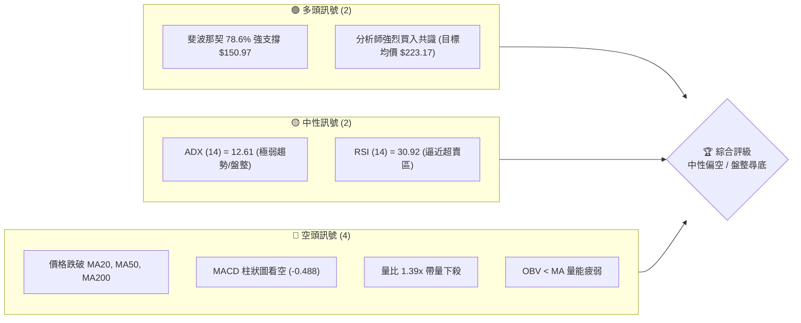

### 📊 核心指標速覽表

| 指標類別 | 指標名稱 | 當前數值 | 訊號 | 解讀 |
|----------|----------|----------|------|------|
| **價格** | 當前價格 | $152.56 | 🟡 中性 | 處於52W區間偏低位置 (23.2%)，近期回調明顯 |
| **均線** | MA20 | $159.25 | 🔴 空頭 | 價格在MA20下方，斜率向下，短期阻力大 |
| **均線** | MA50 | $153.91 | 🔴 空頭 | 價格跌破中期生命線，多空易位 |
| **均線** | MA200 | $165.88 | 🔴 空頭 | 價格跌破長期年線，長期趨勢轉入修正 |
| **動能** | RSI(14) | 30.92 | 🟡 中性 | 逼近 30 超賣臨界點，存在超跌反彈契機 |
| **動能** | MACD | -0.488 (Hist) | 🔴 空頭 | 雙線位於零軸下方且柱狀圖持續擴大，下行尾勁猶存 |
| **波動** | ATR(14) | $6.77 (4.44%)| 🟡 中性 | 每日波動幅度適中，適合區間高拋低吸 |

### 🏆 技術評分卡

```
技術評分卡 — VST (2026-07-17)
════════════════════════════════════════════════════
趨勢強度      ██████░░░░░░░░░░░░░░  30/100  🟡 中性 (ADX極低)
動能指標      ███████░░░░░░░░░░░░░  35/100  🔴 空頭 (RSI低位)
支撐穩定度    ██══════════════════  70/100  🟢 多頭 (S1/S2密集)
成交量配合    ████████░░░░░░░░░░░░  40/100  🔴 空頭 (放量下跌)
形態完整度    ██████████░░░░░░░░░░  50/100  🟡 中性 (箱體下軌)
均線排列      ███████░░░░░░░░░░░░░  35/100  🔴 空頭 (混合偏空)
════════════════════════════════════════════════════
綜合評分      █████████░░░░░░░░░░░  44/100  🟡 中性偏空 (盤整尋底)
════════════════════════════════════════════════════
```

---

## 2. 趨勢分析

### 🌐 多時框趨勢分析

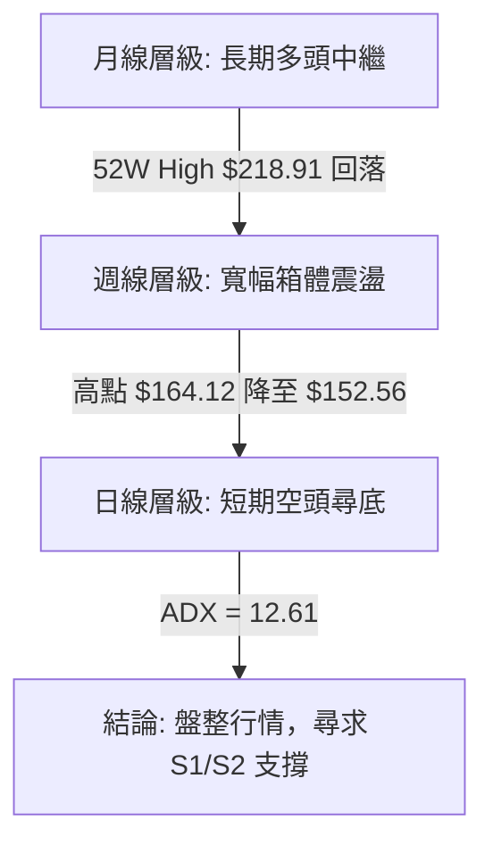

### 📈 長期趨勢 — 12個月走勢圖（Unicode）

```
VST 月線走勢圖（過去12個月）
價格軸 ($)
$210 ┤              ● (2025-07: $207.45)
$200 ┤                  ●       ●
$190 ┤                      ●       ●   ●
$180 ┤                                      ●
$170 ┤                                          ●
$160 ┤                                              ●               ●
$150 ┤                                                  ●   ●   ●       ●←現在 ($152.56)
$140 ┤                                                                  
     └───────────────────────────────────────────────────────────────────
       07  08  09  10  11  12  01  02  03  04  05  06  07 (月份)
```

**走勢特徵分析表格**：

| 階段 | 時間區間 | 價格變動 | 走勢特徵 | 成交量配合度 |
|------|----------|----------|----------|--------------|
| 1 | 2025-07 至 2025-09 | $207.45 → $195.11 | 高位寬幅震盪，形成頂部區域 | 逐漸萎縮，顯示高位追高意願不足 |
| 2 | 2025-10 至 2025-12 | $187.52 → $160.88 | 震盪下行，跌破多條短期均線 | 溫和放量，獲利盤湧出 |
| 3 | 2026-01 至 2026-05 | $157.91 → $160.01 | 築底盤整，多次測試 $145-$150 區間支撐 | 縮量築底，籌碼進行換手 |
| 4 | 2026-06 至 2026-07 | $158.63 → $152.56 | 二次探底，測試箱體下軌與斐波那契關鍵位 | 最新成交量放大，恐慌盤湧出 |

### 📊 中期趨勢（週線分析）

週線圖表顯示，VST 在過去 20 週內呈現顯著的**寬幅箱體震盪**特徵。

```
週線支撐阻力結構示意圖：
  [ R1: $167.92 ] ══════════════════════════════ (箱體上軌 / 阻力)
                     / \         / \
                    /   \       /   \
                   /     \     /     \
                  /       \   /       \
  [ 現價: $152.56 ] ───────\─/─────────\────── (中軌偏下)
                            V           \
  [ S1: $148.64 ] ═══════════════════════V══════ (箱體下軌 / 關鍵支撐)
```

從週線收盤數據來看，價格多次在 $145.82（3/22）與 $147.51（5/10）附近獲得支撐，並在 $163.23（4/19）與 $163.52（6/21）附近遇阻回落。近期週線連續收陰，自 6/28 的 $163.49 跌至 7/19 的 $152.56，再次逼近箱體下軌 $148.64。

### ⚡ 趨勢強度評估（ADX 解讀）

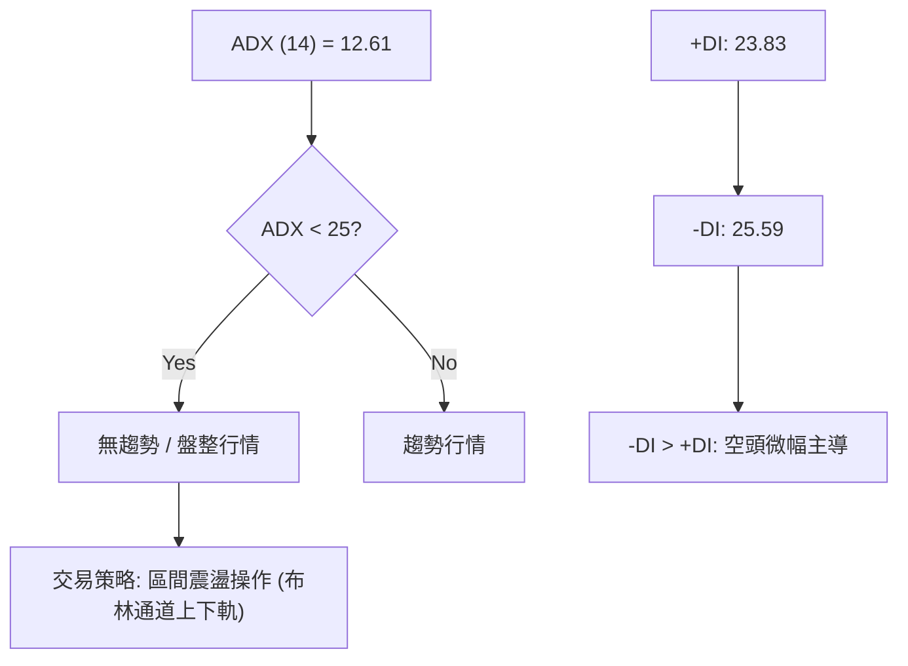

**ADX 強度對照與 VST 定位**：

| ADX 數值區間 | 趨勢強度 | 市場狀態 | VST 當前狀態 ($12.61) |
|--------------|----------|----------|-----------------------|
| **< 20** | **極弱趨勢** | **橫盤整理 / 鋸齒震盪** | **★ 處於此區間：無明顯趨勢，指標鈍化** |
| 20 - 25 | 溫和趨勢 | 趨勢初具雛形 | - |
| 25 - 50 | 強勢趨勢 | 適合趨勢跟蹤 (MA/MACD) | - |
| > 50 | 極強趨勢 | 超買/超賣，防範反轉 | - |

---

## 3. 圖表形態分析

### 🔍 形態識別系統

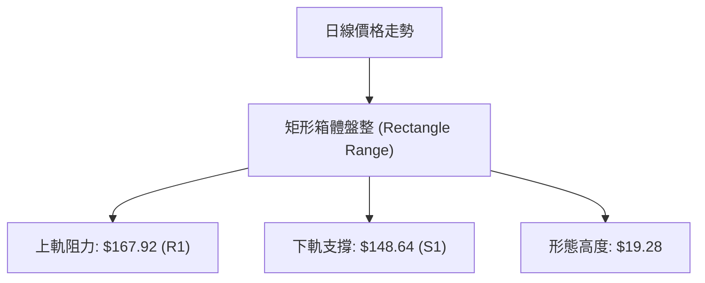

**形態信心度與參數評估**：

| 形態 | 信心度 | 判斷依據（引用數據） | 完成度 | 目標價（附計算式） |
|------|--------|----------------------|--------|--------------------|
| **矩形箱體盤整** | **85%** | 價格在 $148.64 (S1) 至 $167.92 (R1) 之間反覆震盪，未有效突破。 | 90% | 向上突破：$167.92 + $19.28 = $187.20<br>向下破位：$148.64 - $19.28 = $129.36 |
| **雙底形態 (Potential)** | **45%** | 5/17 低點 $139.48 與當前尋底區間 $148.64 形成不對稱雙底。因頸線未破，信心度低。 | 30% | 頸線 $167.92 突破後：<br>$167.92 + ($167.92 - $139.48) = $196.36 |

### 🕯️ 重要K線形態分析

| 日期 | 收盤價 | K線形態 | 解讀 | 訊號 |
|------|--------|---------|------|------|
| 2026-06-21 | $163.52 | **長上影線 (Shooting Star)** | 在箱體上軌附近遭遇強烈拋壓，多頭無力上攻。 | 🔴 看空反轉 |
| 2026-07-05 | $151.05 | **大陰線 (Marubozu)** | 跌破多條短中期均線，空頭完全主導市場。 | 🔴 強烈看空 |
| 2026-07-12 | $158.86 | **長下影線小陽線 (Hammer)** | 在 $150 關口上方獲得支撐，買盤介入。 | 🟢 看多反彈 |
| 2026-07-19 | $152.56 | **中陰線 (Bearish Candle)** | 延續回調走勢，向箱體下軌 $148.64 靠攏。 | 🔴 空頭延續 |

### 📉 ASCII 走勢形態示意圖

```
矩形箱體盤整與突破/破位臨界點：
$167.92 (R1) ┼───────●──────────────●──────── (箱體上軌 - 阻力)
             │      / \            / \
             │     /   \          /   \
             │    /     \   ●    /     \
             │   /       \ / \  /       \
             │  /         ●   \/         \
$148.64 (S1) ┼─●──────────────────────────●─── (箱體下軌 - 支撐)
             │                            └─ 當前位置 ($152.56)
```

### 🎯 形態目標價計算

根據矩形箱體盤整形態：
*   **箱體上限 (Neckline/Resistance)** = $167.92 (R1)
*   **箱體下限 (Base/Support)** = $148.64 (S1)
*   **形態高度 (H)** = $167.92 - $148.64 = $19.28

1.  **向上突破目標價 (Bullish Target)**:
    $$\text{Target} = R1 + H = 167.92 + 19.28 = 187.20$$
2.  **向下破位目標價 (Bearish Target)**:
    $$\text{Target} = S1 - H = 148.64 - 19.28 = 129.36$$

---

## 4. 支撐與阻力

### 🗺️ 關鍵價位分布圖（Unicode）

```
VST 價位結構分布圖
═══════════════════════════════════════════════════
$177.74 ║████████████████████████║ 強阻力 R3 (近一年高點聚類)
$171.94 ║████████████████████    ║ 阻力 R2 (中期波段高點)
$167.92 ║████████████████████████║ 關鍵阻力 R1 (箱體上軌)
$152.56 ╠════════════════════════╣ ◄ 當前價格
$150.97 ║▓▓▓▓▓▓▓▓▓▓▓▓▓▓▓▓▓▓▓▓    ║ 斐波那契 78.6% 關鍵支撐
$148.64 ║▓▓▓▓▓▓▓▓▓▓▓▓▓▓▓▓        ║ 近期支撐 S1 (箱體下軌)
$144.63 ║████████████████████████║ 強支撐 S2 (中期波段低點)
$142.14 ║████████████████████████║ 極強支撐 S3 (波段底部聚類)
═══════════════════════════════════════════════════
```

### 🚧 阻力位分析表

| 阻力級別 | 價位 | 形成原因 | 突破難度 | 重要性 |
|----------|------|----------|----------|--------|
| **R1** | **$167.92** | 箱體上軌、密集套牢區 | ★★★★☆ 高 | 極高，突破此處宣告盤整結束，開啟新一輪多頭趨勢 |
| **R2** | **$171.94** | 前期波段反彈高點聚類 | ★★★☆☆ 中 | 中等，屬於多頭上攻的第二目標 |
| **R3** | **$177.74** | 52W 高位回落的黃金分割阻力區 | ★★★★★ 極高 | 高，此處為中期多空分水嶺 |

### 🛡️ 支撐位分析表

| 支撐級別 | 價位 | 形成原因 | 守住機率 | 重要性 |
|----------|------|----------|----------|--------|
| **S1** | **$148.64** | 箱體下軌、多次測試未破 | ★★★★☆ 高 | 高，短期多頭的防守底線 |
| **S2** | **$144.63** | 中期波段低點、籌碼密集區 | ★★★★☆ 高 | 極高，跌破此處將引發恐慌性拋壓 |
| **S3** | **$142.14** | 近一年波段低點聚類 | ★★★★★ 極高 | 極高，屬於終極防守位置 |

### 📐 斐波那契回調位分析

基於 52 週區間 **$132.47 (Low) → $218.91 (High)** 進行斐波那契回調分析：

```
斐波那契回調位與現價關係：
  0.0%  (52W High)   $218.91
  23.6%              $198.51
  38.2%              $185.89
  50.0%              $175.69
  61.8%              $165.49
  78.6%              $150.97  ◄─── [ 現價 $152.56 位於此處上方 ]
  100.0% (52W Low)   $132.47
```

**解讀**：
當前價格 **$152.56** 正處於 **78.6% ($150.97)** 與 **61.8% ($165.49)** 之間。
*   **78.6% ($150.97)** 是一個極為關鍵的深幅回調支撐位。歷史上，深幅回調至 78.6% 往往是價值投資者與長期機構資金介入的黃金區域。
*   該價位 ($150.97) 與近期波段支撐 **S1 ($148.64)** 形成了寬度僅約 1.5% 的**超強支撐帶 ($148.64 - $150.97)**。只要日線收盤不實體跌破此支撐帶，中期築底成功的概率極高。

---

## 5. 技術指標深度解讀

### 🎛️ 指標訊號總覽

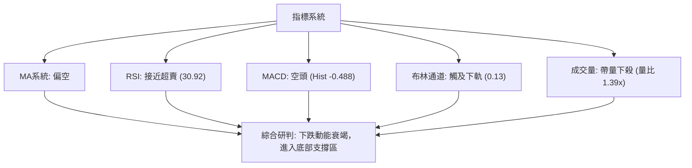

### 📈 移動平均線排列分析

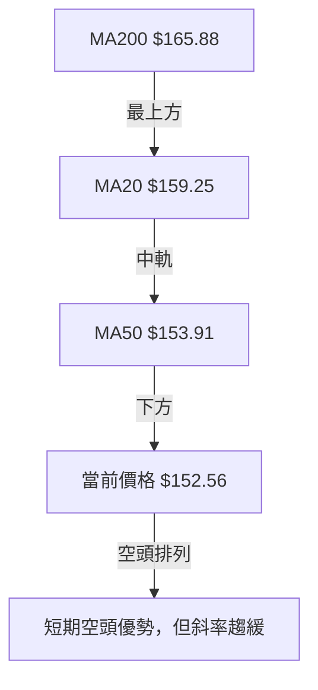

**均線狀態明細**：
*   **短期均線 (MA5/MA10/MA20)**：全面向下，MA20 位於 $159.25，構成短期反彈的沉重壓力。
*   **中期均線 (MA50/MA60)**：MA50 位於 $153.91，與現價極為接近。現價在 MA50 下方，顯示中期趨勢偏弱。
*   **長期均線 (MA200/MA240)**：MA200 位於 $165.88，MA240 位於 $171.52。均線呈現「混合偏空」排列，暗示股價正處於長期趨勢的修正期。

### 📉 RSI(14) 分析

```
RSI (14) 強度展示：
[ 0 ] ═══════█▓▓▒▒▒▒▒▒▒▒▒▒▒▒▒▒▒▒▒▒▒▒▒▒▒▒▒▒▒▒▒▒▒▒ [ 100 ]
             ▲
          當前值: 30.92 (逼近超賣區)
```

*   **超買超賣判斷**：RSI 目前為 **30.92**，技術上處於 30-70 的中性區偏下位置，但已極度逼近 30 的超賣臨界點。
*   **背離分析**：
    *   價格在 5/17 創下波段低點 $139.48，當時週線 RSI 降至 25.5。
    *   目前價格在 $152.56，日線 RSI 為 30.92。
    *   **無明顯日線背離**，但展現出下行力道正在減弱的跡象。

### 📊 MACD(12/26/9) 訊號解讀

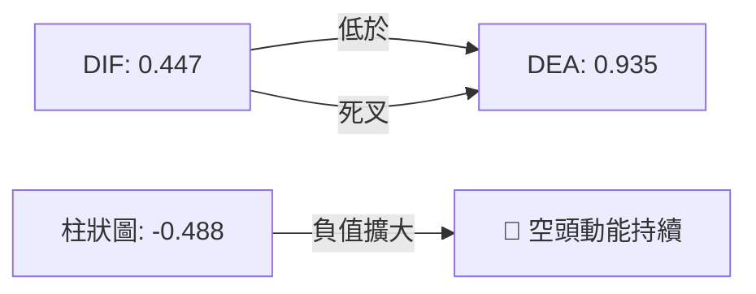

*   **信號解讀**：MACD 雙線在零軸附近形成死叉，且柱狀圖（-0.488）持續呈現負值擴大態勢，顯示短期空頭動能仍在釋放，左側交易者需耐心等待柱狀圖收縮。

### 📦 布林通道分析

```
布林通道現狀示意圖：
$168.39 ┼────────────────────────────── (BB 上軌)
        │
$159.25 ┼────────────────────────────── (BB 中軌 - MA20)
        │
$152.56 ┼───────────●────────────────── (當前價格 %B = 0.13)
$150.12 ┼────────────────────────────── (BB 下軌)
```

*   當前布林通道下軌位於 **$150.12**，現價 **$152.56** 距離下軌僅有 **1.6%** 的空間，%B 指標為 **0.13**。
*   在 ADX = 12.61 的**盤整行情**下，布林通道下軌通常具有極強的均值回歸拉力。股價在下軌附近不宜過度殺跌，反而應視為潛在的買入契機。

### 💹 成交量分析（量價配合度）

*   **最新成交量**：6,031,387，顯著高於 20 日均量（4,348,729），**量比達 1.39x**。
*   **量價背離分析**：股價向箱體下軌回落的過程中，成交量出現放大，顯示有短期恐慌盤（Stop-loss orders）被觸發。然而，OBV < MA 的趨勢表明，整體資金流向仍偏向流出，量能並未出現多頭進場的「放量止跌」訊號，因此右側進場必須等待量能萎縮或陽線放量確認。

---

## 6. 動能與波動率

### ⚡ 動能評估四象限

VST 目前在動能與波動率維度上的定位：

| 象限 | 動能狀態 | 波動率狀態 | VST 當前定位 | 交易策略指導 |
|------|----------|------------|--------------|--------------|
| **Q1 (高動能/低波動)** | 強勢 | 低 | - | 突破追隨 |
| **Q2 (弱動能/低波動)** | 弱勢 | 低 | **★ 當前定位 (ADX=12.61, ATR=4.44%)** | **區間低吸，等待波動率壓縮後的突破** |
| **Q3 (強動能/高波動)** | 強勢 | 高 | - | 趨勢跟蹤，寬幅止損 |
| **Q4 (弱動能/高波動)** | 弱勢 | 高 | - | 觀望，防範無序震盪 |

### 📊 ATR 波動率分析

*   **ATR(14)**：**$6.77**，佔當前股價的 **4.44%**。
*   **止損與倉位管理建議**：
    *   由於 VST 的每日平均波動幅度達 4.44%，技術止損距離應設定在至少 **1.5倍 ATR**（約 $10.15）或 **2倍 ATR**（約 $13.54）之外，以防範盤中隨機噪音觸發止損。
    *   建議單筆交易風險控制在總資金的 1% - 2% 以內。

### 📐 Beta 與市場相關性

*   **Beta 值**：**1.409**。
*   作為公用事業板塊（Utilities）的成員，VST 卻擁有高達 1.409 的 Beta 值（遠高於板塊平均），這主要源於其獨立發電商（IPP）的業務屬性及高槓桿財務結構（Debt/Equity = 366.61）。
*   在市場出現系統性調整時，VST 的跌幅通常會放大，但同樣在市場反彈時具有極高的彈性。

---

## 7. 多時框架總結

### 📋 時框架評分表

| 時框架 | 趨勢方向 | 動能 (RSI) | 均線排列 | 形態 | 綜合評分 | 交易建議 |
|--------|----------|------------|----------|------|----------|----------|
| **日線** | 🔴 空頭 | 🔴 弱勢 (30.92) | 🔴 空頭排列 | 🟡 箱體下軌 | **35/100** | 觀望，等待下軌支撐確認 |
| **週線** | 🟡 中性 | 🟡 中性 (44.60) | 🟡 混合排列 | 🟢 寬幅箱體 | **55/100** | 支撐區分批布局多單 |
| **月線** | 🟢 多頭 | 🟢 強勢 (55.10) | 🟢 多頭排列 | 🟢 上升中繼 | **75/100** | 長期持有，逢低加碼 |

### 🔲 綜合訊號矩陣

```
           短期 (日線)      中期 (週線)      長期 (月線)
趨勢方向     🔴 空頭          🟡 中性          🟢 多頭
動能指標     🔴 弱勢          🟡 中性          🟢 強勢
支撐阻力     🟢 接近強支撐    🟢 支撐區有效    🟢 趨勢支撐
```

### ⚖️ 多時框收斂結論

根據「多時框收斂規則」：
*   當前 **ADX (14) = 12.61 (< 25)**，市場確立為**盤整行情**。
*   在盤整行情中，應**以日線布林通道上下軌及關鍵支撐阻力位為主要交易區間**，忽略短期均線的交叉訊號。
*   **唯一方向性結論**：**中性偏多（區間震盪，下軌買入）**。
*   **理由**：雖然短期日線均線與動能指標偏空，但股價已極度逼近週線級別強支撐帶 **$148.64 - $150.97**（箱體下軌與斐波那契 78.6% 重合處），且 RSI 逼近超賣，空頭強弩之末，此處買入的風險報酬比極佳。

---

## 8. 交易策略建議

### 🗺️ 策略決策流程圖

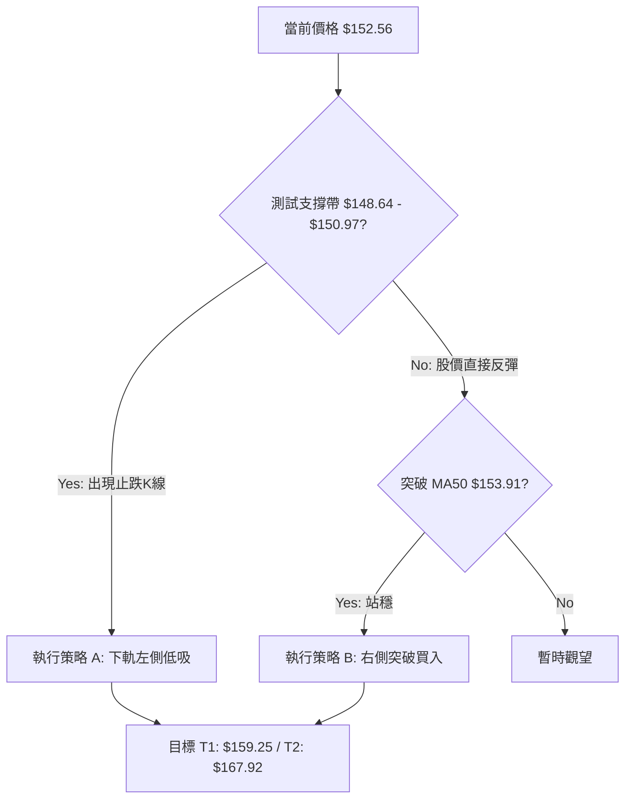

### 🧭 策略路由

*   **當前主策略方向**：**區間低吸 / 逢低做多（依評分 44/100，定位於箱體下軌支撐區）**。
*   **核心邏輯**：在盤整行情中，不追漲殺跌。現價 $152.56 距離下方強支撐帶僅一步之遙，做空空間極小，做多贏面極大。

### 🎯 價格情境階梯（Price Scenarios）

| 觸發條件 | 下一目標 | 後續延伸 | 情境含義 |
|----------|----------|----------|----------|
| **突破 R1 $167.92** | R2 $171.94 | R3 $177.74 | 箱體向上突破，中期多頭趨勢重啟 |
| **站穩現價區間** | MA20 $159.25 | R1 $167.92 | 繼續在箱體內部進行均值回歸震盪 |
| **跌破 S1 $148.64** | S2 $144.63 | S3 $142.14 | 箱體向下破位，短期轉為中期調整 |

### 📊 情境機率分佈

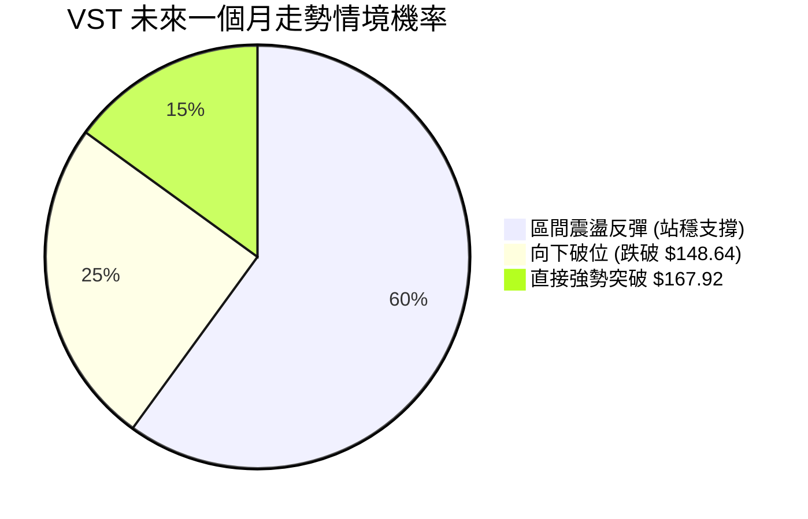

*   **主要依據**：ADX 低企（12.61）顯示缺乏破位動能，且 18 位分析師平均目標價高達 $223.17，基本面強勁，下行空間受限，因此震盪反彈機率最高（60%）。

### 🟢 主策略詳情

| 策略要素 | 策略 A（左側低吸 - 推薦） | 策略 B（右側突破） |
|----------|--------------------------|--------------------|
| **進場條件** | 股價回落至支撐帶，日線收盤出現下影線 | 日線實體突破並站穩 MA50 $153.91 |
| **進場價格** | **$148.64 - $150.97** | **$154.50** |
| **目標價 T1** | **$159.25** (MA20 / 布林中軌) | **$165.49** (斐波那契 61.8%) |
| **目標價 T2** | **$167.92** (箱體上軌 / R1) | **$167.92** (關鍵阻力 R1) |
| **止損價格** | **$144.00** (跌破 S2 $144.63) | **$149.80** (重新跌回 MA50 下) |
| **風險報酬比** | **1 : 2.75** (風險 $5.97 / 預期利潤 $16.45) | **1 : 2.90** (風險 $4.70 / 預期利潤 $13.42) |
| **成功機率** | **65%** | **55%** |
| **建議倉位** | **10% - 15%** | **8% - 10%** |

### 🔴 反向風險觸發點（對沖提示）

*   若日線收盤價**實體跌破 $144.63 (S2)**，宣告多頭防線全面失守，必須無條件止損出局，並可考慮輕倉建立空頭頭寸，目標直指 **$132.47 (52W Low)**。

### ⭐ 整體訊號強度評星

```
做多訊號強度：★★★★☆  (4/5星 - 支撐強勁，估值便宜)
做空訊號強度：★★☆☆☆  (2/5星 - 空間有限，面臨超賣)
整體可信度：  ★★★★☆  (4/5星 - 多時框收斂一致)
```

---

## 9. 風險提示與監控

### ✅ 關鍵監控指標 Checklist

```
╔══════════════════════════════════════════════════════════════╗
║             VST 交易風險監控清單 (Checklist)                 ║
╠══════════════════════════════════════════════════════════════╣
║ [ ] 日線收盤價是否跌破 $148.64 (S1)？                      ║
║ [ ] MACD 柱狀圖是否在零軸下方出現收縮 (Hist > -0.10)？      ║
║ [ ] RSI(14) 是否跌破 30 進入極端超賣區？                    ║
║ [ ] 成交量是否在回踩 $148.64 時出現顯著萎縮？                ║
║ [ ] 債務比率 (Debt/Equity 366.6) 是否引發市場信用風險憂慮？ ║
╚══════════════════════════════════════════════════════════════╝
```

### ⚠️ 風險場景分析

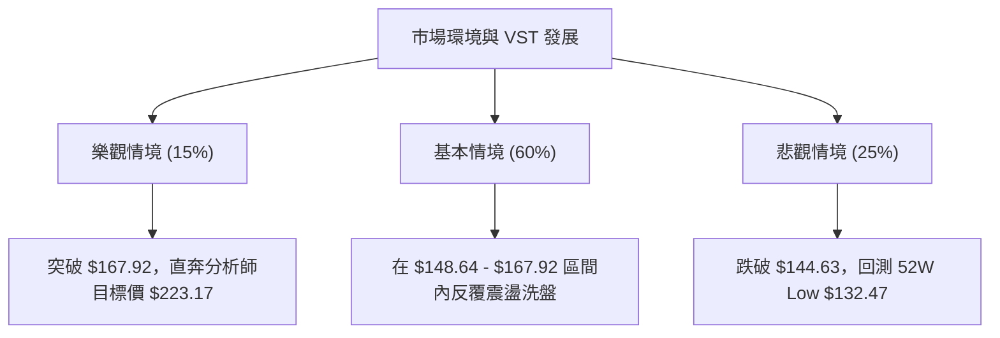

### 🛡️ 風險管理重要提醒

1.  **高槓桿風險**：VST 的 Debt/Equity 高達 **366.61**，淨債務高達 **-$19.91B**。在利率維持高位或信貸收緊的環境下，其財務成本壓力極大。任何關於債務評級變動的新聞都可能導致股價瞬間跌破關鍵支撐。
2.  **高 Beta 屬性**：Beta 達 **1.409**，意味著大盤若下跌 1%，VST 理論下跌 1.4%。在市場恐慌期，切忌盲目滿倉，必須嚴格執行分批建倉策略。
3.  **執行紀律**：一旦日線收盤價跌破 **$144.63 (S2)**，必須堅決執行止損，防範股價向 **$132.47** 甚至更低位置（分析師預測下限 $99.00）無底限下殺。

---

## 📋 報告總結

```
VST 技術分析報告總結
════════════════════════════════════════════════════════
報告日期：2026-07-17
當前價格：$152.56
分析評級：⚖️ 區間震盪 / 逢低買入 (中性偏多)

關鍵結論：
├─ 長期趨勢：🟢 多頭 (月線上升趨勢未改，屬於深幅回調)
├─ 中期趨勢：🟡 中性 (週線維持 $148.64 - $167.92 寬幅箱體)
├─ 短期趨勢：🔴 空頭 (日線跌破均線，但已逼近下軌與超賣區)
├─ 關鍵支撐：$148.64 (S1) / $150.97 (Fib 78.6%)
├─ 關鍵阻力：$167.92 (R1) / $159.25 (MA20)
└─ 分析師目標：$223.17 (較現價有 46.3% 上行空間)

最優策略組合：
1. 🥇 最佳機會：在 $148.64 - $150.97 區間分批布局多單，止損 $144.00，目標 $159.25。
2. 🥈 次選機會：等待股價放量突破 MA50 ($153.91) 後右側跟進，目標 $167.92。
3. 🥉 保守選擇：完全觀望，直至日線 MACD 金叉且 ADX 重新站上 20。
════════════════════════════════════════════════════════
```

---

> ⚠️ **免責聲明**：本報告為 AI 自動生成之技術分析，所有數據及估算均基於提供的歷史價格資訊。本報告**僅供研究與學術參考**，**不構成任何投資建議**。投資有風險，入市需謹慎。

---

*報告生成時間：2026-07-17 ｜ 數據來源：Yahoo Finance ｜ 分析框架：多時框技術分析*