<details>
<summary>📊 靜態圖表 (點擊展開)</summary>
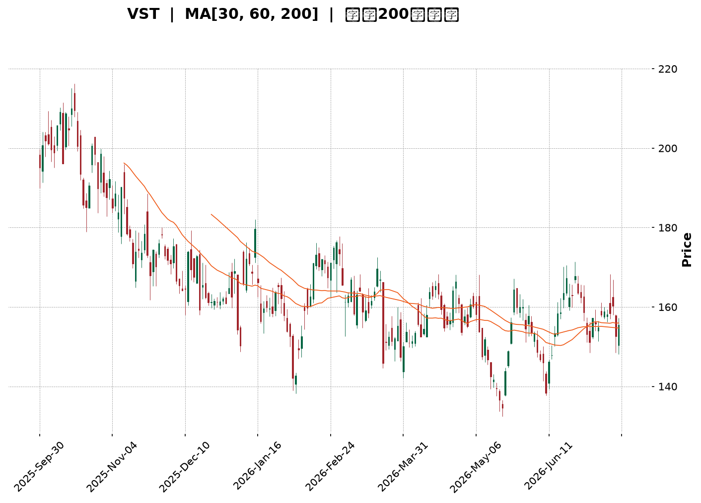
</details>

<html>
<head><meta charset="utf-8" /></head>
<body>
    <div style="height:500px; width:100%;">                        <script>window.PlotlyConfig = {MathJaxConfig: 'local'};</script>
        <script charset="utf-8" src="https://cdn.plot.ly/plotly-3.7.0.min.js" integrity="sha256-jvTGqxNp8AGWEcvNLVuKr+8j5dGe9Yw51LQkmDH+IYA=" crossorigin="anonymous"></script>                <div id="candlestick-chart" class="plotly-graph-div" style="height:100%; width:100%;"></div>            <script>                window.PLOTLYENV=window.PLOTLYENV || {};                                if (document.getElementById("candlestick-chart")) {                    Plotly.newPlot(                        "candlestick-chart",                        [{"close":{"dtype":"f8","bdata":"AAAAYHBjaEAAAACgkxVpQAAAAMDnOWlAAAAAgN8kaUAAAADghfJoQAAAAOBY2WhAAAAAIDC2aUAAAABAISRqQAAAAOBkgWhAAAAAIMoVakAAAADAC5VpQAAAAKA3P2pAAAAAYOAwakAAAABgehBpQAAAAMDmLWhAAAAA4OI3Z0AAAADg5SFnQAAAAEBx0mdAAAAAYE0UaUAAAABgJs9oQAAAACCWuWdAAAAAgGHRaEAAAAAAi51nQAAAACCccGdAAAAAIKkHaEAAAACgBx9nQAAAAGBYk2dAAAAAoFb7ZkAAAADApsZnQAAAAAD5b2dAAAAA4FdNZkAAAABA+zBmQAAAAMAmW2VAAAAAgOW+ZUAAAABAxshlQAAAAKBKtmVAAAAAoLRMZkAAAAAAN6JlQAAAAICB\u002fGRAAAAAoDzNZUAAAAAANURlQAAAAAAjAmZAAAAAYMhDZkAAAACAb51lQAAAAECzemVAAAAAAAVeZUAAAACA3+plQAAAACBBz2RAAAAAAMutZEAAAAAgDIRkQAAAAACFj2RAAAAAQAe8ZUAAAAAgoCxlQAAAAMCr8WRAAAAAYGGXZUAAAABAz+ljQAAAACBjr2RAAAAA4FJLZEAAAAAA+iNkQAAAAOAqJ2RAAAAAIGwwZEAAAADgKidkQAAAAKCXLGRAAAAAwHtFZEAAAABAURxkQAAAAADGmGRAAAAAQGBPZEAAAABg\u002fiFlQAAAAECNRWNAAAAAwOfFYkAAAAAAJ71kQAAAACBTg2VAAAAAgE5eZUAAAACAHxBlQAAAAGDadWZAAAAAAH7EZEAAAACAE4xjQAAAAGCD8mNAAAAA4Fz9Y0AAAABAtPVjQAAAAGDmy2NAAAAAgNF5ZEAAAABg26VkQAAAAAA1RGRAAAAAgDi9Y0AAAACgszpjQAAAAEB+EmNAAAAA4A7EYUAAAAAgnNVhQAAAAKCWp2JAAAAAIIkRY0AAAABAHOVjQAAAAECp9mNAAAAAQM1UZEAAAACAimBlQAAAAEBtpmVAAAAAoC5DZUAAAACAxYBlQAAAACCrXWVAAAAAQMnqZEAAAABgsGRlQAAAAOAJ3GVAAAAAYKEKZkAAAAAAIa1lQAAAAMAGsWRAAAAAACAoZEAAAABAGV1kQAAAAIAF3mRAAAAAQMvGY0AAAAAgZWVkQAAAAGBJfmRAAAAAwBHXY0AAAADgeORjQAAAAABe0GNAAAAAIGExZEAAAACADXxkQAAAAEDSNGVAAAAAgBDdZEAAAAAAGzpiQAAAAICC4mJAAAAAoDQQY0AAAAAgiuliQAAAAODIAmNAAAAAAGdoY0AAAABgrWpiQAAAACDVw2JAAAAAoNQ3Y0AAAACg\u002ft5iQAAAAKAY7GJAAAAA4OEuY0AAAAAAgXVjQAAAACAqEWNAAAAAgG9QY0AAAAAAUr9jQAAAAMCzd2RAAAAA4MlWZEAAAABgjalkQAAAAMBnZ2RAAAAA4A7sY0AAAAAgMFZjQAAAAOBOcmNAAAAAYC6UY0AAAACA2INkQAAAAAAby2RAAAAAQKEcZEAAAADAZTJjQAAAAADRs2NAAAAA4AJiY0AAAACAABRkQAAAAKD7BGRAAAAAQDLCY0AAAADAgjdjQAAAAABucGJAAAAAwMv6YkAAAACARFViQAAAAGAjzWFAAAAAIHO2YUAAAABggm9hQAAAAGDhEWFAAAAAILHQYEAAAABgjvlhQAAAAIDjm2JAAAAAoKWBY0AAAABAjopkQAAAACCi\u002fWNAAAAAoMkBZEAAAACAMABkQAAAAOBkUWNAAAAAgPi3Y0AAAACgtzJjQAAAAKCFL2NAAAAAoKmRYkAAAADgOVZiQAAAACB\u002fQGJAAAAAgBRLYUAAAAAgnEViQAAAACAEemJAAAAAIMUpY0AAAAAgbMxjQAAAAMBz02NAAAAAIKxwZEAAAADgUehkQAAAAOB6TGRAAAAAANdbZEAAAADgo\u002fhkQAAAACCub2RAAAAAAClMZEAAAAAAKdRjQAAAAMAeJWNAAAAAoJnhYkAAAABACqdjQAAAACBcd2NAAAAAgD1aY0AAAAAgXL9jQAAAACCF22NAAAAAANfDY0AAAACAws1jQAAAACBcB2RAAAAAgOsRY0AAAACAFG5jQA=="},"high":{"dtype":"f8","bdata":"6AHEJWT1aEDAO3MOkIJpQOO9ryjLhGlA93Sg0IAqakAysasiKuJpQDiFUgurX2lA9\u002f0qlhm4aUCZGYFlOkZqQKVfp82nb2pA9oP+SIkiakAnWzyme\u002f9pQEh6\u002ffZy5GpACdOvPWMGa0CD4s8quSVqQEZZBRC6lGlAQYTGMsUTaEAvGzPQ2ZZnQPLUBm3k7GdApx9UHjElaUBy+kZeF1ppQDSoH+bkj2hAyfRsa7j8aEDBkCKd2r9oQDJvAG7hAmhAxDkt9CxMaEBxp+5ERNZnQG5o8++n9WdAmIBbvb2KZ0BPO7STCslnQNfiI2l7f2hAOMEpVCNlZ0Cr87UOipFmQFsESi8aJ2ZAltR8mBxoZkC1\u002fPuN0FhmQLNj2LLkFWZArM3DkemXZkDgX7BgKJBnQDSr+9G1nmVAdUAtFibPZUAJY5G2K8BlQAIYhRlpIGZAxk+aO6aAZkDQMAhD8PdlQCg2RXwM52VAfKxdwSCkZUDRLbpa+ClmQDiwGhq4\u002fGVAzjrIvffjZEBCb4oakiZlQEdQBV+bqmRAEPXEBUXFZUAIwyaGHGhmQKJYt14KiWVA9dQpMa2mZUDeJfV4PM1lQBfU6cWfZmVAkvD6Kl9WZUD9YG8TantkQC+VNr\u002fyZ2RA\u002f6sLAF5EZEBT3R8xnFFkQBW902nnd2RAaKRLToZTZEAmYFI7eoFkQJeCwhgEGmVATeopUM5lZUBp8FokSIRlQAyWdjfpBWVAROJtm9hrY0COJfr1QMhlQJWwPdwTCGZAsBfXK+neZUCMn8fNpVZlQOXpDJbNwWZAeQWHmLtUZUAdJ+lMWLFkQB2MH1QPMWRALe2lyJBhZEBltG4Zdk1kQMN8ZnlTm2RAbfYffU6FZEBKFzU1N8NkQPdYvtdW7WRAjvAyQnqBZEDdR5uaPPFjQAdcsSYvgmNArwJ2+40nY0DTwSBkavBhQARwbMPg+mJAVNJ2HjVrY0CoNSN+MB9kQFzWX2FTm2RAd\u002fMSFwy4ZEBml3hI92VlQLi3ZmA0BWZAdF8WtYHgZUAzM\u002fdqAYNlQGJVQOquoGVASzahkbVrZUDnf+CEmmZlQD+xPiSM7mVAWbD5u7YXZkA+i+m7LTpmQG31n4UOAWZAjrl4BIZiZECvNElKOXhkQD8jKB428GRA\u002f6bjmUv9ZEDWRGNMoIVkQLW1qQlhCmVA55Wq9zNxZEBq9DMQ\u002fldkQDxQdpcXmWRA5cq235BhZEDtwTb2HKBkQEdRRym6kGVABnFCWjokZUAS2w0Xl8dkQCj9f9DSdWNArBCp0E08Y0DJ0ZzYVLdjQP255qKbDmNAJp7mLTv\u002fY0A8coLDpdZjQJA+jPBC6GJAtnEuPOKDY0DZhpXnAEtjQLeT4SSCHGNAum8zoDg+Y0AGa5WIsyJkQPAhUtavSWRAXnQOsg\u002fNY0AKvFgB2Q9kQHM\u002fAD6QoWRA5UvjPDDJZEBq01xT+NVkQBSlIOAjCGVAl1FaRUJ6ZEApP5q2\u002fRtkQMePKu9w22NAd6\u002fm+7rUY0DtmB1u9KdkQHfPrSvnBWVAe0d0XRdjZEDmAJauPB1kQDWgRj4E7WNAObMAU1D9Y0A6Qsq45ERkQPwsthFFcmRAvncR6GJYZEBQzOnT8QRlQLp1EVoQWWNAofcaGyoRY0CrwoLxm8NiQA6qzPRpQmJAWRXGBAfjYUASR\u002fX4kJxhQCHzmAkJa2FAVIfWU0gQYUCqLp7QUBZiQOrudJVHomJApM9jWzCrY0CkD9H2TuVkQCksGdBRmWRAhVjUZKRpZEC6wXhmBEJkQGFCeDSBymNAzaDPzsMRZECPZ\u002f6pDbZjQL3L5vpiOmNAeP9xBWBCY0BbQnRB66JiQIgbOsLfwmJA4OUhU475YUDpFA\u002frOVZiQBK6r9ZDyWJAf9bCg3FnY0C9wjo\u002fIihkQBc1bITPRmRAPn6+4UFDZUAAAAAAAFBlQAAAAGBmumRAAAAA4Hq0ZEAAAABAM2tlQAAAAIDC\u002fWRAAAAAQDOzZEAAAABgZq5kQAAAAIA9qmNAAAAAIK6HY0AAAAAgrqdjQAAAAMAe7WNAAAAA4KWPY0AAAACAwiVkQAAAAOCjAGRAAAAAgMLtY0AAAABguAZlQAAAAIAU3mRAAAAAQDPDY0AAAAAAAKhjQA=="},"hovertemplate":"\u003cb\u003e%{x|%Y-%m-%d}\u003c\u002fb\u003e\u003cbr\u003e\u958b: $%{open:.2f}\u003cbr\u003e\u9ad8: $%{high:.2f}\u003cbr\u003e\u4f4e: $%{low:.2f}\u003cbr\u003e\u6536: $%{close:.2f}\u003cextra\u003e\u003c\u002fextra\u003e","low":{"dtype":"f8","bdata":"CiyVeBe9Z0DYM++y7+tnQGT8QzxZvGhAhn3hBUIVaUBHE7zejpNoQB5PtqVSYmhAj3ZuGIHpaEAA4D4eeI9pQMnE\u002fK3BgGhAbzeNHzTyaEDhK79CEhJpQFugZ1BosWlA51cNTTH6aUCMsOvqDOdoQJtpyE88AGhAVc2rxpwZZ0CDtpo29VxmQLdR+OsSHmdAMJbfx185aECdTWzh63VoQE\u002f83guP9mZA3sr4GOWVZ0D29kUAQnhnQDjBkMZI2GZAT5kaVyRiZ0ADEwuhg\u002fdmQLfJM4c3BWdAUCMfTiJZZkDEkt49w\u002ftlQDyDt\u002fmt7GZA\u002f4UrhDBCZkCb5ppLwBFmQO+1cXUCOmVACufm4ZWcZEBDzt8f3YxlQNNwX394PmVAO2r0J+uvZUDkC2zMLo1lQDlvTLGFOGRAo5QYbMimZEBs51gq8aZkQOjCt\u002fa\u002fi2VA65T9ALIoZkCSwaFmKX9lQNhjnQLwVGVAzflBW\u002foHZUBhYimacjhlQH9+L4jyuGRAdVxEfSVsZEAIgdF3f4FkQLArIaS+v2NAO4jIl\u002fMKZEBEZ7k1xdlkQB2V5wUzyWRAs9PBDX+7ZEASOAeGVsFjQLsa7AjaP2RA3yQwts5AZED6zqgFAA1kQBwFzg0G9mNAcoBRHonqY0C4gPZUC\u002f1jQC8TVg1z72NAKY+dgbMTZEBdZG6czhhkQHYNiAgDbmRADECgLPD3Y0DJlyxTgGpkQNhP4ZS5I2NAQrOS3eiYYkBPjuoShK1kQNZA3jgTdGRA3i1W7yhLZUAJrhDe8LJkQCxWSnqaZmVAkOfdwu1RZEBGAwKoNHpjQBOeeqAQK2NAUsTV2L\u002fWY0AXq5IpDbJjQLD08TDcrmNA2KP2dta2Y0Byb7Z\u002f5BZkQJY9ThIlymNAR\u002furDKyNY0CJRaeyXDNjQMfxonBEv2JAUcp6U1hcYUCQf536ukRhQKFQ\u002f+VsYGJAKc9N6+lrYkByNGHBQExjQN5PMEmaw2NAWY7vxKP+Y0DidHElviFkQJsLt2xlL2VAY1s08oskZUDNzMyMJflkQDb2WZ0UEWVA0tMOiSKYZEDuJ0Lmx01kQILs1nSLM2VAbwviPgh1ZEBtuKDMZE1lQMSnt53rq2RAQZvR0doRY0BLvyHFo\u002f5jQGVNuoV8J2RAbKrpCKC7Y0Cf5bHwUFJjQMMkoUVBe2RA1HE1YBpXY0CX44T2kIhjQElApVJvqWNAHnsInWL1Y0Bf8kUShzVkQJFttaljoWRAwrR7ltx4ZED80hsiFBRiQDCcSKUJpGJAyIIcUeiqYkDrQA8ybsViQPVLM+8fSWJAEhzDmjXxYkDRQsnEo0xiQIi6hYmCxGFA8DrGUwbmYkCspp1EH71iQHp9+\u002fZztWJASPupEzzCYkAzn6ifVGJjQMhBT23tDmNAMcweD6scY0Bm\u002fQP19w1jQIN0gUfdA2RALPfdLIs9ZECnqN4zPkxkQJS7Xv8OQWRA2ZzkySfDY0BB439PQz1jQFCOfteBVmNAst3zCxZJY0AByZRk211jQNzBu59q0GNANrhk\u002fu\u002fPY0BX4EiitRtjQPbMMQxkcGNAYtt3otNWY0BSrOzQCKdjQHihDOVy8mNAFapMPDGMY0Cf+NxPwjFjQFqsM1rIWGJA8Hmqn1lCYkBT2n4cmi5iQE3hjaMTamFA5lUCCT53YUBVuQjMwDNhQDF9spuHtWBARUYq\u002fC6PYEBVvTbJwDNhQNs5lj2tFWJAvFPn\u002fEDRYkALBQmi9b9jQMdPpbT3xWNAJEOH0yWsY0Bq28zAI5VjQNVHqKvJ42JAs\u002f\u002f9j1EVY0BVQ\u002fAcjhdjQJGDq\u002fVbv2JAUQJaL2ZpYkCM8PoUnEViQPVudh3yqmFAABqb1\u002fI2YUBpIkej\u002fmthQAsPdu9rWWJA4+8leT7BYkBBg9+WuBNjQDVlMk+vn2NAMhGFfcz5Y0AAAADAzFxkQAAAAOCj5GNAAAAAACn8Y0AAAADgUcBkQAAAAIAUZmRAAAAA4KMgZEAAAADgUZBjQAAAAKCZ4WJAAAAAAACQYkAAAADgUQBjQAAAAOBRQGNAAAAAgD3qYkAAAACAPa5jQAAAAKCZoWNAAAAAYGaGY0AAAAAgBqFjQAAAAIAUvmNAAAAAgJOQYkAAAADgeoRiQA=="},"name":"\u50f9\u683c","open":{"dtype":"f8","bdata":"dORfJ6XLaEDBy+XsHkZoQPtzZmYzZmlAR3mdcRRwaUAN+zOFwqlpQBsRfB99F2lArNLbus4XaUDMzMwsh8RpQKOcKVp7HGpADCo86SUJaUCJobX8951pQDpeT9t1DmpAnm5aGca8akA1GisH4dlpQCB70ZsRaWlA44lo648CaEB2IEuwtVhnQLdR+OsSHmdAzNDY1Bt5aEBy+kZeF1ppQDSoH+bkj2hA1GIYUxTwZ0DrajNF7DtoQOiM3sqE5mdAqs6Cw5jAZ0AYhbaRPGpnQGd5bLeZL2dAyraYRjXEZkCiOWtwTzhmQNlBK1y\u002fP2hAp4oaFcQkZ0BenUHDoHJmQP5SyzukBWZA1QwKppLPZEAWXwQketZlQEqz74s0fmVAHVc7uN\u002fNZUCqIZAftgFnQLMLpWUsaWVA+hZ+fLwbZUBSvuoLdatlQB5+rYDoqGVAN1NYfj5IZkDWVuL69ehlQP6294uF1WVAFWBtrzR+ZUAQOT1t\u002fGVlQA4f1LY2+WVAzjrIvffjZEBNcmeZ5JVkQPhBbtnvlGRA1jlCAhgsZEB0cX76Jc9lQMIjjxrEh2VATEcSyK6+ZEDno1LdOallQP0koZMin2RAIQc50EbAZECtOPeUhXFkQD4gggL6I2RAn+L3y3cRZEAAAADgKidkQG7571vJEWRA4rgUw7IxZEDE909+GU5kQHYNiAgDbmRAkXplNOMcZUB\u002fyluaFBFlQAyWdjfpBWVAg314aUtaY0BDTR56K7tlQEKobyPnhmRA7ZsDkaOwZUB+cQqihh1lQB4XJiW6kGVAqwSR587iZEA2FYATZxpkQOIDlzNI0mNAe0NexHYvZECQRUD23\u002fFjQF+aleWzBGRAT3RV2jziY0ADEildWLFkQPqRSZwRsGRAiTsxD74hZEATEffi4aZjQPSeN70OdmNAR5C9Wo4YY0CiNDVojZNhQGvQ+\u002fbBsmJAbvtA\u002f8GyYkD\u002fGoqro\u002f5jQLVo8+JukWRAkFS1rysJZED6JoGOdj5kQK3P8gcTTWVAs6ulQfWwZUDNzK7IHi5lQH1Q7ahjemVA5YCBUGpFZUDqU5E1MdpkQEAljxnxfGVAA7NbZWRcZUA5TwsKjdBlQLXxqtpfN2VAaNHSWc4nZEBBE15gnSRkQF+1iIDeLWRAgE9oy+F\u002fZEBk8plZCW9jQIbS4Q3snGRAI2cJ6MFkZEB0vvdfsZRjQF2rAP4JKmRAxPbQX8kRZEC2Ry36i0tkQI9bSwNeqWRAdFoVpa7WZEAS2w0Xl8dkQJsRxGqf52JAVVhE3NzKYkCDeW5EEFljQBbcrFNPqWJAEhzDmjXxYkDDZ3p6K5xjQBLZRipc9mFA\u002fZJ2BkPoYkCAm\u002fon9N9iQPTlBU2F2mJA3HawxnrbYkAFbOhyzhBkQD0FXQeBdWNAtZZUdyEpY0Bm\u002fQP19w1jQGrRNB\u002faRWRAwRlEDJioZEAS234f4IpkQLuBQSzhwGRAbaMVuk1aZECY18A7IBFkQElCG9mJsmNAS5sisr13Y0BNfAKAkINjQHTgz7mdmGRAgy\u002fmcLpIZECguN1AUhRkQFJ21iFJgmNAFnTg6dXCY0AlPbjzBa9jQED1\u002fJu0WGRAQvmM6JwoZEAIBNbd+1lkQLp1EVoQWWNA1M6FhWB5YkD6ZWWc\u002fahiQA6qzPRpQmJAOw0CVdWlYUC\u002fIGWJi3JhQKy7RZnHWWFAa6VN44XzYEAAAAAc0zlhQPzERLuHKGJA8Ee7hzPaYkDHxmI6AtZjQCqM6aVWl2RAr4IMn8XTY0BDIIcC1\u002fhjQMLQZVb5mGNAY8mZARp3Y0C17QHUUIljQAw4lp5\u002f6mJArxqcoTL5YkC3\u002fdt4SINiQDEc4UvMhmJAButnBcnkYUDK3O7+XplhQFYbq3pgeWJAgqlK4hQTY0CbYydnJCFjQIfXM+n7ymNA8Fc8ZKA7ZEAAAAAAKXBkQAAAAGCPAmRAAAAAwPVgZEAAAADAHt1kQAAAACCFu2RAAAAAYGZ2ZEAAAABgj1JkQAAAAAAAgGNAAAAAYGY+Y0AAAABACg9jQAAAAAAphGNAAAAAIK4\u002fY0AAAADgUeBjQAAAAKCZsWNAAAAAwMy0Y0AAAAAAACBkQAAAAAAAUGRAAAAAANe7Y0AAAAAghctiQA=="},"x":["2025-09-30T00:00:00-04:00","2025-10-01T00:00:00-04:00","2025-10-02T00:00:00-04:00","2025-10-03T00:00:00-04:00","2025-10-06T00:00:00-04:00","2025-10-07T00:00:00-04:00","2025-10-08T00:00:00-04:00","2025-10-09T00:00:00-04:00","2025-10-10T00:00:00-04:00","2025-10-13T00:00:00-04:00","2025-10-14T00:00:00-04:00","2025-10-15T00:00:00-04:00","2025-10-16T00:00:00-04:00","2025-10-17T00:00:00-04:00","2025-10-20T00:00:00-04:00","2025-10-21T00:00:00-04:00","2025-10-22T00:00:00-04:00","2025-10-23T00:00:00-04:00","2025-10-24T00:00:00-04:00","2025-10-27T00:00:00-04:00","2025-10-28T00:00:00-04:00","2025-10-29T00:00:00-04:00","2025-10-30T00:00:00-04:00","2025-10-31T00:00:00-04:00","2025-11-03T00:00:00-05:00","2025-11-04T00:00:00-05:00","2025-11-05T00:00:00-05:00","2025-11-06T00:00:00-05:00","2025-11-07T00:00:00-05:00","2025-11-10T00:00:00-05:00","2025-11-11T00:00:00-05:00","2025-11-12T00:00:00-05:00","2025-11-13T00:00:00-05:00","2025-11-14T00:00:00-05:00","2025-11-17T00:00:00-05:00","2025-11-18T00:00:00-05:00","2025-11-19T00:00:00-05:00","2025-11-20T00:00:00-05:00","2025-11-21T00:00:00-05:00","2025-11-24T00:00:00-05:00","2025-11-25T00:00:00-05:00","2025-11-26T00:00:00-05:00","2025-11-28T00:00:00-05:00","2025-12-01T00:00:00-05:00","2025-12-02T00:00:00-05:00","2025-12-03T00:00:00-05:00","2025-12-04T00:00:00-05:00","2025-12-05T00:00:00-05:00","2025-12-08T00:00:00-05:00","2025-12-09T00:00:00-05:00","2025-12-10T00:00:00-05:00","2025-12-11T00:00:00-05:00","2025-12-12T00:00:00-05:00","2025-12-15T00:00:00-05:00","2025-12-16T00:00:00-05:00","2025-12-17T00:00:00-05:00","2025-12-18T00:00:00-05:00","2025-12-19T00:00:00-05:00","2025-12-22T00:00:00-05:00","2025-12-23T00:00:00-05:00","2025-12-24T00:00:00-05:00","2025-12-26T00:00:00-05:00","2025-12-29T00:00:00-05:00","2025-12-30T00:00:00-05:00","2025-12-31T00:00:00-05:00","2026-01-02T00:00:00-05:00","2026-01-05T00:00:00-05:00","2026-01-06T00:00:00-05:00","2026-01-07T00:00:00-05:00","2026-01-08T00:00:00-05:00","2026-01-09T00:00:00-05:00","2026-01-12T00:00:00-05:00","2026-01-13T00:00:00-05:00","2026-01-14T00:00:00-05:00","2026-01-15T00:00:00-05:00","2026-01-16T00:00:00-05:00","2026-01-20T00:00:00-05:00","2026-01-21T00:00:00-05:00","2026-01-22T00:00:00-05:00","2026-01-23T00:00:00-05:00","2026-01-26T00:00:00-05:00","2026-01-27T00:00:00-05:00","2026-01-28T00:00:00-05:00","2026-01-29T00:00:00-05:00","2026-01-30T00:00:00-05:00","2026-02-02T00:00:00-05:00","2026-02-03T00:00:00-05:00","2026-02-04T00:00:00-05:00","2026-02-05T00:00:00-05:00","2026-02-06T00:00:00-05:00","2026-02-09T00:00:00-05:00","2026-02-10T00:00:00-05:00","2026-02-11T00:00:00-05:00","2026-02-12T00:00:00-05:00","2026-02-13T00:00:00-05:00","2026-02-17T00:00:00-05:00","2026-02-18T00:00:00-05:00","2026-02-19T00:00:00-05:00","2026-02-20T00:00:00-05:00","2026-02-23T00:00:00-05:00","2026-02-24T00:00:00-05:00","2026-02-25T00:00:00-05:00","2026-02-26T00:00:00-05:00","2026-02-27T00:00:00-05:00","2026-03-02T00:00:00-05:00","2026-03-03T00:00:00-05:00","2026-03-04T00:00:00-05:00","2026-03-05T00:00:00-05:00","2026-03-06T00:00:00-05:00","2026-03-09T00:00:00-04:00","2026-03-10T00:00:00-04:00","2026-03-11T00:00:00-04:00","2026-03-12T00:00:00-04:00","2026-03-13T00:00:00-04:00","2026-03-16T00:00:00-04:00","2026-03-17T00:00:00-04:00","2026-03-18T00:00:00-04:00","2026-03-19T00:00:00-04:00","2026-03-20T00:00:00-04:00","2026-03-23T00:00:00-04:00","2026-03-24T00:00:00-04:00","2026-03-25T00:00:00-04:00","2026-03-26T00:00:00-04:00","2026-03-27T00:00:00-04:00","2026-03-30T00:00:00-04:00","2026-03-31T00:00:00-04:00","2026-04-01T00:00:00-04:00","2026-04-02T00:00:00-04:00","2026-04-06T00:00:00-04:00","2026-04-07T00:00:00-04:00","2026-04-08T00:00:00-04:00","2026-04-09T00:00:00-04:00","2026-04-10T00:00:00-04:00","2026-04-13T00:00:00-04:00","2026-04-14T00:00:00-04:00","2026-04-15T00:00:00-04:00","2026-04-16T00:00:00-04:00","2026-04-17T00:00:00-04:00","2026-04-20T00:00:00-04:00","2026-04-21T00:00:00-04:00","2026-04-22T00:00:00-04:00","2026-04-23T00:00:00-04:00","2026-04-24T00:00:00-04:00","2026-04-27T00:00:00-04:00","2026-04-28T00:00:00-04:00","2026-04-29T00:00:00-04:00","2026-04-30T00:00:00-04:00","2026-05-01T00:00:00-04:00","2026-05-04T00:00:00-04:00","2026-05-05T00:00:00-04:00","2026-05-06T00:00:00-04:00","2026-05-07T00:00:00-04:00","2026-05-08T00:00:00-04:00","2026-05-11T00:00:00-04:00","2026-05-12T00:00:00-04:00","2026-05-13T00:00:00-04:00","2026-05-14T00:00:00-04:00","2026-05-15T00:00:00-04:00","2026-05-18T00:00:00-04:00","2026-05-19T00:00:00-04:00","2026-05-20T00:00:00-04:00","2026-05-21T00:00:00-04:00","2026-05-22T00:00:00-04:00","2026-05-26T00:00:00-04:00","2026-05-27T00:00:00-04:00","2026-05-28T00:00:00-04:00","2026-05-29T00:00:00-04:00","2026-06-01T00:00:00-04:00","2026-06-02T00:00:00-04:00","2026-06-03T00:00:00-04:00","2026-06-04T00:00:00-04:00","2026-06-05T00:00:00-04:00","2026-06-08T00:00:00-04:00","2026-06-09T00:00:00-04:00","2026-06-10T00:00:00-04:00","2026-06-11T00:00:00-04:00","2026-06-12T00:00:00-04:00","2026-06-15T00:00:00-04:00","2026-06-16T00:00:00-04:00","2026-06-17T00:00:00-04:00","2026-06-18T00:00:00-04:00","2026-06-22T00:00:00-04:00","2026-06-23T00:00:00-04:00","2026-06-24T00:00:00-04:00","2026-06-25T00:00:00-04:00","2026-06-26T00:00:00-04:00","2026-06-29T00:00:00-04:00","2026-06-30T00:00:00-04:00","2026-07-01T00:00:00-04:00","2026-07-02T00:00:00-04:00","2026-07-06T00:00:00-04:00","2026-07-07T00:00:00-04:00","2026-07-08T00:00:00-04:00","2026-07-09T00:00:00-04:00","2026-07-10T00:00:00-04:00","2026-07-13T00:00:00-04:00","2026-07-14T00:00:00-04:00","2026-07-15T00:00:00-04:00","2026-07-16T00:00:00-04:00","2026-07-17T00:00:00-04:00"],"type":"candlestick"},{"hovertemplate":"MA30: $%{y:.2f}\u003cextra\u003e\u003c\u002fextra\u003e","line":{"color":"#2196F3","dash":"dash","width":2},"mode":"lines","name":"MA30","x":["2025-09-30T00:00:00-04:00","2025-10-01T00:00:00-04:00","2025-10-02T00:00:00-04:00","2025-10-03T00:00:00-04:00","2025-10-06T00:00:00-04:00","2025-10-07T00:00:00-04:00","2025-10-08T00:00:00-04:00","2025-10-09T00:00:00-04:00","2025-10-10T00:00:00-04:00","2025-10-13T00:00:00-04:00","2025-10-14T00:00:00-04:00","2025-10-15T00:00:00-04:00","2025-10-16T00:00:00-04:00","2025-10-17T00:00:00-04:00","2025-10-20T00:00:00-04:00","2025-10-21T00:00:00-04:00","2025-10-22T00:00:00-04:00","2025-10-23T00:00:00-04:00","2025-10-24T00:00:00-04:00","2025-10-27T00:00:00-04:00","2025-10-28T00:00:00-04:00","2025-10-29T00:00:00-04:00","2025-10-30T00:00:00-04:00","2025-10-31T00:00:00-04:00","2025-11-03T00:00:00-05:00","2025-11-04T00:00:00-05:00","2025-11-05T00:00:00-05:00","2025-11-06T00:00:00-05:00","2025-11-07T00:00:00-05:00","2025-11-10T00:00:00-05:00","2025-11-11T00:00:00-05:00","2025-11-12T00:00:00-05:00","2025-11-13T00:00:00-05:00","2025-11-14T00:00:00-05:00","2025-11-17T00:00:00-05:00","2025-11-18T00:00:00-05:00","2025-11-19T00:00:00-05:00","2025-11-20T00:00:00-05:00","2025-11-21T00:00:00-05:00","2025-11-24T00:00:00-05:00","2025-11-25T00:00:00-05:00","2025-11-26T00:00:00-05:00","2025-11-28T00:00:00-05:00","2025-12-01T00:00:00-05:00","2025-12-02T00:00:00-05:00","2025-12-03T00:00:00-05:00","2025-12-04T00:00:00-05:00","2025-12-05T00:00:00-05:00","2025-12-08T00:00:00-05:00","2025-12-09T00:00:00-05:00","2025-12-10T00:00:00-05:00","2025-12-11T00:00:00-05:00","2025-12-12T00:00:00-05:00","2025-12-15T00:00:00-05:00","2025-12-16T00:00:00-05:00","2025-12-17T00:00:00-05:00","2025-12-18T00:00:00-05:00","2025-12-19T00:00:00-05:00","2025-12-22T00:00:00-05:00","2025-12-23T00:00:00-05:00","2025-12-24T00:00:00-05:00","2025-12-26T00:00:00-05:00","2025-12-29T00:00:00-05:00","2025-12-30T00:00:00-05:00","2025-12-31T00:00:00-05:00","2026-01-02T00:00:00-05:00","2026-01-05T00:00:00-05:00","2026-01-06T00:00:00-05:00","2026-01-07T00:00:00-05:00","2026-01-08T00:00:00-05:00","2026-01-09T00:00:00-05:00","2026-01-12T00:00:00-05:00","2026-01-13T00:00:00-05:00","2026-01-14T00:00:00-05:00","2026-01-15T00:00:00-05:00","2026-01-16T00:00:00-05:00","2026-01-20T00:00:00-05:00","2026-01-21T00:00:00-05:00","2026-01-22T00:00:00-05:00","2026-01-23T00:00:00-05:00","2026-01-26T00:00:00-05:00","2026-01-27T00:00:00-05:00","2026-01-28T00:00:00-05:00","2026-01-29T00:00:00-05:00","2026-01-30T00:00:00-05:00","2026-02-02T00:00:00-05:00","2026-02-03T00:00:00-05:00","2026-02-04T00:00:00-05:00","2026-02-05T00:00:00-05:00","2026-02-06T00:00:00-05:00","2026-02-09T00:00:00-05:00","2026-02-10T00:00:00-05:00","2026-02-11T00:00:00-05:00","2026-02-12T00:00:00-05:00","2026-02-13T00:00:00-05:00","2026-02-17T00:00:00-05:00","2026-02-18T00:00:00-05:00","2026-02-19T00:00:00-05:00","2026-02-20T00:00:00-05:00","2026-02-23T00:00:00-05:00","2026-02-24T00:00:00-05:00","2026-02-25T00:00:00-05:00","2026-02-26T00:00:00-05:00","2026-02-27T00:00:00-05:00","2026-03-02T00:00:00-05:00","2026-03-03T00:00:00-05:00","2026-03-04T00:00:00-05:00","2026-03-05T00:00:00-05:00","2026-03-06T00:00:00-05:00","2026-03-09T00:00:00-04:00","2026-03-10T00:00:00-04:00","2026-03-11T00:00:00-04:00","2026-03-12T00:00:00-04:00","2026-03-13T00:00:00-04:00","2026-03-16T00:00:00-04:00","2026-03-17T00:00:00-04:00","2026-03-18T00:00:00-04:00","2026-03-19T00:00:00-04:00","2026-03-20T00:00:00-04:00","2026-03-23T00:00:00-04:00","2026-03-24T00:00:00-04:00","2026-03-25T00:00:00-04:00","2026-03-26T00:00:00-04:00","2026-03-27T00:00:00-04:00","2026-03-30T00:00:00-04:00","2026-03-31T00:00:00-04:00","2026-04-01T00:00:00-04:00","2026-04-02T00:00:00-04:00","2026-04-06T00:00:00-04:00","2026-04-07T00:00:00-04:00","2026-04-08T00:00:00-04:00","2026-04-09T00:00:00-04:00","2026-04-10T00:00:00-04:00","2026-04-13T00:00:00-04:00","2026-04-14T00:00:00-04:00","2026-04-15T00:00:00-04:00","2026-04-16T00:00:00-04:00","2026-04-17T00:00:00-04:00","2026-04-20T00:00:00-04:00","2026-04-21T00:00:00-04:00","2026-04-22T00:00:00-04:00","2026-04-23T00:00:00-04:00","2026-04-24T00:00:00-04:00","2026-04-27T00:00:00-04:00","2026-04-28T00:00:00-04:00","2026-04-29T00:00:00-04:00","2026-04-30T00:00:00-04:00","2026-05-01T00:00:00-04:00","2026-05-04T00:00:00-04:00","2026-05-05T00:00:00-04:00","2026-05-06T00:00:00-04:00","2026-05-07T00:00:00-04:00","2026-05-08T00:00:00-04:00","2026-05-11T00:00:00-04:00","2026-05-12T00:00:00-04:00","2026-05-13T00:00:00-04:00","2026-05-14T00:00:00-04:00","2026-05-15T00:00:00-04:00","2026-05-18T00:00:00-04:00","2026-05-19T00:00:00-04:00","2026-05-20T00:00:00-04:00","2026-05-21T00:00:00-04:00","2026-05-22T00:00:00-04:00","2026-05-26T00:00:00-04:00","2026-05-27T00:00:00-04:00","2026-05-28T00:00:00-04:00","2026-05-29T00:00:00-04:00","2026-06-01T00:00:00-04:00","2026-06-02T00:00:00-04:00","2026-06-03T00:00:00-04:00","2026-06-04T00:00:00-04:00","2026-06-05T00:00:00-04:00","2026-06-08T00:00:00-04:00","2026-06-09T00:00:00-04:00","2026-06-10T00:00:00-04:00","2026-06-11T00:00:00-04:00","2026-06-12T00:00:00-04:00","2026-06-15T00:00:00-04:00","2026-06-16T00:00:00-04:00","2026-06-17T00:00:00-04:00","2026-06-18T00:00:00-04:00","2026-06-22T00:00:00-04:00","2026-06-23T00:00:00-04:00","2026-06-24T00:00:00-04:00","2026-06-25T00:00:00-04:00","2026-06-26T00:00:00-04:00","2026-06-29T00:00:00-04:00","2026-06-30T00:00:00-04:00","2026-07-01T00:00:00-04:00","2026-07-02T00:00:00-04:00","2026-07-06T00:00:00-04:00","2026-07-07T00:00:00-04:00","2026-07-08T00:00:00-04:00","2026-07-09T00:00:00-04:00","2026-07-10T00:00:00-04:00","2026-07-13T00:00:00-04:00","2026-07-14T00:00:00-04:00","2026-07-15T00:00:00-04:00","2026-07-16T00:00:00-04:00","2026-07-17T00:00:00-04:00"],"y":{"dtype":"f8","bdata":"AAAAAAAA+H8AAAAAAAD4fwAAAAAAAPh\u002fAAAAAAAA+H8AAAAAAAD4fwAAAAAAAPh\u002fAAAAAAAA+H8AAAAAAAD4fwAAAAAAAPh\u002fAAAAAAAA+H8AAAAAAAD4fwAAAAAAAPh\u002fAAAAAAAA+H8AAAAAAAD4fwAAAAAAAPh\u002fAAAAAAAA+H8AAAAAAAD4fwAAAAAAAPh\u002fAAAAAAAA+H8AAAAAAAD4fwAAAAAAAPh\u002fAAAAAAAA+H8AAAAAAAD4fwAAAAAAAPh\u002fAAAAAAAA+H8AAAAAAAD4fwAAAAAAAPh\u002fAAAAAAAA+H8AAAAAAAD4fyIiIoLqh2hARERE5Bx2aEBVVVUlbV1oQGZmZrZmPGhAmpmZ6WYfaEDv7u4OaQRoQBEREVGk6WdAmpmZmYbMZ0C8u7vbD6ZnQHd3d0cIiGdAd3d3B3tjZ0AiIiISpz5nQHd3d7d7GmdAq6qq6vr4ZkDv7u6ei9tmQO\u002fu7l6BxGZAVVVVtbW0ZkARERGhV6pmQDMzM9OikGZAIiIi8hVrZkAAAADwckZmQN7d3V1yK2ZA7+7ujiIRZkDe3d3tTfxlQGZmZqYB52VAVVVVdTLSZUBmZma20rZlQHd3d2conmVAiYiIWDmHZUBmZmaWM2hlQHd3d7csTGVAvLu72yQ6ZUC8u7sLwChlQFVVVTWqHmVA3t3dnRUSZUAzMzNzzQNlQHd3dwdJ+mRAAAAAwE7pZECJiIiYCOVkQKuqqtpm1mRAERERsY68ZECamZk5DrhkQImIiBjUs2RAZmZm5i2sZECJiIgIeKdkQERERDTXr2RAq6qqGrmqZECrqqoaf5ZkQCIiInIjj2RAiYiI6EGJZEDv7u4+g4RkQFVVVfX9fWRA7+7ubkBzZECJiIhowm5kQO\u002fu7i76aGRAVVVVBSxZZEBERETEVVNkQHd3d2eSRWRAIiIiEv8vZEBmZmZGURxkQBERERGID2RAd3d39\u002fcFZEB3d3dHxANkQBERERH4AWRAiYiIyHoCZEDe3d19SQ1kQImIiIhGFmRAMzMzA2ceZECJiIjIjyFkQFVVVaVuM2RA3t3dbbpFZEAzMzMTUEtkQJqZmRlFTmRAiYiImANUZEARERFhP1lkQCIiIkInSmRAzczM7PBEZEBVVVWV6EtkQBEREUHCU2RAmpmZmfBRZEAiIiKyqVVkQN7d3e2bW2RAMzMzIy9WZEC8u7vrvE9kQLy7u2vgS2RAREREpL9PZEBmZmbWdVpkQGZmZtarbGRAMzMz0xqHZEAzMzNjdIpkQO\u002fu7i5rjGRAVVVV1V+MZECJiIgY\u002fYNkQERERATce2RA3t3dvfpzZEAzMzOjt1pkQHd3d\u002fcYQmRAiYiICKcwZECJiIh4MRpkQBEREUFXBWRAZmZmRov2Y0AiIiKyCeZjQAAAAHA1zmNAIiIigu+2Y0DNzMyseaZjQCIiIoKQpGNAREREtB6mY0C8u7sbq6hjQKuqquq2pGNAd3d35\u002fSlY0Crqqqa6pxjQKuqqtr7k2NAMzMzE8GRY0AAAAAQEZdjQCIiIrJsn2NAIiIiorueY0AzMzOTvpNjQDMzMzPphmNAzczMnEZ6Y0B3d3eHEopjQLy7uzvBk2NAZmZmFrCZY0ARERFxSZxjQLy7u4tol2NAzczMPMGTY0CrqqqKCpNjQKuqqmrRimNAVVVV1fh9Y0BVVVX1uHFjQBEREVHqYWNA3t3dfbVNY0BVVVVFC0FjQERERIQiPWNAREREdMY+Y0Crqqq6jEVjQDMzMxN7QWNAvLu7u6U+Y0ARERGBADljQERERCS8L2NAmpmZqf8tY0Crqqr60CxjQCIiIhKXKmNAvLu7C\u002fkhY0ARERGxYg9jQERERNSy+WJAq6qqmqXhYkBEREQEwdliQBEREUFLz2JAREREVGvNYkBERESECMtiQKuqqtphyWJAd3d3tzLPYkBVVVUFoN1iQBEREVF+7WJAVVVV9UL5YkAzMzMjxg9jQKuqqjpCJmNAMzMz01A8Y0B3d3fHvFBjQGZmZgZyYmNAAAAAYBN0Y0De3d1NZIJjQAAAACC1iWNAq6qq2mSIY0CrqqrqnoFjQBEREdF7gGNAIiIiMmt+Y0DNzMzcvHxjQDMzM6PNgmNAvLu7q0R9Y0C8u7s7P39jQA=="},"type":"scatter"},{"hovertemplate":"MA60: $%{y:.2f}\u003cextra\u003e\u003c\u002fextra\u003e","line":{"color":"#9C27B0","dash":"dash","width":2},"mode":"lines","name":"MA60","x":["2025-09-30T00:00:00-04:00","2025-10-01T00:00:00-04:00","2025-10-02T00:00:00-04:00","2025-10-03T00:00:00-04:00","2025-10-06T00:00:00-04:00","2025-10-07T00:00:00-04:00","2025-10-08T00:00:00-04:00","2025-10-09T00:00:00-04:00","2025-10-10T00:00:00-04:00","2025-10-13T00:00:00-04:00","2025-10-14T00:00:00-04:00","2025-10-15T00:00:00-04:00","2025-10-16T00:00:00-04:00","2025-10-17T00:00:00-04:00","2025-10-20T00:00:00-04:00","2025-10-21T00:00:00-04:00","2025-10-22T00:00:00-04:00","2025-10-23T00:00:00-04:00","2025-10-24T00:00:00-04:00","2025-10-27T00:00:00-04:00","2025-10-28T00:00:00-04:00","2025-10-29T00:00:00-04:00","2025-10-30T00:00:00-04:00","2025-10-31T00:00:00-04:00","2025-11-03T00:00:00-05:00","2025-11-04T00:00:00-05:00","2025-11-05T00:00:00-05:00","2025-11-06T00:00:00-05:00","2025-11-07T00:00:00-05:00","2025-11-10T00:00:00-05:00","2025-11-11T00:00:00-05:00","2025-11-12T00:00:00-05:00","2025-11-13T00:00:00-05:00","2025-11-14T00:00:00-05:00","2025-11-17T00:00:00-05:00","2025-11-18T00:00:00-05:00","2025-11-19T00:00:00-05:00","2025-11-20T00:00:00-05:00","2025-11-21T00:00:00-05:00","2025-11-24T00:00:00-05:00","2025-11-25T00:00:00-05:00","2025-11-26T00:00:00-05:00","2025-11-28T00:00:00-05:00","2025-12-01T00:00:00-05:00","2025-12-02T00:00:00-05:00","2025-12-03T00:00:00-05:00","2025-12-04T00:00:00-05:00","2025-12-05T00:00:00-05:00","2025-12-08T00:00:00-05:00","2025-12-09T00:00:00-05:00","2025-12-10T00:00:00-05:00","2025-12-11T00:00:00-05:00","2025-12-12T00:00:00-05:00","2025-12-15T00:00:00-05:00","2025-12-16T00:00:00-05:00","2025-12-17T00:00:00-05:00","2025-12-18T00:00:00-05:00","2025-12-19T00:00:00-05:00","2025-12-22T00:00:00-05:00","2025-12-23T00:00:00-05:00","2025-12-24T00:00:00-05:00","2025-12-26T00:00:00-05:00","2025-12-29T00:00:00-05:00","2025-12-30T00:00:00-05:00","2025-12-31T00:00:00-05:00","2026-01-02T00:00:00-05:00","2026-01-05T00:00:00-05:00","2026-01-06T00:00:00-05:00","2026-01-07T00:00:00-05:00","2026-01-08T00:00:00-05:00","2026-01-09T00:00:00-05:00","2026-01-12T00:00:00-05:00","2026-01-13T00:00:00-05:00","2026-01-14T00:00:00-05:00","2026-01-15T00:00:00-05:00","2026-01-16T00:00:00-05:00","2026-01-20T00:00:00-05:00","2026-01-21T00:00:00-05:00","2026-01-22T00:00:00-05:00","2026-01-23T00:00:00-05:00","2026-01-26T00:00:00-05:00","2026-01-27T00:00:00-05:00","2026-01-28T00:00:00-05:00","2026-01-29T00:00:00-05:00","2026-01-30T00:00:00-05:00","2026-02-02T00:00:00-05:00","2026-02-03T00:00:00-05:00","2026-02-04T00:00:00-05:00","2026-02-05T00:00:00-05:00","2026-02-06T00:00:00-05:00","2026-02-09T00:00:00-05:00","2026-02-10T00:00:00-05:00","2026-02-11T00:00:00-05:00","2026-02-12T00:00:00-05:00","2026-02-13T00:00:00-05:00","2026-02-17T00:00:00-05:00","2026-02-18T00:00:00-05:00","2026-02-19T00:00:00-05:00","2026-02-20T00:00:00-05:00","2026-02-23T00:00:00-05:00","2026-02-24T00:00:00-05:00","2026-02-25T00:00:00-05:00","2026-02-26T00:00:00-05:00","2026-02-27T00:00:00-05:00","2026-03-02T00:00:00-05:00","2026-03-03T00:00:00-05:00","2026-03-04T00:00:00-05:00","2026-03-05T00:00:00-05:00","2026-03-06T00:00:00-05:00","2026-03-09T00:00:00-04:00","2026-03-10T00:00:00-04:00","2026-03-11T00:00:00-04:00","2026-03-12T00:00:00-04:00","2026-03-13T00:00:00-04:00","2026-03-16T00:00:00-04:00","2026-03-17T00:00:00-04:00","2026-03-18T00:00:00-04:00","2026-03-19T00:00:00-04:00","2026-03-20T00:00:00-04:00","2026-03-23T00:00:00-04:00","2026-03-24T00:00:00-04:00","2026-03-25T00:00:00-04:00","2026-03-26T00:00:00-04:00","2026-03-27T00:00:00-04:00","2026-03-30T00:00:00-04:00","2026-03-31T00:00:00-04:00","2026-04-01T00:00:00-04:00","2026-04-02T00:00:00-04:00","2026-04-06T00:00:00-04:00","2026-04-07T00:00:00-04:00","2026-04-08T00:00:00-04:00","2026-04-09T00:00:00-04:00","2026-04-10T00:00:00-04:00","2026-04-13T00:00:00-04:00","2026-04-14T00:00:00-04:00","2026-04-15T00:00:00-04:00","2026-04-16T00:00:00-04:00","2026-04-17T00:00:00-04:00","2026-04-20T00:00:00-04:00","2026-04-21T00:00:00-04:00","2026-04-22T00:00:00-04:00","2026-04-23T00:00:00-04:00","2026-04-24T00:00:00-04:00","2026-04-27T00:00:00-04:00","2026-04-28T00:00:00-04:00","2026-04-29T00:00:00-04:00","2026-04-30T00:00:00-04:00","2026-05-01T00:00:00-04:00","2026-05-04T00:00:00-04:00","2026-05-05T00:00:00-04:00","2026-05-06T00:00:00-04:00","2026-05-07T00:00:00-04:00","2026-05-08T00:00:00-04:00","2026-05-11T00:00:00-04:00","2026-05-12T00:00:00-04:00","2026-05-13T00:00:00-04:00","2026-05-14T00:00:00-04:00","2026-05-15T00:00:00-04:00","2026-05-18T00:00:00-04:00","2026-05-19T00:00:00-04:00","2026-05-20T00:00:00-04:00","2026-05-21T00:00:00-04:00","2026-05-22T00:00:00-04:00","2026-05-26T00:00:00-04:00","2026-05-27T00:00:00-04:00","2026-05-28T00:00:00-04:00","2026-05-29T00:00:00-04:00","2026-06-01T00:00:00-04:00","2026-06-02T00:00:00-04:00","2026-06-03T00:00:00-04:00","2026-06-04T00:00:00-04:00","2026-06-05T00:00:00-04:00","2026-06-08T00:00:00-04:00","2026-06-09T00:00:00-04:00","2026-06-10T00:00:00-04:00","2026-06-11T00:00:00-04:00","2026-06-12T00:00:00-04:00","2026-06-15T00:00:00-04:00","2026-06-16T00:00:00-04:00","2026-06-17T00:00:00-04:00","2026-06-18T00:00:00-04:00","2026-06-22T00:00:00-04:00","2026-06-23T00:00:00-04:00","2026-06-24T00:00:00-04:00","2026-06-25T00:00:00-04:00","2026-06-26T00:00:00-04:00","2026-06-29T00:00:00-04:00","2026-06-30T00:00:00-04:00","2026-07-01T00:00:00-04:00","2026-07-02T00:00:00-04:00","2026-07-06T00:00:00-04:00","2026-07-07T00:00:00-04:00","2026-07-08T00:00:00-04:00","2026-07-09T00:00:00-04:00","2026-07-10T00:00:00-04:00","2026-07-13T00:00:00-04:00","2026-07-14T00:00:00-04:00","2026-07-15T00:00:00-04:00","2026-07-16T00:00:00-04:00","2026-07-17T00:00:00-04:00"],"y":{"dtype":"f8","bdata":"AAAAAAAA+H8AAAAAAAD4fwAAAAAAAPh\u002fAAAAAAAA+H8AAAAAAAD4fwAAAAAAAPh\u002fAAAAAAAA+H8AAAAAAAD4fwAAAAAAAPh\u002fAAAAAAAA+H8AAAAAAAD4fwAAAAAAAPh\u002fAAAAAAAA+H8AAAAAAAD4fwAAAAAAAPh\u002fAAAAAAAA+H8AAAAAAAD4fwAAAAAAAPh\u002fAAAAAAAA+H8AAAAAAAD4fwAAAAAAAPh\u002fAAAAAAAA+H8AAAAAAAD4fwAAAAAAAPh\u002fAAAAAAAA+H8AAAAAAAD4fwAAAAAAAPh\u002fAAAAAAAA+H8AAAAAAAD4fwAAAAAAAPh\u002fAAAAAAAA+H8AAAAAAAD4fwAAAAAAAPh\u002fAAAAAAAA+H8AAAAAAAD4fwAAAAAAAPh\u002fAAAAAAAA+H8AAAAAAAD4fwAAAAAAAPh\u002fAAAAAAAA+H8AAAAAAAD4fwAAAAAAAPh\u002fAAAAAAAA+H8AAAAAAAD4fwAAAAAAAPh\u002fAAAAAAAA+H8AAAAAAAD4fwAAAAAAAPh\u002fAAAAAAAA+H8AAAAAAAD4fwAAAAAAAPh\u002fAAAAAAAA+H8AAAAAAAD4fwAAAAAAAPh\u002fAAAAAAAA+H8AAAAAAAD4fwAAAAAAAPh\u002fAAAAAAAA+H8AAAAAAAD4f83MzJwL6mZAAAAA4CDYZkCJiIiYFsNmQN7d3XWIrWZAvLu7Q76YZkARERFBG4RmQERERKz2cWZAzczMrOpaZkAiIiI6jEVmQBEREZE3L2ZARERE3AQQZkDe3d2lWvtlQAAAAOgn52VAiYiIaJTSZUC8u7vTgcFlQJqZmUksumVAAAAAaLevZUDe3d1da6BlQKuqqiLjj2VAVVVV7St6ZUB3d3cXe2VlQJqZmSm4VGVA7+7ufjFCZUAzMzMriDVlQKuqqur9J2VAVVVVPa8VZUBVVVU9FAVlQHd3d2fd8WRAVVVVNZzbZEBmZmZuQsJkQERERGTarWRAmpmZaQ6gZECamZkpQpZkQDMzMyNRkGRAMzMzM0iKZECJiIh4i4hkQAAAAMhHiGRAmpmZ4dqDZECJiIgwTINkQAAAAMDqhGRAd3d3jySBZEBmZmYmr4FkQBEREZkMgWRAd3d3vxiAZEDNzMy0W4BkQDMzMzv\u002ffGRAvLu7A9V3ZEAAAADYM3FkQJqZmdlycWRAERERQZltZECJiIh4Fm1kQJqZmfHMbGRAERERybdkZEAiIiKqP19kQFVVVU1tWmRAzczM1HVUZEBVVVXN5VZkQO\u002fu7h4fWWRAq6qq8oxbZEDNzMzUYlNkQAAAAKD5TWRAZmZm5itJZEAAAACw4ENkQKuqqgrqPmRAMzMzwzo7ZECJiIiQADRkQAAAAMAvLGRA3t3dBYcnZECJiIig4B1kQDMzM\u002fNiHGRAIiIi2iIeZECrqqrirBhkQM3MzEQ9DmRAVVVVjXkFZEDv7u6G3P9jQCIiIuJb92NAiYiI0If1Y0CJiIjYSfpjQN7d3ZU8\u002fGNAiYiIwPL7Y0BmZmYmSvljQEREROTL92NAMzMzG\u002fjzY0De3d39ZvNjQO\u002fu7o6m9WNAMzMzoz33Y0DNzMw0GvdjQM3MzITK+WNAAAAAuLAAZEBVVVV1QwpkQFVVVTUWEGRA3t3d9QcTZEDNzMxEIxBkQAAAAEiiCWRAVVVV\u002fd0DZEDv7u4W4fZjQBERETF15mNA7+7u7k\u002fXY0Dv7u429cVjQBEREcmgs2NAIiIiYiCiY0C8u7t7ipNjQCIiIvqrhWNAMzMz+9p6Y0C8u7szA3ZjQKuqqsoFc2NAAAAAOGJyY0BmZmbO1XBjQHd3d4c5amNAiYiISPppY0CrqqrK3WRjQGZmZnZJX2NAd3d3D91ZY0CJiIjgOVNjQDMzM8OPTGNAZmZmnjBAY0C8u7vLvzZjQCIiIjoaK2NAiYiI+NgjY0De3d2FjSpjQDMzM4uRLmNA7+7uZnE0Y0AzMzO79DxjQGZmZm5zQmNAERERGYJGY0Dv7u5WaFFjQKuqqtKJWGNARERE1CRdY0BmZmbeOmFjQLy7uysuYmNA7+7ubuRgY0CamZnJt2FjQCIiItJrY2NAd3d3p5VjY0CrqqrSlWNjQCIiInL7YGNA7+7udoheY0Dv7u6u3lpjQLy7u+NEWWNAq6qqKqJVY0AzMzMbCFZjQA=="},"type":"scatter"},{"hovertemplate":"MA200: $%{y:.2f}\u003cextra\u003e\u003c\u002fextra\u003e","line":{"color":"#FF6F00","dash":"solid","width":2},"mode":"lines","name":"MA200","x":["2025-09-30T00:00:00-04:00","2025-10-01T00:00:00-04:00","2025-10-02T00:00:00-04:00","2025-10-03T00:00:00-04:00","2025-10-06T00:00:00-04:00","2025-10-07T00:00:00-04:00","2025-10-08T00:00:00-04:00","2025-10-09T00:00:00-04:00","2025-10-10T00:00:00-04:00","2025-10-13T00:00:00-04:00","2025-10-14T00:00:00-04:00","2025-10-15T00:00:00-04:00","2025-10-16T00:00:00-04:00","2025-10-17T00:00:00-04:00","2025-10-20T00:00:00-04:00","2025-10-21T00:00:00-04:00","2025-10-22T00:00:00-04:00","2025-10-23T00:00:00-04:00","2025-10-24T00:00:00-04:00","2025-10-27T00:00:00-04:00","2025-10-28T00:00:00-04:00","2025-10-29T00:00:00-04:00","2025-10-30T00:00:00-04:00","2025-10-31T00:00:00-04:00","2025-11-03T00:00:00-05:00","2025-11-04T00:00:00-05:00","2025-11-05T00:00:00-05:00","2025-11-06T00:00:00-05:00","2025-11-07T00:00:00-05:00","2025-11-10T00:00:00-05:00","2025-11-11T00:00:00-05:00","2025-11-12T00:00:00-05:00","2025-11-13T00:00:00-05:00","2025-11-14T00:00:00-05:00","2025-11-17T00:00:00-05:00","2025-11-18T00:00:00-05:00","2025-11-19T00:00:00-05:00","2025-11-20T00:00:00-05:00","2025-11-21T00:00:00-05:00","2025-11-24T00:00:00-05:00","2025-11-25T00:00:00-05:00","2025-11-26T00:00:00-05:00","2025-11-28T00:00:00-05:00","2025-12-01T00:00:00-05:00","2025-12-02T00:00:00-05:00","2025-12-03T00:00:00-05:00","2025-12-04T00:00:00-05:00","2025-12-05T00:00:00-05:00","2025-12-08T00:00:00-05:00","2025-12-09T00:00:00-05:00","2025-12-10T00:00:00-05:00","2025-12-11T00:00:00-05:00","2025-12-12T00:00:00-05:00","2025-12-15T00:00:00-05:00","2025-12-16T00:00:00-05:00","2025-12-17T00:00:00-05:00","2025-12-18T00:00:00-05:00","2025-12-19T00:00:00-05:00","2025-12-22T00:00:00-05:00","2025-12-23T00:00:00-05:00","2025-12-24T00:00:00-05:00","2025-12-26T00:00:00-05:00","2025-12-29T00:00:00-05:00","2025-12-30T00:00:00-05:00","2025-12-31T00:00:00-05:00","2026-01-02T00:00:00-05:00","2026-01-05T00:00:00-05:00","2026-01-06T00:00:00-05:00","2026-01-07T00:00:00-05:00","2026-01-08T00:00:00-05:00","2026-01-09T00:00:00-05:00","2026-01-12T00:00:00-05:00","2026-01-13T00:00:00-05:00","2026-01-14T00:00:00-05:00","2026-01-15T00:00:00-05:00","2026-01-16T00:00:00-05:00","2026-01-20T00:00:00-05:00","2026-01-21T00:00:00-05:00","2026-01-22T00:00:00-05:00","2026-01-23T00:00:00-05:00","2026-01-26T00:00:00-05:00","2026-01-27T00:00:00-05:00","2026-01-28T00:00:00-05:00","2026-01-29T00:00:00-05:00","2026-01-30T00:00:00-05:00","2026-02-02T00:00:00-05:00","2026-02-03T00:00:00-05:00","2026-02-04T00:00:00-05:00","2026-02-05T00:00:00-05:00","2026-02-06T00:00:00-05:00","2026-02-09T00:00:00-05:00","2026-02-10T00:00:00-05:00","2026-02-11T00:00:00-05:00","2026-02-12T00:00:00-05:00","2026-02-13T00:00:00-05:00","2026-02-17T00:00:00-05:00","2026-02-18T00:00:00-05:00","2026-02-19T00:00:00-05:00","2026-02-20T00:00:00-05:00","2026-02-23T00:00:00-05:00","2026-02-24T00:00:00-05:00","2026-02-25T00:00:00-05:00","2026-02-26T00:00:00-05:00","2026-02-27T00:00:00-05:00","2026-03-02T00:00:00-05:00","2026-03-03T00:00:00-05:00","2026-03-04T00:00:00-05:00","2026-03-05T00:00:00-05:00","2026-03-06T00:00:00-05:00","2026-03-09T00:00:00-04:00","2026-03-10T00:00:00-04:00","2026-03-11T00:00:00-04:00","2026-03-12T00:00:00-04:00","2026-03-13T00:00:00-04:00","2026-03-16T00:00:00-04:00","2026-03-17T00:00:00-04:00","2026-03-18T00:00:00-04:00","2026-03-19T00:00:00-04:00","2026-03-20T00:00:00-04:00","2026-03-23T00:00:00-04:00","2026-03-24T00:00:00-04:00","2026-03-25T00:00:00-04:00","2026-03-26T00:00:00-04:00","2026-03-27T00:00:00-04:00","2026-03-30T00:00:00-04:00","2026-03-31T00:00:00-04:00","2026-04-01T00:00:00-04:00","2026-04-02T00:00:00-04:00","2026-04-06T00:00:00-04:00","2026-04-07T00:00:00-04:00","2026-04-08T00:00:00-04:00","2026-04-09T00:00:00-04:00","2026-04-10T00:00:00-04:00","2026-04-13T00:00:00-04:00","2026-04-14T00:00:00-04:00","2026-04-15T00:00:00-04:00","2026-04-16T00:00:00-04:00","2026-04-17T00:00:00-04:00","2026-04-20T00:00:00-04:00","2026-04-21T00:00:00-04:00","2026-04-22T00:00:00-04:00","2026-04-23T00:00:00-04:00","2026-04-24T00:00:00-04:00","2026-04-27T00:00:00-04:00","2026-04-28T00:00:00-04:00","2026-04-29T00:00:00-04:00","2026-04-30T00:00:00-04:00","2026-05-01T00:00:00-04:00","2026-05-04T00:00:00-04:00","2026-05-05T00:00:00-04:00","2026-05-06T00:00:00-04:00","2026-05-07T00:00:00-04:00","2026-05-08T00:00:00-04:00","2026-05-11T00:00:00-04:00","2026-05-12T00:00:00-04:00","2026-05-13T00:00:00-04:00","2026-05-14T00:00:00-04:00","2026-05-15T00:00:00-04:00","2026-05-18T00:00:00-04:00","2026-05-19T00:00:00-04:00","2026-05-20T00:00:00-04:00","2026-05-21T00:00:00-04:00","2026-05-22T00:00:00-04:00","2026-05-26T00:00:00-04:00","2026-05-27T00:00:00-04:00","2026-05-28T00:00:00-04:00","2026-05-29T00:00:00-04:00","2026-06-01T00:00:00-04:00","2026-06-02T00:00:00-04:00","2026-06-03T00:00:00-04:00","2026-06-04T00:00:00-04:00","2026-06-05T00:00:00-04:00","2026-06-08T00:00:00-04:00","2026-06-09T00:00:00-04:00","2026-06-10T00:00:00-04:00","2026-06-11T00:00:00-04:00","2026-06-12T00:00:00-04:00","2026-06-15T00:00:00-04:00","2026-06-16T00:00:00-04:00","2026-06-17T00:00:00-04:00","2026-06-18T00:00:00-04:00","2026-06-22T00:00:00-04:00","2026-06-23T00:00:00-04:00","2026-06-24T00:00:00-04:00","2026-06-25T00:00:00-04:00","2026-06-26T00:00:00-04:00","2026-06-29T00:00:00-04:00","2026-06-30T00:00:00-04:00","2026-07-01T00:00:00-04:00","2026-07-02T00:00:00-04:00","2026-07-06T00:00:00-04:00","2026-07-07T00:00:00-04:00","2026-07-08T00:00:00-04:00","2026-07-09T00:00:00-04:00","2026-07-10T00:00:00-04:00","2026-07-13T00:00:00-04:00","2026-07-14T00:00:00-04:00","2026-07-15T00:00:00-04:00","2026-07-16T00:00:00-04:00","2026-07-17T00:00:00-04:00"],"y":{"dtype":"f8","bdata":"AAAAAAAA+H8AAAAAAAD4fwAAAAAAAPh\u002fAAAAAAAA+H8AAAAAAAD4fwAAAAAAAPh\u002fAAAAAAAA+H8AAAAAAAD4fwAAAAAAAPh\u002fAAAAAAAA+H8AAAAAAAD4fwAAAAAAAPh\u002fAAAAAAAA+H8AAAAAAAD4fwAAAAAAAPh\u002fAAAAAAAA+H8AAAAAAAD4fwAAAAAAAPh\u002fAAAAAAAA+H8AAAAAAAD4fwAAAAAAAPh\u002fAAAAAAAA+H8AAAAAAAD4fwAAAAAAAPh\u002fAAAAAAAA+H8AAAAAAAD4fwAAAAAAAPh\u002fAAAAAAAA+H8AAAAAAAD4fwAAAAAAAPh\u002fAAAAAAAA+H8AAAAAAAD4fwAAAAAAAPh\u002fAAAAAAAA+H8AAAAAAAD4fwAAAAAAAPh\u002fAAAAAAAA+H8AAAAAAAD4fwAAAAAAAPh\u002fAAAAAAAA+H8AAAAAAAD4fwAAAAAAAPh\u002fAAAAAAAA+H8AAAAAAAD4fwAAAAAAAPh\u002fAAAAAAAA+H8AAAAAAAD4fwAAAAAAAPh\u002fAAAAAAAA+H8AAAAAAAD4fwAAAAAAAPh\u002fAAAAAAAA+H8AAAAAAAD4fwAAAAAAAPh\u002fAAAAAAAA+H8AAAAAAAD4fwAAAAAAAPh\u002fAAAAAAAA+H8AAAAAAAD4fwAAAAAAAPh\u002fAAAAAAAA+H8AAAAAAAD4fwAAAAAAAPh\u002fAAAAAAAA+H8AAAAAAAD4fwAAAAAAAPh\u002fAAAAAAAA+H8AAAAAAAD4fwAAAAAAAPh\u002fAAAAAAAA+H8AAAAAAAD4fwAAAAAAAPh\u002fAAAAAAAA+H8AAAAAAAD4fwAAAAAAAPh\u002fAAAAAAAA+H8AAAAAAAD4fwAAAAAAAPh\u002fAAAAAAAA+H8AAAAAAAD4fwAAAAAAAPh\u002fAAAAAAAA+H8AAAAAAAD4fwAAAAAAAPh\u002fAAAAAAAA+H8AAAAAAAD4fwAAAAAAAPh\u002fAAAAAAAA+H8AAAAAAAD4fwAAAAAAAPh\u002fAAAAAAAA+H8AAAAAAAD4fwAAAAAAAPh\u002fAAAAAAAA+H8AAAAAAAD4fwAAAAAAAPh\u002fAAAAAAAA+H8AAAAAAAD4fwAAAAAAAPh\u002fAAAAAAAA+H8AAAAAAAD4fwAAAAAAAPh\u002fAAAAAAAA+H8AAAAAAAD4fwAAAAAAAPh\u002fAAAAAAAA+H8AAAAAAAD4fwAAAAAAAPh\u002fAAAAAAAA+H8AAAAAAAD4fwAAAAAAAPh\u002fAAAAAAAA+H8AAAAAAAD4fwAAAAAAAPh\u002fAAAAAAAA+H8AAAAAAAD4fwAAAAAAAPh\u002fAAAAAAAA+H8AAAAAAAD4fwAAAAAAAPh\u002fAAAAAAAA+H8AAAAAAAD4fwAAAAAAAPh\u002fAAAAAAAA+H8AAAAAAAD4fwAAAAAAAPh\u002fAAAAAAAA+H8AAAAAAAD4fwAAAAAAAPh\u002fAAAAAAAA+H8AAAAAAAD4fwAAAAAAAPh\u002fAAAAAAAA+H8AAAAAAAD4fwAAAAAAAPh\u002fAAAAAAAA+H8AAAAAAAD4fwAAAAAAAPh\u002fAAAAAAAA+H8AAAAAAAD4fwAAAAAAAPh\u002fAAAAAAAA+H8AAAAAAAD4fwAAAAAAAPh\u002fAAAAAAAA+H8AAAAAAAD4fwAAAAAAAPh\u002fAAAAAAAA+H8AAAAAAAD4fwAAAAAAAPh\u002fAAAAAAAA+H8AAAAAAAD4fwAAAAAAAPh\u002fAAAAAAAA+H8AAAAAAAD4fwAAAAAAAPh\u002fAAAAAAAA+H8AAAAAAAD4fwAAAAAAAPh\u002fAAAAAAAA+H8AAAAAAAD4fwAAAAAAAPh\u002fAAAAAAAA+H8AAAAAAAD4fwAAAAAAAPh\u002fAAAAAAAA+H8AAAAAAAD4fwAAAAAAAPh\u002fAAAAAAAA+H8AAAAAAAD4fwAAAAAAAPh\u002fAAAAAAAA+H8AAAAAAAD4fwAAAAAAAPh\u002fAAAAAAAA+H8AAAAAAAD4fwAAAAAAAPh\u002fAAAAAAAA+H8AAAAAAAD4fwAAAAAAAPh\u002fAAAAAAAA+H8AAAAAAAD4fwAAAAAAAPh\u002fAAAAAAAA+H8AAAAAAAD4fwAAAAAAAPh\u002fAAAAAAAA+H8AAAAAAAD4fwAAAAAAAPh\u002fAAAAAAAA+H8AAAAAAAD4fwAAAAAAAPh\u002fAAAAAAAA+H8AAAAAAAD4fwAAAAAAAPh\u002fAAAAAAAA+H8AAAAAAAD4fwAAAAAAAPh\u002fAAAAAAAA+H9mZmaCe7VkQA=="},"type":"scatter"}],                        {"template":{"data":{"barpolar":[{"marker":{"line":{"color":"rgb(17,17,17)","width":0.5},"pattern":{"fillmode":"overlay","size":10,"solidity":0.2}},"type":"barpolar"}],"bar":[{"error_x":{"color":"#f2f5fa"},"error_y":{"color":"#f2f5fa"},"marker":{"line":{"color":"rgb(17,17,17)","width":0.5},"pattern":{"fillmode":"overlay","size":10,"solidity":0.2}},"type":"bar"}],"carpet":[{"aaxis":{"endlinecolor":"#A2B1C6","gridcolor":"#506784","linecolor":"#506784","minorgridcolor":"#506784","startlinecolor":"#A2B1C6"},"baxis":{"endlinecolor":"#A2B1C6","gridcolor":"#506784","linecolor":"#506784","minorgridcolor":"#506784","startlinecolor":"#A2B1C6"},"type":"carpet"}],"choropleth":[{"colorbar":{"outlinewidth":0,"ticks":""},"type":"choropleth"}],"contourcarpet":[{"colorbar":{"outlinewidth":0,"ticks":""},"type":"contourcarpet"}],"contour":[{"colorbar":{"outlinewidth":0,"ticks":""},"colorscale":[[0.0,"#0d0887"],[0.1111111111111111,"#46039f"],[0.2222222222222222,"#7201a8"],[0.3333333333333333,"#9c179e"],[0.4444444444444444,"#bd3786"],[0.5555555555555556,"#d8576b"],[0.6666666666666666,"#ed7953"],[0.7777777777777778,"#fb9f3a"],[0.8888888888888888,"#fdca26"],[1.0,"#f0f921"]],"type":"contour"}],"heatmap":[{"colorbar":{"outlinewidth":0,"ticks":""},"colorscale":[[0.0,"#0d0887"],[0.1111111111111111,"#46039f"],[0.2222222222222222,"#7201a8"],[0.3333333333333333,"#9c179e"],[0.4444444444444444,"#bd3786"],[0.5555555555555556,"#d8576b"],[0.6666666666666666,"#ed7953"],[0.7777777777777778,"#fb9f3a"],[0.8888888888888888,"#fdca26"],[1.0,"#f0f921"]],"type":"heatmap"}],"histogram2dcontour":[{"colorbar":{"outlinewidth":0,"ticks":""},"colorscale":[[0.0,"#0d0887"],[0.1111111111111111,"#46039f"],[0.2222222222222222,"#7201a8"],[0.3333333333333333,"#9c179e"],[0.4444444444444444,"#bd3786"],[0.5555555555555556,"#d8576b"],[0.6666666666666666,"#ed7953"],[0.7777777777777778,"#fb9f3a"],[0.8888888888888888,"#fdca26"],[1.0,"#f0f921"]],"type":"histogram2dcontour"}],"histogram2d":[{"colorbar":{"outlinewidth":0,"ticks":""},"colorscale":[[0.0,"#0d0887"],[0.1111111111111111,"#46039f"],[0.2222222222222222,"#7201a8"],[0.3333333333333333,"#9c179e"],[0.4444444444444444,"#bd3786"],[0.5555555555555556,"#d8576b"],[0.6666666666666666,"#ed7953"],[0.7777777777777778,"#fb9f3a"],[0.8888888888888888,"#fdca26"],[1.0,"#f0f921"]],"type":"histogram2d"}],"histogram":[{"marker":{"pattern":{"fillmode":"overlay","size":10,"solidity":0.2}},"type":"histogram"}],"mesh3d":[{"colorbar":{"outlinewidth":0,"ticks":""},"type":"mesh3d"}],"parcoords":[{"line":{"colorbar":{"outlinewidth":0,"ticks":""}},"type":"parcoords"}],"pie":[{"automargin":true,"type":"pie"}],"scatter3d":[{"line":{"colorbar":{"outlinewidth":0,"ticks":""}},"marker":{"colorbar":{"outlinewidth":0,"ticks":""}},"type":"scatter3d"}],"scattercarpet":[{"marker":{"colorbar":{"outlinewidth":0,"ticks":""}},"type":"scattercarpet"}],"scattergeo":[{"marker":{"colorbar":{"outlinewidth":0,"ticks":""}},"type":"scattergeo"}],"scattergl":[{"marker":{"line":{"color":"#283442"}},"type":"scattergl"}],"scattermapbox":[{"marker":{"colorbar":{"outlinewidth":0,"ticks":""}},"type":"scattermapbox"}],"scattermap":[{"marker":{"colorbar":{"outlinewidth":0,"ticks":""}},"type":"scattermap"}],"scatterpolargl":[{"marker":{"colorbar":{"outlinewidth":0,"ticks":""}},"type":"scatterpolargl"}],"scatterpolar":[{"marker":{"colorbar":{"outlinewidth":0,"ticks":""}},"type":"scatterpolar"}],"scatter":[{"marker":{"line":{"color":"#283442"}},"type":"scatter"}],"scatterternary":[{"marker":{"colorbar":{"outlinewidth":0,"ticks":""}},"type":"scatterternary"}],"surface":[{"colorbar":{"outlinewidth":0,"ticks":""},"colorscale":[[0.0,"#0d0887"],[0.1111111111111111,"#46039f"],[0.2222222222222222,"#7201a8"],[0.3333333333333333,"#9c179e"],[0.4444444444444444,"#bd3786"],[0.5555555555555556,"#d8576b"],[0.6666666666666666,"#ed7953"],[0.7777777777777778,"#fb9f3a"],[0.8888888888888888,"#fdca26"],[1.0,"#f0f921"]],"type":"surface"}],"table":[{"cells":{"fill":{"color":"#506784"},"line":{"color":"rgb(17,17,17)"}},"header":{"fill":{"color":"#2a3f5f"},"line":{"color":"rgb(17,17,17)"}},"type":"table"}]},"layout":{"annotationdefaults":{"arrowcolor":"#f2f5fa","arrowhead":0,"arrowwidth":1},"autotypenumbers":"strict","coloraxis":{"colorbar":{"outlinewidth":0,"ticks":""}},"colorscale":{"diverging":[[0,"#8e0152"],[0.1,"#c51b7d"],[0.2,"#de77ae"],[0.3,"#f1b6da"],[0.4,"#fde0ef"],[0.5,"#f7f7f7"],[0.6,"#e6f5d0"],[0.7,"#b8e186"],[0.8,"#7fbc41"],[0.9,"#4d9221"],[1,"#276419"]],"sequential":[[0.0,"#0d0887"],[0.1111111111111111,"#46039f"],[0.2222222222222222,"#7201a8"],[0.3333333333333333,"#9c179e"],[0.4444444444444444,"#bd3786"],[0.5555555555555556,"#d8576b"],[0.6666666666666666,"#ed7953"],[0.7777777777777778,"#fb9f3a"],[0.8888888888888888,"#fdca26"],[1.0,"#f0f921"]],"sequentialminus":[[0.0,"#0d0887"],[0.1111111111111111,"#46039f"],[0.2222222222222222,"#7201a8"],[0.3333333333333333,"#9c179e"],[0.4444444444444444,"#bd3786"],[0.5555555555555556,"#d8576b"],[0.6666666666666666,"#ed7953"],[0.7777777777777778,"#fb9f3a"],[0.8888888888888888,"#fdca26"],[1.0,"#f0f921"]]},"colorway":["#636efa","#EF553B","#00cc96","#ab63fa","#FFA15A","#19d3f3","#FF6692","#B6E880","#FF97FF","#FECB52"],"font":{"color":"#f2f5fa"},"geo":{"bgcolor":"rgb(17,17,17)","lakecolor":"rgb(17,17,17)","landcolor":"rgb(17,17,17)","showlakes":true,"showland":true,"subunitcolor":"#506784"},"hoverlabel":{"align":"left"},"hovermode":"closest","mapbox":{"style":"dark"},"paper_bgcolor":"rgb(17,17,17)","plot_bgcolor":"rgb(17,17,17)","polar":{"angularaxis":{"gridcolor":"#506784","linecolor":"#506784","ticks":""},"bgcolor":"rgb(17,17,17)","radialaxis":{"gridcolor":"#506784","linecolor":"#506784","ticks":""}},"scene":{"xaxis":{"backgroundcolor":"rgb(17,17,17)","gridcolor":"#506784","gridwidth":2,"linecolor":"#506784","showbackground":true,"ticks":"","zerolinecolor":"#C8D4E3"},"yaxis":{"backgroundcolor":"rgb(17,17,17)","gridcolor":"#506784","gridwidth":2,"linecolor":"#506784","showbackground":true,"ticks":"","zerolinecolor":"#C8D4E3"},"zaxis":{"backgroundcolor":"rgb(17,17,17)","gridcolor":"#506784","gridwidth":2,"linecolor":"#506784","showbackground":true,"ticks":"","zerolinecolor":"#C8D4E3"}},"shapedefaults":{"line":{"color":"#f2f5fa"}},"sliderdefaults":{"bgcolor":"#C8D4E3","bordercolor":"rgb(17,17,17)","borderwidth":1,"tickwidth":0},"ternary":{"aaxis":{"gridcolor":"#506784","linecolor":"#506784","ticks":""},"baxis":{"gridcolor":"#506784","linecolor":"#506784","ticks":""},"bgcolor":"rgb(17,17,17)","caxis":{"gridcolor":"#506784","linecolor":"#506784","ticks":""}},"title":{"x":0.05},"updatemenudefaults":{"bgcolor":"#506784","borderwidth":0},"xaxis":{"automargin":true,"gridcolor":"#283442","linecolor":"#506784","ticks":"","title":{"standoff":15},"zerolinecolor":"#283442","zerolinewidth":2},"yaxis":{"automargin":true,"gridcolor":"#283442","linecolor":"#506784","ticks":"","title":{"standoff":15},"zerolinecolor":"#283442","zerolinewidth":2}}},"xaxis":{"rangeslider":{"visible":false},"title":{"text":"\u65e5\u671f"}},"font":{"size":11},"title":{"text":"VST  |  MA(30\u002f60\u002f200)  |  \u6700\u8fd1200\u4ea4\u6613\u65e5"},"yaxis":{"title":{"text":"\u80a1\u50f9 (USD)"}},"hovermode":"x unified","height":500},                        {"responsive": true}                    )                };            </script>        </div>
</body>
</html>

# VST 技術分析報告

> **報告日期**：2026-07-19 ｜ **語言**：繁體中文 ｜ **數據來源**：Yahoo Finance ｜ **當前價格**：$155.44

---

## 目錄

| 章節 | 內容 |
|------|------|
| [1. 技術面概覽](#1-技術面概覽) | 訊號儀表板、核心指標、評分卡 |
| [2. 趨勢分析](#2-趨勢分析) | 多時框趨勢、長中短期走勢 |
| [3. 圖表形態分析](#3-圖表形態分析) | 形態識別、K線組合、目標價 |
| [4. 支撐與阻力](#4-支撐與阻力) | 關鍵價位、斐波那契回調 |
| [5. 技術指標深度解讀](#5-技術指標深度解讀) | MA/RSI/MACD/布林/成交量 |
| [6. 動能與波動率](#6-動能與波動率) | 動能評估、ATR、Beta |
| [7. 多時框架總結](#7-多時框架總結) | 時框架評分矩陣 |
| [8. 交易策略建議](#8-交易策略建議) | 多空策略、風險報酬比 |
| [9. 風險提示與監控](#9-風險提示與監控) | 監控指標、風險場景 |

---

## 1. 技術面概覽

### 🎯 技術訊號儀表板

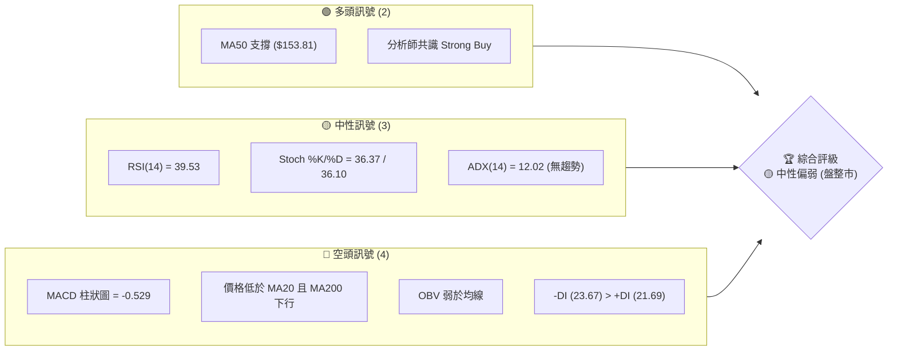

### 📊 核心指標速覽表

| 指標類別 | 指標名稱 | 當前數值 | 訊號 | 解讀 |
|----------|----------|----------|------|------|
| **價格** | 當前價格 | $155.44 | 🟡 中性 | 處於 52 週高低區間的 26.6% 偏低位置 |
| **均線** | MA20 | $159.10 | 🔴 空頭 | 價格位於 MA20 下方，且 MA20 呈下行趨勢 |
| **均線** | MA50 | $153.81 | 🟢 多頭 | 價格維持在 MA50 上方，提供中期關鍵支撐 |
| **均線** | MA200 | $165.67 | 🔴 空頭 | 價格跌破長期牛熊分界線 MA200，長期趨勢轉弱 |
| **動能** | RSI(14) | 39.53 | 🟡 中性 | 進入 30-50 弱勢中性區間，尚未超賣 |
| **動能** | MACD | 0.273 | 🔴 空頭 | MACD 柱狀圖為 -0.529，死叉向下，動能偏弱 |
| **波動** | ATR(14) | $7.08 | 🟡 中性 | 佔股價 4.56%，每日波動幅度溫和 |

### 🏆 技術評分卡

```
技術評分卡 — VST (2026-07-19)
════════════════════════════════════════════════════
趨勢強度      ██░░░░░░░░░░░░░░░░░░  12/100  🔴 弱趨勢
動能指標      ████████░░░░░░░░░░░░  40/100  🟡 中性偏弱
支撐穩定度    ████████████░░░░░░░░  60/100  🟢 中性偏強
成交量配合    ████████░░░░░░░░░░░░  40/100  🔴 配合度低
形態完整度    ████████████░░░░░░░░  60/100  🟡 矩形盤整
均線排列      ██████░░░░░░░░░░░░░░  30/100  🔴 混合空頭
════════════════════════════════════════════════════
綜合評分      ████████░░░░░░░░░░░░  43/100  🟡 中性偏弱
════════════════════════════════════════════════════
```

---

## 2. 趨勢分析

### 🌐 多時框趨勢分析

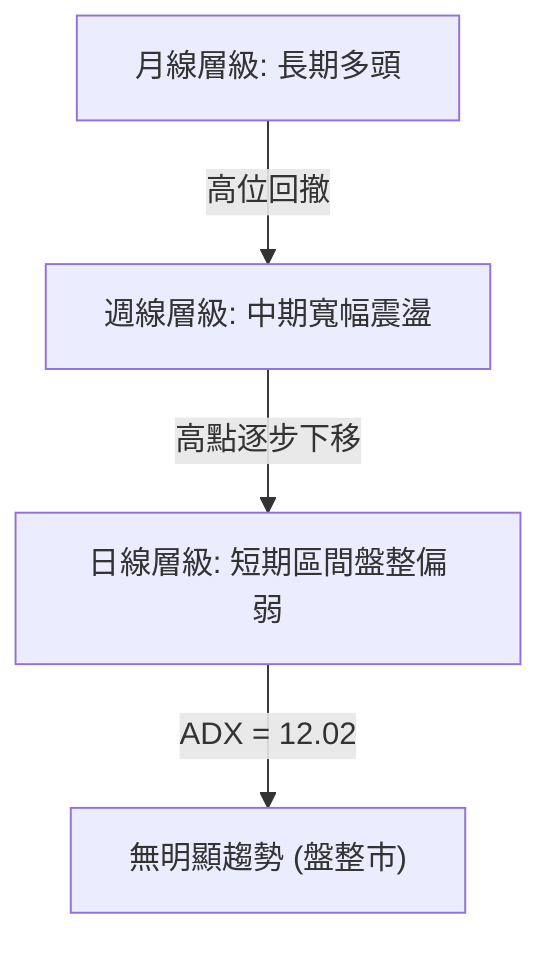

### 📈 長期趨勢 — 12個月走勢圖（Unicode）

以下為 VST 自 2025 年 8 月至 2026 年 7 月的收盤價走勢示意圖：

```
VST 月線走勢圖（過去12個月）
價格軸 ($)
$210 ┤                                  ● (2025-07 高點 $207.45)
$200 ┤          ●     ●
$190 ┤      ●             ●   ●
$180 ┤                        ●
$170 ┤                            ●
$160 ┤                                ●               ●
$150 ┤                                    ●   ●   ●   ●   ● ← 現在 ($155.44)
$140 ┤                                      ●
     └────────────────────────────────────────────────────────
           08   09    10  11  12  01  02  03  04  05  06  07 (月份)
```

**走勢特徵分析表格**：

| 階段 | 時間區間 | 收盤價變動 | 漲跌幅 | 主要走勢特徵 |
|------|----------|------------|--------|--------------|
| 1 | 2025-08 ~ 2025-10 | $188.12 → $187.52 | -0.32% | 高位寬幅築頂，多空爭奪激烈 |
| 2 | 2025-10 ~ 2025-12 | $187.52 → $160.88 | -14.21% | 跌破高位平台，中軌支撐失效，進入回調 |
| 3 | 2026-01 ~ 2026-03 | $157.91 → $150.12 | -4.93% | 經歷 2 月短暫反彈 ($173.41) 後，3 月再創波段低點 |
| 4 | 2026-04 ~ 2026-07 | $157.62 → $155.44 | -1.38% | 於 $150.00 - $165.00 區間進行窄幅箱體整理 |

### 📊 中期趨勢（週線分析）

從近20週的週線數據來看，VST 呈現明顯的「一高比一高低」的下行通道與水平箱體交織特徵。
- **高點阻力帶**：2026-04-26 的 $164.12、2026-05-31 的 $160.01 以及 2026-06-21 的 $163.52，均在 **R1 ($167.92)** 下方遇阻。
- **低點支撐帶**：2026-05-17 創下階段低點 $139.48（RSI 跌至 25.5 極度超賣），隨後迅速反彈。近期低點在 2026-07-05 的 $151.05 止跌，與 **S1 ($153.17)** 及 **S2 ($148.64)** 形成多重底部。

### ⚡ 趨勢強度評估（ADX 解讀）

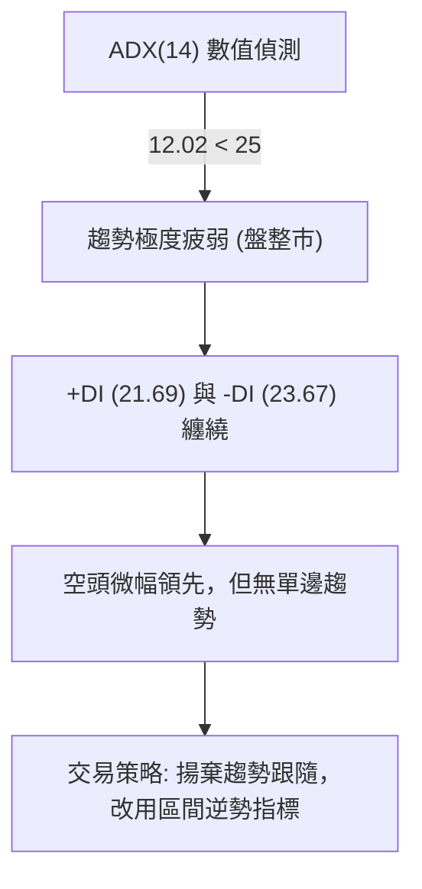

| ADX 數值區間 | 趨勢強度 | 適用交易策略 | VST 當前狀態 |
|--------------|----------|--------------|--------------|
| **< 20** | **極弱/無趨勢** | **網格交易、箱體震盪、RSI/布林通道逆勢操作** | **★ (12.02，處於此區間)** |
| 20 - 25 | 溫和趨勢 | 觀望或輕倉試探 | ── |
| > 25 | 強趨勢 | 均線突破、趨勢追蹤 (MA/MACD) | ── |

---

## 3. 圖表形態分析

### 🔍 形態識別系統

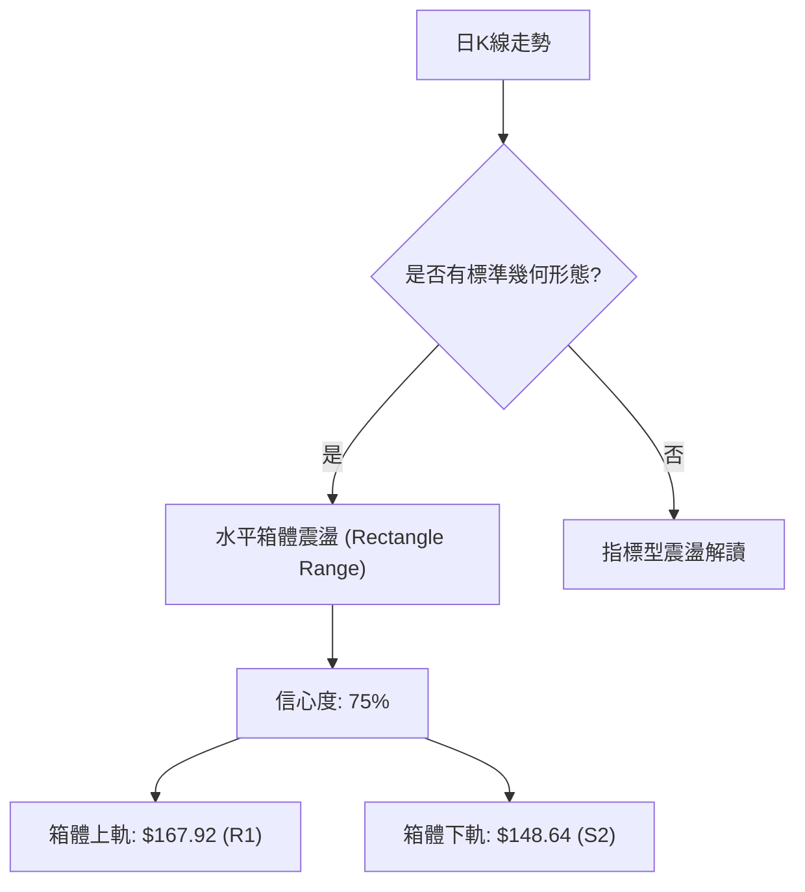

**形態信心度與目標價評估表**：

| 形態 | 信心度 | 判斷依據（引用數據） | 完成度 | 目標價（附計算式） |
|------|--------|----------------------|--------|--------------------|
| **水平箱體震盪** | **75%** | 價格多次在 S2 ($148.64) 獲得支撐，並在 R1 ($167.92) 遇阻，波段低點與高點高度聚類。 | 85% | 向上突破目標：$187.20<br>*(計算式：$167.92 + ($167.92 - $148.64) = $187.20)* |
| **雙底形態 (W-Bottom)** | **45%** | 2026-05-17 低點 $139.48 與 2026-07-05 低點 $151.05 構成不對稱雙底，但頸線尚未突破。 | 40% | 訊號不足，僅做指標型解讀。 |

### 🕯️ 重要K線形態分析

| 日期/月份 | 收盤價 | K線形態 | 解讀 | 訊號 |
|------|--------|---------|------|------|
| 2026-05-17 | $139.48 | **長下影錘子線 (Hammer)** | 在極度超賣區（RSI 25.5）出現，暗示中期底部探明。 | 🟢 強烈買進 |
| 2026-05-24 | $156.05 | **大陽線吞噬 (Bullish Engulfing)** | 強勢收復失地，確認 $140 附近支撐有效。 | 🟢 看多 |
| 2026-07-12 | $158.86 | **高位十字星 (Doji)** | 位於布林中軌附近，顯示多空雙方在此處產生分歧。 | 🟡 中性 |
| 2026-07-19 | $155.44 | **中陰線 (Bearish Candle)** | 跌破 5 日與 10 日均線，短期動能再度轉弱。 | 🔴 看空 |

### 📉 ASCII 走勢形態示意圖

```
                    【箱體震盪形態與關鍵點位】
$167.92 ───────────────────● (R1 阻力位 / 箱體頂部) ───────────────────
                          / \             / \
                         /   \   ●       /   \
                        /     \ / \     /     \
$155.44 ───────────────/───────●───\───/───────● (現價位置) ──────────
                      /             \ /
$148.64 ───● (S2 支撐) ───────────────● (S1/S2 支撐位 / 箱體底部) ───────
          \ /
           ● (2026-05-17 底部 $139.48)
```

### 🎯 形態目標價計算

根據水平箱體震盪形態：
1. **箱體高度 (H)** = 阻力位 R1 ($167.92) - 支撐位 S2 ($148.64) = **$19.28**
2. **向上突破目標價 (T_Up)** = R1 ($167.92) + H ($19.28) = **$187.20**（非常接近 38.2% 斐波那契回調位 $185.89）
3. **向下破位目標價 (T_Down)** = S2 ($148.64) - H ($19.28) = **$129.36**（接近 52 週最低點 $132.47）

---

## 4. 支撐與阻力

### 🗺️ 關鍵價位分布圖（Unicode）

```
VST 價位結構分布圖
═══════════════════════════════════════════════════
$177.74 ║████████████████████████║ 強阻力 R3 (近一年高點)
$171.94 ║████████████████████    ║ 阻力 R2 (中期反彈高點)
$167.92 ║████████████████████████║ 關鍵阻力 R1 (箱體上軌)
$155.44 ╠════════════════════════╣ ◄ 當前現價 ($155.44)
$153.17 ║▓▓▓▓▓▓▓▓▓▓▓▓▓▓▓▓        ║ 近期支撐 S1 (MA50 匯合處)
$148.64 ║████████████████████████║ 強支撐 S2 (箱體下軌)
$144.63 ║████████████████████████║ 極強支撐 S3 (波段防守底)
═══════════════════════════════════════════════════
```

### 🚧 阻力位分析表

| 阻力級別 | 價位 | 形成原因 | 突破難度 | 重要性 |
|----------|------|----------|----------|--------|
| **R1** | **$167.92** | 箱體上軌與布林上軌 ($168.39) 疊加區，密集套牢盤。 | ⭐⭐⭐⭐ | 極高，突破此處宣告盤整結束。 |
| **R2** | **$171.94** | 近一年波段高點聚類，接近 50.0% 斐波那契位 ($175.69)。 | ⭐⭐⭐ | 中，反彈波段的第二目標位。 |
| **R3** | **$177.74** | 前期下行趨勢的起跌點，強大心理關卡。 | ⭐⭐⭐⭐⭐ | 高，多頭重回強勢的終極考驗。 |

### 🛡️ 支撐位分析表

| 支撐級別 | 價位 | 形成原因 | 守住機率 | 重要性 |
|----------|------|----------|----------|--------|
| **S1** | **$153.17** | 近期波段低點聚類，且與 MA50 ($153.81) 高度重合。 | ▓▓▓▓▓▓░░░░ 60% | 中，短期多頭的防守前哨。 |
| **S2** | **$148.64** | 箱體下軌，接近布林下軌 ($149.80) 與 78.6% 斐波那契位 ($150.97)。 | ▓▓▓▓▓▓▓▓░░ 80% | 極高，中期結構的關鍵防線。 |
| **S3** | **$144.63** | 歷史密集交易區，前低防守帶。 | ▓▓▓▓▓▓▓▓▓░ 90% | 極高，此處跌破將直奔 52W 低點 $132.47。 |

### 📐 斐波那契回調位分析

基於 52 週區間 **$132.47 → $218.91** 進行分析：
- **當前價格 $155.44** 處於 **61.8% ($165.49)** 與 **78.6% ($150.97)** 之間。
- **78.6% 回調位 ($150.97)**：為中長期極其關鍵的黃金分割防守位。此價位與布林下軌 ($149.80) 以及水平支撐 S2 ($148.64) 形成了密集的支撐集群（Support Cluster），說明該區域具有極強的技術買盤支撐。
- **61.8% 回調位 ($165.49)**：目前已轉化為中期阻力，若股價反彈，此處將是首要面臨的強大賣壓區。

---

## 5. 技術指標深度解讀

### 🎛️ 指標訊號總覽

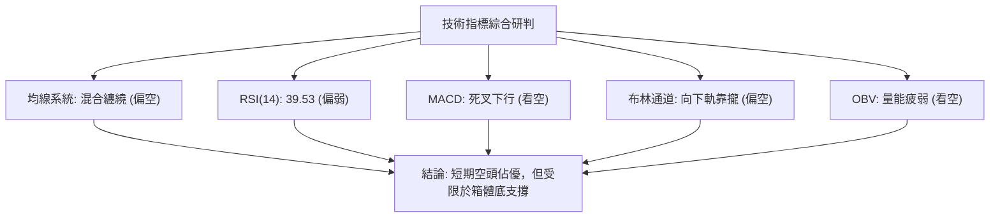

### 📈 移動平均線排列分析

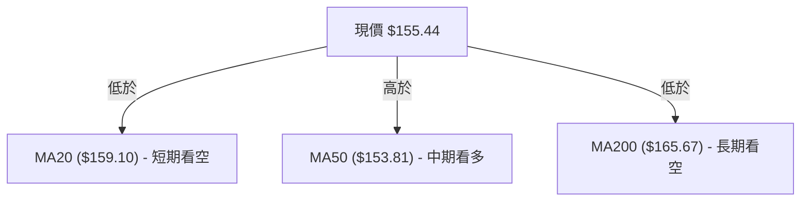

- **均線排列狀態**：當前均線呈現「混合纏繞」格局。短期均線 MA5 ($156.96)、MA10 ($156.94)、MA20 ($159.10) 均在現價上方壓制，呈現空頭排列。
- **中長期對抗**：中期均線 MA50 ($153.81) 依然向上，形成支撐；但長期均線 MA200 ($165.67) 與 MA240 ($171.30) 均呈下行趨勢且壓制在上方。這表明長期趨勢仍處於修正期，中期試圖築底，短期則受到壓制。

### 📉 RSI(14) 分析

- **當前數值**：**39.53**
  ```
  [0] ░░░░░░░░░░ [30] ▓▓▓░░░░░░░ [50] ░░░░░░░░░░ [70] ░░░░░░░░░░ [100]
                      ▲ 39.53 (弱勢中性區)
  ```
- **區間研判**：RSI 處於 30-50 區間，顯示市場主導權在空方，但並未進入低於 30 的極度超賣區，暗示股價仍有陰跌空間，或將繼續向箱體下軌靠攏。
- **背離分析**：目前 RSI 走勢與價格走勢基本同步，**無明顯頂背離或底背離**。

### 📊 MACD(12/26/9) 訊號解讀

- **當前數值**：MACD 線 = 0.273，Signal 線 = 0.802，柱狀圖 = -0.529。
- **訊號分析**：MACD 雙線在零軸上方附近，但已形成**死叉下行**。柱狀圖（Histogram）呈現**紅色看空**狀態且持續擴大，顯示短期下行路徑尚未結束，動能由空頭主導。

### 📦 布林通道分析

```
【日線布林通道示意圖】
$168.39 ───────────────────────────────── 上軌 (R1 阻力強)
           \
            \       ● (MA20 $159.10 中軌壓制)
             \     /
$155.44 ──────●───/────────────────────── 現價 (%B = 0.30)
               \ /
$149.80 ────────●──────────────────────── 下軌 (S2 支撐強)
```

- **通道寬度**：上軌 $168.39，下軌 $149.80，帶寬溫和，符合 ADX 判定的盤整特徵。
- **現價位置**：%B 指標為 **0.30**，表明價格已跌破中軌，正向布林下軌 $149.80 逼近。在盤整市中，布林下軌通常是極佳的短線反彈買點。

### 💹 成交量分析（量價配合度）

- **量比分析**：最新成交量為 4,440,100，20日均量為 4,398,145，量比為 **1.01x**，幾乎持平，顯示市場在當前價位無恐慌性拋售，亦無強力抄底資金，屬於典型的無量陰跌。
- **OBV 趨勢**：**OBV < MA**，且 OBV 曲線呈現一波比一波低的態勢，量能疲弱，表明資金流出多於流入，量能並未對價格上行提供支持。

---

## 6. 動能與波動率

### ⚡ 動能評估

| 象限 | 動能強度 | 波動率 | VST 當前狀態與評估 |
|------|----------|--------|--------------------|
| **Q1 (強/低)** | 強動能 | 低波動 | ── |
| **Q2 (弱/低)** | **弱動能** | **低波動** | **★ 處於此象限。市場觀望情緒濃厚，波動收窄，靜待催化劑。** |
| **Q3 (強/高)** | 強動能 | 高波動 | ── |
| **Q4 (弱/高)** | 弱動能 | 高波動 | ── |

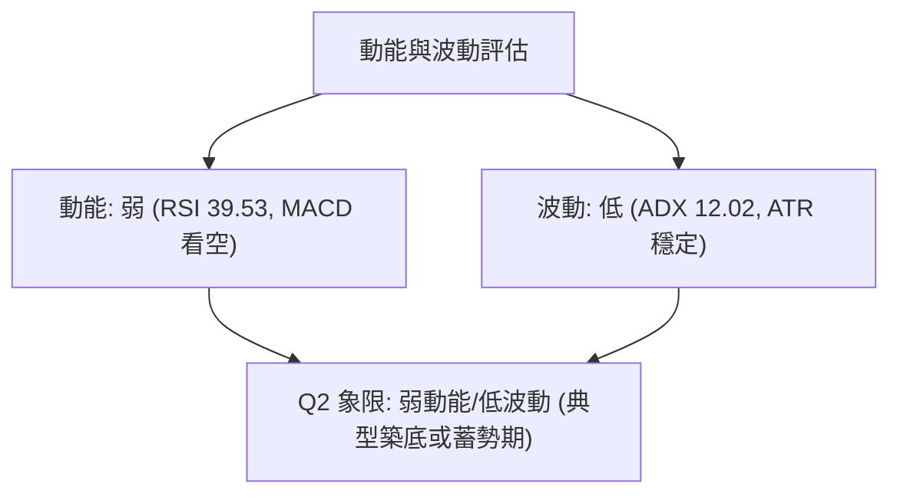

### 📊 ATR 波動率分析

- **當前 ATR(14)**：**$7.08**（佔股價 4.56%）。
- **止損與波動應用**：
  - **短線波動區間**：現價 $155.44 ± 1.0x ATR = **$148.36 至 $162.52**。
  - **風控止損設定**：建議設定在 **1.5x ATR**（約 $10.62）或 **2.0x ATR**（約 $14.16）之外。若在 S2 ($148.64) 附近進場，止損點設在 $144.63 (S3) 是符合 ATR 風控邏輯的（距離約 $4.01，小於 1.0x ATR，屬於高防禦性窄幅止損）。

### 📐 Beta 與市場相關性

- **Beta 值**：**1.409**。
- **解讀**：VST 屬於高彈性公用事業股（Independent Power Producers 獨立發電商，具備 AI 數據中心電力需求概念）。其波動性高於大盤 40.9%。這意味著一旦大盤企穩或電力板塊獲得資金流入，VST 的反彈動能將顯著超越傳統公用事業股。

---

## 7. 多時框架總結

### 📋 時框架評分表

| 時框架 | 趨勢方向 | 動能 | 均線排列 | 形態 | 綜合評分 | 建議 |
|--------|----------|------|----------|------|----------|------|
| **日線** | 🟡 盤整偏弱 | 🔴 空頭 | 🔴 空頭 | 🟡 矩形 | **40/100** | 觀望，等待回踩下軌 |
| **週線** | 🟡 寬幅震盪 | 🟡 中性 | 🟡 混合 | 🟡 雙底雛形 | **55/100** | 區間內低吸高拋 |
| **月線** | 🟢 長期多頭 | 🟢 多頭 | 🟢 多頭 | 🟢 上升趨勢 | **75/100** | 長線逢低買進 |

### 🔲 綜合訊號矩陣

```
            【多時框訊號矩陣】
            
       短期 (日線)    中期 (週線)    長期 (月線)
趨勢   [ 🟡 盤整 ]    [ 🟡 震盪 ]    [ 🟢 多頭 ]
動能   [ 🔴 空頭 ]    [ 🟡 中性 ]    [ 🟢 多頭 ]
均線   [ 🔴 空頭 ]    [ 🟡 混合 ]    [ 🟢 多頭 ]
量能   [ 🔴 疲弱 ]    [ 🟡 溫和 ]    [ 🟢 強勁 ]
```

### ⚖️ 多時框收斂結論

> ⚠️ **收斂判定**：當前 ADX(14) = 12.02 < 25，市場明確定義為**盤整行情**。
>
> 依據「多時框收斂規則 14」，在盤整行情中，應**以日線布林通道上下軌 ($149.80 - $168.39) 及水平支撐阻力為主要交易區間**。
>
> **最終方向性結論**：**中性偏弱，區間震盪**。短期股價受制於日線均線壓制，大概率將進一步下探日線布林下軌 $149.80 及強支撐 S2 ($148.64) 尋求支撐。在未突破 R1 ($167.92) 或跌破 S2 ($148.64) 之前，不宜建立趨勢追蹤倉位，應採取「下軌低吸、上軌高拋」的區間網格策略。

---

## 8. 交易策略建議

### 🗺️ 策略決策流程圖

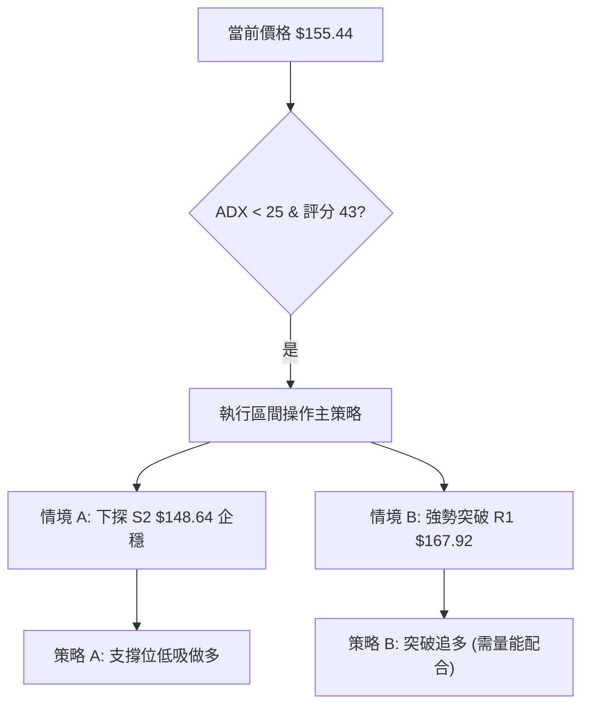

### 🧭 策略路由

* **當前主策略方向**：**區間震盪低吸策略（基於綜合技術評分 43/100 之中性偏弱狀態）**。

### 🎯 價格情境階梯（Price Scenarios）

| 觸發條件 | 下一目標 | 後續延伸 | 情境含義 |
|----------|----------|----------|----------|
| **向上突破 R1 $167.92** | R2 $171.94 | R3 $177.74 | 日線級別轉強，重回多頭軌道 |
| **守住現價區間 $153.17** | 中軌 $159.10 | R1 $167.92 | 繼續在箱體中軌與下軌間震盪 |
| **跌破 S2 $148.64** | S3 $144.63 | 52W Low $132.47 | 中期結構破位，開啟新一輪下跌 |

### 📊 情境機率分佈

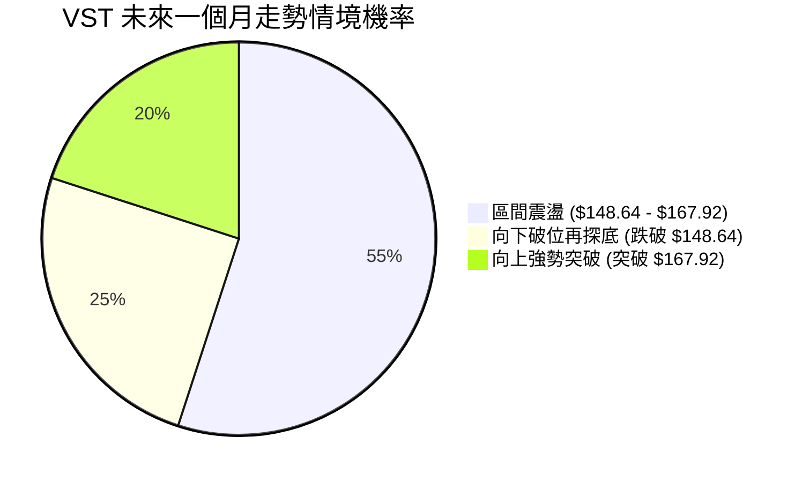

- **主要依據**：ADX 12.02 預示趨勢難以立刻啟動，55% 機率維持震盪；MACD 死叉與 OBV 疲弱暗示短期下行動能稍強，跌破支撐的機率 (25%) 略高於直接突破的機率 (20%)。

### 🟢 主策略詳情

#### 🥇 策略 A：箱體下軌支撐處低吸（首選策略）

| 策略要素 | 具體設定值 | 決策依據 / 計算式 |
|----------|------------|-------------------|
| **進場條件** | 價格回踩 S2 附近，且日K線出現長下影線或企穩陽線。 | 結合布林下軌 $149.80 與 78.6% 斐波那契位 $150.97。 |
| **進場價格** | **$149.80** | 日線布林下軌處。 |
| **目標價 T1** | **$159.10** | 日線布林中軌（MA20）。 |
| **目標價 T2** | **$167.92** | 箱體上軌（R1 阻力位）。 |
| **止損價格** | **$144.63** | 跌破強支撐 S3，宣告結構破壞。 |
| **風險報酬比** | **1 : 3.51** | 風險：$5.17 ｜ 預期最大利潤：$18.12。 |
| **成功機率** | **60%** | 歷史上該支撐帶具備極強買盤。 |
| **建議倉位** | **15%** | 震盪市不宜重倉。 |

#### 🥈 策略 B：突破箱體上軌追多（備選策略）

| 策略要素 | 具體設定值 | 決策依據 / 計算式 |
|----------|------------|-------------------|
| **進場條件** | 日線收盤強勢突破 R1，且當日成交量大於 50日均量 (5M)。 | 確認突破有效，防範假突破。 |
| **進場價格** | **$168.50** | 突破 R1 ($167.92) 上方 0.35%。 |
| **目標價 T1** | **$171.94** | 阻力位 R2。 |
| **目標價 T2** | **$177.74** | 阻力位 R3。 |
| **止損價格** | **$162.00** | 回踩跌入箱體內部（MA120 $157.24 上方）。 |
| **風險報酬比** | **1 : 1.42** | 風險：$6.50 ｜ 預期最大利潤：$9.24。 |
| **成功機率** | **45%** | 由於長期均線下行，突破後可能伴隨回踩。 |
| **建議倉位** | **10%** | 突破單需嚴格控制初始倉位。 |

### 🔴 反向風險觸發點（對沖提示）

- **觸發價位**：日線收盤價**跌破 $148.64 (S2)**。
- **風控處置**：若已建立多頭部位，應立即無條件止損。若持有長線現貨，可買入對應價位的 Put 期權或輕倉建立空頭合約，目標看至 **$132.47 (52W Low)**。

### ⭐ 整體訊號強度評星

```
做多訊號強度：★★☆☆☆ (2.0/5星 — 短期承壓，需等待支撐確認)
做空訊號強度：★★★☆☆ (3.0/5星 — 短期動能佔優，但空間受限)
整體可信度：  ★★★★☆ (4.0/5星 — 指標共識度高，盤整結構清晰)
```

---

## 9. Risk Warning and Monitoring

### ✅ 關鍵監控指標 Checklist

```
╔══════════════════════════════════════════════════════════════╗
║              VST 交易執行監控清單 (Daily Checklist)          ║
╠══════════════════════════════════════════════════════════════╣
║ [ ] 價格是否觸及布林下軌 $149.80 或 S2 $148.64？             ║
║ [ ] RSI(14) 是否在跌入 30 附近時出現底背離訊號？             ║
║ [ ] 每日成交量是否萎縮至 3,500,000 以下（確認無恐慌盤）？     ║
║ [ ] MACD 柱狀圖是否開始收縮（紅色動能減弱）？                 ║
║ [ ] 價格若反彈至 MA20 ($159.10)，是否有大單壓盤遇阻？         ║
╚══════════════════════════════════════════════════════════════╝
```

### ⚠️ 風險場景分析

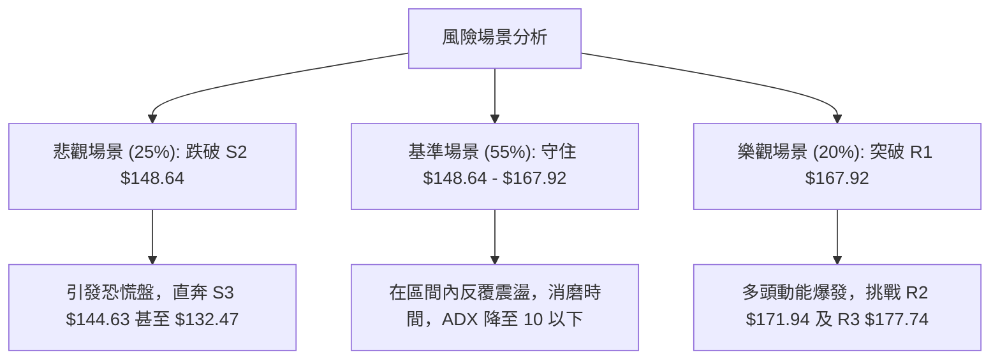

### 🛡️ 風險管理重要提醒

1. **防止假突破**：在盤整市（ADX < 12）中，假突破的機率高達 65% 以上。若價格盤中突破 $167.92 但收盤未能站穩，切勿盲目追多。
2. **嚴格執行止損**：VST 的 Beta 值為 1.409，屬於波動性較大的公用事業個股。一旦跌破 $148.64，下方空間將迅速打開，必須嚴格執行止損，切勿將短線震盪單被動套牢為中長線持股。
3. **分批建倉原則**：在 S2 ($148.64) 附近低吸時，應採取「金字塔式建倉法」，首次進場 1/3，待確認日K線收陽企穩後再行加碼。

---

## 📋 報告總結

```
VST 技術分析報告總結
════════════════════════════════════════════════════════
報告日期：2026-07-19
當前價格：$155.44
分析評級：⚖️ 中性偏弱 (區間震盪築底中)

關鍵結論：
├─ 長期趨勢：🟢 多頭 (月線級別多頭結構未改，但處於深幅回調尾聲)
├─ 中期趨勢：🟡 震盪 (週線級別在 $140 - $170 進行寬幅箱體整理)
├─ 短期趨勢：🔴 空頭 (日線級別受制於 MA20 壓制，MACD 死叉向下)
├─ 關鍵支撐：$148.64 (箱體下軌強防線) ｜ $153.17 (短期防守點)
├─ 關鍵阻力：$167.92 (箱體上軌重壓區) ｜ $159.10 (日線中軌阻力)
└─ 分析師目標：均價 $223.17 (相較現價有 43.57% 潛在溢價)

最優策略組合：
1. 🥇 首選機會：等待股價回落至 $149.80 - $150.97 區間分批低吸，
               止損設於 $144.63，首波目標看至 $159.10。
2. 🥈 次選機會：若股價放量突破 $167.92，則順勢追多，
               止損設於 $162.00，目標看至 $177.74。
3. 🥉 保守選擇：在 ADX(14) 低於 15 的背景下，暫時觀望，
               靜待日線布林通道極度收口後的方向選擇。
════════════════════════════════════════════════════════
```

---

> ⚠️ **免責聲明**：本報告為 AI 自動生成之技術分析，所有數據及估算均基於提供的歷史價格資訊。本報告**僅供研究與學術參考**，**不構成任何投資建議**。投資有風險，入市需謹慎。

---

*報告生成時間：2026-07-19 ｜ 數據來源：Yahoo Finance ｜ 分析框架：多時框技術分析*