<details>
<summary>📊 靜態圖表 (點擊展開)</summary>
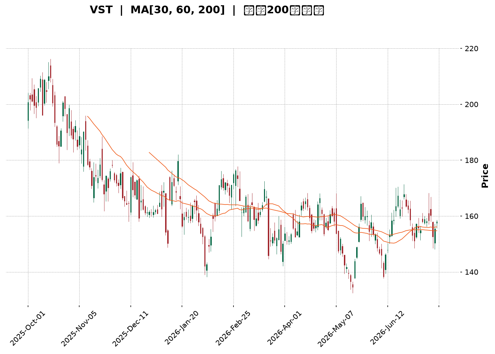
</details>

<html>
<head><meta charset="utf-8" /></head>
<body>
    <div style="height:500px; width:100%;">                        <script>window.PlotlyConfig = {MathJaxConfig: 'local'};</script>
        <script charset="utf-8" src="https://cdn.plot.ly/plotly-3.7.0.min.js" integrity="sha256-jvTGqxNp8AGWEcvNLVuKr+8j5dGe9Yw51LQkmDH+IYA=" crossorigin="anonymous"></script>                <div id="candlestick-chart" class="plotly-graph-div" style="height:100%; width:100%;"></div>            <script>                window.PLOTLYENV=window.PLOTLYENV || {};                                if (document.getElementById("candlestick-chart")) {                    Plotly.newPlot(                        "candlestick-chart",                        [{"close":{"dtype":"f8","bdata":"AAAAoJMVaUAAAADA5zlpQAAAAIDfJGlAAAAA4IXyaEAAAADgWNloQAAAACAwtmlAAAAAQCEkakAAAADgZIFoQAAAACDKFWpAAAAAwAuVaUAAAACgNz9qQAAAAGDgMGpAAAAAYHoQaUAAAADA5i1oQAAAAODiN2dAAAAA4OUhZ0AAAABAcdJnQAAAAGBNFGlAAAAAYCbPaEAAAAAglrlnQAAAAIBh0WhAAAAAAIudZ0AAAAAgnHBnQAAAACCpB2hAAAAAoAcfZ0AAAABgWJNnQAAAAKBW+2ZAAAAAwKbGZ0AAAAAA+W9nQAAAAOBXTWZAAAAAQPswZkAAAADAJltlQAAAAIDlvmVAAAAAQMbIZUAAAACgSrZlQAAAAKC0TGZAAAAAADeiZUAAAACAgfxkQAAAAKA8zWVAAAAAADVEZUAAAAAAIwJmQAAAAGDIQ2ZAAAAAgG+dZUAAAABAs3plQAAAAAAFXmVAAAAAgN\u002fqZUAAAAAgQc9kQAAAAADLrWRAAAAAIAyEZEAAAAAAhY9kQAAAAEAHvGVAAAAAIKAsZUAAAADAq\u002fFkQAAAAGBhl2VAAAAAQM\u002fpY0AAAAAgY69kQAAAAOBSS2RAAAAAAPojZEAAAADgKidkQAAAACBsMGRAAAAA4ConZEAAAACglyxkQAAAAMB7RWRAAAAAQFEcZEAAAAAAxphkQAAAAEBgT2RAAAAAYP4hZUAAAABAjUVjQAAAAMDnxWJAAAAAACe9ZEAAAAAgU4NlQAAAAIBOXmVAAAAAgB8QZUAAAABg2nVmQAAAAAB+xGRAAAAAgBOMY0AAAABgg\u002fJjQAAAAOBc\u002fWNAAAAAQLT1Y0AAAABg5stjQAAAAIDReWRAAAAAYNulZEAAAAAANURkQAAAAIA4vWNAAAAAoLM6Y0AAAABAfhJjQAAAAOAOxGFAAAAAIJzVYUAAAACglqdiQAAAACCJEWNAAAAAQBzlY0AAAABAqfZjQAAAAEDNVGRAAAAAgIpgZUAAAABAbaZlQAAAAKAuQ2VAAAAAgMWAZUAAAAAgq11lQAAAAEDJ6mRAAAAAYLBkZUAAAADgCdxlQAAAAGChCmZAAAAAACGtZUAAAADABrFkQAAAAAAgKGRAAAAAQBldZEAAAACABd5kQAAAAEDLxmNAAAAAIGVlZEAAAABgSX5kQAAAAMAR12NAAAAA4HjkY0AAAAAAXtBjQAAAACBhMWRAAAAAgA18ZEAAAABA0jRlQAAAAIAQ3WRAAAAAABs6YkAAAACAguJiQAAAAKA0EGNAAAAAIIrpYkAAAADgyAJjQAAAAABnaGNAAAAAYK1qYkAAAAAg1cNiQAAAAKDUN2NAAAAAoP7eYkAAAACgGOxiQAAAAODhLmNAAAAAAIF1Y0AAAAAgKhFjQAAAAIBvUGNAAAAAAFK\u002fY0AAAADAs3dkQAAAAODJVmRAAAAAYI2pZEAAAADAZ2dkQAAAAOAO7GNAAAAAIDBWY0AAAADgTnJjQAAAAGAulGNAAAAAgNiDZEAAAAAAG8tkQAAAAEChHGRAAAAAwGUyY0AAAAAA0bNjQAAAAOACYmNAAAAAgAAUZEAAAACg+wRkQAAAAEAywmNAAAAAwII3Y0AAAAAAbnBiQAAAAMDL+mJAAAAAgERVYkAAAABgI81hQAAAACBztmFAAAAAYIJvYUAAAABg4RFhQAAAACCx0GBAAAAAYI75YUAAAACA45tiQAAAAKClgWNAAAAAQI6KZEAAAAAgov1jQAAAAKDJAWRAAAAAgDAAZEAAAADgZFFjQAAAAID4t2NAAAAAoLcyY0AAAACghS9jQAAAAKCpkWJAAAAA4DlWYkAAAAAgf0BiQAAAAIAUS2FAAAAAIJxFYkAAAAAgBHpiQAAAACDFKWNAAAAAIGzMY0AAAADAc9NjQAAAACCscGRAAAAA4FHoZEAAAADgekxkQAAAAADXW2RAAAAA4KP4ZEAAAAAgrm9kQAAAAAApTGRAAAAAACnUY0AAAADAHiVjQAAAAKCZ4WJAAAAAQAqnY0AAAAAgXHdjQAAAAIA9WmNAAAAAIFy\u002fY0AAAAAghdtjQAAAAADXw2NAAAAAgMLNY0AAAAAgXAdkQAAAAIDrEWNAAAAAgBRuY0AAAAAgrr9jQA=="},"high":{"dtype":"f8","bdata":"wDtzDpCCaUDjva8oy4RpQPd0oNCAKmpAMrGrIiriaUA4hVILq19pQPf9KpYZuGlAmRmBZTpGakClX6fNp29qQPaD\u002fkiJImpAJ1s8pnv\u002faUBIev32cuRqQAnTrz1jBmtAg+LPKrklakBGWQUQupRpQEGExjLFE2hALxsz0NmWZ0Dy1AZt5OxnQKcfVB4xJWlAcvpGXhdaaUA0qB\u002fm5I9oQMn0bGu4\u002fGhAwZAindq\u002faEAybwBu4QJoQMQ5LfQsTGhAcafuRETWZ0BuaPPvp\u002fVnQJiAW729imdATzu0kwrJZ0DX4iNpe39oQDjBKVQjZWdAq\u002fO1DoqRZkBbBEovGidmQJbUfJgcaGZAtfz7jdBYZkCzY9iy5BVmQKzNw5Hpl2ZA4F+wYCiQZ0A0q\u002fvRtZ5lQHVALRYmz2VACWORtivAZUACGIUZaSBmQMZPmjumgGZA0DAIQ\u002fD3ZUAoNkV8DOdlQHysXcEgpGVA0S26WvgpZkA4sBoauPxlQM46yL3342RAQm+KGpImZUBHUAVfm6pkQBD1xAVFxWVACMMmhhxoZkCiWLdeCollQPXUKTGtpmVA3iX1eDzNZUAX1OnFn2ZlQJLw+ipfVmVA\u002fWBvE2p7ZEAvlTa\u002f8mdkQP+rCwBeRGRAU90fMZxRZEAVvdNp53dkQGikS06GU2RAJmBSO3qBZECXgsIYBBplQE3qKVDOZWVAafBaJEiEZUAMlnY36QVlQETibZvYa2NAjiX69UDIZUCVsD3cEwhmQLAX1yvp3mVAjJ\u002fHzaVWZUDl6QyWzcFmQHkFh5i7VGVAHSfpTFixZEAdjB9UDzFkQC3tpciQYWRAZbRuGXZNZEDDfGZ5U5tkQG32H31OhWRAShc1NTfDZED3WL7XVu1kQI7wMkJ6gWRA3UebmjzxY0AHXLEmL4JjQK8CdvuNJ2NA08EgZGrwYUAEcGzD4PpiQFTSdh41a2NAqDUjfjAfZEBc1l9hU5tkQHfzEhcMuGRAZpd4SPdlZUC4t2ZgNAVmQHRfFrWB4GVAMzP3agGDZUBiVUDqrqBlQEs2oZG1a2VA53\u002fghJpmZUA\u002fsT4kjO5lQFmw+bu2F2ZAPovpuy06ZkBt9Z+FDgFmQI65eASGYmRArzRJSjl4ZEA\u002fIygeNvBkQP+m45lL\u002fWRA1kRjTKCFZEC1takJYQplQOeVqvczcWRAavQzEP5XZEA8UHaXF5lkQOXKtt+QYWRA7cE29hygZEBHUUcpupBlQAZxQlo6JGVAEtsNF5fHZEAo\u002fX\u002fQ0nVjQKwQqdBNPGNAydGc2FS3Y0D9ueaimw5jQCae5i07\u002f2NAPHKCw6XWY0CQPozwQuhiQLZxLjzig2NA2YaV5wBLY0C3k+EkghxjQLpvM6A4PmNABmuViLMiZEDwIVLWr0lkQF50DrIPzWNACrxYAdkPZEBzPwA+kKFkQOVL4zwwyWRAatNcU\u002fjVZEAUpSDgIwhlQJdRWkVCemRAKT+atv0bZEDHjyrvcNtjQHev5vu61GNA7ZgdbvSnZEB3z60r5wVlQHtHdF0XY2RA5gCWrjwdZEA1oEY+BO1jQDmzAFNQ\u002fWNAOkLKuOREZED8LLYRRXJkQL53EehiWGRAUMzp0\u002fEEZUC6dRFaEFljQKH3GhsqEWNAq8KC8ZvDYkAOqsz0aUJiQFkVxgQH42FAEkf1+JCcYUAh85gJCWthQFSH1lNIEGFAqi6e0FAWYkDq7nSVR6JiQKTPY1swq2NApA\u002fR9k7lZEApLBnQUZlkQIVY1GSkaWRAusF4ZgRCZEBhQng0gcpjQM2gz87DEWRAj2f+qQ22Y0C9y+b6YjpjQHj\u002fcQVgQmNAW0J0QeuiYkCIGzrC38JiQODlIVOO+WFA6RQP6zlWYkASuq\u002fWQ8liQH\u002fWwoNxZ2NAvcI6PyIoZEAXNWyEz0ZkQD5+vuFBQ2VAAAAAAABQZUAAAABgZrpkQAAAAOB6tGRAAAAAQDNrZUAAAACAwv1kQAAAAEAzs2RAAAAAYGauZEAAAACAPapjQAAAACCuh2NAAAAAIK6nY0AAAADAHu1jQAAAAOClj2NAAAAAgMIlZEAAAADgowBkQAAAAIDC7WNAAAAAYLgGZUAAAACAFN5kQAAAAEAzw2NAAAAAAACoY0AAAACAPdJjQA=="},"hovertemplate":"\u003cb\u003e%{x|%Y-%m-%d}\u003c\u002fb\u003e\u003cbr\u003e\u958b: $%{open:.2f}\u003cbr\u003e\u9ad8: $%{high:.2f}\u003cbr\u003e\u4f4e: $%{low:.2f}\u003cbr\u003e\u6536: $%{close:.2f}\u003cextra\u003e\u003c\u002fextra\u003e","low":{"dtype":"f8","bdata":"2DPvsu\u002frZ0Bk\u002fEM8WbxoQIZ94QVCFWlARxO83o6TaEAeT7alUmJoQI92bhiB6WhAAOA+HniPaUDJxPytwYBoQG83jR808mhA4Su\u002fQhISaUBboGdQaLFpQOdXDU0x+mlAjLDr6gznaECbachPPABoQFXNq8acGWdAg7aaNvVcZkC3UfjrEh5nQDCW38dfOWhAnU1s4et1aEBP\u002fN4Lj\u002fZmQN7K+BjllWdA9vZFAEJ4Z0A4wZDGSNhmQE+ZGlckYmdAAxMLoYP3ZkC3yTOHNwVnQFAjH04iWWZAxJLePcP7ZUA8g7f5rexmQP+FK4QwQmZAm+aaS8ARZkDvtXF1AjplQArn5uGVnGRAQ87fH92MZUDTcF9\u002feD5lQDtq9Cfrr2VA5AtszC6NZUA5b0yxhThkQKOUGGzIpmRAbOdYKvGmZEDowrf2v4tlQOuU\u002fQCyKGZAksGhZil\u002fZUDYY50C8FRlQM35QVv6B2VAYWIpmnI4ZUB\u002ffi+I8rhkQHVcRH0lbGRACIHRd3+BZECwKyGkvr9jQDuIyJfzCmRARGe5NcXZZEAdlecFM8lkQLPTwQ1\u002fu2RAEjgHhlbBY0C7GuwI2j9kQN8kMLbOQGRA+s6oBQANZEAcBc4NBvZjQHKAUR6J6mNAuID2VAv9Y0AvE1YNc+9jQCmPnYGzE2RAXWRunM4YZEB2DYgIA25kQAxAoCzw92NAyZcsU4BqZEDYT+GUuSNjQEKzkt3omGJAT47qEoStZEDWQN44E3RkQN4tVu8oS2VACa4Q3vCyZEAsVkp6mmZlQJDn3cLtUWRARgMCqDR6Y0ATnnqgECtjQFLE1di\u002f1mNAF6uSKQ2yY0Cw9PEw3K5jQNij9nbWtmNAcm+2f+QWZECWPU4SJcpjQEf7qwysjWNAiUWnslwzY0DH8aJwRL9iQFHKelNYXGFAkH+d+rpEYUChUP\u002flbGBiQCnPTevpa2JAcjRhwUBMY0DeTzBJmsNjQFmO78Sj\u002fmNA4nRxJb4hZECbC7dsZS9lQGNbNPKLJGVAzczMjCX5ZEA29lmdFBFlQNLTDokimGRA7idC5sdNZECC7NZ0izNlQG8L4j4IdWRAbbigzGRNZUDEp7ed66tkQEGb0dHaEWNAS78hxaP+Y0BlTbqFfCdkQGyq6Qigu2NAn+Wx8FBSY0DDJKFFQXtkQNRxNWAaV2NAl+OE9pCIY0BJQKVSb6ljQB57CJ1i9WNAX\u002fJFEoc1ZECRbbWpY6FkQMK0e5bceGRA\u002fNIbIhQUYkAwnEilCaRiQMiCHFHoqmJA60APMm7FYkD1SzPvH0liQBIcw5o18WJA0ULJxKNMYkCIuoWJgsRhQPA6xlMG5mJArKadRB+9YkB6ffv2c7ViQEj7qRM8wmJAM5+on1RiY0DIQU9t7Q5jQDHMHg+rHGNAZv0D9fcNY0CDdIFH3QNkQCz33SyLPWRAp6jeMz5MZECUu17\u002fDkFkQNmc5Mknw2NAQeN\u002fT0M9Y0BQjn7XgVZjQLLd8wsWSWNAAcmUZNtdY0DcwbufatBjQDa4ZP7vz2NAV+BIorUbY0D2zDEMZHBjQGLbd6LTVmNAUqzs0AinY0B4oQzlcvJjQBWqTDwxjGNAn\u002fjcT8IxY0BarDNayFhiQPB5qp9ZQmJAU9p+HJouYkBN4Y2jE2phQOZVAgk+d2FAVbkIzMAzYUAxfbKbh7VgQEVGKvwuj2BAVb02ycAzYUDbOZY9rRViQLxT5\u002fxA0WJACwUJovW\u002fY0DHT6W098VjQCRDh9MlrGNAatvMwCOVY0DVR6iryeNiQLP\u002f\u002fY9RFWNAVUPwHI4XY0CRg6v1W79iQFECWi9maWJAjPD6FJxFYkD1bnYd8qphQAAam9fyNmFAaSJHo\u002f5rYUALD3bva1liQOPvJXk+wWJAQYPflrgTY0A1ZTJPr59jQDIRhX3M+WNAAAAAwMxcZEAAAADgo+RjQAAAAAAp\u002fGNAAAAA4FHAZEAAAACAFGZkQAAAAOCjIGRAAAAA4FGQY0AAAACgmeFiQAAAAAAAkGJAAAAA4FEAY0AAAADgUUBjQAAAAIA96mJAAAAAgD2uY0AAAACgmaFjQAAAAGBmhmNAAAAAIAahY0AAAACAFL5jQAAAAICTkGJAAAAA4HqEYkAAAAAA13NjQA=="},"name":"\u50f9\u683c","open":{"dtype":"f8","bdata":"wcvl7B5GaED7c2ZmM2ZpQEd5nXEUcGlADfszhcKpaUAbEXwffRdpQKzS27rOF2lAzMzMLIfEaUCjnClaexxqQAwqPOklCWlAiaG1\u002fPedaUA6Xk\u002fbdQ5qQJ5uWhnGvGpANRorB+HZaUAge9GbEWlpQOOJaOuPAmhAdiBLsLVYZ0C3UfjrEh5nQMzQ2NQbeWhAcvpGXhdaaUA0qB\u002fm5I9oQNRiGFMU8GdA62ozRew7aEDojN7KhOZnQKrOgsOYwGdAGIW2kTxqZ0BneWy3mS9nQMq2mEY1xGZAojlrcE84ZkDZQStcvz9oQKeKGhXEJGdAXp1Bw6ByZkD+Uss7pAVmQNUMCqaSz2RAFl8EJHrWZUBKs++LNH5lQB1XO7jfzWVAqiGQH7YBZ0CzC6VlLGllQPoWfny8G2VAUr7qC3WrZUAefq2A6KhlQDdTWH4+SGZA1lbi+vXoZUD+tveLhdVlQBVgba80fmVAEDk9bfxlZUAOH9S2NvllQM46yL3342RATXJnmeSVZED4QW7Z75RkQNY5QgIYLGRAdHF++iXPZUDCI48axIdlQExHEsiuvmRA56NS3TmpZUD9JKGTIp9kQCEHOdBGwGRArTj3lIVxZEA+IIIC+iNkQJ\u002fi98t3EWRAAAAA4ConZEBu+e9byRFkQOK4FMOyMWRAxPdPfhlOZEB2DYgIA25kQJF6ZTTjHGVAf8pbmhQRZUAMlnY36QVlQIN9eGlLWmNAQ00eeiu7ZUBCqG8j54ZkQO2bA5GjsGVAfnEKooYdZUAeFyYlupBlQKsEkefO4mRANhWAE2caZEDiA5czSNJjQHtDXsR2L2RAkEVA9t\u002fxY0BfmpXlswRkQE90Vdo84mNAAxIpXVixZED6kUmcEbBkQIk7MQ++IWRAExH34uGmY0D0nje9DnZjQEeQvVqOGGNAojQ1aI2TYUBr0Pv2wbJiQG77QP\u002fBsmJA\u002fxqKq6P+Y0C1aPPibpFkQJBUta8rCWRA+iaBjnY+ZECtz\u002fIHE01lQLOrpUH1sGVAzcyuyB4uZUB9UO2oY3plQOWAgVBqRWVA6lORNTHaZEBAJY8Z8XxlQAOzW2VkXGVAOU8LCo3QZUC18araXzdlQGjR0lnOJ2RAQRNeYJ0kZEBftYiA3i1kQIBPaMvhf2RAZPKZWQlvY0CG0uEN7JxkQCNnCejBZGRAdL73X7GUY0BdqwD+CSpkQMT20F\u002fJEWRAtkct+otLZECPW0sDXqlkQHRaFaWu1mRAEtsNF5fHZECbEcRqn+diQFVYRNzcymJAg3luRBBZY0AW3KxTT6liQBIcw5o18WJAw2d6eiucY0AS2UYqXPZhQP2SdgZD6GJAgJv6J\u002fTfYkD05QVNhdpiQNx2sMZ622JABWzocs4QZEA9BV0HgXVjQLWWVHchKWNAZv0D9fcNY0Bq0TQf2kVkQMEZRAyYqGRAEtt+H+CKZEC7gUEs4cBkQG2jFbpNWmRAmNfAOyARZEBJQhvZibJjQEubIrK9d2NATXwCgJCDY0B04M+5nZhkQIMv5nC6SGRAoLjdQFIUZEBSdtYhSYJjQBZ04OnVwmNAJT248wWvY0BA9fybtFhkQEL5jOicKGRACATW3ftZZEC6dRFaEFljQNTOhYVgeWJA+mVlnP2oYkAOqsz0aUJiQDsNAlXVpWFAvyBliYtyYUCsu0WZx1lhQGulTeOF82BAAAAAHNM5YUD8xES7hyhiQPBHu4cz2mJAx8ZiOgLWY0AqjOmlVpdkQK+CDJ\u002fF02NAQyCHAtf4Y0DC0GVW+ZhjQGPJmQEad2NAte0B1FCJY0AMOJaef+piQK8anKEy+WJAt\u002f3beEiDYkAxHOFLzIZiQAbrZwXJ5GFAytzu\u002fl6ZYUBWG6t6YHliQIKpSuIUE2NAm2MnZyQhY0CH1zPp+8pjQPBXPGSgO2RAAAAAAClwZEAAAABgjwJkQAAAAMD1YGRAAAAAwB7dZEAAAAAghbtkQAAAAGBmdmRAAAAAYI9SZEAAAAAAAIBjQAAAAGBmPmNAAAAAQAoPY0AAAAAAKYRjQAAAACCuP2NAAAAA4FHgY0AAAACgmbFjQAAAAMDMtGNAAAAAAAAgZEAAAAAAAFBkQAAAAADXu2NAAAAAIIXLYkAAAADgo7BjQA=="},"x":["2025-10-01T00:00:00-04:00","2025-10-02T00:00:00-04:00","2025-10-03T00:00:00-04:00","2025-10-06T00:00:00-04:00","2025-10-07T00:00:00-04:00","2025-10-08T00:00:00-04:00","2025-10-09T00:00:00-04:00","2025-10-10T00:00:00-04:00","2025-10-13T00:00:00-04:00","2025-10-14T00:00:00-04:00","2025-10-15T00:00:00-04:00","2025-10-16T00:00:00-04:00","2025-10-17T00:00:00-04:00","2025-10-20T00:00:00-04:00","2025-10-21T00:00:00-04:00","2025-10-22T00:00:00-04:00","2025-10-23T00:00:00-04:00","2025-10-24T00:00:00-04:00","2025-10-27T00:00:00-04:00","2025-10-28T00:00:00-04:00","2025-10-29T00:00:00-04:00","2025-10-30T00:00:00-04:00","2025-10-31T00:00:00-04:00","2025-11-03T00:00:00-05:00","2025-11-04T00:00:00-05:00","2025-11-05T00:00:00-05:00","2025-11-06T00:00:00-05:00","2025-11-07T00:00:00-05:00","2025-11-10T00:00:00-05:00","2025-11-11T00:00:00-05:00","2025-11-12T00:00:00-05:00","2025-11-13T00:00:00-05:00","2025-11-14T00:00:00-05:00","2025-11-17T00:00:00-05:00","2025-11-18T00:00:00-05:00","2025-11-19T00:00:00-05:00","2025-11-20T00:00:00-05:00","2025-11-21T00:00:00-05:00","2025-11-24T00:00:00-05:00","2025-11-25T00:00:00-05:00","2025-11-26T00:00:00-05:00","2025-11-28T00:00:00-05:00","2025-12-01T00:00:00-05:00","2025-12-02T00:00:00-05:00","2025-12-03T00:00:00-05:00","2025-12-04T00:00:00-05:00","2025-12-05T00:00:00-05:00","2025-12-08T00:00:00-05:00","2025-12-09T00:00:00-05:00","2025-12-10T00:00:00-05:00","2025-12-11T00:00:00-05:00","2025-12-12T00:00:00-05:00","2025-12-15T00:00:00-05:00","2025-12-16T00:00:00-05:00","2025-12-17T00:00:00-05:00","2025-12-18T00:00:00-05:00","2025-12-19T00:00:00-05:00","2025-12-22T00:00:00-05:00","2025-12-23T00:00:00-05:00","2025-12-24T00:00:00-05:00","2025-12-26T00:00:00-05:00","2025-12-29T00:00:00-05:00","2025-12-30T00:00:00-05:00","2025-12-31T00:00:00-05:00","2026-01-02T00:00:00-05:00","2026-01-05T00:00:00-05:00","2026-01-06T00:00:00-05:00","2026-01-07T00:00:00-05:00","2026-01-08T00:00:00-05:00","2026-01-09T00:00:00-05:00","2026-01-12T00:00:00-05:00","2026-01-13T00:00:00-05:00","2026-01-14T00:00:00-05:00","2026-01-15T00:00:00-05:00","2026-01-16T00:00:00-05:00","2026-01-20T00:00:00-05:00","2026-01-21T00:00:00-05:00","2026-01-22T00:00:00-05:00","2026-01-23T00:00:00-05:00","2026-01-26T00:00:00-05:00","2026-01-27T00:00:00-05:00","2026-01-28T00:00:00-05:00","2026-01-29T00:00:00-05:00","2026-01-30T00:00:00-05:00","2026-02-02T00:00:00-05:00","2026-02-03T00:00:00-05:00","2026-02-04T00:00:00-05:00","2026-02-05T00:00:00-05:00","2026-02-06T00:00:00-05:00","2026-02-09T00:00:00-05:00","2026-02-10T00:00:00-05:00","2026-02-11T00:00:00-05:00","2026-02-12T00:00:00-05:00","2026-02-13T00:00:00-05:00","2026-02-17T00:00:00-05:00","2026-02-18T00:00:00-05:00","2026-02-19T00:00:00-05:00","2026-02-20T00:00:00-05:00","2026-02-23T00:00:00-05:00","2026-02-24T00:00:00-05:00","2026-02-25T00:00:00-05:00","2026-02-26T00:00:00-05:00","2026-02-27T00:00:00-05:00","2026-03-02T00:00:00-05:00","2026-03-03T00:00:00-05:00","2026-03-04T00:00:00-05:00","2026-03-05T00:00:00-05:00","2026-03-06T00:00:00-05:00","2026-03-09T00:00:00-04:00","2026-03-10T00:00:00-04:00","2026-03-11T00:00:00-04:00","2026-03-12T00:00:00-04:00","2026-03-13T00:00:00-04:00","2026-03-16T00:00:00-04:00","2026-03-17T00:00:00-04:00","2026-03-18T00:00:00-04:00","2026-03-19T00:00:00-04:00","2026-03-20T00:00:00-04:00","2026-03-23T00:00:00-04:00","2026-03-24T00:00:00-04:00","2026-03-25T00:00:00-04:00","2026-03-26T00:00:00-04:00","2026-03-27T00:00:00-04:00","2026-03-30T00:00:00-04:00","2026-03-31T00:00:00-04:00","2026-04-01T00:00:00-04:00","2026-04-02T00:00:00-04:00","2026-04-06T00:00:00-04:00","2026-04-07T00:00:00-04:00","2026-04-08T00:00:00-04:00","2026-04-09T00:00:00-04:00","2026-04-10T00:00:00-04:00","2026-04-13T00:00:00-04:00","2026-04-14T00:00:00-04:00","2026-04-15T00:00:00-04:00","2026-04-16T00:00:00-04:00","2026-04-17T00:00:00-04:00","2026-04-20T00:00:00-04:00","2026-04-21T00:00:00-04:00","2026-04-22T00:00:00-04:00","2026-04-23T00:00:00-04:00","2026-04-24T00:00:00-04:00","2026-04-27T00:00:00-04:00","2026-04-28T00:00:00-04:00","2026-04-29T00:00:00-04:00","2026-04-30T00:00:00-04:00","2026-05-01T00:00:00-04:00","2026-05-04T00:00:00-04:00","2026-05-05T00:00:00-04:00","2026-05-06T00:00:00-04:00","2026-05-07T00:00:00-04:00","2026-05-08T00:00:00-04:00","2026-05-11T00:00:00-04:00","2026-05-12T00:00:00-04:00","2026-05-13T00:00:00-04:00","2026-05-14T00:00:00-04:00","2026-05-15T00:00:00-04:00","2026-05-18T00:00:00-04:00","2026-05-19T00:00:00-04:00","2026-05-20T00:00:00-04:00","2026-05-21T00:00:00-04:00","2026-05-22T00:00:00-04:00","2026-05-26T00:00:00-04:00","2026-05-27T00:00:00-04:00","2026-05-28T00:00:00-04:00","2026-05-29T00:00:00-04:00","2026-06-01T00:00:00-04:00","2026-06-02T00:00:00-04:00","2026-06-03T00:00:00-04:00","2026-06-04T00:00:00-04:00","2026-06-05T00:00:00-04:00","2026-06-08T00:00:00-04:00","2026-06-09T00:00:00-04:00","2026-06-10T00:00:00-04:00","2026-06-11T00:00:00-04:00","2026-06-12T00:00:00-04:00","2026-06-15T00:00:00-04:00","2026-06-16T00:00:00-04:00","2026-06-17T00:00:00-04:00","2026-06-18T00:00:00-04:00","2026-06-22T00:00:00-04:00","2026-06-23T00:00:00-04:00","2026-06-24T00:00:00-04:00","2026-06-25T00:00:00-04:00","2026-06-26T00:00:00-04:00","2026-06-29T00:00:00-04:00","2026-06-30T00:00:00-04:00","2026-07-01T00:00:00-04:00","2026-07-02T00:00:00-04:00","2026-07-06T00:00:00-04:00","2026-07-07T00:00:00-04:00","2026-07-08T00:00:00-04:00","2026-07-09T00:00:00-04:00","2026-07-10T00:00:00-04:00","2026-07-13T00:00:00-04:00","2026-07-14T00:00:00-04:00","2026-07-15T00:00:00-04:00","2026-07-16T00:00:00-04:00","2026-07-17T00:00:00-04:00","2026-07-20T00:00:00-04:00"],"type":"candlestick"},{"hovertemplate":"MA30: $%{y:.2f}\u003cextra\u003e\u003c\u002fextra\u003e","line":{"color":"#2196F3","dash":"dash","width":2},"mode":"lines","name":"MA30","x":["2025-10-01T00:00:00-04:00","2025-10-02T00:00:00-04:00","2025-10-03T00:00:00-04:00","2025-10-06T00:00:00-04:00","2025-10-07T00:00:00-04:00","2025-10-08T00:00:00-04:00","2025-10-09T00:00:00-04:00","2025-10-10T00:00:00-04:00","2025-10-13T00:00:00-04:00","2025-10-14T00:00:00-04:00","2025-10-15T00:00:00-04:00","2025-10-16T00:00:00-04:00","2025-10-17T00:00:00-04:00","2025-10-20T00:00:00-04:00","2025-10-21T00:00:00-04:00","2025-10-22T00:00:00-04:00","2025-10-23T00:00:00-04:00","2025-10-24T00:00:00-04:00","2025-10-27T00:00:00-04:00","2025-10-28T00:00:00-04:00","2025-10-29T00:00:00-04:00","2025-10-30T00:00:00-04:00","2025-10-31T00:00:00-04:00","2025-11-03T00:00:00-05:00","2025-11-04T00:00:00-05:00","2025-11-05T00:00:00-05:00","2025-11-06T00:00:00-05:00","2025-11-07T00:00:00-05:00","2025-11-10T00:00:00-05:00","2025-11-11T00:00:00-05:00","2025-11-12T00:00:00-05:00","2025-11-13T00:00:00-05:00","2025-11-14T00:00:00-05:00","2025-11-17T00:00:00-05:00","2025-11-18T00:00:00-05:00","2025-11-19T00:00:00-05:00","2025-11-20T00:00:00-05:00","2025-11-21T00:00:00-05:00","2025-11-24T00:00:00-05:00","2025-11-25T00:00:00-05:00","2025-11-26T00:00:00-05:00","2025-11-28T00:00:00-05:00","2025-12-01T00:00:00-05:00","2025-12-02T00:00:00-05:00","2025-12-03T00:00:00-05:00","2025-12-04T00:00:00-05:00","2025-12-05T00:00:00-05:00","2025-12-08T00:00:00-05:00","2025-12-09T00:00:00-05:00","2025-12-10T00:00:00-05:00","2025-12-11T00:00:00-05:00","2025-12-12T00:00:00-05:00","2025-12-15T00:00:00-05:00","2025-12-16T00:00:00-05:00","2025-12-17T00:00:00-05:00","2025-12-18T00:00:00-05:00","2025-12-19T00:00:00-05:00","2025-12-22T00:00:00-05:00","2025-12-23T00:00:00-05:00","2025-12-24T00:00:00-05:00","2025-12-26T00:00:00-05:00","2025-12-29T00:00:00-05:00","2025-12-30T00:00:00-05:00","2025-12-31T00:00:00-05:00","2026-01-02T00:00:00-05:00","2026-01-05T00:00:00-05:00","2026-01-06T00:00:00-05:00","2026-01-07T00:00:00-05:00","2026-01-08T00:00:00-05:00","2026-01-09T00:00:00-05:00","2026-01-12T00:00:00-05:00","2026-01-13T00:00:00-05:00","2026-01-14T00:00:00-05:00","2026-01-15T00:00:00-05:00","2026-01-16T00:00:00-05:00","2026-01-20T00:00:00-05:00","2026-01-21T00:00:00-05:00","2026-01-22T00:00:00-05:00","2026-01-23T00:00:00-05:00","2026-01-26T00:00:00-05:00","2026-01-27T00:00:00-05:00","2026-01-28T00:00:00-05:00","2026-01-29T00:00:00-05:00","2026-01-30T00:00:00-05:00","2026-02-02T00:00:00-05:00","2026-02-03T00:00:00-05:00","2026-02-04T00:00:00-05:00","2026-02-05T00:00:00-05:00","2026-02-06T00:00:00-05:00","2026-02-09T00:00:00-05:00","2026-02-10T00:00:00-05:00","2026-02-11T00:00:00-05:00","2026-02-12T00:00:00-05:00","2026-02-13T00:00:00-05:00","2026-02-17T00:00:00-05:00","2026-02-18T00:00:00-05:00","2026-02-19T00:00:00-05:00","2026-02-20T00:00:00-05:00","2026-02-23T00:00:00-05:00","2026-02-24T00:00:00-05:00","2026-02-25T00:00:00-05:00","2026-02-26T00:00:00-05:00","2026-02-27T00:00:00-05:00","2026-03-02T00:00:00-05:00","2026-03-03T00:00:00-05:00","2026-03-04T00:00:00-05:00","2026-03-05T00:00:00-05:00","2026-03-06T00:00:00-05:00","2026-03-09T00:00:00-04:00","2026-03-10T00:00:00-04:00","2026-03-11T00:00:00-04:00","2026-03-12T00:00:00-04:00","2026-03-13T00:00:00-04:00","2026-03-16T00:00:00-04:00","2026-03-17T00:00:00-04:00","2026-03-18T00:00:00-04:00","2026-03-19T00:00:00-04:00","2026-03-20T00:00:00-04:00","2026-03-23T00:00:00-04:00","2026-03-24T00:00:00-04:00","2026-03-25T00:00:00-04:00","2026-03-26T00:00:00-04:00","2026-03-27T00:00:00-04:00","2026-03-30T00:00:00-04:00","2026-03-31T00:00:00-04:00","2026-04-01T00:00:00-04:00","2026-04-02T00:00:00-04:00","2026-04-06T00:00:00-04:00","2026-04-07T00:00:00-04:00","2026-04-08T00:00:00-04:00","2026-04-09T00:00:00-04:00","2026-04-10T00:00:00-04:00","2026-04-13T00:00:00-04:00","2026-04-14T00:00:00-04:00","2026-04-15T00:00:00-04:00","2026-04-16T00:00:00-04:00","2026-04-17T00:00:00-04:00","2026-04-20T00:00:00-04:00","2026-04-21T00:00:00-04:00","2026-04-22T00:00:00-04:00","2026-04-23T00:00:00-04:00","2026-04-24T00:00:00-04:00","2026-04-27T00:00:00-04:00","2026-04-28T00:00:00-04:00","2026-04-29T00:00:00-04:00","2026-04-30T00:00:00-04:00","2026-05-01T00:00:00-04:00","2026-05-04T00:00:00-04:00","2026-05-05T00:00:00-04:00","2026-05-06T00:00:00-04:00","2026-05-07T00:00:00-04:00","2026-05-08T00:00:00-04:00","2026-05-11T00:00:00-04:00","2026-05-12T00:00:00-04:00","2026-05-13T00:00:00-04:00","2026-05-14T00:00:00-04:00","2026-05-15T00:00:00-04:00","2026-05-18T00:00:00-04:00","2026-05-19T00:00:00-04:00","2026-05-20T00:00:00-04:00","2026-05-21T00:00:00-04:00","2026-05-22T00:00:00-04:00","2026-05-26T00:00:00-04:00","2026-05-27T00:00:00-04:00","2026-05-28T00:00:00-04:00","2026-05-29T00:00:00-04:00","2026-06-01T00:00:00-04:00","2026-06-02T00:00:00-04:00","2026-06-03T00:00:00-04:00","2026-06-04T00:00:00-04:00","2026-06-05T00:00:00-04:00","2026-06-08T00:00:00-04:00","2026-06-09T00:00:00-04:00","2026-06-10T00:00:00-04:00","2026-06-11T00:00:00-04:00","2026-06-12T00:00:00-04:00","2026-06-15T00:00:00-04:00","2026-06-16T00:00:00-04:00","2026-06-17T00:00:00-04:00","2026-06-18T00:00:00-04:00","2026-06-22T00:00:00-04:00","2026-06-23T00:00:00-04:00","2026-06-24T00:00:00-04:00","2026-06-25T00:00:00-04:00","2026-06-26T00:00:00-04:00","2026-06-29T00:00:00-04:00","2026-06-30T00:00:00-04:00","2026-07-01T00:00:00-04:00","2026-07-02T00:00:00-04:00","2026-07-06T00:00:00-04:00","2026-07-07T00:00:00-04:00","2026-07-08T00:00:00-04:00","2026-07-09T00:00:00-04:00","2026-07-10T00:00:00-04:00","2026-07-13T00:00:00-04:00","2026-07-14T00:00:00-04:00","2026-07-15T00:00:00-04:00","2026-07-16T00:00:00-04:00","2026-07-17T00:00:00-04:00","2026-07-20T00:00:00-04:00"],"y":{"dtype":"f8","bdata":"AAAAAAAA+H8AAAAAAAD4fwAAAAAAAPh\u002fAAAAAAAA+H8AAAAAAAD4fwAAAAAAAPh\u002fAAAAAAAA+H8AAAAAAAD4fwAAAAAAAPh\u002fAAAAAAAA+H8AAAAAAAD4fwAAAAAAAPh\u002fAAAAAAAA+H8AAAAAAAD4fwAAAAAAAPh\u002fAAAAAAAA+H8AAAAAAAD4fwAAAAAAAPh\u002fAAAAAAAA+H8AAAAAAAD4fwAAAAAAAPh\u002fAAAAAAAA+H8AAAAAAAD4fwAAAAAAAPh\u002fAAAAAAAA+H8AAAAAAAD4fwAAAAAAAPh\u002fAAAAAAAA+H8AAAAAAAD4f0REROQcdmhAVVVVJW1daEBmZma2ZjxoQJqZmelmH2hA7+7uDmkEaEARERFRpOlnQJqZmZmGzGdAvLu72w+mZ0B3d3dHCIhnQHd3dwd7Y2dAIiIiEqc+Z0B3d3e3expnQKuqqur6+GZA7+7unovbZkDv7u5egcRmQFVVVbW1tGZAERERoVeqZkAzMzPTopBmQCIiIvIVa2ZAAAAA8HJGZkDe3d1dcitmQO\u002fu7o4iEWZA3t3d7U38ZUBmZmamAedlQFVVVXUy0mVAZmZmttK2ZUB3d3dnKJ5lQImIiFg5h2VAZmZmljNoZUB3d3e3LExlQLy7u9skOmVAvLu7C8AoZUBVVVU1qh5lQN7d3Z0VEmVAMzMzc80DZUB3d3cHSfpkQAAAAMBO6WRAiYiImAjlZECrqqraZtZkQBEREbGOvGRAmpmZOQ64ZECJiIgY1LNkQGZmZuYtrGRAiYiICHinZEBEREQ0169kQKuqqhq5qmRAq6qqGn+WZEAiIiJyI49kQImIiOhBiWRA7+7uPoOEZEBVVVX1\u002fX1kQO\u002fu7m5Ac2RAiYiIaMJuZEDv7u4u+mhkQFVVVQUsWWRARERExFVTZEB3d3dnkkVkQCIiIhL\u002fL2RAZmZmRlEcZEARERERiA9kQHd3d\u002ff3BWRAd3d3R8QDZEARERER+AFkQImIiMh6AmRA3t3dfUkNZECJiIiIRhZkQDMzMwNnHmRAiYiIyI8hZEBVVVWlbjNkQN7d3W26RWRAMzMzE1BLZECamZkZRU5kQImIiJgDVGRAERERYT9ZZEAiIiJCJ0pkQM3MzOzwRGRAVVVVlehLZEARERFBwlNkQJqZmZnwUWRAIiIisqlVZEDe3d3tm1tkQDMzMyMvVmRAvLu767xPZEC8u7tr4EtkQERERKS\u002fT2RAZmZm1nVaZEBmZmbWq2xkQDMzM9Mah2RAMzMzY3SKZEDv7u4ua4xkQFVVVdVfjGRAiYiIGP2DZEBEREQE3HtkQN7d3b36c2RAMzMzo7daZEB3d3f3GEJkQImIiAinMGRAiYiIeDEaZEARERFBVwVkQGZmZkaL9mNAIiIisgnmY0AAAABwNc5jQCIiIoLvtmNAzczMrHmmY0AiIiKCkKRjQERERLQepmNAvLu7G6uoY0CrqqrqtqRjQHd3d+f0pWNAq6qqmuqcY0Crqqra+5NjQDMzMxPBkWNAAAAAEBGXY0AiIiKybJ9jQCIiIqK7nmNAMzMzk76TY0AzMzMz6YZjQM3MzJxGemNAd3d3hxKKY0C8u7s7wZNjQGZmZhawmWNAERERcUmcY0C8u7uLaJdjQM3MzDzBk2NAq6qqigqTY0Crqqpq0YpjQFVVVdX4fWNAVVVV9bhxY0ARERFR6mFjQN7d3X21TWNAVVVVRQtBY0BERESEIj1jQERERHTGPmNAq6qquoxFY0AzMzMTe0FjQLy7u7ulPmNAERERgQA5Y0BEREQkvC9jQJqZman\u002fLWNAq6qq+tAsY0AiIiISlypjQLy7uwv5IWNAERERsWIPY0BERETUsvliQKuqqpql4WJAREREBMHZYkARERFBS89iQERERFRrzWJAREREhAjLYkCrqqraYcliQHd3d7cyz2JAVVVVBaDdYkARERFRfu1iQFVVVfVC+WJAMzMzI8YPY0Crqqo6QiZjQDMzM9NQPGNAd3d3x7xQY0BmZmYGcmJjQAAAAGATdGNA3t3dTWSCY0AAAAAgtYljQKuqqtpkiGNAq6qq6p6BY0ARERHRe4BjQCIiIjJrfmNAzczM3Lx8Y0AzMzOjzYJjQLy7u6tEfWNAvLu7Oz9\u002fY0AiIiJiDYRjQA=="},"type":"scatter"},{"hovertemplate":"MA60: $%{y:.2f}\u003cextra\u003e\u003c\u002fextra\u003e","line":{"color":"#9C27B0","dash":"dash","width":2},"mode":"lines","name":"MA60","x":["2025-10-01T00:00:00-04:00","2025-10-02T00:00:00-04:00","2025-10-03T00:00:00-04:00","2025-10-06T00:00:00-04:00","2025-10-07T00:00:00-04:00","2025-10-08T00:00:00-04:00","2025-10-09T00:00:00-04:00","2025-10-10T00:00:00-04:00","2025-10-13T00:00:00-04:00","2025-10-14T00:00:00-04:00","2025-10-15T00:00:00-04:00","2025-10-16T00:00:00-04:00","2025-10-17T00:00:00-04:00","2025-10-20T00:00:00-04:00","2025-10-21T00:00:00-04:00","2025-10-22T00:00:00-04:00","2025-10-23T00:00:00-04:00","2025-10-24T00:00:00-04:00","2025-10-27T00:00:00-04:00","2025-10-28T00:00:00-04:00","2025-10-29T00:00:00-04:00","2025-10-30T00:00:00-04:00","2025-10-31T00:00:00-04:00","2025-11-03T00:00:00-05:00","2025-11-04T00:00:00-05:00","2025-11-05T00:00:00-05:00","2025-11-06T00:00:00-05:00","2025-11-07T00:00:00-05:00","2025-11-10T00:00:00-05:00","2025-11-11T00:00:00-05:00","2025-11-12T00:00:00-05:00","2025-11-13T00:00:00-05:00","2025-11-14T00:00:00-05:00","2025-11-17T00:00:00-05:00","2025-11-18T00:00:00-05:00","2025-11-19T00:00:00-05:00","2025-11-20T00:00:00-05:00","2025-11-21T00:00:00-05:00","2025-11-24T00:00:00-05:00","2025-11-25T00:00:00-05:00","2025-11-26T00:00:00-05:00","2025-11-28T00:00:00-05:00","2025-12-01T00:00:00-05:00","2025-12-02T00:00:00-05:00","2025-12-03T00:00:00-05:00","2025-12-04T00:00:00-05:00","2025-12-05T00:00:00-05:00","2025-12-08T00:00:00-05:00","2025-12-09T00:00:00-05:00","2025-12-10T00:00:00-05:00","2025-12-11T00:00:00-05:00","2025-12-12T00:00:00-05:00","2025-12-15T00:00:00-05:00","2025-12-16T00:00:00-05:00","2025-12-17T00:00:00-05:00","2025-12-18T00:00:00-05:00","2025-12-19T00:00:00-05:00","2025-12-22T00:00:00-05:00","2025-12-23T00:00:00-05:00","2025-12-24T00:00:00-05:00","2025-12-26T00:00:00-05:00","2025-12-29T00:00:00-05:00","2025-12-30T00:00:00-05:00","2025-12-31T00:00:00-05:00","2026-01-02T00:00:00-05:00","2026-01-05T00:00:00-05:00","2026-01-06T00:00:00-05:00","2026-01-07T00:00:00-05:00","2026-01-08T00:00:00-05:00","2026-01-09T00:00:00-05:00","2026-01-12T00:00:00-05:00","2026-01-13T00:00:00-05:00","2026-01-14T00:00:00-05:00","2026-01-15T00:00:00-05:00","2026-01-16T00:00:00-05:00","2026-01-20T00:00:00-05:00","2026-01-21T00:00:00-05:00","2026-01-22T00:00:00-05:00","2026-01-23T00:00:00-05:00","2026-01-26T00:00:00-05:00","2026-01-27T00:00:00-05:00","2026-01-28T00:00:00-05:00","2026-01-29T00:00:00-05:00","2026-01-30T00:00:00-05:00","2026-02-02T00:00:00-05:00","2026-02-03T00:00:00-05:00","2026-02-04T00:00:00-05:00","2026-02-05T00:00:00-05:00","2026-02-06T00:00:00-05:00","2026-02-09T00:00:00-05:00","2026-02-10T00:00:00-05:00","2026-02-11T00:00:00-05:00","2026-02-12T00:00:00-05:00","2026-02-13T00:00:00-05:00","2026-02-17T00:00:00-05:00","2026-02-18T00:00:00-05:00","2026-02-19T00:00:00-05:00","2026-02-20T00:00:00-05:00","2026-02-23T00:00:00-05:00","2026-02-24T00:00:00-05:00","2026-02-25T00:00:00-05:00","2026-02-26T00:00:00-05:00","2026-02-27T00:00:00-05:00","2026-03-02T00:00:00-05:00","2026-03-03T00:00:00-05:00","2026-03-04T00:00:00-05:00","2026-03-05T00:00:00-05:00","2026-03-06T00:00:00-05:00","2026-03-09T00:00:00-04:00","2026-03-10T00:00:00-04:00","2026-03-11T00:00:00-04:00","2026-03-12T00:00:00-04:00","2026-03-13T00:00:00-04:00","2026-03-16T00:00:00-04:00","2026-03-17T00:00:00-04:00","2026-03-18T00:00:00-04:00","2026-03-19T00:00:00-04:00","2026-03-20T00:00:00-04:00","2026-03-23T00:00:00-04:00","2026-03-24T00:00:00-04:00","2026-03-25T00:00:00-04:00","2026-03-26T00:00:00-04:00","2026-03-27T00:00:00-04:00","2026-03-30T00:00:00-04:00","2026-03-31T00:00:00-04:00","2026-04-01T00:00:00-04:00","2026-04-02T00:00:00-04:00","2026-04-06T00:00:00-04:00","2026-04-07T00:00:00-04:00","2026-04-08T00:00:00-04:00","2026-04-09T00:00:00-04:00","2026-04-10T00:00:00-04:00","2026-04-13T00:00:00-04:00","2026-04-14T00:00:00-04:00","2026-04-15T00:00:00-04:00","2026-04-16T00:00:00-04:00","2026-04-17T00:00:00-04:00","2026-04-20T00:00:00-04:00","2026-04-21T00:00:00-04:00","2026-04-22T00:00:00-04:00","2026-04-23T00:00:00-04:00","2026-04-24T00:00:00-04:00","2026-04-27T00:00:00-04:00","2026-04-28T00:00:00-04:00","2026-04-29T00:00:00-04:00","2026-04-30T00:00:00-04:00","2026-05-01T00:00:00-04:00","2026-05-04T00:00:00-04:00","2026-05-05T00:00:00-04:00","2026-05-06T00:00:00-04:00","2026-05-07T00:00:00-04:00","2026-05-08T00:00:00-04:00","2026-05-11T00:00:00-04:00","2026-05-12T00:00:00-04:00","2026-05-13T00:00:00-04:00","2026-05-14T00:00:00-04:00","2026-05-15T00:00:00-04:00","2026-05-18T00:00:00-04:00","2026-05-19T00:00:00-04:00","2026-05-20T00:00:00-04:00","2026-05-21T00:00:00-04:00","2026-05-22T00:00:00-04:00","2026-05-26T00:00:00-04:00","2026-05-27T00:00:00-04:00","2026-05-28T00:00:00-04:00","2026-05-29T00:00:00-04:00","2026-06-01T00:00:00-04:00","2026-06-02T00:00:00-04:00","2026-06-03T00:00:00-04:00","2026-06-04T00:00:00-04:00","2026-06-05T00:00:00-04:00","2026-06-08T00:00:00-04:00","2026-06-09T00:00:00-04:00","2026-06-10T00:00:00-04:00","2026-06-11T00:00:00-04:00","2026-06-12T00:00:00-04:00","2026-06-15T00:00:00-04:00","2026-06-16T00:00:00-04:00","2026-06-17T00:00:00-04:00","2026-06-18T00:00:00-04:00","2026-06-22T00:00:00-04:00","2026-06-23T00:00:00-04:00","2026-06-24T00:00:00-04:00","2026-06-25T00:00:00-04:00","2026-06-26T00:00:00-04:00","2026-06-29T00:00:00-04:00","2026-06-30T00:00:00-04:00","2026-07-01T00:00:00-04:00","2026-07-02T00:00:00-04:00","2026-07-06T00:00:00-04:00","2026-07-07T00:00:00-04:00","2026-07-08T00:00:00-04:00","2026-07-09T00:00:00-04:00","2026-07-10T00:00:00-04:00","2026-07-13T00:00:00-04:00","2026-07-14T00:00:00-04:00","2026-07-15T00:00:00-04:00","2026-07-16T00:00:00-04:00","2026-07-17T00:00:00-04:00","2026-07-20T00:00:00-04:00"],"y":{"dtype":"f8","bdata":"AAAAAAAA+H8AAAAAAAD4fwAAAAAAAPh\u002fAAAAAAAA+H8AAAAAAAD4fwAAAAAAAPh\u002fAAAAAAAA+H8AAAAAAAD4fwAAAAAAAPh\u002fAAAAAAAA+H8AAAAAAAD4fwAAAAAAAPh\u002fAAAAAAAA+H8AAAAAAAD4fwAAAAAAAPh\u002fAAAAAAAA+H8AAAAAAAD4fwAAAAAAAPh\u002fAAAAAAAA+H8AAAAAAAD4fwAAAAAAAPh\u002fAAAAAAAA+H8AAAAAAAD4fwAAAAAAAPh\u002fAAAAAAAA+H8AAAAAAAD4fwAAAAAAAPh\u002fAAAAAAAA+H8AAAAAAAD4fwAAAAAAAPh\u002fAAAAAAAA+H8AAAAAAAD4fwAAAAAAAPh\u002fAAAAAAAA+H8AAAAAAAD4fwAAAAAAAPh\u002fAAAAAAAA+H8AAAAAAAD4fwAAAAAAAPh\u002fAAAAAAAA+H8AAAAAAAD4fwAAAAAAAPh\u002fAAAAAAAA+H8AAAAAAAD4fwAAAAAAAPh\u002fAAAAAAAA+H8AAAAAAAD4fwAAAAAAAPh\u002fAAAAAAAA+H8AAAAAAAD4fwAAAAAAAPh\u002fAAAAAAAA+H8AAAAAAAD4fwAAAAAAAPh\u002fAAAAAAAA+H8AAAAAAAD4fwAAAAAAAPh\u002fAAAAAAAA+H8AAAAAAAD4fwAAAOAg2GZAiYiImBbDZkDe3d11iK1mQLy7u0O+mGZAERERQRuEZkBERESs9nFmQM3MzKzqWmZAIiIiOoxFZkARERGRNy9mQERERNwEEGZA3t3dpVr7ZUAAAADoJ+dlQImIiGiU0mVAvLu704HBZUCamZlJLLplQAAAAGi3r2VA3t3dXWugZUCrqqoi449lQFVVVe0remVAd3d3F3tlZUCamZkpuFRlQO\u002fu7n4xQmVAMzMzK4g1ZUCrqqrq\u002fSdlQFVVVT2vFWVAVVVVPRQFZUB3d3dn3fFkQFVVVTWc22RAZmZmbkLCZEBERERk2q1kQJqZmWkOoGRAmpmZKUKWZEAzMzMjUZBkQDMzMzNIimRAiYiIeIuIZEAAAADIR4hkQJqZmeHag2RAiYiIMEyDZEAAAADA6oRkQHd3d48kgWRAZmZmJq+BZEARERGZDIFkQHd3d78YgGRAzczMtFuAZEAzMzM7\u002f3xkQLy7uwPVd2RAAAAA2DNxZECamZnZcnFkQBEREUGZbWRAiYiIeBZtZECamZnxzGxkQBEREcm3ZGRAIiIiqj9fZEBVVVVNbVpkQM3MzNR1VGRAVVVVzeVWZEDv7u4eH1lkQKuqqvKMW2RAzczM1GJTZEAAAACg+U1kQGZmZuYrSWRAAAAAsOBDZECrqqoK6j5kQDMzM8M6O2RAiYiIkAA0ZEAAAADALyxkQN7d3QWHJ2RAiYiIoOAdZEAzMzPzYhxkQCIiItoiHmRAq6qq4qwYZEDNzMxEPQ5kQFVVVY15BWRA7+7uhtz\u002fY0AiIiLiW\u002fdjQImIiNCH9WNAiYiI2En6Y0De3d2VPPxjQImIiMDy+2NAZmZmJkr5Y0BERETky\u002fdjQDMzMxv482NA3t3d\u002fWbzY0Dv7u6OpvVjQDMzM6M992NAzczMNBr3Y0DNzMyEyvljQAAAALiwAGRAVVVVdUMKZEBVVVU1FhBkQN7d3fUHE2RAzczMRCMQZEAAAABIoglkQFVVVf3dA2RA7+7uFuH2Y0ARERExdeZjQO\u002fu7u5P12NA7+7uNvXFY0ARERHJoLNjQCIiImIgomNAvLu7e4qTY0AiIiL6q4VjQDMzM\u002fvaemNAvLu7MwN2Y0CrqqrKBXNjQAAAADhicmNAZmZmztVwY0B3d3eHOWpjQImIiEj6aWNAq6qqyt1kY0BmZmZ2SV9jQHd3dw\u002fdWWNAiYiI4DlTY0AzMzPDj0xjQGZmZp4wQGNAvLu7y782Y0AiIiI6GitjQImIiPjYI2NA3t3dhY0qY0AzMzOLkS5jQO\u002fu7mZxNGNAMzMzu\u002fQ8Y0BmZmZuc0JjQBERERmCRmNA7+7uVmhRY0CrqqrSiVhjQERERNQkXWNAZmZm3jphY0C8u7srLmJjQO\u002fu7m7kYGNAmpmZybdhY0AiIiLSa2NjQHd3d6eVY2NAq6qq0pVjY0AiIiJy+2BjQO\u002fu7naIXmNA7+7urt5aY0C8u7vjRFljQKuqqiqiVWNAMzMzGwhWY0AiIiI6UldjQA=="},"type":"scatter"},{"hovertemplate":"MA200: $%{y:.2f}\u003cextra\u003e\u003c\u002fextra\u003e","line":{"color":"#FF6F00","dash":"solid","width":2},"mode":"lines","name":"MA200","x":["2025-10-01T00:00:00-04:00","2025-10-02T00:00:00-04:00","2025-10-03T00:00:00-04:00","2025-10-06T00:00:00-04:00","2025-10-07T00:00:00-04:00","2025-10-08T00:00:00-04:00","2025-10-09T00:00:00-04:00","2025-10-10T00:00:00-04:00","2025-10-13T00:00:00-04:00","2025-10-14T00:00:00-04:00","2025-10-15T00:00:00-04:00","2025-10-16T00:00:00-04:00","2025-10-17T00:00:00-04:00","2025-10-20T00:00:00-04:00","2025-10-21T00:00:00-04:00","2025-10-22T00:00:00-04:00","2025-10-23T00:00:00-04:00","2025-10-24T00:00:00-04:00","2025-10-27T00:00:00-04:00","2025-10-28T00:00:00-04:00","2025-10-29T00:00:00-04:00","2025-10-30T00:00:00-04:00","2025-10-31T00:00:00-04:00","2025-11-03T00:00:00-05:00","2025-11-04T00:00:00-05:00","2025-11-05T00:00:00-05:00","2025-11-06T00:00:00-05:00","2025-11-07T00:00:00-05:00","2025-11-10T00:00:00-05:00","2025-11-11T00:00:00-05:00","2025-11-12T00:00:00-05:00","2025-11-13T00:00:00-05:00","2025-11-14T00:00:00-05:00","2025-11-17T00:00:00-05:00","2025-11-18T00:00:00-05:00","2025-11-19T00:00:00-05:00","2025-11-20T00:00:00-05:00","2025-11-21T00:00:00-05:00","2025-11-24T00:00:00-05:00","2025-11-25T00:00:00-05:00","2025-11-26T00:00:00-05:00","2025-11-28T00:00:00-05:00","2025-12-01T00:00:00-05:00","2025-12-02T00:00:00-05:00","2025-12-03T00:00:00-05:00","2025-12-04T00:00:00-05:00","2025-12-05T00:00:00-05:00","2025-12-08T00:00:00-05:00","2025-12-09T00:00:00-05:00","2025-12-10T00:00:00-05:00","2025-12-11T00:00:00-05:00","2025-12-12T00:00:00-05:00","2025-12-15T00:00:00-05:00","2025-12-16T00:00:00-05:00","2025-12-17T00:00:00-05:00","2025-12-18T00:00:00-05:00","2025-12-19T00:00:00-05:00","2025-12-22T00:00:00-05:00","2025-12-23T00:00:00-05:00","2025-12-24T00:00:00-05:00","2025-12-26T00:00:00-05:00","2025-12-29T00:00:00-05:00","2025-12-30T00:00:00-05:00","2025-12-31T00:00:00-05:00","2026-01-02T00:00:00-05:00","2026-01-05T00:00:00-05:00","2026-01-06T00:00:00-05:00","2026-01-07T00:00:00-05:00","2026-01-08T00:00:00-05:00","2026-01-09T00:00:00-05:00","2026-01-12T00:00:00-05:00","2026-01-13T00:00:00-05:00","2026-01-14T00:00:00-05:00","2026-01-15T00:00:00-05:00","2026-01-16T00:00:00-05:00","2026-01-20T00:00:00-05:00","2026-01-21T00:00:00-05:00","2026-01-22T00:00:00-05:00","2026-01-23T00:00:00-05:00","2026-01-26T00:00:00-05:00","2026-01-27T00:00:00-05:00","2026-01-28T00:00:00-05:00","2026-01-29T00:00:00-05:00","2026-01-30T00:00:00-05:00","2026-02-02T00:00:00-05:00","2026-02-03T00:00:00-05:00","2026-02-04T00:00:00-05:00","2026-02-05T00:00:00-05:00","2026-02-06T00:00:00-05:00","2026-02-09T00:00:00-05:00","2026-02-10T00:00:00-05:00","2026-02-11T00:00:00-05:00","2026-02-12T00:00:00-05:00","2026-02-13T00:00:00-05:00","2026-02-17T00:00:00-05:00","2026-02-18T00:00:00-05:00","2026-02-19T00:00:00-05:00","2026-02-20T00:00:00-05:00","2026-02-23T00:00:00-05:00","2026-02-24T00:00:00-05:00","2026-02-25T00:00:00-05:00","2026-02-26T00:00:00-05:00","2026-02-27T00:00:00-05:00","2026-03-02T00:00:00-05:00","2026-03-03T00:00:00-05:00","2026-03-04T00:00:00-05:00","2026-03-05T00:00:00-05:00","2026-03-06T00:00:00-05:00","2026-03-09T00:00:00-04:00","2026-03-10T00:00:00-04:00","2026-03-11T00:00:00-04:00","2026-03-12T00:00:00-04:00","2026-03-13T00:00:00-04:00","2026-03-16T00:00:00-04:00","2026-03-17T00:00:00-04:00","2026-03-18T00:00:00-04:00","2026-03-19T00:00:00-04:00","2026-03-20T00:00:00-04:00","2026-03-23T00:00:00-04:00","2026-03-24T00:00:00-04:00","2026-03-25T00:00:00-04:00","2026-03-26T00:00:00-04:00","2026-03-27T00:00:00-04:00","2026-03-30T00:00:00-04:00","2026-03-31T00:00:00-04:00","2026-04-01T00:00:00-04:00","2026-04-02T00:00:00-04:00","2026-04-06T00:00:00-04:00","2026-04-07T00:00:00-04:00","2026-04-08T00:00:00-04:00","2026-04-09T00:00:00-04:00","2026-04-10T00:00:00-04:00","2026-04-13T00:00:00-04:00","2026-04-14T00:00:00-04:00","2026-04-15T00:00:00-04:00","2026-04-16T00:00:00-04:00","2026-04-17T00:00:00-04:00","2026-04-20T00:00:00-04:00","2026-04-21T00:00:00-04:00","2026-04-22T00:00:00-04:00","2026-04-23T00:00:00-04:00","2026-04-24T00:00:00-04:00","2026-04-27T00:00:00-04:00","2026-04-28T00:00:00-04:00","2026-04-29T00:00:00-04:00","2026-04-30T00:00:00-04:00","2026-05-01T00:00:00-04:00","2026-05-04T00:00:00-04:00","2026-05-05T00:00:00-04:00","2026-05-06T00:00:00-04:00","2026-05-07T00:00:00-04:00","2026-05-08T00:00:00-04:00","2026-05-11T00:00:00-04:00","2026-05-12T00:00:00-04:00","2026-05-13T00:00:00-04:00","2026-05-14T00:00:00-04:00","2026-05-15T00:00:00-04:00","2026-05-18T00:00:00-04:00","2026-05-19T00:00:00-04:00","2026-05-20T00:00:00-04:00","2026-05-21T00:00:00-04:00","2026-05-22T00:00:00-04:00","2026-05-26T00:00:00-04:00","2026-05-27T00:00:00-04:00","2026-05-28T00:00:00-04:00","2026-05-29T00:00:00-04:00","2026-06-01T00:00:00-04:00","2026-06-02T00:00:00-04:00","2026-06-03T00:00:00-04:00","2026-06-04T00:00:00-04:00","2026-06-05T00:00:00-04:00","2026-06-08T00:00:00-04:00","2026-06-09T00:00:00-04:00","2026-06-10T00:00:00-04:00","2026-06-11T00:00:00-04:00","2026-06-12T00:00:00-04:00","2026-06-15T00:00:00-04:00","2026-06-16T00:00:00-04:00","2026-06-17T00:00:00-04:00","2026-06-18T00:00:00-04:00","2026-06-22T00:00:00-04:00","2026-06-23T00:00:00-04:00","2026-06-24T00:00:00-04:00","2026-06-25T00:00:00-04:00","2026-06-26T00:00:00-04:00","2026-06-29T00:00:00-04:00","2026-06-30T00:00:00-04:00","2026-07-01T00:00:00-04:00","2026-07-02T00:00:00-04:00","2026-07-06T00:00:00-04:00","2026-07-07T00:00:00-04:00","2026-07-08T00:00:00-04:00","2026-07-09T00:00:00-04:00","2026-07-10T00:00:00-04:00","2026-07-13T00:00:00-04:00","2026-07-14T00:00:00-04:00","2026-07-15T00:00:00-04:00","2026-07-16T00:00:00-04:00","2026-07-17T00:00:00-04:00","2026-07-20T00:00:00-04:00"],"y":{"dtype":"f8","bdata":"AAAAAAAA+H8AAAAAAAD4fwAAAAAAAPh\u002fAAAAAAAA+H8AAAAAAAD4fwAAAAAAAPh\u002fAAAAAAAA+H8AAAAAAAD4fwAAAAAAAPh\u002fAAAAAAAA+H8AAAAAAAD4fwAAAAAAAPh\u002fAAAAAAAA+H8AAAAAAAD4fwAAAAAAAPh\u002fAAAAAAAA+H8AAAAAAAD4fwAAAAAAAPh\u002fAAAAAAAA+H8AAAAAAAD4fwAAAAAAAPh\u002fAAAAAAAA+H8AAAAAAAD4fwAAAAAAAPh\u002fAAAAAAAA+H8AAAAAAAD4fwAAAAAAAPh\u002fAAAAAAAA+H8AAAAAAAD4fwAAAAAAAPh\u002fAAAAAAAA+H8AAAAAAAD4fwAAAAAAAPh\u002fAAAAAAAA+H8AAAAAAAD4fwAAAAAAAPh\u002fAAAAAAAA+H8AAAAAAAD4fwAAAAAAAPh\u002fAAAAAAAA+H8AAAAAAAD4fwAAAAAAAPh\u002fAAAAAAAA+H8AAAAAAAD4fwAAAAAAAPh\u002fAAAAAAAA+H8AAAAAAAD4fwAAAAAAAPh\u002fAAAAAAAA+H8AAAAAAAD4fwAAAAAAAPh\u002fAAAAAAAA+H8AAAAAAAD4fwAAAAAAAPh\u002fAAAAAAAA+H8AAAAAAAD4fwAAAAAAAPh\u002fAAAAAAAA+H8AAAAAAAD4fwAAAAAAAPh\u002fAAAAAAAA+H8AAAAAAAD4fwAAAAAAAPh\u002fAAAAAAAA+H8AAAAAAAD4fwAAAAAAAPh\u002fAAAAAAAA+H8AAAAAAAD4fwAAAAAAAPh\u002fAAAAAAAA+H8AAAAAAAD4fwAAAAAAAPh\u002fAAAAAAAA+H8AAAAAAAD4fwAAAAAAAPh\u002fAAAAAAAA+H8AAAAAAAD4fwAAAAAAAPh\u002fAAAAAAAA+H8AAAAAAAD4fwAAAAAAAPh\u002fAAAAAAAA+H8AAAAAAAD4fwAAAAAAAPh\u002fAAAAAAAA+H8AAAAAAAD4fwAAAAAAAPh\u002fAAAAAAAA+H8AAAAAAAD4fwAAAAAAAPh\u002fAAAAAAAA+H8AAAAAAAD4fwAAAAAAAPh\u002fAAAAAAAA+H8AAAAAAAD4fwAAAAAAAPh\u002fAAAAAAAA+H8AAAAAAAD4fwAAAAAAAPh\u002fAAAAAAAA+H8AAAAAAAD4fwAAAAAAAPh\u002fAAAAAAAA+H8AAAAAAAD4fwAAAAAAAPh\u002fAAAAAAAA+H8AAAAAAAD4fwAAAAAAAPh\u002fAAAAAAAA+H8AAAAAAAD4fwAAAAAAAPh\u002fAAAAAAAA+H8AAAAAAAD4fwAAAAAAAPh\u002fAAAAAAAA+H8AAAAAAAD4fwAAAAAAAPh\u002fAAAAAAAA+H8AAAAAAAD4fwAAAAAAAPh\u002fAAAAAAAA+H8AAAAAAAD4fwAAAAAAAPh\u002fAAAAAAAA+H8AAAAAAAD4fwAAAAAAAPh\u002fAAAAAAAA+H8AAAAAAAD4fwAAAAAAAPh\u002fAAAAAAAA+H8AAAAAAAD4fwAAAAAAAPh\u002fAAAAAAAA+H8AAAAAAAD4fwAAAAAAAPh\u002fAAAAAAAA+H8AAAAAAAD4fwAAAAAAAPh\u002fAAAAAAAA+H8AAAAAAAD4fwAAAAAAAPh\u002fAAAAAAAA+H8AAAAAAAD4fwAAAAAAAPh\u002fAAAAAAAA+H8AAAAAAAD4fwAAAAAAAPh\u002fAAAAAAAA+H8AAAAAAAD4fwAAAAAAAPh\u002fAAAAAAAA+H8AAAAAAAD4fwAAAAAAAPh\u002fAAAAAAAA+H8AAAAAAAD4fwAAAAAAAPh\u002fAAAAAAAA+H8AAAAAAAD4fwAAAAAAAPh\u002fAAAAAAAA+H8AAAAAAAD4fwAAAAAAAPh\u002fAAAAAAAA+H8AAAAAAAD4fwAAAAAAAPh\u002fAAAAAAAA+H8AAAAAAAD4fwAAAAAAAPh\u002fAAAAAAAA+H8AAAAAAAD4fwAAAAAAAPh\u002fAAAAAAAA+H8AAAAAAAD4fwAAAAAAAPh\u002fAAAAAAAA+H8AAAAAAAD4fwAAAAAAAPh\u002fAAAAAAAA+H8AAAAAAAD4fwAAAAAAAPh\u002fAAAAAAAA+H8AAAAAAAD4fwAAAAAAAPh\u002fAAAAAAAA+H8AAAAAAAD4fwAAAAAAAPh\u002fAAAAAAAA+H8AAAAAAAD4fwAAAAAAAPh\u002fAAAAAAAA+H8AAAAAAAD4fwAAAAAAAPh\u002fAAAAAAAA+H8AAAAAAAD4fwAAAAAAAPh\u002fAAAAAAAA+H8AAAAAAAD4fwAAAAAAAPh\u002fAAAAAAAA+H+amZkti69kQA=="},"type":"scatter"}],                        {"template":{"data":{"barpolar":[{"marker":{"line":{"color":"rgb(17,17,17)","width":0.5},"pattern":{"fillmode":"overlay","size":10,"solidity":0.2}},"type":"barpolar"}],"bar":[{"error_x":{"color":"#f2f5fa"},"error_y":{"color":"#f2f5fa"},"marker":{"line":{"color":"rgb(17,17,17)","width":0.5},"pattern":{"fillmode":"overlay","size":10,"solidity":0.2}},"type":"bar"}],"carpet":[{"aaxis":{"endlinecolor":"#A2B1C6","gridcolor":"#506784","linecolor":"#506784","minorgridcolor":"#506784","startlinecolor":"#A2B1C6"},"baxis":{"endlinecolor":"#A2B1C6","gridcolor":"#506784","linecolor":"#506784","minorgridcolor":"#506784","startlinecolor":"#A2B1C6"},"type":"carpet"}],"choropleth":[{"colorbar":{"outlinewidth":0,"ticks":""},"type":"choropleth"}],"contourcarpet":[{"colorbar":{"outlinewidth":0,"ticks":""},"type":"contourcarpet"}],"contour":[{"colorbar":{"outlinewidth":0,"ticks":""},"colorscale":[[0.0,"#0d0887"],[0.1111111111111111,"#46039f"],[0.2222222222222222,"#7201a8"],[0.3333333333333333,"#9c179e"],[0.4444444444444444,"#bd3786"],[0.5555555555555556,"#d8576b"],[0.6666666666666666,"#ed7953"],[0.7777777777777778,"#fb9f3a"],[0.8888888888888888,"#fdca26"],[1.0,"#f0f921"]],"type":"contour"}],"heatmap":[{"colorbar":{"outlinewidth":0,"ticks":""},"colorscale":[[0.0,"#0d0887"],[0.1111111111111111,"#46039f"],[0.2222222222222222,"#7201a8"],[0.3333333333333333,"#9c179e"],[0.4444444444444444,"#bd3786"],[0.5555555555555556,"#d8576b"],[0.6666666666666666,"#ed7953"],[0.7777777777777778,"#fb9f3a"],[0.8888888888888888,"#fdca26"],[1.0,"#f0f921"]],"type":"heatmap"}],"histogram2dcontour":[{"colorbar":{"outlinewidth":0,"ticks":""},"colorscale":[[0.0,"#0d0887"],[0.1111111111111111,"#46039f"],[0.2222222222222222,"#7201a8"],[0.3333333333333333,"#9c179e"],[0.4444444444444444,"#bd3786"],[0.5555555555555556,"#d8576b"],[0.6666666666666666,"#ed7953"],[0.7777777777777778,"#fb9f3a"],[0.8888888888888888,"#fdca26"],[1.0,"#f0f921"]],"type":"histogram2dcontour"}],"histogram2d":[{"colorbar":{"outlinewidth":0,"ticks":""},"colorscale":[[0.0,"#0d0887"],[0.1111111111111111,"#46039f"],[0.2222222222222222,"#7201a8"],[0.3333333333333333,"#9c179e"],[0.4444444444444444,"#bd3786"],[0.5555555555555556,"#d8576b"],[0.6666666666666666,"#ed7953"],[0.7777777777777778,"#fb9f3a"],[0.8888888888888888,"#fdca26"],[1.0,"#f0f921"]],"type":"histogram2d"}],"histogram":[{"marker":{"pattern":{"fillmode":"overlay","size":10,"solidity":0.2}},"type":"histogram"}],"mesh3d":[{"colorbar":{"outlinewidth":0,"ticks":""},"type":"mesh3d"}],"parcoords":[{"line":{"colorbar":{"outlinewidth":0,"ticks":""}},"type":"parcoords"}],"pie":[{"automargin":true,"type":"pie"}],"scatter3d":[{"line":{"colorbar":{"outlinewidth":0,"ticks":""}},"marker":{"colorbar":{"outlinewidth":0,"ticks":""}},"type":"scatter3d"}],"scattercarpet":[{"marker":{"colorbar":{"outlinewidth":0,"ticks":""}},"type":"scattercarpet"}],"scattergeo":[{"marker":{"colorbar":{"outlinewidth":0,"ticks":""}},"type":"scattergeo"}],"scattergl":[{"marker":{"line":{"color":"#283442"}},"type":"scattergl"}],"scattermapbox":[{"marker":{"colorbar":{"outlinewidth":0,"ticks":""}},"type":"scattermapbox"}],"scattermap":[{"marker":{"colorbar":{"outlinewidth":0,"ticks":""}},"type":"scattermap"}],"scatterpolargl":[{"marker":{"colorbar":{"outlinewidth":0,"ticks":""}},"type":"scatterpolargl"}],"scatterpolar":[{"marker":{"colorbar":{"outlinewidth":0,"ticks":""}},"type":"scatterpolar"}],"scatter":[{"marker":{"line":{"color":"#283442"}},"type":"scatter"}],"scatterternary":[{"marker":{"colorbar":{"outlinewidth":0,"ticks":""}},"type":"scatterternary"}],"surface":[{"colorbar":{"outlinewidth":0,"ticks":""},"colorscale":[[0.0,"#0d0887"],[0.1111111111111111,"#46039f"],[0.2222222222222222,"#7201a8"],[0.3333333333333333,"#9c179e"],[0.4444444444444444,"#bd3786"],[0.5555555555555556,"#d8576b"],[0.6666666666666666,"#ed7953"],[0.7777777777777778,"#fb9f3a"],[0.8888888888888888,"#fdca26"],[1.0,"#f0f921"]],"type":"surface"}],"table":[{"cells":{"fill":{"color":"#506784"},"line":{"color":"rgb(17,17,17)"}},"header":{"fill":{"color":"#2a3f5f"},"line":{"color":"rgb(17,17,17)"}},"type":"table"}]},"layout":{"annotationdefaults":{"arrowcolor":"#f2f5fa","arrowhead":0,"arrowwidth":1},"autotypenumbers":"strict","coloraxis":{"colorbar":{"outlinewidth":0,"ticks":""}},"colorscale":{"diverging":[[0,"#8e0152"],[0.1,"#c51b7d"],[0.2,"#de77ae"],[0.3,"#f1b6da"],[0.4,"#fde0ef"],[0.5,"#f7f7f7"],[0.6,"#e6f5d0"],[0.7,"#b8e186"],[0.8,"#7fbc41"],[0.9,"#4d9221"],[1,"#276419"]],"sequential":[[0.0,"#0d0887"],[0.1111111111111111,"#46039f"],[0.2222222222222222,"#7201a8"],[0.3333333333333333,"#9c179e"],[0.4444444444444444,"#bd3786"],[0.5555555555555556,"#d8576b"],[0.6666666666666666,"#ed7953"],[0.7777777777777778,"#fb9f3a"],[0.8888888888888888,"#fdca26"],[1.0,"#f0f921"]],"sequentialminus":[[0.0,"#0d0887"],[0.1111111111111111,"#46039f"],[0.2222222222222222,"#7201a8"],[0.3333333333333333,"#9c179e"],[0.4444444444444444,"#bd3786"],[0.5555555555555556,"#d8576b"],[0.6666666666666666,"#ed7953"],[0.7777777777777778,"#fb9f3a"],[0.8888888888888888,"#fdca26"],[1.0,"#f0f921"]]},"colorway":["#636efa","#EF553B","#00cc96","#ab63fa","#FFA15A","#19d3f3","#FF6692","#B6E880","#FF97FF","#FECB52"],"font":{"color":"#f2f5fa"},"geo":{"bgcolor":"rgb(17,17,17)","lakecolor":"rgb(17,17,17)","landcolor":"rgb(17,17,17)","showlakes":true,"showland":true,"subunitcolor":"#506784"},"hoverlabel":{"align":"left"},"hovermode":"closest","mapbox":{"style":"dark"},"paper_bgcolor":"rgb(17,17,17)","plot_bgcolor":"rgb(17,17,17)","polar":{"angularaxis":{"gridcolor":"#506784","linecolor":"#506784","ticks":""},"bgcolor":"rgb(17,17,17)","radialaxis":{"gridcolor":"#506784","linecolor":"#506784","ticks":""}},"scene":{"xaxis":{"backgroundcolor":"rgb(17,17,17)","gridcolor":"#506784","gridwidth":2,"linecolor":"#506784","showbackground":true,"ticks":"","zerolinecolor":"#C8D4E3"},"yaxis":{"backgroundcolor":"rgb(17,17,17)","gridcolor":"#506784","gridwidth":2,"linecolor":"#506784","showbackground":true,"ticks":"","zerolinecolor":"#C8D4E3"},"zaxis":{"backgroundcolor":"rgb(17,17,17)","gridcolor":"#506784","gridwidth":2,"linecolor":"#506784","showbackground":true,"ticks":"","zerolinecolor":"#C8D4E3"}},"shapedefaults":{"line":{"color":"#f2f5fa"}},"sliderdefaults":{"bgcolor":"#C8D4E3","bordercolor":"rgb(17,17,17)","borderwidth":1,"tickwidth":0},"ternary":{"aaxis":{"gridcolor":"#506784","linecolor":"#506784","ticks":""},"baxis":{"gridcolor":"#506784","linecolor":"#506784","ticks":""},"bgcolor":"rgb(17,17,17)","caxis":{"gridcolor":"#506784","linecolor":"#506784","ticks":""}},"title":{"x":0.05},"updatemenudefaults":{"bgcolor":"#506784","borderwidth":0},"xaxis":{"automargin":true,"gridcolor":"#283442","linecolor":"#506784","ticks":"","title":{"standoff":15},"zerolinecolor":"#283442","zerolinewidth":2},"yaxis":{"automargin":true,"gridcolor":"#283442","linecolor":"#506784","ticks":"","title":{"standoff":15},"zerolinecolor":"#283442","zerolinewidth":2}}},"xaxis":{"rangeslider":{"visible":false},"title":{"text":"\u65e5\u671f"}},"font":{"size":11},"title":{"text":"VST  |  MA(30\u002f60\u002f200)  |  \u6700\u8fd1200\u4ea4\u6613\u65e5"},"yaxis":{"title":{"text":"\u80a1\u50f9 (USD)"}},"hovermode":"x unified","height":500},                        {"responsive": true}                    )                };            </script>        </div>
</body>
</html>

# VST 技術分析報告

> **報告日期**：2026-07-21 ｜ **語言**：繁體中文 ｜ **數據來源**：Yahoo Finance ｜ **當前價格**：$157.99

---

## 目錄

| 章節 | 內容 |
|------|------|
| [1. 技術面概覽](#1-技術面概覽) | 訊號儀表板、核心指標、評分卡 |
| [2. 趨勢分析](#2-趨勢分析) | 多時框趨勢、長中短期走勢 |
| [3. 圖表形態分析](#3-圖表形態分析) | 形態識別、K線組合、目標價 |
| [4. 支撐與阻力](#4-支撐與阻力) | 關鍵價位、斐波那契回調 |
| [5. 技術指標深度解讀](#5-技術指標深度解讀) | MA/RSI/MACD/布林/成交量 |
| [6. 動能與波動率](#6-動能與波動率) | 動能評估、ATR、Beta |
| [7. 多時框架總結](#7-多時框架總結) | 時框架評分矩陣 |
| [8. 交易策略建議](#8-交易策略建議) | 多空策略、風險報酬比 |
| [9. 風險提示與監控](#9-風險提示與監控) | 監控指標、風險場景 |
| [📋 報告總結](#-報告總結) | 核心結論與最優策略組合 |

---

## 1. 技術面概覽

### 🎯 技術訊號儀表板

本儀表板整合了 VST 當前日線與週線級別的關鍵技術指標。當前市場呈現明顯的**無趨勢寬幅震盪（Congestion）**特徵，多空訊號相互拉鋸，指標呈現分化狀態。

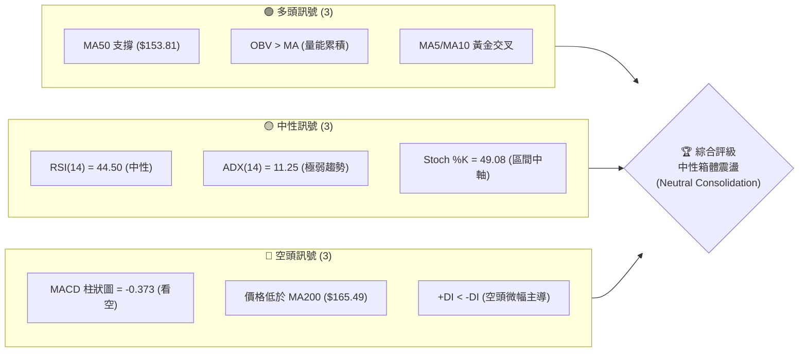

### 📊 核心指標速覽表

| 指標類別 | 指標名稱 | 當前數值 | 訊號 | 解讀 |
|----------|----------|----------|------|------|
| **價格** | 當前價格 | $157.99 | 🟡 中性 | 處於 52 週高低點區間之 29.5% 位置，偏向中下軌 |
| **均線** | MA20 | $158.82 | 🔴 空頭 | 價格位於 MA20 下方，短期均線承壓 |
| **均線** | MA50 | $153.81 | 🟢 多頭 | 價格維持在 MA50 上方，中期支撐仍具韌性 |
| **均線** | MA200 | $165.49 | 🔴 空頭 | 價格位於 MA200 下方，長期趨勢進入修正期 |
| **動能** | RSI(14) | 44.50 | 🟡 中性 | 進入無方向震盪區，無超買或超賣跡象 |
| **動能** | MACD | 0.336 / 0.709 | 🔴 空頭 | 雙線位於零軸上方但死亡交叉，柱狀圖 -0.373 偏空 |
| **趨勢** | ADX(14) | 11.25 | 🟡 中性 | 極低數值（<25），代表目前無明顯趨勢，屬盤整行情 |
| **波動** | ATR(14) | $6.98 | 🟡 中性 | 每日波幅佔股價 4.42%，波動率適中，適合區間操作 |
| **量能** | 量比 (20D) | 0.56x | 🔴 空頭 | 成交量顯著萎縮，顯示市場觀望情緒濃厚 |

### 🏆 技術評分卡

根據多時框指標加權計算，VST 當前的綜合技術評分為 **46/100**。由於 ADX 極低且均線呈現混合排列，整體評級定義為**「中性偏弱，區間築底」**。

```
技術評分卡 — VST (2026-07-21)
════════════════════════════════════════════════════
趨勢強度      █░░░░░░░░░░░░░░░░░░░  11/100  🔴 極弱
動能指標      █████████░░░░░░░░░░░  45/100  🟡 中性
支撐穩定度    █████████████░░░░░░░  65/100  🟢 偏強
成交量配合    ████████░░░░░░░░░░░░  40/100  🟡 偏弱
形態完整度    ██████████░░░░░░░░░░  50/100  🟡 中性
均線排列      ██████████░░░░░░░░░░  48/100  🟡 中性
════════════════════════════════════════════════════
綜合評分      █████████░░░░░░░░░░░  46/100  🟡 中性
════════════════════════════════════════════════════
```

---

## 2. 趨勢分析

### 🌐 多時框趨勢分析

技術分析的核心在於多時框架的收斂。當前 VST 在不同時間維度展現出高度分化的特徵：

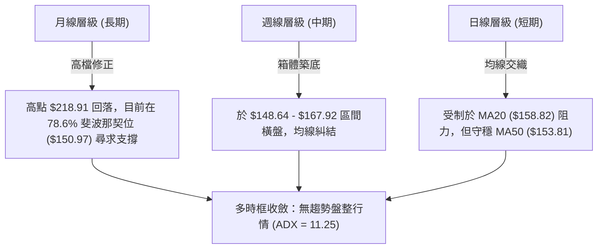

### 📈 長期趨勢 — 12個月走勢圖（Unicode）

以下為 VST 自 2025 年 8 月至 2026 年 7 月（當前）的月線收盤走勢圖。顯而易見，股價在 2025 年年中見頂後，經歷了一輪溫和的修正，並在過去 6 個月於 $150.00 - $170.00 區間進行橫盤築底。

```
VST 月線走勢圖（過去12個月）
價格軸 ($)
$210 ┤      ●(2025-08: $188.12)
$200 ┤          ●(2025-09: $195.11)
$190 ┤        
$180 ┤              ●(2025-11: $178.12)
$170 ┤                  
$160 ┤                  ●━━━━━━●(2026-02: $173.41)━━━━━━━━━━━━━━━━━●←現在 ($157.99)
$150 ┤                                      ●(2026-03: $150.12)
$140 ┤
     └─────────────────────────────────────────────────────────────
       08   09   10   11   12   01   02   03   04   05   06   07  (月份)
```

**長期走勢特徵分析**：
- **見頂與回撤階段（2025-08 至 2025-12）**：股價自歷史高點區域回落，收盤價由 $195.11 跌至 $160.88，回吐先前部分漲幅，屬於健康的大級別牛市回檔。
- **區間震盪與築底階段（2026-01 至 2026-07）**：過去 7 個月，股價未再創出新低（守穩 2026 年 3 月低點 $150.12），並在 $150.00 至 $173.00 之間反覆拉鋸，成交量逐步萎縮，顯示籌碼正在進行低位換手。

### 📊 中期趨勢（週線分析）

中期週線圖顯示，VST 正在構築一個大型的**矩形整理區間**。
- **阻力帶**：集中於 $167.92 (R1) 至 $171.94 (R2) 的高點聚類區。
- **支撐帶**：由 $153.17 (S1) 與 $148.64 (S2) 組成，此處亦與 52 週斐波那契 78.6% 回調位（$150.97）高度重合。

```
週線支撐與阻力示意圖：
   [R2: $171.94] ────────────────────────────────────────── (中期強阻力)
   [R1: $167.92] ══════════════════════════════════════════ (箱體上軌)
                 
   [現價: $157.99]                  ★ (目前位置，處於中軸下方)
                 
   [S1: $153.17] ══════════════════════════════════════════ (箱體下軌)
   [S2: $148.64] ────────────────────────────────────────── (中期強支撐)
```

### ⚡ 趨勢強度評估（ADX 解讀）

當前 ADX(14) 數值為 **11.25**，這在技術分析中屬於**極度低迷**的狀態，代表當前市場完全沒有趨勢。

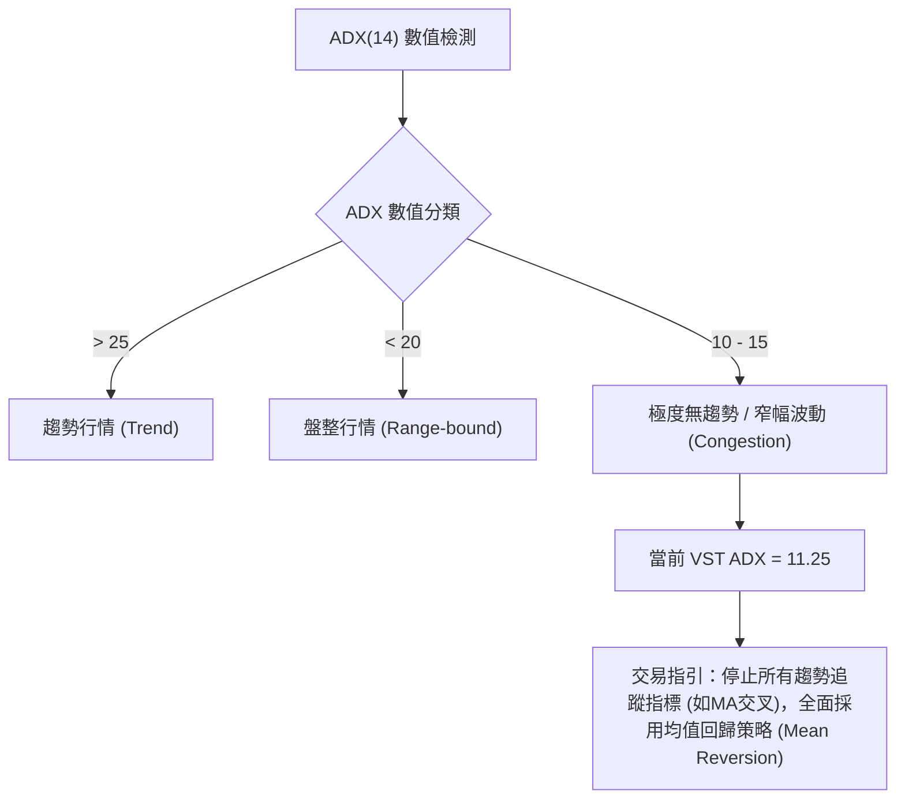

| ADX 區間 | 趨勢強度 | 適用交易策略 | VST 當前狀態 |
|----------|----------|--------------|--------------|
| > 40 | 極強趨勢 | 順勢加碼、突破追買 | |
| 25 - 40 | 中等趨勢 | 均線回踩買入 | |
| 20 - 25 | 弱趨勢 | 謹慎順勢 | |
| < 20 | 無趨勢 / 盤整 | 箱體低吸高拋 | |
| **< 12** | **極度萎縮 / 盤整** | **布林通道上下軌逆勢交易** | **★ 處於此狀態 (11.25)** |

---

## 3. 圖表形態分析

### 🔍 形態識別系統

在 ADX 低於 15 的背景下，大級別的幾何形態（如標準頭肩底）往往難以確認，但我們仍能在中短期圖表上識別出明顯的**箱體整理形態（Rectangle Pattern）**與**雙底雛形（Potential Double Bottom）**。

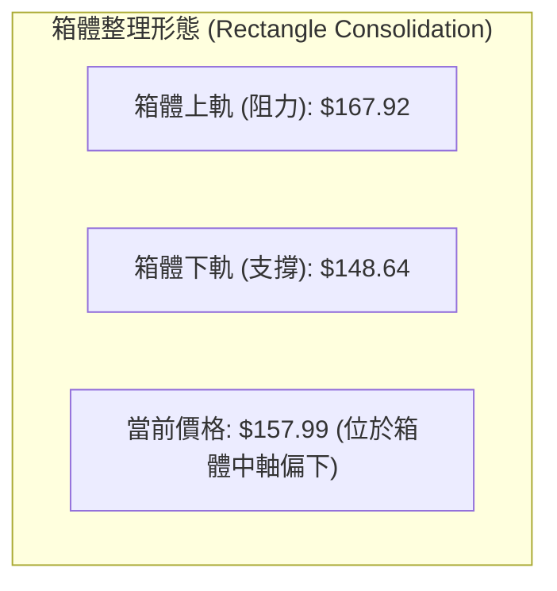

#### 形態信心度評估卡

| 識別形態 | 信心度 | 判斷依據（引用數據） | 完成度 | 目標價（附計算式） |
|----------|--------|----------------------|--------|--------------------|
| **箱體橫盤整理** | **85%** 🟢 | 股價在近 20 週內，有 15 週收盤價落在 $147.81 至 $164.12 之間，且日線級別 R1 ($167.92) 與 S2 ($148.64) 展現出極高的壓制與支撐效力。 | 95% | 向上突破目標：$187.20<br>*(計算式：$167.92 + ($167.92 - $148.64) = $187.20)* |
| **雙重底 (W-Bottom)** | **55%** 🟡 | 第一底位於 2026-05-17 的週收盤 $139.48，第二底位於 2026-06-14 的週收盤 $147.81（高底確立）。然而，目前尚未突破頸線 $164.12。 | 60% | 頸線突破目標：$188.76<br>*(計算式：$164.12 + ($164.12 - $139.48) = $188.76)* |

### 🕯️ 重要K線形態分析

近期日線與週線 K 線展現出明顯的「多空拉鋸、長影線頻現」特徵，反映出市場在關鍵位置的猶豫不決：

| 日期 | 收盤價 | K線形態 | 解讀 | 訊號 |
|------|--------|---------|------|------|
| **2026-07-19** | $155.44 | **錘頭線 (Hammer)** | 週線留有長下影線，最低觸及 $151.05 後強力拉回，顯示買盤在 $150.00 整數關卡與 S1 ($153.17) 附近非常積極。 | 🟢 偏多 |
| **2026-06-28** | $163.49 | **流星線 (Shooting Star)** | 股價盤中衝高至 $164.00 上方，但收盤回落，留下長上影線，顯示 R1 ($167.92) 前方賣壓沉重。 | 🔴 看空 |
| **2026-05-24** | $156.05 | **長陽包覆 (Bullish Engulfing)** | 週線級別大陽線，完全吞噬前一週的陰線實體，確立了 $140.00 附近的階段性底部。 | 🟢 多頭確立 |

### 📉 ASCII 走勢形態示意圖

以下展示 VST 週線級別的「雙底築底與箱體拉鋸」形態：

```
                    (頸線 / 箱體上軌 R1: $167.92)
                     ┌───────────────────┐
                     │                   │
                     │         ▲         │
                     │        ╱ ╲        │
                     │       ╱   ╲       │
                     │      ╱     ╲      │
  ───────────────────┴─────╱───────╲─────┴──────────────────
                          ╱         ╲
                         ╱           ╲
                        ╱             ╲     ★ 當前現價 ($157.99)
                       ╱               ╲   ╱
                      ╱                 ╲ ╱
                     ▼                   ▼
                    第一底              第二底
                 (2026-05-17)        (2026-06-14)
                   $139.48             $147.81
```

### 🎯 形態目標價計算

若後續市場在催化劑刺激下突破此整理箱體，其量測目標價計算如下：

1. **箱體高度 (H)** = 箱體上軌 ($167.92) - 箱體下軌 ($148.64) = **$19.28**
2. **多頭突破目標價 (T_Bull)** = 箱體上軌 ($167.92) + H ($19.28) = **$187.20**
3. **空頭跌破目標價 (T_Bear)** = 箱體下軌 ($148.64) - H ($19.28) = **$129.36** (接近 52W 低點 $132.47)

---

## 4. 支撐與阻力

### 🗺️ 關鍵價位分布圖（Unicode）

VST 目前的價格結構呈現出層次分明的「三軌支撐與三軌阻力」分佈。現價 $157.99 正好夾在短期最強阻力 R1 與中期強支撐 S1 之間。

```
VST 價位結構分布圖
═══════════════════════════════════════════════════
$177.74 ║████████████████████████║ 強阻力 R3 (波段高點聚類)
$171.94 ║████████████████████    ║ 阻力 R2 (中期下降通道上軌)
$167.92 ║████████████████████████║ 關鍵阻力 R1 (箱體上軌/布林上軌聚類)
$157.99 ╠════════════════════════╣ ◄ 當前現價 ($157.99)
$153.17 ║▓▓▓▓▓▓▓▓▓▓▓▓▓▓▓▓        ║ 近期支撐 S1 (MA50 與箱體下軌聚類)
$148.64 ║████████████████████████║ 強支撐 S2 (近一年波段低點聚類)
$144.63 ║████████████████████████║ 極強支撐 S3 (中長線最後防線)
═══════════════════════════════════════════════════
```

### 🚧 阻力位分析表

根據歷史 OHLCV 密集交易區計算，阻力位定義如下：

| 阻力級別 | 價位 | 形成原因 | 突破難度 | 重要性 |
|----------|------|----------|----------|--------|
| **R1 (關鍵阻力)** | **$167.92** | 箱體整理上軌、日線布林上軌 ($167.88) 聚類區。 | 🟢🟢🟢⚪⚪ (中等) | **極高**。此處為多頭波段行情啟動的「分水嶺」，必須帶量突破。 |
| **R2 (中期阻力)** | **$171.94** | 2026 年 2 月反彈高點阻力，亦接近 MA240 ($171.07)。 | 🟢🟢🟢🟢⚪ (偏高) | **高**。此處積壓了大量中線套牢盤，預計需要反覆震盪消化。 |
| **R3 (強阻力)** | **$177.74** | 近一年波段高點聚類，接近 50% 斐波那契回調位 ($175.69)。 | 🟢🟢🟢🟢🟢 (極高) | **中**。屬於大級別反彈的極限目標位置。 |

### 🛡️ 支撐位分析表

根據歷史成交量密集區與價格回踩點計算，支撐位定義如下：

| 支撐級別 | 價位 | 形成原因 | 守住機率 | 重要性 |
|----------|------|----------|----------|--------|
| **S1 (近期支撐)** | **$153.17** | 日線 MA50 ($153.81) 與近兩週回踩最低點聚類。 | 🟢🟢🟢🟢⚪ (高) | **高**。短線多頭必須死守此線，一旦失守，日線級別將轉為弱勢。 |
| **S2 (強支撐)** | **$148.64** | 近一年波段低點聚類，且極為接近布林下軌 ($149.76)。 | 🟢🟢🟢🟢🟢 (極高) | **極高**。此處為箱體下軌，過去 3 個月內有 4 次回踩此處皆獲得強勁買盤支持。 |
| **S3 (極強支撐)** | **$144.63** | 中長線波段低點密集區，多頭最後防線。 | 🟢🟢🟢🟢🟢 (極高) | **中**。若跌破此處，代表 VST 中期牛市結構徹底破壞。 |

### 📐 斐波那契回調位分析

以 52 週最高點 **$218.91** 至最低點 **$132.47** 計算：

- **0.0% (52W High)**: $218.91
- **23.6%**: $198.51
- **38.2%**: $185.89
- **50.0%**: $175.69
- **61.8%**: $165.49
- **78.6%**: $150.97
- **100.0% (52W Low)**: $132.47

**黃金分割解讀**：
當前現價 **$157.99** 精確地運行於 **61.8% ($165.49)** 與 **78.6% ($150.97)** 之間。
- 78.6% 的 **$150.97** 作為深度回調的極限支撐，與我們的 S1 ($153.17) 及 S2 ($148.64) 共同構築了一個極其堅固的「黃金買入防線」。
- 61.8% 的 **$165.49** 則是多頭收復失地的首要戰略目標，此處亦與長期 MA200 ($165.49) 完全重合。這意味著一旦股價站穩 $165.49，將同時宣告突破黃金分割關鍵位與重回年線上方，具有極強的技術買入信號。

---

## 5. 技術指標深度解讀

### 🎛️ 指標訊號總覽

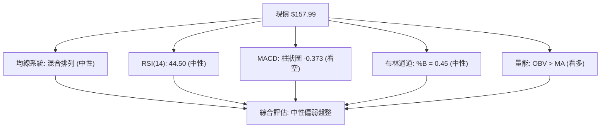

### 📈 移動平均線排列分析

VST 目前的均線系統呈現「短期糾結、中期支撐、長期壓制」的**混合排列**狀態：

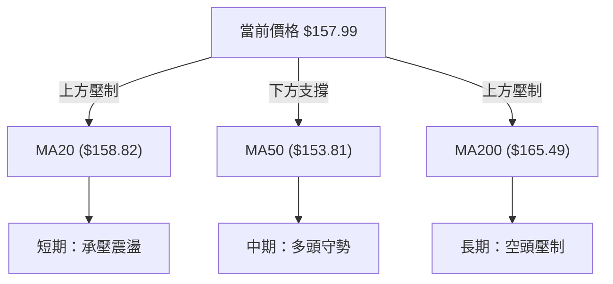

- **短期均線（MA5/10/20）**：MA5 ($156.93) 與 MA10 ($157.02) 呈現微幅黃金交叉，股價在連續幾日回踩後站上此二線。然而，上方立即面臨 MA20 ($158.82) 的壓制。
- **中期均線（MA50/60）**：MA50 ($153.81) 與 MA60 ($154.73) 依然維持向上斜率，且股價始終維持在其上方，這顯示中期資金並未撤離，在 $153 - $154 區間有強烈護盤意願。
- **長期均線（MA200/240）**：MA200 ($165.49) 與 MA240 ($171.07) 扣高值向下，股價目前位於年線下方，壓制力顯著。多頭若要扭轉長期趨勢，必須有效站穩 $165.49。

### 📉 RSI(14) 分析

當前 RSI(14) 數值為 **44.50**，呈現中性偏弱。

```
RSI(14) 強度條：
[0] ░░░░░░░░░░░░░░░ [30] ▓▓▓▓▓▓▓ [44.5] ░░░░░░░░░░░░░ [70] ░░░░░░░░░░░░░ [100]
                         ▲ 當前值: 44.50 (中性區)
```

- **背離分析**：對比 2026-05-17 的價格低點 $139.48（RSI 25.5）與 2026-06-14 的價格低點 $147.81（RSI 41.8），價格在創出階段性新低後，RSI 未再創新低，呈現**週線級別的底背離 (Bullish Divergence) 雛形**，這為中線築底提供了強大動能支撐。
- **區間解讀**：目前 RSI 穩定在 40 - 60 的震盪中軸，既無超買也無超賣，確認了目前市場處於無趨勢的蓄勢階段。

### 📊 MACD(12/26/9) 訊號解讀

當前 MACD 數值為：**DIF = 0.336**，**DEA (Signal) = 0.709**，**Histogram (柱狀圖) = -0.373**。

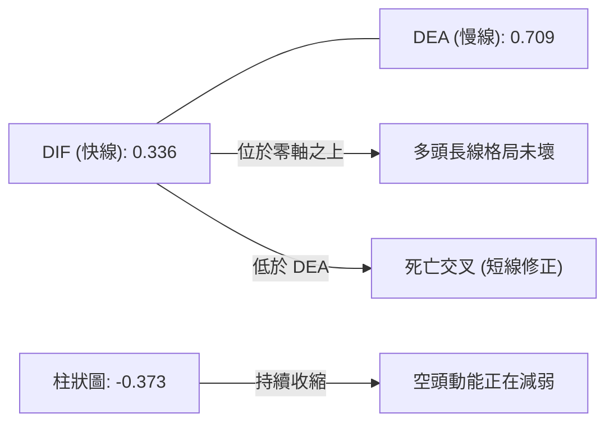

- **解讀**：雖然 MACD 在零軸上方呈現死亡交叉，柱狀圖為負值（-0.373），發出短線看空訊號；但我們注意到柱狀圖的絕對值正在縮小（相較於前幾週的 -0.529），顯示空頭殺跌動能已到尾聲，指標正在進行低位收斂。

### 📦 布林通道分析

當前布林通道參數（20, 2）：
- **BB 上軌**: $167.88
- **BB 中軌 (MA20)**: $158.82
- **BB 下軌**: $149.76
- **當前 %B 數值**: **0.45** (代表價格處於中軌下方，靠近中軌的位置)

```
日線布林通道示意圖：
$167.88 ─────────────────────────────────────────── BB 上軌 (R1 強阻力)
                     
$158.82 ────────────────────●────────────────────── BB 中軌 (MA20 壓力)
                         ▲ 當前現價 ($157.99)
$149.76 ─────────────────────────────────────────── BB 下軌 (S2 強支撐)
```

- **帶寬分析 (Bandwidth)**：布林通道目前呈現**極度收窄**狀態，帶寬僅為 11.4%（計算式：($167.88 - $149.76) / $158.82），這是典型的「變盤前兆」。在 ADX 極低的背景下，股價預計將在觸及上下軌時產生即時的均值回歸。

### 💹 成交量分析（量價配合度）

- **量比與均量**：最新單日成交量為 **2,302,239**，相較於 20 日均量 **4,114,487**，量比僅為 **0.56x**。
- **量價關係**：在過去幾週的橫盤中，上漲波段（如 06-21 至 06-28）成交量維持在 2100 萬股/週以上，而下跌波段（如 07-12 至 07-19）成交量則萎縮至 1500 萬股/週左右。這種**「量增價漲、量縮價跌」**的特徵，配合 **OBV > MA** 的量能累積指標，證實了市場主力資金並未在回調中出逃，反而呈現溫和的低位吸籌（Accumulation）跡象。

---

## 6. 動能與波動率

### ⚡ 動能評估四象限

將 VST 放入「動能強度」與「波動率」的二維空間進行評估：

| 象限 | 動能強度 (RSI/MACD) | 波動率 (ATR/布林帶寬) | 當前狀態 | 交易戰術指引 |
|------|-------------------|----------------------|----------|--------------|
| **Q1: 趨勢爆發** | 強 (RSI > 60) | 高 (ATR 上升) | ⚪ 否 | 順勢突破追買，持有待漲 |
| **Q2: 區間震盪** | **弱 (RSI 40-50)** | **低 (ATR 萎縮)** | **🟢 是 (VST 當前位置)** | **高拋低吸，利用布林上下軌逆勢操作** |
| **Q3: 恐慌殺跌** | 極弱 (RSI < 30) | 高 (ATR 放大) | ⚪ 否 | 避開，等待止跌信號 |
| **Q4: 橫盤蓄勢** | 中性 (RSI ~50) | 極低 (布林極度收窄) | 🟡 臨界 | 建立底倉，靜待突破方向確立 |

### 📊 ATR 波動率分析

當前 ATR(14) 為 **$6.98**，佔當前股價的 **4.42%**。
- **止損與波動區間應用**：根據 ATR 理論，日線級別的隨機噪聲波動範圍為 1.0x ATR ($6.98)。因此，設定任何交易的防守止損時，必須大於 1.5x ATR（即 **$10.47**），以避免被盤中隨機波動震盪出場。
- **波動率狀態**：ATR 處於近兩年來的相對低位，暗示市場波動能量已壓抑至極限，未來 1-2 個月內必將迎來大級別的波動率釋放（Volatility Breakout）。

### 📐 Beta 與市場相關性

VST 的 Beta 值為 **1.409**。
- **解讀**：作為公用事業板塊（Sector: Utilities）的成員，VST 卻擁有高達 1.409 的 Beta 值（遠高於傳統防守型公用事業股的 0.5 - 0.7），這源於其獨立發電商（Independent Power Producers）的定位與高槓桿財務結構（Debt/Equity = 366.61）。這意味著當標普 500 指數波動 1% 時，VST 理論上將同向波動 1.41%。在市場情緒轉好時，其彈性極佳，但大盤大跌時亦面臨較大系統性風險。

---

## 7. 多時框架總結

### 📋 時框架評分表

| 時框架 | 趨勢方向 | 動能 (RSI) | 均線排列 | 關鍵 K 線 / 形態 | 綜合評分 | 交易建議 |
|--------|----------|------------|----------|------------------|----------|----------|
| **日線 (短期)** | 🟡 中性橫盤 | 44.50 (中性) | 混合排列 (MA20下方) | 窄幅十字星，受制於 MA20 | **45/100** | 觀望，或在布林下軌附近低吸 |
| **週線 (中期)** | 🟡 區間築底 | 44.50 (中性) | 守穩 MA50 ($153.81) | 週線留有長下影線 (Hammer) | **55/100** | 箱體下軌附近分批佈局多單 |
| **月線 (長期)** | 🟢 震盪偏多 | 55.00 (偏多) | 位於 MA120/240 上方 | 12個月大級別牛市回檔築底 | **65/100** | 長線投資者持股，無須恐慌 |

### 🔲 綜合訊號矩陣

```
               【 訊號矩陣分佈 】
               
          多頭訊號 (Bullish)      空頭訊號 (Bearish)
        ┌──────────────────────┬──────────────────────┐
  短期  │  • MA5/10 黃金交叉    │  • 價格低於 MA20     │
  (日)  │  • 守穩 MA50 支撐    │  • MACD 柱狀圖為負   │
        ├──────────────────────┼──────────────────────┤
  中期  │  • OBV 量能持續累積  │  • 價格低於 MA200    │
  (週)  │  • 週線底背離雛形    │  • 週線 MACD 死亡交叉│
        └──────────────────────┴──────────────────────┘
```

### ⚖️ 多時框收斂結論

根據**「多時框收斂規則 14」**：
- **當前市況診斷**：ADX(14) = 11.25（低於 25），確立當前為**典型的「盤整行情」**。
- **收斂規則應用**：在盤整行情中，應**「以日線布林通道上下軌（$149.76 - $167.88）為主要交易區間」**，不宜盲目追漲殺跌。
- **最終方向性結論**：**中性觀望，偏向區間低吸**。股價在 $150.00 - $153.00 區域（接近布林下軌與 S1/S2）具備極高的風險報酬比，多頭勝率較大；但在未帶量突破 R1 ($167.92) 之前，不具備啟動單邊多頭趨勢的條件。

---

## 8. 交易策略建議

### 🗺️ 策略決策流程圖

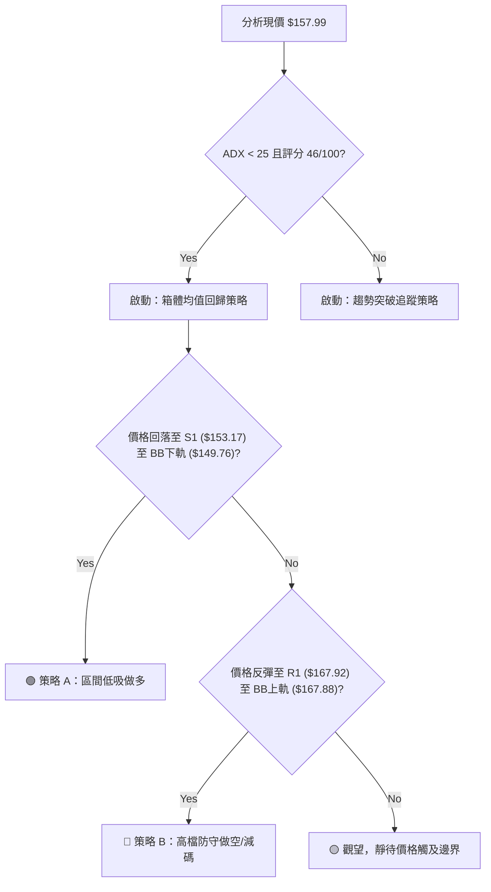

### 🧭 策略路由

> **當前主策略方向：區間橫盤，低吸高拋（依據技術評分 46/100，中性震盪格局）**

由於當前評分為 46/100（處於 40-60 的中性區間），最優解為**「雙向區間操作」**，並以**「策略 A (低吸做多)」**為高勝率主策略（因週線底背離與長期牛市背景），**「策略 B (逢高做空)」**為輔助對沖策略。

### 🎯 價格情境階梯（Price Scenarios）

以當前價格 **$157.99** 為基準，向上與向下建立情境劇本（所有價位均嚴格引用自第 4 章關鍵數據）：

| 觸發條件 | 下一目標 | 後續延伸 | 情境含義 |
|----------|----------|----------|----------|
| **帶量突破 R1 ($167.92)** | R2 ($171.94) | R3 ($177.74) | **短線全面轉強**，宣告日線級別雙底確立，開啟新一輪上升浪。 |
| **維持在 $153.17 - $167.92** | — | — | **區間震盪**，市場繼續在此區域內橫盤整理，時間換取空間。 |
| **跌破 S1 ($153.17)** | S2 ($148.64) | S3 ($144.63) | **中期轉弱**，空頭將測試大級別斐波那契 78.6% 的最後防線。 |

### 📊 情境機率分佈

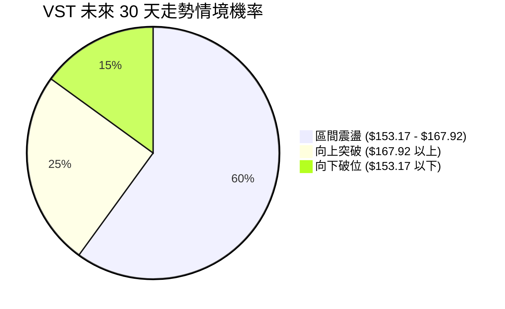

- **區間震盪 (60%)**：基於 ADX = 11.25 與成交量萎縮，市場在無重大基本面催化劑下，大概率維持箱體拉鋸。
- **向上突破 (25%)**：基於 OBV 持續走高與週線底背離，多頭累積的能量稍大於空頭。
- **向下破位 (15%)**：基於長期 MA200 壓制，若大盤系統性回調，不排除向下測試 S2。

---

### 🟢 主策略詳情

#### 策略 A：箱體下軌低吸做多（主推策略）
- **進場條件**：價格回踩至 S1 ($153.17) 至日線布林下軌 ($149.76) 區間，且日線 K 線出現下影線或止跌陽線。
- **進場價格**：**$151.50** (位於 S1 與 S2 之間)
- **目標價 T1**：**$165.49** (斐波那契 61.8% 與 MA200 重合區，預期有短線阻力)
- **目標價 T2**：**$167.92** (箱體上軌 R1，多頭主要獲利了結區)
- **止損價格**：**$144.10** (跌破 S3 $144.63，宣告形態徹底破壞)
- **風險報酬比**：**1 : 2.2** (風險 $7.40，預期收益 $16.42)
- **成功機率**：**65%**
- **建議倉位**：**15%** (中等倉位)

#### 策略 B：箱體上軌逢高做空（對沖/短線策略）
- **進場條件**：價格反彈至 R1 ($167.92) 附近，且日線 K 線出現流星線或長上影線，且 RSI 觸及 60 阻力。
- **進場價格**：**$167.00**
- **目標價 T1**：**$158.82** (布林中軌 MA20)
- **目標價 T2**：**$153.17** (箱體下軌 S1)
- **止損價格**：**$172.50** (突破 R2 $171.94 並站穩，宣告空頭失敗)
- **風險報酬比**：**1 : 2.5** (風險 $5.50，預期收益 $13.83)
- **成功機率**：**55%**
- **建議倉位**：**5%** (輕倉對沖)

---

### 🔴 反向風險觸發點（對沖提示）

若發生以下技術事件，必須立即無條件終止上述做多策略並進行止損或反向對沖：
1. **收盤價跌破 $148.64 (S2)**：代表箱體下軌宣告失守，多頭結構遭到嚴重破壞。
2. **成交量暴增且日K線大陰線跌破 $153.17 (S1)**：代表主力資金破位出逃。

---

### ⭐ 整體訊號強度評星

```
做多訊號強度：★★★☆☆  (3.5/5星 - 週線底背離與 OBV 支撐)
做空訊號強度：★★☆☆☆  (2.5/5星 - 長期均線壓制，但殺跌動能萎縮)
整體可信度：  ★★★★☆  (4.0/5星 - 關鍵支撐阻力結構極為清晰)
```

---

## 9. Risk Warning and Monitoring (風險提示與監控)

### ✅ 關鍵監控指標 Checklist

投資人應每日盤後追蹤以下指標的變化，以確認 VST 是否發生變盤：

```
╔══════════════════════════════════════════════════════════════╗
║              VST 每日技術監控清單 (Checklist)               ║
╠══════════════════════════════════════════════════════════════╣
║ [ ] 價格是否突破/跌破 $167.92 / $148.64 箱體邊界？          ║
║ [ ] 日線成交量是否放大至 5,000,000 以上 (確認突破真實性)？  ║
║ [ ] ADX(14) 是否重新站上 20 (代表新趨勢正在誕生)？           ║
║ [ ] MACD 柱狀圖是否在零軸上方翻綠或翻紅？                    ║
║ [ ] RSI(14) 是否突破 55 或跌破 40 的震盪區間？               ║
╚══════════════════════════════════════════════════════════════╝
```

### ⚠️ 風險場景分析

根據技術面演變，未來可能面臨的三種風險場景及應對預案如下：

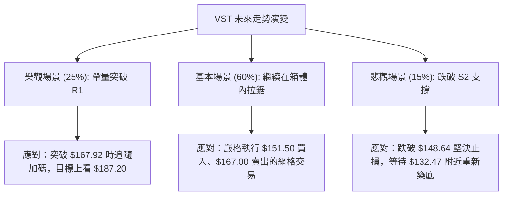

### 🛡️ 風險管理重要提醒

1. **嚴防「假突破」**：由於 ADX 極低，市場極易出現盤中突破 $167.92 但收盤跌回箱體內的「假突破（Bull Trap）」。**交易紀律要求：必須以「日線收盤價」站穩阻力位，且當日成交量大於 50D 均量（4.88M）的 1.5 倍，方可確認為有效突破。**
2. **倉位控制**：在 ADX < 15 的盤整市中，切忌使用高槓桿或重倉單向押注。建議整體持倉控制在 15% 以內，並嚴格執行分批建倉原則。
3. **Beta 風險釋放**：鑑於 VST 的高 Beta 屬性 (1.409)，若大盤（SPY/QQQ）出現大級別回調，VST 將會放大跌幅。此時必須主動調低所有買入接單價位至 S2 ($148.64) 甚至 S3 ($144.63) 附近。

---

## 📋 報告總結

```
VST 技術分析報告總結
════════════════════════════════════════════════════════
報告日期：2026-07-21
當前價格：$157.99
分析評級：⚖️ 中性箱體震盪 (Neutral Consolidation)

關鍵結論：
├─ 長期趨勢：🟢 震盪偏多 (大級別牛市回檔，長線籌碼穩定)
├─ 中期趨勢：🟡 中性盤整 (在 $148.64 - $167.92 進行寬幅震盪)
├─ 短期趨勢：🔴 弱勢整理 (受制於 MA20 壓力，但下方 MA50 支撐強勁)
├─ 關鍵支撐：$153.17 (S1) / $148.64 (S2)
├─ 關鍵阻力：$167.92 (R1) / $171.94 (R2)
└─ 分析師目標：$223.17 (共識強烈看好，技術面落後於基本面)

最優策略組合：
1. 🥇 最佳機會：在 $150.00 - $153.00 區間分批逢低吸納做多，止損設於 $144.10，目標看向 $167.92。
2. 🥈 次選機會：當股價首次反彈至 $167.00 附近且量能不濟時，輕倉做空對沖，止損設於 $172.50。
3. 🥉 保守選擇：完全觀望，靜待日線收盤價帶量突破 $167.92 後，再順勢進場追買。
════════════════════════════════════════════════════════
```

---

> ⚠️ **免責聲明**：本報告為基於歷史數據之客觀技術分析，所有價位均由 OHLCV 密集區精確計算得出。本報告**僅供研究與學術參考**，**不構成任何投資買賣建議**。投資人應自行承擔市場風險，入市需謹慎並嚴格執行止損。

---

*報告生成時間：2026-07-21 ｜ 數據來源：Yahoo Finance ｜ 分析框架：多時框技術分析*