<details>
<summary>📊 靜態圖表 (點擊展開)</summary>
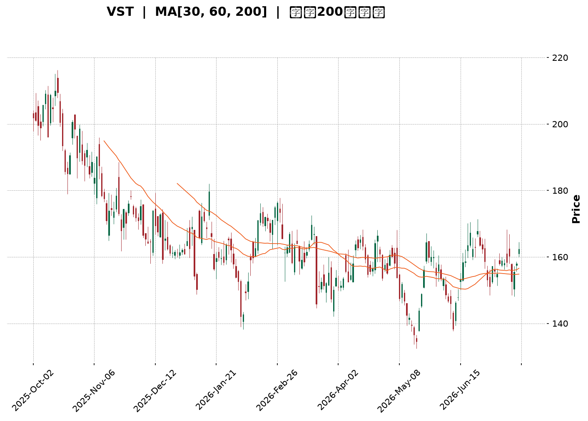
</details>

<html>
<head><meta charset="utf-8" /></head>
<body>
    <div style="height:500px; width:100%;">                        <script>window.PlotlyConfig = {MathJaxConfig: 'local'};</script>
        <script charset="utf-8" src="https://cdn.plot.ly/plotly-3.7.0.min.js" integrity="sha256-jvTGqxNp8AGWEcvNLVuKr+8j5dGe9Yw51LQkmDH+IYA=" crossorigin="anonymous"></script>                <div id="candlestick-chart" class="plotly-graph-div" style="height:100%; width:100%;"></div>            <script>                window.PLOTLYENV=window.PLOTLYENV || {};                                if (document.getElementById("candlestick-chart")) {                    Plotly.newPlot(                        "candlestick-chart",                        [{"close":{"dtype":"f8","bdata":"AAAAwOc5aUAAAACg3yRpQAAAAMCF8mhAAAAA4FjZaEAAAAAgMLZpQAAAAGAhJGpAAAAA4GSBaEAAAABAyhVqQAAAAMALlWlAAAAAoDc\u002fakAAAABg4DBqQAAAAGB6EGlAAAAA4OYtaEAAAADg4jdnQAAAAODlIWdAAAAAQHHSZ0AAAABATRRpQAAAAIAmz2hAAAAAAJa5Z0AAAABgYdFoQAAAAACLnWdAAAAAIJxwZ0AAAAAgqQdoQAAAAKAHH2dAAAAAYFiTZ0AAAACAVvtmQAAAAMCmxmdAAAAAAPlvZ0AAAADAV01mQAAAAED7MGZAAAAAwCZbZUAAAABg5b5lQAAAAGDGyGVAAAAAwEq2ZUAAAACgtExmQAAAAAA3omVAAAAAgIH8ZEAAAACAPM1lQAAAAAA1RGVAAAAA4CICZkAAAABgyENmQAAAAIBvnWVAAAAAQLN6ZUAAAAAABV5lQAAAAIDf6mVAAAAAIEHPZEAAAAAAy61kQAAAACAMhGRAAAAAAIWPZEAAAAAgB7xlQAAAAECgLGVAAAAAwKvxZEAAAABgYZdlQAAAAEDP6WNAAAAAIGOvZEAAAADgUktkQAAAAAD6I2RAAAAA4ConZEAAAAAgbDBkQAAAAOAqJ2RAAAAAoJcsZEAAAADAe0VkQAAAAEBRHGRAAAAAAMaYZEAAAABAYE9kQAAAAGD+IWVAAAAAQI1FY0AAAADA58ViQAAAAAAnvWRAAAAAIFODZUAAAACATl5lQAAAAIAfEGVAAAAAYNp1ZkAAAAAAfsRkQAAAAIATjGNAAAAAYIPyY0AAAADgXP1jQAAAAEC09WNAAAAAYObLY0AAAACA0XlkQAAAAGDbpWRAAAAAADVEZEAAAACAOL1jQAAAAKCzOmNAAAAAQH4SY0AAAADgDsRhQAAAACCc1WFAAAAAoJanYkAAAAAgiRFjQAAAAEAc5WNAAAAAQKn2Y0AAAABAzVRkQAAAAICKYGVAAAAAQG2mZUAAAACgLkNlQAAAAIDFgGVAAAAAIKtdZUAAAABAyepkQAAAAGCwZGVAAAAA4AncZUAAAABgoQpmQAAAAAAhrWVAAAAAwAaxZEAAAAAAIChkQAAAAEAZXWRAAAAAgAXeZEAAAABAy8ZjQAAAACBlZWRAAAAAYEl+ZEAAAADAEddjQAAAAOB45GNAAAAAAF7QY0AAAAAgYTFkQAAAAIANfGRAAAAAQNI0ZUAAAACAEN1kQAAAAAAbOmJAAAAAgILiYkAAAACgNBBjQAAAACCK6WJAAAAA4MgCY0AAAAAAZ2hjQAAAAGCtamJAAAAAINXDYkAAAACg1DdjQAAAAKD+3mJAAAAAoBjsYkAAAADg4S5jQAAAAACBdWNAAAAAICoRY0AAAACAb1BjQAAAAABSv2NAAAAAwLN3ZEAAAADgyVZkQAAAAGCNqWRAAAAAwGdnZEAAAADgDuxjQAAAACAwVmNAAAAA4E5yY0AAAABgLpRjQAAAAIDYg2RAAAAAABvLZEAAAABAoRxkQAAAAMBlMmNAAAAAANGzY0AAAADgAmJjQAAAAIAAFGRAAAAAoPsEZEAAAABAMsJjQAAAAMCCN2NAAAAAAG5wYkAAAADAy\u002fpiQAAAAIBEVWJAAAAAYCPNYUAAAAAgc7ZhQAAAAGCCb2FAAAAAYOERYUAAAAAgsdBgQAAAAGCO+WFAAAAAgOObYkAAAACgpYFjQAAAAECOimRAAAAAIKL9Y0AAAACgyQFkQAAAAIAwAGRAAAAA4GRRY0AAAACA+LdjQAAAAKC3MmNAAAAAoIUvY0AAAACgqZFiQAAAAOA5VmJAAAAAIH9AYkAAAACAFEthQAAAACCcRWJAAAAAIAR6YkAAAAAgxSljQAAAACBszGNAAAAAwHPTY0AAAAAgrHBkQAAAAOBR6GRAAAAA4HpMZEAAAAAA11tkQAAAAOCj+GRAAAAAIK5vZEAAAAAAKUxkQAAAAAAp1GNAAAAAwB4lY0AAAACgmeFiQAAAAEAKp2NAAAAAIFx3Y0AAAACAPVpjQAAAACBcv2NAAAAAIIXbY0AAAAAA18NjQAAAAIDCzWNAAAAAIFwHZEAAAACA6xFjQAAAAIAUbmNAAAAAIK6\u002fY0AAAABgj0pkQA=="},"high":{"dtype":"f8","bdata":"472vKMuEaUDTbO3xgCpqQLdNeAEq4mlAOIVSC6tfaUD3\u002fSqWGbhpQCnXqoU6RmpApV+nzadvakAOJw5piSJqQCdbPKZ7\u002f2lASHr99nLkakAJ0689YwZrQIPizyq5JWpAHTzgMbqUaUBBhMYyxRNoQC8bM9DZlmdA8tQGbeTsZ0DDkj7+MCVpQPEw+n4XWmlAxpn+xOSPaEAVEzVLuPxoQMGQIp3av2hAMm8AbuECaEDEOS30LExoQHGn7kRE1mdAbmjz76f1Z0DK05OcvYpnQE87tJMKyWdA1+IjaXt\u002faEA1S5gyI2VnQKvztQ6KkWZAWwRKLxonZkAc0oN3HGhmQDOTz67QWGZAbUpl0+QVZkCszcOR6ZdmQOBfsGAokGdANKv70bWeZUAKcir2Jc9lQAljkbYrwGVAaRNZ+WggZkDGT5o7poBmQNAwCEPw92VAKDZFfAznZUB8rF3BIKRlQNEtulr4KWZAOLAaGrj8ZUDOOsi99+NkQEJvihqSJmVAR1AFX5uqZEDnWbflRMVlQGyLA6gcaGZAoli3XgqJZUD11CkxraZlQN4l9Xg8zWVAF9TpxZ9mZUCS8PoqX1ZlQP1gbxNqe2RAL5U2v\u002fJnZED\u002fqwsAXkRkQFPdHzGcUWRAFb3Taed3ZEBopEtOhlNkQCZgUjt6gWRAl4LCGAQaZUBN6ilQzmVlQGnwWiRIhGVADJZ2N+kFZUBE4m2b2GtjQI4l+vVAyGVAlbA93BMIZkCwF9cr6d5lQIyfx82lVmVA5ekMls3BZkB5BYeYu1RlQB0n6UxYsWRAHYwfVA8xZEAt7aXIkGFkQGW0bhl2TWRAw3xmeVObZEBt9h99ToVkQEoXNTU3w2RA91i+11btZECO8DJCeoFkQN1Hm5o88WNAB1yxJi+CY0CvAnb7jSdjQNPBIGRq8GFABHBsw+D6YkBU0nYeNWtjQKg1I34wH2RAXNZfYVObZEB38xIXDLhkQGaXeEj3ZWVAuLdmYDQFZkB0Xxa1geBlQDMz92oBg2VAYlVA6q6gZUBLNqGRtWtlQOd\u002f4ISaZmVAP7E+JIzuZUBZsPm7thdmQD6L6bstOmZAbfWfhQ4BZkCOuXgEhmJkQK80SUo5eGRAPyMoHjbwZED\u002fpuOZS\u002f1kQNZEY0yghWRAtbWpCWEKZUDnlar3M3FkQGr0MxD+V2RAPFB2lxeZZEDlyrbfkGFkQO3BNvYcoGRAR1FHKbqQZUAGcUJaOiRlQBLbDReXx2RAKP1\u002f0NJ1Y0CsEKnQTTxjQMnRnNhUt2NA\u002fbnmopsOY0AmnuYtO\u002f9jQDxygsOl1mNAkD6M8ELoYkC2cS484oNjQNmGlecAS2NAt5PhJIIcY0C6bzOgOD5jQAZrlYizImRA8CFS1q9JZEBedA6yD81jQAq8WAHZD2RAcz8APpChZEDlS+M8MMlkQGrTXFP41WRAFKUg4CMIZUCXUVpFQnpkQCk\u002fmrb9G2RAx48q73DbY0B3r+b7utRjQO2YHW70p2RAd8+tK+cFZUB7R3RdF2NkQOYAlq48HWRANaBGPgTtY0A5swBTUP1jQDpCyrjkRGRA\u002fCy2EUVyZEC+dxHoYlhkQFDM6dPxBGVAunURWhBZY0Ch9xobKhFjQKvCgvGbw2JADqrM9GlCYkBZFcYEB+NhQBJH9fiQnGFAIfOYCQlrYUBUh9ZTSBBhQKountBQFmJA6u50lUeiYkCkz2NbMKtjQKQP0fZO5WRAKSwZ0FGZZECFWNRkpGlkQLrBeGYEQmRAYUJ4NIHKY0DNoM\u002fOwxFkQI9n\u002fqkNtmNAvcvm+mI6Y0B4\u002f3EFYEJjQFtCdEHromJAiBs6wt\u002fCYkDg5SFTjvlhQOkUD+s5VmJAErqv1kPJYkB\u002f1sKDcWdjQL3COj8iKGRAFzVshM9GZEA+fr7hQUNlQAAAAAAAUGVAAAAAYGa6ZEAAAADgerRkQAAAAEAza2VAAAAAgML9ZEAAAABAM7NkQAAAAGBmrmRAAAAAgD2qY0AAAAAgrodjQAAAACCup2NAAAAAwB7tY0AAAADgpY9jQAAAAIDCJWRAAAAA4KMAZEAAAACAwu1jQAAAAGC4BmVAAAAAgBTeZEAAAABAM8NjQAAAAAAAqGNAAAAAgD3SY0AAAABguI5kQA=="},"hovertemplate":"\u003cb\u003e%{x|%Y-%m-%d}\u003c\u002fb\u003e\u003cbr\u003e\u958b: $%{open:.2f}\u003cbr\u003e\u9ad8: $%{high:.2f}\u003cbr\u003e\u4f4e: $%{low:.2f}\u003cbr\u003e\u6536: $%{close:.2f}\u003cextra\u003e\u003c\u002fextra\u003e","low":{"dtype":"f8","bdata":"ZPxDPFm8aEARns0lQhVpQAfjNb+Ok2hAHk+2pVJiaECPdm4YgeloQFXliD14j2lAycT8rcGAaEA2gyc+NPJoQOErv0ISEmlAW6BnUGixaUDnVw1NMfppQIyw6+oM52hA8fmLbzwAaEBVzavGnBlnQIO2mjb1XGZAt1H46xIeZ0Cz7faoXzloQFU2+QDsdWhAgwnm7I72ZkDdk4\u002f65JVnQPb2RQBCeGdAOMGQxkjYZkBPmRpXJGJnQAMTC6GD92ZAt8kzhzcFZ0AO\u002fgAvIllmQMSS3j3D+2VAPIO3+a3sZkD7hjtkMEJmQJvmmkvAEWZA77VxdQI6ZUCFHJLDlZxkQM3Mhz\u002fdjGVAP9iunng+ZUA7avQn669lQOQLbMwujWVAOW9MsYU4ZEDQxchNyKZkQGznWCrxpmRAJuVj17+LZUDrlP0AsihmQJLBoWYpf2VA2GOdAvBUZUDN+UFb+gdlQGFiKZpyOGVAf34viPK4ZEB1XER9JWxkQAiB0Xd\u002fgWRAsCshpL6\u002fY0BMKEZ68wpkQPYvPFXF2WRAHZXnBTPJZECz08ENf7tkQBI4B4ZWwWNAuxrsCNo\u002fZEDfJDC2zkBkQPrOqAUADWRAHAXODQb2Y0BygFEeiepjQLiA9lQL\u002fWNALxNWDXPvY0Apj52BsxNkQF1kbpzOGGRAdg2ICANuZEAMQKAs8PdjQMmXLFOAamRA2E\u002fhlLkjY0BCs5Ld6JhiQE+O6hKErWRA1kDeOBN0ZEDeLVbvKEtlQAmuEN7wsmRALFZKeppmZUCQ593C7VFkQEYDAqg0emNAE556oBArY0BSxNXYv9ZjQBerkikNsmNAsPTxMNyuY0DYo\u002fZ21rZjQHJvtn\u002fkFmRAlj1OEiXKY0BH+6sMrI1jQIlFp7JcM2NAx\u002fGicES\u002fYkBRynpTWFxhQJB\u002fnfq6RGFAoVD\u002f5WxgYkApz03r6WtiQHI0YcFATGNA3k8wSZrDY0BZju\u002fEo\u002f5jQOJ0cSW+IWRAmwu3bGUvZUBjWzTyiyRlQM3MzIwl+WRANvZZnRQRZUDS0w6JIphkQO4nQubHTWRAguzWdIszZUBvC+I+CHVkQG24oMxkTWVAxKe3neurZEBBm9HR2hFjQEu\u002fIcWj\u002fmNAZU26hXwnZEBsqukIoLtjQJ\u002flsfBQUmNAwyShRUF7ZEDUcTVgGldjQJfjhPaQiGNASUClUm+pY0AeewidYvVjQF\u002fyRRKHNWRAkW21qWOhZEDCtHuW3HhkQPzSGyIUFGJAMJxIpQmkYkDIghxR6KpiQOtADzJuxWJA9Usz7x9JYkASHMOaNfFiQNFCycSjTGJAiLqFiYLEYUDwOsZTBuZiQKymnUQfvWJAen379nO1YkBI+6kTPMJiQDOfqJ9UYmNAyEFPbe0OY0AxzB4PqxxjQGb9A\u002fX3DWNAg3SBR90DZEAs990siz1kQKeo3jM+TGRAlLte\u002fw5BZEDZnOTJJ8NjQEHjf09DPWNAUI5+14FWY0Cy3fMLFkljQAHJlGTbXWNA3MG7n2rQY0A2uGT+789jQFfgSKK1G2NA9swxDGRwY0Bi23ei01ZjQFKs7NAIp2NAeKEM5XLyY0AVqkw8MYxjQJ\u002f43E\u002fCMWNAWqwzWshYYkDweaqfWUJiQFPafhyaLmJATeGNoxNqYUDmVQIJPndhQFW5CMzAM2FAMX2ym4e1YEBFRir8Lo9gQFW9NsnAM2FA2zmWPa0VYkC8U+f8QNFiQAsFCaL1v2NAx0+ltPfFY0AkQ4fTJaxjQGrbzMAjlWNA1Ueoq8njYkCz\u002f\u002f2PURVjQFVD8ByOF2NAkYOr9Vu\u002fYkBRAlovZmliQIzw+hScRWJA9W52HfKqYUAAGpvX8jZhQGkiR6P+a2FACw9272tZYkDj7yV5PsFiQEGD35a4E2NANWUyT6+fY0AyEYV9zPljQAAAAMDMXGRAAAAA4KPkY0AAAAAAKfxjQAAAAOBRwGRAAAAAgBRmZEAAAADgoyBkQAAAAOBRkGNAAAAAoJnhYkAAAAAAAJBiQAAAAOBRAGNAAAAA4FFAY0AAAACAPepiQAAAAIA9rmNAAAAAoJmhY0AAAABgZoZjQAAAACAGoWNAAAAAgBS+Y0AAAACAk5BiQAAAAOB6hGJAAAAAQDNzY0AAAADgUQBkQA=="},"name":"\u50f9\u683c","open":{"dtype":"f8","bdata":"+3NmZjNmaUDgL\u002f2RFHBpQEfxSGTCqWlAGxF8H30XaUCs0tu6zhdpQHzFV0yHxGlAo5wpWnscakCDm\u002fIHJglpQImhtfz3nWlAOl5P23UOakCebloZxrxqQDUaKwfh2WlAh5ZyvRFpaUDjiWjrjwJoQHYgS7C1WGdAt1H46xIeZ0DP1Z61G3loQPEw+n4XWmlAxpn+xOSPaEBU4zo0FPBnQOtqM0XsO2hA6IzeyoTmZ0CqzoLDmMBnQBiFtpE8amdAZ3lst5kvZ0BQeuUmNcRmQKI5a3BPOGZA2UErXL8\u002faEC+ceXzwyRnQF6dQcOgcmZA\u002flLLO6QFZkBvOmqHks9kQACAGER61mVA3QmdqzR+ZUAdVzu4381lQKohkB+2AWdAswulZSxpZUDhnoJdvBtlQFK+6gt1q2VA9zovYeioZUA3U1h+PkhmQNZW4vr16GVA\u002frb3i4XVZUAVYG2vNH5lQBA5PW38ZWVADh\u002fUtjb5ZUDOOsi99+NkQE1yZ5nklWRA+EFu2e+UZEAtDo\u002fkFyxkQOkOdBsmz2VAwiOPGsSHZUBMRxLIrr5kQOejUt05qWVA\u002fSShkyKfZEAhBznQRsBkQK0495SFcWRAPiCCAvojZECf4vfLdxFkQAAAAOAqJ2RAbvnvW8kRZEDiuBTDsjFkQMT3T34ZTmRAdg2ICANuZECRemU04xxlQH\u002fKW5oUEWVADJZ2N+kFZUCDfXhpS1pjQENNHnoru2VAQqhvI+eGZEDtmwORo7BlQH5xCqKGHWVAHhcmJbqQZUCrBJHnzuJkQDYVgBNnGmRA4gOXM0jSY0B7Q17Edi9kQJBFQPbf8WNAX5qV5bMEZEBPdFXaPOJjQAMSKV1YsWRA+pFJnBGwZECJOzEPviFkQBMR9+LhpmNA9J43vQ52Y0BHkL1ajhhjQKI0NWiNk2FAa9D79sGyYkBu+0D\u002fwbJiQP8aiquj\u002fmNAtWjz4m6RZECQVLWvKwlkQPomgY52PmRArc\u002fyBxNNZUCzq6VB9bBlQM3MrsgeLmVAfVDtqGN6ZUDlgIFQakVlQOpTkTUx2mRAQCWPGfF8ZUADs1tlZFxlQDlPCwqN0GVAtfGq2l83ZUBo0dJZzidkQEETXmCdJGRAX7WIgN4tZECAT2jL4X9kQGTymVkJb2NAhtLhDeycZEAjZwnowWRkQHS+91+xlGNAXasA\u002fgkqZEDE9tBfyRFkQLZHLfqLS2RAj1tLA16pZEB0WhWlrtZkQBLbDReXx2RAmxHEap\u002fnYkBVWETc3MpiQIN5bkQQWWNAFtysU0+pYkASHMOaNfFiQMNnenornGNAEtlGKlz2YUD9knYGQ+hiQICb+if032JA9OUFTYXaYkDcdrDGettiQAVs6HLOEGRAPQVdB4F1Y0C1llR3ISljQGb9A\u002fX3DWNAatE0H9pFZEDBGUQMmKhkQBLbfh\u002fgimRAu4FBLOHAZEBtoxW6TVpkQJjXwDsgEWRASUIb2YmyY0BLmyKyvXdjQE18AoCQg2NAdODPuZ2YZECDL+ZwukhkQKC43UBSFGRAUnbWIUmCY0AWdODp1cJjQCU9uPMFr2NAQPX8m7RYZEBC+YzonChkQAgE1t37WWRAunURWhBZY0DUzoWFYHliQPplZZz9qGJADqrM9GlCYkA7DQJV1aVhQL8gZYmLcmFArLtFmcdZYUBrpU3jhfNgQAAAABzTOWFA\u002fMREu4coYkDwR7uHM9piQMfGYjoC1mNAKozppVaXZECvggyfxdNjQEMghwLX+GNAwtBlVvmYY0BjyZkBGndjQLXtAdRQiWNADDiWnn\u002fqYkCvGpyhMvliQLf923hIg2JAMRzhS8yGYkAG62cFyeRhQMrc7v5emWFAVhuremB5YkCCqUriFBNjQJtjJ2ckIWNAh9cz6fvKY0DwVzxkoDtkQAAAAAApcGRAAAAAYI8CZEAAAADA9WBkQAAAAMAe3WRAAAAAIIW7ZEAAAABgZnZkQAAAAGCPUmRAAAAAAACAY0AAAABgZj5jQAAAAEAKD2NAAAAAACmEY0AAAAAgrj9jQAAAAOBR4GNAAAAAoJmxY0AAAADAzLRjQAAAAAAAIGRAAAAAAABQZEAAAAAA17tjQAAAACCFy2JAAAAA4KOwY0AAAAAgrh9kQA=="},"x":["2025-10-02T00:00:00-04:00","2025-10-03T00:00:00-04:00","2025-10-06T00:00:00-04:00","2025-10-07T00:00:00-04:00","2025-10-08T00:00:00-04:00","2025-10-09T00:00:00-04:00","2025-10-10T00:00:00-04:00","2025-10-13T00:00:00-04:00","2025-10-14T00:00:00-04:00","2025-10-15T00:00:00-04:00","2025-10-16T00:00:00-04:00","2025-10-17T00:00:00-04:00","2025-10-20T00:00:00-04:00","2025-10-21T00:00:00-04:00","2025-10-22T00:00:00-04:00","2025-10-23T00:00:00-04:00","2025-10-24T00:00:00-04:00","2025-10-27T00:00:00-04:00","2025-10-28T00:00:00-04:00","2025-10-29T00:00:00-04:00","2025-10-30T00:00:00-04:00","2025-10-31T00:00:00-04:00","2025-11-03T00:00:00-05:00","2025-11-04T00:00:00-05:00","2025-11-05T00:00:00-05:00","2025-11-06T00:00:00-05:00","2025-11-07T00:00:00-05:00","2025-11-10T00:00:00-05:00","2025-11-11T00:00:00-05:00","2025-11-12T00:00:00-05:00","2025-11-13T00:00:00-05:00","2025-11-14T00:00:00-05:00","2025-11-17T00:00:00-05:00","2025-11-18T00:00:00-05:00","2025-11-19T00:00:00-05:00","2025-11-20T00:00:00-05:00","2025-11-21T00:00:00-05:00","2025-11-24T00:00:00-05:00","2025-11-25T00:00:00-05:00","2025-11-26T00:00:00-05:00","2025-11-28T00:00:00-05:00","2025-12-01T00:00:00-05:00","2025-12-02T00:00:00-05:00","2025-12-03T00:00:00-05:00","2025-12-04T00:00:00-05:00","2025-12-05T00:00:00-05:00","2025-12-08T00:00:00-05:00","2025-12-09T00:00:00-05:00","2025-12-10T00:00:00-05:00","2025-12-11T00:00:00-05:00","2025-12-12T00:00:00-05:00","2025-12-15T00:00:00-05:00","2025-12-16T00:00:00-05:00","2025-12-17T00:00:00-05:00","2025-12-18T00:00:00-05:00","2025-12-19T00:00:00-05:00","2025-12-22T00:00:00-05:00","2025-12-23T00:00:00-05:00","2025-12-24T00:00:00-05:00","2025-12-26T00:00:00-05:00","2025-12-29T00:00:00-05:00","2025-12-30T00:00:00-05:00","2025-12-31T00:00:00-05:00","2026-01-02T00:00:00-05:00","2026-01-05T00:00:00-05:00","2026-01-06T00:00:00-05:00","2026-01-07T00:00:00-05:00","2026-01-08T00:00:00-05:00","2026-01-09T00:00:00-05:00","2026-01-12T00:00:00-05:00","2026-01-13T00:00:00-05:00","2026-01-14T00:00:00-05:00","2026-01-15T00:00:00-05:00","2026-01-16T00:00:00-05:00","2026-01-20T00:00:00-05:00","2026-01-21T00:00:00-05:00","2026-01-22T00:00:00-05:00","2026-01-23T00:00:00-05:00","2026-01-26T00:00:00-05:00","2026-01-27T00:00:00-05:00","2026-01-28T00:00:00-05:00","2026-01-29T00:00:00-05:00","2026-01-30T00:00:00-05:00","2026-02-02T00:00:00-05:00","2026-02-03T00:00:00-05:00","2026-02-04T00:00:00-05:00","2026-02-05T00:00:00-05:00","2026-02-06T00:00:00-05:00","2026-02-09T00:00:00-05:00","2026-02-10T00:00:00-05:00","2026-02-11T00:00:00-05:00","2026-02-12T00:00:00-05:00","2026-02-13T00:00:00-05:00","2026-02-17T00:00:00-05:00","2026-02-18T00:00:00-05:00","2026-02-19T00:00:00-05:00","2026-02-20T00:00:00-05:00","2026-02-23T00:00:00-05:00","2026-02-24T00:00:00-05:00","2026-02-25T00:00:00-05:00","2026-02-26T00:00:00-05:00","2026-02-27T00:00:00-05:00","2026-03-02T00:00:00-05:00","2026-03-03T00:00:00-05:00","2026-03-04T00:00:00-05:00","2026-03-05T00:00:00-05:00","2026-03-06T00:00:00-05:00","2026-03-09T00:00:00-04:00","2026-03-10T00:00:00-04:00","2026-03-11T00:00:00-04:00","2026-03-12T00:00:00-04:00","2026-03-13T00:00:00-04:00","2026-03-16T00:00:00-04:00","2026-03-17T00:00:00-04:00","2026-03-18T00:00:00-04:00","2026-03-19T00:00:00-04:00","2026-03-20T00:00:00-04:00","2026-03-23T00:00:00-04:00","2026-03-24T00:00:00-04:00","2026-03-25T00:00:00-04:00","2026-03-26T00:00:00-04:00","2026-03-27T00:00:00-04:00","2026-03-30T00:00:00-04:00","2026-03-31T00:00:00-04:00","2026-04-01T00:00:00-04:00","2026-04-02T00:00:00-04:00","2026-04-06T00:00:00-04:00","2026-04-07T00:00:00-04:00","2026-04-08T00:00:00-04:00","2026-04-09T00:00:00-04:00","2026-04-10T00:00:00-04:00","2026-04-13T00:00:00-04:00","2026-04-14T00:00:00-04:00","2026-04-15T00:00:00-04:00","2026-04-16T00:00:00-04:00","2026-04-17T00:00:00-04:00","2026-04-20T00:00:00-04:00","2026-04-21T00:00:00-04:00","2026-04-22T00:00:00-04:00","2026-04-23T00:00:00-04:00","2026-04-24T00:00:00-04:00","2026-04-27T00:00:00-04:00","2026-04-28T00:00:00-04:00","2026-04-29T00:00:00-04:00","2026-04-30T00:00:00-04:00","2026-05-01T00:00:00-04:00","2026-05-04T00:00:00-04:00","2026-05-05T00:00:00-04:00","2026-05-06T00:00:00-04:00","2026-05-07T00:00:00-04:00","2026-05-08T00:00:00-04:00","2026-05-11T00:00:00-04:00","2026-05-12T00:00:00-04:00","2026-05-13T00:00:00-04:00","2026-05-14T00:00:00-04:00","2026-05-15T00:00:00-04:00","2026-05-18T00:00:00-04:00","2026-05-19T00:00:00-04:00","2026-05-20T00:00:00-04:00","2026-05-21T00:00:00-04:00","2026-05-22T00:00:00-04:00","2026-05-26T00:00:00-04:00","2026-05-27T00:00:00-04:00","2026-05-28T00:00:00-04:00","2026-05-29T00:00:00-04:00","2026-06-01T00:00:00-04:00","2026-06-02T00:00:00-04:00","2026-06-03T00:00:00-04:00","2026-06-04T00:00:00-04:00","2026-06-05T00:00:00-04:00","2026-06-08T00:00:00-04:00","2026-06-09T00:00:00-04:00","2026-06-10T00:00:00-04:00","2026-06-11T00:00:00-04:00","2026-06-12T00:00:00-04:00","2026-06-15T00:00:00-04:00","2026-06-16T00:00:00-04:00","2026-06-17T00:00:00-04:00","2026-06-18T00:00:00-04:00","2026-06-22T00:00:00-04:00","2026-06-23T00:00:00-04:00","2026-06-24T00:00:00-04:00","2026-06-25T00:00:00-04:00","2026-06-26T00:00:00-04:00","2026-06-29T00:00:00-04:00","2026-06-30T00:00:00-04:00","2026-07-01T00:00:00-04:00","2026-07-02T00:00:00-04:00","2026-07-06T00:00:00-04:00","2026-07-07T00:00:00-04:00","2026-07-08T00:00:00-04:00","2026-07-09T00:00:00-04:00","2026-07-10T00:00:00-04:00","2026-07-13T00:00:00-04:00","2026-07-14T00:00:00-04:00","2026-07-15T00:00:00-04:00","2026-07-16T00:00:00-04:00","2026-07-17T00:00:00-04:00","2026-07-20T00:00:00-04:00","2026-07-21T00:00:00-04:00"],"type":"candlestick"},{"hovertemplate":"MA30: $%{y:.2f}\u003cextra\u003e\u003c\u002fextra\u003e","line":{"color":"#2196F3","dash":"dash","width":2},"mode":"lines","name":"MA30","x":["2025-10-02T00:00:00-04:00","2025-10-03T00:00:00-04:00","2025-10-06T00:00:00-04:00","2025-10-07T00:00:00-04:00","2025-10-08T00:00:00-04:00","2025-10-09T00:00:00-04:00","2025-10-10T00:00:00-04:00","2025-10-13T00:00:00-04:00","2025-10-14T00:00:00-04:00","2025-10-15T00:00:00-04:00","2025-10-16T00:00:00-04:00","2025-10-17T00:00:00-04:00","2025-10-20T00:00:00-04:00","2025-10-21T00:00:00-04:00","2025-10-22T00:00:00-04:00","2025-10-23T00:00:00-04:00","2025-10-24T00:00:00-04:00","2025-10-27T00:00:00-04:00","2025-10-28T00:00:00-04:00","2025-10-29T00:00:00-04:00","2025-10-30T00:00:00-04:00","2025-10-31T00:00:00-04:00","2025-11-03T00:00:00-05:00","2025-11-04T00:00:00-05:00","2025-11-05T00:00:00-05:00","2025-11-06T00:00:00-05:00","2025-11-07T00:00:00-05:00","2025-11-10T00:00:00-05:00","2025-11-11T00:00:00-05:00","2025-11-12T00:00:00-05:00","2025-11-13T00:00:00-05:00","2025-11-14T00:00:00-05:00","2025-11-17T00:00:00-05:00","2025-11-18T00:00:00-05:00","2025-11-19T00:00:00-05:00","2025-11-20T00:00:00-05:00","2025-11-21T00:00:00-05:00","2025-11-24T00:00:00-05:00","2025-11-25T00:00:00-05:00","2025-11-26T00:00:00-05:00","2025-11-28T00:00:00-05:00","2025-12-01T00:00:00-05:00","2025-12-02T00:00:00-05:00","2025-12-03T00:00:00-05:00","2025-12-04T00:00:00-05:00","2025-12-05T00:00:00-05:00","2025-12-08T00:00:00-05:00","2025-12-09T00:00:00-05:00","2025-12-10T00:00:00-05:00","2025-12-11T00:00:00-05:00","2025-12-12T00:00:00-05:00","2025-12-15T00:00:00-05:00","2025-12-16T00:00:00-05:00","2025-12-17T00:00:00-05:00","2025-12-18T00:00:00-05:00","2025-12-19T00:00:00-05:00","2025-12-22T00:00:00-05:00","2025-12-23T00:00:00-05:00","2025-12-24T00:00:00-05:00","2025-12-26T00:00:00-05:00","2025-12-29T00:00:00-05:00","2025-12-30T00:00:00-05:00","2025-12-31T00:00:00-05:00","2026-01-02T00:00:00-05:00","2026-01-05T00:00:00-05:00","2026-01-06T00:00:00-05:00","2026-01-07T00:00:00-05:00","2026-01-08T00:00:00-05:00","2026-01-09T00:00:00-05:00","2026-01-12T00:00:00-05:00","2026-01-13T00:00:00-05:00","2026-01-14T00:00:00-05:00","2026-01-15T00:00:00-05:00","2026-01-16T00:00:00-05:00","2026-01-20T00:00:00-05:00","2026-01-21T00:00:00-05:00","2026-01-22T00:00:00-05:00","2026-01-23T00:00:00-05:00","2026-01-26T00:00:00-05:00","2026-01-27T00:00:00-05:00","2026-01-28T00:00:00-05:00","2026-01-29T00:00:00-05:00","2026-01-30T00:00:00-05:00","2026-02-02T00:00:00-05:00","2026-02-03T00:00:00-05:00","2026-02-04T00:00:00-05:00","2026-02-05T00:00:00-05:00","2026-02-06T00:00:00-05:00","2026-02-09T00:00:00-05:00","2026-02-10T00:00:00-05:00","2026-02-11T00:00:00-05:00","2026-02-12T00:00:00-05:00","2026-02-13T00:00:00-05:00","2026-02-17T00:00:00-05:00","2026-02-18T00:00:00-05:00","2026-02-19T00:00:00-05:00","2026-02-20T00:00:00-05:00","2026-02-23T00:00:00-05:00","2026-02-24T00:00:00-05:00","2026-02-25T00:00:00-05:00","2026-02-26T00:00:00-05:00","2026-02-27T00:00:00-05:00","2026-03-02T00:00:00-05:00","2026-03-03T00:00:00-05:00","2026-03-04T00:00:00-05:00","2026-03-05T00:00:00-05:00","2026-03-06T00:00:00-05:00","2026-03-09T00:00:00-04:00","2026-03-10T00:00:00-04:00","2026-03-11T00:00:00-04:00","2026-03-12T00:00:00-04:00","2026-03-13T00:00:00-04:00","2026-03-16T00:00:00-04:00","2026-03-17T00:00:00-04:00","2026-03-18T00:00:00-04:00","2026-03-19T00:00:00-04:00","2026-03-20T00:00:00-04:00","2026-03-23T00:00:00-04:00","2026-03-24T00:00:00-04:00","2026-03-25T00:00:00-04:00","2026-03-26T00:00:00-04:00","2026-03-27T00:00:00-04:00","2026-03-30T00:00:00-04:00","2026-03-31T00:00:00-04:00","2026-04-01T00:00:00-04:00","2026-04-02T00:00:00-04:00","2026-04-06T00:00:00-04:00","2026-04-07T00:00:00-04:00","2026-04-08T00:00:00-04:00","2026-04-09T00:00:00-04:00","2026-04-10T00:00:00-04:00","2026-04-13T00:00:00-04:00","2026-04-14T00:00:00-04:00","2026-04-15T00:00:00-04:00","2026-04-16T00:00:00-04:00","2026-04-17T00:00:00-04:00","2026-04-20T00:00:00-04:00","2026-04-21T00:00:00-04:00","2026-04-22T00:00:00-04:00","2026-04-23T00:00:00-04:00","2026-04-24T00:00:00-04:00","2026-04-27T00:00:00-04:00","2026-04-28T00:00:00-04:00","2026-04-29T00:00:00-04:00","2026-04-30T00:00:00-04:00","2026-05-01T00:00:00-04:00","2026-05-04T00:00:00-04:00","2026-05-05T00:00:00-04:00","2026-05-06T00:00:00-04:00","2026-05-07T00:00:00-04:00","2026-05-08T00:00:00-04:00","2026-05-11T00:00:00-04:00","2026-05-12T00:00:00-04:00","2026-05-13T00:00:00-04:00","2026-05-14T00:00:00-04:00","2026-05-15T00:00:00-04:00","2026-05-18T00:00:00-04:00","2026-05-19T00:00:00-04:00","2026-05-20T00:00:00-04:00","2026-05-21T00:00:00-04:00","2026-05-22T00:00:00-04:00","2026-05-26T00:00:00-04:00","2026-05-27T00:00:00-04:00","2026-05-28T00:00:00-04:00","2026-05-29T00:00:00-04:00","2026-06-01T00:00:00-04:00","2026-06-02T00:00:00-04:00","2026-06-03T00:00:00-04:00","2026-06-04T00:00:00-04:00","2026-06-05T00:00:00-04:00","2026-06-08T00:00:00-04:00","2026-06-09T00:00:00-04:00","2026-06-10T00:00:00-04:00","2026-06-11T00:00:00-04:00","2026-06-12T00:00:00-04:00","2026-06-15T00:00:00-04:00","2026-06-16T00:00:00-04:00","2026-06-17T00:00:00-04:00","2026-06-18T00:00:00-04:00","2026-06-22T00:00:00-04:00","2026-06-23T00:00:00-04:00","2026-06-24T00:00:00-04:00","2026-06-25T00:00:00-04:00","2026-06-26T00:00:00-04:00","2026-06-29T00:00:00-04:00","2026-06-30T00:00:00-04:00","2026-07-01T00:00:00-04:00","2026-07-02T00:00:00-04:00","2026-07-06T00:00:00-04:00","2026-07-07T00:00:00-04:00","2026-07-08T00:00:00-04:00","2026-07-09T00:00:00-04:00","2026-07-10T00:00:00-04:00","2026-07-13T00:00:00-04:00","2026-07-14T00:00:00-04:00","2026-07-15T00:00:00-04:00","2026-07-16T00:00:00-04:00","2026-07-17T00:00:00-04:00","2026-07-20T00:00:00-04:00","2026-07-21T00:00:00-04:00"],"y":{"dtype":"f8","bdata":"AAAAAAAA+H8AAAAAAAD4fwAAAAAAAPh\u002fAAAAAAAA+H8AAAAAAAD4fwAAAAAAAPh\u002fAAAAAAAA+H8AAAAAAAD4fwAAAAAAAPh\u002fAAAAAAAA+H8AAAAAAAD4fwAAAAAAAPh\u002fAAAAAAAA+H8AAAAAAAD4fwAAAAAAAPh\u002fAAAAAAAA+H8AAAAAAAD4fwAAAAAAAPh\u002fAAAAAAAA+H8AAAAAAAD4fwAAAAAAAPh\u002fAAAAAAAA+H8AAAAAAAD4fwAAAAAAAPh\u002fAAAAAAAA+H8AAAAAAAD4fwAAAAAAAPh\u002fAAAAAAAA+H8AAAAAAAD4f0RERCRtXWhAVVVVtWY8aEBmZmbmZh9oQN7d3Q1pBGhAERERUaTpZ0CamZmZhsxnQKuqqtoPpmdAZmZmRgiIZ0BEREQEe2NnQO\u002fu7g6nPmdAMzMzs3saZ0BmZmbm+vhmQKuqqpqL22ZAmpmZWYHEZkAAAACwtbRmQLy7u5tXqmZA3t3dzaKQZkDe3d3tFWtmQKuqqupyRmZAmpmZWXIrZkCrqqqKIhFmQKuqqupN\u002fGVAMzMzowHnZUAiIiJyMtJlQDMzM7PStmVAREREZCieZUBmZmZWOYdlQERERJQzaGVAVVVVtSxMZUCrqqraJDplQKuqqgrAKGVARERENKoeZUDe3d2dFRJlQCIiInLNA2VAVVVVBUn6ZEDe3d29TulkQGZmZpYI5WRAiYiI2GbWZEAAAACwjrxkQImIiDgOuGRAiYiIGNSzZEBmZmbmLaxkQImIiAh4p2RARERENNevZECrqqoauapkQKuqqhp\u002flmRAIiIiciOPZECJiIjoQYlkQO\u002fu7j6DhGRAVVVV9f19ZEAAAABwQHNkQImIiGjCbmRA7+7uLvpoZEBVVVUFLFlkQERERMRVU2RAd3d3Z5JFZEAiIiIS\u002fy9kQGZmZkZRHGRAEREREYgPZEB3d3f39wVkQHd3d0fEA2RAEREREfgBZECJiIjIegJkQN7d3X1JDWRAiYiIiEYWZEAzMzMDZx5kQImIiMiPIWRAVVVVpW4zZEDe3d1tukVkQDMzMxNQS2RAmpmZGUVOZECJiIiYA1RkQBEREWE\u002fWWRAIiIiQidKZEDNzMzs8ERkQFVVVZXoS2RAERERQcJTZECamZmZ8FFkQCIiIrKpVWRA3t3d7ZtbZEAzMzMjL1ZkQLy7u+u8T2RAvLu7a+BLZEBERESkv09kQGZmZtZ1WmRAZmZm1qtsZEAzMzPTGodkQDMzM2N0imRA7+7uLmuMZEBVVVXVX4xkQImIiBj9g2RAREREBNx7ZEDe3d29+nNkQDMzM6O3WmRAd3d39xhCZECJiIgIpzBkQImIiHgxGmRAERERQVcFZEBmZmZGi\u002fZjQCIiIrIJ5mNAAAAAcDXOY0AiIiKC77ZjQM3MzKx5pmNAIiIigpCkY0BERES0HqZjQLy7uxurqGNAq6qq6rakY0B3d3fn9KVjQKuqqprqnGNAq6qq2vuTY0AzMzMTwZFjQAAAABARl2NAIiIismyfY0AiIiKiu55jQDMzM5O+k2NAMzMzM+mGY0DNzMycRnpjQHd3d4cSimNAvLu7O8GTY0BmZmYWsJljQBEREXFJnGNAvLu7i2iXY0DNzMw8wZNjQKuqqooKk2NAq6qqatGKY0BVVVXV+H1jQFVVVfW4cWNAERERUephY0De3d19tU1jQFVVVUULQWNAREREhCI9Y0BERER0xj5jQKuqqrqMRWNAMzMzE3tBY0C8u7u7pT5jQBEREYEAOWNAREREJLwvY0CamZmp\u002fy1jQKuqqvrQLGNAIiIiEpcqY0C8u7sL+SFjQBEREbFiD2NARERE1LL5YkCrqqqapeFiQERERATB2WJAERERQUvPYkBERERUa81iQERERIQIy2JAq6qq2mHJYkB3d3e3Ms9iQFVVVQWg3WJAERERUX7tYkBVVVX1QvliQDMzMyPGD2NAq6qqOkImY0AzMzPTUDxjQHd3d8e8UGNAZmZmBnJiY0AAAABgE3RjQN7d3U1kgmNAAAAAILWJY0CrqqraZIhjQKuqquqegWNAERER0XuAY0AiIiIya35jQM3MzNy8fGNAMzMzo82CY0C8u7urRH1jQLy7uzs\u002ff2NAIiIiYg2EY0BVVVW1v5JjQA=="},"type":"scatter"},{"hovertemplate":"MA60: $%{y:.2f}\u003cextra\u003e\u003c\u002fextra\u003e","line":{"color":"#9C27B0","dash":"dash","width":2},"mode":"lines","name":"MA60","x":["2025-10-02T00:00:00-04:00","2025-10-03T00:00:00-04:00","2025-10-06T00:00:00-04:00","2025-10-07T00:00:00-04:00","2025-10-08T00:00:00-04:00","2025-10-09T00:00:00-04:00","2025-10-10T00:00:00-04:00","2025-10-13T00:00:00-04:00","2025-10-14T00:00:00-04:00","2025-10-15T00:00:00-04:00","2025-10-16T00:00:00-04:00","2025-10-17T00:00:00-04:00","2025-10-20T00:00:00-04:00","2025-10-21T00:00:00-04:00","2025-10-22T00:00:00-04:00","2025-10-23T00:00:00-04:00","2025-10-24T00:00:00-04:00","2025-10-27T00:00:00-04:00","2025-10-28T00:00:00-04:00","2025-10-29T00:00:00-04:00","2025-10-30T00:00:00-04:00","2025-10-31T00:00:00-04:00","2025-11-03T00:00:00-05:00","2025-11-04T00:00:00-05:00","2025-11-05T00:00:00-05:00","2025-11-06T00:00:00-05:00","2025-11-07T00:00:00-05:00","2025-11-10T00:00:00-05:00","2025-11-11T00:00:00-05:00","2025-11-12T00:00:00-05:00","2025-11-13T00:00:00-05:00","2025-11-14T00:00:00-05:00","2025-11-17T00:00:00-05:00","2025-11-18T00:00:00-05:00","2025-11-19T00:00:00-05:00","2025-11-20T00:00:00-05:00","2025-11-21T00:00:00-05:00","2025-11-24T00:00:00-05:00","2025-11-25T00:00:00-05:00","2025-11-26T00:00:00-05:00","2025-11-28T00:00:00-05:00","2025-12-01T00:00:00-05:00","2025-12-02T00:00:00-05:00","2025-12-03T00:00:00-05:00","2025-12-04T00:00:00-05:00","2025-12-05T00:00:00-05:00","2025-12-08T00:00:00-05:00","2025-12-09T00:00:00-05:00","2025-12-10T00:00:00-05:00","2025-12-11T00:00:00-05:00","2025-12-12T00:00:00-05:00","2025-12-15T00:00:00-05:00","2025-12-16T00:00:00-05:00","2025-12-17T00:00:00-05:00","2025-12-18T00:00:00-05:00","2025-12-19T00:00:00-05:00","2025-12-22T00:00:00-05:00","2025-12-23T00:00:00-05:00","2025-12-24T00:00:00-05:00","2025-12-26T00:00:00-05:00","2025-12-29T00:00:00-05:00","2025-12-30T00:00:00-05:00","2025-12-31T00:00:00-05:00","2026-01-02T00:00:00-05:00","2026-01-05T00:00:00-05:00","2026-01-06T00:00:00-05:00","2026-01-07T00:00:00-05:00","2026-01-08T00:00:00-05:00","2026-01-09T00:00:00-05:00","2026-01-12T00:00:00-05:00","2026-01-13T00:00:00-05:00","2026-01-14T00:00:00-05:00","2026-01-15T00:00:00-05:00","2026-01-16T00:00:00-05:00","2026-01-20T00:00:00-05:00","2026-01-21T00:00:00-05:00","2026-01-22T00:00:00-05:00","2026-01-23T00:00:00-05:00","2026-01-26T00:00:00-05:00","2026-01-27T00:00:00-05:00","2026-01-28T00:00:00-05:00","2026-01-29T00:00:00-05:00","2026-01-30T00:00:00-05:00","2026-02-02T00:00:00-05:00","2026-02-03T00:00:00-05:00","2026-02-04T00:00:00-05:00","2026-02-05T00:00:00-05:00","2026-02-06T00:00:00-05:00","2026-02-09T00:00:00-05:00","2026-02-10T00:00:00-05:00","2026-02-11T00:00:00-05:00","2026-02-12T00:00:00-05:00","2026-02-13T00:00:00-05:00","2026-02-17T00:00:00-05:00","2026-02-18T00:00:00-05:00","2026-02-19T00:00:00-05:00","2026-02-20T00:00:00-05:00","2026-02-23T00:00:00-05:00","2026-02-24T00:00:00-05:00","2026-02-25T00:00:00-05:00","2026-02-26T00:00:00-05:00","2026-02-27T00:00:00-05:00","2026-03-02T00:00:00-05:00","2026-03-03T00:00:00-05:00","2026-03-04T00:00:00-05:00","2026-03-05T00:00:00-05:00","2026-03-06T00:00:00-05:00","2026-03-09T00:00:00-04:00","2026-03-10T00:00:00-04:00","2026-03-11T00:00:00-04:00","2026-03-12T00:00:00-04:00","2026-03-13T00:00:00-04:00","2026-03-16T00:00:00-04:00","2026-03-17T00:00:00-04:00","2026-03-18T00:00:00-04:00","2026-03-19T00:00:00-04:00","2026-03-20T00:00:00-04:00","2026-03-23T00:00:00-04:00","2026-03-24T00:00:00-04:00","2026-03-25T00:00:00-04:00","2026-03-26T00:00:00-04:00","2026-03-27T00:00:00-04:00","2026-03-30T00:00:00-04:00","2026-03-31T00:00:00-04:00","2026-04-01T00:00:00-04:00","2026-04-02T00:00:00-04:00","2026-04-06T00:00:00-04:00","2026-04-07T00:00:00-04:00","2026-04-08T00:00:00-04:00","2026-04-09T00:00:00-04:00","2026-04-10T00:00:00-04:00","2026-04-13T00:00:00-04:00","2026-04-14T00:00:00-04:00","2026-04-15T00:00:00-04:00","2026-04-16T00:00:00-04:00","2026-04-17T00:00:00-04:00","2026-04-20T00:00:00-04:00","2026-04-21T00:00:00-04:00","2026-04-22T00:00:00-04:00","2026-04-23T00:00:00-04:00","2026-04-24T00:00:00-04:00","2026-04-27T00:00:00-04:00","2026-04-28T00:00:00-04:00","2026-04-29T00:00:00-04:00","2026-04-30T00:00:00-04:00","2026-05-01T00:00:00-04:00","2026-05-04T00:00:00-04:00","2026-05-05T00:00:00-04:00","2026-05-06T00:00:00-04:00","2026-05-07T00:00:00-04:00","2026-05-08T00:00:00-04:00","2026-05-11T00:00:00-04:00","2026-05-12T00:00:00-04:00","2026-05-13T00:00:00-04:00","2026-05-14T00:00:00-04:00","2026-05-15T00:00:00-04:00","2026-05-18T00:00:00-04:00","2026-05-19T00:00:00-04:00","2026-05-20T00:00:00-04:00","2026-05-21T00:00:00-04:00","2026-05-22T00:00:00-04:00","2026-05-26T00:00:00-04:00","2026-05-27T00:00:00-04:00","2026-05-28T00:00:00-04:00","2026-05-29T00:00:00-04:00","2026-06-01T00:00:00-04:00","2026-06-02T00:00:00-04:00","2026-06-03T00:00:00-04:00","2026-06-04T00:00:00-04:00","2026-06-05T00:00:00-04:00","2026-06-08T00:00:00-04:00","2026-06-09T00:00:00-04:00","2026-06-10T00:00:00-04:00","2026-06-11T00:00:00-04:00","2026-06-12T00:00:00-04:00","2026-06-15T00:00:00-04:00","2026-06-16T00:00:00-04:00","2026-06-17T00:00:00-04:00","2026-06-18T00:00:00-04:00","2026-06-22T00:00:00-04:00","2026-06-23T00:00:00-04:00","2026-06-24T00:00:00-04:00","2026-06-25T00:00:00-04:00","2026-06-26T00:00:00-04:00","2026-06-29T00:00:00-04:00","2026-06-30T00:00:00-04:00","2026-07-01T00:00:00-04:00","2026-07-02T00:00:00-04:00","2026-07-06T00:00:00-04:00","2026-07-07T00:00:00-04:00","2026-07-08T00:00:00-04:00","2026-07-09T00:00:00-04:00","2026-07-10T00:00:00-04:00","2026-07-13T00:00:00-04:00","2026-07-14T00:00:00-04:00","2026-07-15T00:00:00-04:00","2026-07-16T00:00:00-04:00","2026-07-17T00:00:00-04:00","2026-07-20T00:00:00-04:00","2026-07-21T00:00:00-04:00"],"y":{"dtype":"f8","bdata":"AAAAAAAA+H8AAAAAAAD4fwAAAAAAAPh\u002fAAAAAAAA+H8AAAAAAAD4fwAAAAAAAPh\u002fAAAAAAAA+H8AAAAAAAD4fwAAAAAAAPh\u002fAAAAAAAA+H8AAAAAAAD4fwAAAAAAAPh\u002fAAAAAAAA+H8AAAAAAAD4fwAAAAAAAPh\u002fAAAAAAAA+H8AAAAAAAD4fwAAAAAAAPh\u002fAAAAAAAA+H8AAAAAAAD4fwAAAAAAAPh\u002fAAAAAAAA+H8AAAAAAAD4fwAAAAAAAPh\u002fAAAAAAAA+H8AAAAAAAD4fwAAAAAAAPh\u002fAAAAAAAA+H8AAAAAAAD4fwAAAAAAAPh\u002fAAAAAAAA+H8AAAAAAAD4fwAAAAAAAPh\u002fAAAAAAAA+H8AAAAAAAD4fwAAAAAAAPh\u002fAAAAAAAA+H8AAAAAAAD4fwAAAAAAAPh\u002fAAAAAAAA+H8AAAAAAAD4fwAAAAAAAPh\u002fAAAAAAAA+H8AAAAAAAD4fwAAAAAAAPh\u002fAAAAAAAA+H8AAAAAAAD4fwAAAAAAAPh\u002fAAAAAAAA+H8AAAAAAAD4fwAAAAAAAPh\u002fAAAAAAAA+H8AAAAAAAD4fwAAAAAAAPh\u002fAAAAAAAA+H8AAAAAAAD4fwAAAAAAAPh\u002fAAAAAAAA+H8AAAAAAAD4f3d3d5cWw2ZAzczMdIitZkAiIiJCvphmQAAAAEAbhGZAMzMzq\u002fZxZkC8u7ur6lpmQImIiDiMRWZAd3d3jzcvZkAiIiLaBBBmQLy7u6Na+2VA3t3d5SfnZUBmZmZmlNJlQJqZmdGBwWVA7+7uRiy6ZUBVVVVlt69lQDMzM1troGVAAAAAIOOPZUAzMzPrK3plQM3MzBR7ZWVAd3d3J7hUZUBVVVV9MUJlQJqZmSmINWVAERER6f0nZUC8u7s7rxVlQLy7uzsUBWVA3t3dZd3xZEBEREQ0nNtkQFVVVW1CwmRAMzMzY9qtZEARERFpDqBkQBERESlClmRAq6qqIlGQZEAzMzMzSIpkQAAAAHiLiGRA7+7uxkeIZECJiIjg2oNkQHd3dy9Mg2RA7+7uvuqEZEDv7u6OJIFkQN7d3SWvgWRAERERmQyBZEB3d3e\u002fGIBkQM3MzLRbgGRAMzMzO\u002f98ZEC8u7sD1XdkQAAAANgzcWRAmpmZ2XJxZEARERFBmW1kQImIiHgWbWRAmpmZ8cxsZECamZnJt2RkQCIiIqo\u002fX2RAVVVVTW1aZEDNzMzUdVRkQFVVVc3lVmRA7+7uHh9ZZECrqqryjFtkQM3MzNRiU2RAAAAAoPlNZEBmZmbmK0lkQAAAALDgQ2RAq6qqCuo+ZEAzMzPDOjtkQImIiJAANGRAAAAAwC8sZEDe3d0FhydkQImIiKDgHWRAMzMz82IcZEAiIiLaIh5kQKuqquKsGGRAzczMRD0OZEBVVVWNeQVkQO\u002fu7obc\u002f2NAIiIi4lv3Y0CJiIjQh\u002fVjQImIiNhJ+mNA3t3dlTz8Y0CJiIjA8vtjQGZmZiZK+WNARERE5Mv3Y0AzMzMb+PNjQN7d3f1m82NA7+7ujqb1Y0AzMzOjPfdjQM3MzDQa92NAzczMhMr5Y0AAAAC4sABkQFVVVXVDCmRAVVVVNRYQZEDe3d31BxNkQM3MzEQjEGRAAAAASKIJZEBVVVX93QNkQO\u002fu7hbh9mNAERERMXXmY0Dv7u7uT9djQO\u002fu7jb1xWNAERERyaCzY0AiIiJiIKJjQLy7u3uKk2NAIiIi+quFY0AzMzP72npjQLy7uzMDdmNAq6qqygVzY0AAAAA4YnJjQGZmZs7VcGNAd3d3hzlqY0CJiIhI+mljQKuqqsrdZGNAZmZmdklfY0B3d3cP3VljQImIiOA5U2NAMzMzw49MY0BmZmaeMEBjQLy7u8u\u002fNmNAIiIiOhorY0CJiIj42CNjQN7d3YWNKmNAMzMzi5EuY0Dv7u5mcTRjQDMzM7v0PGNAZmZmbnNCY0AREREZgkZjQO\u002fu7lZoUWNAq6qq0olYY0BERETUJF1jQGZmZt46YWNAvLu7Ky5iY0Dv7u5u5GBjQJqZmcm3YWNAIiIi0mtjY0B3d3enlWNjQKuqqtKVY2NAIiIicvtgY0Dv7u52iF5jQO\u002fu7q7eWmNAvLu740RZY0CrqqoqolVjQDMzMxsIVmNAIiIiOlJXY0CJiIhgXFpjQA=="},"type":"scatter"},{"hovertemplate":"MA200: $%{y:.2f}\u003cextra\u003e\u003c\u002fextra\u003e","line":{"color":"#FF6F00","dash":"solid","width":2},"mode":"lines","name":"MA200","x":["2025-10-02T00:00:00-04:00","2025-10-03T00:00:00-04:00","2025-10-06T00:00:00-04:00","2025-10-07T00:00:00-04:00","2025-10-08T00:00:00-04:00","2025-10-09T00:00:00-04:00","2025-10-10T00:00:00-04:00","2025-10-13T00:00:00-04:00","2025-10-14T00:00:00-04:00","2025-10-15T00:00:00-04:00","2025-10-16T00:00:00-04:00","2025-10-17T00:00:00-04:00","2025-10-20T00:00:00-04:00","2025-10-21T00:00:00-04:00","2025-10-22T00:00:00-04:00","2025-10-23T00:00:00-04:00","2025-10-24T00:00:00-04:00","2025-10-27T00:00:00-04:00","2025-10-28T00:00:00-04:00","2025-10-29T00:00:00-04:00","2025-10-30T00:00:00-04:00","2025-10-31T00:00:00-04:00","2025-11-03T00:00:00-05:00","2025-11-04T00:00:00-05:00","2025-11-05T00:00:00-05:00","2025-11-06T00:00:00-05:00","2025-11-07T00:00:00-05:00","2025-11-10T00:00:00-05:00","2025-11-11T00:00:00-05:00","2025-11-12T00:00:00-05:00","2025-11-13T00:00:00-05:00","2025-11-14T00:00:00-05:00","2025-11-17T00:00:00-05:00","2025-11-18T00:00:00-05:00","2025-11-19T00:00:00-05:00","2025-11-20T00:00:00-05:00","2025-11-21T00:00:00-05:00","2025-11-24T00:00:00-05:00","2025-11-25T00:00:00-05:00","2025-11-26T00:00:00-05:00","2025-11-28T00:00:00-05:00","2025-12-01T00:00:00-05:00","2025-12-02T00:00:00-05:00","2025-12-03T00:00:00-05:00","2025-12-04T00:00:00-05:00","2025-12-05T00:00:00-05:00","2025-12-08T00:00:00-05:00","2025-12-09T00:00:00-05:00","2025-12-10T00:00:00-05:00","2025-12-11T00:00:00-05:00","2025-12-12T00:00:00-05:00","2025-12-15T00:00:00-05:00","2025-12-16T00:00:00-05:00","2025-12-17T00:00:00-05:00","2025-12-18T00:00:00-05:00","2025-12-19T00:00:00-05:00","2025-12-22T00:00:00-05:00","2025-12-23T00:00:00-05:00","2025-12-24T00:00:00-05:00","2025-12-26T00:00:00-05:00","2025-12-29T00:00:00-05:00","2025-12-30T00:00:00-05:00","2025-12-31T00:00:00-05:00","2026-01-02T00:00:00-05:00","2026-01-05T00:00:00-05:00","2026-01-06T00:00:00-05:00","2026-01-07T00:00:00-05:00","2026-01-08T00:00:00-05:00","2026-01-09T00:00:00-05:00","2026-01-12T00:00:00-05:00","2026-01-13T00:00:00-05:00","2026-01-14T00:00:00-05:00","2026-01-15T00:00:00-05:00","2026-01-16T00:00:00-05:00","2026-01-20T00:00:00-05:00","2026-01-21T00:00:00-05:00","2026-01-22T00:00:00-05:00","2026-01-23T00:00:00-05:00","2026-01-26T00:00:00-05:00","2026-01-27T00:00:00-05:00","2026-01-28T00:00:00-05:00","2026-01-29T00:00:00-05:00","2026-01-30T00:00:00-05:00","2026-02-02T00:00:00-05:00","2026-02-03T00:00:00-05:00","2026-02-04T00:00:00-05:00","2026-02-05T00:00:00-05:00","2026-02-06T00:00:00-05:00","2026-02-09T00:00:00-05:00","2026-02-10T00:00:00-05:00","2026-02-11T00:00:00-05:00","2026-02-12T00:00:00-05:00","2026-02-13T00:00:00-05:00","2026-02-17T00:00:00-05:00","2026-02-18T00:00:00-05:00","2026-02-19T00:00:00-05:00","2026-02-20T00:00:00-05:00","2026-02-23T00:00:00-05:00","2026-02-24T00:00:00-05:00","2026-02-25T00:00:00-05:00","2026-02-26T00:00:00-05:00","2026-02-27T00:00:00-05:00","2026-03-02T00:00:00-05:00","2026-03-03T00:00:00-05:00","2026-03-04T00:00:00-05:00","2026-03-05T00:00:00-05:00","2026-03-06T00:00:00-05:00","2026-03-09T00:00:00-04:00","2026-03-10T00:00:00-04:00","2026-03-11T00:00:00-04:00","2026-03-12T00:00:00-04:00","2026-03-13T00:00:00-04:00","2026-03-16T00:00:00-04:00","2026-03-17T00:00:00-04:00","2026-03-18T00:00:00-04:00","2026-03-19T00:00:00-04:00","2026-03-20T00:00:00-04:00","2026-03-23T00:00:00-04:00","2026-03-24T00:00:00-04:00","2026-03-25T00:00:00-04:00","2026-03-26T00:00:00-04:00","2026-03-27T00:00:00-04:00","2026-03-30T00:00:00-04:00","2026-03-31T00:00:00-04:00","2026-04-01T00:00:00-04:00","2026-04-02T00:00:00-04:00","2026-04-06T00:00:00-04:00","2026-04-07T00:00:00-04:00","2026-04-08T00:00:00-04:00","2026-04-09T00:00:00-04:00","2026-04-10T00:00:00-04:00","2026-04-13T00:00:00-04:00","2026-04-14T00:00:00-04:00","2026-04-15T00:00:00-04:00","2026-04-16T00:00:00-04:00","2026-04-17T00:00:00-04:00","2026-04-20T00:00:00-04:00","2026-04-21T00:00:00-04:00","2026-04-22T00:00:00-04:00","2026-04-23T00:00:00-04:00","2026-04-24T00:00:00-04:00","2026-04-27T00:00:00-04:00","2026-04-28T00:00:00-04:00","2026-04-29T00:00:00-04:00","2026-04-30T00:00:00-04:00","2026-05-01T00:00:00-04:00","2026-05-04T00:00:00-04:00","2026-05-05T00:00:00-04:00","2026-05-06T00:00:00-04:00","2026-05-07T00:00:00-04:00","2026-05-08T00:00:00-04:00","2026-05-11T00:00:00-04:00","2026-05-12T00:00:00-04:00","2026-05-13T00:00:00-04:00","2026-05-14T00:00:00-04:00","2026-05-15T00:00:00-04:00","2026-05-18T00:00:00-04:00","2026-05-19T00:00:00-04:00","2026-05-20T00:00:00-04:00","2026-05-21T00:00:00-04:00","2026-05-22T00:00:00-04:00","2026-05-26T00:00:00-04:00","2026-05-27T00:00:00-04:00","2026-05-28T00:00:00-04:00","2026-05-29T00:00:00-04:00","2026-06-01T00:00:00-04:00","2026-06-02T00:00:00-04:00","2026-06-03T00:00:00-04:00","2026-06-04T00:00:00-04:00","2026-06-05T00:00:00-04:00","2026-06-08T00:00:00-04:00","2026-06-09T00:00:00-04:00","2026-06-10T00:00:00-04:00","2026-06-11T00:00:00-04:00","2026-06-12T00:00:00-04:00","2026-06-15T00:00:00-04:00","2026-06-16T00:00:00-04:00","2026-06-17T00:00:00-04:00","2026-06-18T00:00:00-04:00","2026-06-22T00:00:00-04:00","2026-06-23T00:00:00-04:00","2026-06-24T00:00:00-04:00","2026-06-25T00:00:00-04:00","2026-06-26T00:00:00-04:00","2026-06-29T00:00:00-04:00","2026-06-30T00:00:00-04:00","2026-07-01T00:00:00-04:00","2026-07-02T00:00:00-04:00","2026-07-06T00:00:00-04:00","2026-07-07T00:00:00-04:00","2026-07-08T00:00:00-04:00","2026-07-09T00:00:00-04:00","2026-07-10T00:00:00-04:00","2026-07-13T00:00:00-04:00","2026-07-14T00:00:00-04:00","2026-07-15T00:00:00-04:00","2026-07-16T00:00:00-04:00","2026-07-17T00:00:00-04:00","2026-07-20T00:00:00-04:00","2026-07-21T00:00:00-04:00"],"y":{"dtype":"f8","bdata":"AAAAAAAA+H8AAAAAAAD4fwAAAAAAAPh\u002fAAAAAAAA+H8AAAAAAAD4fwAAAAAAAPh\u002fAAAAAAAA+H8AAAAAAAD4fwAAAAAAAPh\u002fAAAAAAAA+H8AAAAAAAD4fwAAAAAAAPh\u002fAAAAAAAA+H8AAAAAAAD4fwAAAAAAAPh\u002fAAAAAAAA+H8AAAAAAAD4fwAAAAAAAPh\u002fAAAAAAAA+H8AAAAAAAD4fwAAAAAAAPh\u002fAAAAAAAA+H8AAAAAAAD4fwAAAAAAAPh\u002fAAAAAAAA+H8AAAAAAAD4fwAAAAAAAPh\u002fAAAAAAAA+H8AAAAAAAD4fwAAAAAAAPh\u002fAAAAAAAA+H8AAAAAAAD4fwAAAAAAAPh\u002fAAAAAAAA+H8AAAAAAAD4fwAAAAAAAPh\u002fAAAAAAAA+H8AAAAAAAD4fwAAAAAAAPh\u002fAAAAAAAA+H8AAAAAAAD4fwAAAAAAAPh\u002fAAAAAAAA+H8AAAAAAAD4fwAAAAAAAPh\u002fAAAAAAAA+H8AAAAAAAD4fwAAAAAAAPh\u002fAAAAAAAA+H8AAAAAAAD4fwAAAAAAAPh\u002fAAAAAAAA+H8AAAAAAAD4fwAAAAAAAPh\u002fAAAAAAAA+H8AAAAAAAD4fwAAAAAAAPh\u002fAAAAAAAA+H8AAAAAAAD4fwAAAAAAAPh\u002fAAAAAAAA+H8AAAAAAAD4fwAAAAAAAPh\u002fAAAAAAAA+H8AAAAAAAD4fwAAAAAAAPh\u002fAAAAAAAA+H8AAAAAAAD4fwAAAAAAAPh\u002fAAAAAAAA+H8AAAAAAAD4fwAAAAAAAPh\u002fAAAAAAAA+H8AAAAAAAD4fwAAAAAAAPh\u002fAAAAAAAA+H8AAAAAAAD4fwAAAAAAAPh\u002fAAAAAAAA+H8AAAAAAAD4fwAAAAAAAPh\u002fAAAAAAAA+H8AAAAAAAD4fwAAAAAAAPh\u002fAAAAAAAA+H8AAAAAAAD4fwAAAAAAAPh\u002fAAAAAAAA+H8AAAAAAAD4fwAAAAAAAPh\u002fAAAAAAAA+H8AAAAAAAD4fwAAAAAAAPh\u002fAAAAAAAA+H8AAAAAAAD4fwAAAAAAAPh\u002fAAAAAAAA+H8AAAAAAAD4fwAAAAAAAPh\u002fAAAAAAAA+H8AAAAAAAD4fwAAAAAAAPh\u002fAAAAAAAA+H8AAAAAAAD4fwAAAAAAAPh\u002fAAAAAAAA+H8AAAAAAAD4fwAAAAAAAPh\u002fAAAAAAAA+H8AAAAAAAD4fwAAAAAAAPh\u002fAAAAAAAA+H8AAAAAAAD4fwAAAAAAAPh\u002fAAAAAAAA+H8AAAAAAAD4fwAAAAAAAPh\u002fAAAAAAAA+H8AAAAAAAD4fwAAAAAAAPh\u002fAAAAAAAA+H8AAAAAAAD4fwAAAAAAAPh\u002fAAAAAAAA+H8AAAAAAAD4fwAAAAAAAPh\u002fAAAAAAAA+H8AAAAAAAD4fwAAAAAAAPh\u002fAAAAAAAA+H8AAAAAAAD4fwAAAAAAAPh\u002fAAAAAAAA+H8AAAAAAAD4fwAAAAAAAPh\u002fAAAAAAAA+H8AAAAAAAD4fwAAAAAAAPh\u002fAAAAAAAA+H8AAAAAAAD4fwAAAAAAAPh\u002fAAAAAAAA+H8AAAAAAAD4fwAAAAAAAPh\u002fAAAAAAAA+H8AAAAAAAD4fwAAAAAAAPh\u002fAAAAAAAA+H8AAAAAAAD4fwAAAAAAAPh\u002fAAAAAAAA+H8AAAAAAAD4fwAAAAAAAPh\u002fAAAAAAAA+H8AAAAAAAD4fwAAAAAAAPh\u002fAAAAAAAA+H8AAAAAAAD4fwAAAAAAAPh\u002fAAAAAAAA+H8AAAAAAAD4fwAAAAAAAPh\u002fAAAAAAAA+H8AAAAAAAD4fwAAAAAAAPh\u002fAAAAAAAA+H8AAAAAAAD4fwAAAAAAAPh\u002fAAAAAAAA+H8AAAAAAAD4fwAAAAAAAPh\u002fAAAAAAAA+H8AAAAAAAD4fwAAAAAAAPh\u002fAAAAAAAA+H8AAAAAAAD4fwAAAAAAAPh\u002fAAAAAAAA+H8AAAAAAAD4fwAAAAAAAPh\u002fAAAAAAAA+H8AAAAAAAD4fwAAAAAAAPh\u002fAAAAAAAA+H8AAAAAAAD4fwAAAAAAAPh\u002fAAAAAAAA+H8AAAAAAAD4fwAAAAAAAPh\u002fAAAAAAAA+H8AAAAAAAD4fwAAAAAAAPh\u002fAAAAAAAA+H8AAAAAAAD4fwAAAAAAAPh\u002fAAAAAAAA+H8AAAAAAAD4fwAAAAAAAPh\u002fAAAAAAAA+H9I4XqYaKlkQA=="},"type":"scatter"}],                        {"template":{"data":{"barpolar":[{"marker":{"line":{"color":"rgb(17,17,17)","width":0.5},"pattern":{"fillmode":"overlay","size":10,"solidity":0.2}},"type":"barpolar"}],"bar":[{"error_x":{"color":"#f2f5fa"},"error_y":{"color":"#f2f5fa"},"marker":{"line":{"color":"rgb(17,17,17)","width":0.5},"pattern":{"fillmode":"overlay","size":10,"solidity":0.2}},"type":"bar"}],"carpet":[{"aaxis":{"endlinecolor":"#A2B1C6","gridcolor":"#506784","linecolor":"#506784","minorgridcolor":"#506784","startlinecolor":"#A2B1C6"},"baxis":{"endlinecolor":"#A2B1C6","gridcolor":"#506784","linecolor":"#506784","minorgridcolor":"#506784","startlinecolor":"#A2B1C6"},"type":"carpet"}],"choropleth":[{"colorbar":{"outlinewidth":0,"ticks":""},"type":"choropleth"}],"contourcarpet":[{"colorbar":{"outlinewidth":0,"ticks":""},"type":"contourcarpet"}],"contour":[{"colorbar":{"outlinewidth":0,"ticks":""},"colorscale":[[0.0,"#0d0887"],[0.1111111111111111,"#46039f"],[0.2222222222222222,"#7201a8"],[0.3333333333333333,"#9c179e"],[0.4444444444444444,"#bd3786"],[0.5555555555555556,"#d8576b"],[0.6666666666666666,"#ed7953"],[0.7777777777777778,"#fb9f3a"],[0.8888888888888888,"#fdca26"],[1.0,"#f0f921"]],"type":"contour"}],"heatmap":[{"colorbar":{"outlinewidth":0,"ticks":""},"colorscale":[[0.0,"#0d0887"],[0.1111111111111111,"#46039f"],[0.2222222222222222,"#7201a8"],[0.3333333333333333,"#9c179e"],[0.4444444444444444,"#bd3786"],[0.5555555555555556,"#d8576b"],[0.6666666666666666,"#ed7953"],[0.7777777777777778,"#fb9f3a"],[0.8888888888888888,"#fdca26"],[1.0,"#f0f921"]],"type":"heatmap"}],"histogram2dcontour":[{"colorbar":{"outlinewidth":0,"ticks":""},"colorscale":[[0.0,"#0d0887"],[0.1111111111111111,"#46039f"],[0.2222222222222222,"#7201a8"],[0.3333333333333333,"#9c179e"],[0.4444444444444444,"#bd3786"],[0.5555555555555556,"#d8576b"],[0.6666666666666666,"#ed7953"],[0.7777777777777778,"#fb9f3a"],[0.8888888888888888,"#fdca26"],[1.0,"#f0f921"]],"type":"histogram2dcontour"}],"histogram2d":[{"colorbar":{"outlinewidth":0,"ticks":""},"colorscale":[[0.0,"#0d0887"],[0.1111111111111111,"#46039f"],[0.2222222222222222,"#7201a8"],[0.3333333333333333,"#9c179e"],[0.4444444444444444,"#bd3786"],[0.5555555555555556,"#d8576b"],[0.6666666666666666,"#ed7953"],[0.7777777777777778,"#fb9f3a"],[0.8888888888888888,"#fdca26"],[1.0,"#f0f921"]],"type":"histogram2d"}],"histogram":[{"marker":{"pattern":{"fillmode":"overlay","size":10,"solidity":0.2}},"type":"histogram"}],"mesh3d":[{"colorbar":{"outlinewidth":0,"ticks":""},"type":"mesh3d"}],"parcoords":[{"line":{"colorbar":{"outlinewidth":0,"ticks":""}},"type":"parcoords"}],"pie":[{"automargin":true,"type":"pie"}],"scatter3d":[{"line":{"colorbar":{"outlinewidth":0,"ticks":""}},"marker":{"colorbar":{"outlinewidth":0,"ticks":""}},"type":"scatter3d"}],"scattercarpet":[{"marker":{"colorbar":{"outlinewidth":0,"ticks":""}},"type":"scattercarpet"}],"scattergeo":[{"marker":{"colorbar":{"outlinewidth":0,"ticks":""}},"type":"scattergeo"}],"scattergl":[{"marker":{"line":{"color":"#283442"}},"type":"scattergl"}],"scattermapbox":[{"marker":{"colorbar":{"outlinewidth":0,"ticks":""}},"type":"scattermapbox"}],"scattermap":[{"marker":{"colorbar":{"outlinewidth":0,"ticks":""}},"type":"scattermap"}],"scatterpolargl":[{"marker":{"colorbar":{"outlinewidth":0,"ticks":""}},"type":"scatterpolargl"}],"scatterpolar":[{"marker":{"colorbar":{"outlinewidth":0,"ticks":""}},"type":"scatterpolar"}],"scatter":[{"marker":{"line":{"color":"#283442"}},"type":"scatter"}],"scatterternary":[{"marker":{"colorbar":{"outlinewidth":0,"ticks":""}},"type":"scatterternary"}],"surface":[{"colorbar":{"outlinewidth":0,"ticks":""},"colorscale":[[0.0,"#0d0887"],[0.1111111111111111,"#46039f"],[0.2222222222222222,"#7201a8"],[0.3333333333333333,"#9c179e"],[0.4444444444444444,"#bd3786"],[0.5555555555555556,"#d8576b"],[0.6666666666666666,"#ed7953"],[0.7777777777777778,"#fb9f3a"],[0.8888888888888888,"#fdca26"],[1.0,"#f0f921"]],"type":"surface"}],"table":[{"cells":{"fill":{"color":"#506784"},"line":{"color":"rgb(17,17,17)"}},"header":{"fill":{"color":"#2a3f5f"},"line":{"color":"rgb(17,17,17)"}},"type":"table"}]},"layout":{"annotationdefaults":{"arrowcolor":"#f2f5fa","arrowhead":0,"arrowwidth":1},"autotypenumbers":"strict","coloraxis":{"colorbar":{"outlinewidth":0,"ticks":""}},"colorscale":{"diverging":[[0,"#8e0152"],[0.1,"#c51b7d"],[0.2,"#de77ae"],[0.3,"#f1b6da"],[0.4,"#fde0ef"],[0.5,"#f7f7f7"],[0.6,"#e6f5d0"],[0.7,"#b8e186"],[0.8,"#7fbc41"],[0.9,"#4d9221"],[1,"#276419"]],"sequential":[[0.0,"#0d0887"],[0.1111111111111111,"#46039f"],[0.2222222222222222,"#7201a8"],[0.3333333333333333,"#9c179e"],[0.4444444444444444,"#bd3786"],[0.5555555555555556,"#d8576b"],[0.6666666666666666,"#ed7953"],[0.7777777777777778,"#fb9f3a"],[0.8888888888888888,"#fdca26"],[1.0,"#f0f921"]],"sequentialminus":[[0.0,"#0d0887"],[0.1111111111111111,"#46039f"],[0.2222222222222222,"#7201a8"],[0.3333333333333333,"#9c179e"],[0.4444444444444444,"#bd3786"],[0.5555555555555556,"#d8576b"],[0.6666666666666666,"#ed7953"],[0.7777777777777778,"#fb9f3a"],[0.8888888888888888,"#fdca26"],[1.0,"#f0f921"]]},"colorway":["#636efa","#EF553B","#00cc96","#ab63fa","#FFA15A","#19d3f3","#FF6692","#B6E880","#FF97FF","#FECB52"],"font":{"color":"#f2f5fa"},"geo":{"bgcolor":"rgb(17,17,17)","lakecolor":"rgb(17,17,17)","landcolor":"rgb(17,17,17)","showlakes":true,"showland":true,"subunitcolor":"#506784"},"hoverlabel":{"align":"left"},"hovermode":"closest","mapbox":{"style":"dark"},"paper_bgcolor":"rgb(17,17,17)","plot_bgcolor":"rgb(17,17,17)","polar":{"angularaxis":{"gridcolor":"#506784","linecolor":"#506784","ticks":""},"bgcolor":"rgb(17,17,17)","radialaxis":{"gridcolor":"#506784","linecolor":"#506784","ticks":""}},"scene":{"xaxis":{"backgroundcolor":"rgb(17,17,17)","gridcolor":"#506784","gridwidth":2,"linecolor":"#506784","showbackground":true,"ticks":"","zerolinecolor":"#C8D4E3"},"yaxis":{"backgroundcolor":"rgb(17,17,17)","gridcolor":"#506784","gridwidth":2,"linecolor":"#506784","showbackground":true,"ticks":"","zerolinecolor":"#C8D4E3"},"zaxis":{"backgroundcolor":"rgb(17,17,17)","gridcolor":"#506784","gridwidth":2,"linecolor":"#506784","showbackground":true,"ticks":"","zerolinecolor":"#C8D4E3"}},"shapedefaults":{"line":{"color":"#f2f5fa"}},"sliderdefaults":{"bgcolor":"#C8D4E3","bordercolor":"rgb(17,17,17)","borderwidth":1,"tickwidth":0},"ternary":{"aaxis":{"gridcolor":"#506784","linecolor":"#506784","ticks":""},"baxis":{"gridcolor":"#506784","linecolor":"#506784","ticks":""},"bgcolor":"rgb(17,17,17)","caxis":{"gridcolor":"#506784","linecolor":"#506784","ticks":""}},"title":{"x":0.05},"updatemenudefaults":{"bgcolor":"#506784","borderwidth":0},"xaxis":{"automargin":true,"gridcolor":"#283442","linecolor":"#506784","ticks":"","title":{"standoff":15},"zerolinecolor":"#283442","zerolinewidth":2},"yaxis":{"automargin":true,"gridcolor":"#283442","linecolor":"#506784","ticks":"","title":{"standoff":15},"zerolinecolor":"#283442","zerolinewidth":2}}},"xaxis":{"rangeslider":{"visible":false},"title":{"text":"\u65e5\u671f"}},"font":{"size":11},"title":{"text":"VST  |  MA(30\u002f60\u002f200)  |  \u6700\u8fd1200\u4ea4\u6613\u65e5"},"yaxis":{"title":{"text":"\u80a1\u50f9 (USD)"}},"hovermode":"x unified","height":500},                        {"responsive": true}                    )                };            </script>        </div>
</body>
</html>

# VST 技術分析報告

> **報告日期**：2026-07-22 ｜ **語言**：繁體中文 ｜ **數據來源**：Yahoo Finance ｜ **當前價格**：$162.33

---

## 目錄

| 章節 | 內容 |
|------|------|
| [1. 技術面概覽](#1-技術面概覽) | 訊號儀表板、核心指標、評分卡 |
| [2. 趨勢分析](#2-趨勢分析) | 多時框趨勢、長中短期走勢 |
| [3. 圖表形態分析](#3-圖表形態分析) | 形態識別、K線組合、目標價 |
| [4. 支撐與阻力](#4-支撐與阻力) | 關鍵價位、斐波那契回調 |
| [5. 技術指標深度解讀](#5-技術指標深度解讀) | MA/RSI/MACD/布林/成交量 |
| [6. 動能與波動率](#6-動能與波動率) | 動能評估、ATR、Beta |
| [7. 多時框架總結](#7-多時框架總結) | 時框架評分矩陣 |
| [8. 交易策略建議](#8-交易策略建議) | 多空策略、風險報酬比 |
| [9. 風險提示與監控](#9-風險提示與監控) | 監控指標、風險場景 |

---

## 1. 技術面概覽

### 🎯 技術訊號儀表板

根據當前 VST 的即時技術數據，多空力量在經歷了中期的修正後，目前在日線與週線級別呈現「震盪築底、多頭微幅占優」的格局。以下為多空訊號的分佈結構：

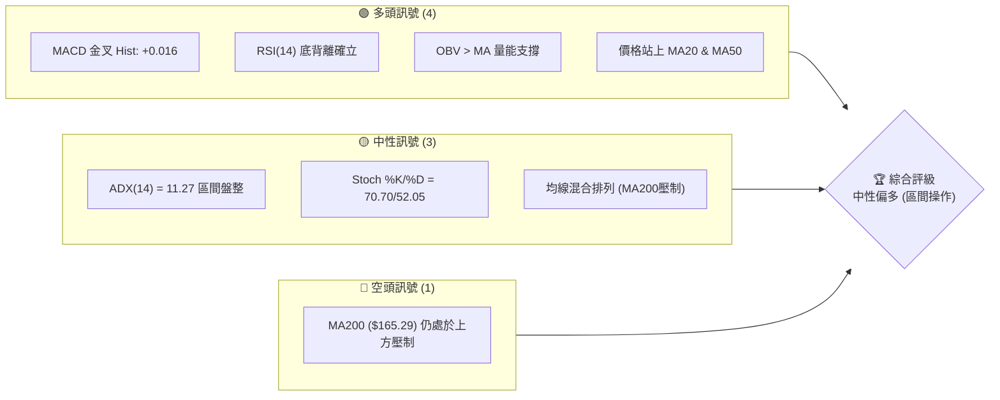

### 📊 核心指標速覽表

| 指標類別 | 指標名稱 | 當前數值 | 訊號 | 解讀 |
|----------|----------|----------|------|------|
| **價格** | 當前價格 | $162.33 | 🟡 中性 | 位於 52W 區間 ($132.47 - $218.91) 的 34.5% 偏低位置 |
| **均線** | MA20 | $158.57 | 🟢 看多 | 價格在 MA20 上方，且 MA20 趨勢向上 (▲) |
| **均線** | MA50 | $153.98 | 🟢 看多 | 價格在 MA50 上方，中期支撐強勁 (▲) |
| **均線** | MA200 | $165.29 | 🔴 看空 | 價格在 MA200 下方，長期均線仍具備實質阻力 (▼) |
| **動能** | RSI(14) | 54.57 | 🟡 中性 | 處於 30-70 中性區間，但伴隨顯著的「底背離」看多訊號 |
| **動能** | MACD | 0.729 | 🟢 看多 | MACD 位於信號線 0.713 之上，柱狀體呈正值 (+0.016) |
| **波動** | ATR(14) | $6.80 | 🟡 中性 | 佔股價 4.19%，波動度處於中等水平，提供合理的止損空間 |
| **趨勢** | ADX(14) | 11.27 | 🟡 中性 | 極低的 ADX 數值，表明當前處於典型的無趨勢/盤整行情 |

### 🏆 技術評分卡

根據多因子技術指標權重評估，VST 當前的技術面綜合得分為 **58/100**，屬於**中性偏多**。由於長期均線（MA200）壓制與極低的趨勢強度（ADX），目前不具備單邊暴漲的動能，但底部支撐極為紮實，適合進行通道內的低吸高拋。

```
技術評分卡 — VST (2026-07-22)
════════════════════════════════════════════════════
趨勢強度      ████░░░░░░░░░░░░░░░░  22/100  🔴 弱趨勢
動能指標      ████████████░░░░░░░░  60/100  🟢 底背離
支撐穩定度    ████████████████░░░░  80/100  🟢 強支撐
成交量配合    ████████████░░░░░░░░  60/100  🟡 中規中矩
形態完整度    ██████████░░░░░░░░░░  50/100  🟡 震盪築底
均線排列      ████████░░░░░░░░░░░░  40/100  🔴 混合排列
════════════════════════════════════════════════════
綜合評分      ████████████░░░░░░░░  58/100  ⚖️ 中性偏多
════════════════════════════════════════════════════
```

---

## 2. 趨勢分析

### 🌐 多時框趨勢分析

技術分析的精髓在於多時框架的相互確認。透過月線、週線與日線的層層遞進，我們能更清晰地掌握 VST 的趨勢全貌：

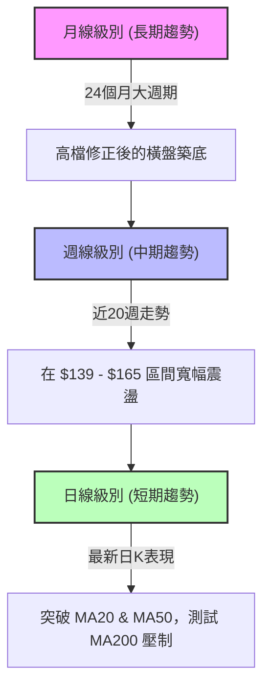

### 📈 長期趨勢 — 12個月走勢圖（Unicode）

以下為 VST 過去 12 個月（2025-08 至 2026-07）的月線收盤價走勢圖。可以明顯看出，股價在 2025 年 7 月達到 $207.45 的高峰後，經歷了一輪溫和的修正，並在 $150.00 - $160.00 附近尋求到了強力的長期支撐。

```
VST 月線走勢圖（過去12個月）
價格軸 ($)
$210 ┤      ● (2025-07: $207.45)
$200 ┤          ●       ●
$190 ┤              ●       ●   ●
$180 ┤                          ●
$170 ┤                              ● (2026-02: $173.41)
$160 ┤                                  ●               ● (現在: $162.33)
$150 ┤                                      ●   ●   ●   ●
$140 ┤
     └──────────────────────────────────────────────────────────
       07   08  09  10  11  12  01  02  03  04  05  06  07  (月份)
```

#### 走勢特徵分析表格

| 歷史階段 | 時間區間 | 收盤價變動 | 走勢特徵 | 成交量配合度 |
|----------|----------|------------|----------|--------------|
| **高檔震盪期** | 2025-07 ~ 2025-10 | $207.45 → $187.52 | 高檔獲利回吐，呈現雙頂雛形 | 量能溫和萎縮 |
| **中期修正期** | 2025-11 ~ 2026-01 | $178.12 → $157.91 | 跌破短期均線，尋求 52W 低點支撐 | 殺多量能釋放後萎縮 |
| **反彈與再回測**| 2026-02 ~ 2026-05 | $173.41 → $160.01 | 寬幅箱型震盪，反彈至 $173 後回測 $150 關卡 | 震盪期間量能不連續 |
| **橫盤築底期** | 2026-06 ~ 2026-07 | $158.63 → $162.33 | 波動率顯著收斂，均線糾纏，構築底部 | 量能偏低，等待方向突破 |

### 📊 中期趨勢（週線分析）

從近 20 週的週線數據來看，VST 呈現一個非常標準的**箱型整理（Rectangle Pattern）**。
*   **箱頂（中期壓力）**：$164.12 - $167.96 區間。
*   **箱底（中期支撐）**：$139.48 - $147.51 區間。

在 2026-05-17，週線收盤創下階段性低點 $139.48，隨後在 2026-05-24 出現強勁的量能反彈（週成交量達 32,768,000 股），隨後股價再次於 2026-06-14 回測 $147.81 獲得支撐。這是一個典型的「雙重底（Double Bottom）」或「高等級箱型築底」過程。

### ⚡ 趨勢強度評估（ADX 解讀）

當前的 ADX(14) 指標是解讀 VST 技術面最關鍵的鑰匙：

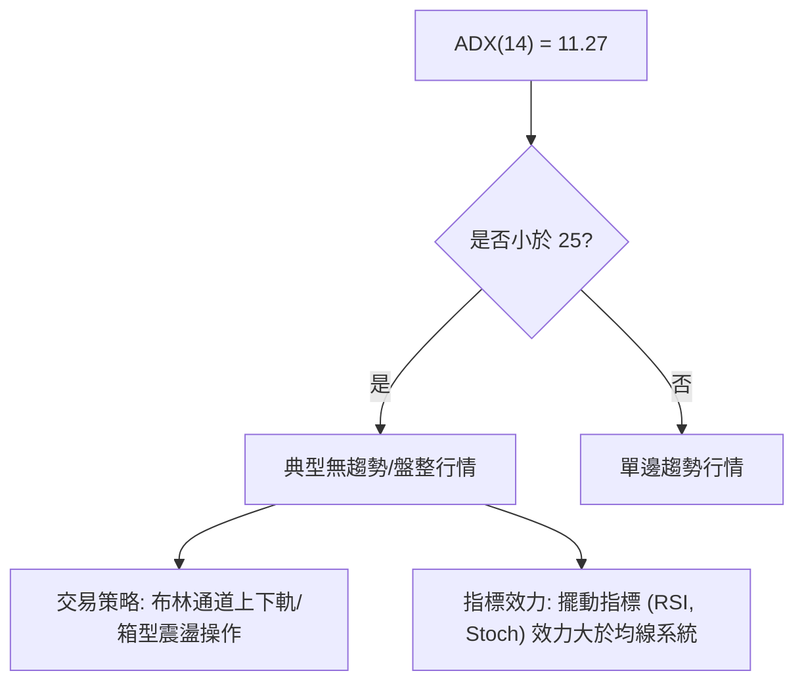

#### ADX 強度對照與 VST 定位

| ADX 數值區間 | 趨勢強度分類 | 交易策略指導 | VST 當前定位 |
|--------------|--------------|--------------|--------------|
| 0 - 15 | **極度微弱 / 無趨勢** | 嚴格執行箱型操作，避免追漲殺跌 | **★ VST 當前值: 11.27** |
| 15 - 25 | **弱趨勢 / 盤整** | 尋求區間突破的早期訊號 | |
| 25 - 50 | **強趨勢** | 順勢交易，均線金叉/死叉效力極高 | |
| 50 - 100 | **極強趨勢** | 強烈超買/超賣，尋求趨勢衰竭反轉 | |

*   **多空主導權分析**：雖然趨勢極弱，但當前 `+DI` 為 26.93，`-DI` 為 21.38。`+DI > -DI` 顯示在盤整的內部結構中，**多頭力量稍佔上風**，具備向箱體上軌測試的動能。

---

## 3. 圖表形態分析

### 🔍 形態識別系統

在日線與週線圖表上，VST 展現出以下兩個重要的幾何形態特徵。我們依據數據紀律，對其進行嚴格的信心度評估：

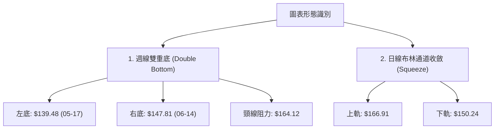

#### 形態信心度評估表

| 識別形態 | 信心度 | 判斷依據（引用數據） | 完成度 | 目標價（附計算式） |
|----------|--------|----------------------|--------|--------------------|
| **週線雙重底** | **65%** 🟡 中等 | 左底 $139.48，右底 $147.81。右底高於左底，呈現一底比一底高的健康形態。頸線位於 2026-04-26 收盤價 $164.12。 | 85%（尚未實質突破頸線） | **$188.76**<br>計算式：頸線 $164.12 + 形態高度 ($164.12 - $139.48) = $188.76。該目標價與斐波那契 38.2% 回調位 ($185.89) 形成共振。 |
| **日線布林收斂** | **85%** 🟢 極高 | ADX 降至 11.27，布林帶寬顯著收窄（上下軌價差僅 $16.67，約為股價的 10.2%）。 | 95%（處於突破前夕） | **$166.91 / $150.24**<br>計算式：若向上突破，首要目標為布林上軌 $166.91；若向下跌破，首要目標為下軌 $150.24。 |

### 🕯️ 重要K線形態分析（近 8 週週線）

| 週別收盤日 | 收盤價 | K線形態 | 形態技術解讀 | 訊號強度 |
|------------|--------|---------|--------------|----------|
| 2026-06-07 | $148.55 | 長下影線錘子K線 | 股價盤中向下測試 $147 支撐，隨後強勢收復，顯示下方買盤積極。 | 🟢 偏多 |
| 2026-06-14 | $147.81 | 縮量十字星 | 股價二次探底，成交量萎縮，代表賣壓竭盡。雙底右肩確立。 | 🟢 偏多 |
| 2026-06-21 | $163.52 | 大陽線突破 | 週漲幅達 10.6%，一舉收復多條短期均線，成交量配合放大。 | ████████░░ 🟢 強多 |
| 2026-06-28 | $163.49 | 高檔十字星 | 在頸線 $164 附近遭遇阻力，多空雙方在此進行換手。 | 🟡 中性 |
| 2026-07-05 | $151.05 | 中陰線回測 | 跌破 MA20，但成交量顯著萎縮（16,341,000），屬於無量回測。 | 🟡 中性 |
| 2026-07-12 | $158.86 | 陽線吞噬 | 收復前一週失地，重新站穩 MA20 ($158.57)。 | 🟢 偏多 |
| 2026-07-19 | $155.44 | 陰線回踩 | 測試 MA20 與 S2 支撐，留有下影線。 | 🟡 中性 |
| 2026-07-26 | $162.33 | 實體陽K線 | 重新站上所有短期均線，多頭再度集結，準備挑戰 MA200 阻力。 | 🟢 偏多 |

### 📉 ASCII 雙重底形態示意圖

```
                    [頸線阻力 $164.12]
                        ┌───▲───┐
                        │       │
                        │       │
     $147.81 (右底) ────┼───────┼───● (當前 $162.33)
                        │       │  /
                        │       │ /
     $139.48 (左底) ────●       └──●
                        │
```

---

## 4. 支撐與阻力

### 🗺️ 關鍵價位分布圖（Unicode）

VST 目前的價格結構呈現出極其清晰的「階梯式」分佈。下方支撐層層防禦，而上方阻力則集中在 MA200 與斐波那契關鍵回調位。

```
VST 價位結構分布圖
═══════════════════════════════════════════════════
$177.74 ║████████████████████████║ 強阻力 R3 (波段高點聚類)
$175.69 ║▓▓▓▓▓▓▓▓▓▓▓▓▓▓▓▓▓▓▓▓    ║ 斐波那契 50.0% 回調位
$171.94 ║████████████████████    ║ 阻力 R2 (波段高點聚類)
$167.96 ║████████████████████████║ 關鍵阻力 R1 (布林上軌 $166.91 附近)
$165.49 ║▓▓▓▓▓▓▓▓▓▓▓▓▓▓▓▓▓▓      ║ 斐波那契 61.8% 關鍵分水嶺
$162.33 ╠════════════════════════╣ ◄ 當前價格 $162.33
$161.77 ║▓▓▓▓▓▓▓▓▓▓▓▓▓▓▓▓        ║ 近期支撐 S1 (波段低點)
$158.57 ║████████████████████████║ 核心均線支撐 (MA20 / 布林中軌)
$157.99 ║████████████████████████║ 強支撐 S2 (波段低點聚類)
$153.17 ║████████████████████████║ 強支撐 S3 (波段低點聚類)
$150.97 ║▓▓▓▓▓▓▓▓▓▓▓▓▓▓▓▓▓▓      ║ 斐波那契 78.6% 回調位 (布林下軌 $150.24)
═══════════════════════════════════════════════════
```

### 🚧 阻力位分析表

| 阻力級別 | 價位 | 形成原因 | 突破難度 | 重要性 |
|----------|------|----------|----------|--------|
| **R1 (關鍵阻力)** | **$167.96** | 近一年波段高點聚類，且極度接近日線布林上軌 ($166.91)。 | 🟡 中等。需要日線成交量放大至 50 日均量 ($4.82M) 以上方可突破。 | ★★★★☆<br>此為多頭重回上升通道的起點。 |
| **R2 (中級阻力)** | **$171.94** | 近一年波段高點聚類，上方套牢盤密集區。 | 🔴 較高。此處伴隨 240日均線 ($170.88) 的下行壓力。 | ★★★☆☆<br>此位若突破，中期空頭趨勢宣告終結。 |
| **R3 (強阻力)** | **$177.74** | 近一年波段高點聚類，且與 50% 斐波那契回調位 ($175.69) 重疊。 | 🔴 極高。需要重大的基本面利多或產業消息配合。 | ★★★★★<br>此為牛熊轉換的終極分水嶺。 |

### 🛡️ 支撐位分析表

| 支撐級別 | 價位 | 形成原因 | 守住機率 | 重要性 |
|----------|------|----------|----------|--------|
| **S1 (近期支撐)** | **$161.77** | 近期日線波段低點，距離現價僅 -0.35%。 | 🟢 極高。日線級別的多頭護盤線。 | ★★☆☆☆<br>提供極佳的短線超短進場防守點。 |
| **S2 (核心支撐)** | **$157.99** | 近一年波段低點聚類，且與 MA20 ($158.57) 及布林中軌完全重疊。 | 🟢 極高。中期多頭的生命線。 | ★★★★★<br>一旦跌破，日線級別的偏多結構將被破壞。 |
| **S3 (強支撐)** | **$153.17** | 近一年波段低點聚類，接近 MA50 ($153.98) 與 78.6% 斐波那契回調位 ($150.97)。 | 🟢 極高。週線級別的雙底右肩防線。 | ★★★★☆<br>此處為中長線投資者的最佳「黃金坑」買點。 |

### 📐 📐 斐波那契回調位分析（52週區間 $132.47 → $218.91）

當前價格 **$162.33** 正處於一個非常微妙的黃金分割區間：
*   **上方阻力**：**61.8% 回調位 ($165.49)**。在黃金分割理論中，61.8% 是強弱勢轉換的最關鍵位置。若能實質突破並站穩 $165.49，意味著從 $218.91 下跌以來的修正行情正式告一段落，多頭將直接挑戰 50.0% ($175.69) 甚至更高。
*   **下方支撐**：**78.6% 回調位 ($150.97)**。該位置與日線布林下軌 ($150.24) 高度重合，過去數月股價多次在此處獲得支撐反彈，證明此處為機構資金的「硬底線」。

---

## 5. 技術指標深度解讀

### 🎛️ 指標訊號總覽

當前技術指標呈現「動能指標領先轉強、均線系統滯後跟進、量能溫和配合」的特徵：

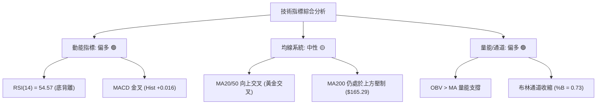

### 📈 移動平均線排列分析

VST 目前的均線系統呈現「**短中期均線走平偏多，長期均線壓制**」的混合排列狀態：

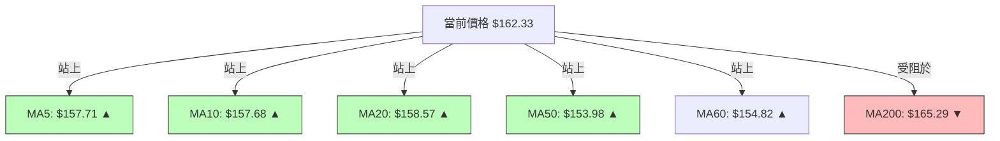

*   **黃金交叉訊號**：短期均線 MA5 ($157.71) 與 MA10 ($157.68) 已成功向上穿越 MA20 ($158.57)，且 MA20、MA50 均呈現向上（▲）的斜率。這表明**過去 20 天與 50 天進場的投資者平均已處於獲利狀態**，有利於多頭信心的凝聚。
*   **長期壓制**：200日均線（MA200）目前位於 **$165.29**，且斜率向下（▼）。這意味著股價向上挑戰時，將在 $165.29 附近遭遇強大的中長線套牢盤解套壓力。

### 📉 RSI(14) 分析

*   **當前數值**：**54.57**。處於 30-70 的常態分佈區間，未進入超買（>70）或超賣（<30）狀態，顯示股價仍有充足的波動空間。
*   **⚠️ 底背離 (Bullish Divergence) 確立**：
    這是本報告中最具前瞻性的看多訊號。
    *   **價格走勢**：VST 股價在 2026 年 5 月中旬創下收盤低點 $139.48，隨後在 6 月中旬回測 $147.81。
    *   **RSI 走勢**：5 月中旬的 RSI(14) 創下 **25.5** 的極度超賣值；然而在 6 月中旬股價二次探底時，RSI 最低僅降至 **41.8**，並未創出新低，反而大幅上揚。
    *   **技術含義**：這表明**股價雖然在尋底，但下行的動能（Sellers' Momentum）已經嚴重衰竭**。這種「價格一底比一底高（或持平），指標一底比一底高」的現象，是極為經典的波段起漲前兆。

```
RSI(14) 走勢進度條
0% ░░░░░░░░░░░░░░░░ [30 超賣] █████████████ [54.57 當前] ░░░░░░░░░░░ [70 超買] ░░░░░░░░ 100%
```

### 📊 MACD(12/26/9) 訊號解讀

*   **當前狀態**：MACD 線為 **0.729**，信號線（Signal）為 **0.713**。
*   **柱狀體（Histogram）**：**+0.016**。
*   **解讀**：MACD 在零軸上方完成「黃金交叉」（Golden Cross），且柱狀體連續數日呈現綠色看多（🟢）增長狀態。這確認了日線級別的上升波段正在展開，多頭動能正在溫和累積。

### 📦 布林通道分析

*   **通道參數**：上軌 **$166.91** ｜ 中軌 **$158.57** ｜ 下軌 **$150.24**
*   **%B 數值**：**0.73**。表示當前價格（$162.33）位於中軌與上軌之間的偏強區域。
*   **通道狀態**：布林通道目前呈現「**收縮（Squeeze）**」狀態。根據布林線創始人 John Bollinger 的理論，通道收縮代表波動率的極度壓抑，隨之而來的必然是「波動率擴張與新趨勢的誕生」。
*   **突破路徑預測**：鑑於 %B > 0.5 且 MACD 偏多，VST 向上突破布林上軌（$166.91）並挑戰 R1 ($167.96) 的機率高於跌破下軌。

```
布林通道 ASCII 示意圖
$166.91 ─────────────────────────────── 上軌 (R1 附近)
              ● (當前價格 $162.33)
$158.57 ───────╪─────────────────────── 中軌 (MA20 / 核心支撐)
              │
$150.24 ──────┴──────────────────────── 下軌 (S3 / 斐波那契 78.6%)
```

### 💹 成交量分析（量價配合度）

*   **量能狀態**：最新成交量為 **3,719,800**，為 20日均量（4,099,640）的 **0.91x**。量比略微不足，顯示市場在面臨 $164 - $165 壓力區時，觀望情緒濃厚。
*   **OBV（能量潮指標）**：**OBV > MA**。能量潮指標持續運行於其移動平均線上方，顯示在近期的震盪過程中，伴隨著「陽線放量、陰線縮量」的特徵。這意味著**主力資金並未流出，反而是在暗中進行籌碼收集（Accumulation）**，量能結構對多頭有利。

---

## 6. 動能與波動率

### ⚡ 動能評估四象限

為了更客觀地評估 VST 在市場中的定位，我們引入「動能強度」與「波動率」雙維度矩陣分析：

| 象限 | 動能強度 | 波動率水平 | 市場特徵 | VST 當前定位與評估 |
|------|----------|------------|----------|--------------------|
| **Q1 (強勢爆發)** | 強 (RSI > 60) | 低 (ATR 萎縮) | 蓄勢突破，最佳買點 | |
| **Q2 (震盪築底)** | **中等偏強 (RSI 50-60)** | **中等 (ATR 4.19%)** | **波段反彈，基底紮實** | **★ VST 當前定位：RSI=54.57，ATR=$6.80。處於典型蓄勢期。** |
| **Q3 (高危波動)** | 強 (RSI > 70) | 高 (ATR 放大) | 投機過熱，隨時反轉 | |
| **Q4 (弱勢陰跌)** | 弱 (RSI < 40) | 高 (ATR 放大) | 恐慌殺多，避開為妙 | |

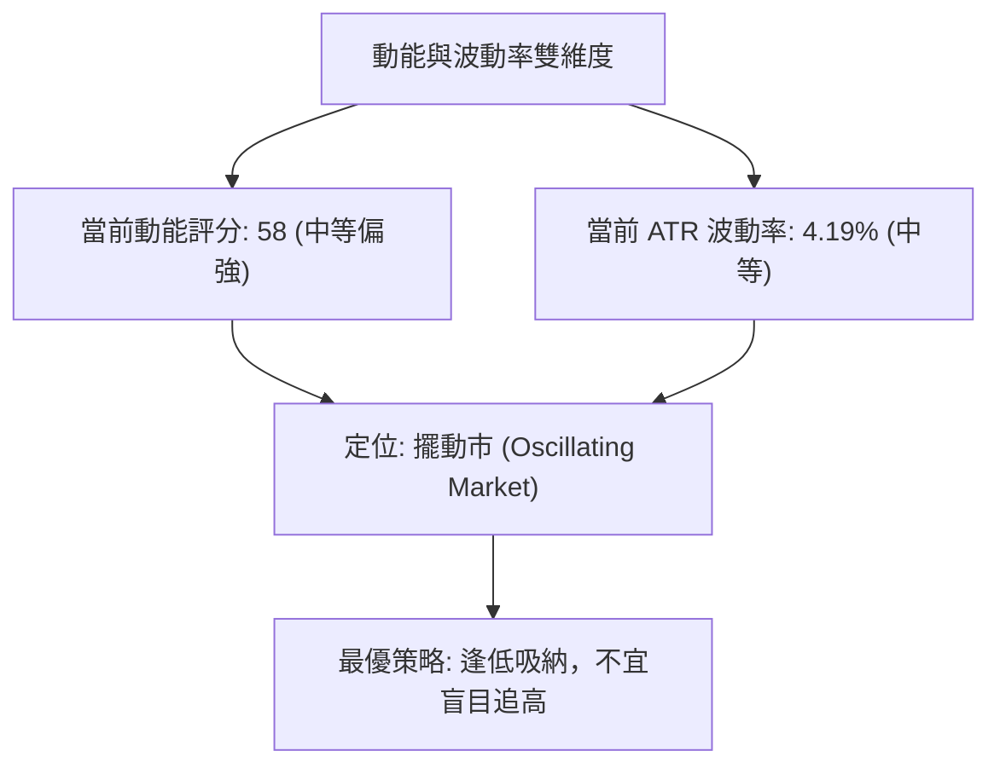

### 📊 ATR 波動率分析

*   **當前 ATR(14)**：**$6.80**。
*   **技術應用（止損與倉位管理）**：
    *   **標準波動區間**：VST 每日的正常隨機波動範圍為 $6.80。這意味著，任何小於 1.0 倍 ATR（即 $6.80）的止損設定，都極易被市場的隨機雜訊「掃單」出場。
    *   **專業止損建議**：建議使用 **1.5 倍至 2.0 倍 ATR** 作為波段交易的防守寬度。
        *   *1.5倍 ATR 距離* = $10.20
        *   *2.0倍 ATR 距離* = $13.60
    *   **實戰防守點**：以當前價 $162.33 減去 1.5 倍 ATR ($10.20) 得到 **$152.13**，該價位剛好落在強支撐 S3 ($153.17) 與斐波那契 78.6% ($150.97) 的安全網下方，是極具統計學優勢的防守位置。

### 📐 Beta 與市場相關性

*   **Beta 值**：**1.409**。
*   **解讀**：VST 雖然屬於公用事業板塊（Utilities），但其 Beta 高達 1.409，表明其**波動彈性顯著高於標普 500 指數（S&P 500）**。當大盤上漲 1% 時，VST 理論上有望上漲 1.41%；反之亦然。這使得 VST 成為公用事業板塊中極具「進攻性」的標的，非常適合技術派交易者進行波段操作。

---

## 7. 多時框架總結

### 📋 時框架評分表

為了避免單一時框架的偏見，我們將日線、週線與月線的技術訊號進行收斂對照：

| 時框架 | 趨勢方向 | 動能 (RSI/MACD) | 均線排列 | 形態特徵 | 綜合評分 | 交易指導建議 |
|--------|----------|-----------------|----------|----------|----------|--------------|
| **短期 (日線)** | 🟡 中性偏多 | 🟢 RSI底背離 / MACD金叉 | 🟡 混合排列 (MA200壓制) | 🟢 布林收縮，蓄勢突破 | **65/100** | 逢低佈局，等待突破 $165.49 加碼。 |
| **中期 (週線)** | 🟡 區間震盪 | 🟡 RSI 54.6 / MACD柱收斂 | 🟡 均線糾纏 | 🟢 雙底構築中 (右肩抬高) | **60/100** | 箱體操作，在 $150-$153 區間強力買進。 |
| **長期 (月線)** | 🟢 長期看多 | 🟡 RSI 50 附近中性 | 🟢 處於 24個月上升軌道 | 🟡 高檔健康修正 | **70/100** | 長線無虞，回測長期支撐即是買點。 |

### 🔲 綜合訊號矩陣

```
                 【多時框技術訊號共振矩陣】
                
                 日線 (Short-term)   週線 (Medium-term)   月線 (Long-term)
               ┌───────────────────┬────────────────────┬───────────────────┐
  趨勢 (Trend) │   🟡 中性偏多     │    🟡 區間震盪     │    🟢 長期看多    │
               ├───────────────────┼────────────────────┼───────────────────┤
  動能 (Mtm)   │   🟢 強烈看多     │    🟡 中性偏多     │    🟡 中性        │
               ├───────────────────┼────────────────────┼───────────────────┤
  支撐 (Supp)  │   🟢 強力支持     │    🟢 雙底支撐     │    🟢 歷史買盤    │
               └───────────────────┴────────────────────┴───────────────────┘
```

### ⚖️ 多時框收斂結論（依規則 14 嚴格執行）

*   **當前行情屬性判定**：由於 **ADX(14) = 11.27**（遠低於 25），根據多時框收斂規則，判定 VST 當前處於**典型的「盤整行情」**。
*   **交易區間鎖定**：以日線布林通道上下軌 **$150.24 - $166.91** 為主要交易區間。
*   **最終方向性結論**：**中性偏多，區間震盪蓄勢**。
    *   *依據*：雖然長期均線 MA200 ($165.29) 仍在上方的 R1 ($167.96) 附近形成壓制，但日線級別的 RSI 底背離與 MACD 金叉，加上週線雙底右肩抬高，顯示多頭正在逐步蠶食空頭防線。
    *   *操作核心*：在未實質突破布林上軌 $166.91 之前，切忌盲目高位追漲；最優解為「在布林下軌及核心支撐 S2 ($157.99) 附近逢低吸納，並在布林上軌及 R1 附近分批獲利了結，或等待向上突破確認後進行趨勢加碼」。

---

## 8. 交易策略建議

### 🗺️ 策略決策流程圖

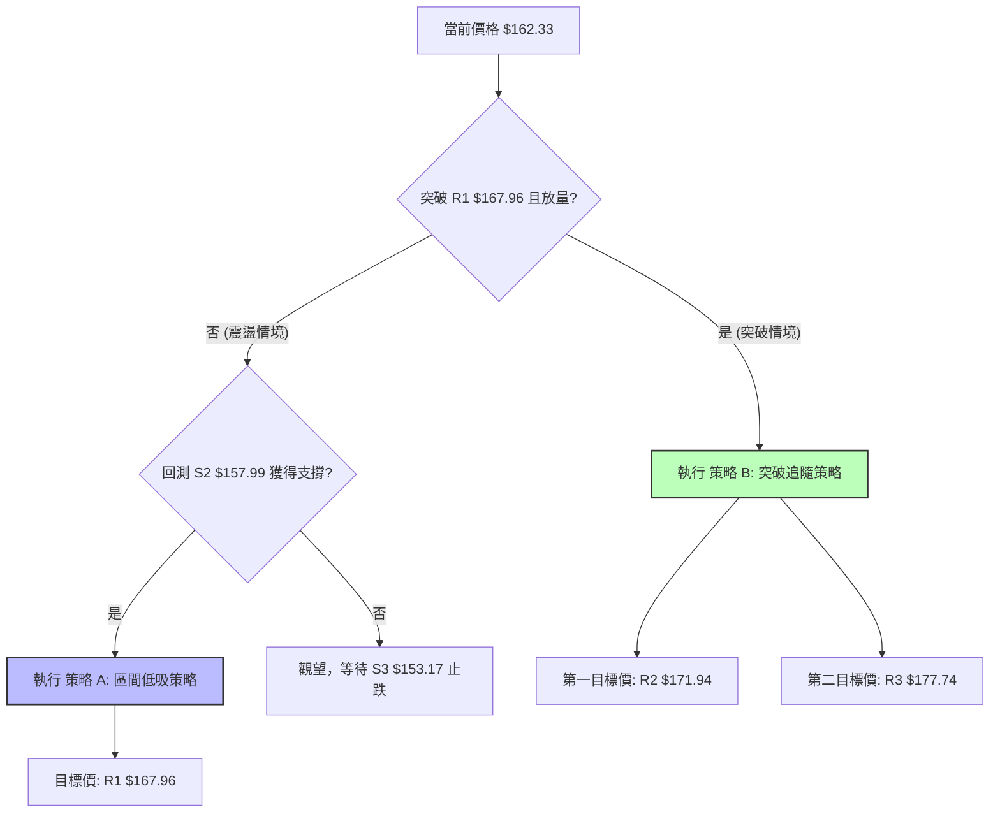

### 🧭 策略路由

*   **當前主策略方向**：**區間低吸為主，突破加碼為輔（綜合評分 58/100）**。
*   **路由說明**：由於綜合評分處於 40-60 的中性區間，且 ADX 顯示無趨勢，我們**主推「區間低吸操作（策略 A）」**，並將「突破追隨操作（策略 B）」列為備用加碼計畫。

### 🎯 價格情境階梯（Price Scenarios）

| 觸發條件 | 下一目標價 | 後續延伸價位 | 情境技術含義 | 交易執行動作 |
|----------|------------|--------------|--------------|--------------|
| **向上突破 R1 ($167.96)** | **R2 ($171.94)** | **R3 ($177.74)** | 突破日線布林上軌與 MA200 壓制，中期趨勢轉向多頭。 | 啟動策略 B，進場追多或加碼。 |
| **維持現價區間 ($158 - $164)** | — | — | 繼續在布林通道內橫盤整理，時間換取空間。 | 執行策略 A，在區間內高拋低吸。 |
| **向下跌破 S2 ($157.99)** | **S3 ($153.17)** | **斐波那契78.6% ($150.97)** | 跌破日線布林中軌與 MA20，短期轉弱，測試週線雙底右肩。 | 策略 A 止損出場，等待 S3 附近重新分批佈局。 |

### 📊 情境機率分佈

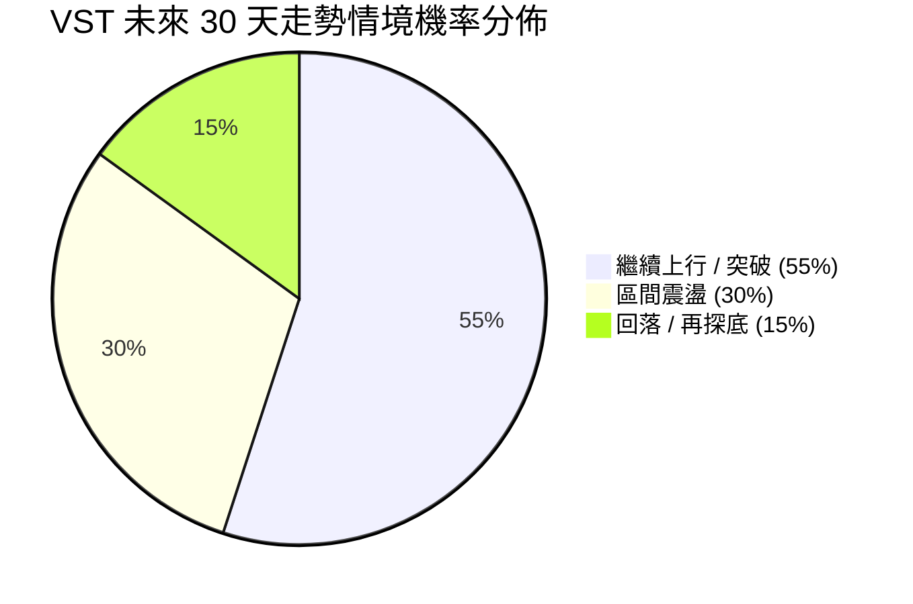

*   **主要依據**：
    *   *繼續上行/突破 (55%)*：基於 RSI 底背離與 MACD 金叉的共振，且 OBV 顯示資金持續暗中流入。
    *   *區間震盪 (30%)*：基於 ADX = 11.27 極低，市場動能不足以立刻發動單邊暴漲，大概率仍需時間消化 MA200 壓力。
    *   *回落/再探底 (15%)*：基於大盤系統性風險，若跌破 S2，則有 15% 機率回測 S3。

### 🟢 交易策略詳情

#### 策略 A：區間低吸策略（當前主推）
*   **進場條件**：當股價回踩核心支撐 S2 ($157.99) 附近，且 15 分鐘/1 小時 K 線出現止跌訊號。
*   **進場價格**：**$158.50** (靠近 MA20)
*   **目標價 T1**：**$165.49** (斐波那契 61.8% 阻力)
*   **目標價 T2**：**$167.96** (阻力位 R1)
*   **止損價格**：**$154.50** (跌破 MA50 且留出隨機波動空間)
*   **風險報酬比**：**1 : 2.36** (風險 $4.00 ｜ 預期利潤 $9.46)
*   **成功機率**：**65%**
*   **建議倉位**：**15%** (中等倉位)

#### 策略 B：突破追隨策略（備用加碼）
*   **進場條件**：日線收盤價實質突破 R1 ($167.96)，且當日成交量大於 4,821,630 股（50日均量）。
*   **進場價格**：**$168.50** (突破確認後進場)
*   **目標價 T1**：**$175.69** (斐波那契 50.0% 回調位)
*   **目標價 T2**：**$185.89** (斐波那契 38.2% 回調位)
*   **止損價格**：**$164.00** (跌回頸線下方，判定為假突破)
*   **風險報酬比**：**1 : 3.86** (風險 $4.50 ｜ 預期利潤 $17.39)
*   **成功機率**：**55%**
*   **建議倉位**：**10%** (突破加碼倉)

### 🔴 反向風險觸發點（對沖提示）

若股價未如預期上行，反而**日線收盤價跌破 S3 ($153.17)**，則代表週線雙底形態宣告失敗。此時應立即暫停所有做多計畫，並考慮買入 VST 認沽期權（Put Option）進行對沖，防守目標下看至 52W 低點 **$132.47**。

### ⭐ 整體訊號強度評星

```
做多訊號強度：★★★★☆  (4/5星 - 底背離與 MACD 共振)
做空訊號強度：★★☆☆☆  (2/5星 - 僅均線壓制，無實質殺多量)
整體可信度：  ★★★▲☆  (3.5/5星 - 盤整市限制了爆發力)
```

---

## 9. 風險提示與監控

### ✅ 關鍵監控指標 Checklist

交易者每日開盤應密切監控以下指標的變化，以動態調整倉位：

```
╔══════════════════════════════════════════════════════════════╗
║             VST 交易員每日監控清單 (Daily Checklist)         ║
╠══════════════════════════════════════════════════════════════╣
║ [ ] 價格是否站穩 MA20 ($158.57)？ (跌破則短期轉弱)          ║
║ [ ] 日線成交量是否突破 4.8M？ (放量為突破 R1 的必要條件)     ║
║ [ ] RSI(14) 是否突破 60？ (進入強勢多頭動能區)               ║
║ [ ] MACD 柱狀體是否持續放大？ (正值需維持在 +0.016 以上)     ║
║ [ ] ADX(14) 是否開始向上翹頭？ (若 >15 代表新趨勢啟動)       ║
╚══════════════════════════════════════════════════════════════╝
```

### ⚠️ 風險場景分析

為了防範極端市場波動，我們針對 VST 制定了三種風險演變場景：

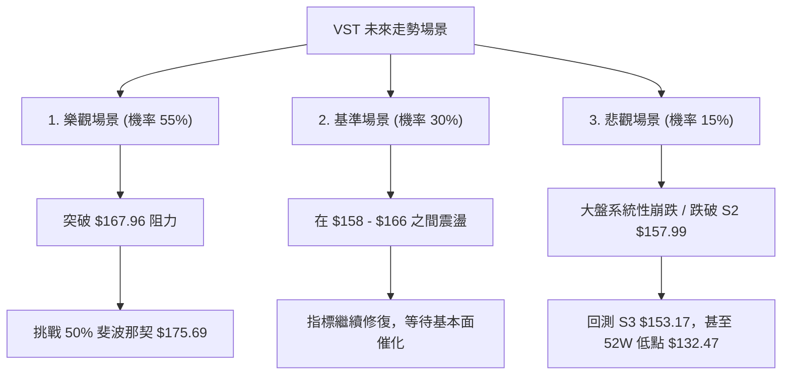

### 🛡️ 風險管理重要提醒

1.  **公用事業板塊的「利率敏感性」**：作為 Independent Power Producer，VST 擁有高達 **$20.57B** 的債務（Debt/Equity 達 366.61%）。雖然其基本面強勁（Revenue Growth 43.4%），但高債務結構使其股價對宏觀利率極為敏感。若美聯儲（Fed）釋放鷹派升息訊號，可能導致 VST 跌破技術支撐。
2.  **Beta 放大效應**：1.409 的 Beta 意味著在大盤回撤時，VST 的跌幅可能會放大。因此，大盤（SPY/QQQ）若處於回撤週期，應主動將 VST 的倉位減半。
3.  **資金管理紀律**：單一標的持倉建議不超過總資金的 **15%**。嚴格執行 ATR 止損機制，切勿在下跌過程中盲目「攤平」（Average Down）。

---

## 📋 報告總結

```
VST 技術分析報告總結
════════════════════════════════════════════════════════
報告日期：2026-07-22
當前價格：$162.33
分析評級：⚖️ 中性偏多 (蓄勢待發)

關鍵結論：
├─ 長期趨勢：🟢 震盪向上 (月線級別健康修正完成)
├─ 中期趨勢：🟡 區間震盪 (週線雙底構築中，右肩抬高)
├─ 短期趨勢：🟢 偏多 (日線 RSI底背離 + MACD金叉)
├─ 關鍵支撐：$157.99 (MA20 與布林中軌共振)
├─ 關鍵阻力：$167.96 (MA200 與布林上軌重疊)
└─ 分析師目標價：$223.17 (機構共識，具備 37.5% 潛在上漲空間)

最優策略組合：
1. 🥇 最佳機會：在 $158.00 - $159.00 區間逢低買入 (策略 A)，防守置於 $154.50。
2. 🥈 次選機會：等待日線放量收盤突破 $167.96 後，進場追隨趨勢 (策略 B)。
3. 🥉 保守選擇：在 ADX < 15 的環境下，嚴格執行布林通道內的網格交易。
════════════════════════════════════════════════════════
```

---

> ⚠️ **免責聲明**：本報告為基於量化技術指標與歷史價格數據之客觀分析，所有數值與結論均不構成任何實質投資建議。投資有風險，入市需謹慎，請根據個人風險承受能力獨立決策。

---

*報告生成時間：2026-07-22 ｜ 數據來源：Yahoo Finance ｜ 分析框架：多時框技術分析*