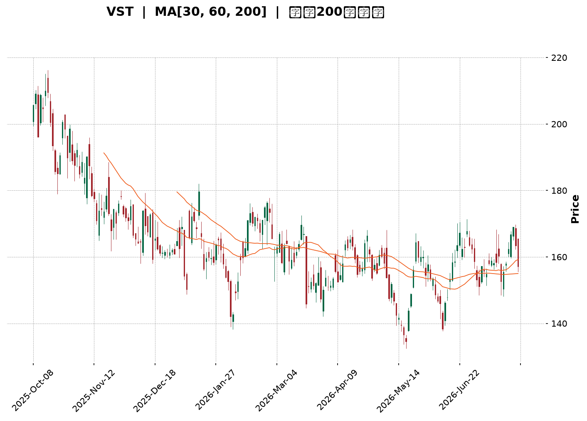
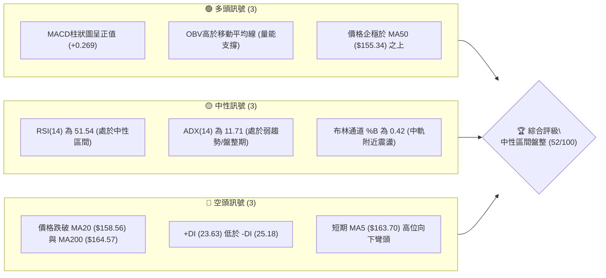
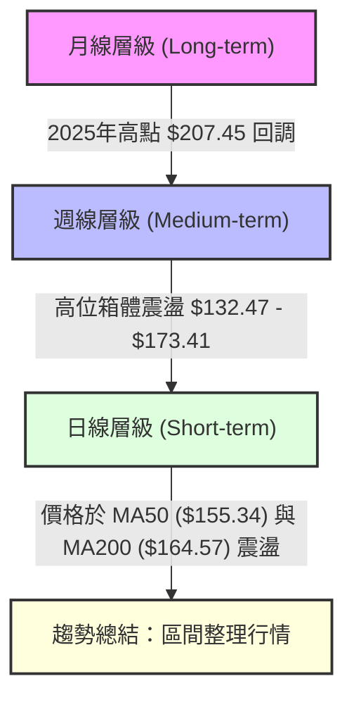
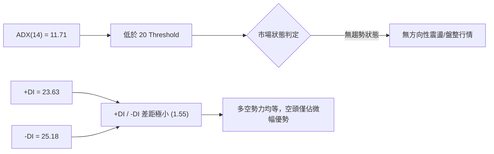
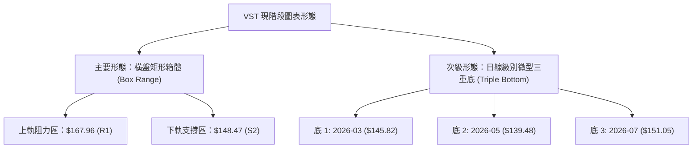
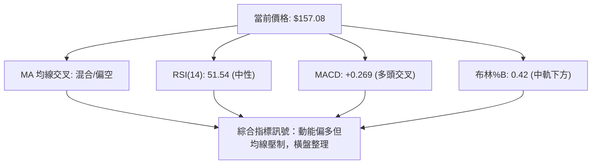
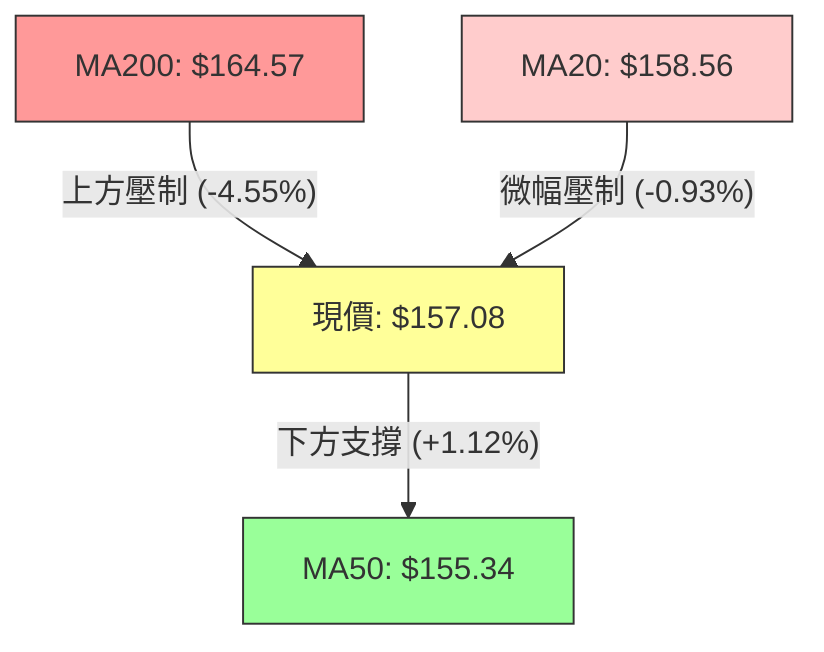
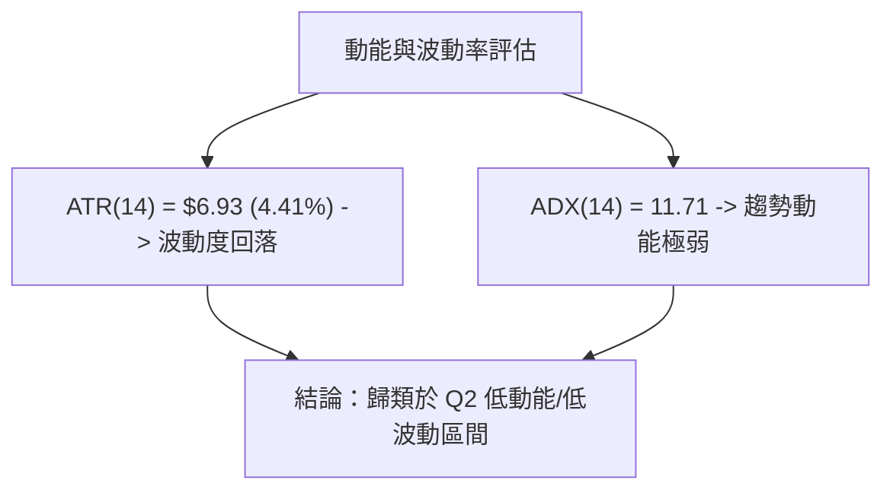
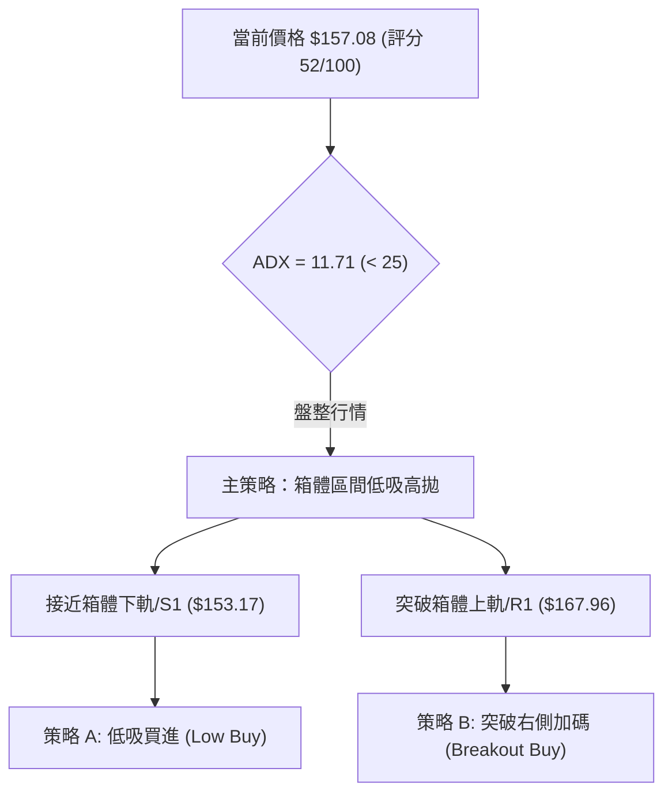
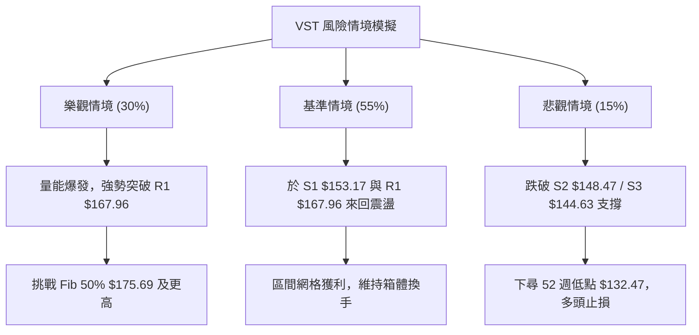

<details>
<summary>📊 靜態圖表 (點擊展開)</summary>

</details>

<html>
<head><meta charset="utf-8" /></head>
<body>
    <div style="height:500px; width:100%;">                        <script>window.PlotlyConfig = {MathJaxConfig: 'local'};</script>
        <script charset="utf-8" src="https://cdn.plot.ly/plotly-3.7.0.min.js" integrity="sha256-jvTGqxNp8AGWEcvNLVuKr+8j5dGe9Yw51LQkmDH+IYA=" crossorigin="anonymous"></script>                <div id="candlestick-chart" class="plotly-graph-div" style="height:100%; width:100%;"></div>            <script>                window.PLOTLYENV=window.PLOTLYENV || {};                                if (document.getElementById("candlestick-chart")) {                    Plotly.newPlot(                        "candlestick-chart",                        [{"close":{"dtype":"f8","bdata":"AAAAIDC2aUAAAABAISRqQAAAAMBkgWhAAAAAIMoVakAAAACgC5VpQAAAAKA3P2pAAAAAYOAwakAAAABgehBpQAAAAMDmLWhAAAAA4OI3Z0AAAADg5SFnQAAAAEBx0mdAAAAAYE0UaUAAAABgJs9oQAAAAACWuWdAAAAAgGHRaEAAAAAAi51nQAAAAECccGdAAAAAIKkHaEAAAACgBx9nQAAAAGBYk2dAAAAAoFb7ZkAAAADApsZnQAAAAOD4b2dAAAAAwFdNZkAAAABA+zBmQAAAAMAmW2VAAAAAgOW+ZUAAAABgxshlQAAAAMBKtmVAAAAAoLRMZkAAAAAAN6JlQAAAAICB\u002fGRAAAAAoDzNZUAAAAAANURlQAAAAAAjAmZAAAAAYMhDZkAAAACAb51lQAAAAECzemVAAAAAAAVeZUAAAACA3+plQAAAAABBz2RAAAAAAMutZEAAAAAgDIRkQAAAAACFj2RAAAAAQAe8ZUAAAAAgoCxlQAAAAMCr8WRAAAAAYGGXZUAAAABAz+ljQAAAACBjr2RAAAAA4FJLZEAAAAAA+iNkQAAAAOAqJ2RAAAAAIGwwZEAAAADgKidkQAAAAMCXLGRAAAAAwHtFZEAAAABAURxkQAAAAODFmGRAAAAAQGBPZEAAAABg\u002fiFlQAAAAECNRWNAAAAAwOfFYkAAAAAAJ71kQAAAAABTg2VAAAAAgE5eZUAAAACAHxBlQAAAAIDadWZAAAAAAH7EZEAAAACgE4xjQAAAAGCD8mNAAAAAAF39Y0AAAABAtPVjQAAAAGDmy2NAAAAAoNF5ZEAAAABg26VkQAAAACA1RGRAAAAAgDi9Y0AAAACAszpjQAAAAEB+EmNAAAAA4A7EYUAAAAAgnNVhQAAAAKCWp2JAAAAAIIkRY0AAAABAHOVjQAAAAGCp9mNAAAAAIM1UZEAAAABgimBlQAAAAGBtpmVAAAAAoC5DZUAAAACAxYBlQAAAAACrXWVAAAAAQMnqZEAAAABgsGRlQAAAAAAK3GVAAAAAYKEKZkAAAADgIK1lQAAAAMAGsWRAAAAA4B8oZEAAAAAgGV1kQAAAAIAF3mRAAAAAQMvGY0AAAAAgZWVkQAAAAEBJfmRAAAAAoBHXY0AAAADgeORjQAAAAABe0GNAAAAAIGExZEAAAACADXxkQAAAAEDSNGVAAAAAgBDdZEAAAAAAGzpiQAAAAICC4mJAAAAAoDQQY0AAAAAgiuliQAAAAODIAmNAAAAAAGdoY0AAAABgrWpiQAAAACDVw2JAAAAAoNQ3Y0AAAACg\u002ft5iQAAAAKAY7GJAAAAA4OEuY0AAAAAAgXVjQAAAACAqEWNAAAAAgG9QY0AAAAAAUr9jQAAAAMCzd2RAAAAA4MlWZEAAAABgjalkQAAAAMBnZ2RAAAAA4A7sY0AAAAAgMFZjQAAAAOBOcmNAAAAAYC6UY0AAAACA2INkQAAAAAAby2RAAAAAQKEcZEAAAADAZTJjQAAAAADRs2NAAAAA4AJiY0AAAACAABRkQAAAAKD7BGRAAAAAQDLCY0AAAADAgjdjQAAAAABucGJAAAAAwMv6YkAAAACARFViQAAAAGAjzWFAAAAAIHO2YUAAAABggm9hQAAAAGDhEWFAAAAAILHQYEAAAABgjvlhQAAAAIDjm2JAAAAAoKWBY0AAAABAjopkQAAAACCi\u002fWNAAAAAoMkBZEAAAACAMABkQAAAAOBkUWNAAAAAgPi3Y0AAAACgtzJjQAAAAKCFL2NAAAAAoKmRYkAAAADgOVZiQAAAACB\u002fQGJAAAAAgBRLYUAAAAAgnEViQAAAACAEemJAAAAAIMUpY0AAAAAgbMxjQAAAAMBz02NAAAAAIKxwZEAAAADgUehkQAAAAOB6TGRAAAAAANdbZEAAAADgo\u002fhkQAAAACCub2RAAAAAAClMZEAAAAAAKdRjQAAAAMAeJWNAAAAAoJnhYkAAAABACqdjQAAAACBcd2NAAAAAgD1aY0AAAAAgXL9jQAAAACCF22NAAAAAANfDY0AAAACAws1jQAAAACBcB2RAAAAAgOsRY0AAAACAFG5jQAAAACCuv2NAAAAAYI9KZEAAAAAgrtdkQAAAACBcH2VAAAAAAClsZEAAAABgj6JjQA=="},"high":{"dtype":"f8","bdata":"9\u002f0qlhm4aUCZGYFlOkZqQHvzIaunb2pA9oP+SIkiakCXN7eFe\u002f9pQEh6\u002ffZy5GpACdOvPWMGa0CD4s8quSVqQEZZBRC6lGlAQYTGMsUTaEAvGzPQ2ZZnQPLUBm3k7GdApx9UHjElaUBy+kZeF1ppQMaZ\u002fsTkj2hAyfRsa7j8aEDBkCKd2r9oQFIfyI7hAmhAxDkt9CxMaEBxp+5ERNZnQG5o8++n9WdAmIBbvb2KZ0BPO7STCslnQPwusUd7f2hANUuYMiNlZ0Cr87UOipFmQFsESi8aJ2ZAltR8mBxoZkAzk8+u0FhmQG1KZdPkFWZArM3DkemXZkDgX7BgKJBnQDSr+9G1nmVAdUAtFibPZUAJY5G2K8BlQAIYhRlpIGZAxk+aO6aAZkDQMAhD8PdlQCg2RXwM52VAfKxdwSCkZUDRLbpa+ClmQDAcS\u002fi3\u002fGVAzjrIvffjZEBCb4oakiZlQEdQBV+bqmRAEPXEBUXFZUAIwyaGHGhmQKJYt14KiWVA9dQpMa2mZUDeJfV4PM1lQBfU6cWfZmVAkvD6Kl9WZUD9YG8TantkQC+VNr\u002fyZ2RA\u002f6sLAF5EZEBT3R8xnFFkQGYyS4rnd2RAaKRLToZTZEAmYFI7eoFkQKe2+fcDGmVATeopUM5lZUBp8FokSIRlQAyWdjfpBWVAROJtm9hrY0COJfr1QMhlQDA5eLsTCGZAsBfXK+neZUCMn8fNpVZlQEMfebbNwWZAeQWHmLtUZUC\u002fQMluWLFkQB2MH1QPMWRAYlVG6ZBhZEBltG4Zdk1kQMN8ZnlTm2RApuoxnU6FZEBKFzU1N8NkQMRmyfhW7WRAjvAyQnqBZEDqhGt5PPFjQAdcsSYvgmNArwJ2+40nY0DTwSBkavBhQARwbMPg+mJAVNJ2HjVrY0CoNSN+MB9kQDjIZ4JTm2RA2b529gu4ZEB9eHAo92VlQOfN8oA0BWZAdF8WtYHgZUAzM\u002fdqAYNlQOr228muoGVASzahkbVrZUDnf+CEmmZlQI\u002fJWUSM7mVAWbD5u7YXZkAUURmbLTpmQG31n4UOAWZAhwMc5IViZECjlB4qOXhkQD8jKB428GRA\u002f6bjmUv9ZEDWRGNMoIVkQB\u002f1zuhgCmVA\u002fPux1jNxZEBq9DMQ\u002fldkQDxQdpcXmWRA5cq235BhZEDtwTb2HKBkQEdRRym6kGVABnFCWjokZUAS2w0Xl8dkQCj9f9DSdWNArBCp0E08Y0DJ0ZzYVLdjQP255qKbDmNAJp7mLTv\u002fY0A8coLDpdZjQJA+jPBC6GJAtnEuPOKDY0DZhpXnAEtjQLeT4SSCHGNAum8zoDg+Y0AGa5WIsyJkQPAhUtavSWRAXnQOsg\u002fNY0AKvFgB2Q9kQHM\u002fAD6QoWRA5UvjPDDJZEBq01xT+NVkQBSlIOAjCGVAl1FaRUJ6ZEApP5q2\u002fRtkQMePKu9w22NAd6\u002fm+7rUY0DtmB1u9KdkQHfPrSvnBWVAe0d0XRdjZEDmAJauPB1kQDWgRj4E7WNAObMAU1D9Y0A6Qsq45ERkQPwsthFFcmRAvncR6GJYZEBQzOnT8QRlQLp1EVoQWWNAofcaGyoRY0CrwoLxm8NiQA6qzPRpQmJAWRXGBAfjYUASR\u002fX4kJxhQCHzmAkJa2FAVIfWU0gQYUCqLp7QUBZiQOrudJVHomJApM9jWzCrY0CkD9H2TuVkQCksGdBRmWRAhVjUZKRpZEC6wXhmBEJkQGFCeDSBymNAzaDPzsMRZECPZ\u002f6pDbZjQL3L5vpiOmNAeP9xBWBCY0BbQnRB66JiQIgbOsLfwmJA4OUhU475YUDpFA\u002frOVZiQBK6r9ZDyWJAf9bCg3FnY0C9wjo\u002fIihkQBc1bITPRmRAPn6+4UFDZUAAAAAAAFBlQAAAAGBmumRAAAAA4Hq0ZEAAAABAM2tlQAAAAIDC\u002fWRAAAAAQDOzZEAAAABgZq5kQAAAAIA9qmNAAAAAIK6HY0AAAAAgrqdjQAAAAMAe7WNAAAAA4KWPY0AAAACAwiVkQAAAAOCjAGRAAAAAgMLtY0AAAABguAZlQAAAAIAU3mRAAAAAQDPDY0AAAAAAAKhjQAAAAIA90mNAAAAAYLiOZEAAAACA6\u002flkQAAAAIDrIWVAAAAA4FE4ZUAAAACgcJFkQA=="},"hovertemplate":"\u003cb\u003e%{x|%Y-%m-%d}\u003c\u002fb\u003e\u003cbr\u003e\u958b: $%{open:.2f}\u003cbr\u003e\u9ad8: $%{high:.2f}\u003cbr\u003e\u4f4e: $%{low:.2f}\u003cbr\u003e\u6536: $%{close:.2f}\u003cextra\u003e\u003c\u002fextra\u003e","low":{"dtype":"f8","bdata":"j3ZuGIHpaEAA4D4eeI9pQOOZ\u002fY3BgGhAbzeNHzTyaEDiAGMjEhJpQFugZ1BosWlA51cNTTH6aUCMsOvqDOdoQJtpyE88AGhAVc2rxpwZZ0CDtpo29VxmQLdR+OsSHmdAMJbfx185aECdTWzh63VoQIMJ5uyO9mZA3sr4GOWVZ0D29kUAQnhnQPrMwOVI2GZAT5kaVyRiZ0ADEwuhg\u002fdmQLfJM4c3BWdAUCMfTiJZZkDEkt49w\u002ftlQLLFatqt7GZA+4Y7ZDBCZkCb5ppLwBFmQO+1cXUCOmVACufm4ZWcZEDNzIc\u002f3YxlQD\u002fYrp54PmVAO2r0J+uvZUDkC2zMLo1lQDlvTLGFOGRAo5QYbMimZEBs51gq8aZkQOjCt\u002fa\u002fi2VA65T9ALIoZkCSwaFmKX9lQNhjnQLwVGVAzflBW\u002foHZUBhYimacjhlQPrLUWjyuGRAdVxEfSVsZEAIgdF3f4FkQLArIaS+v2NAO4jIl\u002fMKZEBEZ7k1xdlkQB2V5wUzyWRAs9PBDX+7ZEASOAeGVsFjQLsa7AjaP2RA3yQwts5AZED6zqgFAA1kQBwFzg0G9mNAcoBRHonqY0C4gPZUC\u002f1jQE4X9Sxz72NAKY+dgbMTZEBdZG6czhhkQCB9yugCbmRADECgLPD3Y0DJlyxTgGpkQNhP4ZS5I2NAQrOS3eiYYkBPjuoShK1kQNu6cRoTdGRA3i1W7yhLZUAJrhDe8LJkQOzgx5iaZmVAkOfdwu1RZED0weTHNHpjQBOeeqAQK2NAIPSX+L\u002fWY0AXq5IpDbJjQLD08TDcrmNAzuvFlda2Y0Byb7Z\u002f5BZkQC+CjTElymNAR\u002furDKyNY0BPfLOSXDNjQMfxonBEv2JAUcp6U1hcYUCQf536ukRhQKFQ\u002f+VsYGJAKc9N6+lrYkByNGHBQExjQBx43miaw2NATyt3paP+Y0C0rE4HviFkQKIcB4xlL2VAY1s08oskZUDNzMyMJflkQCmrzH0UEWVA0tMOiSKYZEDuJ0Lmx01kQFhE4JOLM2VAbwviPgh1ZEAXDS6tZE1lQMSnt53rq2RAcGCLs9oRY0C1Lralo\u002f5jQGVNuoV8J2RAbKrpCKC7Y0Cf5bHwUFJjQKPgpSVBe2RAOdcDQRpXY0CX44T2kIhjQElApVJvqWNAHnsInWL1Y0Bf8kUShzVkQJFttaljoWRAwrR7ltx4ZED80hsiFBRiQDCcSKUJpGJAyIIcUeiqYkDrQA8ybsViQPVLM+8fSWJAEhzDmjXxYkDRQsnEo0xiQIi6hYmCxGFA8DrGUwbmYkCspp1EH71iQHp9+\u002fZztWJASPupEzzCYkAzn6ifVGJjQMhBT23tDmNAMcweD6scY0Bm\u002fQP19w1jQIN0gUfdA2RALPfdLIs9ZECnqN4zPkxkQJS7Xv8OQWRA2ZzkySfDY0BB439PQz1jQFCOfteBVmNAst3zCxZJY0AByZRk211jQNzBu59q0GNANrhk\u002fu\u002fPY0BX4EiitRtjQPbMMQxkcGNAYtt3otNWY0BSrOzQCKdjQHihDOVy8mNAFapMPDGMY0Cf+NxPwjFjQFqsM1rIWGJA8Hmqn1lCYkBT2n4cmi5iQE3hjaMTamFA5lUCCT53YUBVuQjMwDNhQDF9spuHtWBARUYq\u002fC6PYEBVvTbJwDNhQNs5lj2tFWJAvFPn\u002fEDRYkALBQmi9b9jQMdPpbT3xWNAJEOH0yWsY0Bq28zAI5VjQNVHqKvJ42JAs\u002f\u002f9j1EVY0BVQ\u002fAcjhdjQJGDq\u002fVbv2JAUQJaL2ZpYkCM8PoUnEViQPVudh3yqmFAABqb1\u002fI2YUBpIkej\u002fmthQAsPdu9rWWJA4+8leT7BYkBBg9+WuBNjQDVlMk+vn2NAMhGFfcz5Y0AAAADAzFxkQAAAAOCj5GNAAAAAACn8Y0AAAADgUcBkQAAAAIAUZmRAAAAA4KMgZEAAAADgUZBjQAAAAKCZ4WJAAAAAAACQYkAAAADgUQBjQAAAAOBRQGNAAAAAgD3qYkAAAACAPa5jQAAAAKCZoWNAAAAAYGaGY0AAAAAgBqFjQAAAAIAUvmNAAAAAgJOQYkAAAADgeoRiQAAAAEAzc2NAAAAA4FEAZEAAAAAAKfRjQAAAAOBRoGRAAAAAgOtJZEAAAACgR3FjQA=="},"name":"\u50f9\u683c","open":{"dtype":"f8","bdata":"rNLbus4XaUDMzMwsh8RpQNjMEDh7HGpADCo86SUJaUBAeKrc951pQDpeT9t1DmpAnm5aGca8akA1GisH4dlpQCB70ZsRaWlA44lo648CaEB2IEuwtVhnQLdR+OsSHmdAzNDY1Bt5aEBy+kZeF1ppQMaZ\u002fsTkj2hA1GIYUxTwZ0DrajNF7DtoQNmEf+uE5mdAqs6Cw5jAZ0AYhbaRPGpnQGd5bLeZL2dAyraYRjXEZkCiOWtwTzhmQPKSDzu\u002fP2hAvnHl88MkZ0BenUHDoHJmQP5SyzukBWZA1QwKppLPZEAAgBhEetZlQN0Jnas0fmVAHVc7uN\u002fNZUCqIZAftgFnQLMLpWUsaWVA+hZ+fLwbZUBSvuoLdatlQB5+rYDoqGVAN1NYfj5IZkDWVuL69ehlQP6294uF1WVAFWBtrzR+ZUAQOT1t\u002fGVlQPzuCZU2+WVAzjrIvffjZEBNcmeZ5JVkQPhBbtnvlGRA1jlCAhgsZEB0cX76Jc9lQMIjjxrEh2VATEcSyK6+ZEDno1LdOallQP0koZMin2RAIQc50EbAZECtOPeUhXFkQD4gggL6I2RAn+L3y3cRZEAAAADgKidkQJt0xXvJEWRA4rgUw7IxZEDE909+GU5kQCB9yugCbmRAkXplNOMcZUB\u002fyluaFBFlQAyWdjfpBWVAg314aUtaY0BDTR56K7tlQMcg5wTnhmRA7ZsDkaOwZUB+cQqihh1lQLSl30O6kGVAqwSR587iZEChFGk0ZxpkQOIDlzNI0mNAe3eu5HYvZECQRUD23\u002fFjQF+aleWzBGRAxI9o+TziY0ADEildWLFkQFbh87wRsGRAiTsxD74hZEBQCkPC4aZjQPSeN70OdmNAR5C9Wo4YY0CiNDVojZNhQGvQ+\u002fbBsmJAbvtA\u002f8GyYkD\u002fGoqro\u002f5jQCt\u002f6wNvkWRAVV4skCsJZEDFYDNwdj5kQF6+bicTTWVAs6ulQfWwZUDNzK7IHi5lQH5MwohjemVA5YCBUGpFZUDqU5E1MdpkQBzvAznxfGVAA7NbZWRcZUBeBNfpjNBlQLXxqtpfN2VAB1PTOc4nZEDh1bZAnSRkQF+1iIDeLWRAgE9oy+F\u002fZEBk8plZCW9jQEz8se3rnGRA\u002f98kx8FkZEB0vvdfsZRjQF2rAP4JKmRAxPbQX8kRZEC2Ry36i0tkQI9bSwNeqWRAdFoVpa7WZEAS2w0Xl8dkQJsRxGqf52JAVVhE3NzKYkCDeW5EEFljQBbcrFNPqWJAEhzDmjXxYkDDZ3p6K5xjQBLZRipc9mFA\u002fZJ2BkPoYkCAm\u002fon9N9iQPTlBU2F2mJA3HawxnrbYkAFbOhyzhBkQD0FXQeBdWNAtZZUdyEpY0Bm\u002fQP19w1jQGrRNB\u002faRWRAwRlEDJioZEAS234f4IpkQLuBQSzhwGRAbaMVuk1aZECY18A7IBFkQElCG9mJsmNAS5sisr13Y0BNfAKAkINjQHTgz7mdmGRAgy\u002fmcLpIZECguN1AUhRkQFJ21iFJgmNAFnTg6dXCY0AlPbjzBa9jQED1\u002fJu0WGRAQvmM6JwoZEAIBNbd+1lkQLp1EVoQWWNA1M6FhWB5YkD6ZWWc\u002fahiQA6qzPRpQmJAOw0CVdWlYUC\u002fIGWJi3JhQKy7RZnHWWFAa6VN44XzYEAAAAAc0zlhQPzERLuHKGJA8Ee7hzPaYkDHxmI6AtZjQCqM6aVWl2RAr4IMn8XTY0BDIIcC1\u002fhjQMLQZVb5mGNAY8mZARp3Y0C17QHUUIljQAw4lp5\u002f6mJArxqcoTL5YkC3\u002fdt4SINiQDEc4UvMhmJAButnBcnkYUDK3O7+XplhQFYbq3pgeWJAgqlK4hQTY0CbYydnJCFjQIfXM+n7ymNA8Fc8ZKA7ZEAAAAAAKXBkQAAAAGCPAmRAAAAAwPVgZEAAAADAHt1kQAAAACCFu2RAAAAAYGZ2ZEAAAABgj1JkQAAAAAAAgGNAAAAAYGY+Y0AAAABACg9jQAAAAAAphGNAAAAAIK4\u002fY0AAAADgUeBjQAAAAKCZsWNAAAAAwMy0Y0AAAAAAACBkQAAAAAAAUGRAAAAAANe7Y0AAAAAghctiQAAAAOCjsGNAAAAAIK4fZEAAAAAghQNkQAAAAOBRyGRAAAAAgD0WZUAAAAAAALBkQA=="},"x":["2025-10-08T00:00:00-04:00","2025-10-09T00:00:00-04:00","2025-10-10T00:00:00-04:00","2025-10-13T00:00:00-04:00","2025-10-14T00:00:00-04:00","2025-10-15T00:00:00-04:00","2025-10-16T00:00:00-04:00","2025-10-17T00:00:00-04:00","2025-10-20T00:00:00-04:00","2025-10-21T00:00:00-04:00","2025-10-22T00:00:00-04:00","2025-10-23T00:00:00-04:00","2025-10-24T00:00:00-04:00","2025-10-27T00:00:00-04:00","2025-10-28T00:00:00-04:00","2025-10-29T00:00:00-04:00","2025-10-30T00:00:00-04:00","2025-10-31T00:00:00-04:00","2025-11-03T00:00:00-05:00","2025-11-04T00:00:00-05:00","2025-11-05T00:00:00-05:00","2025-11-06T00:00:00-05:00","2025-11-07T00:00:00-05:00","2025-11-10T00:00:00-05:00","2025-11-11T00:00:00-05:00","2025-11-12T00:00:00-05:00","2025-11-13T00:00:00-05:00","2025-11-14T00:00:00-05:00","2025-11-17T00:00:00-05:00","2025-11-18T00:00:00-05:00","2025-11-19T00:00:00-05:00","2025-11-20T00:00:00-05:00","2025-11-21T00:00:00-05:00","2025-11-24T00:00:00-05:00","2025-11-25T00:00:00-05:00","2025-11-26T00:00:00-05:00","2025-11-28T00:00:00-05:00","2025-12-01T00:00:00-05:00","2025-12-02T00:00:00-05:00","2025-12-03T00:00:00-05:00","2025-12-04T00:00:00-05:00","2025-12-05T00:00:00-05:00","2025-12-08T00:00:00-05:00","2025-12-09T00:00:00-05:00","2025-12-10T00:00:00-05:00","2025-12-11T00:00:00-05:00","2025-12-12T00:00:00-05:00","2025-12-15T00:00:00-05:00","2025-12-16T00:00:00-05:00","2025-12-17T00:00:00-05:00","2025-12-18T00:00:00-05:00","2025-12-19T00:00:00-05:00","2025-12-22T00:00:00-05:00","2025-12-23T00:00:00-05:00","2025-12-24T00:00:00-05:00","2025-12-26T00:00:00-05:00","2025-12-29T00:00:00-05:00","2025-12-30T00:00:00-05:00","2025-12-31T00:00:00-05:00","2026-01-02T00:00:00-05:00","2026-01-05T00:00:00-05:00","2026-01-06T00:00:00-05:00","2026-01-07T00:00:00-05:00","2026-01-08T00:00:00-05:00","2026-01-09T00:00:00-05:00","2026-01-12T00:00:00-05:00","2026-01-13T00:00:00-05:00","2026-01-14T00:00:00-05:00","2026-01-15T00:00:00-05:00","2026-01-16T00:00:00-05:00","2026-01-20T00:00:00-05:00","2026-01-21T00:00:00-05:00","2026-01-22T00:00:00-05:00","2026-01-23T00:00:00-05:00","2026-01-26T00:00:00-05:00","2026-01-27T00:00:00-05:00","2026-01-28T00:00:00-05:00","2026-01-29T00:00:00-05:00","2026-01-30T00:00:00-05:00","2026-02-02T00:00:00-05:00","2026-02-03T00:00:00-05:00","2026-02-04T00:00:00-05:00","2026-02-05T00:00:00-05:00","2026-02-06T00:00:00-05:00","2026-02-09T00:00:00-05:00","2026-02-10T00:00:00-05:00","2026-02-11T00:00:00-05:00","2026-02-12T00:00:00-05:00","2026-02-13T00:00:00-05:00","2026-02-17T00:00:00-05:00","2026-02-18T00:00:00-05:00","2026-02-19T00:00:00-05:00","2026-02-20T00:00:00-05:00","2026-02-23T00:00:00-05:00","2026-02-24T00:00:00-05:00","2026-02-25T00:00:00-05:00","2026-02-26T00:00:00-05:00","2026-02-27T00:00:00-05:00","2026-03-02T00:00:00-05:00","2026-03-03T00:00:00-05:00","2026-03-04T00:00:00-05:00","2026-03-05T00:00:00-05:00","2026-03-06T00:00:00-05:00","2026-03-09T00:00:00-04:00","2026-03-10T00:00:00-04:00","2026-03-11T00:00:00-04:00","2026-03-12T00:00:00-04:00","2026-03-13T00:00:00-04:00","2026-03-16T00:00:00-04:00","2026-03-17T00:00:00-04:00","2026-03-18T00:00:00-04:00","2026-03-19T00:00:00-04:00","2026-03-20T00:00:00-04:00","2026-03-23T00:00:00-04:00","2026-03-24T00:00:00-04:00","2026-03-25T00:00:00-04:00","2026-03-26T00:00:00-04:00","2026-03-27T00:00:00-04:00","2026-03-30T00:00:00-04:00","2026-03-31T00:00:00-04:00","2026-04-01T00:00:00-04:00","2026-04-02T00:00:00-04:00","2026-04-06T00:00:00-04:00","2026-04-07T00:00:00-04:00","2026-04-08T00:00:00-04:00","2026-04-09T00:00:00-04:00","2026-04-10T00:00:00-04:00","2026-04-13T00:00:00-04:00","2026-04-14T00:00:00-04:00","2026-04-15T00:00:00-04:00","2026-04-16T00:00:00-04:00","2026-04-17T00:00:00-04:00","2026-04-20T00:00:00-04:00","2026-04-21T00:00:00-04:00","2026-04-22T00:00:00-04:00","2026-04-23T00:00:00-04:00","2026-04-24T00:00:00-04:00","2026-04-27T00:00:00-04:00","2026-04-28T00:00:00-04:00","2026-04-29T00:00:00-04:00","2026-04-30T00:00:00-04:00","2026-05-01T00:00:00-04:00","2026-05-04T00:00:00-04:00","2026-05-05T00:00:00-04:00","2026-05-06T00:00:00-04:00","2026-05-07T00:00:00-04:00","2026-05-08T00:00:00-04:00","2026-05-11T00:00:00-04:00","2026-05-12T00:00:00-04:00","2026-05-13T00:00:00-04:00","2026-05-14T00:00:00-04:00","2026-05-15T00:00:00-04:00","2026-05-18T00:00:00-04:00","2026-05-19T00:00:00-04:00","2026-05-20T00:00:00-04:00","2026-05-21T00:00:00-04:00","2026-05-22T00:00:00-04:00","2026-05-26T00:00:00-04:00","2026-05-27T00:00:00-04:00","2026-05-28T00:00:00-04:00","2026-05-29T00:00:00-04:00","2026-06-01T00:00:00-04:00","2026-06-02T00:00:00-04:00","2026-06-03T00:00:00-04:00","2026-06-04T00:00:00-04:00","2026-06-05T00:00:00-04:00","2026-06-08T00:00:00-04:00","2026-06-09T00:00:00-04:00","2026-06-10T00:00:00-04:00","2026-06-11T00:00:00-04:00","2026-06-12T00:00:00-04:00","2026-06-15T00:00:00-04:00","2026-06-16T00:00:00-04:00","2026-06-17T00:00:00-04:00","2026-06-18T00:00:00-04:00","2026-06-22T00:00:00-04:00","2026-06-23T00:00:00-04:00","2026-06-24T00:00:00-04:00","2026-06-25T00:00:00-04:00","2026-06-26T00:00:00-04:00","2026-06-29T00:00:00-04:00","2026-06-30T00:00:00-04:00","2026-07-01T00:00:00-04:00","2026-07-02T00:00:00-04:00","2026-07-06T00:00:00-04:00","2026-07-07T00:00:00-04:00","2026-07-08T00:00:00-04:00","2026-07-09T00:00:00-04:00","2026-07-10T00:00:00-04:00","2026-07-13T00:00:00-04:00","2026-07-14T00:00:00-04:00","2026-07-15T00:00:00-04:00","2026-07-16T00:00:00-04:00","2026-07-17T00:00:00-04:00","2026-07-20T00:00:00-04:00","2026-07-21T00:00:00-04:00","2026-07-22T00:00:00-04:00","2026-07-23T00:00:00-04:00","2026-07-24T00:00:00-04:00","2026-07-27T00:00:00-04:00"],"type":"candlestick"},{"hovertemplate":"MA30: $%{y:.2f}\u003cextra\u003e\u003c\u002fextra\u003e","line":{"color":"#2196F3","dash":"dash","width":2},"mode":"lines","name":"MA30","x":["2025-10-08T00:00:00-04:00","2025-10-09T00:00:00-04:00","2025-10-10T00:00:00-04:00","2025-10-13T00:00:00-04:00","2025-10-14T00:00:00-04:00","2025-10-15T00:00:00-04:00","2025-10-16T00:00:00-04:00","2025-10-17T00:00:00-04:00","2025-10-20T00:00:00-04:00","2025-10-21T00:00:00-04:00","2025-10-22T00:00:00-04:00","2025-10-23T00:00:00-04:00","2025-10-24T00:00:00-04:00","2025-10-27T00:00:00-04:00","2025-10-28T00:00:00-04:00","2025-10-29T00:00:00-04:00","2025-10-30T00:00:00-04:00","2025-10-31T00:00:00-04:00","2025-11-03T00:00:00-05:00","2025-11-04T00:00:00-05:00","2025-11-05T00:00:00-05:00","2025-11-06T00:00:00-05:00","2025-11-07T00:00:00-05:00","2025-11-10T00:00:00-05:00","2025-11-11T00:00:00-05:00","2025-11-12T00:00:00-05:00","2025-11-13T00:00:00-05:00","2025-11-14T00:00:00-05:00","2025-11-17T00:00:00-05:00","2025-11-18T00:00:00-05:00","2025-11-19T00:00:00-05:00","2025-11-20T00:00:00-05:00","2025-11-21T00:00:00-05:00","2025-11-24T00:00:00-05:00","2025-11-25T00:00:00-05:00","2025-11-26T00:00:00-05:00","2025-11-28T00:00:00-05:00","2025-12-01T00:00:00-05:00","2025-12-02T00:00:00-05:00","2025-12-03T00:00:00-05:00","2025-12-04T00:00:00-05:00","2025-12-05T00:00:00-05:00","2025-12-08T00:00:00-05:00","2025-12-09T00:00:00-05:00","2025-12-10T00:00:00-05:00","2025-12-11T00:00:00-05:00","2025-12-12T00:00:00-05:00","2025-12-15T00:00:00-05:00","2025-12-16T00:00:00-05:00","2025-12-17T00:00:00-05:00","2025-12-18T00:00:00-05:00","2025-12-19T00:00:00-05:00","2025-12-22T00:00:00-05:00","2025-12-23T00:00:00-05:00","2025-12-24T00:00:00-05:00","2025-12-26T00:00:00-05:00","2025-12-29T00:00:00-05:00","2025-12-30T00:00:00-05:00","2025-12-31T00:00:00-05:00","2026-01-02T00:00:00-05:00","2026-01-05T00:00:00-05:00","2026-01-06T00:00:00-05:00","2026-01-07T00:00:00-05:00","2026-01-08T00:00:00-05:00","2026-01-09T00:00:00-05:00","2026-01-12T00:00:00-05:00","2026-01-13T00:00:00-05:00","2026-01-14T00:00:00-05:00","2026-01-15T00:00:00-05:00","2026-01-16T00:00:00-05:00","2026-01-20T00:00:00-05:00","2026-01-21T00:00:00-05:00","2026-01-22T00:00:00-05:00","2026-01-23T00:00:00-05:00","2026-01-26T00:00:00-05:00","2026-01-27T00:00:00-05:00","2026-01-28T00:00:00-05:00","2026-01-29T00:00:00-05:00","2026-01-30T00:00:00-05:00","2026-02-02T00:00:00-05:00","2026-02-03T00:00:00-05:00","2026-02-04T00:00:00-05:00","2026-02-05T00:00:00-05:00","2026-02-06T00:00:00-05:00","2026-02-09T00:00:00-05:00","2026-02-10T00:00:00-05:00","2026-02-11T00:00:00-05:00","2026-02-12T00:00:00-05:00","2026-02-13T00:00:00-05:00","2026-02-17T00:00:00-05:00","2026-02-18T00:00:00-05:00","2026-02-19T00:00:00-05:00","2026-02-20T00:00:00-05:00","2026-02-23T00:00:00-05:00","2026-02-24T00:00:00-05:00","2026-02-25T00:00:00-05:00","2026-02-26T00:00:00-05:00","2026-02-27T00:00:00-05:00","2026-03-02T00:00:00-05:00","2026-03-03T00:00:00-05:00","2026-03-04T00:00:00-05:00","2026-03-05T00:00:00-05:00","2026-03-06T00:00:00-05:00","2026-03-09T00:00:00-04:00","2026-03-10T00:00:00-04:00","2026-03-11T00:00:00-04:00","2026-03-12T00:00:00-04:00","2026-03-13T00:00:00-04:00","2026-03-16T00:00:00-04:00","2026-03-17T00:00:00-04:00","2026-03-18T00:00:00-04:00","2026-03-19T00:00:00-04:00","2026-03-20T00:00:00-04:00","2026-03-23T00:00:00-04:00","2026-03-24T00:00:00-04:00","2026-03-25T00:00:00-04:00","2026-03-26T00:00:00-04:00","2026-03-27T00:00:00-04:00","2026-03-30T00:00:00-04:00","2026-03-31T00:00:00-04:00","2026-04-01T00:00:00-04:00","2026-04-02T00:00:00-04:00","2026-04-06T00:00:00-04:00","2026-04-07T00:00:00-04:00","2026-04-08T00:00:00-04:00","2026-04-09T00:00:00-04:00","2026-04-10T00:00:00-04:00","2026-04-13T00:00:00-04:00","2026-04-14T00:00:00-04:00","2026-04-15T00:00:00-04:00","2026-04-16T00:00:00-04:00","2026-04-17T00:00:00-04:00","2026-04-20T00:00:00-04:00","2026-04-21T00:00:00-04:00","2026-04-22T00:00:00-04:00","2026-04-23T00:00:00-04:00","2026-04-24T00:00:00-04:00","2026-04-27T00:00:00-04:00","2026-04-28T00:00:00-04:00","2026-04-29T00:00:00-04:00","2026-04-30T00:00:00-04:00","2026-05-01T00:00:00-04:00","2026-05-04T00:00:00-04:00","2026-05-05T00:00:00-04:00","2026-05-06T00:00:00-04:00","2026-05-07T00:00:00-04:00","2026-05-08T00:00:00-04:00","2026-05-11T00:00:00-04:00","2026-05-12T00:00:00-04:00","2026-05-13T00:00:00-04:00","2026-05-14T00:00:00-04:00","2026-05-15T00:00:00-04:00","2026-05-18T00:00:00-04:00","2026-05-19T00:00:00-04:00","2026-05-20T00:00:00-04:00","2026-05-21T00:00:00-04:00","2026-05-22T00:00:00-04:00","2026-05-26T00:00:00-04:00","2026-05-27T00:00:00-04:00","2026-05-28T00:00:00-04:00","2026-05-29T00:00:00-04:00","2026-06-01T00:00:00-04:00","2026-06-02T00:00:00-04:00","2026-06-03T00:00:00-04:00","2026-06-04T00:00:00-04:00","2026-06-05T00:00:00-04:00","2026-06-08T00:00:00-04:00","2026-06-09T00:00:00-04:00","2026-06-10T00:00:00-04:00","2026-06-11T00:00:00-04:00","2026-06-12T00:00:00-04:00","2026-06-15T00:00:00-04:00","2026-06-16T00:00:00-04:00","2026-06-17T00:00:00-04:00","2026-06-18T00:00:00-04:00","2026-06-22T00:00:00-04:00","2026-06-23T00:00:00-04:00","2026-06-24T00:00:00-04:00","2026-06-25T00:00:00-04:00","2026-06-26T00:00:00-04:00","2026-06-29T00:00:00-04:00","2026-06-30T00:00:00-04:00","2026-07-01T00:00:00-04:00","2026-07-02T00:00:00-04:00","2026-07-06T00:00:00-04:00","2026-07-07T00:00:00-04:00","2026-07-08T00:00:00-04:00","2026-07-09T00:00:00-04:00","2026-07-10T00:00:00-04:00","2026-07-13T00:00:00-04:00","2026-07-14T00:00:00-04:00","2026-07-15T00:00:00-04:00","2026-07-16T00:00:00-04:00","2026-07-17T00:00:00-04:00","2026-07-20T00:00:00-04:00","2026-07-21T00:00:00-04:00","2026-07-22T00:00:00-04:00","2026-07-23T00:00:00-04:00","2026-07-24T00:00:00-04:00","2026-07-27T00:00:00-04:00"],"y":{"dtype":"f8","bdata":"AAAAAAAA+H8AAAAAAAD4fwAAAAAAAPh\u002fAAAAAAAA+H8AAAAAAAD4fwAAAAAAAPh\u002fAAAAAAAA+H8AAAAAAAD4fwAAAAAAAPh\u002fAAAAAAAA+H8AAAAAAAD4fwAAAAAAAPh\u002fAAAAAAAA+H8AAAAAAAD4fwAAAAAAAPh\u002fAAAAAAAA+H8AAAAAAAD4fwAAAAAAAPh\u002fAAAAAAAA+H8AAAAAAAD4fwAAAAAAAPh\u002fAAAAAAAA+H8AAAAAAAD4fwAAAAAAAPh\u002fAAAAAAAA+H8AAAAAAAD4fwAAAAAAAPh\u002fAAAAAAAA+H8AAAAAAAD4f+\u002fu7k6k6WdAd3d3l4bMZ0CamZnZD6ZnQGZmZkYIiGdAZmZmBntjZ0AiIiISpz5nQHd3d7d7GmdAq6qq6vr4ZkDv7u6ei9tmQO\u002fu7l6BxGZAVVVVtbW0ZkARERGhV6pmQCIiItKikGZAERER8RVrZkDv7u7uckZmQN7d3V1yK2ZA7+7ujiIRZkDe3d3tTfxlQFVVVaUB52VAREREdDLSZUBVVVW10rZlQGZmZmYonmVAd3d3VzmHZUBVVVWVM2hlQHd3d7csTGVAzczM3CQ6ZUDNzMwMwChlQHd3dzeqHmVAAAAAoBUSZUBERER0zQNlQGZmZgZJ+mRA7+7uvk7pZEB3d3eXCOVkQJqZmdlm1mRAAAAAsI68ZECJiIg4DrhkQGZmZhbUs2RARERE5C2sZEBmZmYGeKdkQDMzMzPXr2RAmpmZGbmqZECrqqoaf5ZkQDMzM3Mjj2RAq6qq6kGJZEARERFBg4RkQHd3d\u002ff9fWRAIiIickBzZEC8u7trwm5kQDMzMzP6aGRAmpmZCSxZZEB3d3fHVVNkQKuqqmqSRWRAVVVVFf8vZECamZlJURxkQERERBSID2RAq6qq+vcFZECrqqpKxANkQERERBT4AWRAq6qqynoCZEDv7u5+SQ1kQLy7u4tGFmRAZmZmBmceZEC8u7vLjyFkQHd3d6duM2RAAAAAcLpFZEBVVVUVUEtkQN7d3R1FTmRAzczMnANUZEBERERkP1lkQEREREQnSmRA3t3d7fBEZEBERESU6EtkQAAAAEDCU2RAd3d3l\u002fBRZEAAAACwqVVkQKuqquqbW2RA3t3dHS9WZEBmZmbmvE9kQFVVVWXgS2RA3t3dnb9PZEARERHRdVpkQBEREdGrbGRA3t3dzRqHZEDe3d1ddIpkQJqZmSlrjGRAAAAA0F+MZEAzMzMT\u002fYNkQN7d3f3be2RAiYiIuPpzZEDv7u6et1pkQCIiIvIYQmRAMzMzA6cwZEAzMzNzMRpkQM3MzDxXBWRAIiIiQov2Y0De3d2tCeZjQKuqqmo1zmNAzczMfO+2Y0CJiIioeaZjQN7d3X2QpGNAERERsR6mY0CamZkZq6hjQImIiOi2pGNAVVVV5fSlY0CJiIiY6pxjQJqZmdn7k2NAMzMzE8GRY0AAAAAQEZdjQCIiIrJsn2NAIiIiorueY0AzMzOTvpNjQDMzMzPphmNAzczMnEZ6Y0B3d3eHEopjQLy7uzvBk2NAZmZmFrCZY0ARERFxSZxjQLy7u4tol2NAzczMPMGTY0CrqqqKCpNjQKuqqmrRimNAVVVV1fh9Y0BVVVX1uHFjQBEREVHqYWNA3t3dfbVNY0BVVVVFC0FjQERERIQiPWNAREREdMY+Y0Crqqq6jEVjQDMzMxN7QWNAvLu7u6U+Y0ARERGBADljQERERCS8L2NAmpmZqf8tY0Crqqr60CxjQCIiIhKXKmNAvLu7C\u002fkhY0ARERGxYg9jQERERNSy+WJAq6qqmqXhYkBEREQEwdliQBEREUFLz2JAREREVGvNYkBERESECMtiQKuqqtphyWJAd3d3tzLPYkBVVVUFoN1iQBEREVF+7WJAVVVV9UL5YkAzMzMjxg9jQKuqqjpCJmNAMzMz01A8Y0B3d3fHvFBjQGZmZgZyYmNAAAAAYBN0Y0De3d1NZIJjQAAAACC1iWNAq6qq2mSIY0CrqqrqnoFjQBEREdF7gGNAIiIiMmt+Y0DNzMzcvHxjQDMzM6PNgmNAvLu7q0R9Y0C8u7s7P39jQCIiImINhGNAVVVVtb+SY0AzMzNzIahjQImIiEigwGNAq6qqKlTbY0AAAADg9eZjQA=="},"type":"scatter"},{"hovertemplate":"MA60: $%{y:.2f}\u003cextra\u003e\u003c\u002fextra\u003e","line":{"color":"#9C27B0","dash":"dash","width":2},"mode":"lines","name":"MA60","x":["2025-10-08T00:00:00-04:00","2025-10-09T00:00:00-04:00","2025-10-10T00:00:00-04:00","2025-10-13T00:00:00-04:00","2025-10-14T00:00:00-04:00","2025-10-15T00:00:00-04:00","2025-10-16T00:00:00-04:00","2025-10-17T00:00:00-04:00","2025-10-20T00:00:00-04:00","2025-10-21T00:00:00-04:00","2025-10-22T00:00:00-04:00","2025-10-23T00:00:00-04:00","2025-10-24T00:00:00-04:00","2025-10-27T00:00:00-04:00","2025-10-28T00:00:00-04:00","2025-10-29T00:00:00-04:00","2025-10-30T00:00:00-04:00","2025-10-31T00:00:00-04:00","2025-11-03T00:00:00-05:00","2025-11-04T00:00:00-05:00","2025-11-05T00:00:00-05:00","2025-11-06T00:00:00-05:00","2025-11-07T00:00:00-05:00","2025-11-10T00:00:00-05:00","2025-11-11T00:00:00-05:00","2025-11-12T00:00:00-05:00","2025-11-13T00:00:00-05:00","2025-11-14T00:00:00-05:00","2025-11-17T00:00:00-05:00","2025-11-18T00:00:00-05:00","2025-11-19T00:00:00-05:00","2025-11-20T00:00:00-05:00","2025-11-21T00:00:00-05:00","2025-11-24T00:00:00-05:00","2025-11-25T00:00:00-05:00","2025-11-26T00:00:00-05:00","2025-11-28T00:00:00-05:00","2025-12-01T00:00:00-05:00","2025-12-02T00:00:00-05:00","2025-12-03T00:00:00-05:00","2025-12-04T00:00:00-05:00","2025-12-05T00:00:00-05:00","2025-12-08T00:00:00-05:00","2025-12-09T00:00:00-05:00","2025-12-10T00:00:00-05:00","2025-12-11T00:00:00-05:00","2025-12-12T00:00:00-05:00","2025-12-15T00:00:00-05:00","2025-12-16T00:00:00-05:00","2025-12-17T00:00:00-05:00","2025-12-18T00:00:00-05:00","2025-12-19T00:00:00-05:00","2025-12-22T00:00:00-05:00","2025-12-23T00:00:00-05:00","2025-12-24T00:00:00-05:00","2025-12-26T00:00:00-05:00","2025-12-29T00:00:00-05:00","2025-12-30T00:00:00-05:00","2025-12-31T00:00:00-05:00","2026-01-02T00:00:00-05:00","2026-01-05T00:00:00-05:00","2026-01-06T00:00:00-05:00","2026-01-07T00:00:00-05:00","2026-01-08T00:00:00-05:00","2026-01-09T00:00:00-05:00","2026-01-12T00:00:00-05:00","2026-01-13T00:00:00-05:00","2026-01-14T00:00:00-05:00","2026-01-15T00:00:00-05:00","2026-01-16T00:00:00-05:00","2026-01-20T00:00:00-05:00","2026-01-21T00:00:00-05:00","2026-01-22T00:00:00-05:00","2026-01-23T00:00:00-05:00","2026-01-26T00:00:00-05:00","2026-01-27T00:00:00-05:00","2026-01-28T00:00:00-05:00","2026-01-29T00:00:00-05:00","2026-01-30T00:00:00-05:00","2026-02-02T00:00:00-05:00","2026-02-03T00:00:00-05:00","2026-02-04T00:00:00-05:00","2026-02-05T00:00:00-05:00","2026-02-06T00:00:00-05:00","2026-02-09T00:00:00-05:00","2026-02-10T00:00:00-05:00","2026-02-11T00:00:00-05:00","2026-02-12T00:00:00-05:00","2026-02-13T00:00:00-05:00","2026-02-17T00:00:00-05:00","2026-02-18T00:00:00-05:00","2026-02-19T00:00:00-05:00","2026-02-20T00:00:00-05:00","2026-02-23T00:00:00-05:00","2026-02-24T00:00:00-05:00","2026-02-25T00:00:00-05:00","2026-02-26T00:00:00-05:00","2026-02-27T00:00:00-05:00","2026-03-02T00:00:00-05:00","2026-03-03T00:00:00-05:00","2026-03-04T00:00:00-05:00","2026-03-05T00:00:00-05:00","2026-03-06T00:00:00-05:00","2026-03-09T00:00:00-04:00","2026-03-10T00:00:00-04:00","2026-03-11T00:00:00-04:00","2026-03-12T00:00:00-04:00","2026-03-13T00:00:00-04:00","2026-03-16T00:00:00-04:00","2026-03-17T00:00:00-04:00","2026-03-18T00:00:00-04:00","2026-03-19T00:00:00-04:00","2026-03-20T00:00:00-04:00","2026-03-23T00:00:00-04:00","2026-03-24T00:00:00-04:00","2026-03-25T00:00:00-04:00","2026-03-26T00:00:00-04:00","2026-03-27T00:00:00-04:00","2026-03-30T00:00:00-04:00","2026-03-31T00:00:00-04:00","2026-04-01T00:00:00-04:00","2026-04-02T00:00:00-04:00","2026-04-06T00:00:00-04:00","2026-04-07T00:00:00-04:00","2026-04-08T00:00:00-04:00","2026-04-09T00:00:00-04:00","2026-04-10T00:00:00-04:00","2026-04-13T00:00:00-04:00","2026-04-14T00:00:00-04:00","2026-04-15T00:00:00-04:00","2026-04-16T00:00:00-04:00","2026-04-17T00:00:00-04:00","2026-04-20T00:00:00-04:00","2026-04-21T00:00:00-04:00","2026-04-22T00:00:00-04:00","2026-04-23T00:00:00-04:00","2026-04-24T00:00:00-04:00","2026-04-27T00:00:00-04:00","2026-04-28T00:00:00-04:00","2026-04-29T00:00:00-04:00","2026-04-30T00:00:00-04:00","2026-05-01T00:00:00-04:00","2026-05-04T00:00:00-04:00","2026-05-05T00:00:00-04:00","2026-05-06T00:00:00-04:00","2026-05-07T00:00:00-04:00","2026-05-08T00:00:00-04:00","2026-05-11T00:00:00-04:00","2026-05-12T00:00:00-04:00","2026-05-13T00:00:00-04:00","2026-05-14T00:00:00-04:00","2026-05-15T00:00:00-04:00","2026-05-18T00:00:00-04:00","2026-05-19T00:00:00-04:00","2026-05-20T00:00:00-04:00","2026-05-21T00:00:00-04:00","2026-05-22T00:00:00-04:00","2026-05-26T00:00:00-04:00","2026-05-27T00:00:00-04:00","2026-05-28T00:00:00-04:00","2026-05-29T00:00:00-04:00","2026-06-01T00:00:00-04:00","2026-06-02T00:00:00-04:00","2026-06-03T00:00:00-04:00","2026-06-04T00:00:00-04:00","2026-06-05T00:00:00-04:00","2026-06-08T00:00:00-04:00","2026-06-09T00:00:00-04:00","2026-06-10T00:00:00-04:00","2026-06-11T00:00:00-04:00","2026-06-12T00:00:00-04:00","2026-06-15T00:00:00-04:00","2026-06-16T00:00:00-04:00","2026-06-17T00:00:00-04:00","2026-06-18T00:00:00-04:00","2026-06-22T00:00:00-04:00","2026-06-23T00:00:00-04:00","2026-06-24T00:00:00-04:00","2026-06-25T00:00:00-04:00","2026-06-26T00:00:00-04:00","2026-06-29T00:00:00-04:00","2026-06-30T00:00:00-04:00","2026-07-01T00:00:00-04:00","2026-07-02T00:00:00-04:00","2026-07-06T00:00:00-04:00","2026-07-07T00:00:00-04:00","2026-07-08T00:00:00-04:00","2026-07-09T00:00:00-04:00","2026-07-10T00:00:00-04:00","2026-07-13T00:00:00-04:00","2026-07-14T00:00:00-04:00","2026-07-15T00:00:00-04:00","2026-07-16T00:00:00-04:00","2026-07-17T00:00:00-04:00","2026-07-20T00:00:00-04:00","2026-07-21T00:00:00-04:00","2026-07-22T00:00:00-04:00","2026-07-23T00:00:00-04:00","2026-07-24T00:00:00-04:00","2026-07-27T00:00:00-04:00"],"y":{"dtype":"f8","bdata":"AAAAAAAA+H8AAAAAAAD4fwAAAAAAAPh\u002fAAAAAAAA+H8AAAAAAAD4fwAAAAAAAPh\u002fAAAAAAAA+H8AAAAAAAD4fwAAAAAAAPh\u002fAAAAAAAA+H8AAAAAAAD4fwAAAAAAAPh\u002fAAAAAAAA+H8AAAAAAAD4fwAAAAAAAPh\u002fAAAAAAAA+H8AAAAAAAD4fwAAAAAAAPh\u002fAAAAAAAA+H8AAAAAAAD4fwAAAAAAAPh\u002fAAAAAAAA+H8AAAAAAAD4fwAAAAAAAPh\u002fAAAAAAAA+H8AAAAAAAD4fwAAAAAAAPh\u002fAAAAAAAA+H8AAAAAAAD4fwAAAAAAAPh\u002fAAAAAAAA+H8AAAAAAAD4fwAAAAAAAPh\u002fAAAAAAAA+H8AAAAAAAD4fwAAAAAAAPh\u002fAAAAAAAA+H8AAAAAAAD4fwAAAAAAAPh\u002fAAAAAAAA+H8AAAAAAAD4fwAAAAAAAPh\u002fAAAAAAAA+H8AAAAAAAD4fwAAAAAAAPh\u002fAAAAAAAA+H8AAAAAAAD4fwAAAAAAAPh\u002fAAAAAAAA+H8AAAAAAAD4fwAAAAAAAPh\u002fAAAAAAAA+H8AAAAAAAD4fwAAAAAAAPh\u002fAAAAAAAA+H8AAAAAAAD4fwAAAAAAAPh\u002fAAAAAAAA+H8AAAAAAAD4f6uqqqr2cWZAMzMzq+paZkCJiIg4jEVmQAAAAJA3L2ZAMzMz2wQQZkBVVVWlWvtlQO\u002fu7uYn52VAd3d3Z5TSZUCrqqrSgcFlQBEREUksumVAd3d3Z7evZUDe3d1da6BlQKuqqiLjj2VA3t3d7St6ZUAAAAAYe2VlQKuqqiq4VGVAiYiIgDFCZUDNzMwsiDVlQEREROz9J2VA7+7uPq8VZUBmZmY+FAVlQImIiGjd8WRAZmZmNpzbZEB3d3dvQsJkQN7d3WXarWRAvLu7aw6gZEC8u7srQpZkQN7d3SVRkGRAVVVVNUiKZECamZl5i4hkQBEREclHiGRAq6qq4tqDZECamZkxTINkQImIiMDqhGRAAAAAkCSBZEDv7u4mr4FkQCIiIpoMgWRAiYiIwBiAZEBVVVW1W4BkQLy7uzv\u002ffGRAvLu7A9V3ZEB3d3fXM3FkQJqZmdlycWRAERERQZltZECJiIh4Fm1kQBEREfHMbGRAAAAAyLdkZEARERGpP19kQERERExtWmRAvLu703VUZEBERETM5VZkQN7d3R0fWWRAmpmZ8YxbZEC8u7vTYlNkQO\u002fu7p75TWRAVVVV5StJZEDv7u6u4ENkQBEREQnqPmRAmpmZwTo7ZEDv7u6OADRkQO\u002fu7r4vLGRAzczMBIcnZEB3d3ef4B1kQCIiIvJiHGRAERER2SIeZECamZnhrBhkQEREREQ9DmRAzczMjHkFZEBmZmaG3P9jQBEREeFb92NAd3d3z4f1Y0Dv7u7WSfpjQERERJQ8\u002fGNAZmZmvvL7Y0BEREQkSvljQCIiIuLL92NAiYiIGPjzY0AzMzP7ZvNjQLy7u4um9WNAAAAAoD33Y0AiIiIyGvdjQCIiIoLK+WNAVVVVtbAAZECrqqpyQwpkQKuqqjIWEGRAMzMz8wcTZEAiIiJCIxBkQM3MzESiCWRAq6qq+t0DZEDNzMwU4fZjQGZmZi515mNARERE7E\u002fXY0BEREQ09cVjQO\u002fu7sags2NAAAAAYCCiY0CamZl5ipNjQHd3d\u002ferhWNAiYiI+Np6Y0CamZkxA3ZjQImIiMgFc2NAZmZmNmJyY0BVVVXN1XBjQGZmZoY5amNAd3d3R\u002fppY0CamZnJ3WRjQN7d3XVJX2NAd3d3D91ZY0CJiIjgOVNjQDMzM8OPTGNAZmZmnjBAY0C8u7vLvzZjQCIiIjoaK2NAiYiI+NgjY0De3d2FjSpjQDMzM4uRLmNA7+7uZnE0Y0AzMzO79DxjQGZmZm5zQmNAERERGYJGY0Dv7u5WaFFjQKuqqtKJWGNARERE1CRdY0BmZmbeOmFjQLy7uysuYmNA7+7ubuRgY0CamZnJt2FjQCIiItJrY2NAd3d3p5VjY0CrqqrSlWNjQCIiInL7YGNA7+7udoheY0Dv7u6u3lpjQLy7u+NEWWNAq6qqKqJVY0AzMzMbCFZjQCIiIjpSV2NAiYiIYFxaY0AiIiISwltjQGZmZo4pXWNAq6qq4nxeY0AiIiJyW2BjQA=="},"type":"scatter"},{"hovertemplate":"MA200: $%{y:.2f}\u003cextra\u003e\u003c\u002fextra\u003e","line":{"color":"#FF6F00","dash":"solid","width":2},"mode":"lines","name":"MA200","x":["2025-10-08T00:00:00-04:00","2025-10-09T00:00:00-04:00","2025-10-10T00:00:00-04:00","2025-10-13T00:00:00-04:00","2025-10-14T00:00:00-04:00","2025-10-15T00:00:00-04:00","2025-10-16T00:00:00-04:00","2025-10-17T00:00:00-04:00","2025-10-20T00:00:00-04:00","2025-10-21T00:00:00-04:00","2025-10-22T00:00:00-04:00","2025-10-23T00:00:00-04:00","2025-10-24T00:00:00-04:00","2025-10-27T00:00:00-04:00","2025-10-28T00:00:00-04:00","2025-10-29T00:00:00-04:00","2025-10-30T00:00:00-04:00","2025-10-31T00:00:00-04:00","2025-11-03T00:00:00-05:00","2025-11-04T00:00:00-05:00","2025-11-05T00:00:00-05:00","2025-11-06T00:00:00-05:00","2025-11-07T00:00:00-05:00","2025-11-10T00:00:00-05:00","2025-11-11T00:00:00-05:00","2025-11-12T00:00:00-05:00","2025-11-13T00:00:00-05:00","2025-11-14T00:00:00-05:00","2025-11-17T00:00:00-05:00","2025-11-18T00:00:00-05:00","2025-11-19T00:00:00-05:00","2025-11-20T00:00:00-05:00","2025-11-21T00:00:00-05:00","2025-11-24T00:00:00-05:00","2025-11-25T00:00:00-05:00","2025-11-26T00:00:00-05:00","2025-11-28T00:00:00-05:00","2025-12-01T00:00:00-05:00","2025-12-02T00:00:00-05:00","2025-12-03T00:00:00-05:00","2025-12-04T00:00:00-05:00","2025-12-05T00:00:00-05:00","2025-12-08T00:00:00-05:00","2025-12-09T00:00:00-05:00","2025-12-10T00:00:00-05:00","2025-12-11T00:00:00-05:00","2025-12-12T00:00:00-05:00","2025-12-15T00:00:00-05:00","2025-12-16T00:00:00-05:00","2025-12-17T00:00:00-05:00","2025-12-18T00:00:00-05:00","2025-12-19T00:00:00-05:00","2025-12-22T00:00:00-05:00","2025-12-23T00:00:00-05:00","2025-12-24T00:00:00-05:00","2025-12-26T00:00:00-05:00","2025-12-29T00:00:00-05:00","2025-12-30T00:00:00-05:00","2025-12-31T00:00:00-05:00","2026-01-02T00:00:00-05:00","2026-01-05T00:00:00-05:00","2026-01-06T00:00:00-05:00","2026-01-07T00:00:00-05:00","2026-01-08T00:00:00-05:00","2026-01-09T00:00:00-05:00","2026-01-12T00:00:00-05:00","2026-01-13T00:00:00-05:00","2026-01-14T00:00:00-05:00","2026-01-15T00:00:00-05:00","2026-01-16T00:00:00-05:00","2026-01-20T00:00:00-05:00","2026-01-21T00:00:00-05:00","2026-01-22T00:00:00-05:00","2026-01-23T00:00:00-05:00","2026-01-26T00:00:00-05:00","2026-01-27T00:00:00-05:00","2026-01-28T00:00:00-05:00","2026-01-29T00:00:00-05:00","2026-01-30T00:00:00-05:00","2026-02-02T00:00:00-05:00","2026-02-03T00:00:00-05:00","2026-02-04T00:00:00-05:00","2026-02-05T00:00:00-05:00","2026-02-06T00:00:00-05:00","2026-02-09T00:00:00-05:00","2026-02-10T00:00:00-05:00","2026-02-11T00:00:00-05:00","2026-02-12T00:00:00-05:00","2026-02-13T00:00:00-05:00","2026-02-17T00:00:00-05:00","2026-02-18T00:00:00-05:00","2026-02-19T00:00:00-05:00","2026-02-20T00:00:00-05:00","2026-02-23T00:00:00-05:00","2026-02-24T00:00:00-05:00","2026-02-25T00:00:00-05:00","2026-02-26T00:00:00-05:00","2026-02-27T00:00:00-05:00","2026-03-02T00:00:00-05:00","2026-03-03T00:00:00-05:00","2026-03-04T00:00:00-05:00","2026-03-05T00:00:00-05:00","2026-03-06T00:00:00-05:00","2026-03-09T00:00:00-04:00","2026-03-10T00:00:00-04:00","2026-03-11T00:00:00-04:00","2026-03-12T00:00:00-04:00","2026-03-13T00:00:00-04:00","2026-03-16T00:00:00-04:00","2026-03-17T00:00:00-04:00","2026-03-18T00:00:00-04:00","2026-03-19T00:00:00-04:00","2026-03-20T00:00:00-04:00","2026-03-23T00:00:00-04:00","2026-03-24T00:00:00-04:00","2026-03-25T00:00:00-04:00","2026-03-26T00:00:00-04:00","2026-03-27T00:00:00-04:00","2026-03-30T00:00:00-04:00","2026-03-31T00:00:00-04:00","2026-04-01T00:00:00-04:00","2026-04-02T00:00:00-04:00","2026-04-06T00:00:00-04:00","2026-04-07T00:00:00-04:00","2026-04-08T00:00:00-04:00","2026-04-09T00:00:00-04:00","2026-04-10T00:00:00-04:00","2026-04-13T00:00:00-04:00","2026-04-14T00:00:00-04:00","2026-04-15T00:00:00-04:00","2026-04-16T00:00:00-04:00","2026-04-17T00:00:00-04:00","2026-04-20T00:00:00-04:00","2026-04-21T00:00:00-04:00","2026-04-22T00:00:00-04:00","2026-04-23T00:00:00-04:00","2026-04-24T00:00:00-04:00","2026-04-27T00:00:00-04:00","2026-04-28T00:00:00-04:00","2026-04-29T00:00:00-04:00","2026-04-30T00:00:00-04:00","2026-05-01T00:00:00-04:00","2026-05-04T00:00:00-04:00","2026-05-05T00:00:00-04:00","2026-05-06T00:00:00-04:00","2026-05-07T00:00:00-04:00","2026-05-08T00:00:00-04:00","2026-05-11T00:00:00-04:00","2026-05-12T00:00:00-04:00","2026-05-13T00:00:00-04:00","2026-05-14T00:00:00-04:00","2026-05-15T00:00:00-04:00","2026-05-18T00:00:00-04:00","2026-05-19T00:00:00-04:00","2026-05-20T00:00:00-04:00","2026-05-21T00:00:00-04:00","2026-05-22T00:00:00-04:00","2026-05-26T00:00:00-04:00","2026-05-27T00:00:00-04:00","2026-05-28T00:00:00-04:00","2026-05-29T00:00:00-04:00","2026-06-01T00:00:00-04:00","2026-06-02T00:00:00-04:00","2026-06-03T00:00:00-04:00","2026-06-04T00:00:00-04:00","2026-06-05T00:00:00-04:00","2026-06-08T00:00:00-04:00","2026-06-09T00:00:00-04:00","2026-06-10T00:00:00-04:00","2026-06-11T00:00:00-04:00","2026-06-12T00:00:00-04:00","2026-06-15T00:00:00-04:00","2026-06-16T00:00:00-04:00","2026-06-17T00:00:00-04:00","2026-06-18T00:00:00-04:00","2026-06-22T00:00:00-04:00","2026-06-23T00:00:00-04:00","2026-06-24T00:00:00-04:00","2026-06-25T00:00:00-04:00","2026-06-26T00:00:00-04:00","2026-06-29T00:00:00-04:00","2026-06-30T00:00:00-04:00","2026-07-01T00:00:00-04:00","2026-07-02T00:00:00-04:00","2026-07-06T00:00:00-04:00","2026-07-07T00:00:00-04:00","2026-07-08T00:00:00-04:00","2026-07-09T00:00:00-04:00","2026-07-10T00:00:00-04:00","2026-07-13T00:00:00-04:00","2026-07-14T00:00:00-04:00","2026-07-15T00:00:00-04:00","2026-07-16T00:00:00-04:00","2026-07-17T00:00:00-04:00","2026-07-20T00:00:00-04:00","2026-07-21T00:00:00-04:00","2026-07-22T00:00:00-04:00","2026-07-23T00:00:00-04:00","2026-07-24T00:00:00-04:00","2026-07-27T00:00:00-04:00"],"y":{"dtype":"f8","bdata":"AAAAAAAA+H8AAAAAAAD4fwAAAAAAAPh\u002fAAAAAAAA+H8AAAAAAAD4fwAAAAAAAPh\u002fAAAAAAAA+H8AAAAAAAD4fwAAAAAAAPh\u002fAAAAAAAA+H8AAAAAAAD4fwAAAAAAAPh\u002fAAAAAAAA+H8AAAAAAAD4fwAAAAAAAPh\u002fAAAAAAAA+H8AAAAAAAD4fwAAAAAAAPh\u002fAAAAAAAA+H8AAAAAAAD4fwAAAAAAAPh\u002fAAAAAAAA+H8AAAAAAAD4fwAAAAAAAPh\u002fAAAAAAAA+H8AAAAAAAD4fwAAAAAAAPh\u002fAAAAAAAA+H8AAAAAAAD4fwAAAAAAAPh\u002fAAAAAAAA+H8AAAAAAAD4fwAAAAAAAPh\u002fAAAAAAAA+H8AAAAAAAD4fwAAAAAAAPh\u002fAAAAAAAA+H8AAAAAAAD4fwAAAAAAAPh\u002fAAAAAAAA+H8AAAAAAAD4fwAAAAAAAPh\u002fAAAAAAAA+H8AAAAAAAD4fwAAAAAAAPh\u002fAAAAAAAA+H8AAAAAAAD4fwAAAAAAAPh\u002fAAAAAAAA+H8AAAAAAAD4fwAAAAAAAPh\u002fAAAAAAAA+H8AAAAAAAD4fwAAAAAAAPh\u002fAAAAAAAA+H8AAAAAAAD4fwAAAAAAAPh\u002fAAAAAAAA+H8AAAAAAAD4fwAAAAAAAPh\u002fAAAAAAAA+H8AAAAAAAD4fwAAAAAAAPh\u002fAAAAAAAA+H8AAAAAAAD4fwAAAAAAAPh\u002fAAAAAAAA+H8AAAAAAAD4fwAAAAAAAPh\u002fAAAAAAAA+H8AAAAAAAD4fwAAAAAAAPh\u002fAAAAAAAA+H8AAAAAAAD4fwAAAAAAAPh\u002fAAAAAAAA+H8AAAAAAAD4fwAAAAAAAPh\u002fAAAAAAAA+H8AAAAAAAD4fwAAAAAAAPh\u002fAAAAAAAA+H8AAAAAAAD4fwAAAAAAAPh\u002fAAAAAAAA+H8AAAAAAAD4fwAAAAAAAPh\u002fAAAAAAAA+H8AAAAAAAD4fwAAAAAAAPh\u002fAAAAAAAA+H8AAAAAAAD4fwAAAAAAAPh\u002fAAAAAAAA+H8AAAAAAAD4fwAAAAAAAPh\u002fAAAAAAAA+H8AAAAAAAD4fwAAAAAAAPh\u002fAAAAAAAA+H8AAAAAAAD4fwAAAAAAAPh\u002fAAAAAAAA+H8AAAAAAAD4fwAAAAAAAPh\u002fAAAAAAAA+H8AAAAAAAD4fwAAAAAAAPh\u002fAAAAAAAA+H8AAAAAAAD4fwAAAAAAAPh\u002fAAAAAAAA+H8AAAAAAAD4fwAAAAAAAPh\u002fAAAAAAAA+H8AAAAAAAD4fwAAAAAAAPh\u002fAAAAAAAA+H8AAAAAAAD4fwAAAAAAAPh\u002fAAAAAAAA+H8AAAAAAAD4fwAAAAAAAPh\u002fAAAAAAAA+H8AAAAAAAD4fwAAAAAAAPh\u002fAAAAAAAA+H8AAAAAAAD4fwAAAAAAAPh\u002fAAAAAAAA+H8AAAAAAAD4fwAAAAAAAPh\u002fAAAAAAAA+H8AAAAAAAD4fwAAAAAAAPh\u002fAAAAAAAA+H8AAAAAAAD4fwAAAAAAAPh\u002fAAAAAAAA+H8AAAAAAAD4fwAAAAAAAPh\u002fAAAAAAAA+H8AAAAAAAD4fwAAAAAAAPh\u002fAAAAAAAA+H8AAAAAAAD4fwAAAAAAAPh\u002fAAAAAAAA+H8AAAAAAAD4fwAAAAAAAPh\u002fAAAAAAAA+H8AAAAAAAD4fwAAAAAAAPh\u002fAAAAAAAA+H8AAAAAAAD4fwAAAAAAAPh\u002fAAAAAAAA+H8AAAAAAAD4fwAAAAAAAPh\u002fAAAAAAAA+H8AAAAAAAD4fwAAAAAAAPh\u002fAAAAAAAA+H8AAAAAAAD4fwAAAAAAAPh\u002fAAAAAAAA+H8AAAAAAAD4fwAAAAAAAPh\u002fAAAAAAAA+H8AAAAAAAD4fwAAAAAAAPh\u002fAAAAAAAA+H8AAAAAAAD4fwAAAAAAAPh\u002fAAAAAAAA+H8AAAAAAAD4fwAAAAAAAPh\u002fAAAAAAAA+H8AAAAAAAD4fwAAAAAAAPh\u002fAAAAAAAA+H8AAAAAAAD4fwAAAAAAAPh\u002fAAAAAAAA+H8AAAAAAAD4fwAAAAAAAPh\u002fAAAAAAAA+H8AAAAAAAD4fwAAAAAAAPh\u002fAAAAAAAA+H8AAAAAAAD4fwAAAAAAAPh\u002fAAAAAAAA+H8AAAAAAAD4fwAAAAAAAPh\u002fAAAAAAAA+H8AAAAAAAD4fwAAAAAAAPh\u002fAAAAAAAA+H9xPQojL5JkQA=="},"type":"scatter"}],                        {"template":{"data":{"barpolar":[{"marker":{"line":{"color":"rgb(17,17,17)","width":0.5},"pattern":{"fillmode":"overlay","size":10,"solidity":0.2}},"type":"barpolar"}],"bar":[{"error_x":{"color":"#f2f5fa"},"error_y":{"color":"#f2f5fa"},"marker":{"line":{"color":"rgb(17,17,17)","width":0.5},"pattern":{"fillmode":"overlay","size":10,"solidity":0.2}},"type":"bar"}],"carpet":[{"aaxis":{"endlinecolor":"#A2B1C6","gridcolor":"#506784","linecolor":"#506784","minorgridcolor":"#506784","startlinecolor":"#A2B1C6"},"baxis":{"endlinecolor":"#A2B1C6","gridcolor":"#506784","linecolor":"#506784","minorgridcolor":"#506784","startlinecolor":"#A2B1C6"},"type":"carpet"}],"choropleth":[{"colorbar":{"outlinewidth":0,"ticks":""},"type":"choropleth"}],"contourcarpet":[{"colorbar":{"outlinewidth":0,"ticks":""},"type":"contourcarpet"}],"contour":[{"colorbar":{"outlinewidth":0,"ticks":""},"colorscale":[[0.0,"#0d0887"],[0.1111111111111111,"#46039f"],[0.2222222222222222,"#7201a8"],[0.3333333333333333,"#9c179e"],[0.4444444444444444,"#bd3786"],[0.5555555555555556,"#d8576b"],[0.6666666666666666,"#ed7953"],[0.7777777777777778,"#fb9f3a"],[0.8888888888888888,"#fdca26"],[1.0,"#f0f921"]],"type":"contour"}],"heatmap":[{"colorbar":{"outlinewidth":0,"ticks":""},"colorscale":[[0.0,"#0d0887"],[0.1111111111111111,"#46039f"],[0.2222222222222222,"#7201a8"],[0.3333333333333333,"#9c179e"],[0.4444444444444444,"#bd3786"],[0.5555555555555556,"#d8576b"],[0.6666666666666666,"#ed7953"],[0.7777777777777778,"#fb9f3a"],[0.8888888888888888,"#fdca26"],[1.0,"#f0f921"]],"type":"heatmap"}],"histogram2dcontour":[{"colorbar":{"outlinewidth":0,"ticks":""},"colorscale":[[0.0,"#0d0887"],[0.1111111111111111,"#46039f"],[0.2222222222222222,"#7201a8"],[0.3333333333333333,"#9c179e"],[0.4444444444444444,"#bd3786"],[0.5555555555555556,"#d8576b"],[0.6666666666666666,"#ed7953"],[0.7777777777777778,"#fb9f3a"],[0.8888888888888888,"#fdca26"],[1.0,"#f0f921"]],"type":"histogram2dcontour"}],"histogram2d":[{"colorbar":{"outlinewidth":0,"ticks":""},"colorscale":[[0.0,"#0d0887"],[0.1111111111111111,"#46039f"],[0.2222222222222222,"#7201a8"],[0.3333333333333333,"#9c179e"],[0.4444444444444444,"#bd3786"],[0.5555555555555556,"#d8576b"],[0.6666666666666666,"#ed7953"],[0.7777777777777778,"#fb9f3a"],[0.8888888888888888,"#fdca26"],[1.0,"#f0f921"]],"type":"histogram2d"}],"histogram":[{"marker":{"pattern":{"fillmode":"overlay","size":10,"solidity":0.2}},"type":"histogram"}],"mesh3d":[{"colorbar":{"outlinewidth":0,"ticks":""},"type":"mesh3d"}],"parcoords":[{"line":{"colorbar":{"outlinewidth":0,"ticks":""}},"type":"parcoords"}],"pie":[{"automargin":true,"type":"pie"}],"scatter3d":[{"line":{"colorbar":{"outlinewidth":0,"ticks":""}},"marker":{"colorbar":{"outlinewidth":0,"ticks":""}},"type":"scatter3d"}],"scattercarpet":[{"marker":{"colorbar":{"outlinewidth":0,"ticks":""}},"type":"scattercarpet"}],"scattergeo":[{"marker":{"colorbar":{"outlinewidth":0,"ticks":""}},"type":"scattergeo"}],"scattergl":[{"marker":{"line":{"color":"#283442"}},"type":"scattergl"}],"scattermapbox":[{"marker":{"colorbar":{"outlinewidth":0,"ticks":""}},"type":"scattermapbox"}],"scattermap":[{"marker":{"colorbar":{"outlinewidth":0,"ticks":""}},"type":"scattermap"}],"scatterpolargl":[{"marker":{"colorbar":{"outlinewidth":0,"ticks":""}},"type":"scatterpolargl"}],"scatterpolar":[{"marker":{"colorbar":{"outlinewidth":0,"ticks":""}},"type":"scatterpolar"}],"scatter":[{"marker":{"line":{"color":"#283442"}},"type":"scatter"}],"scatterternary":[{"marker":{"colorbar":{"outlinewidth":0,"ticks":""}},"type":"scatterternary"}],"surface":[{"colorbar":{"outlinewidth":0,"ticks":""},"colorscale":[[0.0,"#0d0887"],[0.1111111111111111,"#46039f"],[0.2222222222222222,"#7201a8"],[0.3333333333333333,"#9c179e"],[0.4444444444444444,"#bd3786"],[0.5555555555555556,"#d8576b"],[0.6666666666666666,"#ed7953"],[0.7777777777777778,"#fb9f3a"],[0.8888888888888888,"#fdca26"],[1.0,"#f0f921"]],"type":"surface"}],"table":[{"cells":{"fill":{"color":"#506784"},"line":{"color":"rgb(17,17,17)"}},"header":{"fill":{"color":"#2a3f5f"},"line":{"color":"rgb(17,17,17)"}},"type":"table"}]},"layout":{"annotationdefaults":{"arrowcolor":"#f2f5fa","arrowhead":0,"arrowwidth":1},"autotypenumbers":"strict","coloraxis":{"colorbar":{"outlinewidth":0,"ticks":""}},"colorscale":{"diverging":[[0,"#8e0152"],[0.1,"#c51b7d"],[0.2,"#de77ae"],[0.3,"#f1b6da"],[0.4,"#fde0ef"],[0.5,"#f7f7f7"],[0.6,"#e6f5d0"],[0.7,"#b8e186"],[0.8,"#7fbc41"],[0.9,"#4d9221"],[1,"#276419"]],"sequential":[[0.0,"#0d0887"],[0.1111111111111111,"#46039f"],[0.2222222222222222,"#7201a8"],[0.3333333333333333,"#9c179e"],[0.4444444444444444,"#bd3786"],[0.5555555555555556,"#d8576b"],[0.6666666666666666,"#ed7953"],[0.7777777777777778,"#fb9f3a"],[0.8888888888888888,"#fdca26"],[1.0,"#f0f921"]],"sequentialminus":[[0.0,"#0d0887"],[0.1111111111111111,"#46039f"],[0.2222222222222222,"#7201a8"],[0.3333333333333333,"#9c179e"],[0.4444444444444444,"#bd3786"],[0.5555555555555556,"#d8576b"],[0.6666666666666666,"#ed7953"],[0.7777777777777778,"#fb9f3a"],[0.8888888888888888,"#fdca26"],[1.0,"#f0f921"]]},"colorway":["#636efa","#EF553B","#00cc96","#ab63fa","#FFA15A","#19d3f3","#FF6692","#B6E880","#FF97FF","#FECB52"],"font":{"color":"#f2f5fa"},"geo":{"bgcolor":"rgb(17,17,17)","lakecolor":"rgb(17,17,17)","landcolor":"rgb(17,17,17)","showlakes":true,"showland":true,"subunitcolor":"#506784"},"hoverlabel":{"align":"left"},"hovermode":"closest","mapbox":{"style":"dark"},"paper_bgcolor":"rgb(17,17,17)","plot_bgcolor":"rgb(17,17,17)","polar":{"angularaxis":{"gridcolor":"#506784","linecolor":"#506784","ticks":""},"bgcolor":"rgb(17,17,17)","radialaxis":{"gridcolor":"#506784","linecolor":"#506784","ticks":""}},"scene":{"xaxis":{"backgroundcolor":"rgb(17,17,17)","gridcolor":"#506784","gridwidth":2,"linecolor":"#506784","showbackground":true,"ticks":"","zerolinecolor":"#C8D4E3"},"yaxis":{"backgroundcolor":"rgb(17,17,17)","gridcolor":"#506784","gridwidth":2,"linecolor":"#506784","showbackground":true,"ticks":"","zerolinecolor":"#C8D4E3"},"zaxis":{"backgroundcolor":"rgb(17,17,17)","gridcolor":"#506784","gridwidth":2,"linecolor":"#506784","showbackground":true,"ticks":"","zerolinecolor":"#C8D4E3"}},"shapedefaults":{"line":{"color":"#f2f5fa"}},"sliderdefaults":{"bgcolor":"#C8D4E3","bordercolor":"rgb(17,17,17)","borderwidth":1,"tickwidth":0},"ternary":{"aaxis":{"gridcolor":"#506784","linecolor":"#506784","ticks":""},"baxis":{"gridcolor":"#506784","linecolor":"#506784","ticks":""},"bgcolor":"rgb(17,17,17)","caxis":{"gridcolor":"#506784","linecolor":"#506784","ticks":""}},"title":{"x":0.05},"updatemenudefaults":{"bgcolor":"#506784","borderwidth":0},"xaxis":{"automargin":true,"gridcolor":"#283442","linecolor":"#506784","ticks":"","title":{"standoff":15},"zerolinecolor":"#283442","zerolinewidth":2},"yaxis":{"automargin":true,"gridcolor":"#283442","linecolor":"#506784","ticks":"","title":{"standoff":15},"zerolinecolor":"#283442","zerolinewidth":2}}},"xaxis":{"rangeslider":{"visible":false},"title":{"text":"\u65e5\u671f"}},"font":{"size":11},"title":{"text":"VST  |  MA(30\u002f60\u002f200)  |  \u6700\u8fd1200\u4ea4\u6613\u65e5"},"yaxis":{"title":{"text":"\u80a1\u50f9 (USD)"}},"hovermode":"x unified","height":500},                        {"responsive": true}                    )                };            </script>        </div>
</body>
</html>

# VST 技術分析報告

> **報告日期**：2026-07-28 ｜ **語言**：繁體中文 ｜ **數據來源**：Yahoo Finance ｜ **當前價格**：$157.08

---

## 目錄

| 章節 | 內容 |
|------|------|
| [1. 技術面概覽](#1-技術面概覽) | 訊號儀表板、核心指標、評分卡 |
| [2. 趨勢分析](#2-趨勢分析) | 多時框趨勢、12個月走勢圖、ADX強度評估 |
| [3. 圖表形態分析](#3-圖表形態分析) | 形態識別、信心度評估、K線組合、目標價推算 |
| [4. 支撐與阻力](#4-支撐與阻力) | 關鍵價位結構分布圖、阻力/支撐分析表、斐波那契回調 |
| [5. 技術指標深度解讀](#5-技術指標深度解讀) | MA系統、RSI背離、MACD、布林通道與OBV量能 |
| [6. 動能與波動率](#6-動能與波動率) | 動能評估四象限、ATR波動率、Beta與大盤相關性 |
| [7. 多時框架總結](#7-多時框架總結) | 時框架評分矩陣、多時框訊號收斂 |
| [8. 交易策略建議](#8-交易策略建議) | 策略路由、價格情境階梯、主策略設定與風控 |
| [9. 風險提示與監控](#9-風險提示與監控) | 監控指標Checklist、風險場景模擬 |

---

## 1. 技術面概覽

### 🎯 技術訊號儀表板



### 📊 核心指標速覽表

| 指標類別 | 指標名稱 | 當前數值 | 訊號 | 解讀 |
|----------|----------|----------|------|------|
| **價格** | 當前收盤價 | $157.08 | 🟡 中性 | 位於 52 週高低點歷史區間 28.5% 位置 |
| **均線** | MA20 (月線) | $158.56 | 🔴 空頭 | 價格位於 MA20 下方 -0.93%，短期承壓 |
| **均線** | MA50 (季線) | $155.34 | 🟢 多頭 | 價格位於 MA50 上方 +1.12%，提供中期支撐 |
| **均線** | MA200 (年線) | $164.57 | 🔴 空頭 | 價格位於 MA200 下方 -4.55%，長期面臨阻力 |
| **動能** | RSI(14) | 51.54 | 🟡 中性 | 無超買或超賣，多空動能處於平衡狀態 |
| **動能** | MACD (12,26,9) | 1.628 (Hist +0.269) | 🟢 多頭 | MACD 線高於 Signal 線 (1.359)，柱狀圖翻紅 |
| **趨勢** | ADX(14) | 11.71 | 🟡 中性 | ADX < 25，市場缺乏明確單向趨勢，進入區間盤整 |
| **波動** | ATR(14) | $6.93 | 🟡 中性 | 佔當前股價 4.41%，每日平均波幅適中 |
| **通道** | 布林通道 | 下軌 $149.51 / 上軌 $167.60 | 🟡 中性 | %B = 0.42，價格自下軌反彈至中軌附近震盪 |
| **量能** | 20日成交量 | 3,862,963 (量比 1.01x) | 🟢 多頭 | 今日量能（3.90M）持平均量，OBV 呈微幅多頭排列 |

### 🏆 技術評分卡

```
╔══════════════════════════════════════════════════════════════════╗
║              VST 技術評分卡 (2026-07-28)                          ║
╠══════════════════════════════════════════════════════════════════╣
║ 趨勢強度 (ADX)    ████░░░░░░░░░░░░░░░░  20/100  🟡 弱趨勢/盤整     ║
║ 動能指標 (RSI/MACD)████████████░░░░░░░░  60/100  🟢 多頭微幅占優   ║
║ 支撐穩定度 (S1-S3)  ██████████████░░░░░░  70/100  🟢 S1/MA50層層防守║
║ 成交量配合 (OBV)   ████████████░░░░░░░░  60/100  🟢 量能維持穩定   ║
║ 形態完整度        ██████████░░░░░░░░░░  50/100  🟡 區間箱體整理   ║
║ 均線系統排列      ████████░░░░░░░░░░░░  40/100  🔴 混合死亡交叉   ║
╠══════════════════════════════════════════════════════════════════╣
║ 綜合技術評分      ██████████░░░░░░░░░░  52/100  🟡 中性觀望/區間  ║
╚══════════════════════════════════════════════════════════════════╝
```

---

## 2. 趨勢分析

### 🌐 多時框趨勢分析



### 📈 長期趨勢 — 12個月走勢圖（Unicode）

```
VST 近12個月月線收盤價格走勢圖 ($)
$210 ┤
$200 ┤                   ● $207.45 (2025-07)
$190 ┤             ● $192.80   ● $188.12     ● $195.11
$180 ┤                                 ● $187.52   ● $178.12   ● $173.41
$170 ┤
$160 ┤       ● $159.53                                   ● $160.88   ● $157.91   ● $160.01 ● $158.63 ● $157.08 (現價)
$150 ┤                                                                             ● $150.12   ● $157.62
$140 ┤
$130 ┤ ● $128.79
     └─┬───────┬───────┬───────┬───────┬───────┬───────┬───────┬───────┬───────┬───────┬───────┬
     05/25   06/25   07/25   08/25   09/25   10/25   11/25   12/25   01/26   02/26   03/26   04/26-07/26
```

#### 走勢特徵分析表

| 階段歷史時間 | 收盤價範圍 | 漲跌變動 | 走勢特徵與技術含義 |
|--------------|------------|----------|--------------------|
| **2025-08 ~ 2025-10** | $188.12 - $195.11 | 震盪做頂 | 攻頂 $207.45 後的高位獲利結調，買盤追高意願減弱 |
| **2025-11 ~ 2026-01** | $178.12 - $157.91 | -11.34% | 回調修復過熱指標，價格跌破長期均線 |
| **2026-02 ~ 2026-03** | $173.41 - $150.12 | -13.43% | 劇烈雙向波幅，尋求下檔強支撐（觸及 $150.12 附近） |
| **2026-04 ~ 2026-07** | $157.62 - $157.08 | +0.34% | 進入低波動橫盤收斂期，振幅顯著縮小，籌碼換手 |

### 📊 中期趨勢（週線分析）

從近 20 週數據觀察，VST 呈現明確的低位箱體收斂特徵：
- **波段高點（壓力）**：2026-04-26（$164.12）、2026-06-21（$163.52）、2026-07-26（$163.38），上方 $164.00–$168.00 形成極強的近端阻力帶。
- **波段低點（支撐）**：2026-03-22（$145.82）、2026-05-17（$139.48）、2026-07-05（$151.05），低點逐波墊高，顯示下檔承接力道強勁。

### ⚡ 趨勢強度評估（ADX 解讀）



| 指標名稱 | 當前數值 | 強度標準 | 市場行情類型 | 交易策略建議 |
|----------|----------|----------|--------------|--------------|
| **ADX (14)** | **11.71** | < 20 (極弱) | **橫盤整理 (Range-Bound)** | **嚴禁追漲殺跌，改採布林通道上下軌高拋低吸** |
| **+DI / -DI** | **23.63 / 25.18** | 差值 1.55 | **多空交戰拉鋸** | **等待突破關鍵阻力 R1 或跌破支撐 S1 後再行順勢加碼** |

---

## 3. 圖表形態分析

### 🔍 形態識別系統



#### 形態信心度與目標價評估

| 形態名稱 | 信心度 (%) | 判斷依據（引用數據） | 完成度 | 目標價（附計算式） |
|----------|------------|----------------------|--------|--------------------|
| **矩形箱體震盪** | **85%** | 價格受限於 $148.47 至 $167.96 區間，ADX = 11.71 指示無趨勢 | 90% | 上軌目標 $167.96 ｜ 下軌目標 $148.47 |
| **微型三重底** | **60%** | 三次探底 $145.82 / $139.48 / $151.05 均成功止跌反彈 | 70% | 突破頸線 $167.96 後：$167.96 + ($167.96 - $148.47) = **$187.45** |

*註：由於 ADX 低於 25，幾何大型頭肩底或雙重底訊號不足，本報告不做複雜過度解讀，僅以箱體及區間指標為主。*

### 🕯️ 重要 K 線形態分析

| 日期/期間 | 均價/收盤 | K線組合形態 | 技術含義解讀 | 多空訊號 |
|-----------|-----------|-------------|--------------|----------|
| **2026-05-17 週** | $139.48 | 長下影錘子線 | 股價急跌至近 52 週低點附近（$132.47）引發強烈抄底盤，確認下檔買盤 | 🟢 強看多 |
| **2026-05-24 週** | $156.05 | 強勢大陽線包覆 | 一週大漲 +11.88%，量能放大至 32.7M，完成底部位移 | 🟢 看多 |
| **2026-07-19 週** | $155.44 | 紡錘線 (Spinning Top) | RSI 跌至 39.5 後轉為多空觀望，多空在 MA50 附近交鋒 | 🟡 中性 |
| **2026-07-26 週** | $163.38 | 長陽中路推進 | 再次挑戰箱體上軌，惟本週收盤（$157.08）受到 MA200 壓制回落 | 🟡 中性 |

### 📉 ASCII 箱體形態示意圖

```
VST 橫盤矩形箱體 (Box Range) 結構示意圖

$171.94 ┤───────────────────────────────────────────────────── 阻力 R2
        │                                                     
$167.96 ┤─── Upper Box Threshold ───────────────────────────── 阻力 R1 (箱頂)
        │         ┌─┐                     ┌─┐                 
        │         │ │    ┌─┐              │ │  ● 現價 $157.08
$158.56 ┤─────────┼─┼────┼─┼──────────────┼─┼───┼───────────── 中軌 MA20
        │         │ │    │ │  ┌─┐         │ │   │             
$153.17 ┤─────────┴─┴────┼─┼──┼─┼─────────┴─┴───┴───────────── 支撐 S1 (防守線)
        │                │ │  │ │                             
$148.47 ┤─── Lower Box Threshold ───────────────────────────── 支撐 S2 (箱底)
        │                └─┘  └─┘                             
$132.47 ┤───────────────────────────────────────────────────── 52週低點 (絕對止損)
```

### 🎯 形態目標價計算式

1. **向上箱體突破目標價**：
   $$\text{目標價} = \text{突破點(R1)} + \text{箱體高度} = \$167.96 + (\$167.96 - \$148.47) = \$187.45$$
2. **向下箱體跌破目標價**：
   $$\text{目標價} = \text{跌破點(S2)} - \text{箱體高度} = \$148.47 - (\$167.96 - \$148.47) = \$128.98$$

---

## 4. 支撐與阻力

### 🗺️ 關鍵價位結構分布圖（Unicode）

```
VST 價位結構分布圖 (由 OHLCV 與歷史波段計算)
══════════════════════════════════════════════════════════════════
$218.91 ║████████████████████████████████████████║ 52週高點 (52W High)
$198.51 ║████████████████████████                ║ 斐波那契 23.6% 回調位
$185.89 ║████████████████                        ║ 斐波那契 38.2% 回調位
$177.74 ║██████████████                          ║ 強阻力 R3 (前高聚類區)
$175.69 ║████████████                            ║ 斐波那契 50.0% 中樞分界
$171.94 ║████████                                ║ 阻力 R2 (次級壓力帶)
$167.96 ║██████                                  ║ 關鍵阻力 R1 (箱體上軌)
$165.49 ║████                                    ║ 斐波那契 61.8% 強阻力
────────╠════════════════════════════════════════╬─────────────────────
$157.08 ║ ◄ 當前收盤價 (Current Price)           ║ 位置：52W區間 28.5%
────────╠════════════════════════════════════════╬─────────────────────
$153.17 ║▓▓▓▓▓▓▓▓                                ║ 近期支撐 S1 (第一防線)
$150.97 ║▓▓▓▓▓▓▓▓▓▓                              ║ 斐波那契 78.6% 回調位
$148.47 ║▓▓▓▓▓▓▓▓▓▓▓▓▓▓                          ║ 強支撐 S2 (箱體下軌)
$144.63 ║▓▓▓▓▓▓▓▓▓▓▓▓▓▓▓▓▓▓                      ║ 關鍵支撐 S3 (最後防線)
$132.47 ║▓▓▓▓▓▓▓▓▓▓▓▓▓▓▓▓▓▓▓▓▓▓▓▓▓▓▓▓            ║ 52週低點 (52W Low)
══════════════════════════════════════════════════════════════════
```

### 🚧 阻力位分析表

| 阻力級別 | 價位 | 距離現價 | 形成原因與技術意義 | 突破難度 | 重要性 |
|----------|------|----------|--------------------|----------|--------|
| **R1** | **$167.96** | +6.93% | 近一年波段高點聚類、布林上軌（$167.60）重疊 | 🔴 極高 | 關鍵點：決定能否開啟多頭趨勢 |
| **R2** | **$171.94** | +9.46% | 2026-02 重重拋壓區、MA240（$170.26）壓力帶 | 🟡 中高 | 重要：中期解套盤釋放區 |
| **R3** | **$177.74** | +13.16% | 斐波那契 50% ($175.69) 附近的強攻密集解套點 | 🔴 極高 | 長期：牛熊轉折決定點 |

### 🛡️ 支撐位分析表

| 支撐級別 | 價位 | 距離現價 | 形成原因與技術意義 | 守住機率 | 重要性 |
|----------|------|----------|--------------------|----------|--------|
| **S1** | **$153.17** | -2.49% | 近期低點聚類、MA50（$155.34）下方第一防線 | 🟢 高 | 近端：短線多頭防守關鍵 |
| **S2** | **$148.47** | -5.48% | 箱體下軌、布林通道下軌（$149.51）防線 | 🟢 極高 | 中期：箱體結構不破關鍵 |
| **S3** | **$144.63** | -7.93% | 2026-03 波段低點聚類（$145.82）保護區 | 🟡 中等 | 避險：跌破將引發向 $132.47 測底 |

### 📐 斐波那契回調位分析

依 52 週區間高點 **$218.91** 至低點 **$132.47**（波幅 $86.44）：

- **當前價格位置**：$157.08 落在 **78.6% ($150.97)** 與 **61.8% ($165.49)** 之間。
- **技術意義解讀**：
  1. $150.97 (78.6%) 成功發揮深層回調支撐作用，近兩月股價三次觸碰 $150.00 附近均快速收復。
  2. $165.49 (61.8%) 為黃金分割反彈首要關卡，此價位與 MA200 ($164.57) 及 R1 ($167.96) 構成密集阻力帶。突破 $165.49 才能打開向 50% ($175.69) 進攻的大門。

---

## 5. 技術指標深度解讀

### 🎛️ 指標訊號總覽



### 📈 移動平均線排列分析



- **均線排列狀態**：混合排列（MA5 $163.70 > MA20 $158.56 > MA50 $155.34，但低於 MA200 $164.57）。
- **短中期均線（MA20 vs MA50）**：MA20 ($158.56) 正向上穿越 MA50 ($155.34)，有形成短線金叉跡象。
- **長天期均線壓制**：MA200 ($164.57) 與 MA240 ($170.26) 呈下行趨勢，對股價構成強烈的上方蓋頂壓力。

### 📉 RSI(14) 分析

```
RSI(14) 動能進度條：
0  [░░░░░░░░░░░░░░░░░░░░▓▓▓▓▓▓▓▓▓▓░░░░░░░░░░░░░░░░] 100
                    當前值: 51.54 (中性區間)
```

- **當前數值**：51.54（位於 30-70 的標準中性區間）。
- **背離分析**：
  - **日線/週線背離**：無明顯頂背離或底背離。
  - **特徵**：2026-05-17 RSI 曾破底至 25.5（超賣），隨後於 2026-05-24 快速回升至 45.9，目前在 50 中軸附近擺動，確認多空力量均衡，尚未出現超買（>70）或超賣（<30）的極限訊號。

### 📊 MACD(12,26,9) 訊號解讀

- **MACD 線**：1.628
- **Signal 線**：1.359
- **MACD 柱狀圖**：+0.269（🟢 **看多**）
- **詳細解讀**：MACD 線已於 Signal 線上方維持黃金交叉，柱狀圖連續保持正值。雖近期柱狀圖縮頭（由 2026-07-26 週的 +0.818 降至 +0.269），顯示上攻動能稍有放緩，但整體多頭架構未破。

### 📦 布林通道分析

```
VST 布林通道價格位置示意圖 ($)
$167.60 ┤──────────────────────────────────────── Upper Band (上軌)
        │
$158.56 ┤─────────────────● 現價 $157.08 ──────── Middle Band (MA20 中軌)
        │
$149.51 ┤──────────────────────────────────────── Lower Band (下軌)
```

- **通道寬度**：上軌 $167.60 到下軌 $149.51，帶寬約 $18.09 (11.5%)。
- **位置指標 (%B)**：**0.42**（位於中軌 $158.56 微幅下方）。
- **通道狀態**：布林帶呈平行收窄走勢，價格在中軌附近來回洗盤，未出現貼近上軌或下軌的強勢爆發狀態，符合 ADX 弱趨勢判斷。

### 💹 成交量分析（量價配合度）

- **最新成交量**：3,900,262 股。
- **20日均量**：3,862,963 股（量比 **1.01x**，量價健康）。
- **OBV (能量潮指標)**：**OBV > MA**。
- **量價配合評估**：下橫盤期間未出現無量陰跌或爆量下挫，買盤於 $150–$153 區間的承接力道顯著，OBV 保持在均線之上，說明法人與機構資金未有大規模流出跡象。

---

## 6. 動能與波動率

### ⚡ 動能評估四象限

| 象限 | 動能強度 | 波動率 | VST 當前歸屬狀態 | 策略指南 |
|------|----------|--------|------------------|----------|
| **Q1 (高動能/低波動)** | 強 | 低 | — | 最佳趨勢爆發點 |
| **Q2 (低動能/低波動)** | **弱** | **低** | **✓ VST 當前位置** | **區間高拋低吸/等待方向** |
| **Q3 (高動能/高波動)** | 強 | 高 | — | 高風險高收益突破 |
| **Q4 (低動能/高波動)** | 弱 | 高 | — | 避險觀望/嚴禁進場 |



### 📊 ATR 波動率分析

- **ATR(14)**：$6.93（佔股價 4.41%）。
- **每日波幅應用**：
  - **短線止損距離**：建議設為 $1.0 \times \text{ATR} = \$6.93$。
  - **波段止損距離**：建議設為 $1.5 \times \text{ATR} = \$10.40$。
- **波動率解讀**：ATR 數值穩定在 $7.00 附近，代表近期無突發性劇烈跳空風險，適合執行高勝率的區間網格或低吸策略。

### 📐 Beta 與市場相關性

- **Beta 係數**：**1.409**。
- **解讀**：VST 的波動度高於美股大盤（S&P 500）約 40.9%。在大盤上漲時，VST 具備較高的彈性；若大盤拉回，VST 的下修幅度亦會相對放寬，因此下檔需嚴格設置 S1/S2 止損。

---

## 7. 多時框架總結

### 📋 時框架評分表

| 時框架 | 趨勢方向 | 動能 (RSI) | 均線排列 | 形態狀態 | 綜合評分 | 建議策略 |
|--------|----------|------------|----------|----------|----------|----------|
| **日線 (Daily)** | 🟡 橫盤整理 | 51.54 (中性) | 混合 (MA20壓制) | 矩形箱體 | **52/100** | 區間操作/逢低佈局 |
| **週線 (Weekly)**| 🟢 築底反彈 | 57.90 (偏多) | MA50上方支撐 | 三重底結構 | **60/100** | 中線逢低蓄勢加碼 |
| **月線 (Monthly)**| 🔴 中期修正 | 48.20 (中性) | 高位回調交錯 | 高位大箱體 | **45/100** | 長線等待突破 R1 |

### 🔲 綜合訊號矩陣

```
╔══════════════════════════════════════════════════════════════════╗
║              VST 多時框訊號收斂矩陣                               ║
╠══════════════════════════════════════════════════════════════════╣
║ 短期 (日線) ： 價格受阻於 MA20 ($158.56)，於 S1 ($153.17) 尋求支撐║
║ 中期 (週線) ： MACD 柱狀圖 (+0.269) 翻紅，低點 $139.48 墊高至 $151  ║
║ 長期 (月線) ： 受制於 R1 ($167.96) 與 MA200 ($164.57) 強蓋頂阻力  ║
╠══════════════════════════════════════════════════════════════════╣
║ 多時框收斂判定： 弱趨勢盤整 (ADX=11.71 < 25)                     ║
║ 主導優先順序  ： 以日線布林通道 ($149.51 - $167.60) 為主要交易區間  ║
╚══════════════════════════════════════════════════════════════════╝
```

### ⚖️ 多時框收斂結論

根據多時框收斂規則，當前 ADX 為 11.71 (< 25)，市場由**盤整行情（Range Market）**主導：
- 週線與日線訊號雖在 MACD 上偏向微幅多頭，但受限於日線 MA200 ($164.57) 與阻力 R1 ($167.96) 的蓋頂壓制，無法發動單邊趨勢行情。
- **最終方向性結論**：**🟡 中性區間震盪觀望（偏向逢低買進）**。

---

## 8. 交易策略建議

### 🗺️ 策略決策流程圖



### 🧭 策略路由

> **當前主策略方向 = 🟡 區間高拋低吸（綜合評分 52/100）**

因綜合評分處於 40–60 之間（52分），且 ADX < 25，本報告不建議盲目做空或激進追高，應以**布林通道上下軌與關鍵支撐/阻力**進行區間擺盪操作。

### 🎯 價格情境階梯 (Price Scenarios)

| 觸發條件 | 下一目標 | 後續延伸 | 情境含義 |
|----------|----------|----------|----------|
| **強勢突破 R1 $167.96** | R2 $171.94 | R3 $177.74 | 多頭轉強，中線打開漲勢空間 |
| **站穩現價 $157.08 區間** | MA200 $164.57 | R1 $167.96 | 橫盤打底，積蓄突破動能 |
| **跌破 S1 $153.17** | S2 $148.47 | S3 $144.63 | 箱體下尋，觸發防守低吸點 |

### 📊 情境機率分佈

| 情境 | 機率估算 | 主要依據 |
|------|----------|----------|
| **箱體區間震盪** | **55%** | ADX(14) = 11.71 處於低位、布林通道帶寬收窄 |
| **向上反彈/突破** | **30%** | MACD 柱狀圖呈正值 (+0.269)、OBV 高於均線 |
| **向下破位回落** | **15%** | 價格受制於 MA200 ($164.57) 與短期均線死叉 |

### 🟢 主策略詳情

#### 策略 A：箱體下軌/S1 支撐區逢低買進 (主推)

- **進場條件**：價格回調至 S1 ($153.17) 附近，且日線收長下影線或出現紅K止跌。
- **進場價格**：**$153.17**（或布林下軌 $149.51 分批建立）。
- **止損價格**：**$144.63**（S3 關鍵支撐位下方，跌破代表箱體破位）。
- **目標價 T1**：**$165.49**（斐波那契 61.8% / MA200 壓力）。
- **目標價 T2**：**$167.96**（箱體上軌 R1）。
- **風險報酬比 (R/R)**：
  $$\text{風險} = \$153.17 - \$144.63 = \$8.54$$
  $$\text{報酬(T1)} = \$165.49 - \$153.17 = \$12.32 \quad (\text{R/R} = 1.44 : 1)$$
  $$\text{報酬(T2)} = \$167.96 - \$153.17 = \$14.79 \quad (\text{R/R} = 1.73 : 1)$$
- **成功機率估計**：**65%**
- **建議倉位**：**15% - 20%**

#### 策略 B：右側突破 R1 追勝加碼策略 (次選)

- **進場條件**：日線收盤價強勢突破 R1 ($167.96)，且單日成交量 > 4.5M（超過50日均量）。
- **進場價格**：**$168.50**（突破確認後買進）。
- **止損價格**：**$158.56**（退守 MA20 / 布林中軌）。
- **目標價 T1**：**$175.69**（斐波那契 50.0%）。
- **目標價 T2**：**$185.89**（斐波那契 38.2%）。
- **風險報酬比 (R/R)**：
  $$\text{風險} = \$168.50 - \$158.56 = \$9.94$$
  $$\text{報酬(T1)} = \$175.69 - \$168.50 = \$7.19 \quad (\text{R/R} = 0.72 : 1)$$
  $$\text{報酬(T2)} = \$185.89 - \$168.50 = \$17.39 \quad (\text{R/R} = 1.75 : 1)$$
- **成功機率估計**：**55%**
- **建議倉位**：**10% - 15%**

### 🔴 反向風險觸發點（對沖提示）

- **風險觸發價位**：跌破 **S3 ($144.63)**。
- **對沖處置**：若股價無量下穿 $144.63，宣告箱體整理失敗，將開啟向 52 週低點 **$132.47** 的二次測底，多頭應立即清倉或進行賣空/ Put 期權對沖。

### ⭐ 整體訊號強度評星

```
做多訊號強度：★★★☆☆  (3/5 星)
做空訊號強度：★★☆☆☆  (2/5 星)
整體可信度：  ★★██☆  (4/5 星) — 指標高度收斂，箱體邊界明確
```

---

## 9. 風險提示與監控

### ✅ 關鍵監控指標 Checklist

```
╔══════════════════════════════════════════════════════════════════╗
║              VST 每日/週度關鍵監控 Checklist                      ║
╠══════════════════════════════════════════════════════════════════╣
║ [ ] 價格是否跌破 S1 ($153.17)？ -> 若是，收緊止損至 S2 ($148.47)  ║
║ [ ] 價格是否突破 R1 ($167.96)？ -> 若是，觀察量能是否 > 4.55M    ║
║ [ ] RSI(14) 是否突破 60 或跌破 40？ -> 突破 60 代表動能轉強       ║
║ [ ] MACD 柱狀圖是否轉負？ -> 若轉負，短線反彈宣告結束           ║
║ [ ] ADX(14) 是否升破 25？ -> 升破 25 代表單邊趨勢即將展開        ║
║ [ ] 成交量是否異常放大至 1.5 倍以上？ -> 警惕法人換手/拋售        ║
╚══════════════════════════════════════════════════════════════════╝
```

### ⚠️ 風險場景分析



### 🛡️ 風險管理重要提醒

1. **嚴格控制倉位**：鑑於 ADX 目前僅為 11.71，市場方向尚未明朗，整體持倉比例不宜超過總資金的 **20%–25%**。
2. **止損紀律**：所有多頭部位必須將 **$144.63 (S3)** 設為硬止損點，最大單筆虧損控制在總資金的 **1.5%** 以內。
3. **波動率防禦**：當前 ATR 為 **$6.93**，在設定止損時必須留出至少 **1.0 至 1.5 倍 ATR** 的緩衝空間，避免在盤中洗盤時被不必要地震盪出場。

---

## 📋 報告總結

```
╔══════════════════════════════════════════════════════════════════╗
║                   VST 技術分析報告總結                           ║
════════════════════════════════════════════════════════════════════
報告日期：2026-07-28
當前價格：$157.08
技術評級：🟡 中性觀望 / 區間高拋低吸 (評分: 52/100)

關鍵結構與價位彙整：
├─ 長期趨勢 (月線)：高位修復整固 (受制於 MA200 $164.57)
├─ 中期趨勢 (週線)：$139.48 - $151.05 底部墊高，MACD 偏多
├─ 短期趨勢 (日線)：橫盤震盪 (ADX 11.71)，位於布林中軌附近
├─ 關鍵第一支撐：$153.17 (S1) ｜ 箱體下軌強支撐：$148.47 (S2)
├─ 關鍵第一阻力：$167.96 (R1) ｜ 斐波那契強阻力：$165.49
└─ 分析師目標均價：$223.39 (距離現價潛在空間 +42.21%)

最佳交易策略建議：
1. 🥇 首選策略 (策略 A)：等待股價回調至 S1 ($153.17) 附近逢低做多，
   止損設於 $144.63，目標價 T1 $165.49 / T2 $167.96 (風報比 1.73:1)。
2. 🥈 次選策略 (策略 B)：若股價強勢帶量突破 R1 ($167.96)，右側追勝買進，
   目標價看至 $175.69 / $185.89。
╚══════════════════════════════════════════════════════════════════╝
```

---

> ⚠️ **免責聲明**：本報告為 AI 自動生成之技術分析，所有數據及估算均基於提供的歷史價格資訊。本報告**僅供研究與學術參考**，**不構成任何投資建議**。投資有風險，入市需謹慎。

---

*報告生成時間：2026-07-28 ｜ 數據來源：Yahoo Finance ｜ 分析框架：多時框技術分析*