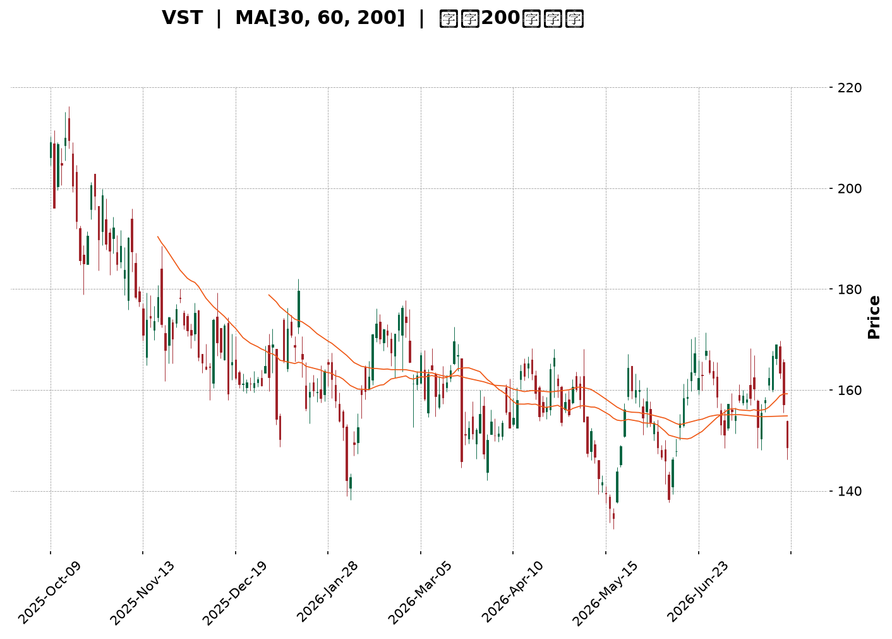
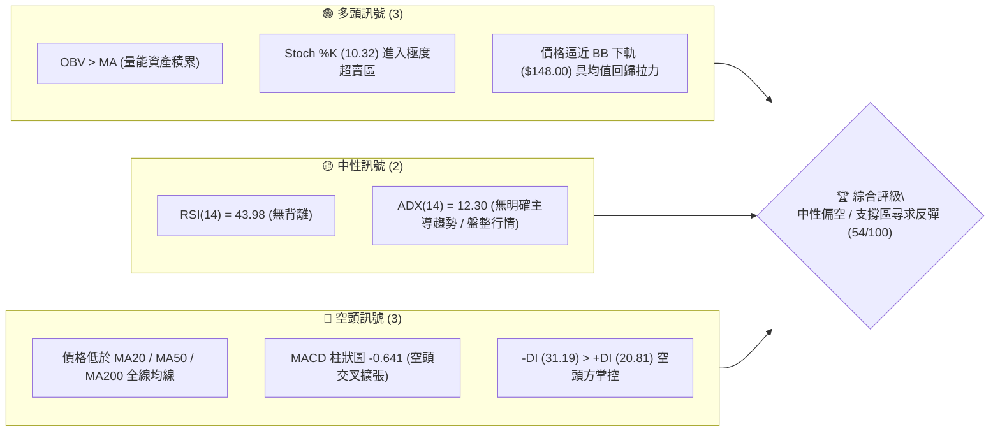
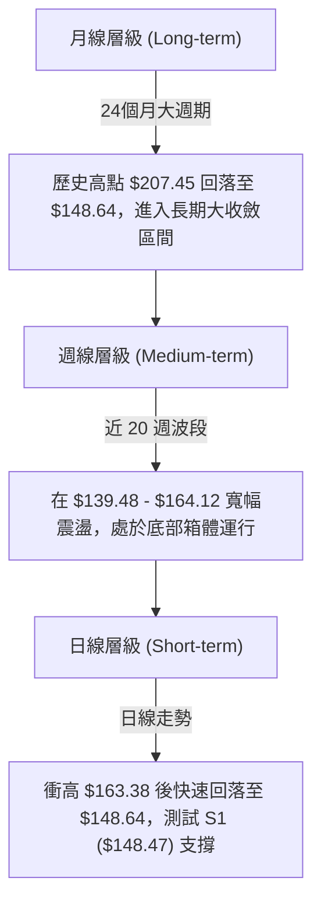
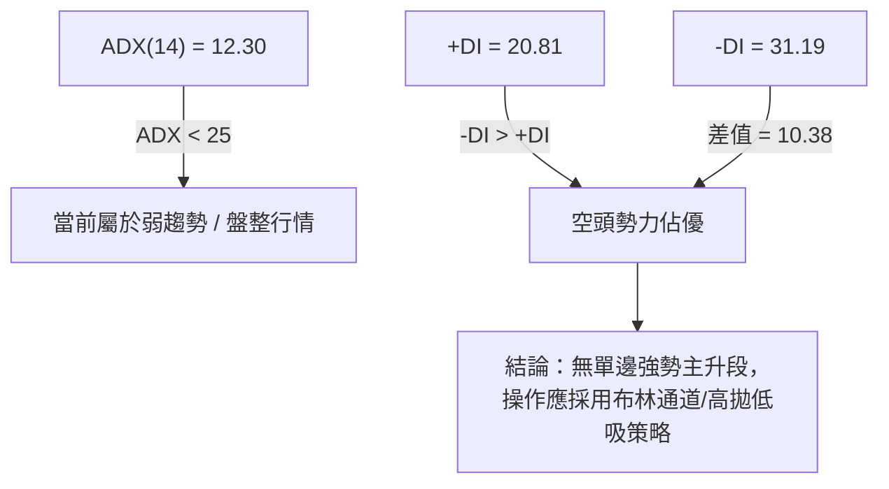
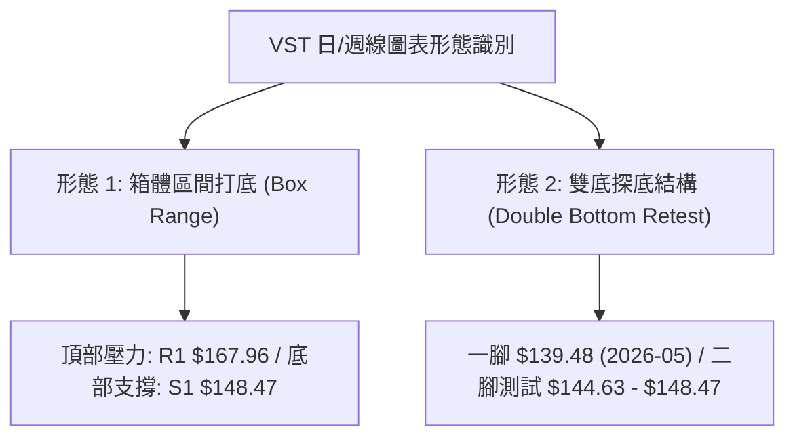
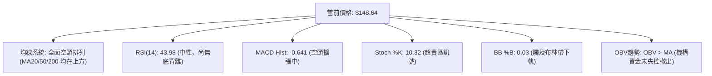
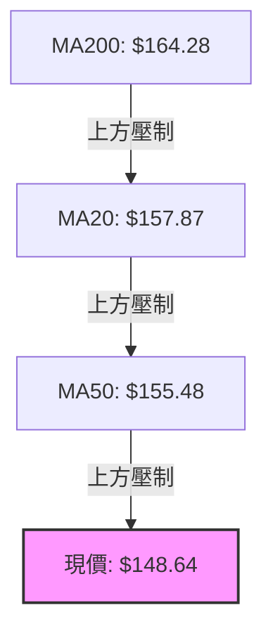
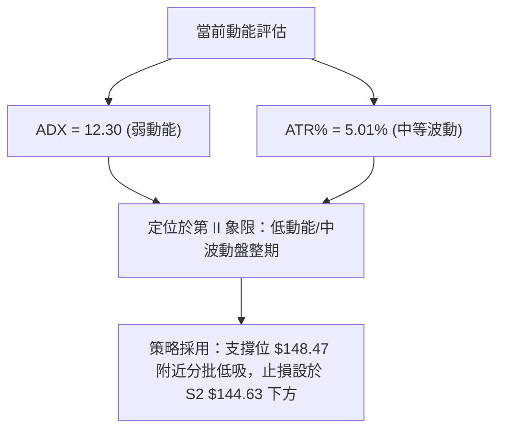
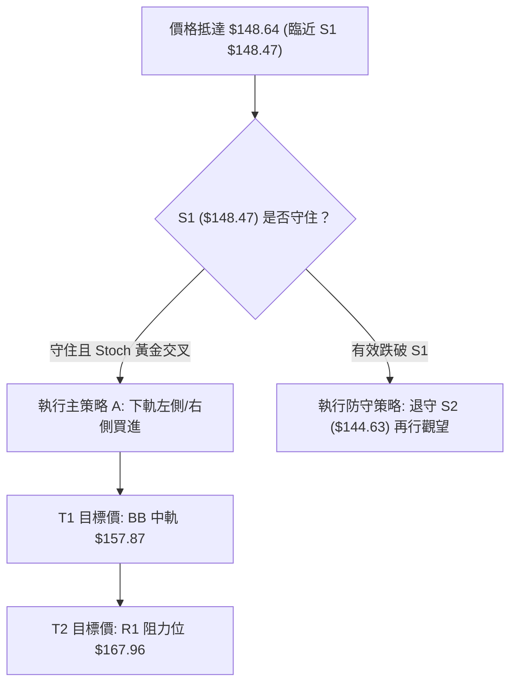
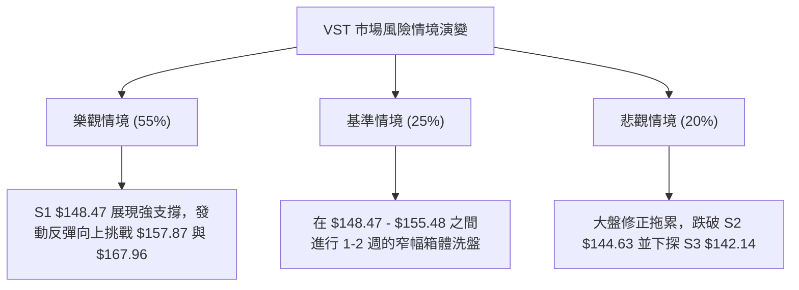

<details markdown="1">
<summary>📊 靜態圖表 (點擊展開)</summary>



</details>

<html>
<head><meta charset="utf-8" /></head>
<body>
    <div style="height:500px; width:100%;">                        <script>window.PlotlyConfig = {MathJaxConfig: 'local'};</script>
        <script charset="utf-8" src="https://cdn.plot.ly/plotly-3.7.0.min.js" integrity="sha256-jvTGqxNp8AGWEcvNLVuKr+8j5dGe9Yw51LQkmDH+IYA=" crossorigin="anonymous"></script>                <div id="candlestick-chart" class="plotly-graph-div" style="height:100%; width:100%;"></div>            <script>                window.PLOTLYENV=window.PLOTLYENV || {};                                if (document.getElementById("candlestick-chart")) {                    Plotly.newPlot(                        "candlestick-chart",                        [{"close":{"dtype":"f8","bdata":"AAAAYCEkakAAAADgZIFoQAAAAEDKFWpAAAAAwAuVaUAAAACgNz9qQAAAAGDgMGpAAAAAYHoQaUAAAADg5i1oQAAAAODiN2dAAAAA4OUhZ0AAAABAcdJnQAAAAEBNFGlAAAAAgCbPaEAAAAAAlrlnQAAAAEBh0WhAAAAAAIudZ0AAAABAnHBnQAAAACCpB2hAAAAAoAcfZ0AAAABgWJNnQAAAAIBW+2ZAAAAA4KbGZ0AAAADg+G9nQAAAAOBXTWZAAAAAQPswZkAAAADAJltlQAAAAIDlvmVAAAAAYMbIZUAAAADASrZlQAAAAIC0TGZAAAAAQDeiZUAAAACAgfxkQAAAAIA8zWVAAAAAADVEZUAAAADgIgJmQAAAAGDIQ2ZAAAAAYG+dZUAAAABAs3plQAAAAOAEXmVAAAAAoN\u002fqZUAAAAAAQc9kQAAAAEDLrWRAAAAAAAyEZEAAAAAAhY9kQAAAAEAHvGVAAAAAAKAsZUAAAADAq\u002fFkQAAAAIBhl2VAAAAAQM\u002fpY0AAAAAAY69kQAAAAOBSS2RAAAAAAPojZEAAAADgKidkQAAAACBsMGRAAAAA4ConZEAAAADAlyxkQAAAAMB7RWRAAAAAQFEcZEAAAADgxZhkQAAAAEBgT2RAAAAAYP4hZUAAAABAjUVjQAAAAMDnxWJAAAAAACe9ZEAAAAAAU4NlQAAAAIBOXmVAAAAAgB8QZUAAAACA2nVmQAAAAAB+xGRAAAAAoBOMY0AAAABgg\u002fJjQAAAAABd\u002fWNAAAAAQLT1Y0AAAABg5stjQAAAAKDReWRAAAAAYNulZEAAAAAgNURkQAAAAIA4vWNAAAAAgLM6Y0AAAABAfhJjQAAAAOAOxGFAAAAAIJzVYUAAAACglqdiQAAAACCJEWNAAAAAQBzlY0AAAABgqfZjQAAAACDNVGRAAAAAYIpgZUAAAABgbaZlQAAAAKAuQ2VAAAAAgMWAZUAAAAAAq11lQAAAAEDJ6mRAAAAAYLBkZUAAAAAACtxlQAAAAGChCmZAAAAA4CCtZUAAAADABrFkQAAAAOAfKGRAAAAAIBldZEAAAACABd5kQAAAAEDLxmNAAAAAIGVlZEAAAABASX5kQAAAAKAR12NAAAAA4HjkY0AAAAAAXtBjQAAAACBhMWRAAAAAgA18ZEAAAABA0jRlQAAAAIAQ3WRAAAAAABs6YkAAAACAguJiQAAAAKA0EGNAAAAAIIrpYkAAAADgyAJjQAAAAABnaGNAAAAAYK1qYkAAAAAg1cNiQAAAAKDUN2NAAAAAoP7eYkAAAACgGOxiQAAAAODhLmNAAAAAAIF1Y0AAAAAgKhFjQAAAAIBvUGNAAAAAAFK\u002fY0AAAADAs3dkQAAAAODJVmRAAAAAYI2pZEAAAADAZ2dkQAAAAOAO7GNAAAAAIDBWY0AAAADgTnJjQAAAAGAulGNAAAAAgNiDZEAAAAAAG8tkQAAAAEChHGRAAAAAwGUyY0AAAAAA0bNjQAAAAOACYmNAAAAAgAAUZEAAAACg+wRkQAAAAEAywmNAAAAAwII3Y0AAAAAAbnBiQAAAAMDL+mJAAAAAgERVYkAAAABgI81hQAAAACBztmFAAAAAYIJvYUAAAABg4RFhQAAAACCx0GBAAAAAYI75YUAAAACA45tiQAAAAKClgWNAAAAAQI6KZEAAAAAgov1jQAAAAKDJAWRAAAAAgDAAZEAAAADgZFFjQAAAAID4t2NAAAAAoLcyY0AAAACghS9jQAAAAKCpkWJAAAAA4DlWYkAAAAAgf0BiQAAAAIAUS2FAAAAAIJxFYkAAAAAgBHpiQAAAACDFKWNAAAAAIGzMY0AAAADAc9NjQAAAACCscGRAAAAA4FHoZEAAAADgekxkQAAAAADXW2RAAAAA4KP4ZEAAAAAgrm9kQAAAAAApTGRAAAAAACnUY0AAAADAHiVjQAAAAKCZ4WJAAAAAQAqnY0AAAAAgXHdjQAAAAIA9WmNAAAAAIFy\u002fY0AAAAAghdtjQAAAAADXw2NAAAAAgMLNY0AAAAAgXAdkQAAAAIDrEWNAAAAAgBRuY0AAAAAgrr9jQAAAAGCPSmRAAAAAIK7XZEAAAAAgXB9lQAAAAAApbGRAAAAAYI+iY0AAAADgepRiQA=="},"high":{"dtype":"f8","bdata":"KdeqhTpGakClX6fNp29qQA4nDmmJImpAJ1s8pnv\u002faUBIev32cuRqQAnTrz1jBmtAg+LPKrklakAdPOAxupRpQEGExjLFE2hALxsz0NmWZ0Dy1AZt5OxnQMOSPv4wJWlA8TD6fhdaaUDGmf7E5I9oQGEx\u002fSq4\u002fGhAwZAindq\u002faEBSH8iO4QJoQMQ5LfQsTGhAcafuRETWZ0BuaPPvp\u002fVnQMrTk5y9imdAxHK3swrJZ0D8LrFHe39oQDjBKVQjZWdAq\u002fO1DoqRZkBbBEovGidmQJbUfJgcaGZAM5PPrtBYZkBtSmXT5BVmQKzhV3Hpl2ZA5aFlpiiQZ0A0q\u002fvRtZ5lQApyKvYlz2VACWORtivAZUBpE1n5aCBmQMZPmjumgGZAhDSCIvD3ZUAoNkV8DOdlQJqt9KAgpGVAWE0We\u002fgpZkAwHEv4t\u002fxlQMzlb\u002f7342RAZO+M+ZEmZUBHUAVfm6pkQBD1xAVFxWVApvpJZBxoZkCiWLdeCollQICAQFGtpmVA3iX1eDzNZUAXXM6kn2ZlQJLw+ipfVmVA\u002fWBvE2p7ZEAvlTa\u002f8mdkQP+rCwBeRGRAU90fMZxRZEBmMkuK53dkQGikS06GU2RAJmBSO3qBZECntvn3AxplQE3qKVDOZWVAafBaJEiEZUAMlnY36QVlQETibZvYa2NAjiX69UDIZUAwOXi7EwhmQLAX1yvp3mVAjJ\u002fHzaVWZUBDH3m2zcFmQHkFh5i7VGVAv0DJblixZEAdjB9UDzFkQGJVRumQYWRAZbRuGXZNZEDDfGZ5U5tkQKbqMZ1OhWRAShc1NTfDZEDEZsn4Vu1kQI7wMkJ6gWRA6oRreTzxY0AHXLEmL4JjQK8CdvuNJ2NA08EgZGrwYUAEcGzD4PpiQFTSdh41a2NAqDUjfjAfZEA4yGeCU5tkQNm+dvYLuGRAfXhwKPdlZUDnzfKANAVmQHRfFrWB4GVAMzP3agGDZUDq9tvJrqBlQEs2oZG1a2VA53\u002fghJpmZUCPyVlEjO5lQFmw+bu2F2ZAFFEZmy06ZkBt9Z+FDgFmQIcDHOSFYmRAo5QeKjl4ZEA\u002fIygeNvBkQP+m45lL\u002fWRA1kRjTKCFZEAf9c7oYAplQPz7sdYzcWRAavQzEP5XZEA8UHaXF5lkQOXKtt+QYWRA7cE29hygZEBHUUcpupBlQAZxQlo6JGVAEtsNF5fHZEAo\u002fX\u002fQ0nVjQKwQqdBNPGNAydGc2FS3Y0D9ueaimw5jQCae5i07\u002f2NAPHKCw6XWY0CQPozwQuhiQLZxLjzig2NA2YaV5wBLY0C3k+EkghxjQLpvM6A4PmNABmuViLMiZEDwIVLWr0lkQF50DrIPzWNACrxYAdkPZEBzPwA+kKFkQOVL4zwwyWRAatNcU\u002fjVZEAUpSDgIwhlQJdRWkVCemRAKT+atv0bZEDHjyrvcNtjQHev5vu61GNA7ZgdbvSnZEB3z60r5wVlQHtHdF0XY2RA5gCWrjwdZEA1oEY+BO1jQDmzAFNQ\u002fWNAOkLKuOREZED8LLYRRXJkQL53EehiWGRAUMzp0\u002fEEZUC6dRFaEFljQKH3GhsqEWNAq8KC8ZvDYkAOqsz0aUJiQFkVxgQH42FAEkf1+JCcYUAh85gJCWthQFSH1lNIEGFAqi6e0FAWYkDq7nSVR6JiQKTPY1swq2NApA\u002fR9k7lZEApLBnQUZlkQIVY1GSkaWRAusF4ZgRCZEBhQng0gcpjQM2gz87DEWRAj2f+qQ22Y0C9y+b6YjpjQHj\u002fcQVgQmNAW0J0QeuiYkCIGzrC38JiQODlIVOO+WFA6RQP6zlWYkASuq\u002fWQ8liQH\u002fWwoNxZ2NAvcI6PyIoZEAXNWyEz0ZkQD5+vuFBQ2VAAAAAAABQZUAAAABgZrpkQAAAAOB6tGRAAAAAQDNrZUAAAACAwv1kQAAAAEAzs2RAAAAAYGauZEAAAACAPapjQAAAACCuh2NAAAAAIK6nY0AAAADAHu1jQAAAAOClj2NAAAAAgMIlZEAAAADgowBkQAAAAIDC7WNAAAAAYLgGZUAAAACAFN5kQAAAAEAzw2NAAAAAAACoY0AAAACAPdJjQAAAAGC4jmRAAAAAgOv5ZEAAAACA6yFlQAAAAOBROGVAAAAA4KPEZEAAAABgjz5jQA=="},"hovertemplate":"\u003cb\u003e%{x|%Y-%m-%d}\u003c\u002fb\u003e\u003cbr\u003e\u958b: $%{open:.2f}\u003cbr\u003e\u9ad8: $%{high:.2f}\u003cbr\u003e\u4f4e: $%{low:.2f}\u003cbr\u003e\u6536: $%{close:.2f}\u003cextra\u003e\u003c\u002fextra\u003e","low":{"dtype":"f8","bdata":"VeWIPXiPaUDJxPytwYBoQDaDJz408mhA4Su\u002fQhISaUBboGdQaLFpQOdXDU0x+mlAjLDr6gznaEDx+YtvPABoQFXNq8acGWdAg7aaNvVcZkC3UfjrEh5nQLPt9qhfOWhAVTb5AOx1aECDCebsjvZmQNtcJtzklWdA9vZFAEJ4Z0D6zMDlSNhmQE+ZGlckYmdAAxMLoYP3ZkC3yTOHNwVnQA7+AC8iWWZA8vR0W8P7ZUCyxWrarexmQP+FK4QwQmZAm+aaS8ARZkDvtXF1AjplQArn5uGVnGRAzcyHP92MZUA\u002f2K6eeD5lQI1n1Qjrr2VAhNMtDC+NZUA5b0yxhThkQNDFyE3IpmRAbOdYKvGmZEAm5WPXv4tlQOuU\u002fQCyKGZAPpPORil\u002fZUDYY50C8FRlQEzVwjv6B2VAFuEkuXI4ZUD6y1Fo8rhkQFIwebwlbGRACHvVV3+BZECwKyGkvr9jQDuIyJfzCmRAk542FsXZZEAdlecFM8lkQCXxeyx\u002fu2RAEjgHhlbBY0CNppjp2T9kQN8kMLbOQGRA+s6oBQANZEAcBc4NBvZjQHKAUR6J6mNAuID2VAv9Y0BOF\u002fUsc+9jQCmPnYGzE2RAXWRunM4YZEAgfcroAm5kQAxAoCzw92NAyZcsU4BqZEDYT+GUuSNjQEKzkt3omGJAT47qEoStZEDbunEaE3RkQN4tVu8oS2VACa4Q3vCyZEDs4MeYmmZlQJDn3cLtUWRA9MHkxzR6Y0ATnnqgECtjQCD0l\u002fi\u002f1mNAF6uSKQ2yY0Cw9PEw3K5jQM7rxZXWtmNAcm+2f+QWZEAvgo0xJcpjQEf7qwysjWNAT3yzklwzY0DH8aJwRL9iQFHKelNYXGFAkH+d+rpEYUChUP\u002flbGBiQCnPTevpa2JAcjRhwUBMY0AceN5omsNjQE8rd6Wj\u002fmNAtKxOB74hZECiHAeMZS9lQGNbNPKLJGVAzczMjCX5ZEApq8x9FBFlQNLTDokimGRA7idC5sdNZEBYROCTizNlQG8L4j4IdWRAFw0urWRNZUDEp7ed66tkQHBgi7PaEWNAtS62paP+Y0BlTbqFfCdkQGyq6Qigu2NAn+Wx8FBSY0Cj4KUlQXtkQDnXA0EaV2NAl+OE9pCIY0BJQKVSb6ljQB57CJ1i9WNAX\u002fJFEoc1ZECRbbWpY6FkQMK0e5bceGRA\u002fNIbIhQUYkAwnEilCaRiQMiCHFHoqmJA60APMm7FYkD1SzPvH0liQBIcw5o18WJA0ULJxKNMYkCIuoWJgsRhQPA6xlMG5mJArKadRB+9YkB6ffv2c7ViQEj7qRM8wmJAM5+on1RiY0DIQU9t7Q5jQDHMHg+rHGNAZv0D9fcNY0CDdIFH3QNkQCz33SyLPWRAp6jeMz5MZECUu17\u002fDkFkQNmc5Mknw2NAQeN\u002fT0M9Y0BQjn7XgVZjQLLd8wsWSWNAAcmUZNtdY0DcwbufatBjQDa4ZP7vz2NAV+BIorUbY0D2zDEMZHBjQGLbd6LTVmNAUqzs0AinY0B4oQzlcvJjQBWqTDwxjGNAn\u002fjcT8IxY0BarDNayFhiQPB5qp9ZQmJAU9p+HJouYkBN4Y2jE2phQOZVAgk+d2FAVbkIzMAzYUAxfbKbh7VgQEVGKvwuj2BAVb02ycAzYUDbOZY9rRViQLxT5\u002fxA0WJACwUJovW\u002fY0DHT6W098VjQCRDh9MlrGNAatvMwCOVY0DVR6iryeNiQLP\u002f\u002fY9RFWNAVUPwHI4XY0CRg6v1W79iQFECWi9maWJAjPD6FJxFYkD1bnYd8qphQAAam9fyNmFAaSJHo\u002f5rYUALD3bva1liQOPvJXk+wWJAQYPflrgTY0A1ZTJPr59jQDIRhX3M+WNAAAAAwMxcZEAAAADgo+RjQAAAAAAp\u002fGNAAAAA4FHAZEAAAACAFGZkQAAAAOCjIGRAAAAA4FGQY0AAAACgmeFiQAAAAAAAkGJAAAAA4FEAY0AAAADgUUBjQAAAAIA96mJAAAAAgD2uY0AAAACgmaFjQAAAAGBmhmNAAAAAIAahY0AAAACAFL5jQAAAAICTkGJAAAAA4HqEYkAAAABAM3NjQAAAAOBRAGRAAAAAACn0Y0AAAADgUaBkQAAAAIDrSWRAAAAAoEdxY0AAAABguEZiQA=="},"name":"\u50f9\u683c","open":{"dtype":"f8","bdata":"fMVXTIfEaUCjnClaexxqQIOb8gcmCWlAiaG1\u002fPedaUA6Xk\u002fbdQ5qQJ5uWhnGvGpANRorB+HZaUCHlnK9EWlpQOOJaOuPAmhAdiBLsLVYZ0C3UfjrEh5nQM\u002fVnrUbeWhA8TD6fhdaaUDGmf7E5I9oQNVjXRUU8GdA62ozRew7aEDZhH\u002frhOZnQKrOgsOYwGdAGIW2kTxqZ0BneWy3mS9nQFB65SY1xGZAeBlTjk84ZkDykg87vz9oQKeKGhXEJGdAXp1Bw6ByZkD+Uss7pAVmQNUMCqaSz2RAAIAYRHrWZUDdCZ2rNH5lQAlY8ZjfzWVAmfufY7YBZ0CzC6VlLGllQOGegl28G2VAUr7qC3WrZUD3Oi9h6KhlQDdTWH4+SGZABIdy2vXoZUD+tveLhdVlQC4sPY80fmVAdDR7jPxlZUD87gmVNvllQMzlb\u002f7342RAhZxLeeSVZED4QW7Z75RkQNY5QgIYLGRA\u002f9OI2SXPZUDCI48axIdlQLYd0eauvmRA56NS3TmpZUBiSbpzIp9kQCEHOdBGwGRArTj3lIVxZEA+IIIC+iNkQJ\u002fi98t3EWRAAAAA4ConZECbdMV7yRFkQOK4FMOyMWRAxPdPfhlOZEAgfcroAm5kQJF6ZTTjHGVAf8pbmhQRZUAMlnY36QVlQIN9eGlLWmNAQ00eeiu7ZUDHIOcE54ZkQO2bA5GjsGVAfnEKooYdZUC0pd9DupBlQKsEkefO4mRAoRRpNGcaZEDiA5czSNJjQHt3ruR2L2RAkEVA9t\u002fxY0BfmpXlswRkQMSPaPk84mNAAxIpXVixZEBW4fO8EbBkQIk7MQ++IWRAUApDwuGmY0D0nje9DnZjQEeQvVqOGGNAojQ1aI2TYUBr0Pv2wbJiQG77QP\u002fBsmJA\u002fxqKq6P+Y0Arf+sDb5FkQFVeLJArCWRAxWAzcHY+ZEBevm4nE01lQLOrpUH1sGVAzcyuyB4uZUB+TMKIY3plQOWAgVBqRWVA6lORNTHaZEAc7wM58XxlQAOzW2VkXGVAXgTX6YzQZUC18araXzdlQAdT0znOJ2RA4dW2QJ0kZEBftYiA3i1kQIBPaMvhf2RAZPKZWQlvY0BM\u002fLHt65xkQP\u002ffJMfBZGRAdL73X7GUY0BdqwD+CSpkQMT20F\u002fJEWRAtkct+otLZECPW0sDXqlkQHRaFaWu1mRAEtsNF5fHZECbEcRqn+diQFVYRNzcymJAg3luRBBZY0AW3KxTT6liQBIcw5o18WJAw2d6eiucY0AS2UYqXPZhQP2SdgZD6GJAgJv6J\u002fTfYkD05QVNhdpiQNx2sMZ622JABWzocs4QZEA9BV0HgXVjQLWWVHchKWNAZv0D9fcNY0Bq0TQf2kVkQMEZRAyYqGRAEtt+H+CKZEC7gUEs4cBkQG2jFbpNWmRAmNfAOyARZEBJQhvZibJjQEubIrK9d2NATXwCgJCDY0B04M+5nZhkQIMv5nC6SGRAoLjdQFIUZEBSdtYhSYJjQBZ04OnVwmNAJT248wWvY0BA9fybtFhkQEL5jOicKGRACATW3ftZZEC6dRFaEFljQNTOhYVgeWJA+mVlnP2oYkAOqsz0aUJiQDsNAlXVpWFAvyBliYtyYUCsu0WZx1lhQGulTeOF82BAAAAAHNM5YUD8xES7hyhiQPBHu4cz2mJAx8ZiOgLWY0AqjOmlVpdkQK+CDJ\u002fF02NAQyCHAtf4Y0DC0GVW+ZhjQGPJmQEad2NAte0B1FCJY0AMOJaef+piQK8anKEy+WJAt\u002f3beEiDYkAxHOFLzIZiQAbrZwXJ5GFAytzu\u002fl6ZYUBWG6t6YHliQIKpSuIUE2NAm2MnZyQhY0CH1zPp+8pjQPBXPGSgO2RAAAAAAClwZEAAAABgjwJkQAAAAMD1YGRAAAAAwB7dZEAAAAAghbtkQAAAAGBmdmRAAAAAYI9SZEAAAAAAAIBjQAAAAGBmPmNAAAAAQAoPY0AAAAAAKYRjQAAAACCuP2NAAAAA4FHgY0AAAACgmbFjQAAAAMDMtGNAAAAAAAAgZEAAAAAAAFBkQAAAAADXu2NAAAAAIIXLYkAAAADgo7BjQAAAACCuH2RAAAAAIIUDZEAAAADgUchkQAAAAIA9FmVAAAAAAACwZEAAAACgcD1jQA=="},"x":["2025-10-09T00:00:00-04:00","2025-10-10T00:00:00-04:00","2025-10-13T00:00:00-04:00","2025-10-14T00:00:00-04:00","2025-10-15T00:00:00-04:00","2025-10-16T00:00:00-04:00","2025-10-17T00:00:00-04:00","2025-10-20T00:00:00-04:00","2025-10-21T00:00:00-04:00","2025-10-22T00:00:00-04:00","2025-10-23T00:00:00-04:00","2025-10-24T00:00:00-04:00","2025-10-27T00:00:00-04:00","2025-10-28T00:00:00-04:00","2025-10-29T00:00:00-04:00","2025-10-30T00:00:00-04:00","2025-10-31T00:00:00-04:00","2025-11-03T00:00:00-05:00","2025-11-04T00:00:00-05:00","2025-11-05T00:00:00-05:00","2025-11-06T00:00:00-05:00","2025-11-07T00:00:00-05:00","2025-11-10T00:00:00-05:00","2025-11-11T00:00:00-05:00","2025-11-12T00:00:00-05:00","2025-11-13T00:00:00-05:00","2025-11-14T00:00:00-05:00","2025-11-17T00:00:00-05:00","2025-11-18T00:00:00-05:00","2025-11-19T00:00:00-05:00","2025-11-20T00:00:00-05:00","2025-11-21T00:00:00-05:00","2025-11-24T00:00:00-05:00","2025-11-25T00:00:00-05:00","2025-11-26T00:00:00-05:00","2025-11-28T00:00:00-05:00","2025-12-01T00:00:00-05:00","2025-12-02T00:00:00-05:00","2025-12-03T00:00:00-05:00","2025-12-04T00:00:00-05:00","2025-12-05T00:00:00-05:00","2025-12-08T00:00:00-05:00","2025-12-09T00:00:00-05:00","2025-12-10T00:00:00-05:00","2025-12-11T00:00:00-05:00","2025-12-12T00:00:00-05:00","2025-12-15T00:00:00-05:00","2025-12-16T00:00:00-05:00","2025-12-17T00:00:00-05:00","2025-12-18T00:00:00-05:00","2025-12-19T00:00:00-05:00","2025-12-22T00:00:00-05:00","2025-12-23T00:00:00-05:00","2025-12-24T00:00:00-05:00","2025-12-26T00:00:00-05:00","2025-12-29T00:00:00-05:00","2025-12-30T00:00:00-05:00","2025-12-31T00:00:00-05:00","2026-01-02T00:00:00-05:00","2026-01-05T00:00:00-05:00","2026-01-06T00:00:00-05:00","2026-01-07T00:00:00-05:00","2026-01-08T00:00:00-05:00","2026-01-09T00:00:00-05:00","2026-01-12T00:00:00-05:00","2026-01-13T00:00:00-05:00","2026-01-14T00:00:00-05:00","2026-01-15T00:00:00-05:00","2026-01-16T00:00:00-05:00","2026-01-20T00:00:00-05:00","2026-01-21T00:00:00-05:00","2026-01-22T00:00:00-05:00","2026-01-23T00:00:00-05:00","2026-01-26T00:00:00-05:00","2026-01-27T00:00:00-05:00","2026-01-28T00:00:00-05:00","2026-01-29T00:00:00-05:00","2026-01-30T00:00:00-05:00","2026-02-02T00:00:00-05:00","2026-02-03T00:00:00-05:00","2026-02-04T00:00:00-05:00","2026-02-05T00:00:00-05:00","2026-02-06T00:00:00-05:00","2026-02-09T00:00:00-05:00","2026-02-10T00:00:00-05:00","2026-02-11T00:00:00-05:00","2026-02-12T00:00:00-05:00","2026-02-13T00:00:00-05:00","2026-02-17T00:00:00-05:00","2026-02-18T00:00:00-05:00","2026-02-19T00:00:00-05:00","2026-02-20T00:00:00-05:00","2026-02-23T00:00:00-05:00","2026-02-24T00:00:00-05:00","2026-02-25T00:00:00-05:00","2026-02-26T00:00:00-05:00","2026-02-27T00:00:00-05:00","2026-03-02T00:00:00-05:00","2026-03-03T00:00:00-05:00","2026-03-04T00:00:00-05:00","2026-03-05T00:00:00-05:00","2026-03-06T00:00:00-05:00","2026-03-09T00:00:00-04:00","2026-03-10T00:00:00-04:00","2026-03-11T00:00:00-04:00","2026-03-12T00:00:00-04:00","2026-03-13T00:00:00-04:00","2026-03-16T00:00:00-04:00","2026-03-17T00:00:00-04:00","2026-03-18T00:00:00-04:00","2026-03-19T00:00:00-04:00","2026-03-20T00:00:00-04:00","2026-03-23T00:00:00-04:00","2026-03-24T00:00:00-04:00","2026-03-25T00:00:00-04:00","2026-03-26T00:00:00-04:00","2026-03-27T00:00:00-04:00","2026-03-30T00:00:00-04:00","2026-03-31T00:00:00-04:00","2026-04-01T00:00:00-04:00","2026-04-02T00:00:00-04:00","2026-04-06T00:00:00-04:00","2026-04-07T00:00:00-04:00","2026-04-08T00:00:00-04:00","2026-04-09T00:00:00-04:00","2026-04-10T00:00:00-04:00","2026-04-13T00:00:00-04:00","2026-04-14T00:00:00-04:00","2026-04-15T00:00:00-04:00","2026-04-16T00:00:00-04:00","2026-04-17T00:00:00-04:00","2026-04-20T00:00:00-04:00","2026-04-21T00:00:00-04:00","2026-04-22T00:00:00-04:00","2026-04-23T00:00:00-04:00","2026-04-24T00:00:00-04:00","2026-04-27T00:00:00-04:00","2026-04-28T00:00:00-04:00","2026-04-29T00:00:00-04:00","2026-04-30T00:00:00-04:00","2026-05-01T00:00:00-04:00","2026-05-04T00:00:00-04:00","2026-05-05T00:00:00-04:00","2026-05-06T00:00:00-04:00","2026-05-07T00:00:00-04:00","2026-05-08T00:00:00-04:00","2026-05-11T00:00:00-04:00","2026-05-12T00:00:00-04:00","2026-05-13T00:00:00-04:00","2026-05-14T00:00:00-04:00","2026-05-15T00:00:00-04:00","2026-05-18T00:00:00-04:00","2026-05-19T00:00:00-04:00","2026-05-20T00:00:00-04:00","2026-05-21T00:00:00-04:00","2026-05-22T00:00:00-04:00","2026-05-26T00:00:00-04:00","2026-05-27T00:00:00-04:00","2026-05-28T00:00:00-04:00","2026-05-29T00:00:00-04:00","2026-06-01T00:00:00-04:00","2026-06-02T00:00:00-04:00","2026-06-03T00:00:00-04:00","2026-06-04T00:00:00-04:00","2026-06-05T00:00:00-04:00","2026-06-08T00:00:00-04:00","2026-06-09T00:00:00-04:00","2026-06-10T00:00:00-04:00","2026-06-11T00:00:00-04:00","2026-06-12T00:00:00-04:00","2026-06-15T00:00:00-04:00","2026-06-16T00:00:00-04:00","2026-06-17T00:00:00-04:00","2026-06-18T00:00:00-04:00","2026-06-22T00:00:00-04:00","2026-06-23T00:00:00-04:00","2026-06-24T00:00:00-04:00","2026-06-25T00:00:00-04:00","2026-06-26T00:00:00-04:00","2026-06-29T00:00:00-04:00","2026-06-30T00:00:00-04:00","2026-07-01T00:00:00-04:00","2026-07-02T00:00:00-04:00","2026-07-06T00:00:00-04:00","2026-07-07T00:00:00-04:00","2026-07-08T00:00:00-04:00","2026-07-09T00:00:00-04:00","2026-07-10T00:00:00-04:00","2026-07-13T00:00:00-04:00","2026-07-14T00:00:00-04:00","2026-07-15T00:00:00-04:00","2026-07-16T00:00:00-04:00","2026-07-17T00:00:00-04:00","2026-07-20T00:00:00-04:00","2026-07-21T00:00:00-04:00","2026-07-22T00:00:00-04:00","2026-07-23T00:00:00-04:00","2026-07-24T00:00:00-04:00","2026-07-27T00:00:00-04:00","2026-07-28T00:00:00-04:00"],"type":"candlestick"},{"hovertemplate":"MA30: $%{y:.2f}\u003cextra\u003e\u003c\u002fextra\u003e","line":{"color":"#2196F3","dash":"dash","width":2},"mode":"lines","name":"MA30","x":["2025-10-09T00:00:00-04:00","2025-10-10T00:00:00-04:00","2025-10-13T00:00:00-04:00","2025-10-14T00:00:00-04:00","2025-10-15T00:00:00-04:00","2025-10-16T00:00:00-04:00","2025-10-17T00:00:00-04:00","2025-10-20T00:00:00-04:00","2025-10-21T00:00:00-04:00","2025-10-22T00:00:00-04:00","2025-10-23T00:00:00-04:00","2025-10-24T00:00:00-04:00","2025-10-27T00:00:00-04:00","2025-10-28T00:00:00-04:00","2025-10-29T00:00:00-04:00","2025-10-30T00:00:00-04:00","2025-10-31T00:00:00-04:00","2025-11-03T00:00:00-05:00","2025-11-04T00:00:00-05:00","2025-11-05T00:00:00-05:00","2025-11-06T00:00:00-05:00","2025-11-07T00:00:00-05:00","2025-11-10T00:00:00-05:00","2025-11-11T00:00:00-05:00","2025-11-12T00:00:00-05:00","2025-11-13T00:00:00-05:00","2025-11-14T00:00:00-05:00","2025-11-17T00:00:00-05:00","2025-11-18T00:00:00-05:00","2025-11-19T00:00:00-05:00","2025-11-20T00:00:00-05:00","2025-11-21T00:00:00-05:00","2025-11-24T00:00:00-05:00","2025-11-25T00:00:00-05:00","2025-11-26T00:00:00-05:00","2025-11-28T00:00:00-05:00","2025-12-01T00:00:00-05:00","2025-12-02T00:00:00-05:00","2025-12-03T00:00:00-05:00","2025-12-04T00:00:00-05:00","2025-12-05T00:00:00-05:00","2025-12-08T00:00:00-05:00","2025-12-09T00:00:00-05:00","2025-12-10T00:00:00-05:00","2025-12-11T00:00:00-05:00","2025-12-12T00:00:00-05:00","2025-12-15T00:00:00-05:00","2025-12-16T00:00:00-05:00","2025-12-17T00:00:00-05:00","2025-12-18T00:00:00-05:00","2025-12-19T00:00:00-05:00","2025-12-22T00:00:00-05:00","2025-12-23T00:00:00-05:00","2025-12-24T00:00:00-05:00","2025-12-26T00:00:00-05:00","2025-12-29T00:00:00-05:00","2025-12-30T00:00:00-05:00","2025-12-31T00:00:00-05:00","2026-01-02T00:00:00-05:00","2026-01-05T00:00:00-05:00","2026-01-06T00:00:00-05:00","2026-01-07T00:00:00-05:00","2026-01-08T00:00:00-05:00","2026-01-09T00:00:00-05:00","2026-01-12T00:00:00-05:00","2026-01-13T00:00:00-05:00","2026-01-14T00:00:00-05:00","2026-01-15T00:00:00-05:00","2026-01-16T00:00:00-05:00","2026-01-20T00:00:00-05:00","2026-01-21T00:00:00-05:00","2026-01-22T00:00:00-05:00","2026-01-23T00:00:00-05:00","2026-01-26T00:00:00-05:00","2026-01-27T00:00:00-05:00","2026-01-28T00:00:00-05:00","2026-01-29T00:00:00-05:00","2026-01-30T00:00:00-05:00","2026-02-02T00:00:00-05:00","2026-02-03T00:00:00-05:00","2026-02-04T00:00:00-05:00","2026-02-05T00:00:00-05:00","2026-02-06T00:00:00-05:00","2026-02-09T00:00:00-05:00","2026-02-10T00:00:00-05:00","2026-02-11T00:00:00-05:00","2026-02-12T00:00:00-05:00","2026-02-13T00:00:00-05:00","2026-02-17T00:00:00-05:00","2026-02-18T00:00:00-05:00","2026-02-19T00:00:00-05:00","2026-02-20T00:00:00-05:00","2026-02-23T00:00:00-05:00","2026-02-24T00:00:00-05:00","2026-02-25T00:00:00-05:00","2026-02-26T00:00:00-05:00","2026-02-27T00:00:00-05:00","2026-03-02T00:00:00-05:00","2026-03-03T00:00:00-05:00","2026-03-04T00:00:00-05:00","2026-03-05T00:00:00-05:00","2026-03-06T00:00:00-05:00","2026-03-09T00:00:00-04:00","2026-03-10T00:00:00-04:00","2026-03-11T00:00:00-04:00","2026-03-12T00:00:00-04:00","2026-03-13T00:00:00-04:00","2026-03-16T00:00:00-04:00","2026-03-17T00:00:00-04:00","2026-03-18T00:00:00-04:00","2026-03-19T00:00:00-04:00","2026-03-20T00:00:00-04:00","2026-03-23T00:00:00-04:00","2026-03-24T00:00:00-04:00","2026-03-25T00:00:00-04:00","2026-03-26T00:00:00-04:00","2026-03-27T00:00:00-04:00","2026-03-30T00:00:00-04:00","2026-03-31T00:00:00-04:00","2026-04-01T00:00:00-04:00","2026-04-02T00:00:00-04:00","2026-04-06T00:00:00-04:00","2026-04-07T00:00:00-04:00","2026-04-08T00:00:00-04:00","2026-04-09T00:00:00-04:00","2026-04-10T00:00:00-04:00","2026-04-13T00:00:00-04:00","2026-04-14T00:00:00-04:00","2026-04-15T00:00:00-04:00","2026-04-16T00:00:00-04:00","2026-04-17T00:00:00-04:00","2026-04-20T00:00:00-04:00","2026-04-21T00:00:00-04:00","2026-04-22T00:00:00-04:00","2026-04-23T00:00:00-04:00","2026-04-24T00:00:00-04:00","2026-04-27T00:00:00-04:00","2026-04-28T00:00:00-04:00","2026-04-29T00:00:00-04:00","2026-04-30T00:00:00-04:00","2026-05-01T00:00:00-04:00","2026-05-04T00:00:00-04:00","2026-05-05T00:00:00-04:00","2026-05-06T00:00:00-04:00","2026-05-07T00:00:00-04:00","2026-05-08T00:00:00-04:00","2026-05-11T00:00:00-04:00","2026-05-12T00:00:00-04:00","2026-05-13T00:00:00-04:00","2026-05-14T00:00:00-04:00","2026-05-15T00:00:00-04:00","2026-05-18T00:00:00-04:00","2026-05-19T00:00:00-04:00","2026-05-20T00:00:00-04:00","2026-05-21T00:00:00-04:00","2026-05-22T00:00:00-04:00","2026-05-26T00:00:00-04:00","2026-05-27T00:00:00-04:00","2026-05-28T00:00:00-04:00","2026-05-29T00:00:00-04:00","2026-06-01T00:00:00-04:00","2026-06-02T00:00:00-04:00","2026-06-03T00:00:00-04:00","2026-06-04T00:00:00-04:00","2026-06-05T00:00:00-04:00","2026-06-08T00:00:00-04:00","2026-06-09T00:00:00-04:00","2026-06-10T00:00:00-04:00","2026-06-11T00:00:00-04:00","2026-06-12T00:00:00-04:00","2026-06-15T00:00:00-04:00","2026-06-16T00:00:00-04:00","2026-06-17T00:00:00-04:00","2026-06-18T00:00:00-04:00","2026-06-22T00:00:00-04:00","2026-06-23T00:00:00-04:00","2026-06-24T00:00:00-04:00","2026-06-25T00:00:00-04:00","2026-06-26T00:00:00-04:00","2026-06-29T00:00:00-04:00","2026-06-30T00:00:00-04:00","2026-07-01T00:00:00-04:00","2026-07-02T00:00:00-04:00","2026-07-06T00:00:00-04:00","2026-07-07T00:00:00-04:00","2026-07-08T00:00:00-04:00","2026-07-09T00:00:00-04:00","2026-07-10T00:00:00-04:00","2026-07-13T00:00:00-04:00","2026-07-14T00:00:00-04:00","2026-07-15T00:00:00-04:00","2026-07-16T00:00:00-04:00","2026-07-17T00:00:00-04:00","2026-07-20T00:00:00-04:00","2026-07-21T00:00:00-04:00","2026-07-22T00:00:00-04:00","2026-07-23T00:00:00-04:00","2026-07-24T00:00:00-04:00","2026-07-27T00:00:00-04:00","2026-07-28T00:00:00-04:00"],"y":{"dtype":"f8","bdata":"AAAAAAAA+H8AAAAAAAD4fwAAAAAAAPh\u002fAAAAAAAA+H8AAAAAAAD4fwAAAAAAAPh\u002fAAAAAAAA+H8AAAAAAAD4fwAAAAAAAPh\u002fAAAAAAAA+H8AAAAAAAD4fwAAAAAAAPh\u002fAAAAAAAA+H8AAAAAAAD4fwAAAAAAAPh\u002fAAAAAAAA+H8AAAAAAAD4fwAAAAAAAPh\u002fAAAAAAAA+H8AAAAAAAD4fwAAAAAAAPh\u002fAAAAAAAA+H8AAAAAAAD4fwAAAAAAAPh\u002fAAAAAAAA+H8AAAAAAAD4fwAAAAAAAPh\u002fAAAAAAAA+H8AAAAAAAD4f6uqqpqGzGdA3t3d3Q+mZ0CamZlJCIhnQHd3dwd7Y2dAIiIiEqc+Z0BmZma2expnQJqZmen6+GZAzczMnIvbZkC8u7tbgcRmQBEREbG1tGZA3t3dnVeqZkDv7u7OopBmQBEREfEVa2ZAzczM7HJGZkC8u7tbcitmQO\u002fu7o4iEWZAzczM7E38ZUBERESkAedlQERERHQy0mVAVVVVtdK2ZUBVVVVlKJ5lQHd3d1c5h2VARERElDNoZUBmZma2LExlQKuqqtokOmVAq6qqCsAoZUBVVVU1qh5lQN7d3Z0VEmVAIiIics0DZUBEREQESfpkQN7d3b1O6WRARERElAjlZEBmZmbWZtZkQN7d3a2OvGRAZmZmNg64ZEBVVVUV1LNkQDMzM+MtrGRAZmZmBninZEAzMzMz169kQKuqqhq5qmRAq6qqGn+WZEAzMzNzI49kQImIiOhBiWRAAAAAQIOEZEBmZmb2\u002fX1kQBEREXFAc2RAvLu7a8JuZEAzMzMz+mhkQImIiAgsWWRAZmZmxlVTZECrqqpqkkVkQFVVVRX\u002fL2RAmpmZSVEcZEBEREQUiA9kQKuqqvr3BWRAq6qqSsQDZEBEREQU+AFkQKuqqsp6AmRA7+7ufkkNZEC8u7uLRhZkQGZmZgZnHmRAvLu7y48hZEB3d3enbjNkQAAAAHC6RWRAVVVVFVBLZEDe3d0dRU5kQM3MzJwDVGRAREREZD9ZZEBEREREJ0pkQN7d3e3wRGRARERElOhLZEAAAABAwlNkQHd3d5fwUWRAAAAAsKlVZECrqqrqm1tkQN7d3R0vVmRAZmZm5rxPZEBVVVVl4EtkQN7d3Z2\u002fT2RAERER0XVaZEARERHRq2xkQN7d3c0ah2RA3t3dXXSKZECamZkpa4xkQAAAANBfjGRAMzMzE\u002f2DZEDe3d3923tkQImIiLj6c2RA7+7unrdaZEAiIiLyGEJkQDMzMwOnMGRAMzMzczEaZEDNzMw8VwVkQCIiIkKL9mNA3t3drQnmY0CrqqpqNc5jQM3MzHzvtmNAiYiIqHmmY0De3d19kKRjQBEREbEepmNAmpmZGauoY0CJiIjotqRjQFVVVeX0pWNAiYiImOqcY0CamZnZ+5NjQDMzMxPBkWNAAAAAEBGXY0AiIiKybJ9jQCIiIqK7nmNAMzMzk76TY0AzMzMz6YZjQM3MzJxGemNAd3d3hxKKY0C8u7s7wZNjQGZmZhawmWNAERERcUmcY0C8u7uLaJdjQM3MzDzBk2NAq6qqigqTY0Crqqpq0YpjQFVVVdX4fWNAVVVV9bhxY0ARERFR6mFjQN7d3X21TWNAVVVVRQtBY0BERESEIj1jQERERHTGPmNAq6qquoxFY0AzMzMTe0FjQLy7u7ulPmNAERERgQA5Y0BEREQkvC9jQJqZman\u002fLWNAq6qq+tAsY0AiIiISlypjQLy7uwv5IWNAERERsWIPY0BERETUsvliQKuqqpql4WJAREREBMHZYkARERFBS89iQERERFRrzWJAREREhAjLYkCrqqraYcliQHd3d7cyz2JAVVVVBaDdYkARERFRfu1iQFVVVfVC+WJAMzMzI8YPY0Crqqo6QiZjQDMzM9NQPGNAd3d3x7xQY0BmZmYGcmJjQAAAAGATdGNA3t3dTWSCY0AAAAAgtYljQKuqqtpkiGNAq6qq6p6BY0ARERHRe4BjQCIiIjJrfmNAzczM3Lx8Y0AzMzOjzYJjQLy7u6tEfWNAvLu7Oz9\u002fY0AiIiJiDYRjQFVVVbW\u002fkmNAMzMzcyGoY0CJiIhIoMBjQKuqqipU22NAAAAA4PXmY0AzMzOz1+djQA=="},"type":"scatter"},{"hovertemplate":"MA60: $%{y:.2f}\u003cextra\u003e\u003c\u002fextra\u003e","line":{"color":"#9C27B0","dash":"dash","width":2},"mode":"lines","name":"MA60","x":["2025-10-09T00:00:00-04:00","2025-10-10T00:00:00-04:00","2025-10-13T00:00:00-04:00","2025-10-14T00:00:00-04:00","2025-10-15T00:00:00-04:00","2025-10-16T00:00:00-04:00","2025-10-17T00:00:00-04:00","2025-10-20T00:00:00-04:00","2025-10-21T00:00:00-04:00","2025-10-22T00:00:00-04:00","2025-10-23T00:00:00-04:00","2025-10-24T00:00:00-04:00","2025-10-27T00:00:00-04:00","2025-10-28T00:00:00-04:00","2025-10-29T00:00:00-04:00","2025-10-30T00:00:00-04:00","2025-10-31T00:00:00-04:00","2025-11-03T00:00:00-05:00","2025-11-04T00:00:00-05:00","2025-11-05T00:00:00-05:00","2025-11-06T00:00:00-05:00","2025-11-07T00:00:00-05:00","2025-11-10T00:00:00-05:00","2025-11-11T00:00:00-05:00","2025-11-12T00:00:00-05:00","2025-11-13T00:00:00-05:00","2025-11-14T00:00:00-05:00","2025-11-17T00:00:00-05:00","2025-11-18T00:00:00-05:00","2025-11-19T00:00:00-05:00","2025-11-20T00:00:00-05:00","2025-11-21T00:00:00-05:00","2025-11-24T00:00:00-05:00","2025-11-25T00:00:00-05:00","2025-11-26T00:00:00-05:00","2025-11-28T00:00:00-05:00","2025-12-01T00:00:00-05:00","2025-12-02T00:00:00-05:00","2025-12-03T00:00:00-05:00","2025-12-04T00:00:00-05:00","2025-12-05T00:00:00-05:00","2025-12-08T00:00:00-05:00","2025-12-09T00:00:00-05:00","2025-12-10T00:00:00-05:00","2025-12-11T00:00:00-05:00","2025-12-12T00:00:00-05:00","2025-12-15T00:00:00-05:00","2025-12-16T00:00:00-05:00","2025-12-17T00:00:00-05:00","2025-12-18T00:00:00-05:00","2025-12-19T00:00:00-05:00","2025-12-22T00:00:00-05:00","2025-12-23T00:00:00-05:00","2025-12-24T00:00:00-05:00","2025-12-26T00:00:00-05:00","2025-12-29T00:00:00-05:00","2025-12-30T00:00:00-05:00","2025-12-31T00:00:00-05:00","2026-01-02T00:00:00-05:00","2026-01-05T00:00:00-05:00","2026-01-06T00:00:00-05:00","2026-01-07T00:00:00-05:00","2026-01-08T00:00:00-05:00","2026-01-09T00:00:00-05:00","2026-01-12T00:00:00-05:00","2026-01-13T00:00:00-05:00","2026-01-14T00:00:00-05:00","2026-01-15T00:00:00-05:00","2026-01-16T00:00:00-05:00","2026-01-20T00:00:00-05:00","2026-01-21T00:00:00-05:00","2026-01-22T00:00:00-05:00","2026-01-23T00:00:00-05:00","2026-01-26T00:00:00-05:00","2026-01-27T00:00:00-05:00","2026-01-28T00:00:00-05:00","2026-01-29T00:00:00-05:00","2026-01-30T00:00:00-05:00","2026-02-02T00:00:00-05:00","2026-02-03T00:00:00-05:00","2026-02-04T00:00:00-05:00","2026-02-05T00:00:00-05:00","2026-02-06T00:00:00-05:00","2026-02-09T00:00:00-05:00","2026-02-10T00:00:00-05:00","2026-02-11T00:00:00-05:00","2026-02-12T00:00:00-05:00","2026-02-13T00:00:00-05:00","2026-02-17T00:00:00-05:00","2026-02-18T00:00:00-05:00","2026-02-19T00:00:00-05:00","2026-02-20T00:00:00-05:00","2026-02-23T00:00:00-05:00","2026-02-24T00:00:00-05:00","2026-02-25T00:00:00-05:00","2026-02-26T00:00:00-05:00","2026-02-27T00:00:00-05:00","2026-03-02T00:00:00-05:00","2026-03-03T00:00:00-05:00","2026-03-04T00:00:00-05:00","2026-03-05T00:00:00-05:00","2026-03-06T00:00:00-05:00","2026-03-09T00:00:00-04:00","2026-03-10T00:00:00-04:00","2026-03-11T00:00:00-04:00","2026-03-12T00:00:00-04:00","2026-03-13T00:00:00-04:00","2026-03-16T00:00:00-04:00","2026-03-17T00:00:00-04:00","2026-03-18T00:00:00-04:00","2026-03-19T00:00:00-04:00","2026-03-20T00:00:00-04:00","2026-03-23T00:00:00-04:00","2026-03-24T00:00:00-04:00","2026-03-25T00:00:00-04:00","2026-03-26T00:00:00-04:00","2026-03-27T00:00:00-04:00","2026-03-30T00:00:00-04:00","2026-03-31T00:00:00-04:00","2026-04-01T00:00:00-04:00","2026-04-02T00:00:00-04:00","2026-04-06T00:00:00-04:00","2026-04-07T00:00:00-04:00","2026-04-08T00:00:00-04:00","2026-04-09T00:00:00-04:00","2026-04-10T00:00:00-04:00","2026-04-13T00:00:00-04:00","2026-04-14T00:00:00-04:00","2026-04-15T00:00:00-04:00","2026-04-16T00:00:00-04:00","2026-04-17T00:00:00-04:00","2026-04-20T00:00:00-04:00","2026-04-21T00:00:00-04:00","2026-04-22T00:00:00-04:00","2026-04-23T00:00:00-04:00","2026-04-24T00:00:00-04:00","2026-04-27T00:00:00-04:00","2026-04-28T00:00:00-04:00","2026-04-29T00:00:00-04:00","2026-04-30T00:00:00-04:00","2026-05-01T00:00:00-04:00","2026-05-04T00:00:00-04:00","2026-05-05T00:00:00-04:00","2026-05-06T00:00:00-04:00","2026-05-07T00:00:00-04:00","2026-05-08T00:00:00-04:00","2026-05-11T00:00:00-04:00","2026-05-12T00:00:00-04:00","2026-05-13T00:00:00-04:00","2026-05-14T00:00:00-04:00","2026-05-15T00:00:00-04:00","2026-05-18T00:00:00-04:00","2026-05-19T00:00:00-04:00","2026-05-20T00:00:00-04:00","2026-05-21T00:00:00-04:00","2026-05-22T00:00:00-04:00","2026-05-26T00:00:00-04:00","2026-05-27T00:00:00-04:00","2026-05-28T00:00:00-04:00","2026-05-29T00:00:00-04:00","2026-06-01T00:00:00-04:00","2026-06-02T00:00:00-04:00","2026-06-03T00:00:00-04:00","2026-06-04T00:00:00-04:00","2026-06-05T00:00:00-04:00","2026-06-08T00:00:00-04:00","2026-06-09T00:00:00-04:00","2026-06-10T00:00:00-04:00","2026-06-11T00:00:00-04:00","2026-06-12T00:00:00-04:00","2026-06-15T00:00:00-04:00","2026-06-16T00:00:00-04:00","2026-06-17T00:00:00-04:00","2026-06-18T00:00:00-04:00","2026-06-22T00:00:00-04:00","2026-06-23T00:00:00-04:00","2026-06-24T00:00:00-04:00","2026-06-25T00:00:00-04:00","2026-06-26T00:00:00-04:00","2026-06-29T00:00:00-04:00","2026-06-30T00:00:00-04:00","2026-07-01T00:00:00-04:00","2026-07-02T00:00:00-04:00","2026-07-06T00:00:00-04:00","2026-07-07T00:00:00-04:00","2026-07-08T00:00:00-04:00","2026-07-09T00:00:00-04:00","2026-07-10T00:00:00-04:00","2026-07-13T00:00:00-04:00","2026-07-14T00:00:00-04:00","2026-07-15T00:00:00-04:00","2026-07-16T00:00:00-04:00","2026-07-17T00:00:00-04:00","2026-07-20T00:00:00-04:00","2026-07-21T00:00:00-04:00","2026-07-22T00:00:00-04:00","2026-07-23T00:00:00-04:00","2026-07-24T00:00:00-04:00","2026-07-27T00:00:00-04:00","2026-07-28T00:00:00-04:00"],"y":{"dtype":"f8","bdata":"AAAAAAAA+H8AAAAAAAD4fwAAAAAAAPh\u002fAAAAAAAA+H8AAAAAAAD4fwAAAAAAAPh\u002fAAAAAAAA+H8AAAAAAAD4fwAAAAAAAPh\u002fAAAAAAAA+H8AAAAAAAD4fwAAAAAAAPh\u002fAAAAAAAA+H8AAAAAAAD4fwAAAAAAAPh\u002fAAAAAAAA+H8AAAAAAAD4fwAAAAAAAPh\u002fAAAAAAAA+H8AAAAAAAD4fwAAAAAAAPh\u002fAAAAAAAA+H8AAAAAAAD4fwAAAAAAAPh\u002fAAAAAAAA+H8AAAAAAAD4fwAAAAAAAPh\u002fAAAAAAAA+H8AAAAAAAD4fwAAAAAAAPh\u002fAAAAAAAA+H8AAAAAAAD4fwAAAAAAAPh\u002fAAAAAAAA+H8AAAAAAAD4fwAAAAAAAPh\u002fAAAAAAAA+H8AAAAAAAD4fwAAAAAAAPh\u002fAAAAAAAA+H8AAAAAAAD4fwAAAAAAAPh\u002fAAAAAAAA+H8AAAAAAAD4fwAAAAAAAPh\u002fAAAAAAAA+H8AAAAAAAD4fwAAAAAAAPh\u002fAAAAAAAA+H8AAAAAAAD4fwAAAAAAAPh\u002fAAAAAAAA+H8AAAAAAAD4fwAAAAAAAPh\u002fAAAAAAAA+H8AAAAAAAD4fwAAAAAAAPh\u002fAAAAAAAA+H8AAAAAAAD4f0RERKzqWmZAEREROYxFZkAAAACQNy9mQKuqqtoEEGZAREREpFr7ZUDe3d3lJ+dlQGZmZmaU0mVAmpmZ0YHBZUB3d3dHLLplQN7d3WW3r2VAREREXGugZUAREREh449lQM3MzOwremVAZmZmFntlZUAREREpuFRlQAAAAIAxQmVARERELIg1ZUC8u7vr\u002fSdlQGZmZj6vFWVA3t3dPRQFZUAAAABo3fFkQGZmZjac22RA7+7ubkLCZEBVVVVl2q1kQKuqqmoOoGRAq6qqKkKWZEDNzMwkUZBkQERERDRIimRAiYiIeIuIZEAAAADIR4hkQCIiIuLag2RAAAAAMEyDZEDv7u6+6oRkQO\u002fu7o4kgWRA3t3dJa+BZECamZmZDIFkQAAAAMAYgGRAVVVVtVuAZEC8u7s7\u002f3xkQERERATVd2RAd3d31zNxZECamZnZcnFkQAAAAECZbWRAAAAAeBZtZECJiIjwzGxkQHd3d8e3ZGRAERERqT9fZEBERERMbVpkQDMzM9N1VGRAvLu7y+VWZEDe3d0dH1lkQJqZmfGMW2RAvLu702JTZEDv7u6e+U1kQFVVVeUrSWRA7+7uruBDZEAREREJ6j5kQJqZmcE6O2RA7+7ujgA0ZEDv7u6+LyxkQM3MzASHJ2RAd3d3n+AdZEAiIiLyYhxkQBEREdkiHmRAmpmZ4awYZEBEREREPQ5kQM3MzIx5BWRAZmZmhtz\u002fY0ARERHhW\u002fdjQHd3d8+H9WNA7+7u1kn6Y0BERESUPPxjQGZmZr7y+2NAREREJEr5Y0AiIiLiy\u002fdjQImIiBj482NAMzMz+2bzY0C8u7uLpvVjQAAAAKA992NAIiIiMhr3Y0AiIiKCyvljQFVVVbWwAGRAq6qqckMKZECrqqoyFhBkQDMzM\u002fMHE2RAIiIiQiMQZEDNzMxEoglkQKuqqvrdA2RAzczMFOH2Y0BmZmYudeZjQEREROxP12NARERENPXFY0Dv7u7GoLNjQAAAAGAgomNAmpmZeYqTY0B3d3f3q4VjQImIiPjaemNAmpmZMQN2Y0CJiIjIBXNjQGZmZjZicmNAVVVVzdVwY0BmZmaGOWpjQHd3d0f6aWNAmpmZyd1kY0De3d11SV9jQHd3dw\u002fdWWNAiYiI4DlTY0AzMzPDj0xjQGZmZp4wQGNAvLu7y782Y0AiIiI6GitjQImIiPjYI2NA3t3dhY0qY0AzMzOLkS5jQO\u002fu7mZxNGNAMzMzu\u002fQ8Y0BmZmZuc0JjQBERERmCRmNA7+7uVmhRY0CrqqrSiVhjQERERNQkXWNAZmZm3jphY0C8u7srLmJjQO\u002fu7m7kYGNAmpmZybdhY0AiIiLSa2NjQHd3d6eVY2NAq6qq0pVjY0AiIiJy+2BjQO\u002fu7naIXmNA7+7urt5aY0C8u7vjRFljQKuqqiqiVWNAMzMzGwhWY0AiIiI6UldjQImIiGBcWmNAIiIiEsJbY0BmZmaOKV1jQKuqquJ8XmNAIiIicltgY0AiIiJ6kVtjQA=="},"type":"scatter"},{"hovertemplate":"MA200: $%{y:.2f}\u003cextra\u003e\u003c\u002fextra\u003e","line":{"color":"#FF6F00","dash":"solid","width":2},"mode":"lines","name":"MA200","x":["2025-10-09T00:00:00-04:00","2025-10-10T00:00:00-04:00","2025-10-13T00:00:00-04:00","2025-10-14T00:00:00-04:00","2025-10-15T00:00:00-04:00","2025-10-16T00:00:00-04:00","2025-10-17T00:00:00-04:00","2025-10-20T00:00:00-04:00","2025-10-21T00:00:00-04:00","2025-10-22T00:00:00-04:00","2025-10-23T00:00:00-04:00","2025-10-24T00:00:00-04:00","2025-10-27T00:00:00-04:00","2025-10-28T00:00:00-04:00","2025-10-29T00:00:00-04:00","2025-10-30T00:00:00-04:00","2025-10-31T00:00:00-04:00","2025-11-03T00:00:00-05:00","2025-11-04T00:00:00-05:00","2025-11-05T00:00:00-05:00","2025-11-06T00:00:00-05:00","2025-11-07T00:00:00-05:00","2025-11-10T00:00:00-05:00","2025-11-11T00:00:00-05:00","2025-11-12T00:00:00-05:00","2025-11-13T00:00:00-05:00","2025-11-14T00:00:00-05:00","2025-11-17T00:00:00-05:00","2025-11-18T00:00:00-05:00","2025-11-19T00:00:00-05:00","2025-11-20T00:00:00-05:00","2025-11-21T00:00:00-05:00","2025-11-24T00:00:00-05:00","2025-11-25T00:00:00-05:00","2025-11-26T00:00:00-05:00","2025-11-28T00:00:00-05:00","2025-12-01T00:00:00-05:00","2025-12-02T00:00:00-05:00","2025-12-03T00:00:00-05:00","2025-12-04T00:00:00-05:00","2025-12-05T00:00:00-05:00","2025-12-08T00:00:00-05:00","2025-12-09T00:00:00-05:00","2025-12-10T00:00:00-05:00","2025-12-11T00:00:00-05:00","2025-12-12T00:00:00-05:00","2025-12-15T00:00:00-05:00","2025-12-16T00:00:00-05:00","2025-12-17T00:00:00-05:00","2025-12-18T00:00:00-05:00","2025-12-19T00:00:00-05:00","2025-12-22T00:00:00-05:00","2025-12-23T00:00:00-05:00","2025-12-24T00:00:00-05:00","2025-12-26T00:00:00-05:00","2025-12-29T00:00:00-05:00","2025-12-30T00:00:00-05:00","2025-12-31T00:00:00-05:00","2026-01-02T00:00:00-05:00","2026-01-05T00:00:00-05:00","2026-01-06T00:00:00-05:00","2026-01-07T00:00:00-05:00","2026-01-08T00:00:00-05:00","2026-01-09T00:00:00-05:00","2026-01-12T00:00:00-05:00","2026-01-13T00:00:00-05:00","2026-01-14T00:00:00-05:00","2026-01-15T00:00:00-05:00","2026-01-16T00:00:00-05:00","2026-01-20T00:00:00-05:00","2026-01-21T00:00:00-05:00","2026-01-22T00:00:00-05:00","2026-01-23T00:00:00-05:00","2026-01-26T00:00:00-05:00","2026-01-27T00:00:00-05:00","2026-01-28T00:00:00-05:00","2026-01-29T00:00:00-05:00","2026-01-30T00:00:00-05:00","2026-02-02T00:00:00-05:00","2026-02-03T00:00:00-05:00","2026-02-04T00:00:00-05:00","2026-02-05T00:00:00-05:00","2026-02-06T00:00:00-05:00","2026-02-09T00:00:00-05:00","2026-02-10T00:00:00-05:00","2026-02-11T00:00:00-05:00","2026-02-12T00:00:00-05:00","2026-02-13T00:00:00-05:00","2026-02-17T00:00:00-05:00","2026-02-18T00:00:00-05:00","2026-02-19T00:00:00-05:00","2026-02-20T00:00:00-05:00","2026-02-23T00:00:00-05:00","2026-02-24T00:00:00-05:00","2026-02-25T00:00:00-05:00","2026-02-26T00:00:00-05:00","2026-02-27T00:00:00-05:00","2026-03-02T00:00:00-05:00","2026-03-03T00:00:00-05:00","2026-03-04T00:00:00-05:00","2026-03-05T00:00:00-05:00","2026-03-06T00:00:00-05:00","2026-03-09T00:00:00-04:00","2026-03-10T00:00:00-04:00","2026-03-11T00:00:00-04:00","2026-03-12T00:00:00-04:00","2026-03-13T00:00:00-04:00","2026-03-16T00:00:00-04:00","2026-03-17T00:00:00-04:00","2026-03-18T00:00:00-04:00","2026-03-19T00:00:00-04:00","2026-03-20T00:00:00-04:00","2026-03-23T00:00:00-04:00","2026-03-24T00:00:00-04:00","2026-03-25T00:00:00-04:00","2026-03-26T00:00:00-04:00","2026-03-27T00:00:00-04:00","2026-03-30T00:00:00-04:00","2026-03-31T00:00:00-04:00","2026-04-01T00:00:00-04:00","2026-04-02T00:00:00-04:00","2026-04-06T00:00:00-04:00","2026-04-07T00:00:00-04:00","2026-04-08T00:00:00-04:00","2026-04-09T00:00:00-04:00","2026-04-10T00:00:00-04:00","2026-04-13T00:00:00-04:00","2026-04-14T00:00:00-04:00","2026-04-15T00:00:00-04:00","2026-04-16T00:00:00-04:00","2026-04-17T00:00:00-04:00","2026-04-20T00:00:00-04:00","2026-04-21T00:00:00-04:00","2026-04-22T00:00:00-04:00","2026-04-23T00:00:00-04:00","2026-04-24T00:00:00-04:00","2026-04-27T00:00:00-04:00","2026-04-28T00:00:00-04:00","2026-04-29T00:00:00-04:00","2026-04-30T00:00:00-04:00","2026-05-01T00:00:00-04:00","2026-05-04T00:00:00-04:00","2026-05-05T00:00:00-04:00","2026-05-06T00:00:00-04:00","2026-05-07T00:00:00-04:00","2026-05-08T00:00:00-04:00","2026-05-11T00:00:00-04:00","2026-05-12T00:00:00-04:00","2026-05-13T00:00:00-04:00","2026-05-14T00:00:00-04:00","2026-05-15T00:00:00-04:00","2026-05-18T00:00:00-04:00","2026-05-19T00:00:00-04:00","2026-05-20T00:00:00-04:00","2026-05-21T00:00:00-04:00","2026-05-22T00:00:00-04:00","2026-05-26T00:00:00-04:00","2026-05-27T00:00:00-04:00","2026-05-28T00:00:00-04:00","2026-05-29T00:00:00-04:00","2026-06-01T00:00:00-04:00","2026-06-02T00:00:00-04:00","2026-06-03T00:00:00-04:00","2026-06-04T00:00:00-04:00","2026-06-05T00:00:00-04:00","2026-06-08T00:00:00-04:00","2026-06-09T00:00:00-04:00","2026-06-10T00:00:00-04:00","2026-06-11T00:00:00-04:00","2026-06-12T00:00:00-04:00","2026-06-15T00:00:00-04:00","2026-06-16T00:00:00-04:00","2026-06-17T00:00:00-04:00","2026-06-18T00:00:00-04:00","2026-06-22T00:00:00-04:00","2026-06-23T00:00:00-04:00","2026-06-24T00:00:00-04:00","2026-06-25T00:00:00-04:00","2026-06-26T00:00:00-04:00","2026-06-29T00:00:00-04:00","2026-06-30T00:00:00-04:00","2026-07-01T00:00:00-04:00","2026-07-02T00:00:00-04:00","2026-07-06T00:00:00-04:00","2026-07-07T00:00:00-04:00","2026-07-08T00:00:00-04:00","2026-07-09T00:00:00-04:00","2026-07-10T00:00:00-04:00","2026-07-13T00:00:00-04:00","2026-07-14T00:00:00-04:00","2026-07-15T00:00:00-04:00","2026-07-16T00:00:00-04:00","2026-07-17T00:00:00-04:00","2026-07-20T00:00:00-04:00","2026-07-21T00:00:00-04:00","2026-07-22T00:00:00-04:00","2026-07-23T00:00:00-04:00","2026-07-24T00:00:00-04:00","2026-07-27T00:00:00-04:00","2026-07-28T00:00:00-04:00"],"y":{"dtype":"f8","bdata":"AAAAAAAA+H8AAAAAAAD4fwAAAAAAAPh\u002fAAAAAAAA+H8AAAAAAAD4fwAAAAAAAPh\u002fAAAAAAAA+H8AAAAAAAD4fwAAAAAAAPh\u002fAAAAAAAA+H8AAAAAAAD4fwAAAAAAAPh\u002fAAAAAAAA+H8AAAAAAAD4fwAAAAAAAPh\u002fAAAAAAAA+H8AAAAAAAD4fwAAAAAAAPh\u002fAAAAAAAA+H8AAAAAAAD4fwAAAAAAAPh\u002fAAAAAAAA+H8AAAAAAAD4fwAAAAAAAPh\u002fAAAAAAAA+H8AAAAAAAD4fwAAAAAAAPh\u002fAAAAAAAA+H8AAAAAAAD4fwAAAAAAAPh\u002fAAAAAAAA+H8AAAAAAAD4fwAAAAAAAPh\u002fAAAAAAAA+H8AAAAAAAD4fwAAAAAAAPh\u002fAAAAAAAA+H8AAAAAAAD4fwAAAAAAAPh\u002fAAAAAAAA+H8AAAAAAAD4fwAAAAAAAPh\u002fAAAAAAAA+H8AAAAAAAD4fwAAAAAAAPh\u002fAAAAAAAA+H8AAAAAAAD4fwAAAAAAAPh\u002fAAAAAAAA+H8AAAAAAAD4fwAAAAAAAPh\u002fAAAAAAAA+H8AAAAAAAD4fwAAAAAAAPh\u002fAAAAAAAA+H8AAAAAAAD4fwAAAAAAAPh\u002fAAAAAAAA+H8AAAAAAAD4fwAAAAAAAPh\u002fAAAAAAAA+H8AAAAAAAD4fwAAAAAAAPh\u002fAAAAAAAA+H8AAAAAAAD4fwAAAAAAAPh\u002fAAAAAAAA+H8AAAAAAAD4fwAAAAAAAPh\u002fAAAAAAAA+H8AAAAAAAD4fwAAAAAAAPh\u002fAAAAAAAA+H8AAAAAAAD4fwAAAAAAAPh\u002fAAAAAAAA+H8AAAAAAAD4fwAAAAAAAPh\u002fAAAAAAAA+H8AAAAAAAD4fwAAAAAAAPh\u002fAAAAAAAA+H8AAAAAAAD4fwAAAAAAAPh\u002fAAAAAAAA+H8AAAAAAAD4fwAAAAAAAPh\u002fAAAAAAAA+H8AAAAAAAD4fwAAAAAAAPh\u002fAAAAAAAA+H8AAAAAAAD4fwAAAAAAAPh\u002fAAAAAAAA+H8AAAAAAAD4fwAAAAAAAPh\u002fAAAAAAAA+H8AAAAAAAD4fwAAAAAAAPh\u002fAAAAAAAA+H8AAAAAAAD4fwAAAAAAAPh\u002fAAAAAAAA+H8AAAAAAAD4fwAAAAAAAPh\u002fAAAAAAAA+H8AAAAAAAD4fwAAAAAAAPh\u002fAAAAAAAA+H8AAAAAAAD4fwAAAAAAAPh\u002fAAAAAAAA+H8AAAAAAAD4fwAAAAAAAPh\u002fAAAAAAAA+H8AAAAAAAD4fwAAAAAAAPh\u002fAAAAAAAA+H8AAAAAAAD4fwAAAAAAAPh\u002fAAAAAAAA+H8AAAAAAAD4fwAAAAAAAPh\u002fAAAAAAAA+H8AAAAAAAD4fwAAAAAAAPh\u002fAAAAAAAA+H8AAAAAAAD4fwAAAAAAAPh\u002fAAAAAAAA+H8AAAAAAAD4fwAAAAAAAPh\u002fAAAAAAAA+H8AAAAAAAD4fwAAAAAAAPh\u002fAAAAAAAA+H8AAAAAAAD4fwAAAAAAAPh\u002fAAAAAAAA+H8AAAAAAAD4fwAAAAAAAPh\u002fAAAAAAAA+H8AAAAAAAD4fwAAAAAAAPh\u002fAAAAAAAA+H8AAAAAAAD4fwAAAAAAAPh\u002fAAAAAAAA+H8AAAAAAAD4fwAAAAAAAPh\u002fAAAAAAAA+H8AAAAAAAD4fwAAAAAAAPh\u002fAAAAAAAA+H8AAAAAAAD4fwAAAAAAAPh\u002fAAAAAAAA+H8AAAAAAAD4fwAAAAAAAPh\u002fAAAAAAAA+H8AAAAAAAD4fwAAAAAAAPh\u002fAAAAAAAA+H8AAAAAAAD4fwAAAAAAAPh\u002fAAAAAAAA+H8AAAAAAAD4fwAAAAAAAPh\u002fAAAAAAAA+H8AAAAAAAD4fwAAAAAAAPh\u002fAAAAAAAA+H8AAAAAAAD4fwAAAAAAAPh\u002fAAAAAAAA+H8AAAAAAAD4fwAAAAAAAPh\u002fAAAAAAAA+H8AAAAAAAD4fwAAAAAAAPh\u002fAAAAAAAA+H8AAAAAAAD4fwAAAAAAAPh\u002fAAAAAAAA+H8AAAAAAAD4fwAAAAAAAPh\u002fAAAAAAAA+H8AAAAAAAD4fwAAAAAAAPh\u002fAAAAAAAA+H8AAAAAAAD4fwAAAAAAAPh\u002fAAAAAAAA+H8AAAAAAAD4fwAAAAAAAPh\u002fAAAAAAAA+H8AAAAAAAD4fwAAAAAAAPh\u002fAAAAAAAA+H\u002f2KFw7DolkQA=="},"type":"scatter"}],                        {"template":{"data":{"barpolar":[{"marker":{"line":{"color":"rgb(17,17,17)","width":0.5},"pattern":{"fillmode":"overlay","size":10,"solidity":0.2}},"type":"barpolar"}],"bar":[{"error_x":{"color":"#f2f5fa"},"error_y":{"color":"#f2f5fa"},"marker":{"line":{"color":"rgb(17,17,17)","width":0.5},"pattern":{"fillmode":"overlay","size":10,"solidity":0.2}},"type":"bar"}],"carpet":[{"aaxis":{"endlinecolor":"#A2B1C6","gridcolor":"#506784","linecolor":"#506784","minorgridcolor":"#506784","startlinecolor":"#A2B1C6"},"baxis":{"endlinecolor":"#A2B1C6","gridcolor":"#506784","linecolor":"#506784","minorgridcolor":"#506784","startlinecolor":"#A2B1C6"},"type":"carpet"}],"choropleth":[{"colorbar":{"outlinewidth":0,"ticks":""},"type":"choropleth"}],"contourcarpet":[{"colorbar":{"outlinewidth":0,"ticks":""},"type":"contourcarpet"}],"contour":[{"colorbar":{"outlinewidth":0,"ticks":""},"colorscale":[[0.0,"#0d0887"],[0.1111111111111111,"#46039f"],[0.2222222222222222,"#7201a8"],[0.3333333333333333,"#9c179e"],[0.4444444444444444,"#bd3786"],[0.5555555555555556,"#d8576b"],[0.6666666666666666,"#ed7953"],[0.7777777777777778,"#fb9f3a"],[0.8888888888888888,"#fdca26"],[1.0,"#f0f921"]],"type":"contour"}],"heatmap":[{"colorbar":{"outlinewidth":0,"ticks":""},"colorscale":[[0.0,"#0d0887"],[0.1111111111111111,"#46039f"],[0.2222222222222222,"#7201a8"],[0.3333333333333333,"#9c179e"],[0.4444444444444444,"#bd3786"],[0.5555555555555556,"#d8576b"],[0.6666666666666666,"#ed7953"],[0.7777777777777778,"#fb9f3a"],[0.8888888888888888,"#fdca26"],[1.0,"#f0f921"]],"type":"heatmap"}],"histogram2dcontour":[{"colorbar":{"outlinewidth":0,"ticks":""},"colorscale":[[0.0,"#0d0887"],[0.1111111111111111,"#46039f"],[0.2222222222222222,"#7201a8"],[0.3333333333333333,"#9c179e"],[0.4444444444444444,"#bd3786"],[0.5555555555555556,"#d8576b"],[0.6666666666666666,"#ed7953"],[0.7777777777777778,"#fb9f3a"],[0.8888888888888888,"#fdca26"],[1.0,"#f0f921"]],"type":"histogram2dcontour"}],"histogram2d":[{"colorbar":{"outlinewidth":0,"ticks":""},"colorscale":[[0.0,"#0d0887"],[0.1111111111111111,"#46039f"],[0.2222222222222222,"#7201a8"],[0.3333333333333333,"#9c179e"],[0.4444444444444444,"#bd3786"],[0.5555555555555556,"#d8576b"],[0.6666666666666666,"#ed7953"],[0.7777777777777778,"#fb9f3a"],[0.8888888888888888,"#fdca26"],[1.0,"#f0f921"]],"type":"histogram2d"}],"histogram":[{"marker":{"pattern":{"fillmode":"overlay","size":10,"solidity":0.2}},"type":"histogram"}],"mesh3d":[{"colorbar":{"outlinewidth":0,"ticks":""},"type":"mesh3d"}],"parcoords":[{"line":{"colorbar":{"outlinewidth":0,"ticks":""}},"type":"parcoords"}],"pie":[{"automargin":true,"type":"pie"}],"scatter3d":[{"line":{"colorbar":{"outlinewidth":0,"ticks":""}},"marker":{"colorbar":{"outlinewidth":0,"ticks":""}},"type":"scatter3d"}],"scattercarpet":[{"marker":{"colorbar":{"outlinewidth":0,"ticks":""}},"type":"scattercarpet"}],"scattergeo":[{"marker":{"colorbar":{"outlinewidth":0,"ticks":""}},"type":"scattergeo"}],"scattergl":[{"marker":{"line":{"color":"#283442"}},"type":"scattergl"}],"scattermapbox":[{"marker":{"colorbar":{"outlinewidth":0,"ticks":""}},"type":"scattermapbox"}],"scattermap":[{"marker":{"colorbar":{"outlinewidth":0,"ticks":""}},"type":"scattermap"}],"scatterpolargl":[{"marker":{"colorbar":{"outlinewidth":0,"ticks":""}},"type":"scatterpolargl"}],"scatterpolar":[{"marker":{"colorbar":{"outlinewidth":0,"ticks":""}},"type":"scatterpolar"}],"scatter":[{"marker":{"line":{"color":"#283442"}},"type":"scatter"}],"scatterternary":[{"marker":{"colorbar":{"outlinewidth":0,"ticks":""}},"type":"scatterternary"}],"surface":[{"colorbar":{"outlinewidth":0,"ticks":""},"colorscale":[[0.0,"#0d0887"],[0.1111111111111111,"#46039f"],[0.2222222222222222,"#7201a8"],[0.3333333333333333,"#9c179e"],[0.4444444444444444,"#bd3786"],[0.5555555555555556,"#d8576b"],[0.6666666666666666,"#ed7953"],[0.7777777777777778,"#fb9f3a"],[0.8888888888888888,"#fdca26"],[1.0,"#f0f921"]],"type":"surface"}],"table":[{"cells":{"fill":{"color":"#506784"},"line":{"color":"rgb(17,17,17)"}},"header":{"fill":{"color":"#2a3f5f"},"line":{"color":"rgb(17,17,17)"}},"type":"table"}]},"layout":{"annotationdefaults":{"arrowcolor":"#f2f5fa","arrowhead":0,"arrowwidth":1},"autotypenumbers":"strict","coloraxis":{"colorbar":{"outlinewidth":0,"ticks":""}},"colorscale":{"diverging":[[0,"#8e0152"],[0.1,"#c51b7d"],[0.2,"#de77ae"],[0.3,"#f1b6da"],[0.4,"#fde0ef"],[0.5,"#f7f7f7"],[0.6,"#e6f5d0"],[0.7,"#b8e186"],[0.8,"#7fbc41"],[0.9,"#4d9221"],[1,"#276419"]],"sequential":[[0.0,"#0d0887"],[0.1111111111111111,"#46039f"],[0.2222222222222222,"#7201a8"],[0.3333333333333333,"#9c179e"],[0.4444444444444444,"#bd3786"],[0.5555555555555556,"#d8576b"],[0.6666666666666666,"#ed7953"],[0.7777777777777778,"#fb9f3a"],[0.8888888888888888,"#fdca26"],[1.0,"#f0f921"]],"sequentialminus":[[0.0,"#0d0887"],[0.1111111111111111,"#46039f"],[0.2222222222222222,"#7201a8"],[0.3333333333333333,"#9c179e"],[0.4444444444444444,"#bd3786"],[0.5555555555555556,"#d8576b"],[0.6666666666666666,"#ed7953"],[0.7777777777777778,"#fb9f3a"],[0.8888888888888888,"#fdca26"],[1.0,"#f0f921"]]},"colorway":["#636efa","#EF553B","#00cc96","#ab63fa","#FFA15A","#19d3f3","#FF6692","#B6E880","#FF97FF","#FECB52"],"font":{"color":"#f2f5fa"},"geo":{"bgcolor":"rgb(17,17,17)","lakecolor":"rgb(17,17,17)","landcolor":"rgb(17,17,17)","showlakes":true,"showland":true,"subunitcolor":"#506784"},"hoverlabel":{"align":"left"},"hovermode":"closest","mapbox":{"style":"dark"},"paper_bgcolor":"rgb(17,17,17)","plot_bgcolor":"rgb(17,17,17)","polar":{"angularaxis":{"gridcolor":"#506784","linecolor":"#506784","ticks":""},"bgcolor":"rgb(17,17,17)","radialaxis":{"gridcolor":"#506784","linecolor":"#506784","ticks":""}},"scene":{"xaxis":{"backgroundcolor":"rgb(17,17,17)","gridcolor":"#506784","gridwidth":2,"linecolor":"#506784","showbackground":true,"ticks":"","zerolinecolor":"#C8D4E3"},"yaxis":{"backgroundcolor":"rgb(17,17,17)","gridcolor":"#506784","gridwidth":2,"linecolor":"#506784","showbackground":true,"ticks":"","zerolinecolor":"#C8D4E3"},"zaxis":{"backgroundcolor":"rgb(17,17,17)","gridcolor":"#506784","gridwidth":2,"linecolor":"#506784","showbackground":true,"ticks":"","zerolinecolor":"#C8D4E3"}},"shapedefaults":{"line":{"color":"#f2f5fa"}},"sliderdefaults":{"bgcolor":"#C8D4E3","bordercolor":"rgb(17,17,17)","borderwidth":1,"tickwidth":0},"ternary":{"aaxis":{"gridcolor":"#506784","linecolor":"#506784","ticks":""},"baxis":{"gridcolor":"#506784","linecolor":"#506784","ticks":""},"bgcolor":"rgb(17,17,17)","caxis":{"gridcolor":"#506784","linecolor":"#506784","ticks":""}},"title":{"x":0.05},"updatemenudefaults":{"bgcolor":"#506784","borderwidth":0},"xaxis":{"automargin":true,"gridcolor":"#283442","linecolor":"#506784","ticks":"","title":{"standoff":15},"zerolinecolor":"#283442","zerolinewidth":2},"yaxis":{"automargin":true,"gridcolor":"#283442","linecolor":"#506784","ticks":"","title":{"standoff":15},"zerolinecolor":"#283442","zerolinewidth":2}}},"xaxis":{"rangeslider":{"visible":false},"title":{"text":"\u65e5\u671f"}},"font":{"size":11},"title":{"text":"VST  |  MA(30\u002f60\u002f200)  |  \u6700\u8fd1200\u4ea4\u6613\u65e5"},"yaxis":{"title":{"text":"\u80a1\u50f9 (USD)"}},"hovermode":"x unified","height":500},                        {"responsive": true}                    )                };            </script>        </div>
</body>
</html>

# VST 技術分析報告

> **報告日期**：2026-07-29 ｜ **語言**：繁體中文 ｜ **數據來源**：Yahoo Finance ｜ **當前價格**：$148.64

---

## 目錄

| 章節 | 內容 |
|------|------|
| [1. 技術面概覽](#1-技術面概覽) | 訊號儀表板、核心指標、評分卡 |
| [2. 趨勢分析](#2-趨勢分析) | 多時框趨勢、長中短期走勢 |
| [3. 圖表形態分析](#3-圖表形態分析) | 形態識別、K線組合、目標價 |
| [4. 支撐與阻力](#4-支撐與阻力) | 關鍵價位、斐波那契回調 |
| [5. 技術指標深度解讀](#5-技術指標深度解讀) | MA/RSI/MACD/布林/成交量 |
| [6. 動能與波動率](#6-動能與波動率) | 動能評估、ATR、Beta |
| [7. 多時框架總結](#7-多時框架總結) | 時框架評分矩陣 |
| [8. 交易策略建議](#8-交易策略建議) | 多空策略、風險報酬比 |
| [9. 風險提示與監控](#9-風險提示與監控) | 監控指標、風險場景 |

---

## 1. 技術面概覽

### 🎯 技術訊號儀表板



### 📊 核心指標速覽表

| 指標類別 | 指標名稱 | 當前數值 | 訊號 | 解讀 |
|----------|----------|----------|------|------|
| **價格** | 當前價格 | $148.64 | 🟡 中性 | 位於 52 週區間 18.7% 歷史低位區 |
| **均線** | MA20 | $157.87 | 🔴 空頭 | 價格位於 MA20 下方 -5.85% |
| **均線** | MA50 | $155.48 | 🔴 空頭 | 價格位於 MA50 下方 -4.40% |
| **均線** | MA200 | $164.28 | 🔴 空頭 | 價格位於 MA200 下方 -9.52% |
| **動能** | RSI(14) | 43.98 | 🟡 中性 | 處於 30-70 中性區間，略偏弱勢 |
| **動能** | MACD Hist | -0.641 | 🔴 空頭 | MACD 柱線為負，短期動能偏向下 |
| **動能** | Stoch %K | 10.32 | 🟢 多頭 | 進入過度賣超區 (Stoch %K < 20)，醞釀技術性反彈 |
| **波動** | ATR(14) | $7.45 | 🟡 中性 | 每日波動率約 5.01%，波動度尚屬正常 |
| **通道** | BB %B | 0.03 | 🟢 多頭 | 緊貼布林通道下軌 ($148.00)，極度貼軌 |
| **趨勢** | ADX(14) | 12.30 | 🟡 中性 | 趨勢極弱 (ADX < 25)，當前屬區間震盪行情 |

### 🏆 技術評分卡

```
╔══════════════════════════════════════════════════════════════════╗
║                   技術評分卡 — VST (2026-07-29)                 ║
╠══════════════════════════════════════════════════════════════════╣
║ 趨勢強度 (ADX)     ████░░░░░░░░░░░░░░░░  24.6/100 🟡 弱趨勢/盤整   ║
║ 動能指標 (RSI/MACD)████████░░░░░░░░░░░░  41.2/100 🔴 短線弱勢     ║
║ 支撐穩定度 (S1/BB) ████████████████░░░░  78.5/100 🟢 支撐極為強勁 ║
║ 成交量配合 (OBV)   ██████████████░░░░░░  71.0/100 🟢 量能支撐積累 ║
║ 形態完整度 (區間)  ████████████░░░░░░░░  60.0/100 🟡 區間打底中   ║
║ 均線排列 (MA5-200) ███████░░░░░░░░░░░░░  35.0/100 🔴 壓制明顯     ║
╠══════════════════════════════════════════════════════════════════╣
║ 綜合技術評分       ███████████░░░░░░░░░  53.4/100 ⚖️ 區間打底尋求反彈║
╚══════════════════════════════════════════════════════════════════╝
```

---

## 2. 趨勢分析

### 🌐 多時框趨勢分析



### 📈 長期趨勢 — 12個月走勢圖（Unicode）

```
VST 月線收盤價格走勢圖（2025-08 至 2026-07）
價格軸 ($)
$210.00 ┤              ● (2025-07 高點 $207.45)
$200.00 ┤          ●       ●
$190.00 ┤      ●               ●
$180.00 ┤                          ●       ●
$170.00 ┤                                      ●
$160.00 ┤                                          ●       ●   ●  
$150.00 ┤                                              ●           ●←當前 ($148.64)
$140.00 ┤─────────────────────────────────────────────────────────
         08  09  10  11  12  01  02  03  04  05  06  07  (月份)
```

**走勢特徵分析表格**：

| 時間區段 | 起始收盤價 | 結束收盤價 | 漲跌幅 (%) | 階段特徵描述 |
|----------|------------|------------|------------|--------------|
| **2025-08 ~ 2025-09** | $188.12 | $195.11 | +3.72% | 衝高回覆階段，高位橫盤築頂 |
| **2025-10 ~ 2025-12** | $187.52 | $160.88 | -14.21% | 主跌段出籠，跌破短期均線防線 |
| **2026-01 ~ 2026-03** | $157.91 | $150.12 | -4.93% | 震盪尋底，探尋下軌支撐區 |
| **2026-04 ~ 2026-06** | $157.62 | $158.63 | +0.64% | 底部位窄幅箱體橫盤築底 |
| **2026-07 (最新)** | $163.38 | $148.64 | -9.02% | 短線拉回重新測試 $148.47 關鍵支撐位 |

### 📊 中期趨勢（週線分析）

中期走勢顯示，VST 在過去 20 週內於 **$139.48** 至 **$164.12** 之間展現顯著的箱體震盪特徵。近期 2026-07-26 收盤為 $163.38，遭遇箱體上緣壓力後迅速下探至 2026-08-02 的 $148.64，該價位恰好極度接近支撐位 S1 ($148.47)。

### ⚡ 趨勢強度評估（ADX 解讀）



**ADX 趨勢強度對照表**：

| 指標項 | 數值 | 參考標準 | 當前趨勢診斷 |
|--------|------|----------|--------------|
| **ADX(14)** | **12.30** | < 25 (無趨勢/盤整) | 🔴 無單邊趨勢，極度陷入箱體沉悶洗盤 |
| **+DI** | **20.81** | 多方買盤力道 | 🟡 多頭動能衰退，買盤意願普遍保守 |
| **-DI** | **31.19** | 空方賣盤力道 | 🔴 空方相對主導，但未形成爆發性主跌段 |

---

## 3. 圖表形態分析

### 🔍 形態識別系統



**形態信心度與目標價評估表**：

| 形態類別 | 信心度 | 判斷依據（引用數據） | 完成度 | 目標價（附計算式） |
|----------|--------|----------------------|--------|--------------------|
| **箱體震盪 (Box Range)** | **85%** | 價格長期卡在 S1 ($148.47) 至 R1 ($167.96) 區間，且 ADX(14)=12.30 < 25。 | 85% | 區間上軌反彈目標 = **$167.96** (即 R1 阻力位) |
| **潛在雙底 (Double Bottom)** | **55%** | 前低 $139.48 (2026-05-17)，目前在 S1 ($148.47) 與 S2 ($144.63) 區域嘗試二次打底。 | 40% | 頸線 $164.12 + (頸線 $164.12 - 低點 $139.48) = **$188.76** (僅供潛在參考) |
| **複合幾何形態** | **30%** | 數據不足以支撐頭肩頂/旗形等複雜形態。 | 20% | 訊號不足，僅做指標型與區間邊界解讀。 |

### 🕯️ 重要 K 線形態分析（近 5 個月）

| 月份/日期 | 收盤價 | 關鍵 K 線組合 / 形態 | 解讀與意涵 | 訊號 |
|-----------|--------|----------------------|------------|------|
| **2026-03** | $150.12 | 長下影線探底 | 止跌訊號，尋找 52 週低位支撐 | 🟢 多頭 |
| **2026-04** | $157.62 | 溫和連陽吞噬 | 短線多頭反彈，突破短期均線 | 🟢 多頭 |
| **2026-05** | $160.01 | 衝高拉回陰線 (高點 $160.01, 低點 $139.48) | 劇烈洗盤，長下影回升試圖落底 | 🟡 中性 |
| **2026-06** | $158.63 | 十字星/窄幅孕線 | 多空極度平衡，方向面臨突破抉擇 | 🟡 中性 |
| **2026-07** | $148.64 | 中陰線倒拉回下軌 | 多頭攻擊失敗，回測下軌 S1 支撐 | 🔴 空頭 |

### 📉 ASCII 走勢形態示意圖

```
VST 箱體震盪與 S1 支撐測試示意圖
$170.00 ┤------------------------------------------- R1 ($167.96) 阻力牆
$165.00 ┤        ┌─┐           ┌─┐
$160.00 ┤      ┌─┘ └─┐       ┌─┘ └─┐
$155.00 ┤    ┌─┘     └─┐   ┌─┘     └─┐
$150.00 ┤───┐│         └───┤         └─●← 現價 $148.64 (極度逼近 S1)
$148.47 ┼───┴┴─────────────┴─────────── S1 支撐線 ($148.47) / 布林下軌 ($148.00)
$144.63 ┼────────────────────────────── S2 防禦線 ($144.63)
```

### 🎯 形態目標價計算

1. **區間反彈目標價（高信心度）**：
   $$\text{短線目標价 (T1)} = \text{BB 中軌 (MA20)} = \$157.87$$
   $$\text{波段目標價 (T2)} = \text{箱體上緣 (R1)} = \$167.96$$
2. **形態突破推算目標（低信心度，需突破 R1 才能成立）**：
   $$\text{形態高度} = \$167.96 (\text{R1}) - \$148.47 (\text{S1}) = \$19.49$$
   $$\text{向上突破目標價} = \$167.96 + \$19.49 = \$187.45$$

---

## 4. 支撐與阻力

### 🗺️ 關鍵價位分布圖（Unicode）

```
VST 價位結構分布圖 (由 OHLCV 與歷史波段計算)
═══════════════════════════════════════════════════════════════
$218.91 ║████████████████████████████████║ 52週高點 (0.0% Fib)
$198.51 ║████████████████████████        ║ 23.6% Fib 回調位
$185.89 ║████████████████████            ║ 38.2% Fib 回調位
$177.74 ║██████████████████              ║ 阻力位 R3 (+19.58%)
$175.69 ║█████████████████               ║ 50.0% Fib 回調位
$171.94 ║████████████████                ║ 阻力位 R2 (+15.67%)
$167.96 ║███████████████                 ║ 阻力位 R1 (+13.00%) / BB 上軌 $167.74
$165.49 ║██████████████                  ║ 61.8% Fib 回調位
$157.87 ║████████████                    ║ BB 中軌 (MA20)
$150.97 ║██████████                      ║ 78.6% Fib 回調位
$148.64 ╠════════════════════════════════╣ ◄ 當前價格 ($148.64)
$148.47 ║▓▓▓▓▓▓▓▓▓▓                      ║ 關鍵支撐 S1 (-0.11%) / BB 下軌 $148.00
$144.63 ║████████                        ║ 強支撐 S2 (-2.70%)
$142.14 ║██████                          ║ 支撐 S3 (-4.37%)
$132.47 ║████                            ║ 52週低點 (100.0% Fib)
═══════════════════════════════════════════════════════════════
```

### 🚧 阻力位分析表

| 阻力級別 | 價位 | 形成原因 | 突破難度 | 重要性 |
|----------|------|----------|----------|--------|
| **R1** | **$167.96** | 近一年波段高點聚類與布林通道上軌 ($167.74) 疊加 | 🔴 極高 | ★★★★★ (中期多空分水嶺) |
| **R2** | **$171.94** | MA240 長期均線 ($170.01) 與密集密集成交頭部區域 | 🔴 高 | ★★★★☆ (強壓力區) |
| **R3** | **$177.74** | 斐波那契 50.0% 回調位 ($175.69) 上方波段高點解套賣壓 | 🟡 中高 | ★★★☆☆ (遠端目標) |

### 🛡️ 支撐位分析表

| 支撐級別 | 價位 | 形成原因 | 守住機率 | 重要性 |
|----------|------|----------|----------|--------|
| **S1** | **$148.47** | 近一年波段低點聚類，極度貼近布林下軌 ($148.00) | 🟢 75% | ★★★★★ (短線第一防線) |
| **S2** | **$144.63** | 近期多次下影線探底交會點 (2026-03與05月低點區) | 🟢 85% | ★★★★☆ (中期結構防線) |
| **S3** | **$142.14** | 52週低點 $132.47 前最後一道波段支撐防線 | 🟡 90% | ★★★☆☆ (極限防禦點) |

### 📐 斐波那契回調位分析

當前價格 **$148.64** 位於 **78.6% 回調位 ($150.97)** 與 **100.0% 回調位 ($132.47)** 之間：
- **78.6% 回調位 ($150.97)**：已被日線小幅向下貫穿，目前現價跌破此關卡 1.54%，轉為極短線小阻力。
- **支撐重疊區**：現價 $148.64 距離下方 S1 ($148.47) 僅 **0.11%** 距離，並且與布林下軌 $148.00 形成**強烈的多重支撐共振區**。

---

## 5. 技術指標深度解讀

### 🎛️ 指標訊號總覽



### 📈 移動平均線排列分析



均線狀態解讀：
- 短期 MA5 ($160.96)、MA10 ($159.34)、MA20 ($157.87) 與中期 MA50 ($155.48) 呈現交叉纏繞後向下彎頭態勢。
- 現價 $148.64 低於所有短期、中期與長期均線，顯示**均線系統呈空頭壓制排列**。但因價格偏離 MA20 已達 -5.85%，負乖離率增大，技術面存在向 MA20 均值回歸的需求。

### 📉 RSI(14) 分析

RSI(14) 目前數值為 **43.98**：
```
RSI(14) 強度進度條：
[0] ░░░░░░░░░░░░░░░▓▓▓▓▓▓▓▓░░░░░░░░░░░░░░░░ [100]  (43.98 / 中性區間)
```
- **超買/超賣狀態**：處於 30–70 中性區間，無過度過熱或極度枯竭現象。
- **背離判斷**：RSI 走勢與價格走勢同步下探，**無明顯頂背離或底背離**現象。

### 📊 MACD(12/26/9) 訊號解讀

- **MACD 線**：0.558
- **Signal 線**：1.199
- **MACD Histogram**：-0.641
- **解讀**：MACD 線向下跌破 Signal 線，柱狀圖呈現負值擴大（-0.641），顯示短線空頭力道佔優勢，尚未出現柱狀圖收窄的綠柱轉紅訊號。

### 📦 布林通道分析

```
VST 布林通道價位關係示意圖
$167.74 ┼────────────────────────────── BB 上軌 ($167.74)
$157.87 ┼────────────────────────────── BB 中軌 (MA20: $157.87)
$148.64 ┼───● (現價 $148.64, %B = 0.03)
$148.00 ┼────────────────────────────── BB 下軌 ($148.00)
```
- **%B 指標**：0.03（接近 0，代表價格極度貼近下軌）。
- **解讀**：當前 ADX 為 12.30（盤整市場），在盤整行情中，布林通道下軌往往提供極強的技術性反彈支撐，極少出現沿著下軌持續向下爆發單邊主跌的情況。

### 💹 成交量分析（量價配合度）

- **最新成交量**：5,252,576
- **20日均量**：4,013,739（量比 **1.31x**）
- **OBV 趨勢**：數據顯示 **OBV > MA**。
- **解讀**：最新成交量放量至 1.31 倍均量，配合價格下探 S1 ($148.47)，顯示在 $148.47 關鍵支撐位有籌碼承接。OBV 長期大於其均線，表明在中長期視角下，主力資金並未爆發性恐慌出逃，逢低積累特徵依然存在。

---

## 6. 動能與波動率

### ⚡ 動能評估

| 象限分區 | 動能強度 (Momentum) | 波動率水準 (Volatility) | 當前 VST 狀態 | 交易戰術評估 |
|----------|---------------------|-------------------------|---------------|--------------|
| **象限 I** | 強 (ADX>25, +DI高) | 低 (ATR%<3%) | ✕ | 最佳順勢突破買點 |
| **象限 II** | 弱 (ADX<25, -DI主導) | 低 (ATR%≈5%) | **✓ (當前位置)** | **區間高拋低吸 / 支撐位低吸** |
| **象限 III** | 強 (-DI極高) | 高 (ATR%>8%) | ✕ | 恐慌主跌段，嚴格避開 |
| **象限 IV** | 強 (+DI極高) | 高 (ATR%>8%) | ✕ | 暴漲主升段，追高風險大 |



### 📊 ATR 波動率分析

- **ATR(14)**：$7.45（佔當前股價 5.01%）。
- **每日波動區間**：$148.64 ± $7.45（預計每日正常波動範圍在 $141.19 至 $156.09 之間）。
- **止損距離建議**：若採取波段操作，建議止損空間設定為 1.0 倍至 1.5 倍 ATR，即 **$7.45 – $11.18**。

### 📐 Beta 與市場相關性

- **Beta**：**1.409**
- **解讀**：VST 的波動度高於大盤（S&P 500）約 40.9%。在整體市場出現震盪時，VST 的價格彈性更大，下探支撐後反彈的幅度亦會相對較大。

---

## 7. 多時框架總結

### 📋 時框架評分表

| 時框架 | 趨勢方向 | 動能指標 | 均線排列 | 形態結構 | 綜合評分 | 操作建議 |
|--------|----------|----------|----------|----------|----------|----------|
| **長期 (月線)** | 🟢 偏多 | 🟡 中性 (RSI 44) | 🟢 均線支撐 | 寬幅收斂區間 | **65/100** | 長線分批逢低佈局 |
| **中期 (週線)** | 🟡 盤整 | 🔴 偏弱 (-DI主導) | 🔴 跌破MA200 | 箱體底層打底 | **52/100** | 區間操作，嚴控倉位 |
| **短期 (日線)** | 🔴 偏空 | 🟢 超賣 (Stoch 10) | 🔴 全線向下壓制 | 測試 S1/BB 下軌 | **45/100** | 尋求短線止跌反彈買點 |

### 🔲 綜合訊號矩陣

```
                     短線 (日線)    中線 (週線)    長線 (月線)
  趨勢方向 (ADX/MA)    🔴 空頭        🟡 盤整        🟢 多頭
  動能指標 (RSI/MACD)  🔴 空頭        🔴 偏弱        🟡 中性
  成交量/OBV           🟢 積累        🟢 支撐        🟢 多頭
  支撐阻力結構         🟢 臨近S1      🟢 箱體底部    🟢 78.6% Fib
```

### ⚖️ 多時框收斂結論

依據多時框收斂規則：當前 **ADX(14) = 12.30 (<25)**，市場處於明確的**盤整區間行情**而非單邊趨勢行情。
因此，短期日線的空頭均線壓制不應被解讀為崩跌的開始，而應以**布林通道上下軌與水平支撐阻力位（S1 $148.47 / R1 $167.96）**作為主導交易架構。
**最終收斂方向**：**中性偏多（區間下軌尋求反彈）**。

---

## 8. 交易策略建議

### 🗺️ 策略決策流程圖



### 🧭 策略路由

> **當前主策略方向 = 🟢 箱體下軌低吸做多（綜合技術評分 53.4/100，處於 ADX<25 盤整區間下緣）**

### 🎯 價格情境階梯 (Price Scenarios)

| 觸發條件 | 下一目標 | 後續延伸 | 情境含義 |
|----------|----------|----------|----------|
| **突破 R1 $167.96** | R2 $171.94 | R3 $177.74 | 箱體向上突破，中線轉強進入主升段 |
| **站穩 S1 $148.47** | BB 中軌 $157.87 | R1 $167.96 | 守住區間下軌，展開均值回歸反彈行情 |
| **跌破 S1 $148.47** | S2 $144.63 | S3 $142.14 | 短線下探尋底，測試中期防禦線 |

### 📊 情境機率分佈

| 情境劇本 | 機率 | 主要依據 |
|----------|------|----------|
| **S1 區間反彈向上** | **55%** | 價格貼近 BB 下軌 ($148.00)，Stoch %K=10.32 極度超賣，OBV > MA |
| **區間下緣窄幅震盪** | **25%** | ADX=12.30 顯示動能極低，多空交投謹慎 |
| **向下跌破 S2 探底** | **20%** | MACD 柱狀圖 -0.641 尚未綠轉紅，均線全線向下壓制 |

### 🟢 主策略詳情

| 策略要素 | 策略 A (主策略：區間低吸做多) | 策略 B (次要策略：突破加碼做多) |
|----------|--------------------------------|----------------------------------|
| **策略類型** | 區間下軌均值回歸 (Mean Reversion) | 強勢突破順勢跟進 (Breakout) |
| **進場條件** | 價格於 $148.47 (S1) 附近出現止跌訊號 | 日線收盤價強勢突破 MA20 ($157.87) |
| **進場價格** | **$148.64** (當前價位區間) | **$158.50** (確認突破 MA20 後) |
| **止損價格** | **$144.63** (跌破 S2 止損) | **$154.86** (跌破 MA60 止損) |
| **目標價 T1** | **$157.87** (BB 中軌 / MA20) | **$167.96** (阻力 R1) |
| **目標價 T2** | **$167.96** (阻力 R1) | **$171.94** (阻力 R2) |
| **單筆風險** | $4.01 / 股 (-2.70%) | $3.64 / 股 (-2.30%) |
| **T1 預期報酬** | $9.23 / 股 (+6.21%) | $9.46 / 股 (+5.97%) |
| **風險報酬比** | **2.30 : 1** (T1 基準) | **2.60 : 1** (T1 基準) |
| **建議倉位** | **15% - 20%** | **10% - 15%** |

### 🔴 反向風險觸發點（空頭對沖提示）

若日線收盤價**有效跌破 S2 ($144.63)** 且 MACD 負柱狀圖繼續擴大，顯示箱體支撐失效，應立即執行多頭止損；激進型交易者可於跌破 $144.63 後反手短空，下看 S3 ($142.14) 及 52 週低點 ($132.47)。

### ⭐ 整體訊號強度評星

```
做多訊號強度：★★★☆☆  (3.5/5 星 — 具備風險報酬比優勢，但受限於均線壓制)
做空訊號強度：★★☆☆☆  (2.0/5 星 — 逼近強支撐與超賣區，追空勝率低)
整體可信度：  ★★★★☆  (4.0/5 星 — 支撐與指標超賣多重確認)
```

---

## 9. 風險提示與監控

### ✅ 關鍵監控指標 Checklist

```
╔══════════════════════════════════════════════════════════════════╗
║                    關鍵技術指標監控清單                          ║
╠══════════════════════════════════════════════════════════════════╣
║ [ ] S1 支撐守護 ($148.47)：收盤價是否維持在 $148.47 之上        ║
║ [ ] Stoch 交叉訊號：%K (10.32) 是否向上穿過 %D (40.72) 形成金叉║
║ [ ] MACD 柱線收窄：MACD Hist (-0.641) 是否出現負值縮減          ║
║ [ ] 成交量變化：反彈時成交量是否大於 20日均量 (4,013,739)       ║
║ [ ] MA20 攻防 ($157.87)：價格能否進一步挑戰並站穩 BB 中軌        ║
╚══════════════════════════════════════════════════════════════════╝
```

### ⚠️ 風險場景分析



### 🛡️ 風險管理重要提醒

1. **嚴格執行止損纪律**：若以 $148.64 進場，止損位必須嚴格設定於 **$144.63**。一旦跌破，代表二次打底失敗，切勿抱持僥倖心理抗單。
2. **波動率調整倉位**：鑑於 ATR(14) 為 $7.45 (5.01%)，每日高低差約有 7 美元以上的波動空間，建倉時應採取**分批進場策略**（如 $148.64 建倉一半，接近 $148.47 再補齊）。
3. **大盤 Beta 連動風險**：VST 的 Beta 高達 1.409，若美股大盤整體出現流動性緊縮或大跌，VST 易受大盤拖累下破支撐。

---

## 📋 報告總結

```
╔══════════════════════════════════════════════════════════════════╗
║                    VST 技術分析報告總結                          ║
╠══════════════════════════════════════════════════════════════════╣
║ 報告日期：2026-07-29                                             ║
║ 當前價格：$148.64                                                ║
║ 分析評級：⚖️ 區間打底 / 尋求下軌反彈 (評分: 53.4/100)           ║
╠══════════════════════════════════════════════════════════════════╣
║ 關鍵結論：                                                       ║
║ ├─ 長期趨勢：🟢 偏多 (大週期歷史高點回落後的大區間整理)           ║
║ ├─ 中期趨勢：🟡 盤整 (ADX=12.30 < 25，處於箱體震盪結構)          ║
║ ├─ 短期趨勢：🔴 偏空 (均線全線壓制，但 Stoch 10.32 已極度超賣)    ║
║ ├─ 關鍵支撐：S1 $148.47 / S2 $144.63 / S3 $142.14               ║
║ ├─ 關鍵阻力：R1 $167.96 / R2 $171.94 / R3 $177.74               ║
║ └─ 分析師目標：均價 $222.83 (華爾街共識 Strong Buy)              ║
╠══════════════════════════════════════════════════════════════════╣
║ 最優策略組合：                                                   ║
║ 1. 🥇 最佳機會：於 $148.47 - $148.64 區域佈局區間反彈多單        ║
║               (止損 $144.63，目標 T1 $157.87 / T2 $167.96)       ║
║ 2. 🥈 次選機會：等待價格突破 MA20 ($157.87) 後順勢追多           ║
║ 3. 🥉 保守選擇：待價格站穩 R1 ($167.96) 確認趨勢扭轉後再行參與   ║
╚══════════════════════════════════════════════════════════════════╝
```

---

> ⚠️ **免責聲明**：本報告為 AI 自動生成之技術分析，所有數據及估算均基於提供的歷史價格資訊。本報告**僅供研究與學術參考**，**不構成任何投資建議**。投資有風險，入市需謹慎。

---

*報告生成時間：2026-07-29 ｜ 數據來源：Yahoo Finance ｜ 分析框架：多時框技術分析*