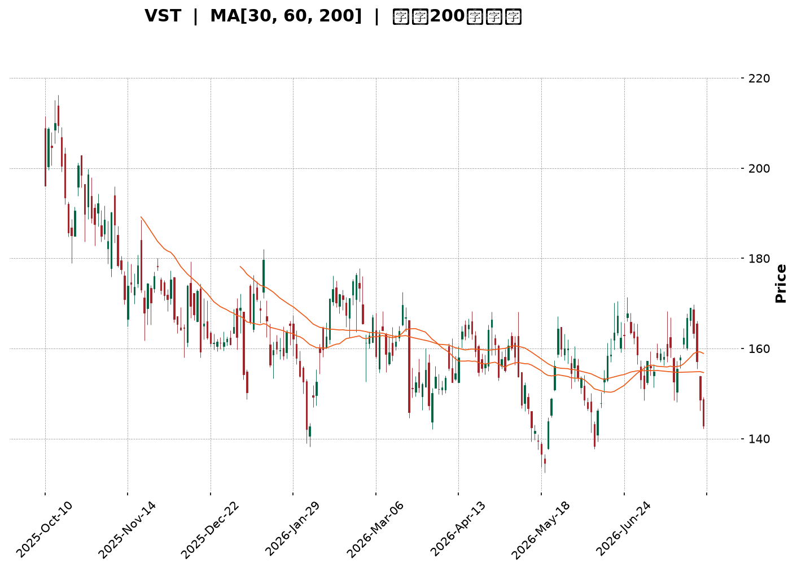
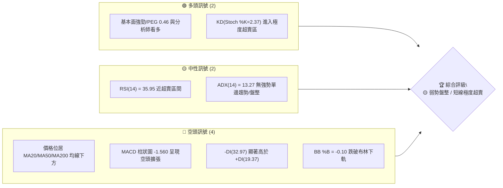
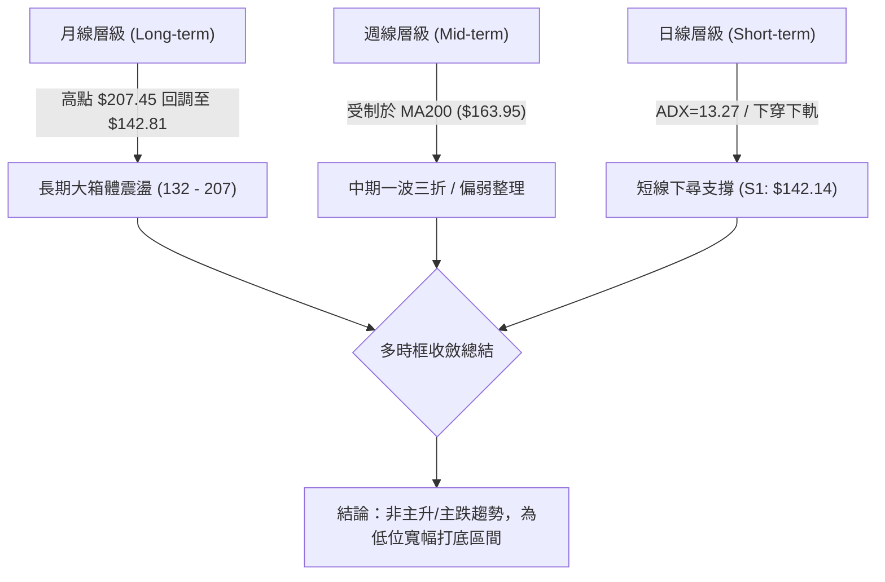
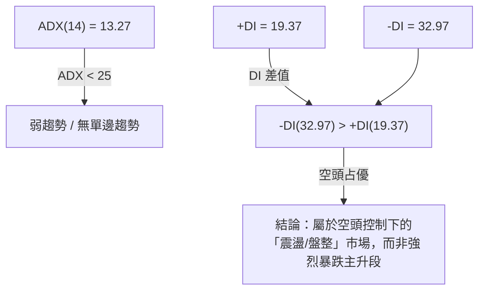
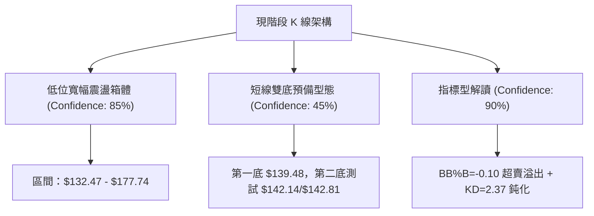
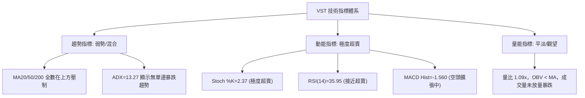
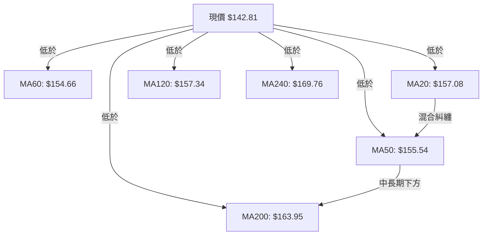
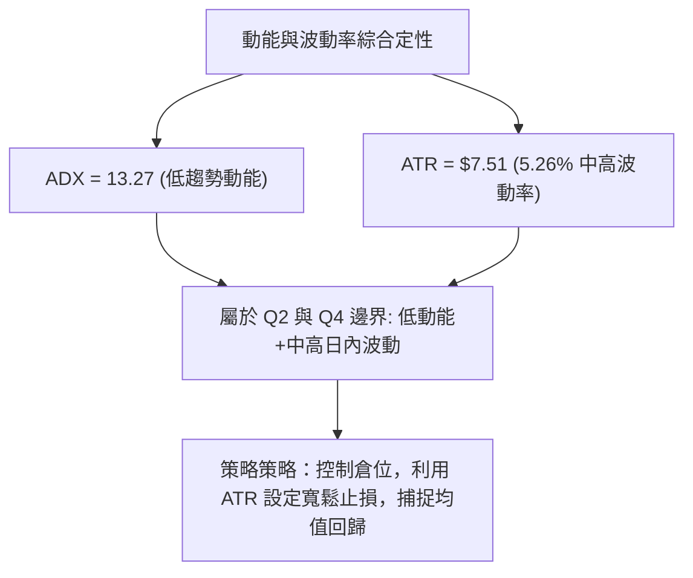
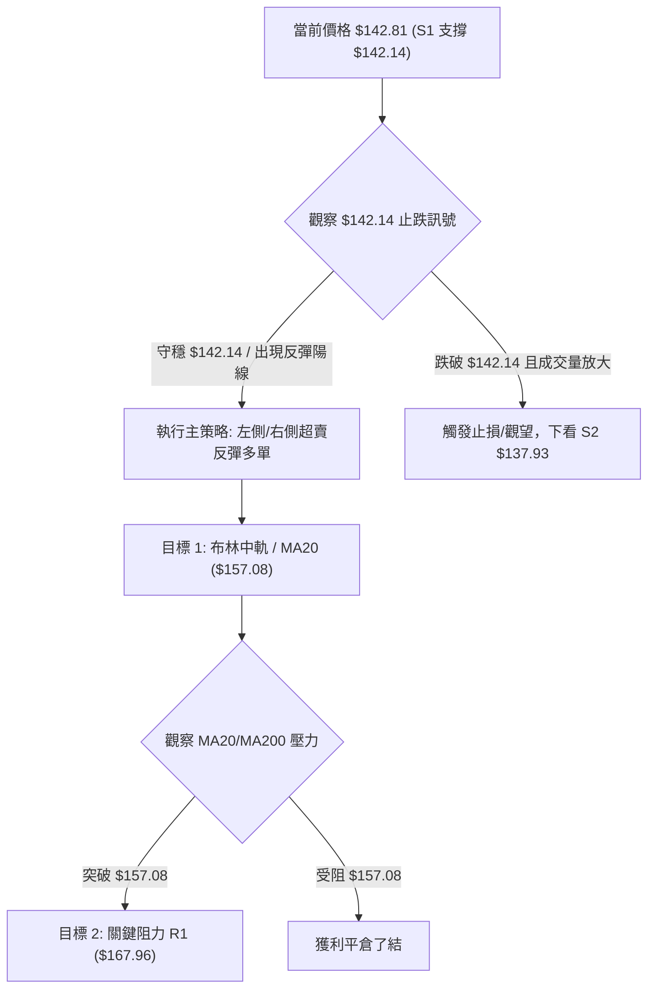
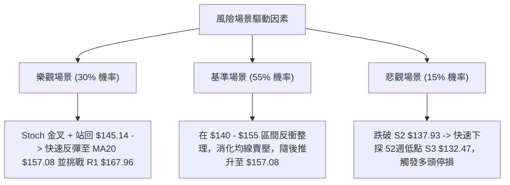

<details markdown="1">
<summary>📊 靜態圖表 (點擊展開)</summary>



</details>

<html>
<head><meta charset="utf-8" /></head>
<body>
    <div style="height:500px; width:100%;">                        <script>window.PlotlyConfig = {MathJaxConfig: 'local'};</script>
        <script charset="utf-8" src="https://cdn.plot.ly/plotly-3.7.0.min.js" integrity="sha256-jvTGqxNp8AGWEcvNLVuKr+8j5dGe9Yw51LQkmDH+IYA=" crossorigin="anonymous"></script>                <div id="candlestick-chart" class="plotly-graph-div" style="height:100%; width:100%;"></div>            <script>                window.PLOTLYENV=window.PLOTLYENV || {};                                if (document.getElementById("candlestick-chart")) {                    Plotly.newPlot(                        "candlestick-chart",                        [{"close":{"dtype":"f8","bdata":"AAAAwGSBaEAAAAAgyhVqQAAAAKALlWlAAAAAoDc\u002fakAAAABg4DBqQAAAAGB6EGlAAAAAwOYtaEAAAADg4jdnQAAAAODlIWdAAAAAQHHSZ0AAAABgTRRpQAAAAGAmz2hAAAAAAJa5Z0AAAACAYdFoQAAAAACLnWdAAAAAQJxwZ0AAAAAgqQdoQAAAAKAHH2dAAAAAYFiTZ0AAAACgVvtmQAAAAMCmxmdAAAAA4PhvZ0AAAADAV01mQAAAAED7MGZAAAAAwCZbZUAAAACA5b5lQAAAAGDGyGVAAAAAwEq2ZUAAAACgtExmQAAAAAA3omVAAAAAgIH8ZEAAAACgPM1lQAAAAAA1RGVAAAAAACMCZkAAAABgyENmQAAAAIBvnWVAAAAAQLN6ZUAAAAAABV5lQAAAAIDf6mVAAAAAAEHPZEAAAAAAy61kQAAAACAMhGRAAAAAAIWPZEAAAABAB7xlQAAAACCgLGVAAAAAwKvxZEAAAABgYZdlQAAAAEDP6WNAAAAAIGOvZEAAAADgUktkQAAAAAD6I2RAAAAA4ConZEAAAAAgbDBkQAAAAOAqJ2RAAAAAwJcsZEAAAADAe0VkQAAAAEBRHGRAAAAA4MWYZEAAAABAYE9kQAAAAGD+IWVAAAAAQI1FY0AAAADA58ViQAAAAAAnvWRAAAAAAFODZUAAAACATl5lQAAAAIAfEGVAAAAAgNp1ZkAAAAAAfsRkQAAAAKATjGNAAAAAYIPyY0AAAAAAXf1jQAAAAEC09WNAAAAAYObLY0AAAACg0XlkQAAAAGDbpWRAAAAAIDVEZEAAAACAOL1jQAAAAICzOmNAAAAAQH4SY0AAAADgDsRhQAAAACCc1WFAAAAAoJanYkAAAAAgiRFjQAAAAEAc5WNAAAAAYKn2Y0AAAAAgzVRkQAAAAGCKYGVAAAAAYG2mZUAAAACgLkNlQAAAAIDFgGVAAAAAAKtdZUAAAABAyepkQAAAAGCwZGVAAAAAAArcZUAAAABgoQpmQAAAAOAgrWVAAAAAwAaxZEAAAADgHyhkQAAAACAZXWRAAAAAgAXeZEAAAABAy8ZjQAAAACBlZWRAAAAAQEl+ZEAAAACgEddjQAAAAOB45GNAAAAAAF7QY0AAAAAgYTFkQAAAAIANfGRAAAAAQNI0ZUAAAACAEN1kQAAAAAAbOmJAAAAAgILiYkAAAACgNBBjQAAAACCK6WJAAAAA4MgCY0AAAAAAZ2hjQAAAAGCtamJAAAAAINXDYkAAAACg1DdjQAAAAKD+3mJAAAAAoBjsYkAAAADg4S5jQAAAAACBdWNAAAAAICoRY0AAAACAb1BjQAAAAABSv2NAAAAAwLN3ZEAAAADgyVZkQAAAAGCNqWRAAAAAwGdnZEAAAADgDuxjQAAAACAwVmNAAAAA4E5yY0AAAABgLpRjQAAAAIDYg2RAAAAAABvLZEAAAABAoRxkQAAAAMBlMmNAAAAAANGzY0AAAADgAmJjQAAAAIAAFGRAAAAAoPsEZEAAAABAMsJjQAAAAMCCN2NAAAAAAG5wYkAAAADAy\u002fpiQAAAAIBEVWJAAAAAYCPNYUAAAAAgc7ZhQAAAAGCCb2FAAAAAYOERYUAAAAAgsdBgQAAAAGCO+WFAAAAAgOObYkAAAACgpYFjQAAAAECOimRAAAAAIKL9Y0AAAACgyQFkQAAAAIAwAGRAAAAA4GRRY0AAAACA+LdjQAAAAKC3MmNAAAAAoIUvY0AAAACgqZFiQAAAAOA5VmJAAAAAIH9AYkAAAACAFEthQAAAACCcRWJAAAAAIAR6YkAAAAAgxSljQAAAACBszGNAAAAAwHPTY0AAAAAgrHBkQAAAAOBR6GRAAAAA4HpMZEAAAAAA11tkQAAAAOCj+GRAAAAAIK5vZEAAAAAAKUxkQAAAAAAp1GNAAAAAwB4lY0AAAACgmeFiQAAAAEAKp2NAAAAAIFx3Y0AAAACAPVpjQAAAACBcv2NAAAAAIIXbY0AAAAAA18NjQAAAAIDCzWNAAAAAIFwHZEAAAACA6xFjQAAAAIAUbmNAAAAAIK6\u002fY0AAAABgj0pkQAAAACCu12RAAAAAIFwfZUAAAAAAKWxkQAAAAGCPomNAAAAA4HqUYkAAAACA69lhQA=="},"high":{"dtype":"f8","bdata":"e\u002fMhq6dvakD2g\u002f5IiSJqQJc3t4V7\u002f2lASHr99nLkakAJ0689YwZrQIPizyq5JWpARlkFELqUaUBBhMYyxRNoQC8bM9DZlmdA8tQGbeTsZ0CnH1QeMSVpQHL6Rl4XWmlAxpn+xOSPaEDJ9GxruPxoQMGQIp3av2hAUh\u002fIjuECaEDEOS30LExoQHGn7kRE1mdAbmjz76f1Z0CYgFu9vYpnQE87tJMKyWdA\u002fC6xR3t\u002faEA1S5gyI2VnQKvztQ6KkWZAWwRKLxonZkCW1HyYHGhmQDOTz67QWGZAbUpl0+QVZkCszcOR6ZdmQOBfsGAokGdANKv70bWeZUB1QC0WJs9lQAljkbYrwGVAAhiFGWkgZkDGT5o7poBmQNAwCEPw92VAKDZFfAznZUB8rF3BIKRlQNEtulr4KWZAMBxL+Lf8ZUDOOsi99+NkQEJvihqSJmVAR1AFX5uqZEAQ9cQFRcVlQAjDJoYcaGZAoli3XgqJZUD11CkxraZlQN4l9Xg8zWVAF9TpxZ9mZUCS8PoqX1ZlQP1gbxNqe2RAL5U2v\u002fJnZED\u002fqwsAXkRkQFPdHzGcUWRAZjJLiud3ZEBopEtOhlNkQCZgUjt6gWRAp7b59wMaZUBN6ilQzmVlQGnwWiRIhGVADJZ2N+kFZUBE4m2b2GtjQI4l+vVAyGVAMDl4uxMIZkCwF9cr6d5lQIyfx82lVmVAQx95ts3BZkB5BYeYu1RlQL9AyW5YsWRAHYwfVA8xZEBiVUbpkGFkQGW0bhl2TWRAw3xmeVObZECm6jGdToVkQEoXNTU3w2RAxGbJ+FbtZECO8DJCeoFkQOqEa3k88WNAB1yxJi+CY0CvAnb7jSdjQNPBIGRq8GFABHBsw+D6YkBU0nYeNWtjQKg1I34wH2RAOMhnglObZEDZvnb2C7hkQH14cCj3ZWVA583ygDQFZkB0Xxa1geBlQDMz92oBg2VA6vbbya6gZUBLNqGRtWtlQOd\u002f4ISaZmVAj8lZRIzuZUBZsPm7thdmQBRRGZstOmZAbfWfhQ4BZkCHAxzkhWJkQKOUHio5eGRAPyMoHjbwZED\u002fpuOZS\u002f1kQNZEY0yghWRAH\u002fXO6GAKZUD8+7HWM3FkQGr0MxD+V2RAPFB2lxeZZEDlyrbfkGFkQO3BNvYcoGRAR1FHKbqQZUAGcUJaOiRlQBLbDReXx2RAKP1\u002f0NJ1Y0CsEKnQTTxjQMnRnNhUt2NA\u002fbnmopsOY0AmnuYtO\u002f9jQDxygsOl1mNAkD6M8ELoYkC2cS484oNjQNmGlecAS2NAt5PhJIIcY0C6bzOgOD5jQAZrlYizImRA8CFS1q9JZEBedA6yD81jQAq8WAHZD2RAcz8APpChZEDlS+M8MMlkQGrTXFP41WRAFKUg4CMIZUCXUVpFQnpkQCk\u002fmrb9G2RAx48q73DbY0B3r+b7utRjQO2YHW70p2RAd8+tK+cFZUB7R3RdF2NkQOYAlq48HWRANaBGPgTtY0A5swBTUP1jQDpCyrjkRGRA\u002fCy2EUVyZEC+dxHoYlhkQFDM6dPxBGVAunURWhBZY0Ch9xobKhFjQKvCgvGbw2JADqrM9GlCYkBZFcYEB+NhQBJH9fiQnGFAIfOYCQlrYUBUh9ZTSBBhQKountBQFmJA6u50lUeiYkCkz2NbMKtjQKQP0fZO5WRAKSwZ0FGZZECFWNRkpGlkQLrBeGYEQmRAYUJ4NIHKY0DNoM\u002fOwxFkQI9n\u002fqkNtmNAvcvm+mI6Y0B4\u002f3EFYEJjQFtCdEHromJAiBs6wt\u002fCYkDg5SFTjvlhQOkUD+s5VmJAErqv1kPJYkB\u002f1sKDcWdjQL3COj8iKGRAFzVshM9GZEA+fr7hQUNlQAAAAAAAUGVAAAAAYGa6ZEAAAADgerRkQAAAAEAza2VAAAAAgML9ZEAAAABAM7NkQAAAAGBmrmRAAAAAgD2qY0AAAAAgrodjQAAAACCup2NAAAAAwB7tY0AAAADgpY9jQAAAAIDCJWRAAAAA4KMAZEAAAACAwu1jQAAAAGC4BmVAAAAAgBTeZEAAAABAM8NjQAAAAAAAqGNAAAAAgD3SY0AAAABguI5kQAAAAIDr+WRAAAAAgOshZUAAAADgUThlQAAAAOCjxGRAAAAAIK4\u002fY0AAAADA9ahiQA=="},"hovertemplate":"\u003cb\u003e%{x|%Y-%m-%d}\u003c\u002fb\u003e\u003cbr\u003e\u958b: $%{open:.2f}\u003cbr\u003e\u9ad8: $%{high:.2f}\u003cbr\u003e\u4f4e: $%{low:.2f}\u003cbr\u003e\u6536: $%{close:.2f}\u003cextra\u003e\u003c\u002fextra\u003e","low":{"dtype":"f8","bdata":"45n9jcGAaEBvN40fNPJoQOIAYyMSEmlAW6BnUGixaUDnVw1NMfppQIyw6+oM52hAm2nITzwAaEBVzavGnBlnQIO2mjb1XGZAt1H46xIeZ0Awlt\u002fHXzloQJ1NbOHrdWhAgwnm7I72ZkDeyvgY5ZVnQPb2RQBCeGdA+szA5UjYZkBPmRpXJGJnQAMTC6GD92ZAt8kzhzcFZ0BQIx9OIllmQMSS3j3D+2VAssVq2q3sZkD7hjtkMEJmQJvmmkvAEWZA77VxdQI6ZUAK5+bhlZxkQM3Mhz\u002fdjGVAP9iunng+ZUA7avQn669lQOQLbMwujWVAOW9MsYU4ZECjlBhsyKZkQGznWCrxpmRA6MK39r+LZUDrlP0AsihmQJLBoWYpf2VA2GOdAvBUZUDN+UFb+gdlQGFiKZpyOGVA+stRaPK4ZEB1XER9JWxkQAiB0Xd\u002fgWRAsCshpL6\u002fY0A7iMiX8wpkQERnuTXF2WRAHZXnBTPJZECz08ENf7tkQBI4B4ZWwWNAuxrsCNo\u002fZEDfJDC2zkBkQPrOqAUADWRAHAXODQb2Y0BygFEeiepjQLiA9lQL\u002fWNAThf1LHPvY0Apj52BsxNkQF1kbpzOGGRAIH3K6AJuZEAMQKAs8PdjQMmXLFOAamRA2E\u002fhlLkjY0BCs5Ld6JhiQE+O6hKErWRA27pxGhN0ZEDeLVbvKEtlQAmuEN7wsmRA7ODHmJpmZUCQ593C7VFkQPTB5Mc0emNAE556oBArY0Ag9Jf4v9ZjQBerkikNsmNAsPTxMNyuY0DO68WV1rZjQHJvtn\u002fkFmRAL4KNMSXKY0BH+6sMrI1jQE98s5JcM2NAx\u002fGicES\u002fYkBRynpTWFxhQJB\u002fnfq6RGFAoVD\u002f5WxgYkApz03r6WtiQHI0YcFATGNAHHjeaJrDY0BPK3elo\u002f5jQLSsTge+IWRAohwHjGUvZUBjWzTyiyRlQM3MzIwl+WRAKavMfRQRZUDS0w6JIphkQO4nQubHTWRAWETgk4szZUBvC+I+CHVkQBcNLq1kTWVAxKe3neurZEBwYIuz2hFjQLUutqWj\u002fmNAZU26hXwnZEBsqukIoLtjQJ\u002flsfBQUmNAo+ClJUF7ZEA51wNBGldjQJfjhPaQiGNASUClUm+pY0AeewidYvVjQF\u002fyRRKHNWRAkW21qWOhZEDCtHuW3HhkQPzSGyIUFGJAMJxIpQmkYkDIghxR6KpiQOtADzJuxWJA9Usz7x9JYkASHMOaNfFiQNFCycSjTGJAiLqFiYLEYUDwOsZTBuZiQKymnUQfvWJAen379nO1YkBI+6kTPMJiQDOfqJ9UYmNAyEFPbe0OY0AxzB4PqxxjQGb9A\u002fX3DWNAg3SBR90DZEAs990siz1kQKeo3jM+TGRAlLte\u002fw5BZEDZnOTJJ8NjQEHjf09DPWNAUI5+14FWY0Cy3fMLFkljQAHJlGTbXWNA3MG7n2rQY0A2uGT+789jQFfgSKK1G2NA9swxDGRwY0Bi23ei01ZjQFKs7NAIp2NAeKEM5XLyY0AVqkw8MYxjQJ\u002f43E\u002fCMWNAWqwzWshYYkDweaqfWUJiQFPafhyaLmJATeGNoxNqYUDmVQIJPndhQFW5CMzAM2FAMX2ym4e1YEBFRir8Lo9gQFW9NsnAM2FA2zmWPa0VYkC8U+f8QNFiQAsFCaL1v2NAx0+ltPfFY0AkQ4fTJaxjQGrbzMAjlWNA1Ueoq8njYkCz\u002f\u002f2PURVjQFVD8ByOF2NAkYOr9Vu\u002fYkBRAlovZmliQIzw+hScRWJA9W52HfKqYUAAGpvX8jZhQGkiR6P+a2FACw9272tZYkDj7yV5PsFiQEGD35a4E2NANWUyT6+fY0AyEYV9zPljQAAAAMDMXGRAAAAA4KPkY0AAAAAAKfxjQAAAAOBRwGRAAAAAgBRmZEAAAADgoyBkQAAAAOBRkGNAAAAAoJnhYkAAAAAAAJBiQAAAAOBRAGNAAAAA4FFAY0AAAACAPepiQAAAAIA9rmNAAAAAoJmhY0AAAABgZoZjQAAAACAGoWNAAAAAgBS+Y0AAAACAk5BiQAAAAOB6hGJAAAAAQDNzY0AAAADgUQBkQAAAAAAp9GNAAAAA4FGgZEAAAACA60lkQAAAAKBHcWNAAAAAYLhGYkAAAADA9cRhQA=="},"name":"\u50f9\u683c","open":{"dtype":"f8","bdata":"2MwQOHscakAMKjzpJQlpQEB4qtz3nWlAOl5P23UOakCebloZxrxqQDUaKwfh2WlAIHvRmxFpaUDjiWjrjwJoQHYgS7C1WGdAt1H46xIeZ0DM0NjUG3loQHL6Rl4XWmlAxpn+xOSPaEDUYhhTFPBnQOtqM0XsO2hA2YR\u002f64TmZ0CqzoLDmMBnQBiFtpE8amdAZ3lst5kvZ0DKtphGNcRmQKI5a3BPOGZA8pIPO78\u002faEC+ceXzwyRnQF6dQcOgcmZA\u002flLLO6QFZkDVDAqmks9kQACAGER61mVA3QmdqzR+ZUAdVzu4381lQKohkB+2AWdAswulZSxpZUD6Fn58vBtlQFK+6gt1q2VAHn6tgOioZUA3U1h+PkhmQNZW4vr16GVA\u002frb3i4XVZUAVYG2vNH5lQBA5PW38ZWVA\u002fO4JlTb5ZUDOOsi99+NkQE1yZ5nklWRA+EFu2e+UZEDWOUICGCxkQHRxfvolz2VAwiOPGsSHZUBMRxLIrr5kQOejUt05qWVA\u002fSShkyKfZEAhBznQRsBkQK0495SFcWRAPiCCAvojZECf4vfLdxFkQAAAAOAqJ2RAm3TFe8kRZEDiuBTDsjFkQMT3T34ZTmRAIH3K6AJuZECRemU04xxlQH\u002fKW5oUEWVADJZ2N+kFZUCDfXhpS1pjQENNHnoru2VAxyDnBOeGZEDtmwORo7BlQH5xCqKGHWVAtKXfQ7qQZUCrBJHnzuJkQKEUaTRnGmRA4gOXM0jSY0B7d67kdi9kQJBFQPbf8WNAX5qV5bMEZEDEj2j5POJjQAMSKV1YsWRAVuHzvBGwZECJOzEPviFkQFAKQ8LhpmNA9J43vQ52Y0BHkL1ajhhjQKI0NWiNk2FAa9D79sGyYkBu+0D\u002fwbJiQP8aiquj\u002fmNAK3\u002frA2+RZEBVXiyQKwlkQMVgM3B2PmRAXr5uJxNNZUCzq6VB9bBlQM3MrsgeLmVAfkzCiGN6ZUDlgIFQakVlQOpTkTUx2mRAHO8DOfF8ZUADs1tlZFxlQF4E1+mM0GVAtfGq2l83ZUAHU9M5zidkQOHVtkCdJGRAX7WIgN4tZECAT2jL4X9kQGTymVkJb2NATPyx7eucZED\u002f3yTHwWRkQHS+91+xlGNAXasA\u002fgkqZEDE9tBfyRFkQLZHLfqLS2RAj1tLA16pZEB0WhWlrtZkQBLbDReXx2RAmxHEap\u002fnYkBVWETc3MpiQIN5bkQQWWNAFtysU0+pYkASHMOaNfFiQMNnenornGNAEtlGKlz2YUD9knYGQ+hiQICb+if032JA9OUFTYXaYkDcdrDGettiQAVs6HLOEGRAPQVdB4F1Y0C1llR3ISljQGb9A\u002fX3DWNAatE0H9pFZEDBGUQMmKhkQBLbfh\u002fgimRAu4FBLOHAZEBtoxW6TVpkQJjXwDsgEWRASUIb2YmyY0BLmyKyvXdjQE18AoCQg2NAdODPuZ2YZECDL+ZwukhkQKC43UBSFGRAUnbWIUmCY0AWdODp1cJjQCU9uPMFr2NAQPX8m7RYZEBC+YzonChkQAgE1t37WWRAunURWhBZY0DUzoWFYHliQPplZZz9qGJADqrM9GlCYkA7DQJV1aVhQL8gZYmLcmFArLtFmcdZYUBrpU3jhfNgQAAAABzTOWFA\u002fMREu4coYkDwR7uHM9piQMfGYjoC1mNAKozppVaXZECvggyfxdNjQEMghwLX+GNAwtBlVvmYY0BjyZkBGndjQLXtAdRQiWNADDiWnn\u002fqYkCvGpyhMvliQLf923hIg2JAMRzhS8yGYkAG62cFyeRhQMrc7v5emWFAVhuremB5YkCCqUriFBNjQJtjJ2ckIWNAh9cz6fvKY0DwVzxkoDtkQAAAAAApcGRAAAAAYI8CZEAAAADA9WBkQAAAAMAe3WRAAAAAIIW7ZEAAAABgZnZkQAAAAGCPUmRAAAAAAACAY0AAAABgZj5jQAAAAEAKD2NAAAAAACmEY0AAAAAgrj9jQAAAAOBR4GNAAAAAoJmxY0AAAADAzLRjQAAAAAAAIGRAAAAAAABQZEAAAAAA17tjQAAAACCFy2JAAAAA4KOwY0AAAAAgrh9kQAAAACCFA2RAAAAA4FHIZEAAAACAPRZlQAAAAAAAsGRAAAAAoHA9Y0AAAABAM5diQA=="},"x":["2025-10-10T00:00:00-04:00","2025-10-13T00:00:00-04:00","2025-10-14T00:00:00-04:00","2025-10-15T00:00:00-04:00","2025-10-16T00:00:00-04:00","2025-10-17T00:00:00-04:00","2025-10-20T00:00:00-04:00","2025-10-21T00:00:00-04:00","2025-10-22T00:00:00-04:00","2025-10-23T00:00:00-04:00","2025-10-24T00:00:00-04:00","2025-10-27T00:00:00-04:00","2025-10-28T00:00:00-04:00","2025-10-29T00:00:00-04:00","2025-10-30T00:00:00-04:00","2025-10-31T00:00:00-04:00","2025-11-03T00:00:00-05:00","2025-11-04T00:00:00-05:00","2025-11-05T00:00:00-05:00","2025-11-06T00:00:00-05:00","2025-11-07T00:00:00-05:00","2025-11-10T00:00:00-05:00","2025-11-11T00:00:00-05:00","2025-11-12T00:00:00-05:00","2025-11-13T00:00:00-05:00","2025-11-14T00:00:00-05:00","2025-11-17T00:00:00-05:00","2025-11-18T00:00:00-05:00","2025-11-19T00:00:00-05:00","2025-11-20T00:00:00-05:00","2025-11-21T00:00:00-05:00","2025-11-24T00:00:00-05:00","2025-11-25T00:00:00-05:00","2025-11-26T00:00:00-05:00","2025-11-28T00:00:00-05:00","2025-12-01T00:00:00-05:00","2025-12-02T00:00:00-05:00","2025-12-03T00:00:00-05:00","2025-12-04T00:00:00-05:00","2025-12-05T00:00:00-05:00","2025-12-08T00:00:00-05:00","2025-12-09T00:00:00-05:00","2025-12-10T00:00:00-05:00","2025-12-11T00:00:00-05:00","2025-12-12T00:00:00-05:00","2025-12-15T00:00:00-05:00","2025-12-16T00:00:00-05:00","2025-12-17T00:00:00-05:00","2025-12-18T00:00:00-05:00","2025-12-19T00:00:00-05:00","2025-12-22T00:00:00-05:00","2025-12-23T00:00:00-05:00","2025-12-24T00:00:00-05:00","2025-12-26T00:00:00-05:00","2025-12-29T00:00:00-05:00","2025-12-30T00:00:00-05:00","2025-12-31T00:00:00-05:00","2026-01-02T00:00:00-05:00","2026-01-05T00:00:00-05:00","2026-01-06T00:00:00-05:00","2026-01-07T00:00:00-05:00","2026-01-08T00:00:00-05:00","2026-01-09T00:00:00-05:00","2026-01-12T00:00:00-05:00","2026-01-13T00:00:00-05:00","2026-01-14T00:00:00-05:00","2026-01-15T00:00:00-05:00","2026-01-16T00:00:00-05:00","2026-01-20T00:00:00-05:00","2026-01-21T00:00:00-05:00","2026-01-22T00:00:00-05:00","2026-01-23T00:00:00-05:00","2026-01-26T00:00:00-05:00","2026-01-27T00:00:00-05:00","2026-01-28T00:00:00-05:00","2026-01-29T00:00:00-05:00","2026-01-30T00:00:00-05:00","2026-02-02T00:00:00-05:00","2026-02-03T00:00:00-05:00","2026-02-04T00:00:00-05:00","2026-02-05T00:00:00-05:00","2026-02-06T00:00:00-05:00","2026-02-09T00:00:00-05:00","2026-02-10T00:00:00-05:00","2026-02-11T00:00:00-05:00","2026-02-12T00:00:00-05:00","2026-02-13T00:00:00-05:00","2026-02-17T00:00:00-05:00","2026-02-18T00:00:00-05:00","2026-02-19T00:00:00-05:00","2026-02-20T00:00:00-05:00","2026-02-23T00:00:00-05:00","2026-02-24T00:00:00-05:00","2026-02-25T00:00:00-05:00","2026-02-26T00:00:00-05:00","2026-02-27T00:00:00-05:00","2026-03-02T00:00:00-05:00","2026-03-03T00:00:00-05:00","2026-03-04T00:00:00-05:00","2026-03-05T00:00:00-05:00","2026-03-06T00:00:00-05:00","2026-03-09T00:00:00-04:00","2026-03-10T00:00:00-04:00","2026-03-11T00:00:00-04:00","2026-03-12T00:00:00-04:00","2026-03-13T00:00:00-04:00","2026-03-16T00:00:00-04:00","2026-03-17T00:00:00-04:00","2026-03-18T00:00:00-04:00","2026-03-19T00:00:00-04:00","2026-03-20T00:00:00-04:00","2026-03-23T00:00:00-04:00","2026-03-24T00:00:00-04:00","2026-03-25T00:00:00-04:00","2026-03-26T00:00:00-04:00","2026-03-27T00:00:00-04:00","2026-03-30T00:00:00-04:00","2026-03-31T00:00:00-04:00","2026-04-01T00:00:00-04:00","2026-04-02T00:00:00-04:00","2026-04-06T00:00:00-04:00","2026-04-07T00:00:00-04:00","2026-04-08T00:00:00-04:00","2026-04-09T00:00:00-04:00","2026-04-10T00:00:00-04:00","2026-04-13T00:00:00-04:00","2026-04-14T00:00:00-04:00","2026-04-15T00:00:00-04:00","2026-04-16T00:00:00-04:00","2026-04-17T00:00:00-04:00","2026-04-20T00:00:00-04:00","2026-04-21T00:00:00-04:00","2026-04-22T00:00:00-04:00","2026-04-23T00:00:00-04:00","2026-04-24T00:00:00-04:00","2026-04-27T00:00:00-04:00","2026-04-28T00:00:00-04:00","2026-04-29T00:00:00-04:00","2026-04-30T00:00:00-04:00","2026-05-01T00:00:00-04:00","2026-05-04T00:00:00-04:00","2026-05-05T00:00:00-04:00","2026-05-06T00:00:00-04:00","2026-05-07T00:00:00-04:00","2026-05-08T00:00:00-04:00","2026-05-11T00:00:00-04:00","2026-05-12T00:00:00-04:00","2026-05-13T00:00:00-04:00","2026-05-14T00:00:00-04:00","2026-05-15T00:00:00-04:00","2026-05-18T00:00:00-04:00","2026-05-19T00:00:00-04:00","2026-05-20T00:00:00-04:00","2026-05-21T00:00:00-04:00","2026-05-22T00:00:00-04:00","2026-05-26T00:00:00-04:00","2026-05-27T00:00:00-04:00","2026-05-28T00:00:00-04:00","2026-05-29T00:00:00-04:00","2026-06-01T00:00:00-04:00","2026-06-02T00:00:00-04:00","2026-06-03T00:00:00-04:00","2026-06-04T00:00:00-04:00","2026-06-05T00:00:00-04:00","2026-06-08T00:00:00-04:00","2026-06-09T00:00:00-04:00","2026-06-10T00:00:00-04:00","2026-06-11T00:00:00-04:00","2026-06-12T00:00:00-04:00","2026-06-15T00:00:00-04:00","2026-06-16T00:00:00-04:00","2026-06-17T00:00:00-04:00","2026-06-18T00:00:00-04:00","2026-06-22T00:00:00-04:00","2026-06-23T00:00:00-04:00","2026-06-24T00:00:00-04:00","2026-06-25T00:00:00-04:00","2026-06-26T00:00:00-04:00","2026-06-29T00:00:00-04:00","2026-06-30T00:00:00-04:00","2026-07-01T00:00:00-04:00","2026-07-02T00:00:00-04:00","2026-07-06T00:00:00-04:00","2026-07-07T00:00:00-04:00","2026-07-08T00:00:00-04:00","2026-07-09T00:00:00-04:00","2026-07-10T00:00:00-04:00","2026-07-13T00:00:00-04:00","2026-07-14T00:00:00-04:00","2026-07-15T00:00:00-04:00","2026-07-16T00:00:00-04:00","2026-07-17T00:00:00-04:00","2026-07-20T00:00:00-04:00","2026-07-21T00:00:00-04:00","2026-07-22T00:00:00-04:00","2026-07-23T00:00:00-04:00","2026-07-24T00:00:00-04:00","2026-07-27T00:00:00-04:00","2026-07-28T00:00:00-04:00","2026-07-29T00:00:00-04:00"],"type":"candlestick"},{"hovertemplate":"MA30: $%{y:.2f}\u003cextra\u003e\u003c\u002fextra\u003e","line":{"color":"#2196F3","dash":"dash","width":2},"mode":"lines","name":"MA30","x":["2025-10-10T00:00:00-04:00","2025-10-13T00:00:00-04:00","2025-10-14T00:00:00-04:00","2025-10-15T00:00:00-04:00","2025-10-16T00:00:00-04:00","2025-10-17T00:00:00-04:00","2025-10-20T00:00:00-04:00","2025-10-21T00:00:00-04:00","2025-10-22T00:00:00-04:00","2025-10-23T00:00:00-04:00","2025-10-24T00:00:00-04:00","2025-10-27T00:00:00-04:00","2025-10-28T00:00:00-04:00","2025-10-29T00:00:00-04:00","2025-10-30T00:00:00-04:00","2025-10-31T00:00:00-04:00","2025-11-03T00:00:00-05:00","2025-11-04T00:00:00-05:00","2025-11-05T00:00:00-05:00","2025-11-06T00:00:00-05:00","2025-11-07T00:00:00-05:00","2025-11-10T00:00:00-05:00","2025-11-11T00:00:00-05:00","2025-11-12T00:00:00-05:00","2025-11-13T00:00:00-05:00","2025-11-14T00:00:00-05:00","2025-11-17T00:00:00-05:00","2025-11-18T00:00:00-05:00","2025-11-19T00:00:00-05:00","2025-11-20T00:00:00-05:00","2025-11-21T00:00:00-05:00","2025-11-24T00:00:00-05:00","2025-11-25T00:00:00-05:00","2025-11-26T00:00:00-05:00","2025-11-28T00:00:00-05:00","2025-12-01T00:00:00-05:00","2025-12-02T00:00:00-05:00","2025-12-03T00:00:00-05:00","2025-12-04T00:00:00-05:00","2025-12-05T00:00:00-05:00","2025-12-08T00:00:00-05:00","2025-12-09T00:00:00-05:00","2025-12-10T00:00:00-05:00","2025-12-11T00:00:00-05:00","2025-12-12T00:00:00-05:00","2025-12-15T00:00:00-05:00","2025-12-16T00:00:00-05:00","2025-12-17T00:00:00-05:00","2025-12-18T00:00:00-05:00","2025-12-19T00:00:00-05:00","2025-12-22T00:00:00-05:00","2025-12-23T00:00:00-05:00","2025-12-24T00:00:00-05:00","2025-12-26T00:00:00-05:00","2025-12-29T00:00:00-05:00","2025-12-30T00:00:00-05:00","2025-12-31T00:00:00-05:00","2026-01-02T00:00:00-05:00","2026-01-05T00:00:00-05:00","2026-01-06T00:00:00-05:00","2026-01-07T00:00:00-05:00","2026-01-08T00:00:00-05:00","2026-01-09T00:00:00-05:00","2026-01-12T00:00:00-05:00","2026-01-13T00:00:00-05:00","2026-01-14T00:00:00-05:00","2026-01-15T00:00:00-05:00","2026-01-16T00:00:00-05:00","2026-01-20T00:00:00-05:00","2026-01-21T00:00:00-05:00","2026-01-22T00:00:00-05:00","2026-01-23T00:00:00-05:00","2026-01-26T00:00:00-05:00","2026-01-27T00:00:00-05:00","2026-01-28T00:00:00-05:00","2026-01-29T00:00:00-05:00","2026-01-30T00:00:00-05:00","2026-02-02T00:00:00-05:00","2026-02-03T00:00:00-05:00","2026-02-04T00:00:00-05:00","2026-02-05T00:00:00-05:00","2026-02-06T00:00:00-05:00","2026-02-09T00:00:00-05:00","2026-02-10T00:00:00-05:00","2026-02-11T00:00:00-05:00","2026-02-12T00:00:00-05:00","2026-02-13T00:00:00-05:00","2026-02-17T00:00:00-05:00","2026-02-18T00:00:00-05:00","2026-02-19T00:00:00-05:00","2026-02-20T00:00:00-05:00","2026-02-23T00:00:00-05:00","2026-02-24T00:00:00-05:00","2026-02-25T00:00:00-05:00","2026-02-26T00:00:00-05:00","2026-02-27T00:00:00-05:00","2026-03-02T00:00:00-05:00","2026-03-03T00:00:00-05:00","2026-03-04T00:00:00-05:00","2026-03-05T00:00:00-05:00","2026-03-06T00:00:00-05:00","2026-03-09T00:00:00-04:00","2026-03-10T00:00:00-04:00","2026-03-11T00:00:00-04:00","2026-03-12T00:00:00-04:00","2026-03-13T00:00:00-04:00","2026-03-16T00:00:00-04:00","2026-03-17T00:00:00-04:00","2026-03-18T00:00:00-04:00","2026-03-19T00:00:00-04:00","2026-03-20T00:00:00-04:00","2026-03-23T00:00:00-04:00","2026-03-24T00:00:00-04:00","2026-03-25T00:00:00-04:00","2026-03-26T00:00:00-04:00","2026-03-27T00:00:00-04:00","2026-03-30T00:00:00-04:00","2026-03-31T00:00:00-04:00","2026-04-01T00:00:00-04:00","2026-04-02T00:00:00-04:00","2026-04-06T00:00:00-04:00","2026-04-07T00:00:00-04:00","2026-04-08T00:00:00-04:00","2026-04-09T00:00:00-04:00","2026-04-10T00:00:00-04:00","2026-04-13T00:00:00-04:00","2026-04-14T00:00:00-04:00","2026-04-15T00:00:00-04:00","2026-04-16T00:00:00-04:00","2026-04-17T00:00:00-04:00","2026-04-20T00:00:00-04:00","2026-04-21T00:00:00-04:00","2026-04-22T00:00:00-04:00","2026-04-23T00:00:00-04:00","2026-04-24T00:00:00-04:00","2026-04-27T00:00:00-04:00","2026-04-28T00:00:00-04:00","2026-04-29T00:00:00-04:00","2026-04-30T00:00:00-04:00","2026-05-01T00:00:00-04:00","2026-05-04T00:00:00-04:00","2026-05-05T00:00:00-04:00","2026-05-06T00:00:00-04:00","2026-05-07T00:00:00-04:00","2026-05-08T00:00:00-04:00","2026-05-11T00:00:00-04:00","2026-05-12T00:00:00-04:00","2026-05-13T00:00:00-04:00","2026-05-14T00:00:00-04:00","2026-05-15T00:00:00-04:00","2026-05-18T00:00:00-04:00","2026-05-19T00:00:00-04:00","2026-05-20T00:00:00-04:00","2026-05-21T00:00:00-04:00","2026-05-22T00:00:00-04:00","2026-05-26T00:00:00-04:00","2026-05-27T00:00:00-04:00","2026-05-28T00:00:00-04:00","2026-05-29T00:00:00-04:00","2026-06-01T00:00:00-04:00","2026-06-02T00:00:00-04:00","2026-06-03T00:00:00-04:00","2026-06-04T00:00:00-04:00","2026-06-05T00:00:00-04:00","2026-06-08T00:00:00-04:00","2026-06-09T00:00:00-04:00","2026-06-10T00:00:00-04:00","2026-06-11T00:00:00-04:00","2026-06-12T00:00:00-04:00","2026-06-15T00:00:00-04:00","2026-06-16T00:00:00-04:00","2026-06-17T00:00:00-04:00","2026-06-18T00:00:00-04:00","2026-06-22T00:00:00-04:00","2026-06-23T00:00:00-04:00","2026-06-24T00:00:00-04:00","2026-06-25T00:00:00-04:00","2026-06-26T00:00:00-04:00","2026-06-29T00:00:00-04:00","2026-06-30T00:00:00-04:00","2026-07-01T00:00:00-04:00","2026-07-02T00:00:00-04:00","2026-07-06T00:00:00-04:00","2026-07-07T00:00:00-04:00","2026-07-08T00:00:00-04:00","2026-07-09T00:00:00-04:00","2026-07-10T00:00:00-04:00","2026-07-13T00:00:00-04:00","2026-07-14T00:00:00-04:00","2026-07-15T00:00:00-04:00","2026-07-16T00:00:00-04:00","2026-07-17T00:00:00-04:00","2026-07-20T00:00:00-04:00","2026-07-21T00:00:00-04:00","2026-07-22T00:00:00-04:00","2026-07-23T00:00:00-04:00","2026-07-24T00:00:00-04:00","2026-07-27T00:00:00-04:00","2026-07-28T00:00:00-04:00","2026-07-29T00:00:00-04:00"],"y":{"dtype":"f8","bdata":"AAAAAAAA+H8AAAAAAAD4fwAAAAAAAPh\u002fAAAAAAAA+H8AAAAAAAD4fwAAAAAAAPh\u002fAAAAAAAA+H8AAAAAAAD4fwAAAAAAAPh\u002fAAAAAAAA+H8AAAAAAAD4fwAAAAAAAPh\u002fAAAAAAAA+H8AAAAAAAD4fwAAAAAAAPh\u002fAAAAAAAA+H8AAAAAAAD4fwAAAAAAAPh\u002fAAAAAAAA+H8AAAAAAAD4fwAAAAAAAPh\u002fAAAAAAAA+H8AAAAAAAD4fwAAAAAAAPh\u002fAAAAAAAA+H8AAAAAAAD4fwAAAAAAAPh\u002fAAAAAAAA+H8AAAAAAAD4f5qZmdkPpmdAZmZmRgiIZ0BmZmYGe2NnQCIiIhKnPmdAd3d3t3saZ0Crqqrq+vhmQO\u002fu7p6L22ZA7+7uXoHEZkBVVVW1tbRmQBEREaFXqmZAIiIi0qKQZkARERHxFWtmQO\u002fu7u5yRmZA3t3dXXIrZkDv7u6OIhFmQN7d3e1N\u002fGVAVVVVpQHnZUBERER0MtJlQFVVVbXStmVAZmZmZiieZUB3d3dXOYdlQFVVVZUzaGVAd3d3tyxMZUDNzMzcJDplQM3MzAzAKGVAd3d3N6oeZUAAAACgFRJlQERERHTNA2VAZmZmBkn6ZEDv7u6+TulkQHd3d5cI5WRAmpmZ2WbWZEAAAACwjrxkQImIiDgOuGRAZmZmFtSzZEBERETkLaxkQGZmZgZ4p2RAMzMzM9evZECamZkZuapkQKuqqhp\u002flmRAMzMzcyOPZECrqqrqQYlkQBEREUGDhGRAd3d39\u002f19ZEAiIiJyQHNkQLy7u2vCbmRAMzMzM\u002fpoZECamZkJLFlkQHd3d8dVU2RAq6qqapJFZEBVVVUV\u002fy9kQJqZmUlRHGRAREREFIgPZECrqqr69wVkQKuqqkrEA2RAREREFPgBZECrqqrKegJkQO\u002fu7n5JDWRAvLu7i0YWZEBmZmYGZx5kQLy7u8uPIWRAd3d3p24zZEAAAABwukVkQFVVVRVQS2RA3t3dHUVOZEDNzMycA1RkQERERGQ\u002fWWRARERERCdKZEDe3d3t8ERkQERERJToS2RAAAAAQMJTZEB3d3eX8FFkQAAAALCpVWRAq6qq6ptbZEDe3d0dL1ZkQGZmZua8T2RAVVVVZeBLZEDe3d2dv09kQBEREdF1WmRAERER0atsZEDe3d3NGodkQN7d3V10imRAmpmZKWuMZEAAAADQX4xkQDMzMxP9g2RA3t3d\u002fdt7ZECJiIi4+nNkQO\u002fu7p63WmRAIiIi8hhCZEAzMzMDpzBkQDMzM3MxGmRAzczMPFcFZEAiIiJCi\u002fZjQN7d3a0J5mNAq6qqajXOY0DNzMx877ZjQImIiKh5pmNA3t3dfZCkY0ARERGxHqZjQJqZmRmrqGNAiYiI6LakY0BVVVXl9KVjQImIiJjqnGNAmpmZ2fuTY0AzMzMTwZFjQAAAABARl2NAIiIismyfY0AiIiKiu55jQDMzM5O+k2NAMzMzM+mGY0DNzMycRnpjQHd3d4cSimNAvLu7O8GTY0BmZmYWsJljQBEREXFJnGNAvLu7i2iXY0DNzMw8wZNjQKuqqooKk2NAq6qqatGKY0BVVVXV+H1jQFVVVfW4cWNAERERUephY0De3d19tU1jQFVVVUULQWNAREREhCI9Y0BERER0xj5jQKuqqrqMRWNAMzMzE3tBY0C8u7u7pT5jQBEREYEAOWNAREREJLwvY0CamZmp\u002fy1jQKuqqvrQLGNAIiIiEpcqY0C8u7sL+SFjQBEREbFiD2NARERE1LL5YkCrqqqapeFiQERERATB2WJAERERQUvPYkBERERUa81iQERERIQIy2JAq6qq2mHJYkB3d3e3Ms9iQFVVVQWg3WJAERERUX7tYkBVVVX1QvliQDMzMyPGD2NAq6qqOkImY0AzMzPTUDxjQHd3d8e8UGNAZmZmBnJiY0AAAABgE3RjQN7d3U1kgmNAAAAAILWJY0CrqqraZIhjQKuqquqegWNAERER0XuAY0AiIiIya35jQM3MzNy8fGNAMzMzo82CY0C8u7urRH1jQLy7uzs\u002ff2NAIiIiYg2EY0BVVVW1v5JjQDMzM3MhqGNAiYiISKDAY0CrqqoqVNtjQAAAAOD15mNAMzMzs9fnY0B3d3fHpdxjQA=="},"type":"scatter"},{"hovertemplate":"MA60: $%{y:.2f}\u003cextra\u003e\u003c\u002fextra\u003e","line":{"color":"#9C27B0","dash":"dash","width":2},"mode":"lines","name":"MA60","x":["2025-10-10T00:00:00-04:00","2025-10-13T00:00:00-04:00","2025-10-14T00:00:00-04:00","2025-10-15T00:00:00-04:00","2025-10-16T00:00:00-04:00","2025-10-17T00:00:00-04:00","2025-10-20T00:00:00-04:00","2025-10-21T00:00:00-04:00","2025-10-22T00:00:00-04:00","2025-10-23T00:00:00-04:00","2025-10-24T00:00:00-04:00","2025-10-27T00:00:00-04:00","2025-10-28T00:00:00-04:00","2025-10-29T00:00:00-04:00","2025-10-30T00:00:00-04:00","2025-10-31T00:00:00-04:00","2025-11-03T00:00:00-05:00","2025-11-04T00:00:00-05:00","2025-11-05T00:00:00-05:00","2025-11-06T00:00:00-05:00","2025-11-07T00:00:00-05:00","2025-11-10T00:00:00-05:00","2025-11-11T00:00:00-05:00","2025-11-12T00:00:00-05:00","2025-11-13T00:00:00-05:00","2025-11-14T00:00:00-05:00","2025-11-17T00:00:00-05:00","2025-11-18T00:00:00-05:00","2025-11-19T00:00:00-05:00","2025-11-20T00:00:00-05:00","2025-11-21T00:00:00-05:00","2025-11-24T00:00:00-05:00","2025-11-25T00:00:00-05:00","2025-11-26T00:00:00-05:00","2025-11-28T00:00:00-05:00","2025-12-01T00:00:00-05:00","2025-12-02T00:00:00-05:00","2025-12-03T00:00:00-05:00","2025-12-04T00:00:00-05:00","2025-12-05T00:00:00-05:00","2025-12-08T00:00:00-05:00","2025-12-09T00:00:00-05:00","2025-12-10T00:00:00-05:00","2025-12-11T00:00:00-05:00","2025-12-12T00:00:00-05:00","2025-12-15T00:00:00-05:00","2025-12-16T00:00:00-05:00","2025-12-17T00:00:00-05:00","2025-12-18T00:00:00-05:00","2025-12-19T00:00:00-05:00","2025-12-22T00:00:00-05:00","2025-12-23T00:00:00-05:00","2025-12-24T00:00:00-05:00","2025-12-26T00:00:00-05:00","2025-12-29T00:00:00-05:00","2025-12-30T00:00:00-05:00","2025-12-31T00:00:00-05:00","2026-01-02T00:00:00-05:00","2026-01-05T00:00:00-05:00","2026-01-06T00:00:00-05:00","2026-01-07T00:00:00-05:00","2026-01-08T00:00:00-05:00","2026-01-09T00:00:00-05:00","2026-01-12T00:00:00-05:00","2026-01-13T00:00:00-05:00","2026-01-14T00:00:00-05:00","2026-01-15T00:00:00-05:00","2026-01-16T00:00:00-05:00","2026-01-20T00:00:00-05:00","2026-01-21T00:00:00-05:00","2026-01-22T00:00:00-05:00","2026-01-23T00:00:00-05:00","2026-01-26T00:00:00-05:00","2026-01-27T00:00:00-05:00","2026-01-28T00:00:00-05:00","2026-01-29T00:00:00-05:00","2026-01-30T00:00:00-05:00","2026-02-02T00:00:00-05:00","2026-02-03T00:00:00-05:00","2026-02-04T00:00:00-05:00","2026-02-05T00:00:00-05:00","2026-02-06T00:00:00-05:00","2026-02-09T00:00:00-05:00","2026-02-10T00:00:00-05:00","2026-02-11T00:00:00-05:00","2026-02-12T00:00:00-05:00","2026-02-13T00:00:00-05:00","2026-02-17T00:00:00-05:00","2026-02-18T00:00:00-05:00","2026-02-19T00:00:00-05:00","2026-02-20T00:00:00-05:00","2026-02-23T00:00:00-05:00","2026-02-24T00:00:00-05:00","2026-02-25T00:00:00-05:00","2026-02-26T00:00:00-05:00","2026-02-27T00:00:00-05:00","2026-03-02T00:00:00-05:00","2026-03-03T00:00:00-05:00","2026-03-04T00:00:00-05:00","2026-03-05T00:00:00-05:00","2026-03-06T00:00:00-05:00","2026-03-09T00:00:00-04:00","2026-03-10T00:00:00-04:00","2026-03-11T00:00:00-04:00","2026-03-12T00:00:00-04:00","2026-03-13T00:00:00-04:00","2026-03-16T00:00:00-04:00","2026-03-17T00:00:00-04:00","2026-03-18T00:00:00-04:00","2026-03-19T00:00:00-04:00","2026-03-20T00:00:00-04:00","2026-03-23T00:00:00-04:00","2026-03-24T00:00:00-04:00","2026-03-25T00:00:00-04:00","2026-03-26T00:00:00-04:00","2026-03-27T00:00:00-04:00","2026-03-30T00:00:00-04:00","2026-03-31T00:00:00-04:00","2026-04-01T00:00:00-04:00","2026-04-02T00:00:00-04:00","2026-04-06T00:00:00-04:00","2026-04-07T00:00:00-04:00","2026-04-08T00:00:00-04:00","2026-04-09T00:00:00-04:00","2026-04-10T00:00:00-04:00","2026-04-13T00:00:00-04:00","2026-04-14T00:00:00-04:00","2026-04-15T00:00:00-04:00","2026-04-16T00:00:00-04:00","2026-04-17T00:00:00-04:00","2026-04-20T00:00:00-04:00","2026-04-21T00:00:00-04:00","2026-04-22T00:00:00-04:00","2026-04-23T00:00:00-04:00","2026-04-24T00:00:00-04:00","2026-04-27T00:00:00-04:00","2026-04-28T00:00:00-04:00","2026-04-29T00:00:00-04:00","2026-04-30T00:00:00-04:00","2026-05-01T00:00:00-04:00","2026-05-04T00:00:00-04:00","2026-05-05T00:00:00-04:00","2026-05-06T00:00:00-04:00","2026-05-07T00:00:00-04:00","2026-05-08T00:00:00-04:00","2026-05-11T00:00:00-04:00","2026-05-12T00:00:00-04:00","2026-05-13T00:00:00-04:00","2026-05-14T00:00:00-04:00","2026-05-15T00:00:00-04:00","2026-05-18T00:00:00-04:00","2026-05-19T00:00:00-04:00","2026-05-20T00:00:00-04:00","2026-05-21T00:00:00-04:00","2026-05-22T00:00:00-04:00","2026-05-26T00:00:00-04:00","2026-05-27T00:00:00-04:00","2026-05-28T00:00:00-04:00","2026-05-29T00:00:00-04:00","2026-06-01T00:00:00-04:00","2026-06-02T00:00:00-04:00","2026-06-03T00:00:00-04:00","2026-06-04T00:00:00-04:00","2026-06-05T00:00:00-04:00","2026-06-08T00:00:00-04:00","2026-06-09T00:00:00-04:00","2026-06-10T00:00:00-04:00","2026-06-11T00:00:00-04:00","2026-06-12T00:00:00-04:00","2026-06-15T00:00:00-04:00","2026-06-16T00:00:00-04:00","2026-06-17T00:00:00-04:00","2026-06-18T00:00:00-04:00","2026-06-22T00:00:00-04:00","2026-06-23T00:00:00-04:00","2026-06-24T00:00:00-04:00","2026-06-25T00:00:00-04:00","2026-06-26T00:00:00-04:00","2026-06-29T00:00:00-04:00","2026-06-30T00:00:00-04:00","2026-07-01T00:00:00-04:00","2026-07-02T00:00:00-04:00","2026-07-06T00:00:00-04:00","2026-07-07T00:00:00-04:00","2026-07-08T00:00:00-04:00","2026-07-09T00:00:00-04:00","2026-07-10T00:00:00-04:00","2026-07-13T00:00:00-04:00","2026-07-14T00:00:00-04:00","2026-07-15T00:00:00-04:00","2026-07-16T00:00:00-04:00","2026-07-17T00:00:00-04:00","2026-07-20T00:00:00-04:00","2026-07-21T00:00:00-04:00","2026-07-22T00:00:00-04:00","2026-07-23T00:00:00-04:00","2026-07-24T00:00:00-04:00","2026-07-27T00:00:00-04:00","2026-07-28T00:00:00-04:00","2026-07-29T00:00:00-04:00"],"y":{"dtype":"f8","bdata":"AAAAAAAA+H8AAAAAAAD4fwAAAAAAAPh\u002fAAAAAAAA+H8AAAAAAAD4fwAAAAAAAPh\u002fAAAAAAAA+H8AAAAAAAD4fwAAAAAAAPh\u002fAAAAAAAA+H8AAAAAAAD4fwAAAAAAAPh\u002fAAAAAAAA+H8AAAAAAAD4fwAAAAAAAPh\u002fAAAAAAAA+H8AAAAAAAD4fwAAAAAAAPh\u002fAAAAAAAA+H8AAAAAAAD4fwAAAAAAAPh\u002fAAAAAAAA+H8AAAAAAAD4fwAAAAAAAPh\u002fAAAAAAAA+H8AAAAAAAD4fwAAAAAAAPh\u002fAAAAAAAA+H8AAAAAAAD4fwAAAAAAAPh\u002fAAAAAAAA+H8AAAAAAAD4fwAAAAAAAPh\u002fAAAAAAAA+H8AAAAAAAD4fwAAAAAAAPh\u002fAAAAAAAA+H8AAAAAAAD4fwAAAAAAAPh\u002fAAAAAAAA+H8AAAAAAAD4fwAAAAAAAPh\u002fAAAAAAAA+H8AAAAAAAD4fwAAAAAAAPh\u002fAAAAAAAA+H8AAAAAAAD4fwAAAAAAAPh\u002fAAAAAAAA+H8AAAAAAAD4fwAAAAAAAPh\u002fAAAAAAAA+H8AAAAAAAD4fwAAAAAAAPh\u002fAAAAAAAA+H8AAAAAAAD4fwAAAAAAAPh\u002fAAAAAAAA+H8AAAAAAAD4f4mIiDiMRWZAAAAAkDcvZkAzMzPbBBBmQFVVVaVa+2VA7+7u5ifnZUB3d3dnlNJlQKuqqtKBwWVAERERSSy6ZUB3d3dnt69lQN7d3V1roGVAq6qqIuOPZUDe3d3tK3plQAAAABh7ZWVAq6qqKrhUZUCJiIiAMUJlQM3MzCyINWVARERE7P0nZUDv7u4+rxVlQGZmZj4UBWVAiYiIaN3xZEBmZmY2nNtkQHd3d29CwmRA3t3dZdqtZEC8u7trDqBkQLy7uytClmRA3t3dJVGQZEBVVVU1SIpkQJqZmXmLiGRAERERyUeIZECrqqri2oNkQJqZmTFMg2RAiYiIwOqEZEAAAACQJIFkQO\u002fu7iavgWRAIiIimgyBZECJiIjAGIBkQFVVVbVbgGRAvLu7O\u002f98ZEC8u7sD1XdkQHd3d9czcWRAmpmZ2XJxZEARERFBmW1kQImIiHgWbWRAERER8cxsZEAAAADIt2RkQBEREak\u002fX2RARERETG1aZEC8u7vTdVRkQERERMzlVmRA3t3dHR9ZZECamZnxjFtkQLy7u9NiU2RA7+7unvlNZEBVVVXlK0lkQO\u002fu7q7gQ2RAERERCeo+ZECamZnBOjtkQO\u002fu7o4ANGRA7+7uvi8sZEDNzMwEhydkQHd3d5\u002fgHWRAIiIi8mIcZEARERHZIh5kQJqZmeGsGGRARERERD0OZEDNzMyMeQVkQGZmZobc\u002f2NAERER4Vv3Y0B3d3fPh\u002fVjQO\u002fu7tZJ+mNARERElDz8Y0BmZma+8vtjQERERCRK+WNAIiIi4sv3Y0CJiIgY+PNjQDMzM\u002ftm82NAvLu7i6b1Y0AAAACgPfdjQCIiIjIa92NAIiIigsr5Y0BVVVW1sABkQKuqqnJDCmRAq6qqMhYQZEAzMzPzBxNkQCIiIkIjEGRAzczMRKIJZECrqqr63QNkQM3MzBTh9mNAZmZmLnXmY0BERETsT9djQERERDT1xWNA7+7uxqCzY0AAAABgIKJjQJqZmXmKk2NAd3d396uFY0CJiIj42npjQJqZmTEDdmNAiYiIyAVzY0BmZmY2YnJjQFVVVc3VcGNAZmZmhjlqY0B3d3dH+mljQJqZmcndZGNA3t3ddUlfY0B3d3cP3VljQImIiOA5U2NAMzMzw49MY0BmZmaeMEBjQLy7u8u\u002fNmNAIiIiOhorY0CJiIj42CNjQN7d3YWNKmNAMzMzi5EuY0Dv7u5mcTRjQDMzM7v0PGNAZmZmbnNCY0AREREZgkZjQO\u002fu7lZoUWNAq6qq0olYY0BERETUJF1jQGZmZt46YWNAvLu7Ky5iY0Dv7u5u5GBjQJqZmcm3YWNAIiIi0mtjY0B3d3enlWNjQKuqqtKVY2NAIiIicvtgY0Dv7u52iF5jQO\u002fu7q7eWmNAvLu740RZY0CrqqoqolVjQDMzMxsIVmNAIiIiOlJXY0CJiIhgXFpjQCIiIhLCW2NAZmZmjildY0CrqqrifF5jQCIiInJbYGNAIiIiepFbY0De3d2NCFVjQA=="},"type":"scatter"},{"hovertemplate":"MA200: $%{y:.2f}\u003cextra\u003e\u003c\u002fextra\u003e","line":{"color":"#FF6F00","dash":"solid","width":2},"mode":"lines","name":"MA200","x":["2025-10-10T00:00:00-04:00","2025-10-13T00:00:00-04:00","2025-10-14T00:00:00-04:00","2025-10-15T00:00:00-04:00","2025-10-16T00:00:00-04:00","2025-10-17T00:00:00-04:00","2025-10-20T00:00:00-04:00","2025-10-21T00:00:00-04:00","2025-10-22T00:00:00-04:00","2025-10-23T00:00:00-04:00","2025-10-24T00:00:00-04:00","2025-10-27T00:00:00-04:00","2025-10-28T00:00:00-04:00","2025-10-29T00:00:00-04:00","2025-10-30T00:00:00-04:00","2025-10-31T00:00:00-04:00","2025-11-03T00:00:00-05:00","2025-11-04T00:00:00-05:00","2025-11-05T00:00:00-05:00","2025-11-06T00:00:00-05:00","2025-11-07T00:00:00-05:00","2025-11-10T00:00:00-05:00","2025-11-11T00:00:00-05:00","2025-11-12T00:00:00-05:00","2025-11-13T00:00:00-05:00","2025-11-14T00:00:00-05:00","2025-11-17T00:00:00-05:00","2025-11-18T00:00:00-05:00","2025-11-19T00:00:00-05:00","2025-11-20T00:00:00-05:00","2025-11-21T00:00:00-05:00","2025-11-24T00:00:00-05:00","2025-11-25T00:00:00-05:00","2025-11-26T00:00:00-05:00","2025-11-28T00:00:00-05:00","2025-12-01T00:00:00-05:00","2025-12-02T00:00:00-05:00","2025-12-03T00:00:00-05:00","2025-12-04T00:00:00-05:00","2025-12-05T00:00:00-05:00","2025-12-08T00:00:00-05:00","2025-12-09T00:00:00-05:00","2025-12-10T00:00:00-05:00","2025-12-11T00:00:00-05:00","2025-12-12T00:00:00-05:00","2025-12-15T00:00:00-05:00","2025-12-16T00:00:00-05:00","2025-12-17T00:00:00-05:00","2025-12-18T00:00:00-05:00","2025-12-19T00:00:00-05:00","2025-12-22T00:00:00-05:00","2025-12-23T00:00:00-05:00","2025-12-24T00:00:00-05:00","2025-12-26T00:00:00-05:00","2025-12-29T00:00:00-05:00","2025-12-30T00:00:00-05:00","2025-12-31T00:00:00-05:00","2026-01-02T00:00:00-05:00","2026-01-05T00:00:00-05:00","2026-01-06T00:00:00-05:00","2026-01-07T00:00:00-05:00","2026-01-08T00:00:00-05:00","2026-01-09T00:00:00-05:00","2026-01-12T00:00:00-05:00","2026-01-13T00:00:00-05:00","2026-01-14T00:00:00-05:00","2026-01-15T00:00:00-05:00","2026-01-16T00:00:00-05:00","2026-01-20T00:00:00-05:00","2026-01-21T00:00:00-05:00","2026-01-22T00:00:00-05:00","2026-01-23T00:00:00-05:00","2026-01-26T00:00:00-05:00","2026-01-27T00:00:00-05:00","2026-01-28T00:00:00-05:00","2026-01-29T00:00:00-05:00","2026-01-30T00:00:00-05:00","2026-02-02T00:00:00-05:00","2026-02-03T00:00:00-05:00","2026-02-04T00:00:00-05:00","2026-02-05T00:00:00-05:00","2026-02-06T00:00:00-05:00","2026-02-09T00:00:00-05:00","2026-02-10T00:00:00-05:00","2026-02-11T00:00:00-05:00","2026-02-12T00:00:00-05:00","2026-02-13T00:00:00-05:00","2026-02-17T00:00:00-05:00","2026-02-18T00:00:00-05:00","2026-02-19T00:00:00-05:00","2026-02-20T00:00:00-05:00","2026-02-23T00:00:00-05:00","2026-02-24T00:00:00-05:00","2026-02-25T00:00:00-05:00","2026-02-26T00:00:00-05:00","2026-02-27T00:00:00-05:00","2026-03-02T00:00:00-05:00","2026-03-03T00:00:00-05:00","2026-03-04T00:00:00-05:00","2026-03-05T00:00:00-05:00","2026-03-06T00:00:00-05:00","2026-03-09T00:00:00-04:00","2026-03-10T00:00:00-04:00","2026-03-11T00:00:00-04:00","2026-03-12T00:00:00-04:00","2026-03-13T00:00:00-04:00","2026-03-16T00:00:00-04:00","2026-03-17T00:00:00-04:00","2026-03-18T00:00:00-04:00","2026-03-19T00:00:00-04:00","2026-03-20T00:00:00-04:00","2026-03-23T00:00:00-04:00","2026-03-24T00:00:00-04:00","2026-03-25T00:00:00-04:00","2026-03-26T00:00:00-04:00","2026-03-27T00:00:00-04:00","2026-03-30T00:00:00-04:00","2026-03-31T00:00:00-04:00","2026-04-01T00:00:00-04:00","2026-04-02T00:00:00-04:00","2026-04-06T00:00:00-04:00","2026-04-07T00:00:00-04:00","2026-04-08T00:00:00-04:00","2026-04-09T00:00:00-04:00","2026-04-10T00:00:00-04:00","2026-04-13T00:00:00-04:00","2026-04-14T00:00:00-04:00","2026-04-15T00:00:00-04:00","2026-04-16T00:00:00-04:00","2026-04-17T00:00:00-04:00","2026-04-20T00:00:00-04:00","2026-04-21T00:00:00-04:00","2026-04-22T00:00:00-04:00","2026-04-23T00:00:00-04:00","2026-04-24T00:00:00-04:00","2026-04-27T00:00:00-04:00","2026-04-28T00:00:00-04:00","2026-04-29T00:00:00-04:00","2026-04-30T00:00:00-04:00","2026-05-01T00:00:00-04:00","2026-05-04T00:00:00-04:00","2026-05-05T00:00:00-04:00","2026-05-06T00:00:00-04:00","2026-05-07T00:00:00-04:00","2026-05-08T00:00:00-04:00","2026-05-11T00:00:00-04:00","2026-05-12T00:00:00-04:00","2026-05-13T00:00:00-04:00","2026-05-14T00:00:00-04:00","2026-05-15T00:00:00-04:00","2026-05-18T00:00:00-04:00","2026-05-19T00:00:00-04:00","2026-05-20T00:00:00-04:00","2026-05-21T00:00:00-04:00","2026-05-22T00:00:00-04:00","2026-05-26T00:00:00-04:00","2026-05-27T00:00:00-04:00","2026-05-28T00:00:00-04:00","2026-05-29T00:00:00-04:00","2026-06-01T00:00:00-04:00","2026-06-02T00:00:00-04:00","2026-06-03T00:00:00-04:00","2026-06-04T00:00:00-04:00","2026-06-05T00:00:00-04:00","2026-06-08T00:00:00-04:00","2026-06-09T00:00:00-04:00","2026-06-10T00:00:00-04:00","2026-06-11T00:00:00-04:00","2026-06-12T00:00:00-04:00","2026-06-15T00:00:00-04:00","2026-06-16T00:00:00-04:00","2026-06-17T00:00:00-04:00","2026-06-18T00:00:00-04:00","2026-06-22T00:00:00-04:00","2026-06-23T00:00:00-04:00","2026-06-24T00:00:00-04:00","2026-06-25T00:00:00-04:00","2026-06-26T00:00:00-04:00","2026-06-29T00:00:00-04:00","2026-06-30T00:00:00-04:00","2026-07-01T00:00:00-04:00","2026-07-02T00:00:00-04:00","2026-07-06T00:00:00-04:00","2026-07-07T00:00:00-04:00","2026-07-08T00:00:00-04:00","2026-07-09T00:00:00-04:00","2026-07-10T00:00:00-04:00","2026-07-13T00:00:00-04:00","2026-07-14T00:00:00-04:00","2026-07-15T00:00:00-04:00","2026-07-16T00:00:00-04:00","2026-07-17T00:00:00-04:00","2026-07-20T00:00:00-04:00","2026-07-21T00:00:00-04:00","2026-07-22T00:00:00-04:00","2026-07-23T00:00:00-04:00","2026-07-24T00:00:00-04:00","2026-07-27T00:00:00-04:00","2026-07-28T00:00:00-04:00","2026-07-29T00:00:00-04:00"],"y":{"dtype":"f8","bdata":"AAAAAAAA+H8AAAAAAAD4fwAAAAAAAPh\u002fAAAAAAAA+H8AAAAAAAD4fwAAAAAAAPh\u002fAAAAAAAA+H8AAAAAAAD4fwAAAAAAAPh\u002fAAAAAAAA+H8AAAAAAAD4fwAAAAAAAPh\u002fAAAAAAAA+H8AAAAAAAD4fwAAAAAAAPh\u002fAAAAAAAA+H8AAAAAAAD4fwAAAAAAAPh\u002fAAAAAAAA+H8AAAAAAAD4fwAAAAAAAPh\u002fAAAAAAAA+H8AAAAAAAD4fwAAAAAAAPh\u002fAAAAAAAA+H8AAAAAAAD4fwAAAAAAAPh\u002fAAAAAAAA+H8AAAAAAAD4fwAAAAAAAPh\u002fAAAAAAAA+H8AAAAAAAD4fwAAAAAAAPh\u002fAAAAAAAA+H8AAAAAAAD4fwAAAAAAAPh\u002fAAAAAAAA+H8AAAAAAAD4fwAAAAAAAPh\u002fAAAAAAAA+H8AAAAAAAD4fwAAAAAAAPh\u002fAAAAAAAA+H8AAAAAAAD4fwAAAAAAAPh\u002fAAAAAAAA+H8AAAAAAAD4fwAAAAAAAPh\u002fAAAAAAAA+H8AAAAAAAD4fwAAAAAAAPh\u002fAAAAAAAA+H8AAAAAAAD4fwAAAAAAAPh\u002fAAAAAAAA+H8AAAAAAAD4fwAAAAAAAPh\u002fAAAAAAAA+H8AAAAAAAD4fwAAAAAAAPh\u002fAAAAAAAA+H8AAAAAAAD4fwAAAAAAAPh\u002fAAAAAAAA+H8AAAAAAAD4fwAAAAAAAPh\u002fAAAAAAAA+H8AAAAAAAD4fwAAAAAAAPh\u002fAAAAAAAA+H8AAAAAAAD4fwAAAAAAAPh\u002fAAAAAAAA+H8AAAAAAAD4fwAAAAAAAPh\u002fAAAAAAAA+H8AAAAAAAD4fwAAAAAAAPh\u002fAAAAAAAA+H8AAAAAAAD4fwAAAAAAAPh\u002fAAAAAAAA+H8AAAAAAAD4fwAAAAAAAPh\u002fAAAAAAAA+H8AAAAAAAD4fwAAAAAAAPh\u002fAAAAAAAA+H8AAAAAAAD4fwAAAAAAAPh\u002fAAAAAAAA+H8AAAAAAAD4fwAAAAAAAPh\u002fAAAAAAAA+H8AAAAAAAD4fwAAAAAAAPh\u002fAAAAAAAA+H8AAAAAAAD4fwAAAAAAAPh\u002fAAAAAAAA+H8AAAAAAAD4fwAAAAAAAPh\u002fAAAAAAAA+H8AAAAAAAD4fwAAAAAAAPh\u002fAAAAAAAA+H8AAAAAAAD4fwAAAAAAAPh\u002fAAAAAAAA+H8AAAAAAAD4fwAAAAAAAPh\u002fAAAAAAAA+H8AAAAAAAD4fwAAAAAAAPh\u002fAAAAAAAA+H8AAAAAAAD4fwAAAAAAAPh\u002fAAAAAAAA+H8AAAAAAAD4fwAAAAAAAPh\u002fAAAAAAAA+H8AAAAAAAD4fwAAAAAAAPh\u002fAAAAAAAA+H8AAAAAAAD4fwAAAAAAAPh\u002fAAAAAAAA+H8AAAAAAAD4fwAAAAAAAPh\u002fAAAAAAAA+H8AAAAAAAD4fwAAAAAAAPh\u002fAAAAAAAA+H8AAAAAAAD4fwAAAAAAAPh\u002fAAAAAAAA+H8AAAAAAAD4fwAAAAAAAPh\u002fAAAAAAAA+H8AAAAAAAD4fwAAAAAAAPh\u002fAAAAAAAA+H8AAAAAAAD4fwAAAAAAAPh\u002fAAAAAAAA+H8AAAAAAAD4fwAAAAAAAPh\u002fAAAAAAAA+H8AAAAAAAD4fwAAAAAAAPh\u002fAAAAAAAA+H8AAAAAAAD4fwAAAAAAAPh\u002fAAAAAAAA+H8AAAAAAAD4fwAAAAAAAPh\u002fAAAAAAAA+H8AAAAAAAD4fwAAAAAAAPh\u002fAAAAAAAA+H8AAAAAAAD4fwAAAAAAAPh\u002fAAAAAAAA+H8AAAAAAAD4fwAAAAAAAPh\u002fAAAAAAAA+H8AAAAAAAD4fwAAAAAAAPh\u002fAAAAAAAA+H8AAAAAAAD4fwAAAAAAAPh\u002fAAAAAAAA+H8AAAAAAAD4fwAAAAAAAPh\u002fAAAAAAAA+H8AAAAAAAD4fwAAAAAAAPh\u002fAAAAAAAA+H8AAAAAAAD4fwAAAAAAAPh\u002fAAAAAAAA+H8AAAAAAAD4fwAAAAAAAPh\u002fAAAAAAAA+H8AAAAAAAD4fwAAAAAAAPh\u002fAAAAAAAA+H8AAAAAAAD4fwAAAAAAAPh\u002fAAAAAAAA+H8AAAAAAAD4fwAAAAAAAPh\u002fAAAAAAAA+H8AAAAAAAD4fwAAAAAAAPh\u002fAAAAAAAA+H8AAAAAAAD4fwAAAAAAAPh\u002fAAAAAAAA+H8UrkfNcX5kQA=="},"type":"scatter"}],                        {"template":{"data":{"barpolar":[{"marker":{"line":{"color":"rgb(17,17,17)","width":0.5},"pattern":{"fillmode":"overlay","size":10,"solidity":0.2}},"type":"barpolar"}],"bar":[{"error_x":{"color":"#f2f5fa"},"error_y":{"color":"#f2f5fa"},"marker":{"line":{"color":"rgb(17,17,17)","width":0.5},"pattern":{"fillmode":"overlay","size":10,"solidity":0.2}},"type":"bar"}],"carpet":[{"aaxis":{"endlinecolor":"#A2B1C6","gridcolor":"#506784","linecolor":"#506784","minorgridcolor":"#506784","startlinecolor":"#A2B1C6"},"baxis":{"endlinecolor":"#A2B1C6","gridcolor":"#506784","linecolor":"#506784","minorgridcolor":"#506784","startlinecolor":"#A2B1C6"},"type":"carpet"}],"choropleth":[{"colorbar":{"outlinewidth":0,"ticks":""},"type":"choropleth"}],"contourcarpet":[{"colorbar":{"outlinewidth":0,"ticks":""},"type":"contourcarpet"}],"contour":[{"colorbar":{"outlinewidth":0,"ticks":""},"colorscale":[[0.0,"#0d0887"],[0.1111111111111111,"#46039f"],[0.2222222222222222,"#7201a8"],[0.3333333333333333,"#9c179e"],[0.4444444444444444,"#bd3786"],[0.5555555555555556,"#d8576b"],[0.6666666666666666,"#ed7953"],[0.7777777777777778,"#fb9f3a"],[0.8888888888888888,"#fdca26"],[1.0,"#f0f921"]],"type":"contour"}],"heatmap":[{"colorbar":{"outlinewidth":0,"ticks":""},"colorscale":[[0.0,"#0d0887"],[0.1111111111111111,"#46039f"],[0.2222222222222222,"#7201a8"],[0.3333333333333333,"#9c179e"],[0.4444444444444444,"#bd3786"],[0.5555555555555556,"#d8576b"],[0.6666666666666666,"#ed7953"],[0.7777777777777778,"#fb9f3a"],[0.8888888888888888,"#fdca26"],[1.0,"#f0f921"]],"type":"heatmap"}],"histogram2dcontour":[{"colorbar":{"outlinewidth":0,"ticks":""},"colorscale":[[0.0,"#0d0887"],[0.1111111111111111,"#46039f"],[0.2222222222222222,"#7201a8"],[0.3333333333333333,"#9c179e"],[0.4444444444444444,"#bd3786"],[0.5555555555555556,"#d8576b"],[0.6666666666666666,"#ed7953"],[0.7777777777777778,"#fb9f3a"],[0.8888888888888888,"#fdca26"],[1.0,"#f0f921"]],"type":"histogram2dcontour"}],"histogram2d":[{"colorbar":{"outlinewidth":0,"ticks":""},"colorscale":[[0.0,"#0d0887"],[0.1111111111111111,"#46039f"],[0.2222222222222222,"#7201a8"],[0.3333333333333333,"#9c179e"],[0.4444444444444444,"#bd3786"],[0.5555555555555556,"#d8576b"],[0.6666666666666666,"#ed7953"],[0.7777777777777778,"#fb9f3a"],[0.8888888888888888,"#fdca26"],[1.0,"#f0f921"]],"type":"histogram2d"}],"histogram":[{"marker":{"pattern":{"fillmode":"overlay","size":10,"solidity":0.2}},"type":"histogram"}],"mesh3d":[{"colorbar":{"outlinewidth":0,"ticks":""},"type":"mesh3d"}],"parcoords":[{"line":{"colorbar":{"outlinewidth":0,"ticks":""}},"type":"parcoords"}],"pie":[{"automargin":true,"type":"pie"}],"scatter3d":[{"line":{"colorbar":{"outlinewidth":0,"ticks":""}},"marker":{"colorbar":{"outlinewidth":0,"ticks":""}},"type":"scatter3d"}],"scattercarpet":[{"marker":{"colorbar":{"outlinewidth":0,"ticks":""}},"type":"scattercarpet"}],"scattergeo":[{"marker":{"colorbar":{"outlinewidth":0,"ticks":""}},"type":"scattergeo"}],"scattergl":[{"marker":{"line":{"color":"#283442"}},"type":"scattergl"}],"scattermapbox":[{"marker":{"colorbar":{"outlinewidth":0,"ticks":""}},"type":"scattermapbox"}],"scattermap":[{"marker":{"colorbar":{"outlinewidth":0,"ticks":""}},"type":"scattermap"}],"scatterpolargl":[{"marker":{"colorbar":{"outlinewidth":0,"ticks":""}},"type":"scatterpolargl"}],"scatterpolar":[{"marker":{"colorbar":{"outlinewidth":0,"ticks":""}},"type":"scatterpolar"}],"scatter":[{"marker":{"line":{"color":"#283442"}},"type":"scatter"}],"scatterternary":[{"marker":{"colorbar":{"outlinewidth":0,"ticks":""}},"type":"scatterternary"}],"surface":[{"colorbar":{"outlinewidth":0,"ticks":""},"colorscale":[[0.0,"#0d0887"],[0.1111111111111111,"#46039f"],[0.2222222222222222,"#7201a8"],[0.3333333333333333,"#9c179e"],[0.4444444444444444,"#bd3786"],[0.5555555555555556,"#d8576b"],[0.6666666666666666,"#ed7953"],[0.7777777777777778,"#fb9f3a"],[0.8888888888888888,"#fdca26"],[1.0,"#f0f921"]],"type":"surface"}],"table":[{"cells":{"fill":{"color":"#506784"},"line":{"color":"rgb(17,17,17)"}},"header":{"fill":{"color":"#2a3f5f"},"line":{"color":"rgb(17,17,17)"}},"type":"table"}]},"layout":{"annotationdefaults":{"arrowcolor":"#f2f5fa","arrowhead":0,"arrowwidth":1},"autotypenumbers":"strict","coloraxis":{"colorbar":{"outlinewidth":0,"ticks":""}},"colorscale":{"diverging":[[0,"#8e0152"],[0.1,"#c51b7d"],[0.2,"#de77ae"],[0.3,"#f1b6da"],[0.4,"#fde0ef"],[0.5,"#f7f7f7"],[0.6,"#e6f5d0"],[0.7,"#b8e186"],[0.8,"#7fbc41"],[0.9,"#4d9221"],[1,"#276419"]],"sequential":[[0.0,"#0d0887"],[0.1111111111111111,"#46039f"],[0.2222222222222222,"#7201a8"],[0.3333333333333333,"#9c179e"],[0.4444444444444444,"#bd3786"],[0.5555555555555556,"#d8576b"],[0.6666666666666666,"#ed7953"],[0.7777777777777778,"#fb9f3a"],[0.8888888888888888,"#fdca26"],[1.0,"#f0f921"]],"sequentialminus":[[0.0,"#0d0887"],[0.1111111111111111,"#46039f"],[0.2222222222222222,"#7201a8"],[0.3333333333333333,"#9c179e"],[0.4444444444444444,"#bd3786"],[0.5555555555555556,"#d8576b"],[0.6666666666666666,"#ed7953"],[0.7777777777777778,"#fb9f3a"],[0.8888888888888888,"#fdca26"],[1.0,"#f0f921"]]},"colorway":["#636efa","#EF553B","#00cc96","#ab63fa","#FFA15A","#19d3f3","#FF6692","#B6E880","#FF97FF","#FECB52"],"font":{"color":"#f2f5fa"},"geo":{"bgcolor":"rgb(17,17,17)","lakecolor":"rgb(17,17,17)","landcolor":"rgb(17,17,17)","showlakes":true,"showland":true,"subunitcolor":"#506784"},"hoverlabel":{"align":"left"},"hovermode":"closest","mapbox":{"style":"dark"},"paper_bgcolor":"rgb(17,17,17)","plot_bgcolor":"rgb(17,17,17)","polar":{"angularaxis":{"gridcolor":"#506784","linecolor":"#506784","ticks":""},"bgcolor":"rgb(17,17,17)","radialaxis":{"gridcolor":"#506784","linecolor":"#506784","ticks":""}},"scene":{"xaxis":{"backgroundcolor":"rgb(17,17,17)","gridcolor":"#506784","gridwidth":2,"linecolor":"#506784","showbackground":true,"ticks":"","zerolinecolor":"#C8D4E3"},"yaxis":{"backgroundcolor":"rgb(17,17,17)","gridcolor":"#506784","gridwidth":2,"linecolor":"#506784","showbackground":true,"ticks":"","zerolinecolor":"#C8D4E3"},"zaxis":{"backgroundcolor":"rgb(17,17,17)","gridcolor":"#506784","gridwidth":2,"linecolor":"#506784","showbackground":true,"ticks":"","zerolinecolor":"#C8D4E3"}},"shapedefaults":{"line":{"color":"#f2f5fa"}},"sliderdefaults":{"bgcolor":"#C8D4E3","bordercolor":"rgb(17,17,17)","borderwidth":1,"tickwidth":0},"ternary":{"aaxis":{"gridcolor":"#506784","linecolor":"#506784","ticks":""},"baxis":{"gridcolor":"#506784","linecolor":"#506784","ticks":""},"bgcolor":"rgb(17,17,17)","caxis":{"gridcolor":"#506784","linecolor":"#506784","ticks":""}},"title":{"x":0.05},"updatemenudefaults":{"bgcolor":"#506784","borderwidth":0},"xaxis":{"automargin":true,"gridcolor":"#283442","linecolor":"#506784","ticks":"","title":{"standoff":15},"zerolinecolor":"#283442","zerolinewidth":2},"yaxis":{"automargin":true,"gridcolor":"#283442","linecolor":"#506784","ticks":"","title":{"standoff":15},"zerolinecolor":"#283442","zerolinewidth":2}}},"xaxis":{"rangeslider":{"visible":false},"title":{"text":"\u65e5\u671f"}},"font":{"size":11},"title":{"text":"VST  |  MA(30\u002f60\u002f200)  |  \u6700\u8fd1200\u4ea4\u6613\u65e5"},"yaxis":{"title":{"text":"\u80a1\u50f9 (USD)"}},"hovermode":"x unified","height":500},                        {"responsive": true}                    )                };            </script>        </div>
</body>
</html>

# VST 技術分析報告

> **報告日期**：2026-07-30 ｜ **語言**：繁體中文 ｜ **數據來源**：Yahoo Finance ｜ **當前價格**：$142.81

---

## 目錄

| 章節 | 內容 |
|------|------|
| [1. 技術面概覽](#1-技術面概覽) | 訊號儀表板、核心指標、評分卡 |
| [2. 趨勢分析](#2-趨勢分析) | 多時框趨勢、長中短期走勢、ADX強度 |
| [3. 圖表形態分析](#3-圖表形態分析) | 形態識別、K線組合、形態目標價 |
| [4. 支撐與阻力](#4-支撐與阻力) | 關鍵價位、斐波那契回調 |
| [5. 技術指標深度解讀](#5-技術指標深度解讀) | MA/RSI/MACD/布林通道/成交量 |
| [6. 動能與波動率](#6-動能與波動率) | 動能評估、ATR、Beta與市場相關性 |
| [7. 多時框架總結](#7-多時框架總結) | 時框架評分矩陣、多時框收斂結論 |
| [8. 交易策略建議](#8-交易策略建議) | 策略路由、價格情境階梯、進出場矩陣 |
| [9. 風險提示與監控](#9-風險提示與監控) | 監控指標、風險場景、風控提醒 |

---

## 1. 技術面概覽

### 🎯 技術訊號儀表板



### 📊 核心指標速覽表

| 指標類別 | 指標名稱 | 當前數值 | 訊號 | 解讀 |
|----------|----------|----------|------|------|
| **價格** | 當前價格 | $142.81 | 🔴 | 位於 52 週高低區間 12.0% 低位，接近年內低點 $132.47 |
| **均線** | MA20 | $157.08 | 🔴 | 價格低於 MA20 達 -9.08%，短線承壓 |
| **均線** | MA50 | $155.54 | 🔴 | 價格低於 MA50 達 -8.18%，中期走勢偏弱 |
| **均線** | MA200 | $163.95 | 🔴 | 價格低於 MA200 達 -12.89%，長線支撐轉為阻力 |
| **動能** | RSI(14) | 35.95 | 🟡 | 逼近 30 超賣邊界，空頭動能仍佔優勢但下行趨緩 |
| **動能** | MACD(12,26,9) | -0.751 | 🔴 | Signal=0.809，Hist=-1.560，空頭交叉擴張中 |
| **超買超賣** | Stoch %K / %D | 2.37 / 18.01 | 🟢 | 極度超賣區（%K < 20），技術性反彈風險／機會積聚 |
| **趨勢強度** | ADX(14) | 13.27 | 🟡 | ADX < 25 表示無明確強趨勢，屬於寬幅震盪／弱勢盤整 |
| **波動** | ATR(14) | $7.51 | 🟡 | 占股價 5.26%，每日波動幅度擴大，風險回報比拉開 |
| **通道** | 布林通道 %B | -0.10 | 🔴 | 價格打穿下軌 $145.14，呈現超賣溢出狀態 |

### 🏆 技術評分卡

```
╔══════════════════════════════════════════════════════════════════╗
║                   技術評分卡 — VST (2026-07-30)                  ║
╠══════════════════════════════════════════════════════════════════╣
║ 趨勢強度 (ADX/DI)   █████░░░░░░░░░░░░░░░  28/100  🔴 空頭主導/無主趨勢 ║
║ 動能指標 (RSI/MACD) ███████░░░░░░░░░░░░░  35/100  🔴 動能偏空/極超賣   ║
║ 支撐穩定度 (S1-S3)  █████████████░░░░░░░  65/100  🟢 臨近關鍵支撐區    ║
║ 成交量配合 (OBV)    ████████░░░░░░░░░░░░  40/100  🟡 成交量平淡未爆量   ║
║ 形態完整度 (K線)    █████████░░░░░░░░░░░  45/100  🟡 震盪整理未打底完成 ║
║ 均線排列 (MA5-200)  █████░░░░░░░░░░░░░░░  25/100  🔴 空頭排列/全體壓制 ║
╠══════════════════════════════════════════════════════════════════╣
║ 綜合評分            ███████░░░░░░░░░░░░░  39/100  🟡 弱勢觀望 / 逢低尋找打底反彈 ║
╚══════════════════════════════════════════════════════════════════╝
```

---

## 2. 趨勢分析

### 🌐 多時框趨勢分析



### 📈 長期趨勢 — 12個月走勢圖（Unicode）

```
VST 月線走勢圖（2025-08 至 2026-07）
價格軸 ($)
$210 ┤             ● (2025-07 高點 $207.45)
$200 ┤        ●
$190 ┤   ●         ●
$180 ┤                 ●
$170 ┤                     ●             ●
$160 ┤                         ●     ●       ●
$150 ┤                             ●             ●
$140 ┤                                               ● (現價 $142.81)
$130 ┤                                 (52W低點 $132.47)
     └─────────────────────────────────────────────────────
       08  09  10  11  12  01  02  03  04  05  06  07  (月份)
```

**走勢特徵分析表格**：

| 階段 | 時間區間 | 價格變動 | 階段特徵與技術分析 |
|------|----------|----------|-------------------|
| **沖高回落期** | 2025-07 ~ 2025-10 | $207.45 → $187.52 | 觸及 52 週高點後獲利結利賣壓湧現，呈現高位獲利了結震盪。 |
| **中樞下移期** | 2025-11 ~ 2026-01 | $178.12 → $157.91 | 均線高位死叉，跌破 MA50/MA200，多頭架構遭到破壞。 |
| **低位反彈期** | 2026-02 ~ 2026-05 | $173.41 → $160.01 | 價格於 $132.47 附近獲得強支撐並發動反彈，但受制於 $170-177 壓力區。 |
| **二次探底期** | 2026-06 ~ 2026-07 | $158.63 → $142.81 | 再次走弱測試 S1 ($142.14) 與 S2 ($137.93) 支撐力道。 |

### 📊 中期趨勢（週線分析）

中期走勢顯示價格在 $132.47 至 $177.74 之間形成了寬幅震盪箱體。近期 20 週數據顯示：
- 2026-05-17 週低點觸及 $139.48 後，快速拉回至 2026-05-24 週收盤 $156.05，展現下檔買盤。
- 2026-06-28 週反彈至 $163.49，再度受阻於斐波那契 61.8% ($165.49) 與 MA200 ($163.95)。
- 最新週（2026-08-02 週，截至 07-30）收在 $142.81，MACD 柱狀圖轉為 -1.560，週線重回測試箱體底部階段。

```
週線箱體結構與壓力支撐示意圖
═════════════════════════════════════════════════════════
 $177.74 ────────────────────────────────────────── R3 (強壓力/箱頂)
 $165.49 ────────────────────────────────────────── Fib 61.8% / MA200 壓制
 $157.08 ────────────────────────────────────────── BB中軌 / MA20
 $142.81 ◄─── 當前價格 ($142.81)
 $142.14 ────────────────────────────────────────── S1 (近期關鍵支撐)
 $132.47 ────────────────────────────────────────── S3 (52週低點/箱底)
═════════════════════════════════════════════════════════
```

### ⚡ 趨勢強度評估（ADX 解讀）



**ADX 趨勢強度對照表**：

| ADX 數值範圍 | 趨勢狀態 | VST 當前狀態 | 交易策略建議 |
|--------------|----------|--------------|--------------|
| **0 – 20** | **極弱 / 無趨勢** | **✓ (13.27)** | **禁用順勢突破策略；採用區間高拋低吸 / 均值回歸策略** |
| **20 – 25** | 趨勢萌芽 / 弱趨勢 | - | 觀望等待方向確認 |
| **25 – 50** | 強趨勢 | - | 採用順勢突破策略 |
| **50 – 100** | 極強趨勢 | - | 注意乖離過大風險 |

---

## 3. 圖表形態分析

### 🔍 形態識別系統



**形態信心度評估表**：

| 形態類別 | 信心度 | 判斷依據（引用數據） | 完成度 | 目標價計算與推算 |
|----------|--------|----------------------|--------|------------------|
| **寬幅震盪箱體** | **85%** | 近 6 個月價格反覆於 $132.47 至 $177.74 區間擺升，ADX=13.27 低於 25 確認盤整行情。 | 90% | 箱頂阻力 R3 $177.74；箱底支撐 S3 $132.47。 |
| **雙重底 (Potential W-Bottom)** | **45%** | 2026-05-17 形成第一個低點 $139.48，當前於 $142.81 (S1 $142.14) 嘗試尋求第二個低點。由於尚未突破頸線，信心度中等偏低。 | 40% | 頸線 $164.12（04-26週高點）。形態高度 = $164.12 - $139.48 = $24.64。潛在目標價 = $164.12 + $24.64 = $188.76（接近 2025-08 走勢高點）。 |
| **布林通道下軌破位（超賣）** | **90%** | 收盤價 $142.81 低於 BB 下軌 $145.14（BB %B = -0.10），屬於指標型極端乖離現象。 | 100% | 均值回歸目標：BB 中軌 $157.08（MA20）。 |

### 🕯️ 重要 K 線形態分析（近期走勢）

| 日期/週 | 收盤價 | K 線形態 | 技術特徵解讀 | 訊號 |
|---------|--------|----------|--------------|------|
| **2026-05-17** | $139.48 | 長下影陰線 | 盤中下探 $139 附近引發強烈抄底買盤，形成波段重要低點。 | 🟢 底態 |
| **2026-05-24** | $156.05 | 中長陽線 | 迅速收復前週失地，RSI 從 25.5 強勢反彈至 45.9。 | 🟢 強彈 |
| **2026-06-28** | $163.49 | 頂部星線 | 衝高至 MA200/Fib 61.8% ($165.49) 附近遭遇解套拋壓，留上影線。 | 🔴 壓制 |
| **2026-07-26** | $163.38 | 反彈遇阻陽線 | 再次嘗試挑戰 MA20 ($157) 與 MA200 ($163.95) 未果，成交量萎縮至 1,504 萬股。 | 🟡 量縮 |
| **2026-08-02週** | $142.81 | 長陰下破線 | 當前週單週跌幅較大，收於 $142.81，直逼 S1 $142.14 支撐。 | 🔴 弱勢 |

### 📉 ASCII 走勢形態示意圖

```
VST 近 3 個月雙底/箱體下軌測試形態示意圖
 價位 ($)
 $165.00 ┤            ● (06-28 高點 $163.49 / 頸線區)
 $160.00 ┤          ●   ●                         ● (07-26 反彈高點 $163.38)
 $155.00 ┤        ●       ●                     ●   ●
 $150.00 ┤      ●           ●                 ●       ●
 $145.00 ┤    ●               ●             ●           ●
 $140.00 ┤  ● (05-17 低點 $139.48) ●_______●               ● (07-30 現價 $142.81)
 $135.00 ┤                                                    ▲ S1: $142.14 支撐
         └─────────────────────────────────────────────────────────────
          5月中           6月初       6月中       7月中       7月底
```

### 🎯 形態目標價計算

根據已被數據確證的「寬幅箱體區間」與推算中的「潛在雙重底」進行計算：
1. **箱體反彈目標**：
   - 底部支撐區：$132.47 – $142.14
   - 中軌/均線目標：BB 中軌 (MA20) **$157.08**
   - 箱頂/強阻力目標：R1 **$167.96** 至 R3 **$177.74**
2. **潛在雙重底形態目標（若未來成功突破頸線 $164.12）**：
   - 計算式：$\text{頸線價格 } \$164.12 + (\text{頸線 } \$164.12 - \text{低點 } \$139.48) = \$164.12 + \$24.64 = \$188.76$
   - 備註：目前信心度僅 45%，在未突破 $164.12 前，不宜提前作為主力操作依據。

---

## 4. 支撐與阻力

### 🗺️ 關鍵價位分布圖（Unicode）

```
VST 價位結構分布圖 (以當前價 $142.81 為中心)
═════════════════════════════════════════════════════════════════════
 $218.91 ║████████████████████████████████████║ 52週最高點 (Fib 0.0%)
 $198.51 ║████████████████████████            ║ Fib 23.6% 阻力
 $185.89 ║██████████████████                  ║ Fib 38.2% 阻力
 $177.74 ║████████████████████████████████████║ 強阻力 R3 / 箱頂
 $171.94 ║████████████████████                ║ 阻力 R2
 $167.96 ║████████████████████████████████████║ 關鍵阻力 R1 / 近期波段高點
 $165.49 ║██████████████████                  ║ Fib 61.8% / MA200 ($163.95)
 $157.08 ║██████████████                      ║ BB中軌 / MA20 / MA50 ($155.54)
 $150.97 ║████████                            ║ Fib 78.6% 回調位
 $142.81 ╠════════════════════════════════════╣ ◄ 當前價格 ($142.81)
 $142.14 ║▓▓▓▓▓▓▓▓▓▓▓▓▓▓▓▓▓▓▓▓▓▓▓▓▓▓▓▓▓▓▓▓▓▓▓▓║ 近期波段支撐 S1 (-0.47%)
 $137.93 ║████████████████████████            ║ 波段支撐 S2 (-3.42%)
 $132.47 ║████████████████████████████████████║ 52週最低點 S3 / 箱底 (-7.24%)
═════════════════════════════════════════════════════════════════════
```

### 🚧 阻力位分析表

| 阻力級別 | 精確價位 | 形成原因（由數據聚類計算） | 突破難度 | 技術重要性 |
|----------|----------|----------------------------|----------|------------|
| **R1** | **$167.96** | 近一年波段高點聚類、接近 Fib 61.8% ($165.49) 與 MA200 ($163.95) 交叉密集成交區。 | 🔴 高 | **極關鍵**：中期多空分水嶺，突破後方能擺脫空頭壓制。 |
| **R2** | **$171.94** | 近一年波段次高點密集交會處、2026-02 月線反彈高點 ($173.41) 壓力。 | 🟡 中高 | 階段性獲利了結賣壓區。 |
| **R3** | **$177.74** | 52 週波段頂部區域聚類，接近 Fib 50.0% ($175.69)，箱體震盪上限。 | 🔴 極高 | 長期箱體天花板。 |

### 🛡️ 支撐位分析表

| 支撐級別 | 精確價位 | 形成原因（由數據聚類計算） | 守住機率 | 技術重要性 |
|----------|----------|----------------------------|----------|------------|
| **S1** | **$142.14** | 近一年波段低點聚類，距離當前價僅 -0.47%，當前首要防線。 | 🟡 60% | **極關鍵**：短線多頭必須守住的陣地，跌破則測試 S2。 |
| **S2** | **$137.93** | 近一年波段次低點，2026-05-17 週低點 $139.48 之防禦延伸區。 | 🟢 75% | 中期強支撐，買盤意願強烈。 |
| **S3** | **$132.47** | 52 週最低價 (100.0% Fib 回調位)，長期底部箱體下界。 | 🟢 85% | **鐵板支撐**：跌破將創 52 週新低，觸發結構性止損。 |

### 📐 斐波那契回調位分析

依據 52 週高低點（高點 $218.91，低點 $132.47）計算之標準斐波那契層級如下：

| 斐波那契比例 | 精確價位 | 當前價格相對位置與解讀 |
|--------------|----------|────────────────────────|
| **0.0% (52W High)** | $218.91 | 距離現價 +53.29%，遠期目標 |
| **23.6%** | $198.51 | 距離現價 +38.99% |
| **38.2%** | $185.89 | 距離現價 +30.16% |
| **50.0%** | $175.69 | 距離現價 +23.02%，接近 R3 ($177.74) |
| **61.8%** | $165.49 | 距離現價 +15.88%，黃金分割壓力位，與 MA200 ($163.95) 重合 |
| **78.6%** | $150.97 | 距離現價 +5.71%，**現價位於 78.6% ($150.97) 與 100% ($132.47) 之間** |
| **100.0% (52W Low)**| $132.47 | 距離現價 -7.24%，年內最低點 |

**解讀**：當前價格 $142.81 處於 78.6% ($150.97) 至 100.0% ($132.47) 的深層回調區。歷史經驗顯示，當股價回調至 78.6% 以下且基本面無惡化（VST EPS Forward $10.49, Forward P/E 13.6, PEG 0.46）時，通常屬於技術面過度下修區，具有較高之均值回歸價值。

---

## 5. 技術指標深度解讀

### 🎛️ 指標訊號總覽



### 📈 移動平均線排列分析



**均線體系數據細節表**：

| 均線天數 | 當前價位 | 價格相對距離 | 走勢趨勢與形態說明 |
|----------|----------|--------------|────────────────────|
| **MA 5** | $156.18 | -8.56% | 短線快速下挫，乖離率放大 |
| **MA 10** | $157.60 | -9.38% | 下彎壓制短線反彈 |
| **MA 20** | $157.08 | -9.08% | 布林中軌，短線第一道強反彈阻力 |
| **MA 50** | $155.54 | -8.18% | 中期均線，與 MA20 / MA120 密集成交區扣抵 |
| **MA 60** | $154.66 | -7.66% | 季線位置 |
| **MA 120** | $157.34 | -9.23% | 半年線位置 |
| **MA 200** | $163.95 | -12.89% | 年線位置，與 Fib 61.8% ($165.49) 形成中期天花板 |
| **MA 240** | $169.76 | -15.87% | 長期均線，接近 R2 $171.94 |

**評估**：均線呈現全數高於現價之「混合偏空壓制」格局。然而，由於價格 $142.81 距離 MA20 ($157.08) 乖離率達 -9.08%，短線負乖離過大，技術上隨時有向 MA20 靠攏修正負乖離的需求。

### 📉 RSI(14) 分析

- **當前數值**：**35.95**
- **強度進度條**：`███████░░░░░░░░░░░░░` 35.95% (位於 30-70 中性偏空，逼近超賣區)
- **背離分析**：
  - 日線 RSI(14) 為 35.95，尚未跌破 30 超賣線，且無明確頂/底背離。
  - 週線 RSI 在 2026-05-17 低點 $139.48 時為 25.5，而當前價格 $142.81 時 RSI 為 36.0，**週線呈現隱性底背離雛形**（價格接近低點，但 RSI 低點顯著抬升），顯示下行賣壓動能正在衰減。

### 📊 MACD(12, 26, 9) 訊號解讀

- **MACD 線**：-0.751
- **Signal 線**：0.809
- **MACD 柱狀圖 (Histogram)**：**-1.560** 🔴 空頭擴張

```
MACD 構造示意圖
════════════════════════════════════════════════════
 MACD 線:   -0.751 ──────────┐
 Signal線:   0.809 ──────────┼─── 柱狀圖 Hist = -1.560 🔴 (空頭力道增強中)
 零軸:       0.000 ──────────┘
════════════════════════════════════════════════════
```

**解讀**：MACD 快線已下穿慢線形成死叉，柱狀圖降至 -1.560，顯示短線下向動能仍強。然而在週線層面，MACD 柱狀圖在近幾個月頻繁在正負值之間交替（如 05-31 週 +2.222，06-28 週 +1.573，08-02 週 -1.560），再次驗證當前為典型的**區間震盪特徵**而非單邊熊市。

### 📦 布林通道分析

```
布林通道現狀示意圖 (BB 寬度 = $169.01 - $145.14 = $23.87)
═════════════════════════════════════════════════════════════
 $169.01 ────────────────────────────────── 上軌 (BB Upper)
 $157.08 ────────────────────────────────── 中軌 (MA20)
 $145.14 ────────────────────────────────── 下軌 (BB Lower)
 $142.81 ◄─── 現價 ($142.81, %B = -0.10) 🔴 打穿下軌溢出
═════════════════════════════════════════════════════════════
```

- **BB %B 數值**：**-0.10**（%B < 0 意味股價已跌破布林下軌）
- **解讀**：股價跌破下軌 $145.14，屬於統計學上的 2 個標準差之外（概率小於 2.5%）。在 ADX 僅為 13.27 的盤整格局下，股價打穿下軌極易觸發**均值回歸買盤**，短線拉回通道內（中軌 $157.08 方向）的機率極高。

### 💹 成交量分析（量價配合度與 OBV）

- **最新日成交量**：4,440,230 股
- **20 日均量**：4,056,896 股（量比 **1.09x**）
- **50 日均量**：4,538,063 股
- **OBV 趨勢**：OBV < MA(OBV)，量能表現平淡。
- **解讀**：當前價格下跌過程中，成交量僅為 20 日均量的 1.09 倍，未出現恐慌性恐慌殺盤爆量（如 2026-05-10 殺盤時週成交量達 3,196 萬股）。量能平淡說明當前下跌主因是買盤縮手而非主力資金潰逃，有利於在關鍵支撐位 S1 ($142.14) 築底。

---

## 6. 動能與波動率

### ⚡ 動能評估

| 象限分類 | 動能強度 | 波動率狀態 | 當前 VST 狀態 | 戰術定性與操作策略 |
|----------|----------|------------|---------------|----------------────|
| **Q1 (高動能/低波動)** | 強 | 低 | - | 突破蓄勢期 |
| **Q2 (弱動能/低波動)** | **弱** | **低** | **✓ (當前)** | **低位築底/休養生息期：適合左側小量佈局** |
| **Q3 (強動能/高波動)** | 強 | 高 | - | 主升段/主跌段 |
| **Q4 (弱動能/高波動)** | 弱 | 高 | - | 恐慌殺跌期 |



### 📊 ATR 波動率分析

- **ATR(14)**：**$7.51**（占當前價格 **5.26%**）
- **交易意涵**：
  - 日內平均波動達 $7.51，意味著進場操作需給予適度之防守空間，過窄的止損（如小於 $5.00）極易被市場雜訊掃出場。
  - **建議止損距離**：設定為 $1.5 \times \text{ATR} \approx \$11.26$ 或依據結構支撐位 S1/S2 往下給予 $1.0 \times \text{ATR}$（約 $7.50）之 buffer。

### 📐 Beta 與市場相關性

- **Beta 係數**：**1.409**（高 Beta 屬性）
- **機構持股**：**91.4%**（高機構控盤）
- **空頭回補天數 (Short Ratio)**：**2.93**（借券賣出比例 Float Short 4.3%）
- **解讀**：VST 的 Beta 達 1.41，對大盤（S&P 500）彈升與修正均具備放大效應。機構持股高達 91.4%，表示下檔具備堅實的機構法人生態撐腰；4.3% 的空頭部位在股價逼近年內低點時，隨時可能觸發空頭回補（Short Squeeze）引導反彈。

---

## 7. 多時框架總結

### 📋 時框架評分表

| 時框架 | 趨勢方向 | 動能狀態 | 均線排列 | 形態結構 | 綜合評分 | 操作建議 |
|--------|----------|----------|----------|----------|----------|----------|
| **月線 (Long)** | 🟡 寬幅震盪 | 🟡 中性 | 🟡 混合 | 箱體中下軌 ($132-207) | **58/100** | 價值區間，長線分批佈局 |
| **週線 (Mid)** | 🔴 偏弱盤整 | 🔴 MACD柱下傾 | 🔴 低于MA200 | 箱體震盪再探底 | **42/100** | 尋找 S1/S2 止跌訊號 |
| **日線 (Short)**| 🔴 超賣探底 | 🟢 Stoch極超賣 | 🔴 空頭壓制 | 布林下軌溢出 (%B=-0.10) | **36/100** | 嚴禁追空，等待超賣反彈 |

### 🔲 綜合訊號矩陣

```
╔══════════════════════════════════════════════════════════════════╗
║                     VST 多時框訊號收斂矩陣                       ║
╠══════════════════════════════════════════════════════════════════╣
║ 時框     短線 (日線)          中線 (週線)          長線 (月線)   ║
║ 趨勢     🔴 跌破下軌          🔴 偏弱整理          🟡 寬幅箱體   ║
║ 動能     🟢 Stoch K=2.37極超賣 🔴 MACD柱 -1.56      🟡 RSI 36中性 ║
║ 支撐     🟢 逼近 S1 $142.14   🟢 S2 $137.93 守穩   🟢 S3 $132.47 ║
╠══════════════════════════════════════════════════════════════════╣
║ 多空收斂 🟡 日線極度超賣與週線箱體底層重合，下行空間受限，極易觸發反彈 ║
╚══════════════════════════════════════════════════════════════════╝
```

### ⚖️ 多時框收斂結論

根據**多時框收斂規則（規則 14）**：
1. 當前 ADX(14) 為 **13.27 (< 25)**，明確定義為**盤整/區間行情**，而非單邊趨勢行情。
2. 交易主軸應以**布林通道區間 ($145.14 – $169.01)** 與**關鍵支撐阻力 ($142.14 / $167.96)** 為主要操作依據。
3. 日線打穿布林下軌 (%B = -0.10) 且 Stoch %K 降至 2.37（極度超賣），與週線箱體下檔支撐區 S1 ($142.14) / S2 ($137.93) 產生**多時框支撐共振**。
4. **最終方向性結論**：**🟡 中性偏多（區間均值回歸反彈）**。綜合技術評分為 **39/100**，雖整體趨勢偏弱，但因處於極度超賣與關鍵支撐共振區，主策略定調為**「逢低做多/均值回歸反彈策略」**。

---

## 8. 交易策略建議

### 🗺️ 策略決策流程圖



### 🧭 策略路由

> **當前主策略方向 = 🟢 超賣均值回歸做多（依評分 39/100 + Stoch 2.37 極度超賣 + 支撐 S1 共振）**

雖然綜合評分為 39/100，但由於 ADX<25 屬於盤整行情，且指標呈現極端超賣（%B=-0.10, Stoch %K=2.37），空頭追價風險極高；反之，價格距離 S1 支撐 $142.14 僅 0.47%，具備極佳之風險報酬比，故主推**低位反彈多頭策略**。

### 🎯 價格情境階梯 (Price Scenarios)

| 觸發條件 | 第一目標價 | 第二目標價 | 情境技術含義 |
|----------|------------|------------|--------------|
| **向上突破 MA20 $157.08** | R1 **$167.96** | R2 **$171.94** | 短線轉強，向 MA200 挑戰 |
| **守穩 S1 $142.14 – $145.14** | BB中軌 **$157.08** | R1 **$167.96** | 區間均值回歸（主情境） |
| **跌破 S1 $142.14** | S2 **$137.93** | S3 **$132.47** | 二次探底測試 52 週低點 |

### 📊 情境機率分佈

| 情境劇本 | 估計機率 | 主要技術依據 |
|----------|----------|--------------|
| **超賣均值回歸反彈** | **60%** | Stoch %K=2.37 極超賣、BB %B=-0.10 溢出、S1 $142.14 支撐共振、基本面 PEG 0.46 與強烈買入評級。 |
| **狹幅底部位震盪** | **25%** | ADX=13.27 顯示動能匱乏，市場在財報或新催化劑前維持 $140-$150 盤整。 |
| **跌破 S1 下探 S3** | **15%** | MACD 柱狀圖 -1.560 空頭擴張，若整體美股大盤修正可能順勢下壓。 |

### 🟢 主策略詳情：低位均值回歸做多策略

所有價位**嚴格引用數據**：

| 策略要素 | 策略 A：右側確認進場（保守型） | 策略 B：左側逢低分批進場（激進型） |
|----------|────────────────────────────────|──────────────────────────────────|
| **進場條件** | 日線收盤重新站回 BB 下軌 **$145.14** 上方，且 K 線見陽線 | 當前價格 **$142.81** 附近（或下探 S1 **$142.14** 時） |
| **進場價格** | **$145.50** | **$142.50** |
| **目標價 T1** | **$157.08** (MA20 / BB中軌，獲利約 +7.96%) | **$157.08** (MA20 / BB中軌，獲利約 +10.23%) |
| **目標價 T2** | **$167.96** (關鍵阻力 R1，獲利約 +15.44%) | **$167.96** (關鍵阻力 R1，獲利約 +17.87%) |
| **止損價格** | **$137.50** (跌破 S2 $137.93 防線) | **$135.00** (接近 S3 $132.47 上方) |
| **風險報酬比** | **1 : 2.80** (至 T2) | **1 : 3.38** (至 T2) |
| **估計成功率** | **65%** | **55%** |
| **建議倉位** | **10% – 15%** | **5% – 8%** (分批建倉) |

*計算範例（策略 A 至 T2）：*
- 每股潛在收益：$\$167.96 - \$145.50 = \$22.46$
- 每股潛在風險：$\$145.50 - \$137.50 = \$8.00$
- 風險報酬比：$22.46 / 8.00 = 2.81 : 1$

### 🔴 反向風險觸發點（對沖與風控提示）

若股價未能在 S1 **$142.14** 或 S2 **$137.93** 獲得買盤支撐，反而放量跌破 **$137.50**，將宣告多頭反彈失敗，股價將直奔 52 週低點 S3 **$132.47**。此時多頭應立即止損離場，空頭方可考量順勢短空至 $132.47。

### ⭐ 整體訊號強度評星

```
做多訊號強度：★★★☆☆  (3/5 星 — 均值回歸與極度超賣優勢)
做空訊號強度：★★☆☆☆  (2/5 星 — ADX過低且逼近強支撐，追空風險高)
整體可信度：  ████████████░░░░░░░░  60%
```

---

## 9. 風險提示與監控

### ✅ 關鍵監控指標 Checklist

```
╔══════════════════════════════════════════════════════════════════╗
║                    VST 每日與每週風控監控清單                    ║
╠══════════════════════════════════════════════════════════════════╣
║ [ ] 日線收盤價是否站回布林通道下軌 $145.14 以上 (確認超賣修復)    ║
║ [ ] Stoch %K 是否從 2.37 向上金叉 %D (發出短線買入訊號)           ║
║ [ ] 支撐位 S1 $142.14 是否在盤中被放量跌破                       ║
║ [ ] MACD 柱狀圖 (當前 -1.560) 是否開始抽離底層縮短                 ║
║ [ ] 成交量是否放大至 20 日均量 (405 萬股) 的 1.5 倍以上           ║
║ [ ] 分析師目標價 ($222.83) 或評級是否有重大調降新聞             ║
╚══════════════════════════════════════════════════════════════════╝
```

### ⚠️ 風險場景分析



### 🛡️ 風險管理重要提醒

1. **嚴格執行止損**：當前雖然估值偏低（PEG 0.46），但技術面仍受制於 MA20/50/200 均線。若收盤跌破 **$137.50**，必須無條件執行止損，防止虧損擴大至 S3 **$132.47** 以下。
2. **倉位控制**：在 ADX 升至 25 以上確認強烈單邊趨勢前，總投入資金不宜超過總投資組合的 **10%-15%**。
3. **波動率防禦**：當前 ATR 為 **$7.51**，表示單日波幅較大，避免使用過高的槓桿或過窄的期權合約。

---

## 📋 報告總結

```
╔══════════════════════════════════════════════════════════════════╗
║                   VST 技術分析報告總結儀表板                     ║
╠══════════════════════════════════════════════════════════════════╣
║ 報告日期：2026-07-30                                             ║
║ 當前價格：$142.81                                                ║
║ 技術評級：🟡 弱勢盤整 / 極度超賣均值回歸 (評分: 39/100)          ║
║                                                                  ║
║ 關鍵結構價位：                                                   ║
║ ├─ 長期趨勢：🟡 132.47 - 207.45 寬幅箱體震盪                     ║
║ ├─ 中期趨勢：🔴 受制於 MA200 ($163.95) 與 R1 ($167.96)            ║
║ ├─ 短期趨勢：🟢 日線極度超賣 (Stoch %K 2.37 / %B -0.10)          ║
║ ├─ 關鍵支撐：S1 $142.14 ｜ S2 $137.93 ｜ S3 $132.47 (52W Low)    ║
║ ├─ 關鍵阻力：MA20 $157.08 ｜ R1 $167.96 ｜ R3 $177.74            ║
║ └─ 分析師共識目標價：$222.83 (強烈買入 Strong Buy)              ║
║                                                                  ║
║ 最優策略組合：                                                   ║
║ 1. 🥇 最佳機會：右側站回 $145.14 後，做多至 MA20 $157.08 / R1 $167.96║
║ 2. 🥈 次選機會：於 S1 $142.14 附近小量左側掛單試錯，止損設 $137.50 ║
║ 3. 🥉 保守選擇：等待股價向上突破 R1 $167.96 確認趨勢翻多再順勢進場║
╚══════════════════════════════════════════════════════════════════╝
```

---

> ⚠️ **免責聲明**：本報告為 AI 自動生成之技術分析，所有數據及估算均基於提供的歷史價格與市場資訊（截至 2026-07-30）。本報告**僅供研究與學術參考**，**不構成任何投資建議或買賣指示**。投資有風險，入市需謹慎，投資人應自行承擔交易風險。

---

*報告生成時間：2026-07-30 ｜ 數據來源：Yahoo Finance ｜ 分析框架：多時框技術分析與量化指標整合*