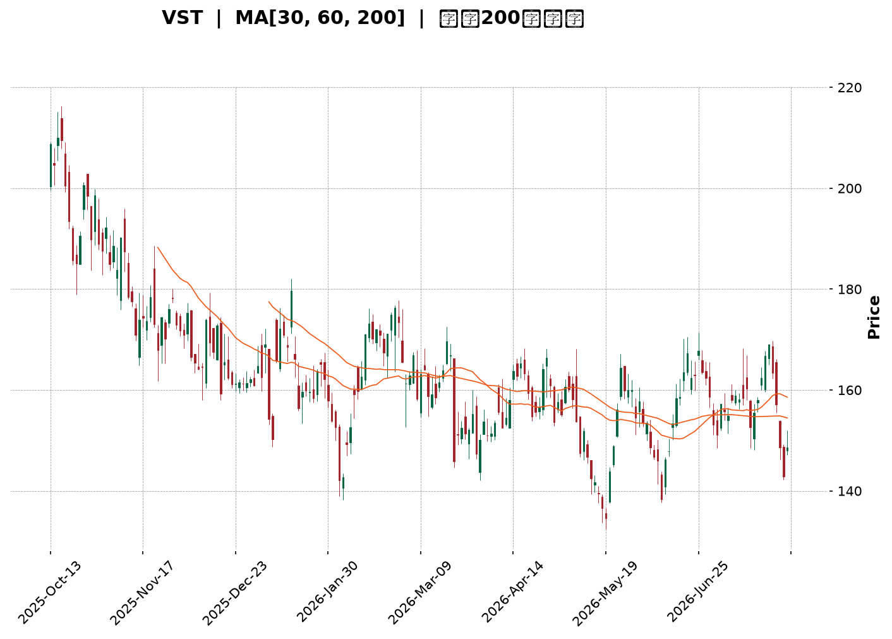
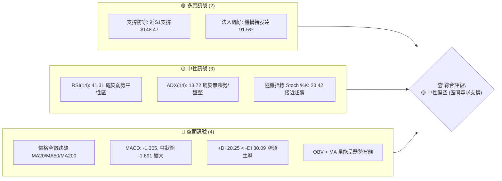
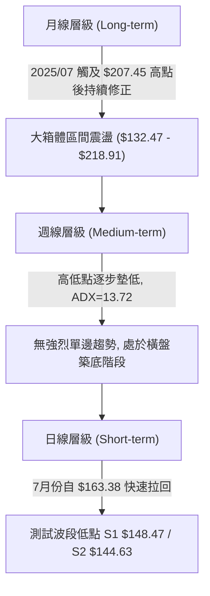
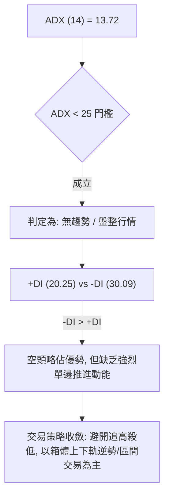
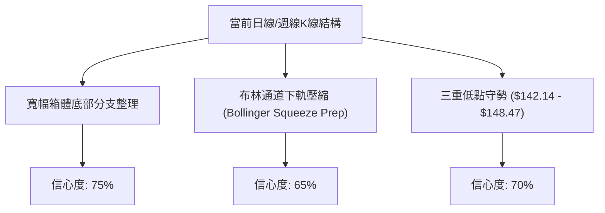
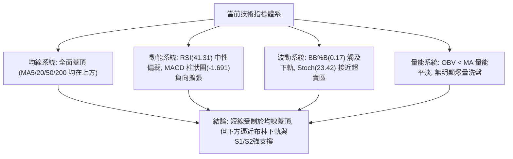
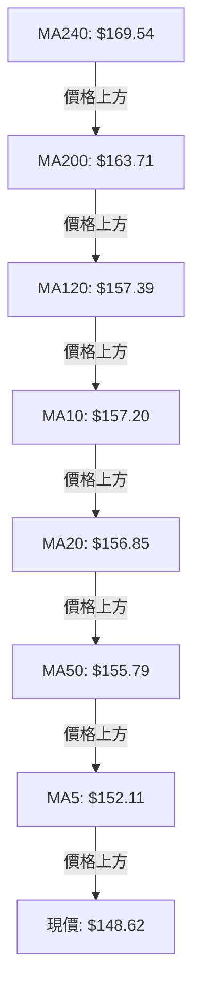
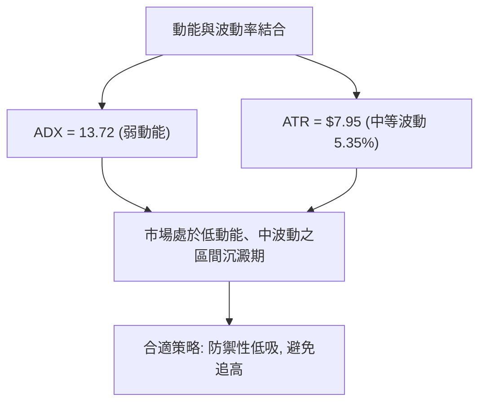
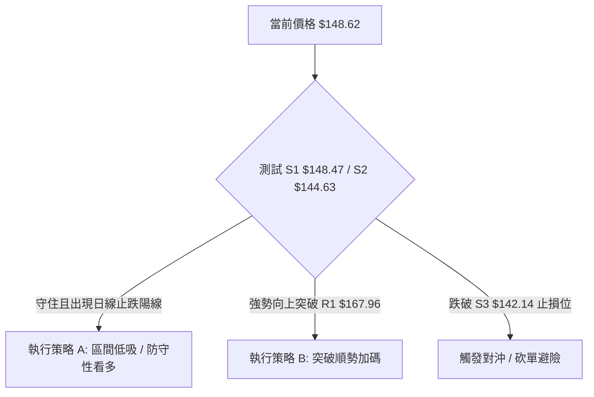
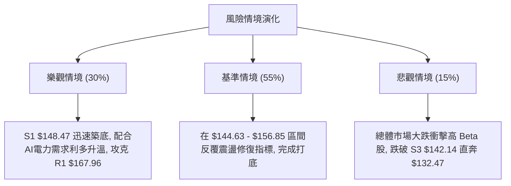

<details markdown="1">
<summary>📊 靜態圖表 (點擊展開)</summary>



</details>

<html>
<head><meta charset="utf-8" /></head>
<body>
    <div style="height:500px; width:100%;">                        <script>window.PlotlyConfig = {MathJaxConfig: 'local'};</script>
        <script charset="utf-8" src="https://cdn.plot.ly/plotly-3.7.0.min.js" integrity="sha256-jvTGqxNp8AGWEcvNLVuKr+8j5dGe9Yw51LQkmDH+IYA=" crossorigin="anonymous"></script>                <div id="candlestick-chart" class="plotly-graph-div" style="height:100%; width:100%;"></div>            <script>                window.PLOTLYENV=window.PLOTLYENV || {};                                if (document.getElementById("candlestick-chart")) {                    Plotly.newPlot(                        "candlestick-chart",                        [{"close":{"dtype":"f8","bdata":"AAAAIMoVakAAAACgC5VpQAAAAKA3P2pAAAAAYOAwakAAAABgehBpQAAAAMDmLWhAAAAA4OI3Z0AAAADg5SFnQAAAAEBx0mdAAAAAYE0UaUAAAABgJs9oQAAAAACWuWdAAAAAgGHRaEAAAAAAi51nQAAAAECccGdAAAAAIKkHaEAAAACgBx9nQAAAAGBYk2dAAAAAoFb7ZkAAAADApsZnQAAAAOD4b2dAAAAAwFdNZkAAAABA+zBmQAAAAMAmW2VAAAAAgOW+ZUAAAABgxshlQAAAAMBKtmVAAAAAoLRMZkAAAAAAN6JlQAAAAICB\u002fGRAAAAAoDzNZUAAAAAANURlQAAAAAAjAmZAAAAAYMhDZkAAAACAb51lQAAAAECzemVAAAAAAAVeZUAAAACA3+plQAAAAABBz2RAAAAAAMutZEAAAAAgDIRkQAAAAACFj2RAAAAAQAe8ZUAAAAAgoCxlQAAAAMCr8WRAAAAAYGGXZUAAAABAz+ljQAAAACBjr2RAAAAA4FJLZEAAAAAA+iNkQAAAAOAqJ2RAAAAAIGwwZEAAAADgKidkQAAAAMCXLGRAAAAAwHtFZEAAAABAURxkQAAAAODFmGRAAAAAQGBPZEAAAABg\u002fiFlQAAAAECNRWNAAAAAwOfFYkAAAAAAJ71kQAAAAABTg2VAAAAAgE5eZUAAAACAHxBlQAAAAIDadWZAAAAAAH7EZEAAAACgE4xjQAAAAGCD8mNAAAAAAF39Y0AAAABAtPVjQAAAAGDmy2NAAAAAoNF5ZEAAAABg26VkQAAAACA1RGRAAAAAgDi9Y0AAAACAszpjQAAAAEB+EmNAAAAA4A7EYUAAAAAgnNVhQAAAAKCWp2JAAAAAIIkRY0AAAABAHOVjQAAAAGCp9mNAAAAAIM1UZEAAAABgimBlQAAAAGBtpmVAAAAAoC5DZUAAAACAxYBlQAAAAACrXWVAAAAAQMnqZEAAAABgsGRlQAAAAAAK3GVAAAAAYKEKZkAAAADgIK1lQAAAAMAGsWRAAAAA4B8oZEAAAAAgGV1kQAAAAIAF3mRAAAAAQMvGY0AAAAAgZWVkQAAAAEBJfmRAAAAAoBHXY0AAAADgeORjQAAAAABe0GNAAAAAIGExZEAAAACADXxkQAAAAEDSNGVAAAAAgBDdZEAAAAAAGzpiQAAAAICC4mJAAAAAoDQQY0AAAAAgiuliQAAAAODIAmNAAAAAAGdoY0AAAABgrWpiQAAAACDVw2JAAAAAoNQ3Y0AAAACg\u002ft5iQAAAAKAY7GJAAAAA4OEuY0AAAAAAgXVjQAAAACAqEWNAAAAAgG9QY0AAAAAAUr9jQAAAAMCzd2RAAAAA4MlWZEAAAABgjalkQAAAAMBnZ2RAAAAA4A7sY0AAAAAgMFZjQAAAAOBOcmNAAAAAYC6UY0AAAACA2INkQAAAAAAby2RAAAAAQKEcZEAAAADAZTJjQAAAAADRs2NAAAAA4AJiY0AAAACAABRkQAAAAKD7BGRAAAAAQDLCY0AAAADAgjdjQAAAAABucGJAAAAAwMv6YkAAAACARFViQAAAAGAjzWFAAAAAIHO2YUAAAABggm9hQAAAAGDhEWFAAAAAILHQYEAAAABgjvlhQAAAAIDjm2JAAAAAoKWBY0AAAABAjopkQAAAACCi\u002fWNAAAAAoMkBZEAAAACAMABkQAAAAOBkUWNAAAAAgPi3Y0AAAACgtzJjQAAAAKCFL2NAAAAAoKmRYkAAAADgOVZiQAAAACB\u002fQGJAAAAAgBRLYUAAAAAgnEViQAAAACAEemJAAAAAIMUpY0AAAAAgbMxjQAAAAMBz02NAAAAAIKxwZEAAAADgUehkQAAAAOB6TGRAAAAAANdbZEAAAADgo\u002fhkQAAAACCub2RAAAAAAClMZEAAAAAAKdRjQAAAAMAeJWNAAAAAoJnhYkAAAABACqdjQAAAACBcd2NAAAAAgD1aY0AAAAAgXL9jQAAAACCF22NAAAAAANfDY0AAAACAws1jQAAAACBcB2RAAAAAgOsRY0AAAACAFG5jQAAAACCuv2NAAAAAYI9KZEAAAAAgrtdkQAAAACBcH2VAAAAAAClsZEAAAABgj6JjQAAAAOB6lGJAAAAAgOvZYUAAAAAA15NiQA=="},"high":{"dtype":"f8","bdata":"9oP+SIkiakCXN7eFe\u002f9pQEh6\u002ffZy5GpACdOvPWMGa0CD4s8quSVqQEZZBRC6lGlAQYTGMsUTaEAvGzPQ2ZZnQPLUBm3k7GdApx9UHjElaUBy+kZeF1ppQMaZ\u002fsTkj2hAyfRsa7j8aEDBkCKd2r9oQFIfyI7hAmhAxDkt9CxMaEBxp+5ERNZnQG5o8++n9WdAmIBbvb2KZ0BPO7STCslnQPwusUd7f2hANUuYMiNlZ0Cr87UOipFmQFsESi8aJ2ZAltR8mBxoZkAzk8+u0FhmQG1KZdPkFWZArM3DkemXZkDgX7BgKJBnQDSr+9G1nmVAdUAtFibPZUAJY5G2K8BlQAIYhRlpIGZAxk+aO6aAZkDQMAhD8PdlQCg2RXwM52VAfKxdwSCkZUDRLbpa+ClmQDAcS\u002fi3\u002fGVAzjrIvffjZEBCb4oakiZlQEdQBV+bqmRAEPXEBUXFZUAIwyaGHGhmQKJYt14KiWVA9dQpMa2mZUDeJfV4PM1lQBfU6cWfZmVAkvD6Kl9WZUD9YG8TantkQC+VNr\u002fyZ2RA\u002f6sLAF5EZEBT3R8xnFFkQGYyS4rnd2RAaKRLToZTZEAmYFI7eoFkQKe2+fcDGmVATeopUM5lZUBp8FokSIRlQAyWdjfpBWVAROJtm9hrY0COJfr1QMhlQDA5eLsTCGZAsBfXK+neZUCMn8fNpVZlQEMfebbNwWZAeQWHmLtUZUC\u002fQMluWLFkQB2MH1QPMWRAYlVG6ZBhZEBltG4Zdk1kQMN8ZnlTm2RApuoxnU6FZEBKFzU1N8NkQMRmyfhW7WRAjvAyQnqBZEDqhGt5PPFjQAdcsSYvgmNArwJ2+40nY0DTwSBkavBhQARwbMPg+mJAVNJ2HjVrY0CoNSN+MB9kQDjIZ4JTm2RA2b529gu4ZEB9eHAo92VlQOfN8oA0BWZAdF8WtYHgZUAzM\u002fdqAYNlQOr228muoGVASzahkbVrZUDnf+CEmmZlQI\u002fJWUSM7mVAWbD5u7YXZkAUURmbLTpmQG31n4UOAWZAhwMc5IViZECjlB4qOXhkQD8jKB428GRA\u002f6bjmUv9ZEDWRGNMoIVkQB\u002f1zuhgCmVA\u002fPux1jNxZEBq9DMQ\u002fldkQDxQdpcXmWRA5cq235BhZEDtwTb2HKBkQEdRRym6kGVABnFCWjokZUAS2w0Xl8dkQCj9f9DSdWNArBCp0E08Y0DJ0ZzYVLdjQP255qKbDmNAJp7mLTv\u002fY0A8coLDpdZjQJA+jPBC6GJAtnEuPOKDY0DZhpXnAEtjQLeT4SSCHGNAum8zoDg+Y0AGa5WIsyJkQPAhUtavSWRAXnQOsg\u002fNY0AKvFgB2Q9kQHM\u002fAD6QoWRA5UvjPDDJZEBq01xT+NVkQBSlIOAjCGVAl1FaRUJ6ZEApP5q2\u002fRtkQMePKu9w22NAd6\u002fm+7rUY0DtmB1u9KdkQHfPrSvnBWVAe0d0XRdjZEDmAJauPB1kQDWgRj4E7WNAObMAU1D9Y0A6Qsq45ERkQPwsthFFcmRAvncR6GJYZEBQzOnT8QRlQLp1EVoQWWNAofcaGyoRY0CrwoLxm8NiQA6qzPRpQmJAWRXGBAfjYUASR\u002fX4kJxhQCHzmAkJa2FAVIfWU0gQYUCqLp7QUBZiQOrudJVHomJApM9jWzCrY0CkD9H2TuVkQCksGdBRmWRAhVjUZKRpZEC6wXhmBEJkQGFCeDSBymNAzaDPzsMRZECPZ\u002f6pDbZjQL3L5vpiOmNAeP9xBWBCY0BbQnRB66JiQIgbOsLfwmJA4OUhU475YUDpFA\u002frOVZiQBK6r9ZDyWJAf9bCg3FnY0C9wjo\u002fIihkQBc1bITPRmRAPn6+4UFDZUAAAAAAAFBlQAAAAGBmumRAAAAA4Hq0ZEAAAABAM2tlQAAAAIDC\u002fWRAAAAAQDOzZEAAAABgZq5kQAAAAIA9qmNAAAAAIK6HY0AAAAAgrqdjQAAAAMAe7WNAAAAA4KWPY0AAAACAwiVkQAAAAOCjAGRAAAAAgMLtY0AAAABguAZlQAAAAIAU3mRAAAAAQDPDY0AAAAAAAKhjQAAAAIA90mNAAAAAYLiOZEAAAACA6\u002flkQAAAAIDrIWVAAAAA4FE4ZUAAAADgo8RkQAAAACCuP2NAAAAAwPWoYkAAAABACv9iQA=="},"hovertemplate":"\u003cb\u003e%{x|%Y-%m-%d}\u003c\u002fb\u003e\u003cbr\u003e\u958b: $%{open:.2f}\u003cbr\u003e\u9ad8: $%{high:.2f}\u003cbr\u003e\u4f4e: $%{low:.2f}\u003cbr\u003e\u6536: $%{close:.2f}\u003cextra\u003e\u003c\u002fextra\u003e","low":{"dtype":"f8","bdata":"bzeNHzTyaEDiAGMjEhJpQFugZ1BosWlA51cNTTH6aUCMsOvqDOdoQJtpyE88AGhAVc2rxpwZZ0CDtpo29VxmQLdR+OsSHmdAMJbfx185aECdTWzh63VoQIMJ5uyO9mZA3sr4GOWVZ0D29kUAQnhnQPrMwOVI2GZAT5kaVyRiZ0ADEwuhg\u002fdmQLfJM4c3BWdAUCMfTiJZZkDEkt49w\u002ftlQLLFatqt7GZA+4Y7ZDBCZkCb5ppLwBFmQO+1cXUCOmVACufm4ZWcZEDNzIc\u002f3YxlQD\u002fYrp54PmVAO2r0J+uvZUDkC2zMLo1lQDlvTLGFOGRAo5QYbMimZEBs51gq8aZkQOjCt\u002fa\u002fi2VA65T9ALIoZkCSwaFmKX9lQNhjnQLwVGVAzflBW\u002foHZUBhYimacjhlQPrLUWjyuGRAdVxEfSVsZEAIgdF3f4FkQLArIaS+v2NAO4jIl\u002fMKZEBEZ7k1xdlkQB2V5wUzyWRAs9PBDX+7ZEASOAeGVsFjQLsa7AjaP2RA3yQwts5AZED6zqgFAA1kQBwFzg0G9mNAcoBRHonqY0C4gPZUC\u002f1jQE4X9Sxz72NAKY+dgbMTZEBdZG6czhhkQCB9yugCbmRADECgLPD3Y0DJlyxTgGpkQNhP4ZS5I2NAQrOS3eiYYkBPjuoShK1kQNu6cRoTdGRA3i1W7yhLZUAJrhDe8LJkQOzgx5iaZmVAkOfdwu1RZED0weTHNHpjQBOeeqAQK2NAIPSX+L\u002fWY0AXq5IpDbJjQLD08TDcrmNAzuvFlda2Y0Byb7Z\u002f5BZkQC+CjTElymNAR\u002furDKyNY0BPfLOSXDNjQMfxonBEv2JAUcp6U1hcYUCQf536ukRhQKFQ\u002f+VsYGJAKc9N6+lrYkByNGHBQExjQBx43miaw2NATyt3paP+Y0C0rE4HviFkQKIcB4xlL2VAY1s08oskZUDNzMyMJflkQCmrzH0UEWVA0tMOiSKYZEDuJ0Lmx01kQFhE4JOLM2VAbwviPgh1ZEAXDS6tZE1lQMSnt53rq2RAcGCLs9oRY0C1Lralo\u002f5jQGVNuoV8J2RAbKrpCKC7Y0Cf5bHwUFJjQKPgpSVBe2RAOdcDQRpXY0CX44T2kIhjQElApVJvqWNAHnsInWL1Y0Bf8kUShzVkQJFttaljoWRAwrR7ltx4ZED80hsiFBRiQDCcSKUJpGJAyIIcUeiqYkDrQA8ybsViQPVLM+8fSWJAEhzDmjXxYkDRQsnEo0xiQIi6hYmCxGFA8DrGUwbmYkCspp1EH71iQHp9+\u002fZztWJASPupEzzCYkAzn6ifVGJjQMhBT23tDmNAMcweD6scY0Bm\u002fQP19w1jQIN0gUfdA2RALPfdLIs9ZECnqN4zPkxkQJS7Xv8OQWRA2ZzkySfDY0BB439PQz1jQFCOfteBVmNAst3zCxZJY0AByZRk211jQNzBu59q0GNANrhk\u002fu\u002fPY0BX4EiitRtjQPbMMQxkcGNAYtt3otNWY0BSrOzQCKdjQHihDOVy8mNAFapMPDGMY0Cf+NxPwjFjQFqsM1rIWGJA8Hmqn1lCYkBT2n4cmi5iQE3hjaMTamFA5lUCCT53YUBVuQjMwDNhQDF9spuHtWBARUYq\u002fC6PYEBVvTbJwDNhQNs5lj2tFWJAvFPn\u002fEDRYkALBQmi9b9jQMdPpbT3xWNAJEOH0yWsY0Bq28zAI5VjQNVHqKvJ42JAs\u002f\u002f9j1EVY0BVQ\u002fAcjhdjQJGDq\u002fVbv2JAUQJaL2ZpYkCM8PoUnEViQPVudh3yqmFAABqb1\u002fI2YUBpIkej\u002fmthQAsPdu9rWWJA4+8leT7BYkBBg9+WuBNjQDVlMk+vn2NAMhGFfcz5Y0AAAADAzFxkQAAAAOCj5GNAAAAAACn8Y0AAAADgUcBkQAAAAIAUZmRAAAAA4KMgZEAAAADgUZBjQAAAAKCZ4WJAAAAAAACQYkAAAADgUQBjQAAAAOBRQGNAAAAAgD3qYkAAAACAPa5jQAAAAKCZoWNAAAAAYGaGY0AAAAAgBqFjQAAAAIAUvmNAAAAAgJOQYkAAAADgeoRiQAAAAEAzc2NAAAAA4FEAZEAAAAAAKfRjQAAAAOBRoGRAAAAAgOtJZEAAAACgR3FjQAAAAGC4RmJAAAAAwPXEYUAAAABguGJiQA=="},"name":"\u50f9\u683c","open":{"dtype":"f8","bdata":"DCo86SUJaUBAeKrc951pQDpeT9t1DmpAnm5aGca8akA1GisH4dlpQCB70ZsRaWlA44lo648CaEB2IEuwtVhnQLdR+OsSHmdAzNDY1Bt5aEBy+kZeF1ppQMaZ\u002fsTkj2hA1GIYUxTwZ0DrajNF7DtoQNmEf+uE5mdAqs6Cw5jAZ0AYhbaRPGpnQGd5bLeZL2dAyraYRjXEZkCiOWtwTzhmQPKSDzu\u002fP2hAvnHl88MkZ0BenUHDoHJmQP5SyzukBWZA1QwKppLPZEAAgBhEetZlQN0Jnas0fmVAHVc7uN\u002fNZUCqIZAftgFnQLMLpWUsaWVA+hZ+fLwbZUBSvuoLdatlQB5+rYDoqGVAN1NYfj5IZkDWVuL69ehlQP6294uF1WVAFWBtrzR+ZUAQOT1t\u002fGVlQPzuCZU2+WVAzjrIvffjZEBNcmeZ5JVkQPhBbtnvlGRA1jlCAhgsZEB0cX76Jc9lQMIjjxrEh2VATEcSyK6+ZEDno1LdOallQP0koZMin2RAIQc50EbAZECtOPeUhXFkQD4gggL6I2RAn+L3y3cRZEAAAADgKidkQJt0xXvJEWRA4rgUw7IxZEDE909+GU5kQCB9yugCbmRAkXplNOMcZUB\u002fyluaFBFlQAyWdjfpBWVAg314aUtaY0BDTR56K7tlQMcg5wTnhmRA7ZsDkaOwZUB+cQqihh1lQLSl30O6kGVAqwSR587iZEChFGk0ZxpkQOIDlzNI0mNAe3eu5HYvZECQRUD23\u002fFjQF+aleWzBGRAxI9o+TziY0ADEildWLFkQFbh87wRsGRAiTsxD74hZEBQCkPC4aZjQPSeN70OdmNAR5C9Wo4YY0CiNDVojZNhQGvQ+\u002fbBsmJAbvtA\u002f8GyYkD\u002fGoqro\u002f5jQCt\u002f6wNvkWRAVV4skCsJZEDFYDNwdj5kQF6+bicTTWVAs6ulQfWwZUDNzK7IHi5lQH5MwohjemVA5YCBUGpFZUDqU5E1MdpkQBzvAznxfGVAA7NbZWRcZUBeBNfpjNBlQLXxqtpfN2VAB1PTOc4nZEDh1bZAnSRkQF+1iIDeLWRAgE9oy+F\u002fZEBk8plZCW9jQEz8se3rnGRA\u002f98kx8FkZEB0vvdfsZRjQF2rAP4JKmRAxPbQX8kRZEC2Ry36i0tkQI9bSwNeqWRAdFoVpa7WZEAS2w0Xl8dkQJsRxGqf52JAVVhE3NzKYkCDeW5EEFljQBbcrFNPqWJAEhzDmjXxYkDDZ3p6K5xjQBLZRipc9mFA\u002fZJ2BkPoYkCAm\u002fon9N9iQPTlBU2F2mJA3HawxnrbYkAFbOhyzhBkQD0FXQeBdWNAtZZUdyEpY0Bm\u002fQP19w1jQGrRNB\u002faRWRAwRlEDJioZEAS234f4IpkQLuBQSzhwGRAbaMVuk1aZECY18A7IBFkQElCG9mJsmNAS5sisr13Y0BNfAKAkINjQHTgz7mdmGRAgy\u002fmcLpIZECguN1AUhRkQFJ21iFJgmNAFnTg6dXCY0AlPbjzBa9jQED1\u002fJu0WGRAQvmM6JwoZEAIBNbd+1lkQLp1EVoQWWNA1M6FhWB5YkD6ZWWc\u002fahiQA6qzPRpQmJAOw0CVdWlYUC\u002fIGWJi3JhQKy7RZnHWWFAa6VN44XzYEAAAAAc0zlhQPzERLuHKGJA8Ee7hzPaYkDHxmI6AtZjQCqM6aVWl2RAr4IMn8XTY0BDIIcC1\u002fhjQMLQZVb5mGNAY8mZARp3Y0C17QHUUIljQAw4lp5\u002f6mJArxqcoTL5YkC3\u002fdt4SINiQDEc4UvMhmJAButnBcnkYUDK3O7+XplhQFYbq3pgeWJAgqlK4hQTY0CbYydnJCFjQIfXM+n7ymNA8Fc8ZKA7ZEAAAAAAKXBkQAAAAGCPAmRAAAAAwPVgZEAAAADAHt1kQAAAACCFu2RAAAAAYGZ2ZEAAAABgj1JkQAAAAAAAgGNAAAAAYGY+Y0AAAABACg9jQAAAAAAphGNAAAAAIK4\u002fY0AAAADgUeBjQAAAAKCZsWNAAAAAwMy0Y0AAAAAAACBkQAAAAAAAUGRAAAAAANe7Y0AAAAAghctiQAAAAOCjsGNAAAAAIK4fZEAAAAAghQNkQAAAAOBRyGRAAAAAgD0WZUAAAAAAALBkQAAAAKBwPWNAAAAAQDOXYkAAAAAAAIBiQA=="},"x":["2025-10-13T00:00:00-04:00","2025-10-14T00:00:00-04:00","2025-10-15T00:00:00-04:00","2025-10-16T00:00:00-04:00","2025-10-17T00:00:00-04:00","2025-10-20T00:00:00-04:00","2025-10-21T00:00:00-04:00","2025-10-22T00:00:00-04:00","2025-10-23T00:00:00-04:00","2025-10-24T00:00:00-04:00","2025-10-27T00:00:00-04:00","2025-10-28T00:00:00-04:00","2025-10-29T00:00:00-04:00","2025-10-30T00:00:00-04:00","2025-10-31T00:00:00-04:00","2025-11-03T00:00:00-05:00","2025-11-04T00:00:00-05:00","2025-11-05T00:00:00-05:00","2025-11-06T00:00:00-05:00","2025-11-07T00:00:00-05:00","2025-11-10T00:00:00-05:00","2025-11-11T00:00:00-05:00","2025-11-12T00:00:00-05:00","2025-11-13T00:00:00-05:00","2025-11-14T00:00:00-05:00","2025-11-17T00:00:00-05:00","2025-11-18T00:00:00-05:00","2025-11-19T00:00:00-05:00","2025-11-20T00:00:00-05:00","2025-11-21T00:00:00-05:00","2025-11-24T00:00:00-05:00","2025-11-25T00:00:00-05:00","2025-11-26T00:00:00-05:00","2025-11-28T00:00:00-05:00","2025-12-01T00:00:00-05:00","2025-12-02T00:00:00-05:00","2025-12-03T00:00:00-05:00","2025-12-04T00:00:00-05:00","2025-12-05T00:00:00-05:00","2025-12-08T00:00:00-05:00","2025-12-09T00:00:00-05:00","2025-12-10T00:00:00-05:00","2025-12-11T00:00:00-05:00","2025-12-12T00:00:00-05:00","2025-12-15T00:00:00-05:00","2025-12-16T00:00:00-05:00","2025-12-17T00:00:00-05:00","2025-12-18T00:00:00-05:00","2025-12-19T00:00:00-05:00","2025-12-22T00:00:00-05:00","2025-12-23T00:00:00-05:00","2025-12-24T00:00:00-05:00","2025-12-26T00:00:00-05:00","2025-12-29T00:00:00-05:00","2025-12-30T00:00:00-05:00","2025-12-31T00:00:00-05:00","2026-01-02T00:00:00-05:00","2026-01-05T00:00:00-05:00","2026-01-06T00:00:00-05:00","2026-01-07T00:00:00-05:00","2026-01-08T00:00:00-05:00","2026-01-09T00:00:00-05:00","2026-01-12T00:00:00-05:00","2026-01-13T00:00:00-05:00","2026-01-14T00:00:00-05:00","2026-01-15T00:00:00-05:00","2026-01-16T00:00:00-05:00","2026-01-20T00:00:00-05:00","2026-01-21T00:00:00-05:00","2026-01-22T00:00:00-05:00","2026-01-23T00:00:00-05:00","2026-01-26T00:00:00-05:00","2026-01-27T00:00:00-05:00","2026-01-28T00:00:00-05:00","2026-01-29T00:00:00-05:00","2026-01-30T00:00:00-05:00","2026-02-02T00:00:00-05:00","2026-02-03T00:00:00-05:00","2026-02-04T00:00:00-05:00","2026-02-05T00:00:00-05:00","2026-02-06T00:00:00-05:00","2026-02-09T00:00:00-05:00","2026-02-10T00:00:00-05:00","2026-02-11T00:00:00-05:00","2026-02-12T00:00:00-05:00","2026-02-13T00:00:00-05:00","2026-02-17T00:00:00-05:00","2026-02-18T00:00:00-05:00","2026-02-19T00:00:00-05:00","2026-02-20T00:00:00-05:00","2026-02-23T00:00:00-05:00","2026-02-24T00:00:00-05:00","2026-02-25T00:00:00-05:00","2026-02-26T00:00:00-05:00","2026-02-27T00:00:00-05:00","2026-03-02T00:00:00-05:00","2026-03-03T00:00:00-05:00","2026-03-04T00:00:00-05:00","2026-03-05T00:00:00-05:00","2026-03-06T00:00:00-05:00","2026-03-09T00:00:00-04:00","2026-03-10T00:00:00-04:00","2026-03-11T00:00:00-04:00","2026-03-12T00:00:00-04:00","2026-03-13T00:00:00-04:00","2026-03-16T00:00:00-04:00","2026-03-17T00:00:00-04:00","2026-03-18T00:00:00-04:00","2026-03-19T00:00:00-04:00","2026-03-20T00:00:00-04:00","2026-03-23T00:00:00-04:00","2026-03-24T00:00:00-04:00","2026-03-25T00:00:00-04:00","2026-03-26T00:00:00-04:00","2026-03-27T00:00:00-04:00","2026-03-30T00:00:00-04:00","2026-03-31T00:00:00-04:00","2026-04-01T00:00:00-04:00","2026-04-02T00:00:00-04:00","2026-04-06T00:00:00-04:00","2026-04-07T00:00:00-04:00","2026-04-08T00:00:00-04:00","2026-04-09T00:00:00-04:00","2026-04-10T00:00:00-04:00","2026-04-13T00:00:00-04:00","2026-04-14T00:00:00-04:00","2026-04-15T00:00:00-04:00","2026-04-16T00:00:00-04:00","2026-04-17T00:00:00-04:00","2026-04-20T00:00:00-04:00","2026-04-21T00:00:00-04:00","2026-04-22T00:00:00-04:00","2026-04-23T00:00:00-04:00","2026-04-24T00:00:00-04:00","2026-04-27T00:00:00-04:00","2026-04-28T00:00:00-04:00","2026-04-29T00:00:00-04:00","2026-04-30T00:00:00-04:00","2026-05-01T00:00:00-04:00","2026-05-04T00:00:00-04:00","2026-05-05T00:00:00-04:00","2026-05-06T00:00:00-04:00","2026-05-07T00:00:00-04:00","2026-05-08T00:00:00-04:00","2026-05-11T00:00:00-04:00","2026-05-12T00:00:00-04:00","2026-05-13T00:00:00-04:00","2026-05-14T00:00:00-04:00","2026-05-15T00:00:00-04:00","2026-05-18T00:00:00-04:00","2026-05-19T00:00:00-04:00","2026-05-20T00:00:00-04:00","2026-05-21T00:00:00-04:00","2026-05-22T00:00:00-04:00","2026-05-26T00:00:00-04:00","2026-05-27T00:00:00-04:00","2026-05-28T00:00:00-04:00","2026-05-29T00:00:00-04:00","2026-06-01T00:00:00-04:00","2026-06-02T00:00:00-04:00","2026-06-03T00:00:00-04:00","2026-06-04T00:00:00-04:00","2026-06-05T00:00:00-04:00","2026-06-08T00:00:00-04:00","2026-06-09T00:00:00-04:00","2026-06-10T00:00:00-04:00","2026-06-11T00:00:00-04:00","2026-06-12T00:00:00-04:00","2026-06-15T00:00:00-04:00","2026-06-16T00:00:00-04:00","2026-06-17T00:00:00-04:00","2026-06-18T00:00:00-04:00","2026-06-22T00:00:00-04:00","2026-06-23T00:00:00-04:00","2026-06-24T00:00:00-04:00","2026-06-25T00:00:00-04:00","2026-06-26T00:00:00-04:00","2026-06-29T00:00:00-04:00","2026-06-30T00:00:00-04:00","2026-07-01T00:00:00-04:00","2026-07-02T00:00:00-04:00","2026-07-06T00:00:00-04:00","2026-07-07T00:00:00-04:00","2026-07-08T00:00:00-04:00","2026-07-09T00:00:00-04:00","2026-07-10T00:00:00-04:00","2026-07-13T00:00:00-04:00","2026-07-14T00:00:00-04:00","2026-07-15T00:00:00-04:00","2026-07-16T00:00:00-04:00","2026-07-17T00:00:00-04:00","2026-07-20T00:00:00-04:00","2026-07-21T00:00:00-04:00","2026-07-22T00:00:00-04:00","2026-07-23T00:00:00-04:00","2026-07-24T00:00:00-04:00","2026-07-27T00:00:00-04:00","2026-07-28T00:00:00-04:00","2026-07-29T00:00:00-04:00","2026-07-30T00:00:00-04:00"],"type":"candlestick"},{"hovertemplate":"MA30: $%{y:.2f}\u003cextra\u003e\u003c\u002fextra\u003e","line":{"color":"#2196F3","dash":"dash","width":2},"mode":"lines","name":"MA30","x":["2025-10-13T00:00:00-04:00","2025-10-14T00:00:00-04:00","2025-10-15T00:00:00-04:00","2025-10-16T00:00:00-04:00","2025-10-17T00:00:00-04:00","2025-10-20T00:00:00-04:00","2025-10-21T00:00:00-04:00","2025-10-22T00:00:00-04:00","2025-10-23T00:00:00-04:00","2025-10-24T00:00:00-04:00","2025-10-27T00:00:00-04:00","2025-10-28T00:00:00-04:00","2025-10-29T00:00:00-04:00","2025-10-30T00:00:00-04:00","2025-10-31T00:00:00-04:00","2025-11-03T00:00:00-05:00","2025-11-04T00:00:00-05:00","2025-11-05T00:00:00-05:00","2025-11-06T00:00:00-05:00","2025-11-07T00:00:00-05:00","2025-11-10T00:00:00-05:00","2025-11-11T00:00:00-05:00","2025-11-12T00:00:00-05:00","2025-11-13T00:00:00-05:00","2025-11-14T00:00:00-05:00","2025-11-17T00:00:00-05:00","2025-11-18T00:00:00-05:00","2025-11-19T00:00:00-05:00","2025-11-20T00:00:00-05:00","2025-11-21T00:00:00-05:00","2025-11-24T00:00:00-05:00","2025-11-25T00:00:00-05:00","2025-11-26T00:00:00-05:00","2025-11-28T00:00:00-05:00","2025-12-01T00:00:00-05:00","2025-12-02T00:00:00-05:00","2025-12-03T00:00:00-05:00","2025-12-04T00:00:00-05:00","2025-12-05T00:00:00-05:00","2025-12-08T00:00:00-05:00","2025-12-09T00:00:00-05:00","2025-12-10T00:00:00-05:00","2025-12-11T00:00:00-05:00","2025-12-12T00:00:00-05:00","2025-12-15T00:00:00-05:00","2025-12-16T00:00:00-05:00","2025-12-17T00:00:00-05:00","2025-12-18T00:00:00-05:00","2025-12-19T00:00:00-05:00","2025-12-22T00:00:00-05:00","2025-12-23T00:00:00-05:00","2025-12-24T00:00:00-05:00","2025-12-26T00:00:00-05:00","2025-12-29T00:00:00-05:00","2025-12-30T00:00:00-05:00","2025-12-31T00:00:00-05:00","2026-01-02T00:00:00-05:00","2026-01-05T00:00:00-05:00","2026-01-06T00:00:00-05:00","2026-01-07T00:00:00-05:00","2026-01-08T00:00:00-05:00","2026-01-09T00:00:00-05:00","2026-01-12T00:00:00-05:00","2026-01-13T00:00:00-05:00","2026-01-14T00:00:00-05:00","2026-01-15T00:00:00-05:00","2026-01-16T00:00:00-05:00","2026-01-20T00:00:00-05:00","2026-01-21T00:00:00-05:00","2026-01-22T00:00:00-05:00","2026-01-23T00:00:00-05:00","2026-01-26T00:00:00-05:00","2026-01-27T00:00:00-05:00","2026-01-28T00:00:00-05:00","2026-01-29T00:00:00-05:00","2026-01-30T00:00:00-05:00","2026-02-02T00:00:00-05:00","2026-02-03T00:00:00-05:00","2026-02-04T00:00:00-05:00","2026-02-05T00:00:00-05:00","2026-02-06T00:00:00-05:00","2026-02-09T00:00:00-05:00","2026-02-10T00:00:00-05:00","2026-02-11T00:00:00-05:00","2026-02-12T00:00:00-05:00","2026-02-13T00:00:00-05:00","2026-02-17T00:00:00-05:00","2026-02-18T00:00:00-05:00","2026-02-19T00:00:00-05:00","2026-02-20T00:00:00-05:00","2026-02-23T00:00:00-05:00","2026-02-24T00:00:00-05:00","2026-02-25T00:00:00-05:00","2026-02-26T00:00:00-05:00","2026-02-27T00:00:00-05:00","2026-03-02T00:00:00-05:00","2026-03-03T00:00:00-05:00","2026-03-04T00:00:00-05:00","2026-03-05T00:00:00-05:00","2026-03-06T00:00:00-05:00","2026-03-09T00:00:00-04:00","2026-03-10T00:00:00-04:00","2026-03-11T00:00:00-04:00","2026-03-12T00:00:00-04:00","2026-03-13T00:00:00-04:00","2026-03-16T00:00:00-04:00","2026-03-17T00:00:00-04:00","2026-03-18T00:00:00-04:00","2026-03-19T00:00:00-04:00","2026-03-20T00:00:00-04:00","2026-03-23T00:00:00-04:00","2026-03-24T00:00:00-04:00","2026-03-25T00:00:00-04:00","2026-03-26T00:00:00-04:00","2026-03-27T00:00:00-04:00","2026-03-30T00:00:00-04:00","2026-03-31T00:00:00-04:00","2026-04-01T00:00:00-04:00","2026-04-02T00:00:00-04:00","2026-04-06T00:00:00-04:00","2026-04-07T00:00:00-04:00","2026-04-08T00:00:00-04:00","2026-04-09T00:00:00-04:00","2026-04-10T00:00:00-04:00","2026-04-13T00:00:00-04:00","2026-04-14T00:00:00-04:00","2026-04-15T00:00:00-04:00","2026-04-16T00:00:00-04:00","2026-04-17T00:00:00-04:00","2026-04-20T00:00:00-04:00","2026-04-21T00:00:00-04:00","2026-04-22T00:00:00-04:00","2026-04-23T00:00:00-04:00","2026-04-24T00:00:00-04:00","2026-04-27T00:00:00-04:00","2026-04-28T00:00:00-04:00","2026-04-29T00:00:00-04:00","2026-04-30T00:00:00-04:00","2026-05-01T00:00:00-04:00","2026-05-04T00:00:00-04:00","2026-05-05T00:00:00-04:00","2026-05-06T00:00:00-04:00","2026-05-07T00:00:00-04:00","2026-05-08T00:00:00-04:00","2026-05-11T00:00:00-04:00","2026-05-12T00:00:00-04:00","2026-05-13T00:00:00-04:00","2026-05-14T00:00:00-04:00","2026-05-15T00:00:00-04:00","2026-05-18T00:00:00-04:00","2026-05-19T00:00:00-04:00","2026-05-20T00:00:00-04:00","2026-05-21T00:00:00-04:00","2026-05-22T00:00:00-04:00","2026-05-26T00:00:00-04:00","2026-05-27T00:00:00-04:00","2026-05-28T00:00:00-04:00","2026-05-29T00:00:00-04:00","2026-06-01T00:00:00-04:00","2026-06-02T00:00:00-04:00","2026-06-03T00:00:00-04:00","2026-06-04T00:00:00-04:00","2026-06-05T00:00:00-04:00","2026-06-08T00:00:00-04:00","2026-06-09T00:00:00-04:00","2026-06-10T00:00:00-04:00","2026-06-11T00:00:00-04:00","2026-06-12T00:00:00-04:00","2026-06-15T00:00:00-04:00","2026-06-16T00:00:00-04:00","2026-06-17T00:00:00-04:00","2026-06-18T00:00:00-04:00","2026-06-22T00:00:00-04:00","2026-06-23T00:00:00-04:00","2026-06-24T00:00:00-04:00","2026-06-25T00:00:00-04:00","2026-06-26T00:00:00-04:00","2026-06-29T00:00:00-04:00","2026-06-30T00:00:00-04:00","2026-07-01T00:00:00-04:00","2026-07-02T00:00:00-04:00","2026-07-06T00:00:00-04:00","2026-07-07T00:00:00-04:00","2026-07-08T00:00:00-04:00","2026-07-09T00:00:00-04:00","2026-07-10T00:00:00-04:00","2026-07-13T00:00:00-04:00","2026-07-14T00:00:00-04:00","2026-07-15T00:00:00-04:00","2026-07-16T00:00:00-04:00","2026-07-17T00:00:00-04:00","2026-07-20T00:00:00-04:00","2026-07-21T00:00:00-04:00","2026-07-22T00:00:00-04:00","2026-07-23T00:00:00-04:00","2026-07-24T00:00:00-04:00","2026-07-27T00:00:00-04:00","2026-07-28T00:00:00-04:00","2026-07-29T00:00:00-04:00","2026-07-30T00:00:00-04:00"],"y":{"dtype":"f8","bdata":"AAAAAAAA+H8AAAAAAAD4fwAAAAAAAPh\u002fAAAAAAAA+H8AAAAAAAD4fwAAAAAAAPh\u002fAAAAAAAA+H8AAAAAAAD4fwAAAAAAAPh\u002fAAAAAAAA+H8AAAAAAAD4fwAAAAAAAPh\u002fAAAAAAAA+H8AAAAAAAD4fwAAAAAAAPh\u002fAAAAAAAA+H8AAAAAAAD4fwAAAAAAAPh\u002fAAAAAAAA+H8AAAAAAAD4fwAAAAAAAPh\u002fAAAAAAAA+H8AAAAAAAD4fwAAAAAAAPh\u002fAAAAAAAA+H8AAAAAAAD4fwAAAAAAAPh\u002fAAAAAAAA+H8AAAAAAAD4f2ZmZkYIiGdAZmZmBntjZ0AiIiISpz5nQHd3d7d7GmdAq6qq6vr4ZkDv7u6ei9tmQO\u002fu7l6BxGZAVVVVtbW0ZkARERGhV6pmQCIiItKikGZAERER8RVrZkDv7u7uckZmQN7d3V1yK2ZA7+7ujiIRZkDe3d3tTfxlQFVVVaUB52VAREREdDLSZUBVVVW10rZlQGZmZmYonmVAd3d3VzmHZUBVVVWVM2hlQHd3d7csTGVAzczM3CQ6ZUDNzMwMwChlQHd3dzeqHmVAAAAAoBUSZUBERER0zQNlQGZmZgZJ+mRA7+7uvk7pZEB3d3eXCOVkQJqZmdlm1mRAAAAAsI68ZECJiIg4DrhkQGZmZhbUs2RARERE5C2sZEBmZmYGeKdkQDMzMzPXr2RAmpmZGbmqZECrqqoaf5ZkQDMzM3Mjj2RAq6qq6kGJZEARERFBg4RkQHd3d\u002ff9fWRAIiIickBzZEC8u7trwm5kQDMzMzP6aGRAmpmZCSxZZEB3d3fHVVNkQKuqqmqSRWRAVVVVFf8vZECamZlJURxkQERERBSID2RAq6qq+vcFZECrqqpKxANkQERERBT4AWRAq6qqynoCZEDv7u5+SQ1kQLy7u4tGFmRAZmZmBmceZEC8u7vLjyFkQHd3d6duM2RAAAAAcLpFZEBVVVUVUEtkQN7d3R1FTmRAzczMnANUZEBERERkP1lkQEREREQnSmRA3t3d7fBEZEBERESU6EtkQAAAAEDCU2RAd3d3l\u002fBRZEAAAACwqVVkQKuqquqbW2RA3t3dHS9WZEBmZmbmvE9kQFVVVWXgS2RA3t3dnb9PZEARERHRdVpkQBEREdGrbGRA3t3dzRqHZEDe3d1ddIpkQJqZmSlrjGRAAAAA0F+MZEAzMzMT\u002fYNkQN7d3f3be2RAiYiIuPpzZEDv7u6et1pkQCIiIvIYQmRAMzMzA6cwZEAzMzNzMRpkQM3MzDxXBWRAIiIiQov2Y0De3d2tCeZjQKuqqmo1zmNAzczMfO+2Y0CJiIioeaZjQN7d3X2QpGNAERERsR6mY0CamZkZq6hjQImIiOi2pGNAVVVV5fSlY0CJiIiY6pxjQJqZmdn7k2NAMzMzE8GRY0AAAAAQEZdjQCIiIrJsn2NAIiIiorueY0AzMzOTvpNjQDMzMzPphmNAzczMnEZ6Y0B3d3eHEopjQLy7uzvBk2NAZmZmFrCZY0ARERFxSZxjQLy7u4tol2NAzczMPMGTY0CrqqqKCpNjQKuqqmrRimNAVVVV1fh9Y0BVVVX1uHFjQBEREVHqYWNA3t3dfbVNY0BVVVVFC0FjQERERIQiPWNAREREdMY+Y0Crqqq6jEVjQDMzMxN7QWNAvLu7u6U+Y0ARERGBADljQERERCS8L2NAmpmZqf8tY0Crqqr60CxjQCIiIhKXKmNAvLu7C\u002fkhY0ARERGxYg9jQERERNSy+WJAq6qqmqXhYkBEREQEwdliQBEREUFLz2JAREREVGvNYkBERESECMtiQKuqqtphyWJAd3d3tzLPYkBVVVUFoN1iQBEREVF+7WJAVVVV9UL5YkAzMzMjxg9jQKuqqjpCJmNAMzMz01A8Y0B3d3fHvFBjQGZmZgZyYmNAAAAAYBN0Y0De3d1NZIJjQAAAACC1iWNAq6qq2mSIY0CrqqrqnoFjQBEREdF7gGNAIiIiMmt+Y0DNzMzcvHxjQDMzM6PNgmNAvLu7q0R9Y0C8u7s7P39jQCIiImINhGNAVVVVtb+SY0AzMzNzIahjQImIiEigwGNAq6qqKlTbY0AAAADg9eZjQDMzM7PX52NAd3d3x6XcY0CJiIhoOtJjQA=="},"type":"scatter"},{"hovertemplate":"MA60: $%{y:.2f}\u003cextra\u003e\u003c\u002fextra\u003e","line":{"color":"#9C27B0","dash":"dash","width":2},"mode":"lines","name":"MA60","x":["2025-10-13T00:00:00-04:00","2025-10-14T00:00:00-04:00","2025-10-15T00:00:00-04:00","2025-10-16T00:00:00-04:00","2025-10-17T00:00:00-04:00","2025-10-20T00:00:00-04:00","2025-10-21T00:00:00-04:00","2025-10-22T00:00:00-04:00","2025-10-23T00:00:00-04:00","2025-10-24T00:00:00-04:00","2025-10-27T00:00:00-04:00","2025-10-28T00:00:00-04:00","2025-10-29T00:00:00-04:00","2025-10-30T00:00:00-04:00","2025-10-31T00:00:00-04:00","2025-11-03T00:00:00-05:00","2025-11-04T00:00:00-05:00","2025-11-05T00:00:00-05:00","2025-11-06T00:00:00-05:00","2025-11-07T00:00:00-05:00","2025-11-10T00:00:00-05:00","2025-11-11T00:00:00-05:00","2025-11-12T00:00:00-05:00","2025-11-13T00:00:00-05:00","2025-11-14T00:00:00-05:00","2025-11-17T00:00:00-05:00","2025-11-18T00:00:00-05:00","2025-11-19T00:00:00-05:00","2025-11-20T00:00:00-05:00","2025-11-21T00:00:00-05:00","2025-11-24T00:00:00-05:00","2025-11-25T00:00:00-05:00","2025-11-26T00:00:00-05:00","2025-11-28T00:00:00-05:00","2025-12-01T00:00:00-05:00","2025-12-02T00:00:00-05:00","2025-12-03T00:00:00-05:00","2025-12-04T00:00:00-05:00","2025-12-05T00:00:00-05:00","2025-12-08T00:00:00-05:00","2025-12-09T00:00:00-05:00","2025-12-10T00:00:00-05:00","2025-12-11T00:00:00-05:00","2025-12-12T00:00:00-05:00","2025-12-15T00:00:00-05:00","2025-12-16T00:00:00-05:00","2025-12-17T00:00:00-05:00","2025-12-18T00:00:00-05:00","2025-12-19T00:00:00-05:00","2025-12-22T00:00:00-05:00","2025-12-23T00:00:00-05:00","2025-12-24T00:00:00-05:00","2025-12-26T00:00:00-05:00","2025-12-29T00:00:00-05:00","2025-12-30T00:00:00-05:00","2025-12-31T00:00:00-05:00","2026-01-02T00:00:00-05:00","2026-01-05T00:00:00-05:00","2026-01-06T00:00:00-05:00","2026-01-07T00:00:00-05:00","2026-01-08T00:00:00-05:00","2026-01-09T00:00:00-05:00","2026-01-12T00:00:00-05:00","2026-01-13T00:00:00-05:00","2026-01-14T00:00:00-05:00","2026-01-15T00:00:00-05:00","2026-01-16T00:00:00-05:00","2026-01-20T00:00:00-05:00","2026-01-21T00:00:00-05:00","2026-01-22T00:00:00-05:00","2026-01-23T00:00:00-05:00","2026-01-26T00:00:00-05:00","2026-01-27T00:00:00-05:00","2026-01-28T00:00:00-05:00","2026-01-29T00:00:00-05:00","2026-01-30T00:00:00-05:00","2026-02-02T00:00:00-05:00","2026-02-03T00:00:00-05:00","2026-02-04T00:00:00-05:00","2026-02-05T00:00:00-05:00","2026-02-06T00:00:00-05:00","2026-02-09T00:00:00-05:00","2026-02-10T00:00:00-05:00","2026-02-11T00:00:00-05:00","2026-02-12T00:00:00-05:00","2026-02-13T00:00:00-05:00","2026-02-17T00:00:00-05:00","2026-02-18T00:00:00-05:00","2026-02-19T00:00:00-05:00","2026-02-20T00:00:00-05:00","2026-02-23T00:00:00-05:00","2026-02-24T00:00:00-05:00","2026-02-25T00:00:00-05:00","2026-02-26T00:00:00-05:00","2026-02-27T00:00:00-05:00","2026-03-02T00:00:00-05:00","2026-03-03T00:00:00-05:00","2026-03-04T00:00:00-05:00","2026-03-05T00:00:00-05:00","2026-03-06T00:00:00-05:00","2026-03-09T00:00:00-04:00","2026-03-10T00:00:00-04:00","2026-03-11T00:00:00-04:00","2026-03-12T00:00:00-04:00","2026-03-13T00:00:00-04:00","2026-03-16T00:00:00-04:00","2026-03-17T00:00:00-04:00","2026-03-18T00:00:00-04:00","2026-03-19T00:00:00-04:00","2026-03-20T00:00:00-04:00","2026-03-23T00:00:00-04:00","2026-03-24T00:00:00-04:00","2026-03-25T00:00:00-04:00","2026-03-26T00:00:00-04:00","2026-03-27T00:00:00-04:00","2026-03-30T00:00:00-04:00","2026-03-31T00:00:00-04:00","2026-04-01T00:00:00-04:00","2026-04-02T00:00:00-04:00","2026-04-06T00:00:00-04:00","2026-04-07T00:00:00-04:00","2026-04-08T00:00:00-04:00","2026-04-09T00:00:00-04:00","2026-04-10T00:00:00-04:00","2026-04-13T00:00:00-04:00","2026-04-14T00:00:00-04:00","2026-04-15T00:00:00-04:00","2026-04-16T00:00:00-04:00","2026-04-17T00:00:00-04:00","2026-04-20T00:00:00-04:00","2026-04-21T00:00:00-04:00","2026-04-22T00:00:00-04:00","2026-04-23T00:00:00-04:00","2026-04-24T00:00:00-04:00","2026-04-27T00:00:00-04:00","2026-04-28T00:00:00-04:00","2026-04-29T00:00:00-04:00","2026-04-30T00:00:00-04:00","2026-05-01T00:00:00-04:00","2026-05-04T00:00:00-04:00","2026-05-05T00:00:00-04:00","2026-05-06T00:00:00-04:00","2026-05-07T00:00:00-04:00","2026-05-08T00:00:00-04:00","2026-05-11T00:00:00-04:00","2026-05-12T00:00:00-04:00","2026-05-13T00:00:00-04:00","2026-05-14T00:00:00-04:00","2026-05-15T00:00:00-04:00","2026-05-18T00:00:00-04:00","2026-05-19T00:00:00-04:00","2026-05-20T00:00:00-04:00","2026-05-21T00:00:00-04:00","2026-05-22T00:00:00-04:00","2026-05-26T00:00:00-04:00","2026-05-27T00:00:00-04:00","2026-05-28T00:00:00-04:00","2026-05-29T00:00:00-04:00","2026-06-01T00:00:00-04:00","2026-06-02T00:00:00-04:00","2026-06-03T00:00:00-04:00","2026-06-04T00:00:00-04:00","2026-06-05T00:00:00-04:00","2026-06-08T00:00:00-04:00","2026-06-09T00:00:00-04:00","2026-06-10T00:00:00-04:00","2026-06-11T00:00:00-04:00","2026-06-12T00:00:00-04:00","2026-06-15T00:00:00-04:00","2026-06-16T00:00:00-04:00","2026-06-17T00:00:00-04:00","2026-06-18T00:00:00-04:00","2026-06-22T00:00:00-04:00","2026-06-23T00:00:00-04:00","2026-06-24T00:00:00-04:00","2026-06-25T00:00:00-04:00","2026-06-26T00:00:00-04:00","2026-06-29T00:00:00-04:00","2026-06-30T00:00:00-04:00","2026-07-01T00:00:00-04:00","2026-07-02T00:00:00-04:00","2026-07-06T00:00:00-04:00","2026-07-07T00:00:00-04:00","2026-07-08T00:00:00-04:00","2026-07-09T00:00:00-04:00","2026-07-10T00:00:00-04:00","2026-07-13T00:00:00-04:00","2026-07-14T00:00:00-04:00","2026-07-15T00:00:00-04:00","2026-07-16T00:00:00-04:00","2026-07-17T00:00:00-04:00","2026-07-20T00:00:00-04:00","2026-07-21T00:00:00-04:00","2026-07-22T00:00:00-04:00","2026-07-23T00:00:00-04:00","2026-07-24T00:00:00-04:00","2026-07-27T00:00:00-04:00","2026-07-28T00:00:00-04:00","2026-07-29T00:00:00-04:00","2026-07-30T00:00:00-04:00"],"y":{"dtype":"f8","bdata":"AAAAAAAA+H8AAAAAAAD4fwAAAAAAAPh\u002fAAAAAAAA+H8AAAAAAAD4fwAAAAAAAPh\u002fAAAAAAAA+H8AAAAAAAD4fwAAAAAAAPh\u002fAAAAAAAA+H8AAAAAAAD4fwAAAAAAAPh\u002fAAAAAAAA+H8AAAAAAAD4fwAAAAAAAPh\u002fAAAAAAAA+H8AAAAAAAD4fwAAAAAAAPh\u002fAAAAAAAA+H8AAAAAAAD4fwAAAAAAAPh\u002fAAAAAAAA+H8AAAAAAAD4fwAAAAAAAPh\u002fAAAAAAAA+H8AAAAAAAD4fwAAAAAAAPh\u002fAAAAAAAA+H8AAAAAAAD4fwAAAAAAAPh\u002fAAAAAAAA+H8AAAAAAAD4fwAAAAAAAPh\u002fAAAAAAAA+H8AAAAAAAD4fwAAAAAAAPh\u002fAAAAAAAA+H8AAAAAAAD4fwAAAAAAAPh\u002fAAAAAAAA+H8AAAAAAAD4fwAAAAAAAPh\u002fAAAAAAAA+H8AAAAAAAD4fwAAAAAAAPh\u002fAAAAAAAA+H8AAAAAAAD4fwAAAAAAAPh\u002fAAAAAAAA+H8AAAAAAAD4fwAAAAAAAPh\u002fAAAAAAAA+H8AAAAAAAD4fwAAAAAAAPh\u002fAAAAAAAA+H8AAAAAAAD4fwAAAAAAAPh\u002fAAAAAAAA+H8AAAAAAAD4fwAAAJA3L2ZAMzMz2wQQZkBVVVWlWvtlQO\u002fu7uYn52VAd3d3Z5TSZUCrqqrSgcFlQBEREUksumVAd3d3Z7evZUDe3d1da6BlQKuqqiLjj2VA3t3d7St6ZUAAAAAYe2VlQKuqqiq4VGVAiYiIgDFCZUDNzMwsiDVlQEREROz9J2VA7+7uPq8VZUBmZmY+FAVlQImIiGjd8WRAZmZmNpzbZEB3d3dvQsJkQN7d3WXarWRAvLu7aw6gZEC8u7srQpZkQN7d3SVRkGRAVVVVNUiKZECamZl5i4hkQBEREclHiGRAq6qq4tqDZECamZkxTINkQImIiMDqhGRAAAAAkCSBZEDv7u4mr4FkQCIiIpoMgWRAiYiIwBiAZEBVVVW1W4BkQLy7uzv\u002ffGRAvLu7A9V3ZEB3d3fXM3FkQJqZmdlycWRAERERQZltZECJiIh4Fm1kQBEREfHMbGRAAAAAyLdkZEARERGpP19kQERERExtWmRAvLu703VUZEBERETM5VZkQN7d3R0fWWRAmpmZ8YxbZEC8u7vTYlNkQO\u002fu7p75TWRAVVVV5StJZEDv7u6u4ENkQBEREQnqPmRAmpmZwTo7ZEDv7u6OADRkQO\u002fu7r4vLGRAzczMBIcnZEB3d3ef4B1kQCIiIvJiHGRAERER2SIeZECamZnhrBhkQEREREQ9DmRAzczMjHkFZEBmZmaG3P9jQBEREeFb92NAd3d3z4f1Y0Dv7u7WSfpjQERERJQ8\u002fGNAZmZmvvL7Y0BEREQkSvljQCIiIuLL92NAiYiIGPjzY0AzMzP7ZvNjQLy7u4um9WNAAAAAoD33Y0AiIiIyGvdjQCIiIoLK+WNAVVVVtbAAZECrqqpyQwpkQKuqqjIWEGRAMzMz8wcTZEAiIiJCIxBkQM3MzESiCWRAq6qq+t0DZEDNzMwU4fZjQGZmZi515mNARERE7E\u002fXY0BEREQ09cVjQO\u002fu7sags2NAAAAAYCCiY0CamZl5ipNjQHd3d\u002ferhWNAiYiI+Np6Y0CamZkxA3ZjQImIiMgFc2NAZmZmNmJyY0BVVVXN1XBjQGZmZoY5amNAd3d3R\u002fppY0CamZnJ3WRjQN7d3XVJX2NAd3d3D91ZY0CJiIjgOVNjQDMzM8OPTGNAZmZmnjBAY0C8u7vLvzZjQCIiIjoaK2NAiYiI+NgjY0De3d2FjSpjQDMzM4uRLmNA7+7uZnE0Y0AzMzO79DxjQGZmZm5zQmNAERERGYJGY0Dv7u5WaFFjQKuqqtKJWGNARERE1CRdY0BmZmbeOmFjQLy7uysuYmNA7+7ubuRgY0CamZnJt2FjQCIiItJrY2NAd3d3p5VjY0CrqqrSlWNjQCIiInL7YGNA7+7udoheY0Dv7u6u3lpjQLy7u+NEWWNAq6qqKqJVY0AzMzMbCFZjQCIiIjpSV2NAiYiIYFxaY0AiIiISwltjQGZmZo4pXWNAq6qq4nxeY0AiIiJyW2BjQCIiInqRW2NA3t3djQhVY0BmZmZ2oU5jQA=="},"type":"scatter"},{"hovertemplate":"MA200: $%{y:.2f}\u003cextra\u003e\u003c\u002fextra\u003e","line":{"color":"#FF6F00","dash":"solid","width":2},"mode":"lines","name":"MA200","x":["2025-10-13T00:00:00-04:00","2025-10-14T00:00:00-04:00","2025-10-15T00:00:00-04:00","2025-10-16T00:00:00-04:00","2025-10-17T00:00:00-04:00","2025-10-20T00:00:00-04:00","2025-10-21T00:00:00-04:00","2025-10-22T00:00:00-04:00","2025-10-23T00:00:00-04:00","2025-10-24T00:00:00-04:00","2025-10-27T00:00:00-04:00","2025-10-28T00:00:00-04:00","2025-10-29T00:00:00-04:00","2025-10-30T00:00:00-04:00","2025-10-31T00:00:00-04:00","2025-11-03T00:00:00-05:00","2025-11-04T00:00:00-05:00","2025-11-05T00:00:00-05:00","2025-11-06T00:00:00-05:00","2025-11-07T00:00:00-05:00","2025-11-10T00:00:00-05:00","2025-11-11T00:00:00-05:00","2025-11-12T00:00:00-05:00","2025-11-13T00:00:00-05:00","2025-11-14T00:00:00-05:00","2025-11-17T00:00:00-05:00","2025-11-18T00:00:00-05:00","2025-11-19T00:00:00-05:00","2025-11-20T00:00:00-05:00","2025-11-21T00:00:00-05:00","2025-11-24T00:00:00-05:00","2025-11-25T00:00:00-05:00","2025-11-26T00:00:00-05:00","2025-11-28T00:00:00-05:00","2025-12-01T00:00:00-05:00","2025-12-02T00:00:00-05:00","2025-12-03T00:00:00-05:00","2025-12-04T00:00:00-05:00","2025-12-05T00:00:00-05:00","2025-12-08T00:00:00-05:00","2025-12-09T00:00:00-05:00","2025-12-10T00:00:00-05:00","2025-12-11T00:00:00-05:00","2025-12-12T00:00:00-05:00","2025-12-15T00:00:00-05:00","2025-12-16T00:00:00-05:00","2025-12-17T00:00:00-05:00","2025-12-18T00:00:00-05:00","2025-12-19T00:00:00-05:00","2025-12-22T00:00:00-05:00","2025-12-23T00:00:00-05:00","2025-12-24T00:00:00-05:00","2025-12-26T00:00:00-05:00","2025-12-29T00:00:00-05:00","2025-12-30T00:00:00-05:00","2025-12-31T00:00:00-05:00","2026-01-02T00:00:00-05:00","2026-01-05T00:00:00-05:00","2026-01-06T00:00:00-05:00","2026-01-07T00:00:00-05:00","2026-01-08T00:00:00-05:00","2026-01-09T00:00:00-05:00","2026-01-12T00:00:00-05:00","2026-01-13T00:00:00-05:00","2026-01-14T00:00:00-05:00","2026-01-15T00:00:00-05:00","2026-01-16T00:00:00-05:00","2026-01-20T00:00:00-05:00","2026-01-21T00:00:00-05:00","2026-01-22T00:00:00-05:00","2026-01-23T00:00:00-05:00","2026-01-26T00:00:00-05:00","2026-01-27T00:00:00-05:00","2026-01-28T00:00:00-05:00","2026-01-29T00:00:00-05:00","2026-01-30T00:00:00-05:00","2026-02-02T00:00:00-05:00","2026-02-03T00:00:00-05:00","2026-02-04T00:00:00-05:00","2026-02-05T00:00:00-05:00","2026-02-06T00:00:00-05:00","2026-02-09T00:00:00-05:00","2026-02-10T00:00:00-05:00","2026-02-11T00:00:00-05:00","2026-02-12T00:00:00-05:00","2026-02-13T00:00:00-05:00","2026-02-17T00:00:00-05:00","2026-02-18T00:00:00-05:00","2026-02-19T00:00:00-05:00","2026-02-20T00:00:00-05:00","2026-02-23T00:00:00-05:00","2026-02-24T00:00:00-05:00","2026-02-25T00:00:00-05:00","2026-02-26T00:00:00-05:00","2026-02-27T00:00:00-05:00","2026-03-02T00:00:00-05:00","2026-03-03T00:00:00-05:00","2026-03-04T00:00:00-05:00","2026-03-05T00:00:00-05:00","2026-03-06T00:00:00-05:00","2026-03-09T00:00:00-04:00","2026-03-10T00:00:00-04:00","2026-03-11T00:00:00-04:00","2026-03-12T00:00:00-04:00","2026-03-13T00:00:00-04:00","2026-03-16T00:00:00-04:00","2026-03-17T00:00:00-04:00","2026-03-18T00:00:00-04:00","2026-03-19T00:00:00-04:00","2026-03-20T00:00:00-04:00","2026-03-23T00:00:00-04:00","2026-03-24T00:00:00-04:00","2026-03-25T00:00:00-04:00","2026-03-26T00:00:00-04:00","2026-03-27T00:00:00-04:00","2026-03-30T00:00:00-04:00","2026-03-31T00:00:00-04:00","2026-04-01T00:00:00-04:00","2026-04-02T00:00:00-04:00","2026-04-06T00:00:00-04:00","2026-04-07T00:00:00-04:00","2026-04-08T00:00:00-04:00","2026-04-09T00:00:00-04:00","2026-04-10T00:00:00-04:00","2026-04-13T00:00:00-04:00","2026-04-14T00:00:00-04:00","2026-04-15T00:00:00-04:00","2026-04-16T00:00:00-04:00","2026-04-17T00:00:00-04:00","2026-04-20T00:00:00-04:00","2026-04-21T00:00:00-04:00","2026-04-22T00:00:00-04:00","2026-04-23T00:00:00-04:00","2026-04-24T00:00:00-04:00","2026-04-27T00:00:00-04:00","2026-04-28T00:00:00-04:00","2026-04-29T00:00:00-04:00","2026-04-30T00:00:00-04:00","2026-05-01T00:00:00-04:00","2026-05-04T00:00:00-04:00","2026-05-05T00:00:00-04:00","2026-05-06T00:00:00-04:00","2026-05-07T00:00:00-04:00","2026-05-08T00:00:00-04:00","2026-05-11T00:00:00-04:00","2026-05-12T00:00:00-04:00","2026-05-13T00:00:00-04:00","2026-05-14T00:00:00-04:00","2026-05-15T00:00:00-04:00","2026-05-18T00:00:00-04:00","2026-05-19T00:00:00-04:00","2026-05-20T00:00:00-04:00","2026-05-21T00:00:00-04:00","2026-05-22T00:00:00-04:00","2026-05-26T00:00:00-04:00","2026-05-27T00:00:00-04:00","2026-05-28T00:00:00-04:00","2026-05-29T00:00:00-04:00","2026-06-01T00:00:00-04:00","2026-06-02T00:00:00-04:00","2026-06-03T00:00:00-04:00","2026-06-04T00:00:00-04:00","2026-06-05T00:00:00-04:00","2026-06-08T00:00:00-04:00","2026-06-09T00:00:00-04:00","2026-06-10T00:00:00-04:00","2026-06-11T00:00:00-04:00","2026-06-12T00:00:00-04:00","2026-06-15T00:00:00-04:00","2026-06-16T00:00:00-04:00","2026-06-17T00:00:00-04:00","2026-06-18T00:00:00-04:00","2026-06-22T00:00:00-04:00","2026-06-23T00:00:00-04:00","2026-06-24T00:00:00-04:00","2026-06-25T00:00:00-04:00","2026-06-26T00:00:00-04:00","2026-06-29T00:00:00-04:00","2026-06-30T00:00:00-04:00","2026-07-01T00:00:00-04:00","2026-07-02T00:00:00-04:00","2026-07-06T00:00:00-04:00","2026-07-07T00:00:00-04:00","2026-07-08T00:00:00-04:00","2026-07-09T00:00:00-04:00","2026-07-10T00:00:00-04:00","2026-07-13T00:00:00-04:00","2026-07-14T00:00:00-04:00","2026-07-15T00:00:00-04:00","2026-07-16T00:00:00-04:00","2026-07-17T00:00:00-04:00","2026-07-20T00:00:00-04:00","2026-07-21T00:00:00-04:00","2026-07-22T00:00:00-04:00","2026-07-23T00:00:00-04:00","2026-07-24T00:00:00-04:00","2026-07-27T00:00:00-04:00","2026-07-28T00:00:00-04:00","2026-07-29T00:00:00-04:00","2026-07-30T00:00:00-04:00"],"y":{"dtype":"f8","bdata":"AAAAAAAA+H8AAAAAAAD4fwAAAAAAAPh\u002fAAAAAAAA+H8AAAAAAAD4fwAAAAAAAPh\u002fAAAAAAAA+H8AAAAAAAD4fwAAAAAAAPh\u002fAAAAAAAA+H8AAAAAAAD4fwAAAAAAAPh\u002fAAAAAAAA+H8AAAAAAAD4fwAAAAAAAPh\u002fAAAAAAAA+H8AAAAAAAD4fwAAAAAAAPh\u002fAAAAAAAA+H8AAAAAAAD4fwAAAAAAAPh\u002fAAAAAAAA+H8AAAAAAAD4fwAAAAAAAPh\u002fAAAAAAAA+H8AAAAAAAD4fwAAAAAAAPh\u002fAAAAAAAA+H8AAAAAAAD4fwAAAAAAAPh\u002fAAAAAAAA+H8AAAAAAAD4fwAAAAAAAPh\u002fAAAAAAAA+H8AAAAAAAD4fwAAAAAAAPh\u002fAAAAAAAA+H8AAAAAAAD4fwAAAAAAAPh\u002fAAAAAAAA+H8AAAAAAAD4fwAAAAAAAPh\u002fAAAAAAAA+H8AAAAAAAD4fwAAAAAAAPh\u002fAAAAAAAA+H8AAAAAAAD4fwAAAAAAAPh\u002fAAAAAAAA+H8AAAAAAAD4fwAAAAAAAPh\u002fAAAAAAAA+H8AAAAAAAD4fwAAAAAAAPh\u002fAAAAAAAA+H8AAAAAAAD4fwAAAAAAAPh\u002fAAAAAAAA+H8AAAAAAAD4fwAAAAAAAPh\u002fAAAAAAAA+H8AAAAAAAD4fwAAAAAAAPh\u002fAAAAAAAA+H8AAAAAAAD4fwAAAAAAAPh\u002fAAAAAAAA+H8AAAAAAAD4fwAAAAAAAPh\u002fAAAAAAAA+H8AAAAAAAD4fwAAAAAAAPh\u002fAAAAAAAA+H8AAAAAAAD4fwAAAAAAAPh\u002fAAAAAAAA+H8AAAAAAAD4fwAAAAAAAPh\u002fAAAAAAAA+H8AAAAAAAD4fwAAAAAAAPh\u002fAAAAAAAA+H8AAAAAAAD4fwAAAAAAAPh\u002fAAAAAAAA+H8AAAAAAAD4fwAAAAAAAPh\u002fAAAAAAAA+H8AAAAAAAD4fwAAAAAAAPh\u002fAAAAAAAA+H8AAAAAAAD4fwAAAAAAAPh\u002fAAAAAAAA+H8AAAAAAAD4fwAAAAAAAPh\u002fAAAAAAAA+H8AAAAAAAD4fwAAAAAAAPh\u002fAAAAAAAA+H8AAAAAAAD4fwAAAAAAAPh\u002fAAAAAAAA+H8AAAAAAAD4fwAAAAAAAPh\u002fAAAAAAAA+H8AAAAAAAD4fwAAAAAAAPh\u002fAAAAAAAA+H8AAAAAAAD4fwAAAAAAAPh\u002fAAAAAAAA+H8AAAAAAAD4fwAAAAAAAPh\u002fAAAAAAAA+H8AAAAAAAD4fwAAAAAAAPh\u002fAAAAAAAA+H8AAAAAAAD4fwAAAAAAAPh\u002fAAAAAAAA+H8AAAAAAAD4fwAAAAAAAPh\u002fAAAAAAAA+H8AAAAAAAD4fwAAAAAAAPh\u002fAAAAAAAA+H8AAAAAAAD4fwAAAAAAAPh\u002fAAAAAAAA+H8AAAAAAAD4fwAAAAAAAPh\u002fAAAAAAAA+H8AAAAAAAD4fwAAAAAAAPh\u002fAAAAAAAA+H8AAAAAAAD4fwAAAAAAAPh\u002fAAAAAAAA+H8AAAAAAAD4fwAAAAAAAPh\u002fAAAAAAAA+H8AAAAAAAD4fwAAAAAAAPh\u002fAAAAAAAA+H8AAAAAAAD4fwAAAAAAAPh\u002fAAAAAAAA+H8AAAAAAAD4fwAAAAAAAPh\u002fAAAAAAAA+H8AAAAAAAD4fwAAAAAAAPh\u002fAAAAAAAA+H8AAAAAAAD4fwAAAAAAAPh\u002fAAAAAAAA+H8AAAAAAAD4fwAAAAAAAPh\u002fAAAAAAAA+H8AAAAAAAD4fwAAAAAAAPh\u002fAAAAAAAA+H8AAAAAAAD4fwAAAAAAAPh\u002fAAAAAAAA+H8AAAAAAAD4fwAAAAAAAPh\u002fAAAAAAAA+H8AAAAAAAD4fwAAAAAAAPh\u002fAAAAAAAA+H8AAAAAAAD4fwAAAAAAAPh\u002fAAAAAAAA+H8AAAAAAAD4fwAAAAAAAPh\u002fAAAAAAAA+H8AAAAAAAD4fwAAAAAAAPh\u002fAAAAAAAA+H8AAAAAAAD4fwAAAAAAAPh\u002fAAAAAAAA+H8AAAAAAAD4fwAAAAAAAPh\u002fAAAAAAAA+H8AAAAAAAD4fwAAAAAAAPh\u002fAAAAAAAA+H8AAAAAAAD4fwAAAAAAAPh\u002fAAAAAAAA+H8AAAAAAAD4fwAAAAAAAPh\u002fAAAAAAAA+H8AAAAAAAD4fwAAAAAAAPh\u002fAAAAAAAA+H8UrkdV23ZkQA=="},"type":"scatter"}],                        {"template":{"data":{"barpolar":[{"marker":{"line":{"color":"rgb(17,17,17)","width":0.5},"pattern":{"fillmode":"overlay","size":10,"solidity":0.2}},"type":"barpolar"}],"bar":[{"error_x":{"color":"#f2f5fa"},"error_y":{"color":"#f2f5fa"},"marker":{"line":{"color":"rgb(17,17,17)","width":0.5},"pattern":{"fillmode":"overlay","size":10,"solidity":0.2}},"type":"bar"}],"carpet":[{"aaxis":{"endlinecolor":"#A2B1C6","gridcolor":"#506784","linecolor":"#506784","minorgridcolor":"#506784","startlinecolor":"#A2B1C6"},"baxis":{"endlinecolor":"#A2B1C6","gridcolor":"#506784","linecolor":"#506784","minorgridcolor":"#506784","startlinecolor":"#A2B1C6"},"type":"carpet"}],"choropleth":[{"colorbar":{"outlinewidth":0,"ticks":""},"type":"choropleth"}],"contourcarpet":[{"colorbar":{"outlinewidth":0,"ticks":""},"type":"contourcarpet"}],"contour":[{"colorbar":{"outlinewidth":0,"ticks":""},"colorscale":[[0.0,"#0d0887"],[0.1111111111111111,"#46039f"],[0.2222222222222222,"#7201a8"],[0.3333333333333333,"#9c179e"],[0.4444444444444444,"#bd3786"],[0.5555555555555556,"#d8576b"],[0.6666666666666666,"#ed7953"],[0.7777777777777778,"#fb9f3a"],[0.8888888888888888,"#fdca26"],[1.0,"#f0f921"]],"type":"contour"}],"heatmap":[{"colorbar":{"outlinewidth":0,"ticks":""},"colorscale":[[0.0,"#0d0887"],[0.1111111111111111,"#46039f"],[0.2222222222222222,"#7201a8"],[0.3333333333333333,"#9c179e"],[0.4444444444444444,"#bd3786"],[0.5555555555555556,"#d8576b"],[0.6666666666666666,"#ed7953"],[0.7777777777777778,"#fb9f3a"],[0.8888888888888888,"#fdca26"],[1.0,"#f0f921"]],"type":"heatmap"}],"histogram2dcontour":[{"colorbar":{"outlinewidth":0,"ticks":""},"colorscale":[[0.0,"#0d0887"],[0.1111111111111111,"#46039f"],[0.2222222222222222,"#7201a8"],[0.3333333333333333,"#9c179e"],[0.4444444444444444,"#bd3786"],[0.5555555555555556,"#d8576b"],[0.6666666666666666,"#ed7953"],[0.7777777777777778,"#fb9f3a"],[0.8888888888888888,"#fdca26"],[1.0,"#f0f921"]],"type":"histogram2dcontour"}],"histogram2d":[{"colorbar":{"outlinewidth":0,"ticks":""},"colorscale":[[0.0,"#0d0887"],[0.1111111111111111,"#46039f"],[0.2222222222222222,"#7201a8"],[0.3333333333333333,"#9c179e"],[0.4444444444444444,"#bd3786"],[0.5555555555555556,"#d8576b"],[0.6666666666666666,"#ed7953"],[0.7777777777777778,"#fb9f3a"],[0.8888888888888888,"#fdca26"],[1.0,"#f0f921"]],"type":"histogram2d"}],"histogram":[{"marker":{"pattern":{"fillmode":"overlay","size":10,"solidity":0.2}},"type":"histogram"}],"mesh3d":[{"colorbar":{"outlinewidth":0,"ticks":""},"type":"mesh3d"}],"parcoords":[{"line":{"colorbar":{"outlinewidth":0,"ticks":""}},"type":"parcoords"}],"pie":[{"automargin":true,"type":"pie"}],"scatter3d":[{"line":{"colorbar":{"outlinewidth":0,"ticks":""}},"marker":{"colorbar":{"outlinewidth":0,"ticks":""}},"type":"scatter3d"}],"scattercarpet":[{"marker":{"colorbar":{"outlinewidth":0,"ticks":""}},"type":"scattercarpet"}],"scattergeo":[{"marker":{"colorbar":{"outlinewidth":0,"ticks":""}},"type":"scattergeo"}],"scattergl":[{"marker":{"line":{"color":"#283442"}},"type":"scattergl"}],"scattermapbox":[{"marker":{"colorbar":{"outlinewidth":0,"ticks":""}},"type":"scattermapbox"}],"scattermap":[{"marker":{"colorbar":{"outlinewidth":0,"ticks":""}},"type":"scattermap"}],"scatterpolargl":[{"marker":{"colorbar":{"outlinewidth":0,"ticks":""}},"type":"scatterpolargl"}],"scatterpolar":[{"marker":{"colorbar":{"outlinewidth":0,"ticks":""}},"type":"scatterpolar"}],"scatter":[{"marker":{"line":{"color":"#283442"}},"type":"scatter"}],"scatterternary":[{"marker":{"colorbar":{"outlinewidth":0,"ticks":""}},"type":"scatterternary"}],"surface":[{"colorbar":{"outlinewidth":0,"ticks":""},"colorscale":[[0.0,"#0d0887"],[0.1111111111111111,"#46039f"],[0.2222222222222222,"#7201a8"],[0.3333333333333333,"#9c179e"],[0.4444444444444444,"#bd3786"],[0.5555555555555556,"#d8576b"],[0.6666666666666666,"#ed7953"],[0.7777777777777778,"#fb9f3a"],[0.8888888888888888,"#fdca26"],[1.0,"#f0f921"]],"type":"surface"}],"table":[{"cells":{"fill":{"color":"#506784"},"line":{"color":"rgb(17,17,17)"}},"header":{"fill":{"color":"#2a3f5f"},"line":{"color":"rgb(17,17,17)"}},"type":"table"}]},"layout":{"annotationdefaults":{"arrowcolor":"#f2f5fa","arrowhead":0,"arrowwidth":1},"autotypenumbers":"strict","coloraxis":{"colorbar":{"outlinewidth":0,"ticks":""}},"colorscale":{"diverging":[[0,"#8e0152"],[0.1,"#c51b7d"],[0.2,"#de77ae"],[0.3,"#f1b6da"],[0.4,"#fde0ef"],[0.5,"#f7f7f7"],[0.6,"#e6f5d0"],[0.7,"#b8e186"],[0.8,"#7fbc41"],[0.9,"#4d9221"],[1,"#276419"]],"sequential":[[0.0,"#0d0887"],[0.1111111111111111,"#46039f"],[0.2222222222222222,"#7201a8"],[0.3333333333333333,"#9c179e"],[0.4444444444444444,"#bd3786"],[0.5555555555555556,"#d8576b"],[0.6666666666666666,"#ed7953"],[0.7777777777777778,"#fb9f3a"],[0.8888888888888888,"#fdca26"],[1.0,"#f0f921"]],"sequentialminus":[[0.0,"#0d0887"],[0.1111111111111111,"#46039f"],[0.2222222222222222,"#7201a8"],[0.3333333333333333,"#9c179e"],[0.4444444444444444,"#bd3786"],[0.5555555555555556,"#d8576b"],[0.6666666666666666,"#ed7953"],[0.7777777777777778,"#fb9f3a"],[0.8888888888888888,"#fdca26"],[1.0,"#f0f921"]]},"colorway":["#636efa","#EF553B","#00cc96","#ab63fa","#FFA15A","#19d3f3","#FF6692","#B6E880","#FF97FF","#FECB52"],"font":{"color":"#f2f5fa"},"geo":{"bgcolor":"rgb(17,17,17)","lakecolor":"rgb(17,17,17)","landcolor":"rgb(17,17,17)","showlakes":true,"showland":true,"subunitcolor":"#506784"},"hoverlabel":{"align":"left"},"hovermode":"closest","mapbox":{"style":"dark"},"paper_bgcolor":"rgb(17,17,17)","plot_bgcolor":"rgb(17,17,17)","polar":{"angularaxis":{"gridcolor":"#506784","linecolor":"#506784","ticks":""},"bgcolor":"rgb(17,17,17)","radialaxis":{"gridcolor":"#506784","linecolor":"#506784","ticks":""}},"scene":{"xaxis":{"backgroundcolor":"rgb(17,17,17)","gridcolor":"#506784","gridwidth":2,"linecolor":"#506784","showbackground":true,"ticks":"","zerolinecolor":"#C8D4E3"},"yaxis":{"backgroundcolor":"rgb(17,17,17)","gridcolor":"#506784","gridwidth":2,"linecolor":"#506784","showbackground":true,"ticks":"","zerolinecolor":"#C8D4E3"},"zaxis":{"backgroundcolor":"rgb(17,17,17)","gridcolor":"#506784","gridwidth":2,"linecolor":"#506784","showbackground":true,"ticks":"","zerolinecolor":"#C8D4E3"}},"shapedefaults":{"line":{"color":"#f2f5fa"}},"sliderdefaults":{"bgcolor":"#C8D4E3","bordercolor":"rgb(17,17,17)","borderwidth":1,"tickwidth":0},"ternary":{"aaxis":{"gridcolor":"#506784","linecolor":"#506784","ticks":""},"baxis":{"gridcolor":"#506784","linecolor":"#506784","ticks":""},"bgcolor":"rgb(17,17,17)","caxis":{"gridcolor":"#506784","linecolor":"#506784","ticks":""}},"title":{"x":0.05},"updatemenudefaults":{"bgcolor":"#506784","borderwidth":0},"xaxis":{"automargin":true,"gridcolor":"#283442","linecolor":"#506784","ticks":"","title":{"standoff":15},"zerolinecolor":"#283442","zerolinewidth":2},"yaxis":{"automargin":true,"gridcolor":"#283442","linecolor":"#506784","ticks":"","title":{"standoff":15},"zerolinecolor":"#283442","zerolinewidth":2}}},"xaxis":{"rangeslider":{"visible":false},"title":{"text":"\u65e5\u671f"}},"font":{"size":11},"title":{"text":"VST  |  MA(30\u002f60\u002f200)  |  \u6700\u8fd1200\u4ea4\u6613\u65e5"},"yaxis":{"title":{"text":"\u80a1\u50f9 (USD)"}},"hovermode":"x unified","height":500},                        {"responsive": true}                    )                };            </script>        </div>
</body>
</html>

# VST 技術分析報告

> **報告日期**：2026-07-31 ｜ **語言**：繁體中文 ｜ **數據來源**：Yahoo Finance ｜ **當前價格**：$148.62

---

## 目錄

| 章節 | 內容 |
|------|------|
| [1. 技術面概覽](#1-技術面概覽) | 訊號儀表板、核心指標、評分卡 |
| [2. 趨勢分析](#2-趨勢分析) | 多時框趨勢、長中短期走勢 |
| [3. 圖表形態分析](#3-圖表形態分析) | 形態識別、K線組合、目標價 |
| [4. 支撐與阻力](#4-支撐與阻力) | 關鍵價位、斐波那契回調 |
| [5. 技術指標深度解讀](#5-技術指標深度解讀) | MA/RSI/MACD/布林/成交量 |
| [6. 動能與波動率](#6-動能與波動率) | 動能評估、ATR、Beta |
| [7. 多時框架總結](#7-多時框架總結) | 時框架評分矩陣 |
| [8. 交易策略建議](#8-交易策略建議) | 多空策略、風險報酬比 |
| [9. 風險提示與監控](#9-風險提示與監控) | 監控指標、風險場景 |

---

## 1. 技術面概覽

### 🎯 技術訊號儀表板



### 📊 核心指標速覽表

| 指標類別 | 指標名稱 | 當前數值 | 訊號 | 解讀 |
|----------|----------|----------|------|------|
| **價格** | 當前價格 | $148.62 | 🟡 | 位處52週區間18.7%分位，處於中長期相對低位 |
| **均線** | MA20 (月線) | $156.85 | 🔴 | 價格低於MA20，短線面臨 -5.25% 蓋頂壓力 |
| **均線** | MA50 (季線) | $155.79 | 🔴 | 價格低於MA50，中線趨勢承壓 |
| **均線** | MA200 (年線) | $163.71 | 🔴 | 價格低於MA200，長期多頭格局遭受考驗 |
| **動能** | RSI(14) | 41.31 | 🟡 | 中性偏弱，未跌入超賣區（<30），尚無反轉背離 |
| **動能** | MACD | -1.305 | 🔴 | MACD線位於訊號線(0.386)下方，柱狀圖-1.691擴大 |
| **動能** | Stoch %K/%D | 23.42 / 12.04 | 🟡 | 位於低檔鈍化區，隨時有極短線超賣反彈機會 |
| **波動** | ATR(14) | $7.95 | 🟡 | 每日波幅 5.35%，屬高 beta 個股正常波動區間 |
| **通道** | 布林 %B | 0.17 | 🟡 | 價格靠近布林下軌 $144.44，存在超賣支撐 |
| **趨勢** | ADX(14) | 13.72 | 🟡 | 弱趨勢/區間盤整（<25），空頭方向動能不高 |

### 🏆 技術評分卡

```
╔══════════════════════════════════════════════════════════════════╗
║                   技術評分卡 — VST (2026-07-31)                   ║
╠══════════════════════════════════════════════════════════════════╣
║ 趨勢強度 (ADX)     ████░░░░░░░░░░░░░░░░  20/100  🔴 強度匱乏     ║
║ 動能指標 (RSI/MACD) ████████░░░░░░░░░░░░░░  38/100  🔴 動能偏空     ║
║ 支撐穩定度 (S1/S2)  ████████████████░░░░  78/100  🟢 臨近強支撐   ║
║ 成交量配合 (OBV)   ██████████░░░░░░░░░░  50/100  🟡 量能平淡     ║
║ 形態完整度 (區間)  ████████████░░░░░░░░  60/100  🟡 箱體回檔     ║
║ 均線排列 (MA)      ██████░░░░░░░░░░░░░░  30/100  🔴 蓋頂混合排列 ║
╠══════════════════════════════════════════════════════════════════╣
║ 綜合評分           █████████░░░░░░░░░░░  43/100  🟡 弱勢箱體整理 ║
╚══════════════════════════════════════════════════════════════════╝
```

---

## 2. 趨勢分析

### 🌐 多時框趨勢分析



### 📈 長期趨勢 — 24個月走勢圖（Unicode）

以下為近 24 個月（2024-07 至 2026-07）收盤價之走勢圖，標注歷史高點 $207.45 (2025-07) 與當前價格：

```
VST 24個月走勢圖（2024-07 ～ 2026-07）
價格軸 ($)
$220 ┼                                      ● (52W高点 $218.91)
$200 ┼                             ●  ●
$180 ┼                      ●  ●
$160 ┼             ●  ●                       ●  ●  ●  ●
$140 ┼          ●        ●                       ●        ●←現在 $148.62
$120 ┼       ●        ●
$100 ┼
 $80 ┼ ●  ●
     └─┬──┬──┬──┬──┬──┬──┬──┬──┬──┬──┬──┬──┬──┬──┬──┬──┬──┬──┬──┬──┬──┬──┬──
      07 08 09 10 11 12 01 02 03 04 05 06 07 08 09 10 11 12 01 02 03 04 05 06 07
      (2024年)                (2025年)                (2026年)
```

**走勢特徵分析表格**：

| 時期 | 價格變動區間 | 變動幅度 | 主導因素與技術特徵 |
|------|--------------|----------|-------------------|
| **2024/07 - 2024/11** | $78.26 → $158.27 | **+102.2%** | 電力需求爆發，AI數據中心概念帶動主升段突破 |
| **2024/12 - 2025/03** | $158.27 → $116.68 | **-26.3%** | 獲利回吐，波段大幅回檔，落入 $116.68 波段低點 |
| **2025/04 - 2025/07** | $128.79 → $207.45 | **+61.1%** | 二次強勁拉升，創下月線收盤歷史新高 $207.45 |
| **2025/08 - 2026/01** | $207.45 → $157.91 | **-23.9%** | 震盪盤軟，受制於總體利率環境與高位賣壓 |
| **2026/02 - 2026/07** | $173.41 → $148.62 | **-14.3%** | 區間震盪（$145–$173），目前回落至箱體下沿 $148.62 |

### 📊 中期趨勢（週線分析）

從近20週數據觀察，VST 處於典型的**寬幅箱體整理（$140–$165）**。
- **週線壓力區**：$163.50 – $164.12（多次反彈至此區間即遭遇強烈賣壓壓制）。
- **週線支撐區**：$139.48 – $147.51（每當回落至 $140–$147 區域均激發買盤護盤）。
- **成交量特徵**：2026年5月中旬下跌至 $139.48 時爆出 3,276 萬股大量，顯示低位有強烈接盤買盤；目前週成交量降至約 1,986 萬股，呈現量縮測底特徵。

### ⚡ 趨勢強度評估（ADX 解讀）



| 指標 | 當前數值 | 參考臨界值 | 狀態評估 |
|------|----------|------------|----------|
| **ADX(14)** | **13.72** | < 25 (無趨勢) / > 25 (強趨勢) | 🟢 極弱趨勢，不具備爆發性單邊大跌或大漲條件 |
| **+DI** | **20.25** | > -DI 為多頭 | 🔴 處於 -DI 下方 |
| **-DI** | **30.09** | > +DI 為空頭 | 🔴 空頭掌控短線主導權，但動能不足 |

---

## 3. 圖表形態分析

### 🔍 形態識別系統



**形態信心度與判斷依據表**：

| 形態類別 | 信心度 | 判斷依據（引用數據） | 完成度 | 目標價（附計算式） |
|----------|--------|----------------------|--------|--------------------|
| **箱體下沿支撐（矩形）** | **75%** | 價格回落至 S1 $148.47 附近，靠近 52 週低點區間 18.7% 分位 | 85% | 向上目標：箱體上沿 $167.96 |
| **三重底測試 (Triple Bottom)** | **70%** | 前波低點 $145.82 (3/22)、$139.48 (5/17) 及當前 $148.62 構築底層保護 | 60% | 突破頸線 R1 $167.96 後：<br/>$167.96 + ($167.96 - $139.48) = **$196.44** |
| **雙重頂形態 (Head/Double Top)** | **40%** | 數據不足，歷史高點 $218.91 距離過遠，不具備即時型態引導性 | 20% | 訊號不足，僅做指標型解讀 |

### 🕯️ 重要K線形態分析

| 月份 | 收盤價 | K線形態 | 解讀 | 訊號 |
|------|--------|---------|------|------|
| **2026-04** | $157.62 | 止跌陽線 | 底部爆量反彈，短線築底 | 🟢 看多 |
| **2026-05** | $160.01 | 長下影小陽線 | 探底 $139.48 後大舉拉回，下方買盤強勁 | 🟢 強防守 |
| **2026-06** | $158.63 | 十字星 (Doji) | 多空陷入僵局，上下影線均長 | 🟡 中性 |
| **2026-07** | $148.62 | 中陰線 | 受制於 20/50 日均線蓋頂，再次回測箱體下軌 | 🔴 短線偏空 |

### 📉 ASCII 走勢形態示意圖

```
VST 箱體整理與關鍵測試形態示意圖
══════════════════════════════════════════════════════════════════
$177.74 ┼───────────────────────────────────────────── (R3 高檔壓力)
        │            ▲              ▲
$167.96 ┼───────────/─\────────────/─\──────────────── (R1 箱體上沿頸線)
        │          /   \          /   \
$156.85 ┼─────────/─────\────────/─────\────────────── (MA20/中軌 蓋頂)
        │        /       \      /       \   ▼ (當前價 $148.62)
$148.47 ┼───────●─────────●────●─────────●──────────── (S1 近期關鍵支撐)
        │      / (03/22)   \  / (05/17)   (07/31)
$132.47 ┼─────●─────────────●───────────────────────── (52W Low 強支撐)
══════════════════════════════════════════════════════════════════
```

### 🎯 形態目標價計算

1. **區間反彈目標（箱體回升劇本）**：
   - 假設 S1 ($148.47) 防守成功，價格反彈至箱體中軌及上沿：
   - **目標價 1 (T1)** = MA20 均線位置 = **$156.85**
   - **目標價 2 (T2)** = 箱體上沿阻力 R1 = **$167.96**

2. **形態突破測幅（箱體向上突破劇本）**：
   - 箱體高度 = R1 ($167.96) - S2 ($144.63) = $23.33
   - **突破目標價** = R1 ($167.96) + $23.33 = **$191.29**

3. **破位下尋目標（箱體向下破位劇本）**：
   - **跌破目標價** = S2 ($144.63) - $23.33 = **$121.30**（若跌破 52W 低點 $132.47 時之擴展目標）

---

## 4. 支撐與阻力

### 🗺️ 關鍵價位分布圖（Unicode）

```
VST 價位結構分布圖 (由歷史 OHLCV 聚類計算)
══════════════════════════════════════════════════════════════════
$218.91 ║████████████████████████████████████████║ 52週高點 (0.0% Fib)
$198.51 ║████████████████████                    ║ 23.6% 斐波那契回調位
$185.89 ║████████████████████████                ║ 38.2% 斐波那契回調位
$177.74 ║████████████████████████████████        ║ 阻力位 R3 (+19.60%)
$171.94 ║████████████████████████                ║ 阻力位 R2 (+15.69%)
$167.96 ║████████████████████████████████████    ║ 關鍵阻力 R1 (+13.01%)
$165.49 ║██████████████████                      ║ 61.8% 斐波那契回調位
$156.85 ║▓▓▓▓▓▓▓▓▓▓▓▓▓▓▓▓▓▓▓▓                    ║ MA20 / 布林中軌蓋頂
$150.97 ║▓▓▓▓▓▓▓▓▓▓▓▓▓▓▓▓▓▓                      ║ 78.6% 斐波那契回調位
$148.62 ╠════════════════════════════════════════╣ ◄ 現價 (Current Price)
$148.47 ║████████████████████████████████████████║ 支撐位 S1 (-0.10%)
$144.63 ║████████████████████████████            ║ 支撐位 S2 (-2.69%) / 布林下軌
$142.14 ║██████████████████                      ║ 支撐位 S3 (-4.36%)
$132.47 ║████████████████████████████████████████║ 52週低點 (100.0% Fib)
══════════════════════════════════════════════════════════════════
```

### 🚧 阻力位分析表

| 阻力級別 | 精確價位 | 距現價增幅 | 形成原因 | 突破難度 | 重要性 |
|----------|----------|------------|----------|----------|--------|
| **R1** | **$167.96** | +13.01% | 近一年波段高點密集聚類區、接近 61.8% Fib ($165.49) | 🔴 極高 | ★★★★★ (箱體頂蓋) |
| **R2** | **$171.94** | +15.69% | 2026年2月高點反彈解套賣壓區 | 🟡 中等 | ★★★★☆ |
| **R3** | **$177.74** | +19.60% | 50% 斐波那契回調位 ($175.69) 上方聚類阻力 | 🔴 高 | ★★★☆☆ |

### 🛡️ 支撐位分析表

| 支撐級別 | 精確價位 | 距現價跌幅 | 形成原因 | 守住機率 | 重要性 |
|----------|----------|------------|----------|----------|--------|
| **S1** | **$148.47** | -0.10% | 近一年波段低點聚類，當前價格貼合處 | 🟢 高 (70%) | ★★★★★ (短線樞紐) |
| **S2** | **$144.63** | -2.69% | 布林通道下軌 ($144.44) 與近一年低點雙重重疊 | 🟢 極高 (80%) | ★★★★★ (防守核心) |
| **S3** | **$142.14** | -4.36% | 波段最後防禦支撐點 | 🟡 中等 (65%) | ★★★★☆ (多頭底線) |

### 📐 斐波那契回調位分析

依據 52 週高點 **$218.91** 與 52 週低點 **$132.47** 計算：

```
0.0%  (52W High) ─────────────── $218.91  (歷史極致高點)
23.6%            ─────────────── $198.51  (多頭強勢區分界)
38.2%            ─────────────── $185.89  (中期回調強壓力)
50.0%            ─────────────── $175.69  (多空均衡中軸)
61.8%            ─────────────── $165.49  (黃金分割關鍵壓制區)
78.6%            ─────────────── $150.97  (深幅回調臨界防線)
現價             ───────► $148.62 (落於 78.6% 與 100% 回調位之間)
100.0% (52W Low) ─────────────── $132.47  (52週絕對底部)
```

**解讀**：
當前價格 $148.62 略低於 78.6% 斐波那契回調位 ($150.97)。歷史經驗顯示，當股價修正至 78.6% 回調位下方且未跌破 100% 低點時，往往意味著**空頭動能已被極度消耗**，進入技術性超賣修復階段。

---

## 5. 技術指標深度解讀

### 🎛️ 指標訊號總覽



### 📈 移動平均線排列分析



- **均線狀態**：所有主要均線（MA5、MA10、MA20、MA50、MA120、MA200、MA240）均位於當前價格 $148.62 上方。
- **短期蓋頂**：MA5 ($152.11) 與 MA20 ($156.85) 形成第一道短線反彈解套賣壓層。
- **中長期扣抵**：MA200 位於 $163.71，均線結構呈現**偏空混合排列**，表明中期趨勢尚未轉多，反彈需逐層突破均線壓制。

### 📉 RSI(14) 分析

```
RSI(14) 當前數值: 41.31
0 ░░░░░░░░░░░░░░░░░░░░▓▓▓▓▓▓▓▓▓▓▓▓▓▓▓░░░░░░░░░░░░░░░ 100
                      ^ (41.31)
[超賣區 <30]          [弱勢區 30-50]            [超買區 >70]
```

- **超買超賣評估**：RSI 目前為 41.31，位於 30-50 的弱勢整理區間，未觸及 <30 的極端超賣，顯示向下拋售壓力正趨於緩和。
- **背離判斷**：日線及週線 RSI **無明顯頂背離或底背離**。RSI 走勢與價格拉回保持同步，屬於合理的指標修復。

### 📊 MACD(12,26,9) 訊號解讀

- **MACD 線**：-1.305
- **Signal 線**：0.386
- **MACD 柱狀圖 (Histogram)**：-1.691 🔴
- **分析**：MACD 死叉持續擴大，柱狀圖降至 -1.691，反映短線修正動能尚未完全耗盡。然而，由於柱狀圖數值已接近近期低檔極限（例如5月中旬極限為 -2.010），下行動能隨時可能出現邊際遞減（柱狀圖收縮）。

### 📦 布林通道分析

```
VST 布林通道價格位置示意圖 (Bollinger Bands)
╔══════════════════════════════════════════════════════════════╗
║ 上軌 (Upper Band):      $169.26                              ║
║ 中軌 (MA20):            $156.85                              ║
║ 現價 (Current Price):   $148.62  (BB %B = 0.17)              ║
║ 下軌 (Lower Band):      $144.44                              ║
╚══════════════════════════════════════════════════════════════╝

ASCII 通道圖示:
$169.26 ┬─────────────────────────────────────────── [上軌 Upper]
        │
$156.85 ┼ - - - - - - - - - - - - - - - - - - - - - - [中軌 MA20]
        │
$148.62 ┼──────────────●                             [現價 Current]
$144.44 ┴─────────────────────────────────────────── [下軌 Lower]
```

- **%B 評估**：%B 為 0.17，極度貼近下軌（0 代表下軌，0.5 代表中軌）。歷史數據顯示，當 VST 的 %B 降至 0.20 以下時，常引發技術性乖離過大的**均值回歸（Mean Reversion）反彈**。

### 💹 成交量分析（量價配合度）

- **最新成交量**：4,599,600 股
- **20日均量**：4,056,655 股 (量比: 1.13x)
- **OBV 趨勢**：OBV < MA，量能指標處於均線下方。
- **量價解讀**：目前成交量僅小幅放大至 20 日均量的 1.13 倍，無恐慌性暴量殺盤，亦無大舉攻擊量。表現為**縮量築底、觀望氣氛濃厚**的特徵。

---

## 6. 動能與波動率

### ⚡ 動能與波動率定位分析

| 象限分類 | 動能強度 (Momentum) | 波動率 (Volatility) | 當前 VST 狀態 | 戰術建議 |
|----------|---------------------|---------------------|---------------|----------|
| **象限一** | 強 (ADX>25, RSI>50) | 低 (ATR%<3%) | ❌ 非當前狀態 | 趨勢續抱 / 加碼 |
| **象限二** | 弱 (ADX<25, RSI<50) | 低 (ATR% 5.35%) | 🟢 **符合當前狀態** | **區間低吸 / 守位操作** |
| **象限三** | 強 (ADX>25) | 高 (ATR%>6%) | ❌ 非當前狀態 | 突破追買 / 嚴格止損 |
| **象限四** | 弱 (RSI<30) | 高 (ATR%>6%) | ❌ 非當前狀態 | 觀望 / 等待洗盤結束 |



### 📊 ATR 波動率分析

- **ATR(14)**：$7.95（佔當前股價 5.35%）
- **每日預期波動區間**：$148.62 ± $7.95 ➔ **$140.67 ～ $156.57**
- **止損距離建議**：
  - **緊密止損 (1.0x ATR)**：$7.95 ➔ 止損設於 $140.67
  - **標準止損 (1.5x ATR)**：$11.93 ➔ 止損設於 $136.69
  - **寬鬆止損 (2.0x ATR)**：$15.90 ➔ 止損設於 $132.72（貼近 52 週低點 $132.47）

### 📐 Beta 與市場相關性

- **Beta 係數**：**1.409**
- **解讀**：VST 具備高於大盤（S&P 500）約 41% 的波動敏感度。作為獨立發電商（IPP）與電力零售商，其價格受到大盤整體風險偏好、電力容量價格拍賣以及 AI 數據中心長期購電協議（PPA）新聞的主導。高 Beta 特性意味著一旦反彈啟動，其彈性亦相對顯著。

---

## 7. 多時框架總結

### 📋 時框架評分表

| 時框架 | 趨勢方向 | 動能指標 | 均線排列 | 形態結構 | 綜合評分 | 建議戰術 |
|--------|----------|----------|----------|----------|----------|----------|
| **月線 (Long)** | 🟡 箱體整理 | 🟡 RSI 50附近 | 🟢 長期偏多 | 大區間震盪 | **60/100** | 長線分批建倉 |
| **週線 (Medium)**| 🟡 橫盤築底 | 🔴 MACD柱值負 | 🔴 蓋頂混合 | 箱體下沿測試 | **45/100** | 逢低區間接籌 |
| **日線 (Short)** | 🔴 短線修正 | 🔴 -DI > +DI | 🔴 均線上方蓋頂| 貼近布林下軌 | **38/100** | 靜待止跌訊號 |

### 🔲 綜合訊號矩陣

```
時框架訊號收斂圖：
月線 (60分) ──┐
週線 (45分) ──┼───► 最終綜合收斂結論： 🟡 43/100 (區間整理下軌防守期)
日線 (38分) ──┘
```

### ⚖️ 多時框收斂結論

依據多時框收斂規則（ADX = 13.72 < 25）：
1. **行情屬性**：判定為**盤整行情（區間震盪）**。
2. **主導時框**：以**日線布林通道上下軌** ($144.44 – $169.26) 及近一年關鍵支撐/阻力為主要交易區間。
3. **收斂結論**：雖然日線短線受制於均線蓋頂，但由於股價已極度逼近 S1 ($148.47) 與布林下軌 S2 ($144.63) 強支撐區域，且 ADX 弱勢顯示空頭無力發起單邊大跌，**整體評級收斂為「🟡 箱體下沿低吸看反彈」**。

---

## 8. 交易策略建議

### 🗺️ 策略決策流程圖



### 🧭 策略路由

> **當前主策略方向 = 🟢 區間低吸 / 防守性看多反彈（依評分 43/100 區間定位）**

由於 ADX < 25 且股價落於布林下軌及 S1 支撐區域，空頭單邊追殺風險高，主推**區間低吸策略**。

### 🎯 價格情境階梯 (Price Scenarios)

| 觸發條件 | 下一目標 | 後續延伸 | 情境含義 |
|----------|----------|----------|----------|
| **強勢突破 R1 $167.96** | R2 $171.94 | R3 $177.74 | 箱體突破，重新展開多頭主升段 |
| **守穩 S1 $148.47 / S2 $144.63** | MA20 $156.85 | R1 $167.96 | 正常箱體區間震盪反彈（高機率） |
| **跌破 S3 $142.14** | 52W Low $132.47 | $121.30 (測幅) | 箱體破位，下尋52週絕對底部 |

### 📊 情境機率分佈

| 情境 | 機率 | 主要依據 |
|------|------|----------|
| **箱體下沿止跌反彈** | **55%** | 逼近 S1 ($148.47)/S2 ($144.63) 雙重支撐；布林 %B=0.17 技術過度偏離 |
| **區間窄幅橫盤震盪** | **30%** | ADX=13.72 趨勢動能極弱；OBV 量能平淡，市場觀望 |
| **向下破位探底** | **15%** | 均線系統呈蓋頂壓制；MACD 柱狀圖仍處負向擴張 |

### 🟢 主策略詳情

#### 策略 A：區間低吸防守買入（主策略）

- **進場條件**：股價於 $144.63 – $148.47 區間出現縮量止跌或小陽線確認。
- **進場價格**：**$148.50**（貼近當前價與 S1 $148.47）
- **目標價 T1**：**$156.85**（MA20 / 布林中軌）
- **目標價 T2**：**$167.96**（阻力位 R1 / 箱體上沿）
- **止損價格**：**$141.50**（設定於 S3 $142.14 下方，避開假跌破）
- **風險報酬比**：
  - 至 T1：($156.85 - $148.50) / ($148.50 - $141.50) = $8.35 / $7.00 = **1 : 1.19**
  - 至 T2：($167.96 - $148.50) / ($148.50 - $141.50) = $19.46 / $7.00 = **1 : 2.78**
- **成功機率**：55%
- **建議倉位**：**15% - 20%**（輕倉防守性試錯）

#### 策略 B：突破順勢追買（右側策略）

- **進場條件**：日線收盤價強勢突破阻力位 R1 **$167.96** 且伴隨成交量放大至 20 日均量 1.5 倍以上。
- **進場價格**：**$168.50**
- **目標價 T1**：**$177.74**（阻力位 R3 / 50% Fib $175.69 上方）
- **目標價 T2**：**$185.89**（38.2% 斐波那契回調位）
- **止損價格**：**$156.85**（突破前的 MA20 支撐位）
- **風險報酬比**：
  - 至 T2：($185.89 - $168.50) / ($168.50 - $156.85) = $17.39 / $11.65 = **1 : 1.49**
- **成功機率**：60%
- **建議倉位**：**20% - 25%**

### 🔴 反向風險觸發點（對沖提示）

- 若日線收盤價無量**跌破 S3 $142.14**，表明箱體底部位無法支撐，多頭策略應立即執行止損。
- 反手做空（或對沖）目標直接下看 **52W Low $132.47**。

### ⭐ 整體訊號強度評星

```
做多訊號強度：★★☆☆☆  (2/5星 - 屬低吸逆勢試錯)
做空訊號強度：★★★☆☆  (3/5星 - 受制於均線蓋頂)
整體可信度：  ★★★★☆  (4/5星 - 箱體與關鍵價位清晰)
```

---

## 9. 風險提示與監控

### ✅ 關鍵監控指標 Checklist

```
╔══════════════════════════════════════════════════════════════════╗
║                    每日盤後風險監控 Checklist                    ║
╠══════════════════════════════════════════════════════════════════╣
║ [ ] 股價是否守住 S1 $148.47 / S2 $144.63 箱體下沿？             ║
║ [ ] RSI(14) 能否在 40 附近止跌回升，避免滑落至 <30 超賣區？      ║
║ [ ] MACD 柱狀圖 (-1.691) 是否出現負值收縮（轉綠/變短）？        ║
║ [ ] 成交量是否在測試 S1/S2 時顯著萎縮（代表賣壓枯竭）？          ║
║ [ ] 股價突破 MA5 ($152.11) 後能否進一步挑戰 MA20 ($156.85)？     ║
╚══════════════════════════════════════════════════════════════════╝
```

### ⚠️ 風險場景分析



### 🛡️ 風險管理重要提醒

1. **高 Beta 屬性管理**：VST 的 Beta 達 1.409，在大盤回調時其單日跌幅可能被放大。嚴格限制個股總持倉不超過投資組合的 **10% - 15%**。
2. **止損紀律**：當前價 $148.62 距 S1 $148.47 僅 0.10%，進場必須嚴格執行 $141.50 止損，切勿將區間低吸策略變成無限期套牢承擔。
3. **法人動向**：機構持股高達 **91.5%**，須密切注意籌碼面是否有機構集體調節之跡象。

---

## 📋 報告總結

```
╔══════════════════════════════════════════════════════════════════╗
║                     VST 技術分析報告總結                          ║
╠══════════════════════════════════════════════════════════════════╣
║ 報告日期：2026-07-31                                             ║
║ 當前價格：$148.62                                                ║
║ 分析評級：🟡 中性偏空 (箱體下沿尋求防守反彈)                     ║
║                                                                  ║
║ 關鍵結論：                                                       ║
║ ├─ 長期趨勢：🟡 大箱體區間震盪 ($132.47 – $218.91)               ║
║ ├─ 中期趨勢：🟡 寬幅箱體築底，週線 ADX=13.72 趨勢強度低下        ║
║ ├─ 短期趨勢：🔴 全數均線蓋頂壓制，短線回落測試箱體下軌            ║
║ ├─ 關鍵支撐：S1 $148.47 / S2 $144.63 / S3 $142.14                ║
║ ├─ 關鍵阻力：R1 $167.96 / R2 $171.94 / R3 $177.74                ║
║ └─ 分析師共識目標價：$221.94 (均值) / 評級: Strong Buy          ║
║                                                                  ║
║ 最優策略組合：                                                   ║
║ 1. 🥇 最佳機會：防守低吸策略（$148.50 入場，止損 $141.50，       ║
║                目標 $156.85 / $167.96，風報比 1:2.78）           ║
║ 2. 🥈 次選機會：右側突破策略（收盤突破 R1 $167.96 後順勢追買）    ║
║ 3. 🥉 保守選擇：等待股價站上 MA20 ($156.85) 再行評估右側建倉      ║
╚══════════════════════════════════════════════════════════════════╝
```

---

> ⚠️ **免責聲明**：本報告為技術分析報告，所有數據及估算均基於市場歷史價格與技術指標資訊。本報告**僅供研究與學術參考**，**不構成任何投資建議或交易指引**。投資有風險，入市需謹慎。

---

*報告生成時間：2026-07-31 ｜ 數據來源：Yahoo Finance ｜ 分析框架：多時框技術分析*