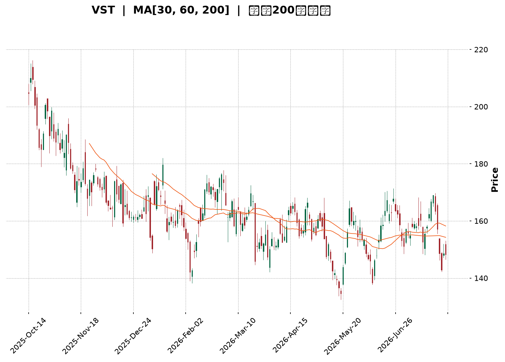
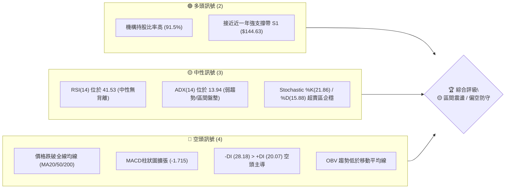
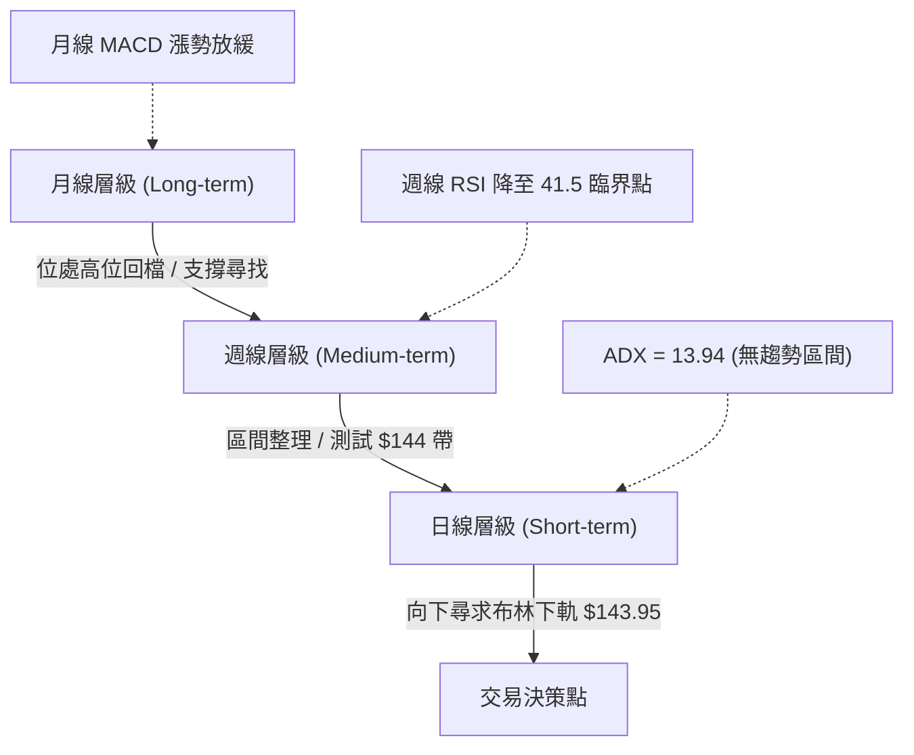
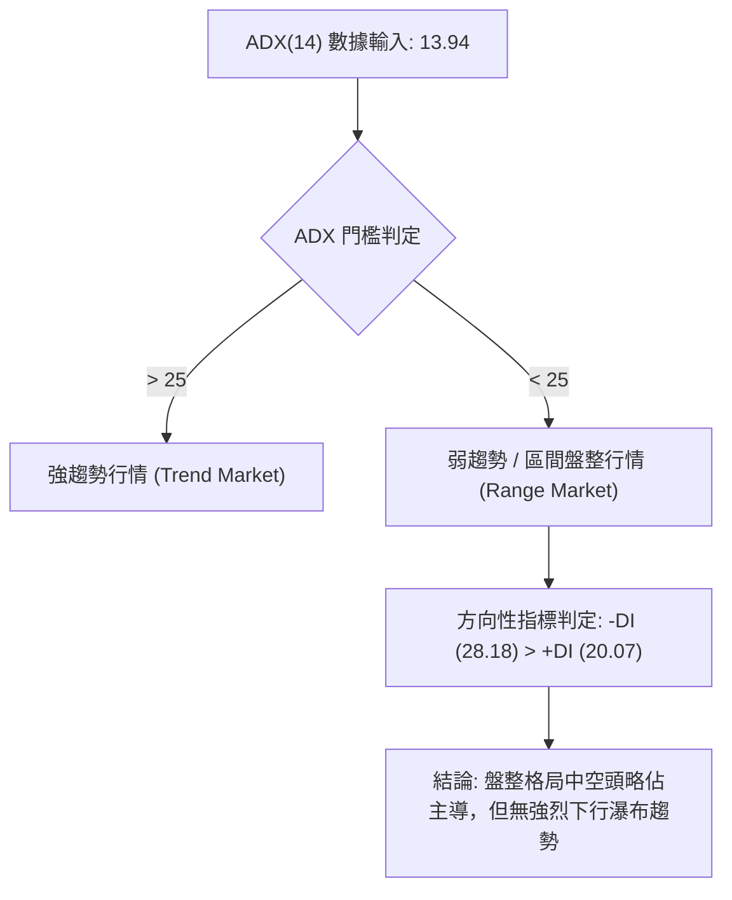
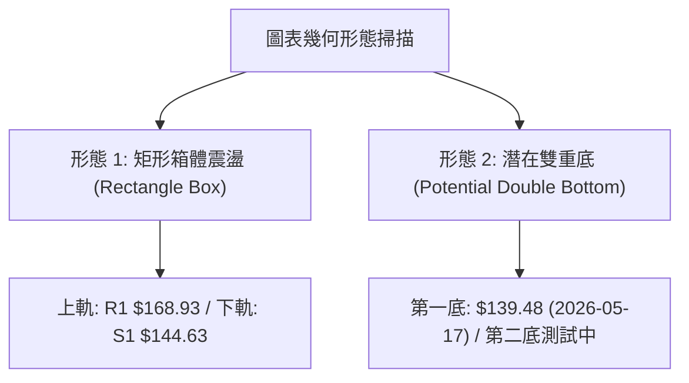
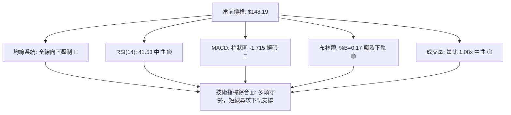
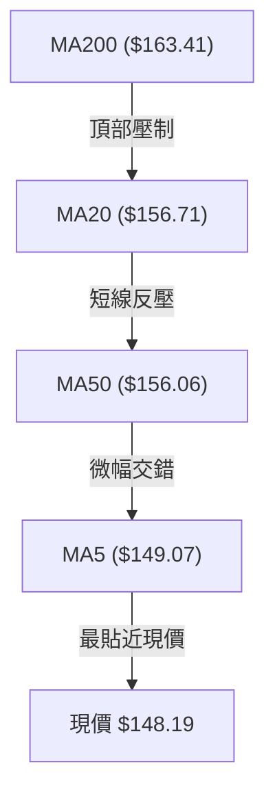
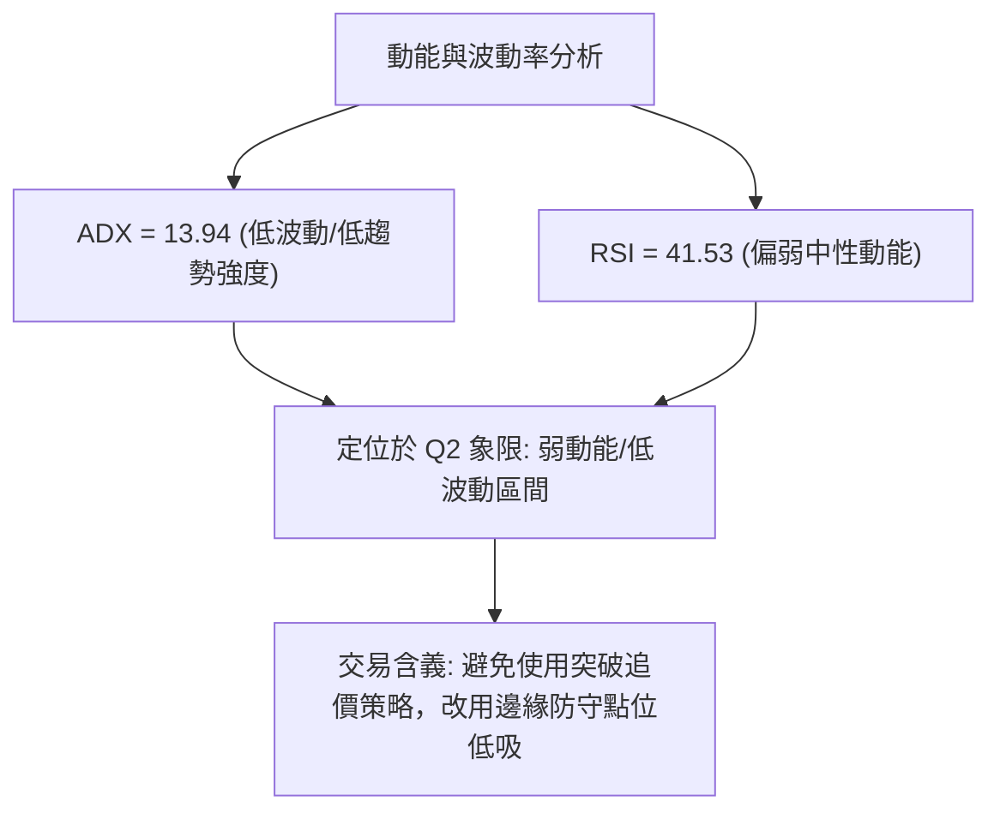
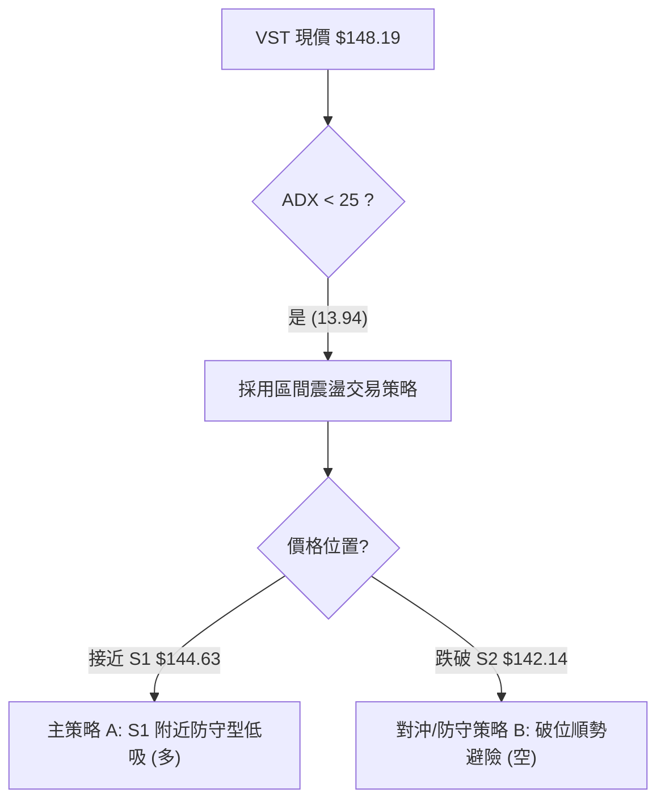
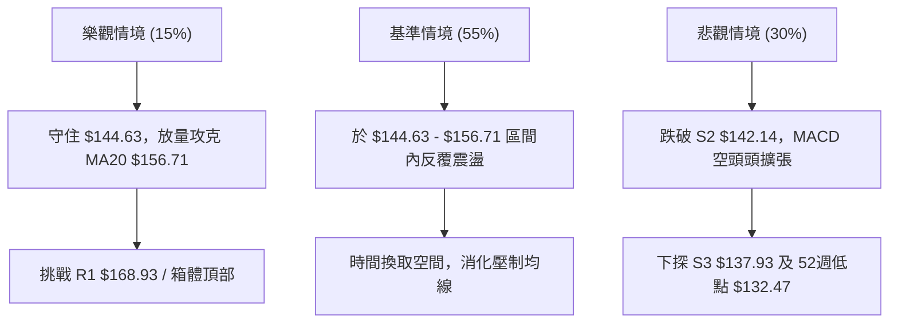

<details markdown="1">
<summary>📊 靜態圖表 (點擊展開)</summary>



</details>

<html>
<head><meta charset="utf-8" /></head>
<body>
    <div style="height:500px; width:100%;">                        <script>window.PlotlyConfig = {MathJaxConfig: 'local'};</script>
        <script charset="utf-8" src="https://cdn.plot.ly/plotly-3.7.0.min.js" integrity="sha256-jvTGqxNp8AGWEcvNLVuKr+8j5dGe9Yw51LQkmDH+IYA=" crossorigin="anonymous"></script>                <div id="candlestick-chart" class="plotly-graph-div" style="height:100%; width:100%;"></div>            <script>                window.PLOTLYENV=window.PLOTLYENV || {};                                if (document.getElementById("candlestick-chart")) {                    Plotly.newPlot(                        "candlestick-chart",                        [{"close":{"dtype":"f8","bdata":"AAAAoAuVaUAAAACgNz9qQAAAAGDgMGpAAAAAgHoQaUAAAADA5i1oQAAAAODiN2dAAAAA4OUhZ0AAAABAcdJnQAAAAGBNFGlAAAAAYCbPaEAAAAAAlrlnQAAAAGBh0WhAAAAA4IqdZ0AAAABAnHBnQAAAACCpB2hAAAAAoAcfZ0AAAABgWJNnQAAAAKBW+2ZAAAAA4KbGZ0AAAADg+G9nQAAAAOBXTWZAAAAAQPswZkAAAADAJltlQAAAAIDlvmVAAAAAgMbIZUAAAADASrZlQAAAAIC0TGZAAAAAIDeiZUAAAACAgfxkQAAAAKA8zWVAAAAAADVEZUAAAAAAIwJmQAAAAGDIQ2ZAAAAAgG+dZUAAAABAs3plQAAAAAAFXmVAAAAAgN\u002fqZUAAAAAAQc9kQAAAACDLrWRAAAAAAAyEZEAAAADghI9kQAAAAEAHvGVAAAAAIKAsZUAAAADAq\u002fFkQAAAAIBhl2VAAAAAQM\u002fpY0AAAAAAY69kQAAAAOBSS2RAAAAAAPojZEAAAADgKidkQAAAACBsMGRAAAAA4ConZEAAAADAlyxkQAAAAMB7RWRAAAAAQFEcZEAAAADgxZhkQAAAAEBgT2RAAAAAYP4hZUAAAABAjUVjQAAAAMDnxWJAAAAAACe9ZEAAAAAAU4NlQAAAAIBOXmVAAAAAgB8QZUAAAACA2nVmQAAAAAB+xGRAAAAAoBOMY0AAAABgg\u002fJjQAAAAABd\u002fWNAAAAAQLT1Y0AAAABg5stjQAAAAKDReWRAAAAAYNulZEAAAAAgNURkQAAAAIA4vWNAAAAAgLM6Y0AAAABAfhJjQAAAAOAOxGFAAAAAIJzVYUAAAACglqdiQAAAACCJEWNAAAAAQBzlY0AAAABgqfZjQAAAACDNVGRAAAAAYIpgZUAAAABgbaZlQAAAAKAuQ2VAAAAAgMWAZUAAAAAAq11lQAAAAEDJ6mRAAAAAYLBkZUAAAAAACtxlQAAAAGChCmZAAAAA4CCtZUAAAADABrFkQAAAAOAfKGRAAAAAIBldZEAAAACABd5kQAAAAEDLxmNAAAAAIGVlZEAAAABASX5kQAAAAKAR12NAAAAA4HjkY0AAAAAAXtBjQAAAACBhMWRAAAAAgA18ZEAAAABA0jRlQAAAAIAQ3WRAAAAAABs6YkAAAACAguJiQAAAAKA0EGNAAAAAIIrpYkAAAADgyAJjQAAAAABnaGNAAAAAYK1qYkAAAAAg1cNiQAAAAKDUN2NAAAAAoP7eYkAAAACgGOxiQAAAAODhLmNAAAAAAIF1Y0AAAAAgKhFjQAAAAIBvUGNAAAAAAFK\u002fY0AAAADAs3dkQAAAAODJVmRAAAAAYI2pZEAAAADAZ2dkQAAAAOAO7GNAAAAAIDBWY0AAAADgTnJjQAAAAGAulGNAAAAAgNiDZEAAAAAAG8tkQAAAAEChHGRAAAAAwGUyY0AAAAAA0bNjQAAAAOACYmNAAAAAgAAUZEAAAACg+wRkQAAAAEAywmNAAAAAwII3Y0AAAAAAbnBiQAAAAMDL+mJAAAAAgERVYkAAAABgI81hQAAAACBztmFAAAAAYIJvYUAAAABg4RFhQAAAACCx0GBAAAAAYI75YUAAAACA45tiQAAAAKClgWNAAAAAQI6KZEAAAAAgov1jQAAAAKDJAWRAAAAAgDAAZEAAAADgZFFjQAAAAID4t2NAAAAAoLcyY0AAAACghS9jQAAAAKCpkWJAAAAA4DlWYkAAAAAgf0BiQAAAAIAUS2FAAAAAIJxFYkAAAAAgBHpiQAAAACDFKWNAAAAAIGzMY0AAAADAc9NjQAAAACCscGRAAAAA4FHoZEAAAADgekxkQAAAAADXW2RAAAAA4KP4ZEAAAAAgrm9kQAAAAAApTGRAAAAAACnUY0AAAADAHiVjQAAAAKCZ4WJAAAAAQAqnY0AAAAAgXHdjQAAAAIA9WmNAAAAAIFy\u002fY0AAAAAghdtjQAAAAADXw2NAAAAAgMLNY0AAAAAgXAdkQAAAAIDrEWNAAAAAgBRuY0AAAAAgrr9jQAAAAGCPSmRAAAAAIK7XZEAAAAAgXB9lQAAAAAApbGRAAAAAYI+iY0AAAADgepRiQAAAAIDr2WFAAAAAANeTYkAAAACAFIZiQA=="},"high":{"dtype":"f8","bdata":"lze3hXv\u002faUBIev32cuRqQAnTrz1jBmtA8dgxTLklakBGWQUQupRpQEGExjLFE2hALxsz0NmWZ0Dy1AZt5OxnQKcfVB4xJWlAcvpGXhdaaUDGmf7E5I9oQBUTNUu4\u002fGhAHy6Ze9q\u002faEBSH8iO4QJoQMQ5LfQsTGhAcafuRETWZ0BuaPPvp\u002fVnQJiAW729imdAxHK3swrJZ0D8LrFHe39oQDjBKVQjZWdAq\u002fO1DoqRZkBbBEovGidmQJbUfJgcaGZAsSmjz9BYZkBtSmXT5BVmQKzhV3Hpl2ZA4wCLgyiQZ0A0q\u002fvRtZ5lQHVALRYmz2VACWORtivAZUACGIUZaSBmQMZPmjumgGZA0DAIQ\u002fD3ZUAoNkV8DOdlQHysXcEgpGVA0S26WvgpZkAwHEv4t\u002fxlQE0QHN7342RAZO+M+ZEmZUDPJ9s+m6pkQBD1xAVFxWVACMMmhhxoZkCiWLdeCollQICAQFGtpmVA3iX1eDzNZUAXXM6kn2ZlQJLw+ipfVmVA\u002fWBvE2p7ZEAvlTa\u002f8mdkQP+rCwBeRGRAU90fMZxRZEBmMkuK53dkQGikS06GU2RAJmBSO3qBZECntvn3AxplQE3qKVDOZWVAafBaJEiEZUAMlnY36QVlQETibZvYa2NAjiX69UDIZUAwOXi7EwhmQLAX1yvp3mVAjJ\u002fHzaVWZUBDH3m2zcFmQHkFh5i7VGVAv0DJblixZEAdjB9UDzFkQGJVRumQYWRAZbRuGXZNZEDDfGZ5U5tkQKbqMZ1OhWRAShc1NTfDZEDEZsn4Vu1kQI7wMkJ6gWRA6oRreTzxY0AHXLEmL4JjQK8CdvuNJ2NA08EgZGrwYUAEcGzD4PpiQFTSdh41a2NAqDUjfjAfZEA4yGeCU5tkQNm+dvYLuGRAfXhwKPdlZUDnzfKANAVmQHRfFrWB4GVAMzP3agGDZUDq9tvJrqBlQEs2oZG1a2VA53\u002fghJpmZUCPyVlEjO5lQFmw+bu2F2ZAFFEZmy06ZkBt9Z+FDgFmQIcDHOSFYmRAo5QeKjl4ZEA\u002fIygeNvBkQP+m45lL\u002fWRA1kRjTKCFZEAf9c7oYAplQPz7sdYzcWRAavQzEP5XZEA8UHaXF5lkQOXKtt+QYWRA7cE29hygZEBHUUcpupBlQAZxQlo6JGVAEtsNF5fHZEAo\u002fX\u002fQ0nVjQKwQqdBNPGNAydGc2FS3Y0D9ueaimw5jQCae5i07\u002f2NAPHKCw6XWY0CQPozwQuhiQLZxLjzig2NA2YaV5wBLY0C3k+EkghxjQLpvM6A4PmNABmuViLMiZEDwIVLWr0lkQF50DrIPzWNACrxYAdkPZEBzPwA+kKFkQOVL4zwwyWRAatNcU\u002fjVZEAUpSDgIwhlQJdRWkVCemRAKT+atv0bZEDHjyrvcNtjQHev5vu61GNA7ZgdbvSnZEB3z60r5wVlQHtHdF0XY2RA5gCWrjwdZEA1oEY+BO1jQDmzAFNQ\u002fWNAOkLKuOREZED8LLYRRXJkQL53EehiWGRAUMzp0\u002fEEZUC6dRFaEFljQKH3GhsqEWNAq8KC8ZvDYkAOqsz0aUJiQFkVxgQH42FAEkf1+JCcYUAh85gJCWthQFSH1lNIEGFAqi6e0FAWYkDq7nSVR6JiQKTPY1swq2NApA\u002fR9k7lZEApLBnQUZlkQIVY1GSkaWRAusF4ZgRCZEBhQng0gcpjQM2gz87DEWRAj2f+qQ22Y0C9y+b6YjpjQHj\u002fcQVgQmNAW0J0QeuiYkCIGzrC38JiQODlIVOO+WFA6RQP6zlWYkASuq\u002fWQ8liQH\u002fWwoNxZ2NAvcI6PyIoZEAXNWyEz0ZkQD5+vuFBQ2VAAAAAAABQZUAAAABgZrpkQAAAAOB6tGRAAAAAQDNrZUAAAACAwv1kQAAAAEAzs2RAAAAAYGauZEAAAACAPapjQAAAACCuh2NAAAAAIK6nY0AAAADAHu1jQAAAAOClj2NAAAAAgMIlZEAAAADgowBkQAAAAIDC7WNAAAAAYLgGZUAAAACAFN5kQAAAAEAzw2NAAAAAAACoY0AAAACAPdJjQAAAAGC4jmRAAAAAgOv5ZEAAAACA6yFlQAAAAOBROGVAAAAA4KPEZEAAAAAgrj9jQAAAAMD1qGJAAAAAQAr\u002fYkAAAAAAKSRjQA=="},"hovertemplate":"\u003cb\u003e%{x|%Y-%m-%d}\u003c\u002fb\u003e\u003cbr\u003e\u958b: $%{open:.2f}\u003cbr\u003e\u9ad8: $%{high:.2f}\u003cbr\u003e\u4f4e: $%{low:.2f}\u003cbr\u003e\u6536: $%{close:.2f}\u003cextra\u003e\u003c\u002fextra\u003e","low":{"dtype":"f8","bdata":"4gBjIxISaUBboGdQaLFpQOdXDU0x+mlAbMy2Cg3naECbachPPABoQFXNq8acGWdAg7aaNvVcZkC3UfjrEh5nQDCW38dfOWhAnU1s4et1aECDCebsjvZmQN2Tj\u002frklWdA43x44EF4Z0D6zMDlSNhmQE+ZGlckYmdAAxMLoYP3ZkC3yTOHNwVnQFAjH04iWWZA8vR0W8P7ZUCyxWrarexmQP+FK4QwQmZAm+aaS8ARZkDvtXF1AjplQArn5uGVnGRAVssvX92MZUA\u002f2K6eeD5lQI1n1Qjrr2VAtO9M7C6NZUA5b0yxhThkQKOUGGzIpmRAbOdYKvGmZEDowrf2v4tlQOuU\u002fQCyKGZAksGhZil\u002fZUDYY50C8FRlQM35QVv6B2VAYWIpmnI4ZUD6y1Fo8rhkQGTG3pwlbGRACHvVV3+BZEC7i2SFvr9jQDuIyJfzCmRARGe5NcXZZEAdlecFM8lkQCXxeyx\u002fu2RAEjgHhlbBY0CNppjp2T9kQN8kMLbOQGRA+s6oBQANZEAcBc4NBvZjQHKAUR6J6mNAuID2VAv9Y0BOF\u002fUsc+9jQCmPnYGzE2RAXWRunM4YZEAgfcroAm5kQAxAoCzw92NAyZcsU4BqZEDYT+GUuSNjQEKzkt3omGJAT47qEoStZEDbunEaE3RkQN4tVu8oS2VACa4Q3vCyZEDs4MeYmmZlQJDn3cLtUWRA9MHkxzR6Y0ATnnqgECtjQCD0l\u002fi\u002f1mNAF6uSKQ2yY0Cw9PEw3K5jQM7rxZXWtmNAcm+2f+QWZEAvgo0xJcpjQEf7qwysjWNAT3yzklwzY0DH8aJwRL9iQFHKelNYXGFAkH+d+rpEYUChUP\u002flbGBiQCnPTevpa2JAcjRhwUBMY0AceN5omsNjQE8rd6Wj\u002fmNAtKxOB74hZECiHAeMZS9lQGNbNPKLJGVAzczMjCX5ZEApq8x9FBFlQNLTDokimGRA7idC5sdNZEBYROCTizNlQG8L4j4IdWRAFw0urWRNZUDEp7ed66tkQHBgi7PaEWNAtS62paP+Y0BlTbqFfCdkQGyq6Qigu2NAn+Wx8FBSY0Cj4KUlQXtkQDnXA0EaV2NAl+OE9pCIY0BJQKVSb6ljQB57CJ1i9WNAX\u002fJFEoc1ZECRbbWpY6FkQMK0e5bceGRA\u002fNIbIhQUYkAwnEilCaRiQMiCHFHoqmJA60APMm7FYkD1SzPvH0liQBIcw5o18WJA0ULJxKNMYkCIuoWJgsRhQPA6xlMG5mJArKadRB+9YkB6ffv2c7ViQEj7qRM8wmJAM5+on1RiY0DIQU9t7Q5jQDHMHg+rHGNAZv0D9fcNY0CDdIFH3QNkQCz33SyLPWRAp6jeMz5MZECUu17\u002fDkFkQNmc5Mknw2NAQeN\u002fT0M9Y0BQjn7XgVZjQLLd8wsWSWNAAcmUZNtdY0DcwbufatBjQDa4ZP7vz2NAV+BIorUbY0D2zDEMZHBjQGLbd6LTVmNAUqzs0AinY0B4oQzlcvJjQBWqTDwxjGNAn\u002fjcT8IxY0BarDNayFhiQPB5qp9ZQmJAU9p+HJouYkBN4Y2jE2phQOZVAgk+d2FAVbkIzMAzYUAxfbKbh7VgQEVGKvwuj2BAVb02ycAzYUDbOZY9rRViQLxT5\u002fxA0WJACwUJovW\u002fY0DHT6W098VjQCRDh9MlrGNAatvMwCOVY0DVR6iryeNiQLP\u002f\u002fY9RFWNAVUPwHI4XY0CRg6v1W79iQFECWi9maWJAjPD6FJxFYkD1bnYd8qphQAAam9fyNmFAaSJHo\u002f5rYUALD3bva1liQOPvJXk+wWJAQYPflrgTY0A1ZTJPr59jQDIRhX3M+WNAAAAAwMxcZEAAAADgo+RjQAAAAAAp\u002fGNAAAAA4FHAZEAAAACAFGZkQAAAAOCjIGRAAAAA4FGQY0AAAACgmeFiQAAAAAAAkGJAAAAA4FEAY0AAAADgUUBjQAAAAIA96mJAAAAAgD2uY0AAAACgmaFjQAAAAGBmhmNAAAAAIAahY0AAAACAFL5jQAAAAICTkGJAAAAA4HqEYkAAAABAM3NjQAAAAOBRAGRAAAAAACn0Y0AAAADgUaBkQAAAAIDrSWRAAAAAoEdxY0AAAABguEZiQAAAAMD1xGFAAAAAYLhiYkAAAADgo1BiQA=="},"name":"\u50f9\u683c","open":{"dtype":"f8","bdata":"QHiq3PedaUA6Xk\u002fbdQ5qQJ5uWhnGvGpAzjssKOHZaUAge9GbEWlpQOOJaOuPAmhAdiBLsLVYZ0C3UfjrEh5nQMzQ2NQbeWhAcvpGXhdaaUDGmf7E5I9oQFTjOjQU8GdAIs5cJOw7aEDZhH\u002frhOZnQKrOgsOYwGdAGIW2kTxqZ0BneWy3mS9nQMq2mEY1xGZAeBlTjk84ZkDykg87vz9oQKeKGhXEJGdAXp1Bw6ByZkD+Uss7pAVmQNUMCqaSz2RA6qAsZHrWZUDdCZ2rNH5lQAlY8ZjfzWVAog6YQbYBZ0CzC6VlLGllQPoWfny8G2VAUr7qC3WrZUAefq2A6KhlQDdTWH4+SGZA1lbi+vXoZUD+tveLhdVlQBVgba80fmVAEDk9bfxlZUD87gmVNvllQE0QHN7342RAhZxLeeSVZECD02W575RkQNY5QgIYLGRAdHF++iXPZUDCI48axIdlQLYd0eauvmRA56NS3TmpZUBiSbpzIp9kQCEHOdBGwGRArTj3lIVxZEA+IIIC+iNkQJ\u002fi98t3EWRAAAAA4ConZECbdMV7yRFkQOK4FMOyMWRAxPdPfhlOZEAgfcroAm5kQJF6ZTTjHGVAf8pbmhQRZUAMlnY36QVlQIN9eGlLWmNAQ00eeiu7ZUDHIOcE54ZkQO2bA5GjsGVAfnEKooYdZUC0pd9DupBlQKsEkefO4mRAoRRpNGcaZEDiA5czSNJjQHt3ruR2L2RAkEVA9t\u002fxY0BfmpXlswRkQMSPaPk84mNAAxIpXVixZEBW4fO8EbBkQIk7MQ++IWRAUApDwuGmY0D0nje9DnZjQEeQvVqOGGNAojQ1aI2TYUBr0Pv2wbJiQG77QP\u002fBsmJA\u002fxqKq6P+Y0Arf+sDb5FkQFVeLJArCWRAxWAzcHY+ZEBevm4nE01lQLOrpUH1sGVAzcyuyB4uZUB+TMKIY3plQOWAgVBqRWVA6lORNTHaZEAc7wM58XxlQAOzW2VkXGVAXgTX6YzQZUC18araXzdlQAdT0znOJ2RA4dW2QJ0kZEBftYiA3i1kQIBPaMvhf2RAZPKZWQlvY0BM\u002fLHt65xkQP\u002ffJMfBZGRAdL73X7GUY0BdqwD+CSpkQMT20F\u002fJEWRAtkct+otLZECPW0sDXqlkQHRaFaWu1mRAEtsNF5fHZECbEcRqn+diQFVYRNzcymJAg3luRBBZY0AW3KxTT6liQBIcw5o18WJAw2d6eiucY0AS2UYqXPZhQP2SdgZD6GJAgJv6J\u002fTfYkD05QVNhdpiQNx2sMZ622JABWzocs4QZEA9BV0HgXVjQLWWVHchKWNAZv0D9fcNY0Bq0TQf2kVkQMEZRAyYqGRAEtt+H+CKZEC7gUEs4cBkQG2jFbpNWmRAmNfAOyARZEBJQhvZibJjQEubIrK9d2NATXwCgJCDY0B04M+5nZhkQIMv5nC6SGRAoLjdQFIUZEBSdtYhSYJjQBZ04OnVwmNAJT248wWvY0BA9fybtFhkQEL5jOicKGRACATW3ftZZEC6dRFaEFljQNTOhYVgeWJA+mVlnP2oYkAOqsz0aUJiQDsNAlXVpWFAvyBliYtyYUCsu0WZx1lhQGulTeOF82BAAAAAHNM5YUD8xES7hyhiQPBHu4cz2mJAx8ZiOgLWY0AqjOmlVpdkQK+CDJ\u002fF02NAQyCHAtf4Y0DC0GVW+ZhjQGPJmQEad2NAte0B1FCJY0AMOJaef+piQK8anKEy+WJAt\u002f3beEiDYkAxHOFLzIZiQAbrZwXJ5GFAytzu\u002fl6ZYUBWG6t6YHliQIKpSuIUE2NAm2MnZyQhY0CH1zPp+8pjQPBXPGSgO2RAAAAAAClwZEAAAABgjwJkQAAAAMD1YGRAAAAAwB7dZEAAAAAghbtkQAAAAGBmdmRAAAAAYI9SZEAAAAAAAIBjQAAAAGBmPmNAAAAAQAoPY0AAAAAAKYRjQAAAACCuP2NAAAAA4FHgY0AAAACgmbFjQAAAAMDMtGNAAAAAAAAgZEAAAAAAAFBkQAAAAADXu2NAAAAAIIXLYkAAAADgo7BjQAAAACCuH2RAAAAAIIUDZEAAAADgUchkQAAAAIA9FmVAAAAAAACwZEAAAACgcD1jQAAAAEAzl2JAAAAAAACAYkAAAABAM\u002ftiQA=="},"x":["2025-10-14T00:00:00-04:00","2025-10-15T00:00:00-04:00","2025-10-16T00:00:00-04:00","2025-10-17T00:00:00-04:00","2025-10-20T00:00:00-04:00","2025-10-21T00:00:00-04:00","2025-10-22T00:00:00-04:00","2025-10-23T00:00:00-04:00","2025-10-24T00:00:00-04:00","2025-10-27T00:00:00-04:00","2025-10-28T00:00:00-04:00","2025-10-29T00:00:00-04:00","2025-10-30T00:00:00-04:00","2025-10-31T00:00:00-04:00","2025-11-03T00:00:00-05:00","2025-11-04T00:00:00-05:00","2025-11-05T00:00:00-05:00","2025-11-06T00:00:00-05:00","2025-11-07T00:00:00-05:00","2025-11-10T00:00:00-05:00","2025-11-11T00:00:00-05:00","2025-11-12T00:00:00-05:00","2025-11-13T00:00:00-05:00","2025-11-14T00:00:00-05:00","2025-11-17T00:00:00-05:00","2025-11-18T00:00:00-05:00","2025-11-19T00:00:00-05:00","2025-11-20T00:00:00-05:00","2025-11-21T00:00:00-05:00","2025-11-24T00:00:00-05:00","2025-11-25T00:00:00-05:00","2025-11-26T00:00:00-05:00","2025-11-28T00:00:00-05:00","2025-12-01T00:00:00-05:00","2025-12-02T00:00:00-05:00","2025-12-03T00:00:00-05:00","2025-12-04T00:00:00-05:00","2025-12-05T00:00:00-05:00","2025-12-08T00:00:00-05:00","2025-12-09T00:00:00-05:00","2025-12-10T00:00:00-05:00","2025-12-11T00:00:00-05:00","2025-12-12T00:00:00-05:00","2025-12-15T00:00:00-05:00","2025-12-16T00:00:00-05:00","2025-12-17T00:00:00-05:00","2025-12-18T00:00:00-05:00","2025-12-19T00:00:00-05:00","2025-12-22T00:00:00-05:00","2025-12-23T00:00:00-05:00","2025-12-24T00:00:00-05:00","2025-12-26T00:00:00-05:00","2025-12-29T00:00:00-05:00","2025-12-30T00:00:00-05:00","2025-12-31T00:00:00-05:00","2026-01-02T00:00:00-05:00","2026-01-05T00:00:00-05:00","2026-01-06T00:00:00-05:00","2026-01-07T00:00:00-05:00","2026-01-08T00:00:00-05:00","2026-01-09T00:00:00-05:00","2026-01-12T00:00:00-05:00","2026-01-13T00:00:00-05:00","2026-01-14T00:00:00-05:00","2026-01-15T00:00:00-05:00","2026-01-16T00:00:00-05:00","2026-01-20T00:00:00-05:00","2026-01-21T00:00:00-05:00","2026-01-22T00:00:00-05:00","2026-01-23T00:00:00-05:00","2026-01-26T00:00:00-05:00","2026-01-27T00:00:00-05:00","2026-01-28T00:00:00-05:00","2026-01-29T00:00:00-05:00","2026-01-30T00:00:00-05:00","2026-02-02T00:00:00-05:00","2026-02-03T00:00:00-05:00","2026-02-04T00:00:00-05:00","2026-02-05T00:00:00-05:00","2026-02-06T00:00:00-05:00","2026-02-09T00:00:00-05:00","2026-02-10T00:00:00-05:00","2026-02-11T00:00:00-05:00","2026-02-12T00:00:00-05:00","2026-02-13T00:00:00-05:00","2026-02-17T00:00:00-05:00","2026-02-18T00:00:00-05:00","2026-02-19T00:00:00-05:00","2026-02-20T00:00:00-05:00","2026-02-23T00:00:00-05:00","2026-02-24T00:00:00-05:00","2026-02-25T00:00:00-05:00","2026-02-26T00:00:00-05:00","2026-02-27T00:00:00-05:00","2026-03-02T00:00:00-05:00","2026-03-03T00:00:00-05:00","2026-03-04T00:00:00-05:00","2026-03-05T00:00:00-05:00","2026-03-06T00:00:00-05:00","2026-03-09T00:00:00-04:00","2026-03-10T00:00:00-04:00","2026-03-11T00:00:00-04:00","2026-03-12T00:00:00-04:00","2026-03-13T00:00:00-04:00","2026-03-16T00:00:00-04:00","2026-03-17T00:00:00-04:00","2026-03-18T00:00:00-04:00","2026-03-19T00:00:00-04:00","2026-03-20T00:00:00-04:00","2026-03-23T00:00:00-04:00","2026-03-24T00:00:00-04:00","2026-03-25T00:00:00-04:00","2026-03-26T00:00:00-04:00","2026-03-27T00:00:00-04:00","2026-03-30T00:00:00-04:00","2026-03-31T00:00:00-04:00","2026-04-01T00:00:00-04:00","2026-04-02T00:00:00-04:00","2026-04-06T00:00:00-04:00","2026-04-07T00:00:00-04:00","2026-04-08T00:00:00-04:00","2026-04-09T00:00:00-04:00","2026-04-10T00:00:00-04:00","2026-04-13T00:00:00-04:00","2026-04-14T00:00:00-04:00","2026-04-15T00:00:00-04:00","2026-04-16T00:00:00-04:00","2026-04-17T00:00:00-04:00","2026-04-20T00:00:00-04:00","2026-04-21T00:00:00-04:00","2026-04-22T00:00:00-04:00","2026-04-23T00:00:00-04:00","2026-04-24T00:00:00-04:00","2026-04-27T00:00:00-04:00","2026-04-28T00:00:00-04:00","2026-04-29T00:00:00-04:00","2026-04-30T00:00:00-04:00","2026-05-01T00:00:00-04:00","2026-05-04T00:00:00-04:00","2026-05-05T00:00:00-04:00","2026-05-06T00:00:00-04:00","2026-05-07T00:00:00-04:00","2026-05-08T00:00:00-04:00","2026-05-11T00:00:00-04:00","2026-05-12T00:00:00-04:00","2026-05-13T00:00:00-04:00","2026-05-14T00:00:00-04:00","2026-05-15T00:00:00-04:00","2026-05-18T00:00:00-04:00","2026-05-19T00:00:00-04:00","2026-05-20T00:00:00-04:00","2026-05-21T00:00:00-04:00","2026-05-22T00:00:00-04:00","2026-05-26T00:00:00-04:00","2026-05-27T00:00:00-04:00","2026-05-28T00:00:00-04:00","2026-05-29T00:00:00-04:00","2026-06-01T00:00:00-04:00","2026-06-02T00:00:00-04:00","2026-06-03T00:00:00-04:00","2026-06-04T00:00:00-04:00","2026-06-05T00:00:00-04:00","2026-06-08T00:00:00-04:00","2026-06-09T00:00:00-04:00","2026-06-10T00:00:00-04:00","2026-06-11T00:00:00-04:00","2026-06-12T00:00:00-04:00","2026-06-15T00:00:00-04:00","2026-06-16T00:00:00-04:00","2026-06-17T00:00:00-04:00","2026-06-18T00:00:00-04:00","2026-06-22T00:00:00-04:00","2026-06-23T00:00:00-04:00","2026-06-24T00:00:00-04:00","2026-06-25T00:00:00-04:00","2026-06-26T00:00:00-04:00","2026-06-29T00:00:00-04:00","2026-06-30T00:00:00-04:00","2026-07-01T00:00:00-04:00","2026-07-02T00:00:00-04:00","2026-07-06T00:00:00-04:00","2026-07-07T00:00:00-04:00","2026-07-08T00:00:00-04:00","2026-07-09T00:00:00-04:00","2026-07-10T00:00:00-04:00","2026-07-13T00:00:00-04:00","2026-07-14T00:00:00-04:00","2026-07-15T00:00:00-04:00","2026-07-16T00:00:00-04:00","2026-07-17T00:00:00-04:00","2026-07-20T00:00:00-04:00","2026-07-21T00:00:00-04:00","2026-07-22T00:00:00-04:00","2026-07-23T00:00:00-04:00","2026-07-24T00:00:00-04:00","2026-07-27T00:00:00-04:00","2026-07-28T00:00:00-04:00","2026-07-29T00:00:00-04:00","2026-07-30T00:00:00-04:00","2026-07-31T00:00:00-04:00"],"type":"candlestick"},{"hovertemplate":"MA30: $%{y:.2f}\u003cextra\u003e\u003c\u002fextra\u003e","line":{"color":"#2196F3","dash":"dash","width":2},"mode":"lines","name":"MA30","x":["2025-10-14T00:00:00-04:00","2025-10-15T00:00:00-04:00","2025-10-16T00:00:00-04:00","2025-10-17T00:00:00-04:00","2025-10-20T00:00:00-04:00","2025-10-21T00:00:00-04:00","2025-10-22T00:00:00-04:00","2025-10-23T00:00:00-04:00","2025-10-24T00:00:00-04:00","2025-10-27T00:00:00-04:00","2025-10-28T00:00:00-04:00","2025-10-29T00:00:00-04:00","2025-10-30T00:00:00-04:00","2025-10-31T00:00:00-04:00","2025-11-03T00:00:00-05:00","2025-11-04T00:00:00-05:00","2025-11-05T00:00:00-05:00","2025-11-06T00:00:00-05:00","2025-11-07T00:00:00-05:00","2025-11-10T00:00:00-05:00","2025-11-11T00:00:00-05:00","2025-11-12T00:00:00-05:00","2025-11-13T00:00:00-05:00","2025-11-14T00:00:00-05:00","2025-11-17T00:00:00-05:00","2025-11-18T00:00:00-05:00","2025-11-19T00:00:00-05:00","2025-11-20T00:00:00-05:00","2025-11-21T00:00:00-05:00","2025-11-24T00:00:00-05:00","2025-11-25T00:00:00-05:00","2025-11-26T00:00:00-05:00","2025-11-28T00:00:00-05:00","2025-12-01T00:00:00-05:00","2025-12-02T00:00:00-05:00","2025-12-03T00:00:00-05:00","2025-12-04T00:00:00-05:00","2025-12-05T00:00:00-05:00","2025-12-08T00:00:00-05:00","2025-12-09T00:00:00-05:00","2025-12-10T00:00:00-05:00","2025-12-11T00:00:00-05:00","2025-12-12T00:00:00-05:00","2025-12-15T00:00:00-05:00","2025-12-16T00:00:00-05:00","2025-12-17T00:00:00-05:00","2025-12-18T00:00:00-05:00","2025-12-19T00:00:00-05:00","2025-12-22T00:00:00-05:00","2025-12-23T00:00:00-05:00","2025-12-24T00:00:00-05:00","2025-12-26T00:00:00-05:00","2025-12-29T00:00:00-05:00","2025-12-30T00:00:00-05:00","2025-12-31T00:00:00-05:00","2026-01-02T00:00:00-05:00","2026-01-05T00:00:00-05:00","2026-01-06T00:00:00-05:00","2026-01-07T00:00:00-05:00","2026-01-08T00:00:00-05:00","2026-01-09T00:00:00-05:00","2026-01-12T00:00:00-05:00","2026-01-13T00:00:00-05:00","2026-01-14T00:00:00-05:00","2026-01-15T00:00:00-05:00","2026-01-16T00:00:00-05:00","2026-01-20T00:00:00-05:00","2026-01-21T00:00:00-05:00","2026-01-22T00:00:00-05:00","2026-01-23T00:00:00-05:00","2026-01-26T00:00:00-05:00","2026-01-27T00:00:00-05:00","2026-01-28T00:00:00-05:00","2026-01-29T00:00:00-05:00","2026-01-30T00:00:00-05:00","2026-02-02T00:00:00-05:00","2026-02-03T00:00:00-05:00","2026-02-04T00:00:00-05:00","2026-02-05T00:00:00-05:00","2026-02-06T00:00:00-05:00","2026-02-09T00:00:00-05:00","2026-02-10T00:00:00-05:00","2026-02-11T00:00:00-05:00","2026-02-12T00:00:00-05:00","2026-02-13T00:00:00-05:00","2026-02-17T00:00:00-05:00","2026-02-18T00:00:00-05:00","2026-02-19T00:00:00-05:00","2026-02-20T00:00:00-05:00","2026-02-23T00:00:00-05:00","2026-02-24T00:00:00-05:00","2026-02-25T00:00:00-05:00","2026-02-26T00:00:00-05:00","2026-02-27T00:00:00-05:00","2026-03-02T00:00:00-05:00","2026-03-03T00:00:00-05:00","2026-03-04T00:00:00-05:00","2026-03-05T00:00:00-05:00","2026-03-06T00:00:00-05:00","2026-03-09T00:00:00-04:00","2026-03-10T00:00:00-04:00","2026-03-11T00:00:00-04:00","2026-03-12T00:00:00-04:00","2026-03-13T00:00:00-04:00","2026-03-16T00:00:00-04:00","2026-03-17T00:00:00-04:00","2026-03-18T00:00:00-04:00","2026-03-19T00:00:00-04:00","2026-03-20T00:00:00-04:00","2026-03-23T00:00:00-04:00","2026-03-24T00:00:00-04:00","2026-03-25T00:00:00-04:00","2026-03-26T00:00:00-04:00","2026-03-27T00:00:00-04:00","2026-03-30T00:00:00-04:00","2026-03-31T00:00:00-04:00","2026-04-01T00:00:00-04:00","2026-04-02T00:00:00-04:00","2026-04-06T00:00:00-04:00","2026-04-07T00:00:00-04:00","2026-04-08T00:00:00-04:00","2026-04-09T00:00:00-04:00","2026-04-10T00:00:00-04:00","2026-04-13T00:00:00-04:00","2026-04-14T00:00:00-04:00","2026-04-15T00:00:00-04:00","2026-04-16T00:00:00-04:00","2026-04-17T00:00:00-04:00","2026-04-20T00:00:00-04:00","2026-04-21T00:00:00-04:00","2026-04-22T00:00:00-04:00","2026-04-23T00:00:00-04:00","2026-04-24T00:00:00-04:00","2026-04-27T00:00:00-04:00","2026-04-28T00:00:00-04:00","2026-04-29T00:00:00-04:00","2026-04-30T00:00:00-04:00","2026-05-01T00:00:00-04:00","2026-05-04T00:00:00-04:00","2026-05-05T00:00:00-04:00","2026-05-06T00:00:00-04:00","2026-05-07T00:00:00-04:00","2026-05-08T00:00:00-04:00","2026-05-11T00:00:00-04:00","2026-05-12T00:00:00-04:00","2026-05-13T00:00:00-04:00","2026-05-14T00:00:00-04:00","2026-05-15T00:00:00-04:00","2026-05-18T00:00:00-04:00","2026-05-19T00:00:00-04:00","2026-05-20T00:00:00-04:00","2026-05-21T00:00:00-04:00","2026-05-22T00:00:00-04:00","2026-05-26T00:00:00-04:00","2026-05-27T00:00:00-04:00","2026-05-28T00:00:00-04:00","2026-05-29T00:00:00-04:00","2026-06-01T00:00:00-04:00","2026-06-02T00:00:00-04:00","2026-06-03T00:00:00-04:00","2026-06-04T00:00:00-04:00","2026-06-05T00:00:00-04:00","2026-06-08T00:00:00-04:00","2026-06-09T00:00:00-04:00","2026-06-10T00:00:00-04:00","2026-06-11T00:00:00-04:00","2026-06-12T00:00:00-04:00","2026-06-15T00:00:00-04:00","2026-06-16T00:00:00-04:00","2026-06-17T00:00:00-04:00","2026-06-18T00:00:00-04:00","2026-06-22T00:00:00-04:00","2026-06-23T00:00:00-04:00","2026-06-24T00:00:00-04:00","2026-06-25T00:00:00-04:00","2026-06-26T00:00:00-04:00","2026-06-29T00:00:00-04:00","2026-06-30T00:00:00-04:00","2026-07-01T00:00:00-04:00","2026-07-02T00:00:00-04:00","2026-07-06T00:00:00-04:00","2026-07-07T00:00:00-04:00","2026-07-08T00:00:00-04:00","2026-07-09T00:00:00-04:00","2026-07-10T00:00:00-04:00","2026-07-13T00:00:00-04:00","2026-07-14T00:00:00-04:00","2026-07-15T00:00:00-04:00","2026-07-16T00:00:00-04:00","2026-07-17T00:00:00-04:00","2026-07-20T00:00:00-04:00","2026-07-21T00:00:00-04:00","2026-07-22T00:00:00-04:00","2026-07-23T00:00:00-04:00","2026-07-24T00:00:00-04:00","2026-07-27T00:00:00-04:00","2026-07-28T00:00:00-04:00","2026-07-29T00:00:00-04:00","2026-07-30T00:00:00-04:00","2026-07-31T00:00:00-04:00"],"y":{"dtype":"f8","bdata":"AAAAAAAA+H8AAAAAAAD4fwAAAAAAAPh\u002fAAAAAAAA+H8AAAAAAAD4fwAAAAAAAPh\u002fAAAAAAAA+H8AAAAAAAD4fwAAAAAAAPh\u002fAAAAAAAA+H8AAAAAAAD4fwAAAAAAAPh\u002fAAAAAAAA+H8AAAAAAAD4fwAAAAAAAPh\u002fAAAAAAAA+H8AAAAAAAD4fwAAAAAAAPh\u002fAAAAAAAA+H8AAAAAAAD4fwAAAAAAAPh\u002fAAAAAAAA+H8AAAAAAAD4fwAAAAAAAPh\u002fAAAAAAAA+H8AAAAAAAD4fwAAAAAAAPh\u002fAAAAAAAA+H8AAAAAAAD4f4mIiAh7Y2dAREREFKc+Z0CamZm5expnQM3MzOz6+GZAAAAAoIvbZkAAAABggcRmQGZmZra1tGZAIiIioleqZkAzMzPTopBmQDMzM\u002fMVa2ZAAAAA8HJGZkDe3d1dcitmQAAAAJAiEWZAAAAA8E38ZUB3d3enAedlQHd3d3cy0mVAiYiIuNK2ZUCJiIhoKJ5lQJqZmVk5h2VAZmZmljNoZUCJiIi4LExlQM3MzNwkOmVAzczMDMAoZUB3d3c3qh5lQAAAAKAVEmVAMzMzc80DZUBVVVUFSfpkQO\u002fu7r5O6WRAZmZmlgjlZECJiIjYZtZkQO\u002fu7q6OvGRAd3d3Nw64ZEBVVVUV1LNkQDMzM+MtrGRAVVVVBXinZEAiIiIy169kQImIiBi5qmRAmpmZGX+WZEAiIiJyI49kQImIiOhBiWRAAAAAQIOEZEB3d3f3\u002fX1kQCIiInJAc2RAvLu7a8JuZEAzMzMz+mhkQImIiAgsWWRAZmZmxlVTZECrqqpqkkVkQFVVVRX\u002fL2RAmpmZSVEcZEBEREQUiA9kQKuqqvr3BWRAq6qqSsQDZEBEREQU+AFkQKuqqsp6AmRA7+7ufkkNZEC8u7uLRhZkQGZmZgZnHmRAvLu7y48hZEB3d3enbjNkQAAAAHC6RWRAVVVVFVBLZEDe3d0dRU5kQM3MzJwDVGRAREREZD9ZZEBEREREJ0pkQN7d3e3wRGRARERElOhLZEAAAABAwlNkQHd3d5fwUWRAAAAAsKlVZECrqqrqm1tkQN7d3R0vVmRAZmZm5rxPZEBVVVVl4EtkQN7d3Z2\u002fT2RAERER0XVaZEARERHRq2xkQN7d3c0ah2RA3t3dXXSKZECamZkpa4xkQAAAANBfjGRAMzMzE\u002f2DZEDe3d3923tkQImIiLj6c2RA7+7unrdaZEAiIiLyGEJkQDMzMwOnMGRAMzMzczEaZEDNzMw8VwVkQCIiIkKL9mNA3t3drQnmY0CrqqpqNc5jQM3MzHzvtmNAiYiIqHmmY0De3d19kKRjQBEREbEepmNAmpmZGauoY0CJiIjotqRjQFVVVeX0pWNAiYiImOqcY0CamZnZ+5NjQDMzMxPBkWNAAAAAEBGXY0AiIiKybJ9jQCIiIqK7nmNAMzMzk76TY0AzMzMz6YZjQM3MzJxGemNAd3d3hxKKY0C8u7s7wZNjQGZmZhawmWNAERERcUmcY0C8u7uLaJdjQM3MzDzBk2NAq6qqigqTY0Crqqpq0YpjQFVVVdX4fWNAVVVV9bhxY0ARERFR6mFjQN7d3X21TWNAVVVVRQtBY0BERESEIj1jQERERHTGPmNAq6qquoxFY0AzMzMTe0FjQLy7u7ulPmNAERERgQA5Y0BEREQkvC9jQJqZman\u002fLWNAq6qq+tAsY0AiIiISlypjQLy7uwv5IWNAERERsWIPY0BERETUsvliQKuqqpql4WJAREREBMHZYkARERFBS89iQERERFRrzWJAREREhAjLYkCrqqraYcliQHd3d7cyz2JAVVVVBaDdYkARERFRfu1iQFVVVfVC+WJAMzMzI8YPY0Crqqo6QiZjQDMzM9NQPGNAd3d3x7xQY0BmZmYGcmJjQAAAAGATdGNA3t3dTWSCY0AAAAAgtYljQKuqqtpkiGNAq6qq6p6BY0ARERHRe4BjQCIiIjJrfmNAzczM3Lx8Y0AzMzOjzYJjQLy7u6tEfWNAvLu7Oz9\u002fY0AiIiJiDYRjQFVVVbW\u002fkmNAMzMzcyGoY0CJiIhIoMBjQKuqqipU22NAAAAA4PXmY0AzMzOz1+djQHd3d8el3GNAiYiIaDrSY0AiIiKiHcdjQA=="},"type":"scatter"},{"hovertemplate":"MA60: $%{y:.2f}\u003cextra\u003e\u003c\u002fextra\u003e","line":{"color":"#9C27B0","dash":"dash","width":2},"mode":"lines","name":"MA60","x":["2025-10-14T00:00:00-04:00","2025-10-15T00:00:00-04:00","2025-10-16T00:00:00-04:00","2025-10-17T00:00:00-04:00","2025-10-20T00:00:00-04:00","2025-10-21T00:00:00-04:00","2025-10-22T00:00:00-04:00","2025-10-23T00:00:00-04:00","2025-10-24T00:00:00-04:00","2025-10-27T00:00:00-04:00","2025-10-28T00:00:00-04:00","2025-10-29T00:00:00-04:00","2025-10-30T00:00:00-04:00","2025-10-31T00:00:00-04:00","2025-11-03T00:00:00-05:00","2025-11-04T00:00:00-05:00","2025-11-05T00:00:00-05:00","2025-11-06T00:00:00-05:00","2025-11-07T00:00:00-05:00","2025-11-10T00:00:00-05:00","2025-11-11T00:00:00-05:00","2025-11-12T00:00:00-05:00","2025-11-13T00:00:00-05:00","2025-11-14T00:00:00-05:00","2025-11-17T00:00:00-05:00","2025-11-18T00:00:00-05:00","2025-11-19T00:00:00-05:00","2025-11-20T00:00:00-05:00","2025-11-21T00:00:00-05:00","2025-11-24T00:00:00-05:00","2025-11-25T00:00:00-05:00","2025-11-26T00:00:00-05:00","2025-11-28T00:00:00-05:00","2025-12-01T00:00:00-05:00","2025-12-02T00:00:00-05:00","2025-12-03T00:00:00-05:00","2025-12-04T00:00:00-05:00","2025-12-05T00:00:00-05:00","2025-12-08T00:00:00-05:00","2025-12-09T00:00:00-05:00","2025-12-10T00:00:00-05:00","2025-12-11T00:00:00-05:00","2025-12-12T00:00:00-05:00","2025-12-15T00:00:00-05:00","2025-12-16T00:00:00-05:00","2025-12-17T00:00:00-05:00","2025-12-18T00:00:00-05:00","2025-12-19T00:00:00-05:00","2025-12-22T00:00:00-05:00","2025-12-23T00:00:00-05:00","2025-12-24T00:00:00-05:00","2025-12-26T00:00:00-05:00","2025-12-29T00:00:00-05:00","2025-12-30T00:00:00-05:00","2025-12-31T00:00:00-05:00","2026-01-02T00:00:00-05:00","2026-01-05T00:00:00-05:00","2026-01-06T00:00:00-05:00","2026-01-07T00:00:00-05:00","2026-01-08T00:00:00-05:00","2026-01-09T00:00:00-05:00","2026-01-12T00:00:00-05:00","2026-01-13T00:00:00-05:00","2026-01-14T00:00:00-05:00","2026-01-15T00:00:00-05:00","2026-01-16T00:00:00-05:00","2026-01-20T00:00:00-05:00","2026-01-21T00:00:00-05:00","2026-01-22T00:00:00-05:00","2026-01-23T00:00:00-05:00","2026-01-26T00:00:00-05:00","2026-01-27T00:00:00-05:00","2026-01-28T00:00:00-05:00","2026-01-29T00:00:00-05:00","2026-01-30T00:00:00-05:00","2026-02-02T00:00:00-05:00","2026-02-03T00:00:00-05:00","2026-02-04T00:00:00-05:00","2026-02-05T00:00:00-05:00","2026-02-06T00:00:00-05:00","2026-02-09T00:00:00-05:00","2026-02-10T00:00:00-05:00","2026-02-11T00:00:00-05:00","2026-02-12T00:00:00-05:00","2026-02-13T00:00:00-05:00","2026-02-17T00:00:00-05:00","2026-02-18T00:00:00-05:00","2026-02-19T00:00:00-05:00","2026-02-20T00:00:00-05:00","2026-02-23T00:00:00-05:00","2026-02-24T00:00:00-05:00","2026-02-25T00:00:00-05:00","2026-02-26T00:00:00-05:00","2026-02-27T00:00:00-05:00","2026-03-02T00:00:00-05:00","2026-03-03T00:00:00-05:00","2026-03-04T00:00:00-05:00","2026-03-05T00:00:00-05:00","2026-03-06T00:00:00-05:00","2026-03-09T00:00:00-04:00","2026-03-10T00:00:00-04:00","2026-03-11T00:00:00-04:00","2026-03-12T00:00:00-04:00","2026-03-13T00:00:00-04:00","2026-03-16T00:00:00-04:00","2026-03-17T00:00:00-04:00","2026-03-18T00:00:00-04:00","2026-03-19T00:00:00-04:00","2026-03-20T00:00:00-04:00","2026-03-23T00:00:00-04:00","2026-03-24T00:00:00-04:00","2026-03-25T00:00:00-04:00","2026-03-26T00:00:00-04:00","2026-03-27T00:00:00-04:00","2026-03-30T00:00:00-04:00","2026-03-31T00:00:00-04:00","2026-04-01T00:00:00-04:00","2026-04-02T00:00:00-04:00","2026-04-06T00:00:00-04:00","2026-04-07T00:00:00-04:00","2026-04-08T00:00:00-04:00","2026-04-09T00:00:00-04:00","2026-04-10T00:00:00-04:00","2026-04-13T00:00:00-04:00","2026-04-14T00:00:00-04:00","2026-04-15T00:00:00-04:00","2026-04-16T00:00:00-04:00","2026-04-17T00:00:00-04:00","2026-04-20T00:00:00-04:00","2026-04-21T00:00:00-04:00","2026-04-22T00:00:00-04:00","2026-04-23T00:00:00-04:00","2026-04-24T00:00:00-04:00","2026-04-27T00:00:00-04:00","2026-04-28T00:00:00-04:00","2026-04-29T00:00:00-04:00","2026-04-30T00:00:00-04:00","2026-05-01T00:00:00-04:00","2026-05-04T00:00:00-04:00","2026-05-05T00:00:00-04:00","2026-05-06T00:00:00-04:00","2026-05-07T00:00:00-04:00","2026-05-08T00:00:00-04:00","2026-05-11T00:00:00-04:00","2026-05-12T00:00:00-04:00","2026-05-13T00:00:00-04:00","2026-05-14T00:00:00-04:00","2026-05-15T00:00:00-04:00","2026-05-18T00:00:00-04:00","2026-05-19T00:00:00-04:00","2026-05-20T00:00:00-04:00","2026-05-21T00:00:00-04:00","2026-05-22T00:00:00-04:00","2026-05-26T00:00:00-04:00","2026-05-27T00:00:00-04:00","2026-05-28T00:00:00-04:00","2026-05-29T00:00:00-04:00","2026-06-01T00:00:00-04:00","2026-06-02T00:00:00-04:00","2026-06-03T00:00:00-04:00","2026-06-04T00:00:00-04:00","2026-06-05T00:00:00-04:00","2026-06-08T00:00:00-04:00","2026-06-09T00:00:00-04:00","2026-06-10T00:00:00-04:00","2026-06-11T00:00:00-04:00","2026-06-12T00:00:00-04:00","2026-06-15T00:00:00-04:00","2026-06-16T00:00:00-04:00","2026-06-17T00:00:00-04:00","2026-06-18T00:00:00-04:00","2026-06-22T00:00:00-04:00","2026-06-23T00:00:00-04:00","2026-06-24T00:00:00-04:00","2026-06-25T00:00:00-04:00","2026-06-26T00:00:00-04:00","2026-06-29T00:00:00-04:00","2026-06-30T00:00:00-04:00","2026-07-01T00:00:00-04:00","2026-07-02T00:00:00-04:00","2026-07-06T00:00:00-04:00","2026-07-07T00:00:00-04:00","2026-07-08T00:00:00-04:00","2026-07-09T00:00:00-04:00","2026-07-10T00:00:00-04:00","2026-07-13T00:00:00-04:00","2026-07-14T00:00:00-04:00","2026-07-15T00:00:00-04:00","2026-07-16T00:00:00-04:00","2026-07-17T00:00:00-04:00","2026-07-20T00:00:00-04:00","2026-07-21T00:00:00-04:00","2026-07-22T00:00:00-04:00","2026-07-23T00:00:00-04:00","2026-07-24T00:00:00-04:00","2026-07-27T00:00:00-04:00","2026-07-28T00:00:00-04:00","2026-07-29T00:00:00-04:00","2026-07-30T00:00:00-04:00","2026-07-31T00:00:00-04:00"],"y":{"dtype":"f8","bdata":"AAAAAAAA+H8AAAAAAAD4fwAAAAAAAPh\u002fAAAAAAAA+H8AAAAAAAD4fwAAAAAAAPh\u002fAAAAAAAA+H8AAAAAAAD4fwAAAAAAAPh\u002fAAAAAAAA+H8AAAAAAAD4fwAAAAAAAPh\u002fAAAAAAAA+H8AAAAAAAD4fwAAAAAAAPh\u002fAAAAAAAA+H8AAAAAAAD4fwAAAAAAAPh\u002fAAAAAAAA+H8AAAAAAAD4fwAAAAAAAPh\u002fAAAAAAAA+H8AAAAAAAD4fwAAAAAAAPh\u002fAAAAAAAA+H8AAAAAAAD4fwAAAAAAAPh\u002fAAAAAAAA+H8AAAAAAAD4fwAAAAAAAPh\u002fAAAAAAAA+H8AAAAAAAD4fwAAAAAAAPh\u002fAAAAAAAA+H8AAAAAAAD4fwAAAAAAAPh\u002fAAAAAAAA+H8AAAAAAAD4fwAAAAAAAPh\u002fAAAAAAAA+H8AAAAAAAD4fwAAAAAAAPh\u002fAAAAAAAA+H8AAAAAAAD4fwAAAAAAAPh\u002fAAAAAAAA+H8AAAAAAAD4fwAAAAAAAPh\u002fAAAAAAAA+H8AAAAAAAD4fwAAAAAAAPh\u002fAAAAAAAA+H8AAAAAAAD4fwAAAAAAAPh\u002fAAAAAAAA+H8AAAAAAAD4fwAAAAAAAPh\u002fAAAAAAAA+H8AAAAAAAD4f7y7u9sEEGZA3t3dpVr7ZUB3d3fnJ+dlQAAAAGiU0mVAq6qq0oHBZUARERFJLLplQHd3d2e3r2VA3t3dXWugZUCrqqoi449lQN7d3e0remVAAAAAGHtlZUCrqqoquFRlQBEREYExQmVA3t3dLYg1ZUBVVVXt\u002fSdlQAAAAECvFWVAd3d3PxQFZUCamZlp3fFkQHd3dzec22RAAAAAcELCZEBmZmZm2q1kQLy7u2sOoGRAvLu7K0KWZEDe3d0lUZBkQFVVVTVIimRAEREReYuIZECJiIjIR4hkQKuqquLag2RAERERMUyDZEAAAADA6oRkQHd3d48kgWRAZmZmJq+BZECamZmZDIFkQAAAAMAYgGRAzczMtFuAZEAzMzM7\u002f3xkQDMzMwPVd2RA7+7u1jNxZEARERHZcnFkQAAAAECZbWRAAAAAeBZtZEARERHxzGxkQAAAAMi3ZGRAERERqT9fZEBERERMbVpkQDMzM9N1VGRAvLu7y+VWZEDe3d0dH1lkQJqZmfGMW2RAvLu702JTZEDv7u6e+U1kQFVVVeUrSWRA7+7uruBDZEAREREJ6j5kQJqZmcE6O2RA7+7ujgA0ZEDv7u6+LyxkQM3MzASHJ2RAd3d3n+AdZEAiIiLyYhxkQBEREdkiHmRAmpmZ4awYZEBEREREPQ5kQM3MzIx5BWRAZmZmhtz\u002fY0ARERHhW\u002fdjQHd3d8+H9WNA7+7u1kn6Y0BERESUPPxjQGZmZr7y+2NAREREJEr5Y0AiIiLiy\u002fdjQImIiBj482NAMzMz+2bzY0C8u7uLpvVjQAAAAKA992NAIiIiMhr3Y0AiIiKCyvljQFVVVbWwAGRAq6qqckMKZECrqqoyFhBkQDMzM\u002fMHE2RAIiIiQiMQZEDNzMxEoglkQKuqqvrdA2RAzczMFOH2Y0BmZmYudeZjQEREROxP12NARERENPXFY0Dv7u7GoLNjQAAAAGAgomNAmpmZeYqTY0B3d3f3q4VjQImIiPjaemNAmpmZMQN2Y0CJiIjIBXNjQGZmZjZicmNAVVVVzdVwY0BmZmaGOWpjQHd3d0f6aWNAmpmZyd1kY0De3d11SV9jQHd3dw\u002fdWWNAiYiI4DlTY0AzMzPDj0xjQGZmZp4wQGNAvLu7y782Y0AiIiI6GitjQImIiPjYI2NA3t3dhY0qY0AzMzOLkS5jQO\u002fu7mZxNGNAMzMzu\u002fQ8Y0BmZmZuc0JjQBERERmCRmNA7+7uVmhRY0CrqqrSiVhjQERERNQkXWNAZmZm3jphY0C8u7srLmJjQO\u002fu7m7kYGNAmpmZybdhY0AiIiLSa2NjQHd3d6eVY2NAq6qq0pVjY0AiIiJy+2BjQO\u002fu7naIXmNA7+7urt5aY0C8u7vjRFljQKuqqiqiVWNAMzMzGwhWY0AiIiI6UldjQImIiGBcWmNAIiIiEsJbY0BmZmaOKV1jQKuqquJ8XmNAIiIicltgY0AiIiJ6kVtjQN7d3Y0IVWNAZmZmdqFOY0BmZma+P0hjQA=="},"type":"scatter"},{"hovertemplate":"MA200: $%{y:.2f}\u003cextra\u003e\u003c\u002fextra\u003e","line":{"color":"#FF6F00","dash":"solid","width":2},"mode":"lines","name":"MA200","x":["2025-10-14T00:00:00-04:00","2025-10-15T00:00:00-04:00","2025-10-16T00:00:00-04:00","2025-10-17T00:00:00-04:00","2025-10-20T00:00:00-04:00","2025-10-21T00:00:00-04:00","2025-10-22T00:00:00-04:00","2025-10-23T00:00:00-04:00","2025-10-24T00:00:00-04:00","2025-10-27T00:00:00-04:00","2025-10-28T00:00:00-04:00","2025-10-29T00:00:00-04:00","2025-10-30T00:00:00-04:00","2025-10-31T00:00:00-04:00","2025-11-03T00:00:00-05:00","2025-11-04T00:00:00-05:00","2025-11-05T00:00:00-05:00","2025-11-06T00:00:00-05:00","2025-11-07T00:00:00-05:00","2025-11-10T00:00:00-05:00","2025-11-11T00:00:00-05:00","2025-11-12T00:00:00-05:00","2025-11-13T00:00:00-05:00","2025-11-14T00:00:00-05:00","2025-11-17T00:00:00-05:00","2025-11-18T00:00:00-05:00","2025-11-19T00:00:00-05:00","2025-11-20T00:00:00-05:00","2025-11-21T00:00:00-05:00","2025-11-24T00:00:00-05:00","2025-11-25T00:00:00-05:00","2025-11-26T00:00:00-05:00","2025-11-28T00:00:00-05:00","2025-12-01T00:00:00-05:00","2025-12-02T00:00:00-05:00","2025-12-03T00:00:00-05:00","2025-12-04T00:00:00-05:00","2025-12-05T00:00:00-05:00","2025-12-08T00:00:00-05:00","2025-12-09T00:00:00-05:00","2025-12-10T00:00:00-05:00","2025-12-11T00:00:00-05:00","2025-12-12T00:00:00-05:00","2025-12-15T00:00:00-05:00","2025-12-16T00:00:00-05:00","2025-12-17T00:00:00-05:00","2025-12-18T00:00:00-05:00","2025-12-19T00:00:00-05:00","2025-12-22T00:00:00-05:00","2025-12-23T00:00:00-05:00","2025-12-24T00:00:00-05:00","2025-12-26T00:00:00-05:00","2025-12-29T00:00:00-05:00","2025-12-30T00:00:00-05:00","2025-12-31T00:00:00-05:00","2026-01-02T00:00:00-05:00","2026-01-05T00:00:00-05:00","2026-01-06T00:00:00-05:00","2026-01-07T00:00:00-05:00","2026-01-08T00:00:00-05:00","2026-01-09T00:00:00-05:00","2026-01-12T00:00:00-05:00","2026-01-13T00:00:00-05:00","2026-01-14T00:00:00-05:00","2026-01-15T00:00:00-05:00","2026-01-16T00:00:00-05:00","2026-01-20T00:00:00-05:00","2026-01-21T00:00:00-05:00","2026-01-22T00:00:00-05:00","2026-01-23T00:00:00-05:00","2026-01-26T00:00:00-05:00","2026-01-27T00:00:00-05:00","2026-01-28T00:00:00-05:00","2026-01-29T00:00:00-05:00","2026-01-30T00:00:00-05:00","2026-02-02T00:00:00-05:00","2026-02-03T00:00:00-05:00","2026-02-04T00:00:00-05:00","2026-02-05T00:00:00-05:00","2026-02-06T00:00:00-05:00","2026-02-09T00:00:00-05:00","2026-02-10T00:00:00-05:00","2026-02-11T00:00:00-05:00","2026-02-12T00:00:00-05:00","2026-02-13T00:00:00-05:00","2026-02-17T00:00:00-05:00","2026-02-18T00:00:00-05:00","2026-02-19T00:00:00-05:00","2026-02-20T00:00:00-05:00","2026-02-23T00:00:00-05:00","2026-02-24T00:00:00-05:00","2026-02-25T00:00:00-05:00","2026-02-26T00:00:00-05:00","2026-02-27T00:00:00-05:00","2026-03-02T00:00:00-05:00","2026-03-03T00:00:00-05:00","2026-03-04T00:00:00-05:00","2026-03-05T00:00:00-05:00","2026-03-06T00:00:00-05:00","2026-03-09T00:00:00-04:00","2026-03-10T00:00:00-04:00","2026-03-11T00:00:00-04:00","2026-03-12T00:00:00-04:00","2026-03-13T00:00:00-04:00","2026-03-16T00:00:00-04:00","2026-03-17T00:00:00-04:00","2026-03-18T00:00:00-04:00","2026-03-19T00:00:00-04:00","2026-03-20T00:00:00-04:00","2026-03-23T00:00:00-04:00","2026-03-24T00:00:00-04:00","2026-03-25T00:00:00-04:00","2026-03-26T00:00:00-04:00","2026-03-27T00:00:00-04:00","2026-03-30T00:00:00-04:00","2026-03-31T00:00:00-04:00","2026-04-01T00:00:00-04:00","2026-04-02T00:00:00-04:00","2026-04-06T00:00:00-04:00","2026-04-07T00:00:00-04:00","2026-04-08T00:00:00-04:00","2026-04-09T00:00:00-04:00","2026-04-10T00:00:00-04:00","2026-04-13T00:00:00-04:00","2026-04-14T00:00:00-04:00","2026-04-15T00:00:00-04:00","2026-04-16T00:00:00-04:00","2026-04-17T00:00:00-04:00","2026-04-20T00:00:00-04:00","2026-04-21T00:00:00-04:00","2026-04-22T00:00:00-04:00","2026-04-23T00:00:00-04:00","2026-04-24T00:00:00-04:00","2026-04-27T00:00:00-04:00","2026-04-28T00:00:00-04:00","2026-04-29T00:00:00-04:00","2026-04-30T00:00:00-04:00","2026-05-01T00:00:00-04:00","2026-05-04T00:00:00-04:00","2026-05-05T00:00:00-04:00","2026-05-06T00:00:00-04:00","2026-05-07T00:00:00-04:00","2026-05-08T00:00:00-04:00","2026-05-11T00:00:00-04:00","2026-05-12T00:00:00-04:00","2026-05-13T00:00:00-04:00","2026-05-14T00:00:00-04:00","2026-05-15T00:00:00-04:00","2026-05-18T00:00:00-04:00","2026-05-19T00:00:00-04:00","2026-05-20T00:00:00-04:00","2026-05-21T00:00:00-04:00","2026-05-22T00:00:00-04:00","2026-05-26T00:00:00-04:00","2026-05-27T00:00:00-04:00","2026-05-28T00:00:00-04:00","2026-05-29T00:00:00-04:00","2026-06-01T00:00:00-04:00","2026-06-02T00:00:00-04:00","2026-06-03T00:00:00-04:00","2026-06-04T00:00:00-04:00","2026-06-05T00:00:00-04:00","2026-06-08T00:00:00-04:00","2026-06-09T00:00:00-04:00","2026-06-10T00:00:00-04:00","2026-06-11T00:00:00-04:00","2026-06-12T00:00:00-04:00","2026-06-15T00:00:00-04:00","2026-06-16T00:00:00-04:00","2026-06-17T00:00:00-04:00","2026-06-18T00:00:00-04:00","2026-06-22T00:00:00-04:00","2026-06-23T00:00:00-04:00","2026-06-24T00:00:00-04:00","2026-06-25T00:00:00-04:00","2026-06-26T00:00:00-04:00","2026-06-29T00:00:00-04:00","2026-06-30T00:00:00-04:00","2026-07-01T00:00:00-04:00","2026-07-02T00:00:00-04:00","2026-07-06T00:00:00-04:00","2026-07-07T00:00:00-04:00","2026-07-08T00:00:00-04:00","2026-07-09T00:00:00-04:00","2026-07-10T00:00:00-04:00","2026-07-13T00:00:00-04:00","2026-07-14T00:00:00-04:00","2026-07-15T00:00:00-04:00","2026-07-16T00:00:00-04:00","2026-07-17T00:00:00-04:00","2026-07-20T00:00:00-04:00","2026-07-21T00:00:00-04:00","2026-07-22T00:00:00-04:00","2026-07-23T00:00:00-04:00","2026-07-24T00:00:00-04:00","2026-07-27T00:00:00-04:00","2026-07-28T00:00:00-04:00","2026-07-29T00:00:00-04:00","2026-07-30T00:00:00-04:00","2026-07-31T00:00:00-04:00"],"y":{"dtype":"f8","bdata":"AAAAAAAA+H8AAAAAAAD4fwAAAAAAAPh\u002fAAAAAAAA+H8AAAAAAAD4fwAAAAAAAPh\u002fAAAAAAAA+H8AAAAAAAD4fwAAAAAAAPh\u002fAAAAAAAA+H8AAAAAAAD4fwAAAAAAAPh\u002fAAAAAAAA+H8AAAAAAAD4fwAAAAAAAPh\u002fAAAAAAAA+H8AAAAAAAD4fwAAAAAAAPh\u002fAAAAAAAA+H8AAAAAAAD4fwAAAAAAAPh\u002fAAAAAAAA+H8AAAAAAAD4fwAAAAAAAPh\u002fAAAAAAAA+H8AAAAAAAD4fwAAAAAAAPh\u002fAAAAAAAA+H8AAAAAAAD4fwAAAAAAAPh\u002fAAAAAAAA+H8AAAAAAAD4fwAAAAAAAPh\u002fAAAAAAAA+H8AAAAAAAD4fwAAAAAAAPh\u002fAAAAAAAA+H8AAAAAAAD4fwAAAAAAAPh\u002fAAAAAAAA+H8AAAAAAAD4fwAAAAAAAPh\u002fAAAAAAAA+H8AAAAAAAD4fwAAAAAAAPh\u002fAAAAAAAA+H8AAAAAAAD4fwAAAAAAAPh\u002fAAAAAAAA+H8AAAAAAAD4fwAAAAAAAPh\u002fAAAAAAAA+H8AAAAAAAD4fwAAAAAAAPh\u002fAAAAAAAA+H8AAAAAAAD4fwAAAAAAAPh\u002fAAAAAAAA+H8AAAAAAAD4fwAAAAAAAPh\u002fAAAAAAAA+H8AAAAAAAD4fwAAAAAAAPh\u002fAAAAAAAA+H8AAAAAAAD4fwAAAAAAAPh\u002fAAAAAAAA+H8AAAAAAAD4fwAAAAAAAPh\u002fAAAAAAAA+H8AAAAAAAD4fwAAAAAAAPh\u002fAAAAAAAA+H8AAAAAAAD4fwAAAAAAAPh\u002fAAAAAAAA+H8AAAAAAAD4fwAAAAAAAPh\u002fAAAAAAAA+H8AAAAAAAD4fwAAAAAAAPh\u002fAAAAAAAA+H8AAAAAAAD4fwAAAAAAAPh\u002fAAAAAAAA+H8AAAAAAAD4fwAAAAAAAPh\u002fAAAAAAAA+H8AAAAAAAD4fwAAAAAAAPh\u002fAAAAAAAA+H8AAAAAAAD4fwAAAAAAAPh\u002fAAAAAAAA+H8AAAAAAAD4fwAAAAAAAPh\u002fAAAAAAAA+H8AAAAAAAD4fwAAAAAAAPh\u002fAAAAAAAA+H8AAAAAAAD4fwAAAAAAAPh\u002fAAAAAAAA+H8AAAAAAAD4fwAAAAAAAPh\u002fAAAAAAAA+H8AAAAAAAD4fwAAAAAAAPh\u002fAAAAAAAA+H8AAAAAAAD4fwAAAAAAAPh\u002fAAAAAAAA+H8AAAAAAAD4fwAAAAAAAPh\u002fAAAAAAAA+H8AAAAAAAD4fwAAAAAAAPh\u002fAAAAAAAA+H8AAAAAAAD4fwAAAAAAAPh\u002fAAAAAAAA+H8AAAAAAAD4fwAAAAAAAPh\u002fAAAAAAAA+H8AAAAAAAD4fwAAAAAAAPh\u002fAAAAAAAA+H8AAAAAAAD4fwAAAAAAAPh\u002fAAAAAAAA+H8AAAAAAAD4fwAAAAAAAPh\u002fAAAAAAAA+H8AAAAAAAD4fwAAAAAAAPh\u002fAAAAAAAA+H8AAAAAAAD4fwAAAAAAAPh\u002fAAAAAAAA+H8AAAAAAAD4fwAAAAAAAPh\u002fAAAAAAAA+H8AAAAAAAD4fwAAAAAAAPh\u002fAAAAAAAA+H8AAAAAAAD4fwAAAAAAAPh\u002fAAAAAAAA+H8AAAAAAAD4fwAAAAAAAPh\u002fAAAAAAAA+H8AAAAAAAD4fwAAAAAAAPh\u002fAAAAAAAA+H8AAAAAAAD4fwAAAAAAAPh\u002fAAAAAAAA+H8AAAAAAAD4fwAAAAAAAPh\u002fAAAAAAAA+H8AAAAAAAD4fwAAAAAAAPh\u002fAAAAAAAA+H8AAAAAAAD4fwAAAAAAAPh\u002fAAAAAAAA+H8AAAAAAAD4fwAAAAAAAPh\u002fAAAAAAAA+H8AAAAAAAD4fwAAAAAAAPh\u002fAAAAAAAA+H8AAAAAAAD4fwAAAAAAAPh\u002fAAAAAAAA+H8AAAAAAAD4fwAAAAAAAPh\u002fAAAAAAAA+H8AAAAAAAD4fwAAAAAAAPh\u002fAAAAAAAA+H8AAAAAAAD4fwAAAAAAAPh\u002fAAAAAAAA+H8AAAAAAAD4fwAAAAAAAPh\u002fAAAAAAAA+H8AAAAAAAD4fwAAAAAAAPh\u002fAAAAAAAA+H8AAAAAAAD4fwAAAAAAAPh\u002fAAAAAAAA+H8AAAAAAAD4fwAAAAAAAPh\u002fAAAAAAAA+H8AAAAAAAD4fwAAAAAAAPh\u002fAAAAAAAA+H\u002fD9SigLW1kQA=="},"type":"scatter"}],                        {"template":{"data":{"barpolar":[{"marker":{"line":{"color":"rgb(17,17,17)","width":0.5},"pattern":{"fillmode":"overlay","size":10,"solidity":0.2}},"type":"barpolar"}],"bar":[{"error_x":{"color":"#f2f5fa"},"error_y":{"color":"#f2f5fa"},"marker":{"line":{"color":"rgb(17,17,17)","width":0.5},"pattern":{"fillmode":"overlay","size":10,"solidity":0.2}},"type":"bar"}],"carpet":[{"aaxis":{"endlinecolor":"#A2B1C6","gridcolor":"#506784","linecolor":"#506784","minorgridcolor":"#506784","startlinecolor":"#A2B1C6"},"baxis":{"endlinecolor":"#A2B1C6","gridcolor":"#506784","linecolor":"#506784","minorgridcolor":"#506784","startlinecolor":"#A2B1C6"},"type":"carpet"}],"choropleth":[{"colorbar":{"outlinewidth":0,"ticks":""},"type":"choropleth"}],"contourcarpet":[{"colorbar":{"outlinewidth":0,"ticks":""},"type":"contourcarpet"}],"contour":[{"colorbar":{"outlinewidth":0,"ticks":""},"colorscale":[[0.0,"#0d0887"],[0.1111111111111111,"#46039f"],[0.2222222222222222,"#7201a8"],[0.3333333333333333,"#9c179e"],[0.4444444444444444,"#bd3786"],[0.5555555555555556,"#d8576b"],[0.6666666666666666,"#ed7953"],[0.7777777777777778,"#fb9f3a"],[0.8888888888888888,"#fdca26"],[1.0,"#f0f921"]],"type":"contour"}],"heatmap":[{"colorbar":{"outlinewidth":0,"ticks":""},"colorscale":[[0.0,"#0d0887"],[0.1111111111111111,"#46039f"],[0.2222222222222222,"#7201a8"],[0.3333333333333333,"#9c179e"],[0.4444444444444444,"#bd3786"],[0.5555555555555556,"#d8576b"],[0.6666666666666666,"#ed7953"],[0.7777777777777778,"#fb9f3a"],[0.8888888888888888,"#fdca26"],[1.0,"#f0f921"]],"type":"heatmap"}],"histogram2dcontour":[{"colorbar":{"outlinewidth":0,"ticks":""},"colorscale":[[0.0,"#0d0887"],[0.1111111111111111,"#46039f"],[0.2222222222222222,"#7201a8"],[0.3333333333333333,"#9c179e"],[0.4444444444444444,"#bd3786"],[0.5555555555555556,"#d8576b"],[0.6666666666666666,"#ed7953"],[0.7777777777777778,"#fb9f3a"],[0.8888888888888888,"#fdca26"],[1.0,"#f0f921"]],"type":"histogram2dcontour"}],"histogram2d":[{"colorbar":{"outlinewidth":0,"ticks":""},"colorscale":[[0.0,"#0d0887"],[0.1111111111111111,"#46039f"],[0.2222222222222222,"#7201a8"],[0.3333333333333333,"#9c179e"],[0.4444444444444444,"#bd3786"],[0.5555555555555556,"#d8576b"],[0.6666666666666666,"#ed7953"],[0.7777777777777778,"#fb9f3a"],[0.8888888888888888,"#fdca26"],[1.0,"#f0f921"]],"type":"histogram2d"}],"histogram":[{"marker":{"pattern":{"fillmode":"overlay","size":10,"solidity":0.2}},"type":"histogram"}],"mesh3d":[{"colorbar":{"outlinewidth":0,"ticks":""},"type":"mesh3d"}],"parcoords":[{"line":{"colorbar":{"outlinewidth":0,"ticks":""}},"type":"parcoords"}],"pie":[{"automargin":true,"type":"pie"}],"scatter3d":[{"line":{"colorbar":{"outlinewidth":0,"ticks":""}},"marker":{"colorbar":{"outlinewidth":0,"ticks":""}},"type":"scatter3d"}],"scattercarpet":[{"marker":{"colorbar":{"outlinewidth":0,"ticks":""}},"type":"scattercarpet"}],"scattergeo":[{"marker":{"colorbar":{"outlinewidth":0,"ticks":""}},"type":"scattergeo"}],"scattergl":[{"marker":{"line":{"color":"#283442"}},"type":"scattergl"}],"scattermapbox":[{"marker":{"colorbar":{"outlinewidth":0,"ticks":""}},"type":"scattermapbox"}],"scattermap":[{"marker":{"colorbar":{"outlinewidth":0,"ticks":""}},"type":"scattermap"}],"scatterpolargl":[{"marker":{"colorbar":{"outlinewidth":0,"ticks":""}},"type":"scatterpolargl"}],"scatterpolar":[{"marker":{"colorbar":{"outlinewidth":0,"ticks":""}},"type":"scatterpolar"}],"scatter":[{"marker":{"line":{"color":"#283442"}},"type":"scatter"}],"scatterternary":[{"marker":{"colorbar":{"outlinewidth":0,"ticks":""}},"type":"scatterternary"}],"surface":[{"colorbar":{"outlinewidth":0,"ticks":""},"colorscale":[[0.0,"#0d0887"],[0.1111111111111111,"#46039f"],[0.2222222222222222,"#7201a8"],[0.3333333333333333,"#9c179e"],[0.4444444444444444,"#bd3786"],[0.5555555555555556,"#d8576b"],[0.6666666666666666,"#ed7953"],[0.7777777777777778,"#fb9f3a"],[0.8888888888888888,"#fdca26"],[1.0,"#f0f921"]],"type":"surface"}],"table":[{"cells":{"fill":{"color":"#506784"},"line":{"color":"rgb(17,17,17)"}},"header":{"fill":{"color":"#2a3f5f"},"line":{"color":"rgb(17,17,17)"}},"type":"table"}]},"layout":{"annotationdefaults":{"arrowcolor":"#f2f5fa","arrowhead":0,"arrowwidth":1},"autotypenumbers":"strict","coloraxis":{"colorbar":{"outlinewidth":0,"ticks":""}},"colorscale":{"diverging":[[0,"#8e0152"],[0.1,"#c51b7d"],[0.2,"#de77ae"],[0.3,"#f1b6da"],[0.4,"#fde0ef"],[0.5,"#f7f7f7"],[0.6,"#e6f5d0"],[0.7,"#b8e186"],[0.8,"#7fbc41"],[0.9,"#4d9221"],[1,"#276419"]],"sequential":[[0.0,"#0d0887"],[0.1111111111111111,"#46039f"],[0.2222222222222222,"#7201a8"],[0.3333333333333333,"#9c179e"],[0.4444444444444444,"#bd3786"],[0.5555555555555556,"#d8576b"],[0.6666666666666666,"#ed7953"],[0.7777777777777778,"#fb9f3a"],[0.8888888888888888,"#fdca26"],[1.0,"#f0f921"]],"sequentialminus":[[0.0,"#0d0887"],[0.1111111111111111,"#46039f"],[0.2222222222222222,"#7201a8"],[0.3333333333333333,"#9c179e"],[0.4444444444444444,"#bd3786"],[0.5555555555555556,"#d8576b"],[0.6666666666666666,"#ed7953"],[0.7777777777777778,"#fb9f3a"],[0.8888888888888888,"#fdca26"],[1.0,"#f0f921"]]},"colorway":["#636efa","#EF553B","#00cc96","#ab63fa","#FFA15A","#19d3f3","#FF6692","#B6E880","#FF97FF","#FECB52"],"font":{"color":"#f2f5fa"},"geo":{"bgcolor":"rgb(17,17,17)","lakecolor":"rgb(17,17,17)","landcolor":"rgb(17,17,17)","showlakes":true,"showland":true,"subunitcolor":"#506784"},"hoverlabel":{"align":"left"},"hovermode":"closest","mapbox":{"style":"dark"},"paper_bgcolor":"rgb(17,17,17)","plot_bgcolor":"rgb(17,17,17)","polar":{"angularaxis":{"gridcolor":"#506784","linecolor":"#506784","ticks":""},"bgcolor":"rgb(17,17,17)","radialaxis":{"gridcolor":"#506784","linecolor":"#506784","ticks":""}},"scene":{"xaxis":{"backgroundcolor":"rgb(17,17,17)","gridcolor":"#506784","gridwidth":2,"linecolor":"#506784","showbackground":true,"ticks":"","zerolinecolor":"#C8D4E3"},"yaxis":{"backgroundcolor":"rgb(17,17,17)","gridcolor":"#506784","gridwidth":2,"linecolor":"#506784","showbackground":true,"ticks":"","zerolinecolor":"#C8D4E3"},"zaxis":{"backgroundcolor":"rgb(17,17,17)","gridcolor":"#506784","gridwidth":2,"linecolor":"#506784","showbackground":true,"ticks":"","zerolinecolor":"#C8D4E3"}},"shapedefaults":{"line":{"color":"#f2f5fa"}},"sliderdefaults":{"bgcolor":"#C8D4E3","bordercolor":"rgb(17,17,17)","borderwidth":1,"tickwidth":0},"ternary":{"aaxis":{"gridcolor":"#506784","linecolor":"#506784","ticks":""},"baxis":{"gridcolor":"#506784","linecolor":"#506784","ticks":""},"bgcolor":"rgb(17,17,17)","caxis":{"gridcolor":"#506784","linecolor":"#506784","ticks":""}},"title":{"x":0.05},"updatemenudefaults":{"bgcolor":"#506784","borderwidth":0},"xaxis":{"automargin":true,"gridcolor":"#283442","linecolor":"#506784","ticks":"","title":{"standoff":15},"zerolinecolor":"#283442","zerolinewidth":2},"yaxis":{"automargin":true,"gridcolor":"#283442","linecolor":"#506784","ticks":"","title":{"standoff":15},"zerolinecolor":"#283442","zerolinewidth":2}}},"xaxis":{"rangeslider":{"visible":false},"title":{"text":"\u65e5\u671f"}},"font":{"size":11},"title":{"text":"VST  |  MA(30\u002f60\u002f200)  |  \u6700\u8fd1200\u4ea4\u6613\u65e5"},"yaxis":{"title":{"text":"\u80a1\u50f9 (USD)"}},"hovermode":"x unified","height":500},                        {"responsive": true}                    )                };            </script>        </div>
</body>
</html>

# VST 技術分析報告

> **報告日期**：2026-08-02 ｜ **語言**：繁體中文 ｜ **數據來源**：Yahoo Finance ｜ **當前價格**：$148.19

---

## 目錄

| 章節 | 內容 |
|------|------|
| [1. 技術面概覽](#1-技術面概覽) | 訊號儀表板、核心指標、評分卡 |
| [2. 趨勢分析](#2-趨勢分析) | 多時框趨勢、長中短期走勢 |
| [3. 圖表形態分析](#3-圖表形態分析) | 形態識別、K線組合、目標價 |
| [4. 支撐與阻力](#4-支撐與阻力) | 關鍵價位、斐波那契回調 |
| [5. 技術指標深度解讀](#5-技術指標深度解讀) | MA/RSI/MACD/布林/成交量 |
| [6. 動能與波動率](#6-動能與波動率) | 動能評估、ATR、Beta |
| [7. 多時框架總結](#7-多時框架總結) | 時框架評分矩陣 |
| [8. 交易策略建議](#8-交易策略建議) | 多空策略、風險報酬比 |
| [9. 風險提示與監控](#9-風險提示與監控) | 監控指標、風險場景 |

---

## 1. 技術面概覽

### 🎯 技術訊號儀表板



### 📊 核心指標速覽表

| 指標類別 | 指標名稱 | 當前數值 | 訊號 | 解讀 |
|----------|----------|----------|------|------|
| **價格** | 當前價格 | $148.19 | 🔴 | 位於 52 週區間底部 18.2% 位置，短線呈回檔走勢 |
| **均線** | MA20 | $156.71 | 🔴 | 價格低於 MA20（幅差 -5.44%），短線下行壓力顯著 |
| **均線** | MA50 | $156.06 | 🔴 | 價格低於 MA50，中期趨勢受到壓制 |
| **均線** | MA200 | $163.41 | 🔴 | 價格跌破 MA200 生命線，長期多頭結構面臨考驗 |
| **動能** | RSI(14) | 41.53 | 🟡 | 處於 30-70 中性偏弱區間，尚無超賣反彈極限訊號 |
| **動能** | MACD | -1.758 | 🔴 | MACD 線低於 Signal 線 (-0.043)，柱狀圖 (-1.715) 看空 |
| **波動** | ATR(14) | $8.19 | 🟡 | 佔股價 5.53%，每日波動度中等，需設定寬鬆止損空間 |
| **趨勢強度**| ADX(14) | 13.94 | 🟡 | ADX < 25 表示當前屬於無明確強趨勢的無方向區間盤整 |
| **通道** | 布林帶 %B | 0.17 | 🟡 | 位於布林通道下軌 ($143.95) 附近，隨時可能觸發通道反彈 |

### 🏆 技術評分卡

```
╔══════════════════════════════════════════════════════════════════╗
║              VST 技術評分卡 — (2026-08-02)                        ║
╠══════════════════════════════════════════════════════════════════╣
║ 趨勢強度      ███████░░░░░░░░░░░░░  35/100  🔴 無強勢單邊趨勢     ║
║ 動能指標      ████████░░░░░░░░░░░░  38/100  🔴 MACD柱狀圖偏空     ║
║ 支撐穩定度    █████████████░░░░░░░  65/100  🟡 S1($144.63)有守    ║
║ 成交量配合    ████████░░░░░░░░░░░░  42/100  🔴 OBV量能疲弱       ║
║ 形態完整度    ██████████░░░░░░░░░░  50/100  🟡 箱體震盪整理期     ║
║ 均線排列      ██████░░░░░░░░░░░░░░  30/100  🔴 全線壓制於價格上方 ║
╠══════════════════════════════════════════════════════════════════╣
║ 綜合評分      █████████░░░░░░░░░░░  43/100  🟡 區間震盪 / 偏空防守║
╚══════════════════════════════════════════════════════════════════╝
```

---

## 2. 趨勢分析

### 🌐 多時框趨勢分析



### 📈 長期趨勢 — 24個月走勢圖（Unicode）

```
VST 歷史月線收盤價格走勢圖（2024-08 至 2026-07）
價格軸 ($)
$210 ┤                                  ● $207.45 (2025-07)
$190 ┤                        ● $192.80 │
$170 ┤             ● $166.65  │         ● $188.12
$150 ┤        ●    │    ● $159.53       │    ● $173.41
$130 ┤   ●    │    │    │               │    │    ● $150.12 ● $148.19 (現價)
$110 ┤   │    ● $117.38
 $90 ┤   ● $84.39 (2024-08)
     └─┬────┬────┬────┬────┬────┬────┬────┬────┬────┬────┬────┬────
       24/08 24/11 25/02 25/05 25/08 25/11 26/02 26/05 26/07
```

**走勢特徵分析表格**：

| 階段 | 時間區間 | 價格變動 | 漲跌幅 | 主要技術特徵與驅動因素 |
|------|----------|----------|--------|------------------------|
| **起漲主升段** | 2024-08 至 2024-11 | $84.39 → $158.27 | +87.54% | 強勢大陽線突破，成交量放大，估值重估 |
| **第一段拉回** | 2024-12 至 2025-03 | $158.27 → $116.68 | -26.28% | 獲利了結賣壓，回測前期突破平台 |
| **攻頂衝高段** | 2025-04 至 2025-07 | $116.68 → $207.45 | +77.79% | 創下歷史高點，52 週高點達 $218.91 |
| **高位築頂區** | 2025-08 至 2025-11 | $207.45 → $178.12 | -14.14% | 高位量縮震盪，動能指標出現頂背離跡象 |
| **二次回檔期** | 2025-12 至 2026-03 | $178.12 → $150.12 | -15.72% | 跌破 MA50，轉入箱體中軌下方運行 |
| **現階段橫盤** | 2026-04 至 2026-07 | $157.62 → $148.19 | -5.98% | 波動率收縮，於 $140 - $165 區間內反覆打底 |

### 📊 中期趨勢（週線分析）

```
週線支撐阻力結構示意圖
$182.06 ───────┬──────────────────────────────────── (近一年波段高點聚類 R3)
               │
$168.93 ───────┼──────────────────────────────────── (波段高點聚類 / 布林上軌 R1)
               │     ┌───┐       ┌───┐
$156.71 ───────┼─────┼───┼───────┼───┼────────────── (MA20 / 布林中軌)
               │     │   │   ┌───┤   │
$148.19 ───────┼─────┼───┼───┼───┼───┼────────────── ◄ 目前現價位置
               │     └───┘   │   └───┘
$144.63 ───────┴─────────────┴────────────────────── (近一年波段低點聚類 S1)
```

1. **週線均線系統壓力**：當前週線層級受制於 MA20 ($156.71) 與 MA200 ($163.41)，多次試圖向上反彈皆在 $163.50-$164.00 區域遭遇強烈拋壓（例如 2026-06-21 當週高點 $163.52）。
2. **週線動能變速箱**：近期 20 週 MACD 柱狀圖在 +2.222 至 -2.010 之間頻繁交替，顯示多空力量尚未形成持久的單邊共識，屬於典型的高波動區間掃蕩行情。

### ⚡ 趨勢強度評估（ADX 解讀）



**ADX 趨勢強度對照解析**：

| ADX 數值區間 | 當前位置 | 趨勢狀態 | 最佳交易策略取向 |
|--------------|----------|----------|------------------|
| 0 - 20 | **13.94 (當前)** | **極弱趨勢 / 震盪築底** | **高拋低吸 / 網格交易 / 布林通道邊緣操作** |
| 20 - 25 | - | 趨勢形成中 | 準備突破順勢跟進 |
| 25 - 50 | - | 強勁單邊趨勢 | 均線追蹤 / 順勢加碼 |
| > 50 | - | 極端過熱趨勢 | 注意反轉 / 緊縮止損 |

---

## 3. 圖表形態分析

### 🔍 形態識別系統



**形態信心度與目標價計算表**：

| 形態名稱 | 信心度 (%) | 判斷依據（引用數據） | 完成度 (%) | 目標價計算式與精確數值 |
|----------|------------|----------------------|------------|------------------------|
| **矩形箱體震盪** | **78%** | 價格於 $144.63 (S1) 至 $168.93 (R1) 區間內反覆碰撞達 4 個月 | 85% | **箱體突破目標** = 頸線 $168.93 + (箱體高 $168.93 - 箱體低 $144.63) = **$193.23** |
| **雙重底 (W底)** | **45%** | 2026-05-17 探低 $139.48 後反彈，目前於 $144.63 建立第二隻腳 | 35% | **數據不足說明**：信心度 < 50%，未有效突破頸線 $164.12 前不予認定為有效雙底 |

### 🕯️ 重要 K 線形態分析（近 20 週關鍵轉折）

| 日期 | 收盤價 | 關鍵 K 線形態 | 技術解讀 | 訊號強度 |
|------|--------|---------------|----------|----------|
| 2026-05-17 | $139.48 | 長下影錘子線 | 價格直逼 52 週低點 $132.47 後獲得強烈買盤支撐，爆出 2,894 萬股大量 | 🟢 強烈買進 |
| 2026-05-24 | $156.05 | 大陽線吞噬 | 一舉收復前一週失地，成交量放大至 3,276 萬股，確立 $139.48 為階段底部 | 🟢 多頭確認 |
| 2026-06-28 | $163.49 | 高位倒轉錘頭 | 衝高至 $163.52 後遇阻拉回，顯示 R1 附近阻力沉重 | 🔴 空頭抵抗 |
| 2026-08-02 | $148.19 | 中陰線下探 | 當週成交量 2,424 萬股，跌破 MA20 ($156.71)，再次尋求 S1 支撐 | 🔴 短線偏空 |

### 📉 ASCII 走勢形態示意圖

```
VST 矩形箱體與潛在 W 底示意圖
$168.93 ╔═══════════════════════════════════════════╗ 箱體頂部 (R1)
        ║        ▲                 ▲                 ║
$163.49 ┼───────/─\───────────────/─\────────────────┼ 頸線位置 ($164.12)
        ║      /   \             /   \               ║
$156.05 ┼─────/─────\───────────/─────\──────────────┼ 箱體中軸 (MA20)
        ║    /       \         /       \   ● 現價     ║
$148.19 ┼───/─────────\───────/─────────\-/$148.19───┼
        ║  /           \     /          V            ║
$144.63 ╚═/─────────────\───/────────────────────────╝ 箱體底部 (S1)
        底一 ($139.48)   底二 ($144.63 構建中)
```

### 🎯 形態目標價計算過程

1. **矩形箱體突破推算（多頭情境）**：
   - 箱體頂部 (Resistance) = **$168.93**
   - 箱體底部 (Support) = **$144.63**
   - 箱體高度 (Height) = $168.93 - $144.63 = **$24.30**
   - 向上突破目標價 = $168.93 + $24.30 = **$193.23** (與歷史高點聚類 $195.11 相近)

2. **箱體跌破推算（空頭情境）**：
   - 向下跌破目標價 = $144.63 - $24.30 = **$120.33** (低於 52 週低點 $132.47，尋求心理關卡)

---

## 4. 支撐與阻力

### 🗺️ 關鍵價位分布圖（Unicode）

```
VST 價位結構分布圖（引用 OHLCV 實測數據）
═══════════════════════════════════════════════════════════════════════
$218.91 ║████████████████████████████████████████║ 52週高點 (0.0% Fib)
$198.51 ║████████████████████████            ║ 23.6% Fib 回調位
$182.06 ║████████████████████████████████    ║ 近一年波段高點聚類 R3
$177.74 ║████████████████████                ║ 近一年波段高點聚類 R2
$168.93 ║████████████████████████████████████║ 關鍵阻力 R1 / 布林上軌 $169.46
$165.49 ║████████████████                    ║ 61.8% Fib 回調位
$156.71 ║▓▓▓▓▓▓▓▓▓▓▓▓▓▓▓▓▓▓▓▓▓▓▓▓            ║ MA20 中軸 / 布林中軌
$150.97 ║▓▓▓▓▓▓▓▓▓▓▓▓▓▓▓▓                    ║ 78.6% Fib 回調位
$148.19 ╠════════════════════════════════════╣ ◄ 當前價格 ($148.19)
$144.63 ║████████████████████████████████    ║ 近一年波段低點聚類 S1
$142.14 ║████████████████                    ║ 強支撐 S2 / 布林下軌 $143.95
$137.93 ║████████████████████████            ║ 防守支撐 S3
$132.47 ║████████████████████████████████████║ 52週低點 (100.0% Fib)
═══════════════════════════════════════════════════════════════════════
```

### 🚧 阻力位分析表

| 阻力級別 | 精確價位 | 形成原因與技術共振 | 突破難度 | 重要性 |
|----------|----------|--------------------|----------|--------|
| **阻力 R1** | **$168.93** | 波段高點聚類 + 布林通道上軌 ($169.46) + MA240 ($169.34) 三重共振 | 🔴 極高 | ★★★★★ |
| **阻力 R2** | **$177.74** | 近一年中繼下跌跳空缺口頂部 + 斐波那契 50% ($175.69) 解套賣壓區 | 🟡 高 | ★★★★☆ |
| **阻力 R3** | **$182.06** | 近一年波段高點聚類 + 斐波那契 38.2% ($185.89) 密集成交區 | 🟡 中高 | ★██☆☆ |

### 🛡️ 支撐位分析表

| 支撐級別 | 精確價位 | 形成原因與技術共振 | 守住機率 | 重要性 |
|----------|----------|--------------------|----------|--------|
| **支撐 S1** | **$144.63** | 近一年波段低點聚類 + 布林通道下軌 ($143.95) 雙重買盤防線 | 🟢 65% | ★★★★★ |
| **支撐 S2** | **$142.14** | 近一年波段低點次級聚類 + 日線等級超賣反彈點 | 🟢 75% | ★★★★☆ |
| **支撐 S3** | **$137.93** | 近一年強低點防線（接近 2026-05-17 低點 $139.48） | 🟢 85% | ★★★☆☆ |

### 📐 斐波那契回調位分析（52週區間 $132.47 → $218.91）

- **0.0% (52W High)**: $218.91
- **23.6% 回調位**: $198.51
- **38.2% 回調位**: $185.89
- **50.0% 回調位**: $175.69
- **61.8% 黄金分割位**: $165.49
- **78.6% 回調位**: $150.97
- **100.0% (52W Low)**: $132.47

**斐波那契位置解讀**：
現價 **$148.19** 目前落於 **78.6% 回調位 ($150.97)** 與 **100.0% 最低點 ($132.47)** 之間的極深回調區。
當價格低於 78.6% 回調位時，代表前波牛市的漲幅已被回吐近八成，多頭若無法在 $144.63 - $150.97 區間構築有效底部，市場將有很大幾率向下測試 100% 回調位即 52 週低點 **$132.47**。

---

## 5. 技術指標深度解讀

### 🎛️ 指標訊號總覽



### 📈 移動平均線排列分析



**均線狀態解讀**：
1. **價格全線壓制**：現價 $148.19 均低於 MA5 ($149.07)、MA20 ($156.71)、MA50 ($156.06) 與 MA200 ($163.41)，均線呈**混合偏空排列**。
2. **均線糾纏區壓制**：MA20 ($156.71) 與 MA50 ($156.06) 在 $156.00-$156.70 形成極度狹窄的死亡交叉壓制帶，此區域為短線反彈的重度阻力。

### 📉 RSI(14) 動能分析

- **當前 RSI(14) 數值**：**41.53**
- **RSI 強度進度條**：`████████░░░░░░░░░░░░` **41.53%** (處於 30-70 中性弱勢區)
- **背離檢測**：
  - **日線/週線背離**：無明顯頂背離或底背離。價格近期下探，RSI 同步拉回，動能與價格走向保持一致，未出現指標先於價格轉強的底背離訊號。

### 📊 MACD(12/26/9) 訊號解讀

- **MACD 快線**：-1.758
- **Signal 慢線**：-0.043
- **MACD 柱狀圖 (Histogram)**：**-1.715** (看空 🔴)

```
MACD 柱狀圖近期動向 (看空擴張中)
+1.0 ┤       
+0.0 ┼───┬───┬───┬─── Line
-1.0 ┤   █   █   
-2.0 ┤   ██  ██  ███  ███ (-1.715)
     └─┬───┬───┬───┬───
     07/12 07/19 07/26 08/02
```
柱狀圖由 07-26 的 +0.818 迅速轉負並擴張至 -1.715，顯示短線空頭向下向下發力的動能正在增強。

### 📦 布林通道 (Bollinger Bands) 分析

```
布林通道現況示意圖
$169.46 ╔═══════════════════════════════════════════╗ 上軌 (Upper Band)
        ║                                           ║
$156.71 ╟───────────────────────────────────────────╢ 中軌 (MA20)
        ║                                           ║
$148.19 ╟- - - - - - - - - - - - - - - - - - - - - -╢ ◄ 當前價格 (BB %B = 0.17)
$143.95 ╚═══════════════════════════════════════════╝ 下軌 (Lower Band)
```

- **BB 上軌**：$169.46
- **BB 中軌 (MA20)**：$156.71
- **BB 下軌**：$143.95
- **通道位置 (%B)**：**0.17**
- **通道狀態解析**：現價位於 %B = 0.17 的極低位置，非常接近下軌 $143.95。歷史經驗顯示，當 %B 低於 0.20 且 ADX 低於 25 時，股價極易在下軌與 S1 支撐帶 ($144.63) 附近獲得技術性均值回歸反彈。

### 💹 成交量與 OBV 分析

- **最新成交量**：4,386,500 股
- **20日均量**：4,063,275 股 (量比：**1.08x**，呈溫和放量)
- **OBV 趨勢**：OBV 指標低於其移動平均線，且週成交量在下跌週（如 08-02 當週 2,424 萬股）高於反彈週（如 07-26 當週 1,504 萬股），顯示籌碼呈現淨流出，量能對多頭支持力道不足。

---

## 6. 動能與波動率

### ⚡ 動能評估四象限

| 象限 | 動能強度 | 波動率狀態 | 當前定位 | 策略性解讀 |
|------|----------|------------|----------|------------|
| **Q1 (高動能/低波動)** | 強 | 低 | - | 最佳突破追漲區 |
| **Q2 (弱動能/低波動)** | 弱 | 低 | **✓ (VST 當前位置)** | **沉悶盤整打底期，適合區間低吸** |
| **Q3 (強動能/高波動)** | 強 | 高 | - | 狂暴主升段或主跌段 |
| **Q4 (弱動能/高波動)** | 弱 | 高 | - | 恐慌恐慌殺跌洗盤區 |



### 📊 ATR 波動率分析

- **ATR(14)**：**$8.19**
- **ATR 相對比例**：5.53%（$8.19 / $148.19）
- **止損距離建議**：
  - **短線防守（1.0x ATR）**：$8.19 緩衝空間
  - **波段防守（1.5x ATR）**：$12.29 緩衝空間
  - **極限防守（2.0x ATR）**：$16.38 緩衝空間

### 📐 Beta 與市場相關性

- **Beta 係數**：**1.409**（高於大盤整體 1.0 的波動度，屬於高 Beta 彈性個股）
- **機構持股比率**：**91.5%**（籌碼極度集中於法人機構手中，散戶籌碼少，有利於底座築牢後的法人拉抬）

---

## 7. 多時框架總結

### 📋 時框架評分表

| 時框架 | 趨勢方向 | 動能指標 | 均線排列 | 形態結構 | 綜合評分 | 操作建議 |
|--------|----------|----------|----------|----------|----------|----------|
| **日線 (Daily)** | 🔴 偏空 | 🔴 MACD負向擴張 | 🔴 均線壓制 | 🟡 測試下軌 | **38/100** | 觀望或尋求極點反彈 |
| **週線 (Weekly)** | 🟡 盤整 | 🟡 RSI 41.53 | 🔴 低於MA20/200 | 🟡 箱體打底 | **45/100** | 於箱體下軌分批建倉 |
| **月線 (Monthly)** | 🟢 多頭拉回| 🟡 漲勢休整 | 🟢 位於長期支撐上| 🟢 長線大三角 | **60/100** | 長線趨勢仍未破壞 |

### 🔲 綜合訊號矩陣

```
╔══════════════════════════════════════════════════════════════════╗
║                   VST 多時框架訊號矩陣                            ║
╠══════════════╦══════════════╦══════════════╦═════════════════════╣
║ 時框架       ║ 短期 (日線)  ║ 中期 (週線)  ║ 長期 (月線)         ║
╠══════════════╬══════════════╬══════════════╬═════════════════════╣
║ 趨勢訊號     ║ 🔴 空頭控制  ║ 🟡 區間盤整  ║ 🟢 多頭趨勢拉回     ║
║ 關鍵價位     ║ S1 $144.63   ║ R1 $168.93   ║ 52W 低點 $132.47    ║
║ 主要動能     ║ MACD 擴張    ║ RSI 中性     ║ 法人持股 91.5%      ║
╚══════════════╩══════════════╩══════════════╩═════════════════════╝
```

### ⚖️ 多時框收斂結論

**套用多時框收斂規則（ADX = 13.94 < 25）**：
當前 VST ADX 遠低於 25 臨界值，市場處於**典型的區間盤整行情（Range-bound Market）**。
日線層級的短線下跌主要受到 MACD 柱狀圖擴張驅動，但受制於整體弱趨勢環境，下行空間將受到週線層級箱體下軌 **S1 ($144.63)** 及布林下軌 **($143.95)** 的強烈支撐。

**唯一方向性結論**：**中性偏空區間盤整，以 S1 ($144.63) 至 R1 ($168.93) 為核心交易區間，短線接近區間底部，不宜盲目追空，應以「下軌防守性低吸」為主策略。**

---

## 8. 交易策略建議

### 🗺️ 策略決策流程圖



### 🧭 策略路由

**當前主策略方向 = 區間震盪低吸防守（綜合評分 43/100）**
因綜合評分為 43/100，且 ADX < 25 表示單邊空頭動能有限，本報告主推**區間下軌高盈虧比多頭低吸策略**，空頭僅作為破位風險防守提示。

### 🎯 價格情境階梯 (Price Scenarios)

| 觸發條件 | 下一目標價 | 後續延伸目標 | 情境技術含義 |
|----------|------------|--------------|--------------|
| **向上突破 R1 $168.93** | R2 $177.74 | R3 $182.06 | 箱體成功向上突破，中期轉強 |
| **站穩現價區間 ($144 - $156)** | MA20 $156.71 | R1 $168.93 | 區間內正常均值回歸震盪 |
| **跌破 S1 $144.63** | S2 $142.14 | S3 $137.93 | 下軌防線失守，向下測試波段底座 |

### 📊 情境機率分佈

| 情境 | 機率 | 主要技術依據 |
|------|------|--------------|
| **S1 附近止跌反彈 (區間震盪)** | **55%** | ADX < 25，%B = 0.17 觸及布林下軌，S1 ($144.63) 聚類支撐強 |
| **下尋 S2/S3 深度洗盤** | **30%** | MACD 柱狀圖 (-1.715) 擴張，OBV 疲弱 |
| **強勢直接突破 R1** | **15%** | 均線系統呈向下壓制，缺乏爆發性成交量支持 |

### 🟢 主策略詳情（區間下軌低吸與對沖方案）

| 策略要素 | 策略 A（主推：S1 區間低吸多單） | 策略 B（對沖：破位避險短空） |
|----------|----------------------------------|----------------------------------|
| **進場條件** | 股價回落至 S1 附近且日線出現下影線企穩 | 股價無量跌破 S2 ($142.14) 收盤確認 |
| **進場價格** | **$144.63**（或 $144.63 - $146.00 區間） | **$141.50**（跌破確認後） |
| **目標價 T1** | **$156.71** (MA20 / 布林中軌) | **$137.93** (支撐 S3) |
| **目標價 T2** | **$168.93** (阻力 R1 / 箱體頂部) | **$132.47** (52 週低點) |
| **止損價格** | **$139.00** (跌破 2026-05-17 低點 $139.48) | **$144.63** (拉回 S1 上方) |
| **風險報酬比** | **1.71 : 1** (至T1) / **3.88 : 1** (至T2) | **1.40 : 1** (至T1) / **2.88 : 1** (至T2) |
| **成功機率** | **55%** | **30%** |
| **建議倉位** | **15% - 20%** (輕倉試探) | **5% - 10%** (嚴格對沖) |

> **策略 A 風報比計算式（以進場 $144.63，止損 $139.00 計算）**：
> - 單位風險 = $144.63 - $139.00 = $5.63
> - T1 報酬 = $156.71 - $144.63 = $12.08 → 風報比 = $12.08 / $5.63 = **2.15 : 1**
> - T2 報酬 = $168.93 - $144.63 = $24.30 → 風報比 = $24.30 / $5.63 = **4.32 : 1**

### 🔴 反向風險觸發點（對沖提示）

- 若持有策略 A 多單，一旦收盤價**實體跌破 $139.48**（前次波段低點），顯示箱體支撐全面失效，必須無條件執行止損出場。
- 若市場帶量突破 **$156.71 (MA20)**，則空頭策略應立即平倉解套。

### ⭐ 整體訊號強度評星

```
做多訊號強度：★★☆☆☆  (2.5/5 星 — 僅限於箱體下軌之高風報比博弈)
做空訊號強度：★★☆☆☆  (2.0/5 星 — 受制於 ADX 弱趨勢，追空風險高)
整體可信度：  ★★★☆☆  (3.5/5 星 — 區間結構清晰，可操作性強)
```

---

## 9. 風險提示與監控

### ✅ 關鍵監控指標 Checklist

```
╔══════════════════════════════════════════════════════════════════╗
║                   VST每日/每週技術監控清單                        ║
╠══════════════════════════════════════════════════════════════════╣
║ [ ] 價格是否跌破 S1 ($144.63) 實體收盤線                        ║
║ [ ] RSI(14) 是否進入 < 30 的極端超賣區 (當前 41.53)             ║
║ [ ] MACD 柱狀圖是否由負轉正 (當前 -1.715)                       ║
║ [ ] 成交量是否突破 20 日均量 (4,063,275 股) 的 1.5 倍           ║
║ [ ] 布林帶 %B 是否止跌並重新站回 0.20 上方                      ║
╚══════════════════════════════════════════════════════════════════╝
```

### ⚠️ 風險場景分析



### 🛡️ 風險管理重要提醒

1. **波動率（ATR）風控**：當前 ATR 為 $8.19，日內高低點波動幅度較大，持倉口數應依據單筆虧損不超過總資產 1.5% 的原則進行倒推計算。
2. **財報與宏觀風險**：獨立發電業者（IPP）受電力合約價格及天然氣成本影響極大，技術面進場時需密切注意公司財報發布日程。

---

## 📋 報告總結

```
╔══════════════════════════════════════════════════════════════════╗
║                   VST 技術分析報告總結                           ║
════════════════════════════════════════════════════════════════════
報告日期：2026-08-02
當前價格：$148.19
分析評級：🟡 區間震盪 / 偏空防守 (技術總分: 43/100)

關鍵結論：
├─ 長期趨勢：🟢 處於牛市高位拉回區，月線結構未破壞
├─ 中期趨勢：🟡 $144.63 (S1) - $168.93 (R1) 箱體震盪整理
├─ 短期趨勢：🔴 價格承壓於全線均線下方，MACD 柱狀圖看空
├─ 關鍵支撐：S1 $144.63 ｜ S2 $142.14 ｜ S3 $137.93
├─ 關鍵阻力：R1 $168.93 ｜ R2 $177.74 ｜ R3 $182.06
└─ 分析師目標價：均價 $221.94 (基本面看好，遠高於現價)

最優策略組合：
1. 🥇 主推選擇：策略 A — 於 S1 ($144.63) 附近逢低輕倉布局多單，
               目標看至 $156.71 (MA20)，嚴格止損置於 $139.00。
2. 🥈 次選選擇：觀望策略 — 等待價格站穩 MA20 ($156.71) 或 ADX 突破 25
               形成明確單邊趨勢後再行順勢跟進。
════════════════════════════════════════════════════════════════════
```

---

> ⚠️ **免責聲明**：本報告為 AI 自動生成之技術分析，所有數據及估算均基於提供的歷史價格資訊。本報告**僅供研究與學術參考**，**不構成任何投資建議**。投資有風險，入市需謹慎。

---

*報告生成時間：2026-08-02 ｜ 數據來源：Yahoo Finance ｜ 分析框架：多時框技術分析*