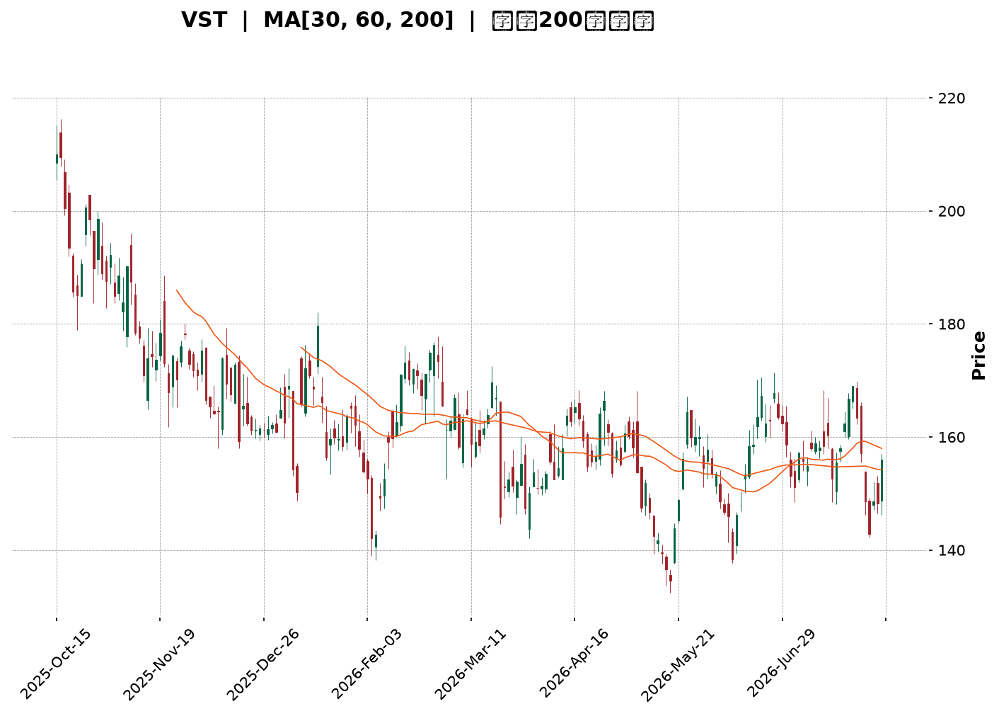
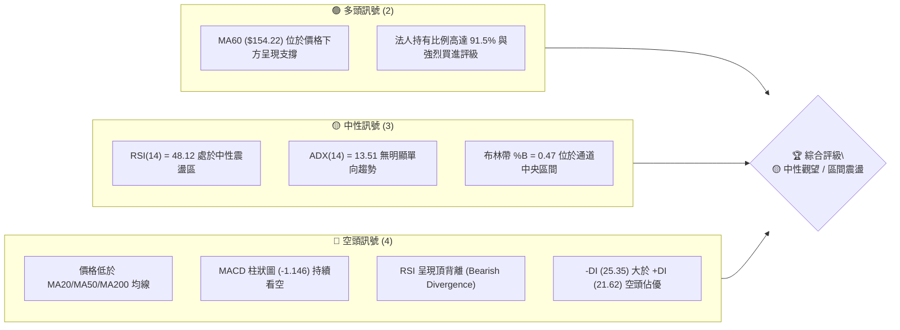
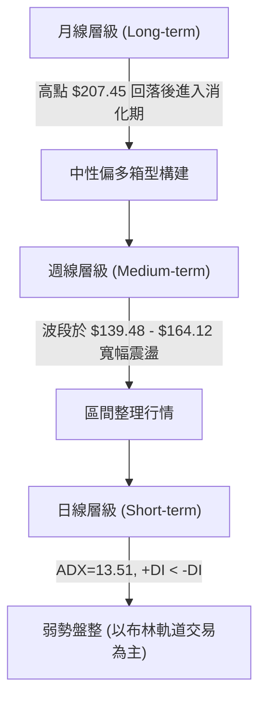
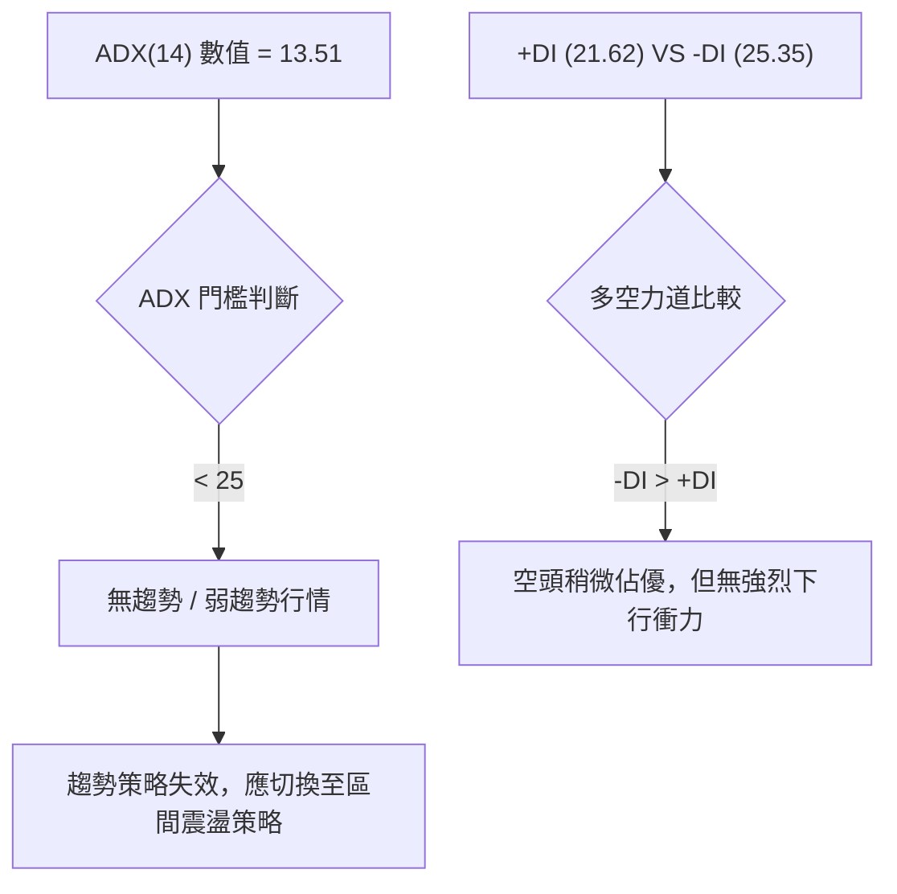
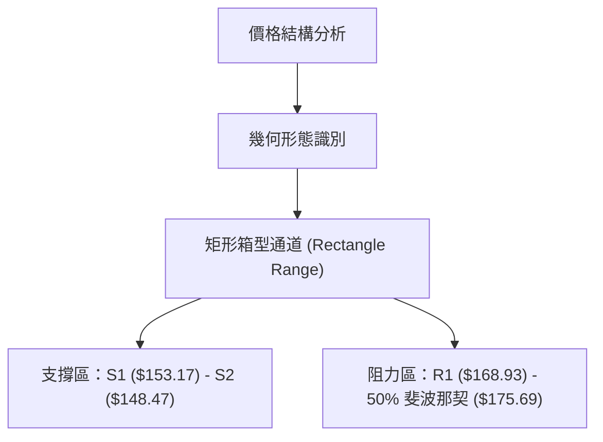
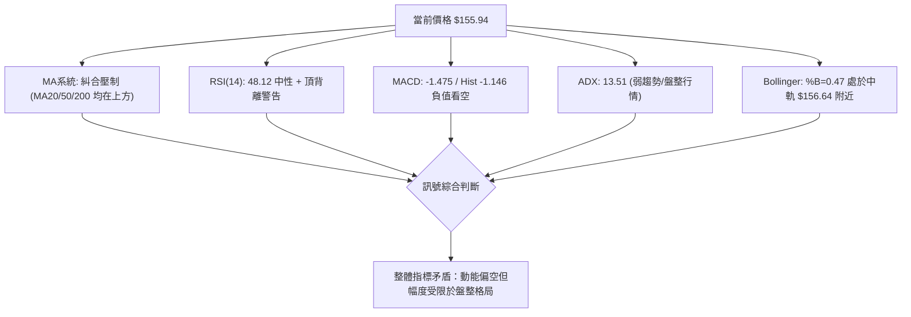
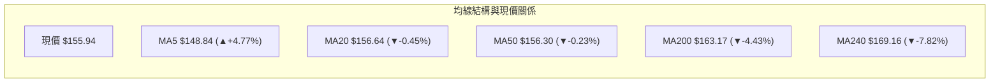
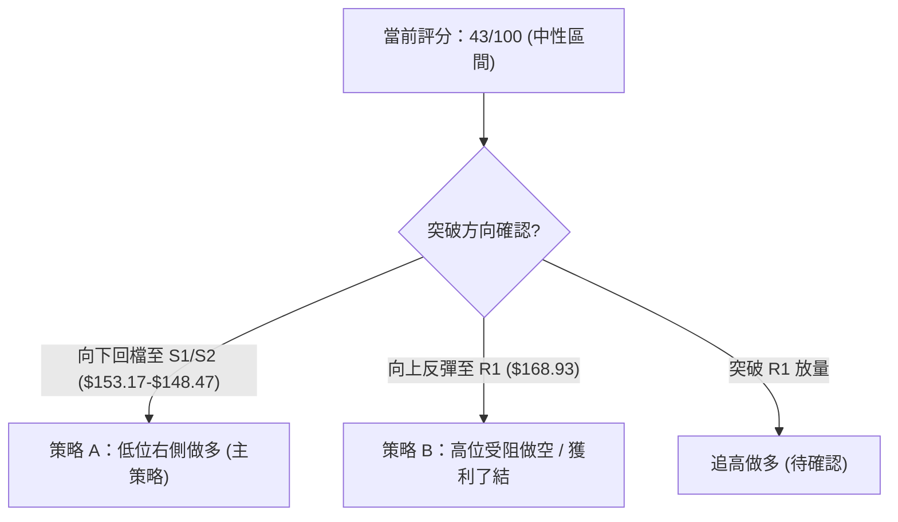
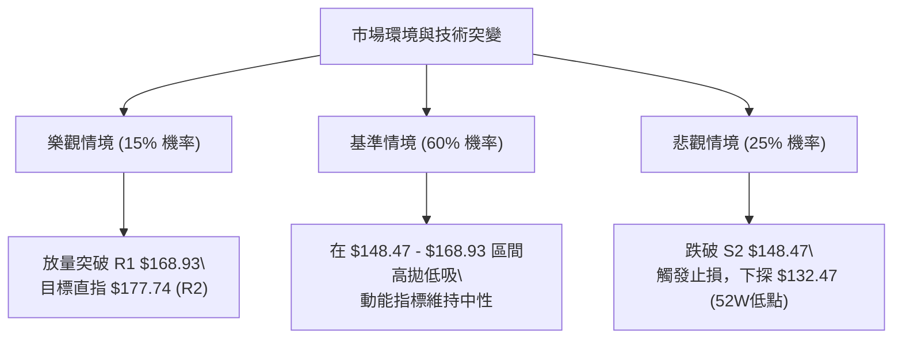

<details markdown="1">
<summary>📊 靜態圖表 (點擊展開)</summary>



</details>

<html>
<head><meta charset="utf-8" /></head>
<body>
    <div style="height:500px; width:100%;">                        <script>window.PlotlyConfig = {MathJaxConfig: 'local'};</script>
        <script charset="utf-8" src="https://cdn.plot.ly/plotly-3.7.0.min.js" integrity="sha256-jvTGqxNp8AGWEcvNLVuKr+8j5dGe9Yw51LQkmDH+IYA=" crossorigin="anonymous"></script>                <div id="candlestick-chart" class="plotly-graph-div" style="height:100%; width:100%;"></div>            <script>                window.PLOTLYENV=window.PLOTLYENV || {};                                if (document.getElementById("candlestick-chart")) {                    Plotly.newPlot(                        "candlestick-chart",                        [{"close":{"dtype":"f8","bdata":"AAAAoDc\u002fakAAAABg4DBqQAAAAGB6EGlAAAAA4OYtaEAAAADg4jdnQAAAAODlIWdAAAAAQHHSZ0AAAABATRRpQAAAAIAmz2hAAAAAAJa5Z0AAAABgYdFoQAAAAACLnWdAAAAAIJxwZ0AAAAAgqQdoQAAAAKAHH2dAAAAAQFiTZ0AAAACAVvtmQAAAAMCmxmdAAAAA4PhvZ0AAAADAV01mQAAAAED7MGZAAAAAwCZbZUAAAACA5b5lQAAAAGDGyGVAAAAAwEq2ZUAAAACAtExmQAAAACA3omVAAAAAgIH8ZEAAAACAPM1lQAAAAAA1RGVAAAAA4CICZkAAAABgyENmQAAAAGBvnWVAAAAAYLN6ZUAAAAAABV5lQAAAAKDf6mVAAAAAAEHPZEAAAAAgy61kQAAAACAMhGRAAAAAAIWPZEAAAABAB7xlQAAAACCgLGVAAAAAwKvxZEAAAABgYZdlQAAAAEDP6WNAAAAAAGOvZEAAAADgUktkQAAAAAD6I2RAAAAA4ConZEAAAAAgbDBkQAAAAOAqJ2RAAAAAoJcsZEAAAADAe0VkQAAAAEBRHGRAAAAAAMaYZEAAAABAYE9kQAAAAGD+IWVAAAAAQI1FY0AAAADA58ViQAAAAAAnvWRAAAAAIFODZUAAAACATl5lQAAAAIAfEGVAAAAAYNp1ZkAAAAAAfsRkQAAAAIATjGNAAAAAYIPyY0AAAADgXP1jQAAAAEC09WNAAAAAYObLY0AAAACA0XlkQAAAAGDbpWRAAAAAADVEZEAAAACAOL1jQAAAAKCzOmNAAAAAQH4SY0AAAADgDsRhQAAAACCc1WFAAAAAoJanYkAAAAAgiRFjQAAAAEAc5WNAAAAAQKn2Y0AAAABAzVRkQAAAAICKYGVAAAAAQG2mZUAAAACgLkNlQAAAAIDFgGVAAAAAIKtdZUAAAABAyepkQAAAAGCwZGVAAAAA4AncZUAAAABgoQpmQAAAAAAhrWVAAAAAwAaxZEAAAAAAIChkQAAAAEAZXWRAAAAAgAXeZEAAAABAy8ZjQAAAACBlZWRAAAAAYEl+ZEAAAADAEddjQAAAAOB45GNAAAAAAF7QY0AAAAAgYTFkQAAAAIANfGRAAAAAQNI0ZUAAAACAEN1kQAAAAAAbOmJAAAAAgILiYkAAAACgNBBjQAAAACCK6WJAAAAA4MgCY0AAAAAAZ2hjQAAAAGCtamJAAAAAINXDYkAAAACg1DdjQAAAAKD+3mJAAAAAoBjsYkAAAADg4S5jQAAAAACBdWNAAAAAICoRY0AAAACAb1BjQAAAAABSv2NAAAAAwLN3ZEAAAADgyVZkQAAAAGCNqWRAAAAAwGdnZEAAAADgDuxjQAAAACAwVmNAAAAA4E5yY0AAAABgLpRjQAAAAIDYg2RAAAAAABvLZEAAAABAoRxkQAAAAMBlMmNAAAAAANGzY0AAAADgAmJjQAAAAIAAFGRAAAAAoPsEZEAAAABAMsJjQAAAAMCCN2NAAAAAAG5wYkAAAADAy\u002fpiQAAAAIBEVWJAAAAAYCPNYUAAAAAgc7ZhQAAAAGCCb2FAAAAAYOERYUAAAAAgsdBgQAAAAGCO+WFAAAAAgOObYkAAAACgpYFjQAAAAECOimRAAAAAIKL9Y0AAAACgyQFkQAAAAIAwAGRAAAAA4GRRY0AAAACA+LdjQAAAAKC3MmNAAAAAoIUvY0AAAACgqZFiQAAAAOA5VmJAAAAAIH9AYkAAAACAFEthQAAAACCcRWJAAAAAIAR6YkAAAAAgxSljQAAAACBszGNAAAAAwHPTY0AAAAAgrHBkQAAAAOBR6GRAAAAA4HpMZEAAAAAA11tkQAAAAOCj+GRAAAAAIK5vZEAAAAAAKUxkQAAAAAAp1GNAAAAAwB4lY0AAAACgmeFiQAAAAEAKp2NAAAAAIFx3Y0AAAACAPVpjQAAAACBcv2NAAAAAIIXbY0AAAAAA18NjQAAAAIDCzWNAAAAAIFwHZEAAAACA6xFjQAAAAIAUbmNAAAAAIK6\u002fY0AAAABgj0pkQAAAACCu12RAAAAAIFwfZUAAAAAAKWxkQAAAAGCPomNAAAAA4HqUYkAAAACA69lhQAAAAADXk2JAAAAAgBSGYkAAAACAFH5jQA=="},"high":{"dtype":"f8","bdata":"SHr99nLkakAJ0689YwZrQIPizyq5JWpAHTzgMbqUaUBBhMYyxRNoQC8bM9DZlmdA8tQGbeTsZ0DDkj7+MCVpQPEw+n4XWmlAxpn+xOSPaEAVEzVLuPxoQMGQIp3av2hAMm8AbuECaEDEOS30LExoQHGn7kRE1mdAjvdtz6f1Z0DK05OcvYpnQE87tJMKyWdA\u002fC6xR3t\u002faEA1S5gyI2VnQKvztQ6KkWZAWwRKLxonZkCW1HyYHGhmQDOTz67QWGZAbUpl0+QVZkCs4Vdx6ZdmQOMAi4MokGdANKv70bWeZUAKcir2Jc9lQAljkbYrwGVAaRNZ+WggZkDGT5o7poBmQIQ0giLw92VARqHmnAznZUB8rF3BIKRlQFhNFnv4KWZAMBxL+Lf8ZUBNEBze9+NkQEJvihqSJmVAR1AFX5uqZEAQ9cQFRcVlQAjDJoYcaGZAoli3XgqJZUD11CkxraZlQN4l9Xg8zWVAF1zOpJ9mZUCS8PoqX1ZlQP1gbxNqe2RAL5U2v\u002fJnZED\u002fqwsAXkRkQFPdHzGcUWRAFb3Taed3ZEBopEtOhlNkQCZgUjt6gWRAl4LCGAQaZUBN6ilQzmVlQGnwWiRIhGVADJZ2N+kFZUBE4m2b2GtjQI4l+vVAyGVAlbA93BMIZkCwF9cr6d5lQIyfx82lVmVA5ekMls3BZkB5BYeYu1RlQB0n6UxYsWRAHYwfVA8xZEAt7aXIkGFkQGW0bhl2TWRAw3xmeVObZEBt9h99ToVkQEoXNTU3w2RA91i+11btZECO8DJCeoFkQN1Hm5o88WNAB1yxJi+CY0CvAnb7jSdjQNPBIGRq8GFABHBsw+D6YkBU0nYeNWtjQKg1I34wH2RAXNZfYVObZEB38xIXDLhkQGaXeEj3ZWVAuLdmYDQFZkB0Xxa1geBlQDMz92oBg2VAYlVA6q6gZUBLNqGRtWtlQOd\u002f4ISaZmVAP7E+JIzuZUBZsPm7thdmQD6L6bstOmZAbfWfhQ4BZkCOuXgEhmJkQK80SUo5eGRAPyMoHjbwZED\u002fpuOZS\u002f1kQNZEY0yghWRAtbWpCWEKZUDnlar3M3FkQGr0MxD+V2RAPFB2lxeZZEDlyrbfkGFkQO3BNvYcoGRAR1FHKbqQZUAGcUJaOiRlQBLbDReXx2RAKP1\u002f0NJ1Y0CsEKnQTTxjQMnRnNhUt2NA\u002fbnmopsOY0AmnuYtO\u002f9jQDxygsOl1mNAkD6M8ELoYkC2cS484oNjQNmGlecAS2NAt5PhJIIcY0C6bzOgOD5jQAZrlYizImRA8CFS1q9JZEBedA6yD81jQAq8WAHZD2RAcz8APpChZEDlS+M8MMlkQGrTXFP41WRAFKUg4CMIZUCXUVpFQnpkQCk\u002fmrb9G2RAx48q73DbY0B3r+b7utRjQO2YHW70p2RAd8+tK+cFZUB7R3RdF2NkQOYAlq48HWRANaBGPgTtY0A5swBTUP1jQDpCyrjkRGRA\u002fCy2EUVyZEC+dxHoYlhkQFDM6dPxBGVAunURWhBZY0Ch9xobKhFjQKvCgvGbw2JADqrM9GlCYkBZFcYEB+NhQBJH9fiQnGFAIfOYCQlrYUBUh9ZTSBBhQKountBQFmJA6u50lUeiYkCkz2NbMKtjQKQP0fZO5WRAKSwZ0FGZZECFWNRkpGlkQLrBeGYEQmRAYUJ4NIHKY0DNoM\u002fOwxFkQI9n\u002fqkNtmNAvcvm+mI6Y0B4\u002f3EFYEJjQFtCdEHromJAiBs6wt\u002fCYkDg5SFTjvlhQOkUD+s5VmJAErqv1kPJYkB\u002f1sKDcWdjQL3COj8iKGRAFzVshM9GZEA+fr7hQUNlQAAAAAAAUGVAAAAAYGa6ZEAAAADgerRkQAAAAEAza2VAAAAAgML9ZEAAAABAM7NkQAAAAGBmrmRAAAAAgD2qY0AAAAAgrodjQAAAACCup2NAAAAAwB7tY0AAAADgpY9jQAAAAIDCJWRAAAAA4KMAZEAAAACAwu1jQAAAAGC4BmVAAAAAgBTeZEAAAABAM8NjQAAAAAAAqGNAAAAAgD3SY0AAAABguI5kQAAAAIDr+WRAAAAAgOshZUAAAADgUThlQAAAAOCjxGRAAAAAIK4\u002fY0AAAADA9ahiQAAAAEAK\u002f2JAAAAAACkkY0AAAABgj55jQA=="},"hovertemplate":"\u003cb\u003e%{x|%Y-%m-%d}\u003c\u002fb\u003e\u003cbr\u003e\u958b: $%{open:.2f}\u003cbr\u003e\u9ad8: $%{high:.2f}\u003cbr\u003e\u4f4e: $%{low:.2f}\u003cbr\u003e\u6536: $%{close:.2f}\u003cextra\u003e\u003c\u002fextra\u003e","low":{"dtype":"f8","bdata":"W6BnUGixaUDnVw1NMfppQIyw6+oM52hA8fmLbzwAaEBVzavGnBlnQIO2mjb1XGZAt1H46xIeZ0Cz7faoXzloQFU2+QDsdWhAgwnm7I72ZkDdk4\u002f65JVnQPb2RQBCeGdAOMGQxkjYZkBPmRpXJGJnQAMTC6GD92ZAO7T0ZzcFZ0AO\u002fgAvIllmQMSS3j3D+2VAssVq2q3sZkD7hjtkMEJmQJvmmkvAEWZA77VxdQI6ZUAK5+bhlZxkQM3Mhz\u002fdjGVAP9iunng+ZUCNZ9UI669lQLTvTOwujWVAOW9MsYU4ZEDQxchNyKZkQGznWCrxpmRAJuVj17+LZUDrlP0AsihmQD6TzkYpf2VAhyFlIvBUZUDN+UFb+gdlQBbhJLlyOGVA+stRaPK4ZEBkxt6cJWxkQAiB0Xd\u002fgWRAsCshpL6\u002fY0A7iMiX8wpkQERnuTXF2WRAHZXnBTPJZECz08ENf7tkQBI4B4ZWwWNAjaaY6dk\u002fZEDfJDC2zkBkQPrOqAUADWRAHAXODQb2Y0BygFEeiepjQLiA9lQL\u002fWNALxNWDXPvY0Apj52BsxNkQF1kbpzOGGRAdg2ICANuZEAMQKAs8PdjQMmXLFOAamRA2E\u002fhlLkjY0BCs5Ld6JhiQE+O6hKErWRA1kDeOBN0ZEDeLVbvKEtlQAmuEN7wsmRALFZKeppmZUCQ593C7VFkQEYDAqg0emNAE556oBArY0BSxNXYv9ZjQBerkikNsmNAsPTxMNyuY0DYo\u002fZ21rZjQHJvtn\u002fkFmRAlj1OEiXKY0BH+6sMrI1jQIlFp7JcM2NAx\u002fGicES\u002fYkBRynpTWFxhQJB\u002fnfq6RGFAoVD\u002f5WxgYkApz03r6WtiQHI0YcFATGNA3k8wSZrDY0BZju\u002fEo\u002f5jQOJ0cSW+IWRAmwu3bGUvZUBjWzTyiyRlQM3MzIwl+WRANvZZnRQRZUDS0w6JIphkQO4nQubHTWRAguzWdIszZUBvC+I+CHVkQG24oMxkTWVAxKe3neurZEBBm9HR2hFjQEu\u002fIcWj\u002fmNAZU26hXwnZEBsqukIoLtjQJ\u002flsfBQUmNAwyShRUF7ZEDUcTVgGldjQJfjhPaQiGNASUClUm+pY0AeewidYvVjQF\u002fyRRKHNWRAkW21qWOhZEDCtHuW3HhkQPzSGyIUFGJAMJxIpQmkYkDIghxR6KpiQOtADzJuxWJA9Usz7x9JYkASHMOaNfFiQNFCycSjTGJAiLqFiYLEYUDwOsZTBuZiQKymnUQfvWJAen379nO1YkBI+6kTPMJiQDOfqJ9UYmNAyEFPbe0OY0AxzB4PqxxjQGb9A\u002fX3DWNAg3SBR90DZEAs990siz1kQKeo3jM+TGRAlLte\u002fw5BZEDZnOTJJ8NjQEHjf09DPWNAUI5+14FWY0Cy3fMLFkljQAHJlGTbXWNA3MG7n2rQY0A2uGT+789jQFfgSKK1G2NA9swxDGRwY0Bi23ei01ZjQFKs7NAIp2NAeKEM5XLyY0AVqkw8MYxjQJ\u002f43E\u002fCMWNAWqwzWshYYkDweaqfWUJiQFPafhyaLmJATeGNoxNqYUDmVQIJPndhQFW5CMzAM2FAMX2ym4e1YEBFRir8Lo9gQFW9NsnAM2FA2zmWPa0VYkC8U+f8QNFiQAsFCaL1v2NAx0+ltPfFY0AkQ4fTJaxjQGrbzMAjlWNA1Ueoq8njYkCz\u002f\u002f2PURVjQFVD8ByOF2NAkYOr9Vu\u002fYkBRAlovZmliQIzw+hScRWJA9W52HfKqYUAAGpvX8jZhQGkiR6P+a2FACw9272tZYkDj7yV5PsFiQEGD35a4E2NANWUyT6+fY0AyEYV9zPljQAAAAMDMXGRAAAAA4KPkY0AAAAAAKfxjQAAAAOBRwGRAAAAAgBRmZEAAAADgoyBkQAAAAOBRkGNAAAAAoJnhYkAAAAAAAJBiQAAAAOBRAGNAAAAA4FFAY0AAAACAPepiQAAAAIA9rmNAAAAAoJmhY0AAAABgZoZjQAAAACAGoWNAAAAAgBS+Y0AAAACAk5BiQAAAAOB6hGJAAAAAQDNzY0AAAADgUQBkQAAAAAAp9GNAAAAA4FGgZEAAAACA60lkQAAAAKBHcWNAAAAAYLhGYkAAAADA9cRhQAAAAGC4YmJAAAAA4KNQYkAAAACAFEZiQA=="},"name":"\u50f9\u683c","open":{"dtype":"f8","bdata":"Ol5P23UOakCebloZxrxqQDUaKwfh2WlAh5ZyvRFpaUDjiWjrjwJoQHYgS7C1WGdAt1H46xIeZ0DP1Z61G3loQPEw+n4XWmlAxpn+xOSPaEBU4zo0FPBnQOtqM0XsO2hA6IzeyoTmZ0CqzoLDmMBnQBiFtpE8amdAjdzzl5kvZ0BQeuUmNcRmQKI5a3BPOGZA8pIPO78\u002faEC+ceXzwyRnQF6dQcOgcmZA\u002flLLO6QFZkDVDAqmks9kQACAGER61mVA3QmdqzR+ZUAJWPGY381lQKIOmEG2AWdAswulZSxpZUDhnoJdvBtlQFK+6gt1q2VA9zovYeioZUA3U1h+PkhmQASHctr16GVAcAV\u002frIXVZUAVYG2vNH5lQHQ0e4z8ZWVA\u002fO4JlTb5ZUBNEBze9+NkQE1yZ5nklWRA+EFu2e+UZEDWOUICGCxkQHRxfvolz2VAwiOPGsSHZUBMRxLIrr5kQOejUt05qWVAYkm6cyKfZEAhBznQRsBkQK0495SFcWRAPiCCAvojZECf4vfLdxFkQAAAAOAqJ2RAbvnvW8kRZEDiuBTDsjFkQMT3T34ZTmRAdg2ICANuZECRemU04xxlQH\u002fKW5oUEWVADJZ2N+kFZUCDfXhpS1pjQENNHnoru2VAQqhvI+eGZEDtmwORo7BlQH5xCqKGHWVAHhcmJbqQZUCrBJHnzuJkQDYVgBNnGmRA4gOXM0jSY0B7Q17Edi9kQJBFQPbf8WNAX5qV5bMEZEBPdFXaPOJjQAMSKV1YsWRA+pFJnBGwZECJOzEPviFkQBMR9+LhpmNA9J43vQ52Y0BHkL1ajhhjQKI0NWiNk2FAa9D79sGyYkBu+0D\u002fwbJiQP8aiquj\u002fmNAtWjz4m6RZECQVLWvKwlkQPomgY52PmRArc\u002fyBxNNZUCzq6VB9bBlQM3MrsgeLmVAfVDtqGN6ZUDlgIFQakVlQOpTkTUx2mRAQCWPGfF8ZUADs1tlZFxlQDlPCwqN0GVAtfGq2l83ZUBo0dJZzidkQEETXmCdJGRAX7WIgN4tZECAT2jL4X9kQGTymVkJb2NAhtLhDeycZEAjZwnowWRkQHS+91+xlGNAXasA\u002fgkqZEDE9tBfyRFkQLZHLfqLS2RAj1tLA16pZEB0WhWlrtZkQBLbDReXx2RAmxHEap\u002fnYkBVWETc3MpiQIN5bkQQWWNAFtysU0+pYkASHMOaNfFiQMNnenornGNAEtlGKlz2YUD9knYGQ+hiQICb+if032JA9OUFTYXaYkDcdrDGettiQAVs6HLOEGRAPQVdB4F1Y0C1llR3ISljQGb9A\u002fX3DWNAatE0H9pFZEDBGUQMmKhkQBLbfh\u002fgimRAu4FBLOHAZEBtoxW6TVpkQJjXwDsgEWRASUIb2YmyY0BLmyKyvXdjQE18AoCQg2NAdODPuZ2YZECDL+ZwukhkQKC43UBSFGRAUnbWIUmCY0AWdODp1cJjQCU9uPMFr2NAQPX8m7RYZEBC+YzonChkQAgE1t37WWRAunURWhBZY0DUzoWFYHliQPplZZz9qGJADqrM9GlCYkA7DQJV1aVhQL8gZYmLcmFArLtFmcdZYUBrpU3jhfNgQAAAABzTOWFA\u002fMREu4coYkDwR7uHM9piQMfGYjoC1mNAKozppVaXZECvggyfxdNjQEMghwLX+GNAwtBlVvmYY0BjyZkBGndjQLXtAdRQiWNADDiWnn\u002fqYkCvGpyhMvliQLf923hIg2JAMRzhS8yGYkAG62cFyeRhQMrc7v5emWFAVhuremB5YkCCqUriFBNjQJtjJ2ckIWNAh9cz6fvKY0DwVzxkoDtkQAAAAAApcGRAAAAAYI8CZEAAAADA9WBkQAAAAMAe3WRAAAAAIIW7ZEAAAABgZnZkQAAAAGCPUmRAAAAAAACAY0AAAABgZj5jQAAAAEAKD2NAAAAAACmEY0AAAAAgrj9jQAAAAOBR4GNAAAAAoJmxY0AAAADAzLRjQAAAAAAAIGRAAAAAAABQZEAAAAAA17tjQAAAACCFy2JAAAAA4KOwY0AAAAAgrh9kQAAAACCFA2RAAAAA4FHIZEAAAACAPRZlQAAAAAAAsGRAAAAAoHA9Y0AAAABAM5diQAAAAAAAgGJAAAAAQDP7YkAAAADgo5hiQA=="},"x":["2025-10-15T00:00:00-04:00","2025-10-16T00:00:00-04:00","2025-10-17T00:00:00-04:00","2025-10-20T00:00:00-04:00","2025-10-21T00:00:00-04:00","2025-10-22T00:00:00-04:00","2025-10-23T00:00:00-04:00","2025-10-24T00:00:00-04:00","2025-10-27T00:00:00-04:00","2025-10-28T00:00:00-04:00","2025-10-29T00:00:00-04:00","2025-10-30T00:00:00-04:00","2025-10-31T00:00:00-04:00","2025-11-03T00:00:00-05:00","2025-11-04T00:00:00-05:00","2025-11-05T00:00:00-05:00","2025-11-06T00:00:00-05:00","2025-11-07T00:00:00-05:00","2025-11-10T00:00:00-05:00","2025-11-11T00:00:00-05:00","2025-11-12T00:00:00-05:00","2025-11-13T00:00:00-05:00","2025-11-14T00:00:00-05:00","2025-11-17T00:00:00-05:00","2025-11-18T00:00:00-05:00","2025-11-19T00:00:00-05:00","2025-11-20T00:00:00-05:00","2025-11-21T00:00:00-05:00","2025-11-24T00:00:00-05:00","2025-11-25T00:00:00-05:00","2025-11-26T00:00:00-05:00","2025-11-28T00:00:00-05:00","2025-12-01T00:00:00-05:00","2025-12-02T00:00:00-05:00","2025-12-03T00:00:00-05:00","2025-12-04T00:00:00-05:00","2025-12-05T00:00:00-05:00","2025-12-08T00:00:00-05:00","2025-12-09T00:00:00-05:00","2025-12-10T00:00:00-05:00","2025-12-11T00:00:00-05:00","2025-12-12T00:00:00-05:00","2025-12-15T00:00:00-05:00","2025-12-16T00:00:00-05:00","2025-12-17T00:00:00-05:00","2025-12-18T00:00:00-05:00","2025-12-19T00:00:00-05:00","2025-12-22T00:00:00-05:00","2025-12-23T00:00:00-05:00","2025-12-24T00:00:00-05:00","2025-12-26T00:00:00-05:00","2025-12-29T00:00:00-05:00","2025-12-30T00:00:00-05:00","2025-12-31T00:00:00-05:00","2026-01-02T00:00:00-05:00","2026-01-05T00:00:00-05:00","2026-01-06T00:00:00-05:00","2026-01-07T00:00:00-05:00","2026-01-08T00:00:00-05:00","2026-01-09T00:00:00-05:00","2026-01-12T00:00:00-05:00","2026-01-13T00:00:00-05:00","2026-01-14T00:00:00-05:00","2026-01-15T00:00:00-05:00","2026-01-16T00:00:00-05:00","2026-01-20T00:00:00-05:00","2026-01-21T00:00:00-05:00","2026-01-22T00:00:00-05:00","2026-01-23T00:00:00-05:00","2026-01-26T00:00:00-05:00","2026-01-27T00:00:00-05:00","2026-01-28T00:00:00-05:00","2026-01-29T00:00:00-05:00","2026-01-30T00:00:00-05:00","2026-02-02T00:00:00-05:00","2026-02-03T00:00:00-05:00","2026-02-04T00:00:00-05:00","2026-02-05T00:00:00-05:00","2026-02-06T00:00:00-05:00","2026-02-09T00:00:00-05:00","2026-02-10T00:00:00-05:00","2026-02-11T00:00:00-05:00","2026-02-12T00:00:00-05:00","2026-02-13T00:00:00-05:00","2026-02-17T00:00:00-05:00","2026-02-18T00:00:00-05:00","2026-02-19T00:00:00-05:00","2026-02-20T00:00:00-05:00","2026-02-23T00:00:00-05:00","2026-02-24T00:00:00-05:00","2026-02-25T00:00:00-05:00","2026-02-26T00:00:00-05:00","2026-02-27T00:00:00-05:00","2026-03-02T00:00:00-05:00","2026-03-03T00:00:00-05:00","2026-03-04T00:00:00-05:00","2026-03-05T00:00:00-05:00","2026-03-06T00:00:00-05:00","2026-03-09T00:00:00-04:00","2026-03-10T00:00:00-04:00","2026-03-11T00:00:00-04:00","2026-03-12T00:00:00-04:00","2026-03-13T00:00:00-04:00","2026-03-16T00:00:00-04:00","2026-03-17T00:00:00-04:00","2026-03-18T00:00:00-04:00","2026-03-19T00:00:00-04:00","2026-03-20T00:00:00-04:00","2026-03-23T00:00:00-04:00","2026-03-24T00:00:00-04:00","2026-03-25T00:00:00-04:00","2026-03-26T00:00:00-04:00","2026-03-27T00:00:00-04:00","2026-03-30T00:00:00-04:00","2026-03-31T00:00:00-04:00","2026-04-01T00:00:00-04:00","2026-04-02T00:00:00-04:00","2026-04-06T00:00:00-04:00","2026-04-07T00:00:00-04:00","2026-04-08T00:00:00-04:00","2026-04-09T00:00:00-04:00","2026-04-10T00:00:00-04:00","2026-04-13T00:00:00-04:00","2026-04-14T00:00:00-04:00","2026-04-15T00:00:00-04:00","2026-04-16T00:00:00-04:00","2026-04-17T00:00:00-04:00","2026-04-20T00:00:00-04:00","2026-04-21T00:00:00-04:00","2026-04-22T00:00:00-04:00","2026-04-23T00:00:00-04:00","2026-04-24T00:00:00-04:00","2026-04-27T00:00:00-04:00","2026-04-28T00:00:00-04:00","2026-04-29T00:00:00-04:00","2026-04-30T00:00:00-04:00","2026-05-01T00:00:00-04:00","2026-05-04T00:00:00-04:00","2026-05-05T00:00:00-04:00","2026-05-06T00:00:00-04:00","2026-05-07T00:00:00-04:00","2026-05-08T00:00:00-04:00","2026-05-11T00:00:00-04:00","2026-05-12T00:00:00-04:00","2026-05-13T00:00:00-04:00","2026-05-14T00:00:00-04:00","2026-05-15T00:00:00-04:00","2026-05-18T00:00:00-04:00","2026-05-19T00:00:00-04:00","2026-05-20T00:00:00-04:00","2026-05-21T00:00:00-04:00","2026-05-22T00:00:00-04:00","2026-05-26T00:00:00-04:00","2026-05-27T00:00:00-04:00","2026-05-28T00:00:00-04:00","2026-05-29T00:00:00-04:00","2026-06-01T00:00:00-04:00","2026-06-02T00:00:00-04:00","2026-06-03T00:00:00-04:00","2026-06-04T00:00:00-04:00","2026-06-05T00:00:00-04:00","2026-06-08T00:00:00-04:00","2026-06-09T00:00:00-04:00","2026-06-10T00:00:00-04:00","2026-06-11T00:00:00-04:00","2026-06-12T00:00:00-04:00","2026-06-15T00:00:00-04:00","2026-06-16T00:00:00-04:00","2026-06-17T00:00:00-04:00","2026-06-18T00:00:00-04:00","2026-06-22T00:00:00-04:00","2026-06-23T00:00:00-04:00","2026-06-24T00:00:00-04:00","2026-06-25T00:00:00-04:00","2026-06-26T00:00:00-04:00","2026-06-29T00:00:00-04:00","2026-06-30T00:00:00-04:00","2026-07-01T00:00:00-04:00","2026-07-02T00:00:00-04:00","2026-07-06T00:00:00-04:00","2026-07-07T00:00:00-04:00","2026-07-08T00:00:00-04:00","2026-07-09T00:00:00-04:00","2026-07-10T00:00:00-04:00","2026-07-13T00:00:00-04:00","2026-07-14T00:00:00-04:00","2026-07-15T00:00:00-04:00","2026-07-16T00:00:00-04:00","2026-07-17T00:00:00-04:00","2026-07-20T00:00:00-04:00","2026-07-21T00:00:00-04:00","2026-07-22T00:00:00-04:00","2026-07-23T00:00:00-04:00","2026-07-24T00:00:00-04:00","2026-07-27T00:00:00-04:00","2026-07-28T00:00:00-04:00","2026-07-29T00:00:00-04:00","2026-07-30T00:00:00-04:00","2026-07-31T00:00:00-04:00","2026-08-03T00:00:00-04:00"],"type":"candlestick"},{"hovertemplate":"MA30: $%{y:.2f}\u003cextra\u003e\u003c\u002fextra\u003e","line":{"color":"#2196F3","dash":"dash","width":2},"mode":"lines","name":"MA30","x":["2025-10-15T00:00:00-04:00","2025-10-16T00:00:00-04:00","2025-10-17T00:00:00-04:00","2025-10-20T00:00:00-04:00","2025-10-21T00:00:00-04:00","2025-10-22T00:00:00-04:00","2025-10-23T00:00:00-04:00","2025-10-24T00:00:00-04:00","2025-10-27T00:00:00-04:00","2025-10-28T00:00:00-04:00","2025-10-29T00:00:00-04:00","2025-10-30T00:00:00-04:00","2025-10-31T00:00:00-04:00","2025-11-03T00:00:00-05:00","2025-11-04T00:00:00-05:00","2025-11-05T00:00:00-05:00","2025-11-06T00:00:00-05:00","2025-11-07T00:00:00-05:00","2025-11-10T00:00:00-05:00","2025-11-11T00:00:00-05:00","2025-11-12T00:00:00-05:00","2025-11-13T00:00:00-05:00","2025-11-14T00:00:00-05:00","2025-11-17T00:00:00-05:00","2025-11-18T00:00:00-05:00","2025-11-19T00:00:00-05:00","2025-11-20T00:00:00-05:00","2025-11-21T00:00:00-05:00","2025-11-24T00:00:00-05:00","2025-11-25T00:00:00-05:00","2025-11-26T00:00:00-05:00","2025-11-28T00:00:00-05:00","2025-12-01T00:00:00-05:00","2025-12-02T00:00:00-05:00","2025-12-03T00:00:00-05:00","2025-12-04T00:00:00-05:00","2025-12-05T00:00:00-05:00","2025-12-08T00:00:00-05:00","2025-12-09T00:00:00-05:00","2025-12-10T00:00:00-05:00","2025-12-11T00:00:00-05:00","2025-12-12T00:00:00-05:00","2025-12-15T00:00:00-05:00","2025-12-16T00:00:00-05:00","2025-12-17T00:00:00-05:00","2025-12-18T00:00:00-05:00","2025-12-19T00:00:00-05:00","2025-12-22T00:00:00-05:00","2025-12-23T00:00:00-05:00","2025-12-24T00:00:00-05:00","2025-12-26T00:00:00-05:00","2025-12-29T00:00:00-05:00","2025-12-30T00:00:00-05:00","2025-12-31T00:00:00-05:00","2026-01-02T00:00:00-05:00","2026-01-05T00:00:00-05:00","2026-01-06T00:00:00-05:00","2026-01-07T00:00:00-05:00","2026-01-08T00:00:00-05:00","2026-01-09T00:00:00-05:00","2026-01-12T00:00:00-05:00","2026-01-13T00:00:00-05:00","2026-01-14T00:00:00-05:00","2026-01-15T00:00:00-05:00","2026-01-16T00:00:00-05:00","2026-01-20T00:00:00-05:00","2026-01-21T00:00:00-05:00","2026-01-22T00:00:00-05:00","2026-01-23T00:00:00-05:00","2026-01-26T00:00:00-05:00","2026-01-27T00:00:00-05:00","2026-01-28T00:00:00-05:00","2026-01-29T00:00:00-05:00","2026-01-30T00:00:00-05:00","2026-02-02T00:00:00-05:00","2026-02-03T00:00:00-05:00","2026-02-04T00:00:00-05:00","2026-02-05T00:00:00-05:00","2026-02-06T00:00:00-05:00","2026-02-09T00:00:00-05:00","2026-02-10T00:00:00-05:00","2026-02-11T00:00:00-05:00","2026-02-12T00:00:00-05:00","2026-02-13T00:00:00-05:00","2026-02-17T00:00:00-05:00","2026-02-18T00:00:00-05:00","2026-02-19T00:00:00-05:00","2026-02-20T00:00:00-05:00","2026-02-23T00:00:00-05:00","2026-02-24T00:00:00-05:00","2026-02-25T00:00:00-05:00","2026-02-26T00:00:00-05:00","2026-02-27T00:00:00-05:00","2026-03-02T00:00:00-05:00","2026-03-03T00:00:00-05:00","2026-03-04T00:00:00-05:00","2026-03-05T00:00:00-05:00","2026-03-06T00:00:00-05:00","2026-03-09T00:00:00-04:00","2026-03-10T00:00:00-04:00","2026-03-11T00:00:00-04:00","2026-03-12T00:00:00-04:00","2026-03-13T00:00:00-04:00","2026-03-16T00:00:00-04:00","2026-03-17T00:00:00-04:00","2026-03-18T00:00:00-04:00","2026-03-19T00:00:00-04:00","2026-03-20T00:00:00-04:00","2026-03-23T00:00:00-04:00","2026-03-24T00:00:00-04:00","2026-03-25T00:00:00-04:00","2026-03-26T00:00:00-04:00","2026-03-27T00:00:00-04:00","2026-03-30T00:00:00-04:00","2026-03-31T00:00:00-04:00","2026-04-01T00:00:00-04:00","2026-04-02T00:00:00-04:00","2026-04-06T00:00:00-04:00","2026-04-07T00:00:00-04:00","2026-04-08T00:00:00-04:00","2026-04-09T00:00:00-04:00","2026-04-10T00:00:00-04:00","2026-04-13T00:00:00-04:00","2026-04-14T00:00:00-04:00","2026-04-15T00:00:00-04:00","2026-04-16T00:00:00-04:00","2026-04-17T00:00:00-04:00","2026-04-20T00:00:00-04:00","2026-04-21T00:00:00-04:00","2026-04-22T00:00:00-04:00","2026-04-23T00:00:00-04:00","2026-04-24T00:00:00-04:00","2026-04-27T00:00:00-04:00","2026-04-28T00:00:00-04:00","2026-04-29T00:00:00-04:00","2026-04-30T00:00:00-04:00","2026-05-01T00:00:00-04:00","2026-05-04T00:00:00-04:00","2026-05-05T00:00:00-04:00","2026-05-06T00:00:00-04:00","2026-05-07T00:00:00-04:00","2026-05-08T00:00:00-04:00","2026-05-11T00:00:00-04:00","2026-05-12T00:00:00-04:00","2026-05-13T00:00:00-04:00","2026-05-14T00:00:00-04:00","2026-05-15T00:00:00-04:00","2026-05-18T00:00:00-04:00","2026-05-19T00:00:00-04:00","2026-05-20T00:00:00-04:00","2026-05-21T00:00:00-04:00","2026-05-22T00:00:00-04:00","2026-05-26T00:00:00-04:00","2026-05-27T00:00:00-04:00","2026-05-28T00:00:00-04:00","2026-05-29T00:00:00-04:00","2026-06-01T00:00:00-04:00","2026-06-02T00:00:00-04:00","2026-06-03T00:00:00-04:00","2026-06-04T00:00:00-04:00","2026-06-05T00:00:00-04:00","2026-06-08T00:00:00-04:00","2026-06-09T00:00:00-04:00","2026-06-10T00:00:00-04:00","2026-06-11T00:00:00-04:00","2026-06-12T00:00:00-04:00","2026-06-15T00:00:00-04:00","2026-06-16T00:00:00-04:00","2026-06-17T00:00:00-04:00","2026-06-18T00:00:00-04:00","2026-06-22T00:00:00-04:00","2026-06-23T00:00:00-04:00","2026-06-24T00:00:00-04:00","2026-06-25T00:00:00-04:00","2026-06-26T00:00:00-04:00","2026-06-29T00:00:00-04:00","2026-06-30T00:00:00-04:00","2026-07-01T00:00:00-04:00","2026-07-02T00:00:00-04:00","2026-07-06T00:00:00-04:00","2026-07-07T00:00:00-04:00","2026-07-08T00:00:00-04:00","2026-07-09T00:00:00-04:00","2026-07-10T00:00:00-04:00","2026-07-13T00:00:00-04:00","2026-07-14T00:00:00-04:00","2026-07-15T00:00:00-04:00","2026-07-16T00:00:00-04:00","2026-07-17T00:00:00-04:00","2026-07-20T00:00:00-04:00","2026-07-21T00:00:00-04:00","2026-07-22T00:00:00-04:00","2026-07-23T00:00:00-04:00","2026-07-24T00:00:00-04:00","2026-07-27T00:00:00-04:00","2026-07-28T00:00:00-04:00","2026-07-29T00:00:00-04:00","2026-07-30T00:00:00-04:00","2026-07-31T00:00:00-04:00","2026-08-03T00:00:00-04:00"],"y":{"dtype":"f8","bdata":"AAAAAAAA+H8AAAAAAAD4fwAAAAAAAPh\u002fAAAAAAAA+H8AAAAAAAD4fwAAAAAAAPh\u002fAAAAAAAA+H8AAAAAAAD4fwAAAAAAAPh\u002fAAAAAAAA+H8AAAAAAAD4fwAAAAAAAPh\u002fAAAAAAAA+H8AAAAAAAD4fwAAAAAAAPh\u002fAAAAAAAA+H8AAAAAAAD4fwAAAAAAAPh\u002fAAAAAAAA+H8AAAAAAAD4fwAAAAAAAPh\u002fAAAAAAAA+H8AAAAAAAD4fwAAAAAAAPh\u002fAAAAAAAA+H8AAAAAAAD4fwAAAAAAAPh\u002fAAAAAAAA+H8AAAAAAAD4f97d3Q2nPmdAIiIisnsaZ0BVVVXl+vhmQImIiJiL22ZAiYiIWIHEZkDv7u6utbRmQLy7u5tXqmZAzczMzKKQZkDe3d3tFWtmQKuqqupyRmZAmpmZWXIrZkC8u7uLIhFmQKuqqupN\u002fGVAMzMzowHnZUAiIiJyMtJlQDMzM7PStmVAREREZCieZUBmZmZWOYdlQERERJQzaGVAZmZmtixMZUC8u7vbJDplQLy7uwvAKGVAVVVVNaoeZUDe3d2dFRJlQCIiInLNA2VAVVVVBUn6ZEDv7u6+TulkQGZmZpYI5WRAiYiI2GbWZEAAAACwjrxkQImIiDgOuGRAiYiIGNSzZEBmZmbmLaxkQJqZmQl4p2RARERENNevZECrqqoauapkQJqZmRl\u002flmRAIiIiciOPZEB3d3fnQYlkQN7d3T2DhGRARERE9P19ZEDe3d1tQHNkQHd3d2fCbmRA3t3dLfpoZEBEREQELFlkQDMzM8NVU2RAd3d3Z5JFZEAiIiIS\u002fy9kQGZmZkZRHGRAEREREYgPZEB3d3f39wVkQHd3d0fEA2RAEREREfgBZECJiIjIegJkQN7d3X1JDWRAiYiIiEYWZEAzMzMDZx5kQImIiMiPIWRAVVVVpW4zZEDe3d1tukVkQDMzMxNQS2RAmpmZGUVOZECJiIiYA1RkQBEREWE\u002fWWRAIiIiQidKZEDNzMzs8ERkQFVVVZXoS2RAERERQcJTZECamZmZ8FFkQCIiIrKpVWRA3t3d7ZtbZEAzMzMjL1ZkQLy7u+u8T2RAvLu7a+BLZEBERESkv09kQGZmZtZ1WmRAZmZm1qtsZEAzMzPTGodkQDMzM2N0imRA7+7uLmuMZEBVVVXVX4xkQImIiBj9g2RAREREBNx7ZEDe3d29+nNkQDMzM6O3WmRAd3d39xhCZECJiIgIpzBkQImIiHgxGmRAERERQVcFZEBmZmZGi\u002fZjQCIiIrIJ5mNAAAAAcDXOY0AiIiKC77ZjQM3MzKx5pmNAIiIigpCkY0BERES0HqZjQLy7uxurqGNAq6qq6rakY0B3d3fn9KVjQKuqqprqnGNAq6qq2vuTY0AzMzMTwZFjQAAAABARl2NAIiIismyfY0AiIiKiu55jQDMzM5O+k2NAMzMzM+mGY0DNzMycRnpjQHd3d4cSimNAvLu7O8GTY0BmZmYWsJljQBEREXFJnGNAvLu7i2iXY0DNzMw8wZNjQKuqqooKk2NAq6qqatGKY0BVVVXV+H1jQFVVVfW4cWNAERERUephY0De3d19tU1jQFVVVUULQWNAREREhCI9Y0BERER0xj5jQKuqqrqMRWNAMzMzE3tBY0C8u7u7pT5jQBEREYEAOWNAREREJLwvY0CamZmp\u002fy1jQKuqqvrQLGNAIiIiEpcqY0C8u7sL+SFjQBEREbFiD2NARERE1LL5YkCrqqqapeFiQERERATB2WJAERERQUvPYkBERERUa81iQERERIQIy2JAq6qq2mHJYkB3d3e3Ms9iQFVVVQWg3WJAERERUX7tYkBVVVX1QvliQDMzMyPGD2NAq6qqOkImY0AzMzPTUDxjQHd3d8e8UGNAZmZmBnJiY0AAAABgE3RjQN7d3U1kgmNAAAAAILWJY0CrqqraZIhjQKuqquqegWNAERER0XuAY0AiIiIya35jQM3MzNy8fGNAMzMzo82CY0C8u7urRH1jQLy7uzs\u002ff2NAIiIiYg2EY0BVVVW1v5JjQDMzM3MhqGNAiYiISKDAY0CrqqoqVNtjQAAAAOD15mNAMzMzs9fnY0B3d3fHpdxjQImIiGg60mNAIiIioh3HY0AzMzODB79jQA=="},"type":"scatter"},{"hovertemplate":"MA60: $%{y:.2f}\u003cextra\u003e\u003c\u002fextra\u003e","line":{"color":"#9C27B0","dash":"dash","width":2},"mode":"lines","name":"MA60","x":["2025-10-15T00:00:00-04:00","2025-10-16T00:00:00-04:00","2025-10-17T00:00:00-04:00","2025-10-20T00:00:00-04:00","2025-10-21T00:00:00-04:00","2025-10-22T00:00:00-04:00","2025-10-23T00:00:00-04:00","2025-10-24T00:00:00-04:00","2025-10-27T00:00:00-04:00","2025-10-28T00:00:00-04:00","2025-10-29T00:00:00-04:00","2025-10-30T00:00:00-04:00","2025-10-31T00:00:00-04:00","2025-11-03T00:00:00-05:00","2025-11-04T00:00:00-05:00","2025-11-05T00:00:00-05:00","2025-11-06T00:00:00-05:00","2025-11-07T00:00:00-05:00","2025-11-10T00:00:00-05:00","2025-11-11T00:00:00-05:00","2025-11-12T00:00:00-05:00","2025-11-13T00:00:00-05:00","2025-11-14T00:00:00-05:00","2025-11-17T00:00:00-05:00","2025-11-18T00:00:00-05:00","2025-11-19T00:00:00-05:00","2025-11-20T00:00:00-05:00","2025-11-21T00:00:00-05:00","2025-11-24T00:00:00-05:00","2025-11-25T00:00:00-05:00","2025-11-26T00:00:00-05:00","2025-11-28T00:00:00-05:00","2025-12-01T00:00:00-05:00","2025-12-02T00:00:00-05:00","2025-12-03T00:00:00-05:00","2025-12-04T00:00:00-05:00","2025-12-05T00:00:00-05:00","2025-12-08T00:00:00-05:00","2025-12-09T00:00:00-05:00","2025-12-10T00:00:00-05:00","2025-12-11T00:00:00-05:00","2025-12-12T00:00:00-05:00","2025-12-15T00:00:00-05:00","2025-12-16T00:00:00-05:00","2025-12-17T00:00:00-05:00","2025-12-18T00:00:00-05:00","2025-12-19T00:00:00-05:00","2025-12-22T00:00:00-05:00","2025-12-23T00:00:00-05:00","2025-12-24T00:00:00-05:00","2025-12-26T00:00:00-05:00","2025-12-29T00:00:00-05:00","2025-12-30T00:00:00-05:00","2025-12-31T00:00:00-05:00","2026-01-02T00:00:00-05:00","2026-01-05T00:00:00-05:00","2026-01-06T00:00:00-05:00","2026-01-07T00:00:00-05:00","2026-01-08T00:00:00-05:00","2026-01-09T00:00:00-05:00","2026-01-12T00:00:00-05:00","2026-01-13T00:00:00-05:00","2026-01-14T00:00:00-05:00","2026-01-15T00:00:00-05:00","2026-01-16T00:00:00-05:00","2026-01-20T00:00:00-05:00","2026-01-21T00:00:00-05:00","2026-01-22T00:00:00-05:00","2026-01-23T00:00:00-05:00","2026-01-26T00:00:00-05:00","2026-01-27T00:00:00-05:00","2026-01-28T00:00:00-05:00","2026-01-29T00:00:00-05:00","2026-01-30T00:00:00-05:00","2026-02-02T00:00:00-05:00","2026-02-03T00:00:00-05:00","2026-02-04T00:00:00-05:00","2026-02-05T00:00:00-05:00","2026-02-06T00:00:00-05:00","2026-02-09T00:00:00-05:00","2026-02-10T00:00:00-05:00","2026-02-11T00:00:00-05:00","2026-02-12T00:00:00-05:00","2026-02-13T00:00:00-05:00","2026-02-17T00:00:00-05:00","2026-02-18T00:00:00-05:00","2026-02-19T00:00:00-05:00","2026-02-20T00:00:00-05:00","2026-02-23T00:00:00-05:00","2026-02-24T00:00:00-05:00","2026-02-25T00:00:00-05:00","2026-02-26T00:00:00-05:00","2026-02-27T00:00:00-05:00","2026-03-02T00:00:00-05:00","2026-03-03T00:00:00-05:00","2026-03-04T00:00:00-05:00","2026-03-05T00:00:00-05:00","2026-03-06T00:00:00-05:00","2026-03-09T00:00:00-04:00","2026-03-10T00:00:00-04:00","2026-03-11T00:00:00-04:00","2026-03-12T00:00:00-04:00","2026-03-13T00:00:00-04:00","2026-03-16T00:00:00-04:00","2026-03-17T00:00:00-04:00","2026-03-18T00:00:00-04:00","2026-03-19T00:00:00-04:00","2026-03-20T00:00:00-04:00","2026-03-23T00:00:00-04:00","2026-03-24T00:00:00-04:00","2026-03-25T00:00:00-04:00","2026-03-26T00:00:00-04:00","2026-03-27T00:00:00-04:00","2026-03-30T00:00:00-04:00","2026-03-31T00:00:00-04:00","2026-04-01T00:00:00-04:00","2026-04-02T00:00:00-04:00","2026-04-06T00:00:00-04:00","2026-04-07T00:00:00-04:00","2026-04-08T00:00:00-04:00","2026-04-09T00:00:00-04:00","2026-04-10T00:00:00-04:00","2026-04-13T00:00:00-04:00","2026-04-14T00:00:00-04:00","2026-04-15T00:00:00-04:00","2026-04-16T00:00:00-04:00","2026-04-17T00:00:00-04:00","2026-04-20T00:00:00-04:00","2026-04-21T00:00:00-04:00","2026-04-22T00:00:00-04:00","2026-04-23T00:00:00-04:00","2026-04-24T00:00:00-04:00","2026-04-27T00:00:00-04:00","2026-04-28T00:00:00-04:00","2026-04-29T00:00:00-04:00","2026-04-30T00:00:00-04:00","2026-05-01T00:00:00-04:00","2026-05-04T00:00:00-04:00","2026-05-05T00:00:00-04:00","2026-05-06T00:00:00-04:00","2026-05-07T00:00:00-04:00","2026-05-08T00:00:00-04:00","2026-05-11T00:00:00-04:00","2026-05-12T00:00:00-04:00","2026-05-13T00:00:00-04:00","2026-05-14T00:00:00-04:00","2026-05-15T00:00:00-04:00","2026-05-18T00:00:00-04:00","2026-05-19T00:00:00-04:00","2026-05-20T00:00:00-04:00","2026-05-21T00:00:00-04:00","2026-05-22T00:00:00-04:00","2026-05-26T00:00:00-04:00","2026-05-27T00:00:00-04:00","2026-05-28T00:00:00-04:00","2026-05-29T00:00:00-04:00","2026-06-01T00:00:00-04:00","2026-06-02T00:00:00-04:00","2026-06-03T00:00:00-04:00","2026-06-04T00:00:00-04:00","2026-06-05T00:00:00-04:00","2026-06-08T00:00:00-04:00","2026-06-09T00:00:00-04:00","2026-06-10T00:00:00-04:00","2026-06-11T00:00:00-04:00","2026-06-12T00:00:00-04:00","2026-06-15T00:00:00-04:00","2026-06-16T00:00:00-04:00","2026-06-17T00:00:00-04:00","2026-06-18T00:00:00-04:00","2026-06-22T00:00:00-04:00","2026-06-23T00:00:00-04:00","2026-06-24T00:00:00-04:00","2026-06-25T00:00:00-04:00","2026-06-26T00:00:00-04:00","2026-06-29T00:00:00-04:00","2026-06-30T00:00:00-04:00","2026-07-01T00:00:00-04:00","2026-07-02T00:00:00-04:00","2026-07-06T00:00:00-04:00","2026-07-07T00:00:00-04:00","2026-07-08T00:00:00-04:00","2026-07-09T00:00:00-04:00","2026-07-10T00:00:00-04:00","2026-07-13T00:00:00-04:00","2026-07-14T00:00:00-04:00","2026-07-15T00:00:00-04:00","2026-07-16T00:00:00-04:00","2026-07-17T00:00:00-04:00","2026-07-20T00:00:00-04:00","2026-07-21T00:00:00-04:00","2026-07-22T00:00:00-04:00","2026-07-23T00:00:00-04:00","2026-07-24T00:00:00-04:00","2026-07-27T00:00:00-04:00","2026-07-28T00:00:00-04:00","2026-07-29T00:00:00-04:00","2026-07-30T00:00:00-04:00","2026-07-31T00:00:00-04:00","2026-08-03T00:00:00-04:00"],"y":{"dtype":"f8","bdata":"AAAAAAAA+H8AAAAAAAD4fwAAAAAAAPh\u002fAAAAAAAA+H8AAAAAAAD4fwAAAAAAAPh\u002fAAAAAAAA+H8AAAAAAAD4fwAAAAAAAPh\u002fAAAAAAAA+H8AAAAAAAD4fwAAAAAAAPh\u002fAAAAAAAA+H8AAAAAAAD4fwAAAAAAAPh\u002fAAAAAAAA+H8AAAAAAAD4fwAAAAAAAPh\u002fAAAAAAAA+H8AAAAAAAD4fwAAAAAAAPh\u002fAAAAAAAA+H8AAAAAAAD4fwAAAAAAAPh\u002fAAAAAAAA+H8AAAAAAAD4fwAAAAAAAPh\u002fAAAAAAAA+H8AAAAAAAD4fwAAAAAAAPh\u002fAAAAAAAA+H8AAAAAAAD4fwAAAAAAAPh\u002fAAAAAAAA+H8AAAAAAAD4fwAAAAAAAPh\u002fAAAAAAAA+H8AAAAAAAD4fwAAAAAAAPh\u002fAAAAAAAA+H8AAAAAAAD4fwAAAAAAAPh\u002fAAAAAAAA+H8AAAAAAAD4fwAAAAAAAPh\u002fAAAAAAAA+H8AAAAAAAD4fwAAAAAAAPh\u002fAAAAAAAA+H8AAAAAAAD4fwAAAAAAAPh\u002fAAAAAAAA+H8AAAAAAAD4fwAAAAAAAPh\u002fAAAAAAAA+H8AAAAAAAD4fwAAAAAAAPh\u002fAAAAAAAA+H8AAAAAAAD4fzMzM6Na+2VAVVVV5SfnZUDe3d1llNJlQBEREdGBwWVAZmZmRiy6ZUDNzMxkt69lQKuqqlproGVAd3d3H+OPZUCrqqrqK3plQERERBR7ZWVA7+7uJrhUZUDNzMx8MUJlQBERESmINWVAiYiI6P0nZUAzMzM7rxVlQDMzMzsUBWVA3t3dZd3xZEBEREQ0nNtkQFVVVW1CwmRAvLu7Y9qtZECamZlpDqBkQJqZmSlClmRAMzMzI1GQZEAzMzMzSIpkQAAAAHiLiGRA7+7uxkeIZEARERHh2oNkQHd3dy9Mg2RA7+7uvuqEZEDv7u6OJIFkQN7d3SWvgWRAERERmQyBZEB3d3e\u002fGIBkQFVVVbVbgGRAMzMzO\u002f98ZEC8u7sD1XdkQHd3d9czcWRAmpmZ2XJxZECJiIhAmW1kQAAAAHgWbWRAERER8cxsZECJiIjIt2RkQJqZmak\u002fX2RAzczMTG1aZEBERETUdVRkQM3MzMzlVmRA7+7uHh9ZZECrqqryjFtkQM3MzNRiU2RAAAAAoPlNZEBmZmbmK0lkQAAAALDgQ2RAq6qqCuo+ZEAzMzPDOjtkQImIiJAANGRAAAAAwC8sZEDe3d0FhydkQImIiKDgHWRAMzMz82IcZEAiIiLaIh5kQKuqquKsGGRAzczMRD0OZEBVVVWNeQVkQO\u002fu7obc\u002f2NAIiIi4lv3Y0CJiIjQh\u002fVjQImIiNhJ+mNA3t3dlTz8Y0CJiIjA8vtjQGZmZiZK+WNARERE5Mv3Y0AzMzMb+PNjQN7d3f1m82NA7+7ujqb1Y0AzMzOjPfdjQM3MzDQa92NAzczMhMr5Y0AAAAC4sABkQFVVVXVDCmRAVVVVNRYQZEDe3d31BxNkQM3MzEQjEGRAAAAASKIJZEBVVVX93QNkQO\u002fu7hbh9mNAERERMXXmY0Dv7u7uT9djQO\u002fu7jb1xWNAERERyaCzY0AiIiJiIKJjQLy7u3uKk2NAIiIi+quFY0AzMzP72npjQLy7uzMDdmNAq6qqygVzY0AAAAA4YnJjQGZmZs7VcGNAd3d3hzlqY0CJiIhI+mljQKuqqsrdZGNAZmZmdklfY0B3d3cP3VljQImIiOA5U2NAMzMzw49MY0BmZmaeMEBjQLy7u8u\u002fNmNAIiIiOhorY0CJiIj42CNjQN7d3YWNKmNAMzMzi5EuY0Dv7u5mcTRjQDMzM7v0PGNAZmZmbnNCY0AREREZgkZjQO\u002fu7lZoUWNAq6qq0olYY0BERETUJF1jQGZmZt46YWNAvLu7Ky5iY0Dv7u5u5GBjQJqZmcm3YWNAIiIi0mtjY0B3d3enlWNjQKuqqtKVY2NAIiIicvtgY0Dv7u52iF5jQO\u002fu7q7eWmNAvLu740RZY0CrqqoqolVjQDMzMxsIVmNAIiIiOlJXY0CJiIhgXFpjQCIiIhLCW2NAZmZmjildY0CrqqrifF5jQCIiInJbYGNAIiIiepFbY0De3d2NCFVjQGZmZnahTmNAZmZmvj9IY0BVVVUdHUdjQA=="},"type":"scatter"},{"hovertemplate":"MA200: $%{y:.2f}\u003cextra\u003e\u003c\u002fextra\u003e","line":{"color":"#FF6F00","dash":"solid","width":2},"mode":"lines","name":"MA200","x":["2025-10-15T00:00:00-04:00","2025-10-16T00:00:00-04:00","2025-10-17T00:00:00-04:00","2025-10-20T00:00:00-04:00","2025-10-21T00:00:00-04:00","2025-10-22T00:00:00-04:00","2025-10-23T00:00:00-04:00","2025-10-24T00:00:00-04:00","2025-10-27T00:00:00-04:00","2025-10-28T00:00:00-04:00","2025-10-29T00:00:00-04:00","2025-10-30T00:00:00-04:00","2025-10-31T00:00:00-04:00","2025-11-03T00:00:00-05:00","2025-11-04T00:00:00-05:00","2025-11-05T00:00:00-05:00","2025-11-06T00:00:00-05:00","2025-11-07T00:00:00-05:00","2025-11-10T00:00:00-05:00","2025-11-11T00:00:00-05:00","2025-11-12T00:00:00-05:00","2025-11-13T00:00:00-05:00","2025-11-14T00:00:00-05:00","2025-11-17T00:00:00-05:00","2025-11-18T00:00:00-05:00","2025-11-19T00:00:00-05:00","2025-11-20T00:00:00-05:00","2025-11-21T00:00:00-05:00","2025-11-24T00:00:00-05:00","2025-11-25T00:00:00-05:00","2025-11-26T00:00:00-05:00","2025-11-28T00:00:00-05:00","2025-12-01T00:00:00-05:00","2025-12-02T00:00:00-05:00","2025-12-03T00:00:00-05:00","2025-12-04T00:00:00-05:00","2025-12-05T00:00:00-05:00","2025-12-08T00:00:00-05:00","2025-12-09T00:00:00-05:00","2025-12-10T00:00:00-05:00","2025-12-11T00:00:00-05:00","2025-12-12T00:00:00-05:00","2025-12-15T00:00:00-05:00","2025-12-16T00:00:00-05:00","2025-12-17T00:00:00-05:00","2025-12-18T00:00:00-05:00","2025-12-19T00:00:00-05:00","2025-12-22T00:00:00-05:00","2025-12-23T00:00:00-05:00","2025-12-24T00:00:00-05:00","2025-12-26T00:00:00-05:00","2025-12-29T00:00:00-05:00","2025-12-30T00:00:00-05:00","2025-12-31T00:00:00-05:00","2026-01-02T00:00:00-05:00","2026-01-05T00:00:00-05:00","2026-01-06T00:00:00-05:00","2026-01-07T00:00:00-05:00","2026-01-08T00:00:00-05:00","2026-01-09T00:00:00-05:00","2026-01-12T00:00:00-05:00","2026-01-13T00:00:00-05:00","2026-01-14T00:00:00-05:00","2026-01-15T00:00:00-05:00","2026-01-16T00:00:00-05:00","2026-01-20T00:00:00-05:00","2026-01-21T00:00:00-05:00","2026-01-22T00:00:00-05:00","2026-01-23T00:00:00-05:00","2026-01-26T00:00:00-05:00","2026-01-27T00:00:00-05:00","2026-01-28T00:00:00-05:00","2026-01-29T00:00:00-05:00","2026-01-30T00:00:00-05:00","2026-02-02T00:00:00-05:00","2026-02-03T00:00:00-05:00","2026-02-04T00:00:00-05:00","2026-02-05T00:00:00-05:00","2026-02-06T00:00:00-05:00","2026-02-09T00:00:00-05:00","2026-02-10T00:00:00-05:00","2026-02-11T00:00:00-05:00","2026-02-12T00:00:00-05:00","2026-02-13T00:00:00-05:00","2026-02-17T00:00:00-05:00","2026-02-18T00:00:00-05:00","2026-02-19T00:00:00-05:00","2026-02-20T00:00:00-05:00","2026-02-23T00:00:00-05:00","2026-02-24T00:00:00-05:00","2026-02-25T00:00:00-05:00","2026-02-26T00:00:00-05:00","2026-02-27T00:00:00-05:00","2026-03-02T00:00:00-05:00","2026-03-03T00:00:00-05:00","2026-03-04T00:00:00-05:00","2026-03-05T00:00:00-05:00","2026-03-06T00:00:00-05:00","2026-03-09T00:00:00-04:00","2026-03-10T00:00:00-04:00","2026-03-11T00:00:00-04:00","2026-03-12T00:00:00-04:00","2026-03-13T00:00:00-04:00","2026-03-16T00:00:00-04:00","2026-03-17T00:00:00-04:00","2026-03-18T00:00:00-04:00","2026-03-19T00:00:00-04:00","2026-03-20T00:00:00-04:00","2026-03-23T00:00:00-04:00","2026-03-24T00:00:00-04:00","2026-03-25T00:00:00-04:00","2026-03-26T00:00:00-04:00","2026-03-27T00:00:00-04:00","2026-03-30T00:00:00-04:00","2026-03-31T00:00:00-04:00","2026-04-01T00:00:00-04:00","2026-04-02T00:00:00-04:00","2026-04-06T00:00:00-04:00","2026-04-07T00:00:00-04:00","2026-04-08T00:00:00-04:00","2026-04-09T00:00:00-04:00","2026-04-10T00:00:00-04:00","2026-04-13T00:00:00-04:00","2026-04-14T00:00:00-04:00","2026-04-15T00:00:00-04:00","2026-04-16T00:00:00-04:00","2026-04-17T00:00:00-04:00","2026-04-20T00:00:00-04:00","2026-04-21T00:00:00-04:00","2026-04-22T00:00:00-04:00","2026-04-23T00:00:00-04:00","2026-04-24T00:00:00-04:00","2026-04-27T00:00:00-04:00","2026-04-28T00:00:00-04:00","2026-04-29T00:00:00-04:00","2026-04-30T00:00:00-04:00","2026-05-01T00:00:00-04:00","2026-05-04T00:00:00-04:00","2026-05-05T00:00:00-04:00","2026-05-06T00:00:00-04:00","2026-05-07T00:00:00-04:00","2026-05-08T00:00:00-04:00","2026-05-11T00:00:00-04:00","2026-05-12T00:00:00-04:00","2026-05-13T00:00:00-04:00","2026-05-14T00:00:00-04:00","2026-05-15T00:00:00-04:00","2026-05-18T00:00:00-04:00","2026-05-19T00:00:00-04:00","2026-05-20T00:00:00-04:00","2026-05-21T00:00:00-04:00","2026-05-22T00:00:00-04:00","2026-05-26T00:00:00-04:00","2026-05-27T00:00:00-04:00","2026-05-28T00:00:00-04:00","2026-05-29T00:00:00-04:00","2026-06-01T00:00:00-04:00","2026-06-02T00:00:00-04:00","2026-06-03T00:00:00-04:00","2026-06-04T00:00:00-04:00","2026-06-05T00:00:00-04:00","2026-06-08T00:00:00-04:00","2026-06-09T00:00:00-04:00","2026-06-10T00:00:00-04:00","2026-06-11T00:00:00-04:00","2026-06-12T00:00:00-04:00","2026-06-15T00:00:00-04:00","2026-06-16T00:00:00-04:00","2026-06-17T00:00:00-04:00","2026-06-18T00:00:00-04:00","2026-06-22T00:00:00-04:00","2026-06-23T00:00:00-04:00","2026-06-24T00:00:00-04:00","2026-06-25T00:00:00-04:00","2026-06-26T00:00:00-04:00","2026-06-29T00:00:00-04:00","2026-06-30T00:00:00-04:00","2026-07-01T00:00:00-04:00","2026-07-02T00:00:00-04:00","2026-07-06T00:00:00-04:00","2026-07-07T00:00:00-04:00","2026-07-08T00:00:00-04:00","2026-07-09T00:00:00-04:00","2026-07-10T00:00:00-04:00","2026-07-13T00:00:00-04:00","2026-07-14T00:00:00-04:00","2026-07-15T00:00:00-04:00","2026-07-16T00:00:00-04:00","2026-07-17T00:00:00-04:00","2026-07-20T00:00:00-04:00","2026-07-21T00:00:00-04:00","2026-07-22T00:00:00-04:00","2026-07-23T00:00:00-04:00","2026-07-24T00:00:00-04:00","2026-07-27T00:00:00-04:00","2026-07-28T00:00:00-04:00","2026-07-29T00:00:00-04:00","2026-07-30T00:00:00-04:00","2026-07-31T00:00:00-04:00","2026-08-03T00:00:00-04:00"],"y":{"dtype":"f8","bdata":"AAAAAAAA+H8AAAAAAAD4fwAAAAAAAPh\u002fAAAAAAAA+H8AAAAAAAD4fwAAAAAAAPh\u002fAAAAAAAA+H8AAAAAAAD4fwAAAAAAAPh\u002fAAAAAAAA+H8AAAAAAAD4fwAAAAAAAPh\u002fAAAAAAAA+H8AAAAAAAD4fwAAAAAAAPh\u002fAAAAAAAA+H8AAAAAAAD4fwAAAAAAAPh\u002fAAAAAAAA+H8AAAAAAAD4fwAAAAAAAPh\u002fAAAAAAAA+H8AAAAAAAD4fwAAAAAAAPh\u002fAAAAAAAA+H8AAAAAAAD4fwAAAAAAAPh\u002fAAAAAAAA+H8AAAAAAAD4fwAAAAAAAPh\u002fAAAAAAAA+H8AAAAAAAD4fwAAAAAAAPh\u002fAAAAAAAA+H8AAAAAAAD4fwAAAAAAAPh\u002fAAAAAAAA+H8AAAAAAAD4fwAAAAAAAPh\u002fAAAAAAAA+H8AAAAAAAD4fwAAAAAAAPh\u002fAAAAAAAA+H8AAAAAAAD4fwAAAAAAAPh\u002fAAAAAAAA+H8AAAAAAAD4fwAAAAAAAPh\u002fAAAAAAAA+H8AAAAAAAD4fwAAAAAAAPh\u002fAAAAAAAA+H8AAAAAAAD4fwAAAAAAAPh\u002fAAAAAAAA+H8AAAAAAAD4fwAAAAAAAPh\u002fAAAAAAAA+H8AAAAAAAD4fwAAAAAAAPh\u002fAAAAAAAA+H8AAAAAAAD4fwAAAAAAAPh\u002fAAAAAAAA+H8AAAAAAAD4fwAAAAAAAPh\u002fAAAAAAAA+H8AAAAAAAD4fwAAAAAAAPh\u002fAAAAAAAA+H8AAAAAAAD4fwAAAAAAAPh\u002fAAAAAAAA+H8AAAAAAAD4fwAAAAAAAPh\u002fAAAAAAAA+H8AAAAAAAD4fwAAAAAAAPh\u002fAAAAAAAA+H8AAAAAAAD4fwAAAAAAAPh\u002fAAAAAAAA+H8AAAAAAAD4fwAAAAAAAPh\u002fAAAAAAAA+H8AAAAAAAD4fwAAAAAAAPh\u002fAAAAAAAA+H8AAAAAAAD4fwAAAAAAAPh\u002fAAAAAAAA+H8AAAAAAAD4fwAAAAAAAPh\u002fAAAAAAAA+H8AAAAAAAD4fwAAAAAAAPh\u002fAAAAAAAA+H8AAAAAAAD4fwAAAAAAAPh\u002fAAAAAAAA+H8AAAAAAAD4fwAAAAAAAPh\u002fAAAAAAAA+H8AAAAAAAD4fwAAAAAAAPh\u002fAAAAAAAA+H8AAAAAAAD4fwAAAAAAAPh\u002fAAAAAAAA+H8AAAAAAAD4fwAAAAAAAPh\u002fAAAAAAAA+H8AAAAAAAD4fwAAAAAAAPh\u002fAAAAAAAA+H8AAAAAAAD4fwAAAAAAAPh\u002fAAAAAAAA+H8AAAAAAAD4fwAAAAAAAPh\u002fAAAAAAAA+H8AAAAAAAD4fwAAAAAAAPh\u002fAAAAAAAA+H8AAAAAAAD4fwAAAAAAAPh\u002fAAAAAAAA+H8AAAAAAAD4fwAAAAAAAPh\u002fAAAAAAAA+H8AAAAAAAD4fwAAAAAAAPh\u002fAAAAAAAA+H8AAAAAAAD4fwAAAAAAAPh\u002fAAAAAAAA+H8AAAAAAAD4fwAAAAAAAPh\u002fAAAAAAAA+H8AAAAAAAD4fwAAAAAAAPh\u002fAAAAAAAA+H8AAAAAAAD4fwAAAAAAAPh\u002fAAAAAAAA+H8AAAAAAAD4fwAAAAAAAPh\u002fAAAAAAAA+H8AAAAAAAD4fwAAAAAAAPh\u002fAAAAAAAA+H8AAAAAAAD4fwAAAAAAAPh\u002fAAAAAAAA+H8AAAAAAAD4fwAAAAAAAPh\u002fAAAAAAAA+H8AAAAAAAD4fwAAAAAAAPh\u002fAAAAAAAA+H8AAAAAAAD4fwAAAAAAAPh\u002fAAAAAAAA+H8AAAAAAAD4fwAAAAAAAPh\u002fAAAAAAAA+H8AAAAAAAD4fwAAAAAAAPh\u002fAAAAAAAA+H8AAAAAAAD4fwAAAAAAAPh\u002fAAAAAAAA+H8AAAAAAAD4fwAAAAAAAPh\u002fAAAAAAAA+H8AAAAAAAD4fwAAAAAAAPh\u002fAAAAAAAA+H8AAAAAAAD4fwAAAAAAAPh\u002fAAAAAAAA+H8AAAAAAAD4fwAAAAAAAPh\u002fAAAAAAAA+H8AAAAAAAD4fwAAAAAAAPh\u002fAAAAAAAA+H8AAAAAAAD4fwAAAAAAAPh\u002fAAAAAAAA+H8AAAAAAAD4fwAAAAAAAPh\u002fAAAAAAAA+H8AAAAAAAD4fwAAAAAAAPh\u002fAAAAAAAA+H8AAAAAAAD4fwAAAAAAAPh\u002fAAAAAAAA+H8fheslYmVkQA=="},"type":"scatter"}],                        {"template":{"data":{"barpolar":[{"marker":{"line":{"color":"rgb(17,17,17)","width":0.5},"pattern":{"fillmode":"overlay","size":10,"solidity":0.2}},"type":"barpolar"}],"bar":[{"error_x":{"color":"#f2f5fa"},"error_y":{"color":"#f2f5fa"},"marker":{"line":{"color":"rgb(17,17,17)","width":0.5},"pattern":{"fillmode":"overlay","size":10,"solidity":0.2}},"type":"bar"}],"carpet":[{"aaxis":{"endlinecolor":"#A2B1C6","gridcolor":"#506784","linecolor":"#506784","minorgridcolor":"#506784","startlinecolor":"#A2B1C6"},"baxis":{"endlinecolor":"#A2B1C6","gridcolor":"#506784","linecolor":"#506784","minorgridcolor":"#506784","startlinecolor":"#A2B1C6"},"type":"carpet"}],"choropleth":[{"colorbar":{"outlinewidth":0,"ticks":""},"type":"choropleth"}],"contourcarpet":[{"colorbar":{"outlinewidth":0,"ticks":""},"type":"contourcarpet"}],"contour":[{"colorbar":{"outlinewidth":0,"ticks":""},"colorscale":[[0.0,"#0d0887"],[0.1111111111111111,"#46039f"],[0.2222222222222222,"#7201a8"],[0.3333333333333333,"#9c179e"],[0.4444444444444444,"#bd3786"],[0.5555555555555556,"#d8576b"],[0.6666666666666666,"#ed7953"],[0.7777777777777778,"#fb9f3a"],[0.8888888888888888,"#fdca26"],[1.0,"#f0f921"]],"type":"contour"}],"heatmap":[{"colorbar":{"outlinewidth":0,"ticks":""},"colorscale":[[0.0,"#0d0887"],[0.1111111111111111,"#46039f"],[0.2222222222222222,"#7201a8"],[0.3333333333333333,"#9c179e"],[0.4444444444444444,"#bd3786"],[0.5555555555555556,"#d8576b"],[0.6666666666666666,"#ed7953"],[0.7777777777777778,"#fb9f3a"],[0.8888888888888888,"#fdca26"],[1.0,"#f0f921"]],"type":"heatmap"}],"histogram2dcontour":[{"colorbar":{"outlinewidth":0,"ticks":""},"colorscale":[[0.0,"#0d0887"],[0.1111111111111111,"#46039f"],[0.2222222222222222,"#7201a8"],[0.3333333333333333,"#9c179e"],[0.4444444444444444,"#bd3786"],[0.5555555555555556,"#d8576b"],[0.6666666666666666,"#ed7953"],[0.7777777777777778,"#fb9f3a"],[0.8888888888888888,"#fdca26"],[1.0,"#f0f921"]],"type":"histogram2dcontour"}],"histogram2d":[{"colorbar":{"outlinewidth":0,"ticks":""},"colorscale":[[0.0,"#0d0887"],[0.1111111111111111,"#46039f"],[0.2222222222222222,"#7201a8"],[0.3333333333333333,"#9c179e"],[0.4444444444444444,"#bd3786"],[0.5555555555555556,"#d8576b"],[0.6666666666666666,"#ed7953"],[0.7777777777777778,"#fb9f3a"],[0.8888888888888888,"#fdca26"],[1.0,"#f0f921"]],"type":"histogram2d"}],"histogram":[{"marker":{"pattern":{"fillmode":"overlay","size":10,"solidity":0.2}},"type":"histogram"}],"mesh3d":[{"colorbar":{"outlinewidth":0,"ticks":""},"type":"mesh3d"}],"parcoords":[{"line":{"colorbar":{"outlinewidth":0,"ticks":""}},"type":"parcoords"}],"pie":[{"automargin":true,"type":"pie"}],"scatter3d":[{"line":{"colorbar":{"outlinewidth":0,"ticks":""}},"marker":{"colorbar":{"outlinewidth":0,"ticks":""}},"type":"scatter3d"}],"scattercarpet":[{"marker":{"colorbar":{"outlinewidth":0,"ticks":""}},"type":"scattercarpet"}],"scattergeo":[{"marker":{"colorbar":{"outlinewidth":0,"ticks":""}},"type":"scattergeo"}],"scattergl":[{"marker":{"line":{"color":"#283442"}},"type":"scattergl"}],"scattermapbox":[{"marker":{"colorbar":{"outlinewidth":0,"ticks":""}},"type":"scattermapbox"}],"scattermap":[{"marker":{"colorbar":{"outlinewidth":0,"ticks":""}},"type":"scattermap"}],"scatterpolargl":[{"marker":{"colorbar":{"outlinewidth":0,"ticks":""}},"type":"scatterpolargl"}],"scatterpolar":[{"marker":{"colorbar":{"outlinewidth":0,"ticks":""}},"type":"scatterpolar"}],"scatter":[{"marker":{"line":{"color":"#283442"}},"type":"scatter"}],"scatterternary":[{"marker":{"colorbar":{"outlinewidth":0,"ticks":""}},"type":"scatterternary"}],"surface":[{"colorbar":{"outlinewidth":0,"ticks":""},"colorscale":[[0.0,"#0d0887"],[0.1111111111111111,"#46039f"],[0.2222222222222222,"#7201a8"],[0.3333333333333333,"#9c179e"],[0.4444444444444444,"#bd3786"],[0.5555555555555556,"#d8576b"],[0.6666666666666666,"#ed7953"],[0.7777777777777778,"#fb9f3a"],[0.8888888888888888,"#fdca26"],[1.0,"#f0f921"]],"type":"surface"}],"table":[{"cells":{"fill":{"color":"#506784"},"line":{"color":"rgb(17,17,17)"}},"header":{"fill":{"color":"#2a3f5f"},"line":{"color":"rgb(17,17,17)"}},"type":"table"}]},"layout":{"annotationdefaults":{"arrowcolor":"#f2f5fa","arrowhead":0,"arrowwidth":1},"autotypenumbers":"strict","coloraxis":{"colorbar":{"outlinewidth":0,"ticks":""}},"colorscale":{"diverging":[[0,"#8e0152"],[0.1,"#c51b7d"],[0.2,"#de77ae"],[0.3,"#f1b6da"],[0.4,"#fde0ef"],[0.5,"#f7f7f7"],[0.6,"#e6f5d0"],[0.7,"#b8e186"],[0.8,"#7fbc41"],[0.9,"#4d9221"],[1,"#276419"]],"sequential":[[0.0,"#0d0887"],[0.1111111111111111,"#46039f"],[0.2222222222222222,"#7201a8"],[0.3333333333333333,"#9c179e"],[0.4444444444444444,"#bd3786"],[0.5555555555555556,"#d8576b"],[0.6666666666666666,"#ed7953"],[0.7777777777777778,"#fb9f3a"],[0.8888888888888888,"#fdca26"],[1.0,"#f0f921"]],"sequentialminus":[[0.0,"#0d0887"],[0.1111111111111111,"#46039f"],[0.2222222222222222,"#7201a8"],[0.3333333333333333,"#9c179e"],[0.4444444444444444,"#bd3786"],[0.5555555555555556,"#d8576b"],[0.6666666666666666,"#ed7953"],[0.7777777777777778,"#fb9f3a"],[0.8888888888888888,"#fdca26"],[1.0,"#f0f921"]]},"colorway":["#636efa","#EF553B","#00cc96","#ab63fa","#FFA15A","#19d3f3","#FF6692","#B6E880","#FF97FF","#FECB52"],"font":{"color":"#f2f5fa"},"geo":{"bgcolor":"rgb(17,17,17)","lakecolor":"rgb(17,17,17)","landcolor":"rgb(17,17,17)","showlakes":true,"showland":true,"subunitcolor":"#506784"},"hoverlabel":{"align":"left"},"hovermode":"closest","mapbox":{"style":"dark"},"paper_bgcolor":"rgb(17,17,17)","plot_bgcolor":"rgb(17,17,17)","polar":{"angularaxis":{"gridcolor":"#506784","linecolor":"#506784","ticks":""},"bgcolor":"rgb(17,17,17)","radialaxis":{"gridcolor":"#506784","linecolor":"#506784","ticks":""}},"scene":{"xaxis":{"backgroundcolor":"rgb(17,17,17)","gridcolor":"#506784","gridwidth":2,"linecolor":"#506784","showbackground":true,"ticks":"","zerolinecolor":"#C8D4E3"},"yaxis":{"backgroundcolor":"rgb(17,17,17)","gridcolor":"#506784","gridwidth":2,"linecolor":"#506784","showbackground":true,"ticks":"","zerolinecolor":"#C8D4E3"},"zaxis":{"backgroundcolor":"rgb(17,17,17)","gridcolor":"#506784","gridwidth":2,"linecolor":"#506784","showbackground":true,"ticks":"","zerolinecolor":"#C8D4E3"}},"shapedefaults":{"line":{"color":"#f2f5fa"}},"sliderdefaults":{"bgcolor":"#C8D4E3","bordercolor":"rgb(17,17,17)","borderwidth":1,"tickwidth":0},"ternary":{"aaxis":{"gridcolor":"#506784","linecolor":"#506784","ticks":""},"baxis":{"gridcolor":"#506784","linecolor":"#506784","ticks":""},"bgcolor":"rgb(17,17,17)","caxis":{"gridcolor":"#506784","linecolor":"#506784","ticks":""}},"title":{"x":0.05},"updatemenudefaults":{"bgcolor":"#506784","borderwidth":0},"xaxis":{"automargin":true,"gridcolor":"#283442","linecolor":"#506784","ticks":"","title":{"standoff":15},"zerolinecolor":"#283442","zerolinewidth":2},"yaxis":{"automargin":true,"gridcolor":"#283442","linecolor":"#506784","ticks":"","title":{"standoff":15},"zerolinecolor":"#283442","zerolinewidth":2}}},"xaxis":{"rangeslider":{"visible":false},"title":{"text":"\u65e5\u671f"}},"font":{"size":11},"title":{"text":"VST  |  MA(30\u002f60\u002f200)  |  \u6700\u8fd1200\u4ea4\u6613\u65e5"},"yaxis":{"title":{"text":"\u80a1\u50f9 (USD)"}},"hovermode":"x unified","height":500},                        {"responsive": true}                    )                };            </script>        </div>
</body>
</html>

# VST 技術分析報告

> **報告日期**：2026-08-04 ｜ **語言**：繁體中文 ｜ **數據來源**：Yahoo Finance ｜ **當前價格**：$155.94

---

## 目錄

| 章節 | 內容 |
|------|------|
| [1. 技術面概覽](#1-技術面概覽) | 訊號儀表板、核心指標、評分卡 |
| [2. 趨勢分析](#2-趨勢分析) | 多時框趨勢、長中短期走勢 |
| [3. 圖表形態分析](#3-圖表形態分析) | 形態識別、K線組合、目標價 |
| [4. 支撐與阻力](#4-支撐與阻力) | 關鍵價位、斐波那契回調 |
| [5. 技術指標深度解讀](#5-技術指標深度解讀) | MA/RSI/MACD/布林/成交量 |
| [6. 動能與波動率](#6-動能與波動率) | 動能評估、ATR、Beta |
| [7. 多時框架總結](#7-多時框架總結) | 時框架評分矩陣 |
| [8. 交易策略建議](#8-交易策略建議) | 多空策略、風險報酬比 |
| [9. 風險提示與監控](#9-風險提示與監控) | 監控指標、風險場景 |

---

## 1. 技術面概覽

### 🎯 技術訊號儀表板



### 📊 核心指標速覽表

| 指標類別 | 指標名稱 | 當前數值 | 訊號 | 解讀 |
|----------|----------|----------|------|------|
| **價格** | 當前收盤價 | $155.94 | 🟡 中性 | 位於 52 週區間 ($132.47 - $218.91) 的 27.1% 分位點 |
| **均線** | MA20 | $156.64 | 🔴 看空 | 現價位於 MA20 下方 (-0.45%)，短線承壓 |
| **均線** | MA50 | $156.30 | 🔴 看空 | 現價位於 MA50 下方 (-0.23%)，中期陷入停滯 |
| **均線** | MA200 | $163.17 | 🔴 看空 | 現價位於 MA200 下方 (-4.43%)，長期面臨壓力 |
| **動能** | RSI(14) | 48.12 | 🟡 中性 | 無超買超賣，但存在潛在頂背離警告 |
| **動能** | MACD(12,26,9) | -1.475 | 🔴 看空 | 訊號線 -0.329，柱狀圖 -1.146，雙線低於零軸 |
| **趨勢** | ADX(14) | 13.51 | 🟡 盤整 | ADX < 25 表示處於弱趨勢/區間盤整行情 |
| **波動** | ATR(14) | $8.16 | 🟡 中性 | 佔股價 5.23%，每日波幅適中，適合區間操作 |
| **量能** | 量比 (20日) | 0.86x | 🔴 偏弱 | 當日量 3.50M 低於 20 日均量 4.07M，追高意願不足 |

### 🏆 技術評分卡

```
╔══════════════════════════════════════════════════════════════╗
║              技術評分卡 — VST (2026-08-04)                   ║
╠══════════════════════════════════════════════════════════════╣
║ 趨勢強度      ▓▓▓▓▓░░░░░░░░░░░░░░░  27/100  🔴 ADX=13.51 盤整 ║
║ 動能指標      ▓▓▓▓▓▓▓▓░░░░░░░░░░░░  40/100  🔴 MACD柱狀看空   ║
║ 支撐穩定度    ▓▓▓▓▓▓▓▓▓▓▓▓▓░░░░░░░  65/100  🟢 S1($153.17)防守║
║ 成交量配合    ▓▓▓▓▓▓▓▓░░░░░░░░░░░░  40/100  🔴 OBV<MA 量能疲弱║
║ 形態完整度    ▓▓▓▓▓▓▓▓▓▓░░░░░░░░░░  50/100  🟡 箱型震盪無突破║
║ 均線排列      ▓▓▓▓▓▓▓░░░░░░░░░░░░░  35/100  🔴 價低於多數均線 ║
╠══════════════════════════════════════════════════════════════╣
║ 綜合評分      ▓▓▓▓▓▓▓▓▓░░░░░░░░░░░  43/100  🟡 中性觀望/震盪  ║
╚══════════════════════════════════════════════════════════════╝
```

---

## 2. 趨勢分析

### 🌐 多時框趨勢分析



### 📈 長期趨勢 — 24個月走勢回顧（Unicode 圖表）

```
VST 月線走勢圖（2024-08 至 2026-08，以收盤價繪製）
價格軸 ($)
$210 ┤                                  ●(高點 $207.45)
$195 ┤                        ●    ●
$180 ┤                            ●    ●
$165 ┤             ●    ●                   ●               ●
$150 ┤                                          ●   ●   ●   ●   ●←現在($155.94)
$135 ┤       ●         ●
$120 ┤    ●
$105 ┤
$90  ┤●
     └─────────────────────────────────────────────────────────
      08 09 10 11 12 01 02 03 04 05 06 07 08 09 10 11 12 01 02 03 04 05 06 07 08
      2024                                2025                                2026
```

**24個月歷史走勢特徵分析**：

| 階段 | 時間區間 | 主導價格動態 | 漲跌幅估算 | 市場驅動因素與技術特徵 |
|------|----------|--------------|------------|------------------------|
| **強勢主升段** | 2024-08 ~ 2025-01 | $84.39 → $166.65 | +97.48% | 電力需求預期爆發，均線呈多頭排列大漲 |
| **首次中期修正** | 2025-01 ~ 2025-03 | $166.65 → $116.68 | -29.98% | 高位獲利了結，獲利回吐打回支撐 |
| **二次攻頂段** | 2025-03 ~ 2025-07 | $116.68 → $207.45 | +77.79% | 狂飆創歷史新高 $218.91 (高點聚類) |
| **震盪回檔段** | 2025-07 ~ 2026-01 | $207.45 → $157.91 | -23.88% | 形成頂部結構，高位套牢壓力逐漸沉積 |
| **低位築底震盪** | 2026-01 ~ 2026-08 | $150.12 → $155.94 | 橫盤區間 | 在 $139.48 - $164.12 之間進行修復性築底 |

### 📊 中期趨勢（週線分析）

從近 20 週收盤走勢來看（2026-03-29 至 2026-08-09）：
- **週線波段低點**：出現在 2026-05-17 週收盤價 **$139.48**（靠近 52 週最低價 $132.47），該週 RSI 降至 25.5 觸及嚴重超賣後迅速彈升。
- **週線波段高點**：出現在 2026-04-26 週收盤價 **$164.12**、2026-06-21 週 **$163.52** 及 2026-07-26 週 **$163.38**，形成非常明確的上方阻力區牆（對應阻力位 R1 $168.93 下方）。
- **成交量特徵**：在下跌波段（如 2026-05-10 當週成交量達 3,196 萬股）量能放大，而在反彈波段成交量縮小，顯示多頭追高力道受限，整體呈「沉澱築底」形態。

### ⚡ 趨勢強度評估（ADX 解讀）



**ADX 趨勢強度對照表**：

| ADX 區間 | 趨勢狀態 | VST 當前狀態 | 交易策略導向 |
|----------|----------|--------------|--------------|
| **0 – 20** | **極弱趨勢 / 盤整** | 🟢 **13.51 (處於此區間)** | **網格交易 / 布林通道上下軌操作** |
| **20 – 25** | 趨勢萌芽 / 無方向 | ░░░░░░░░░░ | 觀望突破方向 |
| **25 – 50** | 強勁趨勢 | ░░░░░░░░░░ | 順勢單邊操作 |
| **50 – 100**| 極端強烈趨勢 | ░░░░░░░░░░ | 提防趨勢反轉 |

---

## 3. 圖表形態分析

### 🔍 形態識別系統

根據近 6 個月的日線與週線價格結構，由於 ADX 僅 13.51 且無連續性幾何線型，數據未支持強烈的幾何形態（如標準頭肩頂或雙重底）。



**形態信心度矩陣**（依據規則 15）：

| 形態類別 | 信心度 | 判斷依據（引用數據） | 完成度 | 目標價（計算式） |
|----------|--------|----------------------|--------|------------------|
| **箱型整理 (Rectangle)** | **75%** | 價格多次在 $148.47(S2) 與 $168.93(R1) 之間反彈與受阻 | 85% | 向上突破：$168.93 + ($168.93-$148.47) = **$189.39**<br>向下跌破：$148.47 - ($168.93-$148.47) = **$128.01** |
| **雙重底 (Double Bottom)**| **35%** | 數據不足以支撐完整雙底，僅有 5月低點 $139.48 與 8月低點 $148.19，底部未平齊 | 30% | 訊號不足，僅做指標型解讀 |
| **頭肩頂/底** | **10%** | 幾何數據不足 | 0% | 訊號不足，不予預測 |

### 🕯️ 重要 K 線形態分析（近 5 個月週 K 線）

| 週別 | 收盤價 | K 線形態 | 技術解讀 | 訊號 |
|------|--------|----------|----------|------|
| **2026-05-17** | $139.48 | 長下影陰線 | 探底 52 週低點附近引發強烈買盤救駕 | 🟢 觸底訊號 |
| **2026-05-24** | $156.05 | 大陽線吞噬 | 強力反彈，迅速收復 $150 關卡 | 🟢 多頭反攻 |
| **2026-06-21** | $163.52 | 長上影陽線 | 向上挑戰 $165 (61.8% 斐波那契位) 受阻回落 | 🔴 上方阻力沉重 |
| **2026-07-26** | $163.38 | 高位十字星 | 再次遭遇 R1 / MA200 壓力，動能衰竭 | 🔴 多頭攻勢停滯 |
| **2026-08-02** | $148.19 | 中陰線 | 回檔測試 S2 ($148.47) 支撐有效性 | 🔴 短線下修 |
| **2026-08-09** | $155.94 | 下影陽線 | 於 S1 ($153.17) 獲得支撐後展現小幅反彈 | 🟡 區間震盪再起 |

### 📉 ASCII 箱型震盪形態示意圖

```
VST 區間震盪形態示意圖 ($148.47 - $168.93)
─────────────────────────────────────────────────────────────
$168.93 ┼───────────────────[ R1 阻力牆 ]───────────────────
        │         ● (06/21 $163.52)   ● (07/26 $163.38)
        │        ╱ ╲                 ╱ ╲
$156.64 ┼───────╱───╲───────────────╱───╲──────[ MA20/MA50 軸線 ]──
        │      ╱     ╲             ╱     ╲    ★ 現價 $155.94
$148.47 ┼─────●───────╲───────────●───────╲───[ S2 支撐牆 ]───
              (05/24)   ● (06/07) (07/05)   ● (08/02 $148.19)
─────────────────────────────────────────────────────────────
```

---

## 4. 支撐與阻力

### 🗺️ 關鍵價位分布圖（Unicode）

```
VST 價位結構分布圖 (由 OHLCV 與斐波那契精確計算)
════════════════════════════════════════════════════════════
$218.91 ║████████████████████████████████████████║ 52W High (0.0%)
$198.51 ║████████████████████████████████        ║ 23.6% 斐波那契位
$185.89 ║██████████████████████████              ║ 38.2% 斐波那契位
$182.06 ║████████████████████████                ║ 強阻力 R3
$177.74 ║█████████████████████                   ║ 阻力 R2
$175.69 ║█████████████████████                   ║ 50.0% 斐波那契位
$168.93 ║█████████████████                       ║ 關鍵阻力 R1 / MA240 ($169.16)
$165.49 ║████████████████                        ║ 61.8% 斐波那契位
$163.17 ║███████████████                         ║ MA200 長期生命線
$156.64 ║████████████                            ║ MA20 / MA50 ($156.30)
$155.94 ╠════════════════════════════════════════╣ ◄ 當前收盤價 ($155.94)
$153.17 ║▓▓▓▓▓▓▓▓▓▓▓                             ║ 近期支撐 S1
$150.97 ║▓▓▓▓▓▓▓▓▓▓                              ║ 78.6% 斐波那契位
$148.47 ║▓▓▓▓▓▓▓▓▓                               ║ 波段強支撐 S2
$144.63 ║▓▓▓▓▓▓▓▓                                ║ 臨界支撐 S3 / BB下軌 ($143.89)
$132.47 ║▓▓▓▓                                    ║ 52W Low (100.0%)
════════════════════════════════════════════════════════════
```

### 🚧 阻力位分析表

| 阻力級別 | 精確價位 | 形成原因（引用數據來源） | 突破難度 | 技術重要性 |
|----------|----------|--------------------------|----------|------------|
| **R1** | **$168.93** | 波段高點聚類、接近 MA240 ($169.16) 與 布林上軌 ($169.40) | 🔴 極高 | 短線多空強弱分水嶺，突破方能擺脫盤整 |
| **R2** | **$177.74** | 波段高點聚類，靠近 50.0% 斐波那契位 ($175.69) | 🟡 中高 | 中期波段套牢籌碼密集區 |
| **R3** | **$182.06** | 近一年強阻力聚類，靠近 38.2% 斐波那契位 ($185.89) | 🔴 極高 | 長期多頭全面復甦的關鍵關卡 |

### 🛡️ 支撐位分析表

| 支撐級別 | 精確價位 | 形成原因（引用數據來源） | 守住機率 | 技術重要性 |
|----------|----------|--------------------------|----------|------------|
| **S1** | **$153.17** | 波段低點聚類，離現價 -1.78% | 🟢 高 | 短線防守第一線，防範下探 |
| **S2** | **$148.47** | 近一年波段低點聚類，靠近 78.6% 斐波那契位 ($150.97) | 🟢 很高 | 中期多頭底線，近月多次在此反彈 |
| **S3** | **$144.63** | 波段低點聚類，極度接近布林下軌 ($143.89) | 🟢 極高 | 空頭超賣邊界，跌破將下探 52W 低點 $132.47 |

### 📐 斐波那契回調位分析（52週區間 $132.47 → $218.91）

| 回調比例 | 精確價位 | 現價位置關係 | 技術意義解讀 |
|----------|----------|--------------|--------------|
| **0.0%** | $218.91 | +40.38% | 52 週歷史高點 |
| **23.6%** | $198.51 | +27.30% | 多頭強勢區界線 |
| **38.2%** | $185.89 | +19.21% | 中期回檔正常修正極限 |
| **50.0%** | $175.69 | +12.67% | 多空平衡中點 |
| **61.8%** | $165.49 | +6.12% | 黃金分割強阻力（與 MA200 $163.17 形成重疊阻力帶） |
| **78.6%** | **$150.97** | **-3.19%** | **黃金分割強支撐（現價 $155.94 運行於 61.8% 與 78.6% 之間）** |
| **100.0%**| $132.47 | -15.05% | 52 週歷史低點 |

**位置解讀**：現價 $155.94 正好夾在 61.8% ($165.49) 與 78.6% ($150.97) 的黃金分割區間內。由於價格位於 78.6% 稍微上方，代表過去一年的大漲幅已回撤逾七成，目前正處於深層回調後的打底修復階段。

---

## 5. 技術指標深度解讀

### 🎛️ 指標訊號總覽



### 📈 移動平均線排列分析



- **短均交叉**：MA5 ($148.84) 快速強勢上揚，帶動短線反彈；但 MA20 ($156.64) 與 MA50 ($156.30) 在 $156.30 - $156.64 極小區間形成**死叉糾合**，精確蓋在現價 $155.94 上方，構成即時蓋頂頭部。
- **長均壓制**：MA200 ($163.17) 與 MA240 ($169.16) 呈下滑趨勢，說明長線趨勢自 2025 年高點以來進入空頭修復期，任何未放量的反彈均會在 MA200 附近遭遇解套賣壓。

### 📉 RSI(14) 分析與背離檢測

- **當前數值**：**48.12**
- **進度條**：`[░░░░░░░░░░▓▓▓▓▓▓▓▓▓▓░░░░░░░░░░] 48.12%`（中性無超買超賣）

```
RSI 超買/超賣與背離判斷
0          30                  50                 70         100
├───────────┼───────────────────★─────────────────┼───────────┤
            超賣區            當前 48.12           超買區
```

- **背離分析（⚠️ 頂背離）**：
  在 2026-06-28 至 2026-07-26 期間，週收盤價由 $163.49 攀升至 $163.38 / 高點突破，但 RSI 指標卻從 **63.9** 下降至 **57.9**，形成典型的 **熊市頂背離（Bearish Divergence）**。這解釋了隨後 2026-08-02 當週股價大幅下挫至 $148.19 的原因。目前 RSI 回升至 48.12，背離壓力有所釋放，但多頭尚未展現強勁推升力道。

### 📊 MACD(12,26,9) 訊號解讀

- **MACD 線**：-1.475
- **Signal 線**：-0.329
- **柱狀圖 (Histogram)**：**-1.146** (🔴 看空)

```
MACD 柱狀圖走勢示意 (近 5 週)
0.00 ──────────────────────────────────────────
-0.436         █ (07/12)
-0.529         █ (07/19)
+0.818     █     (07/26)
-1.146         █████████ (08/09 當前)
-1.715   ███████████████ (08/02)
```

**解讀**：MACD 雙線維持於零軸下方，且柱狀圖為 -1.146 負值擴大狀態。雖較前一週 -1.715 有所收斂，但死叉格局未變，顯示中短期空頭力道仍掌控發球權，需等待柱狀圖翻紅（收復零軸）方能確認轉強。

### 📦 布林通道分析（Bollinger Bands）

- **BB 上軌**：$169.40
- **BB 中軌 (MA20)**：$156.64
- **BB 下軌**：$143.89
- **%B 指標**：**0.47**

```
VST 布林通道當前位置
$169.40 ┬──────────────────────────────────────── (上軌)
        │
$156.64 ┼─────────────────────────★ $155.94 ─────── (中軌/現價) %B = 0.47
        │
$143.89 ┴──────────────────────────────────────── (下軌)
```

**解讀**：%B 為 0.47，價格近乎完美地貼近布林通道中軌（$156.64）。通道帶寬未見急遽擴張，證實股票正處於低波動度的**箱型通道震盪**中。在 ADX=13.51 的環境下，布林下軌 $143.89（靠近 S3 $144.63）為強支撐，上軌 $169.40（靠近 R1 $168.93）為強阻力。

### 💹 成交量與 OBV 分析

- **最新成交量**：3,503,988 股
- **20 日均量**：4,068,684 股（量比 **0.86x**，縮量）
- **OBV 趨勢**：`OBV < MA`（量能指標低於其移動平均線）

**量價配合評估**：當前反彈（MA5 上漲 4.77%）伴隨量縮（量比 0.86x），OBV 未能隨價格向上同步突破，顯示市場觀望氣氛濃厚，法人及主力資金未見積極追價進場，屬於典型的「縮量反彈/區間內打底」特徵。

---

## 6. 動能與波動率

### ⚡ 動能與波動評估表

| 象限區間 | 動能狀態 | 波動率狀態 | 當前 VST 歸屬狀況 | 交易指引 |
|----------|----------|------------|-------------------|----------|
| **Q1** | 強 (ADX>25, MACD>0) | 低 (ATR<3%) | ░░░░░░░░░░░░░░░ | 最佳單邊順勢買點 |
| **Q2 (當前)** | **弱 (ADX=13.51, MACD<0)** | **中/高 (ATR=5.23%)** | 🟢 **VST 當前位置** | **避免追高殺低，以區間波段操作為主** |
| **Q3** | 強 (ADX>25) | 高 (ATR>6%) | ░░░░░░░░░░░░░░░ | 高風險動能突破策略 |
| **Q4** | 弱 (ADX<25) | 低 (ATR<2%) | ░░░░░░░░░░░░░░░ | 橫盤死水，資金撤離 |

### 📊 ATR 波動率與止損距離計算

- **ATR(14)**：**$8.16**（占當前股價 **5.23%**）
- **波幅性質**：每日平均波動超過 8 美元，屬於中高波動度的公用事業/能源標的。

```
ATR 止損距離參考矩陣 (基於現價 $155.94)
─────────────────────────────────────────────────────────────
1.0 × ATR 距離： $8.16  → 短線緊密止損位：$147.78 (靠近 S2 $148.47)
1.5 × ATR 距離：$12.24  → 標準風控止損位：$143.70 (靠近 S3 $144.63 / BB下軌)
2.0 × ATR 距離：$16.32  → 寬鬆波段止損位：$139.62 (靠近 5月低點 $139.48)
─────────────────────────────────────────────────────────────
```

### 📐 Beta 與市場相關性

- **Beta 係數**：**1.433**
- **解讀**：作為公用事業/獨立電力生產商（IPP），1.433 的 Beta 值顯示 VST 的波動度顯著高於標普 500 指數 43.3%。這反映了市場對 AI 數據中心電力需求的高彈性定價，使其兼具防守型產業的資產底蘊與成長型科技股的波動特性。

---

## 7. 多時框架總結

### 📋 時框架評分矩陣

| 時框架 | 趨勢方向 | 動能 (RSI/MACD) | 均線排列 | 關鍵形態 | 評分 | 交易建議 |
|--------|----------|-----------------|----------|----------|------|----------|
| **月線 (Long)** | 🟡 中性整理 | 🟡 RSI 50 中軸震盪 | 🟢 位於長期區間中高位 | 頂部回檔修復 | 55/100 | 長線分批逢低佈局 |
| **週線 (Medium)**| 🔴 偏空震盪 | 🔴 MACD柱負值擴大 | 🔴 價格受制於 MA200 | 箱型整理 ($139-$164) | 42/100 | 波段高拋低吸 |
| **日線 (Short)** | 🟡 縮量反彈 | 🟡 RSI 48 / MACD死叉 | 🔴 死叉蓋頂 ($156.64) | 下軌反彈至中軌 | 45/100 | 觀望或短線區間操作 |

### 🔲 綜合訊號矩陣

```
時框架訊號一致性檢定
┌──────────┬──────────┬──────────┬──────────┐
│   時間軸 │   月線   │   週線   │   日線   │
├──────────┼──────────┼──────────┼──────────┤
│ 多空傾向 │ 中性偏多 │ 中性偏空 │ 區間震盪 │
│ 訊號強度 │  ███░░   │  ██░░░   │  ██░░░   │
└──────────┴──────────┴──────────┴──────────┘
結論：多時框方向不一致，ADX(13.51) 確認當前為「無主導趨勢」的盤整行情。
```

### ⚖️ 多時框收斂結論（依規則 14 執行）

依據多時框收斂規則：當前 ADX(14) 為 **13.51 (< 25)**，明確定義為**盤整行情**。
在此行情下，不可強行推導單邊多頭或空頭大趨勢，交易策略必須收斂至：
1. **主導區間**：以日線布林通道下軌 **$143.89** 至 上軌 **$169.40**（對應支撐 S3 至 阻力 R1）為核心交易帶。
2. **方向定調**：**中性觀望 / 區間高拋低吸**。只有當價格放量突破 R1 ($168.93) 或跌破 S2 ($148.47) 時，方能宣告盤整結束。

---

## 8. 交易策略建議

### 🗺️ 策略決策流程圖



### 🧭 策略路由

> **當前主策略方向：區間網格 / 低吸高拋（依技術評分 43/100，中性震盪屬性）**

由於 ADX < 25 且評分處於 40–60 分區間，本報告**主推區間波段做多策略**（於支撐區低吸），並將高位阻力區作為對沖與平倉點。

### 🎯 價格情境階梯（Price Scenarios）

| 觸發條件 | 下一目標價 | 後續延伸目標 | 情境含義與技術導因 |
|----------|------------|--------------|────────────────────|
| **突破 R1 $168.93** | R2 $177.74 | R3 $182.06 | 突破 240日均線與箱型頂部，中線重回多頭趨勢 |
| **站穩現價區間** | $156.64 (MA20) | $163.17 (MA200) | 在 $150–$160 區間進行時間換取空間的縮量築底 |
| **跌破 S1 $153.17** | S2 $148.47 | S3 $144.63 | 短線轉弱，向布林下軌及波段強支撐尋求支撐 |

### 📊 情境機率分佈

| 情境劇本 | 機率估計 | 主要技術依據 |
|----------|----------|--------------|
| **區間震盪 (箱型整理)** | **60%** | ADX=13.51 顯示無趨勢，布林帶緊縮，%B=0.47 位於中央 |
| **向下回檔測試 S2/S3** | **25%** | MACD 柱狀圖看空 (-1.146)，OBV 疲弱且 RSI 存在頂背離餘震 |
| **向上突破 R1 重啟漲勢** | **15%** | 量比僅 0.86x 縮量反彈，MA20/50 死叉蓋頂，短期難以連續暴漲 |

### 🟢 主策略詳情（區間波段低吸）

| 策略要素 | 策略 A（低位做多 — 逢低吸納） | 策略 B（高位做空 / 區間對沖） |
|----------|───────────────────────────────|───────────────────────────────|
| **策略定位** | 於 S1-S2 支撐區佈局波段反彈 | 於 R1 阻力牆進行短空或多單平倉 |
| **進場條件** | 股價回檔至 $150.00 - $153.17 且縮量止跌 | 股價反彈至 $167.00 - $168.93 且出現上影線 |
| **精確進場價**| **$153.17** (支撐 S1 觸及) | **$168.93** (阻力 R1 觸及) |
| **目標價 T1** | **$163.17** (MA200 生命線，漲幅 +6.53%) | **$156.64** (MA20 中軌，跌幅 -7.28%) |
| **目標價 T2** | **$168.93** (阻力 R1，漲幅 +10.29%) | **$153.17** (支撐 S1，跌幅 -9.33%) |
| **精確止損價**| **$148.00** (跌破 S2 $148.47，跌幅 -3.38%) | **$172.00** (突破 BB上軌 $169.40，漲幅 +1.82%) |
| **風險報酬比**| **2.00 : 1** (以 T1 計算) / **3.04 : 1** (T2) | **4.00 : 1** (以 T1 計算) |
| **建議倉位** | **10% - 15%** (輕倉操作) | **5% - 10%** (對沖避險) |

### 🔴 反向風險觸發點（對沖提示）

- **多頭失效點**：若日線收盤價強烈跌破 **$148.47 (S2)**，代表箱型下軌失守，應全面停損多單，下看 **$132.47 (52W Low)**。
- **空頭失效點**：若日線收盤價帶量突破 **$168.93 (R1)** 且成交量 > 600 萬股，代表盤整結束，應即刻空單平倉並順勢追多。

### ⭐ 整體訊號強度評星

```
做多訊號強度：★★☆☆☆  (2/5 星 — 僅限支撐區反彈機會)
做空訊號強度：★★☆☆☆  (2/5 星 — 受限於下檔 S1/S2 強支撐)
整體可信度：  ★★★☆☆  (3/5 星 — 盤整特徵明確，指標高度一致指向震盪)
```

---

## 9. 風險提示與監控

### ✅ 關鍵監控指標 Checklist

```
╔══════════════════════════════════════════════════════════════╗
║                關鍵技術指標監控清單 (Checklist)               ║
╠══════════════════════════════════════════════════════════════╣
║ [ ] 價位突破：是否放量收復 MA200 ($163.17) 或 R1 ($168.93)   ║
║ [ ] 支撐防禦：S1 ($153.17) 與 S2 ($148.47) 日線收盤是否守住   ║
║ [ ] ADX 動態：ADX 是否突破 25（代表單邊趨勢啟動）           ║
║ [ ] MACD 轉折：MACD 柱狀圖能否由負值 (-1.146) 翻紅轉正      ║
║ [ ] 量能變化：日成交量是否回升至 20日均量 (4.07M) 以上       ║
║ [ ] 布林開口：布林通道帶寬是否開始放大（預示大行情到來）     ║
╚══════════════════════════════════════════════════════════════╝
```

### ⚠️ 風險場景分析



### 🛡️ 風險管理提醒

1. **嚴格控制倉位**：由於 Beta 高達 1.433 且 ATR 占股價 5.23%，單日波動劇烈，建議總資金投入不要超過 15%。
2. **拒絕盲目追高**：當前量比僅 0.86x，在縮量環境下靠近阻力位 R1 ($168.93) 切勿追多，極易遭遇假突破回檔。
3. **動態止損調整**：若進場後價格上揚至 MA200 ($163.17)，應立即將止損點移至進場保本點，鎖定風險。

---

## 📋 報告總結

```
╔══════════════════════════════════════════════════════════════╗
║               VST 技術分析報告總結 (2026-08-04)               ║
╠══════════════════════════════════════════════════════════════╣
║ 當前價格：$155.94          52W 區間：$132.47 - $218.91       ║
║ 分析評級：🟡 中性觀望 / 區間震盪 (技術評分: 43/100)           ║
╠══════════════════════════════════════════════════════════════╣
║ 關鍵結論：                                                   ║
║ ├─ 長期趨勢：🟡 中性整理 (52W高點 $218.91 回落後的深層築底期)  ║
║ ├─ 中期趨勢：🔴 區間偏弱 ($139.48 - $164.12 寬幅震盪)         ║
║ ├─ 短期趨勢：🟡 縮量反彈 (現價受制於 MA20/MA50 死叉壓制)       ║
║ ├─ 關鍵支撐：S1 $153.17 / S2 $148.47                         ║
║ ├─ 關鍵阻力：R1 $168.93 / R2 $177.74                         ║
║ └─ 法人共識目標價：$221.94 (Strong Buy, 18位分析師)           ║
╠══════════════════════════════════════════════════════════════╣
║ 最優策略組合：                                               ║
║ 1. 🥇 最佳機會：回檔至 S1 ($153.17) 逢低輕倉做多，止損 $148   ║
║ 2. 🥈 次選機會：反彈至 R1 ($168.93) 遭遇壓力時對沖平倉/短空   ║
║ 3. 🥉 保守選擇：觀望等待 ADX 突破 25 或價格放量突破 R1 再順勢 ║
╚══════════════════════════════════════════════════════════════╝
```

---

> ⚠️ **免責聲明**：本報告為 AI 自動生成之技術分析，所有數據及估算均基於提供的歷史價格資訊（由 Yahoo Finance 提供）。本報告**僅供研究與學術參考**，**不構成任何投資建議與買賣撮合**。投資有風險，入市需謹慎，請投資人自行評估風險並承擔交易結果。

---

*報告生成時間：2026-08-04 ｜ 數據來源：Yahoo Finance ｜ 分析框架：多時框技術分析 (Multi-Timeframe Analysis)*