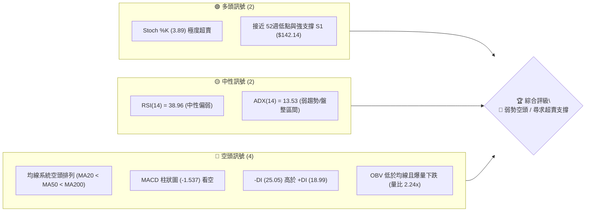
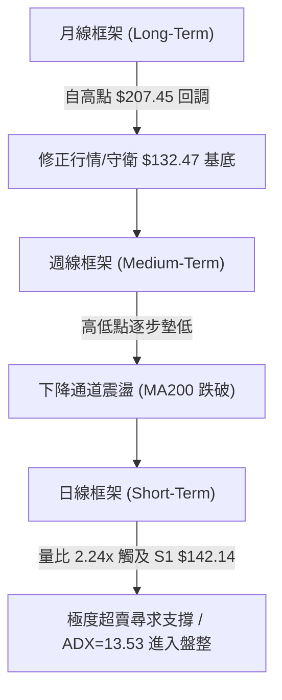
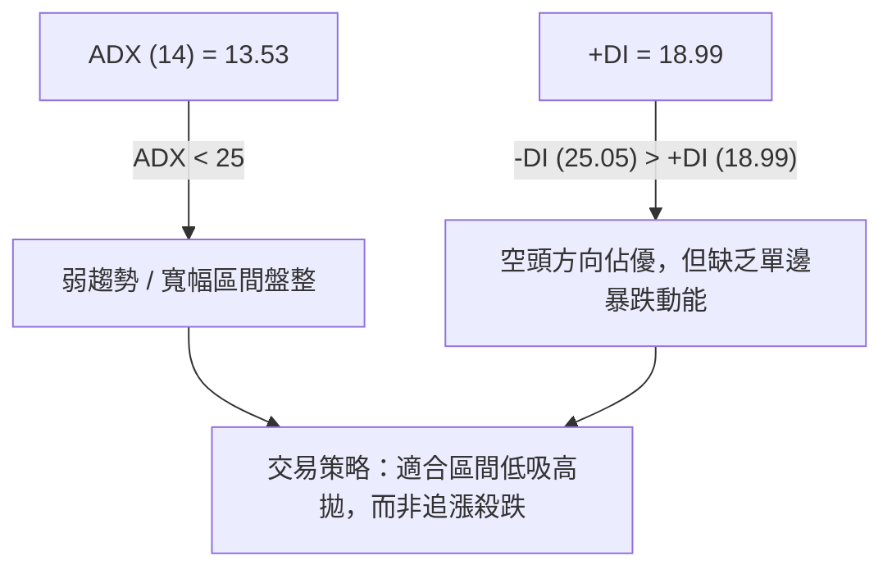
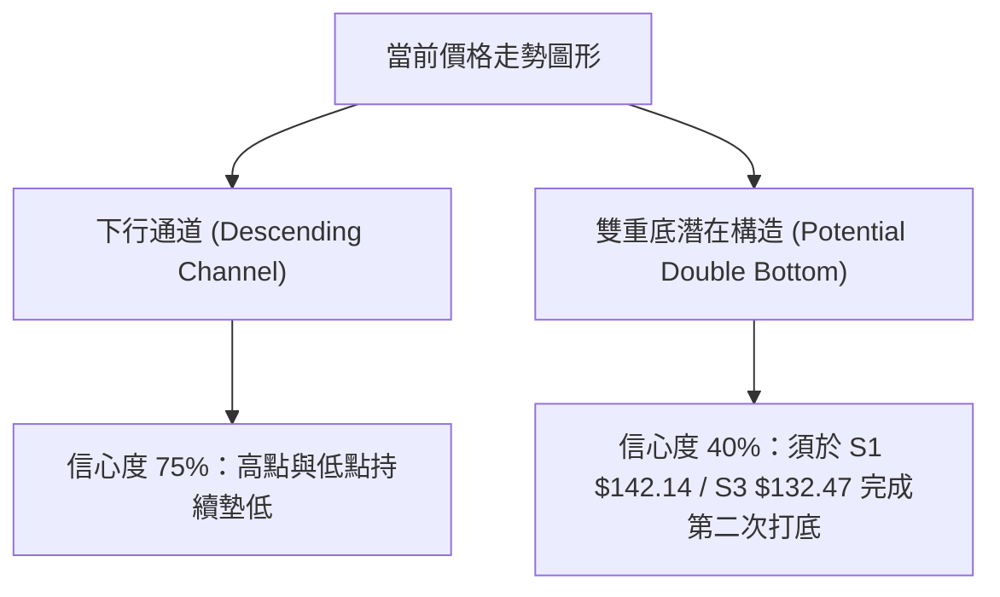
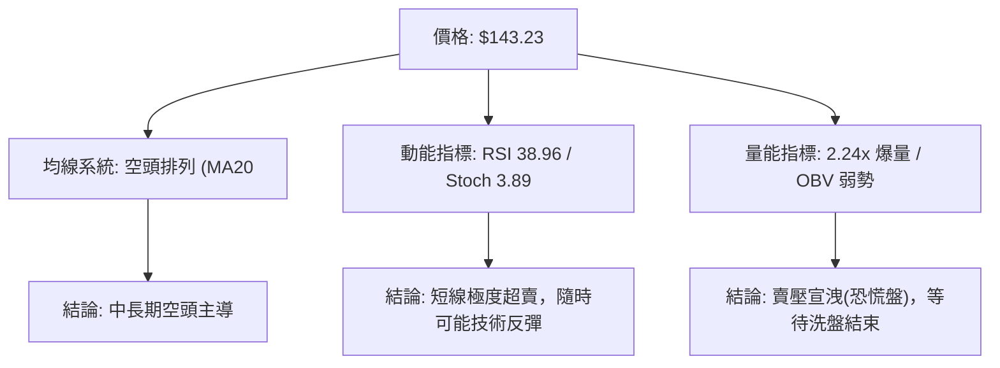
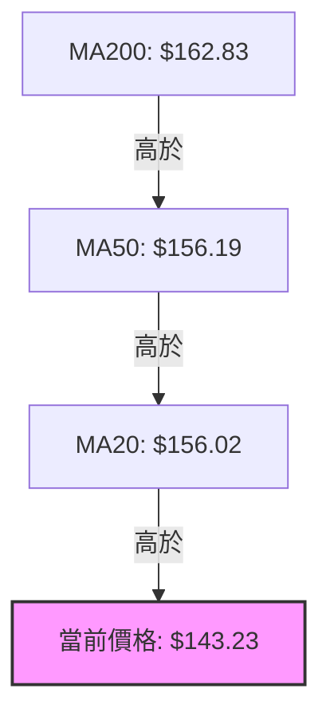
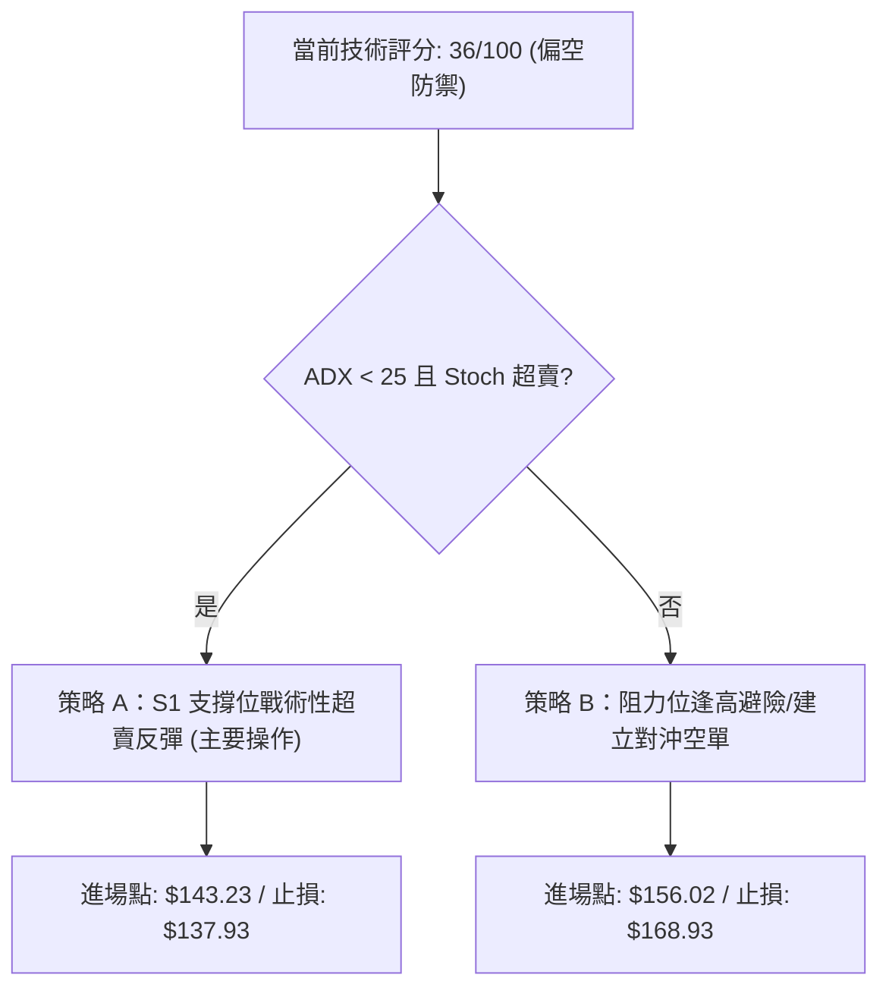
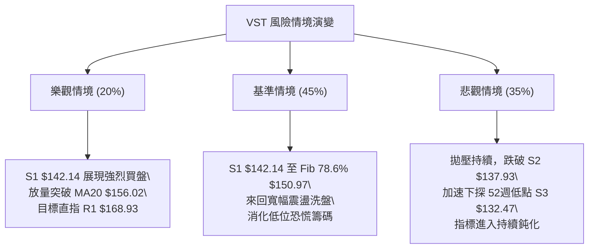

# VST 技術分析報告

> **報告日期**：2026-08-05 ｜ **語言**：繁體中文 ｜ **數據來源**：Yahoo Finance ｜ **當前價格**：$143.23

---

## 目錄

| 章節 | 內容 |
|------|------|
| [1. 技術面概覽](#1-技術面概覽) | 訊號儀表板、核心指標、評分卡 |
| [2. 趨勢分析](#2-趨勢分析) | 多時框趨勢、長中短期走勢 |
| [3. 圖表形態分析](#3-圖表形態分析) | 形態識別、K線組合、目標價 |
| [4. 支撐與阻力](#4-支撐與阻力) | 關鍵價位、斐波那契回調 |
| [5. 技術指標深度解讀](#5-技術指標深度解讀) | MA/RSI/MACD/布林/成交量 |
| [6. 動能與波動率](#6-動能與波動率) | 動能評估、ATR、Beta |
| [7. 多時框架總結](#7-多時框架總結) | 時框架評分矩陣 |
| [8. 交易策略建議](#8-交易策略建議) | 多空策略、風險報酬比 |
| [9. 風險提示與監控](#9-風險提示與監控) | 監控指標、風險場景 |

---

## 1. 技術面概覽

### 🎯 技術訊號儀表板



### 📊 核心指標速覽表

| 指標類別 | 指標名稱 | 當前數值 | 訊號 | 解讀 |
|----------|----------|----------|------|------|
| **價格** | 當前價格 | $143.23 | 🔴 | 位於52週區間 12.4% 處，處於年度極低位 |
| **均線** | MA20 | $156.02 | 🔴 | 價格在 MA20 下方 (-8.20%)，短線偏空 |
| **均線** | MA50 | $156.19 | 🔴 | 價格在 MA50 下方 (-8.29%)，中線承壓 |
| **均線** | MA200 | $162.83 | 🔴 | 價格在 MA200 下方 (-12.04%)，長線轉弱 |
| **動能** | RSI(14) | 38.96 | 🟡 | 接近超賣區（30），動能疲弱但尚未背離 |
| **動能** | MACD | -2.250 | 🔴 | 柱狀圖 -1.537，空頭動能持續擴張 |
| **動能** | Stoch %K | 3.89 | 🟢 | 極度超賣（<20），具備短線反彈技術需求 |
| **趨勢** | ADX(14) | 13.53 | 🟡 | ADX < 25 表示主趨勢不明顯，進入寬幅震盪 |
| **波動** | ATR(14) | $8.50 | 🟡 | 佔股價 5.94%，每日波幅大，需寬止損 |
| **通道** | 布林 %B | 0.05 | 🟢 | 貼近布林下軌 ($141.92)，超賣支撐區 |

### 🏆 技術評分卡

```
╔══════════════════════════════════════════════════════════════════╗
║                 技術評分卡 — VST (2026-08-05)                    ║
╠══════════════════════════════════════════════════════════════════╣
║ 趨勢強度 (ADX)     ████░░░░░░░░░░░░░░░░  20/100  🔴 空頭主導/無主趨勢 ║
║ 動能指標 (RSI/MACD) ██████░░░░░░░░░░░░░░  30/100  🔴 動能低迷/超賣   ║
║ 支撐穩定度 (S1/S2)  ████████████░░░░░░░░  60/100  🟡 臨近歷史強支撐   ║
║ 成交量配合 (OBV)   ████████░░░░░░░░░░░░  40/100  🔴 放量下挫帶恐慌   ║
║ 形態完整度 (通道)  ██████████░░░░░░░░░░  50/100  🟡 震盪下行通道底   ║
║ 均線排列 (MA)      ████░░░░░░░░░░░░░░░░  20/100  🔴 標準空頭排列     ║
╠══════════════════════════════════════════════════════════════════╣
║ 綜合評分           ███████░░░░░░░░░░░░░  36/100  🔴 弱勢防禦區間   ║
╚══════════════════════════════════════════════════════════════════╝
```

---

## 2. 趨勢分析

### 🌐 多時框趨勢分析



### 📈 長期趨勢 — 24個月走勢圖（Unicode）

```
VST 24個月收盤走勢圖（2024-08 至 2026-08）
價格軸 ($)
$215 ┤                                  ● $207.45
$195 ┤                             ●         ● $195.11
$175 ┤                   ●    ●                   ● $173.41
$155 ┤             ●        ●                             ● $160.01
$135 ┤       ●         ●                                       ● $143.23 (現在)
$115 ┤ ●
 $95 ┤
     └─┬────┬────┬────┬────┬────┬────┬────┬────┬────┬────┬────┬───► 時間
      24/08 24/11 25/01 25/04 25/07 25/10 26/01 26/04 26/08
```

**走勢特徵分析表格**：

| 階段 | 時間區間 | 收盤價變動 | 漲跌幅 | 走勢特徵分析 |
|------|----------|------------|--------|--------------|
| 1. 主升段 | 2024-08 ~ 2025-01 | $84.39 ➔ $166.65 | +97.48% | 受益於 AI 算力電力需求，展現極強爆發力 |
| 2. 高位震盪 | 2025-02 ~ 2025-05 | $132.57 ➔ $159.53 | +20.34% | 於 $132.57 建立第一次年度大底後強力反彈 |
| 3. 衝頂階段 | 2025-06 ~ 2025-07 | $192.80 ➔ $207.45 | +7.60% | 創下歷史高點區域，隨後買盤力竭 |
| 4. 派發與修正 | 2025-08 ~ 2026-01 | $188.12 ➔ $157.91 | -16.06% | 高位籌碼派發，均線逐漸轉為平緩下滑 |
| 5. 下降通道震盪 | 2026-02 ~ 2026-08 | $173.41 ➔ $143.23 | -17.40% | 多頭多次反彈受制於 MA20/MA50，目前尋求 S1 支撐 |

### 📊 中期趨勢（週線分析）

近期 20 週數據顯示，VST 呈現顯著的「階梯式震盪下行」特徵。
- **壓力區間**：每當週線反彈至 $163.23 ~ $164.12（接近 61.8% 斐波那契位 $165.49）即遭遇強烈拋壓。
- **支撐區間**：下行過程多次在 $139.48 ~ $147.51 獲得急彈，當前價格 $143.23 再次逼近近一年波段低點聚類 S1（$142.14）。

### ⚡ 趨勢強度評估（ADX 解讀）



| 指標名稱 | 當前數值 | 門檻值 | 行情型態判斷 | 策略應用 |
|----------|----------|--------|--------------|----------|
| **ADX(14)** | 13.53 | < 25.0 | 盤整 / 無單邊趨勢 | 布林通道上下軌區間交易為主 |
| **+DI** | 18.99 | - | 多頭力道偏弱 | 不宜盲目追高 |
| **-DI** | 25.05 | - | 空頭主導短線 | 防禦位突破時須嚴格止損 |

---

## 3. 圖表形態分析

### 🔍 形態識別系統



#### 圖表形態信心度評估表

| 形態類型 | 信心度 | 判斷依據（引用數據） | 完成度 | 目標價（附計算式） |
|----------|--------|----------------------|--------|--------------------|
| **下行通道** | **75%** | 頂點連線受制於 $168.93，低點延伸至 $142.14 | 85% | 下軌延伸目標：S3 **$132.47** |
| **潛在雙重底** | **40%** | 前低 $132.47 (52W Low) 與目前 S1 $142.14 呼應 | 30% | 訊號不足（信心度<50%），僅做指標超賣反彈解讀 |

### 🕯️ 重要 K 線形態分析

| 月份 | 收盤價 | K線形態 | 解讀 | 訊號 |
|------|--------|---------|------|------|
| 2026-05 | $160.01 | 中陽線帶長上影 | 反彈受阻於 MA20 ($156.02)，賣壓沈重 | 🟡 中性轉弱 |
| 2026-06 | $158.63 | 十字星 (Doji) | 多空陷入僵局，動能衰竭 | 🟡 觀望 |
| 2026-07 | $148.19 | 中陰線下破 | 跌破 $150 關卡，空頭掌握主導權 | 🔴 看空 |
| 2026-08 (最新)| $143.23 | 帶量長陰下探 | 探試 S1 $142.14 支撐，爆量 2.24x | 🔴 短線超賣探底 |

### 📉 ASCII 走勢形態示意圖

```
  VST 關鍵下行通道與支撐測試示意圖
  $170.00 ┤  ┌───┐ (布林上軌 $170.12 / R1 $168.93)
          │  │   └─┐
  $156.02 ┤──┼─────┼───● (BB中軌 / MA20 $156.02)
          │  │     └─┐
  $143.23 ┤──┼───────┼───● 現價 $143.23
  $141.92 ┤  │       └───● (BB下軌 $141.92 / S1 $142.14)
  $132.47 ┤  └───────────● (52週低點 S3 $132.47)
```

### 🎯 形態目標價計算

基於「下行通道」之波幅推演：
- 通道上軌壓力：R1 **$168.93**
- 通道下軌支撐：S1 **$142.14**
- **通道高度** = $168.93 - $142.14 = **$26.79**
- 若跌破 S1 ($142.14)，依通道比例測量目標價 = $142.14 - $26.79 = $115.35（唯數據中最近強支撐為 S3 **$132.47**，以此為極限目標）。

---

## 4. 支撐與阻力

### 🗺️ 關鍵價位分布圖（Unicode）

```
VST 價位結構分布圖
════════════════════════════════════════════════════════════
$182.06 ║████████████████████████████████║ 強阻力 R3 (+27.11%)
$177.74 ║████████████████████████        ║ 阻力 R2   (+24.10%)
$168.93 ║████████████████                ║ 關鍵阻力 R1 / MA240 (+17.95%)
$165.49 ║▓▓▓▓▓▓▓▓▓▓▓▓▓▓▓▓                ║ 斐波那契 61.8% 反彈強壓
$156.02 ║▓▓▓▓▓▓▓▓                        ║ MA20 / 布林中軌
$150.97 ║▓▓▓▓                             ║ 斐波那契 78.6% 短線壓力
$143.23 ╠════════════════════════════════╣ ◄ 當前價格 $143.23
$142.14 ║████████████████                ║ 近期波段關鍵支撐 S1 (-0.76%)
$137.93 ║████████████████████████        ║ 強支撐 S2 (-3.70%)
$132.47 ║████████████████████████████████║ 52週最低點強支撐 S3 (-7.51%)
════════════════════════════════════════════════════════════
```

### 🚧 阻力位分析表

| 阻力級別 | 價位 | 形成原因（由 OHLCV 計算） | 突破難度 | 重要性 |
|----------|------|---------------------------|----------|--------|
| **R1** | **$168.93** | 近一年波段高點聚類、MA240 ($168.96) 重疊區 | 🔴 極高 | ★★★★★ |
| **R2** | **$177.74** | 密集成交賣壓區、中期下降趨勢線頂部 | 🔴 高 | ★★★★☆ |
| **R3** | **$182.06** | 歷史解套盤密集區 | 🔴 高 | ★████ |

### 🛡️ 支撐位分析表

| 支撐級別 | 價位 | 形成原因（由 OHLCV 計算） | 守住機率 | 重要性 |
|----------|------|---------------------------|----------|--------|
| **S1** | **$142.14** | 近一年波段低點聚類、貼近布林下軌 ($141.92) | 🟢 中高 (65%) | ★★★★★ |
| **S2** | **$137.93** | 近20週前波反彈起漲點護城河 | 🟡 中等 (55%) | ★★★★☆ |
| **S3** | **$132.47** | 52週歷史最低點（100% 斐波那契退守位） | 🟢 極高 (80%) | ★★★★★ |

### 📐 斐波那契回調位分析

依據 52週區間 **$132.47 (100.0%) ➔ $218.91 (0.0%)** 計算：

| 斐波那契比例 | 價位 | 當前相對位置與解讀 |
|--------------|------|--------------------|
| **0.0%** | $218.91 | 52週最高點，終極多頭目標 |
| **23.6%** | $198.51 | 強勢多頭分水嶺 |
| **38.2%** | $185.89 | 中期回調常態目標 |
| **50.0%** | $175.69 | 多空中軸水準 |
| **61.8%** | $165.49 | 黃金分割防禦位，突破則趨勢反轉 |
| **78.6%** | $150.97 | 當前上方第一道斐波那契壓力位 |
| **100.0%** | $132.47 | 52週最低點，終極回調防線 |

👉 **現價解讀**：當前價格 **$143.23** 落在 **78.6% ($150.97)** 與 **100.0% ($132.47)** 之間的極度深層回調區（回調深度達 88.3%）。技術面上屬於極度超瀉後的強支撐尋求階段。

---

## 5. 技術指標深度解讀

### 🎛️ 指標訊號總覽



### 📈 移動平均線排列分析



- **均線排列狀態**：標準空頭排列（MA20 < MA50 < MA200）。
- **均線偏離度**：價格低於 MA20 達 -8.20%，低於 MA200 達 -12.04%，短線負乖離率較大，具備向 MA20 ($156.02) 回歸修正的乖離修復需求。

### 📉 RSI(14) 分析

- **當前 RSI**：`38.96` █▓░░░░░░░░ (中性偏弱)
- **Stochastic %K/%D**：`%K = 3.89` / `%D = 25.23` (極度超賣)
- **背離診斷**：價格近期連續創下近月新低，RSI同步下行，**無明顯頂背離或底背離**。然 Stoch 降至 3.89 歷史低位區，顯示短線下殺動能已過度透支。

### 📊 MACD(12,26,9) 訊號解讀

- **MACD 線**：-2.250
- **Signal 線**：-0.713
- **MACD 柱狀圖**：-1.537 🔴 (看空)
- **解讀**：MACD 快慢線雙雙位於零軸下方，且柱狀圖負值持續擴大，表明中短期空頭力道強勁，尚未出現黃金交叉底背離訊號。

### 📦 布林通道分析

```
布林通道現狀示意圖：
上軌 (Upper Band) : $170.12 ──────────────────────────────
中軌 (MA20)       : $156.02 ──────────────────────────────
現價 (Current Price): $143.23 ───► [%B = 0.05]
下軌 (Lower Band) : $141.92 ──────────────────────────────
```

- **通道位置**：%B 為 0.05，顯示價格極度貼近布林下軌（$141.92），屬於通道底部的超賣邊界，隨時有觸軌反彈至中軌 ($156.02) 的傾向。

### 💹 成交量分析（量價配合度）

- **最新成交量**：9,928,378 股
- **20日均量**：4,439,864 股（**量比 2.24x**）
- **解讀**：當前價格下跌伴隨 2.24 倍的巨量，屬典型的「低位恐慌洗盤量（Capitulation）」。若未來 1-2 個交易日量能縮減並守住 S1 ($142.14)，將確立為階段性賣壓宣洩完畢的底部。

---

## 6. 動能與波動率

### ⚡ 動能評估四象限

| 象限 | 動能狀態 | 波動率狀態 | VST 當前歸屬 | 戰略建議 |
|------|----------|------------|--------------|----------|
| **Q1** | 強動能 | 低波動 | — | 最佳趨勢持有期 |
| **Q2** | 弱動能 | 低波動 | — | 靜待突破 |
| **Q3** | 強動能 | 高波動 | — | 追漲殺跌高風險 |
| **Q4** | **弱動能** | **高波動** | **✓ (VST 當前區域)** | **超賣區低吸、嚴設止損** |

### 📊 ATR 波動率分析

- **ATR(14)**：$8.50（佔股價 5.94%）
- **風控止損距離建議**：
  - **短線交易 (1.5x ATR)**：$8.50 × 1.5 = **$12.75**
  - **波段交易 (2.0x ATR)**：$8.50 × 2.0 = **$17.00**

### 📐 Beta 與市場相關性

- **Beta 係數**：1.433
- **解讀**：VST 的波動度高於大盤（S&P 500）43.3%。大盤若出現回調，VST 下挫幅度通常更大；反之，大盤反彈時其彈升力道亦極為強勁。

---

## 7. 多時框架總結

### 📋 時框架評分表

| 時框架 | 趨勢方向 | 動能指標 | 均線排列 | 形態結構 | 綜合評分 | 建議 |
|--------|----------|----------|----------|----------|----------|------|
| **月線** | 🟡 偏多回調 | 中性 (45) | 多頭受挫 | 守護高位箱體 | **55/100** | 長線逢低分批 |
| **週線** | 🔴 空頭控盤 | 偏弱 (35) | 下滑破位 | 下行通道中段 | **35/100** | 中線等待築底 |
| **日線** | 🔴 弱勢超賣 | 極弱 (20) | 空頭排列 | 測試 S1 支撐 | **30/100** | 短線尋求反彈 |

### 🔲 綜合訊號矩陣

```
時框一致性矩陣：
短期 (日線) ──► 🔴 空頭超賣 ──┐
中期 (週線) ──► 🔴 空頭下行 ──┼──► 總體收斂結論：🔴 偏空震盪盤整（守 S1 尋求技術反彈）
長期 (月線) ──► 🟡 長線修正 ──┘
```

### ⚖️ 多時框收斂結論

依據多時框收斂規則：當前 ADX(14) = 13.53 (<25)，市場處於**盤整/弱趨勢行情**。
主導邏輯以**日線布林通道上下軌 ($141.92 ~ $170.12) 與關鍵支撐/阻力區間**為核心。雖然中長期均線呈空頭排列，但由於日線指標（Stoch %K = 3.89、布林 %B = 0.05）展現極度超賣，行情正處於「下軌尋求支撐、蓄積波段反彈」的關鍵節點。因此，整體決策採取**防禦性區間操作策略**。

---

## 8. 交易策略建議

### 🗺️ 策略決策流程圖



### 🧭 策略路由

> **當前主策略方向 = 偏空防禦與超賣區間戰術低吸（依評分 36/100）**

### 🎯 價格情境階梯 (Price Scenarios)

| 觸發條件 | 下一目標 | 後續延伸 | 情境含義 |
|----------|----------|----------|----------|
| **突破 R1 $168.93** | R2 $177.74 | R3 $182.06 | 中期趨勢全面轉強，多頭反攻 |
| **突破 Fib 78.6% $150.97**| MA20 $156.02 | Fib 61.8% $165.49 | 短線超賣修復，挑戰中軌 |
| **守住 S1 $142.14** | $150.97 | $156.02 | 區間震盪築底（目前基準情境） |
| **跌破 S1 $142.14** | S2 $137.93 | S3 $132.47 | 空頭續跌，探試年度最低點 |

### 📊 情境機率分佈

```
情境機率分佈：
1. 守住 S1 / 超賣反彈  [████████████████████] 45% (Stoch 3.89 極度超賣、布林下軌支撐)
2. 跌破 S1 探試 S2/S3   [███████████████     ] 35% (MA 空頭排列、MACD 負向擴張)
3. 直接突破 R1 強勢反轉 [███████             ] 20% (需要強大產業利多催化)
```

### 🟢 主策略詳情

#### 策略 A：S1 支撐位戰術性低吸反彈（偏多/區間操作）

- **進場條件**：當前價位或回踩 S1 ($142.14) 獲支撐且量縮
- **進場價格**：**$143.23**（當前價位）或 **$142.14** (S1)
- **目標價 T1**：**$150.97**（斐波那契 78.6% 壓力）
- **目標價 T2**：**$156.02**（MA20 / 布林中軌）
- **止損價格**：**$137.93**（跌破 S2 止損離場）
- **風險報酬比**：
  - 至 T1：($150.97 - $143.23) / ($143.23 - $137.93) = $7.74 / $5.30 = **1.46 : 1**
  - 至 T2：($156.02 - $143.23) / ($143.23 - $137.93) = $12.79 / $5.30 = **2.41 : 1**
- **勝率估計**：55%
- **建議倉位**：10% - 15%（戰術性試錯輕倉）

#### 策略 B：MA20 阻力位逢高避險/對沖（空頭主策略）

- **進場條件**：價格反彈至 MA20/BB中軌 附近遇阻回落
- **進場價格**：**$156.02**（MA20 / BB中軌）
- **目標價 T1**：**$142.14** (S1)
- **目標價 T2**：**$132.47** (S3 52週低點)
- **止損價格**：**$168.93** (R1 阻力突破止損)
- **風險報酬比**：
  - 至 T1：($156.02 - $142.14) / ($168.93 - $156.02) = $13.88 / $12.91 = **1.08 : 1**
  - 至 T2：($156.02 - $132.47) / ($168.93 - $156.02) = $23.55 / $12.91 = **1.82 : 1**
- **勝率估計**：60%
- **建議倉位**：15% - 20%

### 🔴 反向風險觸發點（對沖提示）

- 若價格無量**跌破 S2 ($137.93)**：多頭策略 A 必須立即無條件止損，順勢尋求 $132.47 (S3) 的對沖保護。
- 若價格帶量**突破 R1 ($168.93)**：空頭避險單必須全數清場，代表中期下降通道宣告失效。

### ⭐ 整體訊號強度評星

```
做多訊號強度：  ★★☆☆☆  (2/5星 — 僅憑超賣與強支撐進行戰術反彈)
做空訊號強度：  ★★★☆☆  (3/5星 — 均線與 MACD 指向空頭，但受限於 ADX 弱趨勢)
整體可信度：    ★★★☆☆  (3/5星 — 區間震盪特徵明顯)
```

---

## 9. 風險提示與監控

### ✅ 關鍵監控指標 Checklist

```
╔══════════════════════════════════════════════════════════════════╗
║                     每日技術面監控清單 (Checklist)               ║
╠══════════════════════════════════════════════════════════════════╣
║ [ ] 價格是否有效守住 S1 ($142.14) 支撐位？                       ║
║ [ ] 成交量是否從 2.24x 高位回落至 20日均量 ($4.44M) 以下？       ║
║ [ ] Stochastic %K 是否在 20 以下形成金叉向上？                   ║
║ [ ] MACD 柱狀圖 (-1.537) 是否開始抽收（負值縮小）？              ║
║ [ ] 價格向上反彈時能否順利站上 Fib 78.6% ($150.97)？             ║
╚══════════════════════════════════════════════════════════════════╝
```

### ⚠️ 風險場景分析



### 🛡️ 風險管理重要提醒

1. **嚴禁高槓桿操作**：VST 目前 ATR 高達 $8.50 (5.94%)，單日波動劇烈，槓桿過高極易觸發無謂止損。
2. **倉位管理**：鑑於技術評分為 36/100，整體持倉比例應控制在總資金的 **20% 以內**，保留充沛現金。
3. **止損紀律**：不論採取何種策略，跌破 S2 (**$137.93**) 或突破 R1 (**$168.93**) 均為無條件執行風控的紅線。

---

## 📋 報告總結

```
╔══════════════════════════════════════════════════════════════════╗
║                  VST 技術分析報告總結                            ║
╠══════════════════════════════════════════════════════════════════╣
║ 報告日期：2026-08-05                                             ║
║ 當前價格：$143.23                                                 ║
║ 分析評級：🔴 弱勢空頭 / 超賣尋求支撐                             ║
║                                                                  ║
║ 關鍵結論：                                                       ║
║ ├─ 長期趨勢：🟡 偏多回調（高位修正，守衛 $132.47 基底）          ║
║ ├─ 中期趨勢：🔴 空頭控盤（下降通道，受到 MA200 壓制）            ║
║ ├─ 短期趨勢：🔴 弱勢超賣（爆量 2.24x 下探 S1 $142.14）            ║
║ ├─ 關鍵支撐：S1 $142.14 / S2 $137.93 / S3 $132.47                 ║
║ ├─ 關鍵阻力：R1 $168.93 / R2 $177.74 / R3 $182.06                 ║
║ └─ 分析師目標：$221.61 (Mean Target，基本面長線看好)             ║
║                                                                  ║
║ 最優策略組合：                                                   ║
║ 1. 🥇 首選策略：於 $142.14 - $143.23 戰術輕倉試多，止損 $137.93，   ║
║                目標 $150.97 / $156.02。                          ║
║ 2. 🥈 次選策略：若反彈至 MA20 ($156.02) 遇阻，建立對沖防衛空單， ║
║                目標 $142.14，止損 $168.93。                      ║
╚══════════════════════════════════════════════════════════════════╝
```

---

> ⚠️ **免責聲明**：本報告為 AI 自動生成之技術分析，所有數據及估算均基於提供的歷史價格資訊。本報告**僅供研究與學術參考**，**不構成任何投資建議**。投資有風險，入市需謹慎。

---

*報告生成時間：2026-08-05 ｜ 數據來源：Yahoo Finance ｜ 分析框架：多時框技術分析*