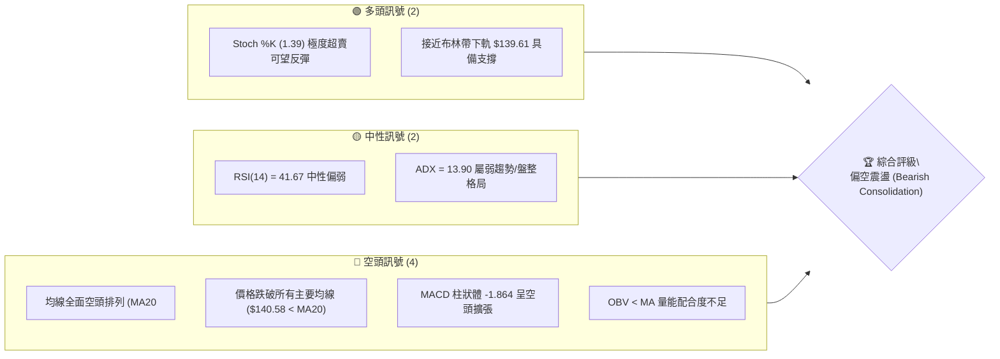
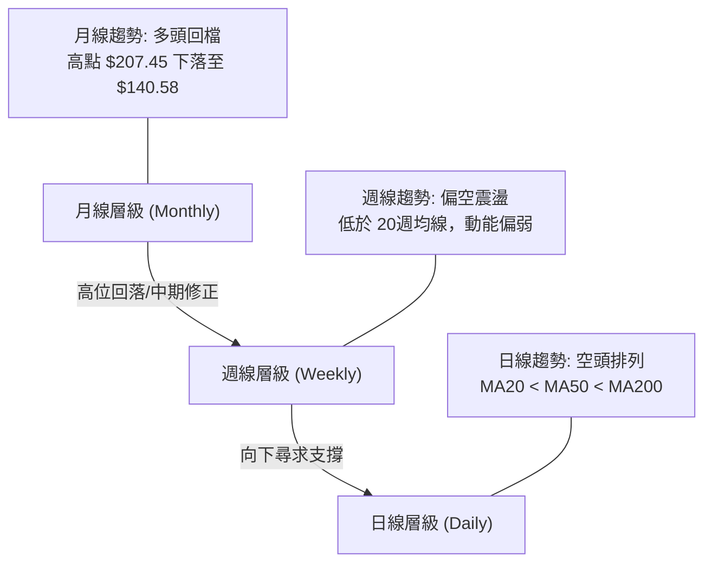
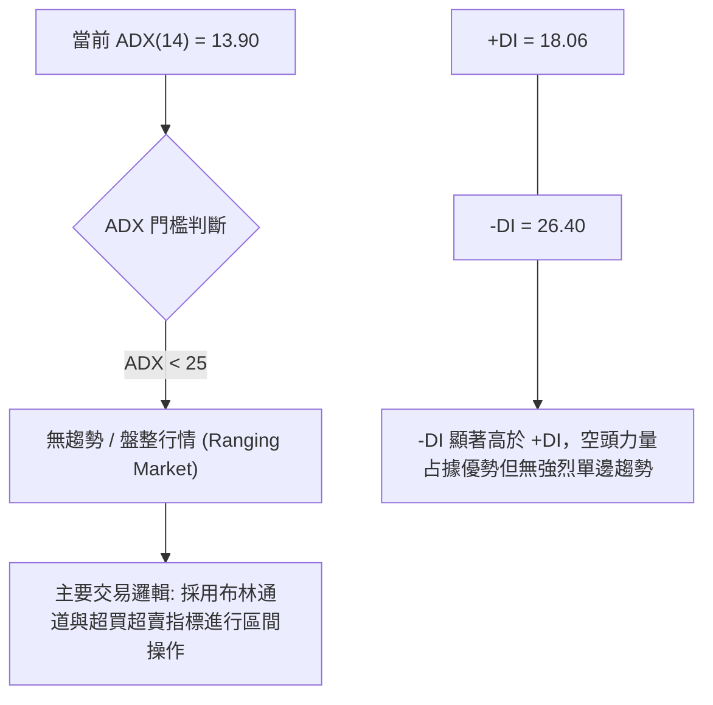
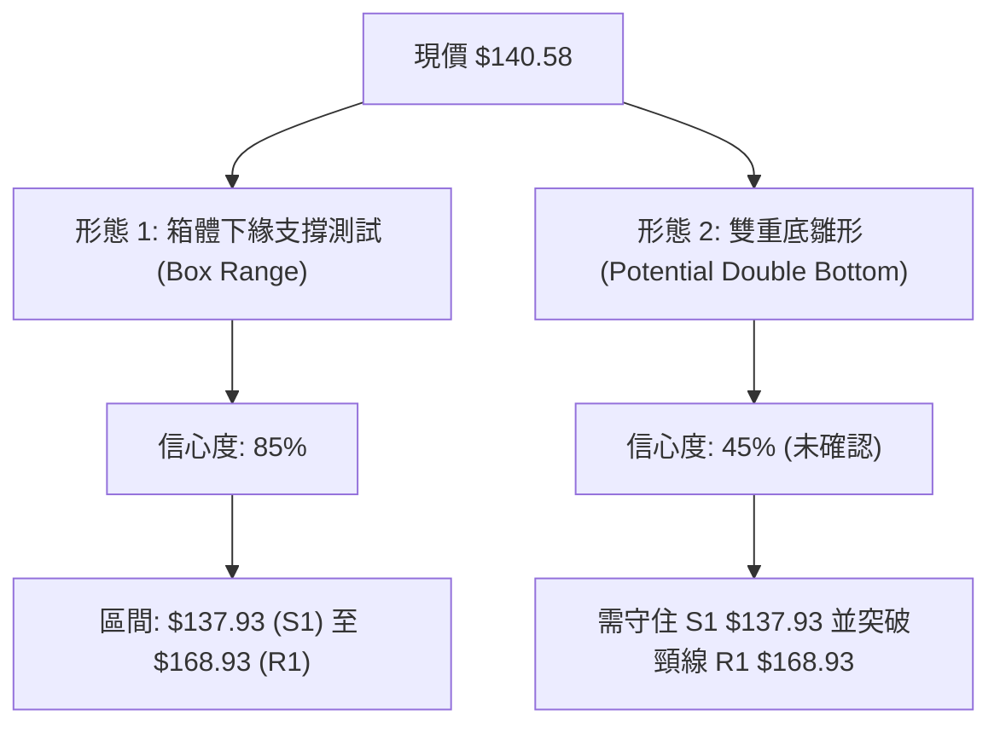
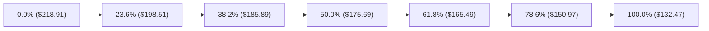
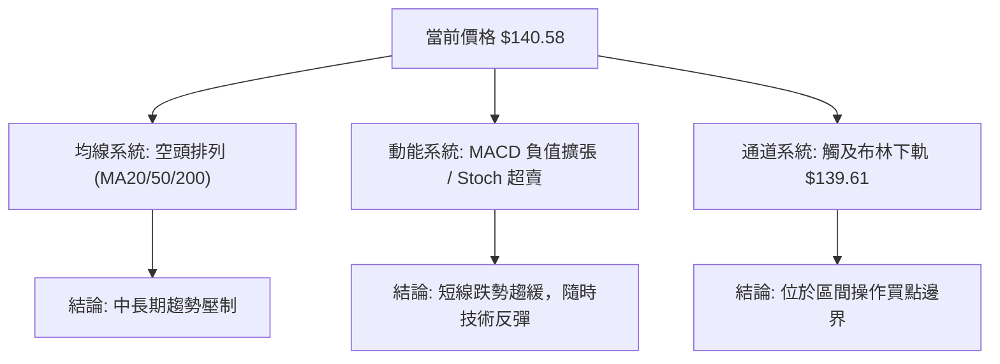
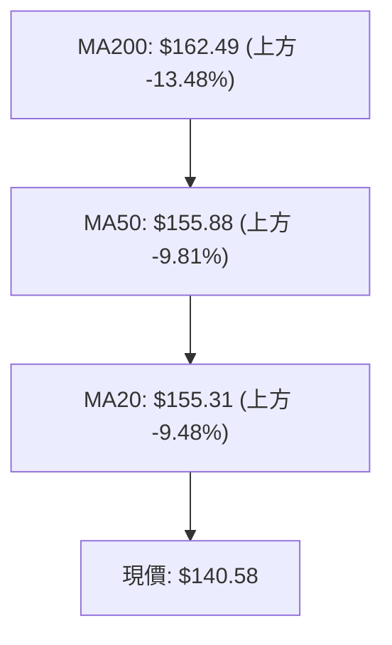
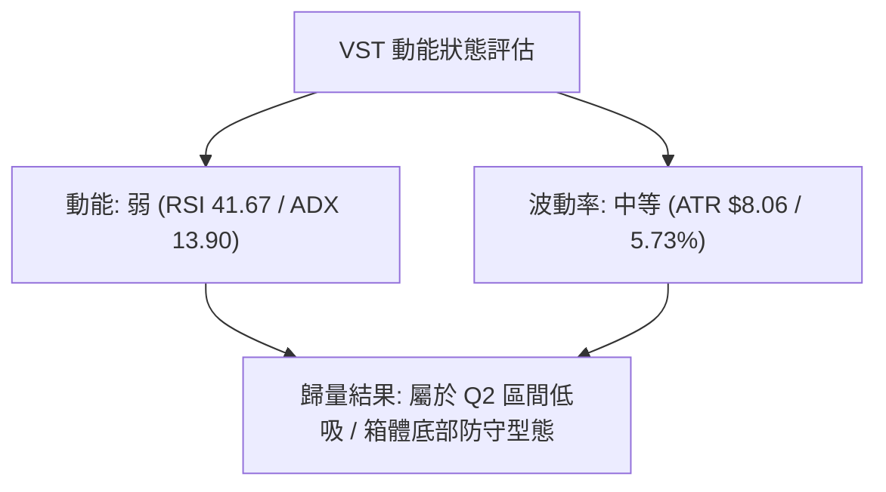
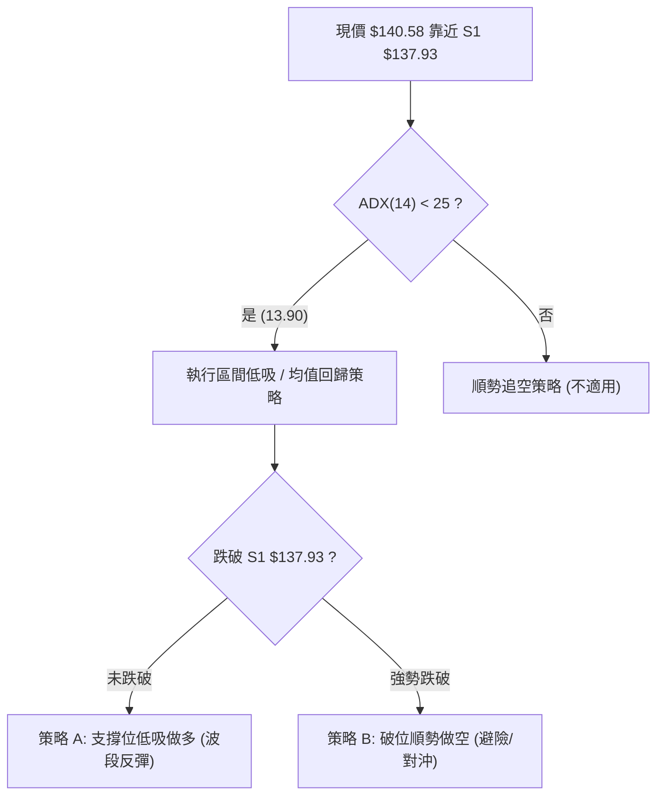
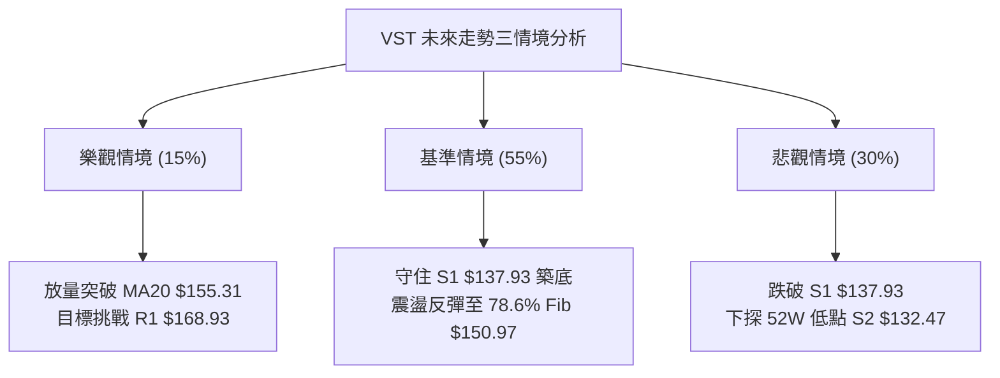

# VST 技術分析報告

> **報告日期**：2026-08-06 ｜ **語言**：繁體中文 ｜ **數據來源**：Yahoo Finance ｜ **當前價格**：$140.58

---

## 目錄

| 章節 | 內容 |
|------|------|
| [1. 技術面概覽](#1-技術面概覽) | 訊號儀表板、核心指標、評分卡 |
| [2. 趨勢分析](#2-趨勢分析) | 多時框趨勢、長中短期走勢 |
| [3. 圖表形態分析](#3-圖表形態分析) | 形態識別、K線組合、目標價 |
| [4. 支撐與阻力](#4-支撐與阻力) | 關鍵價位、斐波那契回調 |
| [5. 技術指標深度解讀](#5-技術指標深度解讀) | MA/RSI/MACD/布林/成交量 |
| [6. 動能與波動率](#6-動能與波動率) | 動能評估、ATR、Beta |
| [7. 多時框架總結](#7-多時框架總結) | 時框架評分矩陣 |
| [8. 交易策略建議](#8-交易策略建議) | 多空策略、風險報酬比 |
| [9. 風險提示與監控](#9-風險提示與監控) | 監控指標、風險場景 |

---

## 1. 技術面概覽

### 🎯 技術訊號儀表板



### 📊 核心指標速覽表

| 指標類別 | 指標名稱 | 當前數值 | 訊號 | 解讀 |
|----------|----------|----------|------|------|
| **價格** | 當前價格 | $140.58 | 🔴 空頭 | 位於 52 週區間底部 9.4% 位置，承壓嚴重 |
| **均線** | MA20 | $155.31 | 🔴 空頭 | 價格位於 MA20 下方 -9.48%，短線壓力顯著 |
| **均線** | MA50 | $155.88 | 🔴 空頭 | 價格位於 MA50 下方 -9.81%，中期走勢偏弱 |
| **均線** | MA200 | $162.49 | 🔴 空頭 | 價格位於 MA200 下方 -13.48%，長期牛熊分界失守 |
| **動能** | RSI(14) | 41.67 | 🟡 中性 | 無明顯背離，動能弱勢但未達極度超賣區 |
| **動能** | Stoch %K/%D | 1.39 / 18.41 | 🟢 多頭 | 隨機指標進入極度超賣區，短線隨時技術性反彈 |
| **趨勢** | ADX(14) | 13.90 | 🟡 中性 | ADX < 25 表示當前為無趨勢盤整行情，-DI (26.40) 主導 |
| **動能** | MACD | -3.043 | 🔴 空頭 | DIF 與 Signal 均位於零軸下方，雙線開口向下 |
| **波動** | 布林 %B | 0.03 | 🟢 多頭 | 價格極度貼近下軌 $139.61，區間操作存在觸底反彈機會 |
| **波動** | ATR(14) | $8.06 | 🟡 中性 | 日均波幅 5.73%，波動率處於中等水平 |
| **量能** | 成交量比 | 1.18x | 🔴 空頭 | 當日成交量 5.45M 高於 20 日均量，下瀉伴隨微幅放量 |

### 🏆 技術評分卡

╔══════════════════════════════════════════════════════════════════╗
║                   VST 技術指標綜合評分卡                          ║
╠══════════════════════════════════════════════════════════════════╣
║ 趨勢強度 (ADX)     ▓▓▓▓▓░░░░░░░░░░░░░░░  28/100  🟡 中性盤整  ║
║ 動能指標 (RSI/MACD) ▓▓▓▓██░░░░░░░░░░░░░░░  32/100  🔴 動能疲弱  ║
║ 支撐穩定度 (S1/S2)  ▓▓▓▓▓▓▓▓▓▓▓▓░░░░░░░░  60/100  🟢 接近硬支撐║
║ 成交量配合 (OBV)   ▓▓▓▓▓▓░░░░░░░░░░░░░░  30/100  🔴 量能背離  ║
║ 形態完整度 (BB/Fib) ▓▓▓▓▓▓▓▓░░░░░░░░░░░░  42/100  🟡 區間下軌  ║
║ 均線排列 (MA System)▓▓░░░░░░░░░░░░░░░░░░  10/100  🔴 完全空頭  ║
╠══════════════════════════════════════════════════════════════════╣
║ 綜合技術評分       ▓▓▓▓▓▓▓░░░░░░░░░░░░░  34/100  🔴 弱勢偏空  ║
╚══════════════════════════════════════════════════════════════════╝

---

## 2. 趨勢分析

### 🌐 多時框趨勢分析



### 📈 長期趨勢 — 24個月走勢圖（Unicode）

```
VST 24個月歷史價格走勢圖 ($)
$210 ┤                                      ● (2025-07: 207.45)
$195 ┤                                 ●   ●
$180 ┤                            ●       ●   ●
$165 ┤               ●        ●                   ●
$150 ┤          ●         ●                            ●
$135 ┤     ●         ●                                      ● (2026-08: 140.58)
$120 ┤●
$105 ┤
 $90 ┤
      └─┬───┬───┬───┬───┬───┬───┬───┬───┬───┬───┬───┬───┬───┬───┬───► 月份
       24/08 10  12 25/02 04  06  08  10  12 26/02 04  06  08
```

#### 走勢特徵分析表格

| 階段 | 時間區間 | 起始/結束價 | 漲跌幅 | 走勢特徵分析 |
|------|----------|-------------|--------|--------------|
| **第 1 主升段** | 2024-08 ～ 2025-01 | $84.39 → $166.65 | +97.48% | 電力與 AI 數據中心需求題材強烈驅動，強勢突破。 |
| **高位箱體** | 2025-02 ～ 2025-04 | $132.57 → $128.79 | -2.85% | 劇烈洗盤，回測 $132.47 近一年低點區域後獲得支撐。 |
| **第 2 主升段** | 2025-05 ～ 2025-07 | $159.53 → $207.45 | +30.04% | 創下歷史新高群，最高觸及 52 週高點 $218.91。 |
| **高位派發** | 2025-08 ～ 2025-11 | $188.12 → $178.12 | -5.32% | 高檔震盪派發，高點逐步降低，獲利結利賣壓浮現。 |
| **中期修正段** | 2025-12 ～ 2026-08 | $160.88 → $140.58 | -12.62% | 均線轉為空頭排列，緩步震盪盤跌，目前探至 52週低點邊緣。 |

### 📊 中期趨勢（週線分析）

近 20 週數據顯示，VST 呈現強烈的「寬幅區間震盪跌勢」特徵：
* **高點降低（Lower Highs）**：從 2026 年 4 月下旬高點 $164.12、6 月下旬高點 $163.52、7 月下旬高點 $163.38，三次嘗試衝高均受阻於 $163.50～$165.00 區域（接近 61.8% 斐波那契回調位 $165.49）。
* **低點尋求支撐（Lower Lows）**：5 月中旬探低至 $139.48 後強勢反彈，目前 8 月初再度回落至 $140.58，正重新測試 S1 支撐位 ($137.93)。

### ⚡ 趨勢強度評估（ADX 解讀）



| 指標 | 數值 | 狀態 | 交易含義 |
|------|------|------|----------|
| **ADX** | 13.90 | 弱趨勢 (<25) | 不宜使用順勢突破策略，追空風險極高，適合尋找區間下軌反彈。 |
| **+DI** | 18.06 | 多頭動能衰退 | 多頭缺乏主導市場的能力。 |
| **-DI** | 26.40 | 空頭優勢 | 賣方掌控盤面，但未觸發強烈單邊崩跌。 |

---

## 3. 圖表形態分析

### 🔍 形態識別系統



#### 形態信心度與目標價評估表

| 形態名稱 | 信心度 | 判斷依據（引用數據） | 完成度 | 目標價計算式與精確數值 |
|----------|--------|----------------------|--------|------------------------|
| **大型箱體震盪** | **85%** | 價格多次在 S1 ($137.93) 獲支撐，並在 R1 ($168.93) 受阻；ADX=13.90 確認無單邊趨勢 | 90% | 箱體下軌：$137.93<br/>箱體上軌：$168.93 |
| **潛在雙重底** | **45%** | 2026-05-17 低點 $139.48 與當前 $140.58 形成潛在雙底；但尚未出現打底完成訊號 | 35% | 訊號不足（信心度<50%），依規則不強制給出突破目標價，僅作區間看待 |
| **布林帶下軌擠壓** | **75%** | 布林帶 %B = 0.03，價格 $140.58 貼近下軌 $139.61 | 85% | 均值回歸目標：BB 中軌 (MA20) = $155.31 |

### 🕯️ 重要 K 線形態分析

| 日期/週期 | 收盤價 | K線形態 | 解讀 | 訊號 |
|-----------|--------|---------|------|------|
| **2026-05-17 (週)** | $139.48 | 長下影錘子線 | 價格回測 $139.48 後大舉反彈，證明 $137.93～$139.50 具備極強買盤支撐 | 🟢 多頭反彈 |
| **2026-06-28 (週)** | $163.49 | 高檔長上影十字星 | 衝高至 $163.50 上方遭強烈拋壓擊退，確認 $165.00～$168.93 為堅固阻力區 | 🔴 空頭阻力 |
| **2026-08-09 (週/當前)** | $140.58 | 中陰線下尋支撐 | 連續兩週收陰，價格再次壓低至箱體底部，測試買盤承接力 | 🔴 短線偏空 |

### 📉 ASCII 走勢形態示意圖

```
VST 箱體震盪與關鍵位示意圖
$168.93 ┤───────────────────────────● (R1 阻力位 / 箱體上軌)
        │                          / \
$155.31 ┤─────────(MA20 / 中軌)───/───\───────────────
        │                        /     \
$140.58 ┤───────────────────────/───────● (現價 $140.58)
$137.93 ┤───────●──────────────/ (S1 支撐位 / 箱體下軌)
        └───────┴─────────────┴─────────────────────► 時間
             2026-05-17      2026-08-06
```

---

## 4. 支撐與阻力

### 🗺️ 關鍵價位分布圖（Unicode）

```
VST 關鍵價位分布圖 ($)
════════════════════════════════════════════════════════════
$218.91 ║██████████████████████████████████████║ 52W High (0.0% Fib)
$182.06 ║██████████████████████████            ║ 強阻力 R3 (+29.50%)
$177.74 ║██████████████████████                ║ 阻力 R2 (+26.44%)
$168.93 ║██████████████████                    ║ 關鍵阻力 R1 (+20.17%)
$165.49 ║▓▓▓▓▓▓▓▓▓▓▓▓▓▓▓▓                      ║ 61.8% Fib 回調位
$155.31 ║──────────────────────────────────────║ MA20 / 布林中軌
$150.97 ║▓▓▓▓▓▓▓▓▓▓▓                           ║ 78.6% Fib 回調位
$140.58 ╠══════════════════════════════════════╣ ◄ 現價 ($140.58)
$139.61 ║--------------------------------------║ 布林通道下軌
$137.93 ║████████████                          ║ 關鍵支撐 S1 (-1.88%)
$132.47 ║██████████████████████████████████████║ 強支撐 S2 / 52W Low (100.0% Fib)
════════════════════════════════════════════════════════════
```

### 🚧 阻力位分析表

| 阻力級別 | 精確價位 | 形成原因 | 突破難度 | 重要性 |
|----------|----------|----------|----------|--------|
| **R1** | **$168.93** | 近一年波段高點聚類、接近 MA240 ($168.74) | 🔴 極高 | 關鍵箱體上軌，突破代表大結構轉強 |
| **R2** | **$177.74** | 波段密集成交解套區 | 🔴 高 | 中期多頭推進的第二目標位 |
| **R3** | **$182.06** | 近一年歷史高檔拋壓聚類區 | 🔴 極高 | 多頭強烈阻力關卡 |

### 🛡️ 支撐位分析表

| 支撐級別 | 精確價位 | 形成原因 | 守住機率 | 重要性 |
|----------|----------|----------|----------|--------|
| **S1** | **$137.93** | 近一年波段低點聚類，與當前布林下軌 $139.61 共振 | 🟢 70% | 短線多頭防線，不容有失 |
| **S2** | **$132.47** | 52 週最低點，斐波那契 100.0% 完全回調位 | 🟢 85% | 終極長線硬支撐，破位將引發結構性止損 |

### 📐 斐波那契回調位分析

依據 52 週高低點範圍（高點 **$218.91** → 低點 **$132.47**，極差 $86.44）導出的斐波那契階梯：



* **現價位置解讀**：當前價格 **$140.58** 落於 **78.6% ($150.97)** 與 **100.0% ($132.47)** 之間。
* **技術意涵**：價格已回吐整波漲幅的 78.6% 以上，屬於極度深度的技術性修正。歷史經驗顯示，當股價運行於 78.6% 至 100.0% 之間且 ADX < 25 時，向下空間受限於 S2 ($132.47)，向上反彈修正至 78.6% ($150.97) 或 MA20 ($155.31) 的機率較高。

---

## 5. 技術指標深度解讀

### 🎛️ 指標訊號總覽



### 📈 移動平均線排列分析



* **均線狀態**：MA20 ($155.31) < MA50 ($155.88) < MA200 ($162.49)，為標準的**空頭排列**。
* **乖離率分析**：現價相較於 MA20 負乖離率達 **-9.48%**，相較於 MA240 ($168.74) 達 **-16.69%**。負乖離已擴大至近期高點，具備均值回歸（Mean Reversion）拉回 MA20 的修正需求。

### 📉 RSI(14) 與隨機指標分析

* **RSI(14)**：當前數值 **41.67**（█████████░░░░░░░░░░░ 41.67%）。
  * 位於 30～50 之偏弱區間，無頂背離或底背離跡象。
* **Stochastic %K / %D**：**1.39 / 18.41**。
  * %K 低於 20 極度超賣區，並出現觸底姿態，發出極強烈的**短線超賣反彈訊號** 🟢。

### 📊 MACD(12,26,9) 訊號解讀

* **DIF**：-3.043
* **Signal**：-1.179
* **MACD Hist**：-1.864 🔴
* **解讀**：MACD 位於零軸下方且柱狀圖呈負向擴張，顯示短期拋售壓力仍在釋放，尚未出現 MACD 綠柱縮短或金叉的轉強訊號，操作上不可過早盲目抄底。

### 📦 布林通道分析

```
VST 布林通道架構 (Daily)
$171.01 ┤───────────────────────────────── BB 上軌
        │
$155.31 ┤───────────────────────────────── BB 中軌 (MA20)
        │
$140.58 ┤─────────────────●               現價 (BB %B = 0.03)
$139.61 ┤───────────────────────────────── BB 下軌
```

* **%B 指標**：0.03。現價幾乎貼平布林通道下軌 ($139.61)。
* **通道特性**：在 ADX = 13.90 的盤整行情中，價格觸及布林下軌通常為優質的**低吸博反彈**位置，目標看至中軌 $155.31。

### 💹 成交量分析（量價配合度）

* **最新成交量**：5,452,102 股，高於 20 日均量 (4,610,915 股)，量比 **1.18x**。
* **OBV 趨勢**：OBV 指標低於其均線，顯示資金流出大於流入，量能未提供多頭回升的正面確認。

---

## 6. 動能與波動率

### ⚡ 動能評估四象限

| 象限 | 動能強度 | 波動率 | 當前 VST 狀態 | 技術評估 |
|------|----------|--------|---------------|----------|
| **Q1** | 強 (High) | 低 (Low) | — | 最佳順勢突破區 |
| **Q2** | 弱 (Low) | 低 (Low) | **✓ 當前位置** | **低動能+中低波動：區間震盪打底階段** |
| **Q3** | 強 (High) | 高 (High) | — | 恐慌拋售/急漲爆發區 |
| **Q4** | 弱 (Low) | 高 (High) | — | 無序劇烈震盪區 |



### 📊 ATR 波動率分析

* **ATR(14)**：**$8.06**（佔股價 5.73%）。
* **止損與風控點位設定建議**：
  * **1.0x ATR** = $8.06（超短線噪音區）
  * **1.5x ATR** = $12.09（標準止損距離）
  * **2.0x ATR** = $16.12（波段容忍極限）

### 📐 Beta 與市場相關性

* **Beta 係數**：**1.433**。
* **解讀**：VST 屬高 Beta 電力股（受 AI 數據中心能源需求高彈性驅動），波動度比大盤高出 43.3%。當大盤反彈時，VST 具備更高的彈性攻幅。

---

## 7. 多時框架總結

### 📋 時框架評分表

| 時框架 | 趨勢方向 | 動能指標 | 均線排列 | 形態結構 | 綜合評分 | 交易建議 |
|--------|----------|----------|----------|----------|----------|----------|
| **日線 (Daily)** | 🔴 偏空 | 🟢 超賣 | 🔴 空頭 | 🟢 觸及布林下軌 | **38/100** | 逢低短多 / 嚴設止損 |
| **週線 (Weekly)** | 🟡 盤整 | 🟡 中性 | 🔴 低於MA20 | 🟡 箱體震盪底部 | **42/100** | 區間操作 |
| **月線 (Monthly)** | 🟢 多頭回檔| 🟡 中性 | 🟢 守住關鍵 Fib | 🟢 大長線多頭回調 | **65/100** | 長線分批布局 |

### 🔲 綜合訊號矩陣

```
                     短 線 訊 號 (日線)
                多 頭 (Bullish)   空 頭 (Bearish)
             ┌─────────────────┬─────────────────┐
中  多 頭    │  強力加碼買進   │ 🟢 箱體低吸區   │
長 (Bullish) │                 │  (VST 當前位置) │
線  ─────────┼─────────────────┼─────────────────┤
趨  空 頭    │  短線反彈空點   │  全面觀望/空單  │
勢 (Bearish) │                 │                 │
             └─────────────────┴─────────────────┘
```

### ⚖️ 多時框收斂結論

依據多時框收斂規則：
1. **行情性質**：ADX = 13.90 (<25)，明確定義當前為**盤整區間行情**而非單邊強趨勢行情。
2. **主導規則**：依據規則，盤整行情以**日線布林通道上下軌 ($139.61 ～ $171.01) 與關鍵支撐/阻力 (S1 $137.93 / R1 $168.93)** 為核心交易區間。
3. **最終方向收斂**：**偏空震盪中的區間下軌反彈格局（綜合評分 34/100）**。中長期牛市大結構未破（月線仍在 78.6% Fib 上方），但短期受制於均線空頭排列，價格接近 S1 ($137.93) 硬支撐，下行空間有限，隨時引發技術性反彈。

---

## 8. 交易策略建議

### 🗺️ 策略決策流程圖



### 🧭 策略路由

**當前主策略方向 = 偏空背景下的「箱體下軌反彈多單」與「高空反彈空單」（綜合評分 34/100 偏空，主推策略 A 高空與策略 B 低吸）**

### 🎯 價格情境階梯（Price Scenarios）

| 觸發條件 | 下一目標 | 後續延伸 | 情境含義 |
|----------|----------|----------|----------|
| **突破 R1 $168.93** | R2 $177.74 | R3 $182.06 | 多頭全面復甦，波段展開大反彈 |
| **站穩 MA20 $155.31** | 61.8% Fib $165.49 | R1 $168.93 | 均值回歸完成，測試箱體上軌 |
| **當前區間震盪** | 78.6% Fib $150.97 | MA20 $155.31 | 築底反彈行情進行中 |
| **跌破 S1 $137.93** | S2 $132.47 | 數據未偵測更低點 | 空頭下尋 52 週最低點防線 |

### 📊 情境機率分佈

| 情境 | 機率 | 主要依據 |
|------|------|----------|
| **箱體底部反彈 (至 $150.97～$155.31)** | **55%** | Stoch 超賣 (%K=1.39)、觸及布林下軌 $139.61、S1 $137.93 支撐強勁 |
| **破底測試 S2 (至 $132.47)** | **30%** | 均線空頭排列、MACD 負向擴張、OBV 量能疲弱 |
| **直接強勢突破 R1 (至 $168.93 以上)** | **15%** | ADX 僅 13.90 動能不足，短期難以無量 V 型大爆發 |

### 🟢 交易策略詳情表

| 策略要素 | 策略 A：箱體下軌低吸做多 (主策略) | 策略 B：反彈受阻高空做空 (對沖/順勢) |
|----------|------------------------------------|--------------------------------------|
| **策略邏輯** | 博取 Stoch 超賣與布林下軌均值回歸反彈 | 順應均線空頭排列，於 MA20 壓力位建空 |
| **進場條件** | 價格回測 S1 附近未跌破，出現止跌K線 | 價格反彈至 MA20 / 78.6% Fib 受阻回落 |
| **進場價格** | **$138.50** (S1 $137.93 上方) | **$155.00** (接近 MA20 $155.31) |
| **目標價 T1** | **$150.97** (78.6% Fib 回調位) | **$140.58** (當前價格位) |
| **目標價 T2** | **$155.31** (MA20 / 布林中軌) | **$137.93** (關鍵支撐 S1) |
| **止損價格** | **$131.50** (精確跌破 S2 $132.47 止損) | **$160.50** (突破 MA50 $155.88 止損) |
| **風險報酬比** | **(155.31-138.50)/(138.50-131.50) = 2.40 : 1** | **(155.00-137.93)/(160.50-155.00) = 3.10 : 1** |
| **勝率估計** | **55%** | **60%** |
| **建議倉位** | **10% - 15%** (輕倉試錯) | **15% - 20%** |

### 🔴 反向風險觸發點（對沖提示）

* **做多失效條件**：若日線收盤價強勢**跌破 S1 $137.93** 且伴隨成交量放大至 6.0M 以上，代表箱體支撐失效，應立即平倉多單，全面轉為觀望或執行策略 B 空單。
* **做空失效條件**：若價格強勢收復 **MA20 ($155.31)** 並站穩，代表空頭排列被化解，空單應即刻止損。

### ⭐ 整體訊號強度評星

```
做多訊號強度：★★☆☆☆  (2/5星 - 屬超賣技術性反彈，逆短勢)
做空訊號強度：★★★☆☆  (3/5星 - 順應 MA 空頭排列，但下方空間受制於 S1/S2)
整體可信度：  ★★★☆☆  (3/5星 - ADX 低，區間震盪特徵明顯)
```

---

## 9. 風險提示與監控

### ✅ 關鍵監控指標 Checklist

╔══════════════════════════════════════════════════════════════════╗
║                    VST 技術監控清單 (Checklist)                  ║
╠══════════════════════════════════════════════════════════════════╣
║ [ ] 1. S1 支撐測試：每日收盤價是否守住 $137.93                    ║
║ [ ] 2. 超賣修復：Stoch %K 是否向上穿過 %D (形成低位金叉)        ║
║ [ ] 3. MACD 柱狀體：-1.864 是否開始抽縮 (綠柱變短)               ║
║ [ ] 4. 量能變化：反彈時成交量是否大於 20日均量 (4.61M)           ║
║ [ ] 5. 布林帶寬：%B 是否自 0.03 脫離極限區並向 0.50 (中軌) 靠攏    ║
╚══════════════════════════════════════════════════════════════════╝

### ⚠️ 風險場景分析



### 🛡️ 風險管理重要提醒

1. **高 Beta 波動風險**：VST Beta 為 1.433，且日 ATR 高達 $8.06 (5.73%)，單日價格波動劇烈，嚴禁使用過高槓桿。
2. **財報與基本面催化劑**：雖然分析師給予 Strong Buy 評級與平均目標價 $221.61，但技術面短線受制於均線壓制，切忌因基本面看好而忽視技術止損點（如跌破 S2 $132.47）。
3. **嚴格執行 1.5x ATR 止損**：進場做多時，止損必須精確設置於 S2 下方之 $131.50，避免遭受極端尾部風險。

---

## 📋 報告總結

╔══════════════════════════════════════════════════════════════════╗
║                     VST 技術分析報告總結                         ║
╠══════════════════════════════════════════════════════════════════╣
║ 報告日期：2026-08-06                                             ║
║ 當前價格：$140.58                                                ║
║ 分析評級：🟡 偏空震盪 / 區間尋求支撐 (Bearish Consolidation)     ║
║                                                                  ║
║ 關鍵技術結論：                                                   ║
║ ├─ 長期趨勢：🟢 位於 52週高點 $218.91 深幅回調後的 78.6% Fib 區域 ║
║ ├─ 中期趨勢：🟡 寬幅箱體震盪 (S1 $137.93 ～ R1 $168.93)           ║
║ ├─ 短期趨勢：🔴 均線空頭排列，但 Stoch (1.39) 進入極度超賣區      ║
║ ├─ 關鍵支撐：S1 $137.93 / S2 $132.47                             ║
║ ├─ 關鍵阻力：MA20 $155.31 / R1 $168.93                           ║
║ └─ 分析師目標價：Mean $221.61 (基本面看好，遠高於現價)            ║
║                                                                  ║
║ 最優策略組合：                                                   ║
║ 1. 🥇 首選策略 (箱體低吸)：於 $138.50 附近輕倉布局反彈多單，      ║
║    目標 $150.97 / $155.31，精確止損 $131.50 (風報比 2.40:1)。    ║
║ 2. 🥈 次選策略 (高空對沖)：若價格反彈至 MA20 $155.31 受阻，       ║
║    可建立順勢空單，目標看至 $137.93，止損 $160.50 (風報比 3.10:1)。║
╚══════════════════════════════════════════════════════════════════╝

---

> ⚠️ **免責聲明**：本報告為 AI 自動生成之技術分析，所有數據及估算均基於提供的歷史價格資訊。本報告**僅供研究與學術參考**，**不構成任何投資建議**。投資有風險，入市需謹慎。

*報告生成時間：2026-08-06 ｜ 數據來源：Yahoo Finance ｜ 分析框架：多時框技術分析*