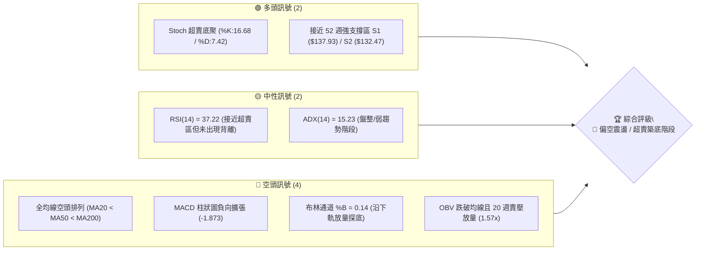
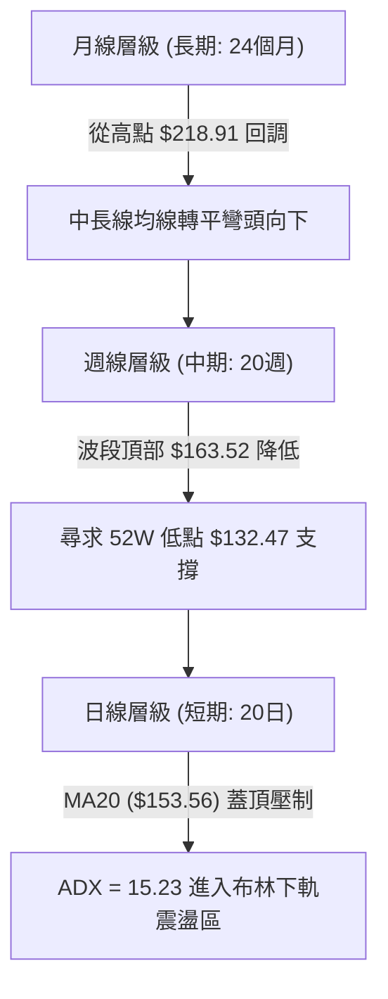
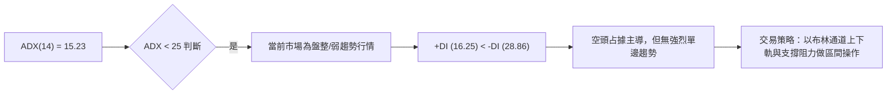
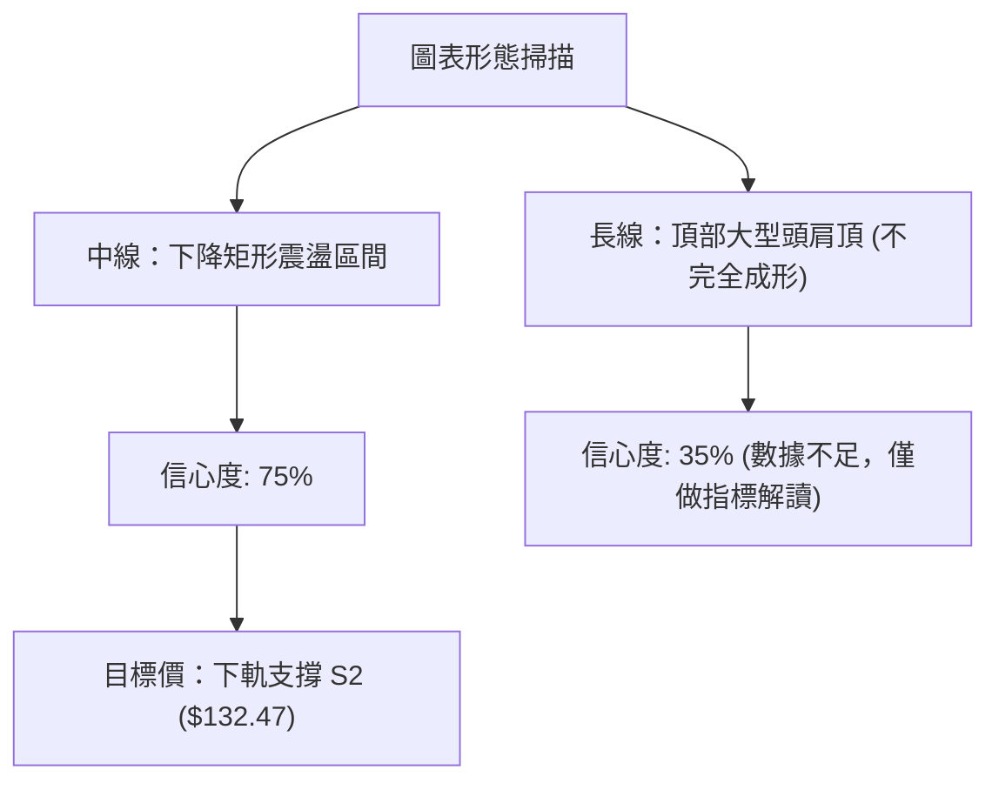
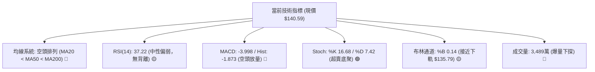
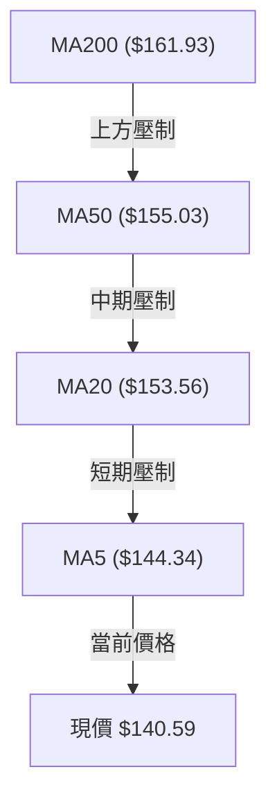
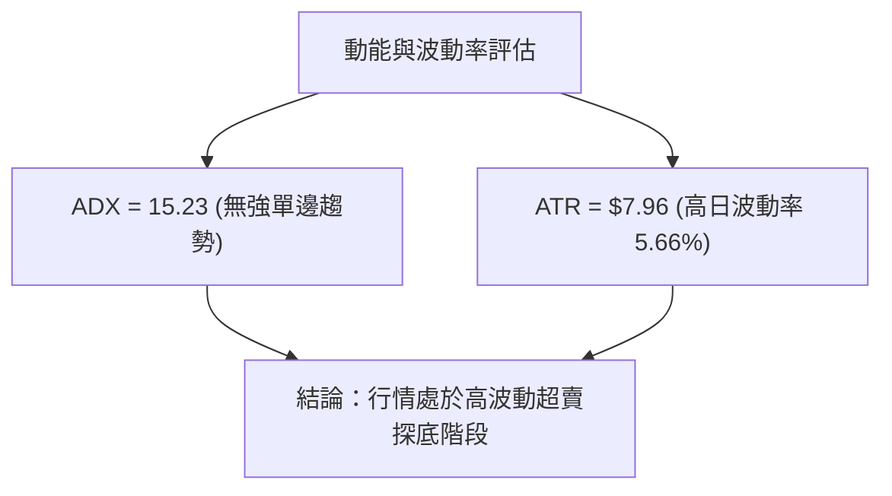
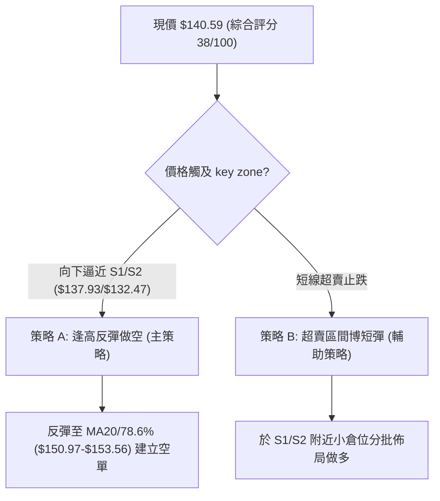
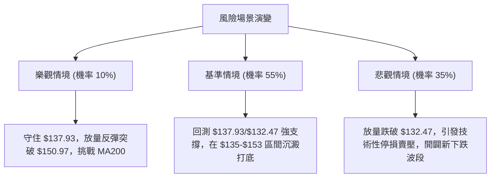

# VST 技術分析報告

> **報告日期**：2026-08-09 ｜ **語言**：繁體中文 ｜ **數據來源**：Yahoo Finance ｜ **當前價格**：$140.59

---

## 目錄

| 章節 | 內容 |
|------|------|
| [1. 技術面概覽](#1-技術面概覽) | 訊號儀表板、核心指標、評分卡 |
| [2. 趨勢分析](#2-趨勢分析) | 多時框趨勢、長中短期走勢 |
| [3. 圖表形態分析](#3-圖表形態分析) | 形態識別、K線組合、目標價 |
| [4. 支撐與阻力](#4-支撐與阻力) | 關鍵價位、斐波那契回調 |
| [5. 技術指標深度解讀](#5-技術指標深度解讀) | MA/RSI/MACD/布林/成交量 |
| [6. 動能與波動率](#6-動能與波動率) | 動能評估、ATR、Beta |
| [7. 多時框架總結](#7-多時框架總結) | 時框架評分矩陣 |
| [8. 交易策略建議](#8-交易策略建議) | 多空策略、風險報酬比 |
| [9. 風險提示與監控](#9-風險提示與監控) | 監控指標、風險場景 |

---

## 1. 技術面概覽

### 🎯 技術訊號儀表板



### 📊 核心指標速覽表

| 指標類別 | 指標名稱 | 當前數值 | 訊號 | 解讀 |
|----------|----------|----------|------|------|
| **價格** | 當前價格 | $140.59 | 🔴 空頭 | 處於 52 週高低區間 9.4% 位置，貼近底部 |
| **均線** | MA20 | $153.56 | 🔴 空頭 | 價格在 MA20 下方 (-8.45%)，短線承壓 |
| **均線** | MA50 | $155.03 | 🔴 空頭 | 價格在 MA50 下方 (-9.31%)，中期空頭 |
| **均線** | MA200 | $161.93 | 🔴 空頭 | 價格在 MA200 下方 (-13.18%)，長期牛熊分界失守 |
| **動能** | RSI(14) | 37.22 | 🟡 中性偏弱 | 接近超賣門檻 30，暫無明顯底背離 |
| **動能** | MACD | -3.998 | 🔴 空頭 | MACD 於零軸下方且 Hist (-1.873) 持續放量擴張 |
| **動能** | Stoch %K/%D | 16.68 / 7.42 | 🟢 買進超賣 | 進入極度超賣區，存在短線超賣反彈機會 |
| **趨勢** | ADX(14) | 15.23 | 🟡 盤整 | ADX < 25，行情屬於弱趨勢/區間震盪行情 |
| **波動** | ATR(14) | $7.96 | 🟡 中高波動 | 日波動幅度的 5.66%，止損距離需相應拉寬 |
| **通道** | 布林通道 | $135.79 - $171.34 | 🔴 空頭 | %B = 0.14，價格探臨下軌 $135.79 |

### 🏆 技術評分卡

```
╔══════════════════════════════════════════════════════════════════╗
║                   VST 技術評分卡 (2026-08-09)                    ║
╠══════════════════════════════════════════════════════════════════╣
║ 趨勢強度 (ADX)    ██████░░░░░░░░░░░░░░  30/100  🟡 弱趨勢/盤整   ║
║ 動能指標 (RSI/MACD)█████░░░░░░░░░░░░░░░  25/100  🔴 空頭主導     ║
║ 支撐穩定度 (S1/S2) ██████████████░░░░░  70/100  🟢 臨近關鍵強支  ║
║ 成交量配合 (OBV)  ██████░░░░░░░░░░░░░░  30/100  🔴 殺壓放量     ║
║ 形態完整度        ████████░░░░░░░░░░░░  40/100  🟡 區間下尋支撐 ║
║ 均線排列          ████░░░░░░░░░░░░░░░░  20/100  🔴 典型空頭排列 ║
╠══════════════════════════════════════════════════════════════════╣
║ 綜合技術評分      ███████▇░░░░░░░░░░░░  38/100  🔴 偏空震盪/測底  ║
╚══════════════════════════════════════════════════════════════════╝
```

---

## 2. 趨勢分析

### 🌐 多時框趨勢分析



### 📈 長期趨勢 — 24個月走勢圖（Unicode）

```
VST 月線走勢圖（2024-08 至 2026-08）
價格軸 ($)
$218.91 ┤                                  ● (52W High $218.91)
$200.00 ┤                             ●  ●
$180.00 ┤                   ●  ●   ●        ●  ●  ●
$160.00 ┤        ●  ●    ●                    ●  ●  ●  ●
$140.00 ┤  ●  ●        ●                                  ● (現價 $140.59)
$120.00 ┤                                                    ● (52W Low $132.47)
        └─┬──┬──┬──┬──┬──┬──┬──┬──┬──┬──┬──┬──┬──┬──┬──┬──┬──┬──┬──
         M08 M10 M12 M02 M04 M06 M08 M10 M12 M02 M04 M06 M08
         (24)         (25)         (25)         (26)     (26)
```

#### 走勢特徵分析表格

| 階段 | 期間 | 價格區間 | 變動幅度 | 市場特徵與技術意義 |
|------|------|----------|----------|-------------------|
| **主升段** | 2024-08 ~ 2025-07 | $84.39 → $207.45 | +145.8% | 強烈多頭主升浪，成交量同步放大，推升至 52W 高點附近 |
| **頭部震盪**| 2025-08 ~ 2025-10 | $188.12 → $195.11 | -5.9% | 高位做頂，多次試探 $200 關卡未果，動能開始衰竭 |
| **下降通道**| 2025-11 ~ 2026-03 | $178.12 → $150.12 | -15.7% | 均線轉為向下交叉，低點持續刷新，進入回調修正 |
| **區間探底**| 2026-04 ~ 2026-08 | $163.52 → $140.59 | -14.0% | 頻繁於 $139-$163 區間震盪，目前回測 52W 低點 $132.47 附近 |

### 📊 中期趨勢（週線分析）

中期走勢顯示，VST 於 2026 年 6 月底於 $163.49 形成波段高點後，展開連續 3 週的加速回調，並於 2026-08-09 破位下跌至 $140.59。

```
VST 週線阻力與支撐結構
阻力 3 : $182.06  ──────────────────────────────────────────
阻力 1 : $168.93  ──────────────────────────────────────────
斐波78.6%: $150.97 ------------------------------------------ (重要短期反彈壓力)
當前價格: $140.59  ══════════════════════════════════════════ ◄ 現價
支撐 1 : $137.93  ──────────────────────────────────────────
支撐 2 : $132.47  ────────────────────────────────────────── (52週極限低點)
```

### ⚡ 趨勢強度評估（ADX 解讀）



| ADX 數值區間 | 趨勢強度 | 當前狀態 | 交易策略導向 |
|--------------|----------|----------|--------------|
| 0 - 20 | 弱趨勢 / 盤整 | **✓ (15.23)** | **高拋低吸，關注布林上下軌與關鍵支撐阻力** |
| 20 - 25 | 趨勢形成中 | — | 準備順勢突破突破策略 |
| 25 - 50 | 強趨勢 | — | 採用均線跟蹤策略，不宜逆勢抄底 |
| 50 - 100 | 極強趨勢 | — | 警惕趨勢過熱反轉 |

---

## 3. 圖表形態分析

### 🔍 形態識別系統



#### 形態信心度評估表

| 形態名稱 | 信心度 | 判斷依據（引用數據） | 完成度 | 目標價（附計算式） |
|----------|--------|----------------------|--------|--------------------|
| **下降矩形通道** | **75%** | 上軌 $163.52、下軌 $137.93/$132.47，價格於通道內運行 | 85% | 測算下軌目標價 = **$132.47** |
| **頭肩頂形態** | **35%** | 2025年高點 $218.91 為頭部，但左肩與頸線結構不完整 | 40% | 數據不足以確認幾何形態，僅做指標型解讀 |

### 🕯️ 重要 K 線形態分析

| 日期/週 | 收盤價 | K線形態 | 技術解讀 | 訊號強度 |
|---------|--------|---------|----------|----------|
| 2026-06-28 | $163.49 | 衝高射擊之星 | 向上試探 MA200 反彈受阻，留下長上影線 | 🔴 強空訊號 |
| 2026-07-26 | $163.38 | 雙重頂二次確認 | 再度受阻於 $163.50 附近，多頭無力突破 | 🔴 空頭確認 |
| 2026-08-02 | $148.19 | 中陰線下破 | 跌破斐波那契 78.6% ($150.97)，空頭加速 | 🔴 賣出訊號 |
| 2026-08-09 | $140.59 | 帶量下影長陰 | 探至 $140.59，成交量急增至 3,488 萬股，有短線超賣拋售跡象 | 🟡 拋售尾聲/尋底 |

### 📉 ASCII 走勢形態示意圖

```
VST 2026年6月-8月 雙頂回調與下降通道示意圖
$163.50 ┤    ●(6/28)    ●(7/26)  ← 波段雙重頂 Resistance zone
$158.00 ┤   / \        / \
$150.97 ┤──/───\──────/───\───── ← 斐波那契 78.6% 頸線失守
$140.59 ┤ /     \    /     ●    ← 當前價格 ($140.59)
$137.93 ┤/       ●  /       \   ← 近期關鍵支撐 S1
$132.47 ┤─────────●──────────\─ ← 52週極限低點 S2
```

### 🎯 形態目標價計算

以 2026 年 6-7 月形成的雙重頂高點（$163.50）與頸線（斐波那契 78.6% 即 $150.97）計算：
- **形態高度 (H)** = $163.50 - $150.97 = $12.53
- **向下最小測算目標價** = 頸線 $150.97 - $12.53 = **$138.44**（精確切合當前 S1 $137.93 附近）
- **延伸跌幅目標** = 52 週低點 **$132.47**

---

## 4. 支撐與阻力

### 🗺️ 關鍵價位分布圖（Unicode）

```
VST 價位結構分布圖 (由 OHLCV 與斐波那契計算)
═══════════════════════════════════════════════════════════════════
$218.91 ║████████████████████████████████████████║ 52週最高點 (0.0%)
$198.51 ║████████████████████                    ║ 斐波那契 23.6%
$185.89 ║██████████████████████████              ║ 斐波那契 38.2%
$182.06 ║████████████████████████████            ║ 強阻力 R3
$177.74 ║████████████████████                    ║ 阻力 R2
$175.69 ║██████████████████                      ║ 斐波那契 50.0%
$171.34 ║██████████████                          ║ 布林通道上軌
$168.93 ║████████████████████████                ║ 關鍵阻力 R1 / MA240
$165.49 ║████████████                            ║ 斐波那契 61.8%
$153.56 ║██████████                              ║ MA20 / 布林中軌
$150.97 ║████████████████                        ║ 斐波那契 78.6%
$140.59 ╠════════════════════════════════════════╣ ◄ 當前價格 ($140.59)
$137.93 ║▓▓▓▓▓▓▓▓▓▓▓▓▓▓▓▓▓▓▓▓▓▓▓▓▓▓▓▓            ║ 近期波段強支撐 S1
$135.79 ║▓▓▓▓▓▓▓▓▓▓▓▓                            ║ 布林通道下軌
$132.47 ║████████████████████████████████████████║ 52週極限強支撐 S2 (100.0%)
═══════════════════════════════════════════════════════════════════
```

### 🚧 阻力位分析表

| 阻力級別 | 價位 | 形成原因 | 突破難度 | 重要性 |
|----------|------|----------|----------|--------|
| **阻力 R1** | **$168.93** | 近一年波段高點聚類與 MA240 重合 | 🔴 極難突破 | ★★★★★ |
| **阻力 R2** | **$177.74** | 歷史成交密集區與中期波段反壓點 | 🔴 難突破 | ★★★★☆ |
| **阻力 R3** | **$182.06** | 近一年密集成交頭部下沿 | 🔴 難突破 | ★★★☆☆ |

### 🛡️ 支撐位分析表

| 支撐級別 | 價位 | 形成原因 | 守住機率 | 重要性 |
|----------|------|----------|----------|--------|
| **支撐 S1** | **$137.93** | 近一年波段低點聚類，接近布林下軌 $135.79 | 🟢 70% | ★★★★☆ |
| **支撐 S2** | **$132.47** | 52 週最低價，強烈技術面買盤防線 | 🟢 85% | ★★★★★ |

### 📐 斐波那契回調位分析

根據 52 週高低點區間（高點 **$218.91** → 低點 **$132.47**，總波幅 **$86.44**）計算：

| 斐波那契層級 | 價位 | 與現價 ($140.59) 距離 | 解讀與技術意義 |
|--------------|------|------------------------|----------------|
| **0.0%** | $218.91 | +55.71% | 52 週最高點，長期頂部 |
| **23.6%** | $198.51 | +41.20% | 多頭強勢反彈目標 |
| **38.2%** | $185.89 | +32.22% | 中期空頭修正強防線 |
| **50.0%** | $175.69 | +24.97% | 多空長期分水嶺 |
| **61.8%** | $165.49 | +17.71% | 黃金分割反彈壓力點 |
| **78.6%** | **$150.97**| **+7.38%** | **關鍵反彈壓力，失守後轉為上方強阻力** |
| **100.0%** | **$132.47**| **-5.77%** | **52 週極限低點，底部終極支撐** |

**現價位置解讀**：當前價格 **$140.59** 位於斐波那契 **78.6% ($150.97)** 與 **100.0% ($132.47)** 之間的超賣沉澱區，距離底部 S2 ($132.47) 僅餘 5.77% 空間。

---

## 5. 技術指標深度解讀

### 🎛️ 指標訊號總覽



### 📈 移動平均線排列分析



- **均線排列狀態**：MA5 ($144.34) < MA20 ($153.56) < MA50 ($155.03) < MA200 ($161.93)，呈現**標準空頭排列**。
- **偏離度分析**：現價距 MA20 乖離率為 -8.45%，距 MA200 乖離率為 -13.18%，短線呈現負乖離擴大，隨時引發技術性乖離修復反彈。

### 📉 RSI(14) 分析

- **當前數值**：**37.22**
- **強度進度條**：`███████░░░░░░░░░░░░░` 37.22/100 (中性偏弱)
- **背離判斷**：日線與週線 RSI 同步下行，尚未出現「價格創新低而 RSI 未創新低」之底背離特徵，顯示空頭動能仍在釋放，但已接近 30 極端超賣區。

### 📊 MACD(12/26/9) 訊號解讀

- **MACD 線**：-3.998
- **Signal 線**：-2.125
- **MACD 柱狀圖**：-1.873
- **解讀**：DIF 與 DEA 均在零軸下方運行且快慢線張口擴大，柱狀圖負值連續擴張，顯示短期拋售壓力顯著，空頭掌控全局。

### 📦 布林通道分析

```
VST 布林通道示意圖
上軌 : $171.34  ------------------------------------------
中軌 : $153.56  ================ (MA20 強壓) =============
當前 : $140.59  -----------------◄ 現價 (%B = 0.14) -------
下軌 : $135.79  ------------------------------------------
```

- **通道寬度**：上軌 $171.34 與下軌 $135.79 形成寬幅通道（幅員 $35.55），%B 數值為 **0.14**，顯示價格已極度貼近下軌，具備下軌支撐彈升特性。

### 💹 成交量分析（量價配合度）

- **最新日成交量**：7,849,700 股（為 20 日均量 5,011,335 股的 **1.57 倍**）。
- **最新週成交量**：34,889,300 股，顯著高於前數週均量（約 1,500 萬~2,400 萬股）。
- **OBV 走勢**：OBV 指標持續位於其均線下方，顯示主力資金呈淨流出狀態，殺跌過程中成交量放大，顯示恐慌盤倒出，通常為波段探底尾聲特徵。

---

## 6. 動能與波動率

### ⚡ 動能評估

| 象限分類 | 動能強度 | 波動率 | VST 當前位置 | 交易含義 |
|----------|----------|--------|--------------|----------|
| **Q1 (高動能/低波動)** | 強 (Bull) | 低 (Low) | — | 穩定突破主升段 |
| **Q2 (弱動能/低波動)** | 弱 (Bear) | 低 (Low) | — | 無方向盤整期 |
| **Q3 (強動能/高波動)** | 強 (Bear) | 高 (High) | — | 劇烈單邊趨勢 |
| **Q4 (弱動能/高波動)** | **弱 (Bear)**| **高 (High)**| **✓ (當前狀態)** | **超賣恐慌釋放，尋找底部支撐** |



### 📊 ATR 波動率分析

- **ATR(14)**：**$7.96**（占當前股價 **5.66%**）
- **止損設點建議**：
  - **短線交易（1.0 x ATR）**：風險波動空間 $7.96
  - **波段交易（1.5 x ATR）**：風險波動空間 $11.94
  - **趨勢交易（2.0 x ATR）**：風險波動空間 $15.92

### 📐 Beta 與市場相關性

- **Beta 係數**：**1.433**
- **解讀**：VST 波動度較標普 500 指數高出 43.3%，具高貝塔屬性，在市場整體回調時跌幅容易擴大，但在大盤反彈時亦具備較強的彈升彈性。

---

## 7. 多時框架總結

### 📋 時框架評分表

| 時框架 | 趨勢方向 | 動能 (RSI/MACD) | 均線排列 | 形態狀態 | 綜合評分 | 建議 |
|--------|----------|-----------------|----------|----------|----------|------|
| **月線 (Long)** | 🟡 偏空震盪 | 37 / 空頭 | 轉平交叉 | 回調尋底 | 42/100 | 觀望 / 等待打底 |
| **週線 (Mid)** | 🔴 中期下跌 | 37 / 柱狀擴張 | 空頭排列 | 下降通道 | 35/100 | 逢高避險 / 減碼 |
| **日線 (Short)**| 🔴 極短探底 | 37 / Stoch超賣 | 空頭排列 | 臨下軌超賣 | 38/100 | 勿盲目追空 / 博短彈 |

### 🔲 綜合訊號矩陣

| 維度 | 短期 (日線) | 中期 (週線) | 長期 (月線) | 一致性評估 |
|------|-------------|-------------|-------------|------------|
| **趨勢** | 🔴 下跌 | 🔴 下跌 | 🟡 震盪 | 中高（中短期偏空） |
| **動能** | 🟢 極度超賣 | 🔴 空頭擴張 | 🟡 中性偏弱 | 矛盾（短線超賣vs中線空頭） |
| **成交量** | 🔴 賣壓放量 | 🔴 減碼明顯 | 🟡 均量平穩 | 高（賣壓持續釋放） |

### ⚖️ 多時框收斂結論

依**多時框收斂規則**，當前 **ADX = 15.23 (<25)**，市場確立為**盤整行情/超賣區間震盪行情**。
- **主導交易區間**：以布林通道下軌 **$135.79** 至中軌 **$153.56**，以及強支撐 S1 **$137.93** / S2 **$132.47** 為核心區間。
- **唯一方向性結論**：**🔴 綜合評分 38/100 — 中期偏空但短期已落入極度超賣支撐區**。策略以「逢高反彈做空/避險為主，右側落腳點博短彈為輔」，嚴禁在 S1/S2 強支撐前盲目追空。

---

## 8. 交易策略建議

### 🗺️ 策略決策流程圖



### 🧭 策略路由

**當前主策略方向 = 偏空反彈避險/尋頂做空 (評分 38/100 ≤ 40)**

### 🎯 價格情境階梯（Price Scenarios）

| 觸發條件 | 下一目標 | 後續延伸 | 情境含義 |
|----------|----------|----------|----------|
| **突破 78.6% $150.97** | MA20 $153.56 | Fib 61.8% $165.49 | 短線轉強，展開乖離修復反彈 |
| **守住 S1 $137.93** | MA5 $144.34 | Fib 78.6% $150.97 | 區間低位打底震盪 |
| **跌破 S1 $137.93** | S2 $132.47 | 布林下軌擴張 | 下尋 52 週終極底部 |

### 📊 情境機率分佈

| 情境 | 機率 | 主要依據 |
|------|------|----------|
| **繼續探底 (試探 S1/S2)** | **55%** | 均線空頭排列，MACD 負向擴張，量能偏空 |
| **超賣區間震盪 (S1 - $150.97)** | **35%** | ADX < 25 屬盤整，Stoch (16.68) 極度超賣 |
| **強勢 V 型反轉突破 R1** | **10%** | 目前缺乏利多催化劑與底背離訊號 |

### 🟢 策略詳情

#### 策略 A：逢高反彈做空/避險（主策略 — 順應中期趨勢）

| 策略要素 | 具體數據與條件 |
|----------|----------------|
| **進場條件** | 價格反彈至斐波那契 78.6% 至 MA20 壓力區，且出現上影線受阻 |
| **進場價格** | **$150.97 - $153.56** Zone |
| **目標價 T1** | **$137.93** (支撐 S1，預期獲利 +8.6%) |
| **目標價 T2** | **$132.47** (支撐 S2，預期獲利 +12.2%) |
| **止損價格** | **$160.00** (突破前高與 MA60 上方) |
| **風險報酬比** | **2.02 : 1** (以進場 $152.00 計算：風險 $8.00 / 報酬 $19.53) |
| **勝率估計** | **65%** |
| **建議倉位** | **15% - 20%** |

#### 策略 B：超賣區間博短彈（右側輔助策略 — 逆勢短打）

| 策略要素 | 具體數據與條件 |
|----------|----------------|
| **進場條件** | 股價下探 S1 ($137.93) 或 S2 ($132.47) 出現日線止跌紅棒/長下影線 |
| **進場價格** | **$132.47 - $137.93** Zone |
| **目標價 T1** | **$150.97** (斐波那契 78.6%，預期獲利 +9.5%) |
| **目標價 T2** | **$153.56** (MA20 / 布林中軌，預期獲利 +11.3%) |
| **止損價格** | **$129.50** (跌破 52 週低點 S2 $132.47 下方約 2.2%) |
| **風險報酬比** | **2.18 : 1** (以進場 $135.00 計算：風險 $5.50 / 報酬 $18.56) |
| **勝率估計** | **45%** |
| **建議倉位** | **5% - 10% (嚴格控管倉位)** |

### 🔴 反向風險觸發點（對沖提示）

若 VST 放量收盤**有效突破阻力位 R1 ($168.93)** 並站穩 MA200 ($161.93) 上方，即宣告空頭結構徹底破壞，所有做空/避險策略必須立即強制止損平倉。

### ⭐ 整體訊號強度評星

```
做多訊號強度：★★☆☆☆  (2/5星 - 僅限超賣短彈)
做空訊號強度：★★██☆  (3.5/5星 - 中期空頭占優)
整體可信度：  ★★██☆  (3.5/5星 - 多時框訊號一致)
```

---

## 9. 風險提示與監控

### ✅ 關鍵監控指標 Checklist

```
╔══════════════════════════════════════════════════════════════════╗
║                    VST 技術面關鍵監控 Checklist                  ║
╠══════════════════════════════════════════════════════════════════╣
║ [ ] S1 支撐測試：每日收盤價是否守穩 $137.93                      ║
║ [ ] S2 終極防線：是否跌破 52 週低點 $132.47                      ║
║ [ ] RSI 超賣背離：RSI(14) 探至 30 以下後是否形成一底比一底高    ║
║ [ ] MACD 柱狀圖：柱狀圖 negative value 是否開始收斂 (>-1.873)    ║
║ [ ] MA20 扣抵：價格能否重回 MA20 ($153.56) 上方                  ║
║ [ ] 量能變化：回彈時日成交量是否大於 50日均量 (450萬股)          ║
╚══════════════════════════════════════════════════════════════════╝
```

### ⚠️ 風險場景分析



### 🛡️ 風險管理重要提醒

1. **高 Beta 屬性風險**：VST Beta 高達 **1.433**，當美股大盤波動加劇時，其個股跌幅可能大幅放緩或擴大，單筆交易虧損上限應控制在總資金的 1.5% 以內。
2. **波動率止損調整**：當前 ATR 高達 **$7.96**，短線擺幅劇烈，掛單時應避免將止損設定過窄（建議至少距離進場點 1.5 倍 ATR，即 $11.94 空間），防止遭無謂掃單。

---

## 📋 報告總結

```
╔══════════════════════════════════════════════════════════════════╗
║                      VST 技術分析報告總結                        ║
════════════════════════════════════════════════════════════════════
報告日期：2026-08-09
當前價格：$140.59
分析評級：🔴 偏空震盪 / 極度超賣尋底 (綜合評分: 38/100)

關鍵結論：
├─ 長期趨勢：🟡 偏空震盪 (從 $218.91 回調，均線轉平彎頭)
├─ 中期趨勢：🔴 空頭主導 (週線連陰，通道下尋 S1/S2)
├─ 短期趨勢：🔴 探底階段 (ADX=15.23 盤整，Stoch=16.68 極度超賣)
├─ 關鍵支撐：S1 $137.93 / S2 $132.47 (52週極限低點)
├─ 關鍵阻力：斐波那契 78.6% $150.97 / MA20 $153.56 / R1 $168.93
└─ 分析師共識目標價：Mean $222.74 (基本面看好，但技術面尚待打底)

最優策略組合：
1. 🥇 最佳機會：反彈至 $150.97-$153.56 建立空單/避險 (目標 $137.93/$132.47)
2. 🥈 次選機會：於 S1/S2 ($132.47-$137.93) 出現止跌訊號時小倉位博超賣短彈
3. 🥉 保守選擇：暫時觀望，等待股價放量突破並站穩 MA20 ($153.56) 後再行右側佈局
╚══════════════════════════════════════════════════════════════════╝
```

---

> ⚠️ **免責聲明**：本報告為 AI 自動生成之技術分析，所有數據及估算均基於提供的歷史價格資訊。本報告**僅供研究與學術參考**，**不構成任何投資建議**。投資有風險，入市需謹慎。

---

*報告生成時間：2026-08-09 ｜ 數據來源：Yahoo Finance ｜ 分析框架：多時框技術分析*