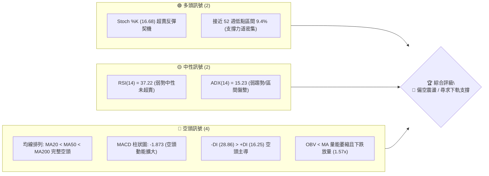
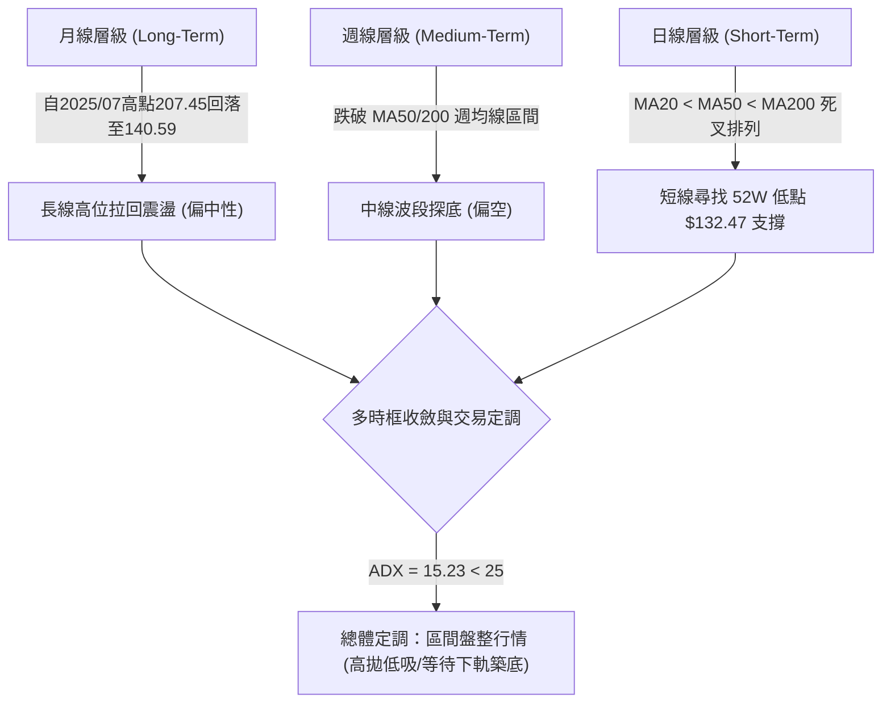
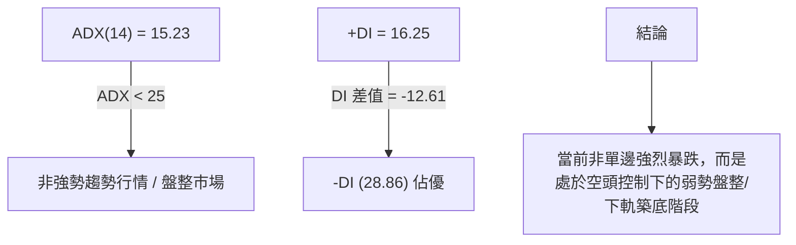
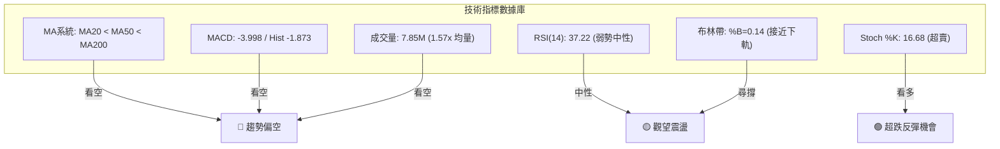
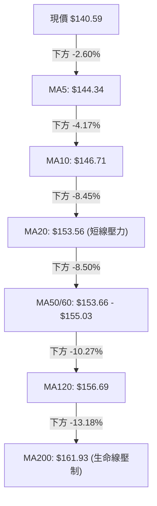
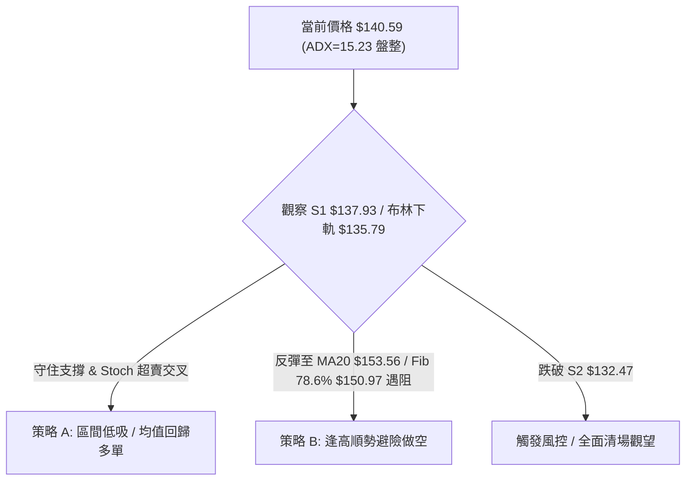
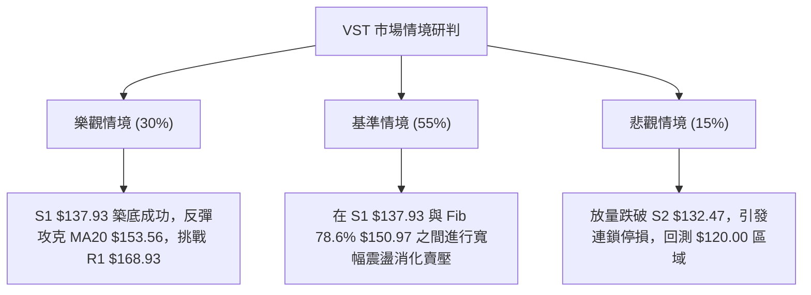

# VST 技術分析報告

> **報告日期**：2026-08-10 ｜ **語言**：繁體中文 ｜ **數據來源**：Yahoo Finance ｜ **當前價格**：$140.59

---

## 目錄

| 章節 | 內容 |
|------|------|
| [1. 技術面概覽](#1-技術面概覽) | 訊號儀表板、核心指標、評分卡 |
| [2. 趨勢分析](#2-趨勢分析) | 多時框趨勢、長中短期走勢 |
| [3. 圖表形態分析](#3-圖表形態分析) | 形態識別、K線組合、目標價 |
| [4. 支撐與阻力](#4-支撐與阻力) | 關鍵價位、斐波那契回調 |
| [5. 技術指標深度解讀](#5-技術指標深度解讀) | MA/RSI/MACD/布林/成交量 |
| [6. 動能與波動率](#6-動能與波動率) | 動能評估、ATR、Beta |
| [7. 多時框架總結](#7-多時框架總結) | 時框架評分矩陣 |
| [8. 交易策略建議](#8-交易策略建議) | 多空策略、風險報酬比 |
| [9. 風險提示與監控](#9-風險提示與監控) | 監控指標、風險場景 |

---

## 1. 技術面概覽

### 🎯 技術訊號儀表板



### 📊 核心指標速覽表

| 指標類別 | 指標名稱 | 當前數值 | 訊號 | 解讀 |
|----------|----------|----------|------|------|
| **價格** | 當前價格 | $140.59 | 🔴 | 位於 52 週高低點區間 9.4% 位置，短線極度偏弱 |
| **均線** | MA20 | $153.56 | 🔴 | 價格位在 MA20 下方 (-8.45%)，短線承壓 |
| **均線** | MA50 | $155.03 | 🔴 | 價格位在 MA50 下方，中期趨勢走弱 |
| **均線** | MA200 | $161.93 | 🔴 | 價格位在 MA200 下方 (-13.18%)，長期趨勢受阻 |
| **動能** | RSI(14) | 37.22 | 🟡 | 位於 30-70 中性偏弱區間，無背離訊號 |
| **動能** | MACD (12,26,9) | -3.998 | 🔴 | MACD 位於零軸下方，DIF 與 DEA 呈死叉且柱狀圖擴大 (-1.873) |
| **動能** | Stoch %K / %D | 16.68 / 7.42 | 🟢 | 進入 <20 超賣區，存在短線均值回歸/超跌反彈機率 |
| **趨勢** | ADX(14) | 15.23 | 🟡 | ADX < 25 指示當前為非強趨勢之「區間盤整行情」 |
| **通道** | 布林 %B | 0.14 | 🔴 | 貼近布林下軌 ($135.79)，下行壓力未消 |
| **量能** | 量比 (20D) | 1.57x | 🔴 | 最新成交量 7.85M 顯著高於 20日均量 5.01M，呈現下跌放量 |
| **波動** | ATR(14) | $7.96 | 🟡 | 每日平均波動幅度約 5.66%，波動度適中 |

### 🏆 技術評分卡

```
╔══════════════════════════════════════════════════════════════╗
║                技術評分卡 — VST (2026-08-10)                  ║
╠══════════════════════════════════════════════════════════════╣
║  趨勢強度 (ADX)     ████░░░░░░░░░░░░░░░░  20/100  🔴 空頭主導 ║
║  動能指標 (MACD/RSI)███████░░░░░░░░░░░░░  35/100  🔴 動能疲弱 ║
║  支撐穩定度 (S1/S2) ████████████░░░░░░░░  60/100  🟡 接近強支 ║
║  成交量配合 (OBV)   ████████░░░░░░░░░░░░  40/100  🔴 下跌放量 ║
║  形態完整度 (區間)  ██████████░░░░░░░░░░  50/100  🟡 底部尋撐 ║
║  均線排列 (MA System)███░░░░░░░░░░░░░░░░  15/100  🔴 完整空頭 ║
╠══════════════════════════════════════════════════════════════╣
║  綜合評分           ███████░░░░░░░░░░░░░  36/100  🔴 偏空震盪 ║
╚══════════════════════════════════════════════════════════════╝
```

---

## 2. 趨勢分析

### 🌐 多時框趨勢分析



### 📈 長期趨勢 — 12個月走勢圖（Unicode）

```
VST 過去 12 個月月線收盤價格走勢圖
價格軸 ($)
$210 ┤                  ● (2025-07: $207.45)
$195 ┤              ●   │   ● (2025-09: $195.11)
$180 ┤              │   ●   │   ● (2025-10: $187.52)
$165 ┤              │   │   │   │   ●
$150 ┤              │   │   │   │   │   ●       ●   ●   ●
$135 ┤              │   │   │   │   │   │   ●   │   │   │   ● (2026-07: $148.19)
$120 ┤              │   │   │   │   │   │   │   │   │   │   │   ● (現在 2026-08: $140.59)
     └──────────────┴───┴───┴───┴───┴───┴───┴───┴───┴───┴───┴───
      月份:  08/25 09  10  11  12  01/26 02  03  04  05  06  07  08
      收盤:  188.1 195.1 187.5 178.1 160.8 157.9 173.4 150.1 157.6 160.0 158.6 148.1 140.5
```

#### 12個月走勢特徵分析

| 階段 | 時間區間 | 價格變動區間 | 漲跌幅 | 走勢特徵描述 |
|------|----------|--------------|--------|--------------|
| **高位築頂** | 2025-07 ~ 2025-09 | $207.45 → $195.11 | -5.95% | 攻克 $200 關卡後動能衰竭，高位獲利結調湧現 |
| **中樞下移** | 2025-10 ~ 2025-12 | $187.52 → $160.88 | -14.21% | 連續三個月陰線修正，快速跌破 MA20/50 支撐 |
| **低位震盪** | 2026-01 ~ 2026-06 | $150.12 ~ $173.41 | 區間震盪 | 在 $150–$173 寬幅箱體內反覆探底與反彈 |
| **下軌尋撐** | 2026-07 ~ 2026-08 | $148.19 → $140.59 | -5.13% | 破位向下尋找近一年低點 S2 ($132.47) 支撐 |

### 📊 中期趨勢（週線分析）

從近 20 週數據觀測，週線呈現「低點逐漸降低、高點受到阻力壓制」的特徵：
- **近期週高點壓制**：2026-04-26（$164.12）、2026-06-21（$163.52）、2026-07-26（$163.38），反覆受阻於斐波那契 61.8%（$165.49）與 MA200（$161.93）附近。
- **近期週低點測試**：2026-05-17 下探至 $139.48 後強勢反彈，當前 2026-08-09 週報收 $140.59，再次逼近前低與 S1 ($137.93)。

### ⚡ 趨勢強度評估（ADX 解讀）



| 指標名稱 | 當前數值 | 參考標準 | 趨勢狀態 | 對交易策略之指引 |
|----------|----------|----------|----------|------------------|
| **ADX(14)** | 15.23 | < 25 盤整 / > 25 趨勢 | **弱趨勢/盤整** | **禁止追高殺跌，以布林通道上下軌做區間高拋低吸** |
| **+DI** | 16.25 | 多頭力道 | 弱勢 | 多頭買盤乏力 |
| **-DI** | 28.86 | 空頭力道 | 強勢 | 賣壓依然佔據優勢 |

---

## 3. 圖表形態分析

### 🔍 形態識別系統

根據近 6 個月的 OHLCV 價格走勢，進行幾何與指標形態識別：

```mermaid
graph TD
    A["VST 圖表形態識別"] --> B["形態 A: 寬幅矩形箱體 (Rectangle Range)"]
    A --> C["形態 B: 潛在雙重底 (Potential Double Bottom)"]
    
    B --> B1["上軌: $165.49 - $168.93"]
    B --> B2["下軌: $132.47 - $137.93"]
    
    C --> C1["第一底: 2026-05-17 低點 $139.48 / 52W 低點 $132.47"]
    C C1 --> C2["第二底測試中: 當前 $140.59 接近 S1 ($137.93)"]
```

#### 形態識別與信心度評估表

| 形態類型 | 信心度 | 判斷依據（引用數據） | 完成度 | 目標價（附計算式） |
|----------|--------|----------------------|--------|--------------------|
| **寬幅箱體盤整** | **75%** | 價格在 S2 ($132.47) 與 R1 ($168.93) 之間震盪超過 6 個月，ADX=15.23 | 85% | 區間震盪，無單邊突破 |
| **潛在雙重底** | **50%** | 2026年5月於 $139.48 止跌反彈；當前再次探底 $140.59，接近 S1 ($137.93) | 40% (尚未確認) | 若右底確認，目標價 = 頸線 $163.52 + (頸線 $163.52 - 底 $132.47) = **由形態高度推算 $194.57** (接近 Fib 23.6% $198.51) |
| **均線空頭排列** | **90%** | MA20 ($153.56) < MA50 ($155.03) < MA200 ($161.93)，價格位於全均線下方 | 100% | 下行壓制價位：$153.56 |

*註：由於形態 B 尚未突破頸線 $163.52，信心度僅 50%，報告後續分析以「ADX<25 之區間震盪與下軌尋撐」為主。*

### 🕯️ 重要 K 線形態分析（近 5 個月）

| 月份 | 收盤價 | 關鍵 K 線形態 | 形態解讀 | 多空訊號 |
|------|--------|---------------|----------|----------|
| **2026-04** | $157.62 | 小陽線十字星 | 於 $150 附近獲得支撐，多空暫時平衡 | 🟡 中性 |
| **2026-05** | $160.01 | 下影線較長之陽線 | 月中探低 $139.48 後強力拉回，顯示下方買盤進駐 | 🟢 多頭抵抗 |
| **2026-06** | $158.63 | 衝高回落上影線 | 衝高至 $163.52 遇阻，多頭無力續攻 | 🔴 賣壓現形 |
| **2026-07** | $148.19 | 中陰線 | 跌破 MA20/50，空頭重掌主導權 | 🔴 看空 |
| **2026-08** | $140.59 | 續跌陰線（測試中） | 連續兩週放量下探，逼近 S1 ($137.93) 支撐 | 🔴 偏空 |

### 📉 ASCII 走勢形態示意圖

```
VST 寬幅箱體與潛在雙底測試示意圖
價格 ($)
$168.93 ┼─────────────────────────────── 箱體頂部 Resistance (R1)
$163.52 ┤        ●           ●           潛在頸線 (Neckline)
        │       ╱ ╲         ╱ ╲
$150.97 ┼──────╱───╲───────╱───╲───────── 斐波那契 78.6%
        │     ╱     ╲     ╱     ╲
$140.59 ┤    │       ╲   ╱       ● (當前價格 $140.59)
$137.93 ┼────│────────●─╱─────────┼────── 近期支撐 (S1)
$132.47 ┴────● (2026-05 底 $139.48)──────┴────── 52週低點 / 強支撐 (S2)
```

---

## 4. 支撐與阻力

### 🗺️ 關鍵價位分布圖（Unicode）

```
VST 價位結構與密集區分布圖
════════════════════════════════════════════════════════════
$218.91 ║██████████████████████████████  52週最高價 (52W High)
$198.51 ║██████████████████              Fib 23.6% 回調位
$182.06 ║████████████████████████        強阻力位 R3
$177.74 ║██████████████████              阻力位 R2
$171.34 ║████████████                    布林上軌 (BB Upper)
$168.93 ║████████████████████████        關鍵阻力位 R1
$165.49 ║██████████████                  Fib 61.8% 回調位
$161.93 ║██████████                      MA200 (年線壓制)
$153.56 ║████████                        MA20 / 布林中軌
$150.97 ║████████████                    Fib 78.6% 反彈阻力
$140.59 ╠════════════════════════════════ ◄ 當前價格 $140.59
$137.93 ║▓▓▓▓▓▓▓▓▓▓▓▓▓▓▓▓▓▓▓▓            近期關鍵支撐 S1
$135.79 ║▓▓▓▓▓▓▓▓                        布林下軌 (BB Lower)
$132.47 ║██████████████████████████████  52週最低價 / 強支撐 S2
════════════════════════════════════════════════════════════
```

### 🚧 阻力位分析表

所有阻力價位均引用 OHLCV 計算之波段高點及均線/通道系統：

| 阻力級別 | 精確價位 | 形成原因與技術意涵 | 突破難度 | 重要性 |
|----------|----------|--------------------|----------|--------|
| **R1** | **$168.93** | 近一年波段高點聚類、接近 61.8% 斐波那契回調位 ($165.49) | 🔴 極高 | 頂部箱體天花板，未突破前中期趨勢無法看多 |
| **R2** | **$177.74** | 近一年中段反彈高點聚類、接近 50.0% 斐波那契回調位 ($175.69) | 🔴 高 | 中期多空強弱分水嶺 |
| **R3** | **$182.06** | 近一年波段高點聚類、接近 38.2% 斐波那契回調位 ($185.89) | 🔴 高 | 長線空頭最後防線 |

### 🛡️ 支撐位分析表

所有支撐價位均引用 OHLCV 計算之波段低點聚類：

| 支撐級別 | 精確價位 | 形成原因與技術意涵 | 守住機率 | 重要性 |
|----------|----------|--------------------|----------|--------|
| **S1** | **$137.93** | 近一年波段低點聚類、接近布林通道下軌 ($135.79) | 🟡 65% | 短線多頭防禦首要關卡 |
| **S2** | **$132.47** | 52 週最低價、斐波那契 100% 撤退點 | 🟢 80% | 絕對強支撐，跌破將引發結構性多頭停損 |

### 📐 斐波那契回調位分析（52週區間：$132.47 → $218.91）

| 斐波那契比例 | 精確價位 | 當前價格相對位置與分析 |
|--------------|----------|------------------------|
| **0.0% (52W High)** | $218.91 | 歷史高點壓制區 |
| **23.6%** | $198.51 | 長線強勢區間分界線 |
| **38.2%** | $185.89 | 中長線波段回調點 |
| **50.0%** | $175.69 | 多空中樞價位 |
| **61.8%** | $165.49 | **黃金分割關鍵阻力**（與 R1 $168.93 形成共振壓制） |
| **78.6%** | $150.97 | **短線反彈首要壓力區**（與 MA20 $153.56 共振） |
| **100.0% (52W Low)**| $132.47 | **強支撐基石**（與 S2 $132.47 完全重合） |

**價位落點解讀**：現價 $140.59 介於 **Fib 78.6% ($150.97)** 與 **Fib 100.0% ($132.47)** 之間，處於黃金分割極度偏弱之尋底區間。若短線發動均值回歸反彈，首要目標位看至 **Fib 78.6% ($150.97)**。

---

## 5. 技術指標深度解讀

### 🎛️ 指標訊號總覽



### 📈 移動平均線排列分析



**均線結構結論**：
1. **典型空頭排列**：MA20 ($153.56) < MA50 ($155.03) < MA200 ($161.93)，且所有均線斜率均向下彎曲。
2. **均線壓制帶**：$153.56 ~ $161.93 聚集了 MA20、MA50、MA120、MA200，形成重度動態阻力區。

### 📉 RSI(14) 分析

```
RSI(14) 當前強度：37.22
[0] ─────────────── 30 ───────●─────── 70 ────────────── [100]
                    └─ 超賣區   │       └─ 超買區
                             當前 37.22
```

- **區間評估**：RSI 處於 37.22，雖接近超賣區（<30），但尚未進入極端超賣，顯示下行賣壓雖強但尚未竭盡。
- **背離判斷**：比對近 20 週數據，價格下探至 $140.59 時 RSI 為 37.22，相較 2026-05-17 價格 $139.48 時之 RSI 25.5，價格未創新低，RSI 亦高於先前低點，**目前無明顯頂背離或底背離**，屬正常動能隨價格拉回之現象。

### 📊 MACD(12,26,9) 訊號解讀

- **DIF 線**：-3.998
- **DEA 信號線**：-2.125
- **MACD 柱狀圖**：-1.873（🔴 空頭柱狀圖擴大）
- **解讀**：DIF 跌破零軸並持續擴大與 DEA 的負乖離，柱狀圖達 -1.873，顯示中短期空頭動能仍強，尚未出現死叉收斂或柱狀圖縮短（底背離）之轉強訊號。

### 📦 布林通道分析

```
VST 布林通道當前位置示意圖
$171.34 ─────────────── 布林上軌 (BB Upper)
        │
$153.56 ─────────────── 布林中軌 (MA20)
        │
$140.59 ───────●─────── 現價 (%B = 0.14)
$135.79 ─────────────── 布林下軌 (BB Lower)
```

- **通道帶寬**：上軌 $171.34、下軌 $135.79，帶寬為 $35.55。
- **%B 指標**：%B = 0.14（接近 0），表明價格貼近布林下軌運作。
- **交易意涵**：在 ADX = 15.23 (<25) 的盤整行情中，價格觸及或接近布林下軌 ($135.79) 且 %B < 0.15 時，通常為**短線超跌反彈的高機率區域**。

### 💹 成交量分析（量價配合度）

- **最新成交量**：7,849,700 股
- **20 日平均量**：5,011,335 股（量比 1.57x）
- **OBV 趨勢**：OBV < MA，能量潮呈現向下穿過移動平均線。
- **量價診斷**：最近一個交易日價格下修 2.60% 的同時，成交量放大至 20 日均量的 1.57 倍，且週成交量（34.88M）創近數月新高，顯示**短線存在恐慌性拋售賣壓**，需等待成交量收縮（縮量盤整）方能確認底部築成。

---

## 6. 動能與波動率

### ⚡ 動能評估四象限

| 象限區塊 | 動能強度 | 波動率水準 | 當前 VST 狀態 | 交易策略對應 |
|----------|----------|------------|---------------|--------------|
| **象限 I** | 強動能 (Bullish) | 低波動 | — | 趨勢續抱 / 逢低加碼 |
| **象限 II** | **弱動能 (Bearish)** | **低至中波動** | **✓ VST 當前位置** | **觀望 / 逢低區間摸底 (嚴設止損)** |
| **象限 III** | 強動能 (Bearish) | 高波動 | — | 強力順勢做空 |
| **象限 IV** | 弱動能 (Neutral) | 高波動 | — | 避開市場 / 高屏障觀望 |

### 📊 ATR 波動率分析

- **ATR(14)**：$7.96（占當前股價 5.66%）
- **止損距離建議**：
  - **短線交易 (1.5x ATR)**：$7.96 × 1.5 = $11.94
  - **波段交易 (2.0x ATR)**：$7.96 × 2.0 = $15.92
- **應用解讀**：若在 S1 ($137.93) 附近建立多頭試探倉位，止損點應設置於至少 $137.93 - $7.96 = $129.97（跌破 S2 $132.47），以防止正常 ATR 波動引發之假跌破洗盤。

### 📐 Beta 與市場相關性

- **Beta 係數**：1.433
- **意涵**：VST 的波動度高於美股大盤 43.3%。在大盤修正期間，VST 容易出現放大倍數的拉回；反之在大盤反彈時，其彈升幅度亦較顯著。

---

## 7. 多時框架總結

### 📋 時框架評分表

| 時框架 | 趨勢方向 | 動能指標 | 均線排列 | 形態結構 | 綜合評分 | 操作建議 |
|--------|----------|----------|----------|----------|----------|----------|
| **日線 (Short)** | 🔴 下行 | 🔴 偏空 (-Hist) | 🔴 空頭 (MA20<50) | 🟡 逼近下軌 | **32 / 100** | 探底中，不盲目追空 |
| **週線 (Medium)**| 🔴 下行 | 🟡 RSI 37.2 | 🔴 空頭壓制 | 🟡 箱體測試 | **40 / 100** | 觀察 S1/S2 支撐韌性 |
| **月線 (Long)**  | 🟡 中性 | 🟡 中性 | 🟡 均線上方回檔 | 🟢 長期上升後修正 | **55 / 100** | 長線回調至價值區 |

### 🔲 綜合訊號矩陣

```
           日線 (Short)    週線 (Medium)   月線 (Long)
趨勢指標    🔴 看空         🔴 看空         🟡 中性
動能指標    🔴 看空         🟡 中性         🟡 中性
量能指標    🔴 下跌放量     🔴 OBV弱勢      🟢 長期放量
通道位置    🟢 接近下軌     🟡 中軌下方     🟢 歷史腰部區
```

### ⚖️ 多時框收斂結論

依**多時框收斂規則**：
1. **市場性質認定**：ADX(14) = 15.23 (<25)，市場無單邊強烈趨勢，屬**「弱趨勢 / 區間盤整行情」**。
2. **主導規則**：盤整行情以**日線布林通道上下軌 ($135.79 - $171.34) 及 key levels (S1/S2/R1)** 為主要交易依據。
3. **方向收斂**：儘管日線與週線均線系統呈空頭排列（整體綜合評分為 36/100 偏空），但價格已極度逼近布林下軌 ($135.79)、S1 ($137.93) 及 52 週低點 S2 ($132.47)，且 Stoch %K (16.68) 進入極端超賣。因此，**最終結論為：空頭動能趨緩，進入下軌區間震盪築底階段，短線不宜盲目追空，應以區間高拋低吸或等待下軌打底訊號為主**。

---

## 8. 交易策略建議

### 🗺️ 策略決策流程圖



### 🧭 策略路由（依評分卡分流）

**當前主策略方向**：**區間交易與高拋低吸（綜合評分 36/100，ADX < 25）**
- 因綜合評分為 36 分（偏空震盪），且 ADX 為 15.23，禁止進行追漲殺跌之單邊突破操作。主推**策略 A（區間低吸均值回歸）**與**策略 B（反彈高空壓制區）**。

### 🎯 價格情境階梯（Price Scenarios）

| 觸發條件 | 第一目標價 | 第二目標價 | 情境技術含義 |
|----------|------------|------------|--------------|
| **強勢突破 R1 $168.93** | R2 $177.74 | R3 $182.06 | 中期結構轉多，突破箱體天花板 |
| **反彈至阻力區** | Fib 78.6% $150.97 | MA20 $153.56 | 均線解套賣壓區，空頭重新布局點 |
| **現價區間震盪** | S1 $137.93 | BB下軌 $135.79 | 布林下軌打底，多空交戰 |
| **跌破強支撐 S2** | $120.00 (下方無近一年關卡) | $106.00 (分析師最低價) | 52 週低點失守，引發停損賣壓 |

### 📊 情境機率分佈

| 情境 | 機率 | 主要技術依據 |
|------|------|--------------|
| **下軌獲得支撐並展開超跌反彈** | **55%** | 逼近 S1/S2 與布林下軌，Stoch < 20 超賣，ADX 顯示無強烈單邊暴跌趨勢 |
| **在 $135 – $153 區間沉悶盤整** | **30%** | 20日均量放大但動能散失，多空均無力發動決戰 |
| **直接跌破 S2 $132.47 繼續下探** | **15%** | MACD 柱狀圖續擴 (-1.873) 且成交量放大 (1.57x) |

---

### 🟢 主策略詳情

所有進場、止損、目標價均**嚴格引用關鍵價位與指標算式**：

| 策略要素 | 策略 A：區間低吸 / 均值回歸 (主策略 1) | 策略 B：反彈高空 / 阻力壓制 (主策略 2) |
|----------|----------------------------------------|----------------------------------------|
| **策略邏輯** | 於布林下軌與 S1 支撐區博弈超跌反彈 | 於 MA20 / Fib 78.6% 壓力區順勢拋售 |
| **進場條件** | 價格觸及 $135.79 - $137.93 且出現止跌K線 | 反彈至 $150.97 - $153.56 出現上影線遇阻 |
| **進場價格** | **$137.93** (S1 支撐位) | **$150.97** (Fib 78.6% 回調位) |
| **目標價 T1**| **$150.97** (Fib 78.6% 回調位) | **$137.93** (S1 支撐位) |
| **目標價 T2**| **$153.56** (MA20 / 布林中軌) | **$132.47** (S2 / 52W 低點) |
| **止損價格** | **$129.97** (跌破 S2 $132.47 後退 1x ATR) | **$158.93** (突破 MA120 $156.69 上方) |
| **風險報酬比**| **(150.97 - 137.93) / (137.93 - 129.97) = 1.64 : 1** | **(150.97 - 137.93) / (158.93 - 150.97) = 1.64 : 1** |
| **建議倉位** | 10% - 15% 輕倉試探 | 15% - 20% 標準波段倉位 |

### 🔴 反向風險觸發點（對沖與撤退提示）

1. **做多撤退訊號**：若收盤價無條件跌破 **S2 $132.47**，代表近一年所有買盤全部套牢，區間盤整形態破裂，多單必須無條件止損離場。
2. **做空撤退訊號**：若價格強勢向上突破 **R1 $168.93** 並站在 MA200 ($161.93) 之上，代表空頭結構破壞，空單必須立即平倉。

### ⭐ 整體訊號強度評星

```
做多訊號強度（低吸）：  ★★☆☆☆  (2/5 星 — 僅限超賣反彈)
做空訊號強度（高空）：  ★★★☆☆  (3/5 星 — 順應 MA 空頭排列)
整體策略可信度：        ★★★☆☆  (3/5 星 — 區間盤整市場)
```

---

## 9. 風險提示與監控

### ✅ 關鍵監控指標 Checklist

```
╔══════════════════════════════════════════════════════════════╗
║                   關鍵技術監控清單 (Checklist)               ║
╠══════════════════════════════════════════════════════════════╣
║ [ ] 1. 價格是否守住 S1 $137.93 與 S2 $132.47 關鍵防線         ║
║ [ ] 2. Stoch %K 是否於 <20 區間向上金叉 %D                   ║
║ [ ] 3. MACD 柱狀圖 (-1.873) 是否止跌縮短                     ║
║ [ ] 4. 成交量是否從 7.85M 縮減至 5.01M 均量以下（賣壓竭盡）    ║
║ [ ] 5. ADX(14) 是否突破 25（若突破將開啟單邊強趨勢）         ║
╚══════════════════════════════════════════════════════════════╝
```

### ⚠️ 風險場景分析



### 🛡️ 風險管理重要提醒

1. **嚴格控制槓桿與倉位**：鑑於 VST 的 Beta 高達 1.433 且每日 ATR 達 $7.96 (5.66%)，單一交易倉位風險不宜超過總資金之 2%。
2. **防範假突破/假跌破**：當前 ADX 為 15.23，盤整市場中極易出現影線穿透 S1/R1 的假動作，交易進場宜等待 K 線收盤確認。

---

## 📋 報告總結

```
╔══════════════════════════════════════════════════════════════╗
║                VST 技術分析報告總結 (2026-08-10)             ║
╠══════════════════════════════════════════════════════════════╣
║ 當前價格：$140.59                                            ║
║ 綜合評級：🔴 偏空震盪 / 布林下軌尋撐區間 (評分 36/100)        ║
║                                                              ║
║ 關鍵技術定調：                                               ║
║ ├─ 長期趨勢：🟡 月線長線修正，位於 52W 區間低位 9.4%         ║
║ ├─ 中期趨勢：🔴 週線受阻於 MA200 ($161.93) 與 Fib 61.8%       ║
║ ├─ 短期趨勢：🔴 日線 MA 空頭排列，逼近布林下軌 ($135.79)     ║
║ ├─ 關鍵支撐：S1 $137.93 ｜ S2 $132.47 (52W 低點)             ║
║ ├─ 關鍵阻力：Fib 78.6% $150.97 ｜ MA20 $153.56 ｜ R1 $168.93  ║
║ └─ 分析師目標均價：$222.11 (基本面看好與技術面探底背離)      ║
║                                                              ║
║ 最優策略指引：                                               ║
║ 1. 🥇 首選策略：於 S1 ($137.93) – BB下軌試探性低吸，          ║
║               目標 $150.97，嚴設止損 $129.97。               ║
║ 2. 🥈 備選策略：若反彈至 MA20 ($153.56) 遇阻，佈局高空，       ║
║               目標 $137.93，止損 $158.93。                   ║
╚══════════════════════════════════════════════════════════════╝
```

---

> ⚠️ **免責聲明**：本報告為 AI 自動生成之技術分析，所有數據及價位均嚴格基於提供之歷史 OHLCV 與技術指標計算。本報告**僅供研究與學術參考**，**不構成任何投資建議或買賣邀約**。投資涉及高風險，入市需獨立思考並謹慎評估。

*報告生成時間：2026-08-10 ｜ 數據來源：Yahoo Finance ｜ 分析框架：多時框收斂技術分析*