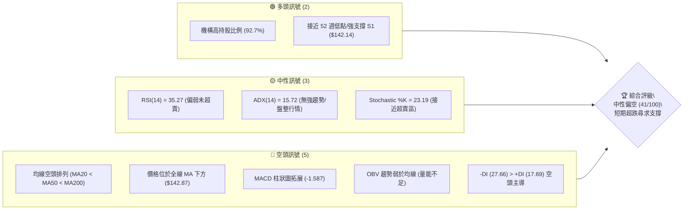
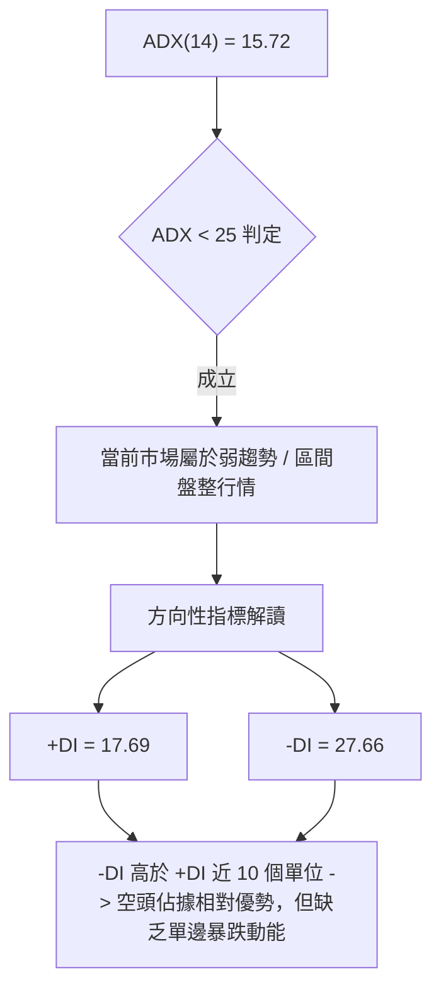
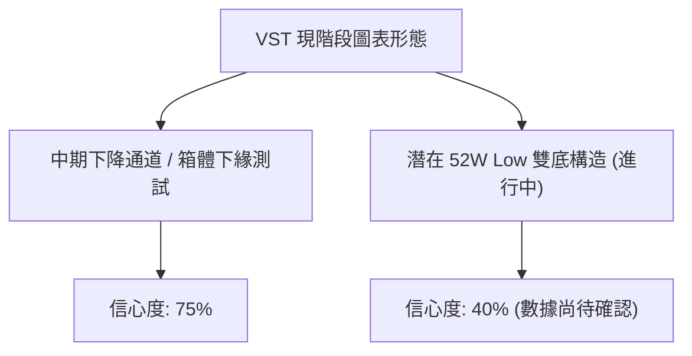
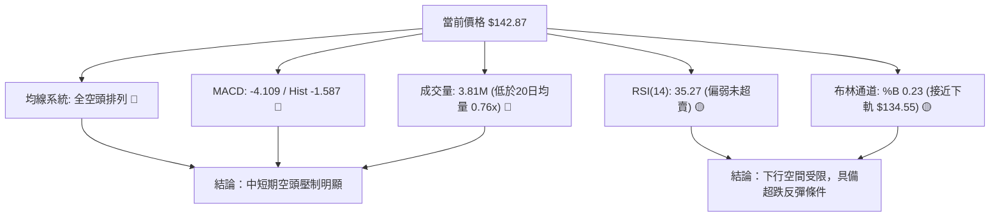
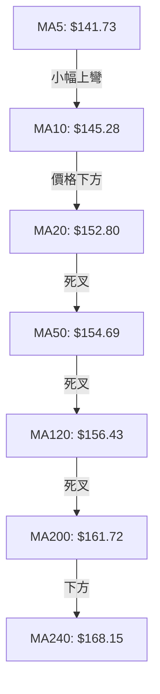
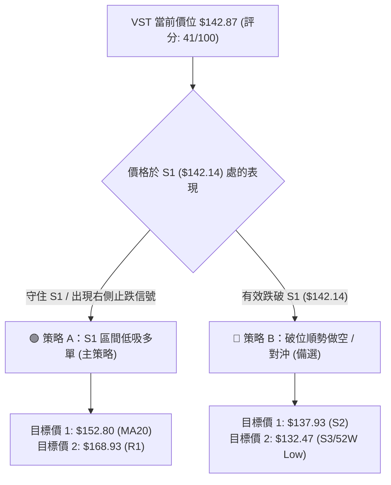
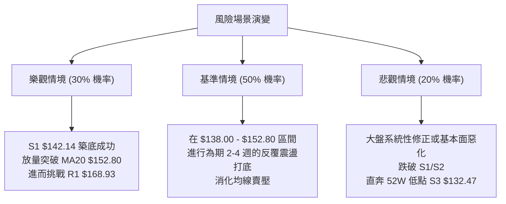

# VST 技術分析報告

> **報告日期**：2026-08-11 ｜ **語言**：繁體中文 ｜ **數據來源**：Yahoo Finance ｜ **當前價格**：$142.87

---

## 目錄

| 章節 | 內容 |
|------|------|
| [1. 技術面概覽](#1-技術面概覽) | 訊號儀表板、核心指標、評分卡 |
| [2. 趨勢分析](#2-趨勢分析) | 多時框趨勢、長中短期走勢 |
| [3. 圖表形態分析](#3-圖表形態分析) | 形態識別、K線組合、目標價 |
| [4. 支撐與阻力](#4-支撐與阻力) | 關鍵價位、斐波那契回調 |
| [5. 技術指標深度解讀](#5-技術指標深度解讀) | MA/RSI/MACD/布林/成交量 |
| [6. 動能與波動率](#6-動能與波動率) | 動能評估、ATR、Beta |
| [7. 多時框架總結](#7-多時框架總結) | 時框架評分矩陣 |
| [8. 交易策略建議](#8-交易策略建議) | 多空策略、風險報酬比 |
| [9. 風險提示與監控](#9-風險提示與監控) | 監控指標、風險場景 |

---

## 1. 技術面概覽

### 🎯 技術訊號儀表板



### 📊 核心指標速覽表

| 指標類別 | 指標名稱 | 當前數值 | 訊號 | 解讀 |
|----------|----------|----------|------|------|
| **價格** | 當前價格 | $142.87 | 🔴 空頭 | 距離 52 週低點僅 7.85%，位於 52 週區間 12.0% 分位 |
| **均線** | MA20 | $152.80 | 🔴 空頭 | 價格位於 MA20 下方 -6.50%，下行壓力明顯 |
| **均線** | MA50 | $154.69 | 🔴 空頭 | 價格位於 MA50 下方 -7.64%，中期均線向下 |
| **均線** | MA200 | $161.72 | 🔴 空頭 | 價格位於 MA200 下方 -11.66%，長期均線失守 |
| **動能** | RSI(14) | 35.27 | 🟡 中性 | 偏弱，接近超賣區（30），未出現背離 |
| **動能** | MACD | -4.109 | 🔴 空頭 | MACD 線低於 Signal 線（-2.522），DIF 柱為 -1.587 |
| **趨勢** | ADX(14) | 15.72 | 🟡 中性 | ADX < 25 屬於弱趨勢/區間盤整行情，-DI > +DI |
| **通道** | 布林 %B | 0.23 | 🟡 中性 | 接近布林通道下軌（$134.55），呈現超跌震盪 |
| **波動** | ATR(14) | $7.80 | 🟡 中性 | 日均波動率 5.46%，提供合理的止損防守空間 |
| **成交量** | 20日均量比| 0.76x | 🔴 空頭 | 今日量 3.81M 低於 20 日均量 5.02M，反彈動能偏弱 |

### 🏆 技術評分卡

```
技術評分卡 — VST (2026-08-11)
════════════════════════════════════════════════════
趨勢強度      ███████░░░░░░░░░░░░░  35/100  🔴 空頭主導
動能指標      ██████░░░░░░░░░░░░░░  32/100  🔴 動能疲弱
支撐穩定度    ████████████░░░░░░░░  60/100  🟡 臨近S1/S3
成交量配合    ████████░░░░░░░░░░░░  40/100  🟡 量能退潮
形態完整度    ███████████░░░░░░░░░  45/100  🟡 箱體回落
均線排列      █████░░░░░░░░░░░░░░░  25/100  🔴 全空頭排列
════════════════════════════════════════════════════
綜合評分      ████████░░░░░░░░░░░░  41/100  🟡 中性偏空
════════════════════════════════════════════════════
```

---

## 2. 趨勢分析

### 🌐 多時框趨勢分析

```mermaid
graph TD
    A["月線層級 (Long-term)"] -->|"2025/07 觸頂 $207.45 後回落"| B["高位震盪回檔，回撤至 78.6% 斐波那契位"]
    B --> C["週線層級 (Medium-term)"]
    C -->|"波段低點連線測試 S1 ($142.14)"| D["波段下跌格局，受制於 MA20/MA50"]
    D --> E["日線層級 (Short-term)"]
    E -->|"ADX("14") = 15.72 (<25)"| F["弱趨勢區間盤整，探尋 52 週低點 $132.47 支撐"]
```

### 📈 長期趨勢 — 12個月走勢圖（Unicode）

```
VST 月線走勢圖（2025-08 至 2026-08）
價格軸 ($)
$210 ┤                            ● $207.45 (2025-07 Peak)
$195 ┤                  ● $195.11
$180 ┤● $188.12   ● $187.52
$165 ┤      ● $178.12                 ● $173.41
$150 ┤            ● $160.88 ● $157.91       ● $160.01
$135 ┤                                            ● $148.19
$120 ┤                                                  ● $142.87 (現在)
     └─────────────────────────────────────────────────────────────
      08/25 09/25 10/25 11/25 12/25 01/26 02/26 03/26 04/26 05/26 06/26 07/26 08/26
```

#### 走勢特徵分析表

| 階段歷史區間 | 收盤價區間 | 變動幅度和特徵 | 趨勢解讀 |
|--------------|------------|----------------|----------|
| **2025-08 ~ 2025-10** | $187.52 - $195.11 | 高位窄幅震盪，於 $200 天花板遇阻 | 築頂階段，多頭擴張進入停滯 |
| **2025-11 ~ 2026-01** | $157.91 - $178.12 | 中樞下移，月線連跌，跌破 MA20 | 獲利賣壓湧現，中期趨勢轉弱 |
| **2026-02 ~ 2026-05** | $150.12 - $173.41 | 區間震盪，反彈高點逐波降低 | 箱體整理，高點遭遇 MA50 壓制 |
| **2026-06 ~ 2026-08** | $142.87 - $158.63 | 震盪向下破位，逼近 S1 支撐 $142.14 | 空頭主導，尋求 52 週低點支撐 |

### 📊 中期趨勢（週線分析）

從最近 20 週收盤數據觀察：
- **高點聚類**：2026 年 4 月下旬 $164.12、6 月下旬 $163.52、7 月下旬 $163.38，三次反彈均在 **$163.50 - $165.50** 區域（即 61.8% 斐波那契回調位 $165.49 附近）受阻，形成強大的中期頭部阻力帶。
- **低點聚類**：2026 年 5 月中旬觸及 $139.48 後迅速反彈，目前價位 $142.87 正在回測該區域，與 **S1 $142.14** 和 **S2 $137.93** 構成中期關鍵防線。

```
週線壓力支撐結構示意圖：
$165.49 ─────────────────── [61.8% 斐波阻力 / 三重頂阻力帶] (高點聚類 $163.50-$164.12)
   │
   ▼ 下行波段
$150.97 ─────────────────── [78.6% 斐波回調位 / 多空分水嶺]
   │
   ▼ 現價測試區
$142.87 ◄────────────────── 【當前收盤價】
$142.14 ─────────────────── [S1 關鍵支撐位]
$137.93 ─────────────────── [S2 波段支撐位]
$132.47 ─────────────────── [S3 / 52W Low 強支撐線]
```

### ⚡ 趨勢強度評估（ADX 解讀）



#### ADX 趨勢強度指標對照評估

| 指標項 | 當前數值 | 參考標準 | 結論與交易意涵 |
|--------|----------|----------|----------------|
| **ADX(14)** | **15.72** | `< 20` 無明顯趨勢；`20-25` 弱趨勢；`> 25` 強趨勢 | 屬於典型**盤整/無趨勢市場**，不宜採用突破追價策略。 |
| **+DI(14)** | **17.69** | 多頭力道指標 | 多頭能量低迷，無法發起連續上攻。 |
| **-DI(14)** | **27.66** | 空頭力道指標 | 空頭相對主導，但因 ADX 偏低，下行多以震盪陰跌為主。 |

---

## 3. 圖表形態分析

### 🔍 形態識別系統



#### 圖表形態信心度與目標價評估表

| 形態名稱 | 信心度 | 判斷依據（引用數據） | 完成度 | 目標價（計算式） |
|----------|--------|----------------------|--------|------------------|
| **下降通道/箱體震盪** | **75%** | 價格多次在 $163.50 (上軌) 與 $139.48-$142.14 (下軌) 之間震盪，ADX=15.72 確認盤整。 | 85% | 下軌支撐目標 $137.93，上軌阻力目標 $165.49。 |
| **雙重底 (潛在)** | **40%** | 前低為 2026-05 的 $139.48，目前再次下探 $142.87 (接近 S1 $142.14)，若能於 S1/S2 止跌則構成。 | 35% | **未確認**。若完成雙底（頸線突破 $163.38），目標價：$163.38 + ($163.38 - $139.48) = **$187.28**。 |

*註：由於 ADX = 15.72 (< 25)，當前不具備單邊強烈幾何突破形態，分析重點應聚焦於區間邊界與均線乖離均值回歸。*

### 🕯️ 重要 K 線形態分析

| 月份/近期日期 | 收盤價 | K 線形態 | 解讀 | 訊號 |
|---------------|--------|----------|------|------|
| **2026-06-28** | $163.49 | 衝高回落十字星 | 逢高獲利賣壓沉重，受制於 61.8% 斐波位 $165.49 | 🔴 短期見頂 |
| **2026-07-26** | $163.38 | 長上影反彈陽線 | 再次挑戰阻力失敗，多頭能量耗盡 | 🔴 次級賣點 |
| **2026-08-09** | $140.59 | 下探長下影陰線 | 伴隨 34.9M 週成交量，下探 S2 $137.93 後見買盤抄底 | 🟢 低位買盤 |
| **2026-08-16** | $142.87 | 縮量築底小陽星 | 價格守住 S1 $142.14，賣壓暫緩，尋求短線止跌 | 🟡 中性築底 |

### 📉 ASCII 走勢形態示意圖

```
VST 箱體震盪與下降通道（日線/週線視角）
$170.00 ┤------------------------------------------- BB Upper $171.05
$165.49 ┤─────── Top 1 ($164.12) ── Top 2 ($163.52) ── Top 3 ($163.38) [強阻力帶]
$160.00 ┤      /               \         /               \
$152.80 ┤─────/─────────────────\───────/─────────────────\── MA20 $152.80
$145.00 ┤    /                   \     /                   \
$142.87 ┤   /                     \   /                     ● 現價 $142.87
$142.14 ┤--/-----------------------\-/----------------------- S1 $142.14 (防守線)
$137.93 ┤ ● Low 1 ($139.48)        ● Low 2 (測試中)          S2 $137.93
$132.47 ┤--------------------------------------------------- S3 / 52W Low $132.47
```

### 🎯 形態目標價計算

1. **下行破位情境**：
   - 若跌破 S1 ($142.14) 與 S2 ($137.93)，形態目標將直接測試 **S3 (52 週低點 $132.47)**。
2. **反彈均值回歸情境**：
   - 若守住 S1 ($142.14)，短線均值回歸目標為布林中軌 / MA20 位置 **$152.80**（距現價 +6.95%）。
   - 中期箱體上軌目標為阻力 R1 **$168.93**（距現價 +18.24%）。

---

## 4. 支撐與阻力

### 🗺️ 關鍵價位分布圖（Unicode）

```
VST 價位結構分布圖 (由 OHLCV 與斐波那契精確計算)
═══════════════════════════════════════════════════════════════════
$218.91 ║██████████████████████████████████████████████║ 52W High (0.0%)
$198.51 ║████████████████████████████                  ║ 23.6% 斐波那契位
$185.89 ║████████████████████                          ║ 38.2% 斐波那契位
$182.06 ║████████████████████                          ║ 強阻力 R3 (+27.43%)
$177.74 ║████████████████                              ║ 阻力 R2 (+24.41%)
$175.69 ║████████████████                              ║ 50.0% 斐波那契位
$171.05 ║████████████                                  ║ 布林通道上軌
$168.93 ║████████████                                  ║ 關鍵阻力 R1 (+18.24%)
$165.49 ║██████████                                    ║ 61.8% 斐波那契位 (波段強頂)
$154.69 ║██████                                        ║ MA50 ($154.69)
$152.80 ║█████                                         ║ MA20 / 布林中軌 ($152.80)
$150.97 ║████                                          ║ 78.6% 斐波那契位
$142.87 ╠══════════════════════════════════════════════╣ ◄ 現價 $142.87
$142.14 ║▓▓▓▓▓▓▓▓▓▓▓▓▓▓▓▓▓▓▓▓                          ║ 關鍵支撐 S1 (-0.51%)
$137.93 ║██████████████████████████                    ║ 強支撐 S2 (-3.46%)
$134.55 ║██████████████████████████████                ║ 布林通道下軌
$132.47 ║██████████████████████████████████████████████║ 強支撐 S3 / 52W Low (-7.28%)
═══════════════════════════════════════════════════════════════════
```

### 🚧 阻力位分析表

| 阻力級別 | 價位 | 形成原因 | 突破難度 | 重要性 |
|----------|------|----------|----------|--------|
| **R1** | **$168.93** | 近一年波段高點聚類、接近 MA240 ($168.15) | 🔴 極高 | ★★★★★ 短期解套賣壓集結區 |
| **R2** | **$177.74** | 近一年中樞高點、接近 50.0% 斐波那契位 ($175.69) | 🔴 高 | ★★★★☆ 中期多空轉折區 |
| **R3** | **$182.06** | 歷史密集中樞高點、接近 38.2% 斐波那契位 ($185.89) | 🔴 高 | ★★★☆☆ 長期強阻力天花板 |

### 🛡️ 支撐位分析表

| 支撐級別 | 價位 | 形成原因 | 守住機率 | 重要性 |
|----------|------|----------|----------|--------|
| **S1** | **$142.14** | 近一年波段低點聚類，距離現價僅 -0.51% | 🟡 60% | ★★★★★ 近期多頭第一道防線 |
| **S2** | **$137.93** | 波段防禦低點、前次快速反彈點 ($139.48 附近) | 🟢 70% | ★★★★☆ 強支撐平台防線 |
| **S3** | **$132.47** | 52 週最低點 (100.0% 斐波那契位) | 🟢 85% | ★★★★★ 長期築底終極支撐 |

### 📐 斐波那契回調位分析

依據 52 週高低點（High: **$218.91**，Low: **$132.47**，極差 $86.44）計算：
- **0.0% (52W High)**: $218.91
- **23.6%**: $198.51
- **38.2%**: $185.89
- **50.0%**: $175.69
- **61.8%**: $165.49
- **78.6%**: $150.97
- **100.0% (52W Low)**: $132.47

**位置解讀**：
當前價格 **$142.87** 位於 **78.6% ($150.97)** 與 **100.0% ($132.47)** 之間，屬於極度深度的回撤區域（已回吐前期漲幅的 86.6%）。此區域通常為價值投資者與機構重新進行資產配置的深水區，若能在 S1 ($142.14) 至 S3 ($132.47) 區間形成底部結構，將具備向上回測 78.6% ($150.97) 及 MA20 ($152.80) 的均值回歸空間。

---

## 5. 技術指標深度解讀

### 🎛️ 指標訊號總覽



### 📈 移動平均線排列分析



#### 均線狀態與偏離度

| 均線名稱 | 均線價格 | 偏離度 (與現價) | 走勢方向 | 訊號評估 |
|----------|----------|-----------------|----------|----------|
| **MA5** | $141.73 | +0.80% | ▲ 上升 | 🟢 超短線止跌 |
| **MA10** | $145.28 | -1.66% | ▼ 下降 | 🔴 短期壓制 |
| **MA20** | $152.80 | -6.50% | ▼ 下降 | 🔴 月線阻力 |
| **MA50** | $154.69 | -7.64% | ▼ 下降 | 🔴 季線阻力 |
| **MA120** | $156.43 | -8.67% | ▼ 下降 | 🔴 半年線阻力 |
| **MA200** | $161.72 | -11.66% | ▼ 下降 | 🔴 年線強阻力 |

**均線結構結論**：MA20 < MA50 < MA200 呈現典型的**強烈空頭排列**。價格目前受到 MA10/MA20 的直接壓制，短線唯有有效站上 MA10 ($145.28)，方能解除連續下行風險並進一步挑戰 MA20 ($152.80)。

### 📉 RSI(14) 分析

- **當前 RSI(14)**：**35.27**
- **進度條**：`▓▓▓▓▓▓▓░░░░░░░░░░░░░` 35.27% (偏弱區間)
- **分析**：
  - RSI 目前處於 30–40 的偏弱震盪區，尚未跌破 30 進入極度超賣區，表明空頭力道雖強但並未達到恐慌宣泄狀態。
  - **背離判斷**：對比 2026 年 5 月中旬價格低點 $139.48（當時週 RSI 降至 25.5），當前價格 $142.87 對應 RSI 為 35.27，**未出現明顯的價格與 RSI 頂/底背離**。RSI 指標與價格趨勢保持同步運行。

### 📊 MACD(12/26/9) 訊號解讀

- **MACD 線 (DIF)**：`-4.109`
- **Signal 線 (DEA)**：`-2.522`
- **MACD 柱狀圖 (Histogram)**：`-1.587`
- **分析**：
  - MACD 位於零軸下方且 DIF 與 DEA 差距擴大，雙線呈向下發散狀態。
  - 柱狀圖為 `-1.587` 呈現負值拓展，顯示短期下向動能依然占優。
  - **背離判斷**：柱狀圖自 2026-08-09 的 `-1.873` 收窄至 `-1.587`，顯示空頭賣壓出現邊際遞減跡象，但尚未出現綠柱轉紅的金叉買入訊號。

### 📦 布林通道分析

```
布林通道結構與現價位置 ($)
$171.05 ┤------------------------------------ 布林上軌 ($171.05)
$160.00 ┤
$152.80 ┤==================================== 布林中軌 / MA20 ($152.80)
$142.87 ┤              ● (現價 $142.87, %B = 0.23)
$134.55 ┤------------------------------------ 布林下軌 ($134.55)
```

- **BB 上軌**：$171.05
- **BB 中軌 (MA20)**：$152.80
- **BB 下軌**：$134.55
- **%B 指標**：`0.23` `[▓▓▓░░░░░░░]`
- **解讀**：%B 為 0.23，說明價格正處於布林帶中軌與下軌之間的下半區，且接近下軌支撐 ($134.55)。由於 ADX < 25，布林通道邊界具備較強的支撐阻力效應，下軌 $134.55 與 S3 ($132.47) 疊加，形成極強的超跌反彈區域。

### 💹 成交量分析（量價配合度）

- **最新成交量**：3,814,327 股
- **20 日平均成交量**：5,021,936 股 (量比：**0.76x**)
- **50 日平均成交量**：4,506,381 股
- **OBV 趨勢**：OBV < MA（能量潮指標低於其均線）
- **量價關係解讀**：
  - 最近一交易日下探縮量（0.76x 均量），說明市場在 S1 ($142.14) 附近拋壓開始竭盡，恐慌性殺跌力道減弱。
  - 然而，反彈時缺乏持續的大量放大（OBV 疲弱），代表主流機構買盤多採被動掛單吸籌，而非主動追高，價格反彈空間將受限制。

---

## 6. 動能與波動率

### ⚡ 動能評估四象限

```
              強動能 (RSI > 50 / MACD > 0)
                      │
        Q3: 高風險高收益│  Q1: 最佳多頭機會
                      │
  高波動 ─────────────┼───────────── 低波動 (ATR < 5%)
  (ATR > 5%)          │  
        Q4: 避免進場  │  Q2: 弱勢整理觀望
              ★ (VST) │
                      │
              弱動能 (RSI < 50 / MACD < 0)
```

#### 動能與波動率象限分析表

| 象限分類 | 象限特徵 | 當前狀態評估 | 策略指導意義 |
|----------|----------|--------------|--------------|
| **Q1 (強動能 / 低波動)** | 強勢主升段 | 非當前狀態 | 適合趨勢加碼 |
| **Q2 (弱動能 / 低波動)** | 窄幅盤整段 | 非當前狀態 | 適合休兵觀望 |
| **Q3 (強動能 / 高波動)** | 劇烈震盪洗盤 | 非當前狀態 | 適合波段操作 |
| **Q4 (弱動能 / 高波動)** | **下跌尋底/高波動** | **✓ VST 當前歸屬 (ATR 5.46%, RSI 35.27)** | **嚴禁追高，僅限於強支撐位做防守性超跌反彈** |

### 📊 ATR 波動率分析

- **ATR(14)**：**$7.80**
- **價格佔比**：`5.46%` (屬於中高波動率)
- **止損距離建議**：
  - **短線交易 (1.0x ATR)**：止損空間應設定為 **$7.80**。若以現價 $142.87 進場，防守止損位可設於 $142.87 - $7.80 = **$135.07**。
  - **波段交易 (1.5x ATR)**：止損空間應設定為 **$11.70**。防守位可設於 **$131.17**（略低於 52 週低點 S3 $132.47）。

### 📐 Beta 與市場相關性

- **Beta 係數**：**1.433**
- **解讀**：VST 的 Beta 顯著高於 1.0，屬於大盤波動放大型標的。在大盤（S&P 500）回檔時，VST 承受的下行壓力將放大約 1.43 倍；反之，若大盤展開大級別反彈，VST 的反彈彈性亦將優於大盤。

---

## 7. 多時框架總結

### 📋 時框架評分表

| 時框架 | 趨勢方向 | 動能狀態 | 均線排列 | 形態特徵 | 綜合評分 | 交易建議 |
|--------|----------|----------|----------|----------|----------|----------|
| **月線 (Long)** | 🟡 中性回撤 | 🟡 中性 | 🟡 交錯 | 高位回落，測試 78.6% 斐波位 | 52/100 | 長線價值區吸引力提升 |
| **週線 (Mid)** | 🔴 下降通道 | 🔴 偏弱 | 🔴 空頭壓制 | 三重頂回落，逼近 S1 支撐 | 38/100 | 中期等待底部構造確立 |
| **日線 (Short)** | 🔴 弱勢震盪 | 🟡 超跌回升 | 🔴 全空頭 | ADX=15.72 盤整，測試 $142.14 | 40/100 | 超短線博弈 S1 支撐反彈 |

### 🔲 綜合訊號矩陣

```
時框架與指標一致性矩陣
═════════════════════════════════════════════════════════════
指標維度     日線 (Short)     週線 (Medium)    月線 (Long)
─────────────────────────────────────────────────────────────
趨勢方向     🔴 空頭          🔴 空頭          🟡 中性
均線系統     🔴 空頭排列      🔴 死叉壓制      🟢 位於MA50上方
RSI 指標     🟡 35.27 (偏弱)  🔴 35.3 (偏弱)   🟡 48.5 (中性)
MACD 指標    🔴 負值拓展      🔴 零軸下方      🟢 正值區間
成交量配合   🔴 縮量 (0.76x)  🔴 均量下行      🟡 中性
═════════════════════════════════════════════════════════════
訊號收斂結論：短中期空頭佔優，但日線與週線均已逼近強支撐區，下行力道減緩。
```

### ⚖️ 多時框收斂結論

依據多時框收斂規則：
1. **行情性質判定**：ADX(14) = 15.72 (`< 25`)，市場明確定義為**盤整/震盪行情**（非強趨勢行情）。
2. **主導維度選擇**：以**日線布林通道上下軌 ($134.55 – $171.05)** 與 **關鍵支撐阻力 ($142.14 – $168.93)** 為核心交易區間。
3. **最終唯一方向性結論**：**中性偏空震盪（區間築底階段）**。
   - 價格受制於全線均線壓力，直接強勢反轉機率低；但鑑於已逼近關鍵支撐 S1 ($142.14) 與 S2 ($137.93)，且 ADX 顯示無單邊暴跌趨勢，當前策略應為「**不盲目追空，逢強支撐左側/右側小倉位博弈反彈，破位嚴格止損**」。

---

## 8. 交易策略建議

### 🗺️ 策略決策流程圖



### 🧭 策略路由

**當前主策略方向 = 🟢 區間防禦性做多 / 超跌反彈（依評分 41/100，定位為強支撐處的低吸博弈）**

由於 ADX < 25 且價格距離關鍵支撐 S1 ($142.14) 僅 0.51%，空頭追低盈虧比極差。因此主策略導向為「**依托 S1/S2 支撐做多**」，配合嚴格止損。

### 🎯 價格情境階梯 (Price Scenarios)

| 觸發條件 | 下一目標 | 後續延伸 | 情境含義 |
|----------|----------|----------|----------|
| **突破 R1 $168.93** | R2 $177.74 | R3 $182.06 | 中線趨勢全面反轉轉強 |
| **站穩 MA20 $152.80** | R1 $168.93 | R2 $177.74 | 短線空頭警報解除，展開箱體反彈 |
| **守住現價/S1 $142.14** | MA20 $152.80 | MA50 $154.69 | 區間沉澱打底，均值回歸 |
| **跌破 S1 $142.14** | S2 $137.93 | S3 $132.47 | 短線下尋強支撐，尋求布林下軌測試 |
| **跌破 S3 $132.47** | $120.00 | $106.00 (分析師最低價) | 52 週破位，進入中期空頭大輪動 |

### 📊 情境機率分佈

| 情境 | 機率 | 主要依據 |
|------|------|----------|
| **S1/S2 守住並展開均值回歸反彈** | **50%** | RSI 35.27 接近超賣，日線縮量拋壓減弱，S1 ($142.14) 具備多次觸底反彈紀錄。 |
| **區間橫盤震盪 (140-150)** | **30%** | ADX = 15.72 缺乏趨勢動能，成交量偏低 (0.76x)，觀望氣氛濃厚。 |
| **跌破 S1/S2 探底 S3 ($132.47)** | **20%** | 均線全空頭壓制，MACD 負值拓展，大盤若補跌將拖累高 Beta 股。 |

### 🟢 主策略詳情（防禦性低吸做多）

| 策略要素 | 策略 A：S1 防守做多（激進型） | 策略 B：S2/下軌右側做多（穩健型） |
|----------|--------------------------------|----------------------------------|
| **進場條件** | 價格於 $142.14-$142.87 築底，日線收陽 | 價格下探 S2 ($137.93) 或布林下軌放量止跌 |
| **進場價格** | **$142.50** | **$138.00** |
| **目標價 T1** | **$152.80** (MA20 / 布林中軌，+7.2%) | **$152.80** (MA20，+10.7%) |
| **目標價 T2** | **$168.93** (阻力 R1，+18.5%) | **$165.49** (61.8% 斐波位，+19.9%) |
| **止損價格** | **$137.50** (跌破 S2，-3.5%) | **$131.80** (跌破 52W Low S3，-4.5%) |
| **風險報酬比** | **2.07 : 1** (以 T1 計算) | **2.38 : 1** (以 T1 計算) |
| **勝率估算** | **52%** | **60%** |
| **建議倉位** | **5% - 8%** (輕倉試錯) | **10% - 15%** (標準波段倉位) |

### 🔴 反向風險觸發點（做空/對沖提示）

- **觸發條件**：日線收盤價有效跌破 **S1 $142.14** 且成交量放大至 500 萬股以上。
- **對沖/空單進場點**：**$141.50**
- **空單止損點**：**$145.30** (MA10 上方)
- **空單目標價**：**$132.47** (S3 / 52W Low)
- **風險報酬比**：**2.38 : 1**

### ⭐ 整體訊號強度評星

```
做多訊號強度：★★☆☆☆  (2/5星 — 依托強支撐之超跌反彈)
做空訊號強度：★★★☆☆  (3/5星 — 均線順勢壓制，但受限於ADX與超跌)
整體可信度：  ★★★☆☆  (3/5星 — 區間盤整市場，留意偽突破)
```

---

## 9. 風險提示與監控

### ✅ 關鍵監控指標 Checklist

```
╔══════════════════════════════════════════════════════════════════╗
║                    VST 每日關鍵監控 Checklist                    ║
╠══════════════════════════════════════════════════════════════════╣
║ [ ] 1. S1 支撐守備：收盤價是否維持在 $142.14 上方？              ║
║ [ ] 2. 成交量配合：反彈日成交量是否突破 20 日均量 (5.02M)？       ║
║ [ ] 3. MA10 突破：價格能否站上 $145.28 解除短期下行警報？         ║
║ [ ] 4. MACD 柱狀圖：Histogram 是否由 -1.587 開始連續收窄？       ║
║ [ ] 5. RSI 狀態：RSI 能否重新站上 40 並向 50 中軸發起衝擊？       ║
║ [ ] 6. 52W Low 防線：若下探，$132.47 是否出現強烈機構買盤？      ║
╚══════════════════════════════════════════════════════════════════╝
```

### ⚠️ 風險場景分析



### 🛡️ 風險管理重要提醒

1. **Beta 放大效應風險**：VST Beta 係數為 1.433，當前全美公用事業板塊若遭遇利率波動作，VST 波動將顯著高於同業，單一倉位建議控制在總資金 **10% 以內**。
2. **追高風險控制**：ADX(14) = 15.72 顯示當前無單邊趨勢，價格若反彈至 MA20 ($152.80) 或 MA50 ($154.69) 附近切勿追高，該區域為強解套壓力帶。
3. **止損紀律**：若採用策略 A（$142.50 入場），**$137.50 止損位必須嚴格執行**，防止支撐破位後引發的止損盤連鎖拋售。

---

## 📋 報告總結

```
╔══════════════════════════════════════════════════════════════════╗
║                     VST 技術分析總結儀表板                      ║
╠══════════════════════════════════════════════════════════════════╣
║ 報告日期：2026-08-11                                             ║
║ 當前價格：$142.87                                                ║
║ 分析評級：🟡 中性偏空 (區間築底觀望 / 防禦性低吸)                ║
║                                                                  ║
║ 關鍵結論：                                                       ║
║ ├─ 長期趨勢：🟡 中性回撤 (從 $207.45 高點回吐至 78.6% 斐波位)    ║
║ ├─ 中期趨勢：🔴 空頭壓制 (受制於下降通道與 MA20/MA50 均線壓制)   ║
║ ├─ 短期趨勢：🟡 超跌盤整 (ADX=15.72 弱趨勢，逼近 S1 $142.14)     ║
║ ├─ 關鍵支撐：S1 $142.14 ｜ S2 $137.93 ｜ S3 $132.47 (52W Low)    ║
║ ├─ 關鍵阻力：R1 $168.93 ｜ R2 $177.74 ｜ R3 $182.06              ║
║ └─ 分析師共識目標價：均價 $222.11 (Strong Buy, 19 位分析師)      ║
║                                                                  ║
║ 最優策略組合：                                                   ║
║ 1. 🥇 最佳機會：依托 S1 ($142.14) 至 S2 ($137.93) 強支撐帶，     ║
║     輕倉試錯博弈均值回歸反彈，目標看至 MA20 ($152.80)。          ║
║ 2. 🥈 次選機會：若價格放量反彈至 MA20 ($152.80) - MA50 ($154.69) ║
║     遇阻，可做短線獲利了結或多單減碼。                           ║
║ 3. 🥉 保守選擇：等待價格突破 MA20 ($152.80) 或於 S3 ($132.47)     ║
║     出現明確雙底反轉型態後，再行右側重倉進場。                   ║
╚══════════════════════════════════════════════════════════════════╝
```

---

> ⚠️ **免責聲明**：本報告為 AI 自動生成之技術分析，所有數據及估算均基於提供的歷史價格資訊。本報告**僅供研究與學術參考**，**不構成任何投資建議**。投資有風險，入市需謹慎。

*報告生成時間：2026-08-11 ｜ 數據來源：Yahoo Finance ｜ 分析框架：多時框技術分析*