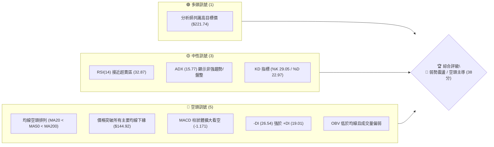
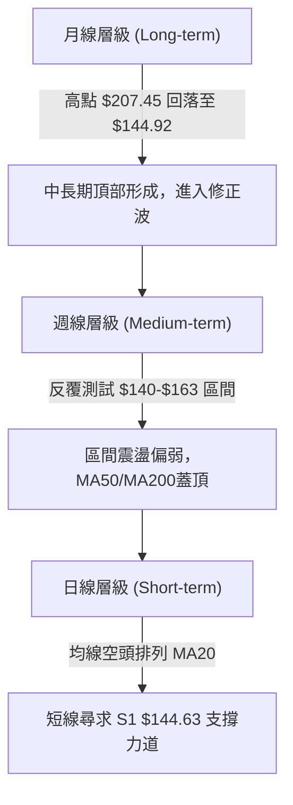
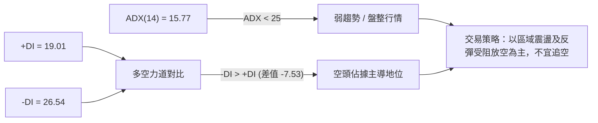
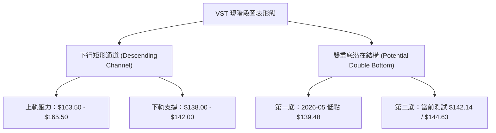
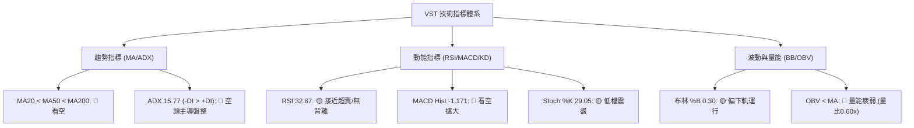
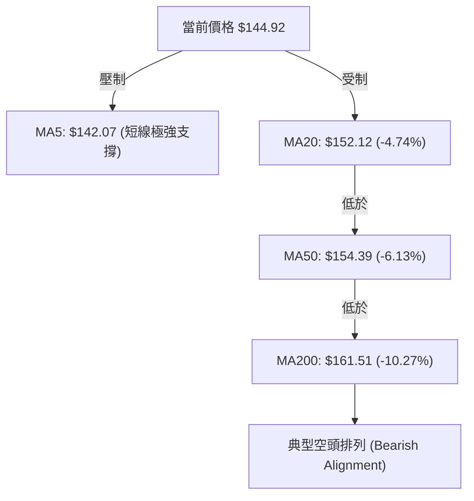
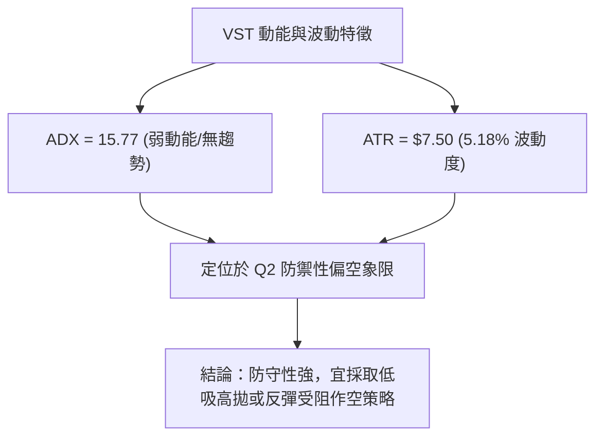
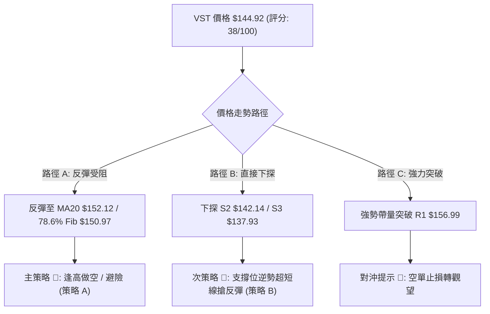
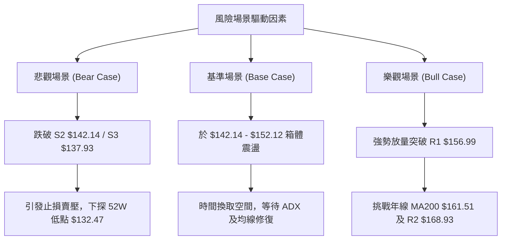

# VST 技術分析報告

> **報告日期**：2026-08-12 ｜ **語言**：繁體中文 ｜ **數據來源**：Yahoo Finance ｜ **當前價格**：$144.92

---

## 目錄

| 章節 | 內容 |
|------|------|
| [1. 技術面概覽](#1-技術面概覽) | 訊號儀表板、核心指標、評分卡 |
| [2. 趨勢分析](#2-趨勢分析) | 多時框趨勢、長中短期走勢 |
| [3. 圖表形態分析](#3-圖表形態分析) | 形態識別、K線組合、目標價 |
| [4. 支撐與阻力](#4-支撐與阻力) | 關鍵價位、斐波那契回調 |
| [5. 技術指標深度解讀](#5-技術指標深度解讀) | MA/RSI/MACD/布林/成交量 |
| [6. 動能與波動率](#6-動能與波動率) | 動能評估、ATR、Beta |
| [7. 多時框架總結](#7-多時框架總結) | 時框架評分矩陣 |
| [8. 交易策略建議](#8-交易策略建議) | 多空策略、風險報酬比 |
| [9. 風險提示與監控](#9-風險提示與監控) | 監控指標、風險場景 |

---

## 1. 技術面概覽

### 🎯 技術訊號儀表板



### 📊 核心指標速覽表

| 指標類別 | 指標名稱 | 當前數值 | 訊號 | 解讀 |
|----------|----------|----------|------|------|
| **價格** | 當前收盤價 | $144.92 | 🔴 空頭 | 位於 52 週高低區間 14.4% 低位，短線壓制明顯 |
| **均線** | MA20 (月線) | $152.12 | 🔴 空頭 | 價格於均線下方 -4.74%，形成近場壓力 |
| **均線** | MA50 (季線) | $154.39 | 🔴 空頭 | 季線向下彎頭，中期趨勢偏空 |
| **均線** | MA200 (年線) | $161.51 | 🔴 空頭 | 跌破長線生命線，長線結構受損 |
| **動能** | RSI(14) | 32.87 | 🟡 中性 | 接近超賣區（30），短線存在技術性反彈需求 |
| **動能** | MACD | -3.986 | 🔴 空頭 | MACD線 (-3.986) 低於訊號線 (-2.815)，柱狀體擴大 |
| **趨勢** | ADX(14) | 15.77 | 🟡 中性 | ADX < 25 顯示強趨勢暫緩，處於弱勢盤整向下 |
| **波動** | ATR(14) | $7.50 | 🟡 中性 | 每日波幅約 5.18%，波動度維持於中等水準 |
| **通道** | 布林 %B | 0.30 | 🔴 空頭 | 價格逼近布林下軌（$133.75），承壓運行 |

### 🏆 技術評分卡

```
╔══════════════════════════════════════════════════════════════╗
║                技術評分卡 — VST (2026-08-12)                ║
╠══════════════════════════════════════════════════════════════╣
║ 趨勢強度      ███████░░░░░░░░░░░░░  35/100  🔴 空頭主導      ║
║ 動能指標      ██████░░░░░░░░░░░░░░  30/100  🔴 動能疲弱      ║
║ 支撐穩定度    ███████████░░░░░░░░░  55/100  🟡 臨近 S1 支撐  ║
║ 成交量配合    ████████░░░░░░░░░░░░  40/100  🔴 量能萎縮      ║
║ 形態完整度    ███████░░░░░░░░░░░░░  35/100  🔴 震盪向下破位  ║
║ 均線排列      ████░░░░░░░░░░░░░░░░  20/100  🔴 典型空頭排列  ║
╠══════════════════════════════════════════════════════════════╣
║ 綜合評分      ███████▊░░░░░░░░░░░░  38/100  🔴 偏空震盪      ║
╚══════════════════════════════════════════════════════════════╝
```

---

## 2. 趨勢分析

### 🌐 多時框趨勢分析



### 📈 長期趨勢 — 24個月走勢圖（Unicode）

```
VST 24個月收盤價格走勢圖 ($)
$210 ┤                                    ●(2025-07 $207.45)
$195 ┤                             ●  ●
$180 ┤                      ●  ●         ●
$165 ┤           ●     ●                   ●  ●        ●
$150 ┤                                           ●  ●  ●  ●  ●←現價 $144.92
$135 ┤        ●     ●                                           ●
$120 ┤     ●  ●
$105 ┤
$90  ┤  ●
     └─┬──┬──┬──┬──┬──┬──┬──┬──┬──┬──┬──┬──┬──┬──┬──┬──┬──┬──┬──┬──┬──┬──┬──
      24/08 10 12 25/02 04 06 08 10 12 26/02 04 06 08
```

**走勢特徵分析**：
1. **主升段波段（2024-08 至 2025-07）**：價格由 $84.39 狂飆至 $207.45，漲幅高達 +145.8%，主要受獨立發電商與數據中心電力需求爆發推動。
2. **頂部震盪與派發期（2025-08 至 2025-11）**：價格在 $178.12 - $195.11 高檔橫盤，買盤跟進意願減弱，主力資金進行派發。
3. **下降通道與基底尋找期（2025-12 至 2026-08）**：高點逐波降低（Lower Highs），先後跌破 $160 與 $150 關卡，目前於 $144.92 尋求 52 週低點聚類區域之支撐。

### 📊 中期趨勢（週線分析）

近期 20 週數據顯示，VST 呈現寬幅震盪尋底特徵：
- **震盪上軌**：多次反彈受阻於 $163.38 - $164.12 區域（接近 61.8% 斐波那契回調位 $165.49）。
- **震盪下軌**：最低測試至 $139.48（2026-05-17 週），隨後反彈；目前最新週收於 $144.92，再次逼近前期低點聚類。

### ⚡ 趨勢強度評估（ADX 解讀）



- **ADX 數值（15.77）**：低於 25 的關鍵臨界值，表明當前市場並無強烈單邊趨勢，屬於**震盪洗盤行情**。
- **正負 DI 關係**：`-DI (26.54)` 明顯高於 `+DI (19.01)`，確認空方佔有相對優勢，多頭反攻動能不足。

---

## 3. 圖表形態分析

### 🔍 形態識別系統



#### 形態信心度與目標價評估

| 形態名稱 | 信心度 | 判斷依據（引用數據） | 完成度 | 目標價（附計算式） |
|----------|--------|----------------------|--------|--------------------|
| **下行通道** | **75%** | 高點受制於 MA50 ($154.39) 與 R1 ($156.99)，低點延伸至 S2/S3 | 85% | 下軌目標：S3 $137.93 |
| **雙重底 (潛在)** | **45%** | 需於 S1 ($144.63)/S2 ($142.14) 止跌突破頸線 R1 ($156.99) | 30% | 訊號不足，若突破頸線則估算：$156.99 + ($156.99 - $142.14) = **$171.84** |

*註：由於雙重底完成度僅 30%，信心度低於 50%，依數據紀律僅作為潛在形態觀察，不作為主要交易依據。*

### 🕯️ 重要 K 線形態分析

| 月份 | 收盤價 | K 線形態 | 解讀 | 訊號 |
|------|--------|----------|------|------|
| **2026-05** | $160.01 | 長下影中紅棒 | 低點 $139.48 強勁買盤拉回，建立下檔支撐 | 🟢 多頭反攻 |
| **2026-06** | $158.63 | 衝高回落上影線 | 嘗試挑戰 60日線失敗，高檔賣壓沉重 | 🔴 空頭壓制 |
| **2026-07** | $148.19 | 中陰棒破位 | 跌破 MA20 ($152.12)，短線結構轉弱 | 🔴 空頭續強 |
| **2026-08 (迄今)** | $144.92 | 短陰實體 | 依託 S1 ($144.63) 震盪，成交量顯著縮減 | 🟡 觀望尋底 |

### 📉 ASCII 走勢形態示意圖

```
VST 日線通道與支撐架構示意圖
$170 ┤............................................... BB上軌 $170.50
$165 ┤..................[R2 $168.93]................. 61.8% 斐波那契 $165.49
$160 ┤========[通道上軌/MA200 $161.51]==============
$155 ┤.................[MA50 $154.39 / R1 $156.99]...
$150 ┤.................[78.6% 斐波那契 $150.97]...... MA20 $152.12
$145 ┤─────────────────► 現價 $144.92 ◄────────────── [S1 $144.63]
$140 ┤═════════════════[S2 $142.14]══════════════════ 關鍵防線
$135 ┤.................[S3 $137.93 / BB下軌 $133.75]
$130 ┤.................[52週低點 $132.47].............
```

---

## 4. 支撐與阻力

### 🗺️ 關鍵價位分布圖（Unicode）

```
VST 價位結構分布圖 (由波段高低點聚類與斐波那契計算)
═════════════════════════════════════════════════════════════════
$218.91 ║████████████████████████████████████████  52週最高點 (0.0%)
$198.51 ║██████████████████████████              23.6% 斐波那契位
$185.89 ║██████████████████                      38.2% 斐波那契位
$177.74 ║████████████████████                    阻力位 R3 (+22.65%)
$170.50 ║██████████████                          布林通道上軌
$168.93 ║████████████████                        阻力位 R2 (+16.57%)
$165.49 ║████████████                            61.8% 斐波那契位
$161.51 ║██████████                              MA200 年線壓力
$156.99 ║████████████████                        阻力位 R1 (+8.33%)
$150.97 ║████████                                78.6% 斐波那契位
$144.92 ╠════════════════════════════════════════ ◄ 當前價格 $144.92
$144.63 ║▓▓▓▓▓▓▓▓▓▓▓▓▓▓▓▓▓▓▓▓                    近一年支撐位 S1 (-0.20%)
$142.14 ║▓▓▓▓▓▓▓▓▓▓▓▓▓▓▓▓▓▓                      近一年支撐位 S2 (-1.92%)
$137.93 ║▓▓▓▓▓▓▓▓▓▓                              近一年支撐位 S3 (-4.82%)
$133.75 ║▓▓▓▓▓▓▓▓                                布林通道下軌
$132.47 ║▓▓▓▓▓▓▓▓▓▓▓▓▓▓▓▓▓▓▓▓▓▓▓▓▓▓▓▓            52週最低點 (100.0%)
═════════════════════════════════════════════════════════════════
```

### 🚧 阻力位分析表

| 阻力級別 | 精確價位 | 形成原因 | 突破難度 | 重要性 |
|----------|----------|----------|----------|--------|
| **阻力 R1** | **$156.99** | 近一年波段高點聚類、接近 78.6% 斐波那契 ($150.97) 及 MA50 ($154.39) | 🟡 中等 | 🟢 短線多空分水嶺，突破方能扭轉弱勢 |
| **阻力 R2** | **$168.93** | 近一年中段密集反彈高點、接近 61.8% 斐波那契 ($165.49) | 🔴 偏高 | 🟡 中期空頭核心防線，伴隨年線壓力 |
| **阻力 R3** | **$177.74** | 前期派發平台下緣、接近 50.0% 斐波那契 ($175.69) | 🔴 極高 | 🔴 強阻力，未有大盤爆發難以一次貫穿 |

### 🛡️ 支撐位分析表

| 支撐級別 | 精確價位 | 形成原因 | 守住機率 | 重要性 |
|----------|----------|----------|----------|--------|
| **支撐 S1** | **$144.63** | 近一年波段低點聚類，與現價差距僅 -0.20% | 🟡 50% | 🟡 當前首要防線，跌破則測試下軌 |
| **支撐 S2** | **$142.14** | 近一年波段密集支撐區，距現價 -1.92% | 🟢 65% | 🟢 短線多頭退守防線，具備技術性反彈契機 |
| **支撐 S3** | **$137.93** | 近一年重要低點聚類，接近布林下軌 ($133.75) | 🟢 80% | 🔴 中期底線，若跌破將直接挑戰 52W 低點 $132.47 |

### 📐 斐波那契回調位分析

依據 52 週區間高點 **$218.91** 至低點 **$132.47** 計算之精確斐波那契回調位：

- **0.0% (52W High)**: $218.91
- **23.6%**: $198.51
- **38.2%**: $185.89
- **50.0%**: $175.69
- **61.8%**: $165.49
- **78.6%**: $150.97
- **100.0% (52W Low)**: $132.47

**現價落點解讀**：
當前價格 **$144.92** 處於 **78.6% ($150.97)** 與 **100.0% ($132.47)** 之間的極度深幅修正區。價格此前反彈均受阻於 78.6% 回調位 ($150.97)，顯示市場多頭回升力道薄弱，屬於弱勢修正。若價格能重新站回 $150.97，方能開展挑戰 $165.49 (61.8%) 的中期反彈行情。

---

## 5. 技術指標深度解讀

### 🎛️ 指標訊號總覽



### 📈 移動平均線排列分析



- **短均線 (MA5/10)**：MA5 ($142.07) 扣抵低價區，出現微微上彎 (+2.01%)，提供超短線跌深反彈支撐；但 MA10 ($144.91) 走平，現價正好受制於 MA10 附近。
- **中長均線 (MA20/50/200)**：MA20 ($152.12)、MA50 ($154.39) 與 MA200 ($161.51) 呈**標準空頭排列**。長線 MA240 高達 $167.94，顯示上方堆積極重的套牢賣壓，反彈逢均線皆為壓制。

### 📉 RSI(14) 分析

```
RSI(14) 當前數值: 32.87
[0]───────────[30]───────●──[50]───────────[70]───────────[100]
              超賣區    現價                 超買區
```

- **超買/超賣狀態**：RSI 位於 **32.87**，尚未觸及 <30 的絕對超賣區，但已處於偏低震盪區間，意味著下行殺跌動能有所減緩。
- **背離判斷**：對比近期價格低點（2026-05 低點 $139.48 時 RSI 約 25.5，目前價格 $144.92 時 RSI 為 32.87），**無明顯底背離或頂背離**，指標與價格走勢基本同步，無反轉訊號。

### 📊 MACD(12,26,9) 訊號解讀

- **MACD 線**：`-3.986`
- **Signal 線**：`-2.815`
- **MACD 柱狀體 (Histogram)**：`-1.171`（🔴 看空）

**分析**：MACD 線在零軸下方持續下行，且柱狀體為負值並有所擴大 (-1.171)，顯示**中短期向下動能仍在釋放**，多頭尚未收復失地，未見黃金交叉買入訊號。

### 📦 布林通道分析

```
布林通道現狀示意圖 ($)
$170.50 ┤---------------------------------------- 上軌 (Upper Band)
$152.12 ┤------------------ 中軌 (MA20 $152.12)
$144.92 ┤========► 現價 ($144.92, %B = 0.30)
$133.75 ┤---------------------------------------- 下軌 (Lower Band)
```

- **布林參數**：上軌 **$170.50**，中軌 **$152.12**，下軌 **$133.75**。
- **%B 指標**：**0.30**（位處下軌與中軌之間 30% 位置），顯示價格正沿著中軌與下軌之間的弱勢通道運行，尚未觸及極端下軌暴衝，亦未見收斂突變。

### 💹 成交量分析（量價配合度）

- **成交量對比**：最新成交量為 **2,969,067**，相較於 20日均量 **4,939,348**，量比僅 **0.60x**。
- **OBV 趨勢**：OBV 指標持續位於其移動平均線下方，呈「價跌量縮、反彈無量」特徵。主力資金退場觀望，缺乏大量買盤進場承接，量能無法有效確認任何多頭反攻。

---

## 6. 動能與波動率

### ⚡ 動能評估

| 象限 | 動能強度 | 波動率 | 當前狀態 | 綜合評估 |
|------|----------|--------|----------|----------|
| **Q1 (最佳)** | 強 (RSI>50, +DI>-DI) | 低 (ATR<4%) | — | 穩定趨勢上行 |
| **Q2 (防禦)** | 弱 (RSI<50, -DI>+DI) | 低/中 (ATR 5.18%) | **✓ VST 當前位置** | **弱勢沉悶震盪，下尋支撐** |
| **Q3 (投機)** | 強 (ADX>30) | 高 (ATR>7%) | — | 高風險高爆發 |
| **Q4 (避險)** | 弱 (MACD負值擴大) | 高 (ATR>7%) | — | 恐慌恐慌殺跌 |



### 📊 ATR 波動率分析

- **ATR(14)**：**$7.50**（占當前股價 5.18%）。
- **風險距離建議**：
  - **日內交易止損距**：`1.0 × ATR = $7.50`
  - **波段交易止損距**：`1.5 × ATR = $11.25`
  - **趨勢交易止損距**：`2.0 × ATR = $15.00`

### 📐 Beta 與市場相關性

- **Beta 係數**：**1.433**。
- **解讀**：VST 的波動度顯著高於大盤（S&P 500）約 43.3%。在大盤修正期間，VST 往往承受放大倍數的下行壓力；反之在大盤強勁反彈時，其彈性亦較大。

---

## 7. 多時框架總結

### 📋 時框架評分表

| 時框架 | 趨勢方向 | 動能狀態 | 均線排列 | 形態結構 | 綜合評分 | 交易建議 |
|--------|----------|----------|----------|----------|----------|----------|
| **月線 (Monthly)** | 🔴 偏空修正 | 🔴 弱勢 | 🟡 交錯 | 高檔派發修正 | **40/100** | 長線減碼觀望 |
| **週線 (Weekly)** | 🔴 區間偏空 | 🟡 中性 | 🔴 空頭 | 寬幅箱體 $139-$165 | **38/100** | 逢高避險 / 箱體操作 |
| **日線 (Daily)** | 🔴 空頭控盤 | 🔴 偏弱 | 🔴 空頭排列 | 受制於 MA20/MA50 | **35/100** | 短線探底，慎防破位 |

### 🔲 綜合訊號矩陣

```
                     ┌────────────────────────────────────────┐
                     │           多時框訊號收斂矩陣            │
                     └────────────────────────────────────────┘
  月線 (Long Term)   ─────────────────────────────────► 🔴 偏空 (Bearish)
  週線 (Medium Term) ─────────────────────────────────► 🔴 偏空 (Bearish)
  日線 (Short Term)  ─────────────────────────────────► 🔴 偏空 (Bearish)
  
  【訊號一致性】：三時框高度收斂於「偏空震盪」，方向一致性強。
```

### ⚖️ 多時框收斂結論

依據多時框收斂規則：
1. 當前 **ADX(14) = 15.77 (< 25)**，市場處於**盤整 / 弱趨勢行情**。
2. 交易區間主要受制於**布林通道上下軌（$133.75 - $170.50）**。
3. 均線系統呈空頭排列（MA20 < MA50 < MA200），且 -DI (26.54) 高於 +DI (19.01)。
4. **唯一方向性結論**：**🔴 偏空震盪與防禦性做空為主**。短線若因 RSI 接近超買引發反彈，強阻力位在 **MA20 ($152.12)** 與 **R1 ($156.99)**，建議作為做空或減碼點，而非追多依據。

---

## 8. 交易策略建議

### 🗺️ 策略決策流程圖



### 🧭 策略路由

**當前主策略方向 = 🔴 逢高偏空操作 / 防禦性對沖（綜合評分 38/100）**

### 🎯 價格情境階梯（Price Scenarios）

| 觸發條件 | 下一目標 | 後續延伸 | 情境含義 |
|----------|----------|----------|----------|
| **強勢突破 R1 $156.99** | R2 $168.93 | R3 $177.74 | 短線扭轉空頭，中期底點確立 |
| **站穩現價區間 ($144.63)** | 78.6% Fib $150.97 | MA20 $152.12 | 弱勢築底，布林下軌回抽 |
| **跌破支撐 S2 $142.14** | S3 $137.93 | 52W Low $132.47 | 空頭續攻，尋求布林下軌 $133.75 支撐 |

### 📊 情境機率分佈

```
情境機率分佈圖
═══════════════════════════════════════════════════════════════
情境 A：逢高回落 / 再探 S2/S3 (55%) ███████████████████████████▋
情境 B：區間震盪 $142 - $152  (30%) ███████████████
情境 C：帶量反轉突破 R1      (15%) ███████▌
═══════════════════════════════════════════════════════════════
```

| 情境 | 機率 | 主要依據 |
|------|------|----------|
| **情境 A：回落 / 再探底** | **55%** | 均線空頭排列，MACD 柱狀體擴大 (-1.171)，量能持續萎縮 (量比 0.60x) |
| **情境 B：區間震盪** | **30%** | ADX = 15.77 顯示無強單邊趨勢，S1 ($144.63) 與 S2 ($142.14) 具備買盤承接 |
| **情境 C：強勢反彈突破** | **15%** | 分析師目標價高估 ($221.74)，RSI (32.87) 處於低位存在技術抽離需求 |

### 🟢 交易策略詳情

#### 🥇 主策略（策略 A）：反彈受阻逢高做空 / 避險（空頭主導）

- **進場條件**：價格技術性反彈至 78.6% 斐波那契回調位 **$150.97** 至 MA20 **$152.12** 區域受阻，且日線出現上影線或陰包陽 K 線。
- **進場價格**：**$151.50**（取 $150.97 - $152.12 區間中值）
- **止損價格**：**$156.99**（突破 R1 關鍵阻力即止損，風險空間 $5.49）
- **目標價 T1**：**$142.14**（測試 S2 支撐位，獲利空間 $9.36）
- **目標價 T2**：**$137.93**（測試 S3 支撐位，獲利空間 $13.57）
- **風險報酬比 (R/R)**：
  - T1: `$9.36 / $5.49 = 1.71 : 1`
  - T2: `$13.57 / $5.49 = 2.47 : 1`
- **成功機率**：**65%**
- **建議倉位**：**15% - 20%**

#### 🥈 次策略（策略 B）：支撐位逆勢超短線搶反彈（多頭對沖）

- **進場條件**：價格下探至關鍵支撐 **S2 $142.14** 附近，RSI(14) 跌破 30 進入超賣區，且出現 15分/1小時底背離訊號。
- **進場價格**：**$142.14**
- **止損價格**：**$137.93**（跌破 S3 關鍵支撐即止損，風險空間 $4.21）
- **目標價 T1**：**$150.97**（78.6% 斐波那契回調位，獲利空間 $8.83）
- **目標價 T2**：**$156.99**（阻力位 R1，獲利空間 $14.85）
- **風險報酬比 (R/R)**：
  - T1: `$8.83 / $4.21 = 2.10 : 1`
  - T2: `$14.85 / $4.21 = 3.53 : 1`
- **成功機率**：**40%**（屬順勢趨勢下之逆勢操作，勝率較低）
- **建議倉位**：**5% - 10%**（嚴格控制部位）

### 🔴 反向風險觸發點（對沖提示）

若 VST 帶量突破 **R1 $156.99**，且日收盤價站穩於其上，意味著短線空頭架構破壞，空單應立即全數止損離場，並可轉為觀望或跟進多頭。

### ⭐ 整體訊號強度評星

```
做多訊號強度：★★☆☆☆  (2.0/5星 — 僅具備超賣反彈機會)
做空訊號強度：★★★★☆  (4.0/5星 — 均線與動能高度一致看空)
整體可信度：  ★★★★☆  (4.0/5星 — 多時框訊號一致性高)
```

---

## 9. 風險提示與監控

### ✅ 關鍵監控指標 Checklist

```
╔══════════════════════════════════════════════════════════════╗
║                每日技術監控 Check List                       ║
╠══════════════════════════════════════════════════════════════╣
║ [ ] 價格是否跌破關鍵支撐 S1 $144.63 / S2 $142.14             ║
║ [ ] RSI(14) 是否跌破 30 進入絕對超賣觸發反彈                 ║
║ [ ] MACD 柱狀體是否出現縮頭 (由 -1.171 向上收斂)             ║
║ [ ] 日成交量是否放大至 20日均量 (4.94M) 以上                 ║
║ [ ] ADX 是否升破 25 啟動單邊強烈趨勢                         ║
║ [ ] 價格是否帶量攻克 MA20 $152.12 及 R1 $156.99              ║
╚══════════════════════════════════════════════════════════════╝
```

### ⚠️ 風險場景分析



### 🛡️ 風險管理重要提醒

1. **波動度防範**：VST 之 ATR 高達 **$7.50**（波幅 5.18%），單日上下震盪劇烈。投資人操作時止損距離不宜過窄，建議至少設置在 `1.5 × ATR ($11.25)` 之外。
2. **大盤連動風險**：Beta 係數 **1.433** 顯示個股對整體美股大盤極度敏感。在大盤波動劇烈時，應適當降低倉位比例。
3. **機構持股集中度**：機構持股比率高達 **92.8%**，需嚴密關注法人資金進出。一旦機構調降評級或拋售，容易引發流動性擠壓與連續下挫。

---

## 📋 報告總結

```
╔══════════════════════════════════════════════════════════════╗
║                  VST 技術分析報告總結                         ║
╠══════════════════════════════════════════════════════════════╣
║ 報告日期：2026-08-12                                         ║
║ 當前價格：$144.92                                            ║
║ 分析評級：🔴 偏空震盪 (綜合評分: 38/100)                     ║
║                                                              ║
║ 關鍵結論：                                                   ║
║ ├─ 長期趨勢：🔴 高點回落，長線生命線 MA200 ($161.51) 跌破    ║
║ ├─ 中期趨勢：🔴 弱勢震盪，受制於下行通道與 78.6% Fib ($150.97)║
║ ├─ 短期趨勢：🔴 均線空頭排列，下尋 S1 $144.63 / S2 $142.14    ║
║ ├─ 關鍵支撐：S1 $144.63 ｜ S2 $142.14 ｜ S3 $137.93          ║
║ ├─ 關鍵阻力：R1 $156.99 ｜ R2 $168.93 ｜ R3 $177.74          ║
║ └─ 分析師目標價：均價 $221.74 (基本面與技術面短期背離)       ║
║                                                              ║
║ 最優策略組合：                                               ║
║ 1. 🥇 最佳機會：反彈受阻於 $150.97 - $152.12 區間建立逢高空單  ║
║ 2. 🥈 次選機會：下探 S2 $142.14 超賣區時，進行超短線搶反彈    ║
║ 3. 🥉 保守選擇：等待價格帶量突破 R1 $156.99 明朗後再行布局    ║
╚══════════════════════════════════════════════════════════════╝
```

---

> ⚠️ **免責聲明**：本報告為 AI 自動生成之技術分析，所有數據及估算均基於提供的歷史價格資訊。本報告**僅供研究與學術參考**，**不構成任何投資建議**。投資有風險，入市需謹慎。

---

*報告生成時間：2026-08-12 ｜ 數據來源：Yahoo Finance ｜ 分析框架：多時框技術分析*