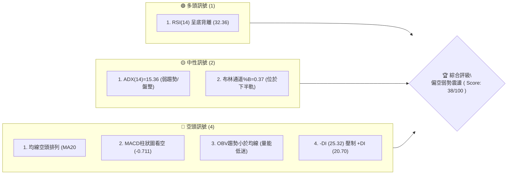
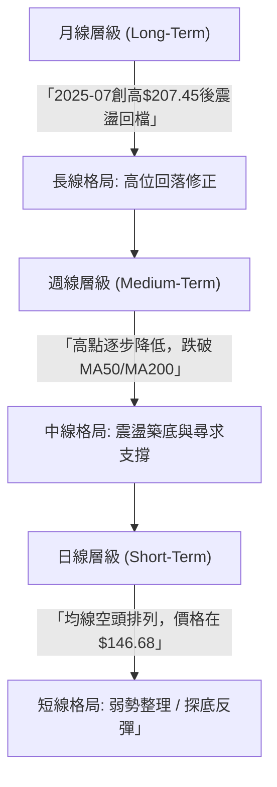
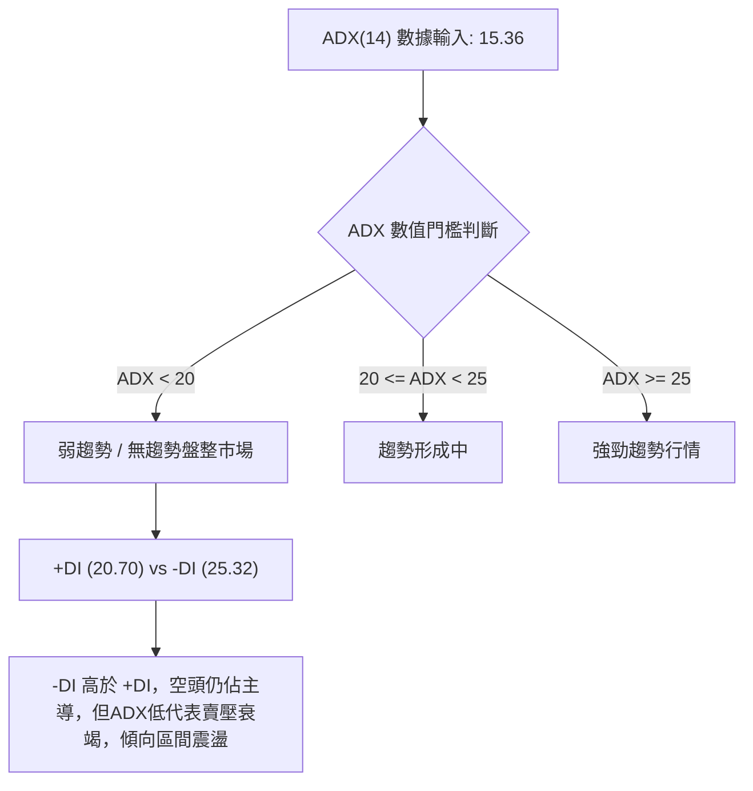
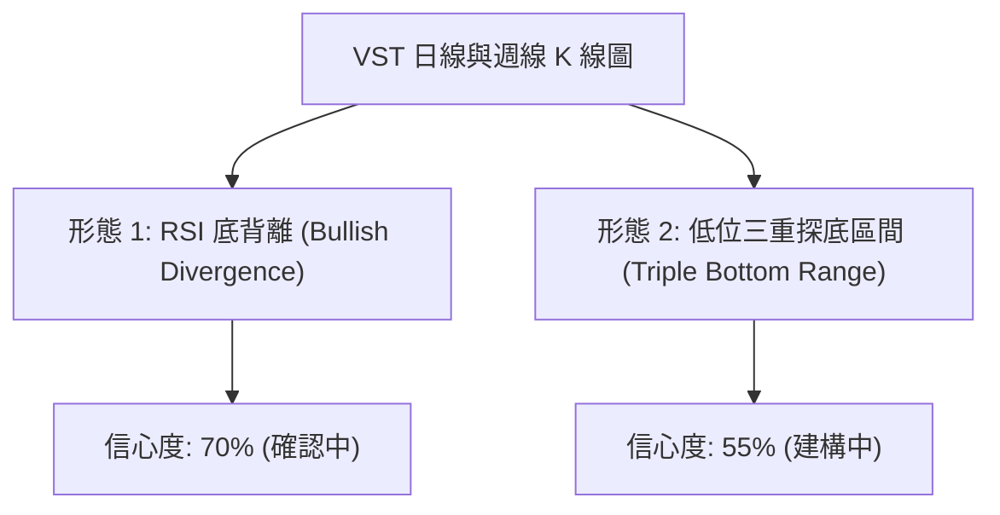
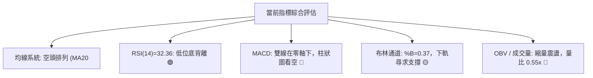
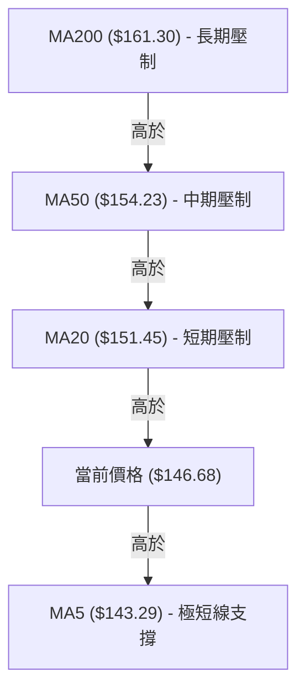
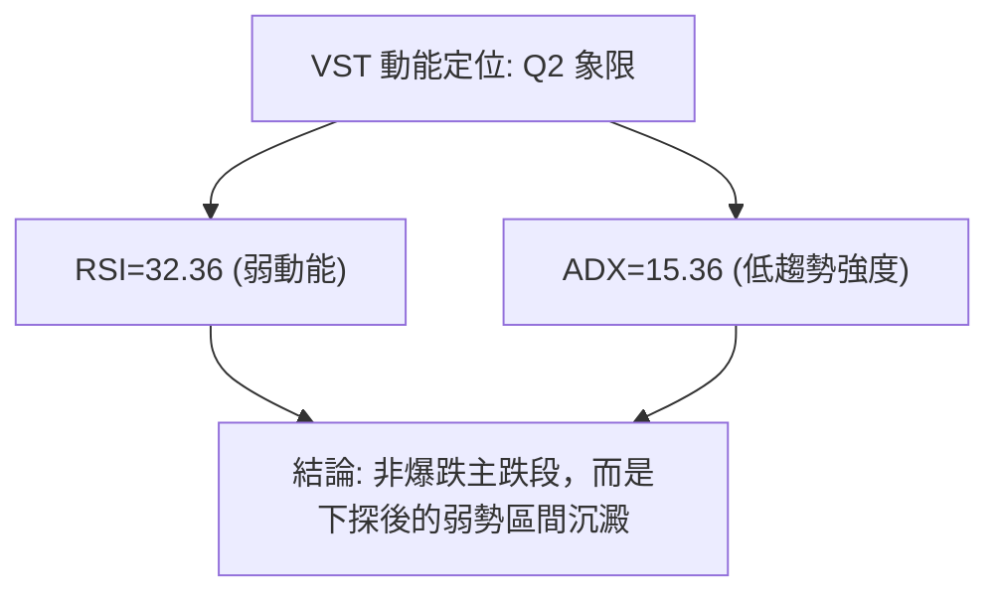
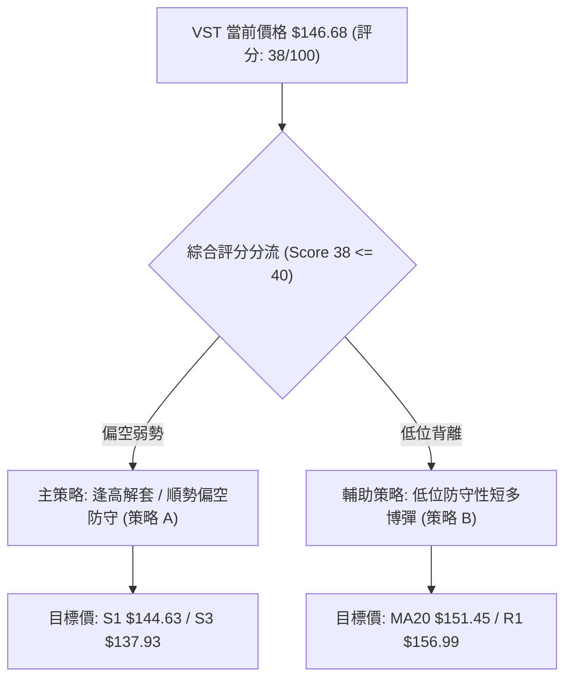
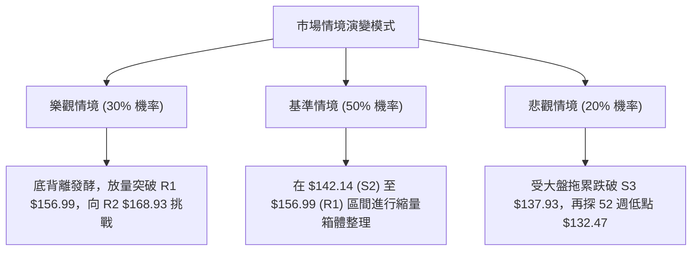

# VST 技術分析報告

> **報告日期**：2026-08-13 ｜ **語言**：繁體中文 ｜ **數據來源**：Yahoo Finance ｜ **當前價格**：$146.68

---

## 目錄

| 章節 | 內容 |
|------|------|
| [1. 技術面概覽](#1-技術面概覽) | 訊號儀表板、核心指標、評分卡 |
| [2. 趨勢分析](#2-趨勢分析) | 多時框趨勢、長中短期走勢 |
| [3. 圖表形態分析](#3-圖表形態分析) | 形態識別、K線組合、目標價 |
| [4. 支撐與阻力](#4-支撐與阻力) | 關鍵價位、斐波那契回調 |
| [5. 技術指標深度解讀](#5-技術指標深度解讀) | MA/RSI/MACD/布林/成交量 |
| [6. 動能與波動率](#6-動能與波動率) | 動能評估、ATR、Beta |
| [7. 多時框架總結](#7-多時框架總結) | 時框架評分矩陣 |
| [8. 交易策略建議](#8-交易策略建議) | 多空策略、風險報酬比 |
| [9. 風險提示與監控](#9-風險提示與監控) | 監控指標、風險場景 |

---

## 1. 技術面概覽

### 🎯 技術訊號儀表板



### 📊 核心指標速覽表

| 指標類別 | 指標名稱 | 當前數值 | 訊號 | 解讀 |
|----------|----------|----------|------|------|
| **價格** | 當前價格 | $146.68 | 🔴 | 位於 52 週高低價區間之 16.4% 低位 |
| **均線** | MA20 | $151.45 | 🔴 | 價格低於 20 日均線 -3.15%，短線承壓 |
| **均線** | MA50 | $154.23 | 🔴 | 價格低於 50 日均線 -4.89%，中線走弱 |
| **均線** | MA200 | $161.30 | 🔴 | 價格低於 200 日均線 -9.06%，長線轉空 |
| **動能** | RSI(14) | 32.36 | 🟡 | 接近超賣區（<30），且出現標準底背離訊號 |
| **動能** | MACD | -3.704 | 🔴 | MACD 線低於訊號線 (-2.992)，Histogram -0.711 |
| **趨勢** | ADX(14) | 15.36 | 🟡 | ADX < 25 表示處於弱趨勢或無趨勢盤整行情 |
| **波動** | ATR(14) | $7.53 | 🟡 | 每日波幅為股價之 5.14%，波動度偏高 |
| **通道** | 布林通道 | $133.33–$169.56 | 🟡 | %B 為 0.37，股價位於下軌與中軌間尋求支撐 |
| **成交量** | 量比 (20日) | 0.55x | 🔴 | 成交量 2.66M 顯著低於 20日均量 4.82M，縮量震盪 |

### 🏆 技術評分卡

```
╔══════════════════════════════════════════════════════════════╗
║                技術評分卡 — VST (2026-08-13)                 ║
╠══════════════════════════════════════════════════════════════╣
║ 趨勢強度      ██████░░░░░░░░░░░░░░  30/100  🔴 空頭占優      ║
║ 動能指標      ████████░░░░░░░░░░░░  40/100  🟡 底背離醞釀    ║
║ 支撐穩定度    █████████████░░░░░░░  65/100  🟢 接近52W低點  ║
║ 成交量配合    ███████░░░░░░░░░░░░░  35/100  🔴 量能大幅退潮  ║
║ 形態完整度    ██████████░░░░░░░░░░  50/100  🟡 低位築底中    ║
║ 均線排列      ████░░░░░░░░░░░░░░░░  20/100  🔴 死亡交叉排列  ║
╠══════════════════════════════════════════════════════════════╣
║ 綜合評分      ███████▓░░░░░░░░░░░░  38/100  🔴 偏空弱勢震盪  ║
╚══════════════════════════════════════════════════════════════╝
```

---

## 2. 趨勢分析

### 🌐 多時框趨勢分析



### 📈 長期趨勢 — 24個月走勢圖（Unicode）

```
VST 月線走勢圖（過去24個月歷史軌跡）
價格軸 ($)
$220 ┤                                      ● (52W High $218.91)
$200 ┤                                   ●  █
$180 ┤                            ●  ●  █   █  ●
$160 ┤               ●     ●  ●  █  █  █   █  █  ●  ●  ●  ●
$140 ┤        ●  ●  █  ●  █  █  █  █  █   █  █  █  █  █  █  ● (現價 $146.68)
$120 ┤     ●  █  █  █  █  █  █  █  █  █   █  █  █  █  █  █  █
$100 ┤  ●  █  █  █  █  █  █  █  █  █  █   █  █  █  █  █  █  █
$80  ┤  █  █  █  █  █  █  █  █  █  █  █   █  █  █  █  █  █  █ (52W Low $132.47)
      └─┬──┬──┬──┬──┬──┬──┬──┬──┬──┬──┬───┬──┬──┬──┬──┬──┬──┬───
       '24/08 '24/11 '25/02 '25/05 '25/08 '25/11 '26/02 '26/05 '26/08
```

#### 走勢特徵分析表格

| 階段歷史時間 | 收盤價範圍 | 階段漲跌幅 | 走勢特徵與價量結構分析 |
|--------------|------------|------------|------------------------|
| **2024-08 ~ 2024-11** | $84.39 ➔ $158.27 | +87.55% | 強勢突破上攻，主升段買盤猛烈，爆量推升價位。 |
| **2024-12 ~ 2025-03** | $136.74 ➔ $116.68 | -14.67% | 高點大幅回檔，下探歷史支撐位後落底。 |
| **2025-04 ~ 2025-07** | $128.79 ➔ $207.45 | +61.08% | 第二波強勁拉升，並於後續創出 52 週歷史高點 $218.91。 |
| **2025-08 ~ 2025-12** | $188.12 ➔ $160.88 | -14.48% | 高檔獲利結吐賣壓湧現，均線開始扣高拐頭向下。 |
| **2026-01 ~ 2026-08** | $157.91 ➔ $146.68 | -7.11% | 中期波段向下修正，打回 $132.47 低點後於 $140–$160 區間震盪。 |

### 📊 中期趨勢（週線分析）

```
VST 週線關鍵壓力與支撐區間結構
═════════════════════════════════════════════════════════
   $177.74 ───────────────────────────── 關鍵阻力 R3 (強壓區)
   $168.93 ───────────────────────────── 中期阻力 R2 (MA240 附近)
   $156.99 ───────────────────────────── 近期阻力 R1 (Fib 78.6% 上方)
   $146.68 ═════════════════════════════ 當前價格位置 (現價)
   $144.63 ───────────────────────────── 短線支撐 S1
   $142.14 ───────────────────────────── 中期支撐 S2
   $137.93 ───────────────────────────── 強力支撐 S3 (接近52W低點$132.47)
═════════════════════════════════════════════════════════
```

### ⚡ 趨勢強度評估（ADX 解讀）



#### ADX 趨勢強度指標對照評估

| 指標名稱 | 當前數值 | 參考標準 | 趨勢判定 | 市場含義與交易心法 |
|----------|----------|----------|----------|-------------------|
| **ADX(14)** | **15.36** | < 25 | **無顯著趨勢 / 盤整** | 追價易套牢，應採用布林通道上下軌之高拋低吸策略。 |
| **+DI** | **20.70** | — | 多頭力道 | 買盤力道偏弱，未能有效向上突破。 |
| **-DI** | **25.32** | — | 空頭力道 | 空頭相對占優，但未形成強烈連續拋售潮。 |

---

## 3. 圖表形態分析

### 🔍 形態識別系統



#### 圖表形態信心度與目標價評估

| 形態名稱 | 信心度 | 判斷依據（引用實際數據） | 完成度 | 目標價計算與推導 |
|----------|--------|--------------------------|--------|------------------|
| **RSI 底背離** | **70%** | 股價在 2026-08-09 扣低至 $140.59，但 RSI 由 25.5 反彈至 32.36，未再創新低 | **80%** | 預計引發反彈至 MA20 ($151.45) 及阻力位 R1 ($156.99) |
| **低位三重探底** | **55%** | 近期三次下探 $139.48 (5/17)、$140.59 (8/9) 及現價 $146.68，均在 S1/S2/S3 附近獲支撐 | **60%** | 頸線位 R1 $156.99，形態高度 = $156.99 - $142.14 = $14.85。<br/>突破目標價 = $156.99 + $14.85 = **$171.84** (推估) |

*註：除上述指標型與區間型形態外，由於當前 ADX 為 15.36，數據不足以支撐典型頭肩頂或旗形等幾何圖形，故不強行繪製。*

### 🕯️ 重要 K 線形態分析

| 近期週別 | 收盤價 | K 線形態組合 | 技術解讀 | 訊號強度 |
|----------|--------|--------------|----------|----------|
| **2026-07-26** | $163.38 | 中紅棒突破 | 嘗試突破 MA200 但受到賣壓拉回 | 🟡 中性偏多 |
| **2026-08-02** | $148.19 | 中黑棒下挫 | 拋售壓力增強，跌破短期支撐 | 🔴 看空 |
| **2026-08-09** | $140.59 | 下影長黑棒 | 爆量下探 $140.59 後湧現抄底買盤 | 🟡 止跌訊號 |
| **2026-08-16** | $146.68 | 止跌小紅棒 | 形成低位孕育線，確認 RSI 底背離 | 🟢 看多反彈 |

### 📉 ASCII 走勢形態示意圖

```
VST 日線底背離與低位區間打底示意圖
═══════════════════════════════════════════════════════════════
價格 (USD)
$160.00 ┤            ● (05/31高點 $160.01)
$156.99 ┤-----------/---\-------------------------- R1 頸線阻力
$151.45 ┤----------/-----\--------●--------------- MA20 / BB中軌
$146.68 ┤         /       \      / \
$144.63 ┤  ●-----/---------●----/---\------●------ 現價 $146.68 (S1)
$137.93 ┤   \___/           \__/     \____/ ------ S3 強支撐區
         (05/17低點)      (07/05低點) (08/09低點 $140.59)
───────────────────────────────────────────────────────────────
RSI(14)
  50    ┤     /\             /\
  30    ┤____/  \___________/  \_____● (32.36) 🟢 底部一底比一底高
         (25.5)           (37.2)
═══════════════════════════════════════════════════════════════
```

### 🎯 形態目標價計算

以**低位三重探底 / 區間打底形態**計算推導：
1. **區間底部（支撐聚類中心）**：$142.14 (S2)
2. **區間頸線（阻力位 R1）**：$156.99
3. **形態垂直高度**：$156.99 - $142.14 = **$14.85**
4. **最小突破測量目標價**：$156.99 + $14.85 = **$171.84** （若向上突破成功，將直指 R2 $168.93 與 R3 $177.74 之間的區間）

---

## 4. 支撐與阻力

### 🗺️ 關鍵價位分布圖（Unicode）

```
VST 關鍵價位與斐波那契疊加分布圖
═══════════════════════════════════════════════════════════════════
$218.91 ║████████████████████████████████████████║ 52週最高點 / 0.0% Fib
$198.51 ║██████████████████████                  ║ 23.6% Fib 回調位
$185.89 ║████████████████                        ║ 38.2% Fib 回調位
$177.74 ║████████████████████████                ║ 強阻力 R3
$175.69 ║████████████                            ║ 50.0% Fib 中點
$168.93 ║████████████████████                    ║ 中期阻力 R2 / MA240
$165.49 ║████████                                ║ 61.8% Fib 黃金分割位
$156.99 ║████████████████████████                ║ 關鍵阻力 R1 / 頸線
$150.97 ║██████████                              ║ 78.6% Fib 回調位
$146.68 ╠════════════════════════════════════════╣ ◄ 當前價格位置
$144.63 ║▓▓▓▓▓▓▓▓▓▓▓▓▓▓▓▓▓▓▓▓                    ║ 短線支撐 S1
$142.14 ║▓▓▓▓▓▓▓▓▓▓▓▓▓▓▓▓▓▓▓▓▓▓▓▓                ║ 中期支撐 S2
$137.93 ║▓▓▓▓▓▓▓▓▓▓▓▓▓▓▓▓▓▓▓▓▓▓▓▓▓▓▓▓            ║ 強力支撐 S3
$132.47 ║████████████████████████████████████████║ 52週最低點 / 100.0% Fib
═══════════════════════════════════════════════════════════════════
```

### 🚧 阻力位分析表

| 阻力級別 | 精確價位 | 形成原因與數據依據 | 突破難度 | 戰略重要性 |
|----------|----------|--------------------|----------|------------|
| **R1** | **$156.99** | 近一年波段高點聚類、接近 MA120 ($156.01) | 🟡 中等 | 短期多空分水嶺，突破方能扭轉日線劣勢 |
| **R2** | **$168.93** | 波段高點聚類、接近 MA240 ($167.75) 與 BB 上軌 ($169.56) | 🔴 極高 | 中期強壓區，受限於長期均線扣高賣壓 |
| **R3** | **$177.74** | 2025 年底多次交盤震盪密集區 | 🔴 極高 | 長線多頭解套防線，需特爆量方可化解 |

### 🛡️ 支撐位分析表

| 支撐級別 | 精確價位 | 形成原因與數據依據 | 守住機率 | 戰略重要性 |
|----------|----------|--------------------|----------|------------|
| **S1** | **$144.63** | 近一年波段低點聚類、日線支撐 | 🟢 高 (70%) | 極短線防守第一線，防範下探 |
| **S2** | **$142.14** | 波段低點聚類、接近 08/09 週低點 $140.59 | 🟢 高 (75%) | 中期箱體底部，多次測試未跌破 |
| **S3** | **$137.93** | 波段低點聚類、布林下軌 ($133.33) 上方護城河 | 🟢 極高 (85%)| 多頭最後防線，臨近 52 週低點 $132.47 |

### 📐 斐波那契回調位分析

*（基準區間：52 週高點 $218.91 ➔ 52 週低點 $132.47，波幅 $86.44）*

* **0.0% ($218.91)**：52 週最高點，長線壓頂。
* **23.6% ($198.51)**：高檔強阻力。
* **38.2% ($185.89)**：波段回檔次高點。
* **50.0% ($175.69)**：中期多空均衡點。
* **61.8% ($165.49)**：黃金分割阻力位（極度關鍵）。
* **78.6% ($150.97)**：近期關鍵反彈阻力。
* **100.0% ($132.47)**：52 週最低點，絕對底部。

**現價解讀**：目前價格 **$146.68** 落於 **78.6% ($150.97)** 與 **100.0% ($132.47)** 之間的極低位區間。價格下方受 S1 ($144.63) 與 S2 ($142.14) 保護，上方受 78.6% ($150.97) 與 MA20 ($151.45) 壓制，呈現低位窄幅震盪特徵。

---

## 5. 技術指標深度解讀

### 🎛️ 指標訊號總覽



### 📈 移動平均線排列分析



* **均線現況**：MA5 ($143.29) < 現價 ($146.68) < MA10 ($145.30) < MA20 ($151.45) < MA50 ($154.23) < MA200 ($161.30)。
* **排列判定**：標準死亡交叉／空頭排列。短中長期均線全面扣高走低，表明過往持股者整體處於虧損解套賣壓中。然而現價已高於 MA5 與 MA10，極短線有止跌築底跡象。

### 📉 RSI(14) 分析

* **RSI 當前數值**：**32.36**
* **強度進度條**：`███████░░░░░░░░░░░░░ 32.36%` (位於 30 弱勢超賣邊緣)
* **背離型態判定**：**⚠️ 標準底背離 (Bullish Divergence)**
  * **分析**：價格於近期刷新波段低點 $140.59 (2026-08-09)，但 RSI 指標並未刷新低點（先前低點 RSI 為 25.5，本次降至 37.2 後回升至 32.36），形成價格創新低而指標未創新低之底背離，預示空頭向下動能大幅衰竭，短線技術性反彈機率極高。

### 📊 MACD(12/26/9) 訊號解讀


* **MACD 線**：-3.704
* **Signal 訊號線**：-2.992
* **MACD 柱狀圖**：-0.711
* **解讀**：雙線位於零軸下方，屬於中長期空頭掌控格局。但從週線與日線柱狀圖變化觀察，負值擴張趨勢已放緩，若後續 MACD 線向上金叉 Signal 線，將進一步確認底背離反彈行情。

### 📦 布林通道分析

```
VST 日線布林通道示意圖
═════════════════════════════════════════════════════════
   $169.56 ───────────────────────────── 布林上軌 ( Upper )
   $151.45 ───────────────────────────── 布林中軌 ( MA20 )
   $146.68 ═════════════════════════════ 當前價格位置 (%B = 0.37)
   $133.33 ───────────────────────────── 布林下軌 ( Lower )
═════════════════════════════════════════════════════════
```

* **布林帶寬**：($169.56 - $133.33) / $151.45 = **23.92%**（通道寬度適中，未出現極端收縮）。
* **%B 指標**：($146.68 - $133.33) / ($169.56 - $133.33) = **0.37**。
* **位置含義**：價格位居下軌與中軌之間，未跌破下軌，顯示尚無極端超賣下尋風險，短線壓制於中軌 $151.45。

### 💹 成交量與 OBV 分析

* **當前成交量**：2,657,509 股
* **20 日均量**：4,816,385 股（量比 0.55x，大幅縮量）
* **50 日均量**：4,480,484 股
* **OBV 趨勢**：OBV 低於其移動平均線，能量潮指標呈疲弱態勢。
* **量價配合度**：當前下跌過程伴隨成交量縮小，顯示市場賣壓並非爆量恐慌性拋售，而是觀望氣氛濃厚；買盤亦未大幅進場，形成典型的「低位觀望縮量築底」特徵。

---

## 6. 動能與波動率

### ⚡ 動能評估四象限

| 象限 | 動能強度 (Momentum) | 趨勢波動 (Trend/Volatility) | VST 當前狀態 | 交易戰略意涵 |
|------|--------------------|----------------------------|--------------|--------------|
| **Q1** | 強 (RSI > 50) | 高 (ADX > 25) | — | 強勢主升段，順勢做多 |
| **Q2** | 弱 (RSI < 50) | 低 (ADX < 25) | **✓ (VST 當前位置)** | **低位築底/無趨勢區間，適宜區間操作或觀望** |
| **Q3** | 強 (RSI > 50) | 低 (ADX < 25) | — | 突破醞釀期，觀察關鍵價位 |
| **Q4** | 弱 (RSI < 50) | 高 (ADX > 25) | — | 主跌段行情，嚴格避險或順勢做空 |



### 📊 ATR 波動率分析

* **ATR(14)**：**$7.53**
* **相對波幅**：$7.53 / $146.68 = **5.14%**
* **止損與建倉距離建議**：
  * **保守型止損距離 (1.5x ATR)**：$7.53 × 1.5 = **$11.30**
  * **激進型止損距離 (1.0x ATR)**：$7.53 × 1.0 = **$7.53**
  * **交易戰略含義**：VST 每日平均波幅超過 5%，屬於高波動性個股。進場設定止損必須給予適當緩衝空間，否則極易被日常噪音掃出場。

### 📐 Beta 與市場相關性

* **Beta 係數**：**1.433**
* **市場相關性解讀**：Beta > 1.0，代表 VST 的波動敏感度高於大盤（S&P 500）約 43.3%。當大盤反彈時，VST 具備較高的彈性；但當市場整體走弱時，VST 承壓亦相對較大。

---

## 7. 多時框架總結

### 📋 時框架評分表

| 時框架 | 趨勢方向 | 動能指標 | 均線排列 | 形態結構 | 綜合評分 | 建議 |
|--------|----------|----------|----------|----------|----------|------|
| **日線 (Daily)** | 偏空震盪 | 底背離醞釀 | 空頭排列 | 低位打底 | 42/100 🟡 | 尋求低位支撐反彈機率 |
| **週線 (Weekly)**| 中期走弱 | MACD修正 | MA200上方 | 下降通道 | 38/100 🔴 | 高拋低吸，控制倉位 |
| **月線 (Monthly)**| 長線修正 | RSI中性 | 長期均線下 | 高檔拉回 | 45/100 🟡 | 長線投資人耐心等待落底 |

### 🔲 綜合訊號矩陣

| 維度 | 短期 (日線) | 中期 (週線) | 長期 (月線) | 一致性評估 |
|------|-------------|-------------|-------------|------------|
| **趨勢** | 偏空震盪 | 空頭佔優 | 高檔修正 | 🔴 長中短期趨勢偏向修正 |
| **動能** | 底背離轉強 | 負向柱線縮小 | 動能放緩 | 🟡 短線動能出現背離修正契機 |
| **量能** | 縮量觀望 | 成交量平穩 | 歷史高量拉回 | 🔴 買盤缺乏大幅追價意願 |

### ⚖️ 多時框收斂結論

* **多時框收斂規則應用**：
  1. 當前 ADX(14) 為 **15.36 (< 25)**，嚴格判定為**無趨勢／區間盤整行情**。
  2. 依規則，應以日線布林通道上下軌（$133.33–$169.56）與關鍵支撐阻力（S2 $142.14 ~ R1 $156.99）作為主要交易依據。
  3. **最終收斂結論**：**偏空弱勢震盪，尋求低位防守反彈（綜合評分 38/100）**。短線有底背離帶動技術性反彈至 MA20 ($151.45) 或 R1 ($156.99) 的需求，但中長線受制於空頭均線排列，上方賣壓重重。策略應以**逢高防守解套或低位極輕倉博彈**為主。

---

## 8. 交易策略建議

### 🗺️ 策略決策流程圖



### 🧭 策略路由

**當前主策略方向 = 偏空弱勢震盪與高壓防守（依評分 38/100 路由）**
由於綜合技術評分為 38 分 (≤ 40)，技術面整體由空頭掌控，均線死亡交叉。主策略嚴格定位為**反彈逢高減碼／防守性偏空操作**，次要策略僅供極短線高風險偏好者於底背離確認時進行低位輕倉博彈。

### 🎯 價格情境階梯（Price Scenarios）

| 觸發條件 | 下一目標價 | 後續延伸目標 | 情境技術含義 |
|----------|------------|--------------|--------------|
| **突破 R1 $156.99** | R2 $168.93 | R3 $177.74 | 短線形態翻多，突破區間頸線與 MA120 |
| **站穩 S1 $144.63** | MA20 $151.45 | R1 $156.99 | 底背離發酵，進行箱體內部技術性反彈 |
| **跌破 S2 $142.14** | S3 $137.93 | 52W Low $132.47 | 築底失敗，向下尋求 52 週絕對低點支撐 |

### 📊 情境機率分佈

| 情境類型 | 估計機率 | 主要技術依據 |
|----------|----------|--------------|
| **區間低位震盪築底** | **50%** | ADX=15.36 (盤整)，成交量縮小 (量比 0.55x)，S1/S2 發揮支撐 |
| **底背離引發向上反彈** | **30%** | RSI(14)=32.36 形成標準底背離，現價已站上 MA5 ($143.29) |
| **跌破支撐向下續跌** | **20%** | 均線系統呈標準空頭排列 (MA20<MA50<MA200)，-DI 主導 |

### 🟢 交易策略詳情

| 策略要素 | 策略 A（主策略：反彈逢高防守/偏空） | 策略 B（輔助策略：低位底背離短多） |
|----------|-------------------------------------|-----------------------------------|
| **交易邏輯** | 順應中長線均線空頭排列，反彈至強壓區佈局 | 把握 RSI 底背離，於 S2 支撐附近博取技術性反彈 |
| **進場條件** | 反彈至 MA20 或 R1 遇阻出現長上影線 | 價格拉回至 S1/S2 區間且不破 $140.59 |
| **精確進場價**| **$151.45 - $156.99** | **$142.14 - $144.63** |
| **目標價 T1** | **$144.63** (S1 支撐位) | **$150.97** (78.6% Fib 回調位) |
| **目標價 T2** | **$137.93** (S3 強支撐位) | **$156.99** (R1 阻力位) |
| **精確止損價**| **$161.30** (MA200 突破即止損) | **$137.93** (跌破 S3 及波段低點即止損) |
| **風險報酬比**| **1 : 2.22** (以 $154 進場算) | **1 : 2.15** (以 $143.5 進場算) |
| **勝率評估** | **60%** | **45%** |
| **建議倉位** | **15% - 20%** | **5% - 10% (極輕倉)** |

### 🔴 反向風險觸發點（對沖與風控提示）

* 若價格強勢收復 **$156.99 (R1)** 且伴隨日成交量大於 50 日均量 (4.48M)，代表底背離轉化為有效翻多形態，空頭策略必須立刻止損離場。
* 若價格跌破 **$137.93 (S3)**，多頭博彈策略必須無條件止損，防範跌向 52 週低點 $132.47。

### ⭐ 整體訊號強度評星

```
做多訊號強度：★★☆☆☆  (2/5星 - 僅底背離支撐)
做空訊號強度：★★★☆☆  (3/5星 - 均線壓制明確)
整體可信度：  ★★★★☆  (4/5星 - 多指標互相印證)
```

---

## 9. 風險提示與監控

### ✅ 關鍵監控指標 Checklist

```
╔══════════════════════════════════════════════════════════════╗
║                   關鍵技術指標監控清單                       ║
╠══════════════════════════════════════════════════════════════╣
║ [ ] 價格是否站穩 MA20 ($151.45) 關鍵中軸線                    ║
║ [ ] RSI(14) 能否突破 40 正式化解超賣與底背離態勢            ║
║ [ ] MACD 柱狀圖 (當前 -0.711) 是否向零軸收斂形成金叉         ║
║ [ ] 日成交量能否回升至 20日均量 (4.82M) 以上                ║
║ [ ] ADX(14) (當前 15.36) 是否升破 25 啟動單邊趨勢行情        ║
║ [ ] 52 週低點 $132.47 之最終防線守備狀況                    ║
╚══════════════════════════════════════════════════════════════╝
```

### ⚠️ 風險場景分析



### 🛡️ 風險管理與資金控管提醒

1. **波動率緩衝**：VST 當前 ATR 為 **$7.53 (5.14%)**，單日波動極大。操作上切忌使用過高槓桿，止損空間應設定在 1.0x–1.5x ATR 外。
2. **基本面與估值催化**：儘管分析師共識目標價高達 **$221.74**（偏向強烈買進），但當前技術面與營收成長 (-5.5% YoY) 呈現背離，技術面未打底完成前不宜過早盲目抄底。
3. **分批建倉原則**：若欲執行策略 B 之低位博彈，務必分 2–3 批進場，嚴禁單點一次性滿倉。

---

## 📋 報告總結

```
╔══════════════════════════════════════════════════════════════╗
║                   VST 技術分析報告總結                       ║
╠══════════════════════════════════════════════════════════════╣
║ 報告日期：2026-08-13                                         ║
║ 當前價格：$146.68                                            ║
║ 分析評級：🔴 偏空弱勢震盪 (技術評分: 38/100)                ║
║                                                              ║
║ 關鍵結論：                                                   ║
║ ├─ 長期趨勢：🟡 高檔拉回修正 (52W 高點 $218.91 回落)          ║
║ ├─ 中期趨勢：🔴 空頭主導，受到 MA200 ($161.30) 壓制          ║
║ ├─ 短期趨勢：🟡 縮量築底，RSI(14)=32.36 出現底背離           ║
║ ├─ 關鍵支撐：S1 $144.63 / S2 $142.14 / S3 $137.93            ║
║ ├─ 關鍵阻力：R1 $156.99 / R2 $168.93 / R3 $177.74            ║
║ └─ 分析師共識目標價：$221.74 (基本面看好但技術面需打底)       ║
║                                                              ║
║ 最優策略組合：                                               ║
║ 1. 🥇 最佳主策略：反彈逢高減碼/偏空防守（於 $151.45–$156.99）║
║ 2. 🥈 次選輔助策略：低位極輕倉博彈（於 $142.14–$144.63 附近）║
║ 3. 🥉 保守選擇：觀望等待 ADX > 25 或價格突破 R1 後再行入場    ║
╚══════════════════════════════════════════════════════════════╝
```

---

> ⚠️ **免責聲明**：本報告為 AI 自動生成之技術分析，所有數據及估算均嚴格基於提供之歷史價格與技術指標資訊。本報告**僅供研究與學術參考**，**不構成任何投資建議**。投資有風險，入市需謹慎。

---

*報告生成時間：2026-08-13 ｜ 數據來源：Yahoo Finance ｜ 分析框架：多時框技術分析*