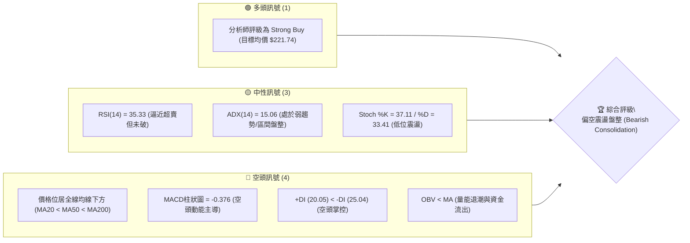
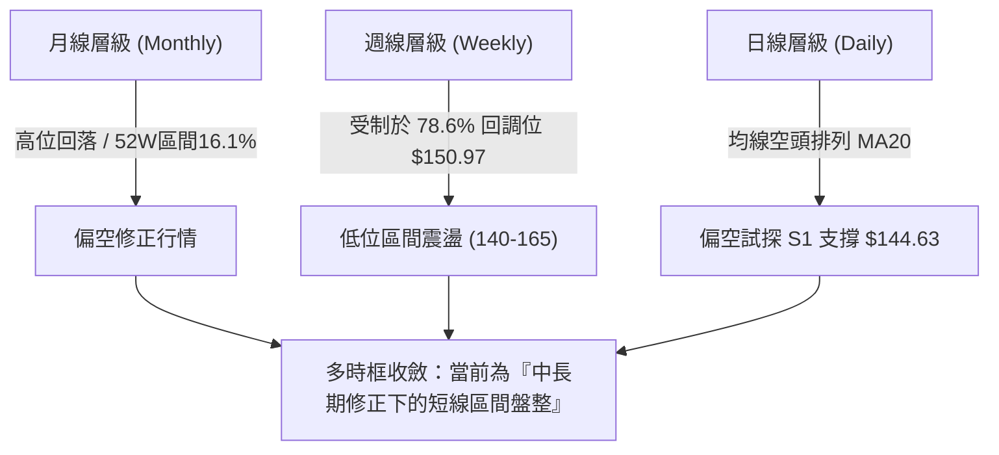
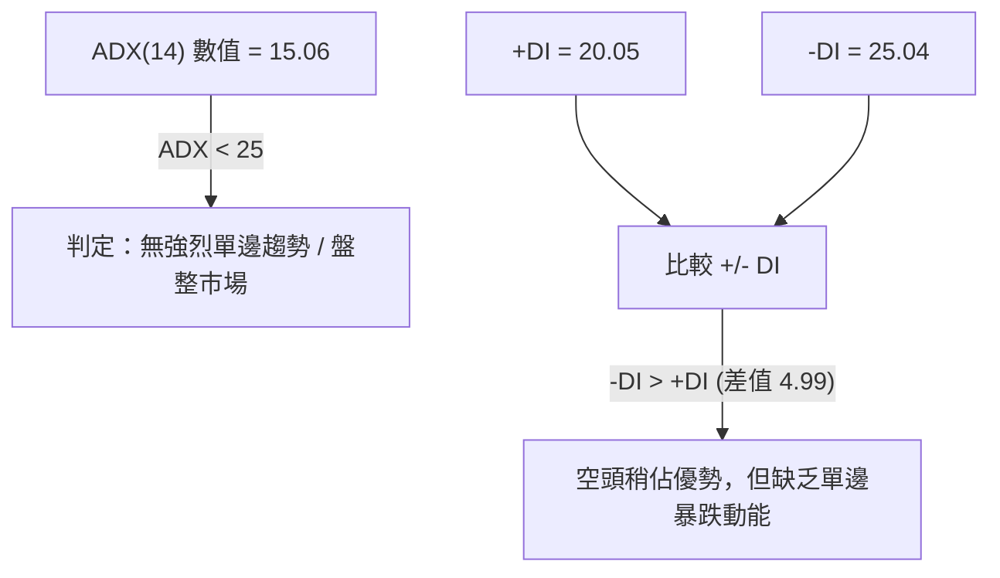
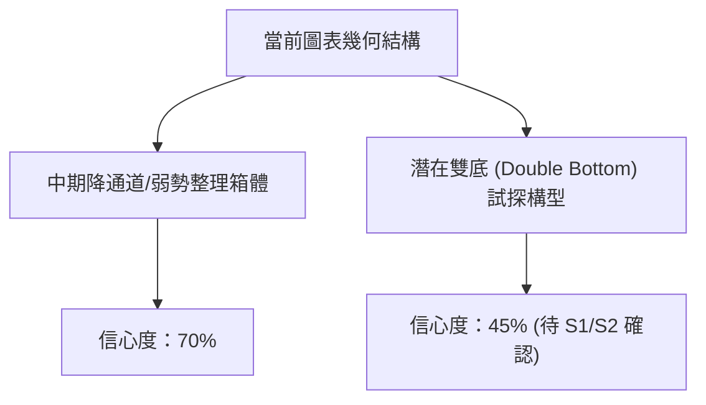
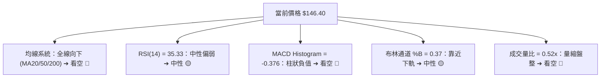
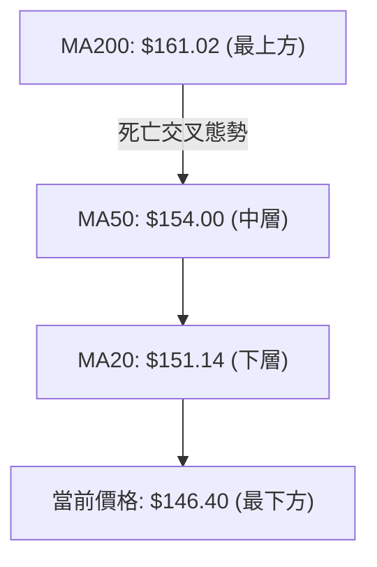
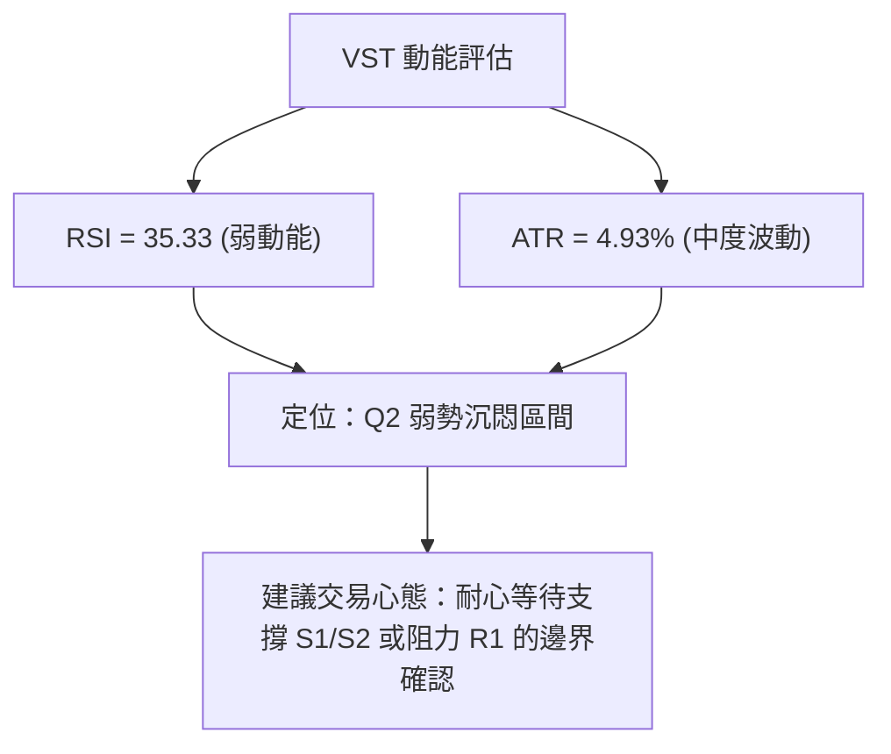
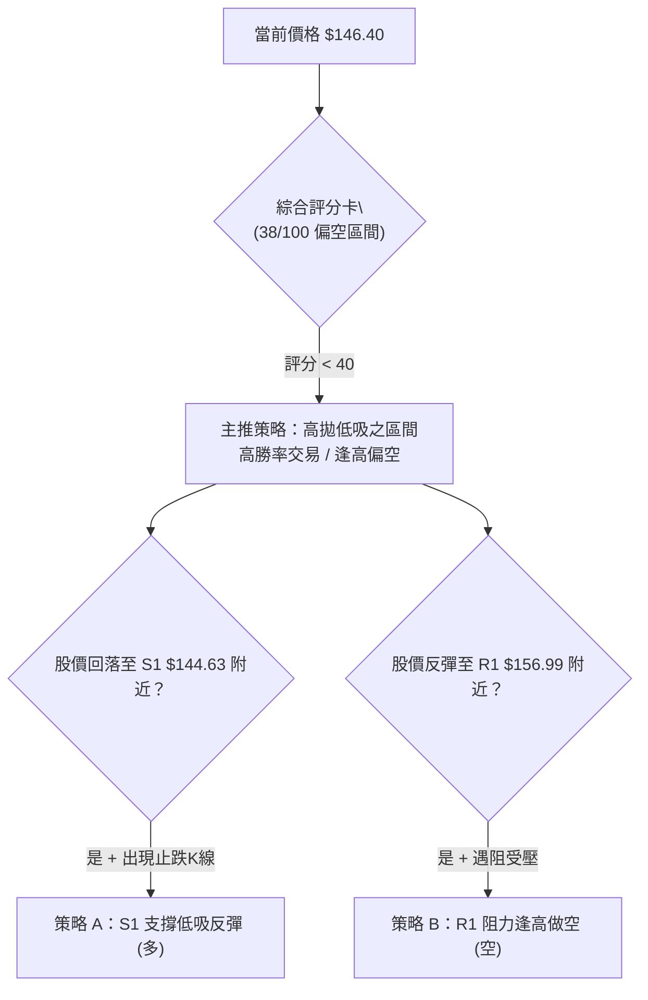
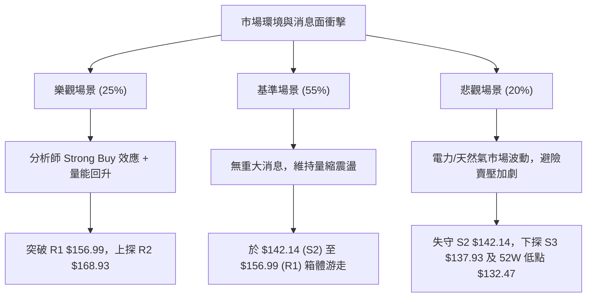

# VST 技術分析報告

> **報告日期**：2026-08-14 ｜ **語言**：繁體中文 ｜ **數據來源**：Yahoo Finance ｜ **當前價格**：$146.40

---

## 目錄

| 章節 | 內容 |
|------|------|
| [1. 技術面概覽](#1-技術面概覽) | 訊號儀表板、核心指標、評分卡 |
| [2. 趨勢分析](#2-趨勢分析) | 多時框趨勢、長中短期走勢、ADX強度 |
| [3. 圖表形態分析](#3-圖表形態分析) | 形態識別、信心度矩陣、K線組合與目標價 |
| [4. 支撐與阻力](#4-支撐與阻力) | 關鍵價位結構、斐波那契回調層級分析 |
| [5. 技術指標深度解讀](#5-技術指標深度解讀) | 均線系統、RSI、MACD、布林通道與量價結構 |
| [6. 動能與波動率](#6-動能與波動率) | 動能四象限、ATR波動風險、Beta市場相關性 |
| [7. 多時框架總結](#7-多時框架總結) | 時框架評分矩陣、多時框收斂與方向收斂 |
| [8. 交易策略建議](#8-交易策略建議) | 策略路由、價格情境階梯、多空交易計畫與風險報酬比 |
| [9. 風險提示與監控](#9-風險提示與監控) | 關鍵監控 Checklist、三情境演變、倉位風控 |
| [10. 報告總結](#10-報告總結) | 綜合評級與核心操作綱領 |

---

## 1. 技術面概覽

### 🎯 技術訊號儀表板



### 📊 核心指標速覽表

| 指標類別 | 指標名稱 | 當前數值 | 訊號 | 解讀 |
|----------|----------|----------|------|------|
| **價格** | 當前收盤價 | $146.40 | 🔴 | 位於 52 週區間 (16.1% 低位)，遠低於高點 $218.91 |
| **均線** | MA20 (20日均線) | $151.14 | 🔴 | 價格低於 MA20，短線呈回檔走勢 |
| **均線** | MA50 (50日均線) | $154.00 | 🔴 | 價格低於 MA50，中線趨勢承壓 |
| **均線** | MA200 (200日均線)| $161.02 | 🔴 | 價格低於 MA200，長線牛熊分界線失守 |
| **動能** | RSI(14) | 35.33 | 🟡 | 進入弱勢區間 (30-50)，尚未進入 <30 極端超賣 |
| **動能** | MACD (12,26,9) | -3.462 / -0.376 | 🔴 | MACD 於零軸下方，柱狀圖為負，空頭控制動能 |
| **趨勢** | ADX(14) | 15.06 | 🟡 | ADX < 25 表示單邊強趨勢放緩，轉為無趨勢/寬幅盤整 |
| **波動** | ATR(14) | $7.21 | 🟡 | 占股價 4.93%，每日波動度中等偏高，震盪劇烈 |
| **通道** | 布林通道 %B | 0.37 | 🟡 | 位於中軌 ($151.14) 與下軌 ($132.89) 之間 |
| **成交量**| 最新量 / 20日均量 | 2.39M / 4.58M | 🔴 | 量比僅 0.52x，追價買盤缺乏，量能出現退潮 |

### 🏆 技術評分卡

```
╔══════════════════════════════════════════════════════════════════╗
║                 技術評分卡 — VST (2026-08-14)                     ║
╠══════════════════════════════════════════════════════════════════╣
║ 趨勢強度 (ADX)     ▓▓▓▓▓░░░░░░░░░░░░░░░  25/100  🟡 弱趨勢/盤整   ║
║ 動能指標 (RSI/MACD) ▓▓▓▓▓▓▓░░░░░░░░░░░░░░  35/100  🔴 空頭佔優      ║
║ 支撐穩定度         ▓▓▓▓▓▓▓▓▓▓▓▓░░░░░░░░  60/100  🟡 接近強支撐S1  ║
║ 成交量配合         ▓▓▓▓▓▓░░░░░░░░░░░░░░  30/100  🔴 量能萎縮      ║
║ 形態完整度         ▓▓▓▓▓▓▓▓▓░░░░░░░░░░░  45/100  🟡 箱體震盪構造  ║
║ 均線排列           ▓▓▓▓░░░░░░░░░░░░░░░░  20/100  🔴 完全空頭排列  ║
╠══════════════════════════════════════════════════════════════════╣
║ 綜合技術評分       ▓▓▓▓▓▓▓▓░░░░░░░░░░░░  38/100  🔴 偏空區間整理  ║
╚══════════════════════════════════════════════════════════════════╝
```

---

## 2. 趨勢分析

### 🌐 多時框趨勢分析



### 📈 長期趨勢 — 24個月走勢圖（Unicode）

```
VST 月線走勢圖（2024-08 至 2026-08）
價格軸 ($)
$210 ┤                                      ● (2025-07 $207.45)
$195 ┤                                ●   ●   ●
$180 ┤                            ●               ●
$165 ┤                ●       ●                       ●   ●
$150 ┤            ●       ●                               ●   ● (現在 $146.40)
$135 ┤        ●       ●                                       ●
$120 ┤    ●       ●
$100 ┤
 $84 ┤●
     └────────────────────────────────────────────────────────────
      24-08 24-11 25-02 25-05 25-08 25-11 26-02 26-05 26-08
```

#### 走勢特徵分析表

| 階段區間 | 起始價 → 終點價 | 漲跌幅 | 走勢特徵與驅動因素 |
|----------|------------------|--------|--------------------|
| **2024-08 ~ 2025-01** | $84.39 → $166.65 | +97.48% | 電力與 AI 數據中心能源需求推升，強烈主升段 |
| **2025-02 ~ 2025-03** | $166.65 → $116.68 | -29.98% | 高位獲利了結與大盤波動，急劇拉回 |
| **2025-04 ~ 2025-07** | $128.79 → $207.45 | +61.08% | 再次突破歷史新高，摸高至 $218.91 (52W High) |
| **2025-08 ~ 2026-01** | $188.12 → $157.91 | -16.06% | 震盪做頂，高點逐漸降低 (Lower Highs) |
| **2026-02 ~ 2026-08** | $173.41 → $146.40 | -15.58% | 震盪向下尋找底部，目前接近 52 週低點區 ($132.47) |

### 📊 中期趨勢（週線分析）

```
VST 近 20 週價格與壓力支撐結構示意圖
$170 ┤             [R2 $168.93] --------------------------------
$165 ┤       ●  ●     ●  ●     ●
$160 ┤    ●        ●        ●     ●
$155 ┤ ●                     ●       [R1 $156.99] --------------
$150 ┤●                               ●
$145 ┤   ●                             ●  ● [現價 $146.40]
$140 ┤      ●                               ● [S1 $144.63] -----
$135 ┤                                        [S2 $142.14] -----
```

從週線數據觀察，過去 20 週價格在 $139.48（2026-05-17 低點）至 $164.12（2026-04-26 高點）之間進行寬幅箱體震盪。最近三週自 2026-07-26 的高點 $163.38 連續回落至目前 $146.40，週線 MACD 柱狀圖再次擴大至 -0.376，顯示中期仍未擺脫築底區間。

### ⚡ 趨勢強度評估（ADX 解讀）



| 指標項 | 數值 | 標準門檻 | 判讀結論 |
|--------|------|----------|----------|
| **ADX(14)** | 15.06 | < 25 (弱趨勢/盤整) | 當前市場處於**無趨勢震盪**階段，不宜使用趨勢追隨策略。 |
| **+DI(14)** | 20.05 | - | 多頭買盤動能微弱。 |
| **-DI(14)** | 25.04 | - | 空頭賣壓略高於多頭，但未達極致膨脹狀態。 |

---

## 3. 圖表形態分析

### 🔍 形態識別系統



#### 形態信心度與目標價評估表

| 形態名稱 | 信心度 | 判斷依據（引用數據） | 完成度 | 形態目標價（附計算式） |
|----------|--------|----------------------|--------|------------------------|
| **下降通道/箱體震盪** | **70%** | 價格介於下軌 S2 $142.14 與上軌 R2 $168.93 之間，ADX=15.06 | 85% | 上軌目標 $168.93；下軌目標 $132.47 |
| **潛在雙底 (Double Bottom)** | **45%** | 2026-05 低點 $139.48 與 2026-08 低點 $140.59 形成雙腳試探 | 40% | 頸線 R1 $156.99，推算：$156.99 + ($156.99 - $139.48) = **$174.50** (信心度 <50%，僅供參考) |

*註：依據規則，雙底形態信心度低於 50%，僅作指標型與區間解讀，交易不宜過度依賴未完成之雙底。*

### 🕯️ 重要 K 線形態分析（近 4 個月收盤分析）

| 月份 | 收盤價 | 關鍵走勢與 K 線形態 | 技術解讀 | 訊號 |
|------|--------|----------------------|----------|------|
| **2026-05** | $160.01 | 下影線回升陽線 | 月線於 $139.48 獲得支撐大幅反彈，顯示低位有強買盤 | 🟢 |
| **2026-06** | $158.63 | 高位十字星 (Doji) | 反彈受制於 MA50 ($154) 與 MA200 ($161) 之間，買賣雙方陷入膠著 | 🟡 |
| **2026-07** | $148.19 | 中陰線下破 | 再次失守 $150 關卡，多頭反彈受阻於 $163.38 | 🔴 |
| **2026-08** | $146.40 | 弱勢小陰線 (截至08-14) | 價格回落至 $146.40，試探 S1 ($144.63) 支撐有效性 | 🔴 |

### 📉 ASCII 走勢形態示意圖

```
VST 箱體震盪與邊界結構 ($132.47 ~ $168.93)
$168.93 ┤========================================= [箱體頂部 / R2]
        │    /\        /\
        │   /  \      /  \
$156.99 ┤--/----\----/----\----------------------- [頸線 / R1]
        │ /      \  /      \
$146.40 ┤/________\/________\_____________________ [現價 $146.40]
$144.63 ┤----------------------------------------- [箱體支撐 / S1]
$132.47 ┤========================================= [52W 低點 / 100% Fib]
```

---

## 4. 支撐與阻力

### 🗺️ 關鍵價位分布圖（Unicode）

```
VST 價位結構分布圖
════════════════════════════════════════════════════════════
$218.91 ║████████████████████████████████║ 52W High (0.0% Fib)
$198.51 ║██████████████████████          ║ 23.6% Fib 回調位
$185.89 ║██████████████████              ║ 38.2% Fib 回調位
$177.74 ║████████████████                ║ 強阻力 R3
$175.69 ║████████████████                ║ 50.0% Fib 中軸位
$168.93 ║██████████████                  ║ 阻力 R2 / BB 上軌附近 ($169.38)
$165.49 ║█████████████                   ║ 61.8% Fib 黃金分割位
$161.02 ║████████████                    ║ MA200 長線均線反壓
$156.99 ║██████████                      ║ 關鍵阻力 R1
$150.97 ║███████                         ║ 78.6% Fib 回調位
$146.40 ╠════════════════════════════════╣ ◄ 當前收盤價 $146.40
$144.63 ║▓▓▓▓▓▓▓▓                        ║ 近期關鍵支撐 S1
$142.14 ║▓▓▓▓▓▓                          ║ 波段強支撐 S2
$137.93 ║▓▓▓▓                            ║ 深遠支撐 S3
$132.47 ║████████████████████████████████║ 52W Low (100.0% Fib)
════════════════════════════════════════════════════════════
```

### 🚧 阻力位分析表

| 阻力級別 | 價位 | 形成原因 | 突破難度 | 重要性 |
|----------|------|----------|----------|--------|
| **R1** | **$156.99** | 近一年波段高點聚類、接近 MA50 ($154.00) 與 MA120 ($155.81) 反壓 | 🟡 中等 | 🟢 短線多空強弱分界點，突破方能扭轉短線劣勢 |
| **R2** | **$168.93** | 波段高點聚類、接近布林上軌 ($169.38) 與 MA240 ($167.54) | 🔴 極高 | 🟡 中期結構反轉關鍵，需大量配合 |
| **R3** | **$177.74** | 歷史套牢密集成交區、接近 50.0% 斐波那契位 ($175.69) | 🔴 極高 | 🔴 中長期強烈頭部解套賣壓區 |

### 🛡️ 支撐位分析表

| 支撐級別 | 價位 | 形成原因 | 守住機率 | 重要性 |
|----------|------|----------|----------|--------|
| **S1** | **$144.63** | 近一年波段低點聚類，與 MA5 ($144.29) 形成短期重疊 | 65% | 🟢 短線防線，跌破將引發向 S2 尋求支撐 |
| **S2** | **$142.14** | 近一年波段低點聚類，接近 2026-08-09 密集交易低點 | 75% | 🟡 箱體下沿防禦陣地，多頭退無可退之強支撐 |
| **S3** | **$137.93** | 接近 2026-05-17 低點 $139.48 與 52W 低點 $132.47 的最後防線 | 85% | 🔴 長線牛熊存亡線，失守將面臨 52W 低點保衛戰 |

### 📐 斐波那契回調位分析

*以 52 週高點 **$218.91** 至 52 週低點 **$132.47** 計算：*

- **0.0% (52W High)**: $218.91
- **23.6%**: $198.51
- **38.2%**: $185.89
- **50.0%**: $175.69
- **61.8%**: $165.49
- **78.6%**: $150.97
- **100.0% (52W Low)**: $132.47

**價位落點解讀**：
當前收盤價 **$146.40** 落於 **78.6% 回調位 ($150.97)** 與 **100.0% 回調位 ($132.47)** 之間。$150.97 區間已由過去的支撐轉化為當前上方直接動態阻力。若股價無法重新站上 78.6% ($150.97)，則技術面將持續受制於深度的斐波那契回撤框架內。

---

## 5. 技術指標深度解讀

### 🎛️ 指標訊號總覽



### 📈 移動平均線排列分析



- **均線排列狀態**：MA20 ($151.14) < MA50 ($154.00) < MA200 ($161.02)，構成標準的**空頭排列 (Bearish Alignment)**。
- **均線動態**：短天期 MA5 ($144.29) 與 MA10 ($145.08) 出現微微向上勾頭 (+1.46% / +0.91%)，顯示極短線有試探性止跌，但受到上方 MA20 ($151.14) 的強烈蓋頂壓制。

### 📉 RSI(14) 分析

```
RSI(14) 當前數值：35.33
0 [███████████░░░░░░░░░░░░░░░░░░░░] 100
           ^ (35.33 - 弱勢區間)
```

- **數值狀態**：35.33，位於 30-50 的弱勢掌控區。
- **背離檢測**：比較 2026-05-17 週線低點 (RSI 25.5) 與 2026-08-16 週線低點 (RSI 35.3)，價格二次探底，但 RSI 低點並未創新低，呈現**微弱的週線級底背離雛形**，但仍需日線放大確認。

### 📊 MACD(12,26,9) 訊號解讀

- **MACD 快線**：-3.462
- **MACD 慢線 (Signal)**：-3.086
- **MACD 柱狀圖 (Histogram)**：-0.376 (雙線死叉後於零軸下方擴張)
- **解讀**：MACD 快慢線均在零軸下方運行，且柱狀圖維持負數，顯示中短期空頭動能完全支配盤面，暫無金叉轉強訊號。

### 📦 布林通道分析

```
VST 布林通道構型 ($132.89 - $169.38)
$169.38 ┤========================================= BB 上軌
        │
$151.14 ┤----------------------------------------- BB 中軌 (MA20)
$146.40 ┤- - - - - - - ● - - - - - - - - - - - -  現價 (%B = 0.37)
        │
$132.89 ┤========================================= BB 下軌
```

- **上軌**：$169.38
- **中軌 (MA20)**：$151.14
- **下軌**：$132.89
- **%B 指標**：0.37。顯示價格位於中軌下方、靠近下軌的位置，帶寬未出現顯著收縮或急劇開口，保持在標準震盪管道中。

### 💹 成交量分析（量價配合度）

- **最新成交量**：2,392,083 股
- **20日平均量**：4,583,614 股 (量比 0.52x)
- **OBV (能量潮)**：OBV < MA，能量潮指標低於其移動平均線，顯示資金持續呈現淨流出。
- **量價配合**：下跌過程中成交量萎縮，說明市場並無恐慌性拋盤，但缺乏買盤推升，呈現「無量陰跌/震盪」特徵。

---

## 6. 動能與波動率

### ⚡ 動能評估四象限

| 象限區塊 | 動能強度 | 波動率水準 | 當前 VST 歸屬 | 評估與策略指引 |
|----------|----------|------------|---------------|----------------|
| **Q1 (強動能/低波動)** | 強 (RSI > 55) | 低 (ATR < 4%) | — | 最佳趨勢續漲區 |
| **Q2 (弱動能/低波動)** | 弱 (RSI < 45) | 中/低 (ATR 4.93%) | **✓ VST 位於此區** | **觀望或區間低吸高拋，不可追高** |
| **Q3 (強動能/高波動)** | 強 (RSI > 60) | 高 (ATR > 6%) | — | 高風險突破追價區 |
| **Q4 (弱動能/高波動)** | 弱 (RSI < 40) | 高 (ATR > 6%) | — | 恐慌殺跌/避險區 |



### 📊 ATR 波動率分析

- **ATR(14)**：$7.21 (相當於股價的 4.93%)
- **每日波動幅度**：平均每日上下振幅約 $7.21。
- **止損距離建議**：
  - **短線交易 (1.5x ATR)**：$7.21 × 1.5 = **$10.82**
  - **波段交易 (2.0x ATR)**：$7.21 × 2.0 = **$14.42**

### 📐 Beta 與市場相關性

- **Beta 係數**：**1.433**
- **解讀**：VST 的波動度顯著高於大盤 (S&P 500) 達 43.3%。大盤每波動 1%，VST 平均波動約 1.43%。在市場整體避險情緒上升時，VST 容易出現放大倍數的回調。

---

## 7. 多時框架總結

### 📋 時框架評分表

| 時框架 | 趨勢方向 | 動能狀態 | 均線排列 | 形態結構 | 綜合評分 | 建議策略 |
|--------|----------|----------|----------|----------|----------|----------|
| **日線 (Daily)** | 偏空 | 弱勢 (RSI 35) | 空頭排列 | 箱體下沿試探 | 35/100 🔴 | 觀望或短線極度靠近 S1 低吸 |
| **週線 (Weekly)**| 震盪 | 中性偏弱 | 壓制於 MA20 | 140-165 大箱體 | 42/100 🟡 | 區間操作，嚴控倉位 |
| **月線 (Monthly)**| 長期多頭回調 | 修正中 | 仍高於遠期支撐 | 高位大幅拉回 | 50/100 🟡 | 長線定期定額/耐心等待築底 |

### 🔲 綜合訊號矩陣

```
┌─────────────────┬──────────────────┬──────────────────┐
│   時框架 \ 維度 │   動能 (RSI/MACD)│   形態與均線     │
├─────────────────┼──────────────────┼──────────────────┤
│   日線 (Short)  │   🔴 看空 (-0.376)│   🔴 空頭排列    │
│   週線 (Medium) │   🟡 中性 (35-45) │   🟡 箱體震盪    │
│   長期 (Long)   │   🟢 多頭基底    │   🟡 高位回檔    │
└─────────────────┴──────────────────┴──────────────────┘
```

### ⚖️ 多時框收斂結論

依據多時框收斂規則：當前 **ADX = 15.06 (< 25)**，確認市場處於**無單邊強趨勢的「區間盤整行情」**。
雖然日線均線呈空頭排列，但因缺乏大帶量下跌與單邊趨勢動能，價格極難直接無預警暴跌穿透 S1 ($144.63) / S2 ($142.14) 區間。**主導時框為「日線至週線級別的箱體震盪」**。

---

## 8. 交易策略建議

### 🗺️ 策略決策流程圖



### 🧭 策略路由

**當前主策略方向：區間震盪與低吸高拋 (以 S1/S2 為界防守 / 綜合評分 38/100)**

由於評分卡得分為 38/100，且 ADX 為 15.06（盤整），不建議突破追價。策略以**「靠近支撐位 S1 低吸做反彈」**或**「靠近阻力位 R1 逢高受壓做空」**之雙向區間操作為主。

### 🎯 價格情境階梯 (Price Scenarios)

| 觸發條件 | 下一目標價 | 後續延伸目標 | 情境技術含義 |
|----------|------------|--------------|--------------|
| **突破 R1 $156.99** | R2 $168.93 | R3 $177.74 | 短線空頭結構瓦解，挑戰布林上軌與更高區間 |
| **站穩現價 $146.40**| R1 $156.99 | 78.6% Fib $150.97 | 維持 $144 - $156 窄幅箱體整理 |
| **跌破 S1 $144.63** | S2 $142.14 | S3 $137.93 / 52W Low $132.47 | 空頭測試強支撐區，尋求 52 週低點保衛 |

### 📊 情境機率分佈

| 情境劇本 | 機率估計 | 主要技術依據 |
|----------|----------|--------------|
| **區間震盪 (142 - 157)** | **55%** | ADX = 15.06 弱趨勢，量能僅 0.52x，缺乏單邊突破量 |
| **探底回升反彈** | **25%** | RSI(14) 近 35 逼近超賣，S1 $144.63 具備多頭買盤支擋 |
| **破位向下大跌** | **20%** | MACD 為負且全線均線壓制，但受限於量縮而下行空間受限 |

### 🟢 交易策略詳情

#### 策略 A：S1 支撐低吸反彈策略 (多頭區間)

- **進場條件**：價格拉回至 S1 ($144.63) 附近出現日線止跌（如下影線或陽包陰），且 RSI 止跌回升。
- **進場價格**：**$144.63**
- **目標價 T1**：**$150.97** (78.6% 斐波那契回調位)
- **目標價 T2**：**$156.99** (關鍵阻力 R1)
- **止損價格**：**$140.50** (跌破 S2 $142.14 後給予 1.50 美元緩衝)
- **風險報酬比 (R/R Ratio)**：
  - 至 T1：($150.97 - $144.63) / ($144.63 - $140.50) = $6.34 / $4.13 = **1.53 : 1**
  - 至 T2：($156.99 - $144.63) / ($144.63 - $140.50) = $12.36 / $4.13 = **2.99 : 1**
- **勝率估計**：55%
- **建議倉位**：5% - 8% (中低倉位)

#### 策略 B：R1 阻力反彈受壓做空策略 (空頭順勢)

- **進場條件**：價格反彈至 R1 ($156.99) 附近遇阻（收長上影線），且 MACD 柱狀圖未能轉正。
- **進場價格**：**$156.99**
- **目標價 T1**：**$146.40** (當前價格位)
- **目標價 T2**：**$142.14** (波段強支撐 S2)
- **止損價格**：**$161.50** (突破 MA200 $161.02 宣告空頭失效)
- **風險報酬比 (R/R Ratio)**：
  - 至 T1：($156.99 - $146.40) / ($161.50 - $156.99) = $10.59 / $4.51 = **2.35 : 1**
  - 至 T2：($156.99 - $142.14) / ($161.50 - $156.99) = $14.85 / $4.51 = **3.29 : 1**
- **勝率估計**：60%
- **建議倉位**：8% - 10%

### 🔴 反向風險觸發點（對沖與風控提示）

- **多頭失效點**：收盤價強勢跌破 **$142.14 (S2)**，代表箱體失守，應全面止損離場，不宜死守。
- **空頭失效點**：收盤價強勢突破站穩 **$161.02 (MA200)**，代表長線趨勢重新轉多，所有空頭頭寸應立即平倉。

### ⭐ 整體訊號強度評星

```
做多訊號強度：  ★★☆☆☆  (2/5 星 - 僅限支撐位低吸)
做空訊號強度：  ★★★☆☆  (3/5 星 - 順應均線壓制)
整體可信度：    ★★★☆☆  (3/5 星 - 盤整區間可信度中等)
```

---

## 9. 風險提示與監控

### ✅ 關鍵監控指標 Checklist

```
╔══════════════════════════════════════════════════════════════════╗
║                 VST 風險監控指標 CHECKLIST                        ║
╠══════════════════════════════════════════════════════════════════╣
║ [ ] 每日收盤價是否跌破 S1 ($144.63)                              ║
║ [ ] RSI(14) 是否跌破 30 進入超賣，或突破 50 進入強勢             ║
║ [ ] MACD 柱狀圖由負轉正 (-0.376 ➔ +0.000)                        ║
║ [ ] 成交量是否放大至 20日均量 (4.58M) 的 1.5倍以上 (大膽確認)     ║
║ [ ] ADX(14) 是否突破 25 (代表單邊趨勢開始形成)                   ║
╚══════════════════════════════════════════════════════════════════╝
```

### ⚠️ 風險場景分析



### 🛡️ 風險管理重要提醒

1. **嚴禁追漲殺跌**：ADX(14) 僅為 15.06，此階段追價極易買在箱頂或賣在箱底。
2. **波動度保護**：VST 的 Beta 高達 1.433，ATR 為 $7.21，單日震盪幅度大，止損設定必須預留 1.5x - 2.0x ATR 的空間（至少 $10.82）以防被無效洗盤淘汰。
3. **倉位管理**：鑑於整體技術評分僅 38/100，單一方向總部位不宜超過總資金的 10%-15%。

---

## 📋 報告總結

```
╔══════════════════════════════════════════════════════════════════╗
║                    VST 技術分析報告總結                          ║
╠══════════════════════════════════════════════════════════════════╣
║ 報告日期：2026-08-14                                             ║
║ 當前價格：$146.40                                                 ║
║ 技術評級：🔴 偏空區間整理 (Bearish Consolidation / Score 38)     ║
║                                                                  ║
║ 核心架構結論：                                                   ║
║ ├─ 長期趨勢：🟡 高位大幅修正後之築底期 (52W 高點下挫 -33.1%)      ║
║ ├─ 中期趨勢：🟡 140 - 165 美元大型箱體震盪                        ║
║ ├─ 短期趨勢：🔴 均線空頭排列，試探 S1 ($144.63) 支撐             ║
║ ├─ 關鍵支撐：S1 $144.63 / S2 $142.14                             ║
║ ├─ 關鍵阻力：R1 $156.99 / R2 $168.93                             ║
║ └─ 分析師目標價：$221.74 (基本面看好，但技術面需耐心等待)       ║
║                                                                  ║
║ 最優操作策略：                                                   ║
║ 1. 🥇 首選機會：$144.63 (S1) 附近逢低佈局反彈 (目標 $156.99)    ║
║ 2. 🥈 次選機會：$156.99 (R1) 遇阻受壓高空 (目標 $142.14)        ║
║ 3. 🥉 保守選擇：等待 ADX > 25 且價格突破 R1 後再順勢追價          ║
╚══════════════════════════════════════════════════════════════════╝
```

---

> ⚠️ **免責聲明**：本報告為 AI 技術分析研究產出，所有價格、指標及分析均依據提供的歷史數據（截至 2026-08-14）進行客觀演算。本報告**僅供研究與學術參考**，**不構成任何個人投資操作建議或買賣邀約**。投資涉及風險，入市請獨立思考並嚴格執行風控。

---

*報告生成時間：2026-08-14 ｜ 數據來源：Yahoo Finance ｜ 分析框架：多時框技術分析規範*