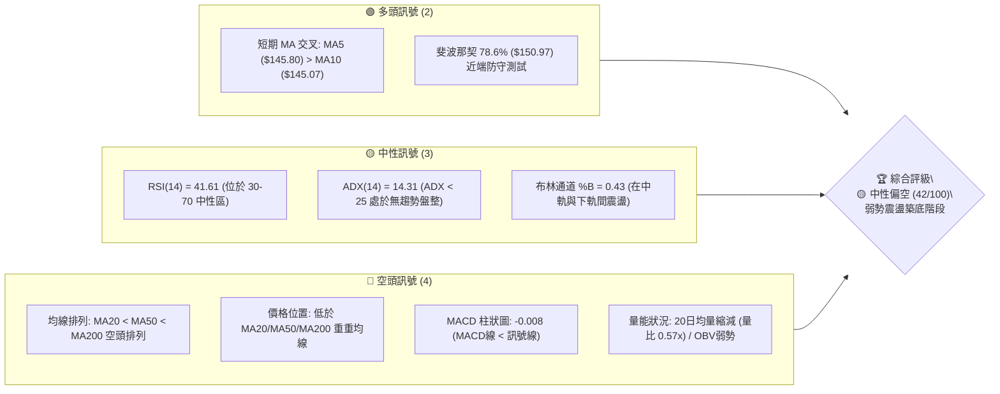
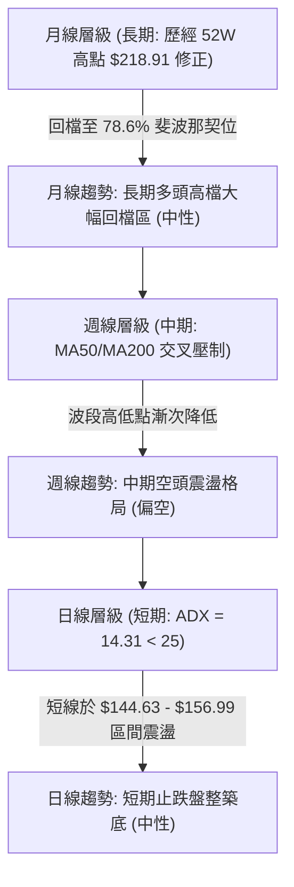
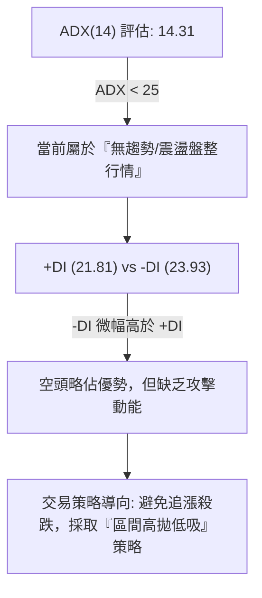
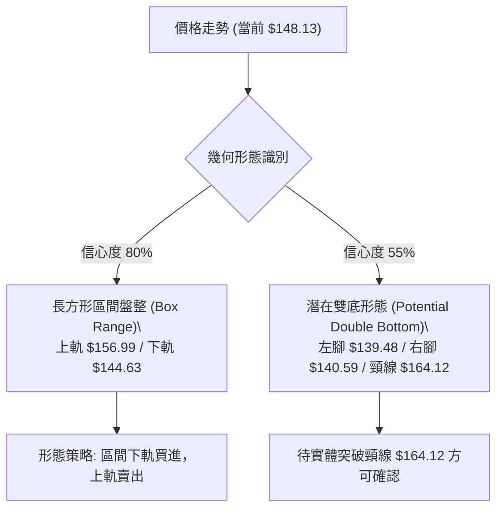
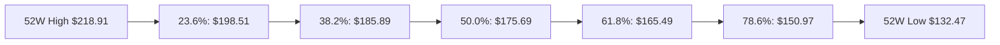
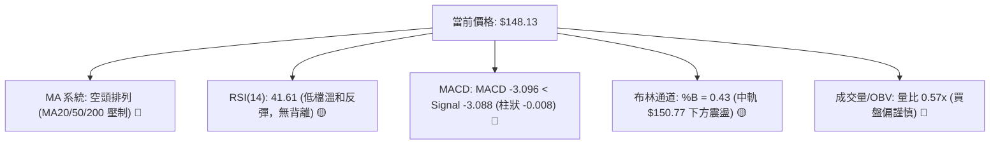
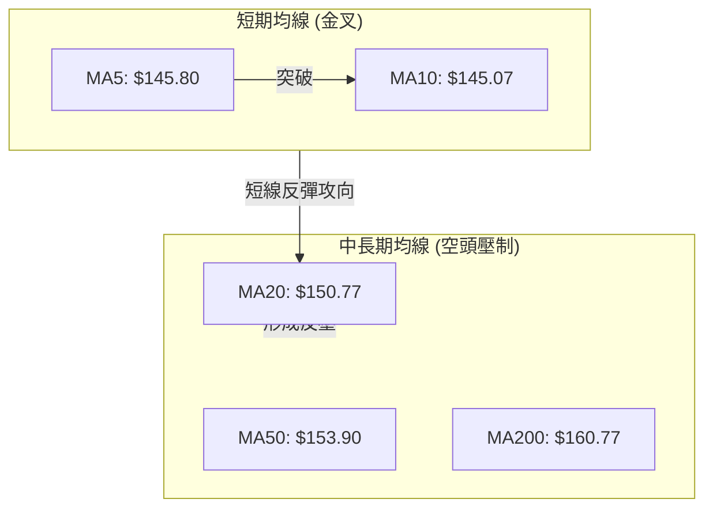
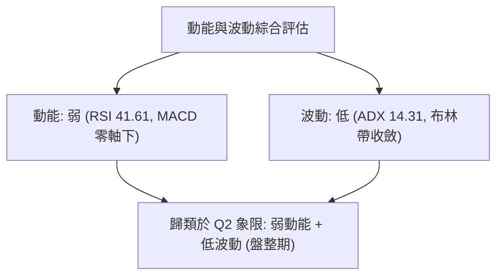
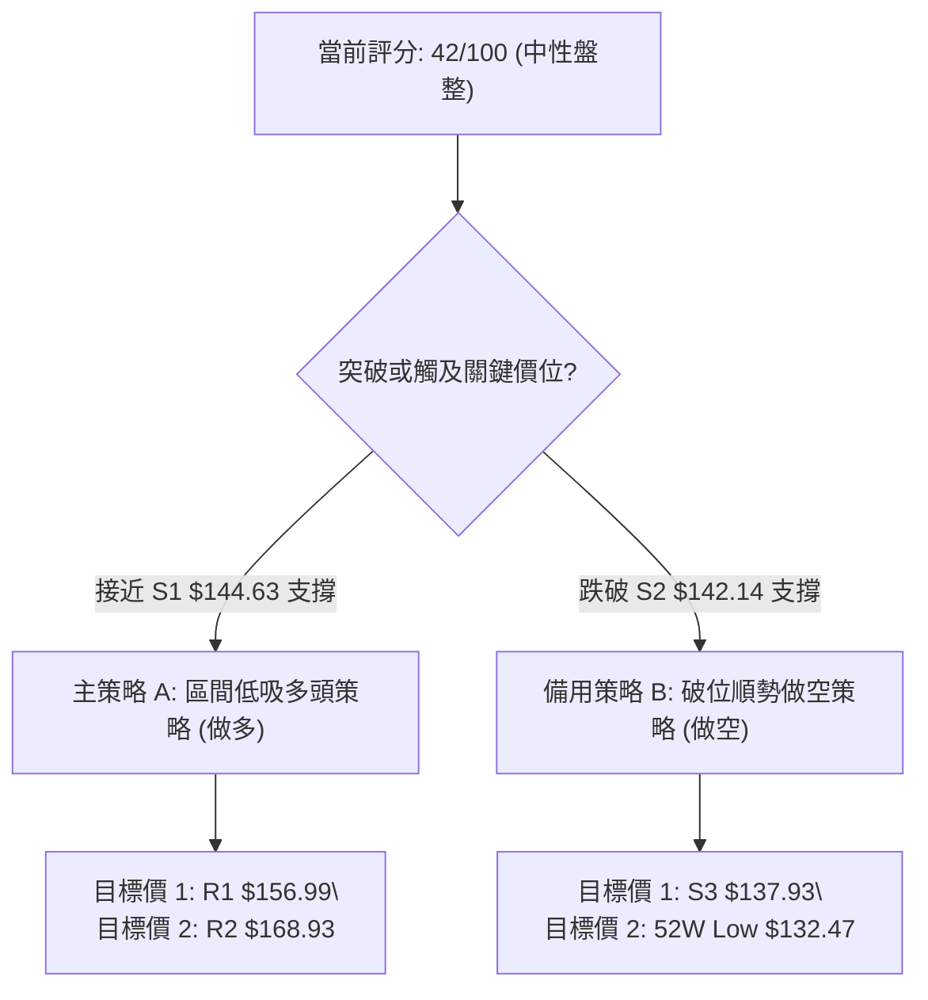
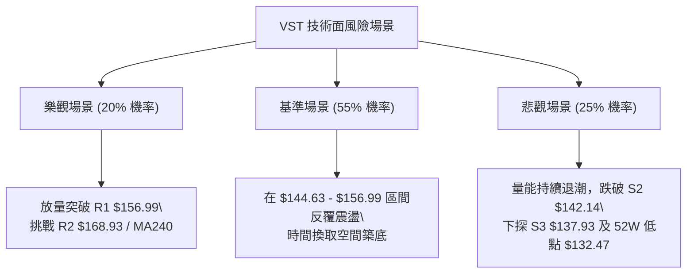

# VST 技術分析報告

> **報告日期**：2026-08-15 ｜ **語言**：繁體中文 ｜ **數據來源**：Yahoo Finance ｜ **當前價格**：$148.13

---

## 目錄

| 章節 | 內容 |
|------|------|
| [1. 技術面概覽](#1-技術面概覽) | 訊號儀表板、核心指標、評分卡 |
| [2. 趨勢分析](#2-趨勢分析) | 多時框趨勢、長中短期走勢 |
| [3. 圖表形態分析](#3-圖表形態分析) | 形態識別、K線組合、目標價 |
| [4. 支撐與阻力](#4-支撐與阻力) | 關鍵價位、斐波那契回調 |
| [5. 技術指標深度解讀](#5-技術指標深度解讀) | MA/RSI/MACD/布林/成交量 |
| [6. 動能與波動率](#6-動能與波動率) | 動能評估、ATR、Beta |
| [7. 多時框架總結](#7-多時框架總結) | 時框架評分矩陣 |
| [8. 交易策略建議](#8-交易策略建議) | 多空策略、風險報酬比 |
| [9. 風險提示與監控](#9-風險提示與監控) | 監控指標、風險場景 |

---

## 1. 技術面概覽

### 🎯 技術訊號儀表板



---

### 📊 核心指標速覽表

| 指標類別 | 指標名稱 | 當前數值 | 訊號 | 解讀 |
|----------|----------|----------|------|------|
| **價格** | 當前價格 | $148.13 | 🔴 空頭 | 位於 52 週高低價區間之 18.1% 低檔位置 |
| **均線** | MA20 | $150.77 | 🔴 空頭 | 價格在 MA20 下方 (-1.75%)，短線反壓強烈 |
| **均線** | MA50 | $153.90 | 🔴 空頭 | 價格在 MA50 下方 (-3.75%)，中期趨勢偏弱 |
| **均線** | MA200 | $160.77 | 🔴 空頭 | 價格在 MA200 下方 (-7.86%)，長期均線轉壓 |
| **動能** | RSI(14) | 41.61 | 🟡 中性 | 無超買超賣，短線自超賣區溫和修復 |
| **動能** | MACD | -3.096 | 🔴 空頭 | MACD (-3.096) < Signal (-3.088)，Hist -0.008 |
| **動能** | Stoch %K/%D | 60.16 / 43.78 | 🟡 中性 | K 線上穿 D 線，展現短期反彈契機 |
| **趨勢** | ADX(14) | 14.31 | 🟡 盤整 | ADX < 25 指示單邊趨勢結束，進入區間震盪 |
| **波動** | ATR(14) | $6.74 | 🟡 中波動| 日均波動幅 4.55%，提供充足短線交易空間 |
| **通道** | 布林通道 | $132.60 - $168.95 | 🟡 中性 | %B 為 0.43，價格在中軌 $150.77 下方尋求支撐 |
| **成交量** | 20日均量比 | 0.57x | 🔴 空頭 | 今日量能 2.59M 低於均量 4.51M，追高意願低 |

---

### 🏆 技術評分卡

```
╔══════════════════════════════════════════════════════════════════╗
║                   VST 技術綜合評分卡 (2026-08-15)                ║
╠══════════════════════════════════════════════════════════════════╣
║ 趨勢強度 (ADX/DI)   ███████░░░░░░░░░░░░░  35/100  🔴 空頭主導/弱趨勢║
║ 動能指標 (RSI/MACD) █████████░░░░░░░░░░░  42/100  🟡 中性偏弱        ║
║ 支撐穩定度 (S1/S2)  █████████████░░░░░░░  65/100  🟢 低檔支撐具防守力║
║ 成交量配合 (OBV/VOL)███████░░░░░░░░░░░░░  35/100  🔴 量能退潮/觀望濃厚║
║ 形態完整度 (箱型/底部)████████████░░░░░░░  50/100  🟡 144-156 區間築底║
║ 均線排列 (MA系統)   █████░░░░░░░░░░░░░░░  25/100  🔴 MA20/50/200空頭║
╠══════════════════════════════════════════════════════════════════╣
║ 綜合評分            ████████░░░░░░░░░░░░  42/100  🟡 中性偏空 (盤整)║
╚══════════════════════════════════════════════════════════════════╝
```

---

## 2. 趨勢分析

### 🌐 多時框趨勢分析



---

### 📈 長期趨勢 — 24個月歷史走勢圖

```
VST 24個月收盤價格走勢圖 ($)
$220 ┤                                           ● 207.45
$200 ┤                                        ●            ● 195.11
$180 ┤                                    ●                    ● 178.12
$160 ┤               ● 158.27         ●                            ● 160.01
$140 ┤           ●                ●                                    ● 148.13 (現在)
$120 ┤       ●                ●
$100 ┤   ●
 $80 ┼● 84.39
     └─┬───┬───┬───┬───┬───┬───┬───┬───┬───┬───┬───┬───┬───┬───┬───┬───┬───►
      24/08 09  10  11  12 25/01 02  03  04  05  06  07  08  09  10  11  12 26/08
```

#### 24個月走勢階段特徵分析表

| 階段 | 時間區間 | 起始/結束價 | 漲跌幅 | 走勢特徵與技術驅動因素 |
|------|----------|-------------|--------|------------------------|
| **一、初升段** | 2024/08 - 2025/01 | $84.39 → $166.65 | +97.48% | 電力需求題材爆發，多頭強勢上攻，突破各天期均線。 |
| **二、中期拉回** | 2025/01 - 2025/03 | $166.65 → $116.68 | -29.98% | 高檔獲利了結賣壓湧現，急跌下探波段支撐後打底。 |
| **三、主升段** | 2025/03 - 2025/07 | $116.68 → $207.45 | +77.79% | 強勁買盤推升創下歷史高點區域（最高衝至 $218.91）。 |
| **四、高檔修正** | 2025/07 - 2026/01 | $207.45 → $157.91 | -23.88% | 頂部動能背離，呈現階梯式震盪回檔。 |
| **五、打底盤整** | 2026/01 - 2026/08 | $157.91 → $148.13 | -6.19% | 於 $140 - $165 橫向打底，ADX 降至 14.31，進入無趨勢盤整期。 |

---

### 📊 中期趨勢（週線與關鍵均線分析）

中期走勢受制於 MA200 ($160.77) 與 MA50 ($153.90) 的下彎反壓。近 20 週來，股價多次在 $139.48 - $140.59 區間獲得強烈買盤支撐並發動反彈，但每當攻至 $163.50 - $164.12 區域時，均因量能無法連續放大而回落。

```
週線支撐壓力架構示意圖：
$168.93 ───────────────────────────────────────── R2 強阻力 (布林上軌/近一季高點)
$156.99 ───────────────────────────────────────── R1 關鍵阻力 (短線頸線區)
$148.13 ─── ◄ 當前價格 ($148.13) ─────────────────
$144.63 ───────────────────────────────────────── S1 第一支撐 (近週低點聚類)
$142.14 ───────────────────────────────────────── S2 第二支撐 (波段關鍵低點)
$137.93 ───────────────────────────────────────── S3 強支撐 (前低與布林下軌防線)
```

---

### ⚡ 趨勢強度評估（ADX 解讀）



#### ADX 趨勢強度對照解讀表

| 指標/參數 | 當前數值 | 標準臨界值 | 評估結果 | 策略含義 |
|-----------|----------|------------|----------|----------|
| **ADX(14)** | **14.31** | 25.00 | 🟡 極弱趨勢 (盤整) | 趨勢指標失真，順勢策略易受雙向洗盤；以震盪指標為主。 |
| **+DI** | **21.81** | — | 🟡 多頭力道偏弱 | 多頭嘗試反彈，但動能不足以推動單邊趨勢。 |
| **-DI** | **23.93** | — | 🔴 空頭微幅佔優 | 空頭掌控主導權，惟缺乏暴跌擴散動能。 |
| **DI 差值** | **-2.12** | 0.00 | 🟡 兩軍對峙 | 多空勢力均衡，等待突破 $156.99 或跌破 $144.63 指引方向。 |

---

## 3. 圖表形態分析

### 🔍 形態識別系統



#### 圖表形態信心度與目標價評估表

| 形態名稱 | 信心度 | 判斷依據（引用數據） | 完成度 | 形態目標價計算式 | 目標價 |
|----------|--------|----------------------|--------|------------------|--------|
| **矩形區間盤整** | **80%** | 價格波段重合於 S1 ($144.63) 與 R1 ($156.99)，ADX=14.31 確認盤整。 | 90% | 向上突破: R1 $156.99 + (R1 - S1 $12.36) | **$169.35** |
| **潛在 W 底 (雙底)** | **55%** | 近期兩次低點 $139.48 (05/17) 與 $140.59 (08/09) 形成雙腳，頸線位於 $164.12。 | 45% | 突破頸線: $164.12 + ($164.12 - $139.48) | **$188.76** |

---

### 🕯️ 近期 K 線組合分析

| 日期/週期 | 收盤價 | K 線形態 | 技術解讀 | 訊號強度 |
|-----------|--------|----------|----------|----------|
| **2026-07-26** | $163.38 | 長陽突破線 | 強勢多頭攻擊，衝高測試 R2 附近賣壓。 | 🟢 看多 |
| **2026-08-02** | $148.19 | 中陰長空線 | 高檔回檔，吞噬前一週多數漲幅，多頭力道衰竭。 | 🔴 看空 |
| **2026-08-09** | $140.59 | 下影錘子線 | 下探 52 週低點區界 ($140.59)，逢低買盤強勁介入。 | 🟢 看多 (止跌) |
| **2026-08-16** | $148.13 | 溫和陽線 (止跌) | 收盤價上漲 +7.54 (+5.36%)，短線 MA5/MA10 黃金交叉。 | 🟢 看多 (反彈) |

---

### 📉 ASCII 走勢形態示意圖

```
VST 日線矩形區間與潛在雙底結構示意圖：

$168.93 ┤───────────────────────────────────── (布林上軌 / R2 阻力區)
        │
$164.12 ┤───────────────● 頸線位 ───────────── (W底頸線測試點)
        │              / \
$156.99 ┤─────────────/───\───● (R1 區間頂部) ── (短線反彈壓力)
        │            /     \ /
$148.13 ┤───────────/───────● 當前位置 ($148.13)
        │          /         \
$144.63 ┤─────────/───────────● (S1 區間底部)
        │        /
$139.48 ┤───────● (左腳 05/17) ──────● (右腳 08/09 $140.59)
        └────────────────────────────────────────────────────────
```

---

## 4. 支撐與阻力

### 🗺️ 關鍵價位分布圖

```
╔══════════════════════════════════════════════════════════════════╗
║                    VST 價位結構分布圖 (USD)                      ║
╠══════════════════════════════════════════════════════════════════╣
║ $218.91 ║████████████████████████████████████████║ 52W 最高點 (0.0%)║
║ $198.51 ║████████████████████████████████        ║ 23.6% 斐波那契位 ║
║ $185.89 ║████████████████████████                ║ 38.2% 斐波那契位 ║
║ $177.74 ║██████████████████                      ║ R3 阻力位        ║
║ $175.69 ║█████████████████                       ║ 50.0% 斐波那契位 ║
║ $168.93 ║██████████████                          ║ R2 阻力 / BB上軌 ║
║ $165.49 ║█████████████                           ║ 61.8% 斐波那契位 ║
║ $156.99 ║██████████                              ║ R1 關鍵波段阻力  ║
║ $150.97 ║███████                                 ║ 78.6% 斐波那契位 ║
║ $148.13 ╠════════════════════════════════════════║ ◄ 當前現價 ($148.13)
║ $144.63 ║▓▓▓▓▓▓▓                                 ║ S1 第一波段支撐  ║
║ $142.14 ║▓▓▓▓▓                                   ║ S2 第二波段支撐  ║
║ $137.93 ║▓▓▓                                     ║ S3 第三波段支撐  ║
║ $132.47 ║▓                                       ║ 52W 最低點(100.0%)
╚══════════════════════════════════════════════════════════════════╝
```

---

### 🚧 阻力位分析表

| 阻力級別 | 價位 | 形成原因（波段高點/技術指標） | 突破難度 | 重要性 |
|----------|------|--------------------------------|----------|--------|
| **R1** | **$156.99** | 近一年波段高點聚類、MA50/MA60 反壓區 | 🟡 中等 | 🟢 短線多空強弱分水嶺 |
| **R2** | **$168.93** | 布林通道上軌 ($168.95)、MA240 均線 ($167.38) | 🔴 偏高 | 🟡 中期多頭反攻目標 |
| **R3** | **$177.74** | 近一年高檔套牢波段峰值、斐波那契 50% ($175.69) | 🔴 極高 | 🔴 多頭強勢翻盤主戰場 |

---

### 🛡️ 支撐位分析表

| 支撐級別 | 價位 | 形成原因（波段低點/技術指標） | 守住機率 | 重要性 |
|----------|------|--------------------------------|----------|--------|
| **S1** | **$144.63** | 近一年波段低點聚類，短線打底支撐 | 🟢 70% | 🟢 短線防守第一道防線 |
| **S2** | **$142.14** | 近一年波段密集成交低點聚類 | 🟢 80% | 🟡 區間底部位，不可失守 |
| **S3** | **$137.93** | 近一年波段極限低點、逼近 52W 低點 $132.47 | 🟢 90% | 🔴 長期多頭最後防線 |

---

### 📐 斐波那契回調位分析

基於 52 週高點 **$218.91** 至 52 週低點 **$132.47** 計算：



*   **當前價格位置**：$148.13 落在 **78.6% ($150.97)** 與 **100.0% ($132.47)** 之間。
*   **技術解讀**：價格已深幅回調至全波段黃金分割的極致區域（78.6% 位於 $150.97）。現價 $148.13 正處於挑戰向上站回 $150.97 的關鍵戰略位置。若能成功收復 $150.97，將打開通往 61.8% ($165.49) 的反彈通道；反之，若受阻回落，則將持續下探 S1 ($144.63) 及 52 週低點 $132.47。

---

## 5. 技術指標深度解讀

### 🎛️ 指標訊號總覽



---

### 📈 移動平均線 (MA) 分析



*   **均線狀態**：MA20 ($150.77) < MA50 ($153.90) < MA200 ($160.77)，長中期呈現典型空頭排列。
*   **短線變化**：MA5 ($145.80) 向上突破 MA10 ($145.07)，觸發短線黃金交叉反彈，但上方立即面臨 MA20 ($150.77) 的直接蓋頂壓力。

---

### 📉 RSI(14) 動能分析

```
RSI(14) 指標狀態：
0 [═══════════════════▓▓▓▓▓▓▓▓▓▓▓░░░░░░░░░░░░░░░░░░░░] 100
                    41.61 (中性偏弱區間)
```

*   **數值**：**41.61**（處於 30-70 的中性區）。
*   **趨勢解讀**：RSI 從先前觸及 25.5 (05/17 週) 的超賣區域逐步抬升，顯示低檔具備買盤支撐。
*   **背離檢測**：目前 RSI 與價格走勢保持一致，**無顯著頂背離或底背離**現象，屬於正常的指標修復期。

---

### 📊 MACD(12, 26, 9) 分析

*   **MACD 線**：-3.096
*   **訊號線 (Signal)**：-3.088
*   **柱狀圖 (Histogram)**：-0.008 🔴
*   **技術解讀**：MACD 柱狀圖雖呈負值 (-0.008)，但負值高度已極度收斂（接近零軸），顯示空頭拋售動能接近竭盡。若短線價格能站上 $150.77，MACD 隨時有機會在零軸下方形成黃金交叉，帶來波段反彈訊號。

---

### 📦 布林通道 (Bollinger Bands) 分析

```
布林通道現價位置示意圖：
$168.95 ┤ 上軌 (Upper Band)
        │
$150.77 ┤ 中軌 (MA20) ─── 反壓線
$148.13 ┼ 現價 ($148.13, %B = 0.43)
        │
$132.60 ┤ 下軌 (Lower Band)
```

*   **通道寬度**：上軌 $168.95 至下軌 $132.60，帶寬呈現收斂形態，驗證 ADX=14.31 的低波動盤整特徵。
*   **%B 位置**：**0.43**（位於下軌與中軌之間），顯示價格自低檔反彈後，正尋求突破中軌 $150.77 的動能。

---

### 💹 成交量與 OBV 分析

*   **當前成交量**：2,593,273 股，對比 20 日均量 4,513,609 股，**量比僅為 0.57x**。
*   **OBV 趨勢**：OBV 線位於其移動平均線下方，指標顯示「量能退潮/買盤觀望」。
*   **量價配合度**：當前反彈屬於「縮量反彈」，顯示市場追高意願不足，若欲突破上方的 R1 ($156.99) 強阻力，成交量必須放大至 20 日均量 (4.51M) 以上方為有效突破。

---

## 6. 動能與波動率

### ⚡ 動能評估

| 象限分類 | 動能狀態 | 波動率狀態 | 當前 VST 位置 | 策略導向 |
|----------|----------|------------|---------------|----------|
| **Q1 (強動能 / 低波動)** | 強 | 低 | — | 最佳順勢突破買點 |
| **Q2 (弱動能 / 低波動)** | **弱** | **低** | **✓ (當前狀態)** | **區間高拋低吸 / 觀望** |
| **Q3 (強動能 / 高波動)** | 強 | 高 | — | 高風險高報酬波段 |
| **Q4 (弱動能 / 高波動)** | 弱 | 高 | — | 避開恐慌下跌 |



---

### 📊 ATR 波動率分析

*   **ATR(14)**：**$6.74**（占當前股價 4.55%）。
*   **交易應用建議**：
    *   **每日期望波幅**：±$6.74。
    *   **短線止損距離 (1.5x ATR)**：$6.74 × 1.5 = **$10.11**。
    *   **波段止損距離 (2.0x ATR)**：$6.74 × 2.0 = **$13.48**。

---

### 📐 Beta 與市場相關性

*   **Beta 係數**：**1.433**。
*   **解讀**：VST 的波動度高於大盤（S&P 500）約 43.3%。在市場整體上漲時，VST 具備較高彈性；但在大盤拉回或市場避險情緒高漲時，VST 回檔幅度亦相對較大。

---

## 7. 多時框架總結

### 📋 時框架評分表

| 時框架 | 趨勢方向 | 動能 (RSI) | 均線排列 | 形態結構 | 綜合評分 | 操作建議 |
|--------|----------|------------|----------|----------|----------|----------|
| **月線 (長期)** | 🟡 中性 | 45.0 (中性) | 多頭基底回檔 | 78.6% 斐波那契打底 | **55/100** | 長線分批建倉 |
| **週線 (中期)** | 🔴 偏空 | 41.6 (偏弱) | MA50/200 下彎 | 潛在 W 底築底中 | **40/100** | 中期等待突破 confirmation |
| **日線 (短期)** | 🟡 盤整 | 60.1 (Stoch金叉)| MA5/10 金叉 | $144.63-$156.99 箱型 | **45/100** | 區間震盪低吸高拋 |

---

### 🔲 綜合訊號矩陣

```
                     週線趨勢 (中期: 偏空/盤整)
                     ┌───────────────────┬───────────────────┐
                     │     偏空 / 觀望   │    買進 / 蓄勢    │
  日線訊號 (短期)   ├───────────────────┼───────────────────┤
  (ADX<25 區間震盪)  │ ★ VST 當前位置    │                   │
                     │  (區間下軌尋求支撐)│                   │
                     └───────────────────┴───────────────────┘
```

---

### ⚖️ 多時框收斂結論

依據多時框收斂規則：當前 ADX(14) = 14.31 (< 25)，指示市場進入**盤整行情**。
*   **主導時框**：以**日線區間上下軌**（S1 $144.63 至 R1 $156.99）與布林通道作為主要交易邊界。
*   **最終方向性結論**：**🟡 中性觀望 / 區間操作 (42/100)**。目前價格處於區間底部附近的 $148.13，多頭短線有機會沿 MA5/MA10 發動向 R1 ($156.99) 的反彈，但受制於中期均線下彎，難有單邊暴漲行情，建議以區間操作為核心。

---

## 8. 交易策略建議

### 🗺️ 策略決策流程圖



---

### 🧭 策略路由

*   **當前主策略方向**：**🟡 區間震盪 / 逢低做多策略（依評分 42/100 分流）**
*   **路由說明**：雖然總體評分處於中性偏空（42分），但由於 ADX < 25 且股價已極度接近區間底部 S1 ($144.63)，盈虧比極佳，故以**區間低吸買進**為主策略，**破位做空**僅列為風險觸發後的備用對沖方案。

---

### 🎯 價格情境階梯 (Price Scenarios)

| 觸發條件 | 下一目標 | 後續延伸 | 情境含義 |
|----------|----------|----------|----------|
| **突破 R1 $156.99** | R2 $168.93 | R3 $177.74 | 短線築底成功，發動波段反彈 |
| **站穩現價 $148.13** | R1 $156.99 | — | 區間內部正常震盪修復 |
| **跌破 S1 $144.63** | S2 $142.14 | S3 $137.93 | 支撐失守，向下尋求 52 週低點 |

---

### 📊 情境機率分佈

| 情境 | 機率 | 主要依據 |
|------|------|----------|
| **區間震盪 / 溫和反彈** | **55%** | ADX=14.31 指示盤整，RSI 自低檔抬升，短天期 MA5/10 金叉。 |
| **向下破位 / 探底** | **25%** | MA20/50/200 空頭排列，量能退潮 (0.57x)。 |
| **強勢突破 R1 向上** | **20%** | 市場整體避險情緒變數，需大量配合方能實現。 |

---

### 🟢 主策略詳情 (策略 A：區間低吸 / 逢低做多)

| 策略要素 | 策略 A (主推: 區間買進) | 策略 B (對沖: 破位做空) |
|----------|-------------------------|-------------------------|
| **策略類型** | 區間下軌買進 / 逢低做多 | 關鍵支撐破位追空 |
| **進場條件** | 股價回檔至 $144.63 - $148.13 區間止跌 | 實體 K 線跌破 S2 ($142.14) |
| **進場價格** | **$148.13** (或拉回 $145.00 附近) | **$141.50** (破位確認後) |
| **目標價 T1** | **$156.99** (R1 阻力區，預期 +5.98%) | **$137.93** (S3 支撐位，預期 -2.52%) |
| **目標價 T2** | **$168.93** (R2 阻力區，預期 +14.04%) | **$132.47** (52W 低點，預期 -6.38%) |
| **止損價格** | **$141.50** (跌破 S2 $142.14，風險 -4.48%) | **$145.00** (重新站回 S1 上方) |
| **風險報酬比** | **1 : 3.14** (以 T2 計算) | **1 : 2.58** (以 T2 計算) |
| **勝率估計** | **60%** | **40%** |
| **建議倉位** | **15% - 20%** (輕倉操作) | **10%** (嚴格對沖) |

---

### 🔴 反向風險觸發點 (對沖提示)

若股價收盤價跌破 **$142.14 (S2)**，代表箱型底部位失守，將直接宣佈「區間低吸策略」失效。屆時應立即執行停損，並可轉換為空頭對沖倉位，下看 S3 ($137.93) 及 52 週低點 ($132.47)。

---

### ⭐ 整體訊號強度評星

```
做多訊號強度：★★★☆☆  (3/5星 - 具備盈虧比優勢之區間低吸)
做空訊號強度：★★☆☆☆  (2/5星 - ADX低迷，空頭追殺動能有限)
整體可信度：  ★★★☆☆  (3/5星 - 數據收斂，區間邊界清晰)
```

---

## 9. 風險提示與監控

### ✅ 關鍵監控指標 Checklist

```
╔══════════════════════════════════════════════════════════════════╗
║                   VST每日關鍵技術監控清單                         ║
╠══════════════════════════════════════════════════════════════════╣
║ [ ] 價格突破監控：每日收盤是否站上 R1 ($156.99) 或跌破 S1 ($144.63)║
║ [ ] 成交量回升指標：日成交量是否放大突破 4.51M 股 (20日均量)     ║
║ [ ] MACD 交叉訊號：MACD 線是否向上突破 Signal 線形成金叉        ║
║ [ ] RSI(14) 區間監控：RSI 能否突破 50 中性分界線進一步攀升      ║
║ [ ] 均線動態：MA5 ($145.80) 是否能持續扣抵低價並向上支撐股價     ║
╚══════════════════════════════════════════════════════════════════╝
```

---

### ⚠️ 風險場景分析



---

### 🛡️ 風險管理重要提醒

1.  **嚴格執行止損**：當前多頭策略建立於箱型支撐防守上，若收盤跌破 **$141.50**，切勿盲目加碼攤平。
2.  **控制整體倉位**：由於均線系統（MA20/50/200）處於空頭排列，屬於「逆大均線反彈」操作，建議單一策略倉位控制在 **15%-20%** 以內。
3.  **注意量能配合**：無量的反彈極易在觸及 MA20 ($150.77) 或 R1 ($156.99) 時遭到壓制，逢高應適度獲利落袋。

---

## 📋 報告總結

```
╔══════════════════════════════════════════════════════════════════╗
║                     VST 技術分析總結報告                         ║
╠══════════════════════════════════════════════════════════════════╣
║ 報告日期：2026-08-15                                             ║
║ 當前價格：$148.13                                                ║
║ 綜合評級：🟡 中性偏空 / 區間震盪築底 (評分: 42/100)               ║
╠══════════════════════════════════════════════════════════════════╣
║ 趨勢脈絡：                                                       ║
║ ├─ 長期趨勢：🟡 中性 (52W 高點回檔後於 78.6% 斐波那契位打底)       ║
║ ├─ 中期趨勢：🔴 偏空 (MA20/50/200 空頭壓制)                       ║
║ ├─ 短期趨勢：🟡 盤整 (ADX=14.31 < 25，144.63 - 156.99 區間震盪)  ║
║ ├─ 關鍵支撐：S1 $144.63 / S2 $142.14                             ║
║ ├─ 關鍵阻力：R1 $156.99 / R2 $168.93                             ║
║ └─ 法人共識目標：$221.74 (Strong Buy 共識)                      ║
╠══════════════════════════════════════════════════════════════════╣
║ 最優策略組合：                                                   ║
║ 1. 🥇 最佳機會：於 $145.00 - $148.13 區間低吸買進，目標 $156.99   ║
║ 2. 🥈 突破加碼：放量突破 R1 $156.99 後加碼，目標下期 R2 $168.93   ║
║ 3. 🥉 風控防線：收盤價跌破 $141.50 嚴格止損轉為觀望/對沖          ║
╚══════════════════════════════════════════════════════════════════╝
```

---

> ⚠️ **免責聲明**：本報告為 AI 自動生成之技術分析，所有數據及估算均基於提供的歷史價格資訊。本報告**僅供研究與學術參考**，**不構成任何投資建議**。投資有風險，入市需謹慎。

---

*報告生成時間：2026-08-15 ｜ 數據來源：Yahoo Finance ｜ 分析框架：多時框技術分析*