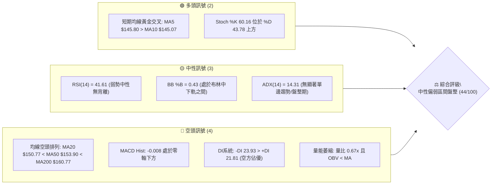
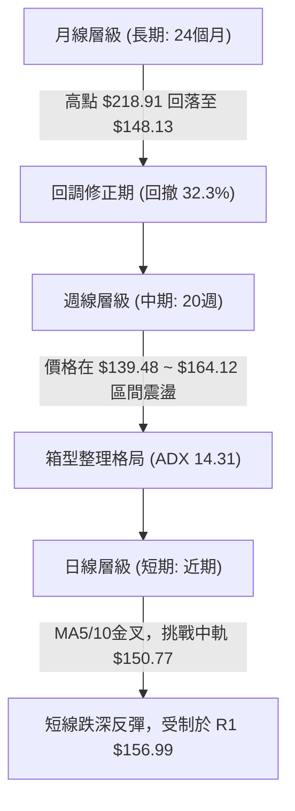
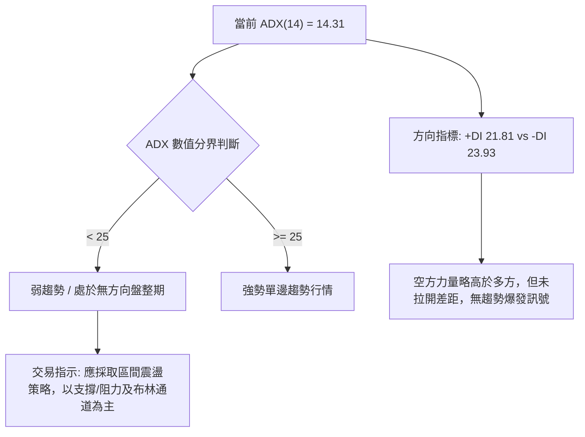
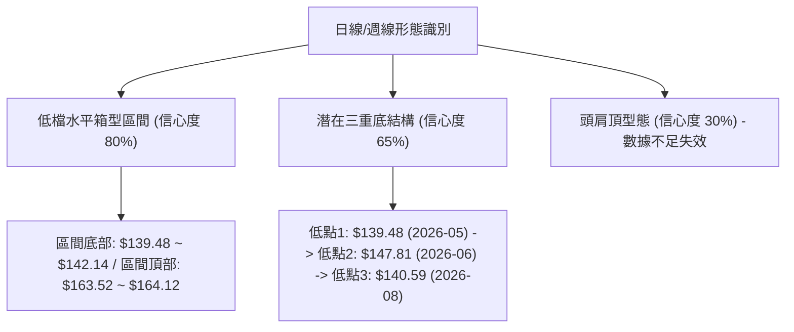
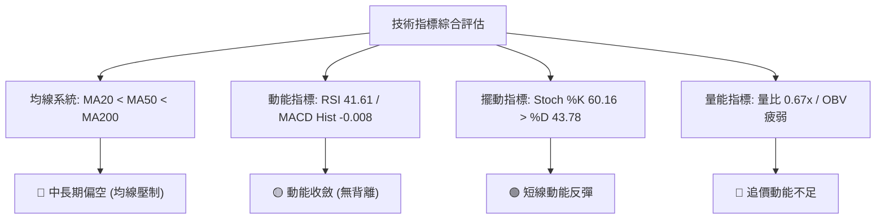
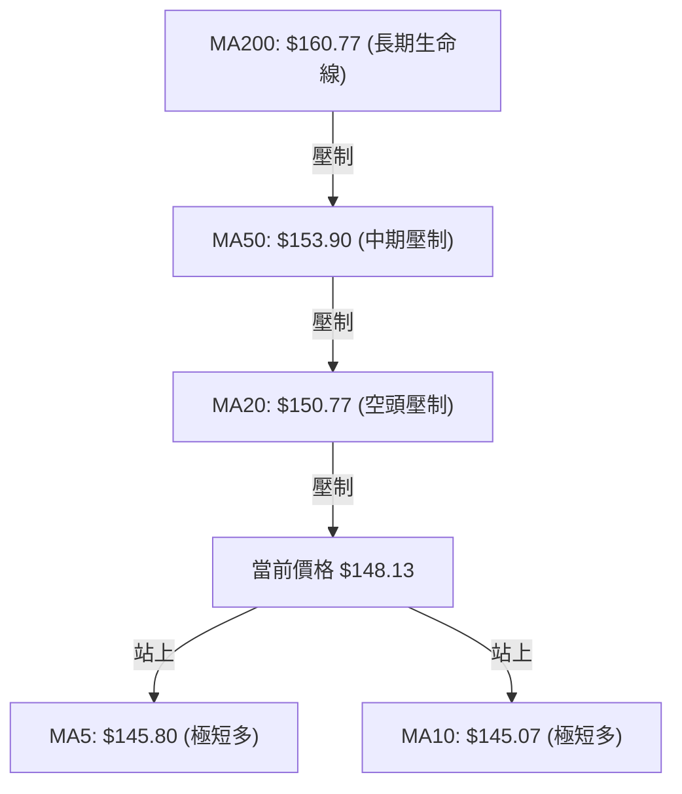
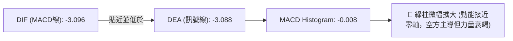
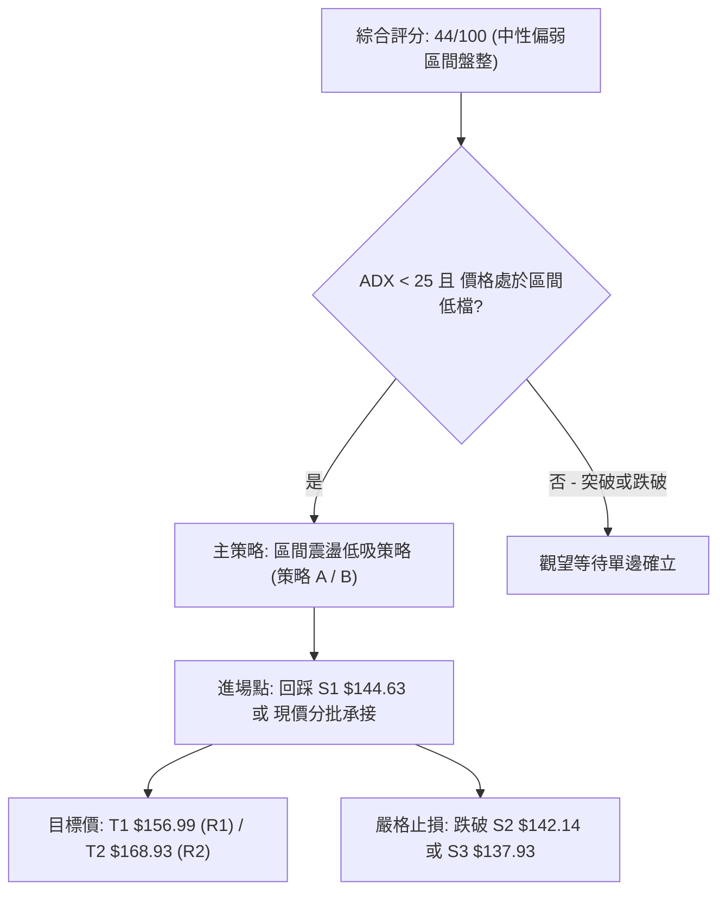
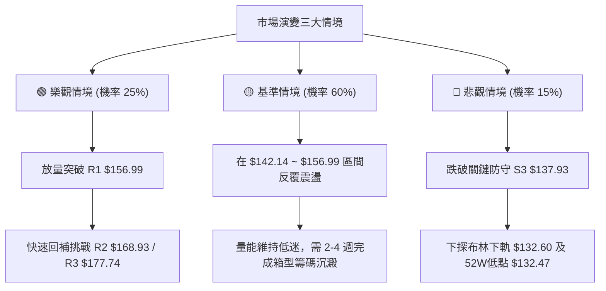

# VST 技術分析報告

> **報告日期**：2026-08-16 ｜ **語言**：繁體中文 ｜ **數據來源**：Yahoo Finance ｜ **當前價格**：$148.13

---

## 目錄

| 章節 | 內容 |
|------|------|
| [1. 技術面概覽](#1-技術面概覽) | 訊號儀表板、核心指標、評分卡 |
| [2. 趨勢分析](#2-趨勢分析) | 多時框趨勢、長中短期走勢 |
| [3. 圖表形態分析](#3-圖表形態分析) | 形態識別、K線組合、目標價 |
| [4. 支撐與阻力](#4-支撐與阻力) | 關鍵價位、斐波那契回調 |
| [5. 技術指標深度解讀](#5-技術指標深度解讀) | MA/RSI/MACD/布林/成交量 |
| [6. 動能與波動率](#6-動能與波動率) | 動能評估、ATR、Beta |
| [7. 多時框架總結](#7-多時框架總結) | 時框架評分矩陣 |
| [8. 交易策略建議](#8-交易策略建議) | 多空策略、風險報酬比 |
| [9. 風險提示與監控](#9-風險提示與監控) | 監控指標、風險場景 |

---

## 1. 技術面概覽

### 🎯 技術訊號儀表板



### 📊 核心指標速覽表

| 指標類別 | 指標名稱 | 當前數值 | 訊號 | 解讀 |
|----------|----------|----------|------|------|
| **價格** | 當前價格 | $148.13 | 🔴 | 位於52週區間18.1%分位，處於波段弱勢區 |
| **短期均線** | MA5 / MA10 | $145.80 / $145.07 | 🟢 | 極短線黃金交叉，價格收於兩者上方，有反彈動能 |
| **中期均線** | MA20 / MA50 | $150.77 / $153.90 | 🔴 | 價格受制於 MA20 ($150.77)，中期呈空頭壓制 |
| **長期均線** | MA200 | $160.77 | 🔴 | 價格低於牛熊分界線 (-7.86%)，長期結構偏空 |
| **動能指標** | RSI(14) | 41.61 | 🟡 | 弱勢中性區間 (30–50)，未見超賣或頂底背離 |
| **趨勢動能** | MACD (12,26,9) | -3.096 / -3.088 | 🔴 | MACD線位於訊號線下方，柱狀體為 -0.008，空頭主導 |
| **擺動指標** | Stoch %K / %D | 60.16 / 43.78 | 🟢 | 短線自低檔反彈回升，動能向上收斂 |
| **趨勢強度** | ADX (14) | 14.31 | 🟡 | ADX < 25 表明處於弱趨勢/區間震盪行情 |
| **方向系統** | +DI / -DI | 21.81 / 23.93 | 🔴 | -DI > +DI，空方力量略佔優勢 |
| **通道指標** | 布林通道帶寬 | $132.60 ~ $168.95 | 🟡 | %B 為 0.43，價格在中軌 $150.77 下方震盪 |
| **成交量能** | 當日量 / 20MA量 | 3.03M / 4.54M | 🔴 | 量比 0.67x，OBV 低於均線，量能疲弱無買盤追價 |
| **波動指標** | ATR(14) | $6.74 | 🟡 | 佔現價 4.55%，每日正常波動區間較大 |

### 🏆 技術評分卡

```
╔══════════════════════════════════════════════════════════════════╗
║              技術評分卡 — VST (2026-08-16)                       ║
╠══════════════════════════════════════════════════════════════════╣
║ 趨勢強度 (ADX=14.31)    ██████░░░░░░░░░░░░░░  30/100  🟡 弱勢盤整 ║
║ 動能指標 (RSI/MACD)     ████████░░░░░░░░░░░░  40/100  🔴 空方微幅 ║
║ 支撐穩定度 (S1/S2聚類)  ██████████████░░░░░░  70/100  🟢 低檔有撐 ║
║ 成交量配合 (量比 0.67x) ██████░░░░░░░░░░░░░░  30/100  🔴 量能渙散 ║
║ 形態完整度 (箱型盤整)   ████████████░░░░░░░░  60/100  🟡 區間構築 ║
║ 均線排列 (空頭排列)     ██████░░░░░░░░░░░░░░  35/100  🔴 均線壓制 ║
╠══════════════════════════════════════════════════════════════════╣
║ 綜合評分                █████████░░░░░░░░░░░  44/100  ⚖️ 中性偏弱 ║
╚══════════════════════════════════════════════════════════════════╝
```

---

## 2. 趨勢分析

### 🌐 多時框趨勢分析



### 📈 長期趨勢 — 12個月走勢圖（Unicode）

```
VST 月線走勢圖（2025-08 至 2026-08）
價格 ($)
$210 ┤
$200 ┤        ●(2025-09: $195.11)
$190 ┤  ●(2025-08: $188.12)
$180 ┤              ●(2025-11: $178.12)
$170 ┤                                  ●(2026-02: $173.41)
$160 ┤                    ●(2025-12: $160.88)       ●(2026-05: $160.01)
$150 ┤                                        ●   ●       ●   ●(現在: $148.13)
$140 ┤                                                ●(2026-08-09週低: $140.59)
$130 ┤
     └─────────────────────────────────────────────────────────────
       08   09   10   11   12   01   02   03   04   05   06   07   08 (月份)
```

#### 走勢特徵分析表格

| 階段 | 時間區間 | 起始/結束價 | 漲跌幅 | 結構特徵與成交量狀態 |
|------|----------|------------|--------|----------------------|
| **高檔回落期** | 2025-08 ~ 2025-12 | $188.12 → $160.88 | -14.48% | 自歷史高位 $218.91 明顯回調，獲利了結賣壓湧現 |
| **反彈受阻期** | 2026-01 ~ 2026-02 | $157.91 → $173.41 | +9.82%  | 測試 50% 斐波那契位 ($175.69) 未果，形成波段次高點 |
| **區間築底期** | 2026-03 ~ 2026-08 | $150.12 → $148.13 | -1.33%  | 價格在 $140.00 ~ $164.00 形成低檔收斂箱型，波動率下降 |

### 📊 中期趨勢（週線分析）

```
近期週線壓力與支撐結構示意圖
$170 ┤------------------------------- [強阻力 R2: $168.93 / BB上軌 $168.95]
$165 ┤      ▲(2026-06: $163.52)  ▲(2026-07: $163.38)
$160 ┤- - - ▲(2026-05: $160.01) - - - [MA200: $160.77 / 波段頸線]
$155 ┤------------------------------- [波段阻力 R1: $156.99 / MA50: $153.90]
$150 ┤- - - - - - - - - - - - - - - - [MA20 / BB中軌: $150.77]
$148 ┤========現價: $148.13==========
$144 ┤------------------------------- [支撐 S1: $144.63]
$142 ┤------------------------------- [強支撐 S2: $142.14]
$137 ┤------------------------------- [防守支撐 S3: $137.93 / 52W低 $132.47]
```

### ⚡ 趨勢強度評估（ADX 解讀）



| ADX 區間 | 趨勢強度定義 | 當前狀態 | 交易指引 |
|----------|--------------|----------|----------|
| **0 – 20** | **極弱趨勢 / 橫盤震盪** | **✓ (14.31)** | **嚴禁追價，採用布林通道下軌與 S1/S2 逢低承接，上軌高割離場** |
| 20 – 25 | 趨勢醞釀中 / 方向未明 | ✕ | 觀察均線與突破點位 |
| 25 – 40 | 強趨勢建立 | ✕ | 順勢交易，沿均線方向加碼 |
| 40 – 100 | 極強單邊 / 進入極端區 | ✕ | 注意回調風險或尋找背離 |

---

## 3. 圖表形態分析

### 🔍 形態識別系統



#### 形態識別評估表

| 形態名稱 | 信心度 | 判斷依據（引用數據） | 完成度 | 目標價（附精確計算式） |
|----------|--------|----------------------|--------|------------------------|
| **水平箱型整理** | **80%** | 價格在近 20 週高點聚類 $163.52 與波段低點 $139.48 之間震盪 | **85%** | 向上突破測幅：$163.52 + ($163.52 - $139.48) = **$187.56**<br>跌破測幅：$139.48 - ($163.52 - $139.48) = **$115.44** |
| **低檔三重底 (Triple Bottom)** | **65%** | 低點聚類：2026-05-17 ($139.48)、2026-06-14 ($147.81)、2026-08-09 ($140.59)；頸線聚類於 R1 **$156.99** 與 $163.52 | **60%** | 形態高度 = 頸線 $156.99 - 低點 $139.48 = $17.51<br>突破目標價 = $156.99 + $17.51 = **$174.50** |
| **頭肩頂形態** | **25%** | 數據中未偵測到完整右肩跌破結構，ADX 處於 14.31，不符合典型頭肩頂單邊崩跌形態 | **15%** | 訊號不足，僅做指標型解讀，不預設立場 |

### 🕯️ 重要K線形態分析

| 期間/月份 | 收盤價 | K線形態 | 解讀 | 訊號 |
|-----------|--------|---------|------|------|
| **2026-05-17 週** | $139.48 | 長下影錘頭線 (Hammer) | 探底至波段低點後強力拉升，確立 $139.48 核心支撐 | 🟢 看多反彈 |
| **2026-06-21 週** | $163.52 | 實體大陽線 | 放量上攻測試 $164 阻力，形成箱型頂部確認 | 🟡 遇阻力 |
| **2026-08-09 週** | $140.59 | 探底長下影線 | 週成交量放大至 34.90M（近20週最高），低檔承接買盤強勁 | 🟢 底部放量 |
| **2026-08-16 週** | $148.13 | 縮量陽線吞噬 | 自 $140.59 回升，收復短期均線 MA5/10，動能指標收斂 | 🟢 短線止跌 |

### 📉 ASCII 走勢形態示意圖

```
VST 20週三重底/箱型震盪形態分析圖
價格 ($)
$165 ┤              [頸線頂部 1] $164.12       [頂部 2] $163.52
$160 ┤                   ╭───╮                     ╭───╮
$155 ┤      ╭────────────╯   ╰────────╮       ╭────╯   ╰─────── [阻力 R1: $156.99]
$150 ┤──────│─────────────────────────│───────│──────────────────現價: $148.13
$145 ┤      │                         │       │
$140 ┤      │                         ╰───────╯           ╭─── [現階段反彈]
$135 ┤      ╰─── [低點 1: $139.48]                 ╰──────╯ [低點 3: $140.59]
     └─────────────────────────────────────────────────────────────
           2026-05-17                        2026-06-14  2026-08-09
```

### 🎯 形態目標價計算

```
形態測幅公式與推算：
1. 箱型向上突破目標價 = 箱頂 ($163.52) + 箱體高度 ($163.52 - $139.48 = $24.04) = $187.56
   （此價位接近歷史回調位 38.2% $185.89）
2. 頸線突破保守目標價 = R1 ($156.99) + 頸線高度 ($156.99 - $140.59 = $16.40) = $173.39
   （此價位接近 50% 斐波那契回調位 $175.69 與 R3 $177.74）
3. 止損防守底線 = 跌破低點 3 聚類 S3 $137.93 或 52週低點 $132.47
```

---

## 4. 支撐與阻力

### 🗺️ 關鍵價位分布圖（Unicode）

```
╔══════════════════════════════════════════════════════════════════╗
║              VST 關鍵價位結構分布圖                              ║
╠══════════════════════════════════════════════════════════════════╣
║ $177.74 ║████████████████████████████████████████║ 強阻力 R3     ║
║ $175.69 ║▓▓▓▓▓▓▓▓▓▓▓▓▓▓▓▓▓▓▓▓▓▓▓▓▓▓▓▓▓▓▓▓▓▓▓   ║ 斐波 50.0%    ║
║ $168.95 ║████████████████████████████████        ║ 布林上軌      ║
║ $168.93 ║████████████████████████████████        ║ 波段阻力 R2   ║
║ $165.49 ║▓▓▓▓▓▓▓▓▓▓▓▓▓▓▓▓▓▓▓▓▓▓▓▓▓▓             ║ 斐波 61.8%    ║
║ $160.77 ║████████████████████                    ║ MA200 牛熊線  ║
║ $156.99 ║████████████████████████                ║ 關鍵阻力 R1   ║
║ $150.97 ║▓▓▓▓▓▓▓▓▓▓▓▓▓▓▓▓▓▓▓▓                    ║ 斐波 78.6%    ║
║ $150.77 ║░░░░░░░░░░░░░░░░░░░░                    ║ MA20 / BB中軌 ║
║ $148.13 ╠════════════════════════════════════════╣ ◄ 當前價格    ║
║ $144.63 ║████████████████                        ║ 近期支撐 S1   ║
║ $142.14 ║████████████████████████                ║ 強支撐 S2     ║
║ $137.93 ║██████████████████████████████          ║ 關鍵防守 S3   ║
║ $132.60 ║▓▓▓▓▓▓▓▓▓▓▓▓▓▓▓▓▓▓▓▓▓▓▓▓▓▓▓▓▓▓▓▓        ║ 布林下軌      ║
║ $132.47 ║████████████████████████████████████████║ 52週低點      ║
╚══════════════════════════════════════════════════════════════════╝
```

### 🚧 阻力位分析表

| 阻力級別 | 精確價位 | 形成原因（數據聚類） | 突破難度 | 戰略重要性 |
|----------|----------|----------------------|----------|------------|
| **阻力 1 (R1)** | **$156.99** | 近一年波段高點聚類、MA60 ($154.23) 與 MA120 ($155.65) 重疊壓制區 | 🟡 中等 | 突破則確立短線反轉，扭轉日線均線空頭壓力 |
| **阻力 2 (R2)** | **$168.93** | 布林通道上軌 ($168.95) 與 MA240 ($167.38) 雙重重合點 | 🔴 高 | 中期強大賣壓區，為多頭第一階段大目標 |
| **阻力 3 (R3)** | **$177.74** | 2026-02 高點聚類 ($173.41) 及 50% 斐波那契回調位 ($175.69) 上方 | 🔴 極高 | 波段牛熊結構轉換點，需巨大成交量配合方能突破 |

### 🛡️ 支撐位分析表

| 支撐級別 | 精確價位 | 形成原因（數據聚類） | 守住機率 | 戰略重要性 |
|----------|----------|----------------------|----------|------------|
| **支撐 1 (S1)** | **$144.63** | MA5 ($145.80) 與 MA10 ($145.07) 均線匯聚區，近一年波段低點支撐 | 🟢 75% | 短線多頭防守第一線，跌破則回踩 S2 |
| **支撐 2 (S2)** | **$142.14** | 近一年低點聚類，前週大量長下影線低點區 ($140.59) 之上 | 🟢 85% | 區間震盪箱體底邊，多頭強力防守樞紐 |
| **支撐 3 (S3)** | **$137.93** | 2026-05-17 低點 ($139.48) 下方之結構性防守點 | 🟢 90% | 跌破將引發停損賣壓並下探 52週低點 $132.47 |

### 📐 斐波那契回調位分析（52週區間 $132.47 → $218.91）

```
斐波那契分佈現況：
  0.0% (52W High)  : $218.91
 23.6% 回調位      : $198.51
 38.2% 回調位      : $185.89
 50.0% 回調位      : $175.69
 61.8% 黃金分割位  : $165.49
 78.6% 深層回調位  : $150.97 ──┐
                               ├─ 現價 $148.13 處於 78.6% ($150.97) 與 100.0% ($132.47) 深度超跌區間
100.0% (52W Low)   : $132.47 ──┘
```

- **位置解讀**：現價 **$148.13** 目前落於 **78.6% 回調位 ($150.97)** 與 **100.0% 回調位 ($132.47)** 之間，屬於深層回撤整理區。
- **技術意義**：$150.97 與日線 MA20 ($150.77) 極度接近，形成當前最直接的短期反彈壓制。若能放量站穩 $150.97，將打開通往 61.8% ($165.49) 的修復空間。

---

## 5. 技術指標深度解讀

### 🎛️ 指標訊號總覽



### 📈 移動平均線排列分析



- **均線狀態解讀**：
  - 長短期均線呈現標準 **空頭排列**：`MA20 ($150.77) < MA50 ($153.90) < MA200 ($160.77)`。
  - 極短線出現回暖跡象：MA5 ($145.80) 向上金叉 MA10 ($145.07)，價格收於兩者之上，顯示短線具備築底反抽意願，但上方 MA20、MA60 ($154.23) 與 MA120 ($155.65) 形成重重均線反壓。

### 📉 RSI(14) 分析

```
RSI(14) 當前數值: 41.61
0 ═══════════ 30 ════════════ 50 ════════════ 70 ══════════ 100
[  超賣區間   │████████████░░░│    超買區間   ]
               ▲ (41.61 - 弱勢震盪區)
```

- **背離判斷**：
  - 檢視 2026-05-17 價格低點 $139.48 對應週線 RSI 25.5，而 2026-08-09 價格回測低點 $140.59 對應週線 RSI 為 37.2。
  - **結論**：日線與週線層級**未見顯著頂背離**；週線上呈現微幅的「低點抬高型底背離」雛形，但日線當前 RSI 41.61 仍處中性弱勢區，尚未出現強烈動能確認。

### 📊 MACD(12/26/9) 訊號解讀



- **詳細解讀**：MACD 與 Signal 數值極度接近（-3.096 vs -3.088），柱狀體處於 -0.008 的微幅負值。顯示空方下殺動能已近尾聲，兩線在零軸下方即將形成收斂金叉，屬於典型「低檔鈍化即將反彈」特徵。

### 📦 布林通道分析

```
VST 布林通道價格位置圖 (20, 2)
$170 ┤---------------------------------- BB上軌: $168.95
$165 ┤
$160 ┤
$155 ┤
$150 ┤---------------------------------- BB中軌 (MA20): $150.77
$148 ┤  ● (現價: $148.13, %B = 0.43)
$145 ┤
$140 ┤
$135 ┤
$130 ┤---------------------------------- BB下軌: $132.60
```

- **通道帶寬與位置**：上軌 $168.95，下軌 $132.60，帶寬達 $36.35。%B 為 **0.43**，處於中軌與下軌之間的合理震盪區。
- **軌道行為**：價格並未觸及下軌極限，而是在接近 $140 處獲得買盤支撐回升，目前正向中軌 $150.77 靠攏。

### 💹 成交量分析（量價配合度）

- **量能萎縮特徵**：最新成交量為 **3,034,400 股**，相對於 20 日均量 **4,535,665 股**，量比僅為 **0.67x**。
- **OBV（能量潮）狀態**：OBV 數值目前低於其移動平均線（`OBV < MA`），顯示資金流入動能疲弱，市場觀望情緒濃厚。
- **量價背離檢視**：上週（2026-08-09）股價回踩 $140.59 時放量至 34.90M 股，而本週反彈至 $148.13 時週成交量縮減至 16.52M 股。呈現「下跌放量、反彈量縮」的量價背離格局，說明當前上漲主要由賣壓減輕引起，而非主動性買盤大舉追高。

---

## 6. 動能與波動率

### ⚡ 動能評估四象限

```
動能與波動率矩陣 (VST 當前坐標: Q2 弱動能 / 低波動)
        強動能 (High Momentum)
               │
      Q3       │       Q1
  高波動/強動能 │  低波動/強動能
               │
───────────────┼───────────────
               │       Q2  ◄── [VST 坐標點]
      Q4       │  低波動/弱動能
  高波動/弱動能 │  (ADX 14.31, 區間沉澱)
               │
        弱動能 (Low Momentum)
   高波動 ───────────── 低波動 (Volatility)
```

| 象限代號 | 動能狀態 | 波動狀態 | 當前符合 | 戰略含義與應對策略 |
|----------|----------|----------|----------|--------------------|
| **Q1** | 強動能 | 低波動 | ✕ | 趨勢穩健主升段，全力順勢做多 |
| **Q2** | **弱動能** | **低波動** | **✓ (VST)** | **處於區間消化整理，市場沉寂，適合低吸高拋或網格震盪** |
| **Q3** | 強動能 | 高波動 | ✕ | 突破爆發期，伴隨大幅震盪，適合動能突破交易 |
| **Q4** | 弱動能 | 高波動 | ✕ | 崩跌或非理性拋售期，應空倉觀望 |

### 📊 ATR 波動率分析

- **ATR(14) 數值**：**$6.74**（佔當前股價之 **4.55%**）。
- **日內波動特徵**：股價單日波動空間約 $6.74，顯示個股彈性充沛。
- **止損距離建議**：
  - **保守型交易者（1.5 × ATR）**：安全止損距離為 $6.74 × 1.5 = **$10.11**。
  - **積極型交易者（1.0 × ATR）**：短線止損距離為 $6.74 × 1.0 = **$6.74**。

### 📐 Beta 與市場相關性

- **Beta 係數**：**1.433**。
- **市場敏感度**：VST 屬於高 Beta 公用事業/獨立發電商標的，波動幅度比標普 500 指數高出 **43.3%**。
- **機構持股與放空比**：機構持股高達 **92.7%**，空頭回補天數 (Short Ratio) 為 **2.11 天**，放空比例僅 **3.0%**。顯示籌碼高度集中於法人手中，無嚴重的機構做空踩踏風險。

---

## 7. 多時框架總結

### 📋 時框架評分表

| 時框架 | 趨勢方向 | 動能指標 | 均線排列 | 形態結構 | 綜合評分 | 戰略建議 |
|--------|----------|----------|----------|----------|----------|----------|
| **長期 (月線)** | 🟡 修正中 | RSI 52 (中性) | 價格回測 MA200 | 自 $218.91 深幅回調 | **50/100** | 長線投資者逢低分批建立核心部位 |
| **中期 (週線)** | 🔴 偏弱盤整 | MACD 綠柱收斂 | MA20 < MA50 | $139.48 ~ $164 箱型 | **45/100** | 區間操作，嚴控倉位 |
| **短期 (日線)** | 🟢 築底反彈 | Stoch %K 金叉 | MA5 > MA10 | 三重底結構反彈中 | **55/100** | 逢低短多，觸及 R1 停利 |

### 🔲 綜合訊號矩陣

```
╔══════════════════════════════════════════════════════════════════╗
║              多時框架訊號收斂矩陣                                ║
╠══════════════════════════════════════════════════════════════════╣
║ 維度         短期 (日線)        中期 (週線)        長期 (月線)   ║
║ 趨勢方向     🟢 震盪反彈        🔴 區間盤整        🟡 高檔修正   ║
║ 均線狀態     🟢 MA5/10 金叉     🔴 空頭排列        🔴 跌破MA200  ║
║ 動能強弱     🟢 %K > %D         🟡 MACD 弱勢收斂   🟡 RSI 41.61  ║
║ 成交量能     🔴 量能萎縮        🟢 低檔放量承接    🟡 中性       ║
╠══════════════════════════════════════════════════════════════════╣
║ 權重合力     ▲ 短線反彈動能     ▼ 中期結構壓制     ▼ 長期尚未翻多║
╚══════════════════════════════════════════════════════════════════╝
```

### ⚖️ 多時框收斂結論

- **趨勢/盤整行情定性**：當前 **ADX(14) = 14.31 (< 25)**，明確指示當前市場屬於 **標準盤整震盪行情**，而非單邊趨勢行情。
- **收斂規則指引**：依據多時框收斂優先級規則，盤整行情中中長期的單邊均線空頭排列（MA20/50/200）暫時失去單邊下殺動能，行情受制於 **日線布林通道上下軌 ($132.60 ~ $168.95) 與箱型區間 ($142.14 ~ $156.99)**。
- **唯一方向性結論**：**【中性觀望，區間低吸高拋】**。日線雖具備反彈動能，但受限於量能不足與中期壓制，不具備走出單邊大行情的條件。

---

## 8. 交易策略建議

### 🗺️ 策略決策流程圖



### 🧭 策略路由

> **當前主策略方向 = 區間震盪逢低做多（依綜合評分 44/100，定位為區間底部防守型買進）**
> 
> 雖然中長期均線偏空，但考量 ADX 僅 14.31 且價格已接近歷史強支撐 S1/S2 與 52週低檔區，做空空間極度受限且盈虧比不佳。因此，主推**區間逢低做多（Range-Bound Long）策略**，空頭僅列為跌破關鍵防守位後的避險對沖提示。

### 🎯 價格情境階梯（Price Scenarios）

| 觸發條件 | 第一目標 | 第二延伸目標 | 後續延伸 | 情境技術含義 |
|----------|----------|--------------|----------|--------------|
| **向上突破 R1 $156.99** | **R2 $168.93** | **R3 $177.74** | 斐波那契 $185.89 | 扭轉中期均線壓制，三重底形態確立 |
| **維持在 S1 $144.63 上方** | **MA20 $150.77** | **R1 $156.99** | — | 於布林中下軌維持築底震盪，蓄勢待發 |
| **向下跌破 S1 $144.63** | **S2 $142.14** | **S3 $137.93** | 52W低點 $132.47 | 短線反彈失敗，重新測試箱體下沿尋求支撐 |

### 📊 情境機率分佈

| 情境類別 | 發生機率 | 主要依據與指標佐證 |
|----------|----------|-------------------|
| **情境一：區間反彈至 R1/R2** | **45%** | Stoch %K 金叉向上、MACD 綠柱收斂至 -0.008、低檔大額成交量護盤 |
| **情境二：箱型窄幅震盪** | **40%** | ADX 處於 14.31 低位、成交量比僅 0.67x、量能疲弱難以展開單邊走勢 |
| **情境三：跌破 S3 創波段新低** | **15%** | 均線系統呈空頭排列，若大盤系統性風險引發機構拋售 |

### 🟢 主策略詳情（區間操作多頭策略）

| 策略要素 | 策略 A（現價積極型短多） | 策略 B（回踩穩健型逢低佈局） |
|----------|--------------------------|------------------------------|
| **進場條件** | 現價分批進場，博弈極短線 MA5/10 金叉反彈 | 等待股價回測 S1 支撐獲得確認後進場 |
| **進場價格** | **$148.13** (現價) | **$144.63** (S1 支撐位) |
| **目標價 T1** | **$156.99** (R1 關鍵阻力) | **$156.99** (R1 關鍵阻力) |
| **目標價 T2** | **$168.93** (R2 / BB上軌) | **$168.93** (R2 / BB上軌) |
| **止損價格** | **$142.14** (跌破 S2 強支撐) | **$137.93** (跌破 S3 防守位) |
| **止損幅度** | -$5.99 (-4.04%) | -$6.70 (-4.63%) |
| **目標1 盈虧比** | **1 : 1.48** (獲利 $8.86 / 虧損 $5.99) | **1 : 1.84** (獲利 $12.36 / 虧損 $6.70) |
| **目標2 盈虧比** | **1 : 3.47** (獲利 $20.80 / 虧損 $5.99) | **1 : 3.63** (獲利 $24.30 / 虧損 $6.70) |
| **策略成功機率** | **55%** | **65%** |
| **建議總倉位** | **8% - 10%** | **12% - 15%** |

### 🔴 反向風險觸發點（對沖與止損提示）

- **全面轉空觸發價**：**收盤價跌破 S3 $137.93**。
- **對沖處置建議**：若跌破 $137.93，表示低檔三重底形態完全破裂，ADX 可能自低檔反彈觸發單邊下行趨勢，投資人應立即將多頭部位全數止損離場，並可考慮買入認沽期權（Put Option）或建立輕倉空頭部位對沖，下方目標指向 52週低點 **$132.47**。

### ⭐ 整體訊號強度評星

```
做多訊號強度：★★★☆☆  (3.0/5星 - 具備區間反彈盈虧比優勢)
做空訊號強度：★★☆☆☆  (2.0/5星 - 下方接近多重強支撐，空間狹窄)
整體可信度：  ★★★☆☆  (3.5/5星 - 盤整區間明確，指標收斂一致)
```

---

## 9. 風險提示與監控

### ✅ 關鍵監控指標 Checklist

```
╔══════════════════════════════════════════════════════════════════╗
║              VST 交易風險監控清單 (Checklist)                     ║
╠══════════════════════════════════════════════════════════════════╣
║ [ ] 每日收盤價是否成功守穩 S1 $144.63 之上                       ║
║ [ ] 日成交量是否放大突破 4.54M (超越20日均量確認買盤追價)        ║
║ [ ] MACD Histogram 是否向上由負翻正 (突破 0 軸產生金叉訊號)      ║
║ [ ] RSI(14) 是否能有效突破 50 中軸壓制區進入多方強勢區           ║
║ [ ] ADX(14) 是否向上突破 25 (確認由盤整轉為單邊突破行情)         ║
║ [ ] 股價挑戰 MA20 ($150.77) 與 R1 ($156.99) 時的放量阻力反應     ║
║ [ ] 嚴格執行跌破 S2 ($142.14) / S3 ($137.93) 無條件停損紀律     ║
╚══════════════════════════════════════════════════════════════════╝
```

### ⚠️ 風險場景分析



### 🛡️ 風險管理重要提醒

1. **嚴禁在 ADX 低位重倉押注單邊**：當前 ADX 為 14.31，顯示市場處於無方向的洗盤期，此階段任何假突破或假跌破的機率極高，總持倉部位建議控制在 **10% - 15% 以內**。
2. **高 Beta 波動管理**：VST Beta 為 1.433 且 ATR 達 $6.74，日內波動劇烈。進場前必須預先設定好止損點（建議以 S2 $142.14 為底線），切勿隨意向下攤平。
3. **留意基本面負債結構**：公司總負債達 $20.51B（Debt/Equity 373.28），在總體利率環境高企下，對公用事業板塊估值具壓制作用，技術面反彈至 R2/R3 關鍵阻力應分批獲利了結。

---

## 📋 報告總結

```
╔══════════════════════════════════════════════════════════════════╗
║              VST 技術分析報告總結                                ║
╠══════════════════════════════════════════════════════════════════╣
║ 報告日期：2026-08-16                                             ║
║ 當前價格：$148.13                                                ║
║ 分析評級：⚖️ 中性偏弱（低檔區間震盪蓄勢）                        ║
║                                                                  ║
║ 關鍵結論：                                                       ║
║ ├─ 長期趨勢：🟡 高位回落深層修正，處於 78.6% 斐波那契回調區間   ║
║ ├─ 中期趨勢：🔴 均線空頭排列，但於 $140 ~ $164 箱型區間築底     ║
║ ├─ 短期趨勢：🟢 MA5/10 金叉，Stoch 反彈，具備短線反抽中軌動能   ║
║ ├─ 關鍵支撐：S1 $144.63 / S2 $142.14 / S3 $137.93                ║
║ ├─ 關鍵阻力：R1 $156.99 / R2 $168.93 / R3 $177.74                ║
║ └─ 分析師共識目標：$221.28 (18 位分析師 Strong Buy)             ║
║                                                                  ║
║ 最優策略組合：                                                   ║
║ 1. 🥇 最佳機會：回踩 S1 $144.63 建立區間波段多單，目標 R1 $156.99║
║ 2. 🥈 次選機會：現價 $148.13 輕倉試單，止損設於 S2 $142.14       ║
║ 3. 🥉 保守選擇：等待股價放量突破 R1 $156.99 後再行順勢跟進       ║
╚══════════════════════════════════════════════════════════════════╝
```

---

> ⚠️ **免責聲明**：本報告為技術分析研究，所有數據及估算均基於歷史價格與技術指標資訊。本報告**僅供研究與學術參考**，**不構成任何投資建議或買賣邀約**。投資有風險，交易需嚴格設定停損與風控機制。

---

*報告生成時間：2026-08-16 ｜ 數據來源：Yahoo Finance ｜ 分析框架：多時框技術分析體系*