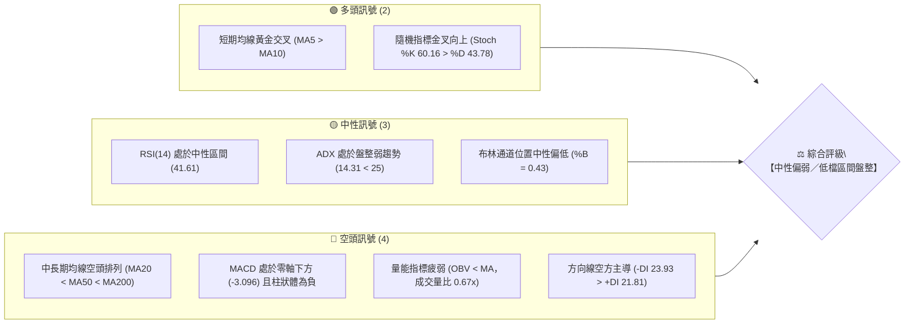
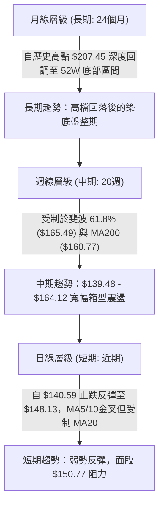
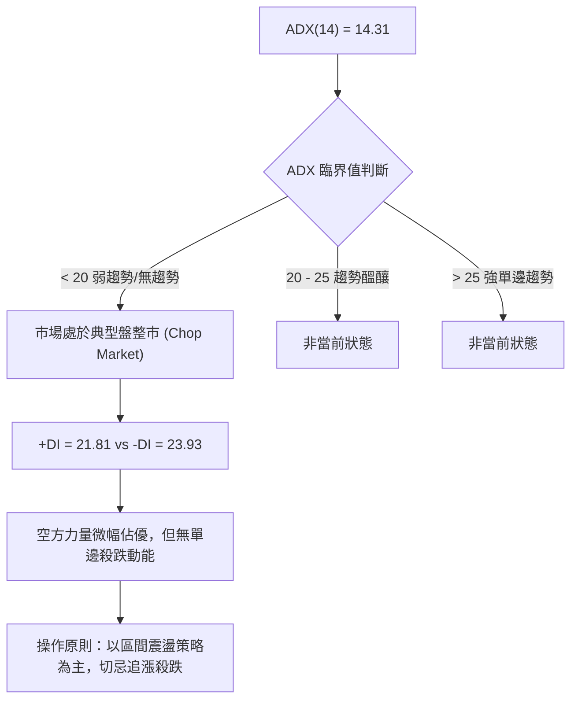
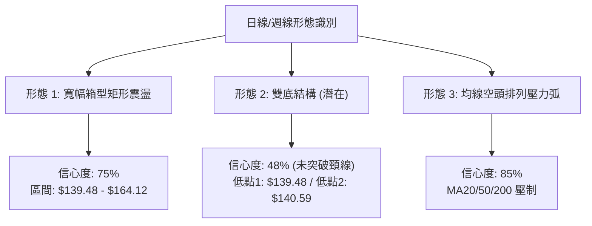
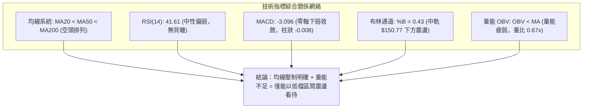
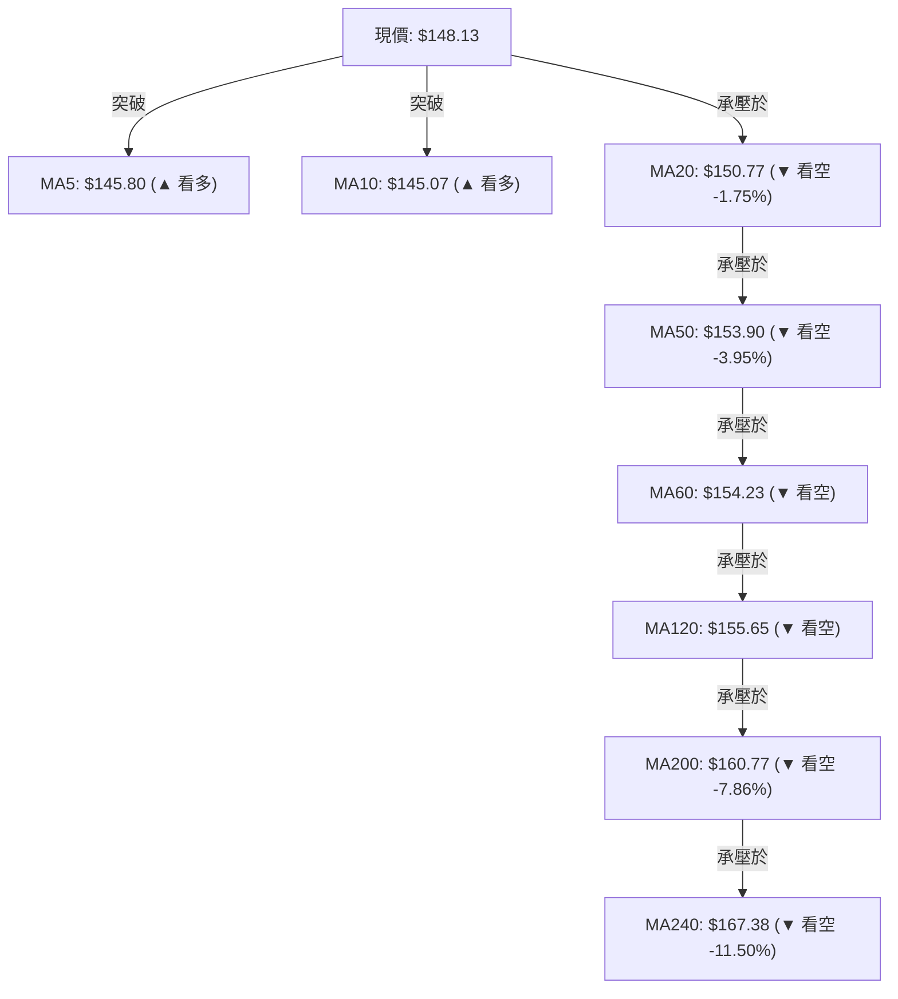
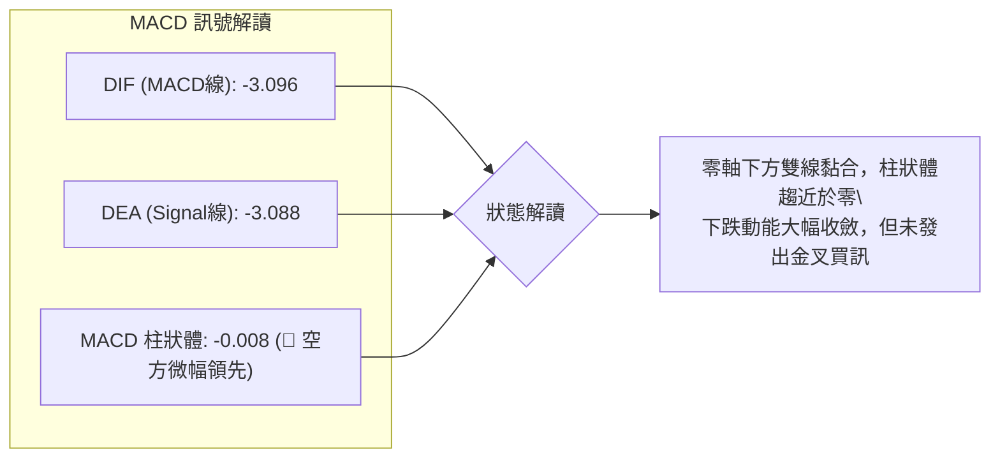
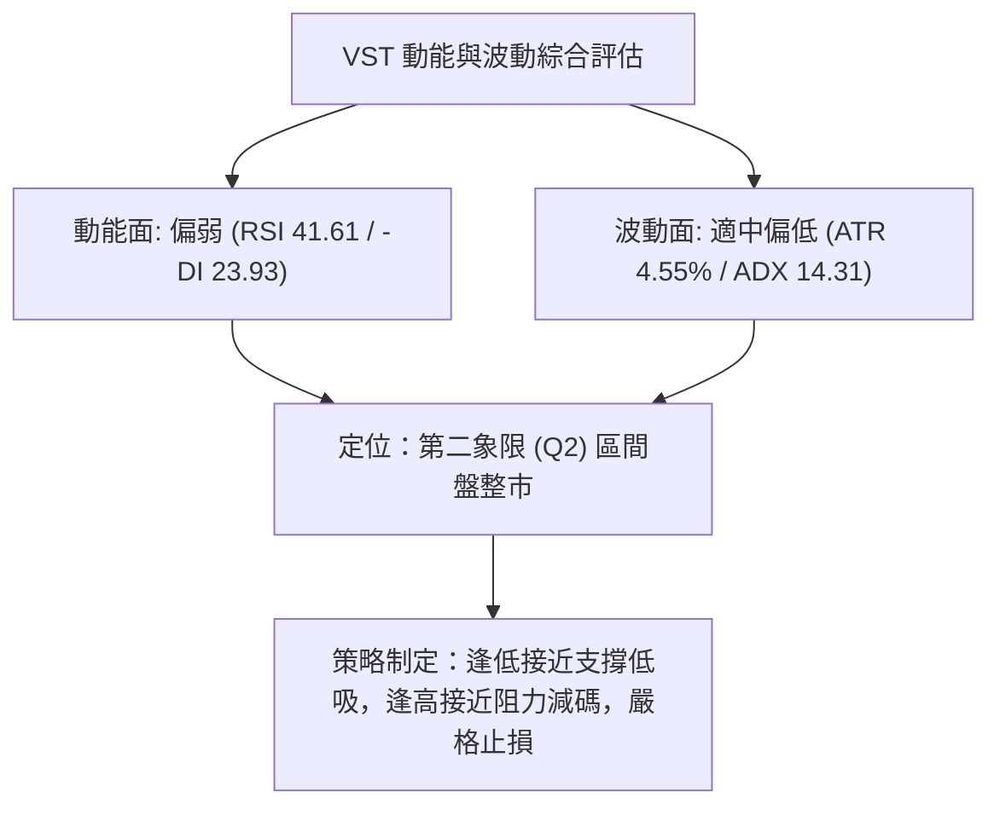
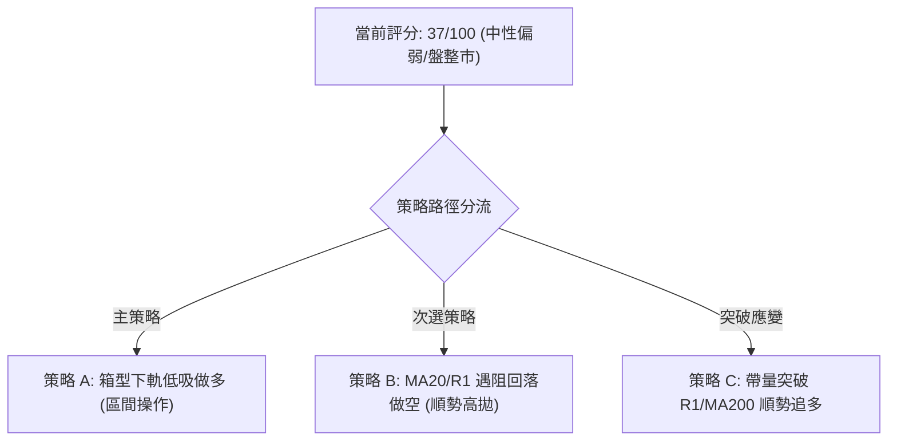
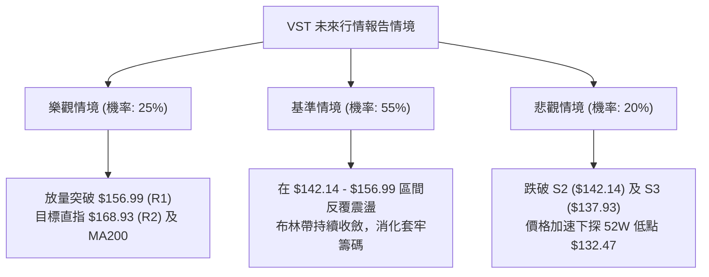

# VST 技術分析報告

> **報告日期**：2026-08-17 ｜ **語言**：繁體中文 ｜ **數據來源**：Yahoo Finance ｜ **當前價格**：$148.13

---

## 目錄

| 章節 | 內容 |
|------|------|
| [1. 技術面概覽](#1-技術面概覽) | 訊號儀表板、核心指標、評分卡 |
| [2. 趨勢分析](#2-趨勢分析) | 多時框趨勢、長中短期走勢、ADX解讀 |
| [3. 圖表形態分析](#3-圖表形態分析) | 形態識別、信心度評估、K線組合 |
| [4. 支撐與阻力](#4-支撐與阻力) | 關鍵價位、斐波那契回調結構 |
| [5. 技術指標深度解讀](#5-技術指標深度解讀) | MA/RSI/MACD/布林/量能分析 |
| [6. 動能與波動率](#6-動能與波動率) | 動能四象限、ATR、Beta 風險評估 |
| [7. 多時框架總結](#7-多時框架總結) | 時框架評分矩陣、多時框收斂 |
| [8. 交易策略建議](#8-交易策略建議) | 策略路由、區間操作、風險報酬比 |
| [9. 風險提示與監控](#9-風險提示與監控) | 監控清單、情境分析、風控準則 |
| [📋 報告總結](#-報告總結) | 全文核心結論與策略決策摘要 |

---

## 1. 技術面概覽

### 🎯 技術訊號儀表板



### 📊 核心指標速覽表

| 指標類別 | 指標名稱 | 當前數值 | 訊號 | 解讀 |
|----------|----------|----------|------|------|
| **價格** | 當前價格 | $148.13 | 🟡 | 位於52週區間18.1%之相對低檔，面臨 MA20 壓制 |
| **均線** | MA5 / MA10 | $145.80 / $145.07 | 🟢 | 極短線反彈，MA5 向上金叉 MA10 (+1.60% / +2.11%) |
| **均線** | MA20 (BB中軌)| $150.77 | 🔴 | 價格低於MA20 (-1.75%)，短線反彈面臨第一道動態阻力 |
| **均線** | MA50 | $153.90 | 🔴 | 價格低於MA50 (-3.95%)，中期波段偏空抑制 |
| **均線** | MA200 | $160.77 | 🔴 | 價格低於MA200 (-7.86%)，長期多空分水嶺失守 |
| **均線結構**| MA排列 | MA20<MA50<MA200 | 🔴 | 典型空頭排列，中長期趨勢向下壓制 |
| **動能** | RSI(14) | 41.61 | 🟡 | 位於 30–70 中性偏弱區間，未出現超賣或明顯背離 |
| **動能** | MACD (12,26,9)| -3.096 / -3.088 | 🔴 | 位於零軸下方，柱狀體為 -0.008，空頭主導但動能衰竭收斂 |
| **動能** | Stoch (14,3,3)| %K: 60.16 / %D: 43.78| 🟢 | KD指標低檔向上金叉，支持短線弱勢反彈 |
| **趨勢強度**| ADX (14) | 14.31 (-DI 23.93)| 🟡 | ADX < 25 表明無單邊強趨勢，當前屬於弱勢區間震盪 |
| **波動** | ATR(14) | $6.74 (4.55%) | 🟡 | 波動率適中，日均震盪幅度約 $6.74 |
| **通道** | 布林通道 | 下軌$132.60 上軌$168.95| 🟡 | %B 為 0.43，價格在中軌下方運行，空間受限於通道內 |
| **成交量** | 量比 / OBV | 0.67x / OBV < MA | 🔴 | 最新量 3.03M 低於20日均量 4.54M，量能萎縮確認力道不足 |

### 🏆 技術評分卡

```
╔══════════════════════════════════════════════════════════════╗
║              技術評分卡 — VST (2026-08-17)                  ║
╠══════════════════════════════════════════════════════════════╣
║ 趨勢強度      ██████░░░░░░░░░░░░░░  30/100  🔴 空頭主導 (ADX 14.31)   ║
║ 動能指標      ████████░░░░░░░░░░░░  42/100  🟡 中性偏弱 (RSI 41.61)   ║
║ 支撐穩定度    ████████████░░░░░░░░  60/100  🟡 S1-S3 密集防守區      ║
║ 成交量配合    ██████░░░░░░░░░░░░░░  32/100  🔴 量能萎縮 (OBV<MA)     ║
║ 形態完整度    ████████░░░░░░░░░░░░  40/100  🟡 弱勢區間矩形震盪      ║
║ 均線排列      ████░░░░░░░░░░░░░░░░  20/100  🔴 20<50<200 典型空頭    ║
╠══════════════════════════════════════════════════════════════╣
║ 綜合評分      ███████░░░░░░░░░░░░░  37/100  🔴 中性偏弱／區間偏空    ║
╚══════════════════════════════════════════════════════════════╝
```

---

## 2. 趨勢分析

### 🌐 多時框趨勢分析



### 📈 長期趨勢 — 12個月走勢圖（Unicode）

```
VST 月線走勢圖（過去12個月：2025-08 至 2026-08）
價格軸 ($)
$200 ┤              ● (09月 $195.11)
$190 ┤● (08月 $188.12)    ● (10月 $187.52)
$180 ┤                          ● (11月 $178.12)
$170 ┤                                                ● (02月 $173.41)
$160 ┤                                      ● (12月 $160.88)  ● (05月 $160.01) ● (06月 $158.63)
$150 ┤                                            ● (01月 $157.91)  ● (04月 $157.62)   ●(現價 $148.13)
$140 ┤                                                      ● (03月 $150.12)     ● (07月 $148.19)
$130 ┤
     └────────────────────────────────────────────────────────────────────────────────────────────
       25-08   25-09   25-10   25-11   25-12   26-01   26-02   26-03   26-04   26-05   26-06   26-07/08
```

#### 走勢特徵分析表格

| 階段區間 | 時間跨度 | 起始/結束價 | 期間漲跌幅 | 走勢特徵與結構解讀 |
|----------|----------|-------------|------------|-------------------|
| **第一階段：高檔滯漲** | 2025-08 ~ 2025-10 | $188.12 → $187.52 | -0.32% (最高$195.11)| 於歷史高點 $207.45 下方構築高檔雙頂結構，動能開始減退 |
| **第二階段：震盪盤跌** | 2025-10 ~ 2025-12 | $187.52 → $160.88 | -14.21% | 跌破多條短期均線，長期上行趨勢遭到破壞，資金高檔派發 |
| **第三階段：反彈誘多** | 2025-12 ~ 2026-02 | $160.88 → $173.41 | +7.79% | 觸及 $157.91 後展開弱勢反彈，但受制於 $175 斐波那契壓力 |
| **第四階段：箱型震盪** | 2026-02 ~ 2026-08 | $173.41 → $148.13 | -14.58% | 於 $140 - $164 區間反覆震盪，當前價格已逼近箱型底部區域 |

### 📊 中期趨勢（週線分析）

從近20週數據觀察，價格在 2026-05-17 探底至 $139.48 後，週線 RSI 跌至 25.5 嚴重超賣，隨後引發技術性反彈至 2026-06-21 的 $163.52。近期在 2026-08-09 再次回踩 $140.59 獲得支撐，最新一週收盤回升至 $148.13。中期走勢呈現「低檔有撐、高檔有壓」的寬幅矩形箱型格局。

```
中期週線支撐阻力結構示意圖：
阻力區間 R2-R3 ── $168.93 ~ $177.74 ── [2026-02高點 / 斐波50%壓制]
阻力區間 R1    ── $156.99           ── [近期反彈多次受阻高點]
通道中軌       ── $150.77 (MA20)    ── [當前短線爭奪關鍵線]
當前價格       ── $148.13 ◄──────────── [處於箱型下半區]
支撐區間 S1-S2 ── $144.63 ~ $142.14 ── [近期回踩波段低點聚類]
支撐區間 S3/52W── $137.93 ~ $132.47 ── [近20週最低 $139.48 / 52W Low]
```

### ⚡ 趨勢強度評估（ADX 解讀）



#### ADX 趨勢強度對照表

| 指標變數 | 當前讀數 | 門檻標準 | 狀態評估 | 交易指引 |
|----------|----------|----------|----------|----------|
| **ADX(14)** | **14.31** | < 25.00 | 弱趨勢／盤整行情 | 順勢指標失效，震盪指標與支撐阻力為核心 |
| **+DI (14)** | **21.81** | - | 多方力量偏弱 | 上攻動能不足，難以形成向上爆發突破 |
| **-DI (14)** | **23.93** | - | 空方力量微幅主導 | -DI > +DI 表明整體環境仍處於空頭壓制下 |
| **DI 差值** | **-2.12** | 接近零軸 | 多空動能均勻膠著 | 雙方均無法發動單邊連續攻勢 |

---

## 3. 圖表形態分析

### 🔍 形態識別系統



#### 形態識別與信心度評估表

| 形態名稱 | 信心度 | 判斷依據（嚴格引用數據） | 完成度 | 目標價（附嚴格計算式） |
|----------|--------|--------------------------|--------|------------------------|
| **矩形箱型震盪** | **75%** | 上軌阻力密集於 R1 ($156.99) 至 2026-04 高點 ($164.12)；下軌支撐於近20週低點 ($139.48) 與 2026-08-09 低點 ($140.59)。ADX 14.31 確認無趨勢。 | 85% | 震盪區間內運行：<br/>上限 R1: **$156.99** / R2: **$168.93**<br/>下限 S1: **$144.63** / S2: **$142.14** |
| **潛在雙底結構 (W底)** | **48%** | 兩次下探波段低點：第一底 2026-05-17 之 $139.48，第二底 2026-08-09 之 $140.59。但目前現價 $148.13 尚未突破頸線，信心度低於50%，僅供觀察。 | 40% | 由形態推算：<br/>頸線 = 2026-06-21 高點 **$163.52**<br/>底點 = **$139.48**<br/>形態高度 = $163.52 - $139.48 = $24.04<br/>若突破頸線目標價 = $163.52 + $24.04 = **$187.56** (接近歷史密集成交區) |
| **均線空頭排列** | **85%** | MA20 ($150.77) < MA50 ($153.90) < MA200 ($160.77)，且 MA240 高達 $167.38。各層級均線呈現弧形向下發散壓制。 | 100% | 指標型形態，壓制目標：<br/>第一反彈阻力 = MA20 ($150.77)<br/>第二強阻力 = MA200 ($160.77) |

### 🕯️ 重要K線形態分析（近4個月收盤走勢）

| 日期/月份 | 收盤價 | K線與量能形態 | 技術解讀 | 多空訊號 |
|-----------|--------|---------------|----------|----------|
| **2026-05-17** | $139.48 | 長下影長陰線，爆量 28.94M | 週線 RSI 觸及 25.5 極端超賣區，恐慌盤湧出形成波段低點 | 🟢 止跌訊號 |
| **2026-06-21** | $163.52 | 中陽線上攻，成交量 21.86M | 反彈測試箱型頂部與 MA200，MACD 柱狀體放大至 +1.459 | 🟡 反彈遇阻 |
| **2026-08-09** | $140.59 | 帶長下影大陰線，放量 34.90M | 再次下探測試五月份低點，成交量創近期最大，展現強力承接買盤 | 🟢 二次探底成功 |
| **2026-08-16** | $148.13 | 縮量小陽線，成交量 16.52M | 短線自低檔反彈回升，KD低檔金叉，但縮量顯示追價意願謹慎 | 🟡 弱勢反彈 |

### 📉 ASCII 走勢形態示意圖

```
VST 2026年 雙重底測試與箱型震盪示意圖
價格 ($)
$165 ┤           頸線高點 A: $164.12           頸線高點 B: $163.52
     │                ┌───┐                         ┌───┐
$155 ┤      ┌─────────┘   └──────────┐         ┌────┘   └─────────┐
     │      │                        │         │                  │
$150 ┤──────┼────────────────────────┼─────────┼──────────────────┼───● 現價 $148.13 (受阻MA20 $150.77)
     │      │                        │         │                  │
$145 ┤      │                        └────┐    │                  │
     │      │                             │    │                  │
$140 ┤      └──●                          └──● │                  └──●
     │       底點1: $139.48                    底點2: $140.59          支撐區 S1-S2 ($144.63 - $142.14)
$135 ┴────────────────────────────────────────────────────────────────────────────
     時間軸: 2026-05                        2026-06                  2026-08
```

---

## 4. 支撐與阻力

### 🗺️ 關鍵價位分布圖（Unicode）

```
VST 價位結構分布圖（OHLCV 與斐波那契精確計算）
════════════════════════════════════════════════════════════════════════
$218.91 ║██████████████████████████████║ 52週最高點 (Fib 0.0%)
$198.51 ║████████████████████        ║ Fib 23.6% 回調位
$185.89 ║██████████████████████      ║ Fib 38.2% 回調位
$177.74 ║████████████████████████████║ 強阻力 R3 (Fib 50% 附近 $175.69)
$168.93 ║████████████████████        ║ 阻力 R2 (布林上軌 $168.95)
$165.49 ║██████████████████████      ║ Fib 61.8% 重要黃金分割阻力
$160.77 ║████████████████████████    ║ 長期均線 MA200 壓力線
$156.99 ║████████████████████████████║ 關鍵阻力 R1 (近期波段反彈高點聚類)
$150.97 ║▓▓▓▓▓▓▓▓▓▓▓▓▓▓▓▓▓▓▓▓▓▓▓▓▓▓▓▓║ Fib 78.6% 回調位 / BB中軌 MA20 ($150.77)
$148.13 ╠════════════════════════════╣ ◄ 當前市價 (位於 S1 與 R1 之間)
$144.63 ║▓▓▓▓▓▓▓▓▓▓▓▓▓▓▓▓▓▓▓▓▓▓▓▓    ║ 近期支撐 S1 (波段低點聚類)
$142.14 ║████████████████████████    ║ 強支撐 S2 (波段低點聚類)
$137.93 ║████████████████████████████║ 強防守支撐 S3 (五月低點 $139.48 防線)
$132.47 ║████████████████████████████║ 52週最低點 (Fib 100.0% / BB下軌 $132.60)
════════════════════════════════════════════════════════════════════════
```

### 🚧 阻力位分析表

| 阻力級別 | 價位 | 形成原因（嚴格引用數據） | 突破難度 | 重要性 |
|----------|------|--------------------------|----------|--------|
| **R1** | **$156.99** | 近一年波段高點聚類；接近 MA60 ($154.23) 與 MA120 ($155.65) 重合區間 | 🟡 中等 | 短線多頭反彈第一道分水嶺，突破後才可挑戰箱頂 |
| **R2** | **$168.93** | 近一年波段高點聚類；與布林通道上軌 ($168.95) 及 MA240 ($167.38) 高度重合 | 🔴 高 | 中期強大壓力帶，觸及此處極易引發獲利了結賣壓 |
| **R3** | **$177.74** | 2026-02 反彈波段頂點；接近斐波那契 50.0% 水準 ($175.69) | 🔴 極高 | 屬於多空長期牛熊分界線，未帶量突破前中期格局偏空 |

### 🛡️ 支撐位分析表

| 支撐級別 | 價位 | 形成原因（嚴格引用數據） | 守住機率 | 重要性 |
|----------|------|--------------------------|----------|--------|
| **S1** | **$144.63** | 近一年波段低點聚類；與短期 MA5 ($145.80) 及 MA10 ($145.07) 形成防守帶 | 🟢 70% | 極短線回踩支撐，跌破則短線反彈動能告終 |
| **S2** | **$142.14** | 近一年波段低點聚類；8月9日爆量低點 ($140.59) 上方的緩衝買盤區 | 🟢 80% | 箱型底部防線，機構買盤介入意願強烈 |
| **S3** | **$137.93** | 近一年波段低點聚類；涵蓋 2026-05-17 之波段低點 $139.48 | 🟢 85% | 中期生命線，若跌破將直接下探 52W 低點 $132.47 |

### 📐 斐波那契回調位分析（52週區間 $132.47 → $218.91）

| 斐波那契比例 | 精確價位 | 技術解讀與當前相對位置 |
|--------------|----------|------------------------|
| **0.0% (52W High)** | **$218.91** | 歷史高點壓力區 |
| **23.6%** | **$198.51** | 上方籌碼沉重套牢區 |
| **38.2%** | **$185.89** | 2025年秋季頭部跌破頸線位置 |
| **50.0%** | **$175.69** | 多空平衡中樞，2026-02 反彈極限 ($173.41) |
| **61.8% (黃金分割)** | **$165.49** | 強弱轉換點，與 MA200 ($160.77) 構成複合阻力帶 |
| **78.6%** | **$150.97** | **關鍵臨界位**：與 MA20 ($150.77) 完全重合，為當前直接反彈目標 |
| **100.0% (52W Low)**| **$132.47** | 全年絕對底部支撐，與布林下軌 ($132.60) 共振 |

**位置解讀**：當前現價 **$148.13** 運行於 **Fib 78.6% ($150.97)** 與 **Fib 100.0% ($132.47)** 之間，處於深度回調的弱勢區間。短線上若能有效帶量突破 Fib 78.6% ($150.97)，方具備進一步挑戰 Fib 61.8% ($165.49) 的空間。

---

## 5. 技術指標深度解讀

### 🎛️ 指標訊號總覽



### 📈 移動平均線排列分析



- **均線排列狀態**：當前 MA20 < MA50 < MA200 < MA240 呈現完整的標準空頭排列。長期均線向下傾斜，顯示過去一年持股平均成本處於套牢狀態。
- **短線黃金交叉**：MA5 ($145.80) 向上穿越 MA10 ($145.07)，為極短線超跌反彈提供支撐，但上方受制於 MA20 ($150.77) 與 MA50 ($153.90)，若無量能放大，均線反壓難以一次突破。

### 📉 RSI(14) 分析

- **RSI(14) 數值**：**41.61**
  ```
  超賣 (0-30)           中性區間 (30-70)                 超買 (70-100)
  ├───┼───────────────████████░░░░░░░░░░░░░░░░░░░░░░───────────────┼───┤
  0  30             41.61 (當前位置)                    70 100
  ```
- **背離分析**：
  - 價格於 2026-05-17 創波段低點 $139.48 時，週線 RSI 為 25.5。
  - 價格於 2026-08-09 再次下探 $140.59 時，週線 RSI 為 37.2。
  - **底背離研判**：週線級別出現初步「價格接近前低、RSI 明顯抬高」的**潛在底背離**跡象；但日線 RSI(14) 當前讀數為 41.61，數據明確顯示「無明顯背離」。整體而言，動能尚未轉強為單邊多頭，僅為下跌動能趨緩。

### 📊 MACD(12/26/9) 訊號解讀



- **MACD 現況**：MACD 線 (-3.096) 與訊號線 (-3.088) 在零軸下方呈現極度貼合狀態，柱狀體為 -0.008。這代表空頭摜壓力道已顯著消耗殆盡，市場進入動能真空期，隨時可能因微小買盤推動而形成零軸下弱勢金叉。

### 📦 布林通道分析

```
VST 布林通道 (20, 2) 結構圖
價格 ($)
$168.95 ┬─────────────────────────────────────────────── 上軌 (強阻力 R2)
        │
$160.00 ┼─────────────────── MA200: $160.77 ─────────────
        │
$150.77 ┼─────────────────── 中軌 MA20 (直接阻力) ───────
        │                   ● 現價 $148.13 (%B = 0.43)
$140.00 ┼─────────────────── S1-S2 支撐帶 ──────────────
        │
$132.60 ┴─────────────────────────────────────────────── 下軌 (52W Low 防線)
```

- **通道數據**：上軌 **$168.95** ｜ 中軌 **$150.77** ｜ 下軌 **$132.60** ｜ 帶寬 = $36.35
- **%B 指標**：**0.43**。現價運行在中軌與下軌之間，距離中軌僅 $2.64。布林帶並未出現開口單邊發散，而是呈現水平收斂走勢，再次佐證目前為典型區間盤整市場。

### 💹 成交量分析（量價配合度）

- **量能數據**：最新成交量 **3,034,400**，低於 20日均量 (**4,535,665**)，量比為 **0.67x**。
- **OBV 趨勢**：數據確認 **OBV < MA**，代表資金流向仍偏向謹慎流出或觀望，未見機構主力積極進場搶籌的連續放量現象。
- **量價背離評估**：8月9日下探 $140.59 時放量至 34.90M，隨後反彈縮量至 16.52M。此現象顯示「低檔有被動承接盤，但向上推升缺乏主動攻擊買盤」，屬於典型的量價結構偏弱特徵。

---

## 6. 動能與波動率

### ⚡ 動能評估四象限

| 象限 | 動能維度 (Momentum) | 波動維度 (Volatility) | VST 當前狀態 | 技術評估與操作環境 |
|------|---------------------|-----------------------|:------------:|-------------------|
| **第一象限 (Q1)** | 強動能 (Bullish) | 低波動 (Low Vol) | ─ | 穩健單邊上升牛市 |
| **第二象限 (Q2)** | **弱動能 (Bearish/Neutral)** | **低/中波動 (Mod Vol)** | **✓** | **當前狀態：震盪築底／弱勢盤整**<br/>ADX 14.31 + ATR 4.55%，適合區間高拋低吸 |
| **第三象限 (Q3)** | 強動能 (Bullish) | 高波動 (High Vol) | ─ | 突破爆發行情，需順勢追價 |
| **第四象限 (Q4)** | 弱動能 (Bearish) | 高波動 (High Vol) | ─ | 恐慌主跌段，嚴禁抄底 |



### 📊 ATR 波動率分析

- **ATR(14) 數值**：**$6.74**（佔當前股價之 **4.55%**）
- **止損距離建議**：
  - 短線交易（1.0 × ATR）：止損緩衝設為 **$6.74**。
  - 波段交易（1.5 × ATR）：止損緩衝設為 **$10.11**。
  - 保守風控（2.0 × ATR）：止損緩衝設為 **$13.48**。
- **日間交易波幅預期**：現價 $148.13 下，預期日正常波動區間為 **$141.39 ~ $154.87**。

### 📐 Beta 與市場相關性

- **Beta 係數**：**1.433**
- **市場敏感度分析**：Beta 為 1.433，表明 VST 雖屬公用事業（獨立電力製造商），但其股價波動性顯著高於標普500大盤 43.3%。在科技與 AI 資料中心用電需求題材發酵時具高彈性，但市場避險情緒升溫時，其回調幅度亦大於傳統公用事業防禦股。

---

## 7. 多時框架總結

### 📋 時框架評分表

| 時框架 | 趨勢方向 | 動能指標 | 均線排列 | 形態結構 | 綜合評分 | 交易指引 |
|--------|----------|----------|----------|----------|:--------:|----------|
| **月線 (長期)** | 🟡 中性盤整 | RSI 41.6 (回調低檔) | 跌破長期均線帶 | 高檔回落後的廣義築底 | 45/100 | 長期分批建倉點，但不宜重倉 |
| **週線 (中期)** | 🔴 偏空震盪 | MACD 柱狀弱勢收斂 | MA200 下方壓制 | $139.48-$164.12 寬幅箱型 | 35/100 | 箱型區間下緣觀察，等待放量突破 |
| **日線 (短期)** | 🟡 弱勢反彈 | Stoch 金叉 / RSI 41.6 | MA5/10 金叉但受阻 MA20 | 低檔雙底雛形測試中 | 42/100 | 短線於支撐 S1-S2 附近博反彈 |

### 🔲 綜合訊號矩陣

```
時框一致性分析矩陣：
┌───────────┬──────────────┬──────────────┬──────────────┐
│ 分析維度  │ 長期 (月線)  │ 中期 (週線)  │ 短期 (日線)  │
├───────────┼──────────────┼──────────────┼──────────────┤
│ 趨勢方向  │ 🟡 中性震盪  │ 🔴 空頭承壓  │ 🟡 弱勢反彈  │
│ 均線系統  │ 🔴 均線失守  │ 🔴 空頭排列  │ 🟢 短均金叉  │
│ 動能指標  │ 🟡 中性整理  │ 🟡 動能衰竭  │ 🟢 低檔金叉  │
│ 量價關係  │ 🔴 量能退潮  │ 🟡 底部放量  │ 🔴 縮量反彈  │
├───────────┼──────────────┼──────────────┼──────────────┤
│ 綜合訊號  │ 🟡 偏弱防守  │ 🔴 偏空壓制  │ 🟡 區間反彈  │
└───────────┴──────────────┴──────────────┴──────────────┘
```

### ⚖️ 多時框收斂結論

依據多時框收斂規則：
1. **行情模式判斷**：ADX(14) 讀數為 **14.31 (< 25)**，明確定義當前市場為**「無單邊趨勢之盤整行情」**。
2. **主導規則收斂**：在盤整行情下，順勢突破策略易遭遇假突破，應以**日線布林通道上下軌 ($132.60 ~ $168.95) 及波段低高點聚類 ($142.14 ~ $156.99) 為主要交易區間**。
3. **唯一方向性結論**：**【中性偏弱／低檔區間震盪觀望】**。中長期均線空頭排列（MA200 = $160.77）決定了上方空間受限，而波段低點（S1 = $144.63、S2 = $142.14）提供了下檔緩衝。

---

## 8. 交易策略建議

### 🗺️ 策略決策流程圖



### 🧭 策略路由

> **當前主策略方向 = 區間震盪低吸高拋（依技術評分卡 37/100 偏弱區間判定，以布林下半部支撐防守反彈為主，空頭為輔）**

### 🎯 價格情境階梯（Price Scenarios）

| 觸發條件 | 下一目標 | 後續延伸 | 情境技術含義（嚴格引用關鍵價位） |
|----------|----------|----------|----------------------------------|
| **向上突破 R1 ($156.99)** | R2 ($168.93) | R3 ($177.74) | 短線強勢反轉，突破 MA60/120 壓制，挑戰布林上軌與斐波 50% |
| **突破 MA20 ($150.77)** | R1 ($156.99) | R2 ($168.93) | 站穩布林中軌，短線動能轉強，回測 Fib 78.6% 阻力 |
| **維持現價 ($148.13)** | 區間震盪 | 區間震盪 | 於 S1 ($144.63) 至 MA20 ($150.77) 窄幅拉鋸整理 |
| **跌破 S1 ($144.63)** | S2 ($142.14) | S3 ($137.93) | 短線反彈夭折，回測 8月9日爆量低點防守區 |
| **跌破 S3 ($137.93)** | 52W Low ($132.47)| BB下軌 ($132.60)| 中期形態破位，開啟新一輪下行探底風險 |

### 📊 情境機率分佈

| 情境劇本 | 機率 | 主要技術指標依據 |
|----------|:----:|------------------|
| **情境一：低檔區間震盪（$142.14 - $156.99）** | **55%** | ADX 14.31 顯示無單邊趨勢；布林帶寬收斂；MACD 雙線黏合零軸下方。 |
| **情境二：震盪走高向上反彈（測試 R1-R2）** | **25%** | KD 低檔黃金交叉向上；週線 RSI 底背離雛形；短均 MA5/10 金叉。 |
| **情境三：向下破位回踩探底（測試 S3 及 52W低點）** | **20%** | 中長均線 20<50<200 典型空頭排列；OBV < MA 且成交量比僅 0.67x。 |

### 🟢 主策略詳情（區間操作策略）

| 策略要素 | 策略 A（下軌支撐逢低做多） | 策略 B（阻力反彈遇阻做空） |
|----------|----------------------------|----------------------------|
| **交易邏輯** | 測試 S1/S2 支撐不破，博弈低檔反彈 | 價格反彈至 R1 遇阻受壓，順中長均線空頭排列做空 |
| **進場價格** | **$144.63**（S1 支撐位掛單） | **$156.99**（R1 阻力位受阻確認後進場） |
| **目標價 T1**| **$150.77**（MA20 / BB中軌） | **$148.13**（現價水準） |
| **目標價 T2**| **$156.99**（關鍵阻力 R1） | **$142.14**（強支撐 S2） |
| **止損價格** | **$141.00**（跌破 S2 $142.14 之下方） | **$161.50**（突破 MA200 $160.77 之上方） |
| **潛在空間** | 獲利: +$12.36 (至T2) ｜ 風險: -$3.63 | 獲利: +$14.85 (至T2) ｜ 風險: -$4.51 |
| **風險報酬比** | **3.41 : 1** | **3.29 : 1** |
| **預估勝率** | **58%** | **52%** |
| **建議倉位** | **15% - 20%** (盤整市輕倉) | **10% - 15%** (短線順勢對沖) |

### 🔴 反向風險觸發點（對沖提示）

- **多頭部位之警戒退場點**：若日K線收盤價跌破 **$142.14 (S2)**，代表雙底支撐失敗，必須無條件止損多單，並可考慮啟動 5%–10% 避險空單防範下探 **$132.47**。
- **空頭部位之警戒退場點**：若放量突破 **$160.77 (MA200)** 並站穩，代表一年期熊市壓制被扭轉，所有空單必須全面平倉止損。

### ⭐ 整體訊號強度評星

```
做多訊號強度：★★☆☆☆  (2.5/5星 — 僅限於區間下軌之博弈性做多)
做空訊號強度：★★★☆☆  (3.0/5星 — 中長期均線空頭壓制，但下檔有硬支撐)
整體可信度：  ★★★☆☆  (3.5/5星 — 盤整行情指標互相拉扯，信號以區間為主)
```

---

## 9. 風險提示與監控

### ✅ 關鍵監控指標 Checklist

```
╔══════════════════════════════════════════════════════════════╗
║              VST 關鍵技術監控清單 (Checklist)                 ║
╠══════════════════════════════════════════════════════════════╣
║ [ ] 1. 均線突破：日K收盤是否突破 MA20 ($150.77) 與 Fib 78.6%  ║
║ [ ] 2. 量能確認：單日成交量是否放大突破 20日均量 (4.54M)      ║
║ [ ] 3. 趨勢啟動：ADX(14) 是否由 14.31 向上穿越 25 臨界值      ║
║ [ ] 4. 動能翻正：MACD 柱狀體是否由 -0.008 轉正並形成金叉      ║
║ [ ] 5. 支撐防守：S1 ($144.63) 與 S2 ($142.14) 是否收盤失守    ║
║ [ ] 6. 籌碼動向：OBV 是否向上突破其均線，扭轉量能疲弱走勢    ║
╚══════════════════════════════════════════════════════════════╝
```

### ⚠️ 風險場景分析



### 🛡️ 風險管理重要提醒

1. **嚴控部位規模**：當前 ADX 為 14.31，屬於高雜訊、低勝率的盤整環境。建議總部位控制在 **20%–30% 以內**，嚴禁在此階段使用融資槓桿。
2. **嚴格執行止損**：當前 ATR 為 $6.74（4.55%），日內震盪幅度較大，所有進場單必須預設硬止損（Hard Stop），不可心存僥倖抱單。
3. **基本面催化劑風險**：雖然 18 位分析師平均目標價給出 $221.28（評級 Strong Buy），且機構持股高達 92.1%，但短期技術面處於空頭壓制下，技術面與基本面產生背離時，交易應以「圖表客觀走勢」為依據，靜待量價結構轉強。

---

## 📋 報告總結

```
╔════════════════════════════════════════════════════════════════════════╗
║                   VST 技術分析報告總結 (Executive Summary)            ║
╠════════════════════════════════════════════════════════════════════════╣
║ 報告日期：2026-08-17                                                  ║
║ 當前價格：$148.13                                                      ║
║ 分析評級：⚖️ 中性偏弱／區間震盪（技術評分：37/100）                    ║
║                                                                        ║
║ 關鍵結論：                                                             ║
║ ├─ 長期趨勢：🟡 中性回調（自高點回落，處於 52W 區間 18.1% 之低檔）     ║
║ ├─ 中期趨勢：🔴 偏空震盪（受阻於 MA200 $160.77 及箱頂 $164.12）        ║
║ ├─ 短期趨勢：🟡 弱勢反彈（MA5/10金叉，但受制於 MA20 $150.77 阻力）     ║
║ ├─ 關鍵支撐：S1: $144.63 ｜ S2: $142.14 ｜ S3: $137.93               ║
║ ├─ 關鍵阻力：R1: $156.99 ｜ R2: $168.93 ｜ R3: $177.74               ║
║ └─ 機構共識：Strong Buy（18位分析師目標均價 $221.28）                  ║
║                                                                        ║
║ 最優交易策略組合：                                                     ║
║ 1. 🥇 最佳機會：在 S1 ($144.63) ~ S2 ($142.14) 支撐帶低吸做多，        ║
║                 目標設定 T1: $150.77 / T2: $156.99，止損 $141.00。    ║
║ 2. 🥈 次選機會：反彈至 R1 ($156.99) 遇阻時順勢輕倉做空，               ║
║                 目標看回 $148.13 / $142.14，止損 $161.50。             ║
║ 3. 🥉 保守選擇：空手觀望，等待日K帶量站穩 MA20 ($150.77) 或突破        ║
║                 R1 ($156.99) 後，再行順勢進場介入。                   ║
╚════════════════════════════════════════════════════════════════════════╝
```

---

> ⚠️ **免責聲明**：本報告為 AI 自動生成之技術分析，所有數據及估算均基於提供的歷史價格資訊。本報告**僅供研究與學術參考**，**不構成任何投資建議**。投資有風險，入市需謹慎。

---

*報告生成時間：2026-08-17 ｜ 數據來源：Yahoo Finance ｜ 分析框架：多時框技術分析*