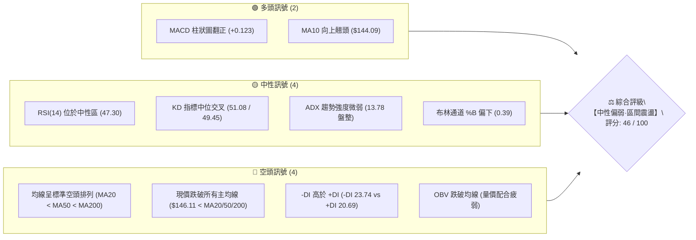
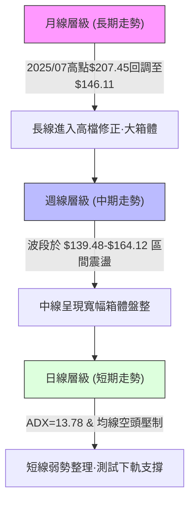
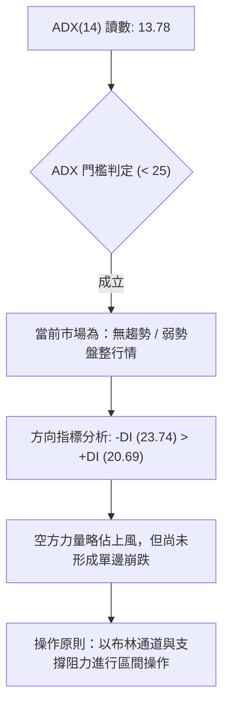
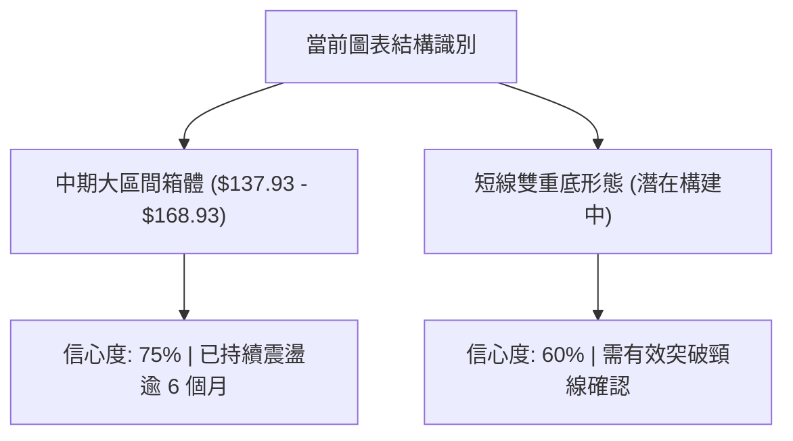
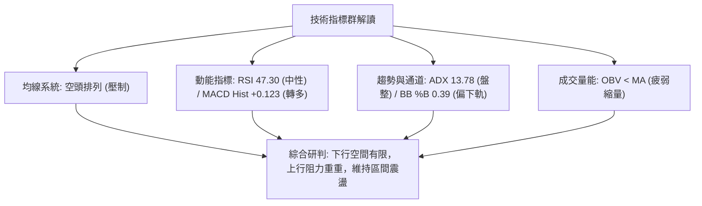
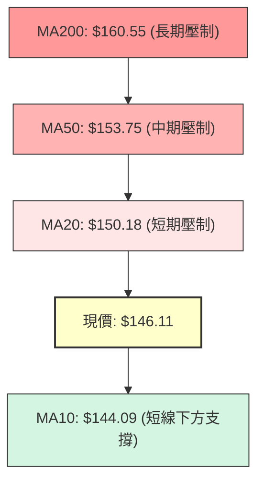
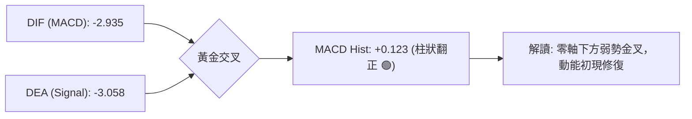
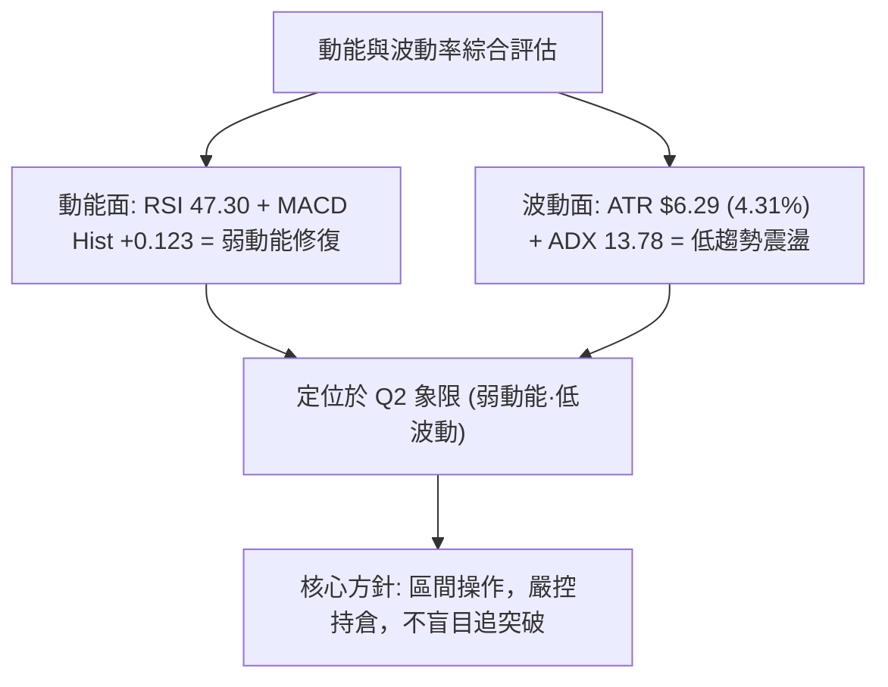
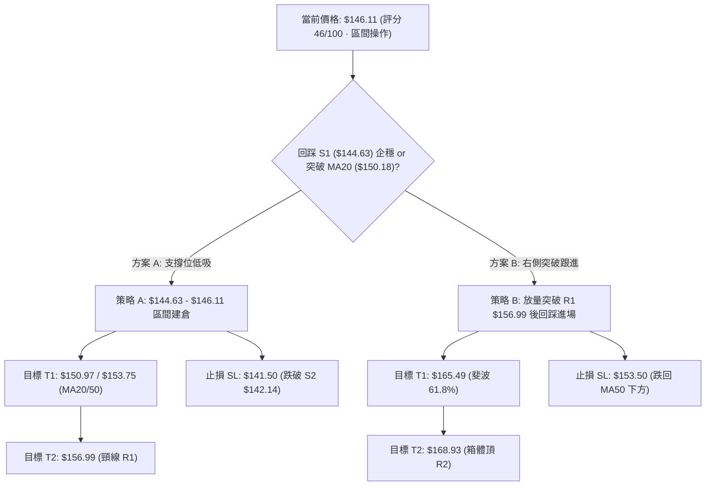
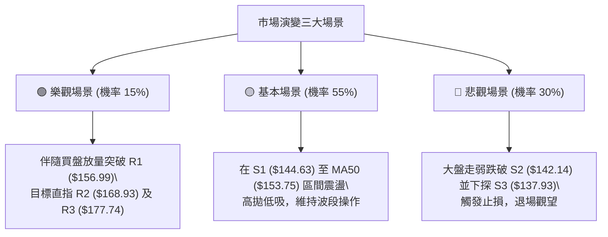

# VST 技術分析報告

> **報告日期**：2026-08-18 ｜ **語言**：繁體中文 ｜ **數據來源**：Yahoo Finance ｜ **當前價格**：$146.11

---

## 目錄

| 章節 | 內容 |
|------|------|
| [1. 技術面概覽](#1-技術面概覽) | 訊號儀表板、核心指標、評分卡 |
| [2. 趨勢分析](#2-趨勢分析) | 多時框趨勢、長中短期走勢 |
| [3. 圖表形態分析](#3-圖表形態分析) | 形態識別、K線組合、目標價 |
| [4. 支撐與阻力](#4-支撐與阻力) | 關鍵價位、斐波那契回調 |
| [5. 技術指標深度解讀](#5-技術指標深度解讀) | MA/RSI/MACD/布林/成交量 |
| [6. 動能與波動率](#6-動能與波動率) | 動能評估、ATR、Beta |
| [7. 多時框架總結](#7-多時框架總結) | 時框架評分矩陣 |
| [8. 交易策略建議](#8-交易策略建議) | 多空策略、風險報酬比 |
| [9. 風險提示與監控](#9-風險提示與監控) | 監控指標、風險場景 |

---

## 1. 技術面概覽

### 🎯 技術訊號儀表板



### 📊 核心指標速覽表

| 指標類別 | 指標名稱 | 當前數值 | 訊號 | 解讀 |
|----------|----------|----------|------|------|
| **價格** | 當前價格 | $146.11 | 🟡 | 位於52週區間15.8%之相對低檔，面臨築底或破底抉擇 |
| **均線** | MA20 | $150.18 | 🔴 | 價格低於MA20，短期承壓且中軌向下壓制 |
| **均線** | MA50 | $153.75 | 🔴 | 價格低於MA50，中期結構偏空運行 |
| **均線** | MA200 | $160.55 | 🔴 | 價格低於MA200，長期多空分水嶺失守 |
| **動能** | RSI(14) | 47.30 | 🟡 | 位於 30–70 中性區間，多空動能暫時平衡 |
| **動能** | MACD Hist | +0.123 | 🟢 | 柱狀圖翻正，底層出現弱勢金叉修復跡象 |
| **波動** | ATR(14) | $6.29 | 🟡 | 每日平均真實波幅 4.31%，波動度處於中等水平 |

### 🏆 技術評分卡

```
╔══════════════════════════════════════════════════════════════════╗
║               技術評分卡 — VST (2026-08-18)                      ║
╠══════════════════════════════════════════════════════════════════╣
║ 趨勢強度      ██████░░░░░░░░░░░░░░  30/100  🔴 (ADX 13.78 偏弱)  ║
║ 動能指標      ██████████░░░░░░░░░░  50/100  🟡 (RSI/MACD 修復)   ║
║ 支撐穩定度    ████████████░░░░░░░░  60/100  🟡 (接近 S1 $144.63) ║
║ 成交量配合    ████████░░░░░░░░░░░░  40/100  🔴 (量縮且 OBV 疲弱) ║
║ 形態完整度    ██████████░░░░░░░░░░  50/100  🟡 (大箱體下沿震盪)   ║
║ 均線排列      ████████░░░░░░░░░░░░  40/100  🔴 (MA20<50<200 壓制)║
╠══════════════════════════════════════════════════════════════════╣
║ 綜合評分      █████████░░░░░░░░░░░  46/100  ⚖️ 區間操作·中性偏弱 ║
╚══════════════════════════════════════════════════════════════════╝
```

---

## 2. 趨勢分析

### 🌐 多時框趨勢分析



### 📈 長期趨勢 — 12個月走勢圖（Unicode）

```
VST 月線走勢圖（過去12個月：2025-08 至 2026-08）
價格軸 ($)
$210 ┤                                      
$200 ┤              ●($195.11)              
$190 ┤●($188.12)  ●($187.52)                
$180 ┤                    ●($178.12)        
$170 ┤                                ●($173.41)
$160 ┤                          ●($160.88)          ●($160.01)
$150 ┤                                ●($157.91)  ●($150.12)  ●($158.63)
$140 ┤                                                  ●($148.19)  ●($146.11)←現價
     └─────────────────────────────────────────────────────────────────
      08    09    10    11    12    01    02    03    04    05    06    07    08 (月份)
      '25   '25   '25   '25   '25   '26   '26   '26   '26   '26   '26   '26   '26
```

**月線走勢特徵分析表格**：

| 階段區間 | 起止月份 | 價格變化 | 區間幅度 | 趨勢特徵解讀 |
|----------|----------|----------|----------|--------------|
| **高檔滯漲** | 2025-08 ~ 2025-10 | $188.12 → $187.52 | -0.32% | 衝高至 $195.11 後高檔震盪，未能突破 52W 高點 $218.91 |
| **波段下挫** | 2025-10 ~ 2026-01 | $187.52 → $157.91 | -15.79% | 跌破各短均線，連續 3 個月陰跌走弱 |
| **反彈受阻** | 2026-01 ~ 2026-02 | $157.91 → $173.41 | +9.82% | 快速反彈至 MA240 附近受阻回落 |
| **低檔盤整** | 2026-02 ~ 2026-08 | $173.41 → $146.11 | -15.74% | 進入 $140–$160 區間反覆築底，目前位於區間下沿 |

### 📊 中期趨勢（週線分析）

```
中期阻力與支撐區間結構：
╔══════════════════════════════════════════════════════════════════╗
║ [中期阻力區]  R2 ($168.93) / 斐波那契 61.8% ($165.49)          ║
║ -------------------------------------------------------------- ║
║ [密集壓力帶]  R1 ($156.99) / MA50 ($153.75) / MA20 ($150.18)    ║
║ -------------------------------------------------------------- ║
║ [現價位置]    $146.11 (布林帶 %B = 0.39)                        ║
║ -------------------------------------------------------------- ║
║ [近期防守區]  S1 ($144.63) / S2 ($142.14)                      ║
║ -------------------------------------------------------------- ║
║ [核心強支撐]  S3 ($137.93) / 52W 低點 ($132.47)                ║
╚══════════════════════════════════════════════════════════════════╝
```

### ⚡ 趨勢強度評估（ADX 解讀）



| 指標名稱 | 當前數值 | 參考閾值 | 狀態評估 | 操作意義 |
|----------|----------|----------|----------|----------|
| **ADX(14)** | 13.78 | 25.00 | 弱勢/盤整 (ADX < 25) | 趨勢跟隨無效，震盪指標優先 |
| **+DI(14)** | 20.69 | — | 多方力量低迷 | 上攻動能不足 |
| **-DI(14)** | 23.74 | — | 空方略微主導 | 壓制價格彈升幅度 |

---

## 3. 圖表形態分析

### 🔍 形態識別系統



**形態信心度評估表**（依規則 15）：

| 形態名稱 | 信心度 | 判斷依據（引用數據） | 完成度 | 目標價（附計算式） |
|----------|--------|----------------------|--------|--------------------|
| **寬幅箱體整理** | 75% | 價格在 S3 ($137.93) 與 R2 ($168.93) 間多次往返 | 85% | 箱體上軌目標：**$168.93** |
| **短期潛在雙底** | 60% | 第一次低點 2026-05-17 收盤 $139.48，第二次低點 2026-08-09 收盤 $140.59 (近 S3 $137.93) | 55% | 頸線為 R1 ($156.99)，形態高度 = $156.99 - $137.93 = $19.06。<br>向上推算目標 = $156.99 + $19.06 = **$176.05** (接近 R3 $177.74) |

### 🕯️ 重要K線形態分析

| 週期/日期 | 收盤價 | K線形態 / 量價組合 | 解讀 | 訊號 |
|-----------|--------|--------------------|------|------|
| **2026-05-17** | $139.48 | 波段長下影低點 (RSI=25.5) | 出現嚴重超賣，隨後引發大幅技術性反彈 | 🟢 |
| **2026-05-24** | $156.05 | 大陽線放量反包 (週量 32.76M) | 多方主力低檔承接，確認 $139.48 支撐強勁 | 🟢 |
| **2026-06-21** | $163.52 | 觸及阻力區流星線 | 挑戰 61.8% ($165.49) 未果，短線動能耗盡 | 🔴 |
| **2026-08-09** | $140.59 | 二次探底放量長陰 (週量 34.90M) | 空頭砸盤測試前低，量能釋放後未跌破 $137.93 | 🟡 |
| **2026-08-16** | $148.13 | 縮量反彈陽線 (週量 16.52M) | 賣壓趨緩，MACD 柱狀圖收窄至 -0.008 | 🟢 |
| **2026-08-23** | $146.11 | 窄幅十字星整理 (量縮 3.49M) | 多空雙方在 S1 ($144.63) 之上形成短線平衡 | 🟡 |

### 📉 ASCII 走勢形態示意圖

```
VST 中期潛在雙底與箱體形態示意圖
價格
$177.74 ┤                                      [形態目標/R3]
        │
$168.93 ┤         ┌─── 高點1 ──── 高點2 ───┐   [箱體上軌/R2]
        │         │ ($164.12)   ($163.52)  │
$156.99 ┼─────────┴────────────────────────┴─── [雙底頸線/R1]
        │                ▲ 突破點
$146.11 ┤················│····················· [現價]
        │         ┌──────┴──────┐
$137.93 ┤─────────┴─────────────┴────────────── [雙底支撐/S3]
        │       低點1          低點2
        │     ($139.48)      ($140.59)
        └───────────────────────────────────────
```

### 🎯 形態目標價計算

- **箱體突破目標**：若能突破 R1 ($156.99)，則下一階段目標為箱體上軌阻力 **R2 ($168.93)**。
- **雙底理論量度目標**：
  $$\text{形態高度} = \text{頸線}(R1: \$156.99) - \text{雙底支撐}(S3: \$137.93) = \$19.06$$
  $$\text{理論目標價} = \text{頸線}(\$156.99) + \text{形態高度}(\$19.06) = \mathbf{\$176.05}$$
  *(註：此由雙底高度推算之理論價 $176.05 完美聚類於關鍵阻力 **R3 ($177.74)** 附近)*。

---

## 4. 支撐與阻力

### 🗺️ 關鍵價位分布圖（Unicode）

```
VST 價位結構分布圖
═══════════════════════════════════════════════════
$177.74 ║████████████████████████║ 強阻力 R3 (形態量度目標/波段頂部)
$175.69 ║▓▓▓▓▓▓▓▓▓▓▓▓▓▓▓▓▓▓▓▓    ║ 斐波那契 50.0% 回調位
$168.93 ║████████████████████    ║ 阻力 R2 (布林上軌 $168.14 聚類)
$165.49 ║▓▓▓▓▓▓▓▓▓▓▓▓▓▓▓▓        ║ 斐波那契 61.8% 回調位
$160.55 ║────────────────────────║ MA200 牛熊分水嶺
$156.99 ║████████████████████████║ 關鍵阻力 R1 (頸線壓力)
$150.97 ║▓▓▓▓▓▓▓▓▓▓▓▓▓▓▓▓        ║ 斐波那契 78.6% 回調位 / MA20
$146.11 ╠════════════════════════╣ ◄ 當前價格 ($146.11)
$144.63 ║▓▓▓▓▓▓▓▓▓▓▓▓▓▓▓▓        ║ 近期支撐 S1 (波段低點聚類)
$142.14 ║████████████████        ║ 支撐 S2 (短線防守點)
$137.93 ║████████████████████████║ 強支撐 S3 (雙底防守線)
$132.47 ║████████████████████████║ 極限強支撐 (52W Low / 斐波 100%)
═══════════════════════════════════════════════════
```

### 🚧 阻力位分析表

| 阻力級別 | 精確價位 | 形成原因 | 突破難度 | 重要性 |
|----------|----------|----------|----------|--------|
| **R1** | **$156.99** | 近一年波段高點聚類、潛在雙底頸線位置 | 🟡 中等 | ★★★★☆ |
| **R2** | **$168.93** | 密集高點反轉區，緊鄰布林上軌 ($168.14) 與 MA240 ($167.21) | 🔴 高 | ★★★★★ |
| **R3** | **$177.74** | 2026-02 月線反彈波段頂部，雙底高度量度目標區 | 🔴 極高 | ★★★★☆ |

### 🛡️ 支撐位分析表

| 支撐級別 | 精確價位 | 形成原因 | 守住機率 | 重要性 |
|----------|----------|----------|----------|--------|
| **S1** | **$144.63** | 近一年波段低點密集聚類，距現價僅 -1.01% | 🟢 70% | ★★★★☆ |
| **S2** | **$142.14** | 次級波段回踩支撐，距現價 -2.72% | 🟢 75% | ★★★☆☆ |
| **S3** | **$137.93** | 近一年重大波段低點聚類，箱體底層防禦線 | 🟢 85% | ★★★★★ |

### 📐 斐波那契回調位分析

依據 52 週完整波動區間（高點 **$218.91** → 低點 **$132.47**）計算：

| 斐波那契層級 | 精確價位 | 相對現價距離 | 技術意義解讀 |
|--------------|----------|--------------|--------------|
| **0.0% (52W High)** | $218.91 | +49.83% | 歷史牛市頂部極限壓力 |
| **23.6%** | $198.51 | +35.86% | 強勢回調阻力位 |
| **38.2%** | $185.89 | +27.23% | 長期黃金分割回撤位 |
| **50.0%** | $175.69 | +20.25% | 中期多空中軸線（聚類於 R3 $177.74） |
| **61.8%** | $165.49 | +13.26% | 關鍵黃金分割壓力（聚類於 R2 $168.93） |
| **78.6%** | $150.97 | +3.33% | 近期反彈第一阻力（聚類於 MA20 $150.18） |
| **當前現價** | **$146.11** | — | **落於 78.6% ($150.97) 與 100.0% ($132.47) 深度回撤區** |
| **100.0% (52W Low)** | $132.47 | -9.34% | 52週最低點，整輪週期的終極底部 |

---

## 5. 技術指標深度解讀

### 🎛️ 指標訊號總覽



### 📈 移動平均線排列分析



- **均線排列狀態**：當前呈現典型空頭排列（$\text{MA20} < \text{MA50} < \text{MA200}$）。
- **乖離率解讀**：
  - 現價距 MA20 ($150.18) 乖離為 -2.71%
  - 現價距 MA50 ($153.75) 乖離為 -5.29%
  - 現價距 MA200 ($160.55) 乖離為 -9.00%
- **短線亮點**：MA10 ($144.09) 低檔向上微勾（+1.40%），短線在 S1 ($144.63) 附近具備減速止跌跡象。

### 📉 RSI(14) 分析

$$\text{RSI(14)} = 47.30 \quad [\text{█████████░░░░░░░░░░░}\ 47.3\%]$$

- **區間判定**：數值 47.30，落於 30–70 中性震盪區間，脫離了 2026-05 期間的超賣區 (25.5)。
- **背離分析**：
  - 2026-05-17 價格低點 $139.48，RSI 為 25.5；
  - 2026-08-09 價格低點 $140.59，RSI 為 37.2；
  - **結論**：週線級別存在**微幅隱性底背離**（價格二次探底接近前低，但 RSI 明顯抬高），預示低檔買盤逐步介入。

### 📊 MACD(12/26/9) 訊號解讀



- **數值狀態**：DIF (-2.935) 上穿 Signal (-3.058)，柱狀圖由負轉正至 **+0.123**。
- **指標意義**：屬於「零軸下方的低檔金叉」，雖然受制於零軸之下的偏空環境，但代表自 $140.59 以來的下跌動能已暫告衰竭，具備向上測試 MA20 的動能。

### 📦 布林通道分析

```
VST 布林通道空間定位 (Bandwidth = $35.92)
$168.14 ┤──────────────────────────────── 上軌 (強壓力 R2 $168.93 聚類)
        │
$150.18 ┤┄┄┄┄┄┄┄┄┄┄┄┄┄┄┄┄┄┄┄┄┄┄┄┄┄┄┄┄┄┄ 中軌 (MA20 第一反彈阻力)
        │       ▲ 向上修復空間 ($4.07)
$146.11 ┼───────● 現價 (%B = 0.39)
        │       ▼ 向下回踩空間 ($13.89)
$132.22 ┤──────────────────────────────── 下軌 (52W Low $132.47 聚類)
```

- **%B 指標**：0.39（介於 0 與 0.5 之間，偏向中下軌區間運行）。
- **帶寬特徵**：通道口呈現橫向平移，無明顯喇叭口張開跡象，進一步確認盤整本質。

### 💹 成交量分析（量價配合度）

- **最新成交量**：3,493,000 股；**20日均量**：4,547,760 股（量比 0.77x，量縮 -23%）。
- **OBV 趨勢**：$\text{OBV} < \text{MA}$，能量潮位於均線下方，顯示籌碼沉澱但主動進攻意願不足。
- **量價關係解讀**：價格在探底過程中呈現「放量砸盤 ($140.59 週量 34.90M) → 縮量企穩 ($146.11 日量 3.49M)」之特徵，屬於典型的空頭動能衰減型量縮。

---

## 6. 動能與波動率

### ⚡ 動能評估四象限

| 象限 | 動能強度 (Momentum) | 波動率水平 (Volatility) | 當前判定 | 策略指導意義 |
|------|---------------------|--------------------------|----------|--------------|
| **Q1** | 強動能 (Strong) | 低波動 (Low) | — | 穩定單邊推升趨勢 |
| **Q2 (當前)** | **弱動能 (Weak)** | **低/中波動 (Low-Mid)** | **✓ (VST)** | **謹慎觀望，鎖定關鍵支撐做高拋低吸** |
| **Q3** | 強動能 (Strong) | 高波動 (High) | — | 高爆發突破行情，追隨趨勢 |
| **Q4** | 弱動能 (Weak) | 高波動 (High) | — | 無序劇烈震盪，極易洗盤止損 |



### 📊 ATR 波動率分析

- **ATR(14) 數值**：**$6.29**（佔現價比率 4.31%）。
- **止損距離建議**：
  - **保守型 (1.0 × ATR)**：\$6.29，以現價 $146.11 計算對應緩衝價位為 **$139.82**。
  - **標準型 (1.5 × ATR)**：\$9.44，對應緩衝價位為 **$136.67**（已跌破 S3 $137.93，視為形態徹底破位）。
  - **短線支撐依託**：進場止損應直接參考結構點位 **S1 ($144.63)** 或 **S2 ($142.14)**。

### 📐 Beta 與市場相關性

- **Beta 係數**：**1.433**。
- **大盤敏感度解讀**：VST 的波動敏感度高於標普 500 指數 43.3%，具備較高彈性。在公用事業/獨立發電商板塊中屬於高貝塔進攻型標的，當市場風險偏好回暖時反彈彈性較大。

---

## 7. 多時框架總結

### 📋 時框架評分表

| 時框架 | 趨勢方向 | 動能狀態 | 均線排列 | 圖表形態 | 綜合評分 | 建議方針 |
|--------|----------|----------|----------|----------|----------|----------|
| **月線 (長期)** | 🟡 震盪回調 | 弱化 (自高點修正) | 跌破短均/高於長均 | 高檔大箱體 | 55/100 | 長期分批逢低配置 |
| **週線 (中期)** | 🟡 寬幅箱體 | 🟢 弱底背離初顯 | 空頭排列 (壓制) | 潛在雙重底 | 48/100 | 箱體下沿低吸，頸線減倉 |
| **日線 (短期)** | 🔴 弱勢震盪 | 🟢 MACD微幅轉多 | 短均糾纏/受制MA20 | 窄幅橫盤築底 | 42/100 | 嚴格依託 S1 進行波段試單 |

### 🔲 綜合訊號矩陣

```
╔════════════════════════════════════════════════════════════════════╗
║                   多時框架綜合訊號矩陣                             ║
╠════════════════════════════════════════════════════════════════════╣
║ 評估維度      │  月線 (長期)   │  週線 (中期)   │  日線 (短期)     ║
╟───────────────┼────────────────┼────────────────┼──────────────────╢
║ 趨勢方向      │  🟡 中性震盪   │  🟡 箱體整理   │  🔴 偏空震盪     ║
║ 動能指標      │  🔴 偏弱       │  🟢 底背離修復 │  🟢 翻正微升     ║
║ 均線系統      │  🟡 多空交織   │  🔴 空頭壓制   │  🔴 MA20/50承壓  ║
║ 成交量配合    │  🟡 縮量沉澱   │  🟡 賣壓收斂   │  🔴 攻擊量不足   ║
║ 關鍵結構點    │  52W低 $132.47 │  雙底S3 $137.93│  短線S1 $144.63  ║
╚════════════════════════════════════════════════════════════════════╝
```

### ⚖️ 多時框收斂結論

> **收斂依據（嚴格遵守規則 14）**：
> 1. **趨勢/盤整識別**：當前 ADX(14) 為 **13.78 (< 25)**，明確定義當前處於**盤整行情**。
> 2. **主導時框與交易規則**：在盤整行情中，趨勢指標失效，**以日線/週線之布林通道上下軌與結構支撐阻力為核心操作區間**。
> 3. **唯一方向性結論**：**【中性觀望·區間下沿博弈反彈】**。日線雖受均線空頭壓制，但因逼近 S1 ($144.63) 強支撐且 MACD 柱狀翻正，下行空間受限；交易應以**「依託支撐低吸、受阻均線平倉」**的震盪策略為主，絕不追高。

---

## 8. 交易策略建議

### 🗺️ 策略決策流程圖



### 🧭 策略路由

**當前主策略方向 = 【中性區間操作·支撐位左側低吸】（依綜合評分 46/100 判定）**

由於評分處於 40–60 區間，市場缺乏單邊趨勢（ADX=13.78），主推**「依託支撐位的區間波段策略」**，空頭操作僅限於高軌受阻時之對沖提示。

### 🎯 價格情境階梯（Price Scenarios）

| 觸發條件 | 下一目標 | 後續延伸 | 情境含義解讀 |
|----------|----------|----------|--------------|
| **突破 R1 $156.99** | R2 **$168.93** | R3 **$177.74** | 短線徹底轉強，雙底形態確立，展開中期向上補漲 |
| **突破 MA20 $150.18** | MA50 **$153.75** | R1 **$156.99** | 弱勢反彈展開，測試均線密集壓力區 |
| **維持現價區間 ($144.63–$150.18)** | 區間震盪 | — | 多空低檔拉鋸，籌碼換手築底 |
| **跌破 S1 $144.63** | S2 **$142.14** | S3 **$137.93** | 短線支撐失效，回探 8 月初低點測試雙底支撐 |
| **跌破 S3 $137.93** | 52W低 **$132.47** | — | 形態全面破位，開啟新一輪下行探底 |

### 📊 情境機率分佈

| 情境劇本 | 發生機率 | 主要技術依據 |
|----------|----------|--------------|
| **區間震盪·弱勢反彈** | **55%** | ADX 13.78 確立盤整，MACD 翻正 (+0.123)，現價緊鄰 S1 ($144.63) 具備防守買盤 |
| **向下破位·再探底** | **30%** | 均線系統空頭排列壓制，OBV 量能疲弱，空方 -DI (23.74) 仍高於 +DI (20.69) |
| **強勢突破·單邊反轉** | **15%** | 目前成交量萎縮 (量比 0.77x)，缺乏增量資金推動直接跨越 R1 ($156.99) |

### 🟢 主策略詳情

| 策略要素 | 策略 A（左側支撐低吸 · 當前推薦） | 策略 B（右側突破追隨 · 備選進階） |
|----------|-----------------------------------|-----------------------------------|
| **適用場景** | 現價震盪或小幅回踩 S1 企穩時 | 放量帶量長陽突破 R1 頸線時 |
| **進場價格** | **$145.00**（限價於 $144.63–$146.11 區間） | **$157.50**（確認突破 $156.99 回踩不破） |
| **目標價 T1** | **$153.75**（MA50 壓力位，預期 +6.03%） | **$165.49**（斐波那契 61.8%，預期 +5.07%） |
| **目標價 T2** | **$156.99**（關鍵阻力 R1，預期 +8.27%） | **$168.93**（阻力 R2 / 布林上軌，預期 +7.26%） |
| **止損價格** | **$141.50**（跌破 S2 $142.14，風險 -2.41%） | **$153.50**（跌破 MA50 $153.75，風險 -2.54%） |
| **風險報酬比** | **2.50 : 1**（目標 T1）/ **3.43 : 1**（目標 T2）| **2.00 : 1**（目標 T1）/ **2.86 : 1**（目標 T2） |
| **勝率預估** | **60%** | **55%** |
| **建議倉位** | **10% – 15%**（輕倉試單） | **15% – 20%**（確認轉強後加碼） |

### 🔴 反向風險觸發點（對沖與風控提示）

- **全面停損防線**：若日線收盤價有效跌破 **S2 ($142.14)** 或盤中跌破 **S3 ($137.93)**，證明雙底形態構建失敗，主策略立即失效，所有多單應果斷離場觀望。
- **高位反手空點**：若價格反彈至 **R1 ($156.99)** 或 **R2 ($168.93)** 出現長上影線、放量滯漲且 RSI > 65 時，為空頭重新建倉或多頭完全止盈點。

### ⭐ 整體訊號強度評星

```
做多訊號強度：★★☆☆☆  (2/5星 — 僅限支撐位博弈反彈)
做空訊號強度：★★★☆☆  (3/5星 — 均線空頭壓制依然存在)
整體可信度：  ★★★☆☆  (3/5星 — 盤整震盪市場，指標容易鈍化)
```

---

## 9. 風險提示與監控

### ✅ 關鍵監控指標 Checklist

```
╔══════════════════════════════════════════════════════════════════╗
║                   每日交易風控監控清單 (Checklist)               ║
╠══════════════════════════════════════════════════════════════════╣
║ [ ] 價格防守監控：現價 $146.11 是否能穩守 S1 ($144.63) 之上？    ║
║ [ ] 均線動態監控：能否突破並站穩短期壓制線 MA20 ($150.18)？     ║
║ [ ] 動能延續監控：MACD 柱狀圖是否持續擴大正值 (維持在 >0 區間)？ ║
║ [ ] 趨勢強度監控：ADX(14) 是否突破 20 向上張開（標誌盤整結束）？║
║ [ ] 量能配合監控：成交量是否放大至 20 日均量 (4.55M) 之上？      ║
╚══════════════════════════════════════════════════════════════════╝
```

### ⚠️ 風險場景分析



### 🛡️ 風險管理重要提醒

1. **基本面與估值背離風險**：
   - 儘管 18 位華爾街分析師給予 **Strong Buy** 評級且平均目標價高達 **$221.28**，但技術面當前處於空頭均線壓制下。**切忌因基本面看好而忽視技術破位止損紀律**。
2. **波動率管理**：
   - VST 的 Beta 高達 **1.433**，日 ATR 為 **$6.29**。單筆交易最大虧損額必須嚴格控制在總資金的 1.0% 以內，依據止損距離計算進場股數。
3. **無趨勢環境下的交易戒律**：
   - 在 ADX < 25 的盤整市中，嚴禁追高追買。買點必須嚴格等待價格回踩支撐位（如 $144.63–$145.00），賣點必須嚴格設置在均線或阻力位（如 $153.75 / $156.99）。

---

## 📋 報告總結

```
╔════════════════════════════════════════════════════════════════════╗
║                     VST 技術分析報告總結                           ║
╠════════════════════════════════════════════════════════════════════╣
║ 報告日期：2026-08-18                                               ║
║ 當前價格：$146.11                                                  ║
║ 分析評級：⚖️ 區間震盪·中性偏弱 (技術評分: 46 / 100)               ║
╟────────────────────────────────────────────────────────────────────╢
║ 關鍵結論：                                                         ║
║ ├─ 長期趨勢：🟡 中性回調，處於 2025 年高點以來的回撤整理箱體       ║
║ ├─ 中期趨勢：🟡 寬幅震盪，構建 $137.93 至 $168.93 之潛在雙重底     ║
║ ├─ 短期趨勢：🔴 弱勢盤整，承壓於 MA20/MA50，但 MACD 初步翻正修復  ║
║ ├─ 關鍵支撐：S1: $144.63 │ S2: $142.14 │ S3: $137.93              ║
║ ├─ 關鍵阻力：R1: $156.99 │ R2: $168.93 │ R3: $177.74              ║
║ └─ 分析師目標：均價 $221.28 (最高 $313.00 / 最低 $106.00)          ║
╟────────────────────────────────────────────────────────────────────╢
║ 最優策略組合：                                                     ║
║ 1. 🥇 最佳機會：策略 A (左側在 $145.00 附近低吸，止損 $141.50，   ║
║                 目標 $153.75 / $156.99，風報比 3.43:1)             ║
║ 2. 🥈 次選機會：策略 B (右側放量突破 R1 $156.99 後追隨至 R2 $168.93)║
║ 3. 🥉 保守選擇：空倉觀望，等待日線突破站穩 MA20 ($150.18) 再行介入 ║
╚════════════════════════════════════════════════════════════════════╝
```

---

> ⚠️ **免責聲明**：本報告為 AI 自動生成之技術分析，所有數據及估算均基於提供的歷史價格資訊。本報告**僅供研究與學術參考**，**不構成任何投資建議**。投資有風險，入市需謹慎。

---

*報告生成時間：2026-08-18 ｜ 數據來源：Yahoo Finance ｜ 分析框架：多時框技術分析*