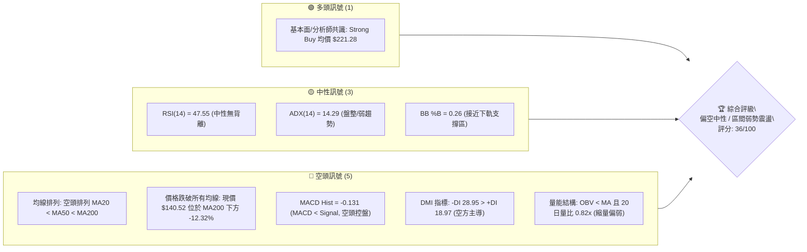
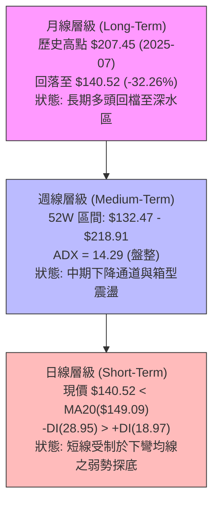
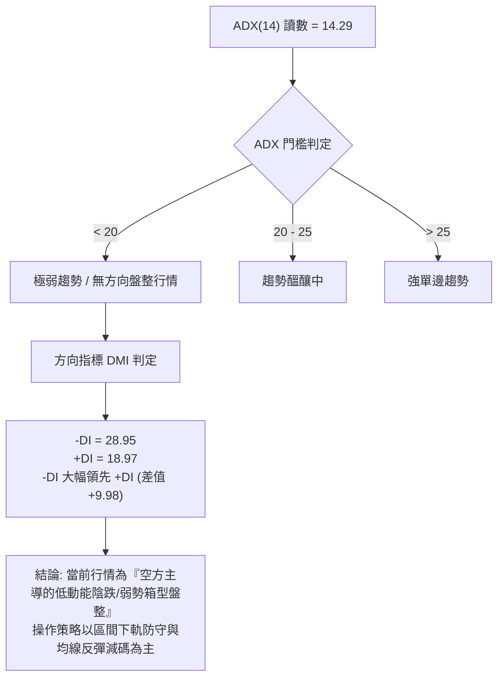
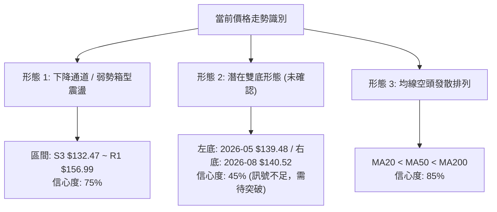
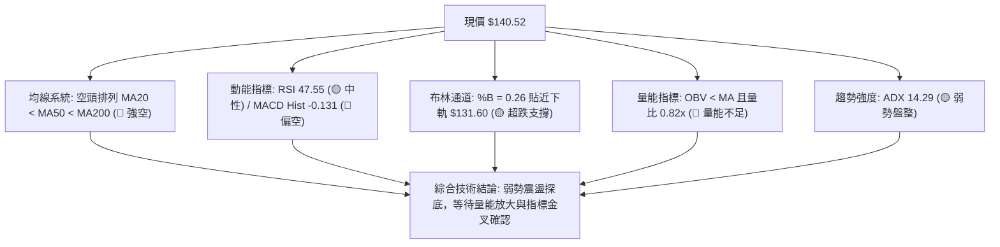
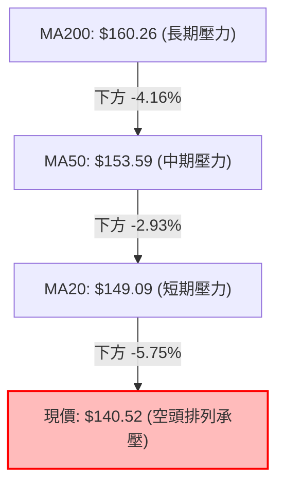
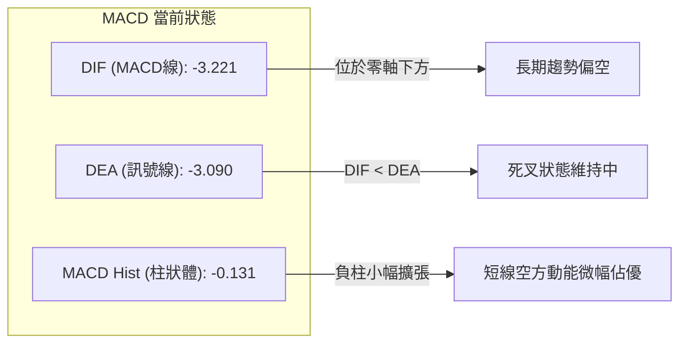
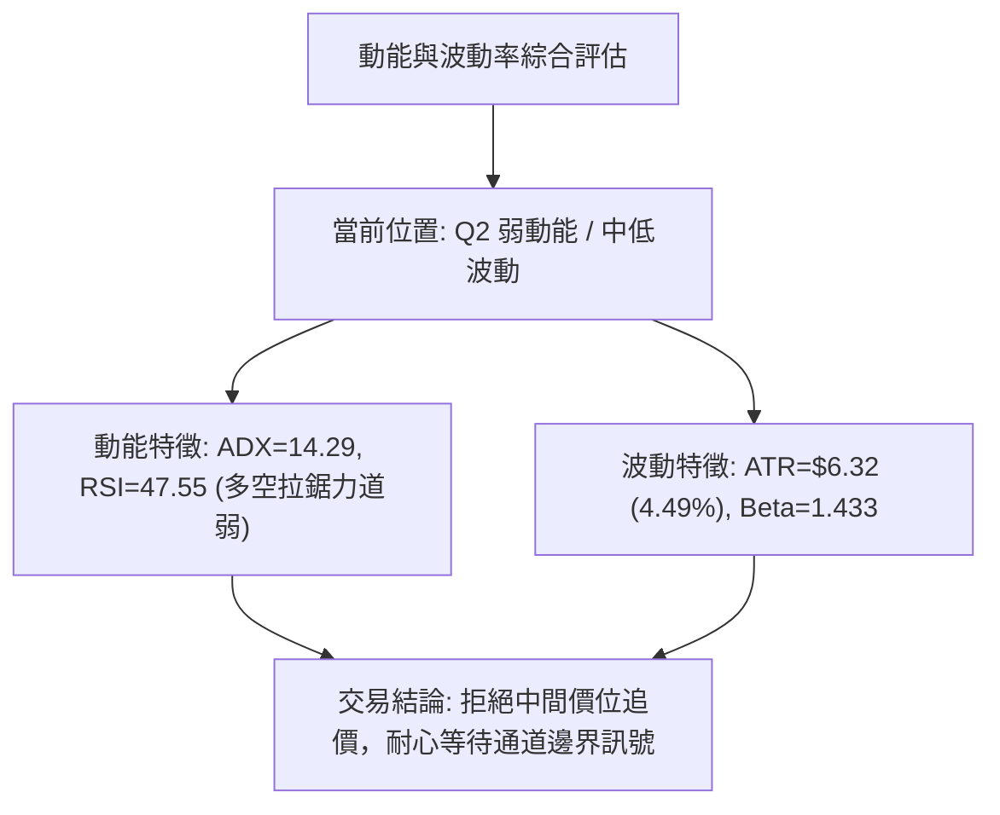
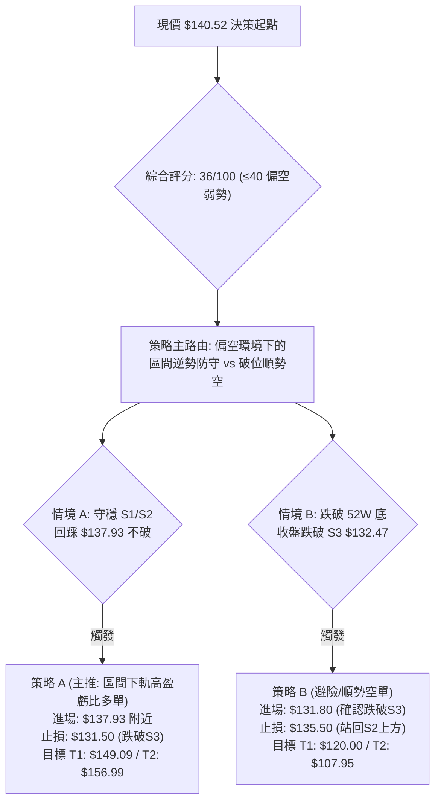
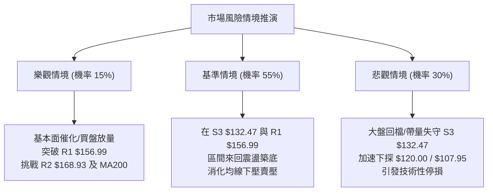

# VST 技術分析報告

> **報告日期**：2026-08-19 ｜ **語言**：繁體中文 ｜ **數據來源**：Yahoo Finance ｜ **當前價格**：$140.52

---

## 目錄

| 章節 | 內容 |
|------|------|
| [1. 技術面概覽](#1-技術面概覽) | 訊號儀表板、核心指標、評分卡 |
| [2. 趨勢分析](#2-趨勢分析) | 多時框趨勢、長中短期走勢 |
| [3. 圖表形態分析](#3-圖表形態分析) | 形態識別、K線組合、目標價 |
| [4. 支撐與阻力](#4-支撐與阻力) | 關鍵價位、斐波那契回調 |
| [5. 技術指標深度解讀](#5-技術指標深度解讀) | MA/RSI/MACD/布林/成交量 |
| [6. 動能與波動率](#6-動能與波動率) | 動能評估、ATR、Beta |
| [7. 多時框架總結](#7-多時框架總結) | 時框架評分矩陣 |
| [8. 交易策略建議](#8-交易策略建議) | 多空策略、風險報酬比 |
| [9. 風險提示與監控](#9-風險提示與監控) | 監控指標、風險場景 |

---

## 1. 技術面概覽

### 🎯 技術訊號儀表板



### 📊 核心指標速覽表

| 指標類別 | 指標名稱 | 當前數值 | 訊號 | 解讀 |
|----------|----------|----------|------|------|
| **價格** | 當前價格 | $140.52 | 🔴 | 位於 52 週高低區間 9.3% 處，貼近歷史底部區域 |
| **均線** | MA20 | $149.09 | 🔴 | 現價低於 MA20 達 -5.75%，短線承壓 |
| **均線** | MA50 | $153.59 | 🔴 | 現價低於 MA50 達 -8.51%，中期均線下彎形成動態阻力 |
| **均線** | MA200 | $160.26 | 🔴 | 現價低於 MA200 達 -12.32%，跌破長期多空分水嶺 |
| **動能** | RSI(14) | 47.55 | 🟡 | 位於 30–70 中性區間，未見超賣但缺乏向上動能 |
| **動能** | MACD | -3.221 (Hist: -0.131) | 🔴 | MACD 與 Signal 雙雙位於零軸下方且負柱狀體擴張 |
| **波動** | ATR(14) | $6.32 (4.49%) | 🟡 | 每日平均震幅 $6.32，波動度適中偏高 |
| **趨勢** | ADX(14) | 14.29 | 🟡 | ADX < 25 處於無明確單邊趨勢之低動能盤整狀態 |
| **量能** | 20日均量比 | 0.82x | 🔴 | 最新量 3.75M < 20日均量 4.58M，OBV 跌破均線，買盤觀望 |

### 🏆 技術評分卡

```
╔══════════════════════════════════════════════════════════════╗
║                技術評分卡 — VST (2026-08-19)                 ║
╠══════════════════════════════════════════════════════════════╣
║ 趨勢強度 (Trend)       ██████░░░░░░░░░░░░░░  30/100  🔴 空頭排列 ║
║ 動能指標 (Momentum)    ████████░░░░░░░░░░░░  40/100  🟡 中性偏弱 ║
║ 支撐穩定度 (Support)   ██████████░░░░░░░░░░  50/100  🟡 考驗S1-S3║
║ 成交量配合 (Volume)    ██████░░░░░░░░░░░░░░  30/100  🔴 量能退潮 ║
║ 形態完整度 (Pattern)   ████████░░░░░░░░░░░░  40/100  🟡 箱型下緣 ║
║ 均線排列 (Moving Avg)  ████░░░░░░░░░░░░░░░░  20/100  🔴 完美空頭 ║
╠══════════════════════════════════════════════════════════════╣
║ 綜合評分 (Overall)     ███████░░░░░░░░░░░░░  36/100  🔴 偏空弱勢 ║
╚══════════════════════════════════════════════════════════════╝
```

---

## 2. 趨勢分析

### 🌐 多時框趨勢分析



### 📈 長期趨勢 — 12個月走勢圖（Unicode）

```
VST 月線走勢圖（過去12個月：2025-08 至 2026-08）
價格軸 ($)
$200 ┤ ●(09月 $195.11)
$190 ┤   ●(08月 $188.12) ●(10月 $187.52)
$180 ┤                     ●(11月 $178.12)
$170 ┤                                     ●(02月 $173.41)
$160 ┤                               ●(12月 $160.88)   ●(05月 $160.01) ●(06月 $158.63)
$150 ┤                                 ●(01月 $157.91)   ●(04月 $157.62)   ●(07月 $148.19)
$140 ┤                                           ●(03月 $150.12)               ●(08月 $140.52)←現價
     └─┬───────┬───────┬───────┬───────┬───────┬───────┬───────┬───────┬───────┬───────┬───────┬───
      08/25   09/25   10/25   11/25   12/25   01/26   02/26   03/26   04/26   05/26   06/26   07/26   08/26
```

**走勢特徵分析表格**：

| 階段區間 | 起訖價格 | 漲跌幅 | 趨勢特徵與技術解讀 |
|----------|----------|--------|-------------------|
| **2025-08 ~ 2025-10** | $188.12 → $187.52 | -0.32% | 高檔雙頂構築期，多頭動能耗盡，於 $195.11 見次高點後轉弱 |
| **2025-11 ~ 2026-01** | $178.12 → $157.91 | -11.35% | 加速下行跌破 MA200，形成中期空頭反轉結構 |
| **2026-02 ~ 2026-04** | $173.41 → $157.62 | -9.11% | 跌深反彈至 $173.41（測試 MA200/Fibo 50%），隨後反彈失敗再度破底 |
| **2026-05 ~ 2026-08** | $160.01 → $140.52 | -12.18% | 震盪走跌，進入 52 週低點 $132.47 防守戰，均線全面轉為空頭排列 |

### 📊 中期趨勢（週線分析）

```
VST 週線阻力與支撐結構示意圖
$175.69 ──────────────────────────── 斐波那契 50.0% / 中期強反轉點
$168.93 ════════════════════════════ R2 阻力（前波高點聚類）
$160.26 ┄┄┄┄┄┄┄┄┄┄┄┄┄┄┄┄┄┄┄┄┄┄┄┄ MA200 長期多空分水嶺
$156.99 ════════════════════════════ R1 關鍵短線阻力
$149.09 ─ ─ ─ ─ ─ ─ ─ ─ ─ ─ ─ ─ ─ ─ MA20 / BB中軌
$140.52 ◄現價 ($140.52) 考驗下方密集支撐帶
$137.93 ──────────────────────────── S1 近期波段支撐
$134.75 ──────────────────────────── S2 關鍵波段支撐
$132.47 ════════════════════════════ S3 / 52週最低價（多頭最後防線）
```

### ⚡ 趨勢強度評估（ADX 解讀）



| 指標名稱 | 當前數值 | 參考標準 | 狀態評估 | 技術含義 |
|----------|----------|----------|----------|----------|
| **ADX(14)** | 14.29 | < 25 盤整 / > 25 趨勢 | 弱趨勢/盤整 | 缺乏單邊動能，行情容易在均線與通道間來回拉鋸 |
| **+DI** | 18.97 | > 25 多頭強 | 空方佔優 | 多頭進攻意願低迷，追高動能不足 |
| **-DI** | 28.95 | > 25 空頭強 | 空方控盤 | 賣壓持續存在，構成價格反彈的常態阻力 |

---

## 3. 圖表形態分析

### 🔍 形態識別系統



| 形態名稱 | 信心度 | 判斷依據（引用數據） | 完成度 | 目標價（附計算式） |
|----------|--------|----------------------|--------|--------------------|
| **下降箱型震盪** | 75% | 價格於 52W 低點聚類 S3($132.47) 至 R1($156.99) 間震盪，ADX=14.29 | 80% | 箱頂突破目標: $156.99 + ($156.99 - $132.47) = **$181.51**（由箱體高度推算） |
| **雙重底 (潛在)** | 45% | 2026-05-17 低點 $139.48 與現價 $140.52 形成潛在雙腳，但未突破頸線 | 35% | 頸線 R1($156.99) 突破目標: $156.99 + ($156.99 - $139.48) = **$174.50**（由雙底高度推算） |
| **均線空頭排列** | 85% | MA20($149.09) < MA50($153.59) < MA200($160.26) 且現價位於其下方 | 90% | 下行支撐測試目標: 波段低點聚類 **S3 $132.47** |

*註：由於雙重底信心度僅 45% (< 50%)，目前不可視為有效反轉，交易架構維持以「箱型震盪下軌防守」與「指標型解讀」為主。*

### 🕯️ 重要K線形態分析

| 週期/日期 | 收盤價 | K線形態 | 解讀 | 訊號 |
|----------|--------|---------|------|------|
| **2026-05-17** | $139.48 | 長下影打底紅K | 週成交量放大至 28.94M，於 $139.48 出現低檔承接買盤 | 🟢 短多反彈 |
| **2026-06-21** | $163.52 | 長紅突破K | 週放量突破 MA20，帶動 RSI 回升至 53.3，但受阻於 MA200 | 🟡 假突破 |
| **2026-07-26** | $163.38 | 上影線倒轉鎚頭 | 再次上攻 $163.38 未果，遇 MA200 強阻力帶量回落 | 🔴 反轉看空 |
| **2026-08-09** | $140.59 | 大陰線破位 | 週成交量激增至 34.90M（爆量下殺），確立短線下行波段 | 🔴 空方釋放 |
| **2026-08-23** | $140.52 | 縮量十字星/小陰 | 週量急縮至 7.79M，賣壓動能減緩，現價於 S1($137.93) 上方尋求支撐 | 🟡 變盤觀望 |

### 📉 ASCII 走勢形態示意圖

```
VST 2026年 5月至8月 箱型打底示意圖
$168.93 ┬ 
$163.52 ┤        ┌───●(06/21)─────●(07/26 $163.38) 頸線阻力區 (MA200 附近)
$156.99 ┤       ┌┘   │           │   ╲
$149.09 ┤───────┼────┼───────────┼────╲── MA20 中軌
$140.52 ┤  ●────┘    │           │     ●(現價 $140.52) 潛在右底
$139.48 ┤ ●(05/17 左底)         │     │
$132.47 ┴────────────────────────┴─────┴── S3 / 52W Low (強支撐底線)
```

### 🎯 形態目標價計算

1. **若箱體向下破位（跌破 S3 $132.47）**：
   - 形態跌幅滿足 = $132.47 - ($156.99 - $132.47) = **$107.95**（由箱體跌破等距推算，接近分析師最低目標價 $106.00）。
2. **若箱體向上突破（有效站穩 R1 $156.99）**：
   - 形態漲幅滿足 = $156.99 + ($156.99 - $132.47) = **$181.51**（由箱體突破等距推算，接近斐波那契 38.2% $185.89）。

---

## 4. 支撐與阻力

### 🗺️ 關鍵價位分布圖（Unicode）

```
VST 價位結構分布圖（數據精確對齊）
═════════════════════════════════════════════════════════════════════
$177.74 ║████████████████████████████████████║ 強阻力 R3 (近一年波段高點)
$175.69 ║▓▓▓▓▓▓▓▓▓▓▓▓▓▓▓▓▓▓▓▓▓▓▓▓▓▓▓▓▓▓▓▓▓   ║ 斐波那契 50.0% 回調位
$168.93 ║████████████████████████████        ║ 重大阻力 R2 (波段高點聚類)
$165.49 ║▓▓▓▓▓▓▓▓▓▓▓▓▓▓▓▓▓▓▓▓▓▓▓             ║ 斐波那契 61.8% 回調位
$160.26 ║┄┄┄┄┄┄┄┄┄┄┄┄┄┄┄┄┄┄┄┄┄┄┄┄┄┄┄┄┄┄║ MA200 長期均線壓力線
$156.99 ║████████████████████                ║ 關鍵短線阻力 R1 (頸線位置)
$150.97 ║▓▓▓▓▓▓▓▓▓▓▓▓▓▓                      ║ 斐波那契 78.6% 回調位
$149.09 ║────────────────────────────────────║ MA20 / 布林中軌
$140.52 ╠════════════════════════════════════╣ ◄ 現價 ($140.52)
$137.93 ║▓▓▓▓▓▓▓▓▓▓▓▓▓▓▓▓                    ║ 近期支撐 S1 (-1.84%)
$134.75 ║████████████████████                ║ 關鍵支撐 S2 (-4.11%)
$132.47 ║████████████████████████████████████║ 極強支撐 S3 / 52W Low (-5.73%)
═════════════════════════════════════════════════════════════════════
```

### 🚧 阻力位分析表

| 阻力級別 | 價位 | 形成原因 | 突破難度 | 重要性 |
|----------|------|----------|----------|--------|
| **R1** | **$156.99** | 近一年多次波段反彈高點聚類，且貼近斐波那契 78.6% ($150.97) 及 MA50($153.59) | 中等 | 🟢 短線多空轉折點；突破方能扭轉均線空頭排列 |
| **R2** | **$168.93** | 2026年2月及波段密集套牢區，重疊 MA240($167.02) 與布林上軌($166.58) | 極高 | 🔴 中期強阻力，無重大量能配合難以一蹴可幾 |
| **R3** | **$177.74** | 52W 高點回落之 50% 斐波那契壓力帶 ($175.69~$177.74)，機構密集出貨區 | 極高 | 🔴 長期多頭回歸之關鍵門檻 |

### 🛡️ 支撐位分析表

| 支撐級別 | 價位 | 形成原因 | 守住機率 | 重要性 |
|----------|------|----------|----------|--------|
| **S1** | **$137.93** | 距現價僅 -1.84%，為近幾週下影線密集探底之波段低點聚類 | 60% | 🟡 極短線防守點，跌破將引發向 S2 尋求支撐 |
| **S2** | **$134.75** | 2025年第一季打底低點與波段支撐聚類，貼近布林下軌($131.60) | 70% | 🟢 次級強支撐，跌破將直接威脅 52 週最低價 |
| **S3** | **$132.47** | **52週最低價 (52W Low)**，斐波那契 100.0% 基準點，多頭最後防線 | 80% | 🔴 絕對底線；一旦帶量失守將觸發停損盤並向下尋找 $107.95 |

### 📐 斐波那契回調位分析

依據 52 週波動區間（高點 $218.91 → 低點 $132.47，總落差 $86.44）計算之標準黃金分割位：

```
0.0%  (52W High)  ─── $218.91
23.6% 回調位      ─── $198.51
38.2% 回調位      ─── $185.89
50.0% 回調位      ─── $175.69
61.8% 回調位      ─── $165.49  (重疊 MA240: $167.02)
78.6% 回調位      ─── $150.97  (重疊 MA20: $149.09)
100.0%(52W Low)   ─── $132.47  (重疊 S3 強支撐)
```

- **現價位置解讀**：現價 **$140.52** 處於 **78.6% 回調位 ($150.97)** 與 **100.0% 回調位 ($132.47)** 之間的深度回檔區間（位處 52W 區間 9.3% 處）。
- **技術意義**：價格跌破 61.8%（$165.49）黃金分割位後，宣告前波大多頭結構遭到破壞；目前價格在 78.6% 至 100% 之間進行「底部防守戰」，若能守穩 S3($132.47)，此區間為風險報酬比極佳的長線分批試單區域。

---

## 5. 技術指標深度解讀

### 🎛️ 指標訊號總覽



### 📈 移動平均線排列分析



- **均線走勢數據表**：

| 均線名稱 | 數值 | 現價差距 | 差距百分比 | 均線歷史軌跡與趨勢判定 |
|----------|------|----------|------------|------------------------|
| **MA 5** | $145.57 | -$5.05 | -3.47% | 短線下壓，連續多日呈現走平微降態勢 |
| **MA 10** | $143.82 | -$3.30 | -2.29% | 極短線第一道反彈反壓 |
| **MA 20** | $149.09 | -$8.57 | -5.75% | 短期生命線，持續下彎，對價格構成直接壓制 |
| **MA 60** | $154.13 | -$13.61 | -8.83% | 季線下行，中期空頭控盤 |
| **MA 120** | $155.15 | -$14.63 | -9.43% | 半年線與 MA60 形成死亡交叉 |
| **MA 200** | $160.26 | -$19.74 | -12.32% | 年線失守，長期走勢進入深度修正 |
| **MA 240** | $167.02 | -$26.50 | -15.87% | 長期多空大頂，上方累積龐大套牢籌碼 |

### 📉 RSI(14) 分析

- **RSI(14) 數值**：`47.55` 
- **強度進度條**：`█████████░░░░░░░░░░░ 47.55%`（中性偏弱）

```
[0 ─────── 超賣區 (30) ─────── (47.55) ─────── 超買區 (70) ─────── 100]
                                 ▲ 現價位置 (中性無方向)
```

- **背離分析判斷**：
  - **頂背離**：無。近幾週未創價格新高。
  - **底背離**：無明顯背離。2026-05-17 價格低點 $139.48 對應 RSI 25.5；2026-08-09 價格 $140.59 對應 RSI 37.2，雖有 RSI 墊高跡象，但由於 2026-08-23 收盤價 $140.52 之 RSI 為 47.55，價格未創新低，故定義為**「無明顯背離，維持中性震盪解讀」**。

### 📊 MACD(12/26/9) 訊號解讀



- **技術研判**：MACD 線 (-3.221) 與 Signal 線 (-3.090) 均深陷零軸下方，且柱狀體為負 (-0.131)。雖然負值柱狀體較 8 月上旬 (-1.873) 大幅收斂，顯示急跌動能減緩，但尚未形成黃金交叉，多頭反攻訊號仍未確立。

### 📦 布林通道分析

```
VST 日線布林通道結構 (20, 2)
$166.58 ──────────────────────────── BB 上軌 (Upper Band)
        │
$149.09 ┄┄┄┄┄┄┄┄┄┄┄┄┄┄┄┄┄┄┄┄┄┄┄┄┄┄┄┄ BB 中軌 / MA20 (Middle Band)
        │
$140.52 ────► ● 現價 ($140.52, %B = 0.26)
        │
$131.60 ════════════════════════════ BB 下軌 (Lower Band, 貼近 S3 $132.47)
```

- **帶寬與位置分析**：
  - BB %B 當前數值為 **0.26**（處於下軌 0.0 與中軌 0.5 之間的偏低位置）。
  - 下軌 $131.60 與 52 週最低價 $132.47 高度重疊，構成極強的通道支撐共振帶；價格未跌破下軌，意味著尚未進入失控的單邊下行通道，為典型的「箱底震盪」特徵。

### 💹 成交量分析（量價配合度）

- **量能數據**：
  - 最新成交量：**3,753,797 股**
  - 20日均量：**4,576,615 股**（量比：**0.82x**，呈現縮量）
  - 50日均量：**4,452,906 股**
- **OBV 趨勢**：`OBV < MA`（能量潮指標位於其均線下方，反映資金持續處於淨流出或觀望狀態）。
- **量價配合診斷**：
  - 8 月上旬下跌時成交量爆出 34.90M 股，而近期回檔至 $140.52 時成交量萎縮至 7.79M 股（週量），顯示下殺動能已顯疲態（籌碼沉澱）；然而，由於買盤並未放量跟進，屬於「無量止跌」而非「放量反轉」，後續必須見到成交量突破 20 日均量 (4.58M 股以上) 且收紅，方能確認買盤進場。

---

## 6. 動能與波動率

### ⚡ 動能評估四象限

| 象限 | 動能維度 (Momentum) | 波動維度 (Volatility) | 當前狀態 | 策略意涵與評估 |
|------|----------------------|-----------------------|----------|----------------|
| **Q1** | 強動能 (ADX>25, RSI>60) | 低波動 (ATR < 3%) | — | 強勢單邊趨勢，最佳順勢追價機會 |
| **Q2** | 弱動能 (ADX<25, RSI 40-50) | 低波動 (ATR 3-5%) | **✓ (當前VST位置)** | **弱勢低波盤整，謹慎觀望，僅適合區間邊界操作** |
| **Q3** | 強動能 (ADX>25, RSI<30) | 高波動 (ATR > 5%) | — | 高風險崩跌或主升段，波動劇烈 |
| **Q4** | 弱動能 (ADX<25, RSI<40) | 高波動 (ATR > 5%) | — | 混亂震盪洗盤，應全面避免進場 |



### 📊 ATR 波動率分析

- **ATR(14) 數值**：**$6.32**（佔現價百分比為 **4.49%**）。
- **波動特性解讀**：每日平均波動超過 6 美元，在公用事業/獨立發電板塊中屬於波動顯著偏高的標的（受其高負債與電力市場交易特性影響）。
- **止損距離建議**：
  - **短線交易（1.0 × ATR）**：建議止損寬度為 **$6.32**。
  - **波段交易（1.5 × ATR）**：建議止損寬度為 **$9.48**。
  - **防守設定**：以現價 $140.52 而言，若在 S1($137.93) 附近試單，跌破 S3($132.47) 即超過 1.25 倍 ATR，符合嚴格風控標準。

### 📐 Beta 與市場相關性

- **Beta 數值**：**1.433**
- **市場屬性解讀**：
  - Beta > 1.0 反映 VST 具備高彈性與高市場敏感度，波動幅度約為標普 500 指數的 1.43 倍。
  - 當大盤回檔時，VST 承擔較大下行壓力；反之，若大盤反彈或能源板塊轉強，VST 具備提供超額 Alpha 的潛力。

---

## 7. 多時框架總結

### 📋 時框架評分表

| 時框架 | 趨勢方向 | 動能 (RSI/MACD) | 均線排列 | 圖表形態 | 綜合評分 | 操作建議 |
|--------|----------|-----------------|----------|----------|----------|----------|
| **月線 (長期)** | 🟡 深度回檔 | 🟡 中性回落 (自高點修正) | 🟡 仍高於長線基期 | 頂部回檔打底中 | **55/100** | 長線價值浮現，等待底部確認 |
| **週線 (中期)** | 🔴 下行偏空 | 🔴 MACD負柱 / RSI<50 | 🔴 MA20<MA50<MA200 | 52W 低點箱型防守 | **35/100** | 中期偏空震盪，嚴格防守 $132.47 |
| **日線 (短期)** | 🔴 均線承壓 | 🟡 RSI 47.55 / 量縮 | 🔴 均線全面空頭發散 | 潛在雙底打底 (45%) | **36/100** | 短線禁止追空，等待回踩支撐低吸 |

### 🔲 綜合訊號矩陣

```
┌─────────────────┬───────────┬───────────┬───────────┬───────────┐
│ 維度 / 週期     │ 短期(日線) │ 中期(週線) │ 長期(月線) │ 一致性評估│
├─────────────────┼───────────┼───────────┼───────────┼───────────┤
│ 趨勢方向        │   🔴 空   │   🔴 空   │   🟡 中   │ 🔴 中短期偏空│
│ 均線系統        │   🔴 空   │   🔴 空   │   🟡 中   │ 🔴 均線壓制 │
│ 動能指標        │   🟡 中   │   🔴 空   │   🟡 中   │ 🟡 動能疲弱 │
│ 支撐強度        │   🟢 強   │   🟢 強   │   🟢 強   │ 🟢 S1-S3共振│
│ 成交量能        │   🔴 弱   │   🔴 弱   │   🟡 中   │ 🔴 買盤不足 │
└─────────────────┴───────────┴───────────┴───────────┴───────────┘
```

### ⚖️ 多時框收斂結論

依據多時框收斂規則：
1. **行情性質判定**：當前 ADX(14) = **14.29 (< 25)**，技術面嚴格定義為**「無單邊強勢趨勢之盤整/陰跌行情」**。
2. **主導維度收斂**：在低 ADX 盤整行情中，交易邏輯應以**「布林通道上下軌 ($131.60 ~ $166.58) 與關鍵支撐阻力 (S3 $132.47 ~ R1 $156.99)」**為核心交易區間。
3. **唯一方向性結論**：**【偏空中性觀望 / 區間弱勢震盪】**。
   - 儘管中長期均線呈空頭排列（壓制反彈空間），但價格已逼近 52 週最低價 S3($132.47) 及布林下軌($131.60)，下行空間受到強烈擠壓，短線不具備追空條件。後續主策略應以**「區間下軌防守型低吸」**或**「等待跌破 S3 順勢避險」**為主。

---

## 8. 交易策略建議

### 🗺️ 策略決策流程圖



### 🧭 策略路由（依評分卡分流）

> **當前主策略方向 = 偏空弱勢下的【區間下軌超跌反彈低吸】與【破位順勢避險】（依評分 36/100）**
> 
> 由於綜合評分僅 36 分，整體盤面由空方控盤，但因價格已極度貼近 52 週絕對支撐 S3($132.47)，此處不可盲目追空，應採取「以極小止損博取區間反彈」為主策略 A，並以「跌破強支撐順勢放空」為策略 B。

### 🎯 價格情境階梯（Price Scenarios）

| 觸發條件 | 下一目標 | 後續延伸 | 情境含義與操作指引 |
|----------|----------|----------|-------------------|
| **向上突破 R1 $156.99** | R2 **$168.93** | R3 **$177.74** | 短線轉強，正式扭轉均線空頭排列，可積極順勢加碼 |
| **突破 MA20 $149.09** | R1 **$156.99** | R2 **$168.93** | 弱勢反彈展開，測試箱頂壓力 |
| **現價 $140.52 區間震盪** | S1 **$137.93** | MA20 **$149.09** | 底部籌碼沉澱，維持 $134.75 ~ $149.09 區間來回震盪 |
| **跌破 S1 $137.93** | S2 **$134.75** | S3 **$132.47** | 中期進一步轉弱，向下尋找 52 週低點支撐 |
| **跌破 S3 $132.47** | $120.00 | **$107.95** | 宣告打底失敗，觸發停損斷頭潮，展開新一輪單邊空頭主跌段 |

### 📊 情境機率分佈

| 情境劇本 | 機率 | 主要技術依據 |
|----------|------|--------------|
| **區間震盪打底 (Range Bound)** | **55%** | ADX=14.29 顯示無趨勢動能，布林帶寬與 S3($132.47) 具備強力支撐，賣壓量能已萎縮 |
| **向下破位探底 (Breakdown)** | **30%** | 均線完美空頭排列，OBV 疲弱且 -DI(28.95) 掌控主導權，若大盤轉弱極易破位 |
| **強勢反轉上攻 (Reversal)** | **15%** | 缺乏買盤量能確認，上方 MA50/MA200 形成層層重壓，短期直接反轉機率極低 |

### 🟢 主策略詳情

| 策略要素 | 策略 A：區間下軌高盈虧比低吸 (主推薦) | 策略 B：跌破 52W 低點順勢避險空 (次選) |
|----------|---------------------------------------|---------------------------------------|
| **進場條件** | 價格回踩 S1($137.93) ~ S2($134.75) 出現 15分/日K 止跌收紅訊號 | 日線收盤價跌破 S3($132.47) 且放量跌破 |
| **進場價格** | **$137.93**（或回踩 S2 $134.75 均勻分批） | **$131.80**（跌破確認進場） |
| **目標價 T1** | **$149.09** (MA20 / 布林中軌) | **$120.00** (整數關卡) |
| **目標價 T2** | **$156.99** (關鍵阻力 R1 / 箱頂) | **$107.95** (由箱體高度跌破推算) |
| **止損價格** | **$131.50** (嚴格跌破 S3 $132.47 止損) | **$135.50** (假跌破站回 S2 上方止損) |
| **風險報酬比** | **1 : 2.96** (風險 $6.43，目標T2 獲利 $19.06) | **1 : 6.45** (風險 $3.70，目標T2 獲利 $23.85) |
| **成功機率** | **55%** | **35%** (若觸發條件則提高至 65%) |
| **建議倉位** | **10% ~ 15%** (輕倉試單) | **10%** (嚴格風控對沖) |

### 🔴 反向風險觸發點（對沖提示）

- **多頭策略 A 失效點**：若日K線以實體陰線**收盤跌破 $132.47**，必須立即無條件止損，不可抱持凹單心態。
- **空頭策略 B 翻轉點**：若價格強勢帶量**突破並站穩 R1 $156.99**，代表雙底形態確立，空單必須立即回補並翻多。

### ⭐ 整體訊號強度評星

```
╔══════════════════════════════════════════════╗
║ 做多訊號強度：  ★★☆☆☆  (2/5 星 - 僅限逆勢低吸)║
║ 做空訊號強度：  ★★★☆☆  (3/5 星 - 均線偏空)   ║
║ 整體可信度：    ★★★★☆  (4/5 星 - 支撐界線分明) ║
╚══════════════════════════════════════════════╝
```

---

## 9. 風險提示與監控

### ✅ 關鍵監控指標 Checklist

```
╔══════════════════════════════════════════════════════════════╗
║                     關鍵技術監控 Checklist                   ║
╠══════════════════════════════════════════════════════════════╣
║ [ ] 價格是否跌破 52 週最低價 S3: $132.47 (破位風控警報)       ║
║ [ ] RSI(14) 是否跌破 30 進入超賣，或突破 50 轉強            ║
║ [ ] 日成交量是否放大至 20 日均量 (4.58M) 以上且收長紅       ║
║ [ ] MACD Histogram 柱狀體是否由負轉正 (零軸下方金叉)         ║
║ [ ] 價格能否有效突破並站穩 MA20 ($149.09)                    ║
║ [ ] ADX 是否由 14.29 向上突破 25 (代表新單邊趨勢啟動)         ║
╚══════════════════════════════════════════════════════════════╝
```

### ⚠️ 風險場景分析



### 🛡️ 風險管理重要提醒

1. **財務槓桿與高負債風險**：
   - 數據顯示 VST 總負債達 **$20.51B**（淨負債 **$-20.07B**，Debt/Equity 高達 **373.28**），流動比率為 0.973、速動比率僅 0.258。高財務槓桿使得該股對市場利率預期及信用利差極度敏感，技術面若出現破位，容易引發機構拋售。
2. **高 Beta 波動管理**：
   - Beta 值為 1.433，且 ATR 高達 $6.32（4.49%）。單筆交易之最大虧損金額嚴格限制在總交易資本的 **1.0% ~ 1.5%** 以內，倉位規模務必配合止損幅度進行動態縮減。
3. **區間操作紀律**：
   - 在 ADX < 25 且均線空頭排列的環境中，**嚴禁在 $145.00 ~ $150.00 等「通道中間位置」追價**，必須嚴格執行「接近支撐買、接近阻力賣」的區間紀律。

---

## 📋 報告總結

```
╔══════════════════════════════════════════════════════════════════╗
║                     VST 技術分析報告總結                         ║
╠══════════════════════════════════════════════════════════════════╣
║ 報告日期：2026-08-19                                             ║
║ 當前價格：$140.52                                                ║
║ 分析評級：🔴 偏空弱勢 / 區間震盪探底 (評分: 36/100)               ║
║                                                                  ║
║ 關鍵結論：                                                       ║
║ ├─ 長期趨勢：🟡 月線高檔回檔修正中，處於 52W 區間 9.3% 深度低檔區 ║
║ ├─ 中期趨勢：🔴 週線均線呈空頭排列，受制於 MA200 ($160.26) 壓制    ║
║ ├─ 短期趨勢：🟡 ADX=14.29 弱勢盤整，成交量萎縮，考驗底部支撐    ║
║ ├─ 關鍵支撐：S1: $137.93 ｜ S2: $134.75 ｜ S3: $132.47 (52W底線)║
║ ├─ 關鍵阻力：R1: $156.99 ｜ R2: $168.93 ｜ R3: $177.74          ║
║ └─ 分析師目標：均價 $221.28 (機構評級 Strong Buy，長期基本面分歧)║
║                                                                  ║
║ 最優策略組合：                                                   ║
║ 1. 🥇 最佳機會：回踩 S1($137.93)~S2($134.75) 止跌試多，嚴守 $131.50║
║ 2. 🥈 次選機會：日線實體跌破 S3($132.47) 順勢跟進放空避險       ║
║ 3. 🥉 保守選擇：空倉觀望，靜待價格放量站穩 R1($156.99) 後再行介入 ║
╚══════════════════════════════════════════════════════════════════╝
```

---

> ⚠️ **免責聲明**：本報告為技術分析研究，所有數據及價位均基於歷史價格與量化指標推算。本報告**僅供研究與學術參考**，**不構成任何形式的投資建議與邀約**。金融市場投資具備風險，投資人應獨立評估自身風險承受能力並自負盈虧。

---

*報告生成時間：2026-08-19 ｜ 數據來源：Yahoo Finance ｜ 分析框架：多時框量化技術分析*