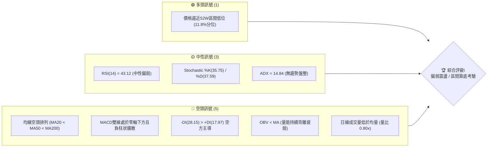
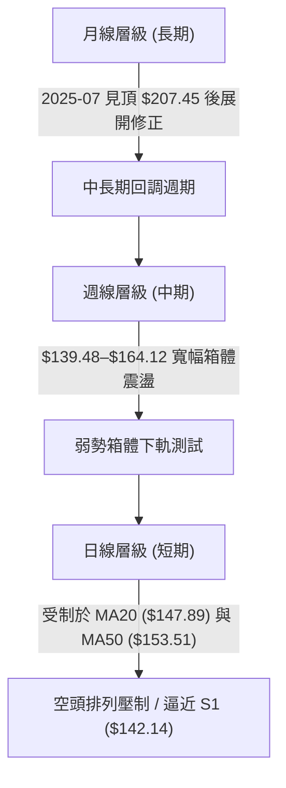
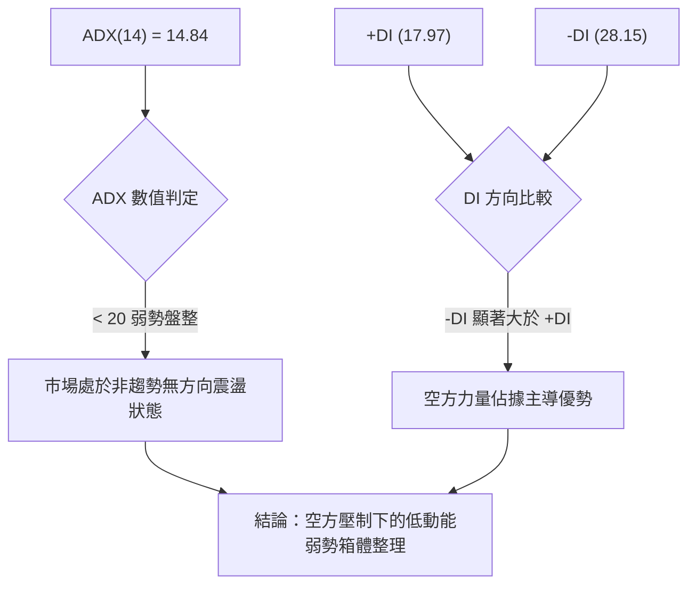
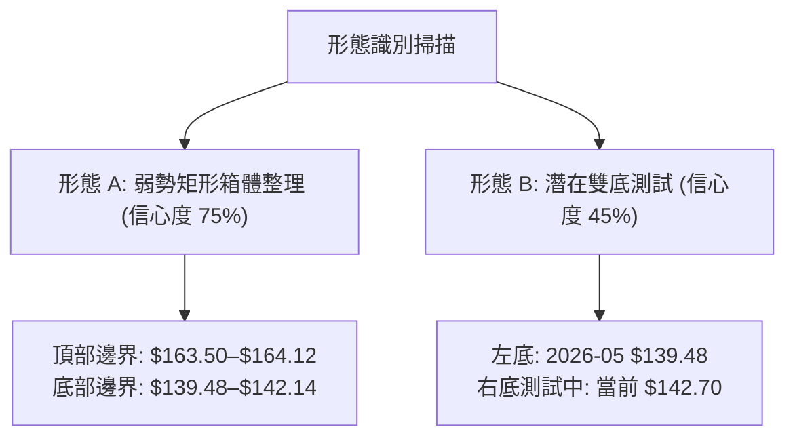
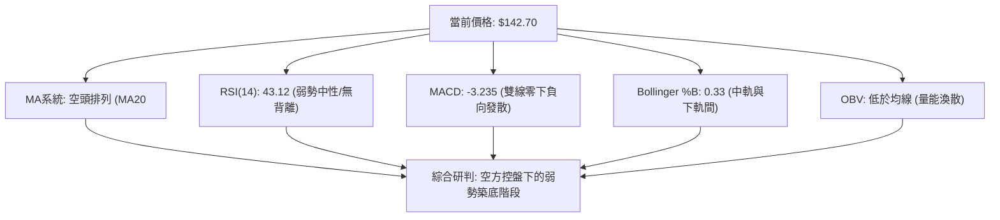
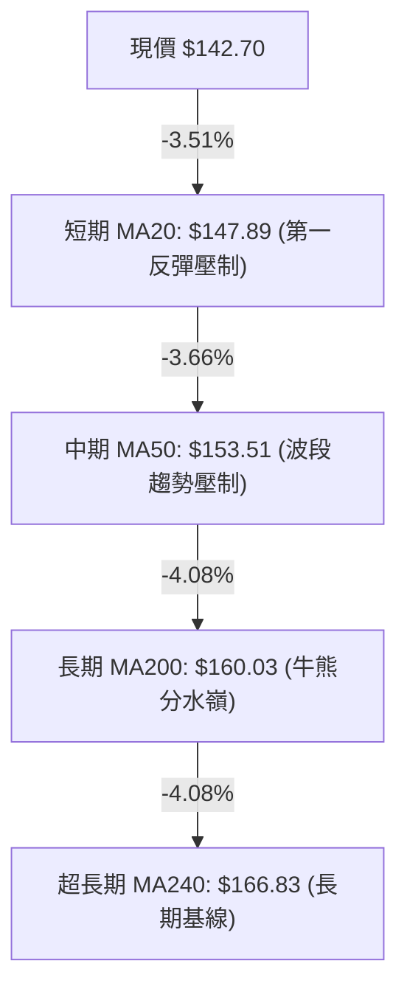
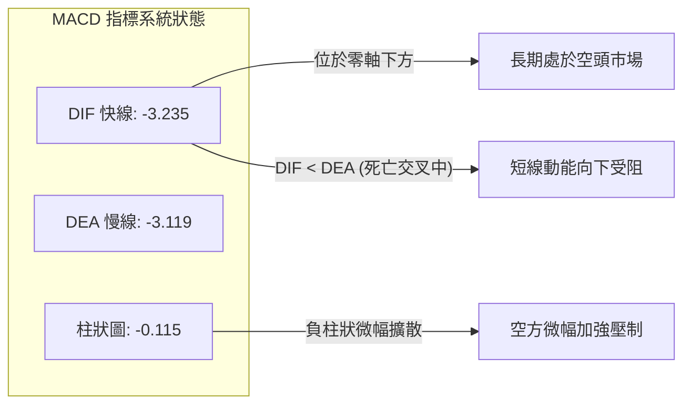
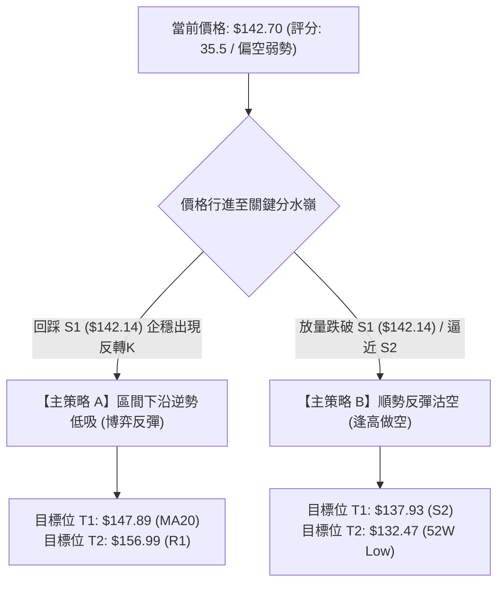
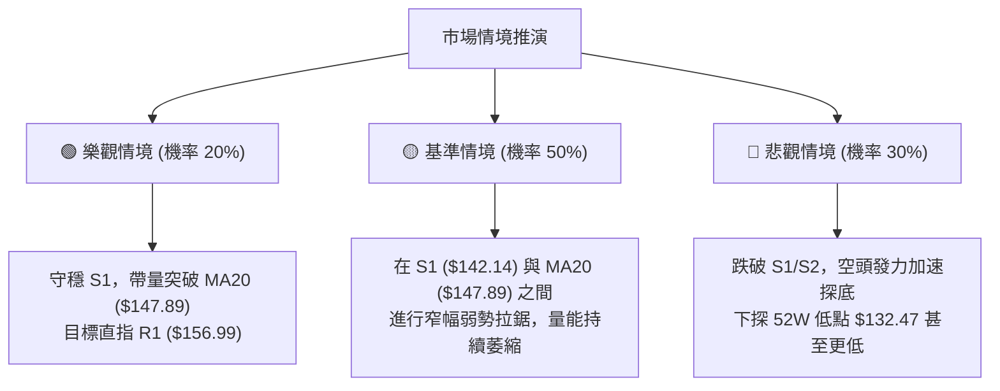

# VST 技術分析報告

> **報告日期**：2026-08-20 ｜ **語言**：繁體中文 ｜ **數據來源**：Yahoo Finance ｜ **當前價格**：$142.70

---

## 目錄

| 章節 | 內容 |
|------|------|
| [1. 技術面概覽](#1-技術面概覽) | 訊號儀表板、核心指標速覽、技術評分卡 |
| [2. 趨勢分析](#2-趨勢分析) | 多時框趨勢、12個月歷史走勢、ADX趨勢強度評估 |
| [3. 圖表形態分析](#3-圖表形態分析) | 形態識別信心度、週K線組合特徵、形態目標價測算 |
| [4. 支撐與阻力](#4-支撐與阻力) | 關鍵價位分布圖、S/R級別表、斐波那契回調結構 |
| [5. 技術指標深度解讀](#5-技術指標深度解讀) | 均線系統、RSI、MACD、布林通道與OBV量價分析 |
| [6. 動能與波動率](#6-動能與波動率) | 動能四象限、ATR波動率、Beta市場敏感度 |
| [7. 多時框架總結](#7-多時框架總結) | 時框架評分矩陣、多時框收斂判定 |
| [8. 交易策略建議](#8-交易策略建議) | 策略路由、情境階梯、主/次策略參數與風控點 |
| [9. 風險提示與監控](#9-風險提示與監控) | 關鍵監控清單、情境推演與部位管理原則 |

---

## 1. 技術面概覽

### 🎯 技術訊號儀表板



---

### 📊 核心指標速覽表

| 指標類別 | 指標名稱 | 當前數值 | 訊號 | 技術面解讀 |
|:---|:---|:---|:---:|:---|
| **價格結構** | 當前價格 | $142.70 | 🔴 | 位於52週高低點區間（$132.47–$218.91）的 11.8% 低位 |
| **短期均線** | MA20 | $147.89 | 🔴 | 價格位於 MA20 下方 -3.51%，短期下行壓制明顯 |
| **中期均線** | MA50 | $153.51 | 🔴 | 價格位於 MA50 下方 -7.04%，中期趨勢處於修正週期 |
| **長期均線** | MA200 | $160.03 | 🔴 | 價格位於 MA200 下方 -10.83%，長期牛熊分界線失守 |
| **動能震盪** | RSI(14) | 43.12 | 🟡 | 位於 30–70 中性區間，未進入超賣但動能偏弱 |
| **趨勢動能** | MACD (12,26,9) | -3.235 / -3.119 | 🔴 | 雙線在零軸下方運行，柱狀圖 -0.115，空方控盤 |
| **趨勢強度** | ADX(14) | 14.84 | 🟡 | ADX < 25，單邊趨勢衰竭，當前轉為低波動弱勢盤整 |
| **通道位置** | Bollinger %B | 0.33 | 🟡 | 位於中軌（$147.89）與下軌（$132.30）之間偏下緣 |
| **市場波動** | ATR(14) | $5.99 (4.20%) | 🟡 | 每日平均波動幅度近 6 美元，波動風險處於中等水平 |
| **量能指標** | OBV | OBV < MA | 🔴 | 資金持續呈現淨流出狀態，量能無法支撐反彈 |

---

### 🏆 技術評分卡

```
╔══════════════════════════════════════════════════════════════════╗
║                   技術評分卡 — VST (2026-08-20)                   ║
╠══════════════════════════════════════════════════════════════════╣
║ 趨勢強度 (ADX/方向)   █████░░░░░░░░░░░░░░░  28/100  🔴 空方盤整   ║
║ 動能指標 (RSI/MACD)   ███████░░░░░░░░░░░░░  35/100  🔴 動能疲軟   ║
║ 支撐穩定度 (S1/S2/S3) ████████████░░░░░░░░  60/100  🟡 臨近支撐   ║
║ 成交量配合 (OBV/量比) ██████░░░░░░░░░░░░░░  30/100  🔴 量能萎縮   ║
║ 形態結構完整度        ████████░░░░░░░░░░░░  40/100  🟡 區間築底   ║
║ 均線排列系統 (MAs)    ████░░░░░░░░░░░░░░░░  20/100  🔴 空頭排列   ║
╠══════════════════════════════════════════════════════════════════╣
║ 綜合技術評分          ███████░░░░░░░░░░░░░  35.5/100 🔴 偏空弱勢   ║
╚══════════════════════════════════════════════════════════════════╝
```

---

## 2. 趨勢分析

### 🌐 多時框趨勢分析



---

### 📈 長期趨勢 — 12個月走勢圖（Unicode）

```
VST 月線收盤走勢圖（過去12個月：2025-08 至 2026-08）
價格 ($)
$210 ┤                                      
$200 ┤        ● ($195.11)                   
$190 ┤● ────────────────● ($187.52)          
$180 ┤                  ● ($178.12)  ● ($173.41)
$170 ┤                                      
$160 ┤                        ● ($160.88)  ● ($157.62) ● ($160.01) ● ($158.63)
$150 ┤                              ● ($157.91) ● ($150.12)    ● ($148.19)
$140 ┤                                                               ● ($142.70 現價)
     └┬─────────┬─────────┬─────────┬─────────┬─────────┬─────────┬─────────┬──
    08/25     10/25     12/25     01/26     03/26     05/26     07/26   08/26
```

#### 走勢特徵分析表格

| 階段週期 | 時間區間 | 價格區間 | 漲跌幅 | 結構特徵與技術解讀 |
|:---|:---|:---:|:---:|:---|
| **歷史高位構築** | 2025-07 ~ 2025-09 | $207.45 → $195.11 | -5.95% | 創下 52 週高點 $218.91 後出現量能衰竭，構築雙頂回落形態 |
| **主跌推動浪** | 2025-10 ~ 2025-12 | $187.52 → $160.88 | -14.21% | 連續跌破各級短期均線，長期上行通道徹底破位 |
| **中繼反彈衰竭** | 2026-01 ~ 2026-02 | $157.91 → $173.41 | +9.82% | 反彈受阻於 61.8% 斐波那契回調位（$165.49）上方，形成次級高點 |
| **箱體弱勢震盪** | 2026-03 ~ 2026-08 | $150.12 → $142.70 | -4.94% | 於 $140–$164 區間反覆震盪拉鋸，近期向下測試箱體下沿支撐 |

---

### 📊 中期趨勢（週線分析）

```
中期週線結構示意圖：
阻力區間 ─── $168.93 (R2 強阻力 / 近期波段反彈頂部聚類)
              ↑
阻力中樞 ─── $156.99 (R1 阻力位 / MA50 與 78.6% Fib 共振壓制區)
              ↑
通道中軸 ─── $147.89 (MA20 / 布林中軌)
              │
當前價格 ─── $142.70 ◄ (逼近波段下邊界)
              ↓
關鍵支撐 ─── $142.14 (S1 支撐位 / 前波低點)
              ↓
強支撐帶 ─── $137.93 (S2) ─── $134.75 (S3) ─── $132.47 (52W 低點)
```

---

### ⚡ 趨勢強度評估（ADX 解讀）



#### ADX 數值對照與狀態解讀

| 指標變數 | 當前讀數 | 門檻區間 | 當前狀態評估 | 實戰交易含義 |
|:---|:---:|:---:|:---|:---|
| **ADX 趨勢強度** | **14.84** | < 25 (弱趨勢/無趨勢) | 處於休眠整理期，缺乏強烈單邊動能 | 嚴禁採用突破追單策略，應以箱體邊界反轉為主 |
| **+DI 多頭方向線** | **17.97** | 參照 -DI 比較 | 多頭進攻意願低落，反彈動能衰竭 | 多方無法組織有效上攻 |
| **-DI 空頭方向線** | **28.15** | 領先 +DI 10.18 個點 | 空方在局部價格擺動中佔優 | 價格下行阻力小於上行阻力 |

---

## 3. 圖表形態分析

### 🔍 形態識別系統



#### 形態識別信心度評估表

| 形態類型 | 信心度 | 判斷依據（數據引用） | 形態完成度 | 目標價（附嚴格計算式） |
|:---|:---:|:---|:---:|:---|
| **箱體橫盤整理 (Rectangle)** | **75%** | 近 20 週價格多次在阻力 $164.12 與支撐 $139.48 之間往返震盪 | 80% | **破位下行目標**：箱底 $139.48 - 箱高($164.12 - $139.48 = $24.64) = **$114.84**<br/>*(數據未確認破位，暫以區間內運行解讀)* |
| **潛在雙底結構 (Double Bottom)** | **45%** | 2026-05-17 探底 $139.48，當前逼近 S1 ($142.14) 尋求支撐 | 35% | **頸線突破目標**：頸線 $164.12 + 形態高度($164.12 - $139.48 = $24.64) = **$188.76**<br/>*(信心度 < 50%，僅供觀察，未達進場觸發標準)* |

---

### 🕯️ 近期重要K線組合分析

| 日期週別 | 收盤價 | K線形態特徵 | 技術解讀 | 訊號 |
|:---|:---:|:---|:---|:---:|
| **2026-07-26** | $163.38 | 長上影倒錘頭測試高點 | 衝擊箱頂 $164 區域遭遇強烈拋壓，多頭無功而返 | 🔴 |
| **2026-08-02** | $148.19 | 中陰線下破 MA20 | 失守布林中軌（$147.89），短線趨勢由震盪轉弱 | 🔴 |
| **2026-08-09** | $140.59 | 帶量長下影刺透線 | 爆出 34.9M 週巨量探底 $140.59 獲買盤承接，確認 S1/S2 買盤存在 | 🟢 |
| **2026-08-16** | $148.13 | 縮量小陽線反彈 | 縮量反抽受阻於 MA20，量價未能有效配合 | 🟡 |
| **2026-08-23 (即時)** | $142.70 | 陰線回踩考驗低點 | 價格再度向 S1 ($142.14) 靠攏，動能萎縮等待方向選擇 | 🔴 |

---

### 📉 ASCII 走勢形態示意圖

```
箱體震盪形態 (2026-04 ~ 2026-08)
$165 ┤      ●──────● ($164.12 箱頂阻力區 / 逼近 R1 $156.99–R2 $168.93)
$160 ┤     / \    / \
$155 ┤    /   \  /   \    ●
$150 ┤   /     ●/     \  / \
$145 ┤  /              ●/   \   ● ($148.13)
$140 ┤ ● ($139.48)          ●─ ─ ─● ($142.70 現價 / 逼近 S1 $142.14 箱底)
     └──────────────────────────────────────────────────────────
       05/26          06/26        07/26        08/26
```

---

## 4. 支撐與阻力

### 🗺️ 關鍵價位分布圖（Unicode）

```
╔══════════════════════════════════════════════════════════════════╗
║                   VST 價位結構分布與密集區圖                      ║
╠══════════════════════════════════════════════════════════════════╣
║ $177.74 ║████████████████████████║ 強阻力 R3 (50.0% Fib $175.69 共振)  ║
║ $168.93 ║████████████████████    ║ 阻力 R2 (MA240 $166.83 / 61.8% Fib)║
║ $156.99 ║████████████████████████║ 關鍵阻力 R1 (MA50 $153.51 / 78.6% Fib)║
║ $147.89 ║────────────────────────║ 短線動態分水嶺 (MA20 / 布林中軌)    ║
║ $142.70 ╠════════════════════════╣ ◄ 當前收盤價 ($142.70)             ║
║ $142.14 ║▓▓▓▓▓▓▓▓▓▓▓▓▓▓▓▓        ║ 近期核心支撐 S1 (近期箱體下邊界)    ║
║ $137.93 ║████████████████        ║ 次級強支撐 S2 (波段低點聚類)        ║
║ $134.75 ║████████████████████    ║ 深度防禦支撐 S3 (52W低點防線前哨)   ║
║ $132.47 ║████████████████████████║ 極限支撐 52W Low (100.0% Fib / BB下軌)║
╚══════════════════════════════════════════════════════════════════╝
```

---

### 🚧 阻力位分析表

| 阻力級別 | 精確價位 | 距離現價 | 技術形成原因與指標共振 | 突破難度 | 重要性權重 |
|:---|:---:|:---:|:---|:---:|:---:|
| **R1 (第一阻力)** | **$156.99** | +10.01% | 近一年波段高點聚類；鄰近 MA50 ($153.51) 與 78.6% Fib ($150.97) | 🟡 中等 | ★★★★☆ |
| **R2 (第二阻力)** | **$168.93** | +18.38% | 2026-02反彈高點；MA200 ($160.03)、MA240 ($166.83) 及 61.8% Fib ($165.49) 密集區 | 🔴 極高 | ★★★★★ |
| **R3 (第三阻力)** | **$177.74** | +24.56% | 前期頭部頸線位置；共振 50.0% 斐波那契回調位 ($175.69) | 🔴 極高 | ★★★☆☆ |

---

### 🛡️ 支撐位分析表

| 支撐級別 | 精確價位 | 距離現價 | 技術形成原因與指標共振 | 守住機率 | 重要性權重 |
|:---|:---:|:---:|:---|:---:|:---:|
| **S1 (關鍵支撐)** | **$142.14** | -0.39% | 近期多次回踩獲得承接的波段低點；日線下影線密集區 | 🟡 55% | ★★★★☆ |
| **S2 (波段支撐)** | **$137.93** | -3.34% | 2026-05-17 恐慌拋售低點聚類（$139.48 區域下方緩衝） | 🟢 68% | ★★★★★ |
| **S3 (極限支撐)** | **$134.75** | -5.57% | 52週低點前最後一道多頭防線；臨近布林下軌（$132.30） | 🟢 80% | ★★★★★ |

---

### 📐 斐波那契回調位分析

*基準區間：52週低點 $132.47 → 52週高點 $218.91（垂直落差 $86.44）*

| 回調比例 | 基準價位 | 價位定位與空間關係 | 當前價格狀態解讀 |
|:---:|:---:|:---|:---|
| **0.0% (高點)** | **$218.91** | 52 週歷史峰值 | 歷史極限壓力 |
| **23.6%** | **$198.51** | 多頭極度強勢回調位 | 遠在上方，中長期牛市完全退潮 |
| **38.2%** | **$185.89** | 牛市健康回撤位 | 中期上行反轉的第一目標壓制區 |
| **50.0%** | **$175.69** | 多空平衡分水嶺 (R3: $177.74 附近) | 多空力量強弱的長週期轉換節點 |
| **61.8%** | **$165.49** | 黃金分割強防守位 (R2: $168.93 附近) | 前期失守後轉為強大反壓區 |
| **78.6%** | **$150.97** | 深度回撤防守位 (R1: $156.99 下沿) | **現價處於 78.6% 與 100.0% 之間** |
| **100.0% (低點)** | **$132.47** | 52 週極限底部 (S3: $134.75 下方) | 多頭最後防線，跌破將開啟熊市新空間 |

> **回調狀態總結**：現價 $142.70 運行於 78.6% ($150.97) 與 100.0% ($132.47) 之間的深水區。此區域為中長期多頭的「價值防守底線」，若失守 $132.47 將破壞近兩年上漲結構。

---

## 5. 技術指標深度解讀

### 🎛️ 指標訊號總覽



---

### 📈 移動平均線排列分析



#### 各週期均線偏離與形態表

| 均線名稱 | 當前價格 | 乖離率 (Bias) | 歷史走勢特徵 (Sparkline) | 均線趨勢與角色 |
|:---|:---:|:---:|:---|:---:|
| **MA 5** | $144.77 | -1.43% | ▅▆▆▆▇▆▆▆▆▇███▇▆▄▃▃▃▃▂▁▁▁▁▁▂▂▂▂ | 快速下行，短線反壓 |
| **MA 10** | $144.03 | -0.92% | ▇▇▇▇▇▇▇▇▇█████▇▇▇▇▆▄▃▂▁▁▁▁▁▁▁▁ | 走平微跌，黏合壓制 |
| **MA 20** | $147.89 | -3.51% | ▇▇███████████▇▇▇▇▇▆▆▅▄▄▃▃▃▂▂▁▁ | 穩定下行，布林中軌阻力 |
| **MA 60** | $153.90 | -7.28% | ███▇▇▆▆▆▇▇▇██▇▆▅▄▄▃▂▁▁▁▁▁▂▄▄▃▂ | 中期下行壓力線 |
| **MA 120** | $154.87 | -7.86% | ███████████████████▇▇▆▅▅▄▃▃▂▁▁ | 圓弧頂向下發散 |
| **MA 240** | $166.83 | -14.46% | █████▇▇▇▆▆▆▆▅▅▅▄▄▄▄▃▃▃▂▂▂▂▁▁▁▁ | 長期牛市支撐已轉為強阻力 |

> **均線系統結論**：短中長期均線呈現標準的**空頭排列（MA20 < MA50 < MA200 < MA240）**，價格全數運行於均線下方，顯示任何向上反彈均將面臨層層解套賣壓。

---

### 📉 RSI(14) 分析

*   **當前數值**：`43.12`
*   **動能進度條**：`████████░░░░░░░░░░░░` 43.12%（弱勢整理區）

```
[0 極度超賣] ────── [30 超賣線] ──●── [50 中軸] ────── [70 超買線] ────── [100 極度超買]
                              43.12
```

*   **超買/超賣區間判斷**：處於 40–50 弱勢震盪區，未觸及 30 以下超賣區，顯示空頭拋壓雖未達恐慌極致，但多頭毫無發動進攻之動能。
*   **背離檢驗**：
    *   2026-05-17 價格低點 $139.48（週 RSI = 25.5）
    *   2026-08-09 價格低點 $140.59（週 RSI = 37.2）
    *   **背離結論**：價格維持於低點附近震盪，但 RSI 低點自 25.5 抬升至 37.2，呈現**週線級別潛在隱性底背離**雛形，但日線動能仍疲弱，需站上 50 中軸方能確認轉強。

---

### 📊 MACD(12, 26, 9) 訊號解讀



*   **量化解讀**：DIF 與 DEA 均在零軸深處運行，表明中期趨勢由空方牢牢掌握；柱狀圖為 -0.115，顯示空頭動能雖未急劇爆發，但下行慣性依然存在。

---

### 📦 布林通道分析（Bollinger Bands）

```
布林通道結構 (20日週期 / 2倍標準差)
$165 ┤ ─────────────────────────── 上軌: $163.47 (強阻力區間)
$160 ┤
$155 ┤
$150 ┤ ─────────────────────────── 中軌 (MA20): $147.89 (第一動態阻力)
$145 ┤            ● 現價: $142.70 (%B = 0.33)
$140 ┤
$135 ┤
$130 ┤ ─────────────────────────── 下軌: $132.30 (52W低點防禦共振帶)
```

*   **通道寬度**：帶寬達 $31.17（通道寬度百分比 21.08%），處於擴張後的中期收縮階段。
*   **%B 指標**：`0.33`，反映現價運行在下半軌道，受到中軌 $147.89 壓制，下軌 $132.30 提供潛在支撐。

---

### 💹 成交量分析（量價配合度）

*   **成交量現狀**：最新日成交量 `3,705,011`，較 20日均量 `4,641,141` 萎縮（**量比 0.80x**）。
*   **OBV 趨勢**：`OBV < MA`，能量潮指標持續位於其均線下方，顯示資金呈現連續淨流出，成交量無法在反彈時放大。
*   **量價關係評估**：**價跌量縮**。量能萎縮反映殺跌動能減弱，但在無顯著買盤進場承接（OBV 未見金叉）前，難以形成具持續性的 V 型反轉。

---

## 6. 動能與波動率

### ⚡ 動能評估四象限

| 象限 | 動能強度 (RSI/MACD) | 波動率水準 (ATR/Beta) | 當前狀態 | 交易環境與策略評估 |
|:---:|:---:|:---:|:---:|:---|
| **Q1 (爆發機會)** | 強 (RSI > 60) | 低 (ATR 收縮) | — | 最佳趨勢突破醞釀點 |
| **Q2 (主升趨勢)** | 強 (RSI > 60) | 高 (ATR 擴大) | — | 趨勢跟蹤 / 順勢加碼 |
| **Q3 (謹慎築底)** | **弱 (RSI < 45)** | **低 (ADX < 20)** | **✓ VST 處於此區** | **低動能震盪整理，宜區間下緣低吸或觀望** |
| **Q4 (恐慌出清)** | 弱 (RSI < 30) | 高 (ATR 劇增) | — | 破位加速殺跌，嚴禁接刀 |

---

### 📊 ATR 波動率分析

*   **ATR(14) 數值**：`$5.99`（佔股價比例 **4.20%**）
*   **每日波動預期**：在正常市況下，VST 每日潛在波動區間約為 $\pm \$5.99$ 美元。
*   **動態止損建議**：
    *   **短線交易止損距離（1.5 × ATR）**：$1.5 \times \$5.99 = \mathbf{\$8.99}$
    *   **波段防守止損距離（2.0 × ATR）**：$2.0 \times \$5.99 = \mathbf{\$11.98}$

---

### 📐 Beta 與市場相關性

*   **Beta 係數**：`1.433`
*   **特性分析**：屬於**高 Beta 成長型公用事業/電力股**，波動幅度為大盤（S&P 500）的 1.43 倍。當大盤出現回調時，VST 承壓回撤幅度通常顯著大於防禦型公用事業同業；但在市場風險偏好回暖時，其反彈彈性亦相對可觀。

---

## 7. 多時框架總結

### 📋 時框架評分表

| 時框架 | 趨勢方向 | 動能狀態 | 均線排列 | 關鍵圖表形態 | 綜合評分 | 操作建議 |
|:---|:---:|:---:|:---:|:---|:---:|:---|
| **月線 (長期)** | 🔴 回調修正 | 弱勢偏空 | 跌破長天期均線 | 歷史頂部回落測試 78.6% Fib | **35/100** | 長期投資者暫停定投，等待築底 |
| **週線 (中期)** | 🟡 箱體震盪 | 中性築底 | MA20 < MA50 | 潛在 $139.48–$164.12 寬幅箱體 | **45/100** | 於箱體下軌 $140 附近尋求防守機會 |
| **日線 (短期)** | 🔴 弱勢受壓 | 柱狀負向 | 標準空頭排列 | 逼近 S1 支撐，受制於 MA20 | **30/100** | 嚴禁追多，等待回踩確認或突破 |

---

### 🔲 綜合訊號矩陣

```
時框維度          趨勢評估          動能評估          均線結構          綜合判定
──────────────────────────────────────────────────────────────────────────
短期 (日線)   🔴 空方主導 (-DI)   🔴 MACD負柱       🔴 空頭壓制       🔴 弱勢探底
中期 (週線)   🟡 箱體橫盤 (ADX低) 🟡 RSI 43.1       🔴 MA20/50死叉    🟡 區間下緣
長期 (月線)   🔴 頂部回撤中       🔴 資金流出 (OBV) 🔴 MA200下方      🔴 熊市修正
```

---

### ⚖️ 多時框收斂結論

> **依嚴格規則 14 執行多時框收斂**：
> 1. **行情性質判定**：當前 ADX(14) = 14.84（< 25），確認市場處於**無單邊趨勢的「弱勢盤整行情」**。
> 2. **主導維度選擇**：依規則，盤整行情中以**日線布林通道上下軌（$132.30 – $163.47）與波段支撐/阻力為核心交易邊界**。
> 3. **方向性結論**：**中性偏空 / 區間下軌防守觀望**。雖然均線呈現強烈空頭壓制，但由於價格已逼近 52 週低位支撐聚類（S1: $142.14 / S2: $137.93），且 ADX 顯示空方動能並未形成單邊爆發，當前嚴禁在低位盲目殺跌；操作上應視為「弱勢箱體下軌防禦測試」。

---

## 8. 交易策略建議

### 🗺️ 策略決策流程圖



---

### 🧭 策略路由

> **當前主策略方向 = 偏空中性 / 區間下軌高盈虧比反彈博弈（依評分 35.5/100）**
> 
> 鑑於綜合技術評分為 **35.5/100**（偏空區間），整體格局受制於空頭均線；但由於 ADX < 25 且價格處於 52 週低位 11.8% 分位，**主推策略為：在 S1/S2 關鍵支撐位的「嚴格止損型區間低吸」，輔以「反抽受阻 MA20 時的順勢沽空」**。

---

### 🎯 價格情境階梯（Price Scenarios）

| 觸發條件 | 下一目標價 | 後續延伸目標 | 技術情境含義 | 應對邏輯 |
|:---|:---:|:---:|:---|:---|
| **強勢突破 R1 ($156.99)** | R2 ($168.93) | R3 ($177.74) | 突破 MA50 與中期箱頂，短線徹底轉強 | 空單無條件止損，順勢追多 |
| **反彈站上 MA20 ($147.89)** | R1 ($156.99) | R2 ($168.93) | 短線動能修復，展開回補缺口行情 | 多單減倉，觀察 R1 壓制 |
| **維持現價 ($142.70)** | S1 ($142.14) | MA20 ($147.89) | 於 S1 支撐上方縮量整理，多空拉鋸 | 耐心等待確認K線信號 |
| **有效跌破 S1 ($142.14)** | S2 ($137.93) | S3 ($134.75) | 箱體下沿失守，開啟新一輪探底波段 | 啟動做空策略或嚴格止損 |
| **摜破極限 S3 ($134.75)** | $132.47 (52W Low) | $114.84 (形態推算) | 長期多頭結構瓦解，進入主跌浪 | 全面清倉離場觀望 |

---

### 📊 情境機率分佈

| 走勢情境 | 機率預估 | 主要技術指標依據 |
|:---|:---:|:---|
| **情境一：區間震盪築底** | **50%** | ADX = 14.84 處於低位，量能萎縮（0.80x），價格在 S1 ($142.14) 具備初步支撐力 |
| **情境二：回落測試 S2/S3** | **30%** | 均線呈空頭排列，MACD 處於零下負柱，-DI(28.15) 壓制 +DI(17.97) |
| **情境三：直接向上強反彈** | **20%** | 週線隱性底背離存在，但缺乏 OBV 與成交量配合，難以直接突破 R1 ($156.99) |

---

### 🟢 主策略詳情

*所有價位嚴格引用技術數據計算值：S1=$142.14, S2=$137.93, S3=$134.75, R1=$156.99, R2=$168.93, MA20=$147.89, 52W Low=$132.47*

| 策略要素 | 策略 A（區間下沿低吸 — 多頭博弈） | 策略 B（反彈受阻放空 — 順勢空頭） |
|:---|:---|:---|
| **策略類型** | 箱體下軌逆勢短多（博弈底背離） | 均線反壓順勢沽空（順應 MA 排列） |
| **進場條件** | 價格回踩 S1 企穩，日線收出長下影或陽包陰 | 價格反抽測試 MA20 失敗，出現上影倒錘頭 |
| **進場價格** | **$142.14**（S1 支撐位） | **$147.89**（MA20 / 布林中軌） |
| **目標價 T1** | **$147.89**（MA20 阻力，預期收益 +4.05%） | **$137.93**（S2 支撐位，預期收益 +6.73%） |
| **目標價 T2** | **$156.99**（R1 關鍵阻力，預期收益 +10.45%） | **$132.47**（52W 低點，預期收益 +10.43%） |
| **止損價格** | **$137.93**（S2 跌破止損，風險 -2.96%） | **$150.97**（78.6% Fib 突破止損，風險 -2.08%） |
| **風險報酬比 (R:R)**| **1 : 3.53**（以 T2 測算） | **1 : 5.01**（以 T2 測算） |
| **勝率預估** | 45%（逆勢交易，依賴盈虧比補償） | 60%（順應日線空頭趨勢） |
| **建議倉位** | 10% ~ 15%（輕倉試單） | 15% ~ 20%（標準部位） |

---

### 🔴 反向風險觸發點（對沖與風控提示）

1.  **多頭策略失效點**：若日線收盤價跌破 **$137.93 (S2)**，代表箱體結構徹底被空方擊穿，多頭部位必須**無條件停損出場**，嚴禁向下攤平。
2.  **空頭策略失效點**：若價格帶量站穩 **$150.97 (78.6% Fib)** 並向上突破 **$156.99 (R1)**，代表空頭均線壓制失效，空單應立即平倉離場。

---

### ⭐ 整體訊號強度評星

```
做多訊號強度：★★☆☆☆  (2.0/5 星 — 僅限區間極限支撐低吸)
做空訊號強度：★★★☆☆  (3.5/5 星 — 均線全面壓制，順勢為主)
整體可信度：  ★★★☆☆  (3.0/5 星 — 處於 ADX < 25 震盪期，雜訊較多)
```

---

## 9. 風險提示與監控

### ✅ 關鍵監控指標 Checklist

```
╔══════════════════════════════════════════════════════════════════╗
║                   VST 交易風控與關鍵監控清單                     ║
╠══════════════════════════════════════════════════════════════════╣
║ [ ] 價格是否跌破關鍵支撐 S1 ($142.14) 與 S2 ($137.93)           ║
║ [ ] RSI(14) 是否跌破 30 進入恐慌超賣區，或突破 50 轉強           ║
║ [ ] MACD 柱狀圖是否由負轉正（出現金叉翻紅訊號）                  ║
║ [ ] 單日成交量是否放大至 50日均量 (4.47M) 的 1.5 倍以上         ║
║ [ ] ADX(14) 是否由 14.84 向上突破 25（預警單邊趨勢啟動）        ║
║ [ ] OBV 是否突破其移動平均線，確認資金回流                       ║
╚══════════════════════════════════════════════════════════════════╝
```

---

### ⚠️ 風險場景分析



---

### 🛡️ 風險管理重要提醒

1.  **波動度管理**：VST 當前 ATR(14) 為 $5.99（單日波幅 4.20%），且 Beta 高達 1.433。在震盪行情中極易出現單日長上下影線「洗盤」現象，止損單設置必須嚴格依據結構價位（S2 $137.93 / Fib $150.97），避免因日內微小雜訊過早出場。
2.  **部位曝險原則**：單筆交易的最大虧損金額應嚴格限制在**總投資組合淨值的 1.0% – 1.5% 以內**。以操作多頭策略 A（風險距離約 $4.77）為例，若投資組合為 10 萬美元，單筆最大風險控制在 1,000 美元，則最大建立部位不應超過 210 股（約 30,000 美元名義部位）。

---

## 📋 報告總結

```
╔══════════════════════════════════════════════════════════════════╗
║                    VST 技術分析報告總結卡                        ║
╠══════════════════════════════════════════════════════════════════╣
║ 報告日期：2026-08-20           當前價格：$142.70                 ║
║ 技術評級：⚖️ 中性偏弱 (35.5/100) — 弱勢箱體下軌防禦測試          ║
╠══════════════════════════════════════════════════════════════════╣
║ 關鍵結論：                                                       ║
║ ├─ 長期趨勢：🔴 偏空回調（失守 MA200 $160.03，處於 78.6% Fib 下方）║
║ ├─ 中期趨勢：🟡 寬幅箱體震盪（$139.48–$164.12 區間整理）         ║
║ ├─ 短期趨勢：🔴 空頭壓制（MA20 < MA50，價格受制於 $147.89）      ║
║ ├─ 核心支撐：S1: $142.14  ｜ S2: $137.93  ｜ S3: $134.75        ║
║ ├─ 關鍵阻力：R1: $156.99  ｜ R2: $168.93  ｜ R3: $177.74        ║
║ └─ 華爾街目標：$221.28 (18 位分析師強烈買入，基本面與技術面背離) ║
╠══════════════════════════════════════════════════════════════════╣
║ 最優交易策略組合：                                               ║
║ 1. 🥇 最佳機會：於 S1 ($142.14) 輕倉博弈反彈，止損設於 S2 ($137.93)║
║ 2. 🥈 穩健選擇：待反抽 MA20 ($147.89) 受阻時順勢建立空單         ║
║ 3. 🥉 保守選擇：保持空倉觀望，等待價格突破 R1 或放量築底信號     ║
╚══════════════════════════════════════════════════════════════════╝
```

---

> ⚠️ **免責聲明**：本報告為技術分析研究成果，所有數據及模型推演均基於歷史價格與成交量資訊。本報告**僅供學術研究與投資參考**，**不構成任何具體的買賣邀約或投資建議**。市場有風險，交易需嚴格執行風險管理與資金控制。

---

*報告生成時間：2026-08-20 ｜ 數據來源：Yahoo Finance ｜ 分析框架：多時框架量化技術系統*