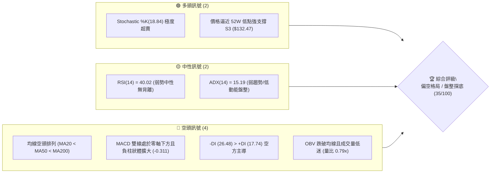
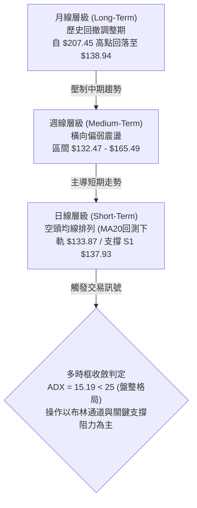
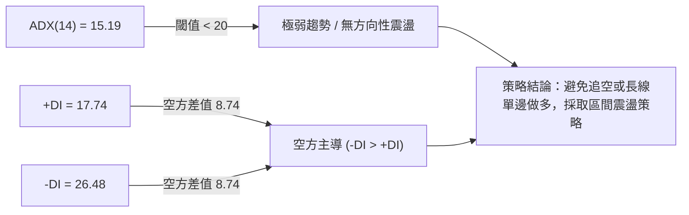
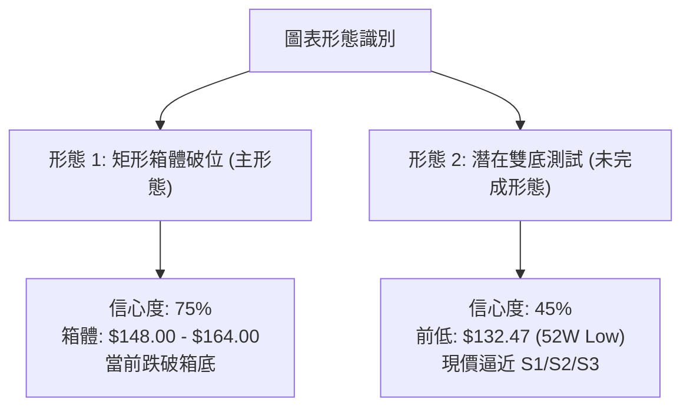
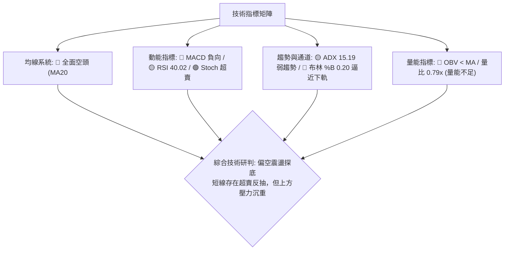
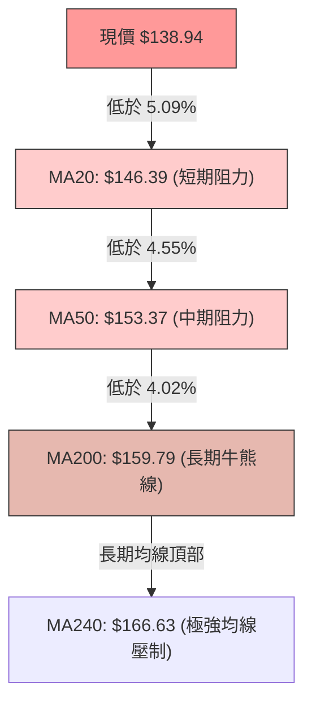
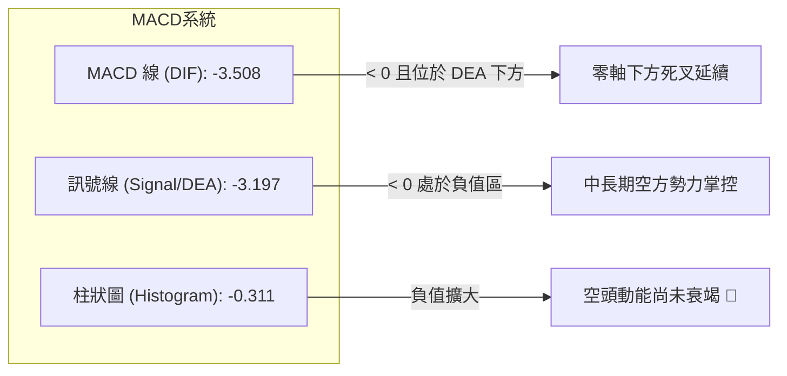
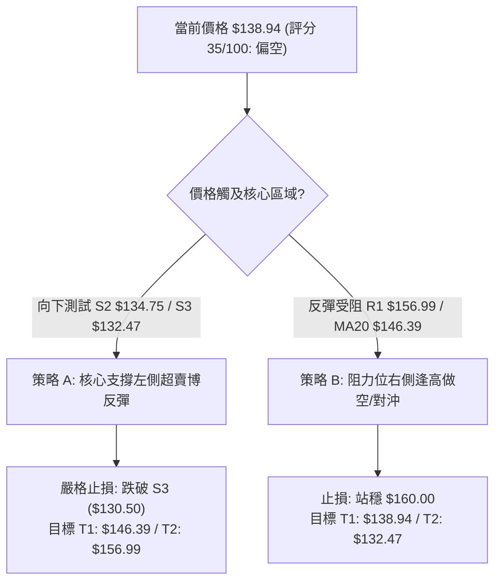
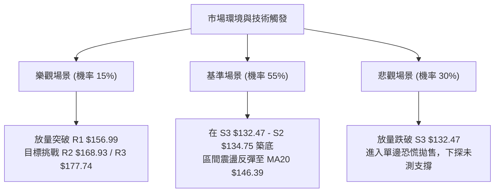

# VST 技術分析報告

> **報告日期**：2026-08-21 ｜ **語言**：繁體中文 ｜ **數據來源**：Yahoo Finance ｜ **當前價格**：$138.94

---

## 目錄

| 章節 | 內容 |
|------|------|
| [1. 技術面概覽](#1-技術面概覽) | 訊號儀表板、核心指標、評分卡 |
| [2. 趨勢分析](#2-趨勢分析) | 多時框趨勢、長中短期走勢 |
| [3. 圖表形態分析](#3-圖表形態分析) | 形態識別、K線組合、目標價 |
| [4. 支撐與阻力](#4-支撐與阻力) | 關鍵價位、斐波那契回調 |
| [5. 技術指標深度解讀](#5-技術指標深度解讀) | MA/RSI/MACD/布林/成交量 |
| [6. 動能與波動率](#6-動能與波動率) | 動能評估、ATR、Beta |
| [7. 多時框架總結](#7-多時框架總結) | 時框架評分矩陣 |
| [8. 交易策略建議](#8-交易策略建議) | 多空策略、風險報酬比 |
| [9. 風險提示與監控](#9-風險提示與監控) | 監控指標、風險場景 |

---

## 1. 技術面概覽

### 🎯 技術訊號儀表板



### 📊 核心指標速覽表

| 指標類別 | 指標名稱 | 當前數值 | 訊號 | 解讀 |
|----------|----------|----------|------|------|
| **價格** | 當前價格 | $138.94 | 🔴 | 位於 52 週區間底部 7.5% 處，下行壓力未消 |
| **均線** | MA20 | $146.39 | 🔴 | 價格低於 MA20（偏離 -5.09%），短線受制中軌 |
| **均線** | MA50 | $153.37 | 🔴 | 價格低於 MA50（偏離 -9.41%），中期下行通道確立 |
| **均線** | MA200 | $159.79 | 🔴 | 價格低於牛熊分界線 MA200（偏離 -13.05%） |
| **動能** | RSI(14) | 40.02 | 🟡 | 位於弱勢區間（30–50），尚未進入超賣 (<30) |
| **動能** | MACD (12,26,9) | -3.508 / -3.197 | 🔴 | 零軸下方負向擴張，MACD柱狀體為 -0.311 |
| **動能** | Stoch %K / %D | 18.84 / 26.84 | 🟢 | 進入 20 以下超賣區，存在短線技術性反彈契機 |
| **趨勢** | ADX (14) | 15.19 | 🟡 | 數值低於 25，表明為無明確方向之弱勢盤整/陰跌 |
| **通道** | 布林帶 %B | 0.20 | 🔴 | 運行於下軌 ($133.87) 與中軌 ($146.39) 之間 |
| **量能** | 量比 / OBV | 0.79x / OBV<MA | 🔴 | 成交量萎縮（3.73M vs 4.73M），買盤動能不足 |
| **波動** | ATR(14) | $5.89 (4.24%) | 🟡 | 每日平均波動幅度約 $5.89，波動性處於中等水平 |

### 🏆 技術評分卡

```
╔══════════════════════════════════════════════════════════════════╗
║                   技術評分卡 — VST (2026-08-21)                  ║
╠══════════════════════════════════════════════════════════════════╣
║ 趨勢強度 (ADX=15.19)  ██████░░░░░░░░░░░░░░  30/100  🔴 空頭陰跌  ║
║ 動能指標 (RSI/MACD)   ███████░░░░░░░░░░░░░  35/100  🔴 負向動能  ║
║ 支撐穩定度 (S1-S3)    ██████████░░░░░░░░░░  50/100  🟡 考驗低點  ║
║ 成交量配合 (OBV/Vol)  ██████░░░░░░░░░░░░░░  30/100  🔴 量能疲弱  ║
║ 形態完整度 (區間震盪) ████████░░░░░░░░░░░░  40/100  🟡 弱勢築底  ║
║ 均線排列 (空頭排列)   ████░░░░░░░░░░░░░░░░  20/100  🔴 全面承壓  ║
╠══════════════════════════════════════════════════════════════════╣
║ 綜合評分              ███████░░░░░░░░░░░░░  35/100  🔴 偏空弱勢  ║
╚══════════════════════════════════════════════════════════════════╝
```

---

## 2. 趨勢分析

### 🌐 多時框趨勢分析



### 📈 長期趨勢 — 12個月走勢圖（Unicode）

```
VST 月線走勢圖（過去12個月：2025-08 至 2026-08）
價格 ($)
$210 ┤                
$195 ┤●        ●(高點: $195.11)
$180 ┤    ●(08)    ●(10) ●(11)
$165 ┤                         ●(02)
$150 ┤                             ●(12) ●(01)    ●(04) ●(05) ●(06)
$135 ┤                                        ●(03)                ●(07) ●(08: $138.94 現價)
$120 ┤
     └──────────────────────────────────────────────────────────────────
       08   09   10   11   12   01   02   03   04   05   06   07   08 (月份)
      (25) (25) (25) (25) (25) (26) (26) (26) (26) (26) (26) (26) (26)
```

**走勢特徵分析表格**：

| 階段區間 | 起止價格 | 漲跌幅 | 走勢特徵解讀 |
|----------|----------|--------|--------------|
| **2025-08 ~ 2025-11** | $188.12 → $178.12 | -5.32% | 高檔滯漲築頂，自 2025-07 歷史高點 $207.45 展開中期回調 |
| **2025-12 ~ 2026-03** | $160.88 → $150.12 | -6.69% | 跌破 $160 關鍵整數關卡，2026-02 反彈至 $173.41 後快速回落 |
| **2026-04 ~ 2026-06** | $157.62 → $158.63 | +0.64% | $150–$160 區間窄幅橫盤整理，MA20 與 MA50 形成密集阻力帶 |
| **2026-07 ~ 2026-08** | $148.19 → $138.94 | -6.24% | 破位下行，跌破盤整區間下緣，直逼 52 週低點 $132.47 |

### 📊 中期趨勢（週線分析）

```
                    週線壓力與支撐空間結構圖
 $177.74 ─────────────────────────────────────────────── R3 (強阻力 / 斐波那契 50.0% $175.69)
                          ▲
 $168.93 ─────────────────┼───────────────────────────── R2 (中期反彈高點 / 斐波那契 61.8% $165.49)
                          │  
 $156.99 ─────────────────┼───────────────────────────── R1 (MA50 $153.37 / 斐波那契 78.6% $150.97)
                          │   
 $138.94 ───► 【現價 $138.94】 
                          │  
 $137.93 ─────────────────┼───────────────────────────── S1 (近期日線波段低點支撐)
                          │  
 $134.75 ─────────────────┼───────────────────────────── S2 (布林下軌 $133.87 緩衝區)
                          ▼  
 $132.47 ─────────────────────────────────────────────── S3 (52週最低價 / 斐波那契 100.0%)
```

### ⚡ 趨勢強度評估（ADX 解讀）



| 指標 | 當前數值 | 參考閾值 | 狀態判定 | 技術含義 |
|------|----------|----------|----------|----------|
| **ADX** | **15.19** | < 20: 弱 / 20-25: 中 / > 25: 強 | 弱勢盤整 | 缺乏單邊趨勢推動力，價格波動主要受區間上下軌約束 |
| **+DI** | **17.74** | > 25: 多頭強勁 | 買盤低迷 | 多方進攻動能極弱，無法組織有效連續攻勢 |
| **-DI** | **26.48** | > 25: 空頭佔優 | 空方壓制 | 空方力量明顯高於多方，但未達到極端恐慌拋售水平 |

---

## 3. 圖表形態分析

### 🔍 形態識別系統



**形態信心度與目標價評估表**：

| 形態名稱 | 信心度 | 判斷依據（引用數據） | 完成度 | 目標價（附計算式） |
|----------|--------|----------------------|--------|--------------------|
| **箱體破位下行** | 75% | 跌破 2026 年 4–7 月震盪箱底（約 $148.19），MA20/50 轉為下壓阻力 | 85% | 跌破箱底 $148.19 - (箱頂 $163.52 - 箱底 $148.19 = $15.33) = **$132.86**（高度接近 S3 **$132.47**） |
| **潛在雙重底 (W底)** | 40% | 價格逼近 52 週低點 **$132.47**，Stoch 極度超賣 (18.84) | 25% | *若在 S3 $132.47 有效築底*，頸線為 R1 **$156.99**，理論目標 = $156.99 + ($156.99 - $132.47) = **$181.51**（訊號不足，需等待突破確認） |

### 🕯️ 重要K線形態分析

| 週期/日期 | 收盤價 | K線形態 | 解讀 | 訊號 |
|-----------|--------|---------|------|------|
| **2026-07 (月線)** | $148.19 | 中陰線跌破均線 | 跌破 MA20 ($146.39) 區域，月線級別轉弱 | 🔴 看跌 |
| **2026-08-09 (週線)** | $140.59 | 放量長陰線 | 週成交量激增至 34.90M，帶量下殺擊穿短期支撐 | 🔴 強烈看跌 |
| **2026-08-16 (週線)** | $148.13 | 縮量十字反彈 | 成交量萎縮至 16.53M，反彈缺乏量能配合，屬弱勢抽頭 | 🟡 弱勢反彈 |
| **2026-08-23 (最新)** | $138.94 | 陰線吞噬回落 | 吞噬前週反彈實體，收於全週低位，空方重新控盤 | 🔴 看跌確認 |

### 📉 ASCII 走勢形態示意圖

```
                 VST 箱體下破與潛在支撐測試示意圖
 $164.00 ┬───────●─────────────●─────────────●─────── (箱頂阻力 R1 附近: $156.99 - $163.52)
         │       │             │             │
 $156.00 ┼───────┼──────●──────┼──────●──────┼─────── (中軸 MA50: $153.37)
         │       │      │      │      │      │
 $148.00 ┼───────●──────●──────●──────●──────┼─────── (原箱底支撐 $148.19，已破位轉為阻力)
         │                                   │
 $138.94 ┼───────────────────────────────────●─────── ◄【現價 $138.94：向下測底中】
         │                                   │
 $132.47 ┴───────────────────────────────────▼─────── (52週前低強支撐 S3: $132.47)
          2026-04      05            06      07   08
```

---

## 4. 支撐與阻力

### 🗺️ 關鍵價位分布圖（Unicode）

```
╔══════════════════════════════════════════════════════════════════╗
║                    VST 價位結構分布圖                            ║
╠══════════════════════════════════════════════════════════════════╣
║ $177.74 ║██████████████████████████████║ 強阻力 R3 (波段高點)   ║
║ $168.93 ║████████████████████          ║ 阻力 R2 (斐波那契61.8%)║
║ $156.99 ║████████████████████████      ║ 關鍵阻力 R1 (MA50共振) ║
║ $146.39 ║▓▓▓▓▓▓▓▓▓▓▓▓▓▓▓▓              ║ 短線阻力 (布林中軌/MA20)║
╠═════════╬══════════════════════════════╬════════════════════════╣
║ $138.94 ╠══════════════════════════════╣ ◄ 現價 ($138.94)       ║
╠═════════╬══════════════════════════════╬════════════════════════╣
║ $137.93 ║▓▓▓▓▓▓▓▓▓▓▓▓▓▓▓▓              ║ 近期支撐 S1 (第一道防線)║
║ $134.75 ║████████████████████          ║ 緩衝支撐 S2 (下軌緩衝)  ║
║ $132.47 ║██████████████████████████████║ 核心強支撐 S3 (52W最低) ║
╚══════════════════════════════════════════════════════════════════╝
```

### 🚧 阻力位分析表

| 阻力級別 | 價位 | 形成原因 | 突破難度 | 重要性 |
|----------|------|----------|----------|--------|
| **R1** | **$156.99** | 近一年波段高點聚類、MA50 ($153.37) 與斐波那契 78.6% ($150.97) 形成的密集共振壓力帶 | 極高 🔴 | ★★★★★ (中期多空分水嶺) |
| **R2** | **$168.93** | 波段次高點聚類、斐波那契 61.8% ($165.49) 與 MA240 ($166.63) 區域 | 高 🔴 | ★★★★☆ (強反彈目標位) |
| **R3** | **$177.74** | 歷史主要密集成交高點、斐波那契 50.0% ($175.69) 回調位 | 極高 🔴 | ★★★☆☆ (牛市回歸確認點) |

### 🛡️ 支撐位分析表

| 支撐級別 | 價位 | 形成原因 | 守住機率 | 重要性 |
|----------|------|----------|----------|--------|
| **S1** | **$137.93** | 近一年波段低點聚類，距離現價僅 -0.73%，為日內與短線直接防守點 | 55% 🟡 | ★★★☆☆ (短線弱支撐) |
| **S2** | **$134.75** | 波段低點聚類，貼近布林下軌 ($133.87)，短線超賣緩衝區 | 65% 🟢 | ★★★★☆ (波段防守區) |
| **S3** | **$132.47** | 52 週最低價、斐波那契 100.0% 絕對底部，近兩年最強結構支撐 | 80% 🟢 | ★★★★★ (年度生命線) |

### 📐 斐波那契回調位分析

依據 52 週高點 **$218.91** 至 52 週低點 **$132.47** 進行回調測算：

```
$218.91 ── 0.0%  (52W High)
$198.51 ── 23.6% 
$185.89 ── 38.2% 
$175.69 ── 50.0% ────── (與 R3 $177.74 高度重合)
$165.49 ── 61.8% ────── (黃金分割位，與 R2 $168.93 重合)
$150.97 ── 78.6% ────── (關鍵結構阻力，與 R1 $156.99 構成阻力區)
$138.94 ── 【現價落於 78.6% ($150.97) 與 100.0% ($132.47) 弱勢區間】
$132.47 ── 100.0% (52W Low) ─ (核心多頭最後防線 S3)
```

**解讀**：現價 $138.94 處於深度回調區域（回撤幅度超過 78.6%），技術結構屬於弱勢探底行情。若跌破 100.0% ($132.47)，將開啟新一輪下行空間；若在 $132.47–$134.75 區間獲得支撐，則第一目標為測試 78.6% 回調位 $150.97。

---

## 5. 技術指標深度解讀

### 🎛️ 指標訊號總覽



### 📈 移動平均線排列分析



| 均線名稱 | 數值 | 價格相對於均線 | 乖離率 | 均線走勢與斜率 | 訊號 |
|----------|------|----------------|--------|----------------|------|
| **MA 5** | $143.28 | 價格位於下方 | -3.03% | ↘ 陡峭向下 | 🔴 空頭壓制 |
| **MA 10**| $143.79 | 價格位於下方 | -3.37% | ↘ 向下發散 | 🔴 短線偏空 |
| **MA 20**| $146.39 | 價格位於下方 | -5.09% | ↘ 平緩向下 | 🔴 空頭排列 |
| **MA 50**| $153.37 | 價格位於下方 | -9.41% | ↘ 中期下壓 | 🔴 中期看空 |
| **MA 60**| $153.48 | 價格位於下方 | -9.47% | ↘ 中期壓制 | 🔴 中期偏空 |
| **MA 120**| $154.58 | 價格位於下方 | -10.12% | ↘ 緩步走低 | 🔴 趨勢偏空 |
| **MA 200**| $159.79 | 價格位於下方 | -13.05% | ↘ 走平轉下 | 🔴 長期轉弱 |
| **MA 240**| $166.63 | 價格位於下方 | -16.62% | ↘ 長期壓制 | 🔴 總體看空 |

### 📉 RSI(14) 分析

```
RSI(14) 數值: 40.02
0 ──────────── 30 ────────────────────── 50 ────────────────────── 70 ──────────── 100
[ 超賣區間 ]   |  ████████████░░░░░░░░  |                 [ 超買區間 ]
               └─ 當前 RSI (40.02) 弱勢區
```

- **狀態判定**：RSI(14) 為 **40.02**，落於 30–50 之弱勢中性區，既未發生極端恐慌超賣 (<30)，也缺乏多頭反彈動能 (>50)。
- **背離分析**：
  - 日線與週線層級**無明顯頂背離或底背離**。
  - 最新價格回落至 $138.94 時，RSI 保持在 40.0 附近，與價格下行節奏同步，確認當前為正常的弱勢尋底過程，未見背離反轉訊號。

### 📊 MACD(12/26/9) 訊號解讀



- **解讀**：DIF 與 DEA 均在零軸深處負值運行，MACD 柱狀體為 **-0.311**，顯示空方仍主導市場節奏，未出現零軸下金叉或底背離綠柱縮短等反轉特徵。

### 📦 布林通道分析

```
                     布林通道 (20, 2) 結構圖
 $158.90 ┬────────────────────────────────────────── BB 上軌 (阻力帶)
         │
 $146.39 ┼────────────────────────────────────────── BB 中軌 (MA20: $146.39)
         │  
 $138.94 ┼──────────────● ◄【現價 $138.94 (%B = 0.20)】
         │
 $133.87 ┴────────────────────────────────────────── BB 下軌 (支撐區 / 接近 S2 $134.75)
```

- **布林帶寬與 %B**：
  - 當前 **%B = 0.20**，表明價格緊貼下軌運行。
  - 布林帶未出現劇烈開口擴張，配合 ADX(15.19)，顯示價格正沿下軌以陰跌或窄幅震盪方式向 S2 ($134.75) 及 S3 ($132.47) 尋求支撐。

### 💹 成交量分析（量價配合度）

- **量價特徵**：最新日成交量為 **3,732,443**，相較於 20 日均量 **4,731,717**，量比僅為 **0.79x**。
- **OBV (能量潮)**：OBV < MA 且呈現向下發散趨勢，顯示資金持續流出，成交量萎縮代表逢低承接買盤意願低，量能並未對反彈形成確認。

---

## 6. 動能與波動率

### ⚡ 動能評估四象限

| 象限 | 動能維度 | 波動維度 | 包含特徵 | 當前狀態判定 | 交易決策指引 |
|------|----------|----------|----------|--------------|--------------|
| **Q1 (突破爆發)** | 強 (+DI主導) | 高 (ATR擴大) | 單邊多頭趨勢 | — | 順勢追多 |
| **Q2 (穩定盤整)** | 弱 (ADX<20) | 低 (窄幅波動) | 底部築底震盪 | — | 區間高拋低吸 |
| **Q3 (恐慌殺跌)** | 強 (-DI主導) | 高 (放量長陰) | 單邊暴跌趨勢 | — | 空頭持倉 / 觀望 |
| **Q4 (弱勢陰跌)** | **弱 (動能偏空)** | **中 (ATR=4.24%)**| **無量下行/測試支撐** | **✓ 當前定位 (Q4)** | **控制倉位 / 謹慎觀望** |

### 📊 ATR 波動率分析

```
ATR(14) 波動區間評估
══════════════════════════════════════════════════════════════
當前 ATR(14):   $5.89 (佔股價 4.24%)
日內正常波幅:   $133.05 ◄──────── $138.94 ────────► $144.83
建議止損距離:   1.5 × ATR = $8.84 ｜ 2.0 × ATR = $11.78
══════════════════════════════════════════════════════════════
```

- **止損與風控設置**：在 $138.94 建立多頭部位時，1.5 倍 ATR 止損距離為 $8.84（對應 $130.10，略低於 52W 低點 S3 $132.47），可有效避免盤中雜訊洗盤。

### 📐 Beta 與市場相關性

- **Beta 係數**：**1.433**
- **市場特徵**：Beta 顯著大於 1.0，表明 VST 具備高彈性與高波動屬性。在美股大盤（標普500/公用事業板塊）震盪時，該股波動幅度約為大盤的 1.43 倍，在缺乏獨立催化劑的情況下，易放大下行風險。

---

## 7. 多時框架總結

### 📋 時框架評分表

| 時框架 | 趨勢方向 | 動能 (RSI/MACD) | 均線排列 | 關鍵價位位置 | 綜合評分 | 操作建議 |
|--------|----------|-----------------|----------|--------------|----------|----------|
| **月線 (長期)** | 🟡 整理轉弱 | 🟡 RSI ~40 走平 | 🟡 MA200 下方 | 處於 52W 高點回調 78.6% 區域 | 45/100 | 長線分批建倉需等待 S3 確認 |
| **週線 (中期)** | 🔴 下行偏空 | 🔴 MACD 負柱狀 | 🔴 MA20/50 壓制 | 跌破 $148.19 箱底 | 35/100 | 反彈減倉 / 觀望 |
| **日線 (短期)** | 🔴 弱勢陰跌 | 🟢 Stoch 超賣 | 🔴 空頭排列 | 逼近 S1 $137.93 / S2 $134.75 | 30/100 | 短線博反彈需嚴設止損 |

### 🔲 綜合訊號矩陣

```
╔══════════════════════════════════════════════════════════════════╗
║                     多時框架一致性分析矩陣                       ║
╠══════════════════╦════════════╦════════════╦═════════════════════╣
║ 維度             ║ 短期 (日線)║ 中期 (週線)║ 長期 (月線)         ║
╠══════════════════╬════════════╬════════════╬═════════════════════╣
║ 趨勢方向         ║ 🔴 下行    ║ 🔴 偏空    ║ 🟡 寬幅震盪回調     ║
║ 動能狀態         ║ 🟢 超賣反抽║ 🔴 負向擴張║ 🟡 弱勢中性         ║
║ 均線系統         ║ 🔴 空頭    ║ 🔴 壓制    ║ 🔴 跌破中期均線     ║
║ 量價配合         ║ 🔴 縮量    ║ 🔴 跌時放量║ 🟡 量能退潮         ║
╠══════════════════╬════════════╬════════════╬═════════════════════╣
║ 矩陣收斂結果     ║ 短線超賣隨時有技術反彈，但受制於中長期均線壓制      ║
╚══════════════════╩════════════╩════════════╩═════════════════════╝
```

### ⚖️ 多時框收斂結論

> **依據規則 14 進行收斂判定**：
> 1. 當前 **ADX(14) = 15.19 < 25**，市場處於**盤整/無單邊強趨勢行情**。
> 2. 交易決策以**日線布林通道上下軌 ($133.87 ~ $158.90) 與波段支撐阻力 (S1-S3 / R1-R3)** 為主要運作區間。
> 3. **方向性最終結論**：**中性偏空（觀望或低吸高拋區間操作）**。評分卡得分為 **35/100**，空方力量佔據主導，嚴禁盲目追多，僅可於關鍵支撐位（S2 $134.75 / S3 $132.47）尋求高盈虧比之超賣反彈機會。

---

## 8. 交易策略建議

### 🗺️ 策略決策流程圖



### 🧭 策略路由

**當前主策略方向 = 區間偏空操作 / 關鍵強支撐極限反彈（綜合評分：35/100）**

### 🎯 價格情境階梯（Price Scenarios）

| 觸發條件 | 下一目標 | 後續延伸 | 情境含義 |
|----------|----------|----------|----------|
| **強勢突破 R1 $156.99** | R2 **$168.93** | R3 **$177.74** | 短線多頭扭轉，突破 MA50，確認中期底部形成 |
| **弱勢反彈受阻 MA20 $146.39** | S1 **$137.93** | S2 **$134.75** | 短線受阻於布林中軌，維持弱勢區間整理 |
| **有效跌破 S1 $137.93** | S2 **$134.75** | S3 **$132.47** | 考驗布林下軌及 52 週年度最低點 |
| **跌破 52W 低點 S3 $132.47** | 下方整數關卡 | 下探空間開啟 | 形態全面破位，展開新一輪單邊下跌趨勢 |

### 📊 情境機率分佈

| 情境劇本 | 機率 | 主要技術依據 |
|----------|------|--------------|
| **情境一：下探 S2/S3 後區間反彈** | **55%** | Stoch %K (18.84) 極度超賣，S3 ($132.47) 具備 52 週強支撐效應 |
| **情境二：跌破 S3 破位下行** | **30%** | 均線系統全面空頭排列，MACD 負向柱狀體擴大，OBV 疲軟 |
| **情境三：直接強勢反轉突破 R1** | **15%** | 成交量萎縮（量比 0.79x），缺乏增量資金推動直接突破密集均線 |

### 🟢 主策略詳情

| 策略要素 | 策略 A（保守多頭：支撐位低吸博反彈） | 策略 B（主流行動：均線阻力處逢高放空） |
|----------|---------------------------------------|-----------------------------------------|
| **進場條件** | 價格回踩 S2-S3 區間出現下影線或 Stoch 金叉 | 價格反彈至 MA20/布林中軌受阻滯漲 |
| **進場價格** | **$134.75** (S2 附近) | **$146.39** (MA20 / 中軌) |
| **目標價 T1** | **$146.39** (MA20 / 布林中軌) | **$137.93** (S1 支撐) |
| **目標價 T2** | **$156.99** (R1 強阻力) | **$132.47** (S3 52W 低點) |
| **止損價格** | **$130.50** (跌破 S3 $132.47 後 1.5% 止損) | **$150.00** (突破整數關卡及 MA20 上方) |
| **風險報酬比**| **1 : 2.73** (風險 $4.25 / 潛在收益 $11.64) | **1 : 2.34** (風險 $3.61 / 潛在收益 $8.46) |
| **成功機率** | **55%** | **65%** |
| **建議倉位** | **10% - 15%** (輕倉試探) | **15% - 20%** (標準防守倉位) |

### 🔴 反向風險觸發點（對沖提示）

- **多頭止損/空頭進場觸發**：日線收盤價**實體跌破 $132.47 (S3)**，標誌著年度支撐徹底失效，多頭部位必須無條件停損出場。
- **空頭止損/多頭加碼觸發**：日線收盤價**放量突破 $156.99 (R1)** 並站穩 MA50，空頭部位必須立即停損，此時技術結構轉為雙底突破。

### ⭐ 整體訊號強度評星

```
╔══════════════════════════════════════════════════════════════╗
║ 做多訊號強度：★★☆☆☆  (2.0/5.0 星) — 僅限超賣反抽             ║
║ 做空訊號強度：★★★★☆  (3.5/5.0 星) — 均線與趨勢全面壓制       ║
║ 整體可信度：  ★★★★☆  (4.0/5.0 星) — 支撐阻力結構清晰明確     ║
╚══════════════════════════════════════════════════════════════╝
```

---

## 9. 風險提示與監控

### ✅ 關鍵監控指標 Checklist

```
╔══════════════════════════════════════════════════════════════════╗
║                   VST 日常盤面監控清單 (Checklist)               ║
╠══════════════════════════════════════════════════════════════════╣
║ [ ] 價格是否跌破 S1 ($137.93) 並朝 S2 ($134.75) 運行？           ║
║ [ ] 52 週最低點 S3 ($132.47) 是否有大單承接守穩？               ║
║ [ ] 日成交量是否放大至 50 日均量 (4.48M) 以上？                  ║
║ [ ] RSI(14) 是否跌破 30 進入極度超賣或形成底背離？               ║
║ [ ] MACD 柱狀體是否由負轉正 (-0.311 縮窄至 0 上方)？             ║
║ [ ] 反彈是否能突破並站穩布林中軌 / MA20 ($146.39)？              ║
╚══════════════════════════════════════════════════════════════════╝
```

### ⚠️ 風險場景分析



### 🛡️ 風險管理重要提醒

1. **高槓桿財務結構風險**：基本面數據顯示 VST 總負債高達 **$20.51B**，Debt/Equity 達 **373.28**，流動比率為 **0.973**。在技術面處於下行趨勢時，基本面的高財務槓桿可能加速市場情緒惡化，技術止損必須堅決執行。
2. **高 Beta 波動防範**：Beta 為 **1.433**，單日 ATR 高達 **$5.89 (4.24%)**，部位規模應嚴格控制在總資金的 15% 以內，避免重倉單一標的。
3. **無趨勢環境下的磨損風險**：ADX 僅為 **15.19**，市場充斥頻繁的日內假突破與假跌破，切忌在區間中軸追漲殺跌，應嚴格在 S2/S3 支撐或 MA20/R1 阻力邊界執行掛單操作。

---

## 📋 報告總結

```
╔══════════════════════════════════════════════════════════════════╗
║                     VST 技術分析報告總結                         ║
╠══════════════════════════════════════════════════════════════════╣
║ 報告日期：2026-08-21                                            ║
║ 當前價格：$138.94 (位於 52W 區間底部 7.5%)                       ║
║ 分析評級：🔴 偏空震盪 / 尋求支撐 (技術評分: 35/100)              ║
╠══════════════════════════════════════════════════════════════════╣
║ 關鍵結論：                                                       ║
║ ├─ 長期趨勢：🟡 自 $207.45 高點回調 78.6%，考驗歷史防線         ║
║ ├─ 中期趨勢：🔴 跌破 $148.19 箱體底線，MA20/50 形成沉重反壓      ║
║ ├─ 短期趨勢：🔴 均線空頭排列，但 Stoch (18.84) 提示超賣反抽可能   ║
║ ├─ 關鍵支撐：S1 $137.93 ｜ S2 $134.75 ｜ S3 $132.47 (52W Low)    ║
║ ├─ 關鍵阻力：MA20 $146.39 ｜ R1 $156.99 ｜ R2 $168.93           ║
║ └─ 分析師共識目標：$219.72 (基本面強烈買入，技術面嚴重脫節)      ║
╠══════════════════════════════════════════════════════════════════╣
║ 最優策略組合：                                                   ║
║ 1. 🥇 最佳機會：在 S2 $134.75 / S3 $132.47 處逢低輕倉博超賣反彈  ║
║ 2. 🥈 次選機會：反彈至 MA20 $146.39 阻力位順勢建立空頭/對沖部位 ║
║ 3. 🥉 保守選擇：完全觀望，等待日線有效站穩 MA50 ($153.37) 再進場║
╚══════════════════════════════════════════════════════════════════╝
```

---

> ⚠️ **免責聲明**：本報告為 AI 自動生成之技術分析，所有數據及估算均基於歷史價格與技術指標資訊。本報告**僅供研究與學術參考**，**不構成任何投資建議或買賣邀約**。金融市場投資具有高風險，入市操作需獨立評估並自負盈虧。

---

*報告生成時間：2026-08-21 ｜ 數據來源：Yahoo Finance ｜ 分析框架：多時框量化技術分析*