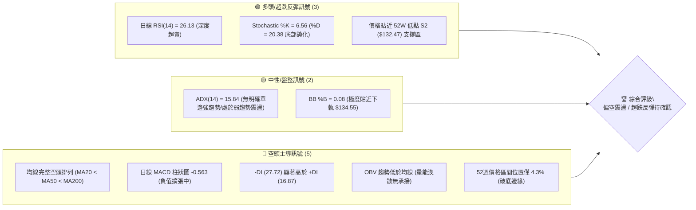
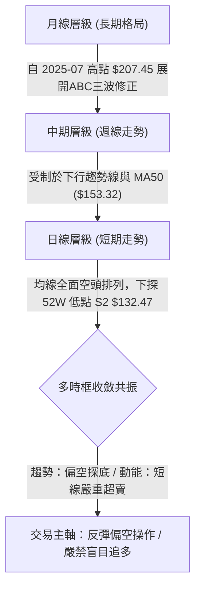
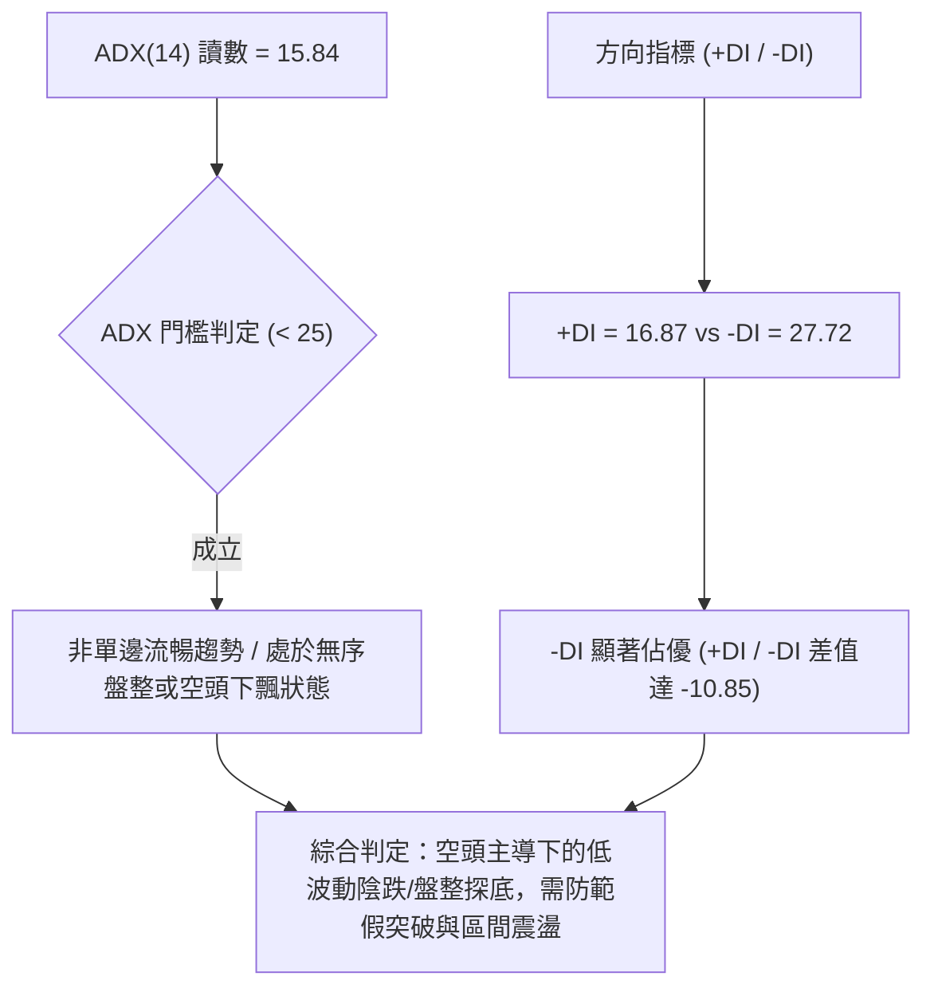
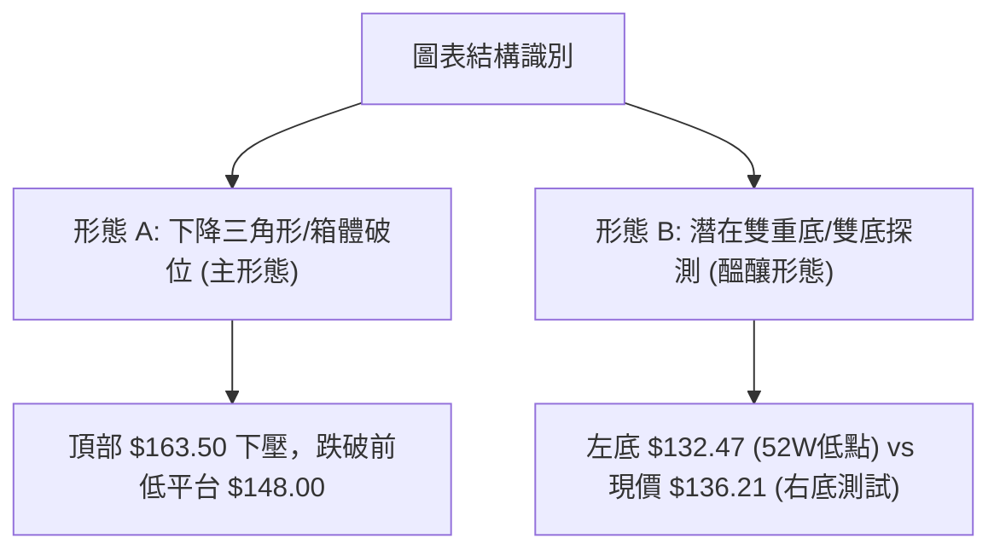
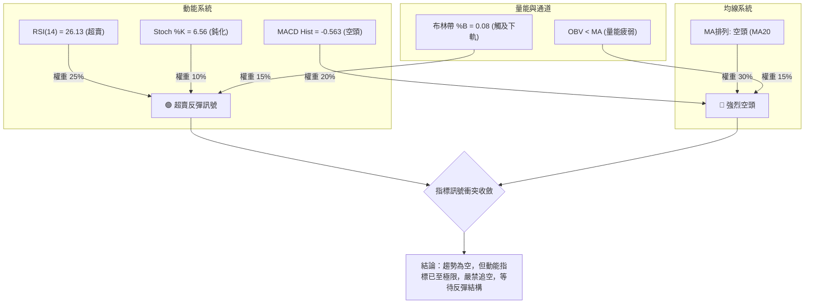
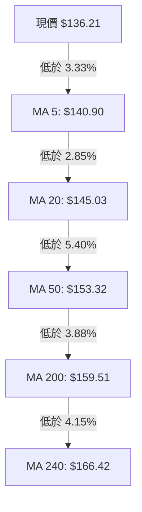
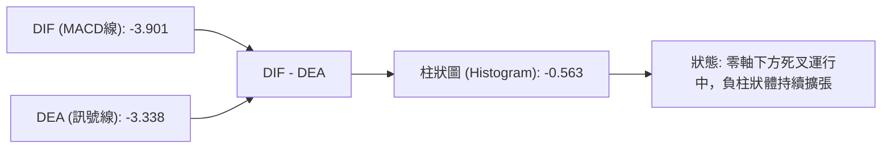
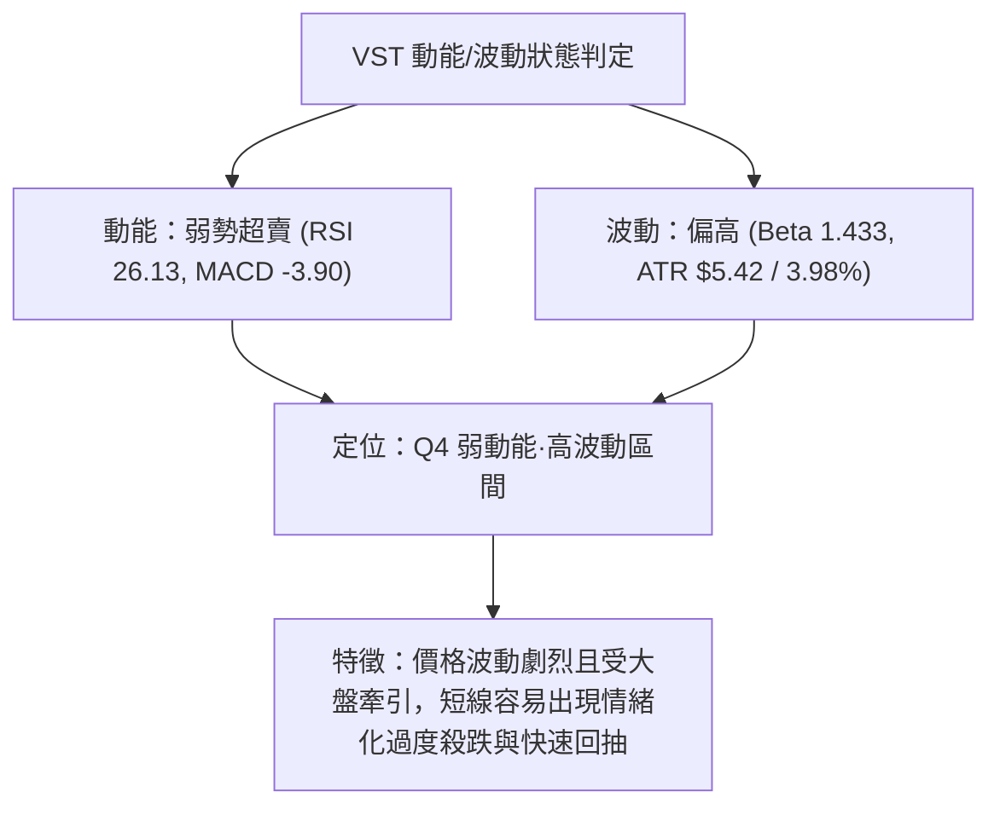
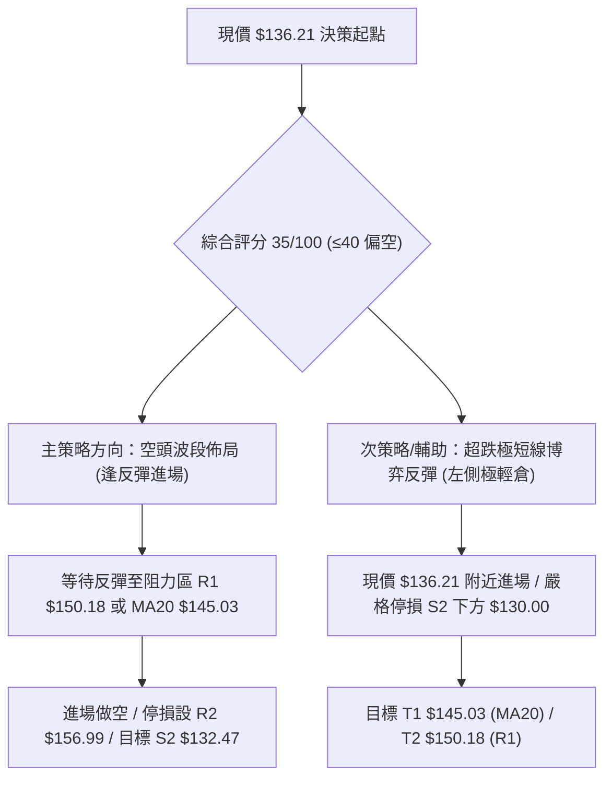
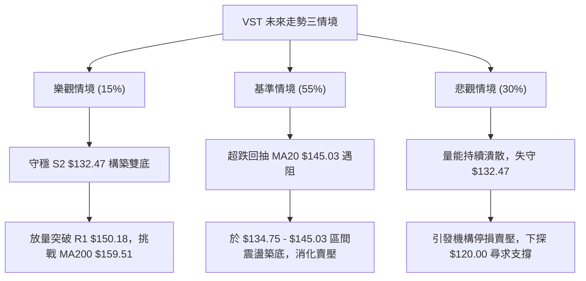

# VST 技術分析報告

> **報告日期**：2026-08-22 ｜ **語言**：繁體中文 ｜ **數據來源**：Yahoo Finance ｜ **當前價格**：$136.21

---

## 目錄

| 章節 | 內容 |
|------|------|
| [1. 技術面概覽](#1-技術面概覽) | 訊號儀表板、核心指標、評分卡 |
| [2. 趨勢分析](#2-趨勢分析) | 多時框趨勢、長中短期走勢 |
| [3. 圖表形態分析](#3-圖表形態分析) | 形態識別、K線組合、目標價 |
| [4. 支撐與阻力](#4-支撐與阻力) | 關鍵價位、斐波那契回調 |
| [5. 技術指標深度解讀](#5-技術指標深度解讀) | MA/RSI/MACD/布林/成交量 |
| [6. 動能與波動率](#6-動能與波動率) | 動能評估、ATR、Beta |
| [7. 多時框架總結](#7-多時框架總結) | 時框架評分矩陣 |
| [8. 交易策略建議](#8-交易策略建議) | 多空策略、風險報酬比 |
| [9. 風險提示與監控](#9-風險提示與監控) | 監控指標、風險場景 |

---

## 1. 技術面概覽

### 🎯 技術訊號儀表板



### 📊 核心指標速覽表

| 指標類別 | 指標名稱 | 當前數值 | 訊號 | 解讀 |
|----------|----------|----------|------|------|
| **價格** | 當前價格 | $136.21 | 🔴 | 位於 52 週低點附近（區間 4.3% 分位），下行壓力沉重 |
| **均線** | MA20 | $145.03 | 🔴 | 價格低於 MA20 達 -6.08%，短期受制於動態下行壓力 |
| **均線** | MA50 | $153.32 | 🔴 | 中期生命線下彎，價格落後 -11.16%，中期空頭壓制 |
| **均線** | MA200 | $159.51 | 🔴 | 長期牛熊分界線失守，均線空頭排列（MA20<MA50<MA200） |
| **動能** | RSI(14) | 26.13 | 🟢 | 進入極度超賣區（<30），技術性反彈動能正在醞釀 |
| **動能** | MACD (12,26,9) | -3.901 / -3.338 | 🔴 | MACD 線低於信號線，Hist 為 -0.563，空方動能仍佔優勢 |
| **動能** | Stochastic | %K: 6.56 / %D: 20.38 | 🟢 | 極度超賣，隨時可能出現低檔黃金交叉 |
| **趨勢** | ADX (14) | 15.84 | 🟡 | 數值小於 25，代表非強趨勢單邊崩跌，屬偏空震盪探底格局 |
| **通道** | Bollinger Bands | 上 $155.51 / 下 $134.55 | 🟡 | 現價 $136.21 逼近下軌，%B 為 0.08，面臨下軌支撐測試 |
| **波動** | ATR(14) | $5.42 (3.98%) | 🟡 | 日內波動幅度約 4%，提供止損與波段空間設定基準 |
| **量能** | 20日成交量比 | 0.88x (4.25M vs 4.81M) | 🔴 | 量能低於均量，OBV 疲弱，跌勢中無顯著放量抄底買盤 |

### 🏆 技術評分卡

```
╔══════════════════════════════════════════════════════════════╗
║               技術評分卡 — VST (2026-08-22)                  ║
╠══════════════════════════════════════════════════════════════╣
║ 趨勢強度 (ADX/DI)   ██████░░░░░░░░░░░░░░  30/100  🔴 空方主導 ║
║ 動能指標 (RSI/MACD) ████████░░░░░░░░░░░░  40/100  🟡 超賣反彈 ║
║ 支撐穩定度 (S1/S2)  ██████████░░░░░░░░░░  50/100  🟡 臨近考驗 ║
║ 成交量配合 (OBV/Vol)██████░░░░░░░░░░░░░░  30/100  🔴 量能萎縮 ║
║ 形態完整度 (結構)   ████████░░░░░░░░░░░░  40/100  🟡 區間破位 ║
║ 均線排列 (MA系統)   ████░░░░░░░░░░░░░░░░  20/100  🔴 空頭排列 ║
╠══════════════════════════════════════════════════════════════╣
║ 綜合評分            ███████░░░░░░░░░░░░░  35/100  🔴 偏空震盪 ║
╚══════════════════════════════════════════════════════════════╝
```

---

## 2. 趨勢分析

### 🌐 多時框趨勢分析



### 📈 長期趨勢 — 12個月走勢圖（Unicode）

```
VST 月線走勢圖（過去12個月：2025-08 至 2026-08）
價格軸 ($)
$207.45 ┤                  
$195.11 ┤ ●(25-09)         
$188.12 ┤●(25-08)  ●(25-10)
$178.12 ┤                  ●(25-11)
$173.41 ┤                                  ●(26-02)
$160.88 ┤                          ●(25-12)          ●(26-05)
$158.63 ┤                                                ●(26-06)
$157.91 ┤                                  ●(26-01)  ●(26-04)
$150.12 ┤                                            ●(26-03)
$148.19 ┤                                                        ●(26-07)
$136.21 ┤━━━━━━━━━━━━━━━━━━━━━━━━━━━━━━━━━━━━━━━━━━━━━━━━━━━━━━━━━●(26-08 現價)
$132.47 ┤                                                               ┬ (52W低點支撐)
        └─────────────────────────────────────────────────────────────
         08   09   10   11   12   01   02   03   04   05   06   07   08
        (2025)                        (2026)
```

#### 走勢特徵分析表格

| 階段區間 | 時間跨度 | 起訖價位 | 漲跌幅 | 結構特徵與量價解讀 |
|----------|----------|----------|--------|--------------------|
| **高檔築頂期** | 2025-08 至 2025-10 | $188.12 → $187.52 | -0.32% | 於 $190-$207 區間形成大型頂部，量能無法推升破頂 |
| **破位下行期** | 2025-11 至 2026-01 | $178.12 → $157.91 | -11.35% | 跌破 $165.49 (Fib 61.8%) 支撐，均線轉為下彎空頭 |
| **次級反彈期** | 2026-02 | $157.91 → $173.41 | +9.82% | 觸及 MA200 附近的弱勢死貓反彈，未突破前高確認為空頭中繼 |
| **低檔盤整破位** | 2026-03 至 2026-08 | $173.41 → $136.21 | -21.45% | 在 $150-$160 構築中繼平台後再度破位，回測 52W 低點 $132.47 |

### 📊 中期趨勢（週線分析）

週線層級自 2026 年 4 月以來的 20 週數據顯示，價格維持在「反彈遭均線壓制、破底測支撐」的弱勢輪動中。

```
近期週線壓力支撐示意圖：
[阻力 R3: $168.93] ────────────────────────────────────────── (強烈空方防守區)
                       ▲ (2026-04/06 反彈高點 $164.12)
[阻力 R2: $156.99] ───────┼────────────────────────────────── (MA50 / 下降通道上軌)
                          │        ▲ (2026-07 反彈高點 $163.38)
[阻力 R1: $150.18] ───────┼────────┼───────────────────────── (Fib 78.6% 回調位 / 頸線)
                          │        │        
[現價 : $136.21] ─────────┼────────┼────────▼──────── (最新週線收盤 $136.21, RSI 26.1)
[支撐 S1: $134.75] ───────┴────────┴─────────▲─────── (布林通道下軌 $134.55 聚類)
[支撐 S2: $132.47] ──────────────────────────┴─────── (52W 低點 $132.47 極限支撐)
```

### ⚡ 趨勢強度評估（ADX 解讀）



#### ADX 強度對照表

| 指標變數 | 當前數值 | 狀態判定 | 交易意涵 |
|----------|----------|----------|----------|
| **ADX(14)** | 15.84 | 弱趨勢 / 盤整區 (<25) | 不宜採用單邊趨勢突破追價策略，以區間及震盪指標為核心 |
| **+DI** | 16.87 | 多方動能匱乏 | 多頭無主動進攻能力，買盤僅為被動掛單 |
| **-DI** | 27.72 | 空方主導盤勢 | 空方掌控主要節奏，反彈易引發解套賣壓 |
| **DI 差值 (-DI - +DI)** | +10.85 | 空方優勢 | 任何反彈未見 +DI 上穿 25 前均視為技術性修正 |

---

## 3. 圖表形態分析

### 🔍 形態識別系統



#### 形態識別與信心度評估表

| 形態類別 | 信心度 | 判斷依據（引用技術數據） | 完成度 | 目標價（附嚴謹計算式） |
|----------|--------|--------------------------|--------|------------------------|
| **下降箱體破位** | 75% | 2026-06至07月多次受阻於 R1/R2 ($150-$163)，隨後跌破平台支撐 $148.19 | 90% | 由形態高度推算：破位點 $148.19 - (頂部 $163.49 - $148.19 = $15.30) = **$132.89**（高度聚類 S2 $132.47） |
| **潛在雙重底 (W底)** | 35% | 價格逼近 52W 低點 S2 ($132.47)，RSI 26.13 極度超賣引發背離預期 | 20% | 待確立頸線 R1 $150.18 突破：頸線 $150.18 + (頸線 $150.18 - 低點 $132.47 = $17.71) = **$167.89**（聚類 R3 $168.93） |
| **布林下軌超賣擠壓** | 80% | BB %B 達 0.08，收盤價逼近下軌 $134.55，偏離 MA20 達 -6.08% | 95% | 回歸均線目標價：**$145.03** (MA20 / BB中軌) |

### 🕯️ 重要K線形態分析

| 週期/日期 | 收盤價 | K線形態 / 特徵 | 技術解讀 | 多空訊號 |
|-----------|--------|----------------|----------|----------|
| **2026-05-17** | $139.48 | 長黑破位後伴隨巨量長下影 | 觸及波段低點後引發短線空頭回補，週成交量達 28.9M | 🟢 觸底反彈 |
| **2026-05-24** | $156.05 | 大陽線實體包覆 (吞噬) | 巨量 32.7M 突破，確認 $139 附近的強勁支撐買盤 | 🟢 強烈看多 |
| **2026-06-28** | $163.49 | 高檔雙十字星停滯 | 於 R2 ($156.99) 上方動能衰竭，成交量萎縮至 21.6M | 🔴 頂部停滯 |
| **2026-08-09** | $140.59 | 帶量長黑K (34.9M) | 創近月最大週成交量殺跌，擊穿短期均線支撐，主力出逃 | 🔴 空方宣洩 |
| **2026-08-23** | $136.21 | 縮量陰跌接近前低 | 陰線實體縮小，量能降至 20.6M，空方賣壓有所減緩 | 🟡 測試支撐 |

### 📉 ASCII 走勢形態示意圖

```
VST 2026年 區間震盪下破與雙底測試示意圖：
 ($)
168.93 ┼───────────────────────────────────────────── [阻力 R3]
       │             ╭─╮(6/28: $163.49)
156.99 ┼─────────────┼─┼──────────╭─╮(7/26: $163.38)─ [阻力 R2]
       │   ╭─╮       │ │          │ │
150.18 ┼───┼─┼───────╯ ╰──────────╯ ╰─────────────── [阻力 R1 / 中期頸線]
       │   │ │ (5/31: $160.01)
145.03 ┼───┼─┼──────────────────────────────────────── [MA20 / 布林中軌]
       │   │ │
136.21 ┼───╯ ╰───────────────────────────────● 現價 $136.21 (RSI 26.1)
134.75 ┼─────────────────────────────────────▲─────── [支撐 S1 / 布林下軌]
132.47 ┴─(52W低點: $132.47)───────────────────┴─────── [支撐 S2 / 潛在右底]
          【左底形成區】                         【右底構築/破位測試區】
```

### 🎯 形態目標價計算

1. **下行破位量測目標**：
   - 下行中繼箱體頂部 = $163.49，底部頸線 = $148.19
   - 形態垂直高度 $H = \$163.49 - \$148.19 = \$15.30$
   - 下行突破滿足點 = $破位頸線 \$148.19 - H (\$15.30) =$ **$132.89**
   - *結論*：該計算價位與歷史 52 週最低點 **$132.47 (S2)** 幾乎完全重合，顯示目前價格 ($136.21) 已極度接近下行形態的量度滿足區。

2. **超跌回歸均線目標**：
   - 價格嚴重偏離 MA20 (-6.08%) 且 BB %B = 0.08。
   - 理論均值回歸第一目標 = **$145.03** (MA20)。

---

## 4. 支撐與阻力

### 🗺️ 關鍵價位分布圖（Unicode）

```
╔══════════════════════════════════════════════════════════════╗
║                   VST 價位結構分布圖                         ║
╠══════════════════════════════════════════════════════════════╣
║ $168.93 ║██████████████████████████████║ 強阻力 R3 (波段頂部聚類)   ║
║ $159.51 ║██████████████████████        ║ 長期均線 MA200 牛熊分界線  ║
║ $156.99 ║████████████████████          ║ 阻力 R2 (中期反彈波段高點) ║
║ $150.97 ║████████████████              ║ Fib 78.6% 回調位           ║
║ $150.18 ║████████████████              ║ 關鍵阻力 R1 (頸線壓力區)   ║
║ $145.03 ║██████████                    ║ 短期阻力 MA20 / 布林中軌   ║
║ $136.21 ╠══════════════════════════════╣ ◄ 現價 ($136.21)           ║
║ $134.75 ║▓▓▓▓▓▓▓▓▓▓▓▓▓▓▓▓              ║ 近期支撐 S1 (布林下軌聚類) ║
║ $132.47 ║██████████████████████████████║ 極強支撐 S2 (52W最低點)    ║
╚══════════════════════════════════════════════════════════════╝
```

### 🚧 阻力位分析表

| 阻力級別 | 精確價位 | 形成原因與技術共振 | 突破難度 | 重要性 |
|----------|----------|--------------------|----------|--------|
| **R1** | **$150.18** | 近一年波段高點聚類、Fib 78.6% ($150.97) 共振區、前波震盪箱底 | 中等 | 🟢 短線多空轉換關鍵分水嶺 |
| **R2** | **$156.99** | 近一年波段高點聚類、MA50 ($153.32) 下降壓力帶、布林上軌 ($155.51) | 高 | 🟡 中期空頭防守核心區 |
| **R3** | **$168.93** | 近一年波段頂部聚類、Fib 61.8% ($165.49) 上方強阻力、MA240 ($166.42) | 極高 | 🔴 多頭強勢反轉確認點 |

### 🛡️ 支撐位分析表

| 支撐級別 | 精確價位 | 形成原因與技術共振 | 守住機率 | 重要性 |
|----------|----------|--------------------|----------|--------|
| **S1** | **$134.75** | 近一年波段低點聚類、布林通道下軌 ($134.55) 支撐 | 60% | 🟡 短線第一道超跌防線 |
| **S2** | **$132.47** | 52 週最低點 (Fib 100.0% 回調點)、2025 年初起漲平台 | 75% | 🔴 絕對多頭防線（跌破將打開無支撐空間） |

### 📐 斐波那契回調位分析

依據 52 週完整波動區間（低點 **$132.47** → 高點 **$218.91**，垂直波幅 $86.44）之精確計算：

```
斐波那契回調位階分布：
0.0%  (52W High) ────────────────────────────── $218.91
23.6%            ────────────────────────────── $198.51
38.2%            ────────────────────────────── $185.89
50.0%            ────────────────────────────── $175.69
61.8%            ────────────────────────────── $165.49  (黃金分割關鍵阻力)
78.6%            ────────────────────────────── $150.97  (聚類 R1 $150.18)
[現價區間]       ───► $136.21 ◄─── (位於 78.6% 與 100.0% 之間)
100.0% (52W Low) ────────────────────────────── $132.47  (終極回調基期)
```

- **位置解讀**：現價 $136.21 處於 Fib 78.6% ($150.97) 至 Fib 100.0% ($132.47) 的「深度回調極限區」。
- **技術意義**：此區間通常代表原先牛市結構已完全回吐。若能守穩 100.0% ($132.47)，將構築大型雙底結構；若失守 $132.47，則宣告跌破 52 週底部，進入新一輪下行擴展浪。

---

## 5. 技術指標深度解讀

### 🎛️ 指標訊號總覽



### 📈 移動平均線排列分析



- **短天期均線**：MA5 ($140.90)、MA10 ($143.35)、MA20 ($145.03) 呈現陡峭下行，斜率為負，對價格構成層層壓制。
- **長天期均線**：MA50 ($153.32) 位於 MA200 ($159.51) 下方，且 MA240 高達 $166.42，長期均線空頭排列完整，說明中期格局仍由賣方完全控盤。

### 📉 RSI(14) 分析

- **當前讀數**：**26.13** 
- **進度條展示**：
  ```
  RSI(14) = 26.13  [█████░░░░░░░░░░░░░░░] 26.13% 🟢 深度超賣 (<30)
  ```
- **超買超賣分析**：RSI 跌入 30 以下極度超賣區，代表短線市場拋售情緒已達非理性極端。
- **背離分析**：
  - 檢視 2026-05-17 低點（收盤 $139.48，RSI 25.5）與當前（收盤 $136.21，RSI 26.13）：價格創下波段新低，但 RSI 讀數未跌破前低（26.13 > 25.5），呈現**微幅日線底背離雛形**。然而，由於成交量並未放大確認，該背離尚處於醞釀期，尚未正式觸發買入信號。

### 📊 MACD(12,26,9) 訊號解讀



- **數值狀態**：DIF (-3.901) 低於 DEA (-3.338)，MACD 柱狀圖為 **-0.563**。
- **動能解讀**：雙線位於零軸下方深度區域，屬於典型弱勢空頭行情。雖然負柱狀體未出現加速崩跌，但仍未見到收斂拐點（Histogram 尚未翻紅），表明空頭動能仍在釋放。

### 📦 布林通道分析

```
布林通道 (20, 2) 結構圖：
$155.51 ┬─────────────────────────────────────────────── 上軌 (Upper Band)
        │
$145.03 ┼─────────────────────────────────────────────── 中軌 (MA20)
        │
$136.21 ┼─────────────────────────────────● 現價 ($136.21, %B = 0.08)
$134.55 ┴─────────────────────────────────────────────── 下軌 (Lower Band)
```

- **通道寬度**：帶寬為 $155.51 - $134.55 = $20.96 (約 14.4%)。
- **位置 %B**：當前 **%B = 0.08**，顯示價格已緊貼布林下軌（$134.55）。在統計學上，價格位於下軌外側或邊緣屬於 2 個標準差極端值，具有極高的均值回歸（Mean Reversion）拉力，隨時可能向中軌 **$145.03** 靠攏。

### 💹 成交量分析（量價配合度）

- **量能數據**：最新日成交量為 4,255,120 股，相較於 20 日均量 4,817,026 股，量比為 **0.88x**。
- **OBV 表現**：OBV 數值持續低於其移動平均線（OBV < MA），呈現「量先於價行」的疲弱特徵。
- **量價關係**：近期跌勢並未伴隨恐慌性爆量（如 2026-08-09 的 34.9M 週巨量後，量能逐步縮減至 20.6M），屬於「縮量陰跌探底」結構。此種量價形態代表市場買盤承接意願薄弱，但主動性殺跌賣壓亦逐步耗盡。

---

## 6. 動能與波動率

### ⚡ 動能評估四象限

| 象限 | 動能強度 (RSI/MACD) | 波動率水準 (ATR/Beta) | VST 當前定位 | 策略應對與市場心理 |
|------|---------------------|-----------------------|--------------|--------------------|
| **Q1 (高動能·低波動)** | 強 (Bullish) | 低 (Low Vol) | — | 穩定牛皮升勢，順勢加碼 |
| **Q2 (弱動能·低波動)** | 弱 (Bearish) | 低 (Low Vol) | — | 弱勢陰跌盤整，資金沉澱 |
| **Q3 (強動能·高波動)** | 強 (Bullish) | 高 (High Vol) | — | 爆發性突破行情，追逐強勢 |
| **Q4 (弱動能·高波動)** | **弱 (極度超賣)** | **高 (Beta 1.43, ATR 4%)** | **✓ VST 位於此區** | **高風險深水區：劇烈向下波動後醞釀超跌反彈** |



### 📊 ATR 波動率分析

- **ATR(14) 數值**：**$5.42**（佔當前股價之 **3.98%**）。
- **止損與區間設定依據**：
  - **日內正常波動區間**：$136.21 ± $5.42 → **$130.79 至 $141.63**。
  - **波段交易安全止損距離**：一般建議設定為 1.0 至 1.5 倍 ATR。
    - 1.0 倍 ATR 止損距離 = $5.42。
    - 1.5 倍 ATR 止損距離 = $8.13。
  - **支撐測試安全緩衝**：若以 S2 ($132.47) 為防守點，向下跌破 0.5 倍 ATR ($2.71) 即 $129.76，應視為實質破位。

### 📐 Beta 與市場相關性

- **Beta 係數**：**1.433**。
- **解讀**：VST 具備高於大盤（S&P 500）43.3% 的波動敏感度。當大盤處於回檔期時，VST 承擔放大的下行風險；反之，若公用事業板塊或美股大盤出現全面性反彈，VST 的高彈性將使其具備領先修復的動能。

---

## 7. 多時框架總結

### 📋 時框架評分表

| 時框架 | 趨勢方向 | 動能指標狀態 | 均線排列特徵 | 形態/K線結構 | 綜合評分 | 交易建議方向 |
|--------|----------|--------------|--------------|--------------|----------|--------------|
| **月線 (長期)** | 🔴 空頭修正 | 弱勢下行 | 跌破 12 個月均線帶 | 自 $207 高點回吐 | 30/100 | 長期部位減碼觀望 |
| **週線 (中期)** | 🔴 偏空運行 | MACD柱負向 | MA20 < MA50 | 考驗 52W 底部 S2 | 35/100 | 逢反彈至阻力偏空操作 |
| **日線 (短期)** | 🟡 深度超賣 | RSI 26.13 極端 | 空頭排列 (偏離大) | 觸及布林下軌 $134.55 | 45/100 | 嚴禁追空，博弈短線反彈 |

### 🔲 綜合訊號矩陣

```
╔══════════════════════════════════════════════════════════════════╗
║                     VST 多時框訊號收斂矩陣                       ║
╠══════════════╦══════════════╦══════════════╦═════════════════════╣
║   分析維度   ║  短期 (日線) ║  中期 (週線) ║     長期 (月線)     ║
╠══════════════╬══════════════╬══════════════╬═════════════════════╣
║ 趨勢方向     ║ 🔴 空頭下行  ║ 🔴 偏空震盪  ║ 🔴 ABC修正浪        ║
║ 動能狀態     ║ 🟢 嚴重超賣  ║ 🔴 動能不足  ║ 🔴 賣壓釋放中       ║
║ 均線系統     ║ 🔴 空頭排列  ║ 🔴 均線下彎  ║ 🟡 逼近長線支撐帶   ║
║ 支撐/阻力    ║ 🟡 測試 S1/S2║ 🔴 失守頸線  ║ 🟢 處於 52W 底部區  ║
╠══════════════╬══════════════╬══════════════╬═════════════════════╣
║ 維度一致性   ║ 矛盾(超賣反彈 vs 趨勢向下)  ║ 趨勢統一(中長期空頭)║
╚══════════════╩══════════════╩══════════════╩═════════════════════╝
```

### ⚖️ 多時框收斂結論

依據多時框收斂規則（嚴格要求 14）：
1. **行情性質判定**：當前日線 ADX(14) 讀數為 **15.84 (< 25)**，明確定義當前市場為**盤整/無單邊強趨勢行情**（弱勢陰跌震盪）。
2. **主導時框收斂**：在 ADX < 25 的盤整結構中，日線布林通道（上軌 $155.51、下軌 $134.55）與關鍵支撐阻力（S2 $132.47、R1 $150.18）成為主要交易區間。
3. **唯一方向性結論**：**【偏空震盪，嚴禁追空；以區間超跌反彈與逢高空為主軸】**。整體技術評分為 **35/100 (偏空)**，主導方向維持中長期空方架構，但日線極度超賣限制了立即下行的空間。

---

## 8. 交易策略建議

### 🗺️ 策略決策流程圖



### 🧭 策略路由（依評分卡分流）

> **當前主策略方向 = 【主推空頭策略（逢反彈阻力做空）】（依技術評分卡 35/100 判定）**
> 
> *註：由於綜合評分 ≤ 40，多頭僅列為短線超跌反彈的次要輔助交易，核心波段策略以順應中長期空頭均線的「逢高放空」為主。*

### 🎯 價格情境階梯（Price Scenarios）

| 觸發條件 | 下一目標 | 後續延伸 | 情境含義與操作指引 |
|----------|----------|----------|--------------------|
| **強勢突破 R1 $150.18** | R2 $156.99 | R3 $168.93 | 短線由弱轉強，空頭結構被破壞，需立即平倉空單 |
| **反彈受阻於 MA20 $145.03** | S1 $134.75 | S2 $132.47 | 標準空頭中繼回抽，提供絕佳順勢放空切入點 |
| **跌破 S1 $134.75** | S2 $132.47 | $125.00 (開放空間) | 延續探底格局，測試 52 週最低點終極防線 |
| **實質跌破 S2 $132.47** | $120.00 | $106.00 (分析師低標) | 宣告 52 週大底破位，打開新一輪崩跌空間 |

### 📊 情境機率分佈

| 情境劇本 | 預估機率 | 主要技術依據 |
|----------|----------|--------------|
| **情境 A：區間超跌反彈後再下探** | **55%** | RSI(14) 26.13 嚴重超賣，BB %B 達 0.08，勢必引發向 MA20 ($145.03) 的均值回歸反彈，但受制於 MA50 下行壓力 |
| **情境 B：直接跌破 S2 探底** | **30%** | 均線完整空頭排列，MACD 負柱狀體擴張，-DI (27.72) 壓制 +DI (16.87) |
| **情境 C：強勢反轉突破 R1** | **15%** | 成交量持續低於 20 日均量 (量比 0.88x)，缺乏機構主動買盤推升 |

### 🔴 主策略詳情：順勢逢高放空（策略 A）與超跌反彈博弈（策略 B）

| 策略要素 | 策略 A：波段順勢放空（主策略） | 策略 B：超跌右底博弈（次策略/短線） |
|----------|--------------------------------|--------------------------------------|
| **交易方向** | 🔴 做空 (Short) | 🟢 做多 (Long) |
| **進場條件** | 價格反彈至 MA20 / R1 遇阻收上影線 | 現價或回踩 S1 不破且 RSI 出現勾頭 |
| **進場價格** | **$145.03 - $150.18** | **$134.75 - $136.21** |
| **目標價 T1** | **$136.21** (現價水平) | **$145.03** (MA20 / 布林中軌) |
| **目標價 T2** | **$132.47** (52W 低點 S2) | **$150.18** (關鍵阻力 R1) |
| **止損價格** | **$153.32** (突破 MA50 嚴格止損) | **$130.00** (有效跌破 S2 $132.47 止損) |
| **風險報酬比** | **1 : 2.52** | **1 : 1.83** |
| **預估勝率** | **65%** | **45%** |
| **建議倉位** | **15% - 20%** | **5% - 8% (極輕倉博弈)** |

*風險報酬比計算式（策略 A 以 $148.00 進場為例）：*
$$\text{風險} = \$153.32 - \$148.00 = \$5.32$$
$$\text{報酬} = \$148.00 - \$132.47 = \$15.53 \implies \text{R/R} = 15.53 / 5.32 = 2.92$$

### 🔴 反向風險觸發點（對沖與風控提示）

1. **多頭反轉觸發**：若日線收盤價帶量（日成交量 > 6.0M 股）強勢突破 **$150.18 (R1)** 並站穩 2 個交易日以上，空頭架構宣告失效，所有空單必須無條件止損離場。
2. **多單全面棄守觸發**：若價格以實體陰線跌穿 **$132.47 (S2)**，代表 52 週支撐徹底瓦解，抄底多單需即刻停損，不可盲目向下攤平。

### ⭐ 整體訊號強度評星

```
做多訊號強度：★★☆☆☆  (2/5 星 - 僅具備超賣反彈條件)
做空訊號強度：★★★★☆  (4/5 星 - 均線趨勢與多時框全面偏空)
整體可信度：  ★★★☆☆  (3/5 星 - 處於低 ADX 震盪區間，需防範假突破)
```

---

## 9. 風險提示與監控

### ✅ 關鍵監控指標 Checklist

```
╔══════════════════════════════════════════════════════════════╗
║               VST 每日盤後關鍵技術監控清單                   ║
╠══════════════════════════════════════════════════════════════╣
║ [ ] 1. 支撐防守：收盤價是否守穩 52W 低點 $132.47？           ║
║ [ ] 2. 均線壓制：反彈是否在 MA20 ($145.03) 出現明顯受阻？   ║
║ [ ] 3. RSI 狀態：RSI(14) 是否脫離 30 以下超賣區展開修復？    ║
║ [ ] 4. MACD 動能：MACD 柱狀圖是否由 -0.563 出現底背離翻紅？  ║
║ [ ] 5. 帶寬收縮：布林帶寬是否持續縮窄醞釀方向性變盤？        ║
║ [ ] 6. 量能異動：單日成交量是否突破 50 日均量 (4.45M) 達 1.5x║
╚══════════════════════════════════════════════════════════════╝
```

### ⚠️ 風險場景分析



### 🛡️ 風險管理重要提醒

1. **波動度管理**：VST ATR 達 $5.42（單日波動近 4%），且 Beta 為 1.433。投資人必須嚴格控制單筆交易曝險金額，單筆止損虧損不得超過總資產的 1.0% - 1.5%。
2. **不可忽視的基本面落差**：華爾街分析師平均目標價高達 **$219.72**（給予 strong_buy 評級），但技術面上股價正處於 $136.21 的弱勢探底中。**技術交易者必須以盤面實際價格行為（Price Action）為準，切忌依據分析師目標價在下行趨勢中逆勢重倉。**
3. **區間破位風控**：$132.47 為過去一年最核心的多方心理防線。一旦失守，將觸發長達 12 個月的套牢盤停損潮，屆時切勿進行任何左側抄底操作。

---

## 📋 報告總結

```
╔══════════════════════════════════════════════════════════════════╗
║                   VST 技術分析報告總結                       ║
╠══════════════════════════════════════════════════════════════════╣
║ 報告日期：2026-08-22                                             ║
║ 當前價格：$136.21                                                ║
║ 技術評級：🔴 偏空震盪（技術評分：35/100）                         ║
║                                                                  ║
║ 關鍵結論：                                                       ║
║ ├─ 長期趨勢：🔴 空頭修正（自高點 $207.45 走跌，均線空頭排列）    ║
║ ├─ 中期趨勢：🔴 弱勢偏空（受制於 MA50 $153.32 下行通道）        ║
║ ├─ 短期趨勢：🟡 極度超賣（RSI 26.13，布林 %B 0.08 醞釀反抽）     ║
║ ├─ 關鍵支撐：S1: $134.75 ｜ S2: $132.47 (52W最低點)              ║
║ ├─ 關鍵阻力：R1: $150.18 ｜ R2: $156.99 ｜ R3: $168.93          ║
║ └─ 機構共識：分析師平均目標 $219.72 (技術面與基本面呈現脫鉤)     ║
║                                                                  ║
║ 最優策略組合：                                                   ║
║ 1. 🥇 最佳機會：等待超跌反彈至 MA20/R1 ($145-$150) 建立空頭部位  ║
║ 2. 🥈 次選機會：現價至 S1 ($134.75) 輕倉博弈均值回歸反彈至 MA20 ║
║ 3. 🥉 保守選擇：完全空倉觀望，靜待 S2 $132.47 確認築底或放量突破 ║
╚══════════════════════════════════════════════════════════════════╝
```

---

> ⚠️ **免責聲明**：本報告為 AI 自動生成之技術分析，所有數據及估算均基於提供的歷史價格資訊。本報告**僅供研究與學術參考**，**不構成任何投資建議**。投資有風險，入市需謹慎。

---

*報告生成時間：2026-08-22 ｜ 數據來源：Yahoo Finance ｜ 分析框架：多時框技術分析*