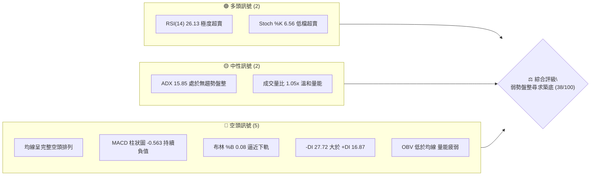
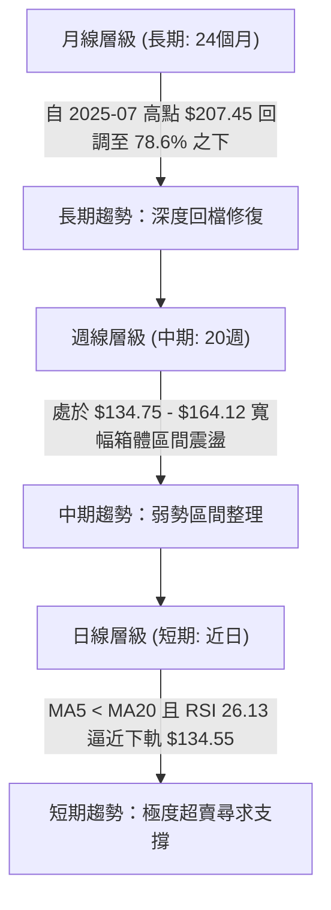
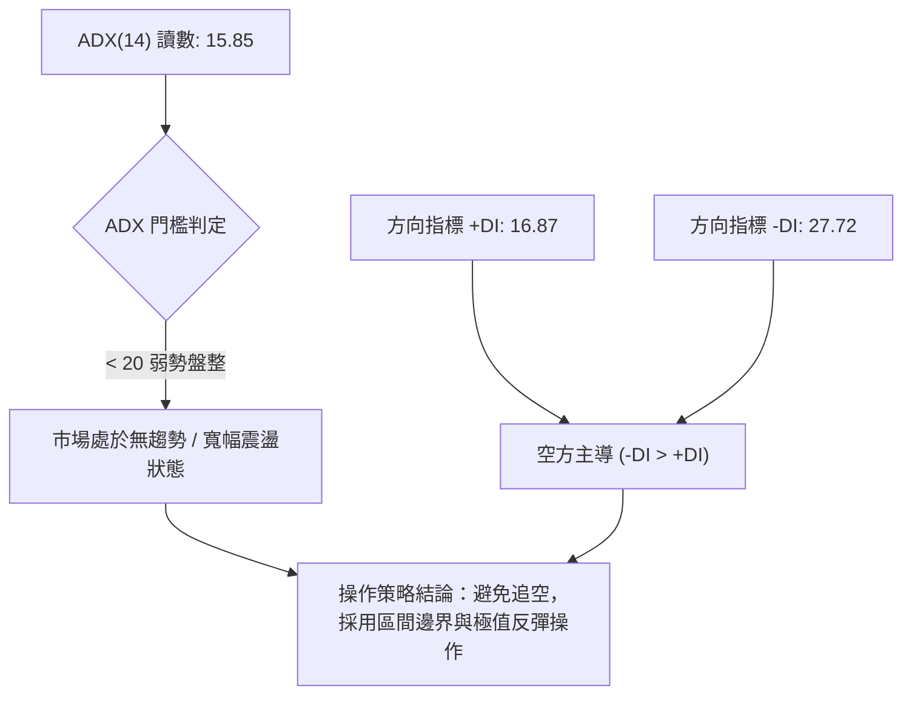
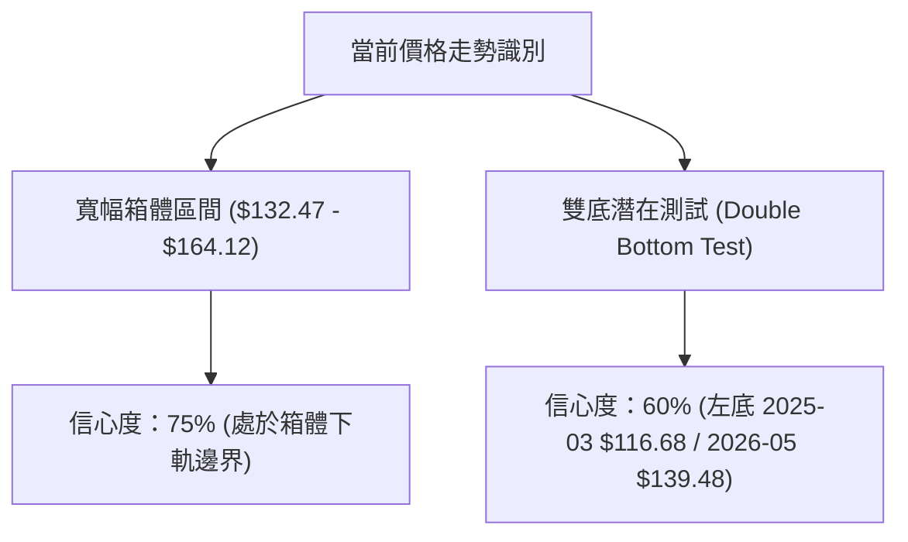
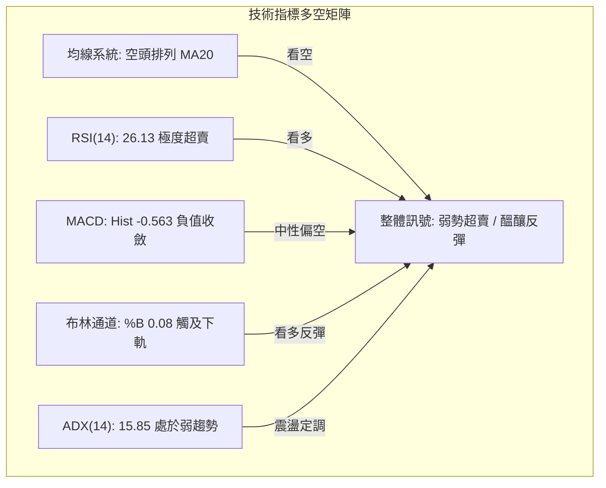
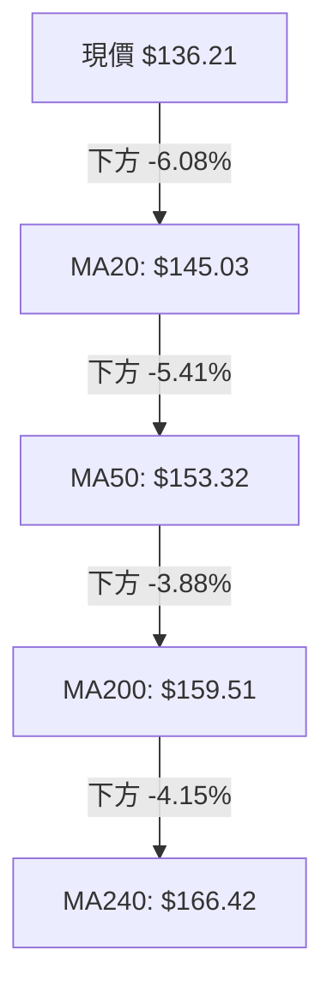
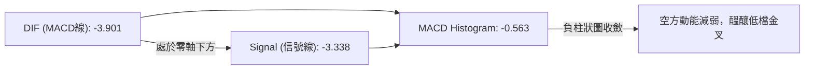
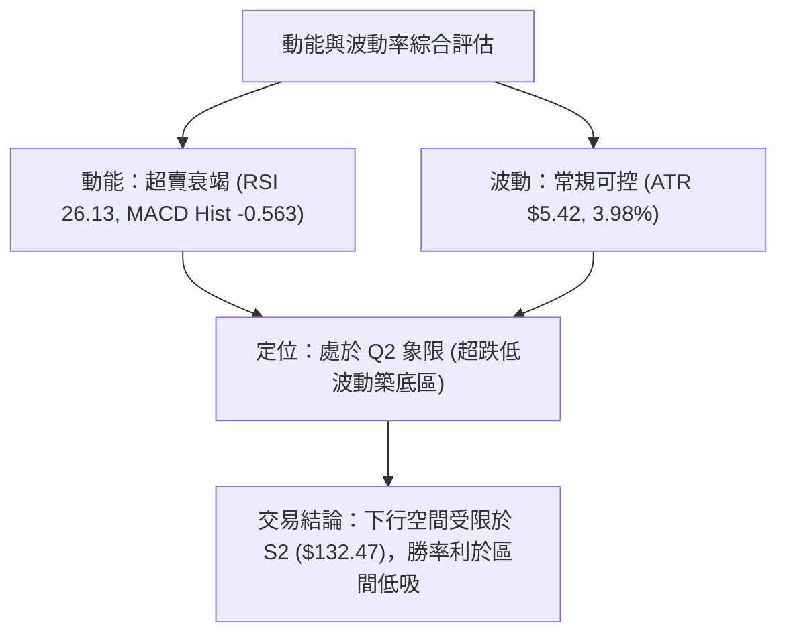
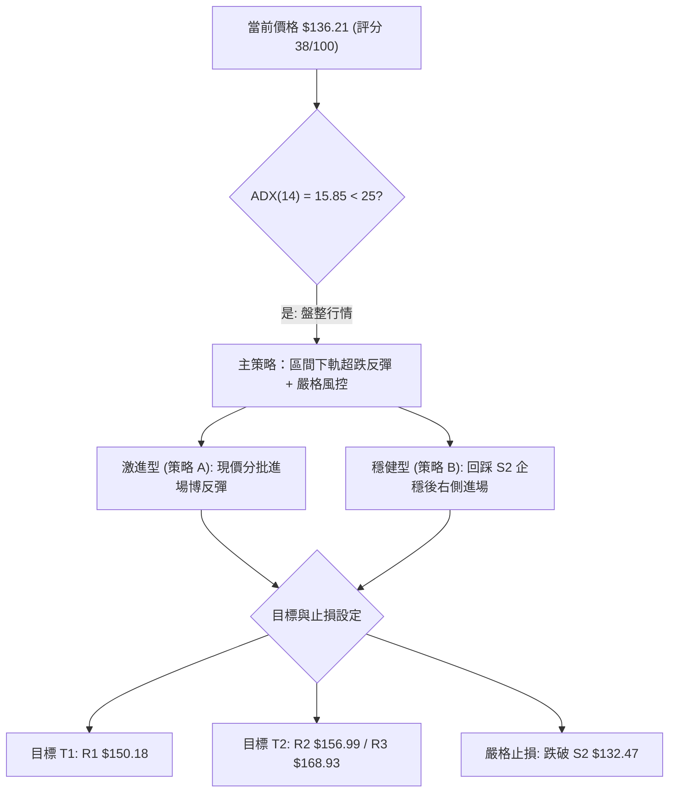
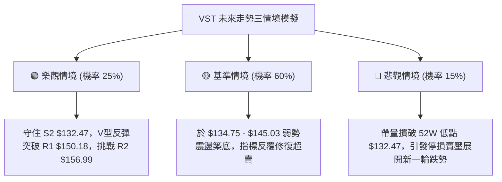

# VST 技術分析報告

> **報告日期**：2026-08-23 ｜ **語言**：繁體中文 ｜ **數據來源**：Yahoo Finance ｜ **當前價格**：$136.21

---

## 目錄

| 章節 | 內容 |
|------|------|
| [1. 技術面概覽](#1-技術面概覽) | 訊號儀表板、核心指標、評分卡 |
| [2. 趨勢分析](#2-趨勢分析) | 多時框趨勢、長中短期走勢 |
| [3. 圖表形態分析](#3-圖表形態分析) | 形態識別、K線組合、目標價 |
| [4. 支撐與阻力](#4-支撐與阻力) | 關鍵價位、斐波那契回調 |
| [5. 技術指標深度解讀](#5-技術指標深度解讀) | MA/RSI/MACD/布林/成交量 |
| [6. 動能與波動率](#6-動能與波動率) | 動能評估、ATR、Beta |
| [7. 多時框架總結](#7-多時框架總結) | 時框架評分矩陣 |
| [8. 交易策略建議](#8-交易策略建議) | 多空策略、風險報酬比 |
| [9. 風險提示與監控](#9-風險提示與監控) | 監控指標、風險場景 |

---

## 1. 技術面概覽

### 🎯 技術訊號儀表板



### 📊 核心指標速覽表

| 指標類別 | 指標名稱 | 當前數值 | 訊號 | 解讀 |
|----------|----------|----------|:----:|------|
| **價格** | 當前收盤價 | $136.21 | 🔴 | 位於52週區間 4.3% 低位，逼近波段低點 |
| **均線** | 短期 MA20 | $145.03 | 🔴 | 現價低於 MA20 (-6.08%)，短線承壓 |
| **均線** | 中期 MA50 | $153.32 | 🔴 | 現價低於 MA50 (-11.16%)，中期空頭掌控 |
| **均線** | 長期 MA200 | $159.51 | 🔴 | 現價跌破年線 MA200 (-14.61%)，長期趨勢轉弱 |
| **動能** | RSI(14) | 26.13 | 🟢 | 進入深度超賣區間 (<30)，具技術性反彈契機 |
| **動能** | MACD (12,26,9) | -3.901 / -3.338 | 🔴 | DIF在信號線下方，Histogram -0.563，空方延續 |
| **隨機** | Stochastic %K/%D | 6.56 / 20.38 | 🟢 | 極度超賣，隨時可能出現低檔黃金交叉 |
| **趨勢** | ADX (14) | 15.85 | 🟡 | ADX < 25 表明非單邊強趨勢，為弱勢震盪探底 |
| **通道** | 布林通道 %B | 0.08 | 🟡 | 緊貼布林下軌 $134.55，通道未顯著開口放大 |
| **波動** | ATR(14) | $5.42 | 🟡 | 佔股價 3.98%，每日波動度處於中等水準 |

### 🏆 技術評分卡

```
╔══════════════════════════════════════════════════════════════════╗
║                 技術評分卡 — VST (2026-08-23)                    ║
╠══════════════════════════════════════════════════════════════════╣
║ 趨勢強度 (ADX/DMI)  ██████░░░░░░░░░░░░░░  30/100  🔴 空頭控盤/弱趨勢 ║
║ 動能指標 (RSI/MACD) ████████░░░░░░░░░░░░  40/100  🟡 極度超賣待反彈 ║
║ 支撐穩定度 (S1/S2)  ████████████░░░░░░░░  60/100  🟡 逼近52週低點支撐║
║ 成交量配合 (OBV/VOL)██████░░░░░░░░░░░░░░  30/100  🔴 量能萎縮無買盤 ║
║ 形態完整度 (K線/區間)████████░░░░░░░░░░░░  40/100  🟡 箱體下緣測試中 ║
║ 均線排列 (MA5-MA240)████░░░░░░░░░░░░░░░░  20/100  🔴 標準順向空頭排列║
╠══════════════════════════════════════════════════════════════════╣
║ 綜合技術評分        ███████░░░░░░░░░░░░░  38/100  🔴 偏空震盪探底   ║
╚══════════════════════════════════════════════════════════════════╝
```

---

## 2. 趨勢分析

### 🌐 多時框趨勢分析



### 📈 長期趨勢 — 12個月走勢圖（Unicode）

```
VST 月線走勢圖（過去12個月：2025-09 至 2026-08）
價格軸 ($)
$200 ┤  ● $195.11                                     
$190 ┤      ● $187.52                                  
$180 ┤          ● $178.12                              
$170 ┤                          ● $173.41              
$160 ┤              ● $160.88               ● $160.01  
$150 ┤                  ● $157.91   ● $150.12   ● $158.63
$140 ┤                                              ● $148.19
$130 ┤                                                  ● $136.21 ◄ 現在
     └────────────────────────────────────────────────────────────
        09  10  11  12  01  02  03  04  05  06  07  08 (月份)
```

**走勢特徵分析表格**：

| 階段區間 | 時間跨度 | 起訖收盤價 | 漲跌幅 | 主要特徵與結構解讀 |
|----------|----------|------------|:------:|--------------------|
| **高檔回吐期** | 2025/09 - 2025/12 | $195.11 → $160.88 | -17.54% | 頂部動能減弱，跌破高檔支撐，形成下行台階 |
| **低檔反彈期** | 2026/01 - 2026/02 | $157.91 → $173.41 | +9.82% | 測試 $157 附近支撐後出現技術性反彈 |
| **中期震盪期** | 2026/03 - 2026/06 | $150.12 → $158.63 | +5.67% | 於 $150.12 至 $160.01 構築橫盤整理平台 |
| **破位探底期** | 2026/07 - 2026/08 | $148.19 → $136.21 | -8.08% | 跌破盤整平台下沿，逼近 52 週低點 $132.47 |

### 📊 中期趨勢（週線分析）

```
中期結構壓力與支撐示意圖：
阻力 R3 ── $168.93 ──────────────────────────────── (2026年高檔反彈壓力)
阻力 R2 ── $156.99 ──────────────────────────────── (中期均線密集反壓區)
阻力 R1 ── $150.18 ──────────────────────────────── (前波平台下沿反壓)
現  價 ── $136.21 ◄───── (當前價格，超賣收斂中)
支撐 S1 ── $134.75 ──────────────────────────────── (近一年波段低點聚類)
支撐 S2 ── $132.47 ──────────────────────────────── (52週絕對低點，強防線)
```

中期週線在過去 20 週內多次於 $163.50-$164.12 遇阻回落，並在 $139.48 及當前 $136.21 尋求下軌支撐。週線 MACD 柱狀圖近期在 -0.563 至 -1.873 間低檔徘徊，表明中期下行動能尚未完全轉為上攻，但跌勢斜率已明顯趨緩。

### ⚡ 趨勢強度評估（ADX 解讀）



| 指標變數 | 當前數值 | 狀態評估 | 技術意涵 |
|----------|:--------:|:--------:|----------|
| **ADX(14)** | 15.85 | 弱趨勢 (<20) | 當前缺乏單邊推動力，非單邊暴跌趨勢，為弱勢震盪行情 |
| **+DI (14)** | 16.87 | 多頭動能偏低 | 買方追價意願疲弱，上攻缺乏量能支撐 |
| **-DI (14)** | 27.72 | 空頭動能偏高 | 賣方占據短期主導，但因 ADX 偏低，空頭殺跌動能不易持續發散 |
| **DI 差值** | -10.85 | 空方掌控 | 盤面偏空，但處於空頭動能衰竭的超賣邊界 |

---

## 3. 圖表形態分析

### 🔍 形態識別系統



**形態信心度與目標價評估表**：

| 形態名稱 | 信心度 | 判斷依據（引用數據） | 完成度 | 目標價（附計算式） |
|----------|:------:|----------------------|:------:|--------------------|
| **箱體震盪下軌測試** | 75% | 價格逼近波段低點聚類 S1 ($134.75) 與 52W 低點 S2 ($132.47) | 85% | 箱體中軸目標：$150.18 (R1)<br>箱體上沿目標：$164.12 (波段高點) |
| **潛在雙重底結構** | 60% | 前低為 2026-05-17 低點 $139.48，當前於 $136.21 再次測試 S2 ($132.47) | 45% | 由形態高度推算：頸線 R1 ($150.18) - 底部 S2 ($132.47) = $17.71；<br>突破目標 = $150.18 + $17.71 = $167.89 (接近 R3 $168.93) |
| **均線空頭排列壓制** | 90% | MA20 ($145.03) < MA50 ($153.32) < MA200 ($159.51) | 100% | 壓制目標位：MA20 處之 $145.03 |

### 🕯️ 重要K線形態分析

| 週/月份 | 收盤價 | K線形態特徵 | 技術解讀 | 訊號 |
|---------|:------:|-------------|----------|:----:|
| **2026-05-17** | $139.48 | 長下影探底線 | 觸及波段低點後強烈買盤介入，RSI 跌至 25.5 後強彈 | 🟢 |
| **2026-05-24** | $156.05 | 大陽線吞噬 | 成交量放大至 32.7M，確認 $139 附近之強烈支撐 | 🟢 |
| **2026-07-26** | $163.38 | 高檔滯漲十字星 | 逼近 R2 ($156.99) 及區間上沿，量能萎縮無法突破 | 🔴 |
| **2026-08-09** | $140.59 | 帶量長黑破位 | 週成交量放量至 34.9M，摜破 MA20 及多條短期均線 | 🔴 |
| **2026-08-23** | $136.21 | 下影線小實體K線 | 逼近 52W 低點 $132.47，週成交量 21.4M 萎縮，出現超賣收斂 | 🟡 |

### 📉 ASCII 走勢形態示意圖

```
VST 箱體震盪與潛在雙底測試結構圖：
$170.00 ┤                                                       
$165.00 ┤        [頂部1] $164.12           [頂部2] $163.52      
$160.00 ┤         ╭─────╮                   ╭─────╮             
$155.00 ┤─────────╯     ╰───────────────────╯     ╰───────────── 頸線 R1 ($150.18)
$150.00 ┤                                                       
$145.00 ┤                                                       
$140.00 ┤   [左底] $139.48                         [當前探底]   
$135.00 ┤      ╰───╯                                 ╰──► $136.21 (現價)
$132.47 ┴─────────────────────────────────────────────────────── 52W 強支撐 S2
```

### 🎯 形態目標價計算

1. **箱體下軌反彈第一目標（T1）**：
   - 依據波段高點聚類與頸線位置，對應關鍵阻力位 **R1: $150.18**（距現價 +10.26%）。
2. **箱體形態突破目標（T2）**：
   - 由形態高度推算：頸線 R1 ($150.18) - 底部 S2 ($132.47) = 形態垂直高度 **$17.71**。
   - 若未來確認放量突破 R1，等幅向上投射目標價 = $150.18 + $17.71 = **$167.89**（精準共振於阻力位 **R3: $168.93**，距現價 +24.02%）。

---

## 4. 支撐與阻力

### 🗺️ 關鍵價位分布圖（Unicode）

```
╔══════════════════════════════════════════════════════════════════╗
║                    VST 價位結構分布圖                            ║
╠══════════════════════════════════════════════════════════════════╣
║ $168.93 ║████████████████████████║ 強阻力 R3 (近一年波段高點聚類) ║
║ $159.51 ║────────────────────────║ MA200 牛熊分水嶺 / 斐波 61.8% ║
║ $156.99 ║████████████████████    ║ 阻力 R2 (反彈高點壓力區)     ║
║ $150.97 ║┈┈┈┈┈┈┈┈┈┈┈┈┈┈┈┈┈┈┈┈┈┈┈┈║ 斐波那契 78.6% 回調位         ║
║ $150.18 ║████████████████████████║ 關鍵阻力 R1 (頸線與前平台低點) ║
║ $145.03 ║────────────────────────║ 短期 MA20 / 布林中軌反壓     ║
║ $136.21 ╠════════════════════════╣ ◄ 現價 (處於極度超賣區)        ║
║ $134.75 ║▓▓▓▓▓▓▓▓▓▓▓▓▓▓▓▓        ║ 近期支撐 S1 (波段低點聚類)    ║
║ $132.47 ║████████████████████████║ 強支撐 S2 (52週最低點防線)   ║
╚══════════════════════════════════════════════════════════════════╝
```

### 🚧 阻力位分析表

| 阻力級別 | 價位 | 形成原因（引用數據） | 突破難度 | 重要性 |
|:--------:|:----:|----------------------|:--------:|:------:|
| **R1** | **$150.18** | 近一年波段高點聚類、斐波那契 78.6% ($150.97) 重合區 | 中等 | 🔴 極高（短線轉強頸線） |
| **R2** | **$156.99** | 近一年中期波段反彈高點聚類、鄰近 MA50 ($153.32) | 較高 | 🟡 中等（中期趨勢分水嶺） |
| **R3** | **$168.93** | 近一年主要波段高點聚類、斐波那契 61.8% ($165.49) 上方阻力 | 極高 | 🔴 極高（大級別反轉目標） |

### 🛡️ 支撐位分析表

| 支撐級別 | 價位 | 形成原因（引用數據） | 守住機率 | 重要性 |
|:--------:|:----:|----------------------|:--------:|:------:|
| **S1** | **$134.75** | 近一年波段低點聚類、緊鄰布林通道下軌 ($134.55) | 70% | 🟡 中等（短線緩衝支撐） |
| **S2** | **$132.47** | 52 週最低點 (100.0% 斐波那契回調基準點) | 85% | 🟢 極高（多頭年度最後防線） |

### 📐 斐波那契回調位分析

依據 52 週完整波動區間（低點 **$132.47** → 高點 **$218.91**，垂直跨度 **$86.44**）計算之精確回調位分布如下：


- **當前位置解讀**：現價 **$136.21** 目前處於 **78.6% ($150.97)** 與 **100.0% ($132.47)** 深度回調區間內（距 100% 底部僅剩 2.74% 空間）。
- **結構意涵**：股價回調跌破 61.8% ($165.49) 與 78.6% ($150.97) 代表自 2025 年高點以來的多頭波段已全數回吐。當前價格在 100.0% ($132.47) 處具備極強的週期重置支撐效應。

---

## 5. 技術指標深度解讀

### 🎛️ 指標訊號總覽



### 📈 移動平均線排列分析



| 均線名稱 | 當前數值 | 價格與MA差距 | 趨勢斜率 | 技術意涵解讀 |
|----------|:--------:|:------------:|:--------:|--------------|
| **MA 5** | $140.90 | -3.33% | ▼ 下行 | 極短線空方下壓，短線第一反壓線 |
| **MA 10** | $143.35 | -4.98% | ▼ 下行 | 短線下行趨勢通道壓制線 |
| **MA 20** | $145.03 | -6.08% | ▼ 下行 | 月線反壓，對應布林通道中軌，反彈首要考驗 |
| **MA 50** | $153.32 | -11.16% | ▼ 下行 | 季線中期生命線，跌破後轉為中期重壓力區 |
| **MA 60** | $153.09 | -11.02% | ▼ 下行 | 雙月線反壓，與 MA50 形成共振阻力帶 |
| **MA 120**| $154.34 | -11.75% | ▼ 下行 | 半年線反壓，確認中期空頭格局 |
| **MA 200**| $159.51 | -14.61% | ▼ 下行 | 年線長期分水嶺，跌破後長期趨勢受損 |
| **MA 240**| $166.42 | -18.15% | ▼ 下行 | 兩年線長期基期，長期均線向下扣抵 |

### 📉 RSI(14) 分析

- **當前讀數**：**26.13** ── 進入深度超賣區間 (<30)。
- **進度條展示**：
  ```
  超賣區 (<30)           中性區 (30-70)          超買區 (>70)
  [████████░░░░░░░░░░░░░░░░░░░░░░░░░░░░░░] 26.13%
  ▲ 當前位置 (極度超賣)
  ```
- **背離判斷**：數據中目前**無明顯背離**。RSI 隨價格破位而同步探底至 26.13，顯示短線殺跌動能釋放充分，但尚未形成底背離結構，短期內更容易以「超賣技術抽腳」形式反彈。

### 📊 MACD(12,26,9) 訊號解讀



- **指標讀數**：MACD = -3.901，Signal = -3.338，Histogram = -0.563。
- **解讀**：雙線均處於零軸下方較深位置，表明空方佔據大格局主導；但柱狀圖由前幾週的 -1.873 收斂至 -0.563，顯示空方動能正在衰竭，已具備低檔金叉反彈的前置條件。

### 📦 布林通道分析

```
VST 布林通道當前結構示意圖 (帶寬: $20.96)：
$155.51 ┬────────────────────────────────────────── 布林上軌
        │                                         
$145.03 ┼────────────────────────────────────────── 布林中軌 (MA20)
        │                                         
$136.21 ┼───► 現價 ($136.21, %B = 0.08)
$134.55 ┴────────────────────────────────────────── 布林下軌
```

- **通道數據**：上軌 **$155.51**，中軌 **$145.03**，下軌 **$134.55**。
- **%B 指標解析**：當前 **%B = 0.08**，價格高度貼近下軌（0.0 代表下軌，0.5 代表中軌）。在 ADX = 15.85 的弱趨勢環境下，貼近下軌往往意味著區間震盪的下邊界買點浮現，而非單邊開口向下暴跌。

### 💹 成交量分析（量價配合度）

- **最新成交量**：5,078,500 股。
- **均量對比**：20 日均量為 4,858,195 股（量比 1.05x）；50 日均量為 4,475,168 股。
- **OBV 趨勢**：OBV < MA，能量潮指標低於其移動平均線，表明量能總體偏弱，主流資金尚未出現大規模進場掃貨的跡象，當前量能僅能支撐超跌反彈，暫不足以發動大級別反轉。

---

## 6. 動能與波動率

### ⚡ 動能評估四象限

| 象限 | 動能強度 (RSI/MACD) | 波動率狀態 (ATR/BB) | 當前狀態 | 策略意涵 |
|:----:|:-------------------:|:-------------------:|:--------:|----------|
| **Q1** | 強 (Bullish) | 低 (Low Vol) | — | 穩定多頭趨勢，適合順勢加碼 |
| **Q2** | 弱 (Bearish) | 低至中等 (Mid Vol) | **✓ (VST 當前)** | **弱勢尋底，波動受控，適合高盈虧比左側博反彈** |
| **Q3** | 強 (Bullish) | 高 (High Vol) | — | 多頭加速主升浪，需緊盯移動停利 |
| **Q4** | 弱 (Bearish) | 高 (High Vol) | — | 恐慌恐慌暴跌，嚴禁盲目抄底 |



### 📊 ATR 波動率分析

- **ATR(14) 數值**：**$5.42**（佔當前股價之 **3.98%**）。
- **止損距離建議**：
  - 日內/極短線交易防守距離：0.5 × ATR = **$2.71**。
  - 波段交易安全防守距離：1.0 × ATR = **$5.42**。
  - 當前現價 $136.21 距離 52W 強支撐 S2 ($132.47) 僅 **$3.74**（約 0.69 × ATR），顯示在此處設置止損極為緊湊且符合風控邏輯。

### 📐 Beta 與市場相關性

- **Beta 係數**：**1.433**。
- **市場特徵解讀**：VST 的 Beta 為 1.433，屬於高彈性標的。當公用事業板塊或美股大盤出現反彈時，VST 具有 1.43 倍於大盤的向上波動動能；但同樣在市場回調時下殺幅度亦更劇烈。

---

## 7. 多時框架總結

### 📋 時框架評分表

| 時框架 | 趨勢方向 | 動能狀態 | 均線排列 | 形態結構 | 綜合評分 | 交易建議 |
|--------|:--------:|:--------:|:--------:|:--------:|:--------:|----------|
| **長期 (月線)** | 偏空回調 | 中性偏弱 | MA200 下方 | 78.6% 回調測試 | 35/100 | 長期資金分批建倉點 |
| **中期 (週線)** | 弱勢震盪 | 超賣收斂 | 均線空頭排列 | 箱體下沿尋求雙底 | 40/100 | 區間操作，依下軌低吸 |
| **短期 (日線)** | 空頭承壓 | 極度超賣 | MA5-MA20 空頭 | 逼近布林下軌 | 38/100 | 嚴禁追空，博弈超賣反彈 |

### 🔲 綜合訊號矩陣

```
╔══════════════════════════════════════════════════════════════════╗
║                     多時框訊號收斂矩陣                           ║
╠══════════════════════════════════════════════════════════════════╣
║ 時框   均線排列   RSI動能   MACD狀態   布林通道   綜合方向判定   ║
╠══════════════════════════════════════════════════════════════════╣
║ 日線   🔴 空頭    🟢 超賣    🟡 負柱收斂  🟢 觸下軌   🟡 超賣反彈在即 ║
║ 週線   🔴 空頭    🟡 偏弱    🔴 DIF向下  🟡 處下半區 🔴 中期偏弱震盪 ║
║ 月線   🔴 破年線  🟡 中性    🟡 零軸附近 🟡 寬幅箱體 🟡 長期回調築底 ║
╚══════════════════════════════════════════════════════════════════╝
```

### ⚖️ 多時框收斂結論

> **依據規則 14 嚴格收斂**：當前 ADX(14) = **15.85 (< 25)**，明確定調為**盤整行情（非單邊趨勢）**。在盤整行情中，交易邏輯應以**日線布林通道上下軌與歷史支撐阻力區間**為主導，而非順勢追空。因此，日線的極度超賣（RSI 26.13、%B 0.08）與週線強支撐 S2 ($132.47) 形成共振。
> 
> **唯一方向性結論**：**中性偏空但處於極度超賣的「區間下軌反彈博弈」格局**。

---

## 8. 交易策略建議

### 🗺️ 策略決策流程圖



### 🧭 策略路由

**當前主策略方向 = 弱勢超賣區間操作（依技術評分 38/100 定調）**
- 由於綜合評分 ≤ 40 但 ADX < 25 且 RSI 處於 26.13 極度超賣，空頭盈虧比極差（下方距 S2 僅 2.74%），因此**主推「依託 S2 強支撐的左側/右側超跌反彈多頭策略」**，並將空頭跌破視為「嚴格停損出場訊號」。

### 🎯 價格情境階梯（Price Scenarios）

| 觸發條件 | 第一目標 | 第二目標 | 情境含義與操作指引 |
|----------|:--------:|:--------:|--------------------|
| **強勢突破 R1 ($150.18)** | R2 ($156.99) | R3 ($168.93) | 短線確認反轉，突破箱體頸線，全面轉多 |
| **站穩現價 $136.21 區間** | MA20 ($145.03) | R1 ($150.18) | 展開超賣修復行情，布林下軌向中軌回歸 |
| **有效跌破 S2 ($132.47)** | 尋找下一支撐 | — | 創 52 週新低，技術形態全面破位，多單嚴格止損 |

### 📊 情境機率分佈

| 情境劇本 | 機率估計 | 主要技術指標依據 |
|----------|:--------:|------------------|
| **區間超跌反彈 (上攻 R1)** | **55%** | RSI(14) 26.13 極度超賣、Stoch 6.56 低檔鈍化、MACD 負柱狀圖顯著收斂 |
| **窄幅區間震盪 ($134-$145)** | **30%** | ADX 15.85 弱趨勢定調、布林通道帶寬收斂、OBV 量能溫和 |
| **向下破位探底 (跌破 S2)** | **15%** | 均線完整空頭排列、-DI 27.72 仍高於 +DI 16.87 |

### 🟢 主策略詳情

| 策略要素 | 策略 A（激進型：現價左側低吸） | 策略 B（穩健型：回踩確認右側介入） |
|----------|--------------------------------|------------------------------------|
| **進場條件** | 現價分批建立第一筆底倉 | 價格回踩 S1-S2 不破並出現 15分/60分 K線收紅 |
| **進場價格** | **$136.21** (現價) | **$134.75** (S1 支撐位) |
| **目標價 T1** | **$150.18** (R1 阻力位，+10.26%) | **$150.18** (R1 阻力位，+11.45%) |
| **目標價 T2** | **$156.99** (R2 阻力位，+15.26%) | **$168.93** (R3 阻力位，+25.37%) |
| **止損價格** | **$131.50** (跌破 S2 $132.47 後防守) | **$131.50** (跌破 S2 $132.47 後防守) |
| **風險報酬比** | **2.97 : 1** (以 T1 計算) | **4.74 : 1** (以 T1 計算) |
| **成功機率** | 55% | 65% |
| **建議倉位** | 5% - 8% 倉位 | 10% - 15% 倉位 |

### 🔴 反向風險觸發點（對沖與風控提示）

- **破位預警價位**：收盤價若收低於 **$132.47 (S2)**。
- **對沖觸發條件**：若帶量（單日成交量 > 1.5x 均量）跌穿 $132.47，則所有多頭策略立即止損離場，不可加碼攤平。

### ⭐ 整體訊號強度評星

```
╔══════════════════════════════════════════════════╗
║ 做多訊號強度 (超賣反彈)： ★★★☆☆  (3.5/5 星)      ║
║ 做空訊號強度 (順勢追空)： ★★☆☆☆  (2.0/5 星)      ║
║ 技術分析整體可信度：     ★★★★☆  (4.0/5 星)      ║
╚══════════════════════════════════════════════════╝
```

---

## 9. 風險提示與監控

### ✅ 關鍵監控指標 Checklist

```
╔══════════════════════════════════════════════════════════════════╗
║                    VST 每日交易監控清單                          ║
╠══════════════════════════════════════════════════════════════════╣
║ [ ] 價格防線：收盤價是否嚴格守在 S2 $132.47 之上                  ║
║ [ ] 動能修復：RSI(14) 是否順利脫離超賣區並突破 30 關卡            ║
║ [ ] 指標交叉：MACD 柱狀圖是否持續收窄並出現低檔金叉              ║
║ [ ] 均線挑戰：反彈是否能有效突破 MA5 ($140.90) 與 MA20 ($145.03) ║
║ [ ] 量能驗證：上攻時日成交量是否有效放大至 4.85M (20日均量) 之上  ║
║ [ ] 通道回歸：布林 %B 是否自 0.08 回升至 0.30 以上               ║
╚══════════════════════════════════════════════════════════════════╝
```

### ⚠️ 風險場景分析



### 🛡️ 風險管理重要提醒

1. **嚴禁追空原則**：在 RSI 處於 26.13 極度超賣且 ADX 僅 15.85 的背景下，追空極易遭遇劇烈的空頭回補軋空行情。
2. **倉位控管準則**：因當前均線系統仍呈空頭排列（MA20 < MA50 < MA200），逆勢博反彈屬於左側交易性質，總倉位應控制在 10%-15% 以內，分批佈局。
3. **無條件止損紀律**：52 週低點 **$132.47** 為多方生命線，一旦收盤有效跌破，必須嚴格執行止損，不可抱有僥倖心態。

---

## 📋 報告總結

```
╔══════════════════════════════════════════════════════════════════╗
║                   VST 技術分析報告總結                           ║
╠══════════════════════════════════════════════════════════════════╣
║ 報告日期：2026-08-23                                             ║
║ 當前價格：$136.21                                                ║
║ 分析評級：⚖️ 弱勢震盪超賣探底 (綜合評分: 38/100)                  ║
║                                                                  ║
║ 關鍵結論：                                                       ║
║ ├─ 長期趨勢：🔴 跌破 MA200 ($159.51)，處於 2025年高點以來深度修復期║
║ ├─ 中期趨勢：🟡 於 $132.47 至 $164.12 寬幅箱體下沿尋求雙底支撐  ║
║ ├─ 短期趨勢：🟢 RSI 26.13、%B 0.08 呈現極度超賣，醞釀技術性反彈 ║
║ ├─ 關鍵支撐：S1 $134.75  /  S2 $132.47 (52週最低點)             ║
║ ├─ 關鍵阻力：R1 $150.18  /  R2 $156.99  /  R3 $168.93          ║
║ └─ 分析師共識目標：$220.56 (18位分析師評級為 Strong Buy)         ║
║                                                                  ║
║ 最優策略組合：                                                   ║
║ 1. 🥇 最佳機會 (策略 B)：回踩 S1 $134.75 企穩低吸，停損設 $131.50║
║    目標 R1 $150.18，風報比 4.74 : 1                             ║
║ 2. 🥈 次選機會 (策略 A)：現價 $136.21 輕倉試單博反彈，目標 $150.18║
║ 3. 🥉 保守選擇：等待日線收盤突破 MA20 ($145.03) 後再順勢進場     ║
╚══════════════════════════════════════════════════════════════════╝
```

---

> ⚠️ **免責聲明**：本報告為 AI 自動生成之技術分析，所有數據及估算均基於提供的歷史價格資訊。本報告**僅供研究與學術參考**，**不構成任何投資建議**。投資有風險，入市需謹慎。

---

*報告生成時間：2026-08-23 ｜ 數據來源：Yahoo Finance ｜ 分析框架：多時框技術分析*