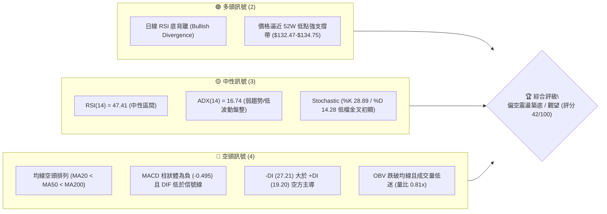
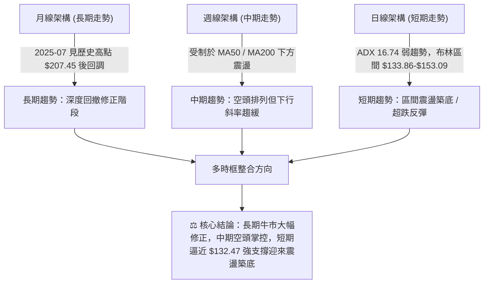
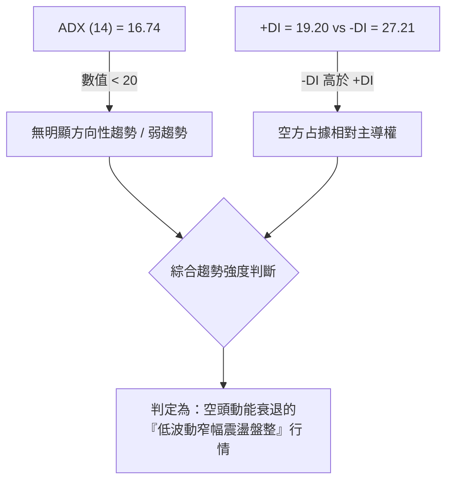
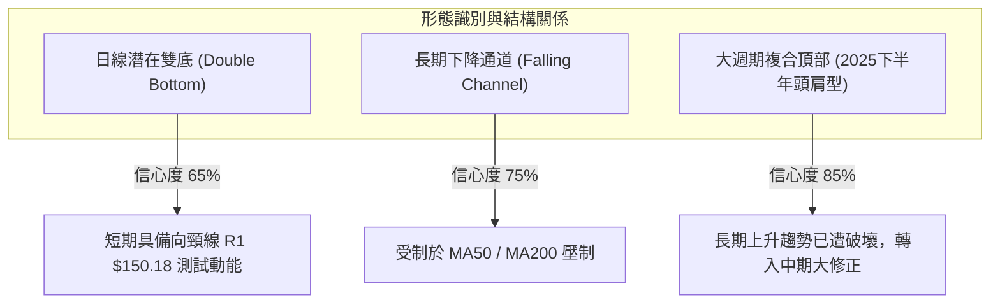
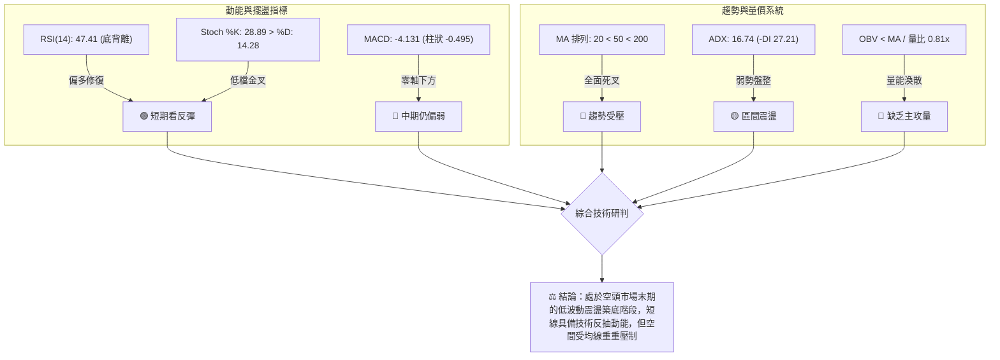
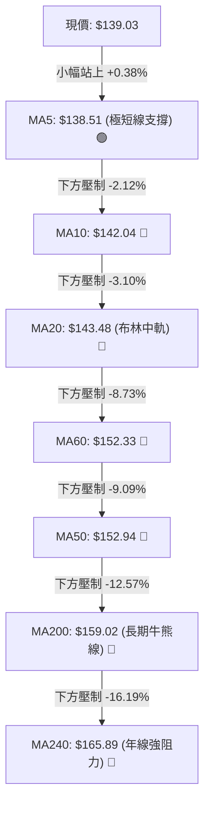
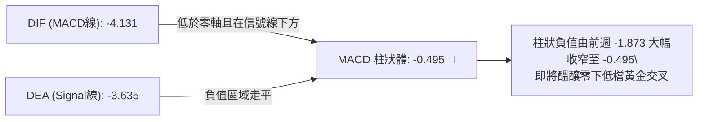
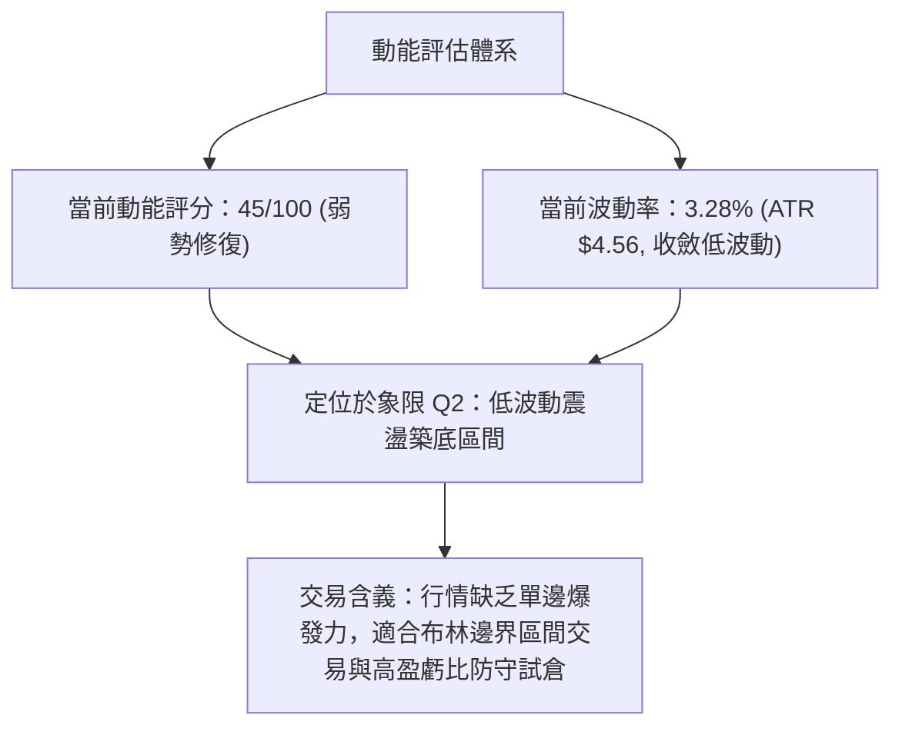
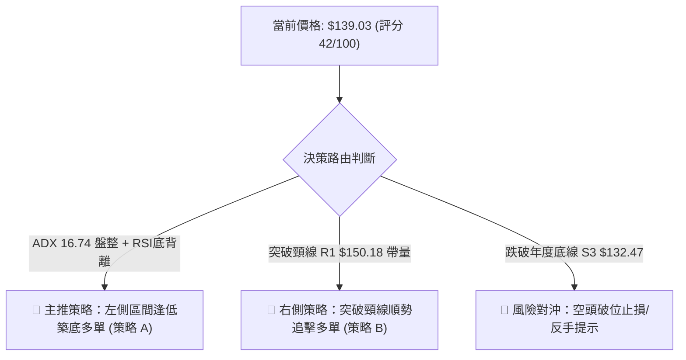
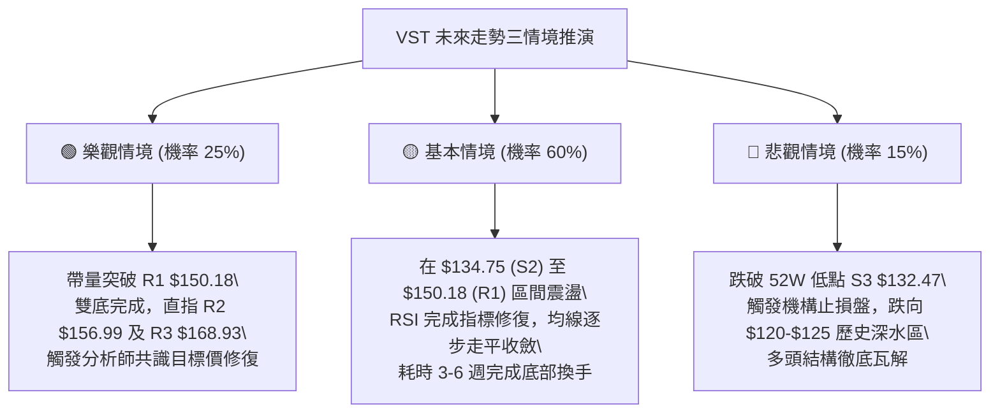

# VST 技術分析報告

> **報告日期**：2026-08-26 ｜ **語言**：繁體中文 ｜ **數據來源**：Yahoo Finance ｜ **當前價格**：$139.03

---

## 目錄

| 章節 | 內容 |
|------|------|
| [1. 技術面概覽](#1-技術面概覽) | 訊號儀表板、核心指標、評分卡 |
| [2. 趨勢分析](#2-趨勢分析) | 多時框趨勢、長中短期走勢 |
| [3. 圖表形態分析](#3-圖表形態分析) | 形態識別、K線組合、目標價 |
| [4. 支撐與阻力](#4-支撐與阻力) | 關鍵價位、斐波那契回調 |
| [5. 技術指標深度解讀](#5-技術指標深度解讀) | MA/RSI/MACD/布林/成交量 |
| [6. 動能與波動率](#6-動能與波動率) | 動能評估、ATR、Beta |
| [7. 多時框架總結](#7-多時框架總結) | 時框架評分矩陣 |
| [8. 交易策略建議](#8-交易策略建議) | 多空策略、風險報酬比 |
| [9. 風險提示與監控](#9-風險提示與監控) | 監控指標、風險場景 |

---

## 1. 技術面概覽

### 🎯 技術訊號儀表板



### 📊 核心指標速覽表

| 指標類別 | 指標名稱 | 當前數值 | 訊號 | 解讀 |
|----------|----------|----------|------|------|
| **價格** | 當前價格 | $139.03 | 🔴 | 位於 52 週區間底部 7.6%，呈現長期回調探底格局 |
| **均線** | MA20 | $143.48 | 🔴 | 現價位於 MA20 下方 -3.10%，短期受制於布林中軌壓制 |
| **均線** | MA50 | $152.94 | 🔴 | 現價位於 MA50 下方 -9.09%，中期空頭壓制明確 |
| **均線** | MA200 | $159.02 | 🔴 | 現價位於 MA200 下方 -12.57%，長期多空分水嶺失守 |
| **動能** | RSI(14) | 47.41 | 🟡 | 位於中性區間，但日線形成明顯底背離，下行動能減弱 |
| **動能** | MACD | -4.131 (Signal: -3.635) | 🔴 | 處於零軸下方深度負值區，MACD 柱 -0.495 空方仍占優 |
| **動能** | Stoch %K/%D | %K: 28.89 / %D: 14.28 | 🟢 | 自超賣區金叉向上，短線具備超跌反彈動能 |
| **趨勢** | ADX(14) | 16.74 (-DI 27.21) | 🟡 | ADX < 25 表明趨勢動能衰竭，空方趨勢進入低波動盤整 |
| **波動** | ATR(14) | $4.56 (3.28%) | 🟡 | 日內波動幅度適中，盤整壓縮特徵顯著 |
| **通道** | 布林通道 | %B = 0.27 ($133.86-$153.09) | 🟡 | 價格運行於下軌與中軌之間，偏向中軌進行技術修復 |
| **量能** | 20日成交量比 | 0.81x (3.89M vs 4.80M) | 🔴 | 量能萎縮，OBV < MA，反彈缺乏機構資金主動推升 |

### 🏆 技術評分卡

```
╔══════════════════════════════════════════════════════════════════╗
║                   技術評分卡 — VST (2026-08-26)                  ║
╠══════════════════════════════════════════════════════════════════╣
║ 趨勢強度 (Trend)      ████░░░░░░░░░░░░░░░░  25/100  🔴 空頭壓制  ║
║ 動能指標 (Momentum)   ██████████░░░░░░░░░░  50/100  🟡 底背離初顯║
║ 支撐穩定度 (Support)  ██████████████░░░░░░  70/100  🟢 臨近52W底 ║
║ 成交量配合 (Volume)   ██████░░░░░░░░░░░░░░  30/100  🔴 量能萎縮  ║
║ 形態完整度 (Pattern)  ████████░░░░░░░░░░░░  40/100  🟡 潛在雙底  ║
║ 均線排列 (MA System)  ████░░░░░░░░░░░░░░░░  20/100  🔴 完全空頭  ║
╠══════════════════════════════════════════════════════════════════╣
║ 綜合技術評分          ████████░░░░░░░░░░░░  42/100  ⚖️ 偏空震盪   ║
╚══════════════════════════════════════════════════════════════════╝
```

---

## 2. 趨勢分析

### 🌐 多時框趨勢分析



### 📈 長期趨勢 — 12個月走勢圖（Unicode）

```
VST 月線走勢圖（過去12個月：2025-08 至 2026-08）
價格軸 ($)
$200 ┤  ● (09月: 195.11)
$190 ┤● (08月: 188.12)  ● (10月: 187.52)
$180 ┤                    ● (11月: 178.12)
$170 ┤                                        ● (02月: 173.41)
$160 ┤                              ● (12月)        ● (05月: 160.01) ● (06月: 158.63)
$150 ┤                                  ● (01月)        ● (03月) ● (04月)    ● (07月: 148.19)
$140 ┤                                                                           ● (08月: 139.03) ◄現價
$130 ┤                                                                               
     └───────────────────────────────────────────────────────────────────────────
        08    09    10    11    12    01    02    03    04    05    06    07    08 (月份)
      [ 2025 年高檔做頂 ] ──► [ 2025年底跌破 ] ──► [ 2026年上半年反彈不過 ] ──► [ 近期二次探底 ]
```

**走勢特徵分析表格**：

| 階段 | 涵蓋月份 | 起始至結束價 | 漲跌幅 | 核心技術特徵 |
|------|----------|--------------|--------|--------------|
| **高位做頂期** | 2025-08 ~ 2025-10 | $188.12 → $187.52 | -0.32% | 在 $190-$200 形成雙頂/複合頂，無法刷新 2025-07 歷史高點 $207.45 |
| **首波破位下殺** | 2025-10 ~ 2026-01 | $187.52 → $157.91 | -15.79% | 連續跌破月線 MA，獲利了結賣壓湧現，確立中期下行趨勢 |
| **中繼反彈衰竭** | 2026-01 ~ 2026-02 | $157.91 → $173.41 | +9.82% | 跌深反彈測試上方頸線壓力失敗，留下明顯波段高點 |
| **震盪收斂盤跌** | 2026-02 ~ 2026-06 | $173.41 → $158.63 | -8.52% | 價格在 $150-$160 區間反覆窄幅震盪，均線陸續轉為空頭排列 |
| **加速探底期** | 2026-06 ~ 2026-08 | $158.63 → $139.03 | -12.36% | 連續跌破多道中期均線，逼近 52 週低點 $132.47，出現量縮背離 |

### 📊 中期趨勢（週線分析）

中期走勢呈現標準的階梯式下行通道，近 20 週高點逐步下移（Lower Highs）與低點下移（Lower Lows）。

```
中期壓力與支撐結構示意圖 (週線層級)
$170 ┤                                [2026-02 高點: $173.41]
$165 ┤           ▲ 04/26 ($164.12)       ▲ 06/28 ($163.49)
$160 ┤       ▲───┴───────────────────────┴───▲ 07/26 ($163.38) ───► 中期強阻力區 (MA200: $159.02)
$155 ┤      /                                   \
$150 ┤─────/─────────────────────────────────────\─────▲ 08/16 ($148.13) ──► 頸線阻力 R1: $150.18
$145 ┤    /                                       \     /
$140 ┤   /       ▼ 05/17 ($139.48)                 \   / ◄ 現價: $139.03
$135 ┤──/────────┴──────────────────────────────────▼─/ 08/23 ($136.21) ──► 關鍵支撐 S1: $137.93 / S2: $134.75
$130 ┤───────────────────────────────────────────────────────────────► 52W 底線 S3: $132.47
```

- **週線動能解讀**：2026-08-23 週收盤 $136.21 創近期新低，但 RSI 週線數值為 26.1（超賣區），隨後最新一週回升至 $139.03（RSI 回升至 47.4），週 MACD 柱狀圖虧損由 -1.873 收窄至 -0.495，顯示空頭下殺動能已顯著衰減。

### ⚡ 趨勢強度評估（ADX 解讀）



| 指標 | 數值 | 參考閾值 | 解讀與含義 |
|------|------|----------|------------|
| **ADX (14)** | **16.74** | < 20: 弱趨勢 / 盤整<br>20-25: 趨勢萌芽<br>> 25: 強趨勢 | 趨勢動能極度疲弱，表明前期的單邊下跌已進入停滯盤整期，不宜盲目追空。 |
| **+DI (14)** | **19.20** | 數值越高多頭越強 | 多方力量依舊處於防守態勢，尚未形成主動進攻結構。 |
| **-DI (14)** | **27.21** | 數值越高空頭越強 | 空方仍具備優勢，但因 ADX 走低，空方缺乏持續打壓價格的爆發力。 |
| **走勢型態定義** | **盤整築底** | 依據收斂規則 (ADX < 25) | 行情定性為日線布林區間震盪，操作應以區間高拋低吸與邊界防守為主。 |

---

## 3. 圖表形態分析

### 🔍 形態識別系統



**形態信心度評估表**：

| 形態名稱 | 信心度 | 判斷依據（引用數據） | 完成度 | 目標價（附計算式） |
|----------|--------|----------------------|--------|--------------------|
| **日線潛在雙底** | 65% | 第一次低點 2026-05-17 收 $139.48，第二次低點 2026-08-23 收 $136.21（於支撐 S1 $137.93 / S2 $134.75 獲支撐），且 RSI 形成日線底背離 | 60% (尚未突破頸線) | 頸線阻力 R1 ($150.18) + 形態高度 ($150.18 - $134.75 = $15.43) = **$165.61** (接近斐波那契 61.8% 回調位 $165.49) |
| **中期下降通道** | 75% | 高點由 04/26 ($164.12)、06/28 ($163.49)、07/26 ($163.38) 連續下壓；低點由 05/17 ($139.48) 下移至 08/23 ($136.21) | 85% | 通道下軌支撐於 S3 ($132.47)，通道上軌阻力於 R2 ($156.99) |
| **均線死叉排列** | 90% | MA20 ($143.48) < MA50 ($152.94) < MA200 ($159.02) 空頭完全發散 | 100% | 指標型解讀：中期上方均線密集壓制區間為 $152.94 - $159.02 |

### 🕯️ 重要K線形態分析

| 月份 / 週別 | 收盤價 | K線形態 | 解讀 | 訊號 |
|-------------|--------|---------|------|------|
| **2026-05-17 (週)** | $139.48 | 長下影大陰破位 (RSI 25.5) | 極度超賣引發空頭回補，隨後快速彈升至 $160.01 | 🟡 跌深反彈訊號 |
| **2026-07-26 (週)** | $163.38 | 上影線墓碑反轉 | 測試 MA200 與波段壓力不過，多頭動能衰竭 | 🔴 波段見頂回落 |
| **2026-08-23 (週)** | $136.21 | 下影線鎚頭測試低點 | 探底 $136.21 獲得 S2 ($134.75) 支撐，未破前低 $132.47 | 🟢 潛在止跌轉折 |
| **2026-08-30 (當前)**| $139.03 | 小陽線回升突破 MA5 | 站回 MA5 ($138.51)，RSI 回升至 47.41，底背離確認 | 🟢 短線築底修復 |

### 📉 ASCII 走勢形態示意圖

```
VST 日線/週線級別「潛在雙底」形態示意圖
═══════════════════════════════════════════════════════════════════
$165 ┤                                                  [目標價2: $165.49]
$160 ┤               [反彈波頂 $160.01 / $163.38]
$155 ┤                     ╭───╮
$150 ┤─────────────────────╯   ╰─────────────────────────► [頸線阻力 R1: $150.18]
$145 ┤                    頸線位置
$140 ┤        ╭──╮                        ╭──► 現價 $139.03
$135 ┤────────╯  ╰───────► 左底           ╰──────────────► 潛在右底
     │               ($139.48)                    ($136.21)
$130 ┤────────────────────────────────────────────────────────► 52W極限支撐 S3: $132.47
     └─────────────────────────────────────────────────────────────
             2026-05                      2026-08
═══════════════════════════════════════════════════════════════════
```

### 🎯 形態目標價計算

若「日線雙底形態」獲得有效確認（以實體日 K 帶量突破頸線 R1 $150.18 為準）：
1. **形態底部基準點**：取雙底低點聚類 S2 = **$134.75**
2. **頸線阻力位**：取近一年波段反彈頸線 R1 = **$150.18**
3. **形態垂直高度**：$150.18 - $134.75 = **$15.43**
4. **理論目標價 1 (1:1 測幅)**：$150.18 + $15.43 = **$165.61**（高度重合斐波那契 61.8% 之 **$165.49** 及 R3 之 **$168.93**）
5. **第一中繼目標價 (T1)**：取波段阻力 R2 = **$156.99**（重合 MA200 之 $159.02）

---

## 4. 支撐與阻力

### 🗺️ 關鍵價位分布圖（Unicode）

```
VST 價位結構分布圖
═══════════════════════════════════════════════════════════════════
$168.93 ║████████████████████████████████████║ 強阻力 R3 (波段高點/斐波61.8%)
$159.02 ║██████████████████████████          ║ MA200 生命線壓制
$156.99 ║████████████████████████            ║ 阻力 R2 (反彈高點聚類)
$150.18 ║████████████████████████████████    ║ 關鍵頸線阻力 R1 (布林上軌$153)
$143.48 ║▓▓▓▓▓▓▓▓▓▓▓▓▓▓▓▓▓▓                  ║ 布林中軌 / MA20 短壓
$139.03 ╠════════════════════════════════════╣ ◄ 現價 $139.03 (BB %B: 0.27)
$137.93 ║▓▓▓▓▓▓▓▓▓▓▓▓▓▓▓▓▓▓▓▓▓▓              ║ 近期支撐 S1 (-0.79%)
$134.75 ║████████████████████████████        ║ 強支撐 S2 (波段低點聚類)
$132.47 ║████████████████████████████████████║ 52週極限支撐 S3 (斐波100.0%)
═══════════════════════════════════════════════════════════════════
```

### 🚧 阻力位分析表

| 阻力級別 | 價位 | 形成原因 | 突破難度 | 重要性 |
|----------|------|----------|----------|--------|
| **R1 (關鍵頸線)** | **$150.18** | 近一年波段反彈多次受阻高點聚類，疊加 MA50 ($152.94) 與布林上軌 ($153.09) | 🟡 中等 (需日成交量 > 500萬股配合) | ★★★★☆ |
| **R2 (波段強壓)** | **$156.99** | 近期反彈波段高點聚類，上方緊鄰 MA200 ($159.02) 長期多空分水嶺 | 🔴 困難 (機構套牢盤解套拋壓區) | ★★★★★ |
| **R3 (趨勢反轉)** | **$168.93** | 2026 年初反彈頂部區間聚類，斐波那契 61.8% 回調位 ($165.49) 上方阻力 | 🔴 極難 (需基本面與量能全面逆轉) | ★★★☆☆ |

### 🛡️ 支撐位分析表

| 支撐級別 | 價位 | 形成原因 | 守住機率 | 重要性 |
|----------|------|----------|----------|--------|
| **S1 (短期防線)** | **$137.93** | 近一年短期回調低點聚類，下方緊鄰 MA5 ($138.51) | 🟡 65% (短線多空爭奪中樞) | ★★★☆☆ |
| **S2 (波段底線)** | **$134.75** | 波段低點密集群，布林下軌 ($133.86) 與 8 月下探低點守穩區 | 🟢 80% (具備強烈技術面買盤支撐) | ★★★★☆ |
| **S3 (年度鐵底)** | **$132.47** | 52 週最低價 (52W Low)，斐波那契 100.0% 終極支撐位 | 🟢 90% (失守將引發結構性多殺多) | ★★★★★ |

### 📐 斐波那契回調位分析

依據 52 週區間波段（52W High **$218.91** → 52W Low **$132.47**，總垂直落差 **$86.44**）計算之精確回調位分布如下：

```
斐波那契回調層級分布 ($132.47 → $218.91)
0.0%  (52W High)  ─────────────────────────────────────────────── $218.91
23.6% 回調位      ─────────────────────────────────────────────── $198.51
38.2% 回調位      ─────────────────────────────────────────────── $185.89
50.0% 中樞平衡位  ─────────────────────────────────────────────── $175.69
61.8% 黃金分割位  ─────────────────────────────────────────────── $165.49
78.6% 深度回調位  ─────────────────────────────────────────────── $150.97 (緊鄰阻力 R1: $150.18)
100.0%(52W Low)   ─────────────────────────────────────────────── $132.47 (終極支撐 S3)
                  ▲ 現價 $139.03 處於 78.6% ($150.97) 至 100.0% ($132.47) 極深回調區
```

- **位置解讀**：當前價格 $139.03 處於斐波那契 **78.6% ($150.97)** 與 **100.0% ($132.47)** 之間的極深回撤區間。
- **技術意涵**：在 78.6% 之下運行代表此輪由 $218.91 發起的回調已消化絕大部分多頭獲利盤，目前價格極度貼近 100.0% 終極支撐 $132.47（距離僅 -4.72%）。此區域通常為中長線價值投資者與量化模型建立防守性試倉的「高賠率低風險」安全邊際帶。

---

## 5. 技術指標深度解讀

### 🎛️ 指標訊號總覽



### 📈 移動平均線排列分析



- **均線系統解讀**：目前各週期均線呈現嚴格的空頭排列（MA20 < MA50 < MA200），且長期年線 MA240 高達 $165.89。現價除短線勉強收復 MA5 ($138.51) 外，上方受到 MA10、MA20、MA50、MA200 的層層下壓。
- **均線乖離率 (BIAS)**：
  - MA20 乖離率 = -3.10%
  - MA50 乖離率 = -9.09%
  - MA200 乖離率 = -12.57%
  - 負乖離率目前處於修復階段，但在突破 MA20 ($143.48) 之前，均線系統難以提供持續的多頭推動力。

### 📉 RSI(14) 分析

```
RSI(14) 數值儀表盤: 47.41 (中性回升區)
[0] ─────────── [30 超賣] ─────── [47.41 現值] ─────────── [70 超買] ─────────── [100]
░░░░░░░░░░░░░░░░░░░░░░░░░ █████████████░░░░░░░░░░░░░░░░░░░░░░░░░░░░░░░░░░░░░░░░░
```

- **背離判斷 (Divergence)**：⚠️ **明確日線底背離 (Bullish Divergence)**。
  - **價格走勢**：2026-05-17 低點 $139.48 下跌至 2026-08-23 低點 $136.21（價格創新低）。
  - **RSI 走勢**：2026-05-17 之 RSI(14) 為 25.5，而 2026-08-23 之 RSI(14) 為 26.1，隨後迅速拉升至當前 47.41（RSI 低點未創新低反而抬高）。
  - **技術含義**：空頭下殺力道衰竭，量化動能模型顯示短期出現強烈的反彈修復訴求。

### 📊 MACD(12/26/9) 訊號解讀



- **MACD 狀態解讀**：MACD 線 (-4.131) 與信號線 (-3.635) 均位於零軸下方深度負值區，顯示中期空頭仍掌握定價權。但負柱狀體由 08-09 週的 -1.873 持續收斂至當前 -0.495，顯示空方動能正在快速退潮，一旦 DIF 上穿 DEA 形成低檔金叉，將確立週線級別反彈。

### 📦 布林通道分析

```
VST 布林通道 (20, 2) 結構圖
═══════════════════════════════════════════════════════════════════
$153.09 ┬  ─────────────────────────────────────────── BB 上軌 (+10.11%)
        │
$143.48 ┼  - - - - - - - - - - - - - - - - - - - - - - BB 中軌 (MA20: +3.20%)
        │                             ▲
$139.03 ┼─────────────────────────────┼─────────────── 現價 (%B = 0.27)
        │                             │ (偏向下軌向中軌反彈)
$133.86 ┴  ───────────────────────────┴─────────────── BB 下軌 (-3.72%)
═══════════════════════════════════════════════════════════════════
```

- **帶寬與位置**：通道上軌 $153.09，中軌 $143.48，下軌 $133.86。帶寬 (Bandwidth) 為 13.4%，處於收斂狀態。
- **%B 指標**：當前 **%B = 0.27**（0 代表下軌，0.5 代表中軌，1 代表上軌），表示價格脫離極端超賣區（下軌 $133.86），正朝著布林中軌 **$143.48** 進行均值回歸。

### 💹 成交量分析（量價配合度）

- **當前量能數據**：最新日成交量 **3,891,681 股**，20 日均量 **4,796,554 股**，量比僅 **0.81x**。
- **OBV 能量潮狀態**：OBV 線持續低於其移動平均線（OBV < MA），呈現量能疲弱走勢。
- **量價關係判斷**：
  - 在價格探底 $136.21 過程中，週成交量由 5 月份的 3,200 萬股萎縮至當前約 900 萬至 1,600 萬股，顯示**殺跌無量**。
  - 然而反彈回升至 $139.03 時亦未見主動性買盤爆量（量比 0.81x），屬於典型的「縮量弱勢反彈」，反彈高度易受制於頸線阻力 R1 $150.18。

---

## 6. 動能與波動率

### ⚡ 動能評估四象限

| 象限 | 動能強度 | 波動率水準 | 當前歸屬 | 策略與特徵解讀 |
|------|----------|------------|----------|----------------|
| **Q1 (爆發推進)** | 強動能 (RSI>60, ADX>25) | 低波動 (ATR<2.5%) | — | 最理想的單邊趨勢突破行情 |
| **Q2 (震盪築底)** | 弱動能 (RSI: 47.41, ADX: 16.74) | 低波動 (ATR: 3.28%) | **✓ VST 當前位置** | **低動能低波動盤整，處於底部蓄勢，宜逢低分批布局高拋低吸** |
| **Q3 (極端博弈)** | 強動能 (超買/超賣單邊) | 高波動 (ATR>5.0%) | — | 主升浪或恐慌崩跌，高風險高收益 |
| **Q4 (非理性釋放)**| 弱動能 (動能衰竭) | 高波動 (破位殺跌) | — | 恐慌拋售初期，流動性擠壓，應嚴格避免進場 |



### 📊 ATR 波動率分析

- **ATR(14) 當前數值**：**$4.56**（佔當前股價之 **3.28%**）。
- **波動特徵解讀**：ATR 數值處於過去一年回調過程中的相對低位，反映出單日價格波幅收窄，市場多空博弈進入冷卻期。
- **止損與倉位設定依據**：
  - **日內正常波動緩衝**：1.0 × ATR = **$4.56**
  - **波段交易安全止損距離**：1.5 × ATR = **$6.84**（自現價 $139.03 向下測算止損為 $132.19，完美覆蓋 52W 低點 S3 $132.47）
  - **寬鬆趨勢防守距離**：2.0 × ATR = **$9.12**

### 📐 Beta 與市場相關性

- **Beta 係數**：**1.433**（高彈性公用事業/獨立發電商特徵）。
- **市場特徵解讀**：雖然 VST 屬於公用事業板塊（Independent Power Producers），但其 Beta 高達 1.433，顯示其股價波動對大盤標普 500 指數（S&P 500）及電力市場定價極度敏感。
- **機構持股與空頭結構**：
  - **機構持股比例**：高達 **92.1%**，籌碼主要集中於機構手中，流動性充裕。
  - **做空比例 (Short % Float)**：僅 **3.0%**（Short Ratio: 2.11），表明市場目前並無大量惡意做空力量，近期的下跌主要為多頭獲利了結與機構調倉所致。

---

## 7. 多時框架總結

### 📋 時框架評分表

| 時框架 | 趨勢方向 | 動能狀態 | 均線排列 | 形態結構 | 綜合評分 | 建議方向 |
|--------|----------|----------|----------|----------|----------|----------|
| **月線 (長期)** | 🔴 回調修正 | 🟡 跌勢趨緩 | 🟡 測試年線支撐 | 長期大頂後深度回撤 | **45/100** | 長線價值分批吸納 |
| **週線 (中期)** | 🔴 空頭通道 | 🟡 柱狀收斂 | 🔴 空頭排列 (MA<200) | 階梯下行，測試 52W 底 | **38/100** | 逢反彈減碼防守 |
| **日線 (短期)** | 🟡 窄幅震盪 | 🟢 RSI底背離/低檔金叉 | 🔴 承壓 MA20 下方 | 潛在雙底 / 布林下軌回升 | **52/100** | 區間低吸短線做多 |

### 🔲 綜合訊號矩陣

```
時框訊號一致性矩陣
═══════════════════════════════════════════════════════════════════
維度 / 時框        日線 (短期)        週線 (中期)        月線 (長期)
───────────────────────────────────────────────────────────────────
趨勢方向           🟡 震盪築底        🔴 空頭下行        🔴 深度回撤
均線系統           🔴 MA5金叉/其餘空   🔴 完全空頭排列    🟡 長期均線支撐
動能指標 (RSI)     🟢 底背離 (47.41)   🟡 脫離超賣 (47.4) 🟡 中性格局
量能系統 (OBV)     🔴 縮量反彈        🔴 萎縮整理        🟢 長期籌碼鎖定
布林位置           🟢 自下軌反彈      🔴 處於中軌下方    🟡 接近下軌帶
═══════════════════════════════════════════════════════════════════
時框共振評估：日線出現超跌反彈共振，但中期與長期仍受壓於均線系統，屬於「逆中期趨勢的短線修復」。
```

### ⚖️ 多時框收斂結論

> **依據多時框收斂規則（嚴格要求 14）**：
> 1. **趨勢強度定性**：當前 ADX(14) = **16.74 (< 25)**，明確判定當前市場處於**「弱趨勢 / 盤整行情」**。
> 2. **主導時框裁決**：在盤整行情中，中長期單邊趨勢權重下降，**日線布林通道上下軌（$133.86 - $153.09）與關鍵支撐阻力區間成為主導交易框架**。
> 3. **最終收斂方向**：**【中性偏多區間震盪（以 $134.75 支撐為防守，看反彈測試 R1 $150.18）】**。
>
> 雖然週線均線呈現空頭排列，但日線 RSI 底背離、Stochastic 低檔金叉，疊加價格已打入 52 週低點極限支撐帶（S2 $134.75 / S3 $132.47），追空盈虧比極差；因此策略優先級收斂為：**在支撐位上方執行區間反彈多頭操作，遇阻力位再行獲利了結**。

---

## 8. 交易策略建議

### 🗺️ 策略決策流程圖



### 🧭 策略路由（依評分卡分流）

**當前主策略方向 = 【中性偏多 — 區間反彈多頭策略】（依評分 42/100，處於 40–60 區間震盪帶，主打布林邊界與支撐位反彈）**

### 🎯 價格情境階梯（Price Scenarios）

| 觸發條件 | 下一目標 | 後續延伸 | 情境含義 |
|----------|----------|----------|----------|
| **強勢突破 R1 ($150.18)** | **R2 ($156.99)** | **R3 ($168.93)** | 雙底形態確立，短期反轉為中期多頭上攻 |
| **突破布林中軌 ($143.48)** | **R1 ($150.18)** | **R2 ($156.99)** | 技術性均值回歸，短線多頭掌控節奏 |
| **站穩現價區間 ($137.93-$139.03)** | **MA20 ($143.48)** | **R1 ($150.18)** | 區間窄幅震盪築底，指標逐步修復 |
| **跌破近期支撐 S1 ($137.93)** | **S2 ($134.75)** | **S3 ($132.47)** | 弱勢下探，考驗 52 週極限底部買盤 |
| **有效跌破 S3 ($132.47)** | **下行空間開啟** | — | 中期形態徹底破位，觸發結構性止損賣壓 |

### 📊 情境機率分佈

| 情境 | 機率 | 主要依據 |
|------|------|----------|
| **區間震盪反彈 (測試 $143.48-$150.18)** | **55%** | 日線 RSI 底背離確立、Stoch 低檔金叉、ADX 16.74 顯示空方動能衰竭、布林 %B 自低檔回升 |
| **窄幅橫盤整理 ($134.75-$143.48)** | **30%** | 20日成交量萎縮 (量比 0.81x)、OBV 仍弱、上方 MA20/MA50 均線壓制明顯 |
| **破位再探底 (跌破 $132.47)** | **15%** | 均線系統完全空頭排列、-DI 仍高於 +DI、整體大盤系統性風險衝擊 |

### 🟢 主策略詳情（區間與突破雙策略）

| 策略要素 | 策略 A：左側區間築底多單 (主推) | 策略 B：右側突破頸線追擊 (次選) |
|----------|---------------------------------|---------------------------------|
| **交易邏輯** | 依託 52W 底部支撐 S2/S3，博弈 RSI 底背離之均值回歸反彈 | 待日 K 線實體放量突破頸線 R1，確認雙底反轉成立 |
| **進場條件** | 現價 $139.03 直接建立底倉，或回踩 S1 $137.93 分批加碼 | 實體日 K 突破 $150.18 且當日成交量 > 500 萬股 |
| **進場價格** | **$139.03** (回踩 **$137.93** 加碼) | **$150.97** (斐波 78.6% 回調位確認站穩) |
| **目標價 T1** | **$150.18** (頸線阻力 R1，預期收益 +8.02%) | **$156.99** (波段阻力 R2，預期收益 +3.99%) |
| **目標價 T2** | **$156.99** (波段阻力 R2，預期收益 +12.92%) | **$165.49** (斐波 61.8% / 形態測幅，預期收益 +9.62%) |
| **止損價格** | **$132.47** (嚴格跌破 52W 低點 S3 離場，風險 -4.72%) | **$143.48** (跌回布林中軌 / 前頸線下方，風險 -4.96%) |
| **風險報酬比** | **2.74 : 1** (以目標 T2 計算) / **1.70 : 1** (以 T1 計算) | **1.94 : 1** (以目標 T2 計算) |
| **成功機率** | **65%** | **55%** |
| **建議倉位** | **15% - 20%** (分批建倉) | **10% - 15%** (突破追加) |

### 🔴 反向風險觸發點（對沖提示）

- **多頭防守底線**：若日收盤價跌破 **$132.47 (S3)**，必須無條件將所有多頭倉位止損出場。
- **空頭觸發條件**：若價格反彈至 **$150.18 (R1)** 或 **$156.99 (R2)** 遭遇長上影線（如流星線）且成交量無法放大，為逢高做空或多單獲利了結的對沖訊號。

### ⭐ 整體訊號強度評星

```
做多訊號強度：★★★☆☆  (3/5星 — 底背離支持，但受制於空頭均線)
做空訊號強度：★★☆☆☆  (2/5星 — 逼近52週強支撐，追空盈虧比低)
整體可信度：  ★★★★☆  (4/5星 — 支撐阻力結構清晰，斐波那契點位高度重合)
```

---

## 9. 風險提示與監控

### ✅ 關鍵監控指標 Checklist

```
╔══════════════════════════════════════════════════════════════════╗
║                     關鍵技術監控指標 CHECKLIST                   ║
╠══════════════════════════════════════════════════════════════════╣
║ [ ] 價格是否守穩支撐 S1 ($137.93) 與 S2 ($134.75)                 ║
║ [ ] 日線 RSI(14) 是否持續維持在 40 以上並維持底背離結構          ║
║ [ ] MACD 柱狀圖是否在零下實現黃金交叉 (DIF 上穿 DEA)             ║
║ [ ] 日成交量是否放大至 20 日均量 (480 萬股) 以上                 ║
║ [ ] 向上測試布林中軌 ($143.48) 與阻力 R1 ($150.18) 時的量價反應  ║
║ [ ] 終極防守線：52 週低點 S3 ($132.47) 是否完好無損              ║
╚══════════════════════════════════════════════════════════════════╝
```

### ⚠️ 風險場景分析



### 🛡️ 風險管理重要提醒

1. **嚴禁在均線空頭排列下重倉下注**：儘管 RSI 底背離提供反彈契機，但在價格有效站上 MA50 ($152.94) 之前，整體趨勢仍屬逆勢反彈，總倉位應嚴格控制在 **20% 以內**。
2. **ATR 動態風控**：以當前 ATR $4.56 計算，日內價格上下波動 3% 屬正常市場噪聲，止損點不可設得過窄（必須置於 S3 $132.47 之外）。
3. **基本面與分析師預期差**：目前 19 位華爾街分析師平均目標價高達 **$217.84**（共識評級為 Strong Buy），現價 $139.03 存在顯著折價。然而技術面落後於基本面，切勿僅因目標價高而忽略跌破 $132.47 帶來的技術面破位風險。

---

## 📋 報告總結

```
╔══════════════════════════════════════════════════════════════════╗
║                     VST 技術分析報告總結                         ║
╠══════════════════════════════════════════════════════════════════╣
║ 報告日期：2026-08-26                                            ║
║ 當前價格：$139.03                                                ║
║ 技術評級：⚖️ 偏空震盪築底 / 區間短多操作 (評分 42/100)            ║
╠══════════════════════════════════════════════════════════════════╣
║ 關鍵結論：                                                       ║
║ ├─ 長期趨勢：🔴 自歷史高點回調，目前處於 52 週底部極深回撤區間  ║
║ ├─ 中期趨勢：🔴 均線空頭排列，但週線下殺動能已顯著衰退          ║
║ ├─ 短期趨勢：🟢 日線 RSI 底背離確立，逼近強支撐，短線看反彈     ║
║ ├─ 關鍵支撐：S1: $137.93 ｜ S2: $134.75 ｜ S3: $132.47 (52W底)  ║
║ ├─ 關鍵阻力：R1: $150.18 ｜ R2: $156.99 ｜ R3: $168.93          ║
║ └─ 分析師目標：$217.84 (Mean) ｜ 評級：Strong Buy               ║
╠══════════════════════════════════════════════════════════════════╣
║ 最優策略組合：                                                   ║
║ 1. 🥇 最佳機會：於現價 $139.03 分批建立反彈多單，以 $132.47 為止 ║
║    損，目標上看 $150.18 (R1) 及 $156.99 (R2) (風報比 2.74:1)。   ║
║ 2. 🥈 次選機會：等待日 K 放量突破頸線 $150.18 後右側追多，目標   ║
║    指向斐波那契 61.8% 回調位 $165.49。                          ║
║ 3. 🥉 保守選擇：空手觀望，等待日線 MA20 走平並站穩 $143.48 後再 ║
║    行進場。                                                      ║
╚══════════════════════════════════════════════════════════════════╝
```

---

> ⚠️ **免責聲明**：本報告為 AI 自動生成之技術分析，所有數據及估算均基於提供的歷史價格資訊。本報告**僅供研究與學術參考**，**不構成任何投資建議**。投資有風險，入市需謹慎。

---

*報告生成時間：2026-08-26 ｜ 數據來源：Yahoo Finance ｜ 分析框架：多時框技術分析*