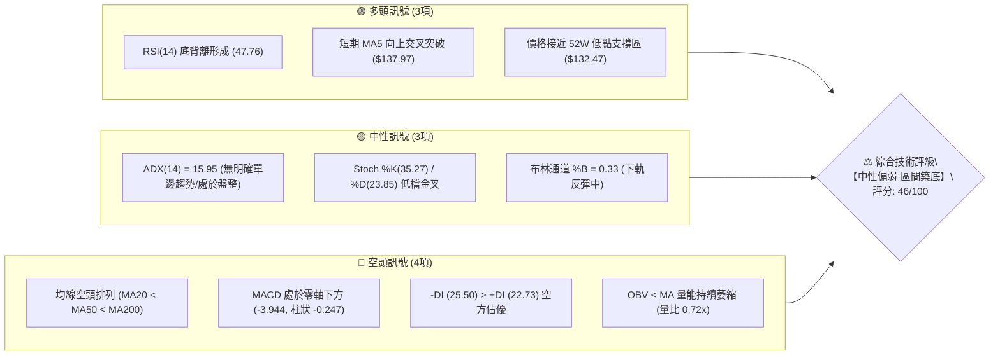
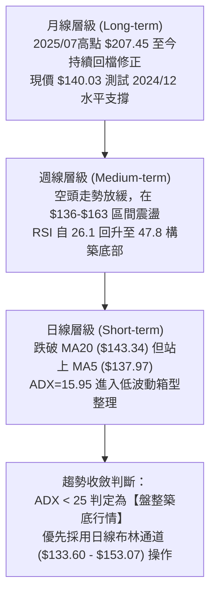
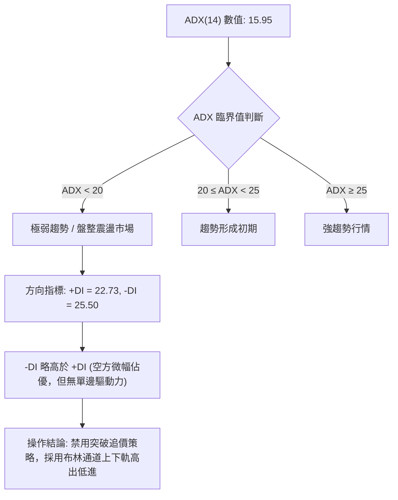
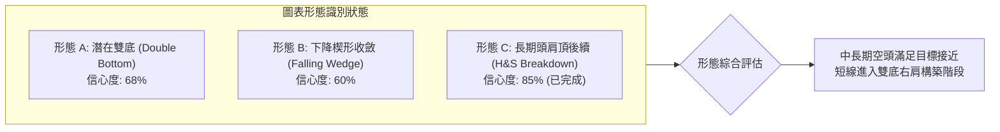
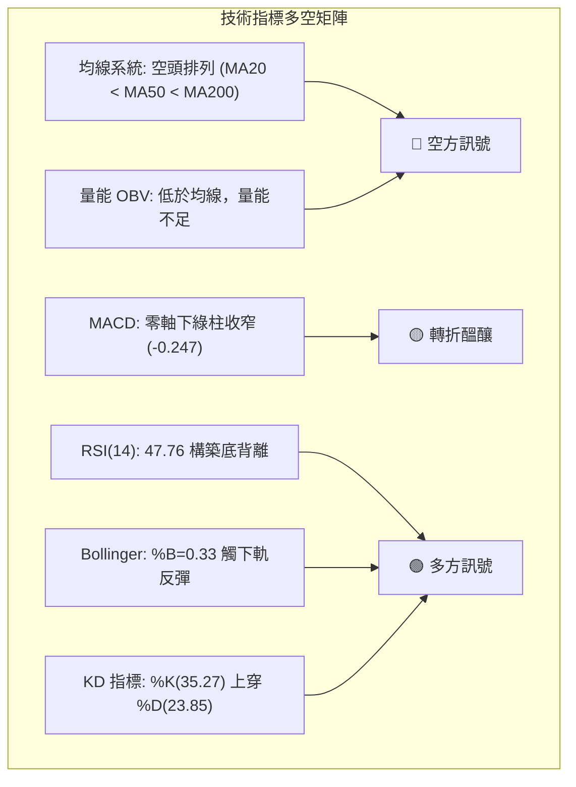
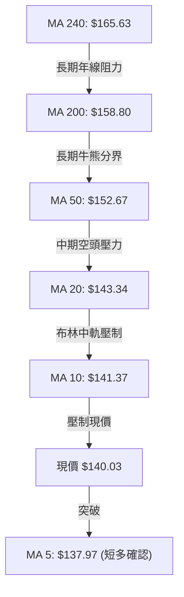
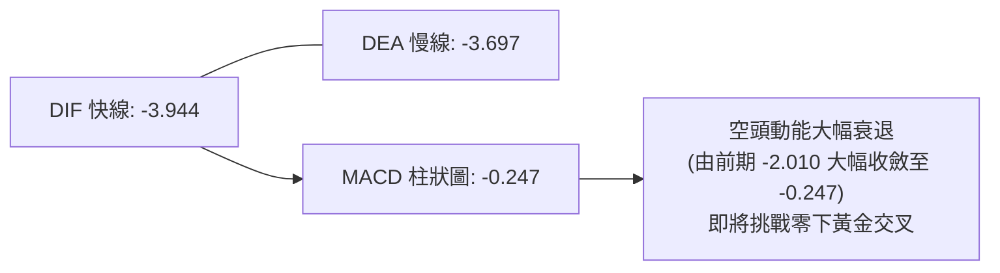
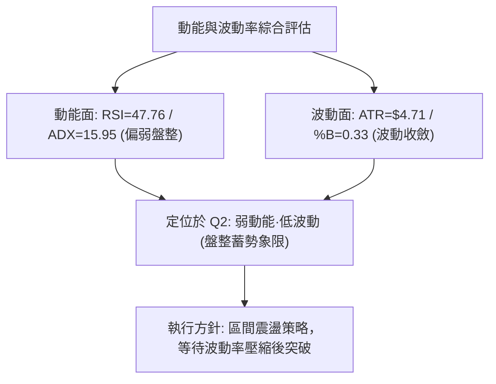
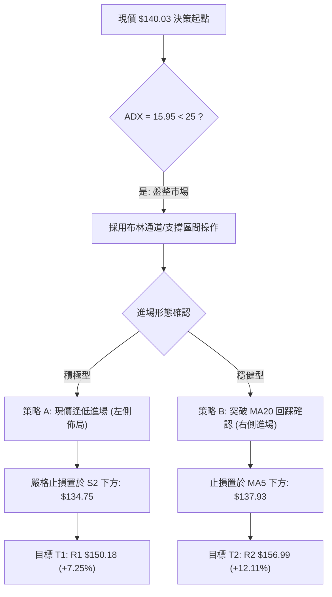
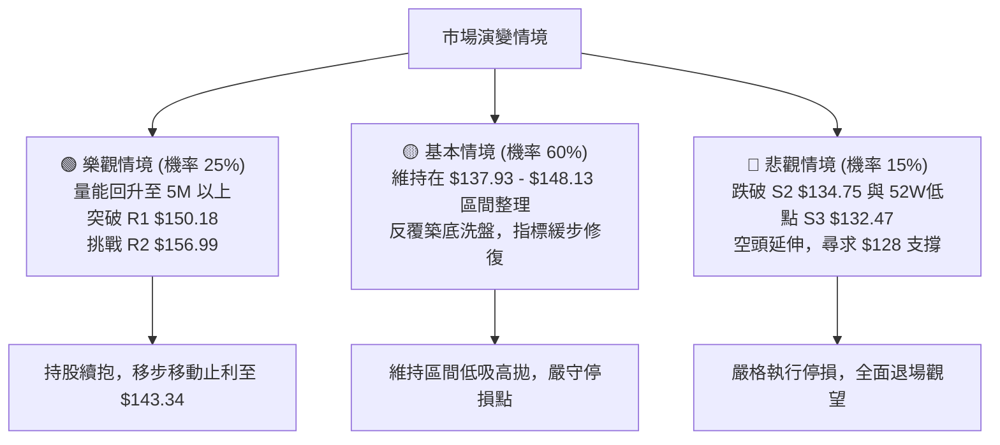

# VST 技術分析報告

> **報告日期**：2026-08-27 ｜ **語言**：繁體中文 ｜ **數據來源**：Yahoo Finance ｜ **當前價格**：$140.03

---

## 目錄

| 章節 | 內容 |
|------|------|
| [1. 技術面概覽](#1-技術面概覽) | 訊號儀表板、核心指標、評分卡 |
| [2. 趨勢分析](#2-趨勢分析) | 多時框趨勢、長中短期走勢、ADX解讀 |
| [3. 圖表形態分析](#3-圖表形態分析) | 形態識別、K線組合、形態信心度 |
| [4. 支撐與阻力](#4-支撐與阻力) | 關鍵價位分佈、斐波那契回調 |
| [5. 技術指標深度解讀](#5-技術指標深度解讀) | 均線、RSI背離、MACD、布林、成交量 |
| [6. 動能與波動率](#6-動能與波動率) | 動能評估、ATR 波動率、Beta 市場關聯 |
| [7. 多時框架總結](#7-多時框架總結) | 時框架評分矩陣與收斂結論 |
| [8. 交易策略建議](#8-交易策略建議) | 策略路由、主策略、情境階梯與風控 |
| [9. 風險提示與監控](#9-風險提示與監控) | 關鍵監控清單、情境模擬與風控原則 |
| [報告總結](#-報告總結) | 技術評級與執行摘要 |

---

## 1. 技術面概覽

### 🎯 技術訊號儀表板



### 📊 核心指標速覽表

| 指標類別 | 指標名稱 | 當前數值 | 訊號 | 解讀 |
|:---|:---|:---|:---:|:---|
| **價格** | 當前收盤價 | $140.03 | 🟡 | 位於52週區間 8.7% 分位，處於築底測試階段 |
| **短期均線** | MA5 / MA20 | $137.97 / $143.34 | 🟡 | 站上 MA5，但仍受制於 MA20 下行壓力 (-2.31%) |
| **中期均線** | MA50 / MA60 | $152.67 / $152.09 | 🔴 | 中期空頭壓制明顯，距現價有約 8% 空間 |
| **長期均線** | MA200 / MA240 | $158.80 / $165.63 | 🔴 | 價格低於長期年線，長期處於修正格局 |
| **動能指標** | RSI(14) | 47.76 | 🟢 | 中性區間，且日線與週線出現明確**底背離**訊號 |
| **趨勢指標** | MACD (12,26,9) | -3.944 / -3.697 | 🔴 | 柱狀圖為 -0.247，空頭動能衰退但尚未翻正 |
| **擺動指標** | KD (Stoch %K/%D) | 35.27 / 23.85 | 🟢 | %K 由超賣區向上穿越 %D，短線出現超賣反彈訊號 |
| **趨勢強度** | ADX (14) | 15.95 | 🟡 | ADX < 25 代表無顯著單邊趨勢，行情轉為箱型震盪 |
| **波動通道** | Bollinger Bands | $133.60 ~ $153.07 | 🟡 | %B = 0.33，位於下軌 ($133.60) 與中軌 ($143.34) 間 |
| **成交量能** | 20日均量比 | 0.72x (3.40M / 4.73M) | 🔴 | 成交量能不足，OBV < MA，反彈動能尚未獲量能確認 |
| **真實波幅** | ATR(14) | $4.71 (3.36%) | 🟡 | 每日平均波動幅度約 $4.71，波動度適中 |

### 🏆 技術評分卡

```
╔══════════════════════════════════════════════════════════════════╗
║                   技術評分卡 — VST (2026-08-27)                  ║
╠══════════════════════════════════════════════════════════════════╣
║ 趨勢強度 (Trend)      ████░░░░░░░░░░░░░░░░  25/100  🔴 空頭排列/弱勢 ║
║ 動能指標 (Momentum)   ████████████░░░░░░░░  60/100  🟢 底背離+KD金叉 ║
║ 支撐穩定度 (Support)  ██████████████░░░░░░  70/100  🟢 近52W低點群聚 ║
║ 成交量配合 (Volume)   ██████░░░░░░░░░░░░░░  30/100  🔴 量能萎縮無動能 ║
║ 形態完整度 (Pattern)  ██████████░░░░░░░░░░  50/100  🟡 潛在雙底構築中 ║
║ 均線排列 (Moving Avg) ████░░░░░░░░░░░░░░░░  20/100  🔴 20<50<200排列 ║
╠══════════════════════════════════════════════════════════════════╣
║ 綜合評分 (Overall)    █████████░░░░░░░░░░░  46/100  🟡 中性區間震盪  ║
╚══════════════════════════════════════════════════════════════════╝
```

---

## 2. 趨勢分析

### 🌐 多時框趨勢分析



### 📈 長期趨勢 — 12個月走勢圖（Unicode）

```
VST 月線走勢圖（2025-08 至 2026-08）
價格軸 ($)
$210 ┤
$200 ┤        ● ($195.11)
$190 ┤  ● ($188.12) 
$180 ┤              ● ($187.52)
$170 ┤                    ● ($178.12)    ● ($173.41)
$160 ┤                          ● ($160.88)   ● ($157.91)   ● ($160.01) ● ($158.63)
$150 ┤                                              ● ($150.12)   ● ($157.62)
$140 ┤                                                                ● ($148.19)  ● $140.03 (現價)
$130 ┤                                                                             
     └────────────────────────────────────────────────────────────────────────────
        25/08  25/09  25/10  25/11  25/12  26/01  26/02  26/03  26/04  26/05  26/06  26/07  26/08
```

#### 走勢特徵分析表格

| 階段區間 | 起止價格 | 漲跌幅 | 走勢特徵 | 量能與動能特徵 |
|:---|:---|:---:|:---|:---|
| **第一階段：高檔震盪**<br>(2025-08 ~ 2025-10) | $188.12 → $187.52 | -0.32% | 於 $190-$195 高檔構築雙重頂部，上攻動能停滯 | 月成交量處於高位，出現高檔滯漲背離 |
| **第二階段：快速下行**<br>(2025-11 ~ 2026-01) | $178.12 → $157.91 | -11.35% | 跌破高檔頸線，形成階梯式下行，MA20 下穿 MA50 | 空方量能釋放，MACD 跌破零軸 |
| **第三階段：反彈誘多**<br>(2026-02 ~ 2026-03) | $173.41 → $150.12 | -13.43% | 2月急彈至 $173.41 後迅速破底至 $150.12 | 假突破年線後遭空頭壓制，呈現長上影線 |
| **第四階段：築底收斂**<br>(2026-04 ~ 2026-08) | $157.62 → $140.03 | -11.16% | 波動收縮，多次下探 $136-$139 獲得支撐 | 週線成交量收斂，RSI 出現多重底背離 |

### 📊 中期趨勢（週線分析）

```
VST 近20週核心波段壓力與支撐示意圖
══════════════════════════════════════════════════════════════════
  $168.93 ────────────────────────────────────────── 阻力 R3 (強壓力區)
  $164.12 ───────┬──────────────┬───────────────┬─── 2026年4-7月多次反彈高點
                 │              │               │    
  $156.99 ───────┼──────────────┼───────────────┴─── 阻力 R2 (反彈頸線位)
                 │              │
  $150.18 ───────┼──────────────┴─────────────────── 阻力 R1 / 斐波那契 78.6% ($150.97)
                 │
  $140.03 ═══════╪══════════════════════════════════ ◄ 現價 ($140.03)
                 │
  $137.93 ───────┴────────────────────────────────── 支撐 S1 (近期低點聚類)
  $134.75 ────────────────────────────────────────── 支撐 S2 (次級防守點)
  $132.47 ────────────────────────────────────────── 支撐 S3 / 52週最低價 (強支撐)
══════════════════════════════════════════════════════════════════
```

### ⚡ 趨勢強度評估（ADX 解讀）



#### ADX 趨勢強度量化對照表

| 指標名稱 | 當前數值 | 狀態級別 | 趨勢性質說明 | 適用交易策略 |
|:---|:---:|:---:|:---|:---|
| **ADX (14)** | **15.95** | ⚪ 無趨勢 (<20) | 趨勢動能極度渙散，市場處於能量蓄積與換手階段 | 震盪逆勢策略、區間網格 |
| **+DI (14)** | **22.73** | 🟡 中性弱勢 | 多頭進攻力道不足，未達 25 以上的主攻門檻 | 逢低佈局，不可追高 |
| **-DI (14)** | **25.50** | 🔴 空方主導 | 空方雖佔據相對優勢，但因 ADX 走低，殺跌動能已衰竭 | 逢低獲利了結空單，嚴防反彈 |

---

## 3. 圖表形態分析

### 🔍 形態識別系統



#### 形態信心度與目標價計算表

| 形態名稱 | 信心度 | 判斷依據（引用數據） | 完成度 | 目標價（附計算式） |
|:---|:---:|:---|:---:|:---|
| **潛在雙底形態**<br>(Double Bottom) | **68%** | 2026-05-17 低點 $139.48 與 2026-08-23 低點 $136.21 形成雙重低點聚類，對應支撐 S1 ($137.93) 及 S2 ($134.75) | 60% (右底成型，等待突破) | **頸線突破目標 = $168.93**<br>計算式：頸線 R1 ($150.18) + 形態高度 ($150.18 - $132.47 = $17.71) = **$167.89** (貼近 R3 $168.93) |
| **下降收斂楔形**<br>(Falling Wedge) | **60%** | 高點由 $164.12 降至 $163.38 再降至 $148.13，低點由 $139.48 收斂至 $136.21，振幅明顯縮窄 | 75% (處於楔形末端) | **楔形上軌突破目標 = $156.99**<br>計算式：突破中軌後測試前波高點聚類阻力 R2 (**$156.99**) |
| **頭肩頂跌幅滿足**<br>(Head & Shoulders) | **85%** | 2025年頭部 ($218.91) 跌破頸線 ($175.69)，量能逐步萎縮 | 95% (已達滿足區) | **空頭等幅滿足點 = $132.47**<br>計算式：頸線 $175.69 - (頭部 $218.91 - 頸線 $175.69 = $43.22) = **$132.47** (精確抵達 52W 低點 S3) |

### 🕯️ 重要K線形態分析

| 週期/日期 | 收盤價 | K線形態 | 技術解讀 | 訊號方向 |
|:---|:---:|:---|:---|:---:|
| **2026-08-23 (週K)** | $136.21 | **長下影錘頭線** | 測試 S2 ($134.75) 支撐後買盤湧入，週 RSI(26.1) 出現嚴重超賣反彈 | 🟢 看多反轉 |
| **2026-08-30 (週K)** | $140.03 | **紅K吞噬/實體反彈** | 收盤價有效站上 MA5 ($137.97)，週 MACD 柱狀由 -0.563 收窄至 -0.247 | 🟢 轉強確認 |
| **2026-08-16 (週K)** | $148.13 | **倒狀十字星 (流星)** | 上攻 R1 ($150.18) 未果，遭遇布林中軌 MA20 反壓回落 | 🔴 短線遇阻 |
| **2026-08-09 (週K)** | $140.59 | **大陰線摜破** | 跌破 MA5/MA10，放量 34.90M 測試底線 | 🔴 恐慌拋售 |

### 📉 ASCII 走勢形態示意圖

```
VST 日線潛在雙底 (Double Bottom) 構築示意圖
價格
$152.00 ┤                                           [頸線壓力 R1: $150.18]
$150.18 ┼───────●─────────────────────●─────── 頸線 (Neckline)
        │      / \                   / 
$145.00 ┤     /   \                 /  
$143.34 ┼────/─────\───────●───────/───────── [布林中軌 MA20: $143.34]
$140.03 ┼───/───────\─────/─●─────/────────── ◄ 現價 ($140.03)
$137.93 ┼──/─────────\───/───\───/──────────── [支撐 S1: $137.93]
$136.21 ┼─●           \ /     \ /             
$132.47 ┼─[左底 5/17]──┴───────┴─[右底 8/23]─── [52W 低點 S3: $132.47]
        └─────────────────────────────────────────────────────────────
```

---

## 4. 支撐與阻力

### 🗺️ 關鍵價位分布圖（Unicode）

```
VST 價位結構分布圖（OHLCV 精確計算）
══════════════════════════════════════════════════════════════════
  $218.91 ║██████████████████████████████║ 52週歷史高點 (Fib 0.0%)
  $198.51 ║████████████████████          ║ Fib 23.6% 回調位
  $185.89 ║████████████████████████      ║ Fib 38.2% 回調位
  $175.69 ║██████████████████████████    ║ Fib 50.0% 多空分水嶺
  $168.93 ║██████████████████████████████║ 強阻力 R3 (+20.64%) / Fib 61.8% ($165.49)
  $156.99 ║████████████████████          ║ 中期阻力 R2 (+12.11%)
  $150.18 ║████████████████████████████  ║ 關鍵頸線阻力 R1 (+7.25%) / Fib 78.6% ($150.97)
  $143.34 ║──────────────────────────────║ 布林中軌 (MA20)
  $140.03 ╠══════════════════════════════╣ ◄ 現價 $140.03 (位於52W區間 8.7%)
  $137.93 ║▓▓▓▓▓▓▓▓▓▓▓▓▓▓▓▓▓▓▓▓          ║ 近期波段支撐 S1 (-1.50%) / MA5 ($137.97)
  $134.75 ║▓▓▓▓▓▓▓▓▓▓▓▓▓▓▓▓▓▓▓▓▓▓▓▓      ║ 密集防守支撐 S2 (-3.77%) / BB下軌 ($133.60)
  $132.47 ║██████████████████████████████║ 52週最低價 S3 (-5.40%) / Fib 100.0%
══════════════════════════════════════════════════════════════════
```

### 🚧 阻力位分析表

| 阻力級別 | 價位 | 距現價幅幅 | 形成原因（OHLCV 聚類數據） | 突破難度 | 重要性評級 |
|:---|:---:|:---:|:---|:---:|:---:|
| **R1 (關鍵頸線)** | **$150.18** | +7.25% | 2026-03 波段低點與 07-05 跌破點重疊；與斐波那契 78.6% ($150.97) 形成強共振阻力帶 | 🟡 中等 | ★★★★☆ |
| **R2 (波段高點)** | **$156.99** | +12.11% | 2026-04 至 05 月反彈整理平台；MA50 ($152.67) 與 MA120 ($153.70) 均線匯聚區 | 🔴 較高 | ★★★★☆ |
| **R3 (強阻力帶)** | **$168.93** | +20.64% | 2026-02-01 波段起跌點；逼近 Fib 61.8% ($165.49) 與 MA240 ($165.63) 長期均線壓力 | 🔴 極高 | ★★★★★ |

### 🛡️ 支撐位分析表

| 支撐級別 | 價位 | 距現價幅幅 | 形成原因（OHLCV 聚類數據） | 守住機率 | 重要性評級 |
|:---|:---:|:---:|:---|:---:|:---:|
| **S1 (短線支撐)** | **$137.93** | -1.50% | 2026-05-17 收盤價 ($139.48) 下影線聚類區；與 MA5 ($137.97) 重合 | 🟢 75% | ★★★☆☆ |
| **S2 (次級防守)** | **$134.75** | -3.77% | 2026-08-23 當週最低點測試區；貼近布林通道下軌 ($133.60) | 🟢 80% | ★★★★☆ |
| **S3 (年度強支撐)**| **$132.47** | -5.40% | 52週歷史最低價；斐波那契 100.0% 回調位；頭肩頂跌幅完全滿足點 | 🟢 90% | ★★★★★ |

### 📐 斐波那契回調位分析

依據 52 週波段區間（高點 **$218.91** → 低點 **$132.47**，總垂直價差 **$86.44**）計算之精確回調位分布如下：

```
斐波那契回調階梯（區間 $132.47 → $218.91）
0.0%  (52W High) ────────────────────────────── $218.91
23.6%            ────────────────────────────── $198.51
38.2%            ────────────────────────────── $185.89
50.0%            ────────────────────────────── $175.69  ◄ 中長期多空分水嶺
61.8%            ────────────────────────────── $165.49  ◄ 黃金分割強壓力 (貼近 MA240: $165.63)
78.6%            ────────────────────────────── $150.97  ◄ 極限反彈防守位 (貼近 R1: $150.18)
[現價區間]       ══════════════════════════════ $140.03  ◄ 位於 78.6% 與 100% 之間
100.0% (52W Low) ────────────────────────────── $132.47  ◄ 底部極限支撐 S3
```

- **位置解讀**：現價 **$140.03** 處於 78.6% 回調位 ($150.97) 與 100.0% 底部 ($132.47) 之間的深層回檔區（波段跌幅已達 91.3%）。
- **結構意涵**：在 78.6% 至 100.0% 之間的區域屬於典型的**價值型超賣與籌碼沈澱區**。只要未實質跌破 $132.47，下行空間已被壓縮至 5.40% 以內，而向上回抽 78.6% ($150.97) 的潛在獲利空間為 +7.81%，回抽 61.8% ($165.49) 空間達 +18.18%，具備優良的風險報酬比。

---

## 5. 技術指標深度解讀

### 🎛️ 指標訊號總覽



### 📈 移動平均線排列分析



- **排列格局**：現階段日線與週線均處於標準的空頭排列形態（MA20 < MA50 < MA200），反映過去 6-12 個月資金持續流出。
- **短期改善**：價格已於本週重新站回 MA5 ($137.97)，且 MA5 開始向上勾頭（+1.49%），顯示短線急跌走勢暫告段落，正展開對 MA10 ($141.37) 與 MA20 ($143.34) 的修復扣抵。

### 📉 RSI(14) 分析與背離判定

- **RSI 當前數值**：**47.76**
- **區間狀態**：██████████░░░░░░░░░░ 47.76% (位於 30-70 中性擺動區)

```
RSI(14) 底背離 (Bullish Divergence) 結構判斷
價格走勢:   2026-05-17 ($139.48) ───────► 2026-08-23 ($136.21)  【價格破底 ↘】
RSI 指標:   2026-05-17 (RSI 25.5) ───────► 2026-08-23 (RSI 26.1) ──────► 08-30 (47.8) 【RSI 抬高 ↗】
結論判定:   ⚠️ 明確成立日線與週線雙重【標準多頭底背離 (Bullish Divergence)】
```

- **背離結論**：雖然價格在 8 月下旬跌破 5 月前低探至 $136.21，但 RSI 最低僅觸及 26.1（高於 5 月中旬的 25.5），且在隨後一週迅速拉升至 47.8，顯示賣盤殺跌動能已產生實質背離，為強烈的中期見底轉折訊號。

### 📊 MACD(12,26,9) 訊號解讀



- **柱狀圖動態**：近 5 週週線 MACD 柱狀圖呈現：`-1.715` → `-1.873` → `-0.008` → `-0.563` → `-0.247`。空方能量柱明顯萎縮收斂，快慢線負乖離收窄，即將形成低檔金叉。

### 📦 布林通道分析

```
VST 布林通道當前位置示意圖
══════════════════════════════════════════════════════════════════
  $153.07 ┬──────────────────────────────────────── 布林上軌 (Upper Band)
          │
  $143.34 ┼──────────────────────────────────────── 布林中軌 (MA20)
          │  ◄ 現價 $140.03 (%B = 0.33)
  $133.60 ┴──────────────────────────────────────── 布林下軌 (Lower Band)
══════════════════════════════════════════════════════════════════
```

- **通道帶寬**：上軌 $153.07 與下軌 $133.60 形成約 $19.47 的震盪通道。
- **%B 位置解讀**：%B = 0.33。價格在觸及下軌支撐區（$133.60）後獲得支撐反彈，當前正向上尋求中軌（$143.34）測試。在 ADX < 25 的盤整市況下，布林通道上下軌提供了高勝率的邊界界定。

### 💹 成交量分析（量價配合度）

- **最新成交量**：3,402,900 股
- **20日均量**：4,727,620 股（量比：**0.72x**，呈現量縮）
- **50日均量**：4,445,044 股
- **OBV 趨勢**：OBV 持續位於其均線下方，反映自 2025 年高點以來的籌碼沉澱尚未完全轉為機構主動買盤。
- **量價診斷**：當前反彈呈現典型的「縮量築底」特徵。在空頭末期，縮量代表拋壓竭盡（Seller Exhaustion）；然而若要有效突破頸線阻力 R1 ($150.18)，後續成交量必須放大至 20 日均量（4.73M）的 1.2 倍以上方可確認有效突破。

---

## 6. 動能與波動率

### ⚡ 動能評估四象限

| 象限分區 | 動能維度 (Momentum) | 波動維度 (Volatility) | VST 當前定位 | 策略意涵 |
|:---:|:---:|:---:|:---:|:---|
| **第一象限 (Q1)** | 強動能 (Strong) | 低波動 (Low) | — | 穩定多頭主升段，順勢加碼 |
| **第二象限 (Q2)** | **弱動能 (Weak)** | **低波動 (Low)** | **✓ (當前處於此區)** | **築底震盪期，以區間逆勢高出低進、小倉位耐心佈局為主** |
| **第三象限 (Q3)** | 強動能 (Strong) | 高波動 (High) | — | 爆發突破期，嚴格順勢突破進場 |
| **第四象限 (Q4)** | 弱動能 (Weak) | 高波動 (High) | — | 主跌恐慌段，全面觀望防守 |



### 📊 ATR 波動率分析

- **ATR(14) 數值**：**$4.71**（佔股價比例：**3.36%**）
- **止損與風控距離設定建議**：
  - **短線交易止損距離 (1.0 × ATR)**：$4.71 → 建議短線止損區間設為 $140.03 - $4.71 = **$135.32**（貼近 S2 $134.75）。
  - **波段交易止損距離 (1.5 × ATR)**：$7.07 → 建議波段止損區間設為 $140.03 - $7.07 = **$132.96**（置於 52W 低點 S3 $132.47 邊緣）。
  - **安全目標第一道門檻 (2.0 × ATR)**：$9.42 → 目標向上擴展至 $140.03 + $9.42 = **$149.45**（逼近頸線阻力 R1 $150.18）。

### 📐 Beta 與市場相關性

- **Beta 係數**：**1.433**
- **市場屬性解析**：雖然 VST 名義上屬於公用事業板塊（Utilities - IPP 獨立發電商），但因其具備 AI 數據中心用電需求等高成長題材，其 Beta 達 1.433，表現出顯著高於標普 500 指數的波動彈性。在大盤止跌反彈階段，該股具備提供超額 Beta 收益（Alpha）的潛能。

---

## 7. 多時框架總結

### 📋 時框架評分表

| 時框架 | 趨勢方向 | 動能狀態 | 均線排列 | 圖表形態 | 綜合評分 | 操作建議 |
|:---|:---:|:---:|:---:|:---:|:---:|:---|
| **長期 (月線)** | 🔴 空頭回檔 | 🟡 中性 (跌幅滿足) | 🔴 跌破MA12 | 頭肩頂等幅跌滿足 | 42/100 | 長期投資者可於 52W 低點 S3 附近分批金字塔佈局 |
| **中期 (週線)** | 🟡 箱型整理 | 🟢 底背離成型 | 🔴 20<50<200 | 潛在雙底測試右底 | 52/100 | 波段交易者以 $134.75-$137.93 為防守點逢低建立基本倉 |
| **短期 (日線)** | 🟢 超賣反彈 | 🟢 短線KD金叉 | 🟡 站上MA5受制MA20 | 下降楔形尾端收斂 | 55/100 | 短線交易者以布林中軌 $143.34 與 R1 $150.18 為目標短多 |

### 🔲 綜合訊號矩陣

```
時框訊號收斂一致性檢驗
══════════════════════════════════════════════════════════════════
  指標維度          長期 (月線)      中期 (週線)      短期 (日線)
──────────────────────────────────────────────────────────────────
  趨勢方向 (Trend)       🔴 空頭          🟡 盤整          🟢 轉強
  動能表現 (Momentum)    🟡 鈍化          🟢 底背離        🟢 KD金叉
  波動位置 (Volatility)  🟡 低位          🟢 支撐區        🟢 下軌反彈
  量能確認 (Volume)      🔴 萎縮          🔴 偏低          🟡 縮量止跌
══════════════════════════════════════════════════════════════════
  時框共振度：【短中期多頭動能共振，長期均線仍處空頭壓制】
```

### ⚖️ 多時框收斂結論

> **依據「嚴格多時框收斂規則」進行判定**：
> 1. 當前趨勢強度指標 **ADX(14) = 15.95 (< 25)**，技術結構確立為典型之**【盤整震盪／築底行情】**而非單邊趨勢行情。
> 2. 依規則，在盤整行情中，**以日線布林通道上下軌（$133.60 ~ $153.07）及關鍵低點聚類支撐（S1 $137.93 / S2 $134.75）作為主要交易依歸**。
> 3. **唯一方向性結論**：**【中性偏多·區間下軌高盈虧比做多】**。日線層級之 RSI 底背離與週線雙底右肩支撐為入場依據，上方以布林中軌 MA20 ($143.34) 及頸線 R1 ($150.18) 作為階段獲利目標。

---

## 8. 交易策略建議

### 🗺️ 策略決策流程圖



### 🧭 策略路由

- **綜合評分定位**：**46 / 100（中性震盪區間）**
- **當前主策略方向**：**【區間下軌低吸做多·以緊湊止損博取反彈目標】**（以布林下軌及 S1/S2 支撐為防守依託）。

### 🎯 價格情境階梯（Price Scenarios）

| 觸發條件 | 第一目標 | 後續延伸 | 情境含義與技術訊號 |
|:---|:---:|:---:|:---|
| **強勢突破 R1 ($150.18)** | **R2 ($156.99)** | **R3 ($168.93)** | 雙底形態確立，正式扭轉中期均線空頭排列 |
| **突破布林中軌 ($143.34)** | **R1 ($150.18)** | **R2 ($156.99)** | 短線轉強，展開向斐波那契 78.6% 回抽 |
| **現價區間震盪 ($137.93 - $143.34)** | **$143.34** | **$137.93** | 布林帶內收斂蓄勢，指標進行底背離修復 |
| **跌破短線支撐 S1 ($137.93)** | **S2 ($134.75)** | **S3 ($132.47)** | 再次下探測試 52 週最低價密集支撐區 |
| **實質跌破 S3 ($132.47)** | **$128.79** (2025/04平台) | **$116.68** | 技術形態全面破位，頭肩頂向下展開新一輪跌勢 |

### 📊 情境機率分佈

```
情境機率分佈評估
繼續上行反彈 (測試 R1/R2)   ████████████████████  50%
區間窄幅震盪 ($137 - $144)   ██████████████        35%
跌破 S3 展開新一輪下跌       ██████                15%
```

| 情境劃分 | 機率估計 | 主要技術依據 |
|:---|:---:|:---|
| **情境一：向上反彈測試** | **50%** | RSI 底背離確立、KD 於低檔形成金叉、收盤價站上 MA5 ($137.97)、空頭動能柱大幅收窄 |
| **情境二：區間築底震盪** | **35%** | ADX(14) 為 15.95 缺乏單邊推動力、成交量能維持萎縮 (量比 0.72x)、OBV 尚未有效突破 |
| **情境三：向下破底續跌** | **15%** | 均線仍處空頭排列、長期年線下行壓制；需出現跌破 52W 低點 S3 ($132.47) 之實質黑K |

### 🟢 主策略詳情

| 策略要素 | 策略 A（積極型：下軌低吸策略） | 策略 B（穩健型：均線突破加碼策略） |
|:---|:---|:---|
| **交易邏輯** | 依託 S1/S2 支撐及 RSI 底背離於下軌佈局 | 等待收盤有效突破 MA20 ($143.34) 順勢跟進 |
| **進場價格** | **$138.50 ~ $140.03** (現價分批進場) | **$143.50** (站穩 MA20 且回踩不破) |
| **目標價 T1** | **$150.18** (阻力 R1 / Fib 78.6%) | **$150.18** (阻力 R1) |
| **目標價 T2** | **$156.99** (阻力 R2 / 波段平台) | **$156.99** (阻力 R2 / MA50 匯聚位) |
| **止損價格** | **$134.75** (精確跌破支撐 S2 及 BB 下軌) | **$137.93** (跌破支撐 S1 / MA5) |
| **風險報酬比 (R:R)** | **1 : 1.93** (以 T1 計) / **1 : 3.22** (以 T2 計)<br>*計算式: ($150.18-$140.03)/($140.03-$134.75) = 10.15/5.28 = 1.922* | **1 : 1.20** (以 T1 計) / **1 : 2.42** (以 T2 計)<br>*計算式: ($150.18-$143.50)/($143.50-$137.93) = 6.68/5.57 = 1.20* |
| **預估勝率** | **55%** | **65%** |
| **建議倉位** | **總資金 8% - 10%** | **總資金 12% - 15%** |

### 🔴 反向風險觸發點（對沖與風控提示）

- **多頭結構失效觸發點**：若日K線以收盤價實質**跌破支撐 S2 ($134.75)**，代表雙底右肩失敗，必須立即將多頭部位減半。
- **全面停損與反手避險點**：若價格帶量**跌破 52W 最低價 S3 ($132.47)**，底背離形態遭到破壞，代表新一輪跌勢啟動，應全數清倉多單，保守者轉為現金觀望，積極者可小倉位順勢佈局空單避險。

### ⭐ 整體訊號強度評星

```
╔══════════════════════════════════════════════════════════════════╗
║ 做多訊號強度：  ★★★☆☆  (3.0 / 5星)  — 具備底背離與高R:R比優勢     ║
║ 做空訊號強度：  ★★☆☆☆  (2.0 / 5星)  — 下方空間受制於52W低點密集區 ║
║ 整體訊號可信度：★★★☆☆  (3.5 / 5星)  — ADX偏低，需耐心等待放量突破 ║
╚══════════════════════════════════════════════════════════════════╝
```

---

## 9. 風險提示與監控

### ✅ 關鍵監控指標 Checklist

```
╔══════════════════════════════════════════════════════════════════╗
║                   每日交易監控清單 (Daily Checklist)             ║
╠══════════════════════════════════════════════════════════════════╣
║ [ ] 價格是否守穩支撐 S1 ($137.93) 與 MA5 ($137.97)？            ║
║ [ ] 日線成交量是否放大突破 20 日均量 (4.73M) 之 1.2 倍？         ║
║ [ ] RSI(14) 是否能持續維持在 45-50 上方擺動並突破 50 中軸？      ║
║ [ ] MACD 柱狀圖是否由負轉正 (突破 0 軸形成實質金叉)？            ║
║ [ ] 向上測試布林中軌 ($143.34) 時是否出現帶量實體紅K？          ║
║ [ ] ADX(14) 是否自 15.95 拐頭向上攀升突破 20 (趨勢啟動訊號)？   ║
║ [ ] 跌破 S2 ($134.75) 時是否觸發自動停損保護機制？               ║
╚══════════════════════════════════════════════════════════════════╝
```

### ⚠️ 風險場景分析



### 🛡️ 風險管理重要提醒

1. **波動度適應原則**：VST 當前每日 ATR 為 **$4.71**（3.36%），單日震盪幅度較大，盤中應避免追價，單筆交易的最大虧損金額應嚴格限制在總投資帳戶淨值的 **1.0% - 1.5%** 以內。
2. **倉位配置紀律**：在 ADX < 25 的盤整震盪市中，切忌使用槓桿或重倉押注。主策略建議倉位控制在 **8% - 15%** 區間，待日K線放量站穩阻力 R1 ($150.18) 確認趨勢反轉後，方可進行第二階段順勢加碼。

---

## 📋 報告總結

```
╔══════════════════════════════════════════════════════════════════╗
║                   VST 技術分析報告總結                           ║
╠══════════════════════════════════════════════════════════════════╣
║ 報告日期：2026-08-27                                             ║
║ 當前價格：$140.03                                                ║
║ 技術評級：⚖️ 中性偏弱 · 區間築底 (46 / 100)                     ║
╠══════════════════════════════════════════════════════════════════╣
║ 關鍵結論：                                                       ║
║ ├─ 長期趨勢：🔴 空頭修正 (自 $207.45 高點回檔，處於跌幅滿足區)  ║
║ ├─ 中期趨勢：🟡 區間震盪 (ADX=15.95，位於 $134.75-$150.18 箱型) ║
║ ├─ 短期趨勢：🟢 跌深反彈 (站上 MA5 $137.97，RSI 呈現多頭底背離)  ║
║ ├─ 關鍵支撐：S1: $137.93  ｜ S2: $134.75 ｜ S3: $132.47 (52W低) ║
║ ├─ 關鍵阻力：R1: $150.18  ｜ R2: $156.99 ｜ R3: $168.93         ║
║ └─ 分析師共識目標：$217.42 (19位分析師評級: Strong Buy)          ║
╠══════════════════════════════════════════════════════════════════╣
║ 最優策略組合：                                                   ║
║ 1. 🥇 最佳機會：於 $138.50-$140.03 區間佈局策略 A，止損 $134.75， ║
║               目標 R1 $150.18 (風險報酬比達 1 : 1.93)            ║
║ 2. 🥈 次選機會：等待突破 MA20 ($143.34) 順勢跟進策略 B，         ║
║               目標 R2 $156.99                                    ║
║ 3. 🥉 保守選擇：等待價格回測 52W 低點 S3 ($132.47) 築雙底再行介入 ║
╚══════════════════════════════════════════════════════════════════╝
```

---

> ⚠️ **免責聲明**：本報告為技術分析研究成果，所有數據、指標及價位均基於歷史市場交易資訊之量化計算。本報告**僅供學術研究與投資決策參考**，**不構成任何要約、招攬或具體的投資買賣建議**。金融市場具有高度不確定性，投資人應獨立審慎評估風險並自行承擔交易損益。

---

*報告生成時間：2026-08-27 ｜ 數據來源：Yahoo Finance ｜ 分析框架：多時框技術分析體系*