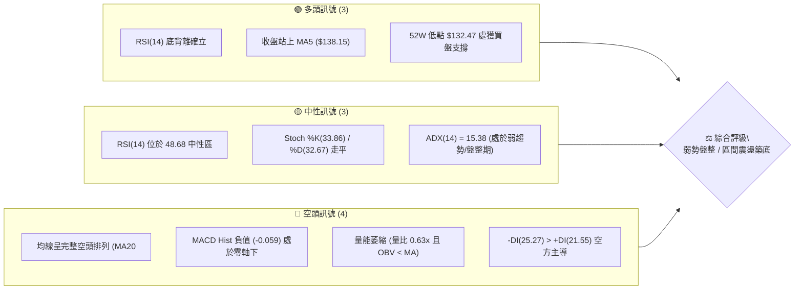
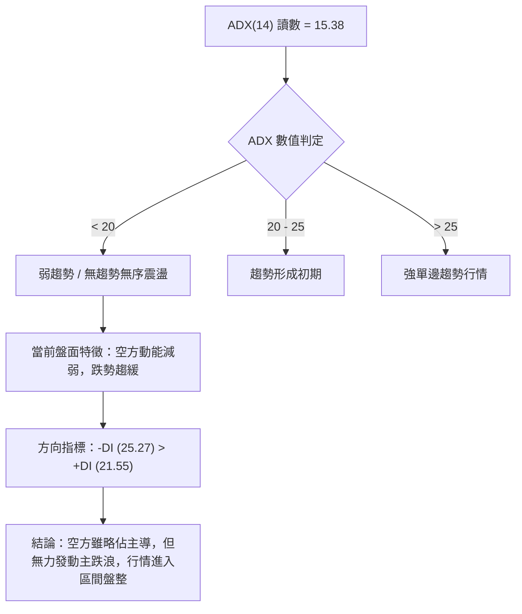
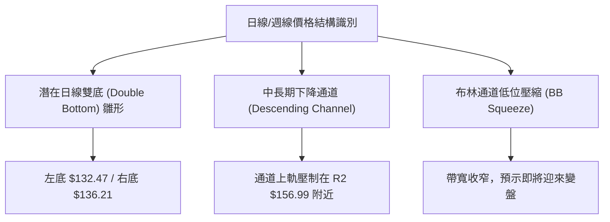
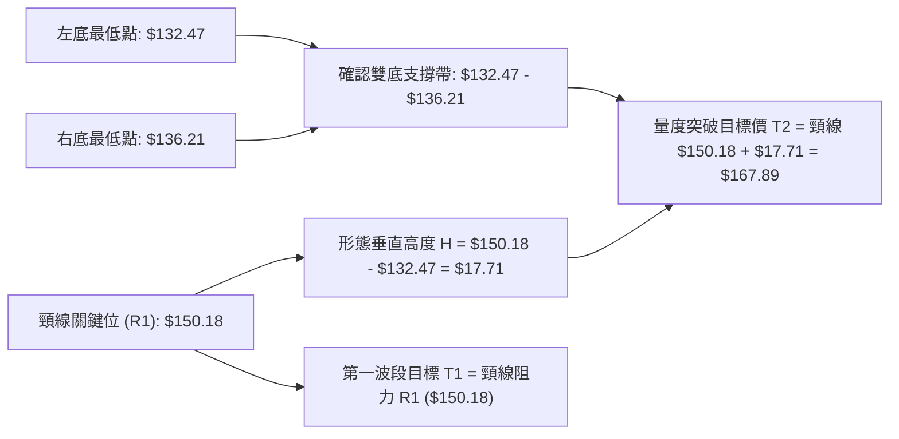
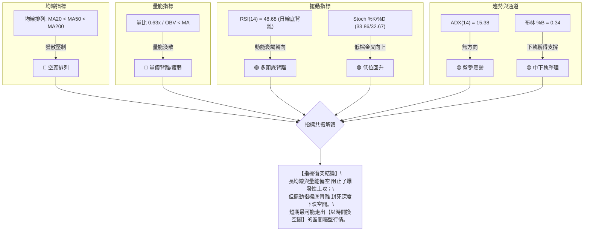
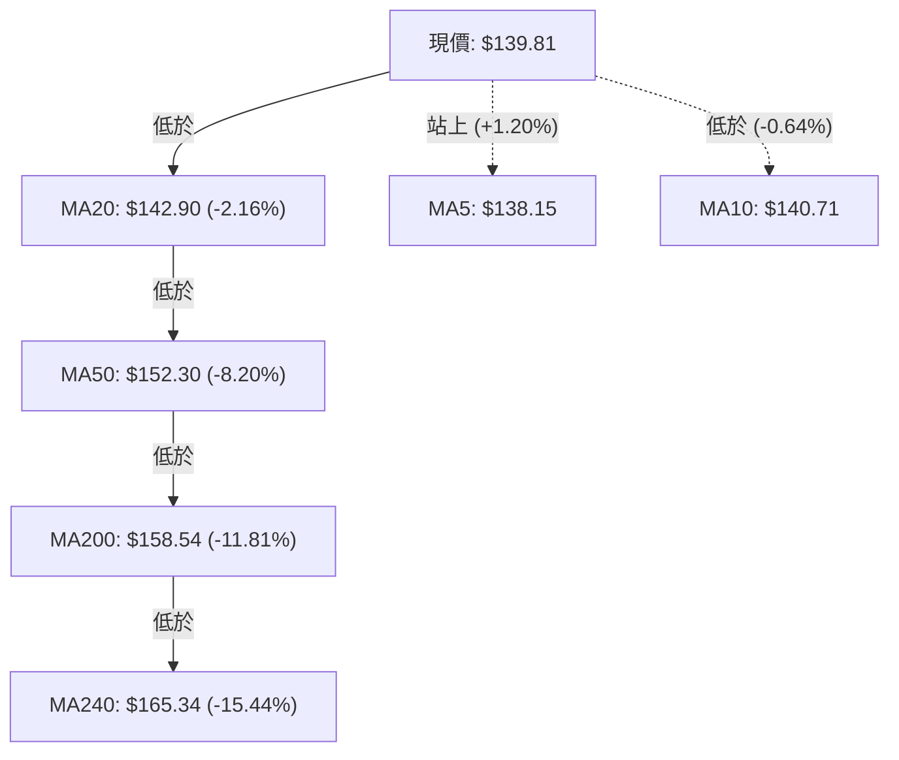
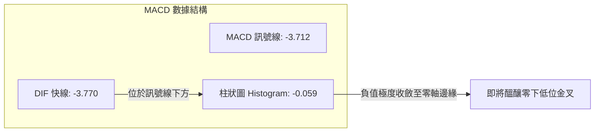
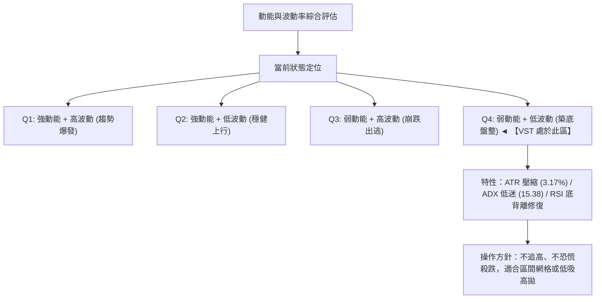
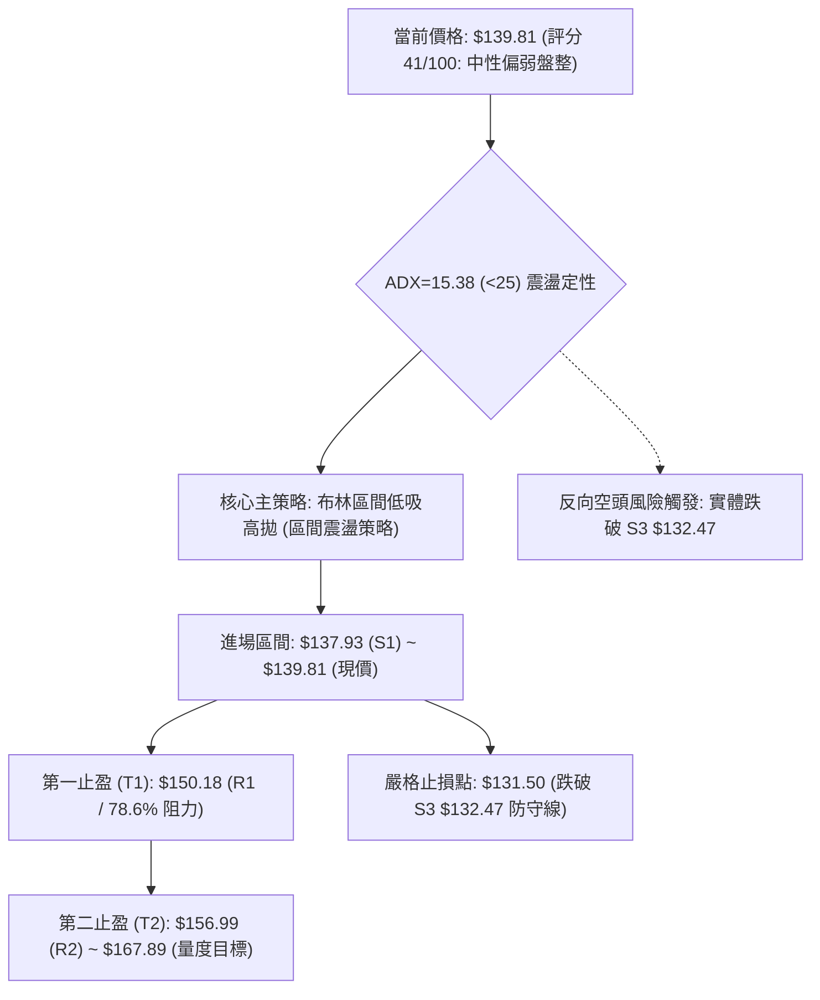
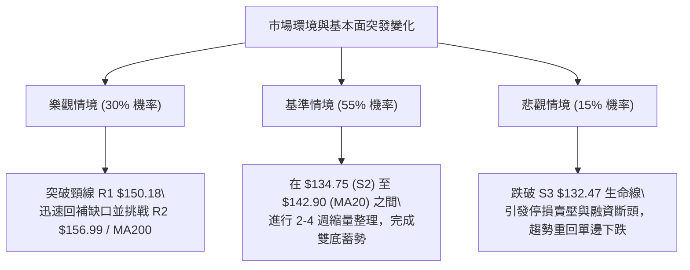

# VST 技術分析報告

> **報告日期**：2026-08-28 ｜ **語言**：繁體中文 ｜ **數據來源**：Yahoo Finance ｜ **當前價格**：$139.81

---

## 目錄

| 章節 | 內容 |
|------|------|
| [1. 技術面概覽](#1-技術面概覽) | 訊號儀表板、核心指標、評分卡 |
| [2. 趨勢分析](#2-趨勢分析) | 多時框趨勢、長中短期走勢 |
| [3. 圖表形態分析](#3-圖表形態分析) | 形態識別、K線組合、目標價 |
| [4. 支撐與阻力](#4-支撐與阻力) | 關鍵價位、斐波那契回調 |
| [5. 技術指標深度解讀](#5-技術指標深度解讀) | MA/RSI/MACD/布林/成交量 |
| [6. 動能與波動率](#6-動能與波動率) | 動能評估、ATR、Beta |
| [7. 多時框架總結](#7-多時框架總結) | 時框架評分矩陣 |
| [8. 交易策略建議](#8-交易策略建議) | 多空策略、風險報酬比 |
| [9. 風險提示與監控](#9-風險提示與監控) | 監控指標、風險場景 |

---

## 1. 技術面概覽

### 🎯 技術訊號儀表板



### 📊 核心指標速覽表

| 指標類別 | 指標名稱 | 當前數值 | 訊號 | 解讀 |
|----------|----------|----------|:----:|------|
| **價格** | 當前價格 | $139.81 | 🟡 | 位於52週區間 8.5% 處，貼近歷史底部區間震盪 |
| **均線** | MA20 | $142.90 | 🔴 | 價格低於 MA20 (-2.16%)，短中期均線壓制明顯 |
| **均線** | MA50 | $152.30 | 🔴 | 價格低於 MA50 (-8.20%)，中期趨勢依然向下 |
| **均線** | MA200 | $158.54 | 🔴 | 價格低於 MA200 (-11.81%)，長期牛熊分界線失守 |
| **動能** | RSI(14) | 48.68 | 🟡 | 處於 30-70 中性常態區間，但已出現日線底背離跡象 |
| **動能** | MACD | -3.770 | 🔴 | MACD線低於訊號線 (-3.712)，柱狀圖 -0.059 偏空 |
| **動能** | Stoch %K/%D | 33.86 / 32.67 | 🟡 | 擺動指標自低檔回升，目前無超買超賣過熱 |
| **趨勢** | ADX(14) | 15.38 | 🟡 | ADX < 25 表明單邊趨勢衰竭，進入低波動盤整 |
| **方向** | +DI / -DI | 21.55 / 25.27 | 🔴 | -DI 大於 +DI，空方力量在結構上仍占優勢 |
| **通道** | 布林 %B | 0.34 | 🟡 | 位於中軌 ($142.90) 與下軌 ($133.37) 之間偏下緣 |
| **量能** | 量比 / OBV | 0.63x / OBV<MA | 🔴 | 成交量 2.95M 低於均量，OBV 疲軟未見主動買盤突破 |
| **波動** | ATR(14) | $4.43 | 🟡 | 佔價格 3.17%，日內波動度適中，盤整壓縮中 |

### 🏆 技術評分卡

```
╔══════════════════════════════════════════════════════════════╗
║              技術評分卡 — VST (2026-08-28)                   ║
╠══════════════════════════════════════════════════════════════╣
║ 趨勢強度      █████░░░░░░░░░░░░░░░  25/100  🔴 空頭排列壓制  ║
║ 動能指標      ██████████░░░░░░░░░░  50/100  🟡 底背離中和中  ║
║ 支撐穩定度    ██████████████░░░░░░  70/100  🟢 S1/S3 低點支撐║
║ 成交量配合    ██████░░░░░░░░░░░░░░  30/100  🔴 量縮缺乏追價  ║
║ 形態完整度    ██████████░░░░░░░░░░  50/100  🟡 雙重底雛形中  ║
║ 均線排列      ████░░░░░░░░░░░░░░░░  20/100  🔴 20<50<200 空頭║
╠══════════════════════════════════════════════════════════════╣
║ 綜合評分      ████████░░░░░░░░░░░░  41/100  🟡 中性偏弱 (區間)║
╚══════════════════════════════════════════════════════════════╝
```

---

## 2. 趨勢分析

### 🌐 多時框趨勢分析

```mermaid
graph TD
    A["月線框架 (長線)"] -->|"2025/07觸頂$207後持續回吐，均線走平轉弱"| B["長期趨勢：深度回調 / 尋求牛市中繼底部"]
    C["週線框架 (中線)"] -->|"波段低點下移至$132.47，MA200下方震盪"| D["中期趨勢：空頭主導 / 下跌速率放緩盤整"]
    E["日線框架 (短線)"] -->|"價格$139.81站上MA5("$138.15")，但受制MA20"| F["短期趨勢：超跌反彈 / 區間下軌震盪築底"]
    
    B --> G{"多時框收斂判定"}
    D --> G
    F --> G
    G --> H["ADX=15.38 (<25) → 當前定性為【盤整震盪行情】\\n以日線布林通道 ($133.37 - $152.42) 為核心操作區間"]
```

### 📈 長期趨勢 — 12個月走勢圖（Unicode）

```
VST 月線走勢圖（過去12個月：2025-08 至 2026-08）
價格軸 ($)
$210 ┤
$200 ┤        ●(2025-09: 195.11)
$190 ┤  ●(08: 188.12)  ●(10: 187.52)
$180 ┤                    ●(11: 178.12)
$170 ┤                                  ●(2026-02: 173.41)
$160 ┤                          ●(12: 160.88)     ●(05: 160.01)
$150 ┤                                ●(01: 157.91) ●(03: 150.12) ●(06: 158.63)
$140 ┤                                                      ●(07: 148.19)  ●(現價 139.81)
$130 ┤                                                                      
     └───────────────────────────────────────────────────────────────────────────
       08/25 09    10    11    12    01/26 02    03    04    05    06    07    08
```

#### 走勢特徵分析表格

| 階段區間 | 起止價位 | 漲跌幅 | 趨勢特徵與量能結構 |
|----------|----------|:------:|-------------------|
| **頂部構築期** (2025.08 - 2025.10) | $188.12 → $187.52 | -0.32% | 於 $195.11 形成次高點後無力續創新高，高位籌碼密集換手滯漲 |
| **首波下行期** (2025.11 - 2026.01) | $178.12 → $157.91 | -11.35% | 跌破高位整理區間，均線轉為下彎，出現空頭發散特徵 |
| **中繼反彈期** (2026.02 - 2026.02) | $157.91 → $173.41 | +9.82% | 跌深技術性抽腳反彈，受阻於 $175.69 (斐波那契 50.0% 回調位) |
| **二次探底期** (2026.03 - 2026.08) | $173.41 → $139.81 | -19.38% | 震盪下行並刷出 52 週新低 $132.47，隨後於 $136-$140 區間量縮沉澱 |

### 📊 中期趨勢（週線分析）

```
週線關鍵壓力與支撐示意圖
───────────────────────────────────────────────────────────────
$168.93 ──────────────────────────────────────── 關鍵結構阻力 R3
                      ↑ (週線反彈極限)
$156.99 ──────────────────────────────────────── 中期頸線阻力 R2 / 週線密集換手區
                      ↑
$150.18 ──────────────────────────────────────── 強弱分水嶺 R1 / MA50 / BB上軌附近
                      ↑ (短線目標)
$139.81 ════════════════════════════════════════ 現價水平線
                      ↓ (回測支撐)
$137.93 ---------------------------------------- 波段支撐 S1
                      ↓
$134.75 ---------------------------------------- 強支撐 S2 / 布林下軌 ($133.37)
                      ↓
$132.47 ════════════════════════════════════════ 52週低點 S3 (多方底線)
───────────────────────────────────────────────────────────────
```

### ⚡ 趨勢強度評估（ADX 解讀）



#### ADX 強度對照表

| 指標項 | 讀數 | 門檻區間 | 技術含義 |
|--------|:----:|:--------:|----------|
| **ADX(14)** | **15.38** | 0 – 20 | **無方向性弱趨勢**；單邊動能耗盡，均線系統糾結或失真，順勢突破策略易頻繁假突破 |
| **+DI (14)** | **21.55** | — | 多方力量自低點微幅抬頭，但尚未超越空方基準線 |
| **-DI (14)** | **25.27** | — | 空方掌控主要基調，但未見發散擴張，不具備斷崖式下跌動能 |
| **盤勢定性** | **區間震盪** | ADX < 25 | **依據規則 14**：以日線布林通道與波段高低點為邊界的區間交易策略為主 |

---

## 3. 圖表形態分析

### 🔍 形態識別系統



#### 形態識別與信心度評估表

| 形態名稱 | 信心度 | 判斷依據（引用精確數據） | 完成度 | 目標價（附嚴謹幾何計算式） |
|----------|:------:|--------------------------|:------:|----------------------------|
| **雙重底 (潛在W底)** | **62%** | 52W低點 S3 ($132.47) 築出第一底，2026-08-23 週收盤低點 $136.21 形成右底抬高，配合 RSI 底背離 | 45% | **頸線**: R1 ($150.18)<br>**形態高度**: $150.18 - $132.47 = $17.71<br>**突破目標價**: $150.18 + $17.71 = **$167.89** (貼近 R3 $168.93) |
| **下降通道整理** | **75%** | 2026年高點 $173.41 與波段高點聚類形成下降趨勢線，目前處於通道下軌反彈階段 | 80% | **通道上軌阻力**: 斐波那契 61.8% **$165.49** 至 R3 **$168.93** |
| **頭肩頂形態** | **30%** | *數據中未偵測到完整右肩結構*，僅為多時框長期回調，不符合嚴格頭肩幾何特徵 | 0% | 訊號不足，依規則 15 不予採納與推算目標 |

### 🕯️ 重要K線形態分析

| 日期 / 月份 | 收盤價 | K線形態 | 解讀 | 訊號 |
|-------------|:------:|---------|------|:----:|
| **2026-05-17 (週)** | $139.48 | 長下影錘子線 | 觸及 52W 低點 $132.47 後爆出 28.94M 週量強勁抽腳，確認 S3 買盤 | 🟢 |
| **2026-06-28 (週)** | $163.49 | 高檔滯漲十字星 | 遇阻於斐波那契 61.8% ($165.49) 下方，隨後連續數週陰跌 | 🔴 |
| **2026-08-23 (週)** | $136.21 | 低檔長下影陰實體 | 測試 S2 ($134.75) 支撐未破，RSI 觸及 26.1 極端超賣區後反彈 | 🟢 |
| **2026-08-30 (當週)**| $139.81 | 低位小陽線反彈 | 價格突破短期 MA5 ($138.15)，MACD 綠柱大幅收斂至 -0.059 | 🟢 |

### 📉 ASCII 走勢形態示意圖

```
VST 雙重底 (Double Bottom) 雛形示意圖
═══════════════════════════════════════════════════════════════
$150.18 ┤               頸線阻力位 (R1)
        │                 ╭───────╮
        │                ╱         ╲
$142.90 ┤   MA20 / 中軌 ╱           ╲           ╭─ (當前推進中)
        │              ╱             ╲         ╱
$139.81 ┤─────────────╱───────────────╲───────● (現價 $139.81)
        │            ╱                 ╲     ╱
$136.21 ┤           ╱                   ╰───╯ (右底: 2026-08-23: $136.21)
        │          ╱
$132.47 ┤ ╰───────╯ (左底: 52W低點: $132.47)
        └──────────────────────────────────────────────────────
           2026-05-17                          2026-08-28
═══════════════════════════════════════════════════════════════
```

### 🎯 形態目標價計算



- **第一階段目標價（T1）**：**$150.18**（波段阻力 R1，對應斐波那契 78.6% 回調位 $150.97 與 MA50 $152.30 的共振壓力帶）。
- **第二階段量度目標價（T2）**：**$167.89**（由雙底高度 $17.71 向上等幅投影，直接切入波段阻力 R3 $168.93 與斐波那契 61.8% $165.49 的強阻力區間）。

---

## 4. 支撐與阻力

### 🗺️ 關鍵價位分布圖（Unicode）

```
VST 價位結構分布圖 (由 OHLCV 與歷史波段計算)
═══════════════════════════════════════════════════════════════════════════════
$218.91 ║████████████████████████████████████████║ 52週最高點 / 0.0% 斐波那契
$198.51 ║██████████████████████████████          ║ 23.6% 斐波那契回調位
$185.89 ║████████████████████████                ║ 38.2% 斐波那契回調位
$175.69 ║████████████████████                    ║ 50.0% 斐波那契多空分水嶺
$168.93 ║████████████████████████████████████    ║ 強阻力 R3 (近一年密集波段高點)
$165.49 ║████████████████████████                ║ 61.8% 斐波那契回調位
$158.54 ║██████████████████                      ║ MA200 牛熊分界線
$156.99 ║████████████████████████████            ║ 阻力 R2 (中期波段高點聚類)
$152.42 ║████████████████                        ║ 布林帶上軌 / MA50 ($152.30)
$150.97 ║████████████████████                    ║ 78.6% 斐波那契回調位
$150.18 ║████████████████████████████████        ║ 關鍵阻力 R1 (頸線壓力區)
$142.90 ║▓▓▓▓▓▓▓▓▓▓▓▓▓▓▓▓                        ║ MA20 / 布林中軌
╠═══════╬════════════════════════════════════════╬════════════════════════════
$139.81 ║ ◄── 當前收盤價 ($139.81)               ║ 處於 S1 與 R1 夾層盤整
╠═══════╬════════════════════════════════════════╬════════════════════════════
$137.93 ║▓▓▓▓▓▓▓▓▓▓▓▓▓▓▓▓▓▓▓▓▓▓▓▓▓▓▓▓            ║ 近期支撐 S1 (-1.34%)
$134.75 ║████████████████████████████████        ║ 強支撐 S2 (-3.62%)
$133.37 ║████████████████                        ║ 布林帶下軌
$132.47 ║████████████████████████████████████████║ 52週最低點 S3 / 100.0% 斐波那契
═══════════════════════════════════════════════════════════════════════════════
```

### 🚧 阻力位分析表

| 阻力級別 | 引用精確價位 | 距現價空間 | 技術面形成原因與共振要素 | 突破難度 | 重要性評級 |
|:--------:|:------------:|:----------:|--------------------------|:--------:|:----------:|
| **R1** | **$150.18** | +7.42% | 近一年波段高點聚類；與斐波那契 78.6% ($150.97)、MA50 ($152.30) 及布林上軌 ($152.42) 形成多重共振帶 | 中等 | 🟢🟢🟢 (關鍵頸線) |
| **R2** | **$156.99** | +12.29% | 2026年4-6月多次震盪頂部聚類區；上方緊貼 MA200 ($158.54) | 偏高 | 🟢🟢 (中期分界) |
| **R3** | **$168.93** | +20.83% | 2026年2月及歷史強阻力高點聚類；上方覆蓋斐波那契 61.8% ($165.49) | 極高 | 🟢🟢🟢 (結構強壓) |

### 🛡️ 支撐位分析表

| 支撐級別 | 引用精確價位 | 距現價空間 | 技術面形成原因與共振要素 | 守住機率 | 重要性評級 |
|:--------:|:------------:|:----------:|--------------------------|:--------:|:----------:|
| **S1** | **$137.93** | -1.34% | 近期日線下影線密集聚類點；MA5 ($138.15) 於此處提供超短線動能支撐 | 75% | 🟢🟢 (短線防守) |
| **S2** | **$134.75** | -3.62% | 近一年波段次低點聚類；與布林通道下軌 ($133.37) 形成動態護盤共振 | 85% | 🟢🟢🟢 (區間下沿) |
| **S3** | **$132.47** | -5.25% | 52週歷史最低點 (52W Low)；斐波那契 100% 極限支撐位 | 92% | 🟢🟢🟢 (生命線) |

### 📐 斐波那契回調位分析

依據 52 週波動區間（高點 **$218.91** → 低點 **$132.47**，總波幅 **$86.44**）計算之標準回調位：

```
斐波那契回調位階梯
┌─────────────────────────────────────────────────────────────┐
│ 0.0%  (52W High) : $218.91  ── 歷史牛市頂峰                 │
│ 23.6% 回調位     : $198.51  ── 多頭強勢回檔極限             │
│ 38.2% 回調位     : $185.89  ── 牛市第一支撐轉換位           │
│ 50.0% 回調位     : $175.69  ── 中長線多空平衡中樞           │
│ 61.8% 回調位     : $165.49  ── 黃金分割關鍵反彈位           │
│ 78.6% 回調位     : $150.97  ── 空頭防守核心陣地             │
├─────────────────────────────────────────────────────────────┤
│ ◄◄ 現價 $139.81 落於 78.6% ($150.97) 與 100.0% ($132.47) 之間 │
├─────────────────────────────────────────────────────────────┤
│ 100.0% (52W Low) : $132.47  ── 週期底部基準線               │
└─────────────────────────────────────────────────────────────┘
```

- **位置意義解讀**：現價 $139.81 處於 78.6% ($150.97) 與 100.0% ($132.47) 的**極度深幅回撤區間**。通常在強烈上升趨勢中，跌破 61.8% ($165.49) 即代表原本的單邊多頭結構遭到破壞；目前價格在 78.6% 下方進行長時間築底，表明此處屬於**價值重估與籌碼出清後的低位沉澱區**。若能向上突破 $150.97 (78.6%)，將正式確認走出底部盤整，展開向 61.8% ($165.49) 的中級修復行情。

---

## 5. 技術指標深度解讀

### 🎛️ 指標訊號總覽



### 📈 移動平均線排列分析



- **均線系統現狀**：MA20 ($142.90) < MA50 ($152.30) < MA200 ($158.54)，呈現標準的**空頭排列**。中長期均線（MA60 $151.79、MA120 $153.55、MA240 $165.34）斜率全部向下，顯示上方套牢賣壓沉重。
- **短期轉機**：現價已站上 5 日均線 MA5 ($138.15)，且 MA5 開始出現向上拐頭跡象（+1.20%），短線超跌反彈正在展開，首要考驗為 MA10 ($140.71) 與 MA20 ($142.90) 的下壓反壓。

### 📉 RSI(14) 分析

```
RSI(14) 當前讀數：48.68
[0] ────────── [30] ───────────────────●─────────── [70] ────────── [100]
超賣區          超賣邊界              現價 (48.68)      超買邊界           超買區
進度條: ██████████░░░░░░░░░░  48.68%
```

- **底背離 (Bullish Divergence) 深度解讀**：
  - **價格走勢**：2026-05-17 週線低點收在 $139.48（波段觸及 $132.47），隨後於 2026-08-23 週收盤再次探底至 $136.21，價格創下波段收盤新低。
  - **RSI 指標**：2026-05-17 RSI 降至 25.5 極端超賣，而在 2026-08-23 二次探底時，RSI 於 26.1-37.2 區間築底並快速回升至當前的 **48.68**，形成顯著的**指標低點抬高、價格破底之日線/週線底背離**。
  - **結論**：空方下殺動能已出現實質衰竭，賣盤無法在低位維持高壓，此背離為近期多頭最強力之反彈技術支撐。

### 📊 MACD(12/26/9) 訊號解讀



- **訊號解析**：MACD 快線 (-3.770) 與訊號線 (-3.712) 均位於零軸深處下方，屬於空頭控盤市場。然而，柱狀圖（Histogram）數值已自先前的 -1.873 快速收窄至 **-0.059**，呈現極度收斂狀態。若現價能突破 MA20 ($142.90)，MACD 將於低檔正式形成**黃金交叉**，釋放明確的右側補漲訊號。

### 📦 布林通道分析

```
VST 布林通道 (20, 2) 結構圖
═══════════════════════════════════════════════════════════════
$152.42 ────────────────────────────────── 上軌 (Upper Band)
        │
$142.90 ────────────────────────────────── 中軌 (MA20 Baseline)
        │            
$139.81 ══════════════════════════════════ 現價 (%B = 0.34)
        │
$133.37 ────────────────────────────────── 下軌 (Lower Band)
═══════════════════════════════════════════════════════════════
```

- **通道帶寬與位置**：通道上限 $152.42，下限 $133.37，帶寬為 $19.05 (13.6%)。當前 %B 數值為 **0.34**，價格處於中軌與下軌之間的弱勢區，但並未跌破下軌，而是在下軌獲得有效支撐（S2 $134.75 / S3 $132.47 與下軌重合）。
- **運行路徑推演**：當前通道處於平行收口階段，價格將自下軌區域向中軌 **$142.90** 發起回歸測試。

### 💹 成交量分析（量價配合度）

- **成交量數據**：最新日成交量為 **2,947,400** 股，相較於 20 日均量 **4,646,290** 股，量比僅為 **0.63x**；50 日均量為 **4,405,646** 股。
- **OBV 趨勢評估**：當前 OBV 處於其移動平均線下方（OBV < MA），呈現量能疲弱。近兩週價格雖自 $136.21 抽腳回升至 $139.81，但週成交量自 34.90M 萎縮至 15.60M。
- **量價背離結論**：此種「**縮量反彈**」反映市場殺跌盤已竭盡（惜售），但場外增量主力資金尚未大規模進場追高。缺乏量能配合意味著價格難以直接發動突破 MA50 ($152.30) 的爆發性行情，更傾向於在 S1 ($137.93) 至 R1 ($150.18) 之間反覆拉鋸震盪換手。

---

## 6. 動能與波動率

### ⚡ 動能評估四象限



| 象限 | 動能強度 (RSI/MACD) | 波動率水準 (ATR/BB Width) | 當前判定 | 戰略應對方針 |
|:----:|:-------------------:|:-------------------------:|:--------:|--------------|
| **Q1** | 強 (Bullish) | 高 (Expanding) | — | 順勢追擊，波段持有 |
| **Q2** | 強 (Bullish) | 低 (Contracting) | — | 趨勢穩健，加碼持股 |
| **Q3** | 弱 (Bearish) | 高 (Expanding) | — | 恐慌釋放，嚴格止損觀望 |
| **Q4** | **弱 (Neutral/Divergent)** | **低 (Compressed)** | **✓ (VST)** | **底背離低吸，布林區間高拋低吸** |

### 📊 ATR 波動率分析

```
ATR(14) 波動率指標：$4.43 (佔現價 3.17%)
████████████░░░░░░░░  3.17% (常態波動區間)
```

- **日內波動區間**：當前 14 日平均真實波幅 ATR 為 **$4.43**。以現價 $139.81 換算，單日正常波動區間為 **$135.38 至 $144.24**。
- **交易風控距離建議**：
  - **超短線進場保護止損**：設定為 1.0 倍 ATR = **$4.43**（止損設於進場點下方約 $4.43 處）。
  - **波段交易安全止損**：設定為 1.5 倍 ATR = **$6.65**；以現價計，波段保護點落於 **$133.16**，剛好位於 S3 52W 低點 $132.47 上方邊界，能有效過濾日內雜訊。

### 📐 Beta 與市場相關性

- **Beta 係數**：**1.433**（高彈性 Beta 特徵）。
- **市場連動解讀**：VST 屬於高 Beta 獨立電力與公用事業成長標的。當標普 500 指數或公用事業板塊波動 1% 時，VST 理論平均波動達 **1.433%**。在目前弱勢整理期，高 Beta 意味著若大盤或能源板塊出現系統性回調，VST 容易出現放大式回撤；反之，若板塊反彈，其彈性亦將顯著優於傳統防禦型公用事業股。

---

## 7. 多時框架總結

### 📋 時框架評分表

| 時框架 | 趨勢方向 | 動能狀態 | 均線系統排列 | 形態結構特徵 | 綜合評分 | 操作指導建議 |
|:------:|:--------:|:--------:|:------------:|:------------:|:--------:|--------------|
| **日線 (短線)** | 🟡 震盪築底 | 🟢 RSI底背離 / MACD綠柱收斂 | 🔴 MA20/50下方壓制 | 潛在雙底右底構築中 | **55 / 100** | 逢低佈局，博弈中軌與 R1 反彈 |
| **週線 (中線)** | 🔴 弱勢回調 | 🟡 擺動指標低位走平 | 🔴 MA200下方弱勢震盪 | 52週低點 S3 測試支撐 | **35 / 100** | 嚴設防守，等待帶量站上 MA50 |
| **月線 (長線)** | 🟡 長期牛市回調 | 🔴 動能回吐中 | 🟢 仍高於長週期上升趨勢 | 歷史頂部回撤 36% 消化 | **40 / 100** | 價值沉澱，適合分批金字塔建倉 |

### 🔲 綜合訊號矩陣

```
訊號維度矩陣分析
─────────────────────────────────────────────────────────────
指標維度          短期 (日線)       中期 (週線)       長期 (月線)
─────────────────────────────────────────────────────────────
趨勢方向 (Trend)     🟡 橫盤震盪       🔴 偏空下行       🟡 回調中繼
均線排列 (MA)        🔴 空頭壓制       🔴 空頭排列       🟢 處長線上方
動能結構 (Momentum)  🟢 底背離轉強     🟡 超賣企穩       🔴 獲利回吐
量價配合 (Volume)    🔴 縮量反彈       🔴 均量萎縮       🟡 常態換手
波動通道 (Channel)   🟡 下軌反彈中     🔴 偏下緣運行     🟡 區間中位
─────────────────────────────────────────────────────────────
時框一致性評估：多時框架方向尚未形成順勢共振，短多與中空激烈拉鋸。
─────────────────────────────────────────────────────────────
```

### ⚖️ 多時框收斂結論

> **依據「嚴格要求 14」收斂規則執行**：
> 1. **趨勢/盤整定性**：當前 ADX(14) 讀數僅為 **15.38 (< 25)**，技術面已明確進入**【盤整震盪行情】**，而非單邊趨勢行情。
> 2. **主導時框取捨**：依規則，盤整行情不宜過度依賴中長期單邊均線追空，而**必須以日線布林通道上下軌（$133.37 - $152.42）作為最核心的操作決策邊界**。
> 3. **唯一方向性結論**：**【中性偏弱、區間震盪築底】**。操作策略定調為「**區間下軌支撐逢低吸納，上軌阻力分批獲利**」，嚴禁在阻力位追高。

---

## 8. 交易策略建議

### 🗺️ 策略決策流程圖



### 🧭 策略路由

**當前主策略方向 = 區間震盪低吸策略（依技術綜合評分 41/100 判定）**
*評分處於 40–60 中性區間，且 ADX < 25 表明無單邊趨勢，策略重點在於利用 S1-S3 支撐帶建立多頭底倉，博弈底背離修復與布林中上軌反彈，同時嚴控止損於 52W 低點下方。*

### 🎯 價格情境階梯（Price Scenarios）

| 觸發條件 | 下一目標價 | 後續延伸價位 | 情境技術含義與市場狀態 |
|----------|:----------:|:------------:|------------------------|
| **強勢突破 R1 ($150.18)** | **R2 ($156.99)** | **R3 ($168.93)** | 雙底頸線確認突破，帶動 MA50 翻揚，正式展開中期估值修復浪 |
| **站穩現價區間 ($137.93 - $142.90)** | **R1 ($150.18)** | **MA50 ($152.30)** | 於布林中軌附近縮量蓄勢，以時間換取均線收斂 |
| **有效跌破 S1 ($137.93)** | **S2 ($134.75)** | **S3 ($132.47)** | 弱勢下探測試布林下軌及 52 週低點支撐 |
| **跌破 S3 生命線 ($132.47)** | *向下破底* | *數據中未偵測到* | 雙底雛形失敗，創 52 週新低，開啟新一輪單邊主跌浪 |

### 📊 情境機率分佈

```
情境機率分佈圖
┌─────────────────────────────────────────────────────────────┐
│ 區間震盪築底 (橫盤拉鋸)      : ████████████████████  55%    │
│ 向上反彈突破 (觸及 R1/R2)    : ████████████          30%    │
│ 向下跌破探底 (跌破 S3)       : ██████                15%    │
└─────────────────────────────────────────────────────────────┘
```

| 情境劇本 | 機率 | 主要依據與指標支撐 |
|----------|:----:|--------------------|
| **區間震盪築底** | **55%** | ADX(14)=15.38 處於超低值；成交量低迷 (量比 0.63x)；布林通道走平收窄 |
| **向上反彈測試** | **30%** | RSI(14) 顯著底背離；Stoch 金叉回升；MACD 綠柱極致收斂 (-0.059) |
| **跌破下行探底** | **15%** | 均線呈空頭排列；-DI(25.27) 仍高於 +DI；總體籌碼在 MA200 下方承壓 |

### 🟢 主策略詳情（區間操作與逢低做多）

| 策略要素 | 策略 A（現價直接佈局型） | 策略 B（回測強支撐掛單型） |
|----------|--------------------------|----------------------------|
| **交易邏輯** | 押注 RSI 底背離確立與 MACD 低檔金叉 | 等待回測 S2/布林下軌獲得支撐後之低吸 |
| **進場價格** | **$139.81** (現價直接進場) | **$135.00** (掛於 S2 $134.75 上方) |
| **目標價 T1** | **$150.18** (阻力 R1 / 獲利 +7.42%) | **$150.18** (阻力 R1 / 獲利 +11.24%) |
| **目標價 T2** | **$156.99** (阻力 R2 / 獲利 +12.29%) | **$156.99** (阻力 R2 / 獲利 +16.29%) |
| **止損價格** | **$131.50** (跌破 S3 $132.47 下方約 1.5 ATR 緩衝) | **$131.50** (跌破 52W 低點 $132.47 防守) |
| **潛在虧損空間** | -$8.31 (-5.94%) | -$3.50 (-2.59%) |
| **風險報酬比 (R:R)** | **1 : 1.25** (至T1) / **1 : 2.07** (至T2) | **1 : 4.34** (至T1) / **1 : 6.29** (至T2) |
| **勝率預估** | **52%** | **65%** |
| **建議倉位** | 10% - 15% (輕倉試單) | 15% - 20% (標準底倉) |

### 🔴 反向風險觸發點（對沖提示）

- **對沖/空頭觸發條件**：若日線收盤價**實體跌破 52W 低點 S3 ($132.47)**，且成交量放大突破 20 日均量（> 4.65M 股）。
- **避險動作**：多頭策略立即全數無條件止損離場，不可加碼攤平；激進投資者可於 $132.00 建立反向避險空單，向下尋找下一整數支撐。

### ⭐ 整體訊號強度評星

```
做多訊號強度：★★☆☆☆  (2.5/5星 — 底背離支持，但受制空頭均線)
做空訊號強度：★★☆☆☆  (2.0/5星 — ADX低迷，空方動能衰竭不宜追空)
整體可信度：  ★★★☆☆  (3.5/5星 — 區間邊界明確，震盪格局高度可信)
```

---

## 9. 風險提示與監控

### ✅ 關鍵監控指標 Checklist

```
╔══════════════════════════════════════════════════════════════════╗
║                VST 每日交易關鍵監控 CHECKLIST                    ║
╠══════════════════════════════════════════════════════════════════╣
║ [ ] 價格是否守穩 S1 ($137.93) 及 MA5 ($138.15)                   ║
║ [ ] 價格能否放量突破 MA20 ($142.90) 與 MA10 ($140.71)            ║
║ [ ] MACD Histogram 是否由負轉正（突破 0 軸臨界線）               ║
║ [ ] 日成交量是否放大至 20日均量 (4.65M) 以上，確認買盤增量       ║
║ [ ] RSI(14) 能否持穩於 50 榮枯線上方                             ║
║ [ ] 52週低點 S3 ($132.47) 是否完好無損，未被跌破                ║
║ [ ] ADX(14) 是否向上突破 20，釋放新一輪趨勢啟動訊號             ║
╚══════════════════════════════════════════════════════════════════╝
```

### ⚠️ 風險場景分析



### 🛡️ 風險管理重要提醒

1. **嚴禁均線逆勢重倉**：當前 MA20、MA50、MA200 全面處於現價上方，技術面本質仍屬於「**逆均線反彈操作**」，絕對不可使用重倉或槓桿進場。
2. **波動率與止損紀律**：VST 的 Beta 高達 1.433，且單日 ATR 達 $4.43 (3.17%)。部位規模應嚴格控制在單筆交易損失不超過總賬戶資金的 1%–1.5%（以止損距離 $8.31 計算）。
3. **量能確認再加碼**：在成交量未有效超越 4.65M 股之前，所有上攻均應視為區間震盪脈衝，不可在拉升過程中追價，加碼點必須保留在成功站穩 R1 ($150.18) 之後的右側回踩確認點。

---

## 📋 報告總結

```
╔══════════════════════════════════════════════════════════════════╗
║                   VST 技術分析報告總結                           ║
╠══════════════════════════════════════════════════════════════════╣
║ 報告日期：2026-08-28                                             ║
║ 當前價格：$139.81 (處於 52W 區間 8.5% 之低位)                    ║
║ 分析評級：⚖️ 區間震盪築底 / 中性偏弱 (評分: 41/100)               ║
╠══════════════════════════════════════════════════════════════════╣
║ 關鍵結論：                                                       ║
║ ├─ 長期趨勢：🟡 月線自 $207.45 高點回調 36%，處於牛市長週期回撤 ║
║ ├─ 中期趨勢：🔴 均線呈空頭排列，價格受壓於 MA200 ($158.54) 下方 ║
║ ├─ 短期趨勢：🟢 站上 MA5，日線 RSI 底背離，跌勢暫歇醞釀反彈     ║
║ ├─ 關鍵支撐：S1: $137.93 │ S2: $134.75 │ S3: $132.47 (52W Low)  ║
║ ├─ 關鍵阻力：R1: $150.18 │ R2: $156.99 │ R3: $168.93           ║
║ └─ 分析師共識：Strong Buy (19位分析師目標均價 $217.42)           ║
╠══════════════════════════════════════════════════════════════════╣
║ 最優策略組合：                                                   ║
║ 1. 🥇 最佳機會：策略 B（掛單 $135.00 於 S2 支撐低吸，R:R = 1:4.34）║
║ 2. 🥈 次選機會：策略 A（現價 $139.81 輕倉試單，博弈 MACD 低檔金叉）║
║ 3. 🥉 保守選擇：等待放量突破 R1 $150.18 並站穩後，右側順勢跟進   ║
╚══════════════════════════════════════════════════════════════════╝
```

---

> ⚠️ **免責聲明**：本報告為 AI 自動生成之技術分析，所有數據及估算均基於提供的歷史價格資訊。本報告**僅供研究與學術參考**，**不構成任何投資建議**。投資有風險，入市需謹慎。

---

*報告生成時間：2026-08-28 ｜ 數據來源：Yahoo Finance ｜ 分析框架：多時框技術分析*