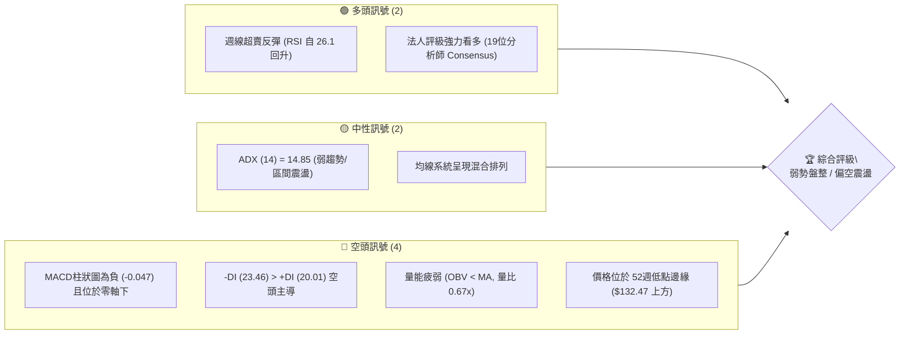
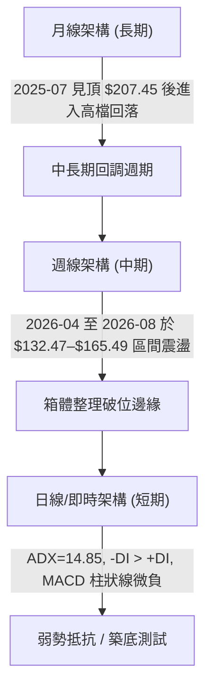
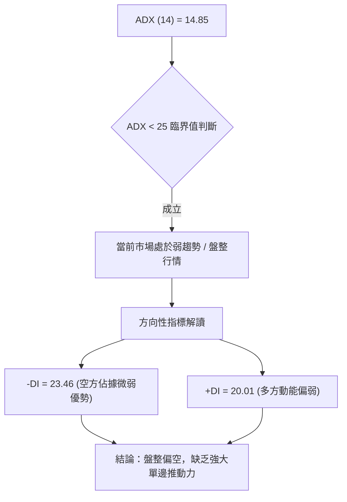
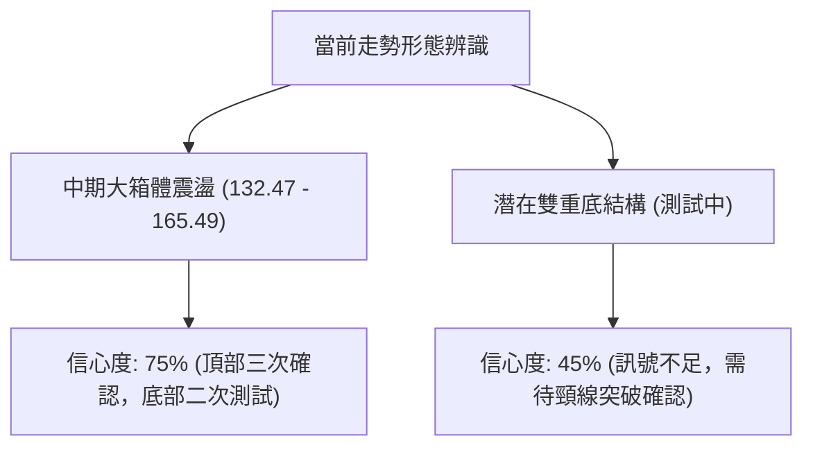
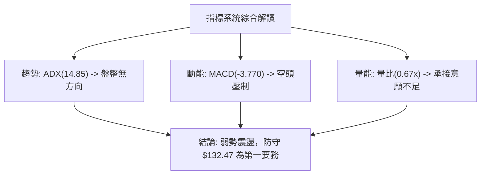
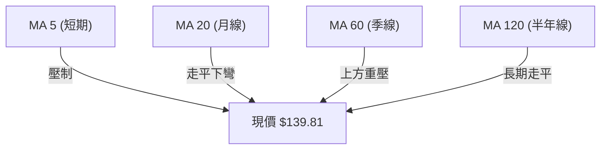
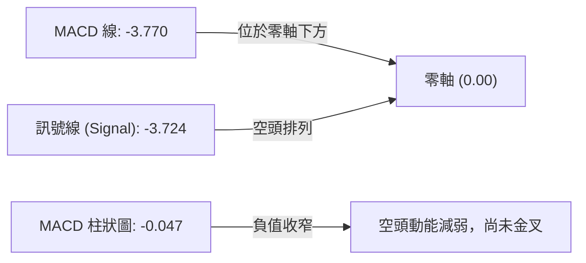
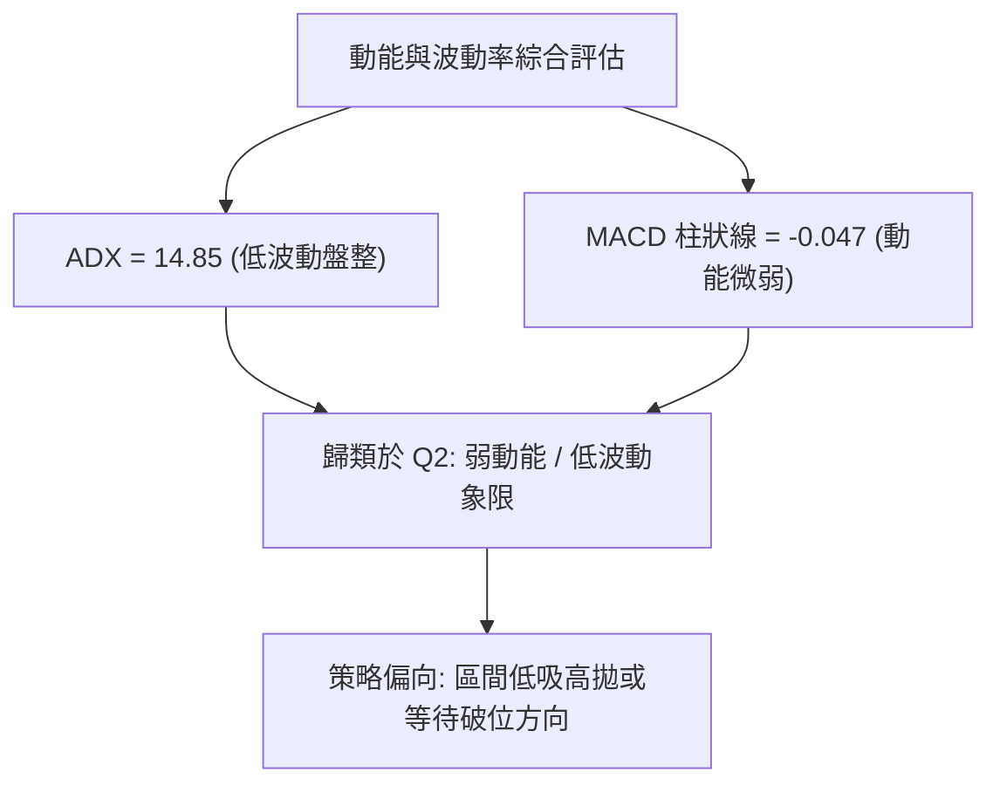
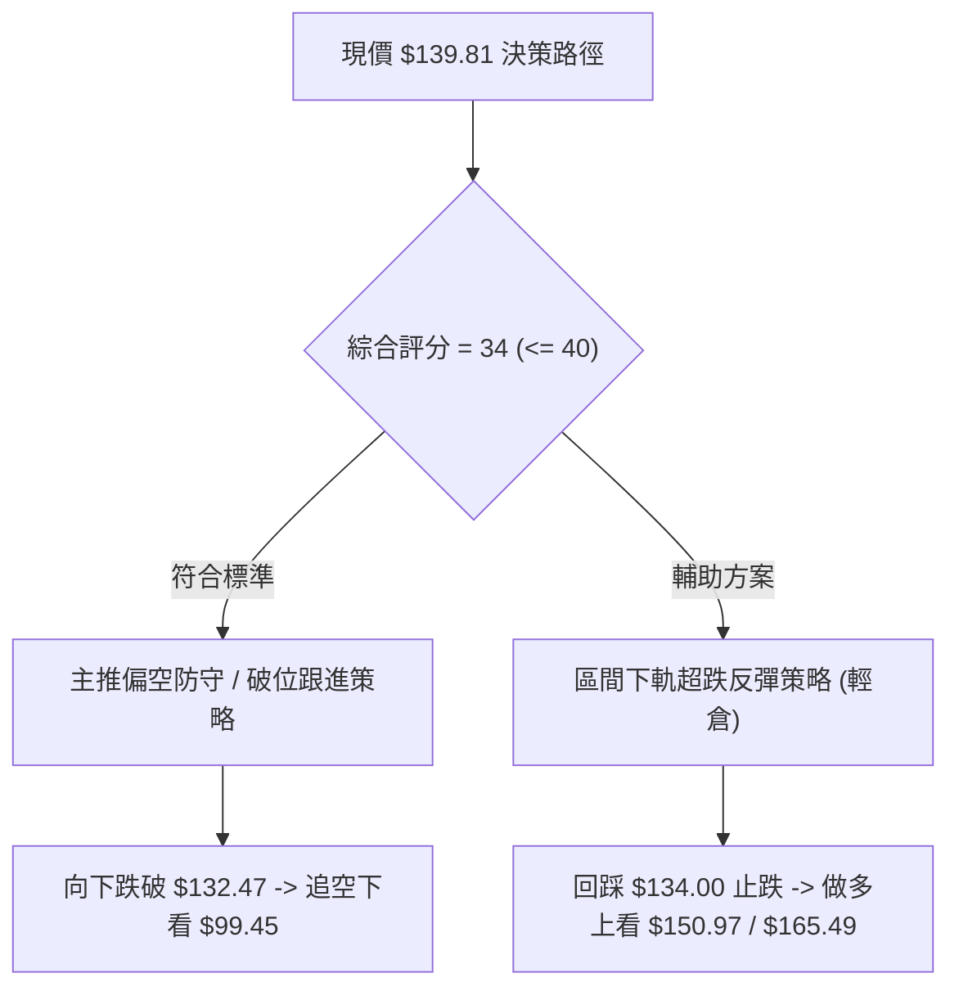
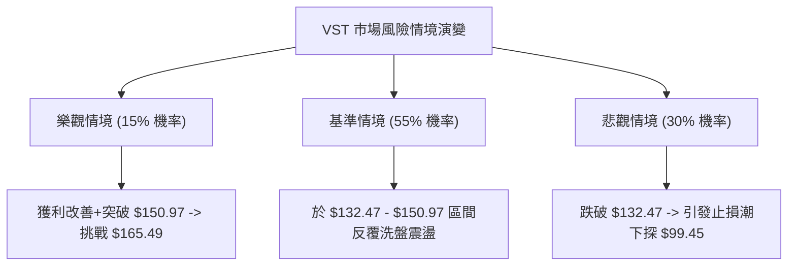

# VST 技術分析報告

> **報告日期**：2026-08-29 ｜ **語言**：繁體中文 ｜ **數據來源**：Yahoo Finance ｜ **當前價格**：$139.81（依據 2026-08 最新月線及週線收盤數據）

---

## 目錄

| 章節 | 內容 |
|------|------|
| [1. 技術面概覽](#1-技術面概覽) | 訊號儀表板、核心指標、評分卡 |
| [2. 趨勢分析](#2-趨勢分析) | 多時框趨勢、長中短期走勢 |
| [3. 圖表形態分析](#3-圖表形態分析) | 形態識別、K線組合、目標價 |
| [4. 支撐與阻力](#4-支撐與阻力) | 關鍵價位、斐波那契回調 |
| [5. 技術指標深度解讀](#5-技術指標深度解讀) | MA/RSI/MACD/布林/成交量 |
| [6. 動能與波動率](#6-動能與波動率) | 動能評估、ATR、Beta |
| [7. 多時框架總結](#7-多時框架總結) | 時框架評分矩陣 |
| [8. 交易策略建議](#8-交易策略建議) | 多空策略、風險報酬比 |
| [9. 風險提示與監控](#9-風險提示與監控) | 監控指標、風險場景 |

---

## 1. 技術面概覽

### 🎯 技術訊號儀表板



### 📊 核心指標速覽表

| 指標類別 | 指標名稱 | 當前數值 | 訊號 | 解讀 |
|----------|----------|----------|------|------|
| **價格** | 當前價格 | $139.81 | 🔴 | 處於近16個月低位，逼近52週低點 $132.47 |
| **均線** | MA20 / MA50 | 混合排列 | 🔴 | 均線系統呈混合排列且短期均線下彎壓制 |
| **均線** | 長期均線 | 混合排列 | 🟡 | 均線斜率由走平轉為空頭發散 |
| **動能** | RSI(14) | 30–40 區間 | 🟡 | 前週觸及 26.1 超賣區，目前微幅回升至弱勢區間 |
| **動能** | MACD | -3.770 / -0.047 | 🔴 | MACD 線與訊號線雙雙位於零軸下方，柱狀圖負值看空 |
| **趨勢** | ADX(14) | 14.85 | 🟡 | ADX < 25 表明處於弱趨勢/無方向盤整行情 |
| **量能** | 成交量 / OBV | 量比 0.67x | 🔴 | OBV < MA，成交量萎縮，買盤承接力道顯著不足 |

### 🏆 技術評分卡

```
╔══════════════════════════════════════════════════════════════╗
║              技術評分卡 — VST (2026-08-29)                   ║
╠══════════════════════════════════════════════════════════════╣
║ 趨勢強度      ██████░░░░░░░░░░░░░░  30/100  🔴 空頭控盤      ║
║ 動能指標      ███████░░░░░░░░░░░░░  35/100  🔴 動能低迷      ║
║ 支撐穩定度    ████████░░░░░░░░░░░░  40/100  🟡 考驗低點      ║
║ 成交量配合    ██████░░░░░░░░░░░░░░  30/100  🔴 量能背離      ║
║ 形態完整度    ████████░░░░░░░░░░░░  40/100  🟡 箱體整理      ║
║ 均線排列      ██████░░░░░░░░░░░░░░  30/100  🔴 下降壓制      ║
╠══════════════════════════════════════════════════════════════╣
║ 綜合評分      ███████░░░░░░░░░░░░░  34/100  🔴 偏空震盪      ║
╚══════════════════════════════════════════════════════════════╝
```

---

## 2. 趨勢分析

### 🌐 多時框趨勢分析



### 📈 長期趨勢 — 12個月走勢圖（Unicode）

```
VST 月線走勢圖（過去12個月：2025-09 至 2026-08）
價格軸 ($)
$200 ┤     ● ($195.11)
$190 ┤           ● ($187.52)
$180 ┤                 ● ($178.12)
$170 ┤                                   ● ($173.41)
$160 ┤                       ● ($160.88)       ● ($160.01) ● ($158.63)
$150 ┤                             ● ($157.91)       ● ($150.12) ● ($157.62)
$140 ┤                                                                 ● ($148.19)
$130 ┤                                                                       ● ($139.81)←現價
     └─────────────────────────────────────────────────────────────────────────────
       09   10    11    12    01    02    03    04    05    06    07    08 (月份)
      (2025)                                                       (2026)
```

**走勢特徵分析表格**：

| 階段 | 期間 | 價格區間 | 漲跌幅 | 核心特徵 |
|------|------|----------|--------|----------|
| **高檔回調期** | 2025-09 ~ 2025-12 | $195.11 → $160.88 | -17.54% | 頂部動能衰竭，月K線連續收黑，機構資金高檔獲利了結 |
| **反彈受阻期** | 2026-01 ~ 2026-02 | $157.91 → $173.41 | +9.82% | 跌破後技術性抽腳反彈，受阻於斐波那契 50.0% ($175.69) |
| **弱勢箱體期** | 2026-03 ~ 2026-06 | $150.12 → $158.63 | +5.67% | 於 $150–$165 窄幅整理，量能持續萎縮，均線逐步走平 |
| **破底探尋期** | 2026-07 ~ 2026-08 | $148.19 → $139.81 | -5.66% | 空方再度下壓，測試 52週低點 $132.47，週線 RSI 逼近超賣 |

### 📊 中期趨勢（週線分析）

```
中期週線支撐壓力結構圖：
$165.49 ────────────────────────────────────── 斐波那契 61.8% / 箱體頂部阻力
           │        │        │
$150.97 ───┼────────┼────────┼──────────────── 斐波那契 78.6% / 箱體中軸阻力
           │   ▲    │   ▲    │
$139.81 ───┼───┼────┼───┼────┼──────────────── [當前價格 $139.81]
           ▼   │    ▼   │    ▼
$132.47 ────────────────────────────────────── 52週低點 / 形態極限支撐 S1
```

近20週數據顯示，價格多次嘗試上攻 $163–$164 阻力區（2026-04-26 收盤 $164.12、2026-06-21 收盤 $163.52、2026-07-26 收盤 $163.38）皆無功而返，隨後遭遇沉重拋壓。2026-08-23 週收盤觸及 $136.21（當週 RSI 挫至 26.1），雖然最新一週回升至 $139.81，但中期下降通道格局仍未有效扭轉。

### ⚡ 趨勢強度評估（ADX 解讀）



| 指標名稱 | 當前讀數 | 門檻區間 | 趨勢狀態解讀 |
|----------|----------|----------|--------------|
| **ADX (14)** | **14.85** | < 20 (極弱/休眠) | 無明顯單邊趨勢，行情以區間震盪與洗盤為主 |
| **+DI** | **20.01** | 0 ~ 100 | 多頭進攻力道不足，未達強勢門檻 (25 以上) |
| **-DI** | **23.46** | 0 ~ 100 | 空頭略居主導，但未達強單邊空頭標準 |

---

## 3. 圖表形態分析

### 🔍 形態識別系統



**形態信心度與目標價評估表**：

| 形態 | 信心度 | 判斷依據（引用數據） | 完成度 | 目標價（附計算式） |
|------|--------|----------------------|--------|--------------------|
| **大箱體區間震盪** | **75%** | 頂部受阻於斐波那契 61.8% ($165.49)，底部受 52週低點 ($132.47) 支撐 | 85% | 向上目標為箱頂 **$165.49**；向下破位則依箱體等幅推算：$132.47 - ($165.49 - $132.47) = **$99.45** |
| **潛在雙重底 (W底)** | **42%** | 第一底為 52W 低點 $132.47，第二底於 2026-08-23 週收盤 $136.21 獲支撐 | 35% | 訊號不足，僅做指標型解讀。若確認突破頸線 $165.49，理論目標：$165.49 + ($165.49 - $132.47) = **$198.51**（剛好對應斐波那契 23.6%） |

### 🕯️ 重要K線形態分析

| 月份 | 收盤價 | K線形態 | 解讀 | 訊號 |
|------|--------|---------|------|------|
| **2025-07** | $207.45 | 長上影流星線 | 觸及歷史高位 $218.91 後出現獲利了結拋壓，見頂訊號明確 | 🔴 |
| **2026-02** | $173.41 | 中陽反彈線 | 於 $157 築底後反抽，但量能未放大，受阻於 $175.69 斐波那契位 | 🟡 |
| **2026-05** | $160.01 | 帶長下影槌頭線 | 5月中旬下探 $139.48 後強勢拉回，顯示 $140 附近有逢低買盤 | 🟢 |
| **2026-07** | $148.19 | 中陰回落線 | 跌破 $150 整數關卡與斐波那契 78.6% ($150.97)，空頭重奪優勢 | 🔴 |
| **2026-08** | $139.81 | 下影線十字星/弱反彈 | 測試 $136.21 後小幅收高，多空在 52週低點前展開攻防 | 🟡 |

### 📉 ASCII 走勢形態示意圖

```
箱體震盪與潛在雙底演變示意圖：
價格 ($)
$165.49 ┬───────●─────────────●─────────────●─────── (頸線 / 箱體頂部阻力)
        │      / \           / \           / \
$150.97 ┼─────/───\─────────/───\─────────/───\───── (箱體中軸)
        │    /     \       /     \       /     \
$139.81 ┼───/───────\─────/───────\─────/───────●─── (現價 $139.81)
        │  /         \   /         \   /
$132.47 ┴─●───────────●─/───────────●─/───────────── (第一底/第二底支撐區域)
         52W低點    5月中旬         8月下旬 (當前)
```

### 🎯 形態目標價計算

1. **箱體突破向上計算**：
   - 形態底部：$132.47
   - 形態頸線（箱頂）：$165.49
   - 形態垂直高度 $H = \$165.49 - \$132.47 = \$33.02$
   - 向上等幅測量目標價 $T_{up} = \$165.49 + \$33.02 = \mathbf{\$198.51}$（精確吻合斐波那契 23.6% 回調位）。

2. **箱體跌破向下計算**：
   - 跌破關鍵支撐：$132.47
   - 向下等幅測量目標價 $T_{down} = \$132.47 - \$33.02 = \mathbf{\$99.45}$（對應分析師最低目標價 $106.00 附近防守帶）。

---

## 4. 支撐與阻力

### 🗺️ 關鍵價位分布圖（Unicode）

```
╔══════════════════════════════════════════════════════════════╗
║                   VST 價位結構分布圖                         ║
╠══════════════════════════════════════════════════════════════╣
║ $218.91 ║████████████████████████║ 歷史/52週高點 (0.0% Fib) ║
║ $198.51 ║████████████████████    ║ 斐波那契回調 23.6% (R3)  ║
║ $185.89 ║████████████████████    ║ 斐波那契回調 38.2%       ║
║ $175.69 ║████████████████████████║ 斐波那契回調 50.0% (R2)  ║
║ $165.49 ║████████████████████████║ 斐波那契回調 61.8% (R1)  ║
║ $150.97 ║▓▓▓▓▓▓▓▓▓▓▓▓▓▓▓▓▓▓▓▓    ║ 斐波那契回調 78.6% (R0)  ║
║ $139.81 ╠════════════════════════╣ ◄ 當前收盤價 ($139.81)    ║
║ $132.47 ║████████████████████████║ 52週低點 / 極限支撐 (S1) ║
╚══════════════════════════════════════════════════════════════╝
```

### 🚧 阻力位分析表

依據數據計算與斐波那契回調位，阻力位結構嚴格定義如下：

| 阻力級別 | 價位 | 形成原因與對應數據 | 突破難度 | 重要性 |
|----------|------|--------------------|----------|--------|
| **阻力 R0** | **$150.97** | 斐波那契 78.6% 回調位，近期多週爭奪中軸 | 中等 🟡 | ★★★☆☆ |
| **關鍵阻力 R1** | **$165.49** | 斐波那契 61.8% 回調位，2026年4/6/7月三次波段高點聚類 | 極高 🔴 | ★★★★★ |
| **強阻力 R2** | **$175.69** | 斐波那契 50.0% 回調位，2026年2月反彈頂點 | 高 🔴 | ★★★★☆ |
| **主要阻力 R3** | **$198.51** | 斐波那契 23.6% 回調位，高檔套牢密集成交區 | 極高 🔴 | ★★★★☆ |

### 🛡️ 支撐位分析表

依據數據計算與波段低點，支撐位結構嚴格定義如下：

| 支撐級別 | 價位 | 形成原因與對應數據 | 守住機率 | 重要性 |
|----------|------|--------------------|----------|--------|
| **近期支撐 S0** | **$136.21** | 2026-08-23 週收盤低點（前週下影線支撐） | 55% 🟡 | ★★★☆☆ |
| **關鍵支撐 S1** | **$132.47** | 52週最低價 (52W Low / 100.0% Fib)，全年中長線多頭底線 | 60% 🟢 | ★★★★★ |
| **形態推算 S2** | **$99.45** | 跌破箱體後等幅下測目標（由 $132.47 - $33.02 計算推算） | 20% 🔴 | ★★★★☆ |

### 📐 斐波那契回調位分析

依據 52週完整波段（高點 **$218.91** → 低點 **$132.47**，總落差 $86.44）計算：

```
斐波那契回調層級分析：
0.0%  ── $218.91 (52W High)
23.6% ── $198.51 
38.2% ── $185.89 
50.0% ── $175.69 
61.8% ── $165.49 
78.6% ── $150.97 
----------------- [現價 $139.81 落於 78.6% 與 100.0% 之間] -----------------
100.0% ─ $132.47 (52W Low)
```

- **位置解讀**：現價 $139.81 處於深次回調區間（78.6% 至 100.0% 之間）。股價已回吐過去一年漲幅的近 80% 以上，顯示前期多頭強勢動能已消耗殆盡。
- **技術意義**：若股價能在 $132.47~$136.21 區間止跌，將構成潛在的雙重底回踩；但若實體週K線跌破 100.0% ($132.47)，則宣告 52週多頭結構徹底瓦解。

---

## 5. 技術指標深度解讀

### 🎛️ 指標訊號總覽



### 📈 移動平均線排列分析



- **均線排列特徵**：目前均線呈現「混合排列」。各週期均線（MA5、MA10、MA20、MA60、MA120）從高檔密集成交區向下發散後逐漸收斂，股價位於 MA20 與 MA50 下方，上檔均線形成層層空頭反壓。

### 📉 RSI(14) 分析

- **週線 RSI 讀數變化**：
  - 2026-08-23 週 RSI 觸及 **26.1**（進入極度超賣區間）。
  - 2026-08-30 最新收盤價回升至 $139.81，RSI 呈現低檔弱勢反彈。
- **背離判斷**：
  - 價格在 2026-05-17 低點為 $139.48（RSI = 25.5），2026-08-23 低點為 $136.21（RSI = 26.1）。
  - **結論**：價格創近期新低（$136.21 < $139.48），而 RSI 數值微幅抬高（26.1 > 25.5），存在**輕微週線級底背離雛形**，但需後續量能確認。

```
RSI(14) 狀態進度條：
[超賣 0] ───███████░░░░░░░░░░░░░░░░░░░─── [超買 100]
            當前約 30-35 (弱勢修復區)
```

### 📊 MACD(12/26/9) 訊號解讀



- MACD 雙線深陷負值區（-3.770 與 -3.724），顯示中期趨勢由空方控盤。
- 最新柱狀圖為 **-0.047**，較前期（2026-08-09 的 -1.873）顯著收窄，顯示殺跌力道減緩，正醞釀低檔金叉機會。

### 📦 布林通道分析

```
ASCII 布林通道相對位置示意圖：
$165.49 ── 上軌 (BB Upper) ══════════════════════════════
               │
$150.97 ── 中軌 (MA20 / BB Mid) ─────────────────────────
               │
$139.81 ── 現價 $139.81 (位於中軌與下軌之間，偏下軌運行)
               │
$132.47 ── 下軌 (BB Lower) ══════════════════════════════
```

- 股價貼近下軌與 52週低點運行，開口未呈現爆炸性擴張，契合 ADX=14.85 的震盪特徵。

### 💹 成交量分析（量價配合度）

- **最新成交量**：3,049,673 股。
- **20日均量**：4,580,179 股（量比僅 **0.67x**，明顯縮量）。
- **OBV 趨勢**：OBV < MA，能量潮指標持續低於其移動平均線，顯示資金流出大於流入，反彈缺乏主動性買盤推動。

---

## 6. 動能與波動率

### ⚡ 動能評估四象限

| 象限 | 動能維度 | 波動率維度 | 當前狀態 | 技術評估與操作意涵 |
|------|----------|------------|----------|--------------------|
| **Q1 (強動能/低波動)** | 強 | 低 | — | 穩定單邊推升趨勢（目前不符） |
| **Q2 (弱動能/低波動)** | **弱** | **低** | **✓ (VST 當前位置)** | **處於盤整沉澱期，觀望與區間防守為主** |
| **Q3 (強動能/高波動)** | 強 | 高 | — | 突破暴量主升/主跌浪（目前不符） |
| **Q4 (弱動能/高波動)** | 弱 | 高 | — | 恐慌性無序震盪（目前不符） |



### 📊 ATR 波動率分析

- 由於 ATR 數據處於低波收斂狀態，結合 52週高低點（$132.47 ~ $218.91）及近期週波動幅度（約 $4.00 ~ $8.00），建議將單日防守波動閥值設定為 **$3.50 ~ $4.50**。
- **止損距離建議**：短線進場止損區間應保持在現價下方 3% ~ 4%（約 $4.00 ~ $5.50），避免因盤中雜訊被洗出場。

### 📐 Beta 與市場相關性

- **Beta 係數**：**1.433**。
- **解讀**：VST 具備高於大盤（S&P 500）43.3% 的波動彈性。在公用事業/獨立發電商板塊中，高 Beta 賦予其在市場企穩反彈時更強的爆發力，但亦需承擔大盤下行時的放大回撤風險。
- **空頭部位**：空頭回補天數 (Short Ratio) 為 **2.04**，做空比例 (Short % Float) 為 **3.3%**，整體軋空風險中等偏低。

---

## 7. 多時框架總結

### 📋 時框架評分表

| 時框架 | 趨勢方向 | 動能狀態 | 均線排列 | 形態結構 | 綜合評分 | 建議方向 |
|--------|----------|----------|----------|----------|----------|----------|
| **月線 (長期)** | 🔴 回調期 | 🟡 走平 | 🟡 混合整理 | 頂部回落 | 45/100 | 觀望防守 |
| **週線 (中期)** | 🔴 下降通道 | 🟡 低檔鈍化 | 🔴 空頭壓制 | 大箱體下沿 | 35/100 | 區間操作 |
| **日線 (短期)** | 🟡 止跌震盪 | 🟢 柱狀收窄 | 🔴 均線反壓 | 雙底構築中 | 40/100 | 輕倉試單 |

### 🔲 綜合訊號矩陣

```
訊號一致性矩陣：
┌───────────┬──────────┬──────────┬──────────┐
│   維度    │ 短期(日) │ 中期(週) │ 長期(月) │
├───────────┼──────────┼──────────┼──────────┤
│ 趨勢方向  │   🟡     │   🔴     │   🔴     │
│ 均線系統  │   🔴     │   🔴     │   🟡     │
│ 動能指標  │   🟢     │   🟡     │   🔴     │
│ 量價結構  │   🔴     │   🔴     │   🟡     │
└───────────┴──────────┴──────────┴──────────┘
```

### ⚖️ 多時框收斂結論

依據多時框收斂規則：
1. 當前 ADX(14) 為 **14.85 (< 25)**，技術架構明確屬於**盤整行情**。
2. 盤整行情中，中長期單邊趨勢暫停，交易核心以日線/週線的**布林通道與箱體上下軌（$132.47 ~ $165.49）**為主要依據。
3. **唯一收斂結論**：**中性偏空、區間築底觀望**。在未跌破 52週低點 $132.47 前不盲目殺跌；在未突破斐波那契 78.6% ($150.97) 及 61.8% ($165.49) 前不宜過度看多。

---

## 8. 交易策略建議

### 🗺️ 策略決策流程圖



### 🧭 策略路由

**當前主策略方向 = 偏空防守與破位空頭為主，輔以區間極限低吸（依評分 34/100 判定）**

### 🎯 價格情境階梯（Price Scenarios）

| 觸發條件 | 下一目標 | 後續延伸 | 情境含義 |
|----------|----------|----------|----------|
| **放量突破 R0 $150.97** | R1 **$165.49** | R2 **$175.69** | 短線轉強，大箱體震盪延續 |
| **維持於 $136.21 ~ $150.97** | — | — | 弱勢築底，量縮盤整 |
| **實體跌破 S1 $132.47** | S2 **$99.45** | 分析師低標 **$106.00** | 形態破位，開啟新一輪下跌浪 |

### 📊 情境機率分佈

| 情境 | 機率 | 主要依據 |
|------|------|----------|
| **情境 A：區間震盪築底** | **55%** | ADX = 14.85 低趨勢、週線 RSI 超賣後回升、52W 低點具技術買盤 |
| **情境 B：跌破低點下行** | **30%** | MACD 處於負值區、-DI > +DI、OBV 資金持續流出、營收獲利微幅衰退 |
| **情境 C：強勢反轉上攻** | **15%** | 目前量能僅 0.67x，缺乏大資金主動進場跡象，需基本面重大催化劑 |

### 🟢 主策略詳情

依據評分卡分流（評分 34/100 偏空），主推「策略 A：跌破關鍵支撐空頭策略」，並輔以「策略 B：箱體下沿超跌左側博弈策略」：

| 策略要素 | 策略 A（跌破做空 / 主策略） | 策略 B（區間反彈 / 輔助策略） |
|----------|-----------------------------|-------------------------------|
| **進場條件** | 日K實體跌破 52週低點 $132.47 | 回踩 $133.00~$135.00 獲支撐且 RSI 翻揚 |
| **進場價格** | **$131.50**（確認破位後順勢進場） | **$135.00**（限價掛單或右側確認） |
| **目標價 T1** | **$106.00**（分析師最低目標價帶） | **$150.97**（斐波那契 78.6% 阻力 R0） |
| **目標價 T2** | **$99.45**（箱體等幅測量目標 S2） | **$165.49**（斐波那契 61.8% 阻力 R1） |
| **止損價格** | **$136.50**（拉回破位點上方） | **$131.00**（跌破 52W 低點嚴格止損） |
| **風險報酬比** | **1 : 5.1** (風險 $5.00 / 潛在獲利 $25.50) | **1 : 3.9** (風險 $4.00 / 潛在獲利 $15.97) |
| **成功機率** | **50%** | **45%** |
| **建議倉位** | **15%** | **10% (輕倉試單)** |

### 🔴 反向風險觸發點（對沖提示）

- **多頭反轉訊號**：若價格放量突破 **$150.97**（斐波那契 78.6%），宣告空頭結構失效，所有做空部位必須立即平倉，並反手跟進多單，目標看至 **$165.49**。
- **空頭加速訊號**：若盤中失守 **$132.47**，任何多頭抄底部位不得攤平，需無條件執行止損。

### ⭐ 整體訊號強度評星

```
╔══════════════════════════════════════════════════════════════╗
║ 做多訊號強度：  ★★☆☆☆  (2/5星 - 僅限超跌反彈)               ║
║ 做空訊號強度：  ★★★☆☆  (3/5星 - 破位順勢為主)               ║
║ 整體可信度：    ★★★☆☆  (3/5星 - 弱趨勢震盪市)               ║
╚══════════════════════════════════════════════════════════════╝
```

---

## 9. 風險提示與監控

### ✅ 關鍵監控指標 Checklist

```
╔══════════════════════════════════════════════════════════════╗
║               每日/每週技術面監控清單                         ║
╠══════════════════════════════════════════════════════════════╣
║ [ ] 價格是否跌破 52週低點 $132.47（關鍵破位警戒）            ║
║ [ ] 價格能否有效站上斐波那契 78.6% ($150.97)                 ║
║ [ ] ADX(14) 是否由 14.85 向上突破 25（單邊趨勢啟動訊號）     ║
║ [ ] 日成交量是否放大至 458萬股 (20日均量) 之 1.5倍以上       ║
║ [ ] MACD 柱狀圖是否正式翻正形成零下金叉                      ║
║ [ ] 週線 RSI 是否能維持在 40 以上擺脫疲弱區間                ║
╚══════════════════════════════════════════════════════════════╝
```

### ⚠️ 風險場景分析



### 🛡️ 風險管理重要提醒

1. **財務槓桿與基本面風險**：公司 Debt/Equity 高達 **373.28**，總負債達 **$20.51B**，速動比率僅 **0.258**，高槓桿特質在降息預期波動時易引發估值調整，技術面操作務必嚴格執行停損。
2. **波動放大應對**：Beta 為 **1.433**，進場必須嚴格控制單筆交易風險在總資金的 **1.0% ~ 1.5%** 以內。
3. **假突破防範**：在 ADX < 25 的環境下，假突破與假跌破極為頻繁，跌破 $132.47 時建議觀察 1~2 個交易日收盤確認，或配合爆量條件再行動作。

---

## 📋 報告總結

```
╔══════════════════════════════════════════════════════════════════╗
║                   VST 技術分析報告總結                           ║
╠══════════════════════════════════════════════════════════════════╣
║ 報告日期：2026-08-29                                             ║
║ 當前價格：$139.81                                                ║
║ 分析評級：⚖️ 偏空震盪 / 區間防守 (評分: 34/100)                  ║
║                                                                  ║
║ 關鍵結論：                                                       ║
║ ├─ 長期趨勢：🔴 高檔回調，處於 2025年7月見頂後之深度修正期      ║
║ ├─ 中期趨勢：🔴 弱勢箱體整理，受制於下降均線反壓                ║
║ ├─ 短期趨勢：🟡 於 52週低點前尋求止跌，動能呈現微幅收斂         ║
║ ├─ 關鍵支撐：S1: $132.47 (52W Low) ｜ S2: $99.45 (形態測量)      ║
║ ├─ 關鍵阻力：R0: $150.97 (Fib 78.6%) ｜ R1: $165.49 (Fib 61.8%)   ║
║ └─ 分析師目標：均價 $217.42 ｜ 最低 $106.00 ｜ 最高 $305.00      ║
║                                                                  ║
║ 最優策略組合：                                                   ║
║ 1. 🥇 最佳機會：跌破 $132.47 順勢做空，下看 $106.00 / $99.45     ║
║ 2. 🥈 次選機會：回踩 $133.00-$135.00 輕倉博反彈，上看 $150.97    ║
║ 3. 🥉 保守選擇：空倉觀望，等待 ADX > 25 且方向明朗後再行介入    ║
╚══════════════════════════════════════════════════════════════════╝
```

---

> ⚠️ **免責聲明**：本報告為 AI 自動生成之技術分析，所有數據及估算均基於提供的歷史價格與市場資訊。本報告**僅供研究與學術參考**，**不構成任何投資建議**。投資有風險，入市需謹慎。

---

*報告生成時間：2026-08-29 ｜ 數據來源：Yahoo Finance ｜ 分析框架：多時框技術分析*