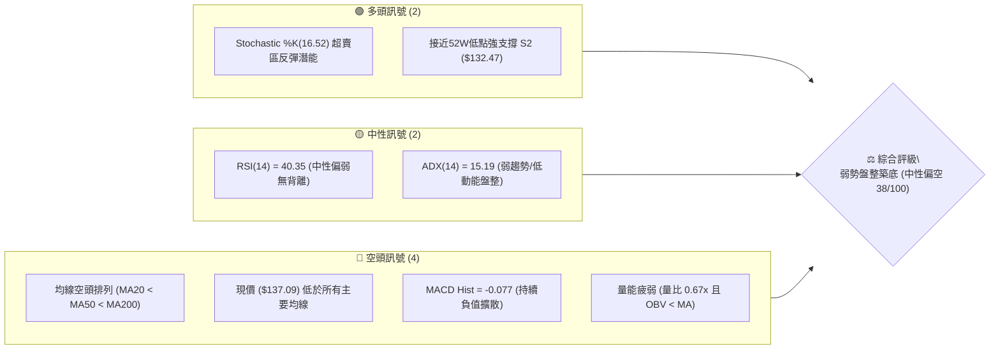
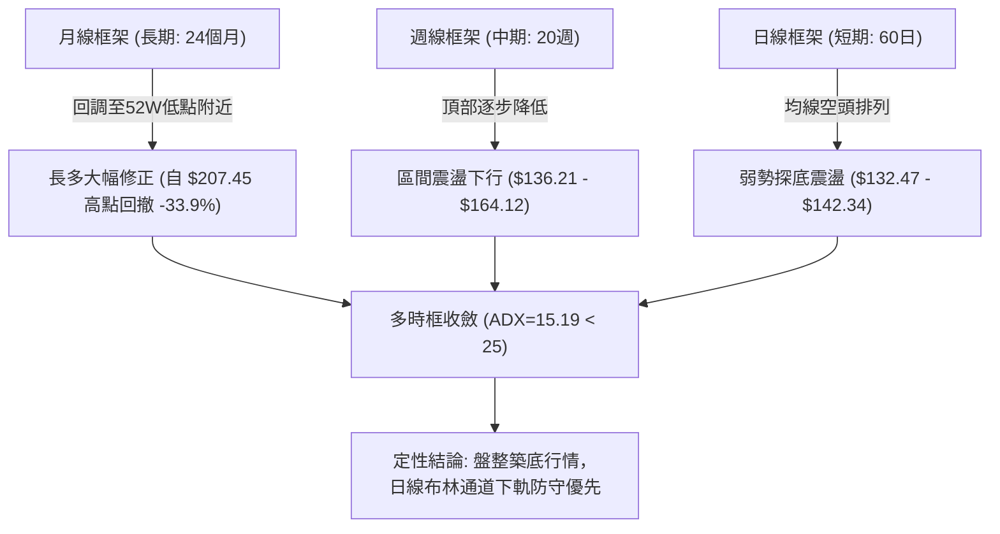
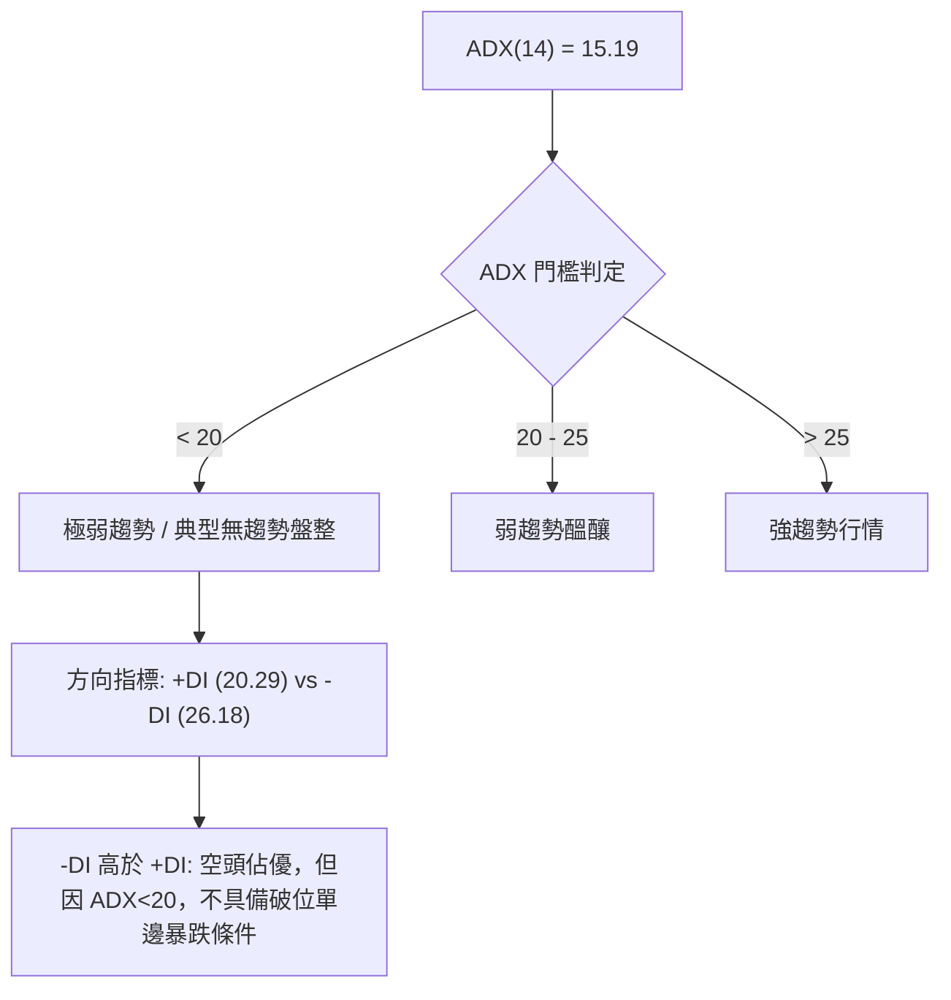
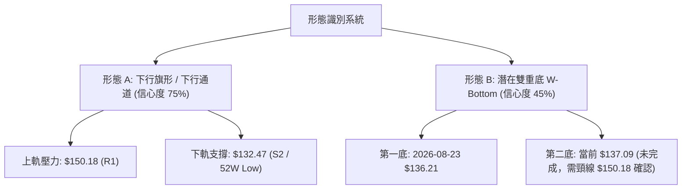
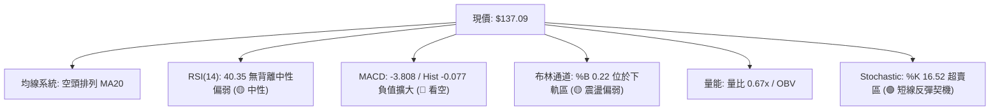
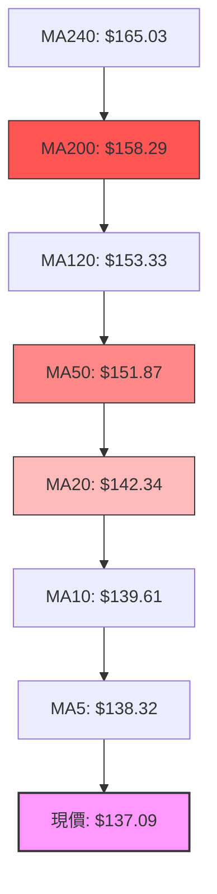
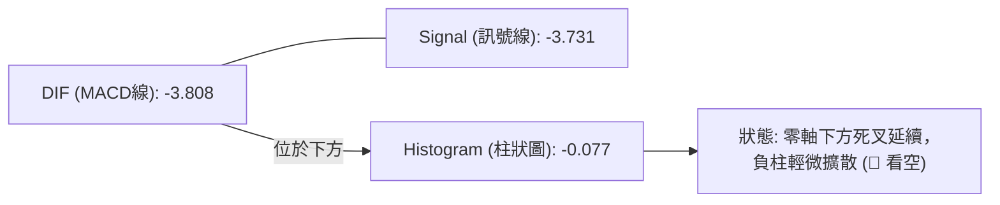
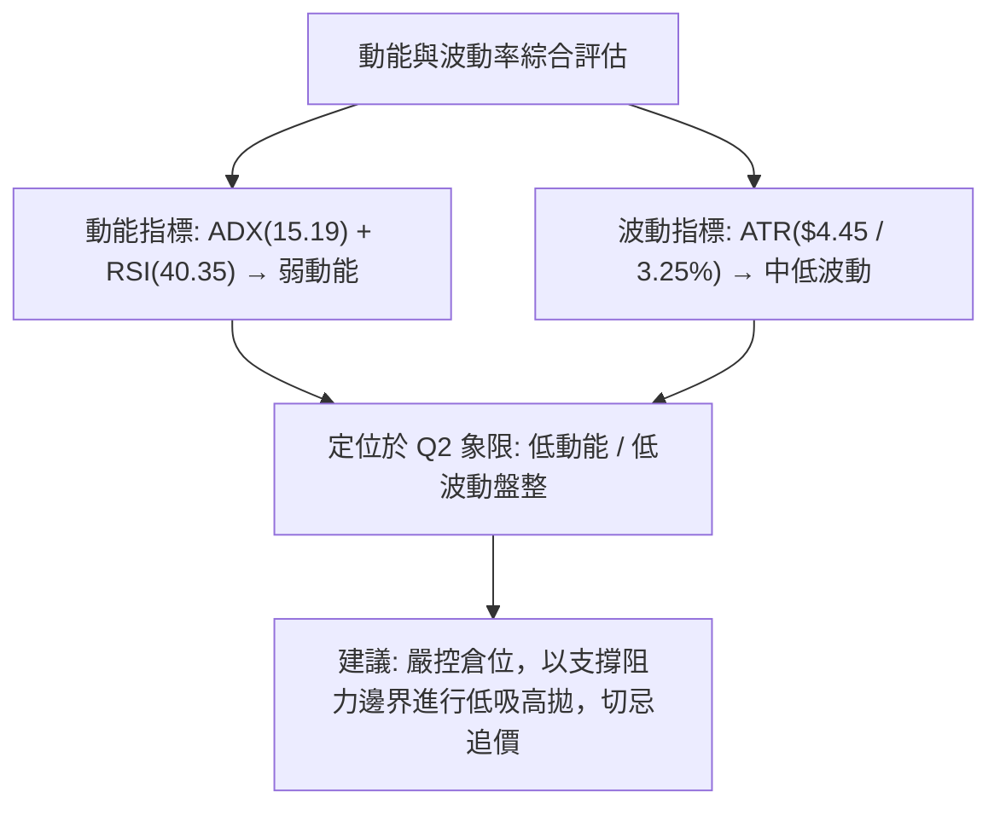
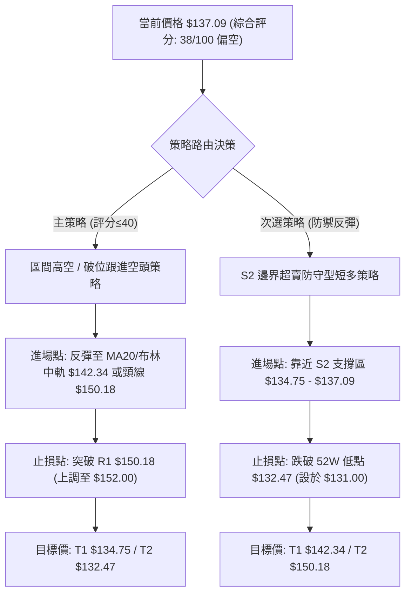
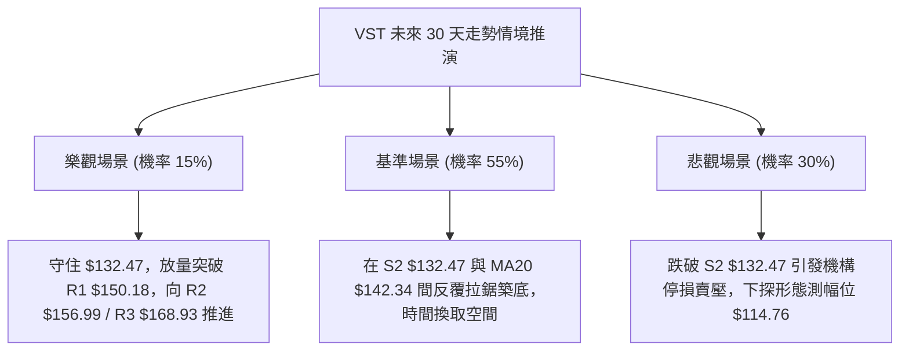

# VST 技術分析報告

> **報告日期**：2026-08-30 ｜ **語言**：繁體中文 ｜ **數據來源**：Yahoo Finance ｜ **當前價格**：$137.09

---

## 目錄

| 章節 | 內容 |
|------|------|
| [1. 技術面概覽](#1-技術面概覽) | 訊號儀表板、核心指標、評分卡 |
| [2. 趨勢分析](#2-趨勢分析) | 多時框趨勢、長中短期走勢 |
| [3. 圖表形態分析](#3-圖表形態分析) | 形態識別、K線組合、目標價 |
| [4. 支撐與阻力](#4-支撐與阻力) | 關鍵價位、斐波那契回調 |
| [5. 技術指標深度解讀](#5-技術指標深度解讀) | MA/RSI/MACD/布林/成交量 |
| [6. 動能與波動率](#6-動能與波動率) | 動能評估、ATR、Beta |
| [7. 多時框架總結](#7-多時框架總結) | 時框架評分矩陣 |
| [8. 交易策略建議](#8-交易策略建議) | 多空策略、風險報酬比 |
| [9. 風險提示與監控](#9-風險提示與監控) | 監控指標、風險場景 |
| [10. 報告總結](#-報告總結) | 關鍵結論與最優策略組合 |

---

## 1. 技術面概覽

### 🎯 技術訊號儀表板



### 📊 核心指標速覽表

| 指標類別 | 指標名稱 | 當前數值 | 訊號 | 解讀 |
|----------|----------|----------|------|------|
| **價格** | 當前價格 | $137.09 | 🔴 | 位於 52 週區間底部 5.3%，逼近歷史波段低點 |
| **均線** | MA20 | $142.34 | 🔴 | 價格低於 MA20 (-3.69%)，短期承壓 |
| **均線** | MA50 | $151.87 | 🔴 | 價格低於 MA50 (-9.73%)，中期空頭掌控 |
| **均線** | MA200 | $158.29 | 🔴 | 價格低於 MA200 (-13.39%)，長期均線下彎 |
| **動能** | RSI(14) | 40.35 | 🟡 | 位於 30–70 中性偏弱區，無頂底背離跡象 |
| **動能** | MACD | -3.808 | 🔴 | 快慢線均在零軸下方，Histogram 為 -0.077 |
| **震盪** | Stochastic | %K 16.52 / %D 28.55 | 🟢 | 進入超賣區，存在技術性短彈契機 |
| **趨勢** | ADX(14) | 15.19 | 🟡 | 趨勢強度極弱 (<25)，空方主導但動能衰竭 |
| **通道** | 布林通道 %B | 0.22 | 🟡 | 運行於中軌 ($142.34) 與下軌 ($132.82) 之間 |
| **量能** | 成交量 / 20MA | 0.67x | 🔴 | 日成交量 3.06M 低於均量，OBV 跌破均線 |
| **波動** | ATR(14) | $4.45 | 🟡 | 波動率佔股價 3.25%，處於正常震盪區間 |

### 🏆 技術評分卡

```
╔══════════════════════════════════════════════════════════════════╗
║                   技術評分卡 — VST (2026-08-30)                  ║
╠══════════════════════════════════════════════════════════════════╣
║ 趨勢強度 (Trend)     ███░░░░░░░░░░░░░░░░░  18/100 🔴 弱勢盤整    ║
║ 動能指標 (Momentum)  ███████░░░░░░░░░░░░░  35/100 🔴 空頭偏弱    ║
║ 支撐穩定度 (Support) ███████████░░░░░░░░░  55/100 🟡 靠近年低點  ║
║ 成交量配合 (Volume)  ██████░░░░░░░░░░░░░░  30/100 🔴 量縮弱勢    ║
║ 形態完整度 (Pattern) ████████░░░░░░░░░░░░  40/100 🟡 下行通道    ║
║ 均線排列 (MA System) ████░░░░░░░░░░░░░░░░  20/100 🔴 完全空頭    ║
╠══════════════════════════════════════════════════════════════════╣
║ 綜合技術評分         ███████░░░░░░░░░░░░░  38/100 🔴 偏空觀望    ║
╚══════════════════════════════════════════════════════════════════╝
```

---

## 2. 趨勢分析

### 🌐 多時框趨勢分析



### 📈 長期趨勢 — 12個月走勢圖（Unicode）

```
VST 月線走勢圖（過去12個月：2025-08 至 2026-08）
價格 ($)
$210 ┤                                      
$200 ┤  ● $195.11 (2025-09)                 
$190 ┤● $188.12    ● $187.52                 
$180 ┤                ● $178.12       ● $173.41 
$170 ┤                                      
$160 ┤                  ● $160.88 ● $157.91 ● $157.62 ● $160.01 ● $158.63
$150 ┤                                  ● $150.12            ● $148.19
$140 ┤                                                        ● $137.09 (現價)
$130 ┤
     └──────────────────────────────────────────────────────────
       08   09   10   11   12   01   02   03   04   05   06   07   08 (月份)
```

**走勢特徵分析表格**：

| 階段區間 | 起始價 → 結束價 | 漲跌幅 | 走勢特徵描述 |
|----------|----------------|--------|--------------|
| **2025-08 ~ 2025-10** | $188.12 → $187.52 | -0.32% | 高檔橫盤構築頂部，多頭動能鈍化 |
| **2025-11 ~ 2026-01** | $178.12 → $157.91 | -11.35% | 跌破高檔支撐，均線轉為下行展開第一波修正 |
| **2026-02 ~ 2026-04** | $173.41 → $157.62 | -9.11% | 反彈受阻於 $173.41 後再次回調，確立更低高點 (LH) |
| **2026-05 ~ 2026-08** | $160.01 → $137.09 | -14.32% | 平台破位下殺，成交量退潮，逼近 52 週低點 $132.47 |

### 📊 中期趨勢（週線分析）

從近 20 週數據觀察，價格呈現「下行階梯式震盪」：
- 高點聚類：2026-04-26 之 $164.12、2026-06-21 之 $163.52、2026-07-26 之 $163.38，三次均未能突破斐波那契 61.8% ($165.49) 與 R3 阻力區。
- 低點聚類：2026-05-17 之 $139.48、2026-08-23 之 $136.21，低點持續下移，但跌速在 8 月下旬明顯放緩。
- 週線成交量顯示：在 $160 以上放量滯漲，而在回落至 $136-$140 區間時週成交量萎縮至 18.68M，顯示殺跌動能已獲釋放。

### ⚡ 趨勢強度評估（ADX 解讀）



| 指標名稱 | 當前數值 | 閾值參考 | 趨勢定性 | 實務指引 |
|----------|----------|----------|----------|----------|
| **ADX(14)** | 15.19 | < 25 (弱) | 盤整市（Range-bound） | 順勢突破策略易失效，逆勢網格與通道邊界操作為宜 |
| **+DI** | 20.29 | - | 多方動能偏弱 | 尚未出現多頭發力訊號 |
| **-DI** | 26.18 | - | 空方動能主導 | 空方雖佔優但未達極端失衡 |

---

## 3. 圖表形態分析

### 🔍 形態識別系統



**形態信心度評估表**：

| 形態名稱 | 信心度 | 判斷依據（引用數據） | 完成度 | 目標價（附計算式） |
|----------|--------|----------------------|--------|--------------------|
| **下行通道 (Down Channel)** | 75% | 頂部受限於 MA50/R1 ($150.18)，底部受到 52W Low ($132.47) 支撐 | 85% | 跌破通道下軌目標：$132.47 - ($150.18 - $132.47) = $114.76；突破通道上軌目標：$150.18 + ($150.18 - $132.47) = $167.89 (近 R3 $168.93) |
| **雙重底 (Double Bottom 潛在)** | 45% | 2026-08-23 收盤 $136.21 形成前低，現價 $137.09 測試但尚未站上頸線 R1 | 35% (未成形) | 頸線 $150.18 + 形態高度 ($150.18 - $132.47 = $17.71) = $167.89 |
| **均線死叉空頭排列** | 90% | MA20 ($142.34) < MA50 ($151.87) < MA200 ($158.29) 均線組向下發散 | 100% | 指標型空頭壓制，第一反彈壓力為 MA20 ($142.34) |

### 🕯️ 重要K線形態分析

| 期間/月份 | 收盤價 | K線形態 | 解讀 | 訊號 |
|-----------|--------|---------|------|------|
| **2026-05** | $160.01 | 長下影反彈陽線 | 測試 $139.48 後強力拉升，確立 $139 具備波段承接力 | 🟢 中期買盤支撐 |
| **2026-06** | $158.63 | 高檔十字星 | 兩次上衝 $163.52 未果，量能退潮，多頭攻勢停滯 | 🟡 變盤警告 |
| **2026-07** | $148.19 | 中陰線實體跌破 | 跌破 MA20 與 MA50 匯聚區，下行趨勢重啟 | 🔴 空頭破位 |
| **2026-08-23 週** | $136.21 | 探底長下影錘頭 | 最低探至近 52 週低點，週 RSI 跌至 26.1 超賣 | 🟢 賣壓釋放訊號 |
| **2026-08-30 週** | $137.09 | 小實體紅K孕線 | 成交量縮減至 18.68M，企圖於 $136 之上構築短期底部 | 🟡 築底孕育中 |

### 📉 ASCII 走勢形態示意圖

```
VST 關鍵形態示意圖（日線/週線下行通道與潛在雙底）
價格 ($)
$168.93 ┼───────────────────────────────── [R3 強阻力 / 雙底理論目標 $167.89]
        │
$156.99 ┼──────────● (6/21 $163.52) ─────── [R2 阻力 / MA200 $158.29]
        │         / \       / \
$150.18 ┼────────/───\─────/───\─────────── [R1 頸線阻力 / MA50 $151.87]
        │       /     \   /     \
$142.34 ┼──────/───────\─/───────\───────── [MA20 / 布林中軌]
        │     /         V         \      ● $137.09 (現價)
$136.21 ┼────● (5/17)              ●────/─ [雙底左腳 $136.21 / 右腳 $137.09]
        │                           (8/23)
$132.47 ┴───────────────────────────────── [S2 強支撐 / 52W Low]
```

### 🎯 形態目標價計算

1. **下行通道上軌突破情境**：
   - 形態底邊支撐：$132.47
   - 通道頸線/上軌：$150.18 (R1)
   - 垂直高度 $H = \$150.18 - \$132.47 = \$17.71$
   - 向上突破測幅目標 $T_1 = \$150.18 + \$17.71 = \$167.89$（與 R3 $168.93 高度吻合）。
2. **下行破位下測情境**：
   - 若有效跌破 52W Low $132.47，則通道等幅下測目標 $T_{down} = \$132.47 - \$17.71 = \$114.76$。

---

## 4. 支撐與阻力

### 🗺️ 關鍵價位分布圖（Unicode）

```
╔══════════════════════════════════════════════════════════════════╗
║                   VST 關鍵價位結構分布圖                         ║
╠══════════════════════════════════════════════════════════════════╣
║ $218.91 ║████████████████████████║ 52週歷史高點 (Fib 0.0%)       ║
║ $198.51 ║████████████████        ║ Fib 23.6% 回調位             ║
║ $185.89 ║██████████████████      ║ Fib 38.2% 回調位             ║
║ $175.69 ║████████████████████    ║ Fib 50.0% 多空分水嶺         ║
║ $168.93 ║████████████████████████║ 強阻力 R3 (Fib 61.8%: $165.49)║
║ $156.99 ║████████████████        ║ 阻力 R2 / MA200 ($158.29)    ║
║ $150.18 ║████████████████████████║ 關鍵阻力 R1 (Fib 78.6% $150.97║
║ $142.34 ║────────────────────────║ 短期壓制 MA20 / 布林中軌     ║
║ $137.09 ╠════════════════════════╣ ◄ 現價 (Current Price)        ║
║ $134.75 ║▓▓▓▓▓▓▓▓▓▓▓▓▓▓▓▓        ║ 近期支撐 S1                  ║
║ $132.47 ║████████████████████████║ 強支撐 S2 / 52週低點 (100.0%) ║
╚══════════════════════════════════════════════════════════════════╝
```

### 🚧 阻力位分析表

| 阻力級別 | 價位 | 形成原因 | 突破難度 | 重要性 |
|----------|------|----------|----------|--------|
| **R1** | $150.18 | 近一年波段高點聚類、MA50 ($151.87) 及 Fib 78.6% ($150.97) 共振區 | ⭐️⭐️⭐️ 中等 | 極高（短線多空分水嶺） |
| **R2** | $156.99 | 波段高點聚類、MA200 ($158.29) 下壓處 | ⭐️⭐️⭐️⭐️ 困難 | 高（中期牛熊轉換位） |
| **R3** | $168.93 | 近一年頂部密集區、Fib 61.8% ($165.49) 上方強阻力帶 | ⭐️⭐️⭐️⭐️⭐️ 極難 | 極高（多頭反轉最終目標） |

### 🛡️ 支撐位分析表

| 支撐級別 | 價位 | 形成原因 | 守住機率 | 重要性 |
|----------|------|----------|----------|--------|
| **S1** | $134.75 | 近一年波段低點聚類、近期日線震盪下影線密集區 | 65% | 中等（短線第一防線） |
| **S2** | $132.47 | 52週絕對低點、Fib 100.0% 回調位、布林下軌 ($132.82) 匯聚 | 80% | 極高（年線級別生命線） |

### 📐 斐波那契回調位分析

*回調基準區間：52週高點 $218.91 至 52週低點 $132.47，總落差 $86.44*

- **0.0% ($218.91)**：52 週歷史高點，目前處於完全遠離狀態。
- **23.6% ($198.51)**：高檔整理平台破位處。
- **38.2% ($185.89)**：2025 年秋季頭部震盪中軸。
- **50.0% ($175.69)**：大週期多空平衡點，現已轉為強烈中長期阻力。
- **61.8% ($165.49)**：黃金分割關鍵阻力，2026 年多次反彈高點均止步於此下方。
- **78.6% ($150.97)**：深度修正位，與 R1 ($150.18) 及 MA50 ($151.87) 形成強大阻力共振帶。
- **100.0% ($132.47)**：52 週最低點，代表 100% 回撤完成。

**現價定位解讀**：現價 $137.09 處於 Fib 78.6% ($150.97) 與 Fib 100.0% ($132.47) 之間的「極端深度回調區間」（距 52W 低點僅 3.48%）。該區域通常為長期價值型機構重新評估進場的區間，但向上反彈將在 $150.18–$150.97 遭遇極強技術拋壓。

---

## 5. 技術指標深度解讀

### 🎛️ 指標訊號總覽



### 📈 移動平均線排列分析



- **均線排列狀態**：當前呈現標準且嚴格的「完全空頭排列」（MA5 < MA10 < MA20 < MA60 < MA120 < MA240）。
- **斜率與乖離率**：各均線斜率皆為負值（▼）。現價距 MA20 乖離為 -3.69%，距 MA50 乖離為 -9.73%，距 MA200 乖離為 -13.39%。負乖離尚未達到歷史極端值（通常 > -15% 觸發報復性反彈），顯示下行雖緩慢但壓制力道紮實。

### 📉 RSI(14) 分析

```
RSI(14) 讀數儀表:
[0] ────────── [30] ──────●────── [70] ────────── [100]
                      40.35 (中性偏弱)
進度條: ████████░░░░░░░░░░░░ 40.35%
```

- **超買超賣狀態**：RSI 目前處於 40.35，未跌入 30 以下極端超賣區，亦遠離 50 中軸，呈現弱勢整理。
- **背離分析**：
  - 價格在 2026-08-23 創收盤低點 $136.21 時，週 RSI 為 26.1；現價 $137.09 對應 RSI 為 40.4。
  - **結論**：日線與週線上「**無明顯頂背離或底背離**」，RSI 的回升僅屬超賣修復，尚未形成經典底背離形態。

### 📊 MACD(12/26/9) 訊號解讀



- **快慢線位置**：MACD (-3.808) 位於訊號線 (-3.731) 下方，兩者均在零軸深處運行，顯示長期下行動能尚未由負轉正。
- **柱狀圖動態**：Histogram 由前期的 -0.008 擴大至 -0.077，顯示空方動能雖未急劇爆發，但仍掌握盤面主導權。

### 📦 布林通道分析

```
VST 日線布林通道結構 (20, 2)
$151.86 ┬───────────────────────────────── BB 上軌 (+2σ)
        │
$142.34 ┼───────────────────────────────── BB 中軌 (MA20)
        │
$137.09 ┼──────────● (現價, %B = 0.22)
        │
$132.82 ┴───────────────────────────────── BB 下軌 (-2σ)
```

- **通道帶寬與位置**：上軌 $151.86 與下軌 $132.82 形成約 $19.04 的波動帶。現價 $137.09 處於 %B = 0.22 位置，顯著貼近下軌。
- **軌道解讀**：中軌 $142.34 持續向下傾斜，布林通道呈現開口向下的弱勢格局。只要價格無法帶量站上中軌 $142.34，任何貼近下軌的反彈均屬弱勢震盪。

### 💹 成交量分析（量價配合度）

- **量比與均量**：最新日成交量為 3,059,500 股，相較於 20 日均量 (4,580,670 股) 量比僅為 0.67x；相較於 50 日均量 (4,377,404 股) 亦明顯萎縮。
- **OBV 能量潮趨勢**：當前 OBV < MA(OBV)，能量潮指標呈現下降趨勢，顯示在近期的回調過程中，資金主動進場承接意願偏低，呈現「量縮陰跌」特徵。
- **量價背離判定**：下跌縮量顯示市場並未出現恐慌性拋盤，但也反映出多頭買盤力量不足，缺乏向上推動價格反轉的大級別資金介入。

---

## 6. 動能與波動率

### ⚡ 動能評估四象限

| 象限代號 | 動能強度 | 波動率特徵 | 當前狀態標註 | 操作意涵與策略評估 |
|----------|----------|------------|--------------|--------------------|
| **Q1** | 強 (High) | 低 (Low) | — | 穩健單邊升勢（最佳趨勢做多區間） |
| **Q2** | 弱 (Low) | 低 (Low) | **✓ 當前定位** | **弱勢盤整築底（謹慎觀望，區間網格操作）** |
| **Q3** | 強 (High) | 高 (High) | — | 單邊突破/暴跌（高風險、高動能追隨） |
| **Q4** | 弱 (Low) | 高 (High) | — | 無序劇烈震盪（洗盤行情，避免參與） |



### 📊 ATR 波動率分析

- **ATR(14) 絕對值**：$4.45，佔當前股價比例為 **3.25%**。
- **日內波動區間預估**：預期單日正常波動區間為現價 $\pm \$4.45$（約在 $132.64 至 $141.54 之間）。
- **止損距離設置指引**：
  - 保守型交易（1.5 倍 ATR）：止損緩衝空間應設為 $\$4.45 \times 1.5 = \$6.68$。
  - 緊密型交易（1.0 倍 ATR）：止損緩衝空間應設為 $\$4.45 \times 1.0 = \$4.45$。

### 📐 Beta 與市場相關性

- **Beta 係數**：**1.433**。
- **市場敏感度解讀**：VST 屬於高 Beta 標的，當標普 500 指數或公用事業板塊波動 1% 時，該股理論上將產生約 1.43% 的同向波動。
- **機構持股與空頭水位**：機構持股高達 **92.1%**，空頭佔流通盤比例 (Short % Float) 僅 **3.3%**，空頭回補天數 (Short Ratio) 為 **2.04**。這表明雖然當前處於技術修正期，但未出現大規模機構空頭對沖做空，下跌主要受制於基本面成長放緩（YoY 營收 -5.5%）與板塊資金輪動。

---

## 7. 多時框架總結

### 📋 時框架評分表

| 時框架 | 趨勢方向 | 動能狀態 | 均線排列 | 形態結構 | 綜合評分 | 交易指引建議 |
|--------|----------|----------|----------|----------|----------|--------------|
| **月線 (長期)** | 🟡 中性回調 | 弱化 (高檔回落) | 多頭受損 (MA下測) | 52W高點大幅修正 | 50/100 | 關注 $132.47 長期防守效力 |
| **週線 (中期)** | 🔴 震盪下行 | 負向 (MACD柱負) | 空頭排列 | 下行階梯震盪 | 35/100 | 反彈遇 R1/R2 面臨沈重解套盤 |
| **日線 (短期)** | 🔴 弱勢築底 | 超賣修復 (Stoch<20) | 完全空頭排列 | 貼近布林下軌震盪 | 38/100 | 以布林通道下軌與 S2 為止損做短彈 |

### 🔲 綜合訊號矩陣

```
╔══════════════════════════════════════════════════════════════════╗
║                   多時框架綜合訊號矩陣                           ║
╠══════════════════════════════════════════════════════════════════╣
║ 評估維度      │ 短期 (日線)    │ 中期 (週線)    │ 長期 (月線)    ║
╠══════════════╪════════════════╪════════════════╪════════════════╣
║ 趨勢方向      │ 🔴 空頭壓制    │ 🔴 震盪下行    │ 🟡 大週期回調  ║
║ 動能指標      │ 🟢 超賣鈍化    │ 🔴 MACD空頭    │ 🟡 RSI回落中性 ║
║ 均線狀態      │ 🔴 均線反壓    │ 🔴 跌破MA20/50 │ 🟡 逼近年線支撐║
║ 量價配合      │ 🔴 量縮疲弱    │ 🔴 上漲縮量    │ 🟡 高檔放量後縮║
║ 支撐阻力結構  │ 🟡 逼近 S1/S2  │ 🔴 遠離 R1/R2  │ 🟢 處於回撤下沿║
╚══════════════════════════════════════════════════════════════════╝
```

### ⚖️ 多時框收斂結論

依據多時框收斂規則：
1. **行情定性**：當前 ADX(14) = 15.19 < 25，明確判定市場處於「**低動能盤整築底行情**」。
2. **主導時框與優先級**：在盤整行情中，單邊趨勢均線指標容易產生鈍化假訊號，**應以日線布林通道上下軌（$132.82 – $151.86）及波段聚類支撐阻力位為主要交易依據**。
3. **唯一方向性結論**：**偏空觀望，等待區間底部企穩訊號（綜合評分 38/100）**。中期趨勢雖偏空，但現價已極度貼近 52 週低點強支撐 S2 ($132.47)，空單追跌盈虧比極差；多單則須嚴格控制在 S2 止損邊界內進行左側防禦性試倉。

---

## 8. 交易策略建議

### 🗺️ 策略決策流程圖



### 🧭 策略路由

> **當前主策略方向 = 空頭壓制下的區間高空與破位防禦（依評分 38/100 判定）**

由於綜合評分低於 40 分，技術結構完全處於均線空頭壓制下，主策略應採取**反彈阻力位做空**或**觀望等待支撐確認**；多頭操作僅能作為「超跌邊界反彈」的次級輔助策略。

### 🎯 價格情境階梯（Price Scenarios）

| 觸發條件 | 下一目標 | 後續延伸 | 情境含義 |
|----------|----------|----------|----------|
| **突破 R1 $150.18** | R2 $156.99 | R3 $168.93 | 站上 MA50 與頸線，空頭排列化解，短線轉強確立雙底 |
| **反彈受阻 $142.34 (MA20)** | S1 $134.75 | S2 $132.47 | 均線反壓有效，維持布林通道下軌弱勢震盪 |
| **跌破 S1 $134.75** | S2 $132.47 | $114.76 (形態測幅) | 測試 52 週最低點；若再失守 S2，將打開新一輪下行空間 |

### 📊 情境機率分佈

| 情境 | 機率 | 主要依據 |
|------|------|----------|
| **情境 A：區間弱勢震盪 ($132.47–$142.34)** | **55%** | ADX(15.19) 顯示無趨勢動能，布林帶寬收窄，成交量萎縮 |
| **情境 B：破位下行測試或跌破 S2 ($132.47)** | **30%** | 全均線空頭排列，MACD 負值擴散，OBV 疲軟無買盤介入 |
| **情境 C：強勢反彈突破 R1 ($150.18)** | **15%** | Stochastic 超賣修復，但上方受制於密集套牢區，需放量翻倍配合 |

### 🔴 主策略詳情（空頭壓制與區間操作）

| 策略要素 | 策略 A（主推：反彈遇阻做空） | 策略 B（次選：S2 邊界博弈短多） |
|----------|------------------------------|----------------------------------|
| **策略類型** | 順應均線趨勢高空 | 支撐位極限逆勢短多 |
| **進場條件** | 股價反彈至 MA20/布林中軌遇阻受挫 | 股價回踩 S1/S2 不破且出現底部分時放量 |
| **進場價格** | **$142.34** | **$134.75** |
| **目標價 T1** | **$134.75** (近期支撐 S1) | **$142.34** (MA20 / 布林中軌) |
| **目標價 T2** | **$132.47** (52週強支撐 S2) | **$150.18** (關鍵阻力 R1) |
| **止損價格** | **$146.50** (突破 MA20 上方 1 ATR) | **$131.00** (跌破 52W 低點 S2 緩衝區) |
| **風險報酬比** | **1.82 : 1** (目標收益 $7.59 / 承擔風險 $4.16) | **2.02 : 1** (目標收益 $7.59 / 承擔風險 $3.75) |
| **成功機率** | **60%** | **45%** |
| **建議倉位** | **15% - 20%** | **5% - 10% (輕倉試探)** |

### 🔴 反向風險觸發點（風控對沖提示）

- **多頭反轉觸發位**：若日線收盤價強勢突破 **$150.18 (R1)** 且伴隨單日成交量放大至 6.0M 以上，代表下行通道被實質向上突破，所有空頭策略必須無條件止損出局，並轉為右側追多。
- **空頭加速觸發位**：若日線帶量跌破 **$132.47 (S2)**，將打破 52 週大底，形成破位暴跌走勢，多頭必須立即砍倉止損，切勿盲目抄底。

### ⭐ 整體訊號強度評星

```
做多訊號強度：★★☆☆☆  (2.0/5星 — 僅超賣支撐，缺乏形態確認)
做空訊號強度：★★★★☆  (3.8/5星 — 均線與動能全線看空，唯空間受限於S2)
整體可信度：  ★★★☆☆  (3.5/5星 — 盤整市震盪，需嚴守關鍵點位)
```

---

## 9. 風險提示與監控

### ✅ 關鍵監控指標 Checklist

```
╔══════════════════════════════════════════════════════════════════╗
║                   每日交易監控清單 (Checklist)                   ║
╠══════════════════════════════════════════════════════════════════╣
║ [ ] 價格是否跌破 52 週低點 S2 ($132.47)                          ║
║ [ ] 價格是否向上突破 MA20 ($142.34) 或 R1 ($150.18)              ║
║ [ ] MACD Histogram 是否由負翻正 (站上 0 軸)                      ║
║ [ ] RSI(14) 是否跌破 30 (進入極端超賣) 或突破 50 (強弱分水嶺)    ║
║ [ ] 日成交量是否放大至 20 日均量 (4.58M) 的 1.5 倍以上           ║
║ [ ] ADX(14) 是否由 15 上升至 25 以上 (代表單邊趨勢啟動)         ║
╚══════════════════════════════════════════════════════════════════╝
```

### ⚠️ 風險場景分析



### 🛡️ 風險管理重要提醒

1. **基本面與估值背離風險**：
   - 儘管華爾街分析師共識目標價均值達 **$217.42**（推薦評級為 Strong Buy，評級機構如 Mizuho、Morgan Stanley 近期重申 Overweight/Buy），但技術面呈現明顯的滯後下行與均線壓制。**嚴禁因基本面看好而在技術破位時忽視止損紀律**。
2. **高槓桿財務體質風險**：
   - 資產負債表顯示總負債高達 $20.51B，淨債務 $-20.07B，Debt/Equity 高達 373.28，流動比率 0.973、速動比率 0.258 偏低。在利率維持高檔環境下，財務槓桿壓制了股價估值彈性。
3. **倉位管理與資金分配**：
   - 在 ADX < 25 的盤整震盪期，總倉位應嚴格控制在 **20%–30% 以內**。
   - 單筆交易的最大虧損金額不得超過總投資本金的 **1.0%–1.5%**。若在 $137.09 進場多單，以 $131.00 為止損（風險 $6.09/股，約 4.4%），則單一標的倉位不應超過總資金的 25%。

---

## 📋 報告總結

```
╔══════════════════════════════════════════════════════════════════╗
║                   VST 技術分析報告總結                           ║
╠══════════════════════════════════════════════════════════════════╣
║ 報告日期：2026-08-30                                             ║
║ 當前價格：$137.09                                                ║
║ 分析評級：⚖️ 偏空弱勢盤整 (綜合技術評分: 38/100)                ║
╠══════════════════════════════════════════════════════════════════╣
║ 關鍵結論：                                                       ║
║ ├─ 長期趨勢：🟡 月線高檔回撤 33.9%，逼近年線支撐區              ║
║ ├─ 中期趨勢：🔴 週線空頭排列，下行通道壓制於 R1 ($150.18)        ║
║ ├─ 短期趨勢：🔴 日線貼近布林下軌 ($132.82)，超賣修復中          ║
║ ├─ 關鍵支撐：S1: $134.75  │  S2: $132.47 (52週絕對低點)         ║
║ ├─ 關鍵阻力：R1: $150.18  │  R2: $156.99  │  R3: $168.93        ║
║ └─ 華爾街共識目標價：$217.42 (19位分析師，評級: Strong Buy)     ║
╠══════════════════════════════════════════════════════════════════╣
║ 最優策略組合：                                                   ║
║ 1. 🥇 最佳機會（順勢高空）：反彈至 MA20 ($142.34) 遇阻做空，     ║
║    止損設 $146.50，目標下看 S1 ($134.75) / S2 ($132.47)。        ║
║ 2. 🥈 次選機會（邊界短多）：回踩 S1 ($134.75) 不破輕倉試多，     ║
║    嚴格止損 $131.00，短線目標 MA20 ($142.34)。                   ║
║ 3. 🥉 保守選擇（觀望等待）：暫停交易，等待價格放量突破 R1        ║
║    ($150.18) 確立雙底，或跌破 S2 ($132.47) 宣洩賣壓後再行介入。  ║
╚══════════════════════════════════════════════════════════════════╝
```

---

> ⚠️ **免責聲明**：本報告為 AI 自動生成之技術分析，所有數據及估算均基於提供的歷史價格資訊。本報告**僅供研究與學術參考**，**不構成任何投資建議**。投資有風險，入市需謹慎。

---

*報告生成時間：2026-08-30 ｜ 數據來源：Yahoo Finance ｜ 分析框架：多時框技術分析*