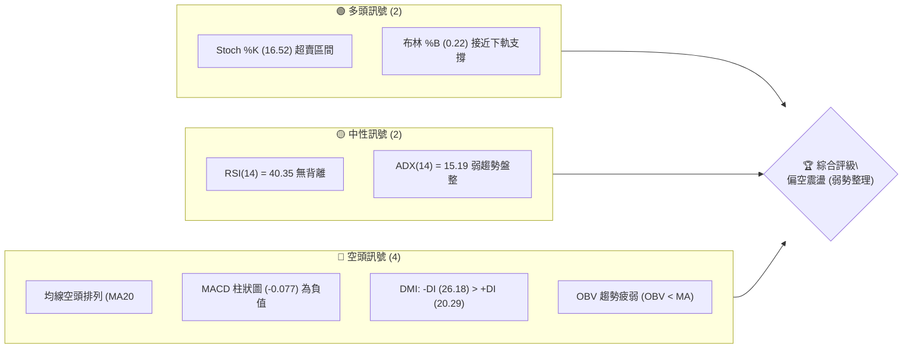
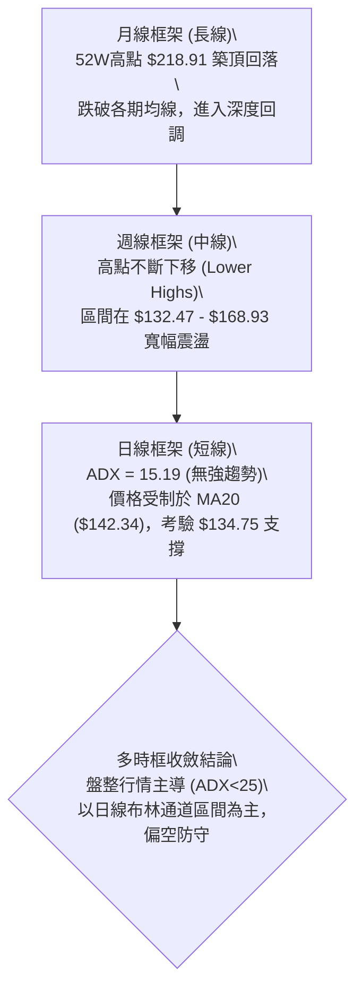
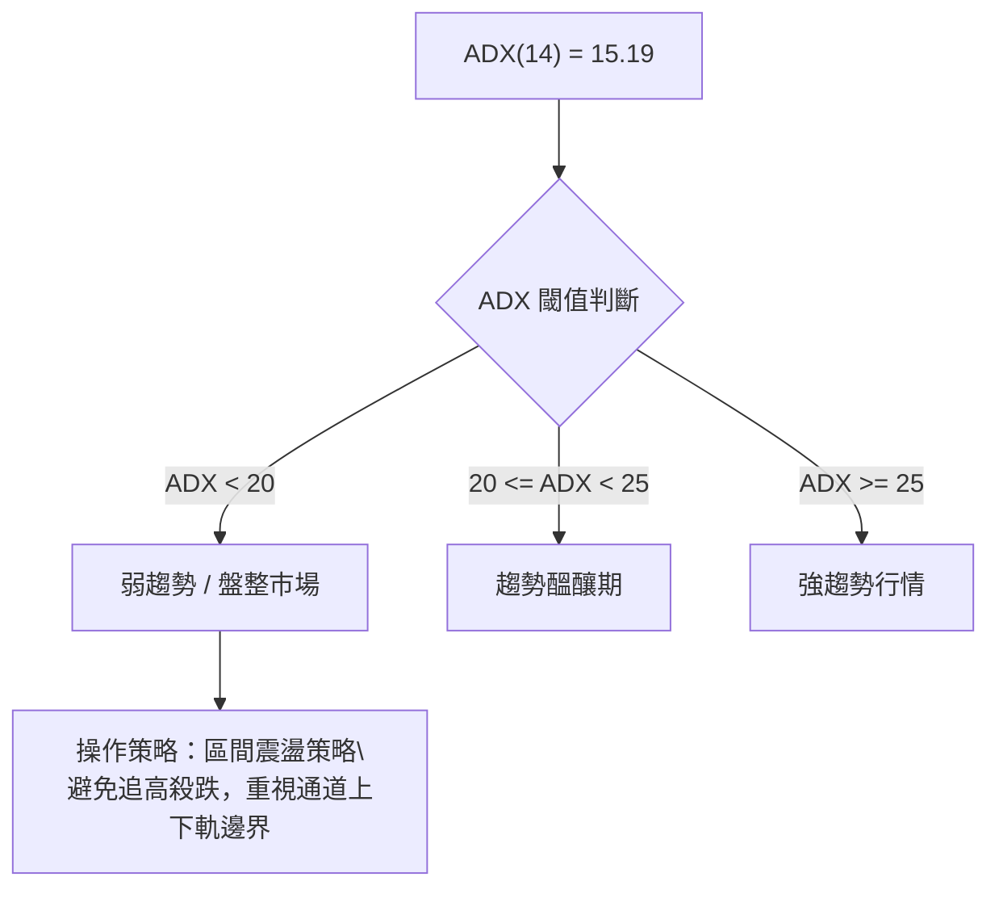
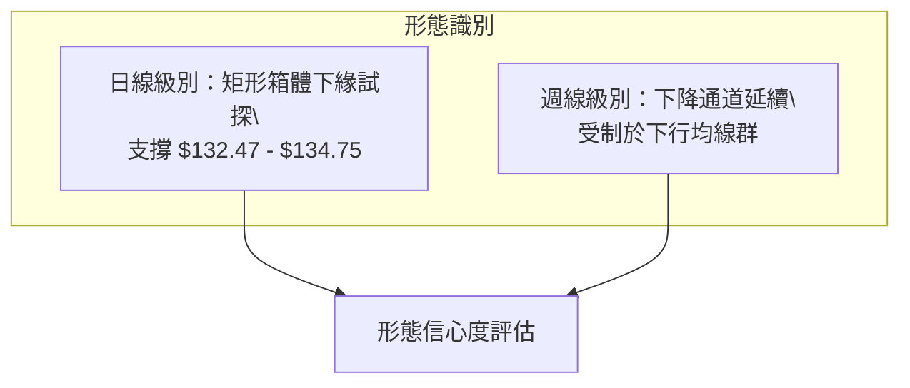
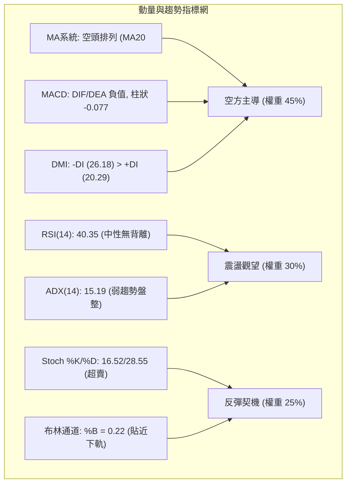
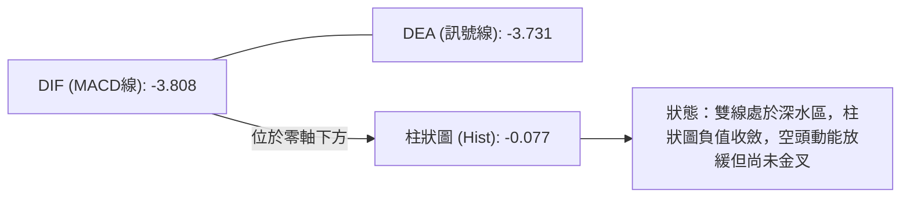
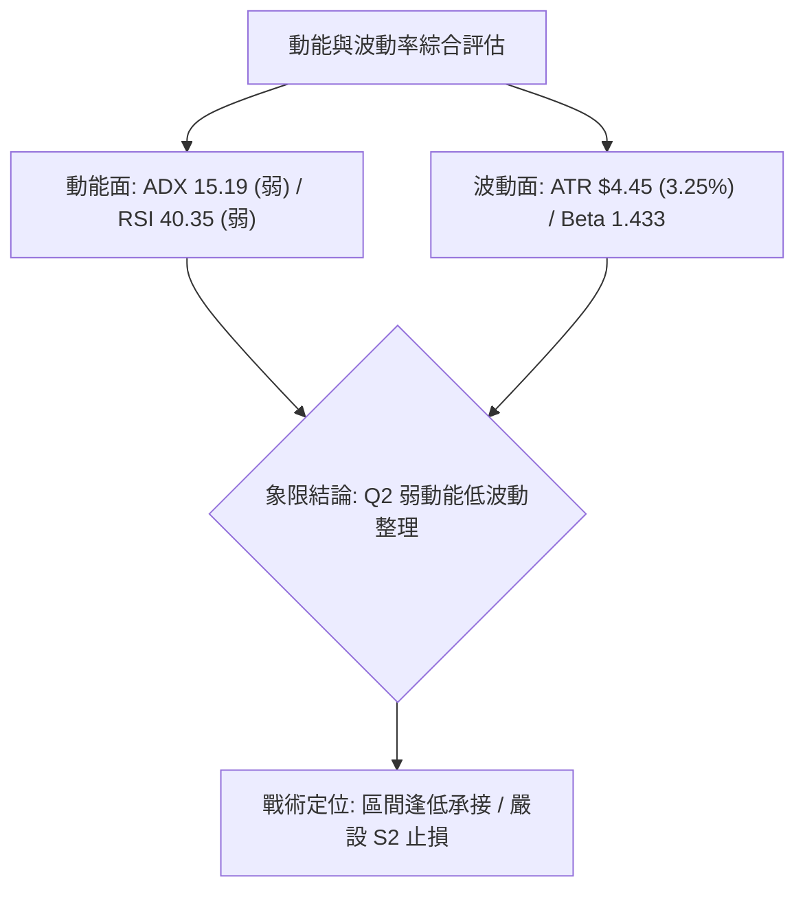
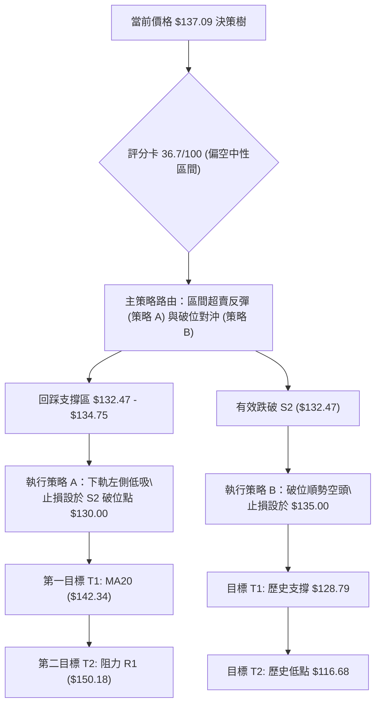
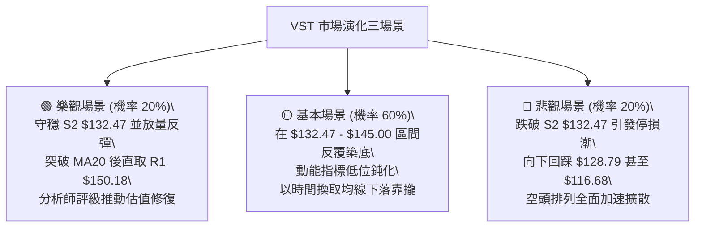

# VST 技術分析報告

> **報告日期**：2026-08-31 ｜ **語言**：繁體中文 ｜ **數據來源**：Yahoo Finance ｜ **當前價格**：$137.09

---

## 目錄

| 章節 | 內容 |
|------|------|
| [1. 技術面概覽](#1-技術面概覽) | 訊號儀表板、核心指標、評分卡 |
| [2. 趨勢分析](#2-趨勢分析) | 多時框趨勢、長中短期走勢 |
| [3. 圖表形態分析](#3-圖表形態分析) | 形態識別、K線組合、目標價 |
| [4. 支撐與阻力](#4-支撐與阻力) | 關鍵價位、斐波那契回調 |
| [5. 技術指標深度解讀](#5-技術指標深度解讀) | MA/RSI/MACD/布林/成交量 |
| [6. 動能與波動率](#6-動能與波動率) | 動能評估、ATR、Beta |
| [7. 多時框架總結](#7-多時框架總結) | 時框架評分矩陣 |
| [8. 交易策略建議](#8-交易策略建議) | 多空策略、風險報酬比 |
| [9. 風險提示與監控](#9-風險提示與監控) | 監控指標、風險場景 |

---

## 1. 技術面概覽

### 🎯 技術訊號儀表板



### 📊 核心指標速覽表

| 指標類別 | 指標名稱 | 當前數值 | 訊號 | 解讀 |
|----------|----------|----------|------|------|
| **價格** | 當前價格 | $137.09 | 🔴 | 位於 52 週區間底部的 5.3%，結構偏弱 |
| **均線** | MA20 | $142.34 | 🔴 | 價格低於 MA20 (-3.69%)，短期承壓 |
| **均線** | MA50 | $151.87 | 🔴 | 價格低於 MA50 (-9.73%)，中期走空 |
| **均線** | MA200 | $158.29 | 🔴 | 價格低於 MA200 (-13.39%)，長期轉弱 |
| **動能** | RSI(14) | 40.35 | 🟡 | 處於 30-70 中性偏弱區間，無明顯背離 |
| **動能** | MACD (12,26,9) | -3.808 / -3.731 | 🔴 | DIF < DEA 且柱狀圖為 -0.077，空頭控盤 |
| **動能** | Stoch %K / %D | 16.52 / 28.55 | 🟢 | 進入 20 以下超賣區，短線具備技術反彈條件 |
| **趨勢** | ADX(14) | 15.19 | 🟡 | ADX < 25 表明處於弱趨勢／低動能盤整行情 |
| **趨勢** | DMI (+DI / -DI) | 20.29 / 26.18 | 🔴 | -DI 大於 +DI，空方力量佔優 |
| **通道** | 布林通道 (%B) | 0.22 (寬度 $19.04) | 🟡 | 價格貼近下軌 $132.82，處於下軌反彈潛在區 |
| **量能** | 量比 (20MA) | 0.67x (3.06M) | 🔴 | 量能萎縮，OBV 跌破均線，追價意願不足 |
| **波動** | ATR(14) | $4.45 (3.25%) | 🟡 | 每日平均波動適中，提供風控基準 |

### 🏆 技術評分卡

```
╔══════════════════════════════════════════════════════════╗
║              技術評分卡 — VST (2026-08-31)               ║
╠══════════════════════════════════════════════════════════╣
║ 趨勢強度 (Trend)     ██████░░░░░░░░░░░░░░  30/100  🔴 空頭主導  ║
║ 動能指標 (Momentum)  ████████░░░░░░░░░░░░  40/100  🟡 超賣初顯  ║
║ 支撐穩定度 (Support) ████████████░░░░░░░░  60/100  🟡 S1/S2防守 ║
║ 成交量配合 (Volume)  ██████░░░░░░░░░░░░░░  30/100  🔴 量縮疲弱  ║
║ 形態完整度 (Pattern) ████████░░░░░░░░░░░░  40/100  🟡 區間築底  ║
║ 均線排列 (MA System) ████░░░░░░░░░░░░░░░░  20/100  🔴 典型空頭  ║
╠══════════════════════════════════════════════════════════╣
║ 綜合評分             ███████░░░░░░░░░░░░░  36.7/100 🔴 偏空震盪 ║
╚══════════════════════════════════════════════════════════╝
```

---

## 2. 趨勢分析

### 🌐 多時框趨勢分析



### 📈 長期趨勢 — 12個月走勢圖（Unicode）

```
VST 月線走勢圖（過去12個月：2025-09 至 2026-08）
價格軸 ($)
$210 ┤
$195 ┤  ● (09月 $195.11)
$185 ┤      ● (10月 $187.52)
$175 ┤          ● (11月 $178.12)      ● (02月 $173.41)
$160 ┤              ● (12月 $160.88)          ● (05月 $160.01)
$150 ┤                  ● (01月 $157.91)  ● (03月 $150.12)  ● (06月 $158.63)
$140 ┤                                                ● (07月 $148.19)
$130 ┤                                                            ● (08月 $137.09)←現價
     └─────────────────────────────────────────────────────────────────────────────
        09  10  11  12  01  02  03  04  05  06  07  08 (月份)
```

**走勢特徵分析表格**：

| 階段 | 時間區間 | 起止價格 | 漲跌幅 | 走勢特徵與量價結構 |
|------|----------|----------|--------|--------------------|
| 頂部回落期 | 2025-09 ~ 2026-01 | $195.11 → $157.91 | -19.07% | 自歷史高點區域震盪走低，均線開始拐頭向下 |
| 弱勢反彈期 | 2026-01 ~ 2026-02 | $157.91 → $173.41 | +9.82% | 跌深反彈測試上方壓力，於 $173.41 受阻 |
| 區間拉鋸期 | 2026-02 ~ 2026-06 | $173.41 → $158.63 | -8.52% | 於 $150.12 至 $160.01 窄幅整理，動能逐步衰退 |
| 破位下行期 | 2026-06 ~ 2026-08 | $158.63 → $137.09 | -13.58% | 跌破多道中期均線，逼近 52 週低點 $132.47 |

### 📊 中期趨勢（週線分析）

```
中期阻力/支撐階梯圖（週線結構）
$168.93 ─────────────────────── [強阻力 R3 / 密集換手區]
           ▲
$156.99 ───┼─────────────────── [阻力 R2 / 60週均線區間]
           │    ▲
$150.18 ───┼────┼────────────── [關鍵阻力 R1 / MA50 壓制]
═══════════╪════╪══════════════ 
$137.09 ───●────●────────────── [當前現價 / 弱勢整理]
           │    │    ▲
$134.75 ───┴────┴────┼───────── [近期波段支撐 S1]
$132.47 ─────────────┴───────── [52週歷史強支撐 S2]
```

中期走勢呈現清晰的「下降階梯」，近 20 週高點由 2026-04-26 的 $164.12 降至 2026-07-26 的 $163.38，近期更快速跌落至 $137.09。週線 MACD 柱狀圖在零軸附近徘徊（最新為 -0.077），顯示中期動能處於空方壓制下的低位沉寂期。

### ⚡ 趨勢強度評估（ADX 解讀）



**ADX 趨勢強度對照解析**：
- **ADX(14) 數值**：15.19，遠低於 25 的趨勢分界線，定義為典型「無趨勢／盤整行情」。
- **方向性指標**：+DI 為 20.29，-DI 為 26.18，-DI 佔據優勢，說明在當前的弱勢盤整中，空方佔據主要邊際定價權。
- **結論**：目前市場缺乏單邊推動資金，行情主要由超賣反彈與區間拉鋸構成。

---

## 3. 圖表形態分析

### 🔍 形態識別系統



**形態信心度表格**：

| 形態 | 信心度 | 判斷依據（引用數據） | 完成度 | 目標價（附計算式） |
|------|--------|----------------------|--------|--------------------|
| **雙底潛在築底 (W底)** | 55% | 價格逼近 52W 低點 S2 $132.47 與波段低點 S1 $134.75，若在此獲得有效支撐將形成雙重底架構 | 40% (尚未突破頸線) | 頸線 R1 $150.18 + 形態高度 ($150.18 - $132.47 = $17.71) = **$167.89** (接近 R3 $168.93) |
| **下降通道 (Descending Channel)** | 75% | 自 2026-02 高點 $173.41、06 月 $163.52 形成連續下降高點，低點陸續下探 $136.21 | 85% | 通道下軌支撐測算約為 S2 **$132.47** |
| **頭肩底 / 三角形收斂** | 30% | 數據中未偵測到完整幾何結構，訊號不足 | 0% | 訊號不足，僅做指標型解讀 |

### 🕯️ 重要K線形態分析

| 月份 / 週別 | 收盤價 | K線形態 | 解讀 | 訊號 |
|-------------|--------|---------|------|------|
| 2026-05-17 (週) | $139.48 | 長下影陰線 | 空頭急殺後浮現買盤，打出短期低點 | 🟡 止跌訊號 |
| 2026-05-31 (週) | $160.01 | 中陽線 | 強勢反彈突破 MA20，動能短暫修復 | 🟢 短多進攻 |
| 2026-07-26 (週) | $163.38 | 上影中陽線 | 向上測試 $165 上方壓力失敗，留長上影線 | 🔴 頂部受阻 |
| 2026-08-23 (週) | $136.21 | 長陰破位線 | 跌破多條短期均線，週 RSI 降至 26.1 極度超賣 | 🔴 空方釋放 |
| 2026-08-30 (週) | $137.09 | 小十字星/低位吊頸 | 空方下殺動能減緩，多空在 $137 處展開平衡爭奪 | 🟡 築底觀望 |

### 📉 ASCII 走勢形態示意圖

```
VST 潛在雙底／箱體下軌形態示意圖
$150.18 ┤               ┌─── 頸線阻力 (R1: $150.18) ───┐
        │              ╱                                ╲
$142.34 ┤    /\       ╱                                  \       /\
        │   /  \     /                                    \     /  \
$137.09 ┤  /    \   /                                      \---●   ◄ 現價 ($137.09)
        │ /      \ /                                           \
$134.75 ┤/        V (波段低點 S1: $134.75)                      \___ 潛在支撐區
$132.47 ┴─────────────────────────────────────────────────────── (52W Low S2: $132.47)
           2026-05 底部                                   2026-08 測試底
```

### 🎯 形態目標價計算

1. **若跌破箱體下軌 S2 ($132.47)**：
   - 跌破確認條件：日線實體陰線收於 $132.47 下方。
   - 箱體高度測算：以近期整理區中樞 $148.00 扣除支撐 $132.47 = $15.53。
   - 測算下行目標：$132.47 - $15.53 = **$116.94**（接近歷史 2025-03 低點 $116.68）。
2. **若形成雙底向上突破頸線 R1 ($150.18)**：
   - 突破確認條件：連續 2 日收於 $150.18 上方且量能放大至 50 日均量（4.38M）以上。
   - 形態等幅測算：頸線 $150.18 + ($150.18 - $132.47) = **$167.89**。

---

## 4. 支撐與阻力

### 🗺️ 關鍵價位分布圖（Unicode）

```
VST 價位結構分布圖
═══════════════════════════════════════════════════════════════════
$168.93 ║██████████████████████████████████████║ 強阻力 R3 (波段高點聚類)
$165.49 ║▓▓▓▓▓▓▓▓▓▓▓▓▓▓▓▓▓▓▓▓▓▓▓▓▓▓▓▓▓▓▓▓      ║ 斐波那契 61.8% 回調位
$158.29 ║████████████████████████              ║ 長期均線 MA200 壓制
$156.99 ║████████████████████████████          ║ 阻力 R2 (波段高點聚類)
$150.97 ║▓▓▓▓▓▓▓▓▓▓▓▓▓▓▓▓▓▓▓▓                  ║ 斐波那契 78.6% 回調位
$150.18 ║██████████████████████████████████    ║ 關鍵阻力 R1 (MA50 / 頸線)
$142.34 ║████████████                          ║ 短期均線 MA20 / 布林中軌
$137.09 ╠══════════════════════════════════════╣ ◄ 現價 ($137.09)
$134.75 ║▓▓▓▓▓▓▓▓▓▓▓▓▓▓▓▓                      ║ 近期支撐 S1 (波段低點聚類)
$132.82 ║░░░░░░░░░░░░░░░░                      ║ 布林通道下軌
$132.47 ║██████████████████████████████████████║ 52週絕對強支撐 S2 (100.0%)
═══════════════════════════════════════════════════════════════════
```

### 🚧 阻力位分析表

| 阻力級別 | 價位 | 形成原因 | 突破難度 | 重要性 |
|----------|------|----------|----------|--------|
| **R1** | **$150.18** | 近一年波段高點聚類、MA50 ($151.87)、布林上軌 ($151.86) 及斐波那契 78.6% ($150.97) 重合區 | ★★★★☆ | 極高（短中期多空分水嶺） |
| **R2** | **$156.99** | 近一年波段高點聚類、接近 MA200 ($158.29) 關鍵牛熊線 | ★★★★☆ | 高（中期趨勢反轉確認點） |
| **R3** | **$168.93** | 近一年波段高點聚類、斐波那契 61.8% ($165.49) 上方密集套牢區 | ★★★★★ | 極高（大級別反彈極限阻力） |

### 🛡️ 支撐位分析表

| 支撐級別 | 價位 | 形成原因 | 守住機率 | 重要性 |
|----------|------|----------|----------|--------|
| **S1** | **$134.75** | 近一年波段低點聚類，距現價僅 -1.71%，短線緩衝第一道防線 | 60% | 中（短線超跌反彈依託） |
| **S2** | **$132.47** | 52週歷史最低點 (100.0% 斐波那契位)、布林下軌 ($132.82) 匯聚處 | 75% | 極高（年度最後多頭防線） |

### 📐 斐波那契回調位分析

依據 52 週區間 **$132.47 (低點)** 至 **$218.91 (高點)** 計算回調體系：

| 回調比例 | 價位 | 當前關係 | 技術意涵解讀 |
|----------|------|----------|--------------|
| **0.0% (52W High)** | $218.91 | 上方 +59.68% | 歷史多頭極值，目前已完全脫離該牛市區域 |
| **23.6%** | $198.51 | 上方 +44.80% | 第一道深度回調阻力 |
| **38.2%** | $185.89 | 上方 +35.60% | 傳統牛市回調健康支撐，現已轉為強壓 |
| **50.0%** | $175.69 | 上方 +28.16% | 多空力量中樞分界 |
| **61.8%** | $165.49 | 上方 +20.72% | 黃金分割重要防守位，失守代表進入深度熊市修正 |
| **78.6%** | $150.97 | 上方 +10.12% | **當前上方最近的斐波那契重壓**，與 R1 $150.18 共振 |
| **100.0% (52W Low)**| $132.47 | 下方 -3.37% | **全回撤基準點**，現價落於 78.6% ($150.97) 與 100.0% ($132.47) 之間 |

---

## 5. 技術指標深度解讀

### 🎛️ 指標訊號總覽



### 📈 移動平均線排列分析

```
均線空頭排列結構 ($)
$165.03 ─── MA240 (年線長期均線)
$158.29 ─── MA200 (牛熊分界線)
$153.33 ─── MA120 (半年線)
$151.87 ─── MA50  (季線中期均線)
$142.34 ─── MA20  (月線短期均線)
$139.61 ─── MA10  (雙週線)
$138.32 ─── MA5   (週線)
$137.09 ─── [現價]  ◄ 位於所有移動平均線下方
```

均線系統呈現完美的**空頭排列**：`現價 ($137.09) < MA5 ($138.32) < MA10 ($139.61) < MA20 ($142.34) < MA50 ($151.87) < MA200 ($158.29) < MA240 ($165.03)`。
各均線負乖離率逐步擴大，MA20 負乖離 -3.69%，MA60 負乖離 -9.52%，MA200 負乖離 -13.39%，反映中長期持倉成本全面套牢，任何反彈均將面臨層層解套賣壓。

### 📉 RSI(14) 分析

```
RSI(14) 水平位置
[0] ────── [30:超賣] ── [40.35:現值] ────────── [70:超買] ────── [100]
            └───────────────┴────────────────────┘
                     🟡 弱勢中性區間 (無背離)
```
- **當前讀數**：40.35，處於弱勢整理區域。
- **背離判斷**：日線與週線均**無明顯底背離或頂背離**。2026-08-23 週 RSI 觸及 26.1 後小幅回升至當前 40.4，屬超跌後的常態修復，並未出現價格創新低而 RSI 明顯抬高的標準底背離特徵。

### 📊 MACD(12/26/9) 訊號解讀



MACD 線 (-3.808) 位於訊號線 (-3.731) 下方，兩者均在零軸下方的深水區運行。MACD 柱狀圖讀數為 -0.077，負值柱狀雖較前幾週有所縮短（空頭動能衰減），但尚未形成黃金交叉，表明空方仍牢牢掌控技術節奏。

### 📦 布林通道分析

```
布林通道結構 (20日, 2.0σ)
$151.86 ┬────────────────────────────────────────── 布林上軌 (Upper Band)
        │
$142.34 ┼────────────────────────────────────────── 中軌 MA20 (Middle Band)
        │ 
$137.09 ┼───────● [現價 ($137.09), %B = 0.22]
        │
$132.82 ┴────────────────────────────────────────── 布林下軌 (Lower Band)
```
- **布林帶寬度**：上軌 $151.86 與下軌 $132.82 之間寬度為 $19.04 (帶寬約 13.4%)。
- **%B 指標**：當前為 0.22，顯示價格高度貼近下軌（0 代表下軌，0.5 代表中軌）。在盤整市況下，%B < 0.25 通常具備均值回歸至中軌 ($142.34) 的技術性抽頭動力。

### 💹 成交量分析（量價配合度）

- **量能規模**：最新單日成交量為 3,059,500 股，相較於 20 日均量 (4,580,670 股)，**量比僅為 0.67x**，呈現明顯的「縮量探底」特徵。
- **量價關係**：OBV 指標持續低於其移動平均線 (OBV < MA)，顯示資金處於淨流出與觀望狀態。在下跌過程中縮量，表明市場恐慌性拋盤已逐步枯竭，但同時缺乏主動性買盤推升，難以發動具備爆發力的反轉行情。

---

## 6. 動能與波動率

### ⚡ 動能評估四象限

| 象限 | 動能維度 | 波動維度 | 包含狀態 | VST 當前狀態與定位評估 |
|------|----------|----------|----------|------------------------|
| **Q1 (機會區)** | 強動能 (ADX>25, +DI佔優) | 低波動 (ATR% < 2%) | 趨勢穩健上行 | ── |
| **Q2 (盤整區)** | 弱動能 (ADX=15.19, 柱狀零軸徘徊) | 中低波動 (ATR% = 3.25%) | 底部收斂震盪 | **✓ 當前定位於 Q2**：動能疲弱但波動受控，適合區間防守 |
| **Q3 (投機區)** | 強動能 (單邊大跌/大漲) | 高波動 (ATR% > 5%) | 爆發性單邊行情 | ── |
| **Q4 (風險區)** | 弱動能 (無序下跌) | 高波動 (跳空頻繁) | 恐慌破位行情 | ── |



### 📊 ATR 波動率分析

- **ATR(14) 絕對值**：**$4.45**。
- **波動率比例**：佔當前價格比例為 **3.25%**，屬於公用事業/獨立發電板塊中偏高但正常的日常波動。
- **風控止損應用**：
  - 短線交易保護間距建議設定為 `1.0 × ATR` = **$4.45**。
  - 波段交易防守間距建議設定為 `1.5 × ATR` = **$6.68**。

### 📐 Beta 與市場相關性

- **Beta 係數**：**1.433**。
- **解讀**：VST 雖歸類於公用事業板塊，但因其獨立發電商 (IPP) 屬性及高負債率 (Debt/Equity: 373.28)，其波動彈性顯著高於大盤標普 500 指數 (Beta > 1.0)。在大盤回調時其承壓幅度較大，反之在大盤反彈時亦具備較高的貝塔彈性。

---

## 7. 多時框架總結

### 📋 時框架評分表

| 時框架 | 趨勢方向 | 動能指標 | 均線排列 | 圖表形態 | 綜合評分 | 戰術建議 |
|--------|----------|----------|----------|----------|----------|----------|
| **長線 (月線)** | 🔴 下行修正 | 弱勢 (跌破多道均線) | 偏空 (遠低於年線) | 高位頂部回落 | **35/100** | 減倉觀望，不宜長線重倉建底 |
| **中線 (週線)** | 🔴 偏空震盪 | 弱勢 (MACD負值) | 空頭排列 | 下降通道延續 | **38/100** | 逢反彈至 R1/R2 降低部位 |
| **短線 (日線)** | 🟡 區間築底 | 超賣反彈預期 (Stoch超賣) | 壓制於 MA20 | 考驗 S1/S2 雙底支撐 | **45/100** | 於 S1/S2 附近小倉位搏超賣反彈 |

### 🔲 綜合訊號矩陣

```
時框訊號收斂矩陣
┌──────────────┬──────────────────┬──────────────────┬──────────────────┐
│   維度 / 週期 │   短線 (Daily)   │   中線 (Weekly)  │   長線 (Monthly) │
├──────────────┼──────────────────┼──────────────────┼──────────────────┤
│   趨勢方向   │   🟡 橫盤整理    │   🔴 空頭通道    │   🔴 深度回調    │
│   均線系統   │   🔴 壓制在MA20下│   🔴 MA20/50死叉 │   🔴 跌破MA200   │
│   動能狀態   │   🟢 隨機指標超賣│   🔴 MACD柱為負  │   🟡 RSI中性偏弱 │
│   量價結構   │   🟡 縮量沉寂    │   🔴 OBV趨勢走弱 │   🔴 籌碼鬆動    │
└──────────────┴──────────────────┴──────────────────┴──────────────────┘
```

### ⚖️ 多時框收斂結論

依據多時框收斂規則：
1. 當前 **ADX(14) = 15.19 (<25)**，明確定義為**盤整震盪行情**。
2. 根據收斂優先級，盤整行情中趨勢指標鈍化，應以**日線布林通道 ($132.82 - $151.86) 與關鍵波段高低點 (S2 $132.47 至 R1 $150.18)** 作為主要交易區間。
3. **唯一方向性結論**：**中性偏空防守，區間低吸高拋**。主策略應圍繞「在下軌強支撐 S2 附近搏取均值回歸，在 R1 阻力位嚴格止盈」，絕不可在中間價位盲目追多。

---

## 8. 交易策略建議

### 🗺️ 策略決策流程圖



### 🧭 策略路由

> **當前主策略方向 = 區間震盪低吸（均值回歸反彈，依評分 36.7/100 定位為防守型逆勢單）**

由於綜合評分處於偏弱震盪區間 (36.7/100)，且價格極度逼近 52 週低點 S2 ($132.47) 與布林下軌 ($132.82)，伴隨 Stoch %K (16.52) 嚴重超賣，向下空間在短線上受強支撐壓抑。因此主推「依託 S2 的區間反彈策略」，並嚴格以破位止損控管下行風險。

### 🎯 價格情境階梯（Price Scenarios）

| 觸發條件 | 下一目標 | 後續延伸 | 情境含義與操作指引 |
|----------|----------|----------|--------------------|
| **向上突破 R1 $150.18** | R2 $156.99 | R3 $168.93 | 短線反轉轉強，確認雙底形態，可加碼順勢做多 |
| **站穩 MA20 $142.34** | R1 $150.18 | R2 $156.99 | 區間反彈順暢，朝布林上軌與 78.6% 斐波那契位運行 |
| **維持現價 $137.09 震盪** | MA20 $142.34 | S1 $134.75 | 弱勢築底拉鋸，以時間換取空間，觀望為主 |
| **跌破 S1 $134.75** | S2 $132.47 | — | 短線再探底，測試 52 週絕對支撐 |
| **有效跌破 S2 $132.47** | 歷史低點 $128.79 | 歷史低點 $116.68 | 形態徹底破位，觸發多頭停損，開啟新一輪深度下跌 |

### 📊 情境機率分佈

| 情境 | 機率 | 主要依據 |
|------|------|----------|
| **情境一：依託 S1/S2 區間超賣反彈** | **50%** | Stoch %K (16.52) 處於超賣，布林 %B (0.22) 貼近下軌，S2 $132.47 具備 52 週強烈心理支撐 |
| **情境二：在 $134 - $142 窄幅沉寂震盪** | **35%** | ADX 僅 15.19 缺乏趨勢動能，量比 0.67x 成交低迷，市場等待催化劑 |
| **情境三：跌破 S2 $132.47 加速下探** | **15%** | 均線空頭排列，MACD 處於負值區間，若大盤轉弱可能誘發被動停損盤 |

### 🟢 主策略詳情

| 策略要素 | 策略 A（區間逢低買入 — 均值回歸） | 策略 B（右側突破跟進 — 趨勢確立） |
|----------|-----------------------------------|-----------------------------------|
| **進場條件** | 價格回踩 S1-S2 區間獲支撐，出現 15分/60分 底背離 | 日線實體突破並收於 MA20 ($142.34) 上方 |
| **進場價格** | **$134.75** (或現價 $137.09 分批建立) | **$143.00** |
| **第一目標 (T1)** | **$142.34** (布林中軌 / MA20) | **$150.18** (阻力位 R1) |
| **第二目標 (T2)** | **$150.18** (阻力位 R1 / 78.6% 斐波位) | **$156.99** (阻力位 R2) |
| **止損價格** | **$131.50** (跌破 52W 低點 S2 $132.47 後嚴格止損) | **$139.50** (跌回 MA10 下方) |
| **風險報酬比** | **1 : 2.36** (以 $134.75進場，風控$3.25，目標$142.34/+$7.59) | **1 : 2.05** (以 $143進場，風控$3.50，目標$150.18/+$7.18) |
| **成功機率** | 55% | 45% |
| **建議倉位** | **10% - 15%** (輕倉試探) | **15% - 20%** (右側確認加倉) |

### 🔴 反向風險觸發點（對沖提示）

- **做空對沖觸發價**：若日線收盤價**跌破 $132.47 (S2)**。
- **對沖處置建議**：立即清空所有反彈多頭部位，並可配置 5%-10% 倉位建立空頭部位，向下尋求 2025-04 歷史低點 **$128.79** 及 2025-03 低點 **$116.68** 之對沖保護。

### ⭐ 整體訊號強度評星

```
做多訊號強度：★★☆☆☆  (2/5星 - 僅限超賣反彈)
做空訊號強度：★★★☆☆  (3/5星 - 中長期趨勢偏空)
整體可信度：  ★★★☆☆  (3/5星 - 盤整低動能市況)
```

---

## 9. 風險提示與監控

### ✅ 關鍵監控指標 Checklist

```
╔══════════════════════════════════════════════════════════════╗
║                   每日交易監控 Checklist                     ║
╠══════════════════════════════════════════════════════════════╣
║ [ ] 價格是否跌破 52 週最低點 $132.47 (破位即止損)            ║
║ [ ] RSI(14) 是否跌破 30 進入極度超賣或形成底背離             ║
║ [ ] MACD 柱狀圖是否由負轉正 (-0.077 → 正值金叉)              ║
║ [ ] 日成交量是否放大至 4.38M (50日均量) 以上確認主力買盤     ║
║ [ ] 日線是否成功收復短期生命線 MA20 ($142.34)                ║
║ [ ] ADX(14) 是否由 15.19 拐頭向上突破 20 (趨勢即將啟動)      ║
╚══════════════════════════════════════════════════════════════╝
```

### ⚠️ 風險場景分析



### 🛡️ 風險管理重要提醒

1. **槓桿與財務風險外溢**：VST 負債/權益比高達 373.28 (總負債 $20.51B，淨負債 $-20.07B)，且流動比率僅 0.973、速動比率 0.258。在技術面走弱時，高財務槓桿易引發市場流動性折價拋售。
2. **波動率管理**：當前 ATR 為 $4.45 (3.25%)，單日波動劇烈，單筆交易虧損上限應嚴格控制在總資金的 **1.0% - 1.5%** 以內。
3. **分析師預期背離風險**：儘管 19 位分析師綜合評級為 `strong_buy` 且平均目標價高達 **$217.42**，但技術圖表呈現完全相反的空頭排列。**嚴禁依據基本面目標價在技術破位時盲目向下攤平**，必須嚴格執行 $132.47 的風控防線。

---

## 📋 報告總結

```
╔══════════════════════════════════════════════════════════════════╗
║                    VST 技術分析報告總結                          ║
╠══════════════════════════════════════════════════════════════════╣
║ 報告日期：2026-08-31                                             ║
║ 當前價格：$137.09                                                ║
║ 分析評級：⚖️ 偏空中性（弱勢盤整，等待底部信號）                ║
╠══════════════════════════════════════════════════════════════════╣
║ 關鍵結論：                                                       ║
║ ├─ 長期趨勢：🔴 空頭修正（自高點 $218.91 回落，均線全線壓制）    ║
║ ├─ 中期趨勢：🔴 下降通道（週線高點下移，承壓於 MA50 $151.87）    ║
║ ├─ 短期趨勢：🟡 超賣震盪（ADX=15.19 弱趨勢，Stoch 進入超賣區）  ║
║ ├─ 關鍵支撐：S1: $134.75 ｜ S2: $132.47 (52週絕對防線)           ║
║ ├─ 關鍵阻力：R1: $150.18 ｜ R2: $156.99 ｜ R3: $168.93          ║
║ └─ 機構目標：平均目標價 $217.42（與當前技術面存在嚴重脫節）      ║
╠══════════════════════════════════════════════════════════════════╣
║ 最優策略組合：                                                   ║
║ 1. 🥇 最佳機會：依託 S1/S2 ($132.47-$134.75) 輕倉搏超賣反彈，   ║
║                止損嚴設 $131.50，目標 T1 $142.34、T2 $150.18。   ║
║ 2. 🥈 次選機會：突破 MA20 ($142.34) 右側追多，目標 R1 $150.18。  ║
║ 3. 🥉 保守選擇：保持空倉觀望，等待 ADX>20 且 MACD 零下金叉確認。 ║
╚══════════════════════════════════════════════════════════════════╝
```

---

> ⚠️ **免責聲明**：本報告為 AI 自動生成之技術分析，所有數據及估算均基於提供的歷史價格資訊。本報告**僅供研究與學術參考**，**不構成任何投資建議**。投資有風險，入市需謹慎。

---

*報告生成時間：2026-08-31 ｜ 數據來源：Yahoo Finance ｜ 分析框架：多時框技術分析*