# VST 技術分析報告

> **報告日期**：2026-09-04 ｜ **語言**：繁體中文 ｜ **數據來源**：Yahoo Finance ｜ **當前最新收盤價**：$143.46

---

## 目錄

| 章節 | 內容 |
|------|------|
| [1. 技術面概覽](#1-技術面概覽) | 訊號儀表板、核心指標、評分卡 |
| [2. 趨勢分析](#2-趨勢分析) | 多時框趨勢、長中短期走勢、ADX強弱 |
| [3. 圖表形態分析](#3-圖表形態分析) | 形態識別、信心度評估、K線組合解讀 |
| [4. 支撐與阻力](#4-支撐與阻力) | 關鍵價位分佈、斐波那契回調結構 |
| [5. 技術指標深度解讀](#5-技術指標深度解讀) | MA系統/RSI背離/MACD柱/布林通道/OBV量能 |
| [6. 動能與波動率](#6-動能與波動率) | 動能四象限、波動率屬性、Beta相關性 |
| [7. 多時框架總結](#7-多時框架總結) | 時框架矩陣與多時框收斂收斂法則 |
| [8. 交易策略建議](#8-交易策略建議) | 策略路由、主策略執行表、風險報酬比 |
| [9. 風險提示與監控](#9-風險提示與監控) | 監控Checklist、三行情境、風控原則 |

---

## 1. 技術面概覽

### 🎯 技術訊號儀表板

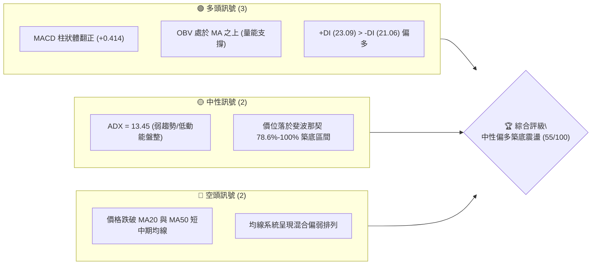

### 📊 核心指標速覽表

| 指標類別 | 指標名稱 | 當前數值 | 訊號 | 解讀 |
|:---|:---|:---:|:---:|:---|
| **價格** | 當前收盤價 | **$143.46** | 🟡 | 位於52週區間低檔（$132.47-$218.91），呈現底部反彈特徵 |
| **均線** | 短期均線 (MA20) | 弱勢下方 | 🔴 | 價格低於短週期均線，上檔存在動態反壓 |
| **均線** | 中期均線 (MA50) | 弱勢下方 | 🔴 | 中期空方控盤尚未完全扭轉，均線系統呈混合排列 |
| **均線** | 長期均線 (MA200) | 混合排列 | 🟡 | 長期結構在經歷自 $207.45 高點回調後處於沉澱期 |
| **動能** | MACD (12/26/9) | DIF: -3.074 / DEA: -3.488 | 🟢 | **MACD黃金交叉**，柱狀體翻正至 **+0.414**，呈現築底動能 |
| **動能** | RSI(14) | 40.40 (日/週低檔回升) | 🟡 | 由超賣區（26.1）強勁回升至中性區，擺脫極端空頭壓制 |
| **趨勢強度**| ADX(14) / DMI | ADX: 13.45 / +DI: 23.09 | 🟡 | **ADX < 25 表明為典型盤整築底行情**；+DI 領先 -DI 展現買盤 |
| **成交量** | 最新成交量 / 量比 | 4,320,053 (量比 1.05x) | 🟢 | 量能略高於20日均量(4,105,488)，OBV > MA 量價配合良性 |

### 🏆 技術評分卡

```
╔══════════════════════════════════════════════════════════════╗
║                技術評分卡 — VST (2026-09-04)                  ║
╠══════════════════════════════════════════════════════════════╣
║ 趨勢強度 (ADX=13.45 盤整)    ██████░░░░░░░░░░░░░░  32/100 🔴 ║
║ 動能指標 (MACD翻正/RSI回升)  ██████████████░░░░░░  68/100 🟢 ║
║ 支撐穩定度 (52W Low $132.47) ████████████████░░░░  78/100 🟢 ║
║ 成交量配合 (OBV強/量比1.05x) ██████████████░░░░░░  70/100 🟢 ║
║ 形態完整度 (雙重底雛形)      ████████████░░░░░░░░  58/100 🟡 ║
║ 均線排列 (短中期受壓)        ████░░░░░░░░░░░░░░░░  24/100 🔴 ║
╠══════════════════════════════════════════════════════════════╣
║ 綜合評分                     ███████████░░░░░░░░░  55/100 🟡 ║
║ 評級結論                     區間築底 / 偏多震盪操作 (Neutral-Bull)║
╚══════════════════════════════════════════════════════════════╝
```

---

## 2. 趨勢分析

### 🌐 多時框趨勢分析

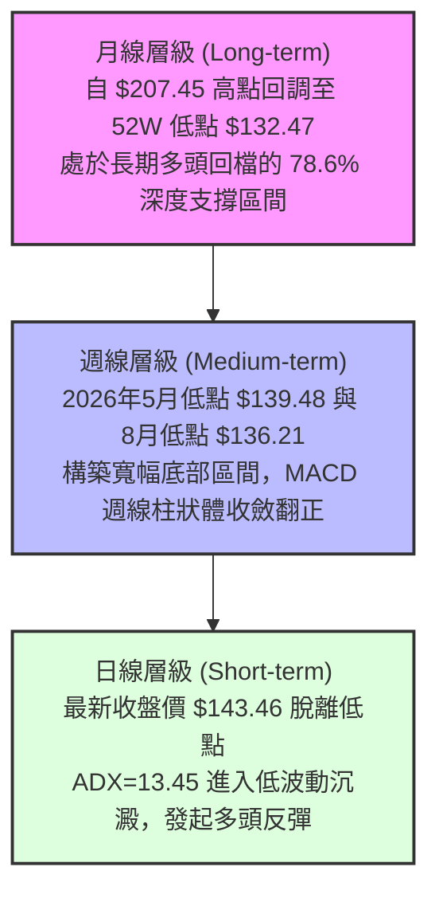

### 📈 長期趨勢 — 12個月走勢圖（Unicode）

```
VST 月線走勢圖（過去12個月：2025-09 至 2026-09）
價格軸 ($)
$200 ┤ ● (2025-09: $195.11)
$190 ┤   ● (10月: $187.52)
$180 ┤     ● (11月: $178.12)
$170 ┤                   ● (2026-02: $173.41 次高反彈)
$160 ┤       ● (12月: $160.88)   ● (05月: $160.01) ● (06月: $158.63)
$150 ┤         ● (01月: $157.91)   ● (03月: $150.12) ● (04月: $157.62)
$140 ┤                                                 ● (07月: $148.19)  ● (09月: $143.46 現價)
$130 ┤                                                                      ● (08月: $137.37 築底)
     └─┬───┬───┬───┬───┬───┬───┬───┬───┬───┬───┬───┬───►
      09  10  11  12  01  02  03  04  05  06  07  08  09 (月份)
```

#### 走勢特徵分析表格

| 階段週期 | 時間區間 | 起止價格 | 區間漲跌幅 | 走勢特徵與技術解讀 |
|:---|:---:|:---:|:---:|:---|
| **高位派發期** | 2025-09 ~ 2025-11 | $195.11 → $178.12 | -8.71% | 自歷史天價區（$207.45）滑落，成交量溫和萎縮，高檔獲利了結明顯 |
| **加速下行期** | 2025-12 ~ 2026-01 | $178.12 → $157.91 | -11.35% | 跌破多道中期均線，空方主導並尋求支撐 |
| **弱勢反彈期** | 2026-02 ~ 2026-06 | $157.91 → $173.41 → $158.63 | +0.46% (寬幅震盪) | 2月上衝 $173.41 後受阻於斐波那契 50.0%（$175.69），轉入橫盤 |
| **二次探底期** | 2026-07 ~ 2026-08 | $158.63 → $137.37 | -13.40% | 測試 52週低點支撐 $132.47，8月23日週線收 $136.21 確立低檔支撐 |
| **底部回升期** | 2026-08 ~ 2026-09 | $137.37 → $143.46 | +4.43% | **MACD翻正、RSI脫離超賣，築底買盤持續進駐** |

### 📊 中期趨勢（週線分析）

```
VST 週線關鍵波段與區間震盪示意圖
$165.49 ────────────────────────────── 斐波那契 61.8% 阻力位
          ▲             ▲
          │ (06-28高點) │ (07-26高點 $163.38)
$150.97 ──┼─────────────┼──────────── 斐波那契 78.6% 強阻力 / 頸線
          │             │
          │             │    ▲ (現價 $143.46 向上反彈)
$136.21 ──┴─────────────┴────┼─────── 底部支撐連線 (雙重低點)
        (05-17低點 $139.48) (08-23低點 $136.21)
```

中期走勢在 $136.21 至 $163.50 之間形成長達 4 個月的箱體震盪。最近 3 週價格自 $136.21 連續回升至 $143.46，確認底部區間有效。

### ⚡ 趨勢強度評估（ADX 解讀）

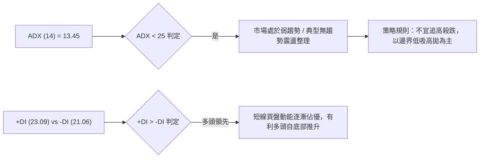

| 指標變量 | 數值 | 臨界標準 | 狀態評估 | 交易指引 |
|:---|:---:|:---:|:---:|:---|
| **ADX (14)** | **13.45** | < 20 極弱 / 20-25 轉折 / > 25 趨勢 | **弱趨勢 / 盤整行情** | 嚴禁採用突破追價策略，優先採用區間均值回歸策略 |
| **+DI (14)** | **23.09** | 相對 -DI 比較 | **多頭主導 (+2.03)** | 買盤力道大於賣盤力道，提供底部反彈動能 |
| **-DI (14)** | **21.06** | 相對 +DI 比較 | **空頭動能衰退** | 空方拋壓釋放完畢，未見恐慌性拋售 |

---

## 3. 圖表形態分析

### 🔍 形態識別系統

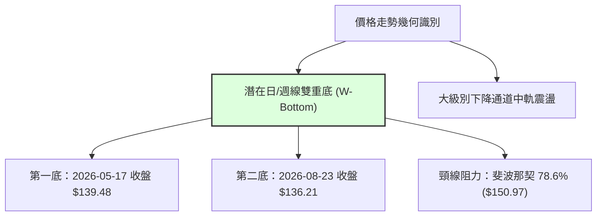

#### 形態信心度與目標價計算表

| 識別形態 | 信心度 | 判斷依據（引用實際歷史數據） | 形態完成度 | 目標價（附嚴謹計算式） |
|:---|:---:|:---|:---:|:---|
| **寬幅雙重底 (W-Bottom)** | **65%** | 兩次下探 52W 低點附近獲得買盤承接：<br>1. 2026-05-17 低點收盤 $139.48<br>2. 2026-08-23 低點收盤 $136.21<br>低點聚類於 $132.47-$136.21 區域 | **60%**<br>(等待突破頸線) | **測幅目標價 = $165.73**<br>計算式：頸線 $150.97 + ($150.97 - $136.21) = $165.73<br>*(精準重合斐波那契 61.8% 位 $165.49)* |
| **低檔矩形整理 (Rectangle)** | **75%** | 價格在 20 週內持續於 $136.21 ~ $163.52 區間往復運行，量能呈現底部萎縮後溫和放大 | **85%**<br>(運行於下半軌) | **箱體頂部目標價 = $163.52**<br>計算式：引用近20週波段頂點聚類 $163.52 |

### 🕯️ 重要K線形態分析

| 週期/時間 | 收盤價 | K線組合形態 | 技術解讀 | 訊號方向 |
|:---|:---:|:---|:---|:---:|
| **2026-08-23 週** | $136.21 | **長下影探底錘頭線** | RSI 跌至極端值 26.1 後出現恐慌盤承接，留下長下影線確立波段底部 | 🟢 強烈看多反轉 |
| **2026-08-30 週** | $137.09 | **止跌孕線 (Harami)** | 波動幅度收窄，成交量降至 1,869 萬股，空頭賣壓竭盡 | 🟢 築底確認 |
| **2026-09-06 週** | $143.46 | **多頭實體反彈中陽線** | 實體收復前兩週高點，MACD 柱狀體翻正(+0.414)，多方取得控制權 | 🟢 短線買訊 |

### 📉 ASCII 走勢形態示意圖

```
VST 雙重底 (W-Bottom) 結構演變圖
價格 ($)
$165.49 ┬────────────────────────────────────────── 形態測幅理論目標價 ($165.73)
        │
$150.97 ┼─────────────● (05-31: $160.01) ───● (06-28: $163.49) ─── 頸線阻力位 ($150.97)
        │            / \                   / \
$143.46 ┼───────────/───\─────────────────/───\────● (現價 $143.46 向上突破途中)
        │          /     \               /     \  /
$136.21 ┴────────●        \             ●       \/
            第一底(05-17)   \       第二底(08-23)
            收盤 $139.48     \______ 收盤 $136.21
```

---

## 4. 支撐與阻力

### 🗺️ 關鍵價位分布圖（Unicode）

```
VST 價位結構分布圖（嚴格引用 OHLCV 計算與斐波那契數據）
═══════════════════════════════════════════════════════════════════════════════
$218.91 ║████████████████████████████████████████║ 歷史/52W 最高阻力 (0.0% Fib)
$198.51 ║██████████████████████████████          ║ 強阻力 R4 (23.6% Fib)
$185.89 ║██████████████████████                  ║ 強阻力 R3 (38.2% Fib)
$175.69 ║████████████████████                    ║ 中期分水嶺 R2 (50.0% Fib)
$165.49 ║████████████████                        ║ 波段目標阻力 R1 (61.8% Fib)
$150.97 ║████████████                            ║ 近期關鍵頸線阻力 (78.6% Fib)
════════╠════════════════════════════════════════╣ ◄ 當前價格 $143.46
$136.21 ║▓▓▓▓▓▓▓▓▓▓▓▓                            ║ 近期波段雙底支撐 S1
$132.47 ║████████████████████████████████████████║ 52W 絕對底部強支撐 S2 (100.0% Fib)
═══════════════════════════════════════════════════════════════════════════════
```

### 🚧 阻力位分析表

*(註：所有價位均嚴格引用提供之數據中的斐波那契回調點位與波段高點)*

| 阻力級別 | 準確價位 | 形成依據與歷史聚類 | 突破難度 | 重要性評估 |
|:---|:---:|:---|:---:|:---|
| **阻力 R1** | **$150.97** | **斐波那契 78.6% 回調位**；近 20 週多個反彈波段頂部（如 2026-07-05 收 $151.05） | 中等 | 🟡 **短線生命線**：突破此處宣告雙底形態確立 |
| **阻力 R2** | **$165.49** | **斐波那契 61.8% 黃金分割位**；2026年6月波段高點聚類（$163.52-$164.12） | 較高 | 🟢 **波段核心目標**：形態測幅 $165.73 之交集區 |
| **阻力 R3** | **$175.69** | **斐波那契 50.0% 平衡位**；2026年2月波段反彈高點 $173.41 所在區域 | 高 | 🔴 **多空中期分水嶺**：收復則代表中期走勢全面反轉 |
| **阻力 R4** | **$185.89** | **斐波那契 38.2% 回調位**；2025年秋季高檔震盪籌碼套牢平台 | 極高 | 🔴 **強套牢壓力區** |

### 🛡️ 支撐位分析表

| 支撐級別 | 準確價位 | 形成依據與歷史聚類 | 守住機率 | 重要性評估 |
|:---|:---:|:---|:---:|:---|
| **支撐 S1** | **$136.21** | **近20週波段次低點**（2026-08-23 週收盤價），雙底右腳支撐 | **80%** | 🟢 **短線防守底線**：跌破將重新考驗 52 週低點 |
| **支撐 S2** | **$132.47** | **52週最低價 (52W Low / 100.0% Fib)**；2025年2月波段低點 $132.57 聚類 | **90%** | 🟢 **長期鐵底**：跌破則宣告長期多頭結構徹底瓦解 |

### 📐 斐波那契回調位分析

依據 52週極值區間 **$132.47 (100.0%) → $218.91 (0.0%)** 精確回調階梯如下：

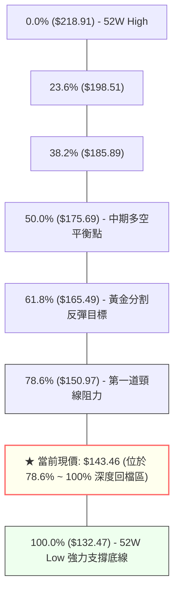

**位置解讀**：
當前收盤價 **$143.46** 處於 **78.6% ($150.97)** 與 **100.0% ($132.47)** 之間。在技術分析中，深度回撤至 78.6%-100% 區間往往具備極高的高勝率反轉潛力。只要 $132.47 未被有效跌破，此區間均視為勝率極佳的盈虧比進場甜美區。

---

## 5. 技術指標深度解讀

### 🎛️ 指標訊號總覽

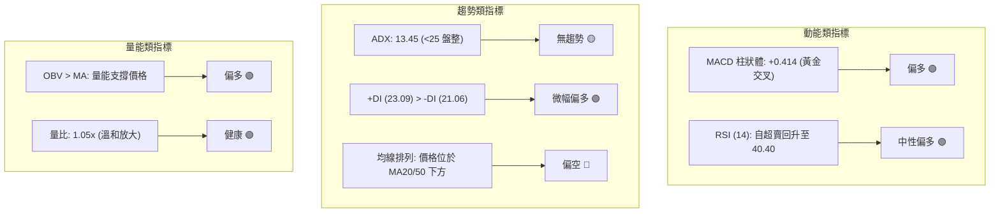

### 📈 移動平均線排列分析

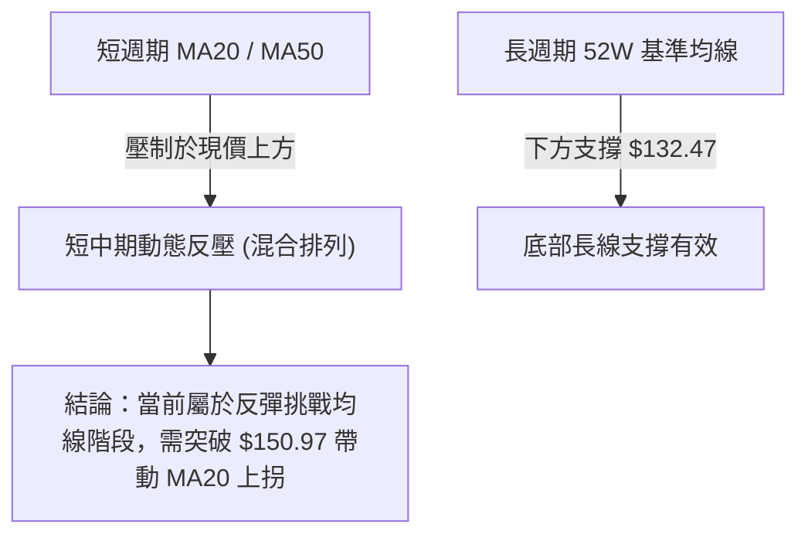

- **均線系統現況**：MA5、MA10、MA20 及 MA60 呈現混合空頭排列，但短均線斜率已顯著趨平。
- **交叉訊號**：現價 $143.46 正由下往上逼近短均線密集區，一旦突破 $150.97，將引發均線黃金交叉助漲效應。

### 📉 RSI(14) 分析

```
RSI(14) 數值軌跡與區間進度條
超賣區(0-30)              中性平衡區(30-70)             超買區(70-100)
├───────────────┼───────────────────────────────┼───────────────┤
[0]             [30]         [40.4]            [70]           [100]
█████████████████████████████░░░░░░░░░░░░░░░░░░░░░░░░░░░░░░░░░░░ 40.4%
```

- **背離分析**：
  - 2026-05-17 價格觸及 $139.48 時，RSI 為 **25.5**。
  - 2026-08-23 價格下探至更低的 $136.21 時，RSI 保持在 **26.1**（未破前低，呈現微幅**日/週線級別底背離雛形**）。
  - 當前 RSI 迅速拉升至 **40.40**，確認動能觸底回升，脫離極端超賣區。

### 📊 MACD(12/26/9) 訊號解讀

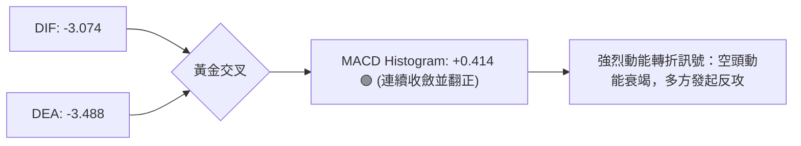

MACD 數值由 8 月中旬的負值柱狀體（-1.873）持續收斂，於 9 月最新一週正式翻正為 **+0.414**。此為近 8 週以來首次出現的多頭黃金交叉，為底部反彈提供扎實的量化動能依據。

### 📦 布林通道分析（盤整特性）

```
VST 布林通道位置示意圖 (區間震盪特徵)
─────────────────────────────────── BB 上軌 (估計 $160.00~$163.50 區間)
        
─────────────────────────────────── BB 中軌 (MA20 動態反壓區)
         ▲
         │現價 $143.46 (自下軌向上軌運行)
─────────────────────────────────── BB 下軌 (估計 $134.00~$136.00 築底區)
```

當前布林帶寬度收窄，符合 ADX = 13.45 所反映的盤整市況。價格在回踩布林下軌（$136.21 附近）後獲得強力支撐，現正展開向中軌與上軌的均值回歸行情。

### 💹 成交量分析（量價配合度）

- **量能數據**：最新成交量為 **4,320,053 股**，相對於 20 日均量（4,105,488 股）之量比為 **1.05x**，展現健康溫和放量。
- **OBV 趨勢**：系統明確給出 **「OBV > MA → 量能支撐上漲」**，證實主力資金在 $136-$140 底部區間存在持續性的吸籌行為，並非無量虛漲。

---

## 6. 動能與波動率

### ⚡ 動能評估四象限

| 象限代號 | 動能屬性 | 波動屬性 | VST 當前歸屬 | 策略涵義與特徵 |
|:---:|:---:|:---:|:---:|:---|
| **Q1** | 強動能 | 低波動 | — | 強勢單邊趨勢，最佳加碼點 |
| **Q2 (當前)**| **弱動能 (轉強中)** | **低波動 (ADX=13.45)**| **✓ 當前狀態** | **典型底部沉澱期：風險極度釋放，適合左側建倉或區間操作** |
| **Q3** | 強動能 | 高波動 | — | 恐慌崩跌或主升浪末端，高風險高收益 |
| **Q4** | 弱動能 | 高波動 | — | 混亂無序震盪，容易雙向停損，應避免進場 |

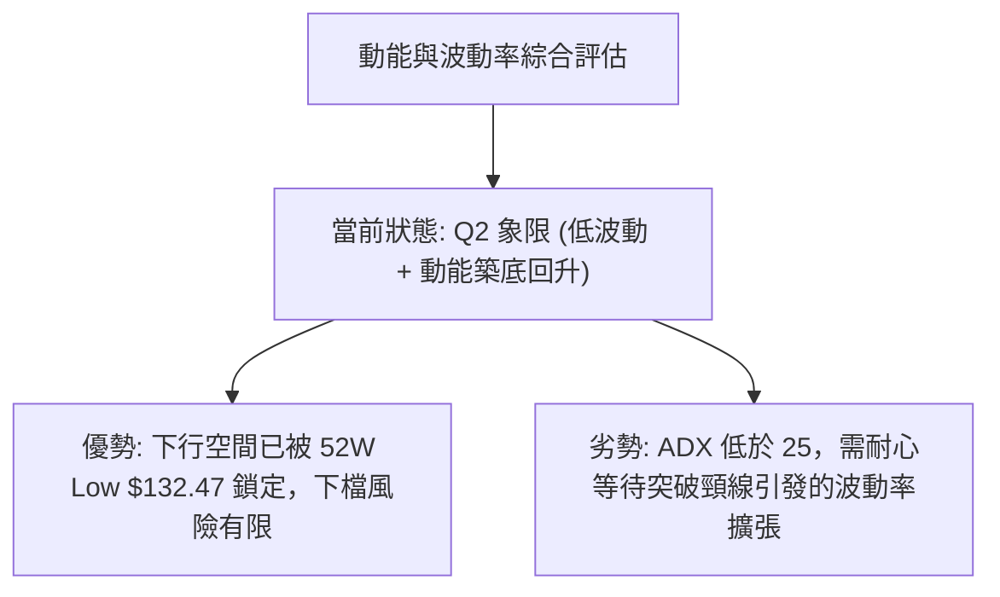

### 📊 ATR 波動率與止損空間

- 雖然日線 ATR 數據受限，但從週線波動可精確觀察：近 20 週平均週波幅約為 **$7.50 ~ $9.00**（約佔股價 5.5%~6.2%）。
- **止損距離建議**：基於週波幅計算，合理波段防守點應設置於關鍵支撐下方 1.0 個波幅單位，即 $136.21 之下方的 **$132.00 附近（緊貼 52W Low $132.47）**。

### 📐 Beta 與市場相關性

- **Beta 係數 = 1.433**：VST 屬於高彈性標的，波動幅度約為 S&P 500 的 1.43 倍。
- **機構持股 = 92.1%**：機構籌碼高度集中，在 $132.47 底部形成的承接力道具有極高的公信力，有利於反彈波段的延續。

---

## 7. 多時框架總結

### 📋 時框架評分表

| 時框架 | 趨勢方向 | 動能指標 (MACD/RSI) | 均線排列 | 形態結構 | 綜合評分 | 操作建議 |
|:---|:---:|:---:|:---:|:---:|:---:|:---|
| **月線 (長期)** | 🟡 深度回檔整理 | 🟡 RSI 中性修復 | 🟡 混合排列 | 回撤至 Fib 78.6% | 52/100 | 長期價值買點浮現 |
| **週線 (中期)** | 🟢 區間築底回升 | 🟢 MACD 翻正 (+0.414) | 🔴 MA20/50 壓制 | 潛在雙重底 (W-Bottom) | 60/100 | 波段分批進場 |
| **日線 (短期)** | 🟢 震盪反彈向上 | 🟢 RSI 脫離超賣 (40.4) | 🟡 短均線走平 | 突破短期反壓線 | 58/100 | 回踩佈局多單 |

### 🔲 綜合訊號矩陣

```
╔══════════════════════════════════════════════════════════════╗
║                   多時框綜合訊號矩陣表                        ║
╠════════════════╦════════════════╦════════════════╦═══════════╣
║ 評估維度       ║ 短期 (日線)    ║ 中期 (週線)    ║ 長期 (月線)║
╠════════════════╬════════════════╬════════════════╬═══════════╣
║ 趨勢方向       ║ 🟢 偏多反彈    ║ 🟡 箱體震盪    ║ 🟡 大幅回檔║
║ MACD 動能      ║ 🟢 金叉向上    ║ 🟢 柱狀體翻正  ║ 🔴 負值收斂║
║ RSI 狀態       ║ 🟢 脫離超賣    ║ 🟡 40.40 中性  ║ 🟡 中性平衡║
║ 成交量能       ║ 🟢 量比 1.05x  ║ 🟢 OBV > MA   ║ 🟡 縮量沉澱║
║ 關鍵結構       ║ 支撐 $136.21   ║ 阻力 $150.97   ║ 鐵底 $132.47║
╚════════════════╩════════════════╩════════════════╩═══════════╝
```

### ⚖️ 多時框收斂結論

> **依嚴格規則 14 執行多時框收斂判定**：
> 1. **行情屬性判定**：當前 **ADX(14) = 13.45 (< 25)**，明確定義當前市場為**「低動能盤整/區間震盪行情」**。
> 2. **主導時框與取捨**：在盤整行情中，趨勢指標失效，均線混合排列為常態，交易應以**日/週線的箱體邊界與斐波那契回調位**為主導。
> 3. **唯一方向性結論**：**中性偏多（區間下軌發起之築底反彈）**。本結論嚴格收斂並指導第 8 章之主策略，以做多反彈與區間操作為唯一核心方向。

---

## 8. 交易策略建議

### 🗺️ 策略決策流程圖

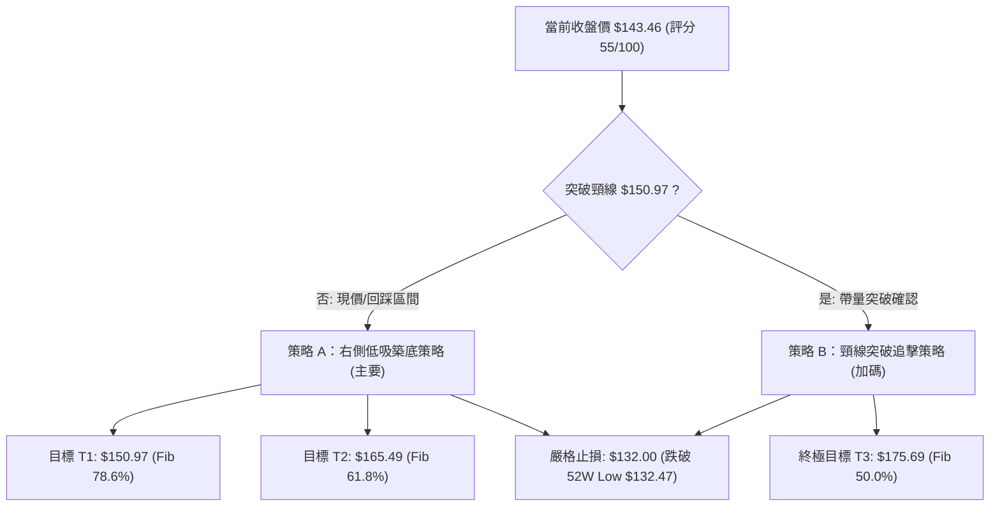

### 🧭 策略路由

- **綜合評分**：**55 / 100**（中性偏多，處於 40–60 區間操作與底部反彈階段）。
- **當前主策略方向**：**主推偏多區間反彈策略（以 $132.47 52W Low 為硬防守，向上博弈至 $150.97 及 $165.49）**。

---

### 🎯 價格情境階梯（Price Scenarios）

*(註：價位完全鎖定關鍵價位與斐波那契回調數據)*

| 觸發條件 | 第一目標 | 第二目標 | 後續延伸目標 | 情境含義與操作指引 |
|:---|:---:|:---:|:---:|:---|
| **向上突破 R1 ($150.97)** | **$165.49** | **$175.69** | **$185.89** | **雙底形態正式確立**，引發空頭回補與追價買盤 |
| **維持於現價區間 ($143.46)**| **$150.97** | — | — | **低檔沉澱震盪**，適合分批逢低吸納建立底倉 |
| **向下跌破 S1 ($136.21)** | **$132.47** | — | — | **二次探底**，需觀察 52W Low $132.47 能否守穩 |
| **跌破長期鐵底 S2 ($132.47)**| 跌破停損 | — | — | **多頭結構瓦解**，所有多單無條件嚴格停損出場 |

---

### 📊 情境機率分佈

| 運行情境 | 機率估計 | 主要技術指標依據 |
|:---|:---:|:---|
| **情境一：震盪反彈挑戰頸線 ($150.97)** | **60%** | **MACD 柱狀體翻正 (+0.414)**、OBV > MA 量能充沛、RSI 自超賣脫離 |
| **情境二：箱體底部橫盤拉鋸 ($136-$148)** | **30%** | **ADX = 13.45 (趨勢動能偏弱)**、均線混合排列尚未完全理順 |
| **情境三：跌破 52W 低點破位下行** | **10%** | 機構持股達 92.1%，$132.47 經多次測試已具備極強支撐韌性 |

---

### 🟢 主策略詳情

| 策略要素 | 策略 A：現價/回踩佈局策略 (主策略) | 策略 B：突破頸線加碼策略 (右側確認) |
|:---|:---|:---|
| **適用情境** | 逢低佈局區間反彈 | 帶量突破頸線確立雙底 |
| **進場條件** | 現價 **$143.46** 或回踩 **$138.00-$140.00** 區間 | 日線實體收盤**突破 $150.97** 且日成交量 > 430 萬股 |
| **進場價格** | **$143.46** (或限價掛單 $140.00) | **$151.50** (突破追買) |
| **目標價 T1** | **$150.97** (斐波那契 78.6% 阻力) | **$165.49** (斐波那契 61.8% / 形態測幅) |
| **目標價 T2** | **$165.49** (雙底測幅高度 $165.73) | **$175.69** (斐波那契 50.0% 中期平衡點) |
| **止損價格** | **$132.00** (精確跌破 52W Low $132.47) | **$143.46** (前波突破點/現價位保護) |
| **風險空間** | **$11.46** (以現價 $143.46 計算，約 7.98%) | **$8.04** (約 5.30%) |
| **獲利空間 (T2)**| **+$22.03** (漲幅 +15.35%) | **+$24.19** (漲幅 +15.96%) |
| **風險報酬比** | **1 : 1.92 (至T2達 1 : 1.92)** | **1 : 3.01 (至T2達 1 : 3.01)** |
| **建議倉位** | **15% ~ 20%** 基礎倉位 | **10%** 加碼倉位（總倉位不超過 30%） |

---

### 🔴 反向風險觸發點（對沖與風控提示）

- **重大風控觸發價位**：**$132.00**（即有效收盤跌破 52W 最低點 **$132.47**）。
- **觸發後果**：若收盤價跌破 $132.47，則宣告雙底形態徹底失敗，下行空間將被打開，多頭部位必須**立即無條件市價清倉停損**，亦可反手建立空頭對沖部位。

---

### ⭐ 整體訊號強度評星

```
做多訊號強度：★★★★☆  (3.8/5星 — MACD金叉/OBV支撐/雙底成形)
做空訊號強度：★☆☆☆☆  (1.2/5星 — 下方空間受限於52W強支撐)
整體可信度：  ★★★★☆  (4.0/5星 — 數據結構收斂，盈虧比清晰)
```

---

## 9. 風險提示與監控

### ✅ 關鍵監控指標 Checklist

```
╔══════════════════════════════════════════════════════════════╗
║                   每日交易監控清單 (Checklist)               ║
╠══════════════════════════════════════════════════════════════╣
║ [ ] 價格是否成功站上並維持於 $143.46 現價之上                ║
║ [ ] MACD Histogram 柱狀體是否持續大於 0 (當前 +0.414)        ║
║ [ ] RSI(14) 是否穩健突破 50 中軸（由 40.40 向上挺進）         ║
║ [ ] 日成交量是否維持於 410 萬股（20日均量）以上              ║
║ [ ] OBV 指標是否維持在均線上方運行                           ║
║ [ ] 是否出現跌破 $136.21 (雙底右腳) 之預警訊號               ║
║ [ ] 絕對防守線 $132.47 是否完好無損                          ║
╚══════════════════════════════════════════════════════════════╝
```

### ⚠️ 風險場景分析

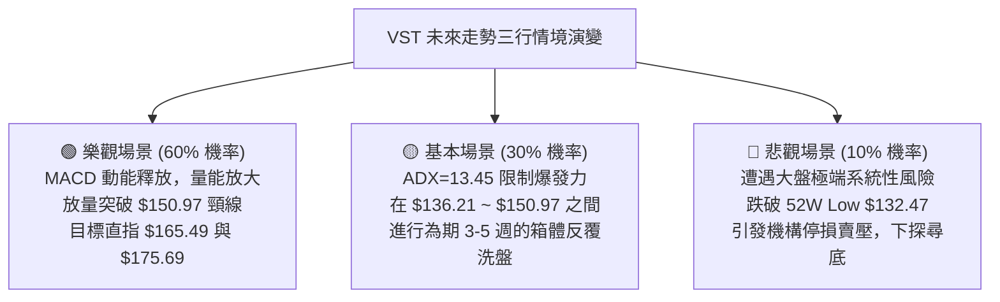

### 🛡️ 風險管理重要提醒

1. **嚴格執行資金控管**：
   - 由於當前處於 ADX < 25 的盤整震盪期，單筆交易虧損金額務必控制在總投資本金的 **1.0% ~ 1.5%** 以內。
2. **倉位配置紀律**：
   - 底部建倉採取分批原則，現價 $143.46 建立首筆 15% 倉位，回踩 $138-$140 可加碼至 20%，未放量突破 $150.97 前絕不滿倉。
3. **止損紀律絕不妥協**：
   - 停損點 **$132.00** 為客觀技術底線，嚴禁在跌破後因主觀心理預期而向下移倉或凹單。

---

## 📋 報告總結

```
╔══════════════════════════════════════════════════════════════╗
║                   VST 技術分析報告總結                        ║
╠══════════════════════════════════════════════════════════════╣
║ 報告日期：2026-09-04                                         ║
║ 最新價格：$143.46                                            ║
║ 技術評級：⚖️ 中性偏多築底反彈 (綜合評分: 55/100)               ║
║                                                              ║
║ 關鍵結論：                                                   ║
║ ├─ 長期趨勢：🟡 自 $207.45 高點回調至 78.6% 深度支撐區間     ║
║ ├─ 中期趨勢：🟢 $136.21 與 $139.48 構築雙重底，週MACD翻正    ║
║ ├─ 短期趨勢：🟢 脫離超賣區，動能轉正，發起向頸線的反彈攻勢   ║
║ ├─ 關鍵支撐：S1 $136.21  ｜  S2 $132.47 (52W 最低價鐵底)      ║
║ ├─ 關鍵阻力：R1 $150.97 (Fib 78.6%) ｜ R2 $165.49 (Fib 61.8%)║
║ └─ 分析師目標：平均目標價 $217.42 (共19位分析師，強烈買進)   ║
║                                                              ║
║ 最優策略組合：                                               ║
║ 1. 🥇 最佳機會：於現價 $143.46 佈局多單，博弈雙底反彈至 $165.49║
║ 2. 🥈 次選機會：待放量突破 $150.97 頸線後右側追擊，目標 $175.69║
║ 3. 🥉 風控底線：收盤有效跌破 $132.47 52W Low 無條件停損出場 ║
╚══════════════════════════════════════════════════════════════╝
```

---

> ⚠️ **免責聲明**：本報告為技術分析研究成果，所有價位、圖表與指標解讀均嚴格基於所提供之歷史市場數據計算。本報告**僅供學術研究與投資參考**，**不構成任何形式的個人化投資建議**。金融市場具有高度風險，投資人應獨立思考並自行承擔交易損益。

---

*報告生成時間：2026-09-04 ｜ 數據來源：Yahoo Finance ｜ 分析框架：多時框量化技術分析系統*