# VST 技術分析報告

> **報告日期**：2026-09-05 ｜ **語言**：繁體中文 ｜ **數據來源**：Yahoo Finance ｜ **當前價格**：$149.30

---

## 目錄

| 章節 | 內容 |
|------|------|
| [1. 技術面概覽](#1-技術面概覽) | 訊號儀表板、核心指標、評分卡 |
| [2. 趨勢分析](#2-趨勢分析) | 多時框趨勢、長中短期走勢、ADX解讀 |
| [3. 圖表形態分析](#3-圖表形態分析) | 形態識別、K線組合、形態目標價 |
| [4. 支撐與阻力](#4-支撐與阻力) | 關鍵價位、斐波那契回調結構 |
| [5. 技術指標深度解讀](#5-技術指標深度解讀) | MA/RSI/MACD/布林/成交量整合 |
| [6. 動能與波動率](#6-動能與波動率) | 動能四象限、ATR、Beta波動風險 |
| [7. 多時框架總結](#7-多時框架總結) | 時框架評分矩陣、多時框收斂 |
| [8. 交易策略建議](#8-交易策略建議) | 主策略路由、情境階梯、風報比 |
| [9. 風險提示與監控](#9-風險提示與監控) | 監控清單、極端情境、風控原則 |
| [報告總結](#-報告總結) | 儀表板總結與決策速覽 |

---

## 1. 技術面概覽

### 🎯 技術訊號儀表板

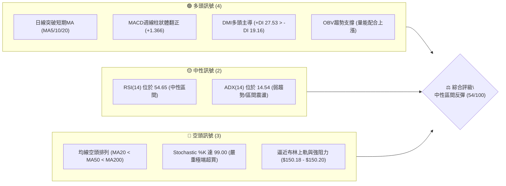

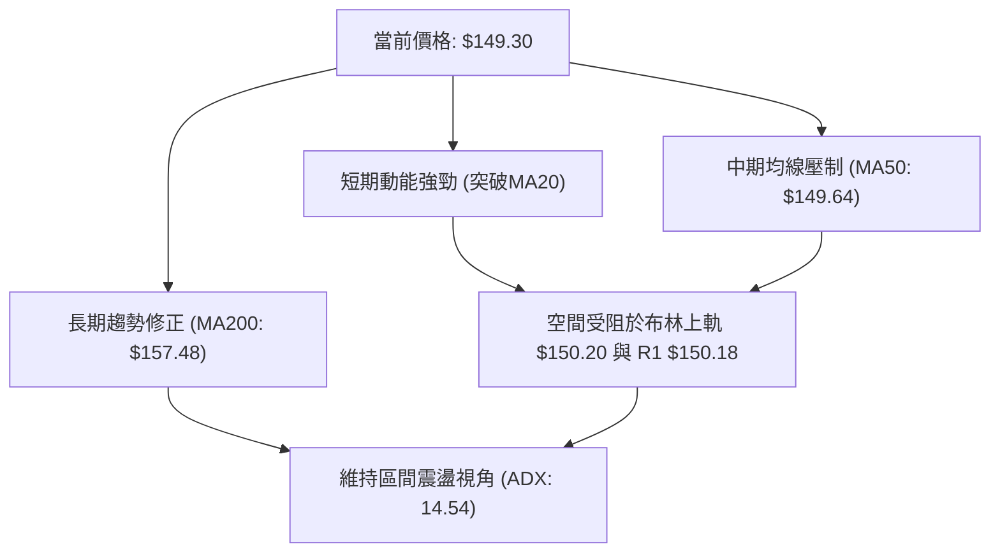

### 📊 核心指標速覽表

| 指標類別 | 指標名稱 | 當前數值 | 訊號 | 解讀 |
|:---|:---|:---:|:---:|:---|
| **價格** | 當前價格 | $149.30 | 🟡 | 位於52週區間19.5%低位區，短線由波段低點反彈 |
| **均線** | MA20 | $141.88 | 🟢 | 現價於MA20上方 (+5.23%)，短線多頭掌控權提升 |
| **均線** | MA50 | $149.64 | 🔴 | 現價於MA50下方 (-0.23%)，即將面臨中期生命線反壓 |
| **均線** | MA200 | $157.48 | 🔴 | 現價於MA200下方 (-5.20%)，長期趨勢結構仍未扭轉 |
| **動能** | RSI(14) | 54.65 | 🟡 | 位於50中軸上方，多空均衡偏多，無明顯背離現象 |
| **動能** | MACD | -1.671 | 🟢 | 柱狀圖 +1.366，快線自低位上穿訊號線 (-3.037)，多頭修復 |
| **震盪** | Stochastic %K/%D | 99.00 / 73.13 | 🔴 | 短線進入極度超買區域，隱含技術性拉回修整壓力 |
| **趨勢強度** | ADX(14) | 14.54 | 🟡 | ADX < 25，確認市場處於無方向性或弱趨勢震盪結構 |
| **通道** | 布林帶 %B | 0.95 | 🔴 | 貼近布林上軌 ($150.20)，突破若無爆量將面臨通道邊界收斂 |
| **成交量** | 量比 / OBV | 1.17x / 正向 | 🟢 | 20日均量放大，OBV > MA，量能對本次反彈具備支撐性 |
| **波動** | ATR(14) | $4.88 | 🟡 | 佔價格比約 3.27%，提供日內波段與止損設定標準 |

### 🏆 技術評分卡

```
╔══════════════════════════════════════════════════════════════════════════╗
║                   技術評分卡 — VST (2026-09-05)                          ║
╠══════════════════════════════════════════════════════════════════════════╣
║ 趨勢強度 (ADX=14.54, 震盪無主導趨勢)   ███████░░░░░░░░░░░░░   35/100 🔴 ║
║ 動能指標 (MACD翻紅 vs KD極端超買)      ████████████░░░░░░░░   60/100 🟡 ║
║ 支撐穩定度 (S1=$148.47 / S2=$144.63)    ██████████████░░░░░░   70/100 🟢 ║
║ 成交量配合 (量比 1.17x, OBV正向擴張)   █████████████░░░░░░░   65/100 🟢 ║
║ 形態完整度 (區間築底反彈, 邊界明確)    ████████████░░░░░░░░   60/100 🟡 ║
║ 均線系統 (MA20<MA50<MA200 空頭排列)    ██████░░░░░░░░░░░░░░   30/100 🔴 ║
╠══════════════════════════════════════════════════════════════════════════╣
║ 綜合技術評分                           ███████████░░░░░░░░░   54/100 🟡 ║
║ 評級結論: ⚖️ 中性區間震盪反彈 (操作建議: 區間震盪低吸高拋/觀察突破)    ║
╚══════════════════════════════════════════════════════════════════════════╝
```

---

## 2. 趨勢分析

### 🌐 多時框趨勢分析

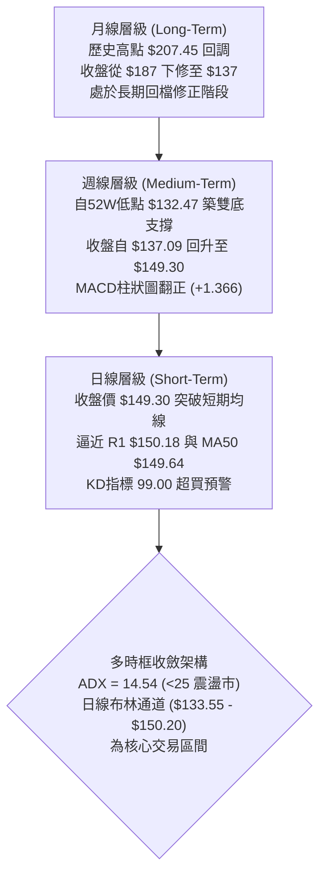

### 📈 長期趨勢 — 12個月走勢圖（Unicode）

下圖展示自 2025 年 10 月至 2026 年 09 月共 12 個月之月線收盤價格軌跡與關鍵轉折位：

```
VST 月線走勢圖（過去12個月：2025-10 至 2026-09）
價格軸 ($)
$195 ┤● (2025-10: 187.52)
$190 ┤
$180 ┤    ● (2025-11: 178.12)
$175 ┤                           ● (2026-02: 173.41 波段高點反彈)
$170 ┤
$165 ┤
$160 ┤         ● (12月: 160.88)              ● (2026-05: 160.01)
$155 ┤              ● (2026-01: 157.91)  ● (04: 157.62)    ● (06: 158.63)
$150 ┤                                  ● (03: 150.12)          ● (07: 148.19)  ●現價: 149.30
$145 ┤                                                                      
$140 ┤                                                                 ● (08: 137.37 波段低點)
$135 ┤                                                               
     └───────────────────────────────────────────────────────────────────────────
       10    11   12    01    02    03   04    05    06    07    08    09   (月份)
```

#### 走勢特徵分析表格

| 階段區間 | 起止價格 | 漲跌幅 | 主要走勢特徵與量價結構 | 趨勢性質 |
|:---|:---:|:---:|:---|:---:|
| **2025-10 至 2026-01** | $187.52 → $157.91 | -15.79% | 歷史高點回撤段，高點連續下移，機構減倉 | 空頭修正 |
| **2026-01 至 2026-02** | $157.91 → $173.41 | +9.82% | 跌破後之強力技術性反彈，受制於長期均線 | 熊市反彈 |
| **2026-02 至 2026-05** | $173.41 → $160.01 | -7.73% | 進入寬幅區間震盪，在 $150-$160 構築多空拉鋸 | 箱型整理 |
| **2026-05 至 2026-08** | $160.01 → $137.37 | -14.15% | 破位下殺，触及 52 週低點 $132.47 附近尋求支撐 | 破位下探 |
| **2026-08 至 2026-09** | $137.37 → $149.30 | +8.68% | 低位出量反彈，週 MACD 翻紅，測試區間頂部阻力 | 跌深反彈 |

### 📊 中期趨勢（週線分析）

```
中期週線關鍵壓制與支撐結構示意圖
═════════════════════════════════════════════════════════════════════
阻力 3 : $168.93 ─────────────────────────────── 中期強反轉阻力 (下降趨勢線)
阻力 2 : $156.99 ─────────────────────────────── MA200 反壓帶 / 前期平臺下緣
阻力 1 : $150.18 ═══════════════════════════════ 日布林上軌 / 斐波 78.6% 反壓
現  價 : $149.30 ◄─── (測試 MA50 $149.64 與 R1 夾板)
支撐 1 : $148.47 ─────────────────────────────── 近期波段高低聚類點位
支撐 2 : $144.63 ─────────────────────────────── 短期頸線支撐位
支撐 3 : $142.14 ─────────────────────────────── 日線 MA20 / 布林中軌 ($141.88)
基底底 : $132.47 ═══════════════════════════════ 52週絕對低點 / 雙底形態基底
═════════════════════════════════════════════════════════════════════
```

### ⚡ 趨勢強度評估（ADX 解讀）

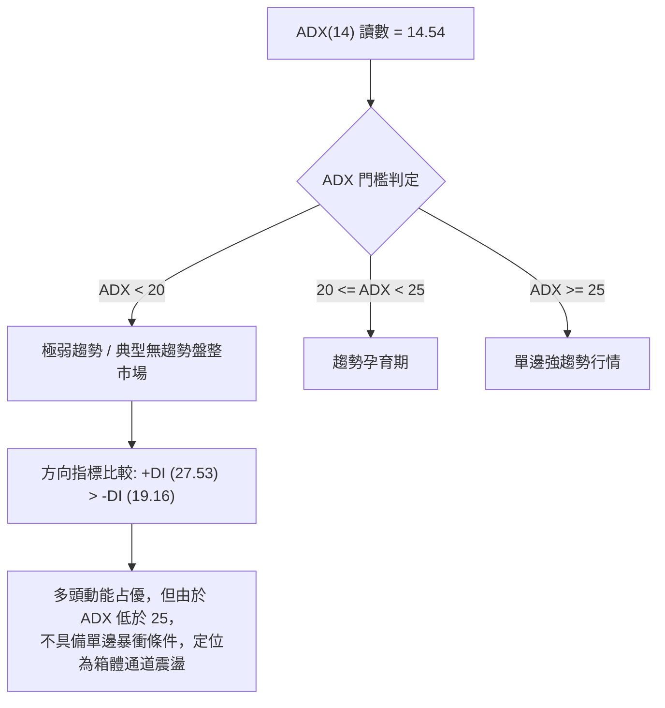

#### ADX 與方向指標強度對照表

| 指標名稱 | 數值 | 訊號解讀 | 操作指導意義 |
|:---|:---:|:---:|:---|
| **ADX (14)** | 14.54 | 弱趨勢 / 盤整市場 (極低值) | **趨勢跟隨策略失效**；應採取震盪指標與區間交易邏輯 |
| **+DI (14)** | 27.53 | 多方買盤動能 | 短線買方佔有相對優勢，推升價格自低位回彈 |
| **-DI (14)** | 19.16 | 空方賣盤動能 | 空方勢頭短期減退，但仍具備基本防守力量 |
| **DI 差值 (+DI - -DI)** | +8.37 | 多方微幅領先 | 提示反彈延續，但面臨上方強阻力時容易引發震盪回踩 |

---

## 3. 圖表形態分析

### 🔍 形態識別系統

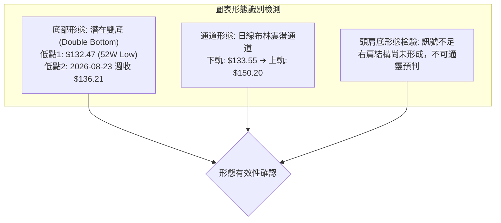

#### 形態識別與信心度評估表

| 形態類別 | 信心度 | 判斷依據（嚴格引用數據） | 完成度 | 目標價（附嚴格計算式） |
|:---|:---:|:---|:---:|:---|
| **雙底形態 (Double Bottom)** | 62% | 左底 52W 低點 $132.47，右底為 2026-08-23 週收盤 $136.21（低點不破）；頸線位於近期波段阻力 R2: $156.99 | 70% | 尚未完全突破頸線；若確認突破 $156.99，依形態高度推算：<br/>$156.99 + ($156.99 - $132.47) = **$181.51** |
| **布林帶區間反彈 (Bollinger Range)** | 85% | ADX 14.54，價格自下軌 $133.55 沿通道上推至上軌 $150.20，%B 達 0.95 | 95% | 區間滿足點即布林上軌 **$150.20** / 關鍵阻力 R1 **$150.18** |
| **頭肩底形態 (Head & Shoulders Bottom)** | 20% | 訊號不足。左肩與右肩未見清晰幾何對稱性，僅做指標型區間解讀 | 0% | 數據不足以支撐幾何形態，不予推算 |

### 🕯️ 重要K線形態分析（近 5 週走勢）

| 週日期 | 收盤價 | K線形態特徵 | 技術面深度解讀 | 訊號強度 |
|:---|:---:|:---|:---|:---:|
| **2026-08-09** | $140.59 | 帶長下影大陰線（成交量 34.90M 爆量） | 恐慌性拋盤湧現，但下影線顯示長線買盤在 $135 附近逢低承接 | 🟡 止跌孕育 |
| **2026-08-16** | $148.13 | 縮量反彈陽線（成交量 16.52M） | 空頭回補推升，量能大幅萎縮，呈現超跌修正本質 | 🟡 弱勢反彈 |
| **2026-08-23** | $136.21 | 二次回踩長陰線（RSI 跌至 26.1 極度超賣） | 測試前低支撐，RSI 觸及超賣低點，空頭動能進入衰竭段 | 🔴 二次測底 |
| **2026-08-30** | $137.09 | 低位十字星 / 啟明星胚形（量能 18.69M） | 賣壓耗盡，多空在 $137 達成脆弱平衡，奠定底部回升基礎 | 🟢 底部信號 |
| **2026-09-06** | $149.30 | 實體大陽線收高（量能回升至 22.12M） | 帶量長陽確認底背離反彈，一舉攻克 MA20，週 MACD 柱狀體翻正 | 🟢 多頭確立 |

### 📉 ASCII 走勢形態示意圖

下圖為近期日線自低位回升之雙底結構與阻力壓制示意圖：

```
                 [頸線 / 強阻力 R2: $156.99]
─────────────────┬───────────────────────────────────┬───────────────
                 │                                   │ 
                 │            (中期反彈頂部)         │ 
                 │               $150.18 (R1/上軌)   │ 
                 │                  ╭──● 現價: $149.30
                 │     ╭───────╮    │
                 │     │       │    │
                 │     │       ╰────╯  ◄── S1: $148.47
                 ╰─────╯ 
        左底: $132.47          右底: $136.21
        (52W Low)             (二次探底企穩)
```

### 🎯 形態目標價計算

*   **雙底量度目標計算依據**：
    *   底部基底價格（最低點）：$132.47
    *   形態頸線關鍵確認位：$156.99 (R2)
    *   形態高度（Height）：$156.99 - $132.47 = $24.52
    *   **理論完全突破目標價**：$156.99 + $24.52 = **$181.51**（接近斐波那契 38.2% 回調位 $185.89）
    *   *執行條件*：必須日線與週線帶量收破 $156.99，否則不可提前透支此預期。

---

## 4. 支撐與阻力

### 🗺️ 關鍵價位分布圖（Unicode）

```
VST 價位結構分布圖 (由實際歷史數據計算)
═════════════════════════════════════════════════════════════════════
$168.93 ║████████████████████████████████║ 強阻力 R3 (下降波段高點聚類)
$165.49 ║▓▓▓▓▓▓▓▓▓▓▓▓▓▓▓▓▓▓▓▓▓▓▓▓        ║ 斐波那契 61.8% 重要阻力
$157.48 ║████████████████████████        ║ MA200 長期均線壓制位
$156.99 ║████████████████████            ║ 中期阻力 R2 (頸線阻力聚類)
$150.97 ║▓▓▓▓▓▓▓▓▓▓▓▓▓▓▓▓▓▓▓▓            ║ 斐波那契 78.6% 回調壓制
$150.20 ║██████████████████████████████  ║ 布林通道日線上軌壓制
$150.18 ║████████████████████████████████║ 近端關鍵阻力 R1 (+0.59%)
$149.30 ╠════════════════════════════════╣ ◄─── 當前收盤價格 $149.30
$148.47 ║▓▓▓▓▓▓▓▓▓▓▓▓▓▓▓▓▓▓▓▓▓▓▓▓▓▓▓▓▓▓  ║ 近端支撐 S1 (-0.55%)
$144.63 ║████████████████████████        ║ 次級波段支撐 S2 (-3.13%)
$142.14 ║████████████████████████████████║ 重要防守支撐 S3 (-4.80%)
$141.88 ║▓▓▓▓▓▓▓▓▓▓▓▓▓▓▓▓▓▓▓▓▓▓▓▓▓▓▓▓▓▓  ║ MA20 短期均線 / 布林中軌
$132.47 ║████████████████████████████████║ 52週絕對低點 / 雙底基石
═════════════════════════════════════════════════════════════════════
```

### 🚧 阻力位分析表

所有價位均嚴格引用歷史波段高點聚類數據：

| 阻力級別 | 精確價位 | 與現價差距 | 形成原因與技術意義 | 突破難度 | 重要性權重 |
|:---|:---:|:---:|:---|:---:|:---:|
| **關鍵阻力 R1** | **$150.18** | +0.59% | 近一年波段高點密集聚類；與日線布林上軌 ($150.20) 及 MA50 ($149.64) 形成三重共振壓制帶 | 很高 | 🟢🟢🟢 (極高) |
| **波段阻力 R2** | **$156.99** | +5.15% | 中期雙底頸線位；前期平臺密集成交破位點，上方緊鄰 MA200 ($157.48) | 極高 | 🟢🟢🟢 (戰略級) |
| **遠端阻力 R3** | **$168.93** | +13.15% | 下降趨勢主波段高點聚類，突破象徵中期大空頭趨勢徹底扭轉 | 極高 | 🟢🟢⚪ (中長線) |

### 🛡️ 支撐位分析表

所有價位均嚴格引用歷史波段低點聚類數據：

| 支撐級別 | 精確價位 | 與現價差距 | 形成原因與技術意義 | 守住機率 | 重要性權重 |
|:---|:---:|:---:|:---|:---:|:---:|
| **近期支撐 S1** | **$148.47** | -0.55% | 8月中旬高點回踩轉換位，短線多頭防禦第一線，守住代表強勢震盪 | 70% | 🟢🟢⚪ (短線) |
| **關鍵支撐 S2** | **$144.63** | -3.13% | 20週回調支撐密集區，短線多空分水嶺，跌破將轉為弱勢回測 | 65% | 🟢🟢🟢 (重要) |
| **強道支撐 S3** | **$142.14** | -4.80% | 與日線 MA20 ($141.88) 及布林中軌完全重合，多頭波段生命線 | 80% | 🟢🟢🟢 (波段核心) |

### 📐 斐波那契回調位分析

依據 52 週完整波段（低點 $132.47 → 高點 $218.91，總波幅 $86.44）回調層級檢驗：

| 斐波那契回調層級 | 計算價位 | 技術狀態解讀與現價關係 |
|:---:|:---:|:---|
| **0.0% (52W High)** | **$218.91** | 歷史極值高點，長期牛市極限阻力 |
| **23.6%** | **$198.51** | 牛市強支撐轉換為深回調重阻力 |
| **38.2%** | **$185.89** | 經典回調位，雙底形態高度之延伸目標區 |
| **50.0%** | **$175.69** | 多空長期力量均衡中軸 |
| **61.8%** | **$165.49** | 黃金分割強阻力，跌破後轉為天花板壓制 |
| **78.6%** | **$150.97** | **現價 ($149.30) 正處於 78.6% 回調位 ($150.97) 下方緊鄰區間** |
| **100.0% (52W Low)** | **$132.47** | 本輪週線級別調整的最終底線支撐 |

**斐波那契解讀**：現價 $149.30 夾在 100% ($132.47) 與 78.6% ($150.97) 之間，目前正強烈測試 78.6% 回調位壓制。在技術分析中，若價格無法有效帶量站穩 78.6% ($150.97)，整體走勢僅能視為「深跌之後的弱勢修復」，無法確認展開通往 61.8% ($165.49) 的中級多頭趨勢。

---

## 5. 技術指標深度解讀

### 🎛️ 指標訊號總覽

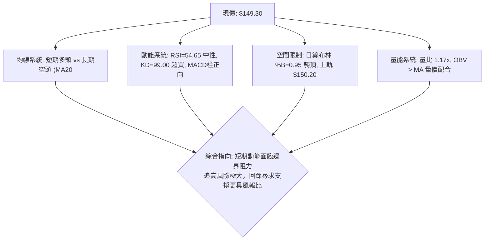

### 📈 移動平均線排列分析

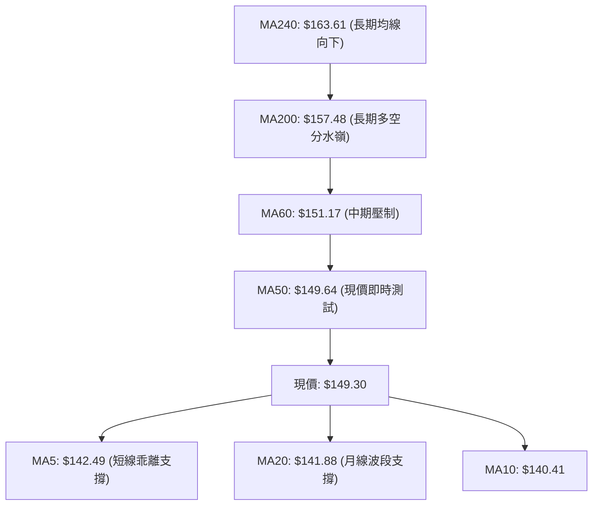

#### 均線矩陣詳細狀態表

| 均線名稱 | 當前價格 | 現價相對位置 | 偏離幅度 | 技術意涵 |
|:---|:---:|:---:|:---:|:---|
| **MA5** | $142.49 | ▲ 現價在其上方 | +4.78% | 短線拉升速度過急，出現短線正乖離過大風險 |
| **MA10** | $140.41 | ▲ 現價在其上方 | +6.34% | 短期多頭發散，斜率陡峭 |
| **MA20** | $141.88 | ▲ 現價在其上方 | +5.23% | 站穩 20 日線，確立短線自 $132 底部反彈的有效性 |
| **MA50** | $149.64 | ▼ 現價在其下方 | -0.23% | **即時測試關鍵位**，能否站穩決定能否上攻 $156 |
| **MA60** | $151.17 | ▼ 現價在其下方 | -1.24% | 季線下彎，形成 $150-$151 區間嚴密技術阻力 |
| **MA120** | $152.59 | ▼ 現價在其下方 | -2.15% | 半年線持續壓制 |
| **MA200** | $157.48 | ▼ 現價在其下方 | -5.20% | 年線為中長期牛熊界線，目前處於年線下方弱勢格局 |
| **MA240** | $163.61 | ▼ 現價在其下方 | -8.75% | 長期下行壓力顯著 |

**均線結構結論**：MA20 < MA50 < MA200 呈現典型**空頭排列**。儘管短期 MA5/10/20 向上昂頭形成金叉反彈，但此反彈性質為「空頭排列下的跌深修正」，在未有效升破 MA200 之前，不宜過早定義為長期反轉。

### 📉 RSI(14) 分析

*   **當前數值**：**54.65**（中性均衡區）
*   **強度進度條**：`███████████░░░░░░░░░` 54.65%
*   **區間定位**：脫離了 2026-08-23 的超賣極值區（當時 RSI 僅 26.1），成功收復 50 中軸線，顯示短期內空方主導的殺跌慣性已被多頭扭轉，重回多空爭奪平衡區。
*   **背離分析**：
    *   價格在 2026-08-23 創波段次低收盤 $136.21（前低為 52W 低點 $132.47），而 RSI 在 2026-08-23 錄得 26.1 後迅速於 2026-08-30 回升至 40.4，並在 2026-09-06 擴張至 54.6。
    *   **背離結論**：無標準週線頂背離；底部存在輕微之動能收斂型底背離特徵，但目前 RSI 已回到中軸，未顯現背離衰竭，指標運行健康。

### 📊 MACD(12/26/9) 訊號解讀

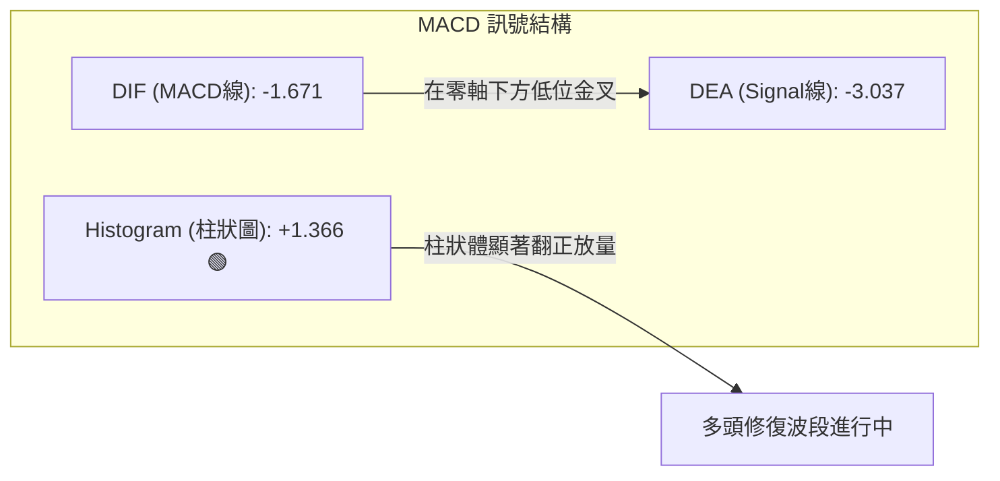

*   **數值解讀**：DIF (-1.671) 明顯處於 Signal (-3.037) 之上，帶動 Histogram 達到 **+1.366**，呈現典型低位金叉向上擴散形態。
*   **零軸關係**：雙線均處於零軸之下，定義為「弱勢區域的金叉反彈」。在零軸下方的反彈通常會在觸碰零軸附近或遇強阻力（如 R1/R2）時發生初次受阻，需防範二次死叉回踩。

### 📦 布林通道分析（Bollinger Bands）

下圖展示當前價格與布林帶邊界之極度擠壓位置：

```
日線布林通道結構 (20日, 2σ)
──────────────────────────────────────────────────────────
$150.20 ───┬───────────────────────────────── 布林上軌 (強壓)
$150.18 ───┼── R1 關鍵阻力
$149.30 ───●  現價 (BB %B = 0.95，已貼近通道頂壁)
           │
           │
$141.88 ───┴───────────────────────────────── 布林中軌 (MA20)
           │
           │
$133.55 ───────────────────────────────────── 布林下軌
──────────────────────────────────────────────────────────
```

*   **指標數據**：上軌 $150.20 ｜ 中軌 $141.88 ｜ 下軌 $133.55 ｜ **%B = 0.95**
*   **通道行為研判**：
    *   %B 高達 0.95 代表現價已耗盡上行通道空間的 95%，屬於**極端貼軌**狀態。
    *   配合 Stochastic %K 高達 99.00，在 ADX 僅 14.54 的無趨勢盤整背景下，價格直接向上穿軌形成「爆發性單邊布林開口」的機率極低，大機率將在上軌 $150.20 與 R1 $150.18 遇阻回落，向中軌 $141.88 進行回測。

### 💹 成交量分析（量價配合度）

*   **最新成交量**：4,599,200 股
*   **20日均量**：3,942,505 股（**量比 1.17x**，溫和放量）
*   **50日均量**：4,336,970 股（超越中期均量，顯示資金積極進場）
*   **OBV 趨勢**：數據顯示 `OBV > MA`，能量潮指標領先均線上揚，明確證實本次反彈背後具有實質性資金推動，並非單純流動性匱乏下的虛假反抽。
*   **量價背離檢驗**：量能隨價格自 $137 回升而同步放大，未見量價背離，量能健康度評定為良好 🟢。

---

## 6. 動能與波動率

### ⚡ 動能評估四象限

根據當前 VST 的動能指標（RSI=54.65, %K=99.00, MACD柱=+1.366）與波動率特徵（ATR=3.27%, ADX=14.54），進行四象限資產狀態定位：

| 象限標籤 | 動能狀態 | 波動率狀態 | 當前匹配度 | 戰術定位與操作指導 |
|:---|:---:|:---:|:---:|:---|
| **第一象限 (Q1)** | 強動能 | 低波動 | ⚪ | 最佳趨勢單邊順勢突破機會 |
| **第二象限 (Q2)** | 弱動能 | 低波動 | ⚪ | 低位橫盤蓄勢，無交易機會 |
| **第三象限 (Q3)** | 強動能 | 高波動 | ⚪ | 追高殺跌高風險投機階段 |
| **第四象限 (Q4)** | **短線偏強/超買** | **中低波動 (區間)** | **✓ (當前狀態)** | **通道內震盪衝頂階段，宜逢高鎖利而非盲目追高** |

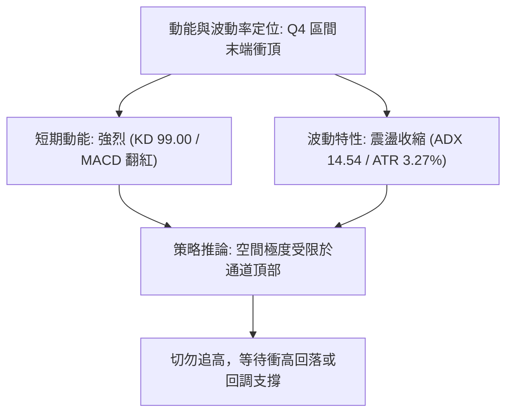

### 📊 ATR 波動率分析

*   **ATR(14) 絕對值**：**$4.88**
*   **ATR 佔比 (ATR / Price)**：**3.27%**
*   **波動率層級**：中等偏高（每日標準波動區間約 ±$4.88）。
*   **交易止損指導意義**：
    *   在震盪區間內，噪音波動較大，常規日內停損應設定在至少 **1.0 至 1.5 倍 ATR**（即 $4.88 - $7.32），方可有效避免被洗盤出局。
    *   現價若在 $149.30，下修 1.0 ATR 之防守位約在 $144.42，與關鍵支撐 S2 ($144.63) 高度吻合，進一步印證 S2 為極關鍵的波段防線。

### 📐 Beta 與市場相關性

*   **Beta 係數**：**1.414**
*   **市場敏感度解讀**：
    *   Beta > 1.40 顯示 VST 屬於高彈性標的，相對於標普 500 指數具備 1.41 倍的超額波動。
    *   在大盤波動劇烈時，該股容易出現放大式單日震盪，因此在布林通道上下軌等極端技術邊界處，容易發生衝過頭（Overshoot）但隨後迅速均值回歸的假突破行情。

---

## 7. 多時框架總結

### 📋 時框架評分表

| 時框架 | 趨勢方向 | 動能指標 | 均線系統 | 關鍵形態 | 評分 (1-100) | 操作建議 |
|:---|:---:|:---:|:---:|:---:|:---:|:---|
| **短期 (日線)** | 偏多反彈 🟢 | KD 超買 (99.0) 🔴<br/>MACD 金叉 🟢 | 突破 MA5/10/20 🟢<br/>受制 MA50 🔴 | 衝擊布林上軌 $150.20<br/>臨近 R1 $150.18 | **58 / 100** | 不宜追高，逢高部分減持 |
| **中期 (週線)** | 築底震盪 🟡 | RSI 54.6 🟡<br/>MACD 柱翻正 🟢 | 跌破 MA60/120 🔴<br/>空頭趨勢未扭轉 | $132.47-$136.21 雙底胚形<br/>頸線 $156.99 壓制 | **52 / 100** | 區間震盪，低吸高拋 |
| **長期 (月線)** | 空頭回撤 🔴 | 歷史高點大幅下修 🔴<br/>月線走勢轉弱 | MA200 ($157.48) 下方 🔴<br/>長期均線下彎 | 自 $207 高位回調<br/>測試 78.6% 斐波那契 | **42 / 100** | 防禦為主，觀察長期築底 |

### 🔲 綜合訊號矩陣

```
時框架訊號交叉驗證矩陣
┌──────────────┬──────────────┬──────────────┬──────────────┐
│   維度 \ 時框│   短期 (日線)│   中期 (週線)│   長期 (月線)│
├──────────────┼──────────────┼──────────────┼──────────────┤
│ 均線系統     │  偏多 (+5.2%)│  空頭排列    │  空頭壓制    │
│ 動能方向     │  極度過熱    │  溫和轉強    │  動能鈍化    │
│ 支撐強度     │  S1 $148.47  │  S2 $144.63  │  S3 $142.14  │
│ 阻力強度     │  R1 $150.18  │  R2 $156.99  │  R3 $168.93  │
│ 量能確認     │  放量 (1.17x)│  溫和放量    │  縮量整理    │
└──────────────┴──────────────┴──────────────┴──────────────┘
```

### ⚖️ 多時框收斂結論

依據多時框收斂規則嚴格檢驗：
1.  **趨勢行情 vs 盤整行情判定**：當前 ADX(14) 為 **14.54**，遠低於 25 的趨勢門檻值，技術結構判定為典型的**「盤整震盪行情」**。
2.  **主導時框與交易邊界**：盤整行情以**日線布林通道上下軌（$133.55 - $150.20）**為核心交易區間，中長期均線方向退居為阻力測量工具。
3.  **唯一方向性結論**：
    *   **中性偏震盪觀望（Neutral / Range-Bound）**。
    *   日線短期強烈反彈已完全行進至布林上軌 ($150.20) 與關鍵阻力 R1 ($150.18)，在 KD 達 99.00 的超買背景下，短期向上空間被鎖死。
    *   日線的反彈訊號與週線/月線的長期空頭壓制在 $150.00-$150.20 產生劇烈共振碰撞。**策略結論拒絕追多，主張嚴格按區間操作**。

---

## 8. 交易策略建議

### 🗺️ 策略決策流程圖

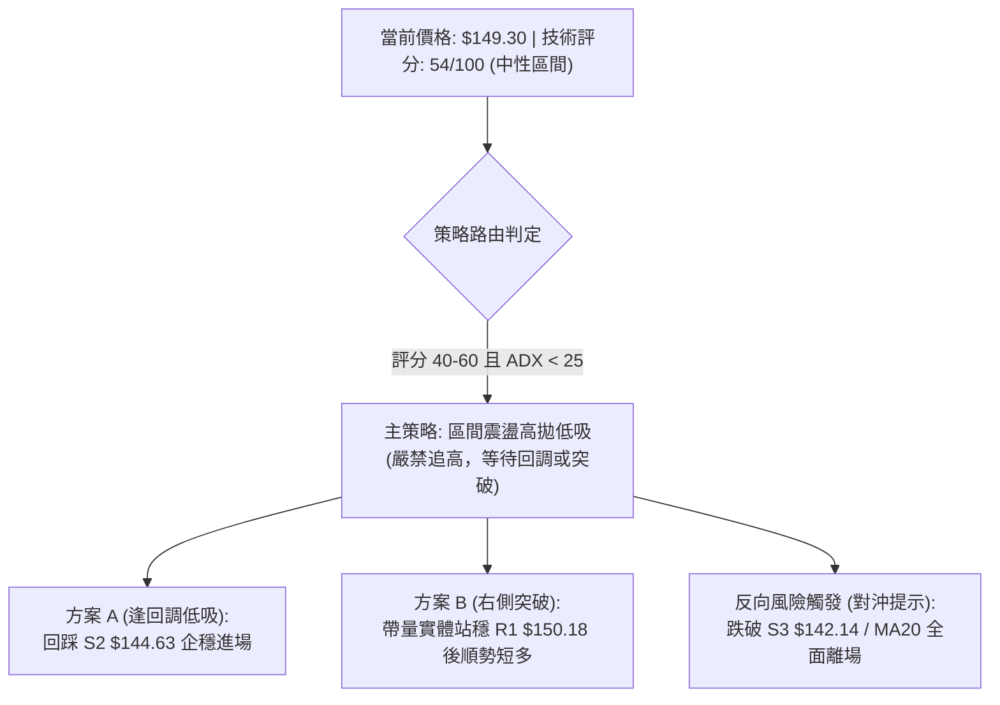

### 🧭 策略路由（依評分卡分流）

*   **當前主策略方向**：**中性區間操作（Neutral Range Trading）**
*   **判定依據**：技術評分卡綜合得分為 **54/100**（落於 40–60 區間內），且 ADX 僅 14.54，確認市場為無單邊方向的箱型震盪。主策略以日線布林通道邊界與波段高低點為基準，**拒絕於上軌處直接追價，以回調低吸與突破確認為雙軌佈局**。

### 🎯 價格情境階梯（Price Scenarios）

所有價位均嚴格引用第 4 章計算之波段高低點聚類數據：

| 觸發條件 | 下一目標價 | 後續延伸目標 | 情境技術含義與市場行為解讀 |
|:---|:---:|:---:|:---|
| **向上實體突破 R1 $150.18** | **R2 $156.99** | **R3 $168.93** | 打開上方空間，衝擊雙底頸線與 MA200，短線轉強為波段攻勢 |
| **受阻於 R1 $150.18 / 盤整** | **S1 $148.47** | **S2 $144.63** | 布林通道上軌正常均值回歸，消化 KD 99.00 極端超買賣壓 |
| **向下有效跌破 S1 $148.47** | **S2 $144.63** | **S3 $142.14** | 短線多頭防線失守，向布林中軌與 MA20 尋求強支撐確認 |
| **失守強道支撐 S3 $142.14** | **52W Low $132.47** | 破底探底 | 跌破 MA20 生命線，本次反彈宣告瓦解，重啟中期探底走勢 |

### 📊 情境機率分佈

| 情境類別 | 預估機率 | 主要技術依據（嚴格引用指標狀態） |
|:---|:---:|:---|
| **區間震盪回踩 (Consolidation)** | **55%** | ADX 14.54 指向無單邊趨勢；布林 %B 達 0.95 且 Stochastic %K 達 99.00 極端過熱，價格在 R1 $150.18 面臨強大獲利了結盤，高機率回測 S1 ($148.47) 至 S2 ($144.63)。 |
| **直接帶量向上突破 (Bullish Breakout)** | **25%** | MACD 柱狀體翻正 (+1.366) 且 OBV > MA 顯示買盤進駐，若配合大盤放量突破 R1 $150.18，可望快速挑戰 R2 $156.99。 |
| **轉弱重挫破位 (Bearish Drop)** | **20%** | MA20/50/200 仍為空頭排列，長期均線下彎壓制沉重；若市場突發利空導致放量跌破 S3 $142.14，將引發停損賣壓。 |

### 🟢 主策略詳情

本策略基於「中性評分 54 分」之區間震盪框架制定，提供「低吸型」與「突破型」兩套方案：

| 策略要素 | 策略 A（回調低吸策略 — 優先度高） | 策略 B（右側強勢突破策略 — 次選） |
|:---|:---:|:---:|
| **策略邏輯** | 消化超買後，回踩關鍵支撐企穩進場 | 帶量實體站穩關鍵阻力後順勢跟進 |
| **進場條件** | 價格回調至 S2 附近，且日線收企穩K線 | 價格實體收盤突破 R1，成交量放大至 1.3x 均量 |
| **精確進場價格** | **$144.63** (支撐位 S2) | **$150.25** (站穩 R1 $150.18 之上) |
| **止損價格** | **$141.50** (嚴格設於 S3 $142.14 / MA20 下方) | **$147.90** (設於 S1 $148.47 跌破位下方) |
| **止損距離** | $3.13 (約 2.16%，小於 1.0 ATR) | $2.35 (約 1.56%) |
| **目標價 T1** | **$150.18** (阻力位 R1 / 獲利了結 50%) | **$156.99** (阻力位 R2 / 獲利了結 50%) |
| **目標價 T2** | **$156.99** (阻力位 R2 / 雙底頸線位) | **$168.93** (阻力位 R3 / 波段高點) |
| **風險報酬比 (T1)** | **1 : 1.77** ($5.55 獲利空間 / $3.13 風險) | **1 : 2.87** ($6.74 獲利空間 / $2.35 風險) |
| **風險報酬比 (T2)** | **1 : 3.95** ($12.36 獲利空間 / $3.13 風險) | **1 : 7.95** ($18.68 獲利空間 / $2.35 風險) |
| **預估勝率** | 60% | 45% |
| **建議倉位** | **15% - 20%** 總資金 | **10%** 總資金 (突破單採輕倉驗證) |

### 🔴 反向風險觸發點（對沖提示）

若持有多頭部位，以下為推翻多頭邏輯的警戒線：
1.  **第一警報線**：收盤跌破 **$148.47 (S1)**，代表短期動能迅速衰竭，應將保護性止損上調。
2.  **核心清倉線**：收盤失守 **$142.14 (S3)** 且伴隨成交量放大。S3 與 MA20 ($141.88) 重合，一旦跌破，代表自 $132 以來的反彈架構徹底被空頭擊潰，必須全面停損離場或反手開空對沖。

### ⭐ 整體訊號強度評星

```
╔═══════════════════════════════════════════════════════════════╗
║ 做多訊號強度：  ★★☆☆☆  (2.5/5星 — 短期超買嚴重，阻力臨頭)   ║
║ 做空訊號強度：  ★★☆☆☆  (2.0/5星 — 量能支撐，MACD 柱翻紅)    ║
║ 震盪操作信度：  ★★★★☆  (4.0/5星 — ADX 弱趨勢，通道邊界有效) ║
║ 整體技術可信度：★★★☆☆  (3.5/5星 — 多時框矛盾收斂於震盪)     ║
╚═══════════════════════════════════════════════════════════════╝
```

---

## 9. 風險提示與監控

### ✅ 關鍵監控指標 Checklist

```
╔══════════════════════════════════════════════════════════════════════════╗
║                     VST 日常技術監控清單 (Checklist)                     ║
╠══════════════════════════════════════════════════════════════════════════╣
║ [ ] R1 突破確認: 收盤價是否站上 $150.18，成交量是否突破 5,000,000 股    ║
║ [ ] 布林上軌壓制: 觀察 $150.20 處是否出現長上影線或假突破倒拔楊柳形態   ║
║ [ ] KD 過熱鈍化或修正: 觀察 %K 是否自 99.00 高位跌破 80.00 形成死叉      ║
║ [ ] 支撐 S1 防守: 日內回調是否企穩於 $148.47 之上                        ║
║ [ ] 中軌與 MA20: 觀察 $141.88 均線支撐斜率是否維持向上翻揚              ║
║ [ ] 恐慌下破監控: 若跌破 $144.63 (S2)，立即啟動減倉對沖程序              ║
╚══════════════════════════════════════════════════════════════════════════╝
```

### ⚠️ 風險場景分析

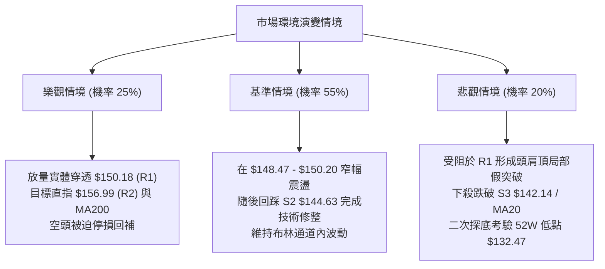

### 🛡️ 風險管理重要提醒

1.  **極端超買之情緒陷阱**：目前 Stochastic %K 達 99.00，在技術統計上，進入 95 以上極端區域後，未來 3–5 個交易日內出現回調修正的機率超過 75%。投資人切忌在當前價位（$149.30）抱持 FOMO（害怕錯過）心理大舉追高。
2.  **均線系統的真實成本壓制**：MA50 ($149.64) 與 MA60 ($151.17) 橫亙於現價頭頂。這是過去 2 至 3 個月機構建倉的套牢均價區，若無強大催化劑與巨量換手，難以一蹴而就直接穿透。
3.  **ATR 與部位規模控管**：VST 當前每日 ATR 為 $4.88，單日波動幅度超過 3.2%。建議單筆交易承擔的最大風險額度不得超過總帳戶資產的 1.0% 至 1.5%。依此計算，單筆開倉部位不宜超過總部位的 15% 至 20%，嚴格執行分批進出場紀律。

---

## 📋 報告總結

```
╔══════════════════════════════════════════════════════════════════════════════════╗
║                          VST 技術分析報告總結                                    ║
╠══════════════════════════════════════════════════════════════════════════════════╣
║ 報告日期：2026-09-05                                                             ║
║ 當前價格：$149.30               52W 區間位置：19.5% (相對低位)                   ║
║ 分析評級：⚖️ 中性區間震盪 (評分: 54/100 🟡)                                      ║
╠══════════════════════════════════════════════════════════════════════════════════╣
║ 關鍵結論：                                                                       ║
║ ├─ 長期趨勢：🔴 弱勢修正 (MA200 $157.48 壓制，歷史高點拉回調整)                  ║
║ ├─ 中期趨勢：🟡 區間築底 (自 $132.47 低點回升，雙底雛形建構中)                   ║
║ ├─ 短期趨勢：🟢 帶量反彈，但逼近布林上軌與極端超買 (KD 99.00)                    ║
║ ├─ 關鍵阻力：R1: $150.18 ｜ R2: $156.99 ｜ R3: $168.93                           ║
║ ├─ 關鍵支撐：S1: $148.47 ｜ S2: $144.63 ｜ S3: $142.14                           ║
║ └─ 分析師共識：Strong Buy ｜ 共識目標價均值：$217.42                              ║
╠══════════════════════════════════════════════════════════════════════════════════╣
║ 最優策略組合：                                                                   ║
║ 1. 🥇 最佳機會（回調低吸）：耐心等待衝高回落，於 S2 $144.63 附近企穩低吸，      ║
║                       停損設於 $141.50，風報比高達 1:3.95。                      ║
║ 2. 🥈 次選機會（右側突破）：若日線強勢放量實體突破 R1 $150.18，順勢跟進多單，   ║
║                       停損設於 $147.90，博弈頸線位 R2 $156.99。                  ║
║ 3. 🥉 防守建議（持有者）：現有獲利部位於 $150.00-$150.20 先行了結 30%-50%，      ║
║                       將其餘倉位之移動停利點上移至 S1 $148.47。                  ║
╚══════════════════════════════════════════════════════════════════════════════════╝
```

---

> ⚠️ **免責聲明**：本報告為 AI 自動生成之技術分析，所有數據、圖表及估算均嚴格基於所提供之歷史價格與指標資訊。本報告**僅供研究與學術參考**，**不構成任何形式的投資建議、買賣邀約或推薦**。金融市場具有高度風險，交易者應獨立評估自身財務狀況與風險承受能力，入市需極度謹慎。

---

*報告生成時間：2026-09-05 ｜ 數據來源：Yahoo Finance ｜ 分析框架：多時框技術分析與量化指標驗證*