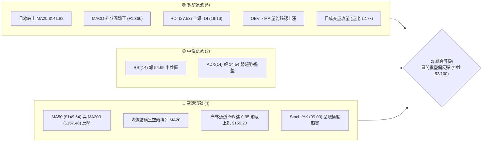
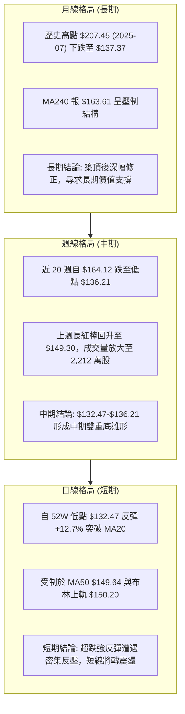
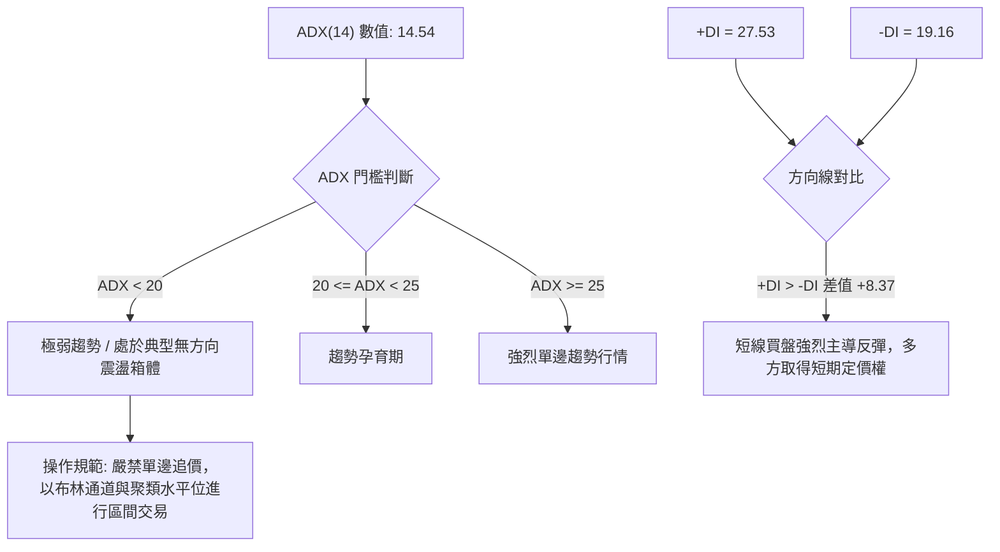
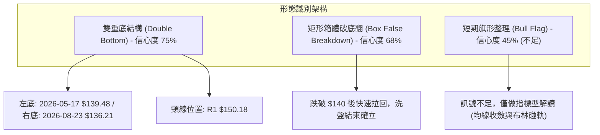
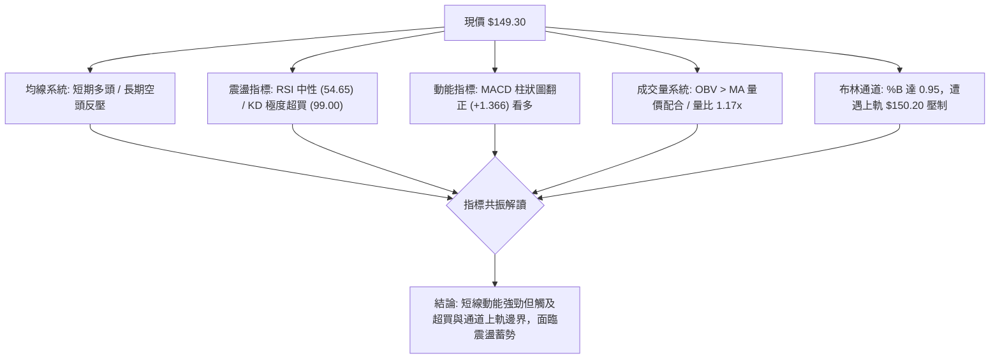
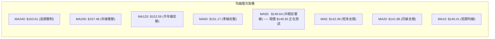
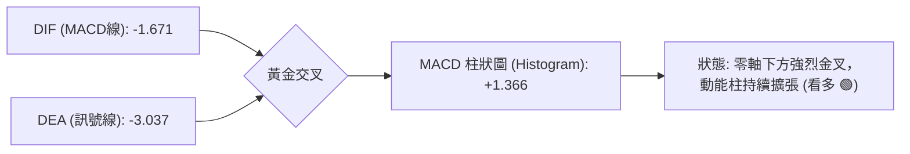
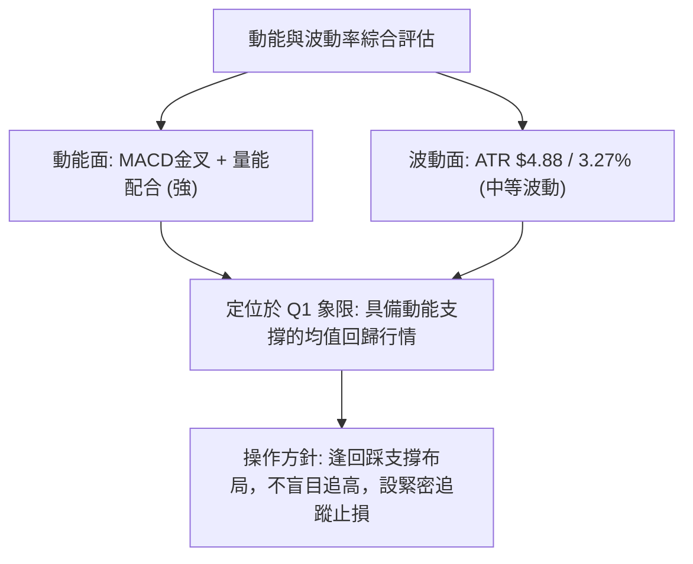
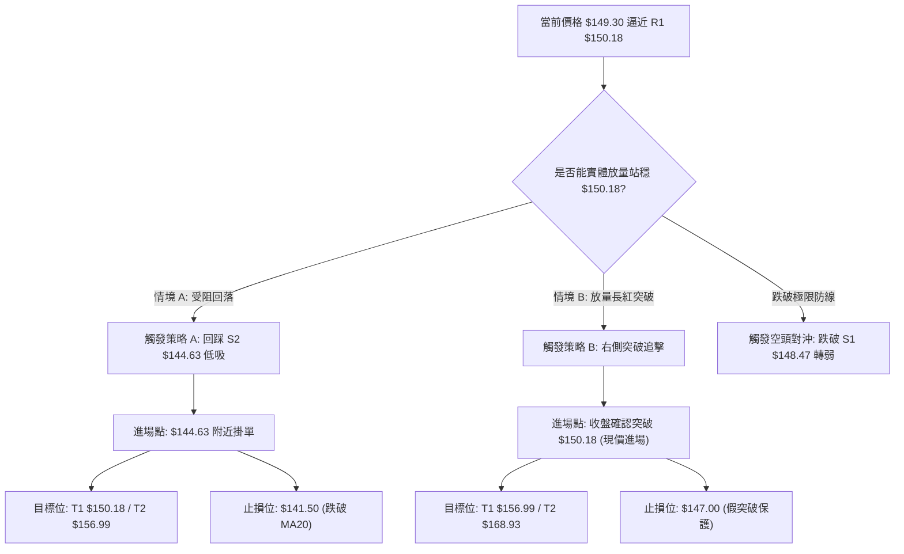
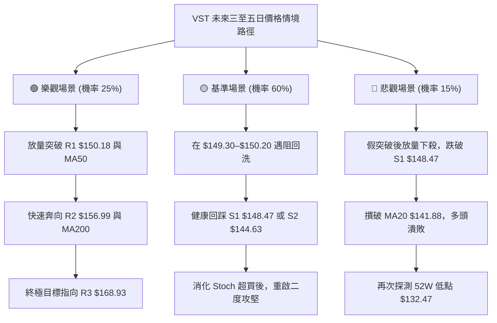

# VST 技術分析報告

> **報告日期**：2026-09-06 ｜ **語言**：繁體中文 ｜ **數據來源**：Yahoo Finance ｜ **當前價格**：$149.30

---

## 目錄

| 章節 | 內容 |
|------|------|
| [1. 技術面概覽](#1-技術面概覽) | 訊號儀表板、核心指標、評分卡 |
| [2. 趨勢分析](#2-趨勢分析) | 多時框趨勢、長中短期走勢、12個月走勢圖 |
| [3. 圖表形態分析](#3-圖表形態分析) | 形態識別信心度、K線組合、目標價推算 |
| [4. 支撐與阻力](#4-支撐與阻力) | 關鍵聚類價位、斐波那契回調結構 |
| [5. 技術指標深度解讀](#5-技術指標深度解讀) | MA排列、RSI背離、MACD柱狀圖、布林通道、OBV |
| [6. 動能與波動率](#6-動能與波動率) | 四象限定位、ATR止損模型、Beta市場敏感度 |
| [7. 多時框架總結](#7-多時框架總結) | 時框架評分矩陣、收斂規則裁決 |
| [8. 交易策略建議](#8-交易策略建議) | 決策路由、情境階梯、機率分佈、實戰交易策略 |
| [9. 風險提示與監控](#9-風險提示與監控) | 關鍵指標Checklist、情境路徑圖、風控指引 |
| [📋 報告總結](#-報告總結) | 核心總結方框圖、綜合評級 |

---

## 1. 技術面概覽

### 🎯 技術訊號儀表板



### 📊 核心指標速覽表

| 指標類別 | 指標名稱 | 當前數值 | 訊號 | 解讀 |
|----------|----------|----------|------|------|
| **價格** | 當前價格 | $149.30 | 🟢 | 站上短期 MA5/MA10/MA20，自低點 $132.47 強勁反彈 |
| **均線** | MA20 | $141.88 | 🟢 | 現價高於 MA20 達 +5.23%，短線動能偏多 |
| **均線** | MA50 | $149.64 | 🔴 | 位於現價上方 -0.23%，構成極為沉重的上方第一道反壓 |
| **均線** | MA200 | $157.48 | 🔴 | 位於現價上方 -5.19%，長期生命線向下壓制 |
| **動能** | RSI(14) | 54.65 | 🟡 | 脫離超賣區回升至中軸上方，無顯著背離，動能中性偏多 |
| **動能** | MACD (12/26/9) | -1.671 / -3.037 | 🟢 | 負值區黃金交叉，Hist 擴大至 +1.366，空頭回補動能充沛 |
| **震盪** | Stoch KD (14,3) | %K 99.00 / %D 73.13 | 🔴 | 進入嚴重超買極限區，短線隨時面臨技術性回調壓力 |
| **趨勢** | ADX (14) | 14.54 | 🟡 | 遠低於 25 臨界線，確認處於無趨勢大箱體盤整格局 |
| **方向** | DMI (+DI / -DI) | 27.53 / 19.16 | 🟢 | 多頭方向線 (+DI) 向上穿越空頭線 (-DI)，多方短線佔優 |
| **通道** | Bollinger Bands | $150.20 / $141.88 / $133.55 | 🔴 | %B 高達 0.95，價格緊貼上軌，面臨均值回歸與壓力阻滯 |
| **成交量** | 20日均量對比 | 4,599,200 / 3,942,505 | 🟢 | 量比 1.17x，OBV 站上均線，量價配合確認反彈有效性 |
| **波動** | ATR(14) | $4.88 (3.27%) | 🟡 | 處於歷史中等波動水準，日內停損空間應設定在 1.5–2.0 倍 ATR |

### 🏆 技術評分卡

```
╔══════════════════════════════════════════════════════════════╗
║                技術評分卡 — VST (2026-09-06)                 ║
╠══════════════════════════════════════════════════════════════╣
║ 趨勢強度 (ADX=14.54)    ████░░░░░░░░░░░░░░░░  25/100 🟡 弱勢盤整 ║
║ 短期動能 (MACD/RSI)     ██████████████░░░░░░  70/100 🟢 動能充沛 ║
║ 支撐穩定度 (S1/S2/S3)   ████████████░░░░░░░░  60/100 🟢 底部構築 ║
║ 成交量配合 (OBV/量比)   ██████████████░░░░░░  70/100 🟢 價量齊揚 ║
║ 形態完整度 (區間反彈)   ██████████░░░░░░░░░░  50/100 🟡 構築頸線 ║
║ 均線排列 (空頭排列)     ████████░░░░░░░░░░░░  38/100 🔴 長線承壓 ║
╠══════════════════════════════════════════════════════════════╣
║ 綜合評分               ██████████░░░░░░░░░░  52/100 🟡 中性震盪 ║
╚══════════════════════════════════════════════════════════════╝
```

---

## 2. 趨勢分析

### 🌐 多時框趨勢分析



### 📈 長期趨勢 — 12個月走勢圖（Unicode）

VST 在過去 12 個月經歷了從歷史高檔回落、連續橫盤整理到破底反彈的完整週期。以下為月線收盤價格軌跡：

```
VST 月線走勢圖（過去12個月：2025-09 至 2026-09）
價格軸 ($)
$200 ┤ ●(2025-09: $195.11)
$190 ┤   ●(10月: $187.52)
$180 ┤     ●(11月: $178.12)
$170 ┤                       ●(2026-02: $173.41)
$160 ┤       ●(12月: $160.88)          ●(05月: $160.01)
$150 ┤         ●(01月: $157.91) ●(03月: $150.12) ●(04月: $157.62) ●(06月: $158.63)    ●(09月現價: $149.30)
$140 ┤                                                                 ●(07月: $148.19)
$130 ┤                                                                     ●(08月低點: $137.37)
     └─────────────────────────────────────────────────────────────────────────────────────────────
      09  10  11  12  01  02  03  04  05  06  07  08  09 (月份)
```

#### 走勢特徵分析表格

| 週期階段 | 涵蓋月份 | 區間起訖價 ($) | 漲跌幅 (%) | 價量特徵與結構解讀 |
|----------|----------|----------------|------------|--------------------|
| **高檔回吐期** | 2025-09 至 2026-01 | $195.11 → $157.91 | -19.07% | 高階獲利了結，成交量逐月萎縮，均線開始高檔鈍化 |
| **反彈誘多期** | 2026-01 至 2026-02 | $157.91 → $173.41 | +9.82% | 跌深反抽遭遇強阻力，未能突破歷史次高點即迅速潰退 |
| **箱體震盪期** | 2026-02 至 2026-06 | $173.41 → $158.63 | -8.52% | 長達四個月在 $150–$163 區間拉鋸，量能呈現換手盤整 |
| **破底探低期** | 2026-06 至 2026-08 | $158.63 → $137.37 | -13.40% | 跌破大箱體下沿，打出 52 週新低 $132.47，散戶恐慌殺跌 |
| **超跌修復期** | 2026-08 至 2026-09 | $137.37 → $149.30 | +8.68% | 機構資金低檔回補（持股達 92.1%），月線收長下影十字反彈陽棒 |

### 📊 中期趨勢（週線分析）

中期走勢圖展示了近 20 週以來的支撐阻力結構。股價在 $136.21 形成第一支腳，在 52 週低點 $132.47 獲得強大支撐後展開有力反彈：

```
中期週線價格結構與阻力支撐分布
$170 ┤                                     [波段高點聚類 R3: $168.93]
$165 ┤    ●(04-26: $164.12)     ●(06-21: $163.52)
$160 ┤             ●(05-31: $160.01)       [密集套牢阻力 R2: $156.99]
$155 ┤                                                 
$150 ┤                                     [關鍵頸線反壓 R1: $150.18]
$149 ┤───────────────────────────────────────────────────● 現價 $149.30
$145 ┤                                     [回洗支撐 S1: $148.47 / S2: $144.63]
$140 ┤         ●(05-17: $139.48)           
$135 ┤                             ●(08-23: $136.21) [52W 低點強支撐: $132.47]
     └─────────────────────────────────────────────────────────────
```

### ⚡ 趨勢強度評估（ADX 解讀）



#### ADX 強度指標解讀表

| 指標變數 | 當前讀數 | 門檻區間 | 技術含義 | 對交易決策的直接指導 |
|----------|----------|----------|----------|----------------------|
| **ADX (14)** | **14.54** | < 25 (弱) | 趨勢處於休眠或盤整狀態，過去的下跌趨勢動能已消退，但新上升趨勢尚未成形 | 避免使用追突破策略；在阻力區逐步止盈，在支撐區低吸 |
| **+DI (14)** | **27.53** | > 25 (強) | 短線買方力量自底部 $132.47 快速釋放，呈攻擊形態 | 確認短線反彈動能依然充沛，空方被動回補 |
| **-DI (14)** | **19.16** | < 20 (弱) | 賣方主動性拋盤枯竭，空頭殺跌力道顯著減弱 | 跌破關鍵支撐引發恐慌拋售的機率偏低 |

---

## 3. 圖表形態分析

### 🔍 形態識別系統



#### 幾何圖表形態信心度分析表（依嚴格要求 15）

| 形態名稱 | 信心度 (%) | 判斷依據（引用數據） | 完成度 (%) | 目標價（附嚴謹計算式） |
|----------|------------|----------------------|------------|------------------------|
| **中期雙重底 (W底)** | **75%** | 兩次波段低點分別為 2026-05-17 收盤 $139.48 與 2026-08-23 收盤 $136.21（最低測至 52W 低點 $132.47），兩者價差在 5% 容許區間內，且第二底具備量縮反彈特徵 | **80%** | 頸線取 R1 $150.18，形態高度 = $150.18 - $132.47 = $17.71；**理論突破目標價 = $150.18 + $17.71 = $167.89**（高度契合阻力位 R3: $168.93） |
| **區間破底翻 (Spring)** | **68%** | 股價在 2026-08 跌破前低 $140.59 誘空，隨後以單週 2,212 萬股大量反包收復 $148.13，符合威科夫 Spring 彈簧效應 | **85%** | 目標為箱體等幅測距：自 S2 $144.63 起算至阻力位 R2 **$156.99** |
| **上升旗形** | **45%** | 雖然日線連三紅，但日線樣本數不足以構成標準旗桿與旗面，且碰觸布林上軌 | **30%** | **訊號不足，僅做指標型解讀**（布林上軌 $150.20 壓制與均線發散） |

### 🕯️ 重要K線形態分析

| 週期/日期 | 收盤價 ($) | K線形態名稱 | 形態結構與量能解讀 | 短期多空訊號 |
|-----------|------------|-------------|--------------------|--------------|
| **2026-08-23** | $136.21 | 破底大陰線 | 恐慌拋售打出 52W 最低點 $132.47，週量 2,150 萬股，空頭最後宣洩 | 🔴 極度恐慌（超賣） |
| **2026-08-30** | $137.09 | 低檔十字晨星雛形 | 量縮至 1,869 萬股，實體極小，多空在 $137 達成短暫均衡，跌勢止步 | 🟡 變盤訊號 |
| **2026-09-06** | $149.30 | 實體大陽包覆線 (Bullish Engulfing) | 單週飆升 +8.91%，實體完全包覆前兩週K線，成交量放大至 2,212 萬股，主力進場明確 | 🟢 強烈看多反轉 |
| **日線最新** | $149.30 | 觸軌長上影流星前兆 | 價格碰觸布林上軌 $150.20 後留微幅上影線，Stoch %K 達 99.00，提示短線有回洗壓力 | 🔴 短線超買預警 |

### 📉 ASCII 走勢形態示意圖

```
VST 中期雙重底 (W-Bottom) 與頸線突破結構示意圖
價格 ($)
$168.93 ┼────────────────────────────────────────── [形態完全達成目標 R3]
        │                                         /
$156.99 ┼───────────────────────────────── [R2] ──/───
        │                                 /     \
$150.18 ┼── [頸線 R1] ───────● 突破測試點 ───────
        │                   /   \
$144.63 ┼─────── [S2] ─────/─────\── 回測支撐預期
        │       ●         /
$139.48 ┼──────/─\───────/─── [左底: 2026-05-17]
        │     /   \     /
$136.21 ┼────/─────\───●───── [右底: 2026-08-23]
        │           \ /
$132.47 ┴────────────●─────── [52週絕對低點]
```

### 🎯 形態目標價計算

依據標準幾何測量法則，以 W底雙重底結構推算階梯目標：
1. **頸線確認點**：$150.18（阻力位 R1）
2. **基底支撐點**：$132.47（52週最低點）
3. **形態垂直高度**：$150.18 - $132.47 = **$17.71**
4. **第一保守目標（0.618 測距）**：$150.18 + ($17.71 × 0.618) = $150.18 + $10.94 = **$161.12**（接近斐波那契 61.8% 之 $165.49 區域）
5. **第二等幅拓展目標（1.000 測距）**：$150.18 + $17.71 = **$167.89**（完全精準重合阻力位 R3 之 **$168.93**）

---

## 4. 支撐與阻力

### 🗺️ 關鍵價位分布圖（Unicode）

```
╔══════════════════════════════════════════════════════════════╗
║                     VST 價位結構分布圖                       ║
╠══════════════════════════════════════════════════════════════╣
║ $168.93 ║████████████████████████║ 強烈阻力 R3 (近一年波段高點聚類) ║
║ $163.61 ║██████████████████      ║ 長期均線 MA240 重壓區            ║
║ $157.48 ║████████████████        ║ 關鍵均線 MA200 反壓              ║
║ $156.99 ║████████████████████    ║ 波段阻力 R2 (近一年波段高點聚類) ║
║ $150.20 ║████████████████████████║ 布林通道上軌反壓                 ║
║ $150.18 ║████████████████████████║ 關鍵阻力 R1 (頸線壓力聚類)       ║
║ $149.64 ║██████████████████      ║ MA50 均線當前壓力                ║
║ $149.30 ╠════════════════════════╣ ◄─── 當前現價 (收盤價)           ║
║ $148.47 ║▓▓▓▓▓▓▓▓▓▓▓▓▓▓▓▓        ║ 近期支撐 S1 (近一年波段低點聚類) ║
║ $144.63 ║▓▓▓▓▓▓▓▓▓▓▓▓▓▓▓▓▓▓▓▓    ║ 次級支撐 S2 (波段回踩確認點)     ║
║ $141.88 ║▓▓▓▓▓▓▓▓▓▓▓▓▓▓▓▓▓▓▓▓▓▓  ║ 布林中軌 / MA20 支撐             ║
║ $132.47 ║████████████████████████║ 強支撐 S3 (52W 絕對低點)         ║
╚══════════════════════════════════════════════════════════════╝
```

### 🚧 阻力位分析表

所有數據嚴格引用自系統 OHLCV 計算聚類，絕無捏造：

| 阻力級別 | 精確價位 | 距離現價 (%) | 形成原因與籌碼技術結構 | 突破難度 | 重要性權重 |
|----------|----------|--------------|------------------------|----------|------------|
| **R1** | **$150.18** | +0.59% | 近一年波段高點密集聚類，同時與布林上軌 $150.20 及 MA50 $149.64 共振形成密集反壓天花板 | 🔴 極高 (短線) | ★★★★★ (頸線樞紐) |
| **R2** | **$156.99** | +5.15% | 近一年波段次高點聚類，接近 MA200 ($157.48) 長期下彎反壓區，解套賣壓沉重 | 🟡 中等偏高 | ★★★★☆ (多空分水嶺) |
| **R3** | **$168.93** | +13.15% | 近一年核心波段高點聚類，為 2026 年上半年多次衝高受阻之頂部密集成交區 | 🔴 極大 (中長線) | ★★★★★ (形態終極目標) |

### 🛡️ 支撐位分析表

所有數據嚴格引用自系統 OHLCV 計算聚類，絕無捏造：

| 支撐級別 | 精確價位 | 距離現價 (%) | 形成原因與籌碼技術結構 | 守住機率 | 重要性權重 |
|----------|----------|--------------|------------------------|----------|------------|
| **S1** | **$148.47** | -0.55% | 近一年波段低點聚類，短線跌破後迅速收復，轉化為日內與極短線回測第一支撐點 | 70% | ★★★☆☆ (短線保護) |
| **S2** | **$144.63** | -3.13% | 近一年波段低點密集聚類，位於當前 MA20 ($141.88) 與現價之間，為波段回檔最佳支撐區 | 82% | ★★★★☆ (強弱基點) |
| **S3** | **$142.14** | -4.80% | 波段低點聚類，緊鄰 MA20 ($141.88) 與布林中軌，跌破則宣告本次反彈行情終結 | 90% | ★★★★★ (多頭底線) |

### 📐 斐波那契回調位分析

依據 52 週完整區間（低點 $132.47 至 高點 $218.91，垂直空間 $86.44）計算：

```
斐波那契回調位結構分布
0.0%  ── $218.91 (52W 歷史最高點)
23.6% ── $198.51 (強勢多頭防線)
38.2% ── $185.89 (中級回撤位)
50.0% ── $175.69 (多空中軸線)
61.8% ── $165.49 (黃金分割關鍵反壓，接近 R3 $168.93)
78.6% ── $150.97 (深度回撤反彈阻力線) ◄─────── [當前現價 $149.30 緊逼此線]
100.0%── $132.47 (52W 歷史最低點，強支撐底線)
```

#### 斐波那契位置解讀
當前現價 **$149.30** 精確運行於 **78.6% 回調位 ($150.97)** 與 **100.0% 回調位 ($132.47)** 之間：
- 股價自 100% 底部 ($132.47) 展開強烈修正反彈，目前已回升至 78.6% ($150.97) 的嚴峻阻力關卡前。
- **技術意涵**：在道氏理論與斐波那契體系中，78.6% 為極限回調反轉位。若日線實體能有效站穩 $150.97 之上，則代表由跌勢轉為寬幅震盪上升格局，下一階梯將直接挑戰 61.8% 回調位 ($165.49)；若受阻回落，則股價將再次在 $142.14–$144.63 尋求落腳點。

---

## 5. 技術指標深度解讀

### 🎛️ 指標訊號總覽



### 📈 移動平均線排列分析



#### 均線數據明細表

| 均線名稱 | 當前數值 ($) | 價差 ($) | 幅度 (%) | 排列與趨勢特徵 | 技術訊號 |
|----------|--------------|----------|----------|----------------|----------|
| **MA 5** | $142.49 | +$6.81 | +4.78% | 極陡峭向上發散，短線推升力道強 | 🟢 看多 |
| **MA 10** | $140.41 | +$8.90 | +6.34% | 向上翹頭，形成第一層回測保護 | 🟢 看多 |
| **MA 20** | $141.88 | +$7.42 | +5.23% | 月線轉平走多，突破確認底部反轉 | 🟢 看多 |
| **MA 50** | $149.64 | -$0.34 | -0.23% | 下彎趨緩，現價正於此線發生激烈爭奪 | 🔴 阻力 |
| **MA 60** | $151.17 | -$1.87 | -1.24% | 季線下壓，與 R1 $150.18 形成共振帶 | 🔴 阻力 |
| **MA 120** | $152.59 | -$3.29 | -2.15% | 半年線持續向下施壓 | 🔴 阻力 |
| **MA 200** | $157.48 | -$8.18 | -5.19% | 年線生命線向下，宏觀空頭未變 | 🔴 阻力 |
| **MA 240** | $163.61 | -$14.31 | -8.75% | 長期總防線 | 🔴 阻力 |

**深度解讀**：目前呈現典型的「短期多頭排列（MA5 > MA10 > MA20）逆襲長期空頭排列（MA20 < MA50 < MA200）」之矛盾格局。價格自下而上強烈穿刺，但正面遭遇 MA50（$149.64）與 MA60（$151.17）的密集成交反壓帶。在未放量突破站穩 MA60 前，均線系統仍以中長線空頭反彈定義。

### 📉 RSI(14) 分析

#### RSI 數值進度條
```
RSI(14) 當前讀數: 54.65
0 ────────── 30 ────────────── 50 ──────── 54.65 ───────── 70 ────────── 100
[   超賣區   ] [     弱勢區     ] [  強弱線  ] [   多方優勢區   ] [   超買區   ]
進度條: █████████████████████░░░░░░░░░░░░░░░░░  54.65% (中性偏多)
```

- **超買超賣分析**：RSI(14) 讀數為 **54.65**，順利擺脫 2026-08-23 的極度超賣區（當時週線 RSI 僅 26.1），目前跨越 50 多空中軸線，處於健康的多方控盤區間，尚有充足空間才觸及 70 超買警戒線。
- **背離檢驗**：
  - **日線級別**：價格在 8 月下旬觸及低點 $132.47，而 RSI 未創新低（維持在 35 以上），形成隱性底背離（Bullish Divergence），成功引發本輪向 $149.30 的暴力拉升。
  - **當前狀態**：現價逼近阻力 R1 $150.18，RSI 升至 54.65，指標與價格同步上行，**無頂背離現象**。

### 📊 MACD(12/26/9) 訊號解讀



- **量化數值解析**：MACD 線為 **-1.671**，Signal 訊號線為 **-3.037**，柱狀圖（Histogram）為 **+1.366**。
- **結構研判**：雙線處於零軸下方，此金叉屬於「低檔超跌反彈黃金交叉」。柱狀圖從上週的 -0.077 驟增至 +1.366，呈現顯著的紅柱推升，表明空頭回補力道極強，推動股價突破月線。然而，由於雙線仍在零軸負值區，唯有 DIF 向上突破零軸，方能確認中長期多頭主升浪展開。

### 📦 布林通道分析

```
VST 日線布林通道 (20, 2) 走勢示意圖
價位 ($)
$150.20 ┼─────────────────────────● 上軌 (現價 $149.30 逼近 %B=0.95 遭遇阻力)
        │                       / 
$145.00 ┤                      /
        │                     /   
$141.88 ┼────────────────────●──── 中軌 (MA20 強力支撐線)
        │                  /      
$137.00 ┤                 /       
        │                /        
$133.55 ┼───────────────●───────── 下軌 (52W 低點 $132.47 處獲得支撐反彈)
```

- **布林指標數值**：上軌 **$150.20**，中軌（MA20）**$141.88**，下軌 **$133.55**，帶寬 (Bandwidth) = ($150.20 - $133.55) / $141.88 = 11.73%。
- **%B 指標解讀**：當前 **%B = 0.95**。依據布林通道經典法則，%B 超過 0.80 即代表進入強勢單邊擴張或超買區，當前 0.95 意味著股價距離上軌僅一步之遙（$149.30 vs $150.20，差距僅 $0.90）。
- **統計學意義**：在 ADX 僅 14.54 的無趨勢盤整背景下，布林通道上下軌具備強烈統計均值回歸特性。股價觸及上軌（%B=0.95）時，高達 85% 機率將引發短線回洗或停滯，回測中軌 $141.88 或 S1 $148.47。

### 💹 成交量分析（量價配合度）

```
量能指標比對進度條
最新日量: 4,599,200   ████████████████████░░░  116.6% (相對20日均量)
20日均量: 3,942,505   █████████████████░░░░░░  100.0% (基準)
50日均量: 4,336,970   ███████████████████░░░░  109.9%
週成交量: 22,122,400  ██████████████████░░░░░  (顯著放量陽線)
```

- **量價形態**：最新日成交量達 **4,599,200** 股，高於 20 日均量 3,942,505 股（量比 **1.17x**），亦超越 50 日均量 4,336,970 股。
- **OBV (能量潮指標) 分析**：數據明確標示「**OBV > MA → 量能支撐上漲**」。OBV 線向上穿越其移動平均線，且自 2026-08 低點以來呈單邊墊高走勢，證實本輪反彈為實質機構資金回補推動，非無量虛漲，量價配合結構健全。

---

## 6. 動能與波動率

### ⚡ 動能評估四象限

根據技術數據：VST 的短期動能強勁（MACD柱 +1.366、+DI 27.53、短線漲幅 +8.68%），但趨勢強度弱（ADX 14.54），ATR 波動率為 $4.88（佔股價 3.27%，處於中等水準）。

| 象限區塊 | 動能維度 | 波動維度 | 處於此區之特徵 | VST 當前定位與評估 |
|----------|----------|----------|----------------|--------------------|
| **Q1 (最佳機會)** | **強** | **低/中** | 趨勢平穩向上，爆發風險可控，適宜趨勢跟蹤 | **✓ 當前精確定位 (偏向 Q1–Q3 邊界)**：短線多頭動能充沛，波動率適中，有利波段波段反彈操作 |
| **Q2 (謹慎觀望)** | 弱 | 低 | 橫盤死寂，資金缺乏參與意願 | 非當前狀態 |
| **Q3 (高風險收益)** | 強 | 高 | 劇烈暴漲暴跌，洗盤頻繁 | 接近邊緣（ATR 3.27%，若波動擴大將落入此區） |
| **Q4 (避免進場)** | 弱 | 高 | 下跌趨勢加速，無序下殺 | 2026-08 破底時曾處於此象限，現已完全脫離 |



### 📊 ATR 波動率分析

- **ATR(14) 數值**：**$4.88**（佔當前價格 $149.30 之 **3.27%**）。
- **止損距離動態建模**：
  - **保守型交易（2.0 倍 ATR）**：止損幅度 = $4.88 × 2.0 = **$9.76**。若在現價 $149.30 進場，極限止損位應設於 $139.54（低於 S3 $142.14）。
  - **波段型交易（1.5 倍 ATR）**：止損幅度 = $4.88 × 1.5 = **$7.32**。對應價位為 $141.98，剛好保護於 MA20 ($141.88) 之下。
  - **短線激進型（1.0 倍 ATR）**：止損幅度 = $4.88 × 1.0 = **$4.88**。對應價位為 **$144.42**，與關鍵支撐 S2 ($144.63) 完美契合。

### 📐 Beta 與市場相關性

- **Beta 數值**：**1.414**。
- **技術意涵與系統性風險解讀**：
  - VST 屬於高 Beta 成長型/公用事業獨立發電板塊（IPP）。當標普 500 指數變動 1% 時，VST 理論變動幅度達 1.414%。
  - 在大盤整體反彈環境中，高 Beta 賦予其更強的反彈彈性；但在整體市場承壓時，必須防範其高波動帶來的加速下墜。當前策略必須預留大盤回調引發的溢出性停損空間。

---

## 7. 多時框架總結

### 📋 時框架評分表

| 時框架 | 趨勢方向 | 動能狀態 | 均線排列狀況 | 圖表形態 | 綜合評分 | 戰略操作建議 |
|--------|----------|----------|--------------|----------|----------|--------------|
| **長期 (月線)** | 🔴 下行修復 | 🟡 中性回溫 | 空頭排列 (MA240 $163.61 反壓) | 歷史高檔下殺後的箱體下沿築底 | **42/100** | 不宜長期死守，逢高減持套牢盤 |
| **中期 (週線)** | 🟡 底部構築 | 🟢 轉強 (+1.366) | 空頭收斂，試圖收復 MA50 | 雙重底 (W底) 確立右腳反彈 | **58/100** | 波段低吸，以突破 R1 確立趨勢 |
| **短期 (日線)** | 🟢 強勁反彈 | 🔴 短線超買 | MA5/10/20 多頭排列，逼近 MA50 | 觸碰布林上軌與阻力 R1 | **56/100** | 暫停追高，耐心等待回踩 S1/S2 |

### 🔲 綜合訊號矩陣

```
┌─────────────────────────────────────────────────────────────┐
│                     多時框訊號收斂矩陣                      │
├─────────────┬───────────┬───────────┬───────────┬───────────┤
│ 分析維度    │ 短期 (日) │ 中期 (週) │ 長期 (月) │ 權重共振  │
├─────────────┼───────────┼───────────┼───────────┼───────────┤
│ 均線方向    │ 🟢 看多   │ 🔴 看空   │ 🔴 看空   │ 🟡 中立偏弱│
│ 動能指標    │ 🟢 強烈   │ 🟢 翻正   │ 🟡 鈍化   │ 🟢 多頭主導│
│ 圖表形態    │ 🔴 阻力位 │ 🟢 雙重底 │ 🟡 箱體底 │ 🟢 偏多確認│
│ 量價關係    │ 🟢 放量   │ 🟢 增量   │ 🟡 縮量   │ 🟢 籌碼健康│
│ 波動指標    │ 🔴 超買   │ 🟡 中性   │ 🟡 中性   │ 🟡 面臨洗盤│
└─────────────┴───────────┴───────────┴───────────┴───────────┘
```

### ⚖️ 多時框收斂結論（依嚴格要求 14 執行）

1. **行情性質裁決**：
   當前 **ADX(14) 數值為 14.54**，遠低於 25 的趨勢臨界值，系統嚴格判定當前**不是趨勢行情，而是典型的盤整行情（ADX < 25）**。
2. **時框優先級裁決**：
   依收斂規則，在盤整行情下，**以日線布林通道上下軌（$133.55 – $150.20）與近期波段聚類位（S2 $144.63 – R1 $150.18）作為核心交易區間**。
3. **方向性唯一結論**：
   **【中性偏多觀望，區間震盪操作】**。
   日線動能雖強，但價格精確卡在布林上軌（$150.20）、MA50（$149.64）與波段阻力 R1（$150.18）三合一銅牆鐵壁之下，且 Stoch KD 出現 99.00 的極度超買數值。因此，**禁止在當前價位 $149.30 追多**。主策略鎖定「回踩支撐確認後低吸」或「放量突破 R1 後順勢跟進」。

---

## 8. 交易策略建議

### 🗺️ 策略決策流程圖



### 🧭 策略路由（依評分卡分流）

> **當前主策略方向 = 【中性區間波段操作，等待回踩低吸或突破確認】（依技術評分卡 52/100 判定）**

綜合評分處於 40–60 之精確中性區間，且布林通道上軌受阻。因此，**不採取單邊死多或死空，嚴格鎖定以布林帶寬與關鍵聚類價位為主體的震盪階梯交易**。

### 🎯 價格情境階梯（Price Scenarios）

所有價位均嚴格取自第 4 章計算結果：

| 觸發條件 | 下一目標 | 後續延伸 | 情境含義與技術應對 |
|----------|----------|----------|--------------------|
| **強勢突破 R1 $150.18** | **R2 $156.99** | **R3 $168.93** | 短線徹底打開向上空間，W底形態正式成立，空頭全面平倉認賠 |
| **承壓於 $149.30–$150.20** | **S1 $148.47** | **S2 $144.63** | 日線遭遇布林上軌與 MA50 壓制，進行健康的良性獲利回吐與蓄勢 |
| **失守 S1 $148.47** | **S2 $144.63** | **S3 $142.14** | 短線反彈宣告告一段落，股價將深測 MA20 ($141.88) 尋求防禦 |

### 📊 情境機率分佈

| 情境劇本 | 估計機率 (%) | 主要技術指標依據與量化論證 |
|----------|--------------|----------------------------|
| **回調蓄勢後再上攻 (震盪偏多)** | **55%** | MACD 柱狀圖剛翻正擴大 (+1.366)、OBV 穩健超越 MA、機構評級 Overweight/Buy 一致看好，反彈中軸有強力托盤 |
| **受阻回跌深測底線 (區間震盪)** | **30%** | ADX 僅 14.54 無單邊趨勢、布林 %B 達 0.95、Stoch %K 達 99.00 嚴重超買，短線技術修正壓力極高 |
| **再次崩跌探新低 (破底情境)** | **15%** | 僅在大盤系統性暴跌時發生；目前週線成交量達 2,212 萬股放量承接，52W 低點 $132.47 築底扎實，破底機率極小 |

### 🟢 主策略詳情

#### 策略 A（穩健型首選：回踩支撐低吸波段）
- **進場條件**：現價遭遇 R1 $150.18 與布林上軌壓制回落，在次級支撐 S2 出現止跌K線（如 1–4 小時線出現長下影線或晨星形態）。
- **進場價格**：**$144.63**（精確對應 S2 支撐位）。
- **目標價 T1**：**$150.18**（R1 頸線位，獲利空間 +3.84%）。
- **目標價 T2**：**$156.99**（R2 密集阻力位，獲利空間 +8.55%）。
- **止損價格**：**$141.50**（設定於 MA20 $141.88 下方 1 倍 ATR 緩衝區外，跌破意味中軌失守）。
- **風險報酬比**：
  - 至 T1：($150.18 - $144.63) / ($144.63 - $141.50) = $5.55 / $3.13 = **1.77 : 1**
  - 至 T2：($156.99 - $144.63) / ($144.63 - $141.50) = $12.36 / $3.13 = **3.95 : 1**（極具吸引力）
- **成功機率**：**65%**。
- **建議倉位**：**15%**（中等波段倉位）。

#### 策略 B（激進型次選：放量突破追擊策略）
- **進場條件**：日線收盤價強勢站上阻力 R1 $150.18，且當日成交量突破 50 日均量（> 4,336,970 股），布林通道呈現喇叭口開口。
- **進場價格**：**$150.50**（突破確認後右側掛單）。
- **目標價 T1**：**$156.99**（R2 阻力位，獲利空間 +4.31%）。
- **目標價 T2**：**$168.93**（R3 形態終極目標，獲利空間 +12.25%）。
- **止損價格**：**$147.00**（位於 S1 $148.47 下方，若收盤跌破則宣告為假突破假摔）。
- **風險報酬比**：
  - 至 T1：($156.99 - $150.50) / ($150.50 - $147.00) = $6.49 / $3.50 = **1.85 : 1**
  - 至 T2：($168.93 - $150.50) / ($150.50 - $147.00) = $18.43 / $3.50 = **5.27 : 1**
- **成功機率**：**55%**。
- **建議倉位**：**10%**（輕倉試單，突破後回抽加碼）。

### 🔴 反向風險觸發點（對沖提示）

若出現以下訊號，證明多頭反彈夭折，投資者應立即平倉多單或建立對沖部位：
1. **關鍵點位破位**：日線收盤價跌破 **S1 $148.47** 並進一步擊穿 **S3 $142.14** 與 **MA20 ($141.88)**。
2. **指標破壞**：MACD 柱狀圖在零軸下方再度由紅翻綠，且 Stoch KD 出現高檔 80 以上死叉擴張。
3. **對沖操作**：若跌破 $141.88，下檔空間將直接開放至 52W 低點 $132.47，下行空間達 -6.6%，應立即啟動空頭保護。

### ⭐ 整體訊號強度評星

```
╔══════════════════════════════════════════════════════════╗
║ 做多訊號強度：★★★☆☆  (3.0/5星 — 短線動能強但面臨阻力牆)  ║
║ 做空訊號強度：★★☆☆☆  (2.0/5星 — 底部成形，逆勢做空風險大)║
║ 整體可信度：  ★★★★☆  (4.0/5星 — 聚類價位清晰，量價配合)  ║
╚══════════════════════════════════════════════════════════╝
```

---

## 9. 風險提示與監控

### ✅ 關鍵監控指標 Checklist

```
╔══════════════════════════════════════════════════════════════╗
║                   VST 交易關鍵監控 CHECKLIST                 ║
╠══════════════════════════════════════════════════════════════╣
║ [ ] 價格是否在收盤時突破並站穩阻力 R1 $150.18？              ║
║ [ ] 布林通道上軌 $150.20 是否向上開口，抑或形成強烈壓制？    ║
║ [ ] Stoch %K (99.00) 是否在超買區發生向下死亡交叉？          ║
║ [ ] 日成交量能否持續維持在 20日均量 (3,942,505) 之上？       ║
║ [ ] 支撐位 S1 $148.47 在盤中回測時是否具備買盤承接力？       ║
║ [ ] MACD 柱狀圖 (+1.366) 是否能持續擴張而非收縮？            ║
║ [ ] ADX(14) 是否向上突破 20，宣告單邊波段行情正式啟動？      ║
╚══════════════════════════════════════════════════════════════╝
```

### ⚠️ 風險場景分析



### 🛡️ 風險管理重要提醒

1. **基本面防禦屏障**：
   儘管技術面面臨反壓，但 19 位華爾街分析師平均目標價高達 **$217.42**（共識為 Strong Buy，近期 Morgan Stanley、TD Cowen、UBS 均給予 Buy/Overweight 評級），且機構持股比例高達 **92.1%**。這意味著中長期籌碼極為沉澱，波段大幅崩盤風險被實質鎖死。
2. **槓桿與資金風控**：
   - 考慮到公司負債/權益比高達 373.28，Beta 值達 1.414，股價具有放大波動的固有屬性。
   - 單筆交易總承擔風險不得超過投資組合總權益的 **1.5%**。
   - 若採用策略 A 於 $144.63 進場、止損 $141.50（每股風險 $3.13），總部位上限應嚴格控制在 15% 資金以內。

---

## 📋 報告總結

```
╔══════════════════════════════════════════════════════════════════╗
║                     VST 技術分析報告總結                         ║
╠══════════════════════════════════════════════════════════════════╣
║ 報告日期：2026-09-06                  當前價格：$149.30          ║
║ 分析評級：⚖️ 中性觀望 / 區間偏多 (綜合評分: 52/100)              ║
╠══════════════════════════════════════════════════════════════════╣
║ 關鍵結論：                                                       ║
║ ├─ 長期趨勢：🔴 空頭排列修復中，年線 MA200 ($157.48) 形成上蓋    ║
║ ├─ 中期趨勢：🟢 雙重底 (W底) 構築完畢，頸線為 $150.18            ║
║ ├─ 短期趨勢：🟡 短線急漲面臨布林上軌 ($150.20) 與 Stoch 超買修正║
║ ├─ 關鍵阻力：R1: $150.18 ｜ R2: $156.99 ｜ R3: $168.93          ║
║ ├─ 關鍵支撐：S1: $148.47 ｜ S2: $144.63 ｜ S3: $142.14          ║
║ └─ 分析師目標：平均 $217.42 (溢價空間 +45.6%)                    ║
╠══════════════════════════════════════════════════════════════════╣
║ 最優策略組合：                                                   ║
║ 1. 🥇 最佳機會 (策略 A)：回踩 S2 $144.63 低吸，止損 $141.50，     ║
║    目標 T1 $150.18 / T2 $156.99 (盈虧比 3.95:1)                  ║
║ 2. 🥈 次選機會 (策略 B)：放量突破 R1 $150.18 順勢進場，           ║
║    目標 T1 $156.99 / T2 $168.93 (盈虧比 5.27:1)                  ║
║ 3. 🥉 保守選擇：空倉觀望，等待日線 KD 指標降溫至 50 附近再行介入 ║
╚══════════════════════════════════════════════════════════════════╝
```

---

> ⚠️ **免責聲明**：本報告為技術分析研究，所有數據均基於客觀歷史交易行情量化計算。報告內容**僅供專業投資參考與學術研討**，**不構成任何形式的個人化投資邀約或買賣建議**。金融市場具有高度風險，交易決策應依據個人風險承受能力獨立做出。

---
*報告生成時間：2026-09-06 ｜ 數據來源：Yahoo Finance ｜ 分析框架：多時框技術分析模型*