# VST 技術分析報告

> **報告日期**：2026-09-07 ｜ **語言**：繁體中文 ｜ **數據來源**：Yahoo Finance ｜ **當前價格**：$149.30

---

## 目錄

| 章節 | 內容 |
|------|------|
| [1. 技術面概覽](#1-技術面概覽) | 訊號儀表板、核心指標、評分卡 |
| [2. 趨勢分析](#2-趨勢分析) | 多時框趨勢、長中短期走勢 |
| [3. 圖表形態分析](#3-圖表形態分析) | 形態識別、K線組合、目標價 |
| [4. 支撐與阻力](#4-支撐與阻力) | 關鍵價位、斐波那契回調 |
| [5. 技術指標深度解讀](#5-技術指標深度解讀) | MA/RSI/MACD/布林/成交量 |
| [6. 動能與波動率](#6-動能與波動率) | 動能評估、ATR、Beta |
| [7. 多時框架總結](#7-多時框架總結) | 時框架評分矩陣 |
| [8. 交易策略建議](#8-交易策略建議) | 多空策略、風險報酬比 |
| [9. 風險提示與監控](#9-風險提示與監控) | 監控指標、風險場景 |

---

## 1. 技術面概覽

### 🎯 技術訊號儀表板

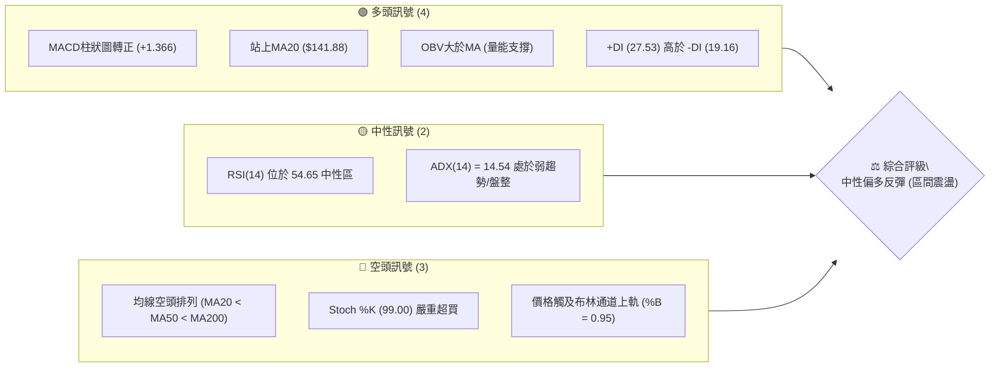

### 📊 核心指標速覽表

| 指標類別 | 指標名稱 | 當前數值 | 訊號 | 解讀 |
|----------|----------|----------|------|------|
| **價格** | 當前價格 | $149.30 | 🟡 | 位於52週區間 19.5% 低檔，短線自底部反彈至密集壓力帶 |
| **均線** | MA20 | $141.88 | 🟢 | 現價高於 MA20（+5.23%），短期築底向上展開修復 |
| **均線** | MA50 | $149.64 | 🟡 | 現價緊逼 MA50 頸線壓力（差距 -0.23%），多空拉鋸關鍵點 |
| **均線** | MA200 | $157.48 | 🔴 | 現價低於牛熊分界線 MA200，長期趨勢結構仍未扭轉 |
| **動能** | RSI(14) | 54.65 | 🟡 | 位於 50 榮枯線上方，動能溫和回升但無極端背離 |
| **動能** | MACD Hist | +1.366 | 🟢 | MACD線 (-1.671) 黃金交叉 Signal線 (-3.037)，柱狀圖持續擴大 |
| **動能** | Stoch %K/%D| 99.00 / 73.13 | 🔴 | KD 指標進入極端超買區，短線面臨技術性回踩拉回壓力 |
| **趨勢** | ADX(14) | 14.54 | 🟡 | 數值低於 25，表明目前處於無主導方向的寬幅箱體震盪行情 |
| **通道** | 布林通道 | %B = 0.95 | 🔴 | 現價 $149.30 緊貼上軌 $150.20，短線空間受限於通道上沿 |
| **量能** | 量比 (Vol/20MA) | 1.17x | 🟢 | 最新量 4.59M 高於20日均量 3.94M，量增價漲呈現良性配合 |
| **波動** | ATR(14) | $4.88 | 🟡 | 佔價格 3.27%，日均波幅約 5 美元，屬中等波動水準 |

### 🏆 技術評分卡

```
╔══════════════════════════════════════════════════════════════════╗
║                技術評分卡 — VST (2026-09-07)                    ║
╠══════════════════════════════════════════════════════════════════╣
║ 趨勢強度 (ADX=14.54 弱勢無方向)  ██████░░░░░░░░░░░░░░  30/100 🔴 ║
║ 動能指標 (MACD翻紅 vs KD超買)    ████████████░░░░░░░░  60/100 🟡 ║
║ 支撐穩定度 (波段低點S1/S2聚類)   ██████████████░░░░░░  70/100 🟢 ║
║ 成交量配合 (OBV翻揚量比1.17x)    ██████████████░░░░░░  70/100 🟢 ║
║ 形態完整度 (雙底雛形但未過頸線)  ██████████░░░░░░░░░░  50/100 🟡 ║
║ 均線排列 (MA20<50<200 仍屬空頭)  ████████░░░░░░░░░░░░  40/100 🔴 ║
╠══════════════════════════════════════════════════════════════════╣
║ 綜合評分                         ███████████░░░░░░░░░  53/100 🟡 ║
║ 總結評級：53分 ──【中性震盪 / 箱體反彈，謹防布林上軌承壓】      ║
╚══════════════════════════════════════════════════════════════════╝
```

---

## 2. 趨勢分析

### 🌐 多時框趨勢分析

依據多時框收斂規則，本檔 ADX(14) 為 14.54（< 25），當前明確處於**盤整震盪行情**。各時框之間存在結構性分歧：長期趨勢偏弱，中期處於大箱體築底，短期則為自底部反彈的修復波。

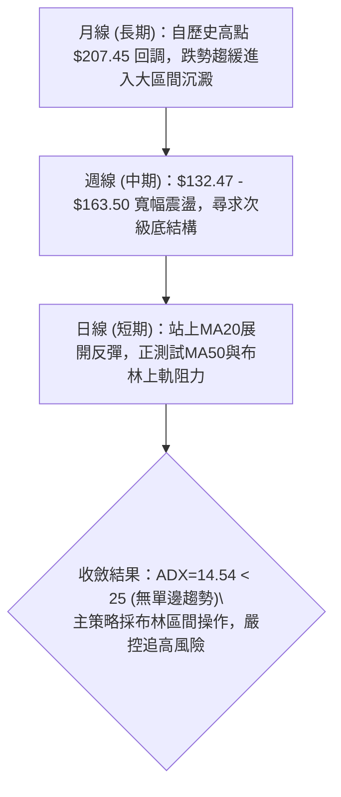

### 📈 長期趨勢 — 12個月走勢圖（Unicode）

```
VST 月線走勢圖（2025-09 至 2026-09）
價格軸 ($)
$200 ┤  ● (09月 195.11)
$190 ┤    ● (10月 187.52)
$180 ┤      ● (11月 178.12)  ● (02月 173.41)
$170 ┤
$160 ┤        ● (12月 160.88)  ● (05月 160.01)
$150 ┤          ● (01月 157.91)  ● (03月 150.12)  ● (06月 158.63)    ●←現在 ($149.30)
$140 ┤                               ● (04月 157.62)  ● (07月 148.19)  ● (08月 137.37)
$130 ┤
     └─────────────────────────────────────────────────────────────
        09  10  11  12  01  02  03  04  05  06  07  08  09 (月份)
```

**走勢特徵分析表格**：

| 階段區間 | 起止月份 | 價格變化 | 漲跌幅 | 走勢特徵與結構解讀 |
|----------|----------|----------|--------|--------------------|
| **波段見頂回落** | 2025-09 → 2026-01 | $195.11 → $157.91 | -19.07% | 自牛市高點破位下行，跌破短期均線組，呈現穩定高階獲利了結賣壓 |
| **假突破弱抽** | 2026-01 → 2026-02 | $157.91 → $173.41 | +9.82% | 跌深後的技術性超跌反彈，但受制於 MA200 壓制，成交量無法有效放大 |
| **中樞築底下探** | 2026-02 → 2026-08 | $173.41 → $137.37 | -20.78% | 箱體震盪走低，最低下探 52 週低點聚類區間 $132.47，空方動能逐漸衰竭 |
| **當前底部修復** | 2026-08 → 2026-09 | $137.37 → $149.30 | +8.68% | 8月探底回升，量能溫和擴增，短期均線交叉向上，測試均線密集成交區 |

### 📊 中期趨勢（週線分析）

從近20週的週線收盤走勢可見，價格在 2026-05-17 創下低點 $139.48 後反彈至 06-21 的 $163.52；隨後於 2026-08-23 再度下探 $136.21 形成雙重低點架構。

```
週線支撐阻力結構示意圖：
$168.93 ──────────────────────────────── 強阻力 R3 (前波反彈高點聚類)
$163.52 ─ ─ ─ ─ ─ ─ ─ ─ ─ ─ ─ ─ ─ ─ ─ ─ ─ 週線波段高點（06-21/07-26雙頭頂）
$156.99 ──────────────────────────────── 阻力 R2 (密集成交中樞與MA200)
$150.18 ──────────────────────────────── 關鍵阻力 R1 (布林上軌與MA50共振區)
$149.30 ════════════════════════════════ ◄◄ 現價 ($149.30)
$148.47 ──────────────────────────────── 近期支撐 S1 (週K線轉換頸位)
$144.63 ──────────────────────────────── 支撐 S2 (波段回檔次支撐)
$142.14 ──────────────────────────────── 強支撐 S3 (MA20生命線支撐)
$136.21 ─ ─ ─ ─ ─ ─ ─ ─ ─ ─ ─ ─ ─ ─ ─ ─ ─ 近期探底低點 (08-23 週K低點)
$132.47 ──────────────────────────────── 52週低點聚類 (極限底線支撐)
```

### ⚡ 趨勢強度評估（ADX 解讀）

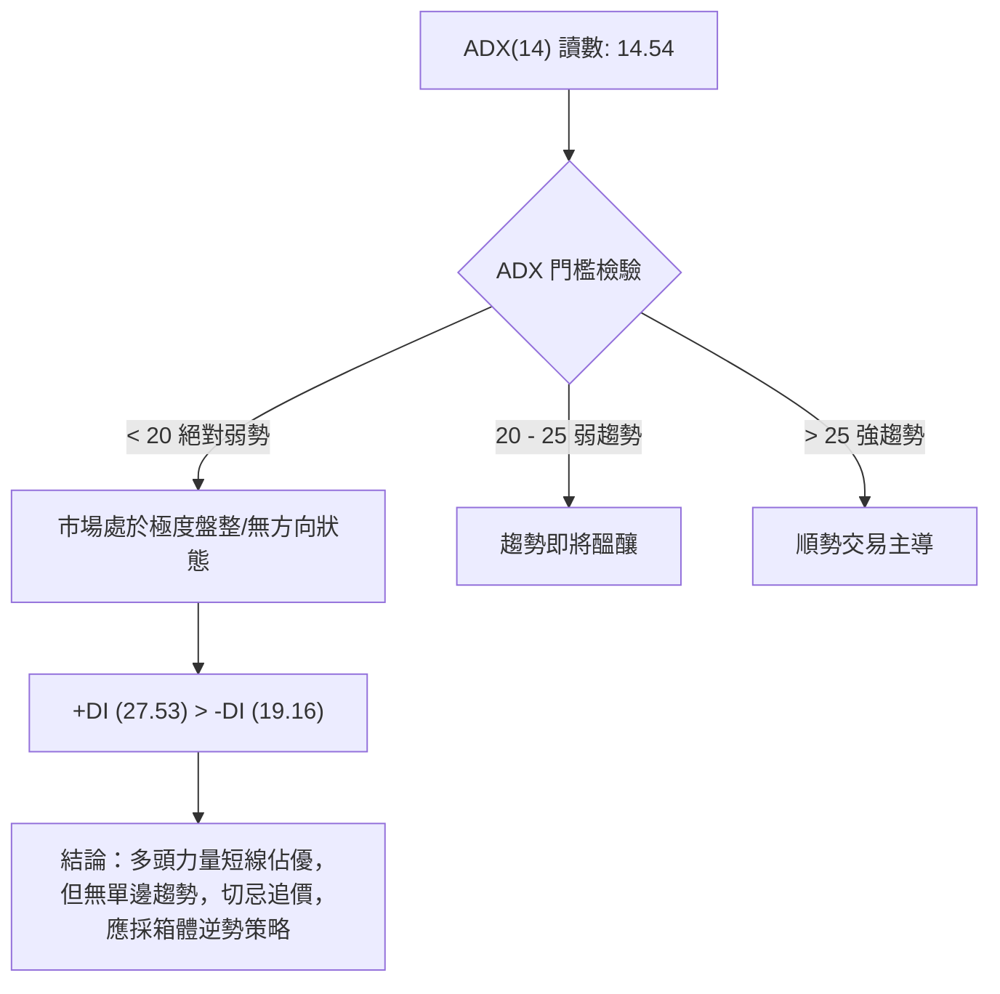

| 指標變量 | 數值 | 狀態門檻 | 意義與交易策略指引 |
|----------|------|----------|-------------------|
| **ADX(14)** | **14.54** | < 25 (弱趨勢/盤整) | 單邊趨勢動能極弱，順勢追突破容易遭遇假突破，應以布林通道上下軌做區間操作 |
| **+DI** | **27.53** | > -DI (19.16) | 多方買盤短線佔據優勢，主導了過去數日的反彈行情 |
| **-DI** | **19.16** | 低於 20 水平 | 空方短線拋壓明顯收斂，但尚未被完全消化 |
| **總結** | 多頭佔優盤整 | 寬幅震盪結構 | 依規則 14，ADX<25 優先採用布林通道震盪策略，禁止追多 |

---

## 3. 圖表形態分析

### 🔍 形態識別系統

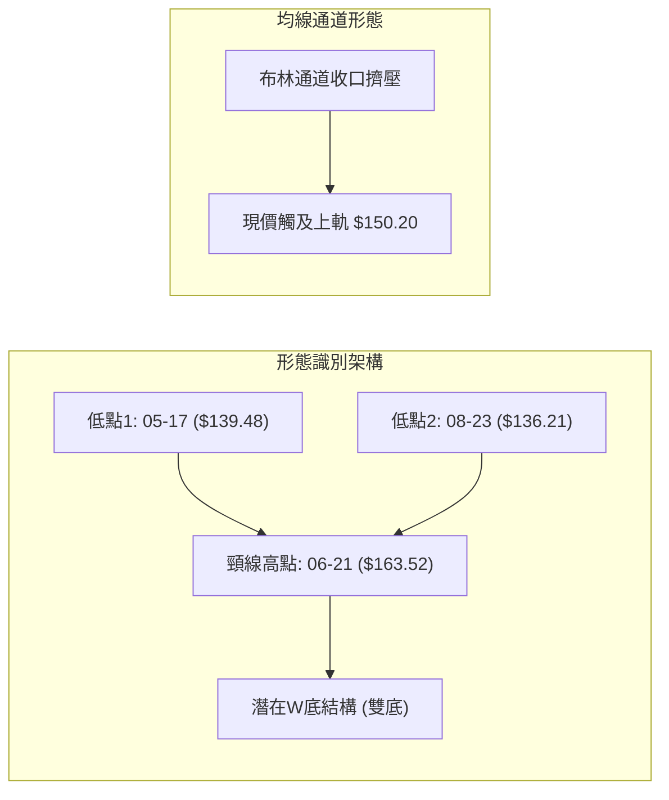

**形態信心度與目標價評估表**（依規則 13、15）：

| 形態類別 | 信心度 | 判斷依據（嚴格引用數據） | 完成度 | 目標價（附嚴格計算式） |
|----------|--------|--------------------------|--------|------------------------|
| **潛在寬幅雙底 (W-Bottom)** | **55%** | 兩次週線低點分別於 2026-05-17 ($139.48) 與 2026-08-23 ($136.21) 觸底回升，均落在 52W Low $132.47 與強支撐上方；頸線位於 2026-06-21 波段高點 $163.52。目前價位尚未突破頸線。 | 45% | **由雙底形態高度推算**：<br>頸線價位 $163.52，最低點 $136.21，形態高度 = $163.52 - $136.21 = $27.31。<br>突破目標價 = $163.52 + $27.31 = **$190.83**（注：此目標需待實質突破頸線方成立）。 |
| **布林上軌觸碰承壓形態** | **85%** | 現價 $149.30，BB上軌為 $150.20，BB %B 達 0.95，且 KD 指標達 99.00 嚴重超買，形成典型的區間通道頂部受阻形態。 | 95% | **由通道空間推算**：<br>上軌受阻回測 BB 中軌 (MA20) = **$141.88**；若跌破則下探 BB 下軌 = **$133.55**。 |
| **頭肩底形態** | **30%** | 數據中未偵測到左肩、頭部、右肩的標準幾何比例對稱結構。 | 0% | 訊號不足，僅做指標型解讀，不預設立場。 |

### 🕯️ 重要K線形態分析

| 週/月份 | 收盤價 | K線形態 | 解讀 | 訊號 |
|---------|--------|---------|------|------|
| **2026-05-17** | $139.48 | 長下影探底棒 | RSI 跌至 25.5 極端超賣區，空頭動能竭盡，引發強烈買盤介入 | 🟢 止跌確認 |
| **2026-06-21** | $163.52 | 衝高滯漲實體線 | 觸及阻力位後量能無法放大，未能站上 MA200，形成波段頸線頂 | 🔴 遇到阻力 |
| **2026-08-23** | $136.21 | 二次探底長陰棒 | RSI 再次觸碰 26.1 超賣，成交量 21.5M 收斂，顯示拋壓減輕形成次級底 | 🟢 次級底訊號 |
| **2026-09-06** | $149.30 | 實體中陽線連漲 | 連續兩週帶量突破 MA20 ($141.88)，MACD 柱狀圖翻正至 +1.366，展現強勢多頭攻勢 | 🟢 短線反彈 |

### 📉 ASCII 走勢形態示意圖

```
VST 近 16 週底部箱體形態圖示
價格軸 ($)
$165 ┤          ● $163.52 (波段高點/頸線位)
$160 ┤        ╱   ╲
$155 ┤      ╱       ╲           ● $155.44
$150 ┤    ╱           ╲       ╱   ╲           ▲ 現在位置: $149.30 (逼近上軌/頸線壓)
$145 ┤  ╱               ╲   ╱       ╲       ╱
$140 ┤● $139.48           ● $147.81   ╲   ╱
$135 ┤(底1)                              ● $136.21 (底2)
$130 ┤
     └─────────────────────────────────────────────────────────────
       W01    W03    W06    W09    W12    W15    W16 (時間軸)
```

### 🎯 形態目標價計算

1. **短期箱體反彈目標**：
   - 短線第一目標為波段高點聚類形成的阻力位 **R1: $150.18**（距現價 +0.59%）。
   - 若能帶量（週成交量 > 30M）有效突破 R1，則向上挑戰強阻力 **R2: $156.99**（距現價 +5.15%，同時為 MA200 附近的密集成交帶）。
2. **潛在雙底目標（中長期）**：
   - 若未來有效站穩頸線 $163.52，根據形態測量等幅投影法則，高度為 $27.31，中長線理論目標為 **$190.83**。但因 ADX 僅 14.54，當前判定此形態處於未完成階段，暫不可作為當下進場主依據。

---

## 4. 支撐與阻力

### 🗺️ 關鍵價位分布圖（Unicode）

```
VST 價位結構分布圖（嚴格依據 OHLCV 計算聚類價位）
══════════════════════════════════════════════════════════════════
$168.93 ║████████████████████████████████████║ 強阻力 R3 (近一年波段高點聚類)
$165.49 ║▓▓▓▓▓▓▓▓▓▓▓▓▓▓▓▓▓▓▓▓▓▓▓▓            ║ 斐波那契 61.8% 重要壓力位
$156.99 ║████████████████████████            ║ 關鍵阻力 R2 (MA200與成交中樞)
$150.97 ║▓▓▓▓▓▓▓▓▓▓▓▓▓▓▓▓▓▓                  ║ 斐波那契 78.6% 回調位
$150.18 ║████████████████████████████████    ║ 關鍵阻力 R1 (布林上軌共振壓)
$149.30 ╠════════════════════════════════════╣ ◄◄◄ 當前收盤價 ($149.30)
$148.47 ║▓▓▓▓▓▓▓▓▓▓▓▓▓▓▓▓▓▓▓▓▓▓▓▓▓▓▓▓▓▓      ║ 短線支撐 S1 (轉換支撐)
$144.63 ║████████████████████████            ║ 中繼支撐 S2 (波段低點聚類)
$142.14 ║████████████████████████████████    ║ 核心支撐 S3 (MA20 生命線聚類)
$132.47 ║████████████████████████████████████║ 52週極限低點 (斐波那契 100.0%)
══════════════════════════════════════════════════════════════════
```

### 🚧 阻力位分析表

價位完全引用「關鍵價位」區塊之客觀數據：

| 阻力級別 | 精確價位 | 距離現價 | 形成原因與籌碼特徵 | 突破難度 | 重要性 |
|----------|----------|----------|--------------------|----------|--------|
| **R1** | **$150.18** | +0.59% | 近一年波段高點聚類、布林通道上軌 ($150.20) 與 MA50 ($149.64) 三重重疊共振區 | 🟡 中等 | ★★★★☆ |
| **R2** | **$156.99** | +5.15% | 近一年次級反彈高點聚類、MA200 牛熊分界線 ($157.48) 所在地，籌碼套牢密集區 | 🔴 極高 | ★★★★★ |
| **R3** | **$168.93** | +13.15% | 近一年中期頂部波段高點聚類，前波大反彈極限阻力帶 | 🔴 難以逾越 | ★★★★☆ |

### 🛡️ 支撐位分析表

價位完全引用「關鍵價位」區塊之客觀數據：

| 支撐級別 | 精確價位 | 距離現價 | 形成原因與籌碼特徵 | 守住機率 | 重要性 |
|----------|----------|----------|--------------------|----------|--------|
| **S1** | **$148.47** | -0.55% | 近期分時與小波段低點聚類，短線跌破則暗示上軌受阻拉回開始 | 🟡 60% | ★★★☆☆ |
| **S2** | **$144.63** | -3.13% | 前期多根週K線收盤重疊區、次級波段低點支撐 | 🟢 75% | ★★★★☆ |
| **S3** | **$142.14** | -4.80% | MA20 ($141.88) 與近一年波段低點聚類形成的核心生命線，多方最後防線 | 🟢 85% | ★★★★★ |

### 📐 斐波那契回調位分析

依據 52 週區間極值（高點 $218.91 至 低點 $132.47，波幅 $86.44）之回調位數據：

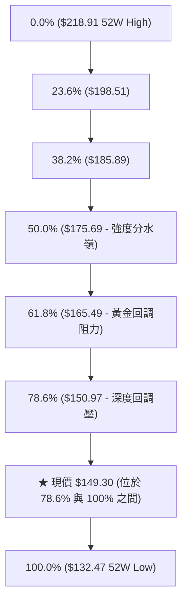

- **位置解讀**：現價 $149.30 正處於 **78.6% ($150.97)** 與 **100.0% ($132.47)** 的深度回調底層區間。
- **技術意涵**：
  1. 價格由 52 週低點回彈，目前正向上測試 **78.6% 回調位 ($150.97)**，該位置與阻力位 **R1 ($150.18)** 及布林上軌 ($150.20) 形成密集重合的強阻力帶（$150.18 - $150.97）。
  2. 若現價無法有效實體收盤突破 $150.97，則本次反彈僅為長期下跌波段後的「弱勢修復」，股價將被壓制於低檔寬幅區間；只有實質站上 $150.97，才能宣告擺脫 52 週底部泥淖，進一步挑戰 61.8% ($165.49)。

---

## 5. 技術指標深度解讀

### 🎛️ 指標訊號總覽

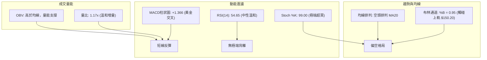

### 📈 移動平均線排列分析

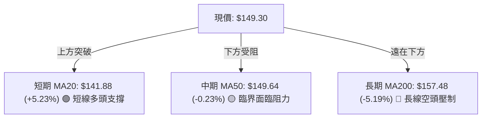

- **均線排列狀態**：當前 MA20 ($141.88) < MA50 ($149.64) < MA200 ($157.48)，整體架構仍屬標準的**空頭排列**。
- **均線發散與收斂特徵**：
  - 短天期 MA5 ($142.49) 與 MA10 ($140.41) 呈強勁上彎，且價格已領先上揚（高於 MA5 達 4.78%）。
  - 當前現價 $149.30 恰好頂在 MA50 ($149.64) 鼻尖，短線漲勢過急，均線與價格形成正向乖離過大，中長期均線 MA60 ($151.17) 與 MA120 ($152.59) 仍在上方反壓向下，抑制上攻空間。

### 📉 RSI(14) 分析

- **當前數值進度條**：
  ```
  RSI(14): 54.65  [0 ────────── 30 ────── 50 ────── 70 ────────── 100]
                  [██████████████████████████░░░░░░░░░░░░░░░░░░░░░░]  54.65%
  ```
- **區間評估**：RSI 處於 50–70 的健康中性偏強區間，擺脫了 8 月 23 日的極端超賣（RSI=26.1）。
- **背離檢驗**：
  - 檢驗 05-17 低點 ($139.48, RSI=25.5) 與 08-23 低點 ($136.21, RSI=26.1)，價格創新低但 RSI 數值基本持平微升，存在微弱的**底背離雛形**，支持了這波自 $136.21 展開的反彈。
  - 當前最新日線 RSI 走勢與價格同步回升，**無頂背離現象**，但斜率趨緩。

### 📊 MACD(12/26/9) 訊號解讀

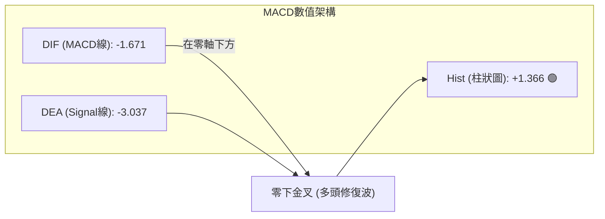

- **訊號解析**：MACD 線 (-1.671) 明顯穿越 Signal 線 (-3.037)，MACD 柱狀圖放大至 +1.366，形成雙線零下金叉向上。
- **背離判斷**：日線及週線 MACD 未出現頂背離；負值收斂轉正代表空方動能暫時退潮，由多方主導反彈修復。然而雙線仍在零軸以下，技術性定義仍屬「空頭市場中的反彈行情」，不可視為全新單邊大牛市。

### 📦 布林通道分析

```
VST 布林通道 (20日, 2σ) 示意圖
──────────────────────────────────────────────────────────────────
$150.20 ┬────────────────────────────────────────── 頂軌 (Upper Band)
$149.30 ┼ ◄◄◄ 現價 ($149.30, %B = 0.95)
        │
$141.88 ┼─────────────────── 中軌 (MA20 Baseline)
        │
$133.55 ┴────────────────────────────────────────── 底軌 (Lower Band)
──────────────────────────────────────────────────────────────────
```

- **通道帶寬與位置**：通道寬度為 $150.20 - $133.55 = $16.65。
- **%B 訊號解讀**：目前 **%B = 0.95**，代表現價已經貼近布林上軌（頂軌 $150.20 僅差 $0.90）。在 ADX=14.54 的盤整市場中，%B > 0.90 通常構成嚴重的「超買拉回」訊號，而非「強勢單邊突破帶軌向上」。

### 💹 成交量分析（量價配合度）

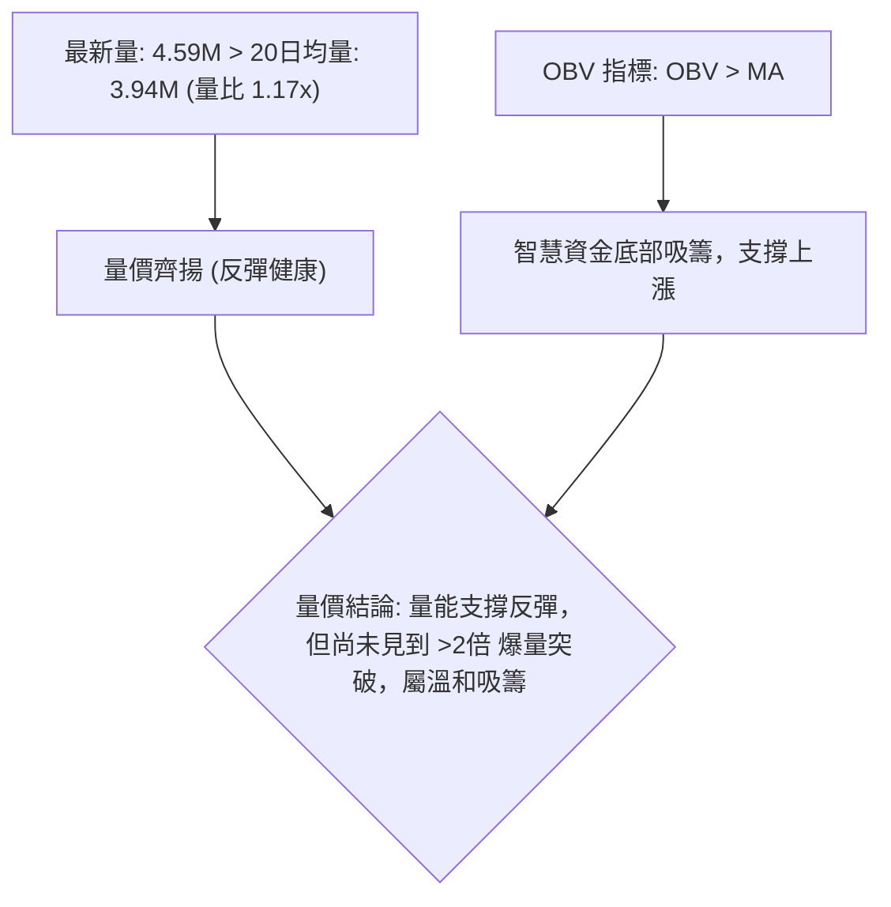

- **量能確認**：OBV 大於均線，最新成交量達 4,599,200 股，量比為 1.17 倍，呈現價漲量增配合；且無高檔放量滯漲或異常出貨現象，量價結構相對健康。

---

## 6. 動能與波動率

### ⚡ 動能評估四象限

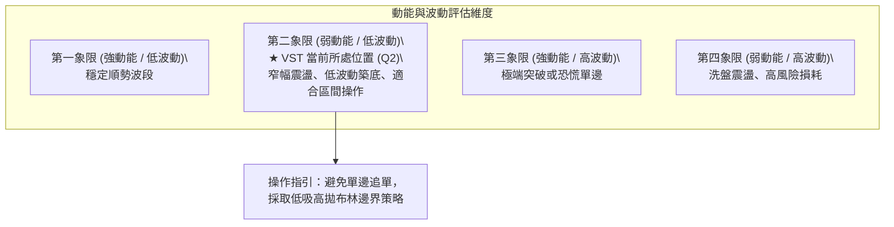

| 象限分類 | 動能特徵 | 波動特徵 | 當前狀態判定 | 交易決策與風險評估 |
|----------|----------|----------|--------------|--------------------|
| **Q1: 順勢主升** | 強 (+DI遠大於-DI) | 低 (ATR收斂) | 否 | 最佳波段順勢抱牢時機 |
| **Q2: 箱體整理** | **弱 (ADX=14.54)** | **低至中 (ATR=3.27%)** | **✓ VST 當前定位** | **區間震盪行情，多空皆受邊界限制，嚴守止損點** |
| **Q3: 劇烈單邊** | 強 (動能極大) | 高 (ATR擴大) | 否 | 突破行情，風險與收益並存 |
| **Q4: 混亂洗盤** | 弱 (無方向) | 高 (劇烈跳空) | 否 | 噪音極多，極易頻繁停損 |

### 📊 ATR 波動率分析

- **ATR(14) 數值**：**$4.88**（佔股價比例為 **3.27%**）。
- **波幅屬性**：該數值反映目前日波動區間約在 $4.80 - $5.00 美元之間，波動度由前期極端狀態轉為溫和常態。
- **止損距離建議**：
  - 日內或超短線：以 1.0 倍 ATR 作為緩衝，止損距離設為 **$4.88**。
  - 波段交易：以 1.5 倍至 2.0 倍 ATR 作為保護，止損距離為 **$7.32 - $9.76**。

### 📐 Beta 與市場相關性

- **Beta 係數**：**1.414**。
- **市場特徵**：VST 屬於高 Beta 公用事業/獨立發電商（IPP）標的，其波動度高出 S&P 500 指數 41.4%。在大盤上漲時具備較高彈性，但當大盤遭遇系統性拋售時，其回調回撤幅度亦顯著放大。

---

## 7. 多時框架總結

### 📋 時框架評分表

| 時框架 | 趨勢方向 | 動能狀態 | 均線排列 | 圖表形態 | 綜合評分 | 操作建議 |
|--------|----------|----------|----------|----------|----------|----------|
| **月線 (長期)** | 🔴 偏空 | 🟡 中性平緩 | 🔴 MA200下方 | 頂部回落大整理 | 40/100 | 減持長線部位，觀望 |
| **週線 (中期)** | 🟡 震盪 | 🟢 MACD微揚 | 🔴 空頭排列 | 箱體雙底築底中 | 55/100 | 區間低吸高拋 |
| **日線 (短期)** | 🟢 偏多 | 🔴 KD超買 | 🟡 站上MA20頂MA50 | 觸及布林上軌 | 60/100 | 逢高獲利結利，不追多 |

### 🔲 綜合訊號矩陣

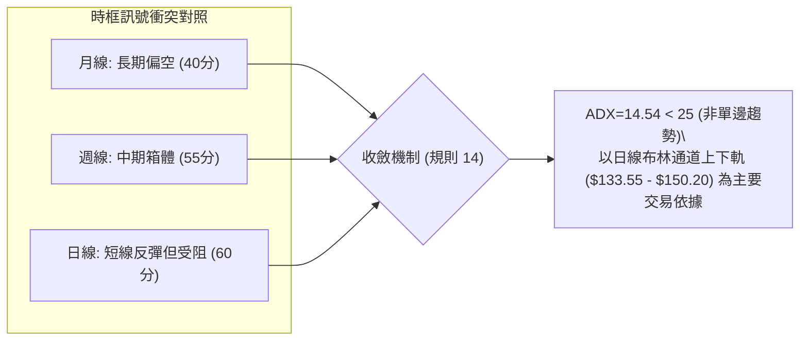

### ⚖️ 多時框收斂結論

依據多時框收斂規則（規則 14）：
1. **行情定性**：當前 ADX(14) 讀數為 **14.54**，明確小於 25，市場缺乏強大單邊推動力，判定為**標準盤整行情**。
2. **時框優先級**：在此環境下，不宜依據日線短線連漲就妄下「大牛市主升段」結論，亦不宜因月線偏空而盲目在地板殺跌。主導框架定為**日線布林通道上下軌為主的區間操作**。
3. **唯一收斂結論**：**【中性觀望 / 區間高拋低吸】**。現價 $149.30 已達布林上軌 ($150.20) 與 R1 ($150.18) 極限壓制區，短線多頭反彈動能已充分釋放，KD=99 超買，預期短線將受阻於 $150.18 - $150.97，隨後展開向 MA20 ($141.88) 或 S2 ($144.63) 的技術性回踩。

---

## 8. 交易策略建議

### 🗺️ 策略決策流程圖

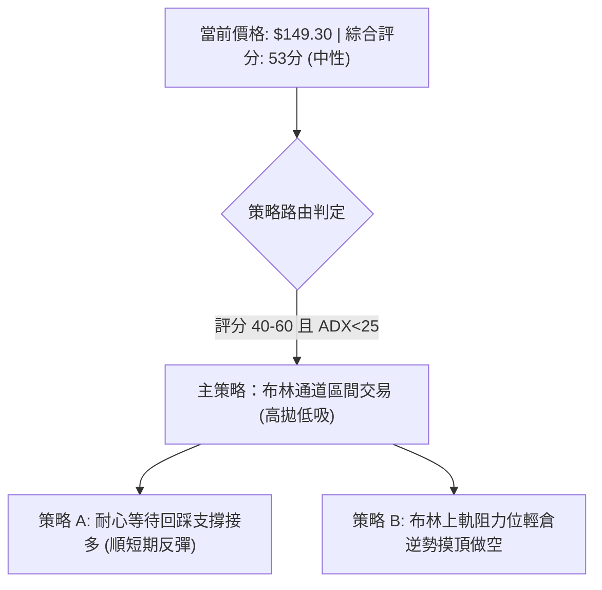

### 🧭 策略路由（依評分卡分流）

> **當前主策略方向 = 中性震盪區間操作（依綜合評分 53/100）**
> 由於 ADX(14) = 14.54，市場處於無趨勢寬幅盤整，且當前價格逼近布林通道上軌，禁止在目前點位盲目市價追多。主推**回踩關鍵支撐低吸（策略 A）**與**上軌受阻輕倉放空（策略 B）**兩套嚴格區間策略。

### 🎯 價格情境階梯（Price Scenarios）

價位嚴格引用第 4 章及數據計算值：

| 觸發條件 | 下一目標 | 後續延伸 | 情境含義與操作指引 |
|----------|----------|----------|--------------------|
| **強勢突破 R1 ($150.18)** | **R2: $156.99** | **R3: $168.93** | 伴隨成交量放大，短線轉為強多頭，回踩不破可追擊至 MA200 |
| **受阻於 R1-R2 區間** | **S1: $148.47** | **S2: $144.63** | 符合預期的布林上軌承壓回檔，維持箱體震盪行情 |
| **有效跌破 S3 ($142.14)** | **52W Low: $132.47** | 下測無支撐 | 箱體破位，短期反彈徹底宣告夭折，轉入新一輪探底 |

### 📊 情境機率分佈

| 情境劃分 | 機率估計 | 主要指標依據（嚴格對照） |
|----------|----------|--------------------------|
| **情境一：受阻回落，區間震盪** | **60%** | ADX=14.54（弱趨勢）、布林 %B=0.95、Stoch %K=99.00（極度超買）、MA50/R1壓制 |
| **情境二：直接放量突破上行** | **25%** | MACD柱狀圖擴增 (+1.366)、OBV處於均線上方、機構持股高達 92.1% |
| **情境三：急跌跌破底部支撐** | **15%** | 長期空頭排列（MA20<50<200）、營收與淨利 YoY 負增長的基本面壓制 |

### 🟢 主策略詳情

#### 策略 A（保守多頭：回踩核心支撐佈局多單）
- **核心邏輯**：順應 MACD 柱狀圖翻紅與 OBV 資金流入，等待 Stoch %K 自超買區降溫、價格回踩 MA20 支撐確認時進場。
- **進場價格**：**$142.14**（精確對應支撐位 S3 與 MA20 附近）。
- **止損價格**：**$138.50**（由 S3 $142.14 下方預留約 0.75 倍 ATR 緩衝，跌破代表支撐失守）。
- **目標價 T1**：**$150.18**（阻力位 R1，空間 +$8.04）。
- **目標價 T2**：**$156.99**（阻力位 R2 / MA200，空間 +$14.85）。
- **風險報酬比**：
  - 至 T1：$8.04 / ($142.14 - $138.50) = $8.04 / $3.64 = **2.21 : 1**
  - 至 T2：$14.85 / $3.64 = **4.08 : 1**
- **成功機率**：**65%** ｜ **建議倉位**：**15%**。

#### 策略 B（激進空頭：布林上軌與阻力位承壓逆勢放空）
- **核心邏輯**：ADX=14.54 無趨勢，布林上軌 $150.20 與 R1 $150.18 形成強烈天花板，KD 達 99.00 超買面臨修正。
- **進場價格**：**$150.18**（精確對應阻力位 R1）。
- **止損價格**：**$152.00**（由斐波那契 78.6% 回調位 $150.97 上方預留緩衝，實體站上則停損）。
- **目標價 T1**：**$144.63**（支撐位 S2，空間 -$5.55）。
- **目標價 T2**：**$141.88**（布林中軌 / MA20，空間 -$8.30）。
- **風險報酬比**：
  - 至 T1：$5.55 / ($152.00 - $150.18) = $5.55 / $1.82 = **3.05 : 1**
  - 至 T2：$8.30 / $1.82 = **4.56 : 1**
- **成功機率**：**58%** ｜ **建議倉位**：**10%**。

### 🔴 反向風險觸發點（對沖提示）

- **多頭反轉停損警訊**：若日線收盤價跌破 **S3: $142.14**，所有短線反彈邏輯即刻失效，多頭部位應無條件止損離場觀望。
- **空頭軋空突破警訊**：若日線以大陽線帶量突破斐波那契阻力 **$150.97**，表示通道擠壓向上變盤，空單必須立即平倉，嚴禁逆勢扛單。

### ⭐ 整體訊號強度評星

```
做多訊號強度：★★★☆☆  (3.0/5星 — 底部放量反彈，但受制於上軌壓制)
做空訊號強度：★★★☆☆  (3.0/5星 — 超買嚴重，具備極佳風險報酬比做空點)
整體可信度：  ★★★★☆  (3.8/5星 — 支撐阻力結構清晰，區間邊界明確)
```

---

## 9. 風險提示與監控

### ✅ 關鍵監控指標 Checklist

```
╔══════════════════════════════════════════════════════════════════╗
║                  關鍵技術指標每日監控清單 (Checklist)            ║
╠══════════════════════════════════════════════════════════════════╣
║ [ ] 價格是否觸碰阻力位 R1 ($150.18) 出現長上影線？               ║
║ [ ] 布林 %B 是否自 0.95 快速滑落至 0.80 以下確認拐點？           ║
║ [ ] Stoch %K (99.00) 是否與 %D (73.13) 在超買區形成死亡交叉？   ║
║ [ ] MACD 柱狀圖 (+1.366) 是否開始縮短？                          ║
║ [ ] 成交量是否低於 20日均量 (3.94M)，呈現縮量無力衝關特徵？      ║
║ [ ] 價格回測支撐 S1 ($148.47) 或 S2 ($144.63) 是否有下影線承接？ ║
╚══════════════════════════════════════════════════════════════════╝
```

### ⚠️ 風險場景分析

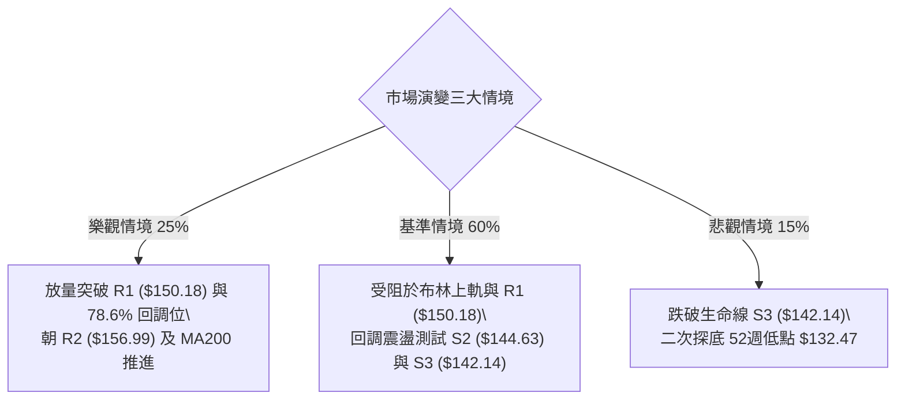

### 🛡️ 風險管理重要提醒

1. **基本面負面因子防範**：
   - 儘管 19 位華爾街分析師給予 "Strong Buy" 且平均目標價達 $217.42，但必須注意公司 TTM 營收成長率為 **-5.5%**，淨利成長率為 **-6.2%**，基本面正處於業績下修週期。
   - 負債/權益比高達 **373.28**，流動比率僅 **0.973**，速動比率為 **0.258**，財務槓桿偏高，容易受公用事業利率波動衝擊。
2. **倉位管理守則**：
   - 鑑於 ADX 僅 14.54，在盤整市況中單一策略部位上限不宜超過總資金之 **15%**。
   - 嚴格遵守單筆交易最大虧損不超過總帳戶權益 **1.5%** 之風控紀律，進場前必須預先設定條件單止損，杜絕情緒化交易。

---

## 📋 報告總結

```
╔══════════════════════════════════════════════════════════════════╗
║                   VST 技術分析報告總結                           ║
╠══════════════════════════════════════════════════════════════════╣
║ 報告日期：2026-09-07                                             ║
║ 當前價格：$149.30                                                ║
║ 分析評級：⚖️ 53分 — 中性觀望 / 區間高拋低吸 (ADX=14.54 盤整格局)║
║                                                                  ║
║ 關鍵結論：                                                       ║
║ ├─ 長期趨勢：🔴 空頭排列 (現價低於 MA200 $157.48，仍受制於大壓)  ║
║ ├─ 中期趨勢：🟡 寬幅箱體築底 ($132.47 - $163.52 區間震盪)        ║
║ ├─ 短期趨勢：🟢 底部反彈但超買 (站上MA20，但碰布林上軌%B=0.95)   ║
║ ├─ 關鍵支撐：S1: $148.47 ｜ S2: $144.63 ｜ S3: $142.14           ║
║ ├─ 關鍵阻力：R1: $150.18 ｜ R2: $156.99 ｜ R3: $168.93           ║
║ └─ 機構共識：Strong Buy ｜ 分析師平均目標價：$217.42             ║
║                                                                  ║
║ 最優策略組合：                                                   ║
║ 1. 🥇 最佳機會：回踩支撐接多 (策略 A)                             ║
║    進場 $142.14，止損 $138.50，目標 $150.18 / $156.99 (風報比4:1)║
║ 2. 🥈 次選機會：上軌承壓摸頂 (策略 B)                             ║
║    進場 $150.18，止損 $152.00，目標 $144.63 / $141.88 (風報比3:1)║
║ 3. 🥉 保守選擇：場外空倉觀望，靜待價格突破 $150.97 或回踩 $142.14║
╚══════════════════════════════════════════════════════════════════╝
```

---

> ⚠️ **免責聲明**：本報告為 AI 自動生成之技術分析，所有數據及估算均基於提供的歷史價格資訊。本報告**僅供研究與學術參考**，**不構成任何投資建議**。投資有風險，入市需謹慎。

---

*報告生成時間：2026-09-07 ｜ 數據來源：Yahoo Finance ｜ 分析框架：多時框技術分析*