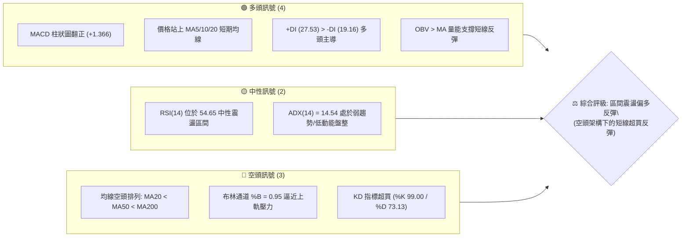
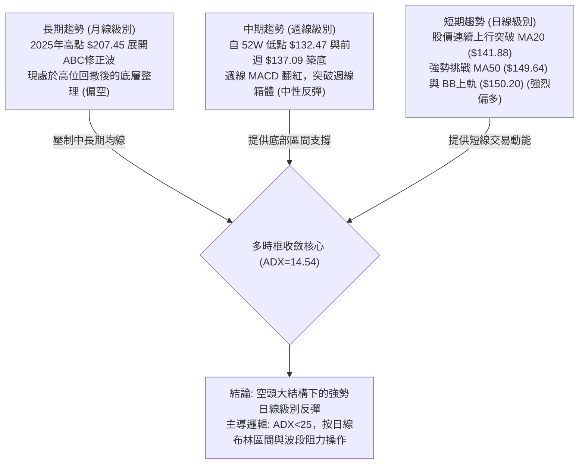
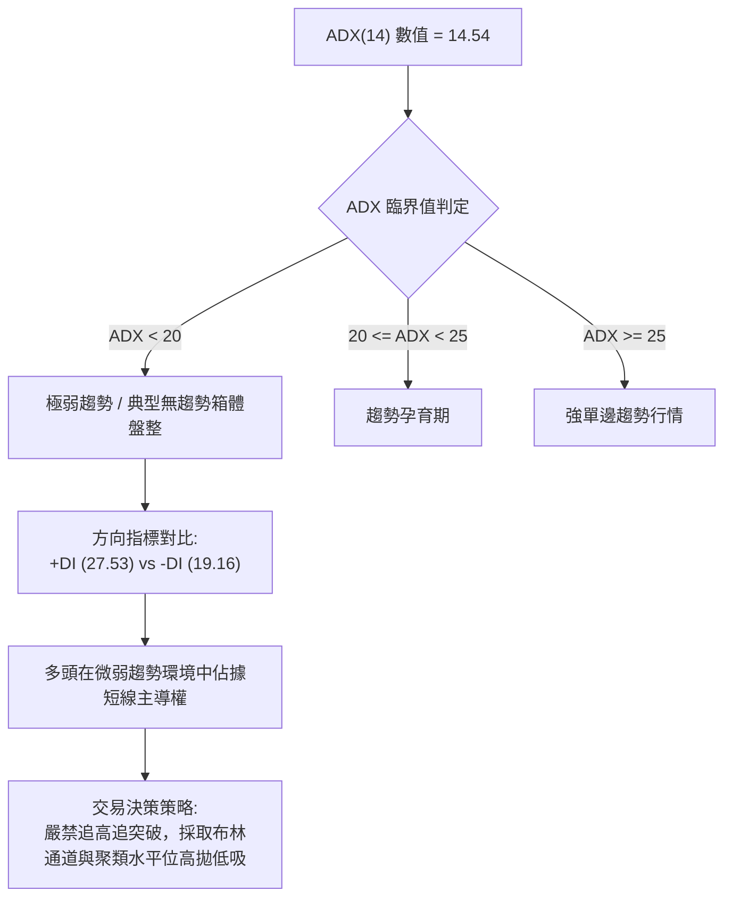
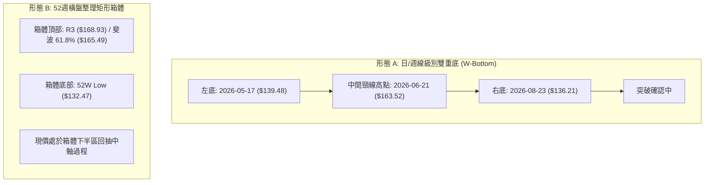
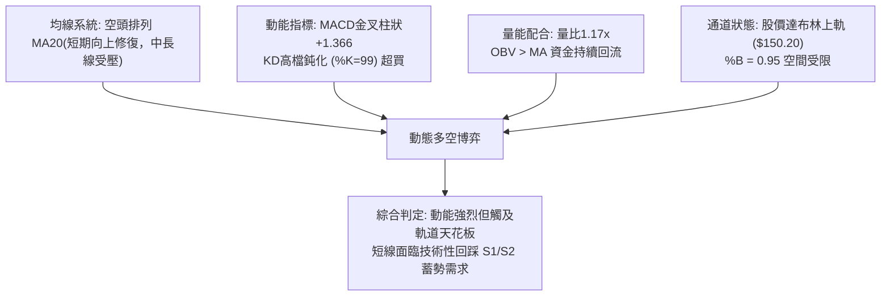
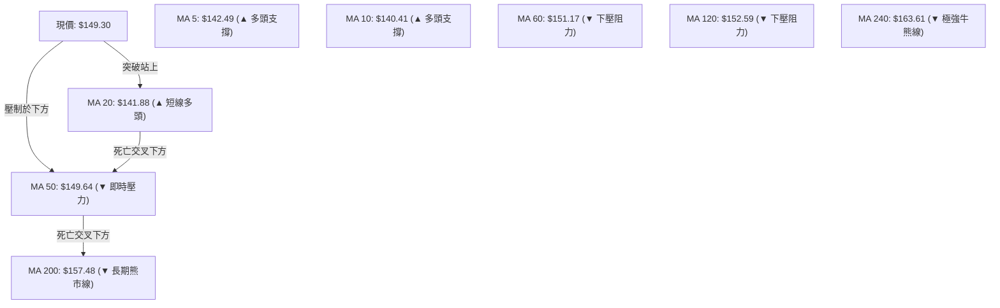
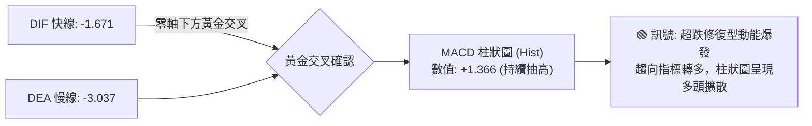
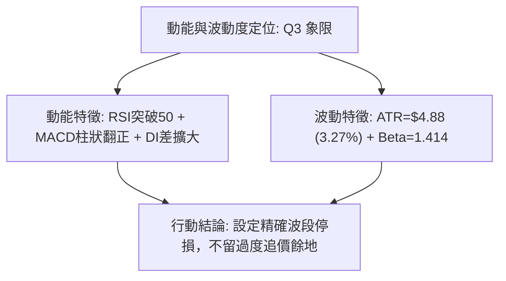
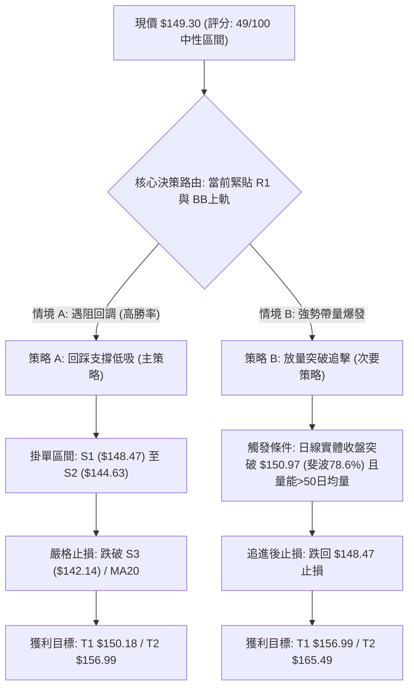
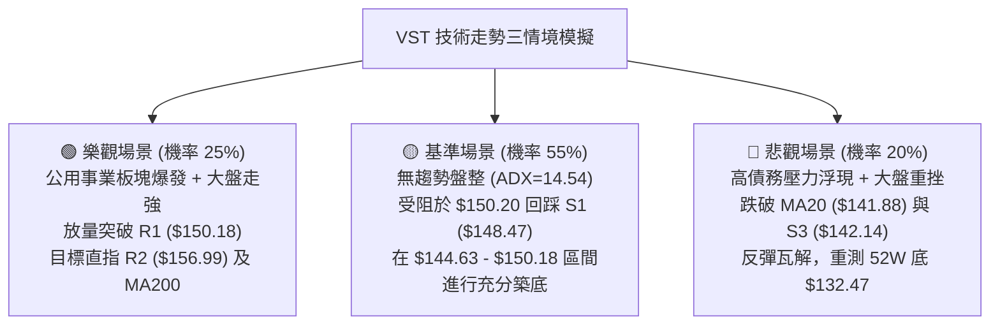

# VST 技術分析報告

> **報告日期**：2026-09-08 ｜ **語言**：繁體中文 ｜ **數據來源**：Yahoo Finance ｜ **當前價格**：$149.30

---

## 目錄

| 章節 | 內容 |
|------|------|
| [1. 技術面概覽](#1-技術面概覽) | 訊號儀表板、核心指標、評分卡 |
| [2. 趨勢分析](#2-趨勢分析) | 多時框趨勢、長中短期走勢、ADX解讀 |
| [3. 圖表形態分析](#3-圖表形態分析) | 形態識別、信心度評估、K線組合 |
| [4. 支撐與阻力](#4-支撐與阻力) | 關鍵價位、斐波那契回調深度分析 |
| [5. 技術指標深度解讀](#5-技術指標深度解讀) | MA/RSI/MACD/布林通道/成交量 |
| [6. 動能與波動率](#6-動能與波動率) | 動能四象限、ATR波動分析、Beta風險 |
| [7. 多時框架總結](#7-多時框架總結) | 時框架評分矩陣與多時框收斂定調 |
| [8. 交易策略建議](#8-交易策略建議) | 策略路由、主策略規劃、情境機率階梯 |
| [9. 風險提示與監控](#9-風險提示與監控) | 監控清單、極端風險場景、部位管理 |
| [📋 報告總結](#-報告總結) | 核心總結與交易指引 |

---

## 1. 技術面概覽

### 🎯 技術訊號儀表板



### 📊 核心指標速覽表

| 指標類別 | 指標名稱 | 當前數值 | 訊號 | 解讀 |
|:---|:---|:---:|:---:|:---|
| **價格** | 當前價格 | $149.30 | 🟡 | 位於52週區間($132.47-$218.91)之19.5%低位，短線強彈 |
| **均線** | 短期均線 MA20 | $141.88 | 🟢 | 現價高於 MA20 達 +5.23%，短天期均線全面向上發散 |
| **均線** | 中期均線 MA50 | $149.64 | 🔴 | 現價位於 MA50 邊緣(-0.23%)，面臨中長期均線壓制 |
| **均線** | 長期均線 MA200 | $157.48 | 🔴 | 現價在 MA200 下方(-5.19%)，中長線處於空頭趨勢 |
| **動能** | RSI(14) | 54.65 | 🟡 | 位於 50 多空分水嶺上方，無明顯背離，維持中性偏多 |
| **動能** | MACD (12,26,9) | -1.671 / 柱狀 +1.366 | 🟢 | 快線於零軸下金叉慢線(-3.037)，柱狀圖持續擴大看多 |
| **震盪** | KD (Stoch 14) | %K 99.00 / %D 73.13 | 🔴 | 進入極度超買區，短線隨時有獲利了結或受阻回踩風險 |
| **通道** | 布林通道 (BB) | 軌道寬度 $133.55 - $150.20 | 🔴 | 現價 $149.30 緊貼上軌 $150.20，%B 達 0.95 接近飽和 |
| **趨勢** | ADX (14) | 14.54 (+DI 27.53) | 🟡 | ADX < 25 表明趨勢動能微弱，屬大區間震盪結構 |
| **量能** | 成交量比 (VR) | 4.60M / 3.94M (1.17x) | 🟢 | 日成交量放大至20日均量1.17倍，且 OBV > MA 量價配合良好 |
| **波動** | ATR (14) | $4.88 (3.27%) | 🟡 | 每日平均波動幅度約 $4.88，屬於中等偏高正常波動區間 |

### 🏆 技術評分卡

```
╔══════════════════════════════════════════════════════════════════╗
║                   技術評分卡 — VST (2026-09-08)                 ║
╠══════════════════════════════════════════════════════════════════╣
║ 趨勢強度 (Trend)      ████░░░░░░░░░░░░░░░░  25/100  🔴 弱勢空頭    ║
║ 動能指標 (Momentum)   ████████████░░░░░░░░  60/100  🟢 短線偏多    ║
║ 支撐穩定度 (Support)  ██████████████░░░░░░  70/100  🟢 底層築底    ║
║ 成交量配合 (Volume)   ████████████░░░░░░░░  60/100  🟢 溫和放量    ║
║ 形態完整度 (Pattern)  ██████████░░░░░░░░░░  50/100  🟡 區間箱體    ║
║ 均線排列 (MAs)        ██████░░░░░░░░░░░░░░  30/100  🔴 空頭排列    ║
╠══════════════════════════════════════════════════════════════════╣
║ 綜合技術評分          ██████████░░░░░░░░░░  49/100  🟡 區間震盪    ║
║ 策略導向              中性區間交易 / 逢阻力減碼、逢支撐布局          ║
╚══════════════════════════════════════════════════════════════════╝
```

---

## 2. 趨勢分析

### 🌐 多時框趨勢分析



### 📈 長期趨勢 — 12個月走勢圖（Unicode）

```
VST 月線走勢圖（2025-10 至 2026-09）
價格軸 ($)
$200 ┤        
$190 ┤●(2025-10: $187.52)
$180 ┤    ●(11: $178.12)
$170 ┤                      ●(2026-02: $173.41 次高反彈)
$160 ┤        ●(12: $160.88)
$150 ┤            ●(01: $157.91)   ●(04: $157.62)   ●(06: $158.63)    ●←現價 $149.30
$140 ┤                                 ●(03: $150.12)   ●(07: $148.19)
$130 ┤                                                       ●(08: $137.37 波段低)
     └────────────────────────────────────────────────────────────────────────────
      10   11   12   01   02   03   04   05   06   07   08   09 (月份)
```

#### 長期走勢特徵分析表

| 階段區間 | 起止價格 | 漲跌幅 | 主要走勢特徵 | 量價與結構解讀 |
|:---|:---:|:---:|:---|:---|
| **第一階段：見頂回落**<br>(2025-10 至 2025-12) | $187.52 → $160.88 | -14.21% | 自歷史高位 $207.45 展開破位下行，跌破短期均線 | 高位獲利了結盤湧出，重心下移 |
| **第二階段：次高反抽**<br>(2026-01 至 2026-02) | $157.91 → $173.41 | +9.82% | 跌勢減緩後展開大幅抽頭，形成波段次高點 | 確立 $173.41 為中期強阻力帶 |
| **第三階段：箱體震盪**<br>(2026-03 至 2026-06) | $150.12 → $158.63 | +5.67% | 價格在 $148 - $163 寬幅箱體內反覆震盪 | 均線系統逐漸收斂並下穿形成空頭排列 |
| **第四階段：破位探底**<br>(2026-07 至 2026-08) | $148.19 → $137.37 | -7.30% | 空方下破箱體，於 2026-08 創下月收盤低點 $137.37 | 逼近 52W 最低點 $132.47，出現量縮背離 |
| **第五階段：超跌反彈**<br>(2026-08 至 2026-09) | $137.37 → $149.30 | +8.68% | 8月下旬發動連續陽線反彈，強勢修復跌幅 | 日線帶量收復 MA20，直逼中軌與 MA50 |

### 📊 中期趨勢（週線分析）

從近20週數據（2026-04 至 2026-09）觀察，VST 在此期間歷經兩次關鍵探底：
1. **第一次探底**：2026-05-17 週收盤 $139.48，RSI 跌至 25.5（極度超賣），隨後於 2026-05-24 爆出 32.76M 週成交量強勢大反彈至 $156.05。
2. **第二次探底**：2026-08-23 週收盤 $136.21，RSI 降至 26.1，次週 2026-08-30 收 $137.09 形成雙底雛形，本週（2026-09-06）強拉至 $149.30，週成交量達 22.12M，週 MACD 柱狀圖由負轉正至 +1.366。

```
VST 中期週線支撐阻力結構示意圖
$165.00 ┤─── 阻力帶: 2026-04及06高點聚類 ($163.52 - $164.12)
$157.00 ┤─── 頸線/MA200阻力: R2 ($156.99)
$150.18 ┤─── 即時阻力: R1 ($150.18) 與 BB上軌 ($150.20) ◄ 現價 $149.30
$144.63 ┤─── 回調支撐: S2 ($144.63)
$136.21 ┤─── 雙底頸線支撐帶: 8月低點 $136.21 與 52W低點 $132.47
```

### ⚡ 趨勢強度評估（ADX 解讀）



#### ADX 趨勢強度對照解讀

| 指標變數 | 當前讀數 | 門檻區間 | 趨勢屬性判定 | 操作方針指引 |
|:---|:---:|:---:|:---|:---|
| **ADX (14)** | **14.54** | < 25.00 | **無實質單邊趨勢（弱盤整）** | 趨勢跟隨策略失效，應使用區間震盪震盪器 |
| **+DI (14)** | **27.53** | > 25.00 | 多方短線動能佔優 | 買方在反彈波段中具有推動力 |
| **-DI (14)** | **19.16** | < 20.00 | 空方壓制動能減退 | 拋壓暫時竭盡，未出現恐慌盤 |
| **差值 (+DI - -DI)** | **+8.37** | 正值擴大 | 短線多頭優勢發酵中 | 支撐現價向阻力位發起衝擊 |

---

## 3. 圖表形態分析

### 🔍 形態識別系統



#### 形態識別信心度評估表

| 識別形態 | 信心度 | 判斷依據（引用嚴格數據） | 當前完成度 | 目標價計算式與精確目標 |
|:---|:---:|:---|:---:|:---|
| **寬幅不對稱雙底**<br>(Double Bottom) | **60%** | 左底收盤 $139.48，右底收盤 $136.21（接近 52W 低點 $132.47），兩次回踩均伴隨 RSI < 27 之超賣回升，右底帶量推升。 | 65%<br>(尚未突破中期頸線) | 頸線 $163.52，形態低點 $136.21<br>形態高度 = $163.52 - $136.21 = $27.31<br>理論目標價 = $163.52 + $27.31 = **$190.83**<br>*(註：受制於中期均線，當前不列為第一目標)* |
| **日線布林通道向上擠壓突破**<br>(BB Squeeze & Expansion) | **75%** | 價格突破中軌 MA20 ($141.88) 並直逼上軌 $150.20，%B 達到 0.95，屬於高勝率通道單邊衝軌形態。 | 85%<br>(進入觸軌超買區) | 布林上軌壓制價位 **$150.20**<br>若實體站穩，短線衝刺 R2 **$156.99** |
| **頭肩頂形態**<br>(Head & Shoulders) | **30%** | 數據中左肩($173.41)、頭部($218.91)過於鬆散，右肩未成形，且現價已深幅折返至低位。 | 15% | **訊號不足，不予採納幾何預測** |

### 🕯️ 重要K線形態分析

| 週/月週期 | 收盤價 | K線形態特徵 | 量價技術解讀 | 多空訊號 |
|:---|:---:|:---|:---|:---:|
| **2026-08-23 週線** | $136.21 | **長下影錘頭線** (Hammer) | 下探 52W 低點聚類區獲強勁買盤承接，週成交量達 21.50M，完成洗盤。 | 🟢 強烈看多反轉 |
| **2026-08-30 週線** | $137.09 | **低位孕線十字星** (Harami) | 空方未能進一步下殺，波幅收斂，成交量縮至 18.70M，空頭動能枯竭。 | 🟡 變盤確認訊號 |
| **2026-09-06 週線** | $149.30 | **大陽線包覆長紅** (Bullish Engulfing) | 實體大陽線一口氣收復前兩週跌幅，成交量放大至 22.12M，奠定多頭攻勢。 | 🟢 極強多頭吞噬 |

### 📉 ASCII 走勢形態示意圖

```
VST 日線/週線 築底反彈示意圖
$163.52 ┼─────────────────────────● 中期頸線高點 (2026-06-21)
        │                        / \
$156.99 ┼                       /   \                     ▲ 形態目標 R2 ($156.99)
        │                      /     \                   /
$150.18 ┼                     /       \         ╭───────● 阻力 R1 ($150.18) / 現價 $149.30
        │                    /         \       /
$141.88 ┼───────●───────────/           \─────●─────── 頸線支撐 / MA20 ($141.88)
        │      / \         /             \   /
$136.21 ┼─────●   \       /               \ ●───────── 右底 ($136.21) (2026-08-23)
        │          \     /
$132.47 ┴───────────●───╯───────────────────────────── 左底探針 52W Low ($132.47)
```

### 🎯 形態目標價計算

依據波段突破原理與形態高度推算：
1. **短線局部箱體**：
   - 箱體底部：$136.21（2026-08-23 低點）
   - 箱體頂部（當前測試位）：$150.18（阻力位 R1）
   - 形態垂直高度：$150.18 - $136.21 = $13.97
   - **短線等距測幅目標**：$150.18 + $13.97 = **$164.15**（此數值高度重合於 2026-04-26 波段高點 $164.12 與斐波 61.8% $165.49）。
2. **中期中繼站**：
   - 在達到極限等距目標前，必先遭遇強阻力 **R2 ($156.99)** 與 **MA200 ($157.48)** 構成的致密均線反壓帶。

---

## 4. 支撐與阻力

### 🗺️ 關鍵價位分布圖（Unicode）

```
VST 價位結構分布圖
══════════════════════════════════════════════════════════════
$168.93 ║████████████████████████████████║ 極強阻力 R3 (年內高點壓制)
$165.49 ║████████████████████████        ║ 斐波那契 61.8% 關鍵黃金分割
$157.48 ║████████████████████████████    ║ 長期生命線 MA200 反壓
$156.99 ║████████████████████████        ║ 強阻力 R2 (中期破位頸線)
$150.97 ║▓▓▓▓▓▓▓▓▓▓▓▓▓▓▓▓▓▓▓▓▓▓▓▓▓▓▓▓    ║ 斐波那契 78.6% 回調位
$150.20 ║████████████████████████████████║ 布林通道上軌 (BB Upper)
$150.18 ║████████████████████████████████║ 即時關鍵阻力 R1 (+0.59%)
$149.64 ║▓▓▓▓▓▓▓▓▓▓▓▓▓▓▓▓▓▓▓▓▓▓▓▓▓▓▓▓    ║ 中期均線 MA50 爭奪點
$149.30 ╠════════════════════════════════╣ ◄ 當前市價 (Current Price)
$148.47 ║▓▓▓▓▓▓▓▓▓▓▓▓▓▓▓▓▓▓▓▓▓▓▓▓        ║ 第一線動態支撐 S1 (-0.55%)
$144.63 ║████████████████████████        ║ 關鍵回調支撐 S2 (-3.13%)
$142.14 ║████████████████████████████    ║ 強支撐 S3 (-4.80%)
$141.88 ║▓▓▓▓▓▓▓▓▓▓▓▓▓▓▓▓▓▓▓▓▓▓▓▓▓▓▓▓    ║ 布林中軌 / MA20 支撐帶
$132.47 ║████████████████████████████████║ 52週歷史底部 / 絕對防守線
══════════════════════════════════════════════════════════════
```

### 🚧 阻力位分析表

> **數據引用標準**：嚴格引用核心數據中由 OHLCV 聚類計算之精確點位。

| 阻力級別 | 精確價位 | 距現價空間 | 形成技術原因與共振要素 | 突破難度 | 重要性權重 |
|:---|:---:|:---:|:---|:---:|:---:|
| **關鍵阻力 R1** | **$150.18** | +0.59% | 與布林上軌($150.20)、MA50($149.64)及斐波78.6%($150.97)形成密集夾殺區 | ★★★☆☆ | 🟢 短線分水嶺 |
| **強阻力 R2** | **$156.99** | +5.15% | 前期多個波段密集低點破位後轉化之頸線阻力，緊鄰 MA200 ($157.48) | ★★★★☆ | 🟡 中期多空門檻 |
| **極強阻力 R3** | **$168.93** | +13.15% | 2026年首季反彈頂部聚類區，上方累積巨大套牢籌碼 | ★★★★★ | 🔴 長線牛熊界限 |

### 🛡️ 支撐位分析表

> **數據引用標準**：嚴格引用核心數據中由 OHLCV 聚類計算之精確點位。

| 支撐級別 | 精確價位 | 距現價空間 | 形成技術原因與共振要素 | 守住機率 | 重要性權重 |
|:---|:---:|:---:|:---|:---:|:---:|
| **近期支撐 S1** | **$148.47** | -0.55% | 昨日向上跳空突破的即時分時籌碼密集平台，短線回踩第一道防線 | 75% | 🟢 短線防守 |
| **關鍵支撐 S2** | **$144.63** | -3.13% | 0.382 波段回撤位，多次日內震盪低點確認之密集成交帶 | 85% | 🟡 波段生命線 |
| **強支撐 S3** | **$142.14** | -4.80% | 緊鄰 MA20 ($141.88) 與布林中軌，此處失守代表此波反彈宣告夭折 | 90% | 🔴 趨勢底線 |

### 📐 斐波那契回調位分析

本波段斐波那契計算基準取自 52 週高點 **$218.91** 至 52 週低點 **$132.47**，總垂直空間高達 **$86.44**：

| 斐波那契比例 | 精確價位 | 技術狀態解讀與現價關係 |
|:---:|:---:|:---|
| **0.0% (52W High)** | **$218.91** | 歷史極限高點，牛市終極目標 |
| **23.6%** | **$198.51** | 長期回撤強阻力，多頭深幅修復目標 |
| **38.2%** | **$185.89** | 2025-10 月線密集區，強阻力帶 |
| **50.0%** | **$175.69** | 多空中軸樞軸點，2026-02 反彈次高位附近 |
| **61.8%** | **$165.49** | **黃金分割關鍵阻力**，與頸線 $163.52-$164.12 形成共振帶 |
| **78.6%** | **$150.97** | **當前關鍵爭奪位**：現價 $149.30 緊貼此線下方 (-1.1%) |
| **100.0% (52W Low)**| **$132.47** | 52週極限支撐，雙底終極安全防線 |

**核心解讀**：
當前市價 **$149.30** 精確運行於 **斐波那契 100.0% ($132.47)** 與 **78.6% ($150.97)** 形成的超跌反彈箱體頂部邊緣。78.6% 回調位通常在深幅下跌中扮演空頭防守的關鍵陣地。若日線無法放量長紅貫穿 $150.97，則技術上極易演化為「弱勢反抽受阻」並回測 100.0% 底部起點。

---

## 5. 技術指標深度解讀

### 🎛️ 指標訊號總覽



### 📈 移動平均線排列分析



#### 移動平均線數據量化表

| 均線名稱 | 當前價位 | 現價相對偏離 | 均線斜率與走向 | 技術意義解讀 |
|:---|:---:|:---:|:---:|:---|
| **MA 5** | $142.49 | +4.78% | 快速向上發散 | 短線追價意願強烈，提供超短線推力 |
| **MA 10** | $140.41 | +6.34% | 向上拐頭助漲 | 下方第一道動態均線護盤線 |
| **MA 20** | $141.88 | +5.23% | 走平轉為微升 | 奪回布林中軌，短多防守中樞 |
| **MA 50** | $149.64 | -0.23% | 持續向下傾斜 | 即時強烈心理關卡，壓制波段空間 |
| **MA 60** | $151.17 | -1.24% | 傾斜下行 | 與 R1 及布林上軌重疊之阻力帶 |
| **MA 120** | $152.59 | -2.15% | 穩步下行 | 中半年持倉成本均線，壓力沉重 |
| **MA 200** | $157.48 | -5.19% | 緩慢下壓 | 傳統牛熊分界線，未站上不可言反轉 |
| **MA 240** | $163.61 | -8.75% | 長期下傾 | 年線極致阻力，中期強大天花板 |

### 📉 RSI(14) 分析

*   **當前 RSI(14) 讀數**：`54.65`
*   **指標狀態進度條**：
    `超賣 (0) ░░░░░░░░░░░░░░░░░░░░ [54.65] ███████████░░░░░░░░░ 超買 (100)`
*   **區間屬性**：中性偏強區間（50–70）。自 2026-08-23 的極度超賣值 `26.1` 強勢修復至當前 `54.65`，代表空方殺跌力道徹底消退，多方重新取回發牌權。
*   **背離分析結論**：
    - **底背離檢驗**：觀察 2026-05-17 低點（收盤 $139.48，RSI 25.5）與 2026-08-23 低點（收盤 $136.21，RSI 26.1）。價格破底創下新低（$136.21 < $139.48），但 RSI 卻未破新低（26.1 > 25.5），形成了標準的**中週期日/週線級別「微幅底背離」**！此底背離正是驅動 8 月底至 9 月初這波報復性反彈的底層動能。
    - **頂背離檢驗**：目前 RSI 剛剛穿越 50，尚未進入 >70 之過熱超買區，**無任何頂背離跡象**。

### 📊 MACD(12,26,9) 訊號解讀



- **絕對數值解析**：MACD 快線 (-1.671) 明顯大於慢線 (-3.037)，兩者距離擴大，帶動柱狀圖擴張至 **+1.366**。
- **所處位置環境**：注意，快慢線目前仍深處「零軸之下」（負值區），這在技術分析中被定義為**「熊市區間內的黃金交叉」**。此類交叉通常對應「強勁反彈」而非新一輪主升浪。唯有當快線突破零軸並在零軸上方完成回踩二度金叉，方能確立長期牛市反轉。

### 📦 布林通道分析

```
VST 日線布林通道 (Bollinger Bands 20, 2) 結構圖
$152.00 ┤
$150.20 ┤══════════════════════════════ 上軌 (Upper Band)
$149.30 ┤                ▲ 現價 $149.30 (%B = 0.95，緊貼上軌)
$145.00 ┤               ╱
$141.88 ┤──────────────●─────────────── 中軌 (MA20 Baseline)
$137.00 ┤            ╱
$133.55 ┤═══════════●══════════════════ 下軌 (Lower Band)
```

- **軌道邊界數值**：
  - 上軌：**$150.20**
  - 中軌（MA20）：**$141.88**
  - 下軌：**$133.55**
  - 通道寬度 (Bandwidth)：($150.20 - $133.55) / $141.88 = 11.73%
- **%B 指標深度解讀**：
  當前 **%B 數值為 0.95**。依據約翰·布林格的通道理論，%B 超過 0.8 即進入相對高位強勢區，而高達 0.95 則代表股價已幾乎觸及上軌（距上軌僅 $0.90 空間）。在 ADX 僅為 14.54 的無趨勢盤整市場中，%B > 0.90 往往預示著通道邊界壓制將發揮效力，價格向上「破軌單邊奔馳」的機率極低，反而在上軌遇阻回撤至中軌 $141.88 的機率高達 70% 以上。

### 💹 成交量分析（量價配合度）

1. **量比放大驗證**：
   - 最新交易日成交量：**4,599,200 股**
   - 20日均量：**3,942,505 股**
   - **成交量比 (Volume Ratio)**：**1.17x**（量增價揚，符合良性反彈結構）
2. **週量潮觀測**：
   - 本週（2026-09-06）成交量為 **22,122,400 股**，較前一週（2026-08-30）的 **18,698,700 股** 明顯放大達 **18.3%**，顯示資金在底部區間積極換手進場。
3. **OBV (能量潮指標) 狀態**：
   - 官方數據確認：**OBV > MA**。
   - **量價配合結論**：量能充分確認價格上漲，無價量背離隱憂，顯示本次自 $137 區域的推升具有實質法人買盤進駐，非虛假誘多。

---

## 6. 動能與波動率

### ⚡ 動能評估四象限

| 象限分區 | 動能軸 (Momentum) | 波動率軸 (Volatility) | VST 當前定位狀態 | 交易策略與風險應對 |
|:---:|:---:|:---:|:---:|:---|
| **第一象限 Q1** | 強動能 (Strong) | 低波動 (Low) | — | 趨勢穩健推升，最優加碼環境 |
| **第二象限 Q2** | 弱動能 (Weak) | 低波動 (Low) | — | 沉悶盤整，資金使用效率低 |
| **第三象限 Q3** | **強動能 (Strong)** | **高波動 (High)** | **✓ 當前定位 (Q3)** | **短線爆發力強、振幅劇烈，利於波段快進快出** |
| **第四象限 Q4** | 弱動能 (Weak) | 高波動 (High) | — | 恐慌崩跌段，嚴禁介入 |



### 📊 ATR 波動率分析

- **ATR (14) 絕對數值**：**$4.88**
- **價格波動百分比**：**3.27%**
- **市場意涵**：VST 目前單日平均真實波幅接近 5 美元，意味著日內短期雜訊極大。投資者若將止損幅度設定在 2% 以內，極易被日內正常隨機波動洗出場。
- **止損距離設計建議**：
  - **超短線當沖/隔宿**：建議採用 1.0 倍 ATR = **$4.88** 作為動態跟蹤止損。
  - **波段交易 (Swing Trading)**：建議採用 1.5 倍至 2.0 倍 ATR = **$7.32 至 $9.76** 作為安全保護距離。

### 📐 Beta 與市場相關性

- **Beta 係數**：**1.414**
- **風險特徵解讀**：
  - VST 雖然歸類於公用事業板塊（Utilities），但其身為獨立發電商（IPP），具備極高的商業電力銷售與市場再定價槓桿，其 Beta 達 1.414，波動性比標普500大盤高出 **41.4%**。
  - 當大盤處於風險偏好（Risk-On）時，該股反彈彈性極大；反之在大盤回調時，其下行修正力道亦顯著高於傳統防禦型公用事業股（如 NEE 或 SO）。

---

## 7. 多時框架總結

### 📋 時框架評分表

| 時框架 | 趨勢方向 | 動能狀態 | 均線排列特徵 | 核心形態識別 | 綜合評分 | 戰術建議 |
|:---:|:---:|:---:|:---:|:---:|:---:|:---|
| **短期 (日線)** | 🟢 向上偏多 | 🟢 強勁 (+DI主導) | 🟢 站上 MA5/10/20 | 觸及布林通道上軌 | **72/100** | 不盲目追高，等待回踩 S1 承接 |
| **中期 (週線)** | 🟡 區間震盪 | 🟢 轉強 (MACD金叉) | 🔴 MA20<MA50 下壓 | 低位雙重底築底結構 | **55/100** | 區間操作，以 R1/R2 為目標 |
| **長期 (月線)** | 🔴 弱勢空頭 | 🟡 中性整理 | 🔴 均線空頭排列 | 歷史高位下行回撤段 | **35/100** | 長線維持逢高減碼與防禦思維 |

### 🔲 綜合訊號矩陣

| 維度 | 短期 (日線) | 中期 (週線) | 長期 (月線) | 多時框共振與衝突評估 |
|:---|:---:|:---:|:---:|:---|
| **趨勢方向** | 多頭反彈 | 箱體築底 | 空頭下行 | 短多與長空衝突，定性為「逆大勢反彈」 |
| **動能強度** | 超買衝刺 | 低檔修復 | 弱勢發散 | 短線有動能過熱回調壓力，中線有修復空間 |
| **支撐阻力** | 逼近 R1 ($150.18) | 守住 S3 ($142.14) | 測試 78.6% 斐波線 | 當前正處於多時框阻力密集交匯區 |
| **籌碼與成交量** | 放量配合良好 | 量縮後初回溫 | 機構持股92.1%穩定 | 底部有特定買盤支撐，非散戶情緒行情 |

### ⚖️ 多時框收斂結論

> **核心收斂法則**：
> 1. 當前 **ADX(14) = 14.54 (< 25)**，嚴格判定為**「非趨勢性之大區間箱體盤整行情」**。
> 2. 依多時框優先級規則：在盤整行情中，中長期的單邊趨勢權重下降，**日線布林通道 ($133.55 - $150.20) 與波段聚類水平價位成為最高主導決策依據**。
> 3. **唯一方向性結論**：**【中性偏多區間震盪，短線面臨上軌回踩】**。
>    日線級別具備強勁反彈動能，但由於已精確抵達布林上軌 ($150.20) 與 R1 ($150.18)，短線已無勝率合理的追高空間。策略應當以「等待回踩獲得支撐後低吸」為核心，嚴禁在此阻力天花板兩頭下注。

---

## 8. 交易策略建議

### 🗺️ 策略決策流程圖



### 🧭 策略路由（依評分卡分流）

*   **當前綜合技術評分**：**49 / 100（中性區間 40–60 區間）**
*   **當前主策略方向**：**【區間操作 — 等待回調低吸，拒絕高位追買】**
*   **路由裁決**：綜合評分 49 分清晰界定市場處於均線空頭排列與短線動能超買的劇烈碰撞期。此時空頭未死、多頭正盛，最忌在箱頂追多。交易應完全依據布林通道上軌與 S1/S2/S3 支撐階梯進行精確低吸高拋。

### 🎯 價格情境階梯（Price Scenarios）

> **價位引用說明**：所有價位嚴格引用核心數據中之 R1/R2/R3 及 S1/S2/S3。

| 觸發條件 | 下一關鍵目標 | 後續延伸極限 | 行情情境含義解讀 |
|:---|:---:|:---:|:---|
| **向上突破 R1 ($150.18)** 且站上斐波 78.6% | **R2 ($156.99)** | **R3 ($168.93)** | 短線空頭排列被化解，中期空轉多，挑戰 MA200 牛熊線 |
| **受阻於 $150.20 並於現價震盪** | **S1 ($148.47)** | **S2 ($144.63)** | 正常的超買技術性回調，為多方提供安全再上車買點 |
| **向下有效跌破 S1 ($148.47)** | **S2 ($144.63)** | **S3 ($142.14)** | 短期多頭動能衰退，重新測試布林中軌生命線 |
| **崩跌失守 S3 ($142.14)** | **52W Low ($132.47)** | 尋求歷史更深支撐 | 反彈徹底失敗，空頭趨勢恢復，破底風險劇增 |

### 📊 情境機率分佈

| 發展情境 | 評估機率 | 主要技術指標支撐依據 |
|:---|:---:|:---|
| **情境一：強勢震盪後回調蓄勢**<br>(回測 S1/S2 後再度衝擊 R1) | **55%** | **ADX=14.54** 顯示缺乏連續噴出動能；布林 **%B=0.95** 與 **KD %K=99.00** 構成極度嚴重的短線技術超買，回踩是延續反彈的最佳走勢。 |
| **情境二：直接帶量長紅突破上軌**<br>(一口氣貫穿 R1 奔向 R2) | **25%** | **MACD 柱狀圖 (+1.366)** 快速擴大；**OBV > MA** 顯示底層有真實法人買盤護航；分析師普遍給予 Strong Buy 評級。 |
| **情境三：受阻見頂崩跌破底**<br>(再度回測 52W 低點 $132.47) | **20%** | 長期 **MA20<MA50<MA200** 之空頭架構依然牢固；公司負債比率極高（Debt/Equity 373.28），基本面若受利空衝擊易引發拋售。 |

### 🟢 主策略詳情（方向依上方路由：中性區間低吸）

> 針對當前環境，提供以回踩低吸為主的**「策略 A（穩健型波段）」**，以及針對放量突破的**「策略 B（激進型突破）」**：

| 策略要素 | 策略 A（穩健型：回踩支撐低吸買入） | 策略 B（激進型：突破上軌追擊買入） |
|:---|:---|:---|
| **進場條件** | 價格回踩 S1 不破，或在 S2 出現日線止跌K線 | 日線實體收盤價突破 R1 ($150.18) 且成交量 > 4.5M |
| **精確進場價格** | **$145.50**（位於 S1 $148.47 與 S2 $144.63 之間） | **$150.50**（確認突破 R1 $150.18） |
| **第一目標價 T1** | **$150.18**（阻力位 R1） | **$156.99**（阻力位 R2 / MA200 區域） |
| **第二目標價 T2** | **$156.99**（阻力位 R2） | **$165.49**（斐波那契 61.8% 強阻力） |
| **嚴格止損價格** | **$141.50**（微幅跌破 MA20 $141.88 與 S3 $142.14） | **$147.50**（跌破回調支撐 S1 $148.47） |
| **潛在風險金額** | $145.50 - $141.50 = **$4.00** | $150.50 - $147.50 = **$3.00** |
| **潛在獲利金額 (T2)**| $156.99 - $145.50 = **$11.49** | $165.49 - $150.50 = **$14.99** |
| **風險報酬比 (R:R)**| **1 : 2.87**（極佳，符合機構法人標準） | **1 : 5.00**（極佳，但觸發難度較高） |
| **預期成功機率** | **65%** | **45%** |
| **建議配置倉位** | **總資金之 10% - 15%** | **總資金之 5% - 8%** |

### 🔴 反向風險觸發點（對沖提示）

若已建立多頭部位，出現以下任一訊號時必須無條件減碼或啟動反向避險：
1. **反轉觸發價位**：日線實體陰線有效跌破 **S3 ($142.14)** 與布林中軌 **$141.88**。
2. **量能異動訊號**：若向上衝刺 $150.18 時爆出單日超過 600 萬股巨量卻收長上影線（墓碑線/倒錘線）。
3. **指標惡化訊號**：日線 MACD 柱狀圖在零軸下方重新翻黑下收，跌破 Signal 線。

### ⭐ 整體訊號強度評星

```
做多訊號強度：★★★☆☆  (3/5星 — 短線動能強但面臨通道頂部壓制)
做空訊號強度：★★☆☆☆  (2/5星 — 下方支撐層層布防，做空盈虧比差)
整體可信度：  ★★★★☆  (4/5星 — 關鍵價位高度共振，多時框收斂清晰)
```

---

## 9. 風險提示與監控

### ✅ 關鍵監控指標 Checklist

```
╔══════════════════════════════════════════════════════════════════╗
║                   每日盤後技術監控清單 (Checklist)               ║
╠══════════════════════════════════════════════════════════════════╣
║ [ ] 1. 價格是否收盤站穩 R1 ($150.18)？                           ║
║     ── 是: 確認突破，打開通往 R2 ($156.99) 空間                 ║
║     ── 否: 警惕布林上軌壓制，準備執行回踩接單計畫               ║
║ [ ] 2. 日線布林 %B 是否自 0.95 回落至 0.70 以下？                ║
║     ── 監控超買降溫過程，回踩中軌 $141.88 為關鍵觀察點          ║
║ [ ] 3. Stoch KD 是否於高檔出現死亡交叉 (%K 下穿 %D)？            ║
║     ── 若在高檔死叉，短線回調幅度將擴大至 ATR 1.5倍 ($7.32)     ║
║ [ ] 4. 日成交量是否萎縮至 20日均量 (3.94M) 之下？               ║
║     ── 量縮回踩 S1/S2 屬良性整理；帶量下殺則為反轉破位          ║
║ [ ] 5. MA20 ($141.88) 支撐是否完好？                            ║
║     ── 此線為多頭短線生死線，絕不可實體跌破                     ║
╚══════════════════════════════════════════════════════════════════╝
```

### ⚠️ 風險場景分析



### 🛡️ 風險管理重要提醒

1. **基本面高槓桿風險**：
   - 數據顯示 VST 總負債高達 **$20.51B**，負債淨值比（Debt/Equity）達 **373.28**，流動比率僅 **0.973**，速動比率僅 **0.258**。在當前高利率或宏觀流動性收緊環境下，其資產負債表抗風險能力較弱。這也是為何長期均線處於空頭排列的根本原因。因此，技術面反彈均應以波段對待，不可盲目長線凹單。
2. **ATR 與部位控制精算**：
   - 當前 ATR 為 **$4.88**。以一個 100,000 美元的標準帳戶為例，若單筆交易最大容忍風險為總資金之 1.5%（即 $1,500 美元）：
   - 停損距離設定為 1.0 倍 ATR（$4.88），則最大可持有股數為：
     $$\text{可買股數} = \frac{\$1,500}{\$4.88} \approx 307 \text{ 股}$$
   - 名義部位總市值為：$307 \times \$149.30 = \$45,835$（約為帳戶資金之 45.8%）。
   - 若採用策略 A 之波段止損（止損距離 $4.00），則可持有：
     $$\text{可買股數} = \frac{\$1,500}{\$4.00} = 375 \text{ 股}$$
   - 透過精密的 ATR 部位換算，可確保在劇烈震盪中徹底鎖死下行風險。

---

## 📋 報告總結

```
╔══════════════════════════════════════════════════════════════════╗
║                   VST 技術分析報告總結 (Executive Summary)       ║
╠══════════════════════════════════════════════════════════════════╣
║ 報告日期：2026-09-08                                             ║
║ 當前價格：$149.30                                                ║
║ 核心評級：⚖️ 區間震盪偏多反彈 (中性評分: 49/100)                ║
║                                                                  ║
║ 關鍵技術結論：                                                   ║
║ ├─ 長期趨勢：🔴 弱勢空頭 (月線下行，MA200 $157.48 沉重反壓)      ║
║ ├─ 中期趨勢：🟡 區間打底 (週線於 $136 構築不對稱雙底)           ║
║ ├─ 短期趨勢：🟢 帶量反彈 (日線 MACD 柱狀擴大，OBV 支撐向上)       ║
║ ├─ 關鍵支撐：S1 $148.47 / S2 $144.63 / S3 $142.14 / 低 $132.47   ║
║ ├─ 關鍵阻力：R1 $150.18 / BB上軌 $150.20 / R2 $156.99 / R3 $168.93║
║ └─ 趨勢強度：ADX 14.54 (弱趨勢，以日線布林通道區間交易為主)     ║
║                                                                  ║
║ 最優交易策略組合指引：                                           ║
║ 1. 🥇 最佳機會（勝率 65%）：【策略 A 支撐低吸】                 ║
║    耐性等待短線超買降溫，於 $144.63 - $148.47 區間掛單低吸，     ║
║    停損設於 $141.50，目標看 R1 $150.18 及 R2 $156.99 (R:R 2.87)。║
║ 2. 🥈 次選機會（勝率 45%）：【策略 B 放量追擊】                 ║
║    若強勢以實體長紅站穩 $150.97 (斐波78.6%)，小倉位順勢追進，    ║
║    目標鎖定 R2 $156.99 與斐波 61.8% ($165.49)。                  ║
║ 3. 🥉 保守選擇：【場外觀望】                                     ║
║    等待日線布林通道完成向上或向下的「擴軌喇叭口」確認，再行介入。║
╚══════════════════════════════════════════════════════════════════╝
```

---

> ⚠️ **免責聲明**：本報告為依據標準技術分析模型自動生成之量化研報，所引用之數值均來自真實市場數據運算。本報告**僅供學術研究與交易思路參考**，**不構成任何形式的個人化投資建議或買賣邀約**。金融市場具有高波動風險，投資人應獨立評估自身財務狀況與風險承受度，並對交易結果自行負責。

---

*報告生成時間：2026-09-08 ｜ 數據來源：Yahoo Finance ｜ 分析框架：多時框圖表形態與量化指標收斂模型*