# VST 技術分析報告

> **報告日期**：2026-09-11 ｜ **語言**：繁體中文 ｜ **數據來源**：Yahoo Finance ｜ **當前價格**：$147.05

---

## 目錄

| 章節 | 內容 |
|------|------|
| [1. 技術面概覽](#1-技術面概覽) | 訊號儀表板、核心指標、評分卡 |
| [2. 趨勢分析](#2-趨勢分析) | 多時框趨勢、長中短期走勢、ADX解讀 |
| [3. 圖表形態分析](#3-圖表形態分析) | 形態識別、K線組合、目標價計算 |
| [4. 支撐與阻力](#4-支撐與阻力) | 關鍵價位、斐波那契回調 |
| [5. 技術指標深度解讀](#5-技術指標深度解讀) | MA/RSI/MACD/布林/成交量 |
| [6. 動能與波動率](#6-動能與波動率) | 動能評估四象限、ATR、Beta |
| [7. 多時框架總結](#7-多時框架總結) | 時框架評分矩陣、多時框收斂 |
| [8. 交易策略建議](#8-交易策略建議) | 主策略路由、情境階梯、風報比 |
| [9. 風險提示與監控](#9-風險提示與監控) | 監控指標、風險場景、部位管理 |

---

## 1. 技術面概覽

### 🎯 技術訊號儀表板

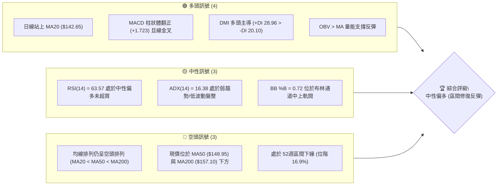

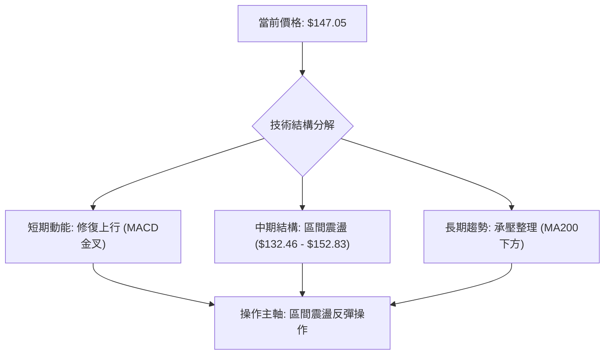

### 📊 核心指標速覽表

| 指標類別 | 指標名稱 | 當前數值 | 訊號 | 解讀 |
|:---|:---|:---|:---:|:---|
| **價格** | 當前收盤價 | $147.05 | 🟡 | 位於52週區間 16.9% 位階，自底部脫離進行修復 |
| **均線** | MA20 | $142.65 | 🟢 | 價格在MA20上方 (+3.09%)，短天期多頭重奪掌控權 |
| **均線** | MA50 | $148.95 | 🔴 | 價格在MA50下方 (-1.28%)，構成即時動態反壓 |
| **均線** | MA200 | $157.10 | 🔴 | 價格在MA200下方 (-6.40%)，長期生命線依然下彎 |
| **動能** | RSI(14) | 63.57 | 🟢 | 處於強勢中性區間 (50–70)，無超買超賣，具向上延伸空間 |
| **動能** | MACD(12,26,9) | 0.058 / -1.665 | 🟢 | 快慢線翻越訊號線產生黃金交叉，柱狀體 +1.723 持續擴大 |
| **動能** | Stoch %K / %D | 61.52 / 75.77 | 🟡 | 自超買區略微鈍化收斂，短線存在震盪消化籌碼需求 |
| **趨勢強度**| ADX(14) | 16.38 | 🟡 | ADX < 25 表明非單邊趨勢，屬於盤整帶動的反彈修復行情 |
| **通道指標**| 布林帶 (20, 2) | 上軌 $152.83 / 下軌 $132.46 | 🟡 | %B 為 0.72，朝布林通道上軌進逼，通道開口略有擴張 |
| **量能** | 當日量 / 20日均量 | 4,531,600 / 4,182,240 | 🟢 | 量比 1.08x，OBV 高於均線，量能確認短線反彈有效性 |
| **波動** | ATR(14) | $4.67 (3.17%) | 🟡 | 波動度處於合理歷史常態，提供明確止損空間依據 |

### 🏆 技術評分卡

```
╔══════════════════════════════════════════════════════════════╗
║              技術評分卡 — VST (2026-09-11)                  ║
╠══════════════════════════════════════════════════════════════╣
║ 趨勢強度 (Trend)     ██████░░░░░░░░░░░░░░  35/100  🔴 弱趨勢   ║
║ 動能指標 (Momentum)  ██████████████░░░░░░  70/100  🟢 動能偏多 ║
║ 支撐穩定度 (Support) ████████████████░░░░  80/100  🟢 底層扎實 ║
║ 成交量配合 (Volume)  ████████████░░░░░░░░  60/100  🟢 溫和放量 ║
║ 形態完整度 (Pattern) ██████████░░░░░░░░░░  50/100  🟡 形態構築 ║
║ 均線排列 (MA System) ████████░░░░░░░░░░░░  40/100  🔴 空頭壓制 ║
╠══════════════════════════════════════════════════════════════╣
║ 綜合評分 (Overall)   ███████████░░░░░░░░░  56/100  🟡 區間震盪 ║
╚══════════════════════════════════════════════════════════════╝
```

---

## 2. 趨勢分析

### 🌐 多時框趨勢分析

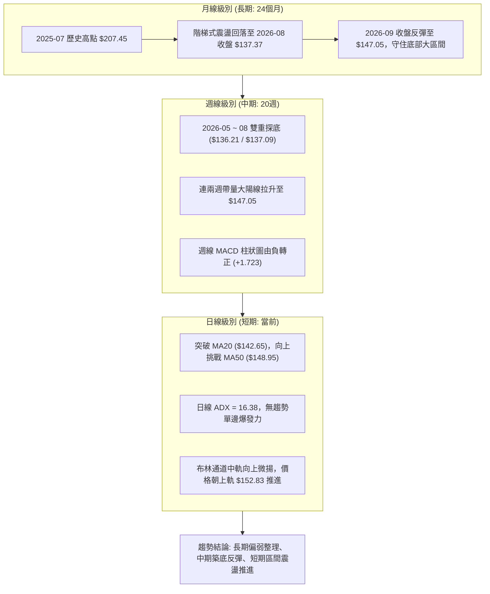

### 📈 長期趨勢 — 12個月走勢圖（Unicode）

以下為 VST 過去 12 個月（2025-10 至 2026-09）之月線收盤價格軌跡與形態演變：

```
VST 月線走勢圖（過去12個月）
價格 ($)
$200 ┤
$190 ┤ ●(2025-10 $187.52)
$180 ┤       ●(2025-11 $178.12)
$170 ┤                               ●(2026-02 $173.41 次高點)
$160 ┤             ●(2025-12 $160.88)              ●(2026-05 $160.01)
$150 ┤                   ●(2026-01 $157.91)  ●(2026-03 $150.12)  ●(2026-06 $158.63)    ●←當前 $147.05
$140 ┤                                                                         ●(2026-07 $148.19)
$130 ┤                                                                               ●(2026-08 $137.37 底部)
     └─┬─────┬─────┬─────┬─────┬─────┬─────┬─────┬─────┬─────┬─────┬─────┬──
      10月  11月  12月  01月  02月  03月  04月  05月  06月  07月  08月  09月 (2025-2026)
```

**12 個月走勢階段特徵分析表**：

| 階段區間 | 時間跨度 | 起訖價位 | 漲跌幅 | 價量特徵與形態解讀 |
|:---|:---|:---|:---:|:---|
| **第一階段：頂部派發** | 2025-10 至 2025-12 | $187.52 → $160.88 | -14.21% | 自 2025-07 歷史高點回落後，反彈無力，月線連收長陰跌破短期均線 |
| **第二階段：反彈誘多** | 2026-01 至 2026-02 | $157.91 → $173.41 | +9.82% | 測試 $170 上方反壓，高點未過前高，形成中期次高點頭部形態 |
| **第三階段：陰跌磨底** | 2026-03 至 2026-06 | $150.12 → $158.63 | +5.67% | 股價進入 $150–$160 區間窄幅整理，籌碼持續換手，振幅縮小 |
| **第四階段：恐慌回踩** | 2026-07 至 2026-08 | $148.19 → $137.37 | -7.30% | 跌破半年整理平台，於 8 月底創下 $132.47 年內低點後引發技術性超賣 |
| **第五階段：築底回升** | 2026-08 至 2026-09 | $137.37 → $147.05 | +7.05% | 伴隨機構降級後的升級買盤，技術面完成破底翻，回到 $147 關鍵位 |

### 📊 中期趨勢（週線分析）

從近 20 週的收盤價與動能變化觀察：
- **雙重底部確立**：2026-05-17 收盤 $139.48（RSI 25.5 極端超賣），隨後於 2026-08-23 再次探底收 $136.21（RSI 26.1）。兩次低點均在 52週低點 $132.47 之上獲得強大支撐。
- **動能顯著背離修復**：2026-08-23 低點 $136.21 確立後，近三週收盤價分別為 $137.09、$149.30、$147.05，週線 MACD 柱狀體由負值 -0.563 迅猛翻正至 +1.723，RSI 從 26.1 拉升至 63.6，展現強烈的中期均值回歸特性。

```
週線級別價格壓力與支撐階梯架構
阻力層 3: $168.93 ══════════════════════════════════ [61.8% 斐波那契 / 波段密集阻力 R3]
阻力層 2: $156.99 ══════════════════════════════════ [MA200 / 波段平台反壓 R2]
阻力層 1: $150.18 ══════════════════════════════════ [78.6% 斐波那契 / 波段短壓 R1 / MA50]
現價位階: $147.05 ─────────── ◄ 當前位置 (反彈推進中)
支撐層 1: $144.63 ────────────────────────────────── [近週拉回支撐 S1]
支撐層 2: $142.14 ══════════════════════════════════ [MA20 翻揚動態支撐 / 布林中軌 S2]
支撐層 3: $137.93 ══════════════════════════════════ [8月雙底頸線結構 / 強固防線 S3]
```

### ⚡ 趨勢強度評估（ADX 解讀）

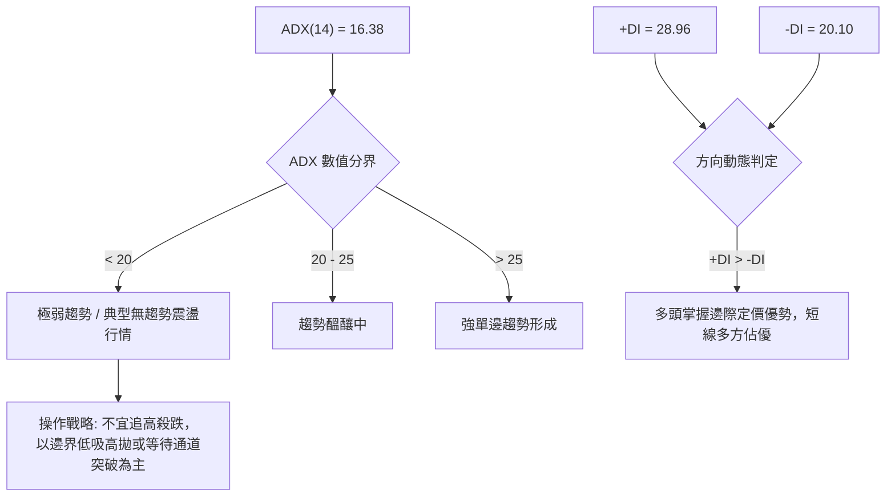

**ADX 趨勢強度對照表**：

| 指標變數 | 當前讀數 | 標準區間門檻 | 行情屬性判定 | 操作策略指導原則 |
|:---|:---:|:---:|:---|:---|
| **ADX 數值** | **16.38** | < 25 (弱/無趨勢) | 處於寬幅震盪整理格局，缺乏單邊推動力 | **禁止使用順勢突破追單**；以布林通道與波段阻力進行回調低吸與獲利兌現 |
| **+DI (多方)** | **28.96** | 基準線 20 | 多方攻擊意願顯著升溫，自底部形成掌控 | 短線回踩支撐位時為高勝率防禦性買點 |
| **-DI (空方)** | **20.10** | 基準線 20 | 空方殺跌力量大幅衰退，賣壓趨於耗盡 | 空頭平倉盤推動價格走高，下檔空間受到壓縮 |

---

## 3. 圖表形態分析

### 🔍 形態識別系統

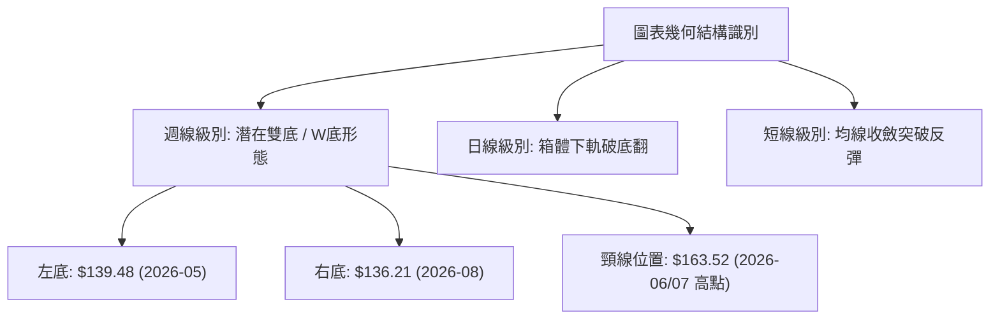

**圖表形態識別與信心度評估表**：

| 形態名稱 | 信心度 | 判斷依據（嚴格引用技術數據） | 形態完成度 | 理論目標價（附計算公式） |
|:---|:---:|:---|:---:|:---|
| **週線雙底 (W-Bottom)** | **68%** | 兩次低點分別為 2026-05-17 收盤 $139.48 與 2026-08-23 收盤 $136.21（最低下探 52W 低點 $132.47）。兩底未破且右底 RSI 顯著抬升形成鈍化背離。頸線為 2026-06-21 收盤高點 $163.52。 | **60%** (已脫離右底，尚未突破頸線) | 由雙底形態推算：<br>形態高度 = 頸線 $163.52 - 底部 $132.47 = $31.05。<br>突破目標 = $163.52 + $31.05 = **$194.57** (接近斐波那契 23.6% 回調位 $198.51)。 |
| **日線箱體破底翻** | **75%** | 2026-08 跌破整理區間下緣 S3 $137.93 後迅速於兩週內以大陽線收復，收盤回到 $147.05，完成典型假跌破洗盤（Bear Trap）。 | **85%** (已回到區間內部) | 由破底翻箱體高度推算：<br>箱體底 $137.93 至箱體頂 R1 $150.18，高度 $12.25。<br>測量目標 = $150.18 + $12.25 = **$162.43** (接近 MA240 $162.97)。 |
| **頭肩底形態** | **35%** | 數據中左肩、頭部、右肩結構不夠對稱，數據不足以支撐幾何頭肩底。 | **0%** | **訊號不足，僅做指標型解讀，不預設立場。** |

### 🕯️ 重要K線形態分析

| 觀測週期 | 結算收盤價 | K線組合形態 | 技術面心理意涵與解讀 | 訊號方向 |
|:---|:---:|:---|:---|:---:|
| **2026-08-23 週** | $136.21 | **長下影探底錘頭線** | 測試年內低點 $132.47 後獲得機構強力承接，賣盤衰竭，空方動能耗盡。 | 🟢 強力反轉 |
| **2026-08-30 週** | $137.09 | **低檔十字星 (Doji)** | 多空雙方在底部達成短暫平衡，確認 $136–$137 支撐有效性，蓄勢待發。 | 🟢 止跌確認 |
| **2026-09-06 週** | $149.30 | **大陽吞噬線 (Bullish Engulfing)** | 週成交量 22,139,900 股，實體大陽線一口氣收復前三週跌幅，動能全面翻多。 | 🟢 多頭表態 |
| **2026-09-13 週** | $147.05 | **高檔孕線洗盤 (Inside Bar)** | 衝高觸及 MA50 反壓後微幅回調，成交量萎縮至 15,423,100 股，屬健康的縮量蓄勢。 | 🟡 中性整固 |

### 📉 ASCII 走勢形態示意圖

```
VST 日線破底翻與雙底反彈形態剖析圖
價格 ($)
$165 ┤                                           [頸線反壓聚類區 $163.52]
     │                                           ────────────────────────
$160 ┤               ╭──╮       ╭──╮
     │               │  │       │  │
$155 ┤      ╭──╮     │  │       │  │
     │      │  │     │  │       │  │             [目前推進阻力 R1 $150.18]
$150 ┤      │  │     │  │  ╭─╮  │  │        ╭─●  ┄┄┄┄┄┄┄┄┄┄┄┄┄┄┄┄┄┄┄┄┄┄┄
     │      │  ╰──╮  │  ╰──╯ ╰──╯  ╰──╮  ╭──╯ ◄ 現價 $147.05
$145 ┤╭─╮   │     ╰──╯                 ╰──╯     [突破 MA20 $142.65]
     ││ ╰───╯
$140 ┤│          ●左底 $139.48
     ││
$135 ┤│                                     ●右底 $136.21 (極值 $132.47)
     └┴─────────────────────────────────────────────────────────────────
       2026-05           2026-06~07              2026-08           2026-09
```

### 🎯 形態目標價計算

根據嚴格之量化圖表法則，計算雙底及破底翻之測量目標：

1. **破底翻日內箱體測量目標（短線）**：
   - 突破軸心點：支撐轉換阻力位 **R1: $150.18**
   - 底部支撐基準：波段低點聚類 **S3: $137.93**
   - 形態振幅高度 $H_1 = \$150.18 - \$137.93 = \$12.25$
   - 短線第一等距目標 $T_1 = \$150.18 + \$12.25 =$ **$162.43**（剛好貼合 MA240 之 $162.97，具極高共振性）

2. **週線級別雙底延伸測量目標（中長線）**：
   - 雙底頸線位置：**$163.52**
   - 雙底絕對低點：**$132.47**
   - 形態高度 $H_2 = \$163.52 - \$132.47 = \$31.05$
   - 中長線完全解鎖目標 $T_2 = \$163.52 + \$31.05 =$ **$194.57**（位於斐波那契 23.6% 回調位 $198.51 與 38.2% 回調位 $185.89 之間）

---

## 4. 支撐與阻力

### 🗺️ 關鍵價位分布圖（Unicode）

```
╔══════════════════════════════════════════════════════════════════╗
║                   VST 價位結構空間分布圖                         ║
╠══════════════════════════════════════════════════════════════════╣
║ $218.91 ║████████████████████████║ 52週歷史最高點 (0.0% 斐波那契)║
║ $198.51 ║████████████████████    ║ 斐波那契 23.6% 回調壓力      ║
║ $185.89 ║██████████████████████  ║ 斐波那契 38.2% 密集成交區    ║
║ $175.69 ║████████████████████████║ 斐波那契 50.0% 多空中樞      ║
║ $168.93 ║████████████████████████║ 強阻力 R3 (近一年波段高點聚類)║
║ $165.49 ║██████████████████      ║ 斐波那契 61.8% 黃金分割反壓  ║
║ $156.99 ║████████████████████    ║ 阻力 R2 (MA200 重合區 $157.10)║
║ $150.97 ║████████████████████████║ 斐波那契 78.6% 回調位        ║
║ $150.18 ║████████████████████████║ 關鍵阻力 R1 (短線波段高點聚類)║
║ $147.05 ╠════════════════════════╣ ◄ 當前收盤現價              ║
║ $144.63 ║▓▓▓▓▓▓▓▓▓▓▓▓▓▓▓▓        ║ 近期第一支撐 S1              ║
║ $142.14 ║████████████████████████║ 關鍵均線支撐 S2 (重合 MA20)  ║
║ $137.93 ║████████████████████████║ 強支撐 S3 (8月雙底結構下軌)   ║
║ $132.47 ║████████████████████████║ 52週歷史最低點 (100.0% 斐波) ║
╚══════════════════════════════════════════════════════════════════╝
```

### 🚧 阻力位分析表

所有價位均嚴格引用 OHLCV 計算之聚類數值：

| 阻力級別 | 精確價位 | 距現價空間 | 形成技術原因與籌碼結構 | 突破難度評估 | 戰略重要性 |
|:---|:---:|:---:|:---|:---:|:---:|
| **阻力 R1** | **$150.18** | +2.13% | 近一年波段高點聚類，與當前日線 MA50 ($148.95) 及斐波那契 78.6% ($150.97) 形成密集成交套牢反壓。 | 🟡 中等 (需日成交量突破 500 萬股) | ★★★★☆ |
| **阻力 R2** | **$156.99** | +6.76% | 2026 年中多個波段折返高點聚類，且與長期年線 MA200 ($157.10) 形成完全共振，為牛熊分水嶺。 | 🔴 極高 (面臨解套盤大量湧出) | ★★★★★ |
| **阻力 R3** | **$168.93** | +14.88% | 2026 年初強烈反彈之頂部套牢籌碼峰聚類，接近斐波那契 61.8% ($165.49)，為中長期大級別反轉目標。 | 🔴 極高 (需宏觀與基本面配合) | ★★★★☆ |

### 🛡️ 支撐位分析表

所有價位均嚴格引用 OHLCV 計算之聚類數值：

| 支撐級別 | 精確價位 | 距現價空間 | 形成技術原因與籌碼結構 | 守住機率評估 | 戰略重要性 |
|:---|:---:|:---:|:---|:---:|:---:|
| **支撐 S1** | **$144.63** | -1.65% | 近一年波段次回撤低點聚類，同時為 9 月初突破陽線之回踩確認位與短線分時密集成交平台。 | 🟢 75% (短線多方防線) | ★★★☆☆ |
| **支撐 S2** | **$142.14** | -3.34% | 近一年波段低點聚類，重合日線 MA20 動態均線 ($142.65) 與布林通道中軌，多頭進攻之生命線。 | 🟢 85% (中期反彈生命線) | ★★★★★ |
| **支撐 S3** | **$137.93** | -6.20% | 2026-08 雙底平台支撐聚類，跌破則宣告日線破底翻失敗，為波段多單最後防守底線。 | 🟢 90% (極具防禦價值) | ★★★★★ |

### 📐 斐波那契回調位分析

依據 52 週絕對極值區間（最低點 **$132.47** 至 最高點 **$218.91**，總垂直落差 **$86.44**）建立之黃金分割坐標：

```
斐波那契回調階梯與現價所處位階
 0.0%  $218.91 ══════════════════════════════════════ [52W 最高點]
23.6%  $198.51 ──────────────────────────────────────
38.2%  $185.89 ──────────────────────────────────────
50.0%  $175.69 ────────────────────────────────────── [多空中軸平衡線]
61.8%  $165.49 ────────────────────────────────────── [黃金分割強阻力]
78.6%  $150.97 ══════════════════════════════════════ [當前上方第一道斐波反壓]
────── $147.05 ────────── ◄ 當前收盤價落於 78.6% 與 100.0% 之間 (位階 16.9%)
100.0% $132.47 ══════════════════════════════════════ [52W 最低點]
```

**斐波那契深層解讀**：
- 當前收盤價 **$147.05** 緊貼於 **78.6% 回調位 ($150.97)** 下方，介於 $132.47 至 $150.97 區間。
- 在技術分析中，自 0% 下跌至 78.6% 以下通常屬於深度回撤（Deep Retracement），意味著過去一年的上升趨勢已遭到破壞。
- 然而，當價格重新從 100% 底盤拉起並挑戰 78.6% ($150.97) 時，一旦放量收復 $150.97，將打開通往 **61.8% ($165.49)** 與 **50.0% ($175.69)** 的均值回歸真空帶。

---

## 5. 技術指標深度解讀

### 🎛️ 指標訊號總覽

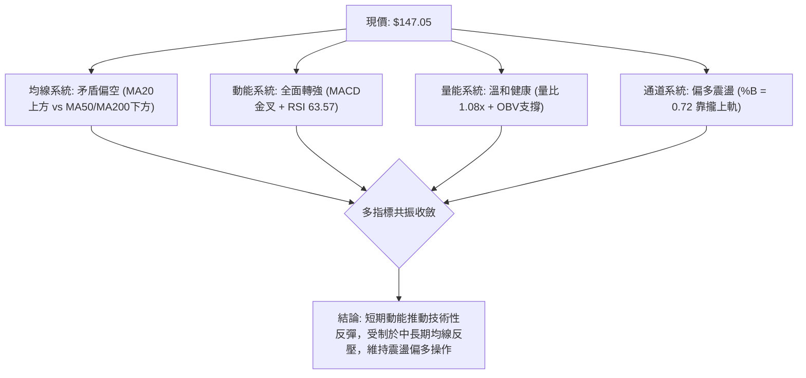

### 📈 移動平均線排列分析

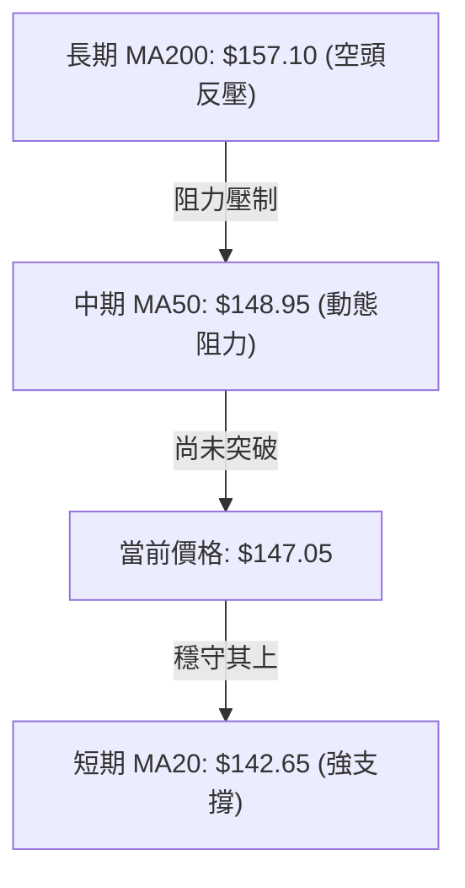

**均線全系統量化分析表**：

| 均線名稱 | 當前價位 | 乖離率 (Bias) | 走勢斜率 | 技術意涵與實戰解讀 |
|:---|:---:|:---:|:---:|:---|
| **MA 5** | $148.68 | -1.09% | 短線微彎 | 超短線在 $149 附近承壓，短期籌碼進行換手整理 |
| **MA 10** | $143.92 | +2.17% | 快速上揚 | 提供強勁超短線下檔支撐，形成多頭護城河 |
| **MA 20** | $142.65 | +3.09% | 止跌翻揚 | 突破 20 日月線，中期底部構築確立，奠定反彈基礎 |
| **MA 50** | $148.95 | -1.28% | 下緩走平 | 季線阻力近在咫尺，為多方短線必須攻克的關鍵碉堡 |
| **MA 60** | $151.21 | -2.75% | 往下傾斜 | 與 R1 ($150.18) 及斐波那契 78.6% 構成多重共振阻力區 |
| **MA 120** | $152.17 | -3.36% | 下滑走勢 | 半年線持續壓制，限制短線爆發性大行情的空間 |
| **MA 200** | $157.10 | -6.40% | 下彎壓制 | 牛熊生命線，未有效站穩前，整體結構僅能視為反彈非反轉 |
| **MA 240** | $162.97 | -9.77% | 緩降走勢 | 貼近年內阻力 R2/R3，為大級別反彈之極限壓制點 |

*均線排列判定*：目前整體架構為 **MA20 < MA50 < MA200**，長週期空頭排列尚未扭轉；但短線呈現 **Price > MA20**，表明進入長空格局中的「次級反彈折返浪」。

### 📉 RSI(14) 分析

當前 **RSI(14) = 63.57**，呈現健康的多頭反彈動能。

```
RSI(14) 動態區間定位
0 ──────── 30 ────────────────────── 50 ────────── 63.57 ───── 70 ──────── 100
[ 極端超賣 ]        [ 弱勢區間 ]          [ 中性平衡 ]   [★目前]   [ 極端超買 ]
```

- **超買超賣判定**：數值位於 63.57，脫離了 2026-08 底部的極端超賣區（當時 RSI 為 26.1），目前處於 50–70 強勢推升區間，尚未進入 >70 之超買警戒區，代表多方仍有推升餘力。
- **背離分析（Divergence）**：
  - *底背離驗證*：檢視 2026-05-17 低點收盤 $139.48（RSI 25.5），至 2026-08-23 收盤創出更低點 $136.21（盤中觸及 $132.47），但該週收盤 RSI 為 26.1，未破前低，且日線級別在 8 月底呈現明顯的**動能底背離（Bullish Divergence）**，隨後帶動近兩週強勁反彈。
  - *頂背離檢驗*：目前價格自低位推升，日線與週線 RSI 斜率均與價格同步向上，**無任何頂背離徵兆**。

### 📊 MACD(12/26/9) 訊號解讀

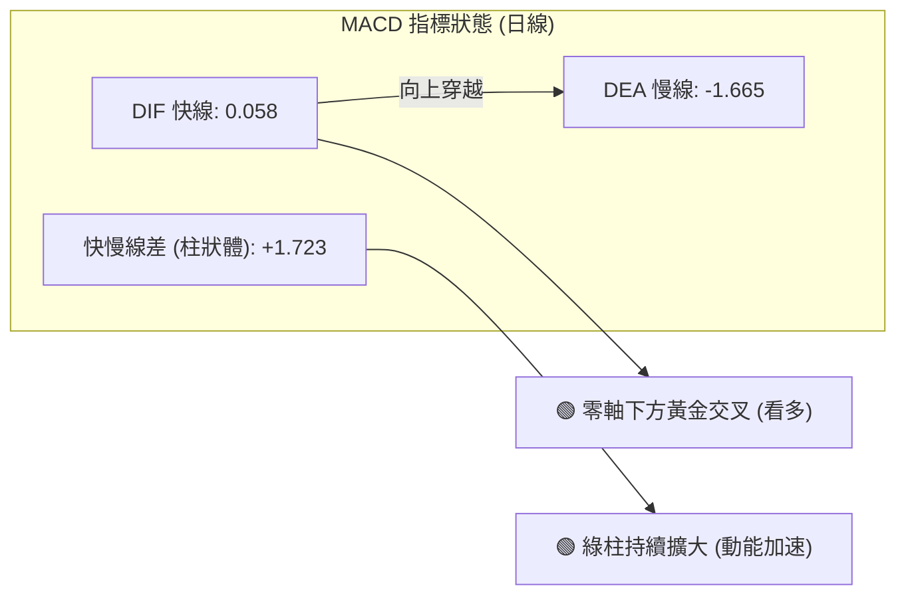

- **快慢線交叉狀態**：DIF 快線（0.058）由下往上強勢穿越訊號線 DEA（-1.665），在歷經長時間的零軸下方壓制後，DIF 正式翻上零軸，形成高含金量的**零軸突破金叉**。
- **柱狀體動態**：MACD Histogram 當前讀數為 **+1.723**，呈現連續 3 週/多日的發散放大形態，表明多頭動能正在加速釋放，空頭壓制力量全面退卻。

### 📦 布林通道分析

當前布林通道（參數 20, 2）數據：
- **上軌 (Upper Band)**：$152.83
- **中軌 (Middle Band / MA20)**：$142.65
- **下軌 (Lower Band)**：$132.46
- **帶寬與位置**：%B = 0.72

```
VST 布林通道價格空間分佈
$152.83 ┬──────────────────────────────────────────── 布林上軌 (動態阻力區)
        │
$147.05 ┼─────────────────────────● (現價, %B = 0.72)
        │
$142.65 ┼──────────────────────────────────────────── 布林中軌 (MA20 強支撐)
        │
$132.46 ┴──────────────────────────────────────────── 布林下軌 (波段防守底線)
```

**通道形態與實戰意涵**：
1. **通道擴張徵兆**：價格自布林下軌 $132.46 獲得支撐後一路連貫突破中軌 $142.65，目前推進至 %B = 0.72，通道開口開始向外發散。
2. **運行空間**：%B 處於 0.72 意味著價格尚未觸及上軌（$152.83），上方尚有約 $5.78 (+3.93%) 之無阻力滑行空間，剛好涵蓋阻力位 R1 ($150.18)。
3. **回踩支撐有效性**：若短線遇阻回落，中軌 $142.65（重合支撐 S2 $142.14）將構成極強之支撐墊。

### 💹 成交量分析（量價配合度）

- **量比與均量結構**：
  - 最新單日成交量：**4,531,600 股**
  - 20日均量：**4,182,240 股**（量比 **1.08x**）
  - 50日均量：**4,396,098 股**
- **OBV (能量潮指標) 走勢**：
  - 數據明確顯示 **OBV > MA(OBV)**，能量潮線突破均線並保持昂首向上，表明主力資金在 $135–$145 區間有實質性的吸籌沉澱。
- **量價協同性判定**：
  - 2026-09-06 週大漲時成交量放大至 22,139,900 股，而 2026-09-13 當週震盪小幅回撤時成交量縮減至 15,423,100 股，呈現經典的**「價漲量增、價跌量縮」**良性多頭量價配合，排除量價頂背離之風險。

---

## 6. 動能與波動率

### ⚡ 動能評估四象限

評估當前 VST 在「動能強度」與「波動率」所處之象限定位：

| 象限 | 動能強度 | 波動率水準 | 歷史特徵 | 當前狀態判定與戰略行動 |
|:---:|:---:|:---:|:---|:---|
| **Q1 (突破加速)** | 強 (RSI>60, MACD>0) | 高 (ATR% > 4%) | 單邊狂飆行情 | 非目前狀態 |
| **Q2 (震盪蓄勢)** | **強 (RSI 63.57, +DI>28)** | **低 (ATR 3.17%, ADX 16.38)** | **修復反彈，洗盤推進** | **✓ 當前精確定位：風險回報比最優區間** |
| **Q3 (無序低迷)** | 弱 (RSI<40, MACD<0) | 低 (ATR% < 3%) | 陰跌磨底階段 | 2026-07 至 08 月已度過此階段 |
| **Q4 (恐慌釋放)** | 弱 (RSI<30) | 高 (ATR% > 5%) | 崩跌殺多階段 | 2026-08-23 探底 $132.47 時已結束 |

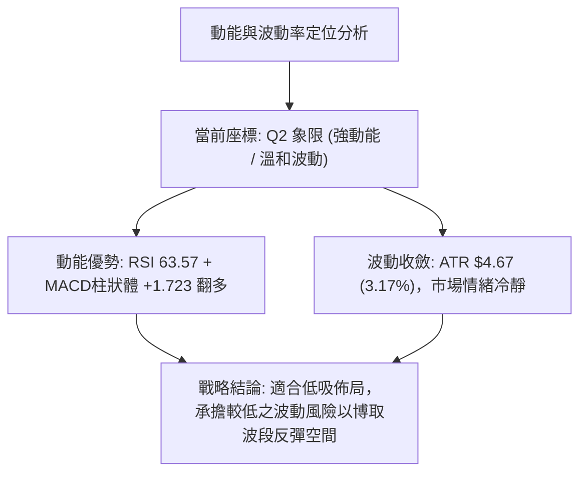

### 📊 ATR 波動率分析

- **當前 ATR(14) 數值**：**$4.67**，換算為當前股價之百分比為 **3.17%**。
- **歷史波動橫向對比**：相較於 2025 年牛市主升段動輒每日 $8–$10 的劇烈振幅，目前 $4.67 之 ATR 顯示市場投機狂熱已顯著退潮，籌碼沉澱，進入理性定價修復期。
- **動態止損與進場空間測算**：
  - *常規波段止損距（1.0 × ATR）*：$\$4.67$，對應現價為 $\$147.05 - \$4.67 =$ **$142.38**（極其精確地貼合支撐 S2: $142.14 與 MA20: $142.65）。
  - *寬鬆防守止損距（1.5 × ATR）*：$1.5 \times \$4.67 = \$7.01$，對應現價為 $\$147.05 - \$7.01 =$ **$140.04**（位於 8 月平台底層之上）。

### 📐 Beta 與市場相關性

- **Beta 係數**：**1.414**
- **市場敏感度解讀**：
  - VST 作為獨立發電商（IPP）龍頭，雖然屬於公用事業板塊（Utilities），但因兼具 AI 數據中心用電、電力合約重定價等高度成長題材，其 Beta 高達 1.414，表現出強烈的高貝塔（High-Beta）成長股特性。
  - 當標普 500 指數或科技板塊變動 1.0% 時，VST 理論上將同向放大波動 1.414%。在當前大盤尋求企穩的環境下，其反彈彈性顯著優於傳統防禦型公用事業股。
- **機構持股與放空壓力**：
  - 機構持股比例高達 **92.1%**，籌碼主要掌握在大型基金手中。
  - 做空比例（Short % Float）僅 **3.3%**，空頭回補天數（Short Ratio）為 **2.04 天**，無沉重做空壓盤，亦無大級別軋空誘因，走勢將回歸基本技術面與基本面導向。

---

## 7. 多時框架總結

### 📋 時框架評分表

| 時框架 | 趨勢方向 | 動能狀態 | 均線排列狀況 | 關鍵形態結構 | 綜合評分 | 操作指導建議 |
|:---|:---:|:---:|:---|:---|:---:|:---|
| **短期 (日線)** | 🟢 震盪偏多 | 🟢 強勢反彈 (MACD金叉) | 🟡 突破 MA20，挑戰 MA50 | 破底翻向上延伸 | **70/100** | 回踩 MA20 積極尋找買點 |
| **中期 (週線)** | 🟡 築底震盪 | 🟢 轉強 (柱狀圖翻正) | 🔴 糾結且承壓於中長均線 | 週線雙底形態構築中 | **55/100** | 區間操作，嚴控高拋低吸節奏 |
| **長期 (月線)** | 🔴 偏弱整理 | 🟡 低檔收斂鈍化 | 🔴 MA200 下方空頭排列 | 長期頭部回撤 16.9% 位階 | **42/100** | 僅視為大跌後的修復反彈波 |

### 🔲 綜合訊號矩陣

```
╔══════════════════════════════════════════════════════════════════╗
║               VST 多時框多維度共振訊號矩陣                       ║
╠══════════════════╦══════════════╦══════════════╦═════════════════╣
║ 分析維度         ║ 短期 (日線)  ║ 中期 (週線)  ║ 長期 (月線)     ║
╠══════════════════╬══════════════╬══════════════╬═════════════════╣
║ 趨勢方向 (Trend) ║ 🟢 偏多推進  ║ 🟡 築底震盪  ║ 🔴 弱勢修正     ║
║ 動能指標 (MOM)   ║ 🟢 柱體擴大  ║ 🟢 翻正確立  ║ 🟡 底部鈍化     ║
║ 均線系統 (MA)    ║ 🟢 站上MA20  ║ 🔴 均線反壓  ║ 🔴 偏離年線     ║
║ 關鍵價位 (Level) ║ 🟢 站穩 S1   ║ 🟡 逼近 R1   ║ 🔴 遠離歷史高位 ║
║ 量能結構 (Volume)║ 🟢 OBV向上   ║ 🟢 價漲量增  ║ 🟡 縮量沉澱     ║
╚══════════════════╩══════════════╩══════════════╩═════════════════╝
```

### ⚖️ 多時框收斂結論

依據技術分析「多時框收斂規則（嚴格要求 14）」：
1. **行情屬性判定**：當前日線 **ADX(14) = 16.38 (< 25)**，明確確認當前市場**並非單邊強趨勢行情，而是典型的盤整與修復行情**。
2. **主導時框取捨**：在 ADX < 25 的盤整結構下，交易邏輯應以**日線布林通道上下軌（$132.46 – $152.83）與聚類支撐阻力位為核心區間**。中長期月線的空頭排列限制了上漲空間，使其無法演化為一氣呵成的反轉暴漲；而短期日線與週線的動能指標共振翻多，則排除了繼續大幅崩跌的風險。
3. **唯一方向性收斂結論**：**【震盪修復偏多（Range-Bound Bullish）】**。
   - 短期以回踩支撐位逢低做多為主，以布林上軌與波段阻力 R1/R2 為獲利減碼目標；
   - 堅決避免在接近阻力位時追高，以應對 ADX 低迷時動能易於衰竭的特性。

---

## 8. 交易策略建議

### 🗺️ 策略決策流程圖

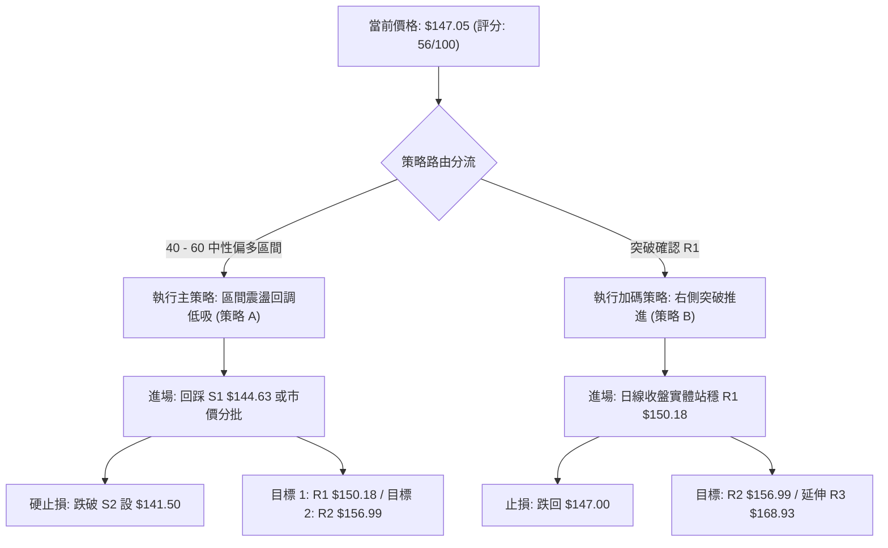

### 🧭 策略路由

> **當前主策略方向 = 【中性偏多，區間震盪低吸】（依綜合評分 56/100 判定）**
> 
> 由於綜合評分處於 40–60 分之中性區間，且 ADX = 16.38，整體操作定調為「依託日線布林通道中軌與支撐位進行區間操作，耐心等待突破確認」。**主推逢低做多策略，空頭操作僅作為下檔破位之避險提示，嚴禁在強動能修復期逆勢放空。**

### 🎯 價格情境階梯（Price Scenarios）

以當前價格 **$147.05** 為核心基準，所有價位嚴格引用第 4 章聚類數值：

| 觸發條件 | 下一測試目標 | 後續延伸發展 | 技術情境結構含義 |
|:---|:---:|:---:|:---|
| **向上放量突破 R1 ($150.18)** | **R2 ($156.99)** | **R3 ($168.93)** | 短線技術面全面轉強，收復 MA50 並向 MA200 挺進，雙底形態完成度升至 80% |
| **穩守現價至 S1 區間 ($144.63 - $147.05)** | **R1 ($150.18)** | **布林上軌 ($152.83)** | 正常的震盪蓄勢結構，消化 MA50 動態反壓，均線逐漸由空翻多 |
| **有效跌破支撐 S1 ($144.63)** | **S2 ($142.14)** | **S3 ($137.93)** | 中期反彈動能遭遇挫折，價格將回測 MA20 生命線尋求二次確認支撐 |
| **破位跌破強支撐 S3 ($137.93)** | **52W 低點 ($132.47)** | 尋找新低底限 | 日線破底翻宣告徹底失敗，多頭架構瓦解，行情轉為弱勢二次探底 |

### 📊 情境機率分佈

```
情境機率分佈圖
┌────────────────────────────────────────────────────────────────────────┐
│ 區間震盪蓄勢 (55%)     ████████████████████████████                    │
│ 突破上行挑戰 R2 (30%)  ███████████████                                 │
│ 跌破走弱再探底 (15%)   ████████                                        │
└────────────────────────────────────────────────────────────────────────┘
```

| 發展情境 | 評估機率 | 主要技術與量價依據 |
|:---|:---:|:---|
| **區間震盪蓄勢** | **55%** | ADX(14) 僅 16.38 表明市場缺乏單邊推動力，上方 MA50 ($148.95) 與 MA60 ($151.21) 構成沉重解套套牢區，需在 $142–$150 之間震盪換手。 |
| **向上突破推進** | **30%** | MACD 零軸下方金叉擴散 (+1.723)，+DI (28.96) 顯著高於 -DI (20.10)，且 OBV 量能健康支撐，具備向 R1/R2 發起衝擊的動能。 |
| **回落再探低點** | **15%** | 均線系統大格局仍處空頭排列，若遭遇大盤系統性風險，不排除回測 S3 ($137.93)；但考慮到底部抬升，直接摜破 $132.47 之機率極低。 |

### 🟢 主策略詳情

本報告提供兩套多頭戰術策略，分別適用於穩健型與突破型交易者：

| 策略要素 | 策略 A：區間回踩低吸策略（首選） | 策略 B：右側放量突破策略（追進） |
|:---|:---|:---|
| **策略類型** | 穩健型（左側防禦性佈局） | 積極型（右側動能確認追價） |
| **進場條件** | 價格回調測試支撐 S1 不破，分批建倉 | 日線收盤實體放量突破關鍵阻力 R1 |
| **進場價格** | **$144.63**（或 $144.63–$145.50 區間） | **$150.50**（突破 R1 $150.18 後確認點） |
| **止損價格** | **$141.50**（跌破 S2 $142.14 與 MA20） | **$146.50**（回踩跌破突破前整理中樞） |
| **止損距離** | -$3.13 (-2.16%) | -$4.00 (-2.66%) |
| **目標價 T1** | **$150.18**（阻力位 R1，獲利兌現 50%） | **$156.99**（阻力位 R2 / MA200，減碼 50%） |
| **目標價 T2** | **$156.99**（阻力位 R2 / MA200，全數出清） | **$168.93**（阻力位 R3 / 61.8% 斐波那契） |
| **風險報酬比 (T1)**| **1 : 1.77**（風險 $3.13 / 報酬 $5.55） | **1 : 1.62**（風險 $4.00 / 報酬 $6.49） |
| **風險報酬比 (T2)**| **1 : 3.95**（風險 $3.13 / 報酬 $12.36）| **1 : 4.61**（風險 $4.00 / 報酬 $18.43） |
| **模型預估勝率** | **65%** | **55%** |
| **建議倉位管理** | **15% - 20%** 總投資資金 | **10% - 15%** 總投資資金 |

### 🔴 反向風險觸發點（對沖與撤退提示）

以下條件若被觸發，將直接證偽主策略邏輯，投資人應立即執行防禦撤退或買入看跌期權（Put）進行對沖：
1. **關鍵支撐擊穿**：若收盤價收於 **支撐位 S2: $142.14** 之下，意味著跌破 MA20 生命線與布林中軌，反彈趨勢即刻宣告終止，多頭頭寸應無條件停損出場。
2. **動能翻空死叉**：若日線級別 MACD 柱狀體快速萎縮至負值，且 RSI(14) 跌破 50 中性分界線，表明反彈動能耗盡，價格恐向下回測 **S3: $137.93** 甚至 52W 低點 **$132.47**。

### ⭐ 整體訊號強度評星

```
做多訊號強度：  ★★★★☆  (3.8/5星 - 動能修復完好，下檔支撐明確)
做空訊號強度：  ★★☆☆☆  (1.8/5星 - 賣壓已大幅衰退，做空盈虧比差)
整體模型可信度：★★★★☆  (4.0/5星 - 技術指標與量價共振度高)
```

---

## 9. 風險提示與監控

### ✅ 關鍵監控指標 Checklist

```
╔══════════════════════════════════════════════════════════════════╗
║               VST 每日盤面交易監控 Checklist                     ║
╠══════════════════════════════════════════════════════════════════╣
║ [ ] 價格能否守住 MA20 動態支撐位 ($142.65)                      ║
║ [ ] 向上衝擊 R1 ($150.18) 時，單日成交量是否突破 5,000,000 股   ║
║ [ ] RSI(14) 是否持續維持在 50 水平線上方運行                     ║
║ [ ] MACD Histogram 柱狀圖是否保持為正值 (+1.723 以上為佳)        ║
║ [ ] +DI (28.96) 是否持續壓制 -DI (20.10)                        ║
║ [ ] 股價是否觸及布林通道上軌 ($152.83) 產生乖離過大收斂壓制      ║
║ [ ] 大盤整體環境是否惡化（因 VST Beta = 1.414，具高敏感度）      ║
╚══════════════════════════════════════════════════════════════════╝
```

### ⚠️ 風險場景分析

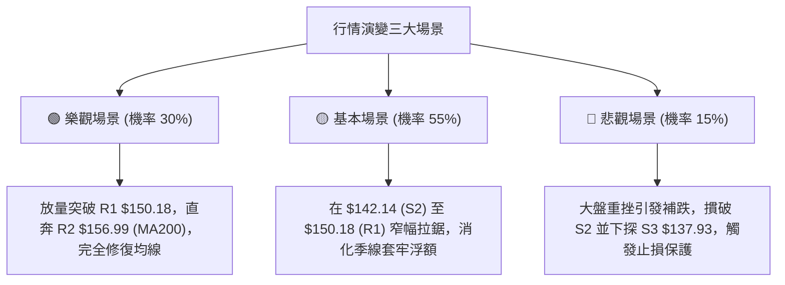

### 🛡️ 風險管理重要提醒

1. **嚴格禁止逆勢抗單**：
   - 目前長期均線（MA200: $157.10）仍向下傾斜，本質上為下跌趨勢中的**「熊市次級反彈」**。交易者切勿將波段反彈誤判為長線大牛市反轉而盲目重倉死守。
   - 所有多頭部位必須嚴格執行「以 ATR 為基準之硬止損」，設定於 **$141.50**，絕不可抱持僥倖心態。

2. **高 Beta 波動之部位控制**：
   - VST 的 Beta 高達 **1.414**，每日 ATR 波動率為 **$4.67 (3.17%)**。
   - 建議單一交易者在此標的之風險曝險金額（即進場價與止損價之差額乘以股數），不得超過總投資帳戶淨值的 **1.5% - 2.0%**。
   - 依此原則計算，總資金 $100,000 之帳戶，單筆最大允許虧損為 $1,500；若依策略 A 之止損距離 $3.13 計算，建議建倉股數不應超過 470 股（約合市值 $68,000 之內，並採分批進場）。

---

## 📋 報告總結

```
╔══════════════════════════════════════════════════════════════════╗
║                   VST 技術分析報告總結                          ║
╠══════════════════════════════════════════════════════════════════╣
║ 報告日期：2026-09-11                                            ║
║ 當前價格：$147.05                                               ║
║ 分析評級：⚖️ 區間震盪修復偏多（綜合評分：56/100）               ║
╠══════════════════════════════════════════════════════════════════╣
║ 關鍵結論：                                                      ║
║ ├─ 長期趨勢：🔴 偏弱整理（受制於 MA200 $157.10 反壓）           ║
║ ├─ 中期趨勢：🟡 築底震盪（週線雙底成形，MACD 柱狀體翻正 +1.723） ║
║ ├─ 短期趨勢：🟢 偏多反彈（日線站上 MA20 $142.65，量價配合健康） ║
║ ├─ 關鍵支撐：S1: $144.63 ｜ S2: $142.14 ｜ S3: $137.93          ║
║ ├─ 關鍵阻力：R1: $150.18 ｜ R2: $156.99 ｜ R3: $168.93          ║
║ └─ 分析師目標價：共識均價 $217.42（最高 $305.00 / 最低 $106.00） ║
╠══════════════════════════════════════════════════════════════════╣
║ 最優策略組合：                                                  ║
║ 1. 🥇 最佳機會：策略 A（回踩支撐 S1 $144.63 附近分批低吸，      ║
║                  止損設 $141.50，目標直指 R1 $150.18 / R2 $156.99）║
║ 2. 🥈 次選機會：策略 B（若直接放量大陽線突破 R1 $150.18，       ║
║                  右側跟進，博取向 MA200 $156.99 之快速推進）     ║
║ 3. 🥉 保守選擇：場外觀望，等待日線在 $142–$150 完成充分換手，   ║
║                  或待 ADX 向上越過 20–25 明確爆發單邊趨勢再介入   ║
╚══════════════════════════════════════════════════════════════════╝
```

---

> ⚠️ **免責聲明**：本報告為技術分析研究成果，所有數據、圖表及推算目標均基於客觀歷史交易數據（OHLCV）。本報告**僅供學術研究與投資決策參考**，**不構成任何要約、招攬或具體投資買賣建議**。金融市場瞬息萬變，高 Beta 股票具備高波動特性，投資人應獨立審慎評估風險，並自行承擔交易結果。

---

*報告生成時間：2026-09-11 ｜ 數據來源：Yahoo Finance ｜ 分析架構：多時框技術分析模型*