# VST 技術分析報告

> **報告日期**：2026-09-12 ｜ **語言**：繁體中文 ｜ **數據來源**：Yahoo Finance ｜ **當前價格**：$148.38

---

## 目錄

| 章節 | 內容 |
|------|------|
| [1. 技術面概覽](#1-技術面概覽) | 訊號儀表板、核心指標、評分卡 |
| [2. 趨勢分析](#2-趨勢分析) | 多時框趨勢、長中短期走勢 |
| [3. 圖表形態分析](#3-圖表形態分析) | 形態識別、K線組合、目標價 |
| [4. 支撐與阻力](#4-支撐與阻力) | 關鍵價位、斐波那契回調 |
| [5. 技術指標深度解讀](#5-技術指標深度解讀) | MA/RSI/MACD/布林/成交量 |
| [6. 動能與波動率](#6-動能與波動率) | 動能評估、ATR、Beta |
| [7. 多時框架總結](#7-多時框架總結) | 時框架評分矩陣 |
| [8. 交易策略建議](#8-交易策略建議) | 多空策略、風險報酬比 |
| [9. 風險提示與監控](#9-風險提示與監控) | 監控指標、風險場景 |

---

## 1. 技術面概覽

### 🎯 技術訊號儀表板

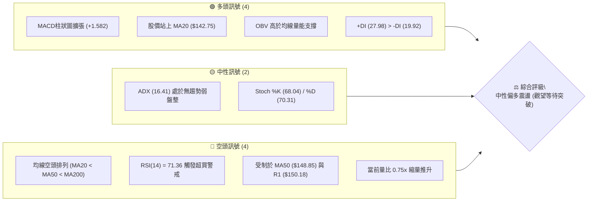

### 📊 核心指標速覽表

| 指標類別 | 指標名稱 | 當前數值 | 訊號 | 解讀 |
|----------|----------|----------|------|------|
| **價格** | 當前價格 | $148.38 | 🟡 | 位於52W區間18.4%，自低點反彈但面臨強均線壓制 |
| **均線** | MA20 | $142.75 | 🟢 | 現價高於 MA20 達 +3.95%，短期底層動能轉強 |
| **均線** | MA50 | $148.85 | 🔴 | 現價低於 MA50 約 -0.32%，直接壓制短期上攻空間 |
| **均線** | MA200 | $157.01 | 🔴 | 現價低於長期牛熊分界線 -5.50%，大格局仍偏空 |
| **動能** | RSI(14) | 71.36 | 🔴 | 日線指標進入超買警戒區 (>70)，短線面臨技術性修正 |
| **動能** | MACD (12,26,9) | 0.312 / -1.270 | 🟢 | 快線上穿慢線，Hist 為 +1.582 柱狀體擴張看多 |
| **動能** | ADX(14) | 16.41 | 🟡 | 讀數低於 25，顯示當前缺乏單邊趨勢，以區間盤整為主 |
| **通道** | Bollinger %B | 0.77 | 🟡 | 接近上軌 ($153.12)，中軌為支撐，短線獲利空間收窄 |
| **量能** | 成交量 / 20日均量 | 3,159,100 (0.75x) | 🔴 | 上漲過程中成交量萎縮，呈現量價背離隱憂 |
| **波動** | ATR(14) | $4.54 (3.06%) | 🟡 | 每日平均波動適中，止損空間需留出 1.5–2.0 倍 ATR |

### 🏆 技術評分卡

```
╔══════════════════════════════════════════════════════════════════╗
║                 技術評分卡 — VST (2026-09-12)                    ║
╠══════════════════════════════════════════════════════════════════╣
║ 趨勢強度      ██████░░░░░░░░░░░░░░  32/100  🔴 (ADX=16.41，無單邊趨勢) ║
║ 動能指標      █████████████░░░░░░░  65/100  🟢 (MACD金叉，RSI短線超買) ║
║ 支撐穩定度    ████████████░░░░░░░░  60/100  🟡 (S1/MA20 提供短線支撐)  ║
║ 成交量配合    ████████░░░░░░░░░░░░  40/100  🔴 (量比0.75x，反彈未帶量) ║
║ 形態完整度    ██████████░░░░░░░░░░  52/100  🟡 (箱體雙底築底待突破)     ║
║ 均線排列      ██████░░░░░░░░░░░░░░  30/100  🔴 (空頭排列，承壓MA50/200)║
╠══════════════════════════════════════════════════════════════════╣
║ 綜合評分      ██████████░░░░░░░░░░  46.5/100 🟡 中性盤整 (觀望等待)     ║
╚══════════════════════════════════════════════════════════════════╝
```

---

## 2. 趨勢分析

### 🌐 多時框趨勢分析

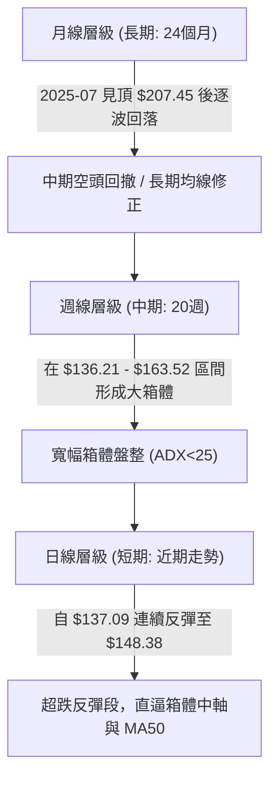

### 📈 長期趨勢 — 12個月走勢圖（Unicode）

```
VST 月線收盤走勢圖（過去12個月：2025-10 至 2026-09）
價格軸 ($)
$195.11 ┤
$187.52 ┤ ●(10月)
$178.12 ┤       ●(11月)      ●(02月:$173.41)
$160.88 ┤             ●(12月)                 ●(05月:$160.01)
$157.62 ┤                   ●(01月)    ●(04月)       ●(06月)
$150.12 ┤                            ●(03月)               ●(09月現價:$148.38)
$148.19 ┤                                                 ●(07月)
$137.37 ┤                                                       ●(08月低點)
        └───────────────────────────────────────────────────────────
         10月  11月  12月  01月  02月  03月  04月  05月  06月  07月  08月  09月
```

#### 走勢特徵分析表格

| 階段區間 | 起止時間 | 價格變動 ($) | 漲跌幅 (%) | 形態與結構特徵 |
|----------|----------|--------------|------------|----------------|
| **高位回撤段** | 2025-10 至 2026-01 | $187.52 → $157.91 | -15.79% | 頂部確立後的持續陰跌，摜破 20 日均線支撐 |
| **次高點誘多** | 2026-01 至 2026-02 | $157.91 → $173.41 | +9.82% | 反彈未能突破前高，形成中期次高點 Lower High |
| **下行探底段** | 2026-02 至 2026-03 | $173.41 → $150.12 | -13.43% | 空頭加速殺跌，確立中長期空頭排列結構 |
| **箱體拉鋸段** | 2026-03 至 2026-06 | $150.12 → $158.63 | +5.67% | 於 $150.00–$163.00 間構築震盪整理平台 |
| **低位次探段** | 2026-06 至 2026-08 | $158.63 → $137.37 | -13.40% | 破位下殺打出 52 週次低點 $136.21 確立 S3 支撐 |
| **超跌修復段** | 2026-08 至 2026-09 | $137.37 → $148.38 | +8.01% | 觸底強彈重回 $148.00 之上，但受壓於 MA50 |

### 📊 中期趨勢（週線分析）

```
週線級別價格壓力與支撐結構示意圖：
阻力 R3  ---------------------------- $168.93 (長期大頂頸線/2026年Q1前高)
阻力 R2  ---------------------------- $156.99 (MA200 壓制帶 / 箱體頂部)
阻力 R1  ---------------------------- $150.18 (MA50 與近兩週密集成交區)
現價     ============================ $148.38
支撐 S1  ---------------------------- $144.63 (MA10 支撐 / 近期低點聚類)
支撐 S2  ---------------------------- $142.14 (MA20 基準線 / 布林中軌)
支撐 S3  ---------------------------- $137.93 (8月打底低點 / 強力防守位)
```

中期走勢（近20週數據）顯示，股價在 $136.21 到 $163.52 之間構築了一個寬幅震盪箱體。近兩週（2026-09-06 的 $149.30 與 2026-09-13 的 $148.38）連續兩週收盤站上 $148.00，週線 MACD 柱狀圖由負轉正（-0.077 → +1.366 → +1.582），呈現中期企穩回暖徵兆。

### ⚡ 趨勢強度評估（ADX 解讀）

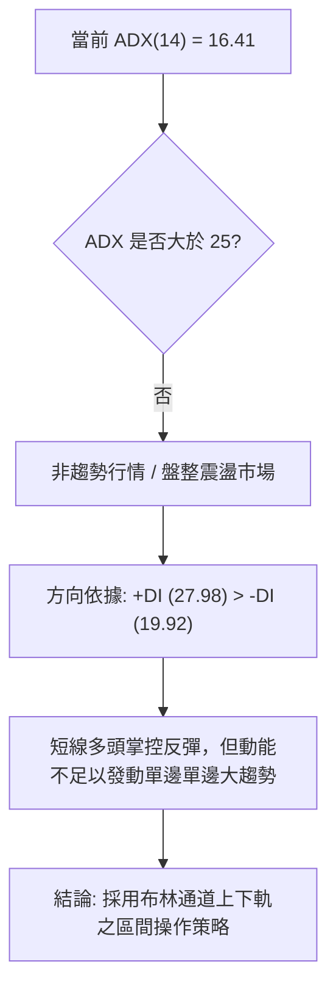

#### ADX 趨勢強度對照表

| 指標變數 | 當前讀數 | 門檻區間 | 技術含義解讀 |
|----------|----------|----------|--------------|
| **ADX(14)** | **16.41** | < 20 (極弱) | 單邊趨勢完全缺席，切忌追漲殺跌，屬於標準盤整市 |
| **+DI** | **27.98** | 領先地位 | 多頭動能暫時佔據上風，主導自 $137.09 以來的反彈 |
| **-DI** | **19.92** | 壓制地位 | 空頭拋壓暫時減弱，未見破位殺跌動能 |
| **DI 差值** | **+8.06** | 正向擴張 | 差值擴大顯示反彈尚有餘力，但需 ADX > 20 方能加速 |

---

## 3. 圖表形態分析

### 🔍 形態識別系統

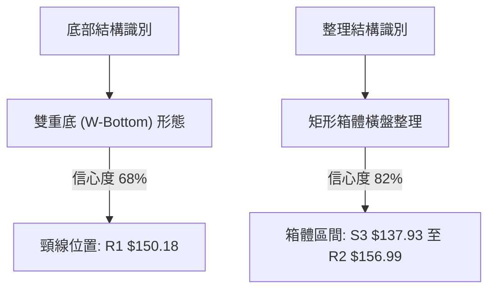

#### 形態信心度與目標價評估表

| 形態名稱 | 信心度 | 判斷依據（引用數據） | 完成度 | 目標價（附嚴格計算式） |
|----------|--------|----------------------|--------|------------------------|
| **雙重底 (W-Bottom)** | **68%** | 第一次低點 2026-08-23 週收盤 $136.21，第二次低點 2026-08-30 收盤 $137.09，雙底獲得 S3 ($137.93) 聚類支撐。 | 85% | 頸線 R1 $150.18 - 底點 S3 $137.93 = 形態高度 $12.25。<br>推算目標價 = 頸線 $150.18 + $12.25 = **$162.43**（剛好受壓於 MA240 $162.72）。 |
| **矩形箱體震盪** | **82%** | 自 2026-05 至今，股價多次在 $136.21–$137.93 獲得支撐，並在 $156.99–$163.52 承壓回落，區間震盪特徵極為明顯。 | 95% | 箱頂為阻力 R2 **$156.99**；箱底為支撐 S3 **$137.93**。箱體中軸位於 (156.99 + 137.93)/2 = **$147.46**（與現價吻合）。 |
| **均線死叉壓制形態** | **75%** | MA20 ($142.75) < MA50 ($148.85) < MA200 ($157.01)，標準空頭排列，中長期均線下傾。 | 100% | 壓制回測目標價為 MA20 **$142.75**，或支撐 S1 **$144.63**。 |

### 🕯️ 重要K線形態分析

| 週度 / 日期 | 收盤價 ($) | K線形態 / 特徵 | 技術解讀 | 訊號 |
|-------------|------------|----------------|----------|------|
| **2026-08-09** | $140.59 | 大陰殺跌線 (週量 3,490 萬) | 爆量下殺跌破箱體中軸，市場恐慌拋售，逼近 52 週低點 | 🔴 強空 |
| **2026-08-23** | $136.21 | 下影錘頭長針線 | 打出 52 週波段次低點後迅速收回，RSI 跌至 26.1 極度超賣 | 🟢 觸底 |
| **2026-08-30** | $137.09 | 雙針探底平底線 (Tweezers) | 二次確認 $136–$137 低點支撐有效，MACD 柱負值大幅收斂 | 🟢 止跌 |
| **2026-09-06** | $149.30 | 中陽包覆長紅線 (大漲 +8.9%) | 實體大陽線一舉收復 MA20，週線 MACD 金叉確立反彈 | 🟢 轉強 |
| **2026-09-13** | $148.38 | 高位吊人十字星 (受制 MA50) | 觸碰 R1 $150.18 及 MA50 $148.85 承壓，RSI 竄至 71.36 超買 | 🔴 滯漲 |

### 📉 ASCII 走勢形態示意圖

```
雙重底（W底）與矩形震盪形態示意圖：
$156.99 ┼ - - - - - - - - - - - - - - - - - - - - - - - - - 阻力 R2 / 箱體頂
        │         ▲(07-26: $163.38)
$150.18 ┼ - - - - ┼ - - - - - - - - - - - - ╭───● 現價 $148.38 (頸線 R1 / MA50)
        │        ╱ ╲                       ╱
$144.63 ┼───────╱───╲─────────────────────╱───── 支撐 S1 / MA10
        │      ╱     ╲                   ╱
$142.75 ┼─────╱───────╲─────────────────╱─────── 布林中軌 / MA20
        │    ╱         ╲               ╱
$137.93 ┼───╱───────────╲───●─────────╱───────── 雙底基線 (S3)
        │  ╱             ╲ (08-30: $137.09)
$136.21 ┼─● (08-23: $136.21)
        └────────────────────────────────────────
             底 1                底 2
```

### 🎯 形態目標價計算

根據日線與週線確立之**雙底形態 (W-Bottom)** 進行量化測算：
- **第一低點 (Bottom 1)**：2026-08-23 之低點 $136.21
- **第二低點 (Bottom 2)**：2026-08-30 之低點 $137.09
- **波段基線 (Baseline)**：取聚類支撐 S3 = **$137.93**
- **形態頸線 (Neckline)**：取聚類阻力 R1 = **$150.18**
- **形態垂直高度 ($H$)**：Neckline ($150.18) - Baseline ($137.93) = **$12.25**
- **形態突破目標價 1 (1.0x Height)**：
  $$\text{Target 1} = \text{Neckline} + H = 150.18 + 12.25 = \mathbf{\$162.43}$$
  *(註：此價位直接逼近 MA240 之 $162.72，高度共振)*
- **形態突破目標價 2 (斐波那契 61.8% 擴展)**：
  $$\text{Target 2} = \text{Neckline} + (H \times 1.618) = 150.18 + (12.25 \times 1.618) = \mathbf{\$170.00}$$
  *(註：此價位與波段阻力 R3 之 $168.93 極度貼近)*

---

## 4. 支撐與阻力

### 🗺️ 關鍵價位分布圖（Unicode）

```
╔══════════════════════════════════════════════════════════════════╗
║               VST 價位結構分布圖 (由 OHLCV 聚類計算)             ║
╠══════════════════════════════════════════════════════════════════╣
║ $168.93 ║████████████████████████████████║ 強阻力 R3 (波段頂部) ║
║ $165.49 ║▒▒▒▒▒▒▒▒▒▒▒▒▒▒▒▒▒▒▒▒▒▒▒▒▒▒▒▒    ║ 斐波那契 61.8% 回調位║
║ $156.99 ║████████████████████████        ║ 阻力 R2 (MA200 壓制帶)║
║ $153.12 ║░░░░░░░░░░░░░░░░░░░░░░          ║ 布林通道上軌壓制     ║
║ $150.97 ║▒▒▒▒▒▒▒▒▒▒▒▒▒▒▒▒▒▒▒▒▒▒          ║ 斐波那契 78.6% 回調位║
║ $150.18 ║████████████████████████████████║ 關鍵頸線阻力 R1      ║
║ $148.85 ║▓▓▓▓▓▓▓▓▓▓▓▓▓▓▓▓▓▓▓▓▓▓▓▓▓▓      ║ 中期均線 MA50 壓制   ║
║ $148.38 ╠════════════════════════════════╣ ◄ 當前收盤價         ║
║ $144.63 ║▓▓▓▓▓▓▓▓▓▓▓▓▓▓▓▓▓▓▓▓▓▓▓▓        ║ 近期第一支撐 S1      ║
║ $142.75 ║▒▒▒▒▒▒▒▒▒▒▒▒▒▒▒▒▒▒              ║ 布林中軌 / MA20 支撐 ║
║ $142.14 ║████████████████████████████████║ 強支撐 S2 (波段平台) ║
║ $137.93 ║████████████████████████████████║ 核心防守支撐 S3      ║
║ $132.47 ║████████████████████████████████║ 52週歷史低點 (100.0%)║
╚══════════════════════════════════════════════════════════════════╝
```

### 🚧 阻力位分析表

| 阻力級別 | 精確價位 | 距現價幅幅 | 形成原因與技術共振 | 突破難度 | 重要性權重 |
|----------|----------|------------|--------------------|----------|------------|
| **R1** | **$150.18** | +1.21% | 近一年多次波段反彈高點聚類，疊加 MA50 ($148.85) 與斐波 78.6% ($150.97) 重疊密集成交帶。 | 🟡 中等 | ★★★★☆ |
| **R2** | **$156.99** | +5.80% | 2026 年 Q2 多次衝高受阻點，極度接近長期年線 MA200 ($157.01) 及 05 月震盪平台。 | 🔴 極高 | ★★★★★ |
| **R3** | **$168.93** | +13.85% | 2026 年 Q1 波段大頂與頭肩頂頸線，斐波那契 61.8% ($165.49) 上方之強大多頭停損盤堆積區。 | 🔴 極高 | ★★★★☆ |

### 🛡️ 支撐位分析表

| 支撐級別 | 精確價位 | 距現價跌幅 | 形成原因與技術共振 | 守住機率 | 重要性權重 |
|----------|----------|------------|--------------------|----------|------------|
| **S1** | **$144.63** | -2.53% | 近期波段回踩低點聚類，亦為 10 日均線 MA10 ($144.78) 所在處，短線多頭第一防線。 | 🟢 70% | ★★★☆☆ |
| **S2** | **$142.14** | -4.20% | 近一年密集換手區低點聚類，與當前 20 日均線 MA20 ($142.75) 及布林中軌形成重疊共振支撐。 | 🟢 80% | ★★★★☆ |
| **S3** | **$137.93** | -7.04% | 2026 年 8 月雙底打底平台（08-23 週收 $136.21 與 08-30 收 $137.09 之頸線位），跌破則宣告反彈徹底瓦解。 | 🟢 90% | ★★★★★ |

### 📐 斐波那契回調位分析

依據 52 週極值區間（低點 **$132.47** → 高點 **$218.91**，落差 **$86.44**）精確計算回調梯度：

| 斐波那契比例 | 精確計算價位 | 空間距離關係 | 技術含義與當前狀態解讀 |
|--------------|--------------|--------------|------------------------|
| **0.0%** (52W High) | **$218.91** | +47.53% | 歷史大牛市頂部，超長線終極解套壓力區 |
| **23.6%** | **$198.51** | +33.78% | 強勢多頭防守位，失守後宣告中長期趨勢轉弱 |
| **38.2%** | **$185.89** | +25.28% | 牛市回撤健康位，現已轉化為沉重的長線解套套牢區 |
| **50.0%** | **$175.69** | +18.41% | 熊市反彈多空平衡點，接近 2026 年 2 月次高點 ($173.41) |
| **61.8%** | **$165.49** | +11.53% | **黃金分割關鍵分水嶺**，向上突破方能逆轉中長期空頭排列 |
| **78.6%** | **$150.97** | +1.75% | **極深回調防禦位**。現價 $148.38 剛好承壓於此線下方（差距僅 $2.59），是多頭反彈最直接的量化阻力卡點 |
| **100.0%** (52W Low) | **$132.47** | -10.72% | 52 週最低支撐，強大的長期價值底層護城河 |

> **回調位定錨解讀**：現價 **$148.38** 正好夾在 **78.6% 回調位 ($150.97)** 與 **100.0% 低點 ($132.47)** 之間。此位置意味著過去一年的漲幅已被侵蝕掉近八成，股價處於深度價值修復區；唯有日線收盤強勢站穩 $150.97 之上，方能確認脫離底部危險區，並打開通往 61.8% ($165.49) 的反彈空間。

---

## 5. 技術指標深度解讀

### 🎛️ 指標訊號總覽

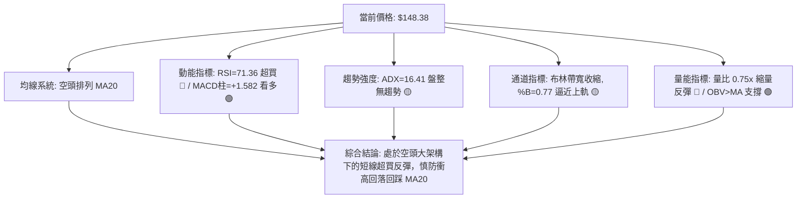

### 📈 移動平均線排列分析

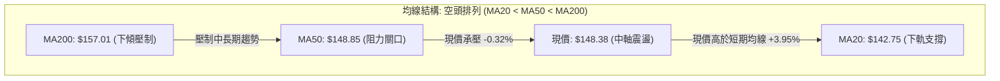

#### 均線各週期狀態深度解析

| 均線名稱 | 當前價位 | 距現價差距 | 斜率方向 | 歷史微觀形態與技術含義 |
|----------|----------|------------|----------|------------------------|
| **MA5** | **$149.51** | -0.76% | ▼ 下彎 | 短線衝高受阻，短線節奏由急速上攻轉為橫盤整理 |
| **MA10** | **$144.78** | +2.49% | ▲ 上翹 | 短線支撐底座快速墊高，提供短線第一道動態回踩防線 |
| **MA20** | **$142.75** | +3.95% | ▲ 翻揚 | 20日扣抵低位帶動斜率轉正，確認脫離 8 月探底陰霾 |
| **MA50** | **$148.85** | -0.32% | ▼ 走平 | 季度持倉成本線，空頭排列關鍵節點，目前多空在此激烈爭奪 |
| **MA60** | **$151.05** | -1.77% | ▼ 下傾 | 疊加阻力 R1 ($150.18)，構成強大的雙重籌碼解套封鎖線 |
| **MA120** | **$152.19** | -2.50% | ▼ 下傾 | 半年線持續下壓，抑制中期估值修復速度 |
| **MA200** | **$157.01** | -5.50% | ▼ 走平 | **牛熊生命線**，未收復前，任何反彈均定義為技術性抽頭 |
| **MA240** | **$162.72** | -8.81% | ▼ 下傾 | 歷史套牢主力區，亦為 W 底測算高度目標 ($162.43) 之終點 |

### 📉 RSI(14) 分析

- **當前 RSI(14) 讀數**：`71.36`
- **動能評估進度條**：
  `[0] ░░░░░░░░░░░░░░░░░░░░░░░░░░░░░░░░░░░░░░░░░░░░░░░░░░ [50] █████████████████████░░░░░░░░ [100]` *(71.36% — 進入紅色超買警戒區)*
- **超買超賣區間判定**：
  - 一般強勢市場超買閾值為 70，極端強勢為 80。在 ADX 僅 16.41 的盤整市場中，RSI 突破 70 往往意味著**多頭情緒在短期內過度透支**。
  - 對比近 20 週數據，前次 RSI 超過 63（2026-06-28 的 63.9）後，隨後數週價格自 $163.49 連續回撤至 $148.19。
- **背離分析（Divergence）**：
  - **日線背離判定**：**無背離**。當前價格高點伴隨 RSI 創出近期新高（從 8 月底的 26.1 驟升至 71.36），為動能與價格同向擴張。
  - **週線隱性背離**：週線級別價格在 2026-06 達 $163.52 時 RSI 為 53.3，當前價格 $148.38 週 RSI 卻高達 71.4，呈現「動能過熱但價格未創新高」之週線級別熊性背離隱憂。

### 📊 MACD(12/26/9) 訊號解讀

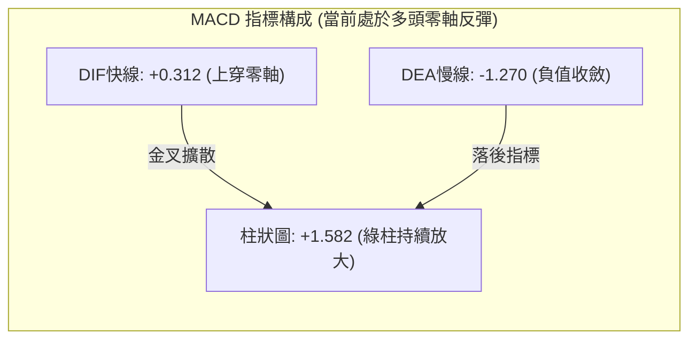

- **DIFF 與 DEA 關係**：快線 DIFF (+0.312) 於負值區形成黃金交叉後強勢穿越零軸，慢線 DEA (-1.270) 仍位於零軸下方但開口收斂，確認中短期底部翻多訊號。
- **柱狀圖 (Histogram)**：讀數為 **+1.582**，連續 3 週呈現正向擴張（-0.077 → +1.366 → +1.582），表明反彈動能尚未衰竭，是當前盤面最強的多頭技術屏障。

### 📦 布林通道分析

```
VST 日線布林通道結構示意圖 (帶寬帶值與現價位置)：
$153.12 ┼────────────────────────────── BB 上軌 (阻力帶)
        │
        │                  ▲ 現價 $148.38 (%B = 0.77)
$148.38 ┼ - - - - - - - - -● - - - - - - - - - - - - - -
        │
$142.75 ┼────────────────────────────── BB 中軌 (MA20 強支撐)
        │
        │
$132.37 ┼────────────────────────────── BB 下軌 (極限支撐)
        └──────────────────────────────
```

- **布林通道帶寬 (Bandwidth)**：(153.12 - 132.37) / 142.75 = **14.53%**，處於過去半年的中低收縮水平，暗示即將迎來方向性變盤。
- **%B 位置**：當前數值為 **0.77**。大於 0.5 且位於 0.8 附近，顯示股價正在強勢測試上軌阻力帶 ($153.12)。在 ADX < 20 的無趨勢行情中，%B 接近 0.8–1.0 通常為高拋指針，而非向上突破買點。

### 💹 成交量分析（量價配合度）

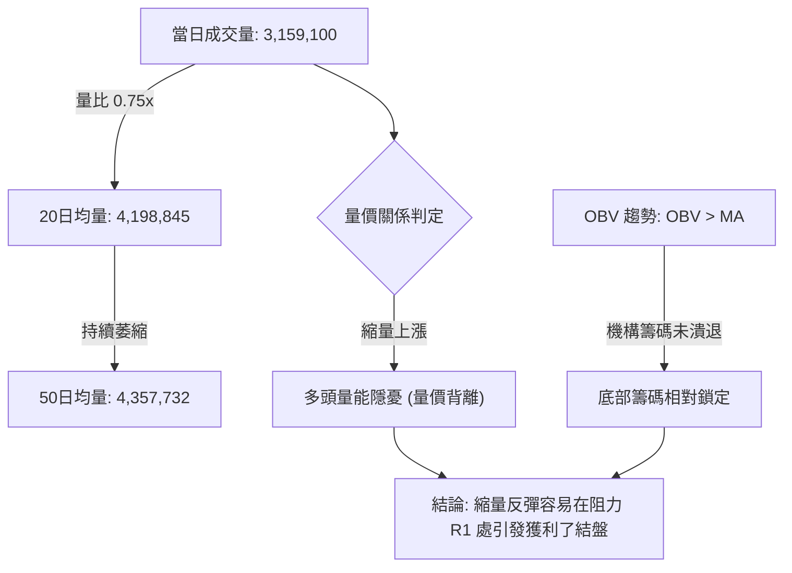

- **量比與均量對比**：最新成交量僅 315.9 萬股，較 20 日均量 (419.8 萬股) 萎縮 25%（量比 0.75x），呈現典型的「縮量攻堅」格局。
- **OBV (能量潮)**：OBV 線仍維持在均線之上，這說明雖然場外增量資金追高意願不足，但 8 月在 $136–$137 抄底的籌碼並未出現恐慌出逃，籌碼鎖定度良好。
- **量價背離結論**：無量推升導致指標 RSI 迅速進入 70 超買區，若未來 3 個交易日內無法補量至 450 萬股以上，股價極易在 R1 ($150.18) 遭遇空頭阻擊。

---

## 6. 動能與波動率

### ⚡ 動能評估四象限

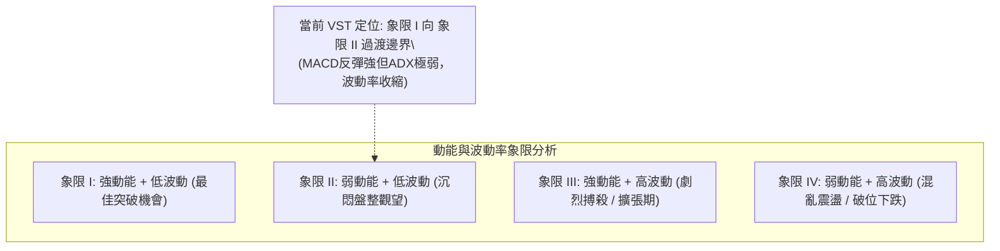

#### 動能與波動四象限定位說明表

| 象限 | 動能維度 (Momentum) | 波動維度 (Volatility) | 當前狀態判定 | 交易決策應對策略 |
|------|---------------------|-----------------------|--------------|------------------|
| **Q1** | 強 (MACD柱>0) | 低 (ATR收縮) | 邊緣過渡 | 適合左側埋伏，等待突破放量 |
| **Q2** | **弱 (ADX=16.41)** | **低 (ATR 3.06%)** | **✓ 主體狀態** | **箱體區間高拋低吸，嚴格控制倉位** |
| **Q3** | 強 (+DI主導) | 高 (Beta=1.41) | 局部具備 | 當突破 R1 後將迅速切入此象限 |
| **Q4** | 弱 (-DI減弱) | 高 (歷史回撤期) | 遠離排除 | 8 月份探底時處於此象限，現已解除 |

### 📊 ATR 波動率分析

- **ATR(14) 數值**：**$4.54**
- **波動率佔比**：4.54 / 148.38 = **3.06%**（屬於中等常規波動率水準）。
- **止損與風控設置指引**：
  - **日內交易噪聲過濾（1.0x ATR）**：$4.54，日內正常波動區間為 $143.84 – $152.92。
  - **波段保護止損距離（1.5x ATR）**：$4.54 × 1.5 = **$6.81**。
  - **保守趨勢止損距離（2.0x ATR）**：$4.54 × 2.0 = **$9.08**。
  - **技術應用**：若以現價進場，合理防守點應設在現價減去 1.5x ATR 之位置（即 $148.38 - $6.81 = **$141.57**），該價位剛好落在強支撐 S2 ($142.14) 與 MA20 ($142.75) 之下方，具備極佳的結構保護效果。

### 📐 Beta 與市場相關性

- **Beta 係數**：**1.414**
- **市場特徵解析**：
  - VST 作為獨立發電商（IPP），同時受電力公用事業防禦屬性與 AI 數據中心用電高成長預期驅動，Beta 達 1.414，顯示其波動彈性顯著高於標普 500 指數（高出 41.4%）。
  - 在大盤上漲或風險偏好回暖時，VST 反彈動能將顯著放大；但當大盤承壓或電力板塊回調時，其下行速度亦將快於傳統防禦型公用事業股（如 NEE、DUK）。
- **放空與對沖係數**：若持有相應現貨組合，需配置 1.41 倍的指數空頭工具進行 Beta 完全對沖。

---

## 7. 多時框架總結

### 📋 時框架評分表

| 時框架 | 趨勢方向 | 動能狀態 | 均線排列 | 形態特徵 | 綜合評分 | 戰術建議 |
|--------|----------|----------|----------|----------|----------|----------|
| **月線 (長期)** | 🔴 偏空回撤 | 🟡 中性走平 | 🟡 測試長期MA | 自 $207 高點大幅回撤中 | **42/100** | 逢高減持，長線定投底倉需控制 |
| **週線 (中期)** | 🟡 箱體震盪 | 🟢 MACD金叉 | 🔴 空頭壓制 | 寬幅矩形箱體打底 | **54/100** | 箱體下沿低吸，箱體上沿高拋 |
| **日線 (短期)** | 🟢 超跌反彈 | 🔴 RSI超買 | 🟡 收復MA20 | 觸碰 MA50 / 雙底未過頸線 | **48/100** | 短線勿追高，等待回踩 S1 接回 |

### 🔲 綜合訊號矩陣

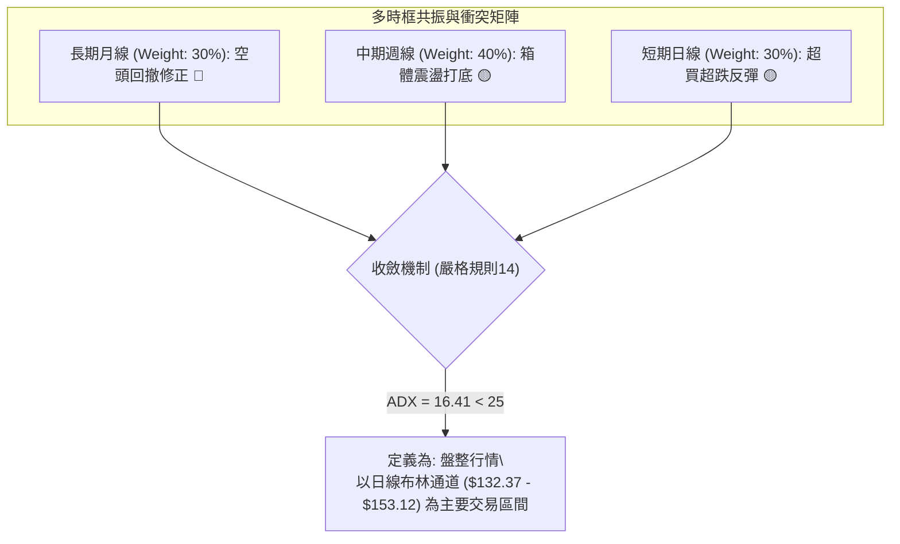

### ⚖️ 多時框收斂結論

依據本報告**嚴格要求 14 之多時框收斂規則**執行客觀裁決：
1. **行情類型定性**：當前日線與週線 **ADX(14) 數值為 16.41**，明確低於趨勢門檻 25，判定市場處於典型的**「盤整行情」**，而非單邊趨勢行情。
2. **主導時框與交易區間**：在盤整行情中，中長期均線的單邊指引效力鈍化，交易邏輯應完全收斂至**「日線布林通道與結構箱體上下軌」**。當前布林上軌為 **$153.12**，下軌為 **$132.37**，中軌為 **$142.75**。
3. **方向性最終唯一結論**：**【中性觀望，偏向高拋低吸】**。
   日線層面雖然有 MACD 綠柱放大及收復 MA20 的短多訊號，但 RSI 竄至 71.36 觸發嚴重超買，且現價 $148.38 緊貼 MA50 ($148.85) 與頸線 R1 ($150.18) 雙重死穴。在此位置盲目追多勝率極低；必須等待價格向上突破 R1 確認牛熊轉換，或回踩 MA20/S1 確認支撐有效後，方為理性切入點。此結論直接貫徹至第 8 章交易策略。

---

## 8. 交易策略建議

### 🗺️ 策略決策流程圖

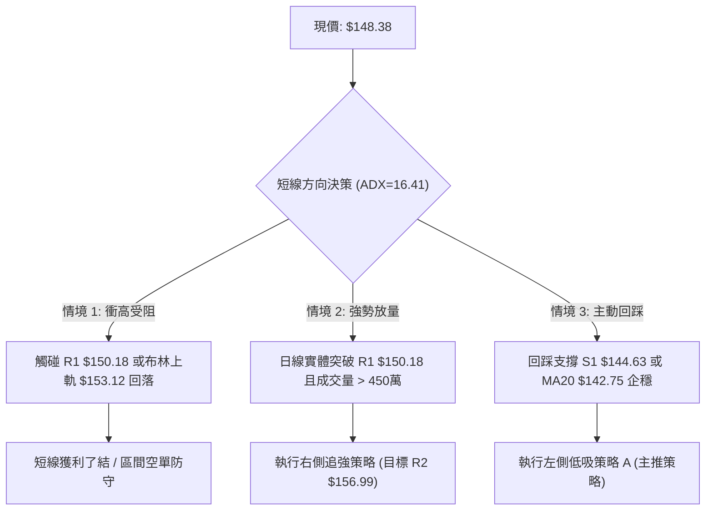

### 🧭 策略路由（依評分卡分流）

> **當前主策略方向 = 【中性區間操作 / 等待回踩低吸】（依第 1 章技術評分卡：46.5 / 100）**
> 
> 評分落在 40–60 分的中性震盪區間。依規定，嚴禁在 $148.38 阻力位前盲目追多，亦不可在 MACD 柱狀體放大的背景下直接逆勢做空。策略核心定位為：**以布林通道與核心支撐 S1/S2 為基準的「區間低吸高拋策略」**，並明確等待回踩確認或突破確認。

### 🎯 價格情境階梯（Price Scenarios）

| 觸發條件（精確引用價位） | 下一目標價 | 後續延伸目標 | 情境技術含義 |
|--------------------------|------------|--------------|--------------|
| **向上放量突破 R1 $150.18** | **R2 $156.99** | **R3 $168.93** | 雙底結構正式成立，逆轉中期空頭均線壓制 |
| **受阻於 R1 回踩 S1 $144.63** | **S2 $142.14** | **BB中軌 $142.75** | 健康的超買回踩修復，構築右肩回踩買點 |
| **有效跌破 S2 $142.14** | **S3 $137.93** | **52W低 $132.47** | 雙底反彈徹底破局，重新回歸長期弱勢探底 |

### 📊 情境機率分佈

| 運行情境 | 機率預估 | 主要技術指標依據 |
|----------|----------|------------------|
| **情境 A：受阻回踩後震盪反彈 (震盪向上)** | **50%** | RSI(71.36) 需技術回踩，但 MACD 綠柱與 +DI 支撐逢低買盤 |
| **情境 B：維持在 S1–R1 窄幅橫盤 (區間震盪)** | **35%** | ADX 僅 16.41 弱勢無方向，成交量萎縮至 0.75x 缺乏推力 |
| **情境 C：直接破位深跌再探底 (空頭反撲)** | **15%** | 空頭均線壓制依然強大，若遇大盤系統性風險則直接破位 |

### 🟢 主策略詳情（方向：區間操作與回踩做多）

所有關鍵價位均嚴格定錨於本報告第 4 章之數據。

| 策略要素 | 策略 A（保守型：回踩 MA20/S1 低吸） | 策略 B（激進型：突破 R1 右側追強） |
|----------|-------------------------------------|-----------------------------------|
| **交易類型** | 左側順勢低吸（防守型） | 右側動能突破（進攻型） |
| **進場條件** | 價格回踩 S1 獲得支撐，日線收下影線 | 日線實體收盤價明確站穩 R1 之上，成交量放量 |
| **精確進場價格** | **$144.63** (支撐 S1 處) | **$150.50** (確認突破 R1 $150.18 後) |
| **目標價 T1** | **$150.18** (阻力 R1 / 斐波 78.6%) | **$156.99** (阻力 R2 / MA200 壓制帶) |
| **目標價 T2** | **$156.99** (阻力 R2 / 年線位置) | **$162.43** (雙底形態完整高度目標價) |
| **精確止損價格** | **$141.50** (跌破 S2 $142.14 與 MA20) | **$147.20** (假突破跌回 MA50 $148.85 之下) |
| **止損空間 ($)** | $3.13 (-2.16%) | $3.30 (-2.19%) |
| **第一盈虧比 (T1)** | **1.77 : 1** (獲利 $5.55 / 風險 $3.13) | **1.97 : 1** (獲利 $6.49 / 風險 $3.30) |
| **第二盈虧比 (T2)** | **3.95 : 1** (獲利 $12.36 / 風險 $3.13) | **3.62 : 1** (獲利 $11.93 / 風險 $3.30) |
| **成功機率估計** | **65%** | **55%** |
| **建議配置倉位** | **15% - 20%** (標準波段倉位) | **10%** (輕倉試單追突破) |

### 🔴 反向風險觸發點（對沖與止損提示）

若出現以下訊號，主推之偏多震盪策略將被徹底推翻，必須立即切換為避險或對沖模式：
1. **價位擊穿**：日線實體收盤價跌破 **$142.14 (支撐 S2)**，意味著股價跌回布林中軌之下，均線支撐全面破裂。
2. **指標轉弱**：日線 MACD 柱狀體再度由正轉負（跌破 0 軸），且 RSI 跌破 50 中軸線。
3. **對沖操作線**：持有現貨投資者，若盤中跌穿 **$142.14**，應使用空頭工具（或拋售 50% 倉位）進行對沖，下方第一回補目標鎖定 S3 **$137.93**，極限防守為 52 週低點 **$132.47**。

### ⭐ 整體訊號強度評星

```
╔══════════════════════════════════════════════════╗
║ 做多訊號強度：  ★★★☆☆  (3.0 / 5星 — 短線受阻超買)║
║ 做空訊號強度：  ★★☆☆☆  (2.0 / 5星 — MACD強烈抵抗) ║
║ 趨勢明確程度：  ★☆☆☆☆  (1.5 / 5星 — ADX極低無趨勢)║
║ 整體交易可信度：★★★☆☆  (3.0 / 5星 — 箱體高低切換) ║
╚══════════════════════════════════════════════════╝
```

---

## 9. 風險提示與監控

### ✅ 關鍵監控指標 Checklist

```
╔══════════════════════════════════════════════════════════════════╗
║               VST 交易員每日關鍵監控 Checklist                  ║
╠══════════════════════════════════════════════════════════════════╣
║ [ ] 監控 MA50 阻力攻防：收盤價是否成功突破 $148.85 / $150.18    ║
║ [ ] 監控 RSI 超買降溫：RSI(14) 能否在回調至 55-60 區間獲得支撐  ║
║ [ ] 監控成交量補量：向上突破時日成交量是否放大至 4,200,000 以上  ║
║ [ ] 監控防守下限：S1 ($144.63) 與 MA20 ($142.75) 是否形成有效支撐║
║ [ ] 監控布林軌跡：價格觸碰布林上軌 $153.12 後的量價滯漲反應     ║
║ [ ] 監控 MACD 柱狀體：柱狀體是否在 +1.582 以上持續增長而非衰竭  ║
╚══════════════════════════════════════════════════════════════════╝
```

### ⚠️ 風險場景分析

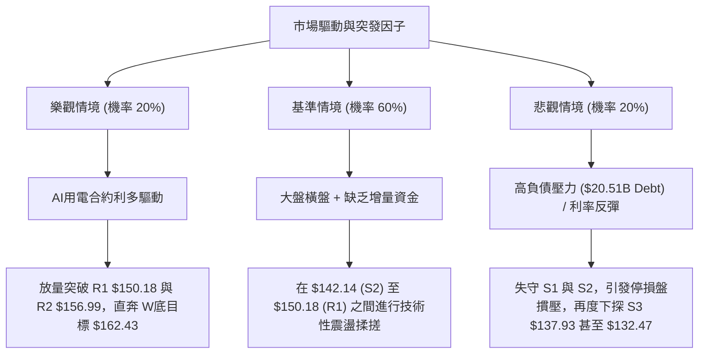

### 🛡️ 風險管理重要提醒

1. **財務槓桿與基本面風險共振**：
   - 技術面雖有反彈要求，但基本面數據顯示公司總負債高達 **$20.51B**，淨負債 **$-20.07B**，負債淨值比（Debt/Equity）高達 **373.28**，流動比率僅 **0.973**。高財務槓桿使得該標的對利率預期極為敏感。
   - 若宏觀利率預期上升，該股 Beta (1.414) 將加速向下放大，任何技術破位（如跌穿 $142.14）均可能引發踩踏，切忌在無止損保護下盲目扛單。
2. **短線超買技術回調風險**：
   - 日線 RSI(14) 達 **71.36**，在弱趨勢市場 (ADX=16.41) 中，超買訊號具有高度殺傷力。此時追高進場極易買在短線波段高點。
3. **倉位與資金控管嚴格規範**：
   - 總倉位嚴格限制在總投資組合資金的 **15%** 以內。
   - 單筆交易的最大本金虧損額度必須嚴格鎖定在總資金的 **1.0%** 範圍內（依 ATR $4.54 計算止損點位）。

---

## 📋 報告總結

```
╔══════════════════════════════════════════════════════════════════════════════════════╗
║                           VST 技術分析報告總結                                       ║
╠══════════════════════════════════════════════════════════════════════════════════════╣
║ 報告日期：2026-09-12 ｜ 當前價格：$148.38 ｜ 分析評級：46.5分 🟡 (中性觀望等待回踩) ║
╠══════════════════════════════════════════════════════════════════════════════════════╣
║ 核心結論精要：                                                                       ║
║ ├─ 長期趨勢：🔴 空頭排列 (MA20 < MA50 < MA200，年線下壓至 $157.01)                  ║
║ ├─ 中期趨勢：🟡 箱體築底 (於 $137.93 - $156.99 區間建構 W底雙重底形態)              ║
║ ├─ 短期趨勢：🟢 超跌反彈但受阻 (收復MA20，但RSI達71.36超買，受制MA50 $148.85)       ║
║ ├─ 關鍵支撐：S1: $144.63 ｜ S2: $142.14 (MA20) ｜ S3: $137.93 (底層防守)            ║
║ ├─ 關鍵阻力：R1: $150.18 (頸線) ｜ R2: $156.99 (MA200) ｜ R3: $168.93 (波段頂部)    ║
║ └─ 分析師目標：平均 $217.42 (共識評級 Strong Buy，長期看好 AI 與獨立發電容量)        ║
╠══════════════════════════════════════════════════════════════════════════════════════╣
║ 最優戰術操作組合：                                                                   ║
║ 1. 🥇 最佳機會 (首選)：耐心等待股價回踩支撐 S1 ($144.63) 企穩後低吸進場，            ║
║    止損設於 S2 破位點 $141.50，目標直指 R1 ($150.18) 及 R2 ($156.99)。              ║
║ 2. 🥈 次選機會 (右側)：若盤中強勢放量突破頸線 R1 ($150.18)，收盤站穩 $150.50，       ║
║    輕倉順勢追入，止損設於 $147.20，目標鎖定雙底量化目標 $162.43。                   ║
║ 3. 🥉 保守選擇 (觀望)：當前價格 $148.38 處於盈虧比尷尬區，持幣者暫不開倉，           ║
║    等待日線 RSI 回落至 55–60 區間且 ADX 抬頭後，再行順勢布局。                      ║
╚══════════════════════════════════════════════════════════════════════════════════════╝
```

---

> ⚠️ **免責聲明**：本報告為依據客觀量化數據與技術分析模型生成之研究報告，報告內所有關鍵價位與指標均基於歷史數據推算。本報告**僅供學術交流與投資研究參考**，**不構成任何形式的個人化投資建議或要約**。證券交易具有高度虧損風險，投資人應依個人財務狀況與風險承受能力獨立做出決策，並自負盈虧。

---

*報告生成時間：2026-09-12 ｜ 數據來源：Yahoo Finance ｜ 分析框架：多時框技術量化收斂體系*