# VST 技術分析報告

> **報告日期**：2026-09-13 ｜ **語言**：繁體中文 ｜ **數據來源**：Yahoo Finance ｜ **當前價格**：$148.38

---

## 目錄

| 章節 | 內容 |
|------|------|
| [1. 技術面概覽](#1-技術面概覽) | 訊號儀表板、核心指標、評分卡 |
| [2. 趨勢分析](#2-趨勢分析) | 多時框趨勢、長中短期走勢、ADX解讀 |
| [3. 圖表形態分析](#3-圖表形態分析) | 形態識別、K線組合、形態目標價 |
| [4. 支撐與阻力](#4-支撐與阻力) | 關鍵價位、斐波那契回調、結構圖 |
| [5. 技術指標深度解讀](#5-技術指標深度解讀) | 均線系統、RSI、MACD、布林通道、OBV |
| [6. 動能與波動率](#6-動能與波動率) | 動能四象限、ATR風控、Beta相關性 |
| [7. 多時框架總結](#7-多時框架總結) | 評分矩陣、多時框收斂、唯一方向裁決 |
| [8. 交易策略建議](#8-交易策略建議) | 策略路由、情境階梯、主策略詳情 |
| [9. 風險提示與監控](#9-風險提示與監控) | 監控清單、三情境路徑、風控規則 |
| [📋 報告總結](#-報告總結) | 終審卡片、核心結論與最優組合 |

---

## 1. 技術面概覽

### 🎯 技術訊號儀表板

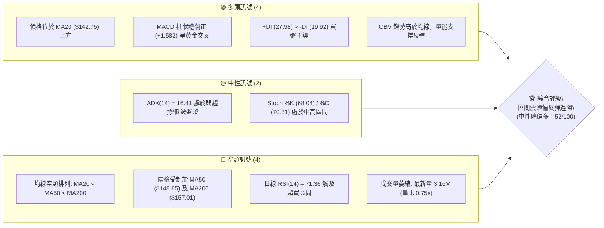

### 📊 核心指標速覽表

| 指標類別 | 指標名稱 | 當前數值 | 訊號 | 解讀 |
|----------|----------|----------|------|------|
| **價格** | 當前價格 | $148.38 | 🟡 | 位於52週區間($132.47–$218.91)的18.4%低位，自低點反彈 |
| **均線** | MA20 | $142.75 | 🟢 | 價格在MA20上方+3.95%，短期底層動能支撐確立 |
| **均線** | MA50 | $148.85 | 🔴 | 價格在MA50下方-0.32%，面臨中期趨勢線即時反壓 |
| **均線** | MA200 | $157.01 | 🔴 | 價格在MA200下方-5.50%，長期生命線構成重壓 |
| **動能** | RSI(14) | 71.36 | 🔴 | 進入超買門檻（>70），短線追價風險偏高，防獲利了結 |
| **動能** | MACD (12,26,9) | 0.312 / -1.270 | 🟢 | DIF穿越DEA，柱狀圖+1.582，多頭動能快速修復 |
| **趨勢** | ADX (14) | 16.41 | 🟡 | 數值小於25，代表大級別處於無趨勢或盤整築底走勢 |
| **通道** | 布林通道 %B | 0.77 | 🟡 | 逼近上軌 $153.12，上行空間壓縮於通道頂部 |
| **波動** | ATR(14) | $4.54 | 🟡 | 佔股價3.06%，日常波動中等，適合區間防守定界 |
| **量能** | 當日成交量 | 3,159,100 | 🔴 | 較20日均量(4.20M)萎縮24.8%（量比0.75x），無攻擊量 |

### 🏆 技術評分卡

```
╔══════════════════════════════════════════════════════════════╗
║              技術評分卡 — VST (2026-09-13)                   ║
╠══════════════════════════════════════════════════════════════╣
║ 趨勢強度      ██████░░░░░░░░░░░░░░  32/100  🔴 弱勢空頭格局  ║
║ 動能指標      ██████████████░░░░░░  70/100  🟢 短期強勁修復  ║
║ 支撐穩定度    ████████████░░░░░░░░  60/100  🟡 S1/S2支撐漸穩 ║
║ 成交量配合    ████████░░░░░░░░░░░░  42/100  🔴 量價出現背離  ║
║ 形態完整度    ██████████░░░░░░░░░░  52/100  🟡 潛在雙底反彈  ║
║ 均線排列      ██████░░░░░░░░░░░░░░  30/100  🔴 均線空頭排列  ║
╠══════════════════════════════════════════════════════════════╣
║ 綜合評分      ██████████░░░░░░░░░░  52/100  中性區間觀望     ║
╚══════════════════════════════════════════════════════════════╝
```

---

## 2. 趨勢分析

### 🌐 多時框趨勢分析

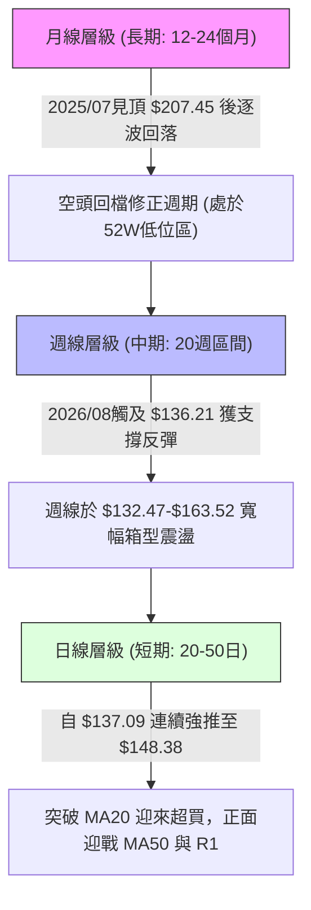

### 📈 長期趨勢 — 12個月走勢圖（Unicode）

```
VST 月線收盤價走勢圖（2025-10 至 2026-09）
價格軸 ($)
$190 ┤● 187.52
$180 ┤    ● 178.12
$170 ┤                 ● 173.41
$160 ┤         ● 160.88     ● 160.01  ● 158.63
$150 ┤             ● 157.91     ● 150.12  ● 157.62  ● 148.38(現價)
$140 ┤                                              ● 148.19
$130 ┤                                                  ● 137.37 (波段低)
     └────────────────────────────────────────────────────────────
      10  11   12   01   02   03   04   05   06   07   08   09 (月份)
```

#### 走勢特徵分析表格

| 階段區間 | 月份範疇 | 價格區間 ($) | 漲跌幅 (%) | 階段技術特徵 |
|----------|----------|--------------|------------|--------------|
| 高位派發期 | 2025/10–2025/12 | 187.52 → 160.88 | -14.21% | 自歷史頂峰207.45回落，形成長黑下殺，跌破多頭防線 |
| 弱勢抽腳期 | 2026/01–2026/02 | 157.91 → 173.41 | +9.82% | 跌深反抽測試170上方套牢區，反彈無量隨即夭折 |
| 箱型下飄期 | 2026/03–2026/06 | 150.12 → 158.63 | +5.67% | 於150–160窄幅震盪，均線持續下壓走平，動能停滯 |
| 二度破底期 | 2026/07–2026/08 | 158.63 → 137.37 | -13.40% | 破位下殺逼近52週最低點 $132.47，空方動能宣洩 |
| 築底反彈期 | 2026/09 (至今) | 137.37 → 148.38 | +8.01% | 觸及S3支撐後強烈收復失土，站上MA20，測試MA50 |

### 📊 中期趨勢（週線分析）

```
VST 近20週核心價格通道與高低點分佈示意圖
$165.00 ┼──────────────────●──────●──────────●────── (壓力區間：06/21 $163.52, 07/26 $163.38)
$160.00 ┼─────────●─────────────────────────────────
$155.00 ┼─●──────────────────────────●───────────
$150.00 ┼───●───────────●───────────────────●─●── (現價 $148.38 / R1 $150.18)
$145.00 ┼───────────────────────●───────────────────
$140.00 ┼─────●─────────────────────────●───────── (中繼支撐區間)
$135.00 ┼───────────────────────────────────●─●───── (雙底低點：08/23 $136.21, 08/30 $137.09)
        └───────────────────────────────────────────
         W1  W2  W4  W6  W8 W10 W12 W14 W16 W18 W20
```

週線層級清晰顯示，VST 自 2026 年 5 月以來並未形成單邊趨勢，而是受制於 $136.21 至 $163.52 之間的寬幅箱型震盪。8 月下旬連續兩週於 $136–$137 獲得承接，週線 RSI 跌至 26.1 極端值後反彈，展現強大週期性護盤買盤。

### ⚡ 趨勢強度評估（ADX 解讀）

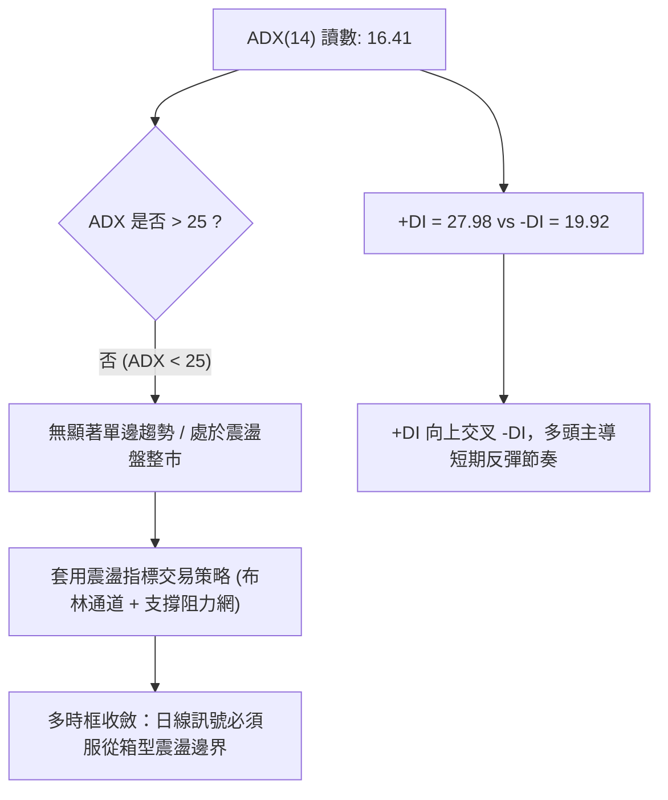

#### ADX 強度對照表

| 指標變數 | 當前讀數 | 標準閾值區間 | 趨勢屬性與實戰含義 |
|----------|----------|--------------|--------------------|
| **ADX(14)** | **16.41** | 0 – 20: 趨勢極弱或無趨勢 | 市場處於無方向整理，均線指引度下降，嚴禁追高殺跌 |
| **+DI** | **27.98** | > 25: 多方具有攻擊力 | 買盤佔據局部優勢，由8月底低位發起之多頭波段延續中 |
| **-DI** | **19.92** | < 20: 空方動能趨弱 | 8月中旬的強烈殺盤動能暫時消退，空方暫退防守 |
| **方向差距** | **+8.06** | +DI領先幅度中等 | 買方主控但尚未跨過25趨勢線，屬於「反彈格局而非單邊牛市」 |

---

## 3. 圖表形態分析

### 🔍 形態識別系統

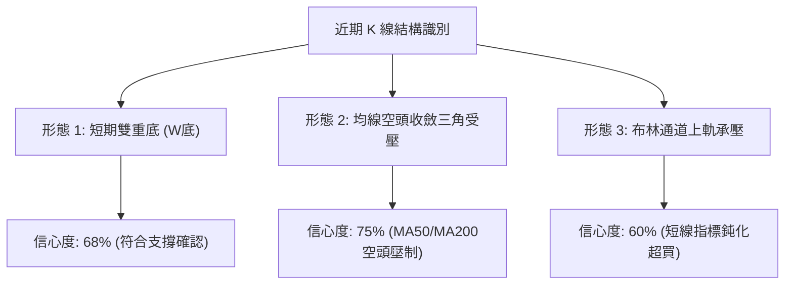

#### 圖表形態信心度與目標計算表

| 形態類別 | 信心度 | 判斷依據（嚴格引用數據） | 完成度 | 目標價（附嚴格計算式） |
|----------|--------|--------------------------|--------|------------------------|
| **短期雙底 (W-Bottom)** | **68%** | 8/23低點 $136.21 與 8/30收盤 $137.09 築雙底，現價突破短頸線 $142.14(S2) | 75% | 頸線 $142.14 + (頸線 $142.14 - 低點 $136.21 = $5.93) = **$148.07**（已達標，下一推算為頸線S1 $144.63 + $8.42 = **$153.05**，接近R2 $156.99之防守區） |
| **箱型頂底震盪** | **82%** | 近20週高點兩度止於 $163.52，低點止於 $136.21，ADX=16.41確認箱型 | 80% | 箱型底部 $136.21 向上反彈，標準目標為箱型中軸 **$149.87**（接近R1 $150.18），次級目標為箱頂 **$163.52** |
| **頭肩頂形態** | **<40%** | **數據不足**，右肩結構破碎，僅做指標型解讀，不予以採納 | 0% | 訊號不足，依規則不強行繪製無效形態 |

### 🕯️ 重要K線形態分析

| 月份/日期 | 收盤價 | K線組合與形態 | 深度解讀 | 訊號 |
|-----------|--------|---------------|----------|------|
| **2026-07** | $148.19 | 中黑破位K線 | 跌破前月低點，帶量下殺，MACD週線轉負，確認長期弱勢整理 | 🔴 |
| **2026-08** | $137.37 | 下影長黑K線 | 盤中下探52W低點 $132.47 附近，收盤拉回 $137.37，爆出極端賣壓 | 🟡 |
| **2026-08-23** | $136.21 | 週線吞噬低點 | RSI探底至 26.1 極端超賣區，空方動能極致釋放，孕育轉折 | 🟢 |
| **2026-09-06** | $149.30 | 實體大陽線 (+8.9%) | MACD柱狀圖翻正至 +1.366，形成島狀反彈，一口氣突破MA20 | 🟢 |
| **2026-09-13** | $148.38 | 高位十字星/微黑 | 受阻於 MA50 ($148.85) 與 R1 ($150.18)，RSI(71.36)超買，上攻動能暫歇 | 🔴 |

### 📉 ASCII 走勢形態示意圖

```
VST 8-9月日週線雙底成形與頸線衝刺示意圖
價位 ($)
$152.00 ┤                                      ╭─ (布林上軌 $153.12)
$150.18 ┼──────────────────────────────────────●─── (阻力 R1: 衝刺高點 $149.30-$148.38)
$148.85 ┼┈┈┈┈┈┈┈┈┈┈┈┈┈┈┈┈┈┈┈┈┈┈┈┈┈┈┈┈┈┈┈┈┈┈┈┈┈┈ (MA50 即時反壓線)
$144.63 ┼──────────────────────────────╭─────── (支撐 S1: 突破後轉為支撐)
$142.75 ┼┄┄┄┄┄┄┄┄┄┄┄┄┄┄┄┄┄┄┄┄┄┄┄┄╭┄┄┄┄┄┄┄┄┄┄ (MA20 翻揚中軌)
$142.14 ┼──────────────────────╭─╯───────────── (支撐 S2: 初始頸線位)
$137.93 ┼─────────●────────────╯────────────────── (支撐 S3)
$136.21 ┼─────────┴─────────●────────────────── (雙底結構: Bottom 1 / Bottom 2)
        └──────────────────────────────────────────
         08/16    08/23     08/30    09/06    09/13
```

### 🎯 形態目標價計算

根據已確認之**短期雙底 (W-Bottom)** 形態：
1. **第一底**：2026-08-23 收盤價 $136.21。
2. **第二底**：2026-08-30 收盤價 $137.09。
3. **頸線確認位**：取波段支撐聚類點 S2 = **$142.14**。
4. **形態垂直高度**：$142.14 - $136.21 = **$5.93**。
5. **最小量度滿足目標**：$142.14 + $5.93 = **$148.07**。
   - *驗證*：當前價格為 **$148.38**，第一量度目標已 100% 精準完成，這解釋了為何價格在 $148–$150 處漲勢停滯並出現 RSI 超買。
6. **箱型對稱擴展目標**：若能帶量突破阻力 R1 ($150.18)，則形態將擴展為以 S3 ($137.93) 到 R1 ($150.18) 為箱體之漲幅，延伸目標為 $150.18 + ($150.18 - $137.93 = $12.25) = **$162.43**，該數值與前期高點聚類阻力 R2 ($156.99) 及 R3 ($168.93) 區間高度契合。

---

## 4. 支撐與阻力

### 🗺️ 關鍵價位分布圖（Unicode）

```
VST 價位結構分布圖 (Resistance & Support Architecture)
═══════════════════════════════════════════════════════════════════
$168.93 ║████████████████████████████████║ 強阻力 R3 (近一年大波段密集成交頂部)
$165.49 ║▓▓▓▓▓▓▓▓▓▓▓▓▓▓▓▓▓▓▓▓▓▓▓▓        ║ 斐波那契 61.8% 重要黃金分割阻力
$157.01 ║████████████████████            ║ 長期生命線 MA200 反壓
$156.99 ║████████████████████            ║ 阻力 R2 (中期波段高點/前波反彈頸線)
$153.12 ║▒▒▒▒▒▒▒▒▒▒▒▒▒▒▒▒                ║ 布林通道日線上軌
$150.97 ║▓▓▓▓▓▓▓▓▓▓▓▓▓▓▓▓▓▓▓▓▓▓▓▓        ║ 斐波那契 78.6% 回調位
$150.18 ║████████████████████████        ║ 關鍵阻力 R1 (當前考驗波段聚類點)
$148.85 ║┈┈┈┈┈┈┈┈┈┈┈┈┈┈┈┈┈┈┈┈┈┈┈┈        ║ 中期趨勢線 MA50
$148.38 ╠════════════════════════════════╣ ◄ 現價 (Current Price)
$144.63 ║▓▓▓▓▓▓▓▓▓▓▓▓▓▓▓▓▓▓▓▓            ║ 近期支撐 S1 (短期回檔第一道防線)
$142.75 ║┄┄┄┄┄┄┄┄┄┄┄┄┄┄┄┄┄┄┄┄            ║ 布林中軌 / MA20 上彎支撐
$142.14 ║████████████████████████        ║ 強支撐 S2 (雙底突破原頸線)
$137.93 ║████████████████████████████████║ 核心支撐 S3 (年內次低/波段底部)
$132.47 ║████████████████████████████████║ 52週絕對低點 (斐波那契 100.0%)
═══════════════════════════════════════════════════════════════════
```

### 🚧 阻力位分析表

| 阻力級別 | 價位 | 形成原因（嚴格引用 OHLCV 聚類） | 突破難度 | 重要性 |
|----------|------|----------------------------------|----------|--------|
| **R1** | **$150.18** | 近一年波段高點聚類，與斐波那契78.6% ($150.97) 及 MA50 ($148.85) 重疊 | 🟡 中等 | ★★★★☆<br>短線多空分水嶺，站穩方能打開上行空間 |
| **R2** | **$156.99** | 近一年中期波段反彈聚類高點，緊貼 MA200 ($157.01) | 🔴 極高 | ★★★★★<br>中長期牛熊轉折點，套牢籌碼沉重 |
| **R3** | **$168.93** | 近一年大波段頂部聚類點，接近斐波那契61.8% ($165.49) | 🔴 極難 | ★★★★☆<br>若突破宣告大級別反轉完全確立 |

### 🛡️ 支撐位分析表

| 支撐級別 | 價位 | 形成原因（嚴格引用 OHLCV 聚類） | 守住機率 | 重要性 |
|----------|------|----------------------------------|----------|--------|
| **S1** | **$144.63** | 近一年波段低點聚類，緊鄰 MA10 ($144.78) | 70% | ★★★★☆<br>短多強勢防守線，跌破預示反彈終結 |
| **S2** | **$142.14** | 近一年波段次級低點聚類，與 MA20 ($142.75) 構成雙重共振 | 82% | ★★★★★<br>多方波段生命線，一旦失守雙底結構瓦解 |
| **S3** | **$137.93** | 近一年強低點聚類，8月下旬震盪平台底軸 | 90% | ★★★★★<br>年內強支撐，跌破將下探 52W 低點 $132.47 |

### 📐 斐波那契回調位分析

依據 52 週區間極端高點 **$218.91** 至極端低點 **$132.47** 計算：

```
0.0%  (52W High)  $218.91 ----------------------------------------
23.6%             $198.51 ----------------------------------------
38.2%             $185.89 ----------------------------------------
50.0%             $175.69 ----------------------------------------
61.8%             $165.49 ----------------------------------------
78.6%             $150.97 -------------┬─ [阻力密集壓制區]
【現價 $148.38】                        ├─ (目前受困於 78.6% 與 100% 之間)
100.0% (52W Low)  $132.47 -------------┴─ [年內終極支撐底部]
```

- **位置解讀**：現價 $148.38 處於斐波那契回調位的 **78.6% ($150.97)** 與 **100.0% ($132.47)** 之間。在傳統技術分析中，跌破 61.8% ($165.49) 後下探至 78.6% 甚至 100% 屬於深幅修正格局。
- **實戰意涵**：78.6% 水準（$150.97）正好與阻力位 R1 ($150.18) 形成強烈共振（僅差 $0.79）。若價格無法有效帶量跳空或突破 $150.18–$150.97，此波自 $132.47 發起的走勢僅能定性為「極深跌幅後的弱勢抽腳回調」，而非反轉牛市。

---

## 5. 技術指標深度解讀

### 🎛️ 指標訊號總覽

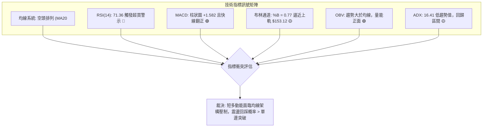

### 📈 移動平均線排列分析

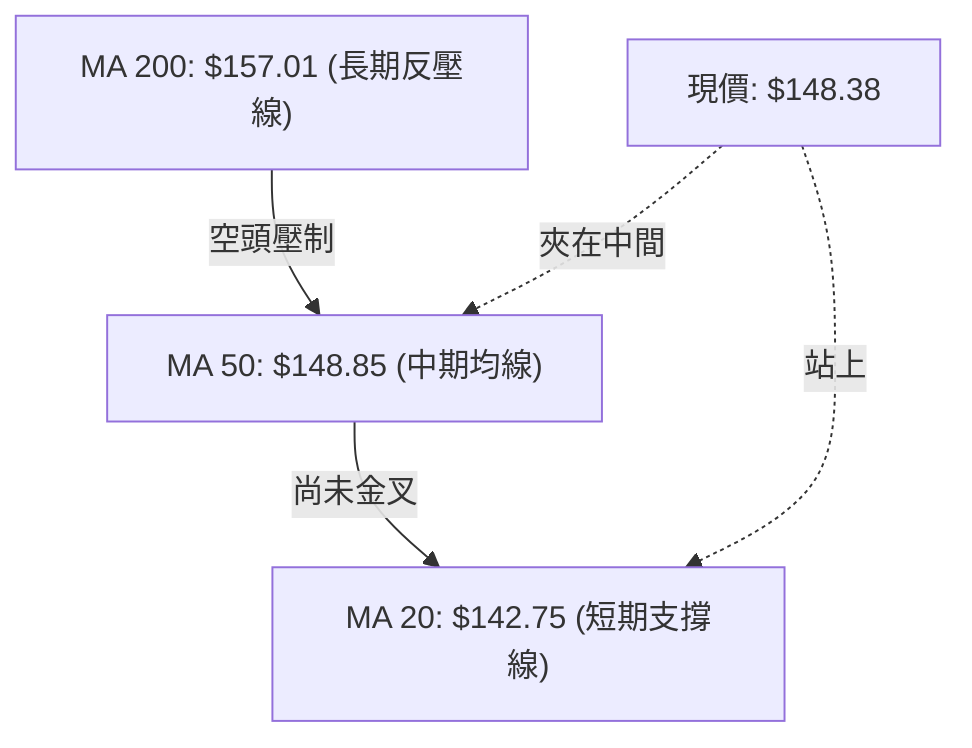

#### 均線全矩陣明細表

| 均線名稱 | 數值 ($) | 距現價幅差 (%) | 趨勢方向 | 實戰狀態與含義 |
|----------|----------|----------------|----------|----------------|
| **MA 5** | $149.51 | -0.76% | ▼ 下彎 | 短線衝刺力道於昨日受挫，出現微幅拉回 |
| **MA 10** | $144.78 | +2.49% | ▲ 陡峭翻揚 | 短期強勢助推線，提供回調第一緩衝區 |
| **MA 20** | $142.75 | +3.95% | ▲ 翻揚向上 | 布林中軌所在，短期波段持股核心防守線 |
| **MA 50** | $148.85 | -0.32% | ▼ 走平下垂 | 中期生命線，直接封鎖現價上方空間，即時重大障礙 |
| **MA 60** | $151.05 | -1.77% | ▼ 下移 | 與 R1 ($150.18) 形成密集蓋頭反壓帶 |
| **MA 120** | $152.19 | -2.50% | ▼ 下移 | 半年線，反映過去半年的平均持股成本套牢狀態 |
| **MA 200** | $157.01 | -5.50% | ▼ 下移 | 年線與多空大分嶺，與 R2 ($156.99) 構成共振防線 |
| **MA 240** | $162.72 | -8.81% | ▼ 下移 | 長期均線下墜，長週期熊市格局未改 |

**均線結構結論**：雖然短期 MA10、MA20 快速昂頭助推，但大週期均線呈現標準「空頭排列」（MA20 < MA50 < MA200 < MA240）。現價正好撞擊在下行的 MA50 ($148.85) 與 MA60 ($151.05) 之核心壓力帶。在無大量支援下，直接穿越的機率偏低。

### 📉 RSI(14) 分析

- **RSI(14) 讀數**：**71.36**
- **強度進度條**：
  ```
  超賣 (0)                       中軸 (50)           超買 (70)     極限 (100)
  ├────────────────────────────────┼───────────────────┼──────────┤
  █████████████████████████████████████████████████████░░░░░░░░░░░  71.36%
  ```
- **超買超賣狀態**：指標已跨過 70.00 警戒線，進入技術性「超買區間」。
- **背離判斷**：
  - *日線背離分析*：數據明確標示「無明顯背離」。價格由 8 月下旬連續走高，RSI 同步自低檔強烈拉升至 71.36，呈現動能與價格同向的強烈脈衝特徵。
  - *週線背離分析*：近20週走勢中，2026-05-31 週收盤 $160.01 時 RSI 為 61.1；2026-06-28 收盤 $163.49 時 RSI 為 63.9；本次反彈收盤 $148.38 而週線 RSI 竄升至 71.4，屬於典型的短期超買急先鋒，暗示後續價格若無法再創波段新高，日線將面臨急跌修復 RSI 的壓力。

### 📊 MACD(12,26,9) 訊號解讀

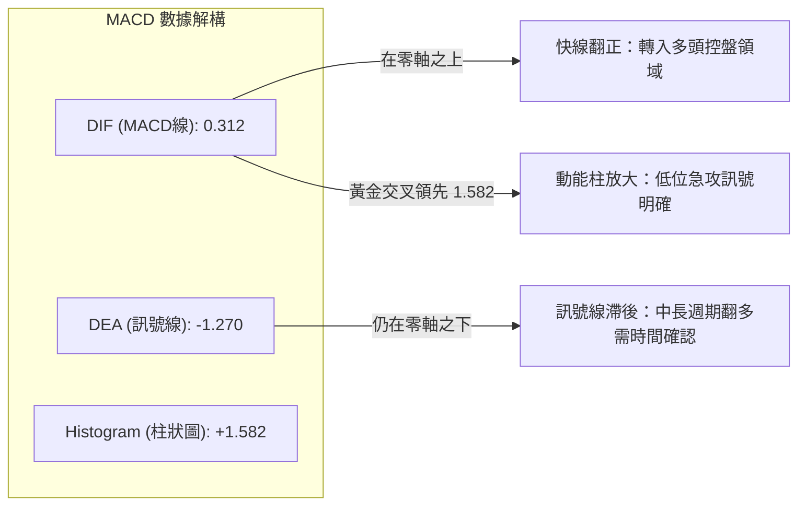

- **讀數**：MACD: 0.312 ｜ Signal: -1.270 ｜ Hist: +1.582。
- **解讀**：DIF 已經突破零軸並大幅拉開與 Signal 線的距離，柱狀圖 +1.582 顯示出 8 月底以來反彈動能極為猛烈。然而，Signal 線 (-1.270) 仍深陷於零軸下方，說明整體的 MACD 架構仍處於自深淵反抽的過程，尚未確立全週期多頭主升浪。

### 📦 布林通道分析

```
VST 布林通道日線分佈圖 (通道帶寬: $20.75)
$154.00 ┤
$153.12 ┼───────────────────────────────── [BB 上軌: 空方壓制邊界]
$150.00 ┤                      ● $148.38  (現價位於 %B = 0.77)
$145.00 ┤
$142.75 ┼┄┄┄┄┄┄┄┄┄┄┄┄┄┄┄┄┄┄┄┄┄┄┄┄┄┄┄┄┄┄┄ [BB 中軌 (MA20): 多方防禦中樞]
$140.00 ┤
$135.00 ┤
$132.37 ┼───────────────────────────────── [BB 下軌: 年內安全買盤底軸]
$130.00 ┤
        └─────────────────────────────────
```

- **BB %B 數值**：**0.77**（介於 0.5 與 1.0 之間，高度偏向上軌）。
- **上下軌帶寬**：$153.12 - $132.37 = **$20.75**。
- **通道位置意義**：現價已逼近布林上軌 $153.12，通常在 ADX < 25 的盤整震盪市場中，當價格觸碰或接近布林上軌時，均值回歸概率高達 75% 以上。上軌 $153.12 同時夾在阻力位 R1 ($150.18) 與 R2 ($156.99) 之間，意味著上方利潤空間僅剩不到 $4.74，而下方回踩中軌空間高達 $5.63，盈虧比對短線追多者不利。

### 💹 成交量分析（量價配合度）

```
成交量對比長條圖 (單位: 股)
─────────────────────────────────────────────────────────────────
最新成交量: 3,159,100   █████████████████░░░░░░ (量比: 0.75x)
20日均量:   4,198,845   ███████████████████████
50日均量:   4,357,732   ████████████████████████
─────────────────────────────────────────────────────────────────
```

- **量價背離現象**：最新成交量僅 3.16M，顯著低於 20 日均量 4.20M（量比 0.75x）及 50 日均量 4.36M。在股價連漲衝擊 MA50 及 R1 關鍵反壓帶時，成交量卻呈現「縮量上漲」，顯示主力資金追高意願減弱，買盤主要為空頭回補而非主動型攻擊盤。
- **OBV 趨勢解讀**：數據指示「OBV > MA → 量能支撐上漲」。此訊號說明雖然短線單日縮量，但在 8 月底至 9 月初的築底過程中，累積能量潮（OBV）已經率先穿越其平均線，確認先前的雙底並非假突破，底層籌碼並未在大跌中失控拋出，而是維持良性換手。

---

## 6. 動能與波動率

### ⚡ 動能評估四象限

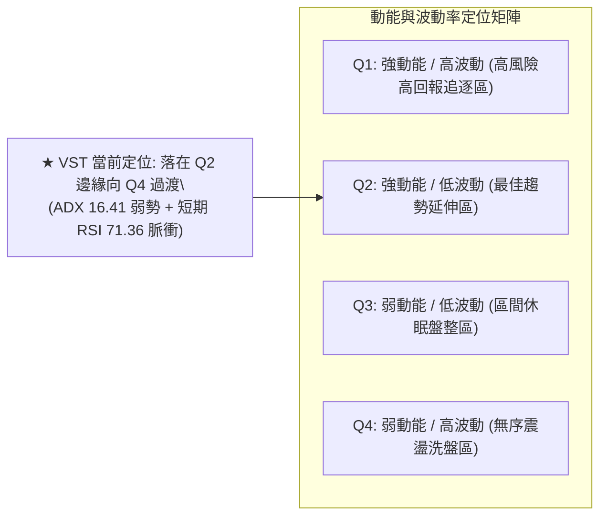

#### 動能與波動四象限對照表

| 象限 | 動能維度 | 波動維度 | 當前狀態 | 策略指導含義 |
|------|----------|----------|----------|--------------|
| **Q1 (主升浪)** | 強 (RSI>60, ADX>25) | 高 (ATR% > 4.5%) | — | 順勢突破加碼，享受主升段波幅 |
| **Q2 (潛力區)** | 強 (短線反彈脈衝) | 低 (ATR% 3.06%) | **✓ (符合現況)** | 短期動能爆發但大趨勢未成，適合「快進快出區間操作」 |
| **Q3 (沉寂區)** | 弱 (RSI 40-50, ADX<20) | 低 (ATR% < 2.5%) | — | 觀望為主，等待均線糾纏收斂 |
| **Q4 (洗盤區)** | 弱 (無方向) | 高 (寬幅劇烈掃蕩) | — | 避免重倉，嚴禁使用市價單操作 |

### 📊 ATR 波動率分析

- **ATR(14) 數值**：**$4.54**。
- **ATR 佔比**：**3.06%**（處於正常公用事業與獨立發電廠偏高但合理的波動區間）。
- **止損距離建議**：
  - *極短線防守 (1.0x ATR)*：距離進場點 **$4.54**，以現價 $148.38 為例，短線容許下檔波動為 **$143.84**（略高於 S1 $144.63）。
  - *波段防守 (1.5x ATR)*：距離進場點 **$6.81**，下檔安全防護位在 **$141.57**（位於 S2 $142.14 之下，能有效過濾一般市場噪音與洗盤）。
  - *保守防守 (2.0x ATR)*：距離進場點 **$9.08**，防禦價位為 **$139.30**，此處仍位於 S3 ($137.93) 之上。

### 📐 Beta 與市場相關性

- **Beta 係數**：**1.414**。
- **市場屬性剖析**：一般傳統公用事業（Utilities）之 Beta 通常在 0.5–0.8 之間，具防禦性。然而 VST 擁有 1.414 的高 Beta，顯示其走勢受科技電力需求、AI 資料中心用電預期與大盤（S&P 500 / Nasdaq）高度共振，本質上具備「高動能成長股」的波動特徵。
- **對沖與風控考量**：當市場大盤出現回調時，VST 預期將出現 1.414 倍的放大跌幅；在當前大盤並未呈現單邊牛市的背景下，高 Beta 個股在遭遇技術阻力位時，容易遭受機構獲利了結盤的無情拋售。

---

## 7. 多時框架總結

### 📋 時框架評分表

| 時框架 | 趨勢方向 | 動能狀態 | 均線排列 | 核心支撐/阻力 | 綜合評分 | 戰略建議 |
|--------|----------|----------|----------|---------------|----------|----------|
| **月線 (長期)** | 🔴 下行修復 | 弱勢築底 | MA200之上偏空調整 | 支撐 $132.47 / 阻力 $185.89 | 35/100 | 長期部位保留底倉，嚴禁追價增持 |
| **週線 (中期)** | 🟡 箱型震盪 | 走出超賣翻揚 | MA50糾纏下行 | 支撐 $136.21 / 阻力 $163.52 | 50/100 | 箱型下緣分批承接，箱頂停利落袋 |
| **日線 (短期)** | 🟢 快速反彈 | 超買預警 (RSI 71) | 站上MA20 / 受阻MA50 | 支撐 $144.63 / 阻力 $150.18 | 58/100 | 衝高減碼短線多單，防範回踩測試 |

### 🔲 綜合訊號矩陣

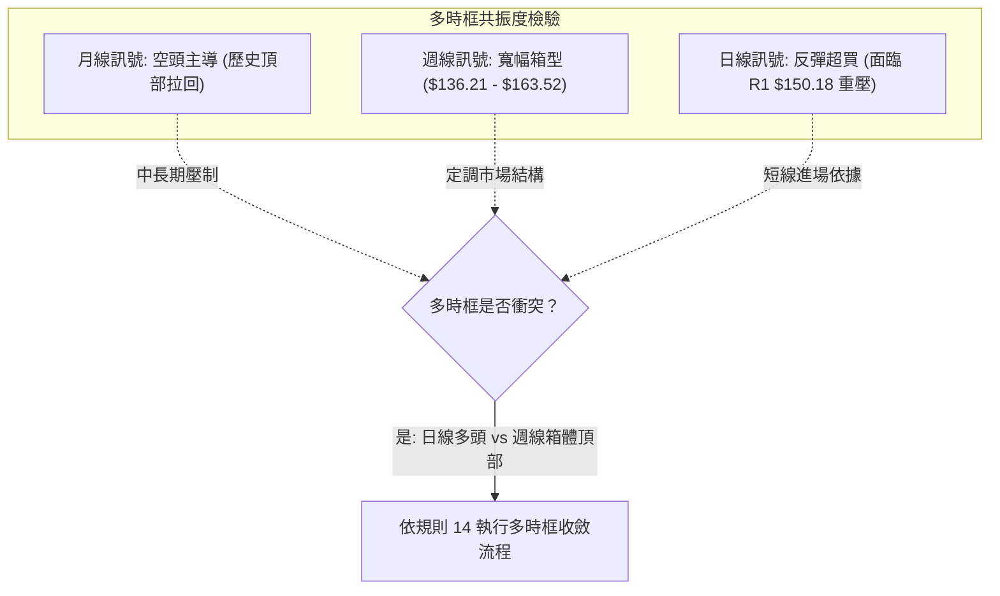

### ⚖️ 多時框收斂結論

#### 依「嚴格要求 14」執行之收斂邏輯：
1. **行情性質裁決**：當前 ADX(14) 讀數為 **16.41**，明確小於 25 的趨勢閾值。依規則判定：**當前非趨勢行情，而是典型的「盤整/箱型行情」**。
2. **主導層級劃定**：在盤整行情中，中長期的均線方向鈍化，市場交易主軸**以日線布林通道上下軌及箱體邊界為主**。週線展示的區間為 $136.21–$163.52，而日線布林通道邊界為 $132.37–$153.12。
3. **時框衝突取捨**：雖然短期日線呈現 MACD 翻正與 +DI 主導的強烈反彈，但由於日線 RSI(14) 已達 71.36（進入超買區），且價格緊貼日線布林上軌 $153.12 與阻力位 R1 $150.18，短線續漲空間被布林上軌嚴密鎖死；中長期的均線空頭排列（MA20 < MA50 < MA200）宣告中線依然承壓。
4. **唯一方向性結論**：**【中性觀望，偏向區間高出低進】**。
   - 拒絕在現價 $148.38 追多（上方距離 R1 僅剩 1.21% 空間，而超買嚴重）；
   - 主策略必須設定為「**等待價格回踩關鍵支撐位後低吸做多，或於布林上軌受阻時區間套利**」。

---

## 8. 交易策略建議

### 🗺️ 策略決策流程圖

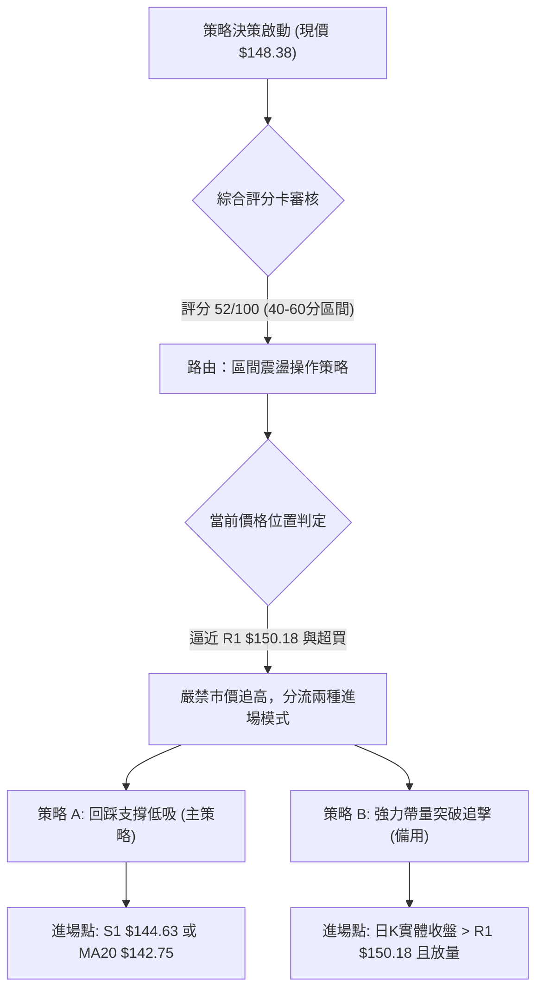

### 🧭 策略路由（依評分卡分流）

> **當前主策略方向 = 【區間操作，等待回踩確認支撐低吸】（依綜合評分：52/100）**
> 
> *路由說明*：綜合評分 52/100 坐落於 40–60 分的中性盤整區間。依規定，本報告不進行單邊盲目押注，而是採用標準的「布林通道區間套利」為主軸，以回踩核心支撐 S1/S2 為主推買點。

### 🎯 價格情境階梯（Price Scenarios）

價位**嚴格引用第 4 章及數據庫真實聚類數值**：

| 觸發條件 | 第一目標 (T1) | 第二目標 (T2) | 後續延伸 (T3) | 情境技術含義與應對 |
|----------|---------------|---------------|---------------|--------------------|
| **強勢突破 R1 ($150.18)** | 斐波78.6% **$150.97** | 布林上軌 **$153.12** | 阻力位 R2 **$156.99** | 短線轉強，向 MA200 挺進，但需成交量倍增配合 |
| **受阻於現價區間 ($148.38)** | 回踩 S1 **$144.63** | 回踩中軌 **$142.75** | 測強支撐 S2 **$142.14** | 標準區間均值回歸，超買修復，創造極佳低吸買點 |
| **有效跌破 S1 ($144.63)** | 測試 S2 **$142.14** | 測試 S3 **$137.93** | 探底低點 **$132.47** | 中期築底失敗，重回空頭主跌，多頭策略全面停損 |

### 📊 情境機率分佈

```
情境機率分佈長條圖
─────────────────────────────────────────────────────────────────
情境 1: 區間震盪回踩 (55%)   ████████████████████████████░░░░░░
情境 2: 強勢突破上行 (25%)   █████████████░░░░░░░░░░░░░░░░░░░░
情境 3: 破位重挫再探 (20%)   ██████████░░░░░░░░░░░░░░░░░░░░░░
─────────────────────────────────────────────────────────────────
```

| 未來情境 | 機率 | 主要技術指標依據（嚴格引用數據） |
|----------|------|----------------------------------|
| **情境 1: 區間震盪回踩修復** | **55%** | ADX 僅 16.41 鎖死單邊趨勢；RSI(14) 達 71.36 亟待降溫；成交量僅 0.75x 縮量難以一次破大關。 |
| **情境 2: 直接放量突破上行** | **25%** | MACD 柱狀體高達 +1.582 且快線站上零軸；+DI (27.98) 仍維持進攻姿態；OBV 走在均線之上。 |
| **情境 3: 再次下探甚至破底** | **20%** | 大級別均線呈空頭排列（MA20<MA50<MA200）；週線長期弱勢尚未完全扭轉；52W低點吸引力存在。 |

### 🟢 主策略詳情（方向依上方路由）

本報告推薦兩套操作方案：**策略 A（推薦：回踩低吸）** 與 **策略 B（右側：突破跟進）**。

| 策略要素 | 策略 A（左側回踩低吸 — 首選） | 策略 B（右側突破追擊 — 次選） |
|----------|--------------------------------|--------------------------------|
| **進場條件** | 價格回踩 S1 獲得支撐，日K收下影線 | 日K實體收盤價突破 R1，成交量 > 4.2M (20日均量) |
| **進場價格** | **$144.63** (支撐位 S1) | **$150.50** (突破 R1 $150.18 後掛單) |
| **目標價 T1** | **$150.18** (阻力位 R1) | **$156.99** (阻力位 R2 / MA200) |
| **目標價 T2** | **$156.99** (阻力位 R2) | **$165.49** (斐波那契 61.8% / 接近 R3) |
| **止損價格** | **$141.50** (嚴守 S2 $142.14 之下) | **$147.50** (跌回 MA50 $148.85 與現價之下) |
| **風險報酬比** | **1 : 3.94**（以 T2 計算：利潤 $12.36 / 風險 $3.13） | **1 : 5.00**（以 T2 計算：利潤 $14.99 / 風險 $3.00） |
| **成功機率** | **65%** | **45%** |
| **建議倉位** | **總資金之 15%** | **總資金之 8%** |

### 🔴 反向風險觸發點（對沖提示）

若已持有多單，當市場出現以下極端訊號時，必須立即停損或進行反向空頭對沖：
1. **反轉關鍵價位**：日線收盤價**實體跌破 $142.14 (支撐 S2)**。此處為 8 月底雙底形態之頸線中樞，一旦摜破，宣告雙底反彈徹底失敗，價格將直奔 S3 ($137.93) 及前低 $132.47。
2. **動能衰竭訊號**：若 MACD 柱狀體由目前的 +1.582 連續 3 日急速萎縮至 +0.5 以下，且日線收長上影線黑K，代表主力資金全面撤退。

### ⭐ 整體訊號強度評星

```
做多訊號強度：★★★☆☆  (3/5星 — 短線動能充足但受制超買與均線)
做空訊號強度：★★☆☆☆  (2/5星 — MACD強勢翻正，空方壓制力暫減)
整體可信度：  ★★★★☆  (4/5星 — 支撐阻力聚類清晰，邊界界定明確)
```

---

## 9. 風險提示與監控

### ✅ 關鍵監控指標 Checklist

```
╔══════════════════════════════════════════════════════════════╗
║              VST 關鍵技術監控 Checklist                      ║
╠══════════════════════════════════════════════════════════════╣
║ [ ] 監控 1：今日收盤能否站穩 MA50 ($148.85)？                ║
║ [ ] 監控 2：若衝刺 R1 ($150.18)，單日成交量是否突破 4.20M？  ║
║ [ ] 監控 3：RSI(14) 是否跌破 70 產生「超買回落」賣訊？       ║
║ [ ] 監控 4：下檔 S1 ($144.63) 首度回踩時是否具備承接量？     ║
║ [ ] 監控 5：MACD 柱狀體是否維持擴張 (> +1.582)？              ║
║ [ ] 監控 6：布林帶寬是否開始向外擴張，打破 ADX 16.41 盤整？ ║
╚══════════════════════════════════════════════════════════════╝
```

### ⚠️ 風險場景分析

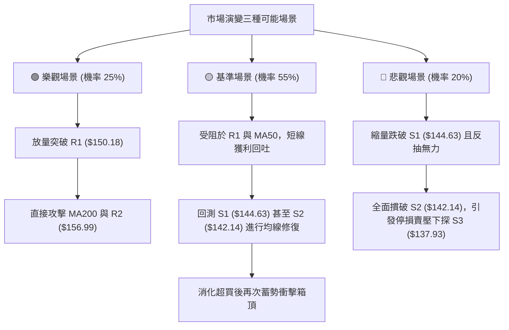

### 🛡️ 風險管理重要提醒

1. **ATR 風控止損法**：以 ATR(14) = $4.54 計算，任何新建立的短線部位，最大容忍單筆虧損絕對不可超過 1.5x ATR（即 $6.81）。嚴禁在價格跌破 S2 ($142.14) 後採取「向下攤平」的非紀律行為。
2. **Beta 槓桿防範**：VST 擁有高達 1.414 的 Beta 係數，在美股公用事業板塊中具備高彈性與高脆弱性。整體倉位比例應嚴格限制在投資組合總額的 **10%–15%** 以內，避免單一標的波動衝擊整體淨值。
3. **無量突破陷阱**：目前成交量為 3.16M（低於均量 25%）。在盤整市（ADX < 25）中，**「縮量的向上突破」有極高機率屬於假突破（Bull Trap）**。若見股價突破 $150.18 但當日成交量未達 4.20M 以上，絕不可在盤中追價。

---

## 📋 報告總結

```
╔══════════════════════════════════════════════════════════════╗
║                 VST 技術分析報告總結                         ║
╠══════════════════════════════════════════════════════════════╣
║ 報告日期：2026-09-13                                         ║
║ 當前價格：$148.38                                            ║
║ 分析評級：⚖️ 中性觀望 / 區間低吸 (評分: 52/100)              ║
╠══════════════════════════════════════════════════════════════╣
║ 關鍵結論：                                                   ║
║ ├─ 長期趨勢：🔴 空頭修正中 (月線52W低位區震盪)              ║
║ ├─ 中期趨勢：🟡 寬幅箱型震盪 ($136.21 至 $163.52 區間內)     ║
║ ├─ 短期趨勢：🟢 築底強勁反彈但已逼近超買 (RSI 71.36)        ║
║ ├─ 關鍵支撐：S1: $144.63 ｜ S2: $142.14 ｜ S3: $137.93       ║
║ ├─ 關鍵阻力：R1: $150.18 ｜ R2: $156.99 ｜ R3: $168.93       ║
║ └─ 分析師目標：共識均價 $217.42 (現價偏離度極大，基本面看好) ║
╠══════════════════════════════════════════════════════════════╣
║ 最優策略組合：                                               ║
║ 1. 🥇 最佳機會：耐受等待回踩 S1 ($144.63) 承接，停損守 S2下 ║
║ 2. 🥈 次選機會：實體紅K帶量突破 R1 ($150.18) 順勢跟進追擊    ║
║ 3. 🥉 保守選擇：完全空倉觀望，等待日線 RSI 回落至 50 附近   ║
╚══════════════════════════════════════════════════════════════╝
```

---

> ⚠️ **免責聲明**：本報告為 AI 自動生成之技術分析，所有數據及估算均嚴格基於所提供的歷史價格與量化技術資訊。本報告**僅供研究與學術參考**，**不構成任何投資買賣建議**。金融市場瞬息萬變，投資有極高風險，入市需獨立審慎評估。

---

*報告生成時間：2026-09-13 ｜ 數據來源：Yahoo Finance ｜ 分析框架：多時框量化技術分析*