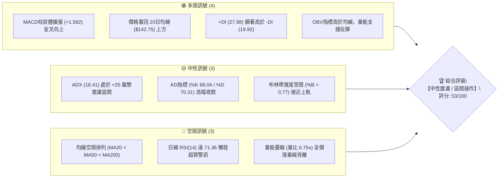
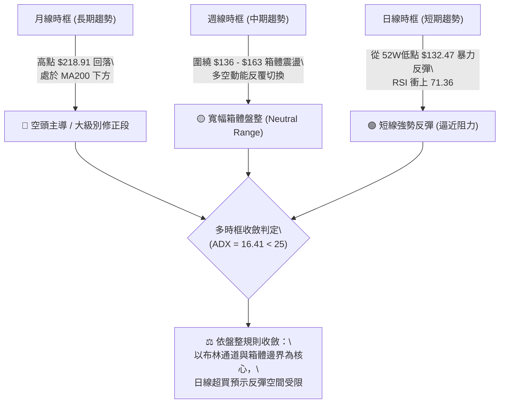
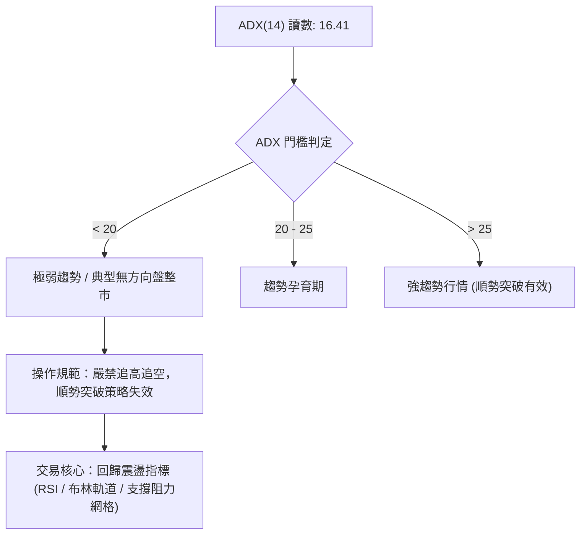
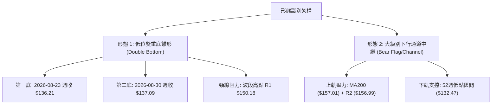
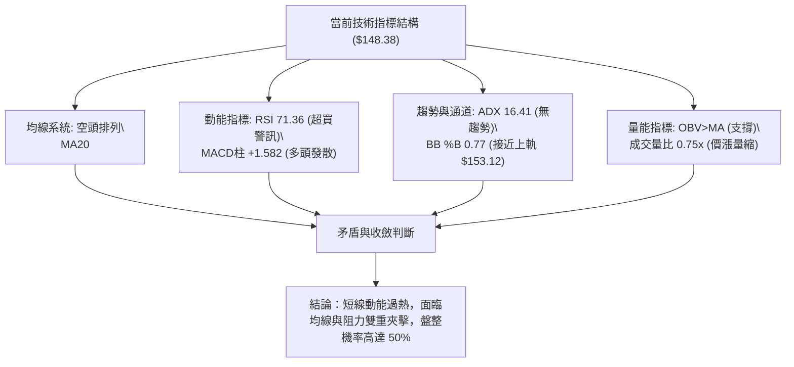
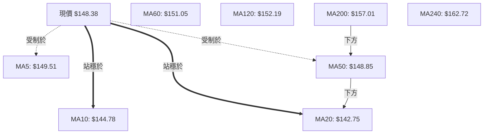
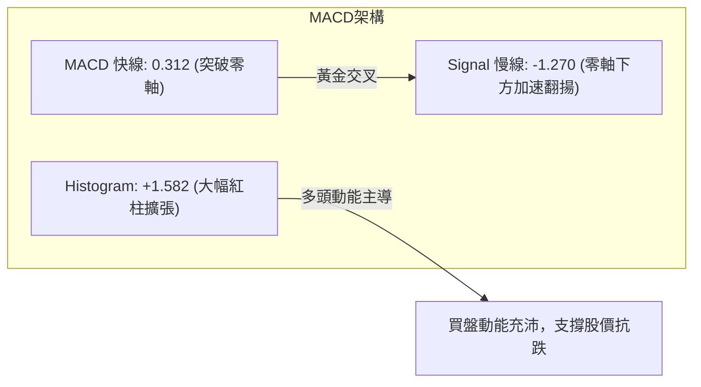
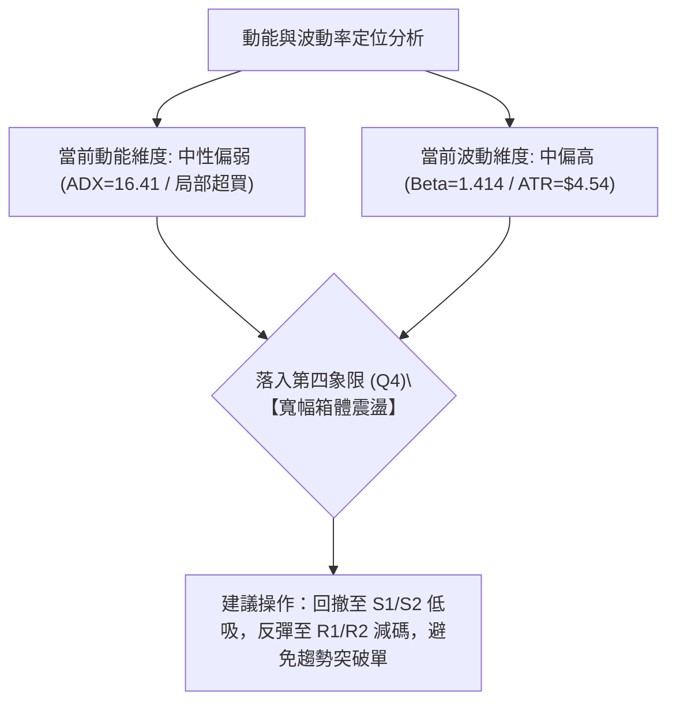
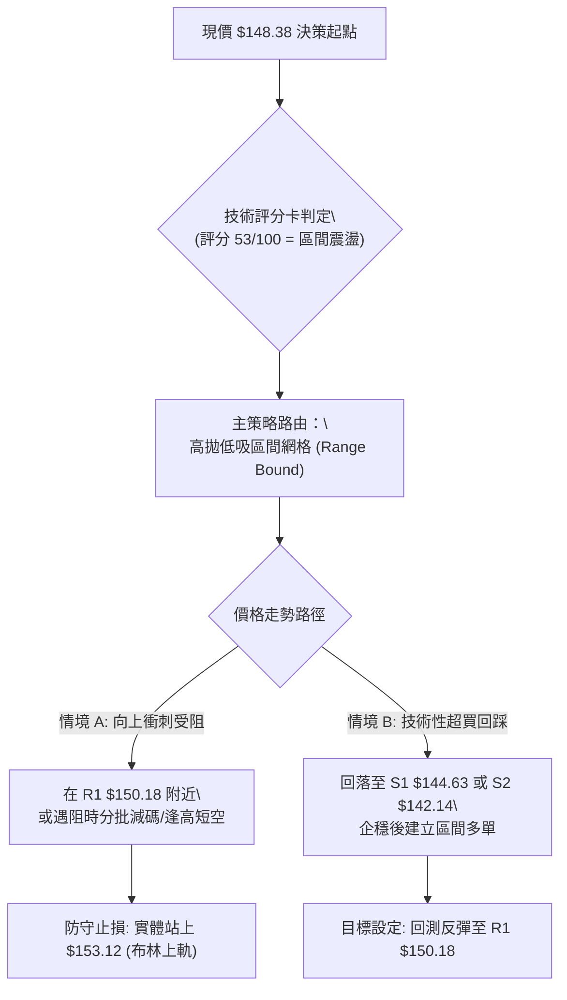
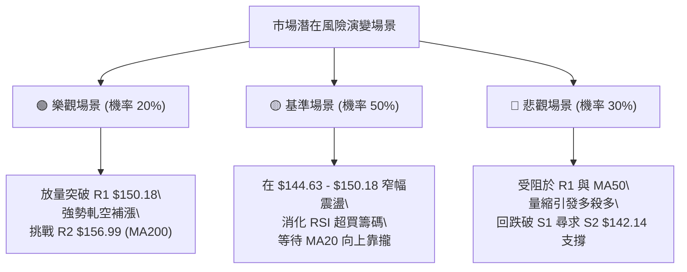

# VST 技術分析報告

> **報告日期**：2026-09-14 ｜ **語言**：繁體中文 ｜ **數據來源**：Yahoo Finance ｜ **當前價格**：$148.38

---

## 目錄

| 章節 | 內容 |
|------|------|
| [1. 技術面概覽](#1-技術面概覽) | 訊號儀表板、核心指標、評分卡 |
| [2. 趨勢分析](#2-趨勢分析) | 多時框趨勢、長中短期走勢 |
| [3. 圖表形態分析](#3-圖表形態分析) | 形態識別、K線組合、目標價 |
| [4. 支撐與阻力](#4-支撐與阻力) | 關鍵價位、斐波那契回調 |
| [5. 技術指標深度解讀](#5-技術指標深度解讀) | MA/RSI/MACD/布林/成交量 |
| [6. 動能與波動率](#6-動能與波動率) | 動能評估、ATR、Beta |
| [7. 多時框架總結](#7-多時框架總結) | 時框架評分矩陣 |
| [8. 交易策略建議](#8-交易策略建議) | 多空策略、風險報酬比 |
| [9. 風險提示與監控](#9-風險提示與監控) | 監控指標、風險場景 |

---

## 1. 技術面概覽

### 🎯 技術訊號儀表板



### 📊 核心指標速覽表

| 指標類別 | 指標名稱 | 當前數值 | 訊號 | 解讀 |
|:---|:---|:---|:---:|:---|
| **價格** | 當前收盤價 | $148.38 | 🟡 | 位於52週區間18.4%低檔，短線反彈遇阻 |
| **均線** | MA20 (短中) | $142.75 | 🟢 | 現價高於 MA20 達 +3.95%，短期支撐確立 |
| **均線** | MA50 (中期) | $148.85 | 🔴 | 現價受制於 MA50 下方 -0.32%，為即時反壓 |
| **均線** | MA200 (長期) | $157.01 | 🔴 | 長期生命線下彎，上方 $157 附近形成重大壓制 |
| **動能** | RSI(14) | 71.36 | 🔴 | 進入 >70 嚴重超買區，短線隨時面臨獲利回吐 |
| **動能** | MACD (12,26,9) | 0.312 / -1.270 | 🟢 | 快線穿過慢線，柱狀體 +1.582 維持多頭發散 |
| **趨勢強度**| ADX(14) | 16.41 | 🟡 | 數值低於 25，明確定義為無趨勢之箱體盤整市 |
| **通道位置**| Bollinger %B | 0.77 | 🟡 | 運行於中軌($142.75)與上軌($153.12)間，偏向超買 |
| **成交量** | 20日成交量比 | 0.75x | 🔴 | 日量 3.16M 低於 20日均量 4.20M，上攻量能不足 |
| **波動** | ATR(14) | $4.54 | 🟡 | 佔股價 3.06%，日常波動適中，利於區間網格操作 |

### 🏆 技術評分卡

```
╔══════════════════════════════════════════════════════════════════╗
║              技術評分卡 — VST (2026-09-14)                      ║
╠══════════════════════════════════════════════════════════════════╣
║ 趨勢強度 (ADX/排列)   ███████░░░░░░░░░░░░░   35/100  🔴 空頭排列 ║
║ 動能指標 (RSI/MACD)   ████████████░░░░░░░░   60/100  🟡 短多但超買║
║ 支撐穩定度 (S1/S2/S3) ██████████████░░░░░░   70/100  🟢 底部支撐強║
║ 成交量配合 (OBV/量比) ████████░░░░░░░░░░░░   40/100  🔴 量價微背離║
║ 形態完整度 (箱體/雙底)████████████░░░░░░░░   62/100  🟢 區間底反彈║
║ 均線系統 (MA偏離/順序)████████░░░░░░░░░░░░   42/100  🔴 壓制在上方║
╠══════════════════════════════════════════════════════════════════╣
║ 綜合技術評分          ███████████░░░░░░░░░   53/100  🟡 中性觀望 ║
║ 狀態判定：弱勢趨勢中的超跌反彈段，受制於日線 ADX<25 區間格局   ║
╚══════════════════════════════════════════════════════════════════╝
```

---

## 2. 趨勢分析

### 🌐 多時框趨勢分析

依據分析框架，不同時框呈現顯著分歧：長期趨勢偏空、中期陷入箱體震盪、短期處於急彈超買狀態。



### 📈 長期趨勢 — 12個月走勢圖（Unicode）

以下呈現過去 12 個月（2025-09 至 2026-09）之歷史月線收盤與走勢架構：

```
VST 月線走勢圖（過去12個月：2025-09 至 2026-09）
價格軸 ($)
$200 ┤ ● (09月 $195.11)
$190 ┤   ● (10月 $187.52)
$180 ┤     ● (11月 $178.12)
$170 ┤                  ● (02月 $173.41)
$160 ┤       ● (12月 $160.88)   ● (05月 $160.01) ● (06月 $158.63)
$150 ┤         ● (01月 $157.91)   ● (04月 $157.62)   ● (07月 $148.19)  ● ($148.38現價)
$140 ┤                              ● (03月 $150.12)   ● (08月 $137.37)
     └─┬───┬───┬───┬───┬───┬───┬───┬───┬───┬───┬───┬───►
      09  10  11  12  01  02  03  04  05  06  07  08  09 (月份)
      25  25  25  25  26  26  26  26  26  26  26  26  26 (年份)
```

**12個月走勢特徵分析表格**：

| 階段區間 | 時間區段 | 價格區間 ($) | 漲跌幅度 | 趨勢性質與量能特徵 |
|:---|:---|:---:|:---:|:---|
| **高檔派發段** | 2025-09 ~ 2025-11 | 195.11 → 178.12 | -8.71% | 跌破 $200 關卡，多頭動能耗盡，機構開始調節持股 |
| **中級下行段** | 2025-11 ~ 2026-01 | 178.12 → 157.91 | -11.35% | 跌破 61.8% 斐波那契回調位，空頭排列成型 |
| **反彈誘多段** | 2026-01 ~ 2026-02 | 157.91 → 173.41 | +9.82% | 抽腳反彈測試 50% 斐波那契位 ($175.69) 未果受阻 |
| **二次探底段** | 2026-02 ~ 2026-05 | 173.41 → 139.48 | -19.57% | 連續急挫，創下年內新低，空頭殺跌力道釋放 |
| **築底收斂段** | 2026-06 ~ 2026-09 | 136.21 → 148.38 | +8.93% | 在 52W 低點 $132.47 上方構築 $136-$137 雙底平台 |

### 📊 中期趨勢（週線分析）

中期走勢顯示，自 2026 年 5 月底反彈至 $163.52 後，VST 進入了寬幅收斂箱體。
近期於 2026-08-23 週收出 $136.21 低點，次週 2026-08-30 收 $137.09，確認了 $136-$137 支撐區間的有效性，隨後連續兩週大陽線推升至當前 $148.38。

```
中期週線結構壓力與支撐示意圖：
$168.93 ──────────────────────────────── 強阻力 R3 (前波反彈高點聚類)
          ┌─────────────┐
$156.99 ──│── MA200 壓制 │──────────────── 關鍵阻力 R2 (MA200 $157.01 重疊)
          └─────────────┘
$150.18 ──────────────────────────────── 短線阻力 R1 (週線波段頭部 / MA50)
                      ▲
$148.38 ──────────────┼───────────────── 【現價】(逼近 R1 反壓)
                      │ (反彈波)
$144.63 ──────────────────────────────── 短線支撐 S1 (週線起漲頸線)
$142.14 ──────────────────────────────── 核心支撐 S2 (MA20 支撐位)
$137.93 ──────────────────────────────── 箱體底部 S3 (近一年低點聚類)
```

### ⚡ 趨勢強度評估（ADX 解讀）



**ADX 趨勢強度指標狀態對照表**：

| 指標名稱 | 當前數值 | 參考閾值 | 市場狀態結論 |
|:---|:---:|:---:|:---|
| **ADX (14)** | **16.41** | 25.00 | **無趨勢盤整（Consolidation）**。趨勢能量匱乏，單邊延續性差。 |
| **+DI** | **27.98** | 20.00 | 多方短線動能佔據優勢（由 $136 水平拉升觸發）。 |
| **-DI** | **19.92** | 20.00 | 空方短線拋壓有所減弱，但未完全潰退。 |
| **DI 差值 (+DI - -DI)**| **+8.06** | 0.00 | 短線多頭排列，但因 ADX 疲軟，此優勢易在阻力位停滯。 |

---

## 3. 圖表形態分析

### 🔍 形態識別系統

根據近 20 週收盤走勢與關鍵轉折點，市場在低位顯現「區間雙重底結構」以及「均線下壓收斂三角形態」。



**形態信心度評估表（嚴格依據規則 15）**：

| 形態名稱 | 信心度 | 判斷依據（引用數據） | 完成度 | 目標價（附計算式） |
|:---|:---:|:---|:---:|:---|
| **潛在雙重底 (Double Bottom)** | **65%** | 兩次低點分別落於 $136.21 與 $137.09，獲支撐位 S3 ($137.93) 支撐；隨後帶動 MACD 柱翻正至 +1.582。頸線為 R1 ($150.18)。 | 85% | 待有效收復頸線 R1 $150.18：<br>形態高度 = 頸線 $150.18 - 最低點 $136.21 = $13.97<br>理論目標價 = $150.18 + $13.97 = **$164.15**（逼近 61.8% 斐波位 $165.49） |
| **中期下行旗形 (Bear Flag)** | **52%** | 長期均線空頭排列（MA20 < MA50 < MA200），當前反彈量能不足（量比 0.75x），價格尚未擺脫 $132-$168 大箱體。 | 60% | 若遇阻 R1 $150.18 或 R2 $156.99 掉頭跌破 S1 $144.63：<br>旗面跌破目標 = 測試 52W 低點 **$132.47** |

### 🕯️ 重要K線形態分析

| 週期/日期 | 收盤價 | K線組合型態 | 盤面技術意涵 | 多空訊號 |
|:---|:---:|:---|:---|:---:|
| **2026-08-23** | $136.21 | **長下影錘頭線 (Hammer)** | 測試年內低點 $132.47 未破，低檔出現承接買盤，RSI 下探 26.1 極度超賣區後反彈。 | 🟢 底背離孕育 |
| **2026-08-30** | $137.09 | **雙底確認小陽線 (Spinning Top)** | 波動收窄，空方無法續創新低，成交量降至 18.69M，呈現縮量築底。 | 🟡 變盤築底 |
| **2026-09-06** | $149.30 | **長實體突破大陽線 (Marubozu)** | 一舉包覆前四週陰線，MACD 柱由負翻正 (+1.366)，突破 MA20 ($142.75)。 | 🟢 強烈買訊 |
| **2026-09-13** | $148.38 | **高檔流星線雛形 (Shooting Star)** | 上攻觸及 R1 ($150.18) 與 MA50 ($148.85) 後引發獲利盤湧出，留上影線，RSI 衝破 70。 | 🔴 滯漲回檔警訊 |

### 📉 ASCII 走勢形態示意圖

```
VST 近期週線雙底反彈與頸線阻力示意圖：
價格
$156.99 ┼ - - - - - - - - - - - - - - - - - - - - - - - - - - - - (強阻力 R2)
        │
$150.18 ┼ - - - - - - - - - - - - - - ┌───┐ - - - - - - - - - - - (頸線阻力 R1)
        │                             │ 頂│ ◄ 遇阻回落 ($148.38 現價)
$144.63 ┼ - - - - - - - - - - - ┌─────┘   └─────┐ - - - - - - - - (支撐 S1)
        │                       │               │
$142.14 ┼ - - - - - - - - - - ┌─┘               └─┐ - - - - - - - (MA20 支撐 S2)
        │                     │                   │
$137.93 ┼ - - - ┌─┐ - - - - - │ - - - - - - - - - │ - ┌─┐ - - - - (支撐 S3)
        │       │ │           │                   │   │ │
$136.21 ┼ ──────┴─┴───────────┴───────────────────┴───┴─┴──────── (雙底基底)
             2026-08-23                          2026-08-30
              第一低點                            第二低點
```

### 🎯 形態目標價計算

根據嚴格數據紀律，形態推算依據如下：
1. **雙底量度目標**：
   - 頸線位置：$150.18（R1 阻力位）
   - 低點基底：$136.21（2026-08-23 波段收盤低點）
   - 形態垂直高度：$150.18 - $136.21 = $13.97
   - **等距映射目標價**：$150.18 + $13.97 = **$164.15**（落在 R2 $156.99 與 61.8% 回調位 $165.49 之間）
2. **失效判定標準**：
   - 若股價無法實體突破 R1 $150.18，且跌破 S1 $144.63，則該雙底形態宣布破局，重回 $137.93 - $150.18 的箱體拉鋸。

---

## 4. 支撐與阻力

### 🗺️ 關鍵價位分布圖（Unicode）

```
╔══════════════════════════════════════════════════════════════════╗
║                   VST 價位結構分布圖                             ║
╠══════════════════════════════════════════════════════════════════╣
║ $218.91 ║██████████████████████████████║ 52W 最高點 (0.0% Fib)  ║
║ $175.69 ║██████████████████████        ║ 50.0% 斐波那契分水嶺    ║
║ $168.93 ║████████████████████████      ║ 波段強阻力 R3          ║
║ $156.99 ║██████████████████            ║ 關鍵阻力 R2 (重疊MA200)║
║ $150.97 ║████████████████              ║ 78.6% 斐波那契位       ║
║ $150.18 ║████████████████████████      ║ 波段頸線阻力 R1        ║
║ $148.38 ╠══════════════════════════════╣ ◄ 現價位置 ($148.38)    ║
║ $144.63 ║▓▓▓▓▓▓▓▓▓▓▓▓▓▓▓▓              ║ 近期波段支撐 S1        ║
║ $142.14 ║██████████████████            ║ 核心均線支撐 S2 (MA20) ║
║ $137.93 ║████████████████████████      ║ 強固防守底線 S3        ║
║ $132.47 ║██████████████████████████████║ 52W 最低點 (100% Fib)  ║
╚══════════════════════════════════════════════════════════════════╝
```

### 🚧 阻力位分析表

所有價位嚴格引用自 OHLCV 聚類計算結果：

| 阻力級別 | 精確價位 | 距離現價 | 形成原因與籌碼特徵 | 突破難度 | 重要性 |
|:---|:---:|:---:|:---|:---:|:---:|
| **R1** | **$150.18** | +1.21% | 近一年波段高點聚類、50日均線 ($148.85) 緊貼上方、接近 78.6% Fib ($150.97)。 | 🟡 中等 | ★★★★☆ |
| **R2** | **$156.99** | +5.80% | 200日均線生命線 ($157.01) 重疊處、中期反彈密集套牢解套賣壓區。 | 🔴 極高 | ★★★★★ |
| **R3** | **$168.93** | +13.85% | 2026年首季反彈次高點聚類、61.8% Fib ($165.49) 上方之強阻力。 | 🔴 極高 | ★★★☆☆ |

### 🛡️ 支撐位分析表

所有價位嚴格引用自 OHLCV 聚類計算結果：

| 支撐級別 | 精確價位 | 距離現價 | 形成原因與籌碼特徵 | 守住機率 | 重要性 |
|:---|:---:|:---:|:---|:---:|:---:|
| **S1** | **$144.63** | -2.53% | 突破前波平台的頂部轉換位、10日均線 ($144.78) 匯合處。 | 🟢 70% | ★★★★☆ |
| **S2** | **$142.14** | -4.20% | 20日均線 ($142.75) 密集成交區、布林中軌支撐位置。 | 🟢 80% | ★★★★★ |
| **S3** | **$137.93** | -7.04% | 2026年8月雙重底頸線基底聚類、多頭最後防守底線。 | 🟢 85% | ★★★★★ |

### 📐 斐波那契回調位分析

基準區間採用 52 週絕對極值：低點 **$132.47** (100.0%) 至 高點 **$218.91** (0.0%)，垂直落差 $86.44。

| 斐波那契層級 | 精確價位 | 現價相對位置與技術解讀 |
|:---:|:---:|:---|
| **0.0%** (52W High) | **$218.91** | 歷史峰值，長期牛市終極目標 |
| **23.6%** | **$198.51** | 極強多頭回調支撐（現已轉為遙遠歷史阻力） |
| **38.2%** | **$185.89** | 弱勢反彈極限阻力 |
| **50.0%** | **$175.69** | 多空中期強弱分水嶺（2026年2月曾遇阻回落） |
| **61.8%** | **$165.49** | 黃金分割重要轉折點（與雙底目標 $164.15 共振） |
| **78.6%** | **$150.97** | **當前即時重大反壓**。現價 $148.38 剛好運行於 78.6% ($150.97) 下方 -1.7% 處 |
| **100.0%** (52W Low) | **$132.47** | 52週絕對底部，年內多頭不容有失的基石 |

**斐波那契定位解讀**：
當前現價 **$148.38** 處於 **100.0% ($132.47)** 與 **78.6% ($150.97)** 之間。此區域在技術分析中屬於「超跌深水修復區」。多頭在此處反彈極易在 78.6% 斐波那契位（$150.97）遭遇空頭伏擊。若能帶量實體站上 $150.97，上方空間才得以開啟至 61.8% 位 ($165.49)。

---

## 5. 技術指標深度解讀

### 🎛️ 指標訊號總覽



### 📈 移動平均線排列分析



**均線系統詳細體檢表**：

| 均線週期 | 當前價格 | 偏離率 (%) | 狀態評估 | 技術意義 |
|:---|:---:|:---:|:---:|:---|
| **MA 5** | $149.51 | -0.76% | ▼ 跌破 | 極短線漲勢歇息，受阻於 5日線下方 |
| **MA 10** | $144.78 | +2.49% | ▲ 站上 | 短線支撐線，與支撐 S1 ($144.63) 高度重合 |
| **MA 20** | $142.75 | +3.95% | ▲ 站上 | 月線轉折向上，構成拉回的第一道堅實防線 |
| **MA 50** | $148.85 | -0.32% | ▼ 跌破 | 中期生命線平移，近在咫尺，構成直接反壓 |
| **MA 60** | $151.05 | -1.77% | ▼ 跌破 | 季線阻力，與 R1 ($150.18) 形成阻力帶 |
| **MA 120** | $152.19 | -2.50% | ▼ 跌破 | 半年線持續下垂，壓制中期反彈高度 |
| **MA 200** | $157.01 | -5.50% | ▼ 跌破 | 長期牛熊分界線，與 R2 ($156.99) 精準重疊 |
| **MA 240** | $162.72 | -8.81% | ▼ 跌破 | 年線重壓，長期趨勢未完成牛市逆轉 |

### 📉 RSI(14) 分析

當前 **RSI(14) 讀數為 71.36**，突破 70 警戒線進入超買區。

```
RSI(14) 數值刻度分布：
0 ────── 30 ───────────── 50 ───────────── 70 ── 71.36 ───── 100
[ 極度超賣 ]    [ 弱勢區間 ]    [ 強勢區間 ]    [ 超買 ] ◄ 現狀
█████████████████████████████████████████████████░░░░  71.36%
```

- **背離分析判斷**：
  比對近 20 週走勢，2026-05-31 週收 $160.01 時 RSI 為 61.1；2026-06-28 週收 $163.49 時 RSI 為 63.9；當前週收 $148.38，RSI 衝高至 71.36。
  **結論**：由於股價處於自底部反彈的初期急拉段，技術面上**無頂背離亦無底背離**（符合數據中「RSI 背離: 無明顯背離」之結論）。此處的 71.36 純粹反映短線拉升過急帶來的指標鈍化與技術性過熱，暗示追高風險極大。

### 📊 MACD(12/26/9) 訊號解讀

- **MACD 快線**：0.312
- **MACD 訊號線 (Signal)**：-1.270
- **MACD 柱狀體 (Histogram)**：+1.582（🟢 顯著看多）



柱狀體自 2026-08-30 的 -0.077 快速擴張至 2026-09-06 的 +1.366，本週續擴至 +1.582，顯示短線買盤爆發力強勁。然而，快線 0.312 僅剛越過零軸，長期動能修復仍需時間。

### 📦 布林通道分析

當前布林通道設定（20日，2倍標準差）：
- **上軌 (Upper)**：$153.12
- **中軌 (Middle, MA20)**：$142.75
- **下軌 (Lower)**：$132.37
- **帶寬 (%B)**：0.77

```
布林通道當前空間分布示意圖：
$153.12 ┬──────────────────────────────────────── 上軌 (Upper Band)
        │                                  ▲
$148.38 ┼──────────────────────────────────┼───── 【現價】(%B = 0.77)
        │                                  │ (通道偏多區間)
$142.75 ┼──────────────────────────────────┴───── 中軌 (Middle Band / MA20)
        │
$132.37 ┴──────────────────────────────────────── 下軌 (Lower Band / 接近52W低點)
```

**布林通道結構解讀**：
%B 達到 0.77，代表價格位於通道的上半部。布林上軌 $153.12 與 R1 ($150.18) 構成緊密的複合壓力帶。在通道開口尚未全面發散（帶寬受限）且 ADX 僅 16.41 的情況下，價格難以形成沿上軌單邊暴漲的「騎軌行情」，觸及上軌附近常誘發向中軌 $142.75 均值回歸的拉回走勢。

### 💹 成交量分析（量價配合度）

- **最新成交量**：3,159,100 股
- **20日平均成交量**：4,198,845 股（**成交量比：0.75x**）
- **50日平均成交量**：4,357,732 股
- **OBV 趨勢**：OBV > MA，維持多頭排列

**量價矛盾深度解析**：
價格本週強勢衝刺，但成交量僅為 20日均量的 75%，呈現典型的「**價漲量縮**」背離現象。這表明本波反彈主要由空頭回補與籌碼沉澱推動，缺乏增量機構資金的實質追價意願。所幸 OBV 維持在均線之上，說明底部籌碼未見大舉出逃，後市傾向於在震盪中等待量能補足。

---

## 6. 動能與波動率

### ⚡ 動能評估四象限

評估坐標：橫軸為「趨勢與動能強度」（結合 ADX 與 RSI），縱軸為「波動率水平」（基於 ATR 與 Beta）。

| 象限區間 | 動能特徵 | 波動特徵 | 歷史市場情境 | VST 當前對應狀態與策略評估 |
|:---:|:---:|:---:|:---|:---|
| **第一象限 (Q1)** | 強動能 | 低波動 | 主升浪穩健走勢 | — |
| **第二象限 (Q2)** | 弱動能 | 低波動 | 縮量盤整、窄幅震盪 | — |
| **第三象限 (Q3)** | 強動能 | 高波動 | 暴漲暴跌、突破行情 | — |
| **第四象限 (Q4)** | **弱/中動能** | **中高波動** | **寬幅震盪、反彈受阻** | **✓ 當前精準落點**：ADX(16.41)屬弱趨勢，但 Beta(1.414)與 ATR(3.06%)賦予高日內彈性。宜採「逢阻做空、逢支撐做多」的區間震盪策略。 |



### 📊 ATR 波動率分析

- **ATR(14) 絕對值**：**$4.54**
- **ATR 相對股價百分比**：**3.06%**
- **當前波動等級**：中度波動

**止損與倉位風控參數計算**：
1. **短線動態止損緩衝距（1.0 × ATR）**：$4.54
   - 若在現價 $148.38 介入，短線保護位至少應設於 $148.38 - $4.54 = **$143.84**（略低於 S1 $144.63）。
2. **波段安全止損緩衝距（1.5 × ATR）**：$4.54 × 1.5 = **$6.81**
   - 波段多單防守位應設於 $148.38 - $6.81 = **$141.57**（位於 S2 $142.14 核心支撐下方）。

### 📐 Beta 與市場相關性

- **Beta 係數**：**1.414**
- **解讀**：VST 展現出相較於標普 500 指數高出 41.4% 的波動彈性。身為公用事業與獨立發電巨頭，其股價受到 AI 數據中心用電題材的高度炒作，使其兼具「高彈性科技股」的投機屬性。在市場大盤震盪時，VST 往往出現過度放大（Overshooting）的波段走勢，交易者必須隨時警惕非系統性風險。

---

## 7. 多時框架總結

### 📋 時框架評分表

| 時框架 | 趨勢方向 | 核心動能 | 均線排列狀態 | 圖表形態識別 | 綜合評分 | 戰術建議 |
|:---:|:---:|:---:|:---:|:---:|:---:|:---|
| **日線 (Daily)** | 偏多反彈 | RSI 71.36 (超買)<br>MACD柱 +1.582 | 短多 (價 > MA20)<br>中空 (價 < MA50) | 逼近 R1 $150.18 頸線阻力 | 58/100 🟡 | 嚴禁追高，等待超買拉回 |
| **週線 (Weekly)** | 區間震盪 | RSI 54.6<br>MACD柱翻正 | 箱體反覆糾結<br>受制於 MA200 | $136-$163 寬幅箱體築底 | 54/100 🟡 | 區間下軌承接、上軌減持 |
| **月線 (Monthly)** | 空頭回調 | 52W區間下緣 (18.4%) | 長期均線下垂壓制 | 自高點 $218.91 派發回檔 | 45/100 🔴 | 長線部位維持防禦配置 |

### 🔲 綜合訊號矩陣

| 評估維度 | 日線訊號 (短期) | 週線訊號 (中期) | 月線訊號 (長期) | 訊號收斂一致性分析 |
|:---|:---:|:---:|:---:|:---|
| **價格動能** | 🟢 強烈（急彈） | 🟡 中性（回升） | 🔴 疲弱（下修） | 衝突：短線急彈遭遇中長線趨勢壓制 |
| **指標狀態** | 🔴 超買警戒 | 🟢 動能改善 | 🔴 偏空修正 | 衝突：短線動能過度透支，缺乏持續性 |
| **量價結構** | 🔴 價漲量縮 | 🟡 縮量築底 | 🔴 派發放量 | 一致：上攻動能缺乏大級別量能背書 |
| **支撐阻力** | 🔴 抵達 R1 反壓 | 🟡 位於箱體中軸 | 🟢 守住 100% 斐波位 | 收斂：向上空間受阻，回測支撐機率大 |

### ⚖️ 多時框收斂結論

> **核心收斂法則執行（嚴格依據要求 14）**：
> 1. **趨勢判定**：當前日線 **ADX(14) 讀數為 16.41**，遠低於 25 臨界線，技術架構**嚴格定義為「盤整行情（Consolidation Market）」**。
> 2. **主導維度**：依據規則，盤整行情中順勢指標失效，**以日線布林通道上下軌（$132.37 至 $153.12）以及核心支撐阻力為主要交易依據**。
> 3. **衝突取捨**：雖然日線 MACD 強烈看多，但受到長期空頭均線壓制（MA20 < MA50 < MA200）與 RSI 71.36 超買制約，日線的多頭訊號僅能被定性為「**箱體內部的超跌反彈**」，而非反轉新趨勢。
> 
> **唯一方向性結論**：**【中性偏弱觀望，預期區間震盪回落】**
> 現價 $148.38 極度逼近 R1 阻力位 $150.18 與布林上軌 $153.12，向上盈虧比極差。市場高機率在此處遇阻，展開向日線布林中軌兼 MA20（$142.75）與 S1（$144.63）的回踩確認。

---

## 8. 交易策略建議

### 🗺️ 策略決策流程圖



### 🧭 策略路由（依評分卡分流）

**當前主策略方向 = 【中性震盪區間操作（評分 53/100）】**
由於技術評分卡落在 40–60 區間（53分），嚴禁單向盲目追多或重倉看空。主推策略為**「耐心等待超買拉回，於支撐區間低吸佈局多單」**，並以**「逢高觸及阻力位減碼或防禦性對沖」**為輔。

### 🎯 價格情境階梯（Price Scenarios）

所有價格均精確引用第 4 章及數據規範：

| 觸發條件 | 第一目標 | 第二目標 | 情境技術含義與應對要點 |
|:---|:---:|:---:|:---|
| **強勢突破 R1 $150.18** | R2 $156.99 | R3 $168.93 | **短線強勢突破**：需放量突破 78.6% Fib，直指 MA200 生命線。 |
| **現價 $148.38 區間震盪** | S1 $144.63 | R1 $150.18 | **常態箱體拉鋸**：消化 RSI 超買籌碼，波幅約 $4-$6 空間。 |
| **跌破 S1 $144.63 支撐** | S2 $142.14 | S3 $137.93 | **深度拉回確認**：回測 20日線 MA20 與雙底頸線基底，為最佳買點。 |

### 📊 情境機率分佈

| 情境類型 | 發生機率 | 主要技術依據 |
|:---|:---:|:---|
| **區間震盪 (Consolidation)** | **50%** | ADX 僅 16.41 缺乏單邊動能；布林帶通道開口平移限制波動幅度。 |
| **拉回再探底 (Pullback)** | **30%** | RSI(14) 達 71.36 嚴重超買；量比 0.75x 呈價漲量縮背離；MA50 在上方壓制。 |
| **直接向上突破 (Breakout)** | **20%** | MACD 柱狀體維持多頭擴張 (+1.582)；OBV 指標呈資金流入支撐。 |

### 🟢 主策略詳情（區間操作多單）

針對中性震盪格局，擬定兩套依據嚴格數值推演的交易方案：

| 策略要素 | 策略 A：回踩支撐接多（主策略） | 策略 B：突破追隨多單（右側確認） |
|:---|:---:|:---:|
| **策略類型** | 左側支撐回撤買入 | 右側阻力放量突破追多 |
| **進場條件** | 股價自超買區拉回，在 S1 獲利回吐歇止 | 帶量長陽日線實體收盤收復 R1 阻力 |
| **進場價格** | **$144.63**（精確對齊支撐 S1） | **$150.50**（突破 R1 $150.18 後確認） |
| **第一目標 (T1)** | **$150.18**（阻力 R1） | **$156.99**（阻力 R2 / MA200） |
| **第二目標 (T2)** | **$156.99**（阻力 R2） | **$168.93**（阻力 R3） |
| **止損價格** | **$141.50**（跌破 S2 $142.14 後設防） | **$147.50**（假突破跌回 MA50 下方） |
| **風險空間** | $3.13 ($144.63 - $141.50) | $3.00 ($150.50 - $147.50) |
| **報酬空間 (T1)**| $5.55 ($150.18 - $144.63) | $6.49 ($156.99 - $150.50) |
| **風險報酬比 (R:R)**| **1 : 1.77**（至 T2 為 **1 : 3.95**） | **1 : 2.16**（至 T2 為 **1 : 6.14**） |
| **模型勝率評估**| **65%** | **45%**（受制於 ADX 弱勢） |
| **建議倉位權重**| **總資金 8% - 10%** | **總資金 5%** |

### 🔴 反向風險觸發點（對沖與風控提示）

若現有多頭部位遭遇下列極端訊號，必須啟動對沖或果斷停損：
1. **跌破核心防守 S2 $142.14**：意味著短線失守 20日均線與布林中軌，反彈宣告終結，股價將直奔 S3 $137.93。
2. **反向短空觸發點**：若價格觸及 R1 $150.18 或布林上軌 $153.12 附近收出長上影倒轉錘頭線，短線投機者可建立防禦性空單，止損設於 $153.50，目標看回 S1 $144.63。

### ⭐ 整體訊號強度評星

```
做多訊號強度：★★★☆☆  (3.0/5星 — 短線動能雖強，但受制於超買與量縮)
做空訊號強度：★★☆☆☆  (2.5/5星 — 長期均線壓制，但 MACD 翻多限制下行空間)
整體可信度：  ★★★☆☆  (3.5/5星 — 盤整震盪市，指標訊號呈現結構性鈍化)
```

---

## 9. 風險提示與監控

### ✅ 關鍵監控指標 Checklist

```
╔══════════════════════════════════════════════════════════════════╗
║              VST 關鍵技術監控指標 Checklist                     ║
╠══════════════════════════════════════════════════════════════════╣
║ [ ] 監控 1：RSI(14) 能否在高檔鈍化而不跌破 60？                  ║
║     - 若自 71.36 跌破 60，確認日線層級回調啟動。                ║
║ [ ] 監控 2：成交量能否補量放大至 4.20M (20日均量) 以上？         ║
║     - 若維持 3.16M 低量，突破 R1 $150.18 必為假突破。           ║
║ [ ] 監控 3：MACD 柱狀體 (+1.582) 是否出現紅柱縮短？              ║
║     - 連續兩日紅柱衰退為多單獲利了結的第一警訊。                ║
║ [ ] 監控 4：價格能否守住 S1 $144.63 與 MA10 $144.78？            ║
║     - 守穩此線代表強勢回踩，失守則演變為深度下探。              ║
║ [ ] 監控 5：50日均線 ($148.85) 能否實體收復？                    ║
║     - 收盤站穩此線方能解除短期中期均線死叉壓力。                ║
╚══════════════════════════════════════════════════════════════════╝
```

### ⚠️ 風險場景分析



### 🛡️ 風險管理重要提醒

1. **Beta 高彈性防禦**：
   VST 的 Beta 值高達 1.414，顯示其對大盤波動極度敏感。在防禦型公用事業板塊中，VST 呈現顯著的「高貝塔進攻性」。因此，部位配置不宜超過總投資組合的 10%，避免因單一標的波動侵蝕整體帳戶淨值。
2. **波動率緩衝設置**：
   每日真實波幅 ATR 為 $4.54（3.06%）。日內任何少於 $4.50 的震盪均屬於正常市場雜訊，切勿將止損設定在小於 1.0 ATR 的範圍內，否則極易在正常搓合洗盤中被震盪出場。
3. **重大基本面懸崖提示**：
   公司負債權益比（Debt/Equity）達 373.28，流動比率為 0.973，淨負債高達 -$20.07B。在技術面遭遇 R2 ($156.99) 重大均線壓制時，容易伴隨基本面負債利息壓力引發法人拋售，嚴禁在未突破前盲目長期重倉死守。

---

## 📋 報告總結

```
╔══════════════════════════════════════════════════════════════════╗
║                    VST 技術分析報告總結                          ║
╠══════════════════════════════════════════════════════════════════╣
║ 報告日期：2026-09-14                                             ║
║ 當前價格：$148.38                                                ║
║ 分析評級：⚖️ 中性觀望 (53/100) — 盤整市中的超買回踩階段           ║
║                                                                  ║
║ 關鍵結論：                                                       ║
║ ├─ 長期趨勢：🔴 空頭主導 (受制於 MA200 $157.01 與均線排列)      ║
║ ├─ 中期趨勢：🟡 寬幅箱體盤整 ($136 - $163 區間拉鋸)             ║
║ ├─ 短期趨勢：🟢 跌深反彈但遇阻 (RSI 71.36 觸發嚴重超買)         ║
║ ├─ 關鍵支撐：S1: $144.63  │  S2: $142.14  │  S3: $137.93        ║
║ ├─ 關鍵阻力：R1: $150.18  │  R2: $156.99  │  R3: $168.93        ║
║ └─ 分析師共識目標：$217.42 (19位分析師 Strong Buy)               ║
║                                                                  ║
║ 最優策略組合：                                                   ║
║ 1. 🥇 最佳機會：耐受拉回，於 S1 $144.63 掛單低吸，停損 $141.50   ║
║ 2. 🥈 次選機會：現價 $148.38 附近部分獲利了結，保留子彈等回踩   ║
║ 3. 🥉 保守選擇：完全空倉觀望，等待突破 R1 $150.18 或回測 S2     ║
╚══════════════════════════════════════════════════════════════════╝
```

---

> ⚠️ **免責聲明**：本報告為 AI 自動生成之技術分析，所有數據及估算均基於提供的歷史價格資訊。本報告**僅供研究與學術參考**，**不構成任何投資建議**。投資有風險，入市需謹慎。

---

*報告生成時間：2026-09-14 ｜ 數據來源：Yahoo Finance ｜ 分析框架：多時框技術分析*