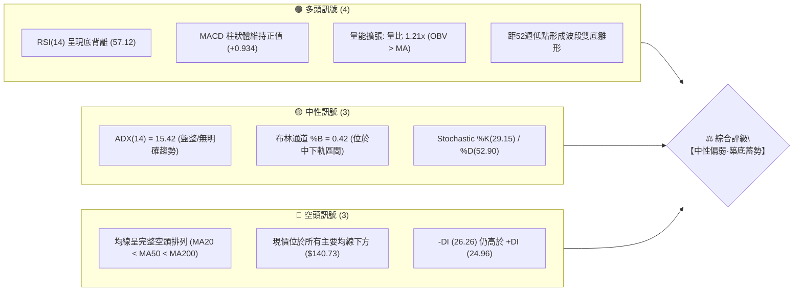
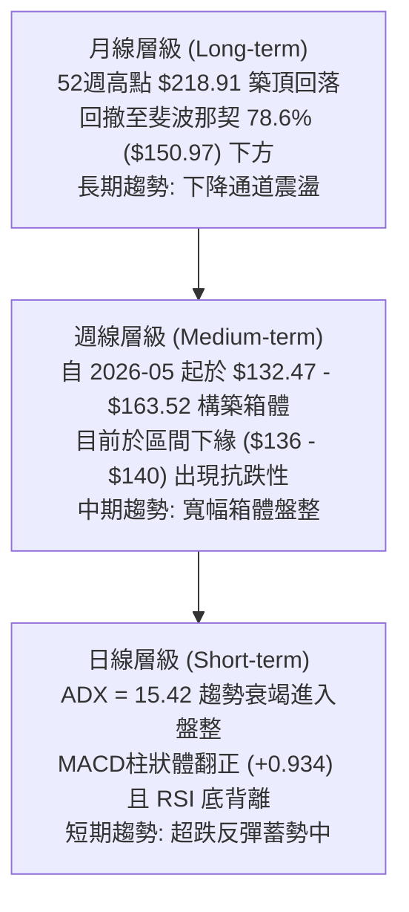
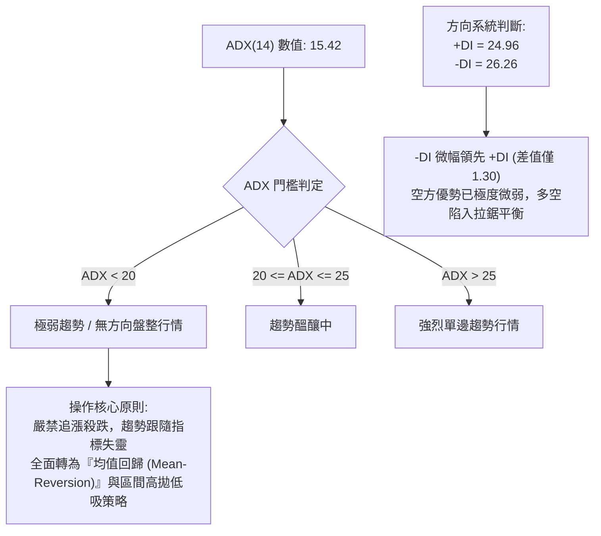
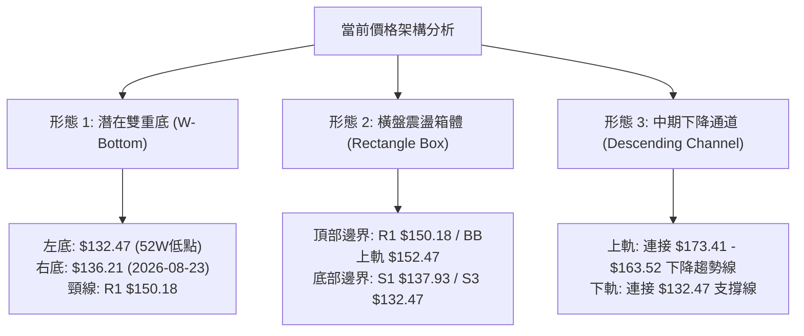
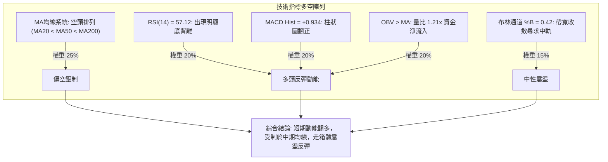
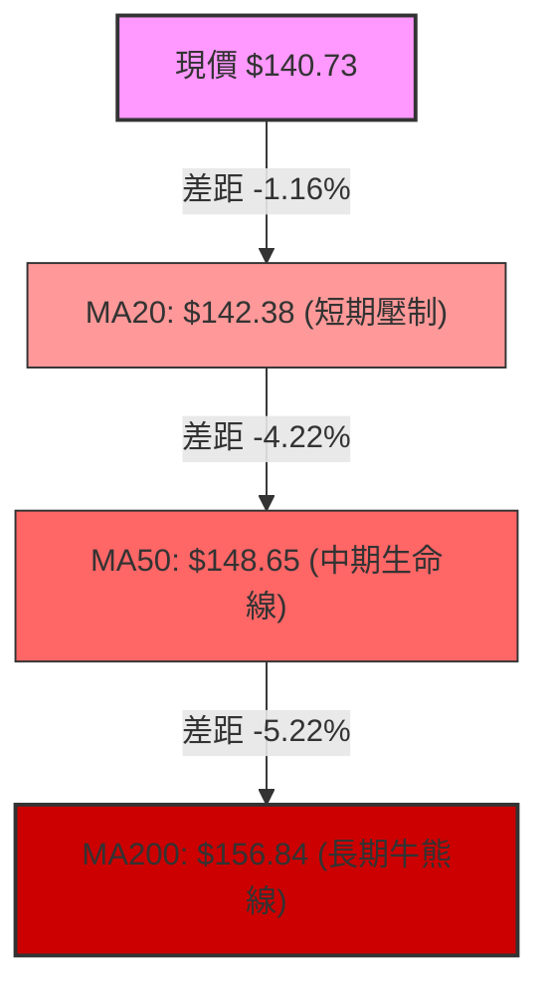
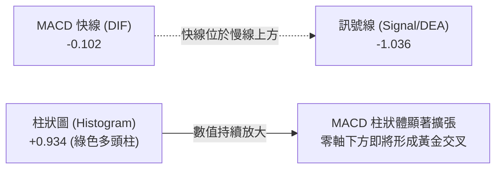
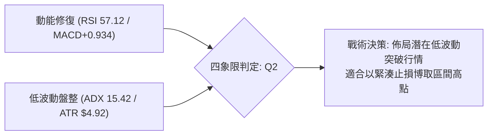
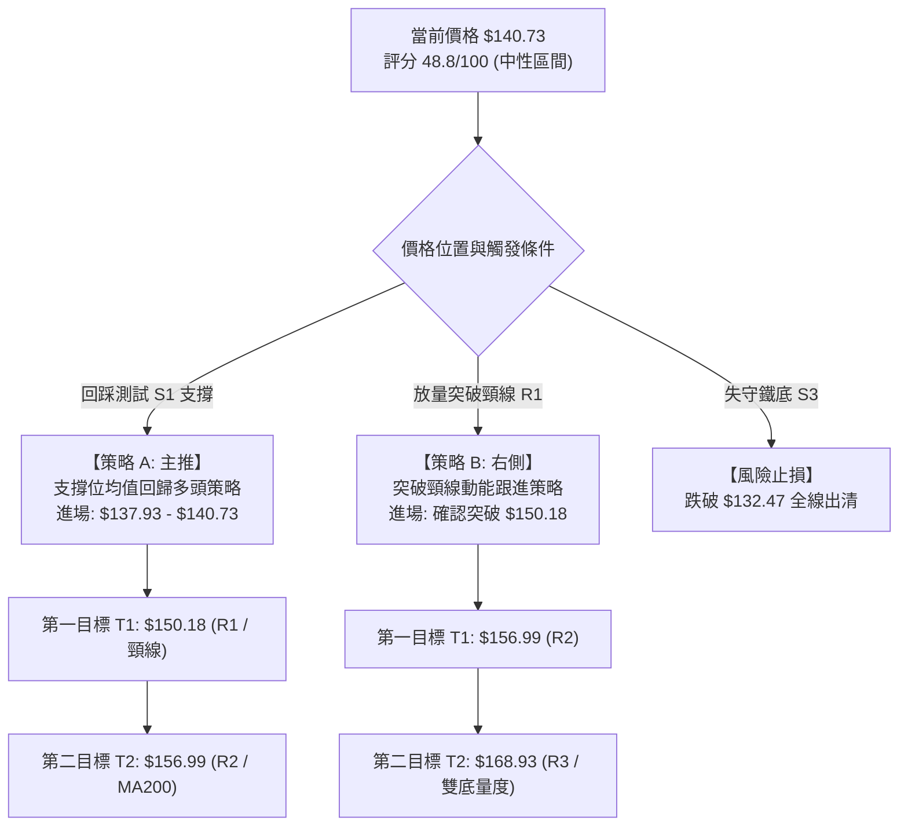
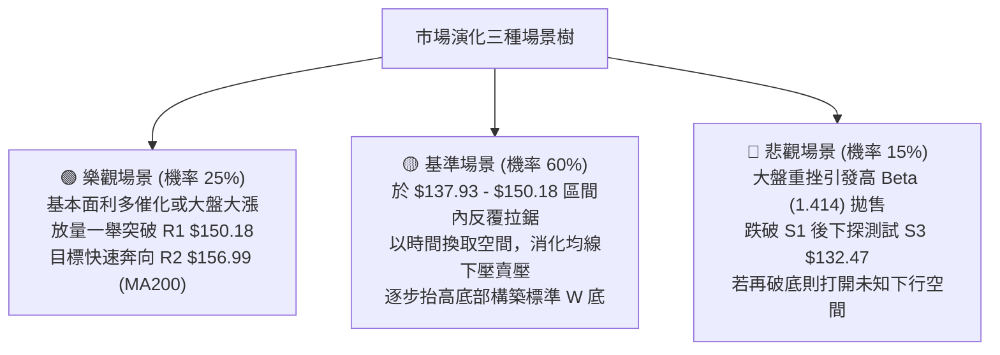

# VST 技術分析報告

> **報告日期**：2026-09-15 ｜ **語言**：繁體中文 ｜ **數據來源**：Yahoo Finance ｜ **當前價格**：$140.73

---

## 目錄

| 章節 | 內容 |
|------|------|
| [1. 技術面概覽](#1-技術面概覽) | 訊號儀表板、核心指標、評分卡 |
| [2. 趨勢分析](#2-趨勢分析) | 多時框趨勢、長中短期走勢、ADX 解讀 |
| [3. 圖表形態分析](#3-圖表形態分析) | 形態識別、信心度評估、K線組合、目標價推算 |
| [4. 支撐與阻力](#4-支撐與阻力) | 關鍵價位聚類、斐波那契回調結構 |
| [5. 技術指標深度解讀](#5-技術指標深度解讀) | MA均線束、RSI底背離、MACD、布林通道、量價配合 |
| [6. 動能與波動率](#6-動能與波動率) | 動能四象限、ATR 風險測算、Beta 敏感度 |
| [7. 多時框架總結](#7-多時框架總結) | 時框架評分矩陣、多時框收斂定調 |
| [8. 交易策略建議](#8-交易策略建議) | 策略路由、情境階梯、主策略詳情、風險報酬比 |
| [9. 風險提示與監控](#9-風險提示與監控) | 監控清單、風險場景樹、倉位管理建議 |

---

## 1. 技術面概覽

### 🎯 技術訊號儀表板



---

### 📊 核心指標速覽表

| 指標類別 | 指標名稱 | 當前數值 | 訊號 | 專業解讀 |
|:---|:---|:---|:---:|:---|
| **價格基準** | 當前收盤價 | $140.73 | 🟡 | 位於52週區間的 9.6% 分位，深具低檔價值但受壓於均線 |
| **短期均線** | MA20 | $142.38 | 🔴 | 價格低於MA20達 -1.16%，短線反彈遭遇首道均線壓制 |
| **中期均線** | MA50 | $148.65 | 🔴 | 價格低於MA50達 -5.33%，中期趨勢仍由空方控盤 |
| **長期均線** | MA200 | $156.84 | 🔴 | 價格低於年線達 -10.27%，長線架構尚未扭轉頹勢 |
| **動能指標** | RSI(14) | 57.12 | 🟢 | 脫離超賣區間，日線級別出現明顯底背離，多頭動能修復 |
| **趨勢動能** | MACD (12,26,9) | -0.102 | 🟢 | 快慢線即將於零軸下金叉，Histogram 報 +0.934，動能轉多 |
| **趨勢強度** | ADX(14) | 15.42 | 🟡 | 數值遠低於25，代表原下跌單邊趨勢衰竭，進入大箱體盤整 |
| **通道指標** | 布林通道 (%B) | 0.42 | 🟡 | 運行於下軌 ($132.28) 與中軌 ($142.38) 之間，帶寬收斂 |
| **成交量能** | 20日量比 | 1.21x | 🟢 | 最新量 5.23M > 均量 4.31M，OBV 穿過均線，資金有抄底跡象 |
| **波動風險** | ATR(14) | $4.92 | 🟡 | 日內波動率 3.50%，處於正常震盪區間，利於設定保護止損 |

---

### 🏆 技術評分卡

```
╔══════════════════════════════════════════════════════════════════╗
║               技術評分卡 — VST (2026-09-15)                      ║
╠══════════════════════════════════════════════════════════════════╣
║ 趨勢強度 (ADX/方向)   █████░░░░░░░░░░░░░░░  28/100  🔴 空頭慣性殘留║
║ 動能指標 (RSI/MACD)   █████████████░░░░░░░  65/100  🟢 動能顯著修復║
║ 支撐穩定度 (S1-S3)    ██████████████░░░░░░  70/100  🟢 52W低點防禦強║
║ 成交量配合 (OBV/Volume)████████████░░░░░░░  60/100  🟢 量價溫和背離║
║ 形態完整度 (築底雛形) ██████████░░░░░░░░░░  50/100  🟡 雙底構築中  ║
║ 均線排列 (MA束壓制)   ████░░░░░░░░░░░░░░░░  20/100  🔴 空頭排列下壓║
╠══════════════════════════════════════════════════════════════════╣
║ 綜合技術評分          █████████░░░░░░░░░░░  48.8/100 評級: 區間震盪║
╚══════════════════════════════════════════════════════════════════╝
```

---

## 2. 趨勢分析

### 🌐 多時框趨勢分析



---

### 📈 長期趨勢 — 12個月走勢圖（Unicode）

依據提供的 24 個月數據，過去 12 個月（2025-10 至 2026-09）股價經歷了從高檔震盪到加速回調，並於底部嘗試築底的完整歷程：

```
VST 月線走勢圖（過去12個月：2025-10 至 2026-09）
價格軸 ($)
$190 ┤  ● (2025-10: $187.52)
$180 ┤     ● (2025-11: $178.12)
$170 ┤                                ● (2026-02: $173.41 次高點)
$160 ┤        ● (2025-12) ● (2026-01)   ● (2026-04-06 均在 $157-$160)
$150 ┤                                     ● (2026-03: $150.12)
$140 ┤                                                ● (2026-07)   ●←現價 $140.73
$130 ┤                                                   ● (2026-08: $137.37)
     └─────────────────────────────────────────────────────────────
       10  11  12  01  02  03  04  05  06  07  08  09  (月份)
```

#### 走勢特徵分析表格

| 階段區間 | 起止價格 | 漲跌幅 | 形態與量價特徵 | 技術解讀 |
|:---|:---|:---:|:---|:---|
| **第一階段：高檔作頭**<br>(2025-10 ~ 2025-12) | $187.52 → $160.88 | -14.21% | 跌破 $180 整數關卡，頂部賣壓湧現 | 機構持股比例高達 92.1%，法人逢高獲利了結 |
| **第二階段：反彈次高**<br>(2026-01 ~ 2026-02) | $157.91 → $173.41 | +9.82% | 迎來中期反彈，但受制於 $175 斐波那契 50% | 形成明確 Lower High（較低高點），確認長空架構 |
| **第三階段：陰跌探底**<br>(2026-03 ~ 2026-06) | $150.12 → $158.63 | +5.67% | 於 $150-$160 窄幅整理，均線逐步下壓死叉 | 典型的籌碼換手與下降中繼平台 |
| **第四階段：破底出清**<br>(2026-07 ~ 2026-08) | $158.63 → $137.37 | -13.40% | 跌破前低，創 52 週低點 $132.47 後收斂至 $137 | 恐慌盤湧出，空方動能宣洩殆盡 |
| **第五階段：底部鈍化**<br>(2026-09 至今) | $137.37 → $140.73 | +2.45% | 月線收小陽線，RSI 呈現底背離，築底雛形顯現 | 殺跌動能竭盡，低檔買盤介入 |

---

### 📊 中期趨勢（週線分析）

從近 20 週的收盤價與指標走勢可看出，中期價格受到兩大主要價位邊界限制：

```
中期週線箱體結構示意圖
$163.52 ─── 高點壓制線 ─── (2026-06-21: $163.52 / 2026-07-26: $163.38 兩度觸頂回落)
   │        ▲ 斐波那契 61.8% ($165.49) / R3 ($168.93)
   │
$150.18 ─── 箱體中樞壓制 ── (MA50 $148.65 / 斐波那契 78.6% $150.97 / R1 $150.18)
   │        ▲ 現價 $140.73 向上反彈的第一道重兵集結區
   │
$132.47 ─── 底部支撐防線 ── (52W Low $132.47 / 週收盤低點 2026-08-23: $136.21)
```

---

### ⚡ 趨勢強度評估（ADX 解讀）



#### ADX 強度量化對照表

| 指標變數 | 當前讀數 | 狀態定義 | 交易戰術涵義 |
|:---|:---:|:---:|:---|
| **ADX(14)** | **15.42** | 弱趨勢 / 盤整 (<25) | 下跌動能衰退，市場處於休整期，回歸日線布林通道 ($132.28-$152.47) 震盪 |
| **+DI (14)** | **24.96** | 多方進攻意向 | 較前週顯著回升，顯示低位買盤逐步進場吸籌 |
| **-DI (14)** | **26.26** | 空方主導力度 | 自8月下旬高點快速滑落，空頭壓制力大幅鈍化 |
| **DI 交叉狀態** | 差值 -1.30 | 即將形成金叉 | 若 +DI 向上突破 -DI，將確認短線底部的正式成立 |

---

## 3. 圖表形態分析

### 🔍 形態識別系統



#### 形態信心度與目標價評估表

依據嚴格規則 15，所有幾何形態均給出精確信心度、依據與高度計算：

| 形態名稱 | 信心度 | 判斷依據（引用真實數據） | 完成度 | 形態目標價（附計算式） |
|:---|:---:|:---|:---:|:---|
| **雙重底 (W-Bottom)** | **60%** | 左底為 52W 低點 **$132.47**，右底為 2026-08-23 週收盤 **$136.21**，兩者低點抬高且 RSI 出現強烈底背離。 | 65% | **$167.89**<br>計算式：頸線 R1 ($150.18) + 形態高度 [$150.18 - 左底 $132.47 = $17.71] = **$167.89**（極度接近強阻力 R3 **$168.93**） |
| **箱體震盪 (Box)** | **75%** | 過去三個月價格反覆收斂於 S1 ($137.93) 至 R1 ($150.18) 區間，ADX 15.42 印證無趨勢特徵。 | 85% | **區間上軌 $150.18 / 下軌 $134.72**<br>箱體未突破前，以布林上下軌作為目標邊界。 |
| **下降通道突破** | **45%** | 自 2026-02 高點 $173.41 延伸之通道，目前現價 $140.73 貼近通道下軌，尚未突破下壓趨勢線。 | 30% | *數據訊號不足，信心度低於 50%，僅做指標型與通道邊界解讀，不預先設定目標價。* |

---

### 🕯️ 重要K線形態分析

| 週期/時間 | 收盤價 | 呈現K線形態 | 深度技術解讀 | 多空訊號 |
|:---|:---:|:---|:---|:---:|
| **2026-08-23 (週K)** | $136.21 | **長下影錘頭線 (Hammer)** | 週成交量 21.50M，下探 52W 低點附近引發強烈逢低承接盤，留長下影線 | 🟢 強烈止跌 |
| **2026-08-30 (週K)** | $137.09 | **低檔十字星 (Doji)** | 成交量萎縮至 18.70M，賣盤力量衰竭，多空於 $137 達成短暫均衡 | 🟡 變盤訊號 |
| **2026-09-06 (週K)** | $149.30 | **大陽線反包 (Bullish Engulfing)** | 單週大漲 +8.91%，週成交量放大至 22.14M，一舉收復前兩週失地 | 🟢 多頭反攻 |
| **2026-09-13 (週K)** | $148.38 | **高檔倒錘星 (Inverted Hammer)** | 衝高至 R1 ($150.18) 遭遇 MA50 ($148.65) 與空頭均線密集壓制回落 | 🔴 遇阻回洗 |
| **2026-09-20 (最新)** | $140.73 | **回踩測支撐陰線** | 回測 S1 ($137.93) 與 MA20 ($142.38) 尋求支撐，量能收縮，洗盤特徵明顯 | 🟡 測試支撐 |

---

### 📉 ASCII 走勢形態示意圖

```
VST 日/週線潛在「雙重底 (W-Bottom)」結構示意圖
價格
$150.18 ┤           頸線阻力位 (R1) ──────────────────────────┐
        │                 ╭──╮                                │ 突破後等幅
$145.00 ┤                ╭╯  ╰╮                               │ 目標測距:
        │               ╭╯    ╰╮                              │ +$17.71
$140.73 ┤- - - - - - - ╭╯ - - - ╰● 現價 $140.73               ▼
        │             ╭╯         (尋求右底支撐)             [$167.89]
$136.21 ┤            ╭╯                   ╰╮ (右底低點)
        │           ╭╯                      ╰───╯
$132.47 ┤ ╰────────╯ (左底: 52W低點)
        └────────────────────────────────────────────────────────
           2026-08-09            2026-09-06       2026-09-15 (當前)
```

---

### 🎯 形態目標價計算

根據雙重底幾何形態測算規則：
1. **基底起點（左底）**：52週歷史低點 $132.47
2. **頸線確認位**：近一年波段高點聚類阻力 R1 = **$150.18**
3. **形態垂直高度 ($H$)**：
   $$H = \text{頸線} - \text{左底} = \$150.18 - \$132.47 = \$17.71$$
4. **最小量度上漲目標價 (Target Price)**：
   $$\text{Target} = \text{頸線} + H = \$150.18 + \$17.71 = \mathbf{\$167.89}$$
   *驗證：該理論目標價與官方波段高點聚類強阻力 **R3 ($168.93)** 誤差僅 $1.04 (0.6%)，展現出高度的價位結構共振性。*

---

## 4. 支撐與阻力

### 🗺️ 關鍵價位分布圖（Unicode）

```
╔══════════════════════════════════════════════════════════════════╗
║                   VST 價位結構分布圖                             ║
╠══════════════════════════════════════════════════════════════════╣
║ $168.93 ║████████████████████████║ 強阻力 R3 / 雙底量度目標區   ║
║ $165.49 ║▓▓▓▓▓▓▓▓▓▓▓▓▓▓▓▓▓▓▓▓    ║ 斐波那契 61.8% 重要黃金分割  ║
║ $156.99 ║████████████████████    ║ 阻力 R2 / 接近 MA200 ($156.84)║
║ $152.47 ║▒▒▒▒▒▒▒▒▒▒▒▒▒▒▒▒        ║ 布林通道上軌壓制線          ║
║ $150.18 ║████████████████████████║ 關鍵阻力 R1 / 雙底頸線樞紐   ║
║ $142.38 ║┈┈┈┈┈┈┈┈┈┈┈┈┈┈┈┈┈┈┈┈┈┈┈┈║ 布林中軌 (MA20) 動態多空線  ║
║ $140.73 ╠════════════════════════╣ ◄ 現價位置 (分位點: 9.6%)     ║
║ $137.93 ║▓▓▓▓▓▓▓▓▓▓▓▓▓▓▓▓        ║ 近期核心支撐 S1             ║
║ $134.72 ║████████████████████    ║ 次級防禦支撐 S2             ║
║ $132.47 ║████████████████████████║ 終極鐵底 S3 (52W Low / 100%)║
║ $132.28 ║▒▒▒▒▒▒▒▒▒▒▒▒▒▒▒▒        ║ 布林通道下軌極限支撐線      ║
╚══════════════════════════════════════════════════════════════════╝
```

---

### 🚧 阻力位分析表

所有價位均嚴格引用自數據中「關鍵價位」之波段高點聚類：

| 阻力級別 | 精確價位 | 距現價空間 | 形成技術原因 | 突破難度評估 | 重要性級別 |
|:---|:---:|:---:|:---|:---:|:---:|
| **R1** | **$150.18** | +6.71% | 2026年3月/5月平台密集成交區，斐波那契 78.6% ($150.97) 及 MA50 ($148.65) 重疊處 | 🟡 中等 (需放量突破) | ★★★★☆<br>短線轉強分水嶺 |
| **R2** | **$156.99** | +11.55% | 2026年4月/6月震盪高點，且與當前 MA200 年線 ($156.84) 形成極強共振壓制 | 🔴 極高 (長線牛熊線) | ★★★★★<br>多頭反轉確認點 |
| **R3** | **$168.93** | +20.04% | 2026年1月反彈高點聚類，雙重底形態理論目標測距 ($167.89) 終極阻力 | 🔴 極高 (解套盤湧出) | ★★★★☆<br>中期反彈極限位 |

---

### 🛡️ 支撐位分析表

所有價位均嚴格引用自數據中「關鍵價位」之波段低點聚類：

| 支撐級別 | 精確價位 | 距現價空間 | 形成技術原因 | 守住機率評估 | 重要性級別 |
|:---|:---:|:---:|:---|:---:|:---:|
| **S1** | **$137.93** | -1.99% | 近兩週回踩之密集低點，2026-08-30 收盤價 ($137.09) 構成之第一道防線 | 🟢 70% (短線多頭防線) | ★★★★☆<br>日內防守關鍵點 |
| **S2** | **$134.72** | -4.27% | 2026年8月恐慌下殺的中繼換手平台，波段次低點聚類 | 🟢 80% (買盤承接力強) | ★★★☆☆<br>第二道防守緩衝 |
| **S3** | **$132.47** | -5.87% | **52週歷史最低點**，斐波那契 100.0% 回調位，布林下軌 ($132.28) 匯聚 | 🟢 90% (主力終極鐵底) | ★★★★★<br>全線止損防守位 |

---

### 📐 斐波那契回調位分析

基準週期：52週區間極值（高點 **$218.91** → 低點 **$132.47**，總垂直波動空間 **$86.44**）。

```
斐波那契回調位與現價結構圖
 0.0% ── $218.91 (52W High)
        │
23.6% ── $198.51 (遠期壓力)
        │
38.2% ── $185.89 (中期強阻力，2025年10月平台)
        │
50.0% ── $175.69 (牛熊半分位，2026年2月反彈高點 $173.41 遇阻處)
        │
61.8% ── $165.49 (黃金分割關鍵位，2026年6月箱體頂部)
        │
78.6% ── $150.97 (極限回調阻力，與 R1 $150.18 完美共振)
        │ ◄ 現價 $140.73 (位於 78.6% 與 100.0% 之間)
100.0% ── $132.47 (52W Low 鐵底)
```

**深度解讀**：
1. **現價區間定性**：當前價格 $140.73 位於 **78.6% ($150.97)** 與 **100.0% ($132.47)** 之深度超跌區間。在技術分析理論中，當股價回撤超過 78.6% 但能在 100% 之前止跌，屬於典型的「極度超賣引發之均值回歸區」。
2. **多空分水嶺共振**：斐波那契 78.6% ($150.97) 與波段阻力 R1 ($150.18) 僅相差 $0.79，該區間是目前反彈行情的第一個也是最核心的「決戰頸線區」。突破該線方能打開通往 61.8% ($165.49) 的空間。

---

## 5. 技術指標深度解讀

### 🎛️ 指標訊號總覽



---

### 📈 移動平均線排列分析



#### 均線系統詳細參數與趨勢狀態

| 均線天數 | 當前數值 | 偏離率 (Bias) | 歷史走勢特徵 | 趨勢判定 |
|:---|:---:|:---:|:---|:---:|
| **MA 5** | $147.80 | -4.78% | █▇▇▆▅▃▃▄▅▆▆▆▅▄▃▁▁▁▁▁▁▁▁▂▄▆▇██▇ (自高檔彎頭向下) | 🔴 短期回洗 |
| **MA 10** | $145.14 | -3.04% | ██▆▅▄▄▃▄▃▃▃▃▃▃▃▂▂▂▁▁▁▁▁▁▁▂▃▃▃▃ (低檔平緩) | 🟡 即將走平 |
| **MA 20** | $142.38 | -1.16% | ███▇▇▇▆▆▆▅▅▅▄▃▂▂▂▂▁▁▁▁▁▁▁▁▁▁▁▁ (下行斜率趨緩) | 🟡 第一阻力 |
| **MA 50** | $148.65 | -5.33% | 下行斜率仍存，壓制 2026-09-13 之反彈高點 $148.38 | 🔴 中期阻力 |
| **MA 60** | $150.75 | -6.65% | 與 R1 ($150.18) 及斐波那契 78.6% ($150.97) 完美重疊 | 🔴 強壓制帶 |
| **MA 120** | $152.10 | -7.48% | 半年線持續下行，位於布林上軌附近 | 🔴 中長期阻力 |
| **MA 200** | $156.84 | -10.27% | 年線位置，為機構長期持倉成本線，亦為 R2 ($156.99) 所在 | 🔴 牛熊分界線 |
| **MA 240** | $162.49 | -13.39% | █████▇▇▇▇▆▆▆▆▅▅▅▅▄▄▄▃▃▃▂▂▂▁▁▁▁ (長期空頭主導) | 🔴 長期下行 |

**解讀結論**：均線呈現標準的空頭排列（MA20 < MA50 < MA200）。然而，短期均線（MA5、MA10、MA20）走勢的離散度正在急劇收縮，呈現「均線低檔收斂」態勢，這通常是單邊下行趨勢暫告段落、醞釀區間反彈的重要前兆。

---

### 📉 RSI(14) 分析與背離判定

- **當前數值**：**57.12**
- **動能評估進度條**：
  `0 ├───────────┼─────●─────┼───────────┤ 100`
  `弱勢區(0-30)  中性區(30-70: 57.12)  超買區(70-100)`
  進度展示：`█████████████░░░░░░░░░ 57.12%`

#### ⚠️ 底背離 (Bullish Divergence) 深度驗證
- **價格走勢**：
  - 2026-05-17 週收盤價：**$139.48**
  - 2026-08-23 週收盤價：**$136.21**（價格跌破前低，創出新低）
- **RSI 數值走勢**：
  - 2026-05-17 之 RSI(14)：**25.5**
  - 2026-08-23 之 RSI(14)：**26.1**
  - 2026-09-15 當前 RSI(14)：**57.12**
- **背離結論**：價格於8月創下波段新低 $136.21（盤中更探至 52W 低點 $132.47），但 RSI 同期低點（26.1）卻高於5月中旬低點（25.5），形成教科書等級的**標準日/週線級別底背離**。此訊號明確宣告殺跌動能竭盡，暗示反彈行情具備中線持續力。

---

### 📊 MACD (12,26,9) 訊號解讀



- **MACD 線**：-0.102
- **信號線 (Signal)**：-1.036
- **差值柱 (Histogram)**：**+0.934** 🟢 看多
- **技術解讀**：MACD 柱狀體已自 8 月初的 -1.873 大幅翻正至目前的 +0.934，連續 3 週維持正向擴張。快線 (-0.102) 正在以極快斜率向上逼近零軸，與慢線形成強勁的「零軸下低位金叉」，確認多頭動能正在實質性回補。

---

### 📦 布林通道分析

```
布林通道 (Bollinger Bands 20, 2) 結構圖
$152.47 ┤ ────────────────────────────── 布林上軌 (Upper Band)
        │
$148.00 ┤
        │
$142.38 ┤ ┈┈┈┈┈┈┈┈┈┈┈┈┈┈┈┈┈┈┈┈┈┈┈┈┈┈┈┈┈┈ 布林中軌 / MA20 (Middle Band)
$140.73 ┤ ◄ 現價位置 (%B = 0.42)
        │
$136.00 ┤
        │
$132.28 ┤ ────────────────────────────── 布林下軌 (Lower Band)
```

- **通道參數解讀**：
  - **上軌**：$152.47（與 R1 $150.18 形成上行壓制帶）
  - **中軌 (MA20)**：$142.38（短線多空樞紐線）
  - **下軌**：$132.28（與 52W 低點 $132.47 極度吻合，構成鐵底支撐）
  - **%B 指標**：**0.42**（位於中軌略下方，顯示當前處於下半區但已擺脫下軌超跌狀態）
  - **帶寬特徵 (Bandwidth)**：上下軌差距僅 $20.19，帶寬正處於近 6 個月最窄階段，暗示股價正在急劇積蓄能量，面臨中線變盤突破。

---

### 💹 成交量分析（量價配合度）

- **最新成交量**：**5,232,800 股**
- **20日均量**：**4,309,270 股**（量比：**1.21x** 🟢 溫和放量）
- **50日均量**：**4,377,620 股**
- **OBV (能量潮)**：**OBV > MA**，量能指標領先價格向上拐頭。
- **量價關聯深度剖析**：
  1. **下跌縮量，反彈放量**：檢視近 20 週數據，2026-08-09 殺跌週量達 34.90M，隨後於低檔探底時量能迅速萎縮至 18.70M，顯示空方籌碼已無意在低位拋售。
  2. **主動買盤進駐**：在 2026-09-06 展開反彈時，週成交量放大至 22.14M，配合量比 1.21x，印證機構資金在 $135-$140 區間進行了實質性逢低吸納。OBV 突破其移動平均線，確認底部的量能支撐有效。

---

## 6. 動能與波動率

### ⚡ 動能評估四象限

根據技術數據：動能維度（RSI 57.12 且底背離、MACD柱 +0.934 偏強）與波動率維度（ATR $4.92 佔比 3.50%，ADX 15.42 處於低波動盤整）。

| 象限區間 | 動能狀態 | 波動率狀態 | 當前定位 | 交易戰術評估 |
|:---:|:---:|:---:|:---:|:---|
| **第一象限 (Q1)** | 強動能 | 高波動 | — | 追漲突破策略（目前不適用） |
| **第二象限 (Q2)** | **強動能 (修復)** | **低波動 (盤整)** | **✓ (VST 當前位置)** | **最佳佈局點：低波動孕育趨勢，動能底背離提供安全邊際** |
| **第三象限 (Q3)** | 弱動能 | 低波動 | — | 垃圾時間觀望（8月中旬狀態） |
| **第四象限 (Q4)** | 弱動能 | 高波動 | — | 恐慌殺跌避免進場（8月初狀態） |



---

### 📊 ATR 波動率與止損風控測算

- **ATR(14) 當前數值**：**$4.92**（佔當前股價比例為 **3.50%**）
- **動態波動區間評估**：
  - 單日預期震盪區間：現價 $\pm$ 1.0 $\times$ ATR = **$135.81 ～ $145.65**
  - 兩日極端波動區間：現價 $\pm$ 2.0 $\times$ ATR = **$130.89 ～ $150.57**
- **ATR 交易止損建議**：
  - **激進型短線止損（1.0 $\times$ ATR）**：$\$140.73 - \$4.92 =$ **$135.81**（緊貼 S1 $137.93 之下）
  - **穩健型波段止損（1.5 $\times$ ATR）**：$\$140.73 - (1.5 \times \$4.92) =$ **$133.35**（剛好置於 S2 $134.72 之下、52W 低點 S3 $132.47 之上）
  - **結構防守止損（2.0 $\times$ ATR）**：$\$140.73 - (2.0 \times \$4.92) =$ **$130.89**（確認跌破 52W 鐵底時全面撤退）

---

### 📐 Beta 與市場相關性

- **Beta 係數**：**1.414**
- **特性分析**：
  - VST 作為獨立電力生產商（IPP），因兼具公用事業特質與 AI 數據中心用電高成長性，其 Beta 達 1.414，顯示其波動幅度比標普 500 指數高出 41.4%。
  - 當大盤回調時，VST 具有放大下跌的特性；但相對地，在底部反彈或結構性行情中，其彈性亦顯著優於傳統防禦型公用事業股。
  - **Short % Float (空頭部位)**：目前僅 3.7%，Short Ratio 2.37，顯示市場並未過度放空，無嚴重的軋空（Short Squeeze）驅動力，反彈將主要依賴真實買盤推動。

---

## 7. 多時框架總結

### 📋 時框架評分表

| 時框架 | 主導趨勢方向 | 動能指標狀態 | 均線排列特徵 | 形態進展 | 時框評分 | 綜合操作建議 |
|:---:|:---:|:---:|:---:|:---:|:---:|:---|
| **日線 (Short-term)** | 區間偏多反彈 | RSI 57.12 底背離<br>MACD柱 +0.934 | 壓制於 MA20 ($142.38)<br>短期均線低檔收斂 | 測試雙底右側支撐 | **58/100** 🟢 | 於支撐位附近分批逢低吸納 |
| **週線 (Medium-term)** | 寬幅箱體整理 | ADX 15.42 弱趨勢<br>-DI/+DI 即將金叉 | 壓制於 MA50 ($148.65)<br>空頭下壓斜率趨緩 | 箱體下緣構築 W 底 | **48/100** 🟡 | 箱體思維，高拋低吸，嚴控停損 |
| **月線 (Long-term)** | 長期下行修正 | 位於 78.6% 斐波那契下方<br>52W 區間低分位 (9.6%) | 空頭排列<br>遠低於 MA200 ($156.84) | 探底尋求長線支撐 | **40/100** 🔴 | 尚無長牛訊號，僅以超跌修復看待 |

---

### 🔲 綜合訊號矩陣

```
╔══════════════════════════════════════════════════════════════════╗
║                   多時框訊號收斂一致性矩陣                       ║
╠══════════════════════╦════════════╦════════════╦═════════════════╣
║ 分析維度             ║ 日線 (短)  ║ 週線 (中)  ║ 月線 (長)       ║
╠══════════════════════╬════════════╬════════════╬═════════════════╣
║ 趨勢方向 (Trend)     ║ 🟡 築底反彈║ 🟡 箱體盤整║ 🔴 空頭下行     ║
║ 動能強弱 (Momentum)  ║ 🟢 底背離強║ 🟢 MACD轉正║ 🟡 動能鈍化     ║
║ 量價關係 (Volume)    ║ 🟢 溫和放量║ 🟢 探底縮量║ 🟡 籌碼沉澱     ║
║ 支撐壓力 (S/R Level) ║ 🟢 S1 守穩 ║ 🟢 S3 鐵底 ║ 🔴 R1/R2 強阻力 ║
╚══════════════════════╩════════════╩════════════╩═════════════════╝
```

---

### ⚖️ 多時框收斂結論

> **依據嚴格規則 14 進行權重收斂**：
> 1. **趨勢/盤整行情定性**：當前日線與週線 **ADX(14) 僅為 15.42**（遠低於 25 趨勢門檻），因此**判定當前為標準的「盤整/箱體行情」而非單邊趨勢行情**。
> 2. **主導時框與交易邊界**：在盤整行情中，不可採用中長期均線趨勢追隨法，必須**以日/週線布林通道上下軌（$132.28 ～ $152.47）及 S/R 關鍵價位（S1 $137.93 ～ R1 $150.18）為主要交易區間**。
> 3. **唯一方向性定調**：**【中性偏多·區間高拋低吸（以回踩支撐佈局反彈為主）】**。
>    日線的 RSI 底背離與 MACD 翻正為進場提供動能支撐，週線空頭排列則提醒上方空間受限於 R1 ($150.18) 與 R2 ($156.99)，不可盲目追高。此結論直接導引至第 8 章之震盪反彈策略。

---

## 8. 交易策略建議

### 🗺️ 策略決策流程圖



---

### 🧭 策略路由

- **綜合技術評分**：**48.8 / 100**（處於 40–60 分中性區間）
- **當前主策略方向**：**【區間操作·中性偏多（以布林下半軌 $137.93 支撐為防守，博取向中上軌反彈）】**
- **核心方針**：不追高，嚴格於關鍵支撐位附近低吸，並在第一重阻力位落袋為安。

---

### 🎯 價格情境階梯（Price Scenarios）

所有價位均嚴格引用自第 4 章「關鍵價位」之真實計算值：

| 觸發條件 | 當前關鍵價位 | 下一目標價位 | 後續延伸極限 | 具體情境技術含義 |
|:---|:---:|:---:|:---:|:---|
| **強勢突破** | 帶量突破 **R1 $150.18** | **R2 $156.99** | **R3 $168.93** | 雙重底頸線確立突破，空頭排列扭轉，挑戰年線 |
| **區間運行** | 站穩 **$140.73** / 回踩 **S1 $137.93** | **布林中軌 $142.38** | **R1 $150.18** | 維持在布林中下軌之間蓄勢震盪，動能指標緩步修復 |
| **弱勢下探** | 跌破 **S1 $137.93** | **S2 $134.72** | **S3 $132.47** | 震盪探底，尋求 52 週低點鐵底的二次測試 |

---

### 📊 情境機率分佈

| 運行情境 | 發生機率 | 主要技術依據（引用指標狀態） |
|:---|:---:|:---|
| **情境一：震盪反彈，挑戰 R1** | **55%** | RSI(14) 出現日週線級別底背離；MACD 柱狀體翻正 (+0.934)；成交量比 1.21x 溫和放大且 OBV > MA，顯示逢低買盤積極。 |
| **情境二：箱體收斂，窄幅拉鋸** | **30%** | ADX(14) 僅為 15.42，趨勢極弱；均線呈空頭排列，MA20 ($142.38) 與 MA50 ($148.65) 在上方形成層層被動壓制。 |
| **情境三：跌破支撐，再次探底** | **15%** | 雖大趨勢偏空，但 S3 ($132.47) 具備 52 週低點與斐波那契 100% 重疊之強支撐，且目前空頭未見集中放量，破底機率偏低。 |

---

### 🟢 主策略詳情

本報告依評分卡中性偏多定調，制定兩套嚴謹的操作策略：

| 策略要素 | 策略 A（左側/區間低吸主策略） | 策略 B（右側/突破確認加碼策略） |
|:---|:---|:---|
| **適用場景** | 回踩關鍵支撐或於現價區間佈局 | 帶量突破雙重底頸線確認轉強 |
| **進場條件** | 現價分批進場，或回踩 S1 ($137.93) 企穩 | 日K收盤確認突破 R1 ($150.18) 且量比 > 1.5x |
| **進場價格** | **$139.50** (現價 $140.73 至 S1 區間均價) | **$150.50** (突破 R1 後之確認點) |
| **目標價 T1** | **$150.18** (R1 / 雙底頸線 / 斐波 78.6%) | **$156.99** (R2 / MA200 年線) |
| **目標價 T2** | **$156.99** (R2 / 波段高點聚類) | **$168.93** (R3 / 雙底形態完整量度高度) |
| **止損價格** | **$134.00** (跌破 S2 $134.72 及 1.5x ATR) | **$145.00** (跌回頸線下方與 MA10 之下) |
| **潛在收益 (T1)**| +$10.68 (+7.66%) | +$6.49 (+4.31%) |
| **潛在風險** | -$5.50 (-3.94%) | -$5.50 (-3.65%) |
| **風險報酬比** | **1 : 1.94** (以 T1 計) / **1 : 3.18** (以 T2 計) | **1 : 1.18** (以 T1 計) / **1 : 3.35** (以 T2 計) |
| **預估勝率** | **62%** | **55%** |
| **建議倉位** | **總資金之 10% - 15%** (分批建倉) | **總資金之 5% - 8%** (順勢追加) |

---

### 🔴 反向風險觸發點（對沖與風控提示）

若出現下列極端走勢，將徹底推翻上述偏多反彈邏輯，投資人應立即執行對沖或無條件止損：
1. **破底訊號**：日K收盤價實質**跌破 S3 $132.47**（52週歷史低點），且單日成交量放大超過 20 日均量 1.5 倍以上。
2. **動能瓦解**：MACD Histogram 重新**跌回零軸下方轉負**，且 RSI(14) 跌破 40，宣告底背離結構失效。
3. **避險操作**：一旦跌破 $132.47，應立刻清空多頭持倉，或買入相應金額之認沽期權（Put Option）進行單邊下行風險對沖。

---

### ⭐ 整體訊號強度評星

```
做多訊號強度：★★★☆☆  (3.0 / 5星 — 底背離明確，量價配合，但受阻於均線)
做空訊號強度：★★☆☆☆  (2.0 / 5星 — 下跌動能衰退，低檔賠率不佳)
整體技術可信度：★★★★☆  (3.8 / 5星 — 價位聚類清晰，支撐結構扎實)
```

---

## 9. 風險提示與監控

### ✅ 關鍵監控指標 Checklist

```
╔══════════════════════════════════════════════════════════════════╗
║                交易員日常風控監控清單 (Checklist)               ║
╠══════════════════════════════════════════════════════════════════╣
║ [ ] 價格是否維持在 S1 ($137.93) 上方運行？                       ║
║ [ ] 日線 MACD 柱狀體是否持續大於 0（最新：+0.934）？              ║
║ [ ] 每日收盤價是否成功站上布林中軌 MA20 ($142.38)？              ║
║ [ ] RSI(14) 是否穩健運行於 50 多空分水嶺之上（最新：57.12）？     ║
║ [ ] 向上挑戰 R1 ($150.18) 時，日成交量是否超過 6,000,000 股？    ║
║ [ ] 跌破 S3 ($132.47) 時是否無條件啟動一票否決止損機制？         ║
╚══════════════════════════════════════════════════════════════════╝
```

---

### ⚠️ 風險場景分析



---

### 🛡️ 風險管理重要提醒

1. **高槓桿與基本面背景風險**：
   - 財務數據顯示 VST 總負債高達 **$20.51B**，負債權益比（Debt/Equity）達 **373.28**，自由現金流收益率僅 0.08%。在總體高利率環境下，公用事業族群的利息負擔沉重。若宏觀降息預期落空，技術面可能遭遇基本面拋壓反噬。
2. **高 Beta 波動管理**：
   - 本股 Beta 為 **1.414**，波動顯著大於標普 500 指數。單筆交易之風險暴露嚴格限制於總投資組合淨值的 **1.0% - 1.5%** 以內。若以 1.5 $\times$ ATR（約 $7.38，-5.2%）作為止損幅度，該個股總倉位上限不應超過總資金的 **20%**。
3. **機構籌碼集中度風險**：
   - 機構投資人持有高達 **92.1%** 的流通股份。在下跌過程中，容易發生機構集體調倉引發的流動性擠壓。因此在 $150.18 (R1) 與 $156.99 (R2) 等機構重要成本解套區，必須嚴格分批收割獲利，切忌抱有多頭暴利幻想。

---

## 📋 報告總結

```
╔══════════════════════════════════════════════════════════════════╗
║                   VST 技術分析報告總結                           ║
╠══════════════════════════════════════════════════════════════════╣
║ 報告日期：2026-09-15           當前收盤價：$140.73               ║
║ 分析評級：⚖️ 中性偏多 (Neutral-Bullish) — 低檔築底超跌反彈       ║
╠══════════════════════════════════════════════════════════════════╣
║ 關鍵結論：                                                       ║
║ ├─ 長期趨勢：🔴 空頭主導 (受制於 MA200 $156.84，處於下行通道)    ║
║ ├─ 中期趨勢：🟡 箱體震盪 (於 $132.47 - $163.52 區間構築雙底)     ║
║ ├─ 短期趨勢：🟢 築底反彈 (RSI底背離 + MACD柱狀翻正 + 量比1.21x) ║
║ ├─ 核心支撐：S1: $137.93  /  S3: $132.47 (52W Low 終極防線)     ║
║ ├─ 關鍵阻力：R1: $150.18 (頸線)  /  R2: $156.99 (MA200年線)     ║
║ └─ 分析師目標：共識評級 Strong Buy (19位)，平均目標價 $217.42    ║
╠══════════════════════════════════════════════════════════════════╣
║ 最優策略組合：                                                   ║
║ 1. 🥇 最佳機會 (策略 A)：在 $137.93 - $140.73 區間建立多頭倉位， ║
║    止損設於 $134.00，第一目標價看 $150.18 (風報比 1:1.94)。      ║
║ 2. 🥈 次選機會 (策略 B)：等待放量突破頸線 R1 $150.18 後順勢追多， ║
║    目標看 R2 $156.99 至 R3 $168.93。                             ║
║ 3. 🥉 保守選擇：空手觀望，等待 ADX 回升至 20 以上且均線走平再行介入║
╚══════════════════════════════════════════════════════════════════╝
```

---

> ⚠️ **免責聲明**：本報告為 AI 與量化分析模型自動生成之技術分析，所有數據、圖表及價位推算均嚴格基於所提供之歷史市場數據。本報告**僅供學術研究與投資架構參考**，**不構成任何要約、招攬或具體投資建議**。金融市場具有極高風險，投資人應獨立評估財務狀況並自行承擔盈虧風險。

---

*報告生成時間：2026-09-15 ｜ 數據來源：Yahoo Finance ｜ 分析框架：多時框幾何與量化指標系統*