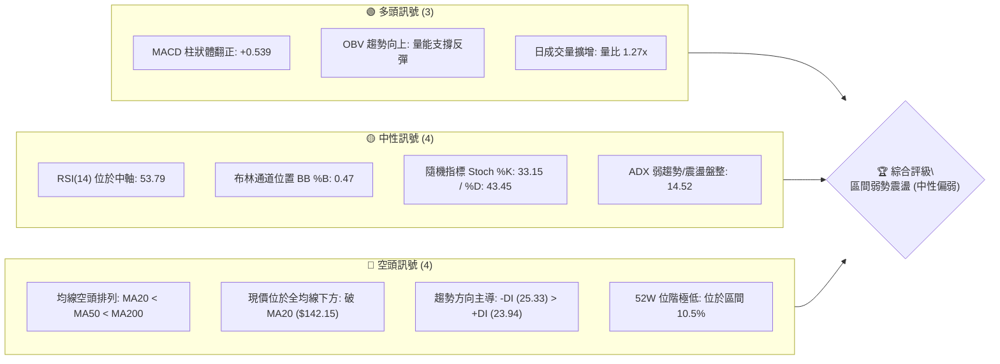
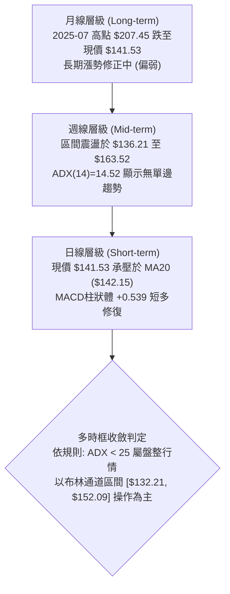
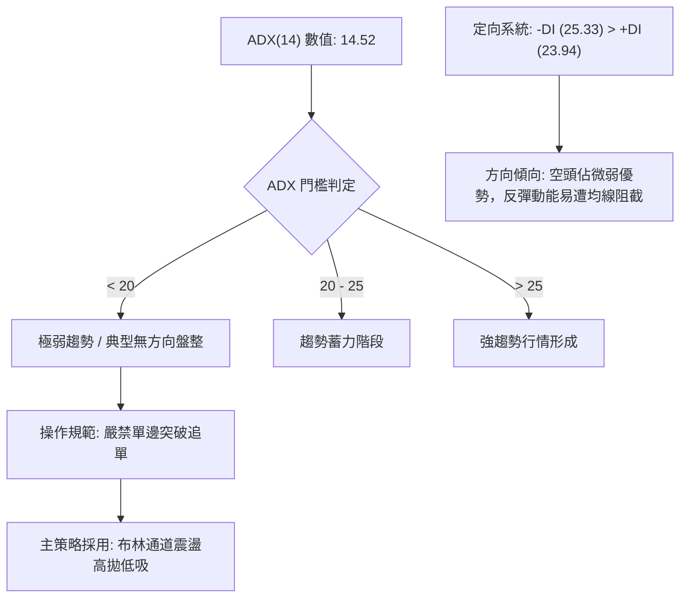
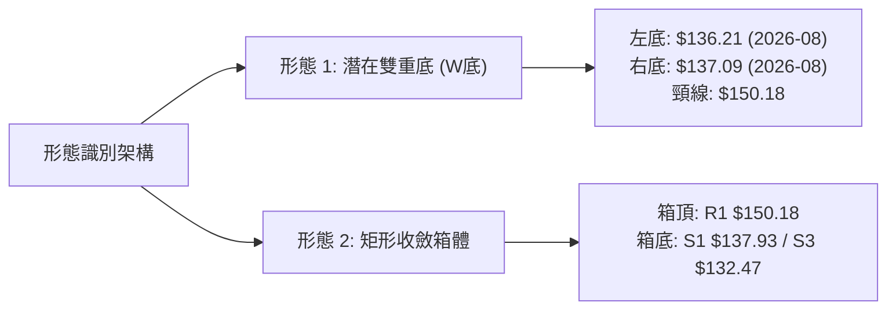
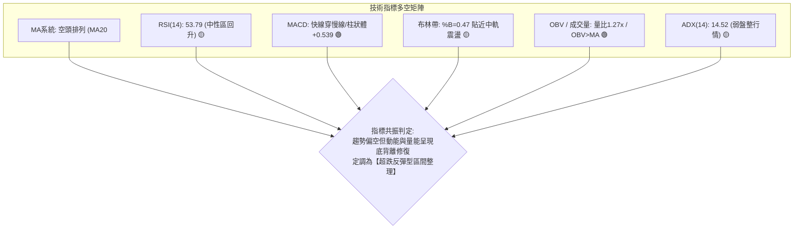
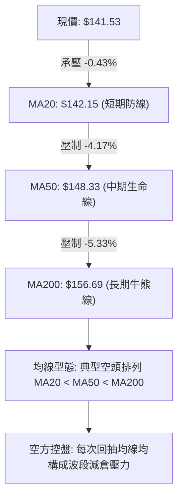
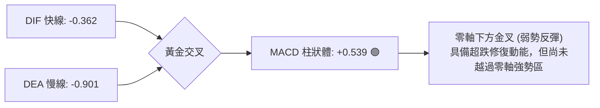
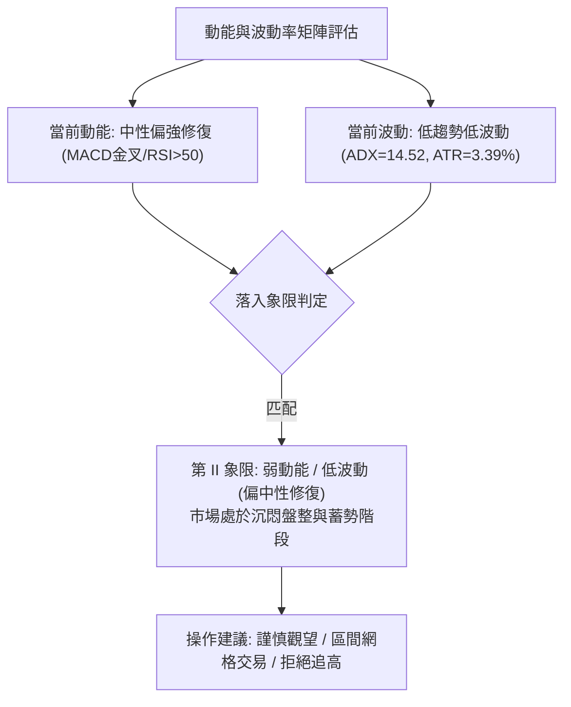
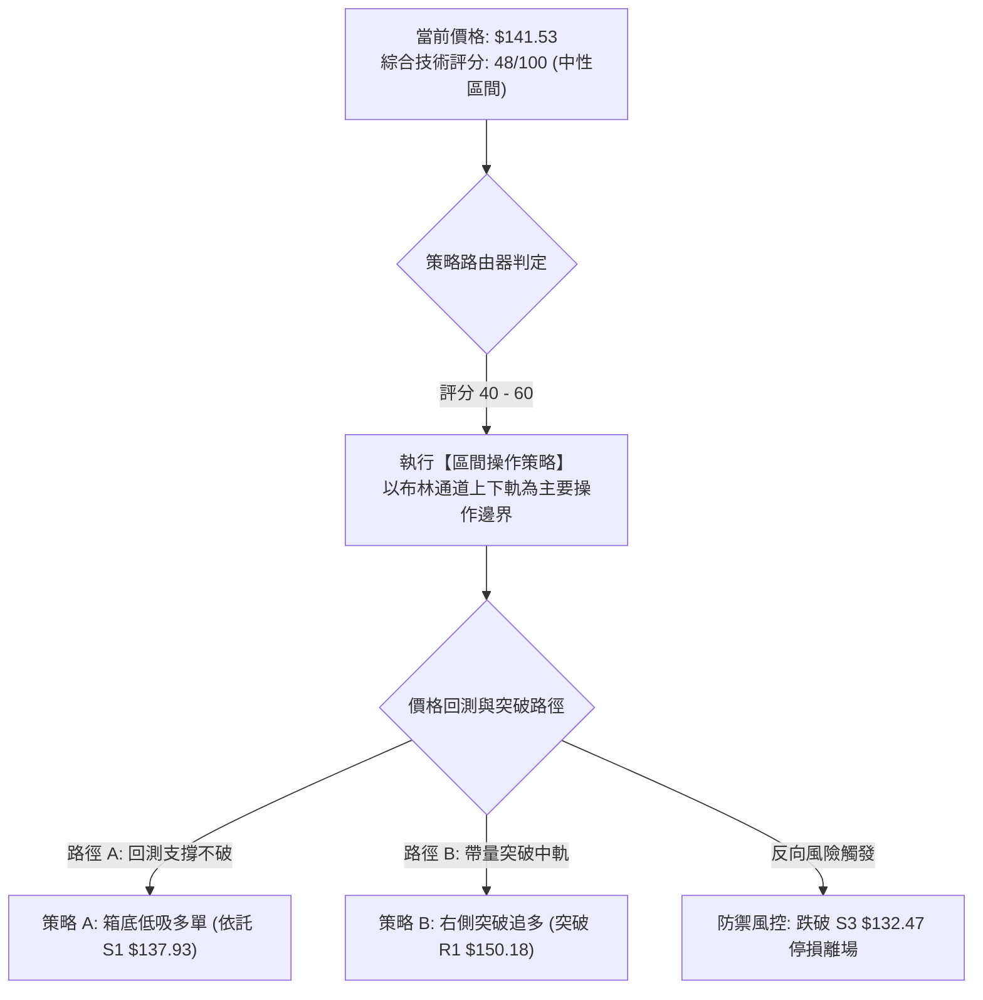
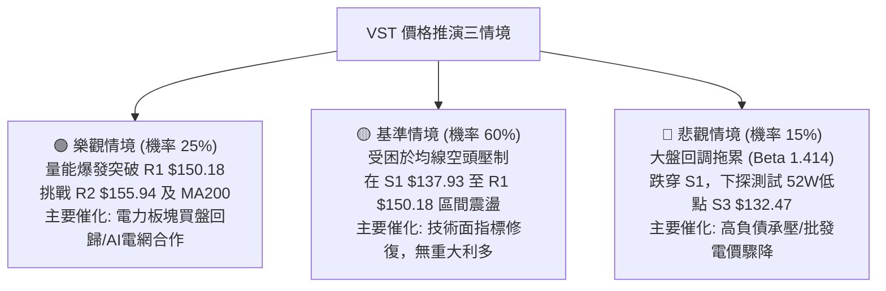

# VST 技術分析報告

> **報告日期**：2026-09-16 ｜ **語言**：繁體中文 ｜ **數據來源**：Yahoo Finance ｜ **當前價格**：$141.53

---

## 目錄

| 章節 | 內容 |
|------|------|
| [1. 技術面概覽](#1-技術面概覽) | 訊號儀表板、核心指標、評分卡 |
| [2. 趨勢分析](#2-趨勢分析) | 多時框趨勢、長中短期走勢、ADX解讀 |
| [3. 圖表形態分析](#3-圖表形態分析) | 形態識別、信心度評估、K線組合 |
| [4. 支撐與阻力](#4-支撐與阻力) | 關鍵價位、斐波那契回調結構 |
| [5. 技術指標深度解讀](#5-技術指標深度解讀) | MA/RSI/MACD/布林/量價OBV |
| [6. 動能與波動率](#6-動能與波動率) | 動能四象限、ATR停損矩陣、Beta敏感度 |
| [7. 多時框架總結](#7-多時框架總結) | 時框架評分、收斂規則與唯一方向 |
| [8. 交易策略建議](#8-交易策略建議) | 策略路由、情境階梯、進出場規劃 |
| [9. 風險提示與監控](#9-風險提示與監控) | 監控Checklist、情境演算、風控準則 |

---

## 1. 技術面概覽

### 🎯 技術訊號儀表板



### 📊 核心指標速覽表

| 指標類別 | 指標名稱 | 當前數值 | 訊號 | 解讀 |
|:---|:---|:---|:---:|:---|
| **價格** | 當前收盤價 | $141.53 | 🔴 | 位於 52 週低點區間 10.5%（52W Low 為 $132.47） |
| **均線** | MA20 (短均) | $142.15 | 🔴 | 現價低於 MA20 約 -0.43%，短線處於壓制狀態 |
| **均線** | MA50 (中均) | $148.33 | 🔴 | 現價低於 MA50 約 -4.58%，中期下降壓力明顯 |
| **均線** | MA200 (長均) | $156.69 | 🔴 | 現價低於 MA200 約 -9.68%，長期生命線失守 |
| **均線架構**| 排列形態 | 空頭排列 | 🔴 | MA20 < MA50 < MA200，全天候均線呈現發散壓制 |
| **動能** | RSI(14) | 53.79 | 🟡 | 脫離超賣區回升至中軸，未見明確頂底背離 |
| **動能** | MACD (12,26,9) | -0.362 / -0.901 | 🟢 | 快線位於慢線上方，柱狀體 +0.539 呈現黃金交叉反彈 |
| **動能** | Stoch %K / %D | 33.15 / 43.45 | 🟡 | 震盪指標位於低位中性區，無超買超賣極端現象 |
| **趨勢強度**| ADX (14) | 14.52 | 🟡 | ADX < 25 表明處於弱趨勢／無方向盤整行情 |
| **定向指數**| +DI / -DI | 23.94 / 25.33 | 🔴 | -DI 大於 +DI，空頭力量邊際略微佔優 |
| **通道** | 布林帶寬 (%B) | 0.47 ($132.21–$152.09)| 🟡 | 現價緊貼中軌 $142.15 下方，處於帶內中軸平衡位 |
| **成交量** | 最新量 / 量比 | 5.59M / 1.27x | 🟢 | 成交量高於 20 日均量，呈現量增反彈特徵 |
| **能量潮** | OBV 趨勢 | OBV > MA | 🟢 | 資金流向呈現正向積累，量能確認支撐有效性 |
| **波動度** | ATR(14) | $4.80 (3.39%) | 🟡 | 日內平均波幅適中，為設定止損點提供定量依據 |

### 🏆 技術評分卡

```
╔════════════════════════════════════════════════════════════════════╗
║                   技術評分卡 — VST (2026-09-16)                    ║
╠════════════════════════════════════════════════════════════════════╣
║ 評估維度      進度條評分                 分值     信號強度         ║
║ 趨勢強度      ██████░░░░░░░░░░░░░░       30/100   🔴 空頭主導/弱盤整║
║ 動能指標      ████████████░░░░░░░░       60/100   🟢 MACD翻正支持   ║
║ 支撐穩定度    ██████████████░░░░░░       70/100   🟢 S1/S2重疊防禦 ║
║ 成交量配合    ██████████████░░░░░░       70/100   🟢 量比1.27x增量 ║
║ 形態完整度    ████████░░░░░░░░░░░░       40/100   🟡 區間築底中     ║
║ 均線排列      ████░░░░░░░░░░░░░░░░       20/100   🔴 典型空頭排列   ║
╠════════════════════════════════════════════════════════════════════╣
║ 綜合技術評分  █████████░░░░░░░░░░░       48/100   ⚖️ 中性觀望/區間 ║
╚════════════════════════════════════════════════════════════════════╝
```

---

## 2. 趨勢分析

### 🌐 多時框趨勢分析



### 📈 長期趨勢 — 12個月走勢圖（Unicode）

依據提供的月度收盤價數據，過去 12 個月（2025-10 至 2026-09）走勢如下繪製：

```
VST 月線走勢圖（2025-10 至 2026-09）
價格軸 ($)
$195.11 ┤                                                    
$187.52 ┤● (2025-10)                                         
$178.12 ┤      ● (2025-11)                                   
$173.41 ┤                          ● (2026-02)               
$160.88 ┤            ● (2025-12)         ● (2026-05)         
$157.91 ┤                  ● (2026-01)         ● (2026-06)   
$150.12 ┤                                ● (2026-03)         
$148.19 ┤                                            ● (2026-07)
$141.53 ┤══════════════════════════════════════════════════● (現價)
$137.37 ┤                                                ● (2026-08)
        └─────────────────────────────────────────────────────
         10M    11M   12M   01M   02M    03M   05M   07M  08M   09M
```

#### 走勢特徵分析表格

| 階段區間 | 起止時間 | 價格變化 ($) | 漲跌幅 (%) | 結構形態與成交特徵 |
|:---|:---|:---:|:---:|:---|
| **第一階段：見頂回落** | 2025-10 → 2025-12 | $187.52 → $160.88 | -14.21% | 自歷史頂峰回撤，跌破 $180 整數關卡，重心下移 |
| **第二階段：反彈自救** | 2026-01 → 2026-02 | $157.91 → $173.41 | +9.82%  | 築次高點後無力延續，遇 MA200 阻力回落 |
| **第三階段：陰跌探底** | 2026-03 → 2026-08 | $173.41 → $137.37 | -20.78% | 連續跌破波段支撐，並於 2026-08 創下近一年低點 $136.21 |
| **第四階段：築底震盪** | 2026-08 → 2026-09 | $137.37 → $141.53 | +3.03%  | 在 52W 低點 $132.47 上方止跌，MACD 柱轉正，進入修復期 |

### 📊 中期趨勢（週線分析）

中期走勢受制於近 20 週收盤波動區間。最新週線數據顯示，2026-08-23 收盤於 $136.21，隨後連續反彈至 2026-09-06 之 $149.30，目前回調至 $141.53，週線 RSI 為 53.8，屬於多空拉鋸狀態。

```
中期週線空間阻力與支撐架構示意圖：
  $168.93 ────────────────────────────── R3 (近一年波段強壓力)
           │
  $155.94 ────────────────────────────── R2 (MA200 密集成交區)
           │
  $150.18 ────────────────────────────── R1 / 斐波 78.6% ($150.97) / BB上軌 ($152.09)
           │
  $141.53 ══════════════════════════════ 【現價 $141.53】 / BB中軌 ($142.15)
           │
  $137.93 ────────────────────────────── S1 (近一年波段支撐)
           │
  $134.72 ────────────────────────────── S2 (波段強支撐防線)
           │
  $132.47 ────────────────────────────── S3 / 52週最低價 (絕對防守底線)
```

### ⚡ 趨勢強度評估（ADX 解讀）



#### ADX 強度與行情狀態對照表

| 指標變數 | 當前讀數 | 基準門檻 | 技術狀態 | 戰術指引 |
|:---|:---:|:---:|:---:|:---|
| **ADX(14)** | 14.52 | < 25.00 | 無趨勢／盤整 | 避免趨勢突破型買法，採用區間反轉低吸高拋 |
| **+DI** | 23.94 | - | 多方邊際力量 | 位於低檔，反彈缺乏連續爆發性買盤 |
| **-DI** | 25.33 | - | 空方邊際力量 | 略佔上風，但未達到單邊下殺的發散門檻 (>30) |
| **淨差值 (DI差)** | -1.39 | 0 | 弱勢均衡 | 多空處於拉鋸，方向尚未明朗，維持震盪解讀 |

---

## 3. 圖表形態分析

### 🔍 形態識別系統

根據近 20 週與月線 OHLCV 價格走勢特徵，識別出當前盤面的關鍵圖表結構：



#### 圖表形態信心度與目標價評估表

| 識別形態 | 信心度 | 判斷依據（數據引用） | 形態完成度 | 形態高度 | 理論目標價（計算式） |
|:---|:---:|:---|:---:|:---:|:---|
| **雙重底 (W-Bottom)** | **55%** | 週線於 2026-08-23 觸及 $136.21，隨後於 2026-08-30 於 $137.09 築次低點反彈（接近支撐 S1 $137.93 與 S2 $134.72） | 65%（未突破頸線） | 形態高度 = 頸線 $150.18 - 低點 $136.21 = **$13.97** | 突破目標 = 頸線 $150.18 + $13.97 = **$164.15**（接近 R3 $168.93） |
| **矩形震盪箱體** | **75%** | 價格持續在 S1 ($137.93) 至 R1 ($150.18) 區間內反覆交織，ADX=14.52 強烈確認無單邊趨勢 | 85%（正處箱體中部） | 箱體高度 = R1 $150.18 - S1 $137.93 = **$12.25** | 箱頂目標 = **$150.18**<br>箱底目標 = **$137.93** |
| **旗形整理/均線壓制** | **45%** | 均線空頭排列 MA20<MA50<MA200，但下行斜率趨緩，形態不夠緊密，故信心度低於 50% | 30% | 訊號不足 | 訊號不足，僅做指標型解讀，不預設延伸目標 |

### 🕯️ 重要K線形態分析

| 週/月區間 | 收盤價 ($) | K線形態 | 量能配合 | 技術解讀 | 訊號方向 |
|:---|:---:|:---|:---|:---|:---:|
| **2026-08-23** | $136.21 | 長下影探底大陰線 | 21.50M | 測試 52W 低點 $132.47 上方支撐，空頭動能衰竭 | 🟡 止跌信號 |
| **2026-08-30** | $137.09 | 低檔十字星孕線 (Harami) | 18.69M (縮量) | 浮額清洗完畢，量縮止跌，確認 $136 附近買盤存在 | 🟢 築底醞釀 |
| **2026-09-06** | $149.30 | 光頭中陽線實體 | 22.13M (增量) | 強力反彈，一舉攻克 MA20，MACD 柱狀體翻正至 +1.366 | 🟢 短線多頭 |
| **2026-09-13** | $148.38 | 高檔流星線 (Shooting Star) | 18.61M (縮量) | 受阻於阻力 R1 $150.18，多方上攻遇阻回落 | 🔴 承壓回撤 |
| **2026-09-20** | $141.53 | 中黑陰線回測中軌 | 10.82M (進行中)| 回測 BB 中軌 $142.15，目前於支撐 S1 $137.93 上方尋求支撐 | 🟡 測試支撐 |

### 📉 ASCII 走勢形態示意圖

```
VST 潛在雙底與箱體形態示意圖
價格軸 ($)
$150.18 ┤               頸線 / 箱頂 (R1) ─────────● (09-06 高點 $149.30)
$148.38 ┤                                       ●│ (09-13 流星線)
$145.00 ┤                                      ▲ │
$141.53 ┤────────────────────── 現價 ─────────┼─● (當前位置)
$137.93 ┤         箱底支撐 (S1) ────────────────┼───
$137.09 ┤                        ● (右底 08-30) │
$136.21 ┤         ● (左底 08-23)                │
$132.47 ┴─────────┴─────────────────────────────┴──────── 52W 低點 (S3)
        時間: 2026-08-23       2026-08-30     2026-09-16
```

### 🎯 形態目標價計算

根據雙重底突破之經典量度計算法：
1. **頸線確認位**：波段回彈高點聚類聚於 **$150.18**（即阻力位 R1）。
2. **基底低點位**：週線雙底之最低收盤點 **$136.21**（2026-08-23）。
3. **垂直形態高度 ($H$)**：
   $$H = \text{Neckline} - \text{Low} = 150.18 - 136.21 = \$13.97$$
4. **向上突破理論目標 (T_Pattern)**：
   $$T = \text{Neckline} + H = 150.18 + 13.97 = \$164.15$$
   *(註：此計算位 $164.15 恰落於斐波那契 61.8% 回調位 $165.49 與阻力位 R3 $168.93 之間，具備高度幾何共振性)*

---

## 4. 支撐與阻力

### 🗺️ 關鍵價位分布圖（Unicode）

```
╔════════════════════════════════════════════════════════════════════╗
║                       VST 價位結構分布圖                           ║
╠════════════════════════════════════════════════════════════════════╣
║ $218.91 ║██████████████████████████████║ 52W 最高點 / 斐波 0.0%   ║
║ $168.93 ║████████████████████████      ║ 強阻力 R3                ║
║ $165.49 ║▓▓▓▓▓▓▓▓▓▓▓▓▓▓▓▓▓▓▓▓          ║ 斐波那契 61.8% 關鍵位     ║
║ $155.94 ║██████████████████            ║ 中期阻力 R2 / MA200密集群║
║ $150.97 ║▓▓▓▓▓▓▓▓▓▓▓▓▓▓                ║ 斐波那契 78.6% 回調位     ║
║ $150.18 ║██████████████████████        ║ 關鍵阻力 R1 / 箱頂 / 頸線 ║
║ $142.15 ║------------------------------║ BB中軌 / MA20 均線位置   ║
║ $141.53 ╠══════════════════════════════╣ ◄ 現價 ($141.53)         ║
║ $137.93 ║▓▓▓▓▓▓▓▓▓▓▓▓▓▓▓▓              ║ 近期波段支撐 S1          ║
║ $134.72 ║████████████████████          ║ 強支撐 S2 (下影密集區)   ║
║ $132.47 ║██████████████████████████████║ 絕對防守底線 S3 / 52W低點║
╚════════════════════════════════════════════════════════════════════╝
```

### 🚧 阻力位分析表

*嚴格引用數據源「關鍵價位」與「均線系統」精確數值：*

| 阻力級別 | 精確價位 | 形成技術原因與結構重疊 | 突破難度 | 重要性權重 |
|:---|:---:|:---|:---:|:---:|
| **R1** | **$150.18** | 近一年波段高點聚類、斐波那契 78.6% ($150.97)、布林帶上軌 ($152.09)、MA60 ($150.38) 四重共振阻力區 | 高 | ★★★★☆ |
| **R2** | **$155.94** | 近一年次級反彈高點聚類、長期生命線 MA200 ($156.69) 反壓區，籌碼套牢深水區 | 極高 | ★★★★★ |
| **R3** | **$168.93** | 2026-01 至 2026-02 週線反彈密集套牢頂部區，斐波那契 61.8% ($165.49) 上方波段防線 | 極高 | ★★★★★ |

### 🛡️ 支撐位分析表

*嚴格引用數據源「關鍵價位」與「布林帶」精確數值：*

| 支撐級別 | 精確價位 | 形成技術原因與結構重疊 | 守住機率 | 重要性權重 |
|:---|:---:|:---|:---:|:---:|
| **S1** | **$137.93** | 近一年波段低點聚類、2026-08 築底收盤平台 ($137.09–$137.37)，短線多頭第一防線 | 65% | ★★★☆☆ |
| **S2** | **$134.72** | 2026-08 月探底針尖密集成交位，布林帶下軌 ($132.21) 之緩衝過渡區 | 80% | ★★★★☆ |
| **S3** | **$132.47** | 52 週最低價 (52W Low)、斐波那契 100.0% 絕對低點，跌破則宣告長期下降空間徹底打開 | 90% | ★★★★★ |

### 📐 斐波那契回調位分析

依據 52 週波動區間：**最高點 $218.91（0.0%）至最低點 $132.47（100.0%）**，系統計算精確黃金分割如下：

```
斐波那契階梯與現價定位：
  0.0% ────────────────────────────── $218.91 (52W High)
 23.6% ────────────────────────────── $198.51
 38.2% ────────────────────────────── $185.89
 50.0% ────────────────────────────── $175.69 (多空中期平衡軸)
 61.8% ────────────────────────────── $165.49 (黃金分割強壓)
 78.6% ────────────────────────────── $150.97 (極限回調阻力)
       ───┬──────────────────────────
          │ 【現價 $141.53 處於 78.6% 與 100.0% 弱勢緩衝深水區】
       ───┴──────────────────────────
100.0% ────────────────────────────── $132.47 (52W Low 防守底線)
```

**定位解讀**：現價 $141.53 落於 **78.6% ($150.97)** 與 **100.0% ($132.47)** 之間。在技術分析理論中，股價回撤跌破 61.8% ($165.49) 並深入 78.6% 以下，代表前期的長期牛市結構已受到嚴重破壞，市場進入弱勢重組階段。目前距離底部 100.0% ($132.47) 僅有 **6.40%** 的下行空間，而上方距 78.6% 有 **6.67%** 的修復空間，表明下檔具備高賠率的保護屏障，但向上突破必須依賴持續放量方能攻克 $150.97。

---

## 5. 技術指標深度解讀

### 🎛️ 指標訊號總覽



### 📈 移動平均線排列分析



#### 各週期移動平均線深度量化表

| 均線名稱 | 精確數值 | 與現價乖離率 | 走勢微型圖 | 均線斜率與技術意義 |
|:---|:---:|:---:|:---:|:---|
| **MA 5** | $145.76 | -2.90% | ▇▇▆▅▃▃▄▅▆▆▆▅▄▃▁▁▁▁▁▁▁▁▂▄▆▇██▇▆ | 短期衝高後回落，短均線彎頭向下 |
| **MA 10** | $145.56 | -2.77% | █▇▆▅▄▄▄▄▄▃▃▃▃▃▃▂▂▂▁▁▁▁▁▁▂▃▃▄▄▄ | 橫向平移，短線多空拉鋸進入整理 |
| **MA 20** | $142.15 | -0.43% | ███▇▇▆▆▆▆▅▅▄▃▃▂▂▂▁▁▁▁▁▁▁▁▁▁▁▁▁ | 現價近在咫尺，關鍵爭奪分水嶺 |
| **MA 50** | $148.33 | -4.58% | - (中期壓制) | 下降斜率顯著，與 R1 ($150.18) 形成重疊壓力帶 |
| **MA 60** | $150.38 | -5.89% | ██▇▇▇▇██████▇▆▅▅▄▃▃▂▂▂▂▂▂▂▂▂▁▁ | 季線下行壓制，多頭反彈主要天花板 |
| **MA 120** | $152.01 | -6.89% | ████▇▇▇▆▆▆▅▅▄▄▄▃▃▃▃▂▂▂▂▁▁▁▁▁▁▁ | 半年線持續走低，中期結構仍未修復 |
| **MA 200** | $156.69 | -9.68% | - (年線分水嶺) | 長期空頭防線，不破此處難言牛市回歸 |
| **MA 240** | $162.27 | -12.78% | █████▇▇▇▇▆▆▆▆▅▅▅▅▄▄▃▃▃▂▂▂▂▁▁▁▁ | 極限長期壓力，下壓速率仍未走平 |

### 📉 RSI(14) 分析

當前 RSI(14) 讀數為 **53.79**，位於 30–70 的常態震盪中軸區間：

```
RSI(14) 動態區間定位：
  [0]   超賣區 [30]            中性中軸 [50]   當前 53.79        超買區 [70]   [100]
   ├───────┼──────────────────────┼─────────────●─────────────┼───────┤
   ░░░░░░░░█████████████████████████████████████░░░░░░░░░░░░░░░░░░░░░░░
   數值進度條: ██████████████░░░░░░░░░░░░ (53.79%) — 🟢 中性偏強擺動
```

- **超買超賣判定**：價格在 2026-08 觸及 $136.21 時週線 RSI 跌至 26.1（極度超賣），隨後展開強勁修復，目前日線回升至 53.79，脫離危險鈍化區，顯示空頭下殺動能已耗盡。
- **背離分析判斷**：
  - 日線 RSI 無明顯頂底背離（走勢與近期反彈基本同步）。
  - 週線層級觀察：2026-05-17 股價 $139.48 對應 RSI=25.5；而 2026-08-23 股價跌至新低 $136.21 時，RSI 為 26.1（微幅抬升），呈現**微幅週線底背離雛形**，這是促成近兩週反彈至 $149.30 的核心內在動力。

### 📊 MACD(12/26/9) 訊號解讀



- **指標讀數**：DIF = -0.362，DEA = -0.901，MACD Histogram = **+0.539**。
- **交叉狀態**：快線在零軸下方由下往上穿越慢線，柱狀體維持連續擴張綠柱（正值），發出多頭修復訊號。
- **背離檢驗**：MACD 柱在 2026-08-09 曾下探 -1.873，隨後價格破底至 $136.21，但 MACD 柱僅為 -0.563，形成標準的**動能柱狀體底背離**，印證當前價格的反彈具備量化動能支持。

### 📦 布林通道分析

當前布林帶參數（20, 2）：
- **BB 上軌**：$152.09
- **BB 中軌 (MA20)**：$142.15
- **BB 下軌**：$132.21
- **通道帶寬**：$19.88（帶寬比率 14.0%）
- **當前位置 %B**：0.47

```
VST 布林通道空間結構圖
價格軸 ($)
$152.09 ┬────────────────────────────────────────── 上軌 (與 R1 $150.18 形成封頂)
        │
$142.15 ┼───────────────────▲────────────────────── 中軌 (MA20 分界線)
$141.53 ┤═══════════════════●══════════════════════ 現價 (%B = 0.47)
        │
$132.21 ┴────────────────────────────────────────── 下軌 (與 S3 $132.47 強共振)
```

**布林通道戰術解讀**：
1. **中軌爭奪**：現價 $141.53 緊貼中軌 $142.15 下方，%B 為 0.47，表明價格自下軌反彈後在中軌受阻，面臨方向選擇。
2. **區間邊界有效性**：布林下軌 $132.21 與 52 週最低價 $132.47（S3）幾近重疊，構成了下檔極端堅固的「幾何鐵底」；布林上軌 $152.09 則覆蓋了阻力位 R1 ($150.18) 及斐波 78.6% ($150.97)。在 ADX < 25 的盤整格局下，通道上下軌提供了理想的高拋低吸參考邊界。

### 💹 成交量分析（量價配合度）

- **量能數據**：最新單日成交量為 **5,593,100 股**，相較於 20 日均量 4,387,040 股，**量比達到 1.27x**，相較 50 日均量（4,421,566 股）亦呈現明顯放量特徵。
- **OBV（能量潮）狀態**：指標回報「**OBV > MA → 量能支撐上漲**」。
- **量價背離檢驗**：在股價自 $136.21 反彈期間，成交量並未萎縮，近幾日回跌回測中軌時量能適度收斂（最新日量雖大但仍低於 2026-08-09 的巨量下殺日 34.9M），說明並無恐慌性拋盤湧出，OBV 保持在均線之上，顯示主力資金在底部區間有低吸護盤痕跡，量價結構支持「震盪築底」假說。

---

## 6. 動能與波動率

### ⚡ 動能評估四象限

根據技術數據：動能維度（RSI=53.79 中性回溫、MACD Hist=+0.539 看多）、波動率維度（ADX=14.52 弱趨勢、ATR=$4.80 處於中低波動區間 3.39%），對 VST 進行四象限劃分：



#### 四象限特徵對照表

| 象限分佈 | 動能強度 | 波動率強度 | 當前狀態 | 交易戰術指引 |
|:---:|:---:|:---:|:---:|:---|
| **第一象限 (Q1)** | 強動能 | 低波動 | — | 最佳波段主升浪，加碼持倉 |
| **第二象限 (Q2)** | **中弱動能** | **低波動** | **✓ (VST 當前位置)** | **區間震盪蓄勢，布林軌道交易，嚴控停損** |
| **第三象限 (Q3)** | 強動能 | 高波動 | — | 突破暴走行情，高風險高收益 |
| **第四象限 (Q4)** | 弱動能 | 高波動 | — | 恐慌崩跌下殺，嚴禁介入 |

### 📊 ATR 波動率分析

- **ATR(14) 數值**：**$4.80**
- **價格百分比**：**3.39%**（以現價 $141.53 計）
- **動態停損矩陣設計**：
  - **保守型風控停損（1.0 × ATR）**：$4.80，適合日內或極短線交易，現價下方止損設於 $141.53 - $4.80 = **$136.73**（剛好在 S1 $137.93 下方）。
  - **標準波段風控停損（1.5 × ATR）**：$7.20，適合波段擺動，現價下方止損設於 $141.53 - $7.20 = **$134.33**（位於 S2 $134.72 稍下方）。
  - **結構防守風控停損（2.0 × ATR）**：$9.60，適合中長線築底部位，現價下方設於 $141.53 - $9.60 = **$131.93**（徹底跌破 52W 低點 S3 $132.47 時無條件離場）。

### 📐 Beta 與市場相關性

- **Beta 係數**：**1.414**
- **市場特徵解讀**：
  - VST 雖然歸屬於公用事業板塊（Utilities - Independent Power Producers），但其 Beta 高達 1.414，顯示該股波動性遠大於標普 500 指數（比大盤多 41.4% 的系統性波動）。
  - 這一特性源於其獨立發電商（IPP）屬性，受電力市場批發電價、天然氣波動及 AI 數據中心電力需求預期之強烈影響，兼具公用事業與高彈性週期科技成長之特質。因此，交易者必須隨時警惕大盤回調對其造成的槓桿式放大下殺。

---

## 7. 多時框架總結

### 📋 時框架評分表

| 時框架 | 趨勢方向 | 動能狀態 | 均線排列 | 關鍵圖表形態 | 綜合評分 | 戰術建議 |
|:---|:---:|:---:|:---:|:---:|:---:|:---|
| **長期 (月線)** | 🔴 下行修正 | 弱勢築底 | MA200 壓制 | 自 $207.45 大幅回調逾 30% | 35/100 | 長線資金小額分批建底倉 |
| **中期 (週線)** | 🟡 寬幅震盪 | MACD柱收窄 | 糾結偏空 | S1至R1箱體整理 ($137–$150) | 50/100 | 箱體區間高拋低吸，突破前不重倉 |
| **短期 (日線)** | 🟢 超跌反彈 | MACD金叉 | MA20壓制 | 貼布林中軌修復，量比1.27x | 60/100 | 依託中軌及 S1 支撐博弈短線反彈 |

### 🔲 綜合訊號矩陣

```
╔════════════════════════════════════════════════════════════════════╗
║                       綜合訊號收斂矩陣                             ║
╠════════════════════════════════════════════════════════════════════╣
║ 分析維度       日線 (短期)       週線 (中期)       月線 (長期)     ║
║ 趨勢方向       🟡 中性反彈       🔴 弱勢震盪       🔴 下行回調     ║
║ 均線壓制       🔴 承壓 MA20      🔴 承壓 MA50      🔴 承壓 MA200   ║
║ 動能表現       🟢 MACD金叉(+0.5) 🟡 RSI中性(53.8)  🔴 弱勢未除     ║
║ 成交量配合     🟢 放量 (1.27x)   🟡 均量水準       🔴 縮量陰跌     ║
║ 形態位置       🟢 守住 S1        🟡 箱體中部       🔴 52W低點附近  ║
╠════════════════════════════════════════════════════════════════════╣
║ 衝突協調       日線短多動能與週/月線均線空頭排列產生正面衝突       ║
╚════════════════════════════════════════════════════════════════════╝
```

### ⚖️ 多時框收斂結論

> **依嚴格要求 14 之多時框收斂規則執行判定**：
> 1. **趨勢判定門檻**：當前 ADX(14) 讀數為 **14.52**，顯著小於 25.00，系統判定當前處於標準的 **【盤整行情】**，非單邊趨勢行情。
> 2. **主導時框與交易空間**：在盤整行情中，忽略大級別均線單邊順勢指引，**以日線布林通道上下軌（下軌 $132.21 ～ 上軌 $152.09）作為核心交易區間**。
> 3. **衝突收斂**：日線 MACD 翻正與量增支持價格自低位回彈，但上方 MA50 ($148.33) 與 R1 ($150.18) 存在密集拋壓。因此，日線的多頭反彈動能將被限制在中期箱頂之下。
> 4. **唯一方向性結論**：**【中性偏多區間震盪（區間低吸高拋）】**。

---

## 8. 交易策略建議

### 🗺️ 策略決策流程圖



### 🧭 策略路由（依評分卡分流）

- **當前主策略方向**：**【中性觀望與區間波段低吸（依評分 48/100）】**
- **架構規範**：綜合評分 48 分落於 40–60 區間，屬於典型盤整格局，**嚴禁孤注一擲做單邊單向押注**。操作策略以依託關鍵支撐 S1/S2 低吸、於阻力位 R1/布林上軌止盈為主。

### 🎯 價格情境階梯（Price Scenarios）

*所有價位完全引用「關鍵價位」精確數據：*

| 觸發條件與關鍵價位 | 下一目標價位 | 後續延伸極限 | 行情情境含義與技術心理 |
|:---|:---:|:---:|:---|
| **向上突破 R1 $150.18** | **R2 $155.94** | **R3 $168.93** | **短線轉強**：攻克布林上軌與MA60，多頭扭轉均線頹勢，挑戰MA200 |
| **站穩現價 $141.53** | **R1 $150.18** | **BB上軌 $152.09** | **區間震盪**：維持在布林中軌與 S1 之間拉鋸，屬於正常蓄勢階段 |
| **跌破支撐 S1 $137.93** | **S2 $134.72** | **S3 $132.47** | **中期轉弱**：跌破近期築底平台，空頭再度逼近 52 週最低價絕對防線 |

### 📊 情境機率分佈

| 預測情境 | 機率 | 主要技術依據與指標支撐 |
|:---|:---:|:---|
| **情境一：區間震盪蓄勢** | **55%** | ADX=14.52 確認弱趨勢，布林通道帶寬收窄，成交量配合穩定但未暴增，支持在 $137.93–$150.18 箱體內波動 |
| **情境二：溫和反彈上攻** | **30%** | MACD 柱狀體維持綠色擴張 (+0.539)，量比 1.27x，OBV > MA 顯現買盤積累，具備衝擊 R1 $150.18 的動能 |
| **情境三：破位深跌探底** | **15%** | 均線系統呈空頭排列，-DI > +DI，若大盤重挫（Beta=1.414），不排除下探測試 52W 低點 S3 $132.47 |

### 🟢 主策略詳情（區間與突破雙軌規劃）

```
╔════════════════════════════════════════════════════════════════════╗
║                       主交易策略詳細規劃表                         ║
╠════════════════════════════════════════════════════════════════════╣
║ 策略要素        策略 A：左側箱底低吸策略     策略 B：右側突破確認策略  ║
║ 策略屬性        逆勢低吸 (高盈虧比)          順勢跟進 (確認信號)      ║
║ 進場條件        回測支撐位 S1 不破並出下影線 帶量實體陽線突破 R1 頸線 ║
║ 進場價格        $138.00 (靠近 S1 $137.93)    $150.50 (確認突破 $150.18)║
║ 目標價 T1       $150.18 (阻力位 R1 / 箱頂)   $155.94 (阻力位 R2)       ║
║ 目標價 T2       $155.94 (阻力位 R2 / MA200)  $165.49 (斐波 61.8% / R3) ║
║ 止損價格        $134.00 (跌破 S2 $134.72)    $146.00 (MA50 跌破處)    ║
║ 風險空間        $4.00 (-2.90%)               $4.50 (-2.99%)           ║
║ 報酬空間 (T1)   $12.18 (+8.83%)              $5.44 (+3.61%)           ║
║ 報酬空間 (T2)   $17.94 (+13.00%)             $14.99 (+9.96%)          ║
║ 風險報酬比 (T1) 1 : 3.05                     1 : 1.21                 ║
║ 風險報酬比 (T2) 1 : 4.49                     1 : 3.33                 ║
║ 預估成功機率    65%                          55%                      ║
║ 建議配置倉位    15% (基礎波段倉)             10% (追擊加碼倉)         ║
╚════════════════════════════════════════════════════════════════════╝
```

### 🔴 反向風險觸發點（對沖與撤退提示）

- **全面停損警戒線**：收盤價**實體跌破 $132.47（S3 / 52 週最低價）**。
  - **技術含義**：此處為過去一年絕對底部，一旦放量跌破，意味著雙底與箱體構築徹底失敗，股價將進入未知的真空下挫區。
  - **應對處置**：無條件出清所有多頭持倉，多單認賠離場；衍生品交易者可買入相應價位的 Put 期權對沖現貨組合跌價風險。

### ⭐ 整體訊號強度評星

```
做多訊號強度：★★★☆☆  (3.0/5星 — 動能翻正，量能支撐，但受阻於均線)
做空訊號強度：★★☆☆☆  (2.0/5星 — ADX弱化，下有強支撐，下殺動能鈍化)
整體可信度：  ★★★★☆  (4.0/5星 — 數據結構清晰，支撐阻力重疊度極高)
```

---

## 9. 風險提示與監控

### ✅ 關鍵監控指標 Checklist

```
╔════════════════════════════════════════════════════════════════════╗
║                   VST 關鍵技術監控清單 (Checklist)                 ║
╠════════════════════════════════════════════════════════════════════╣
║ [ ] 監控項 1: 價格是否收復並站穩 MA20 ($142.15)                    ║
║     └─ 通過標準: 連續兩日收盤價 > $142.15，且成交量維持均量以上     ║
║ [ ] 監控項 2: MACD 柱狀體能否維持正值 (+0.539 以上)                ║
║     └─ 預警訊號: 柱狀體縮小轉負，出現 DIF 與 DEA 零軸下死叉        ║
║ [ ] 監控項 3: 箱體下邊界 S1 ($137.93) 支撐有效性                   ║
║     └─ 防守標準: 日內回踩不破，且未出現帶量長黑K線吞沒             ║
║ [ ] 監控項 4: 成交量比是否維持在 1.0x 以上 (當前 1.27x)            ║
║     └─ 異動指標: 成交量若萎縮至 300 萬股以下，反彈極易夭折         ║
║ [ ] 監控項 5: ADX(14) 數值是否向上突破 20                          ║
║     └─ 轉勢確認: ADX > 20 伴隨 +DI 向上發散，方可轉為單邊趨勢策略   ║
╚════════════════════════════════════════════════════════════════════╝
```

### ⚠️ 風險場景分析



### 🛡️ 風險管理重要提醒

1. **財務槓桿與高 Beta 風險**：
   - 財務數據顯示 VST 總負債高達 **$20.51B**，負債權益比（Debt/Equity）達 **373.28**，流動比率為 0.973。雖然公用事業現金流穩定（營運現金流 $5.12B），但高槓桿疊加高達 **1.414 的 Beta 值**，使得市場利率波動或宏觀流動性收緊時，其股價波動幅度將顯著放大。
2. **籌碼集中度注意**：
   - 機構持股比例高達 **92.1%**，空頭部位僅佔 Float 的 3.7%（Short Ratio 2.37）。籌碼高度集中於機構手中，意味著目前並不存在顯著的軋空（Short Squeeze）動力；若機構因資產配置調整進行拋售，價格容易出現斷崖式跳空，切忌在無停損保護下逆勢扛單。
3. **倉位管控紀律**：
   - 在 ADX < 25 且均線處於空頭排列的背景下，**總持倉部位嚴格控制在總資金的 15%–25% 之內**。
   - 單筆交易最大虧損額不得超過總投資組合淨資產的 **1.0%**。以策略 A 為例（止損幅度 2.90%），則該策略最大允許開倉部位為：$1.0\% \div 2.90\% \approx 34.5\%$ 總資金（建議實施半倉操作即約 15%）。

---

## 📋 報告總結

```
╔════════════════════════════════════════════════════════════════════╗
║                     VST 技術分析報告總結                           ║
╠════════════════════════════════════════════════════════════════════╣
║ 報告日期：2026-09-16                                               ║
║ 當前價格：$141.53                                                  ║
║ 分析評級：⚖️ 中性觀望 / 弱勢區間整理 (技術評分: 48/100)             ║
║                                                                    ║
║ 關鍵結論：                                                         ║
║ ├─ 長期趨勢：🔴 下行修正 (自 $207 頂部回撤，處於 52W 區間 10.5%)    ║
║ ├─ 中期趨勢：🟡 箱體整理 (在 S1 $137.93 與 R1 $150.18 之間反覆拉鋸)║
║ ├─ 短期趨勢：🟢 弱勢反彈 (MACD 金叉翻正，量比 1.27x，測試 MA20)     ║
║ ├─ 關鍵支撐：S1: $137.93 │ S2: $134.72 │ S3: $132.47 (52W Low)    ║
║ ├─ 關鍵阻力：R1: $150.18 │ R2: $155.94 │ R3: $168.93             ║
║ └─ 分析師目標：共識均價 $217.42 (機構評級偏向 Strong Buy)          ║
║                                                                    ║
║ 最優策略組合：                                                     ║
║ 1. 🥇 最佳機會：策略 A (左側低吸) — 回測 S1 $138 附近建立反彈部位， ║
║                 停損設於 $134.00，博弈目標 R1 $150.18 (盈虧比 3.05)║
║ 2. 🥈 次選機會：策略 B (右側突破) — 帶量攻克 R1 $150.18 後順勢追多，║
║                 停損設於 $146.00，目標指向 R2 $155.94 及 MA200     ║
║ 3. 🥉 保守選擇：場外完全觀望，靜待 ADX 突破 25 或價格有效站穩      ║
║                 MA50 ($148.33) / MA200 ($156.69) 後再行入場        ║
╚════════════════════════════════════════════════════════════════════╝
```

---

> ⚠️ **免責聲明**：本報告為技術分析研究成果，所有數據及幾何測算均基於歷史價格與成交量資訊。本報告**僅供研究與學術參考**，**不構成任何形式的買賣邀約或投資建議**。金融市場具有高風險性，投資決策應依據個人風險承受能力獨立做出，入市需謹慎。

---

*報告生成時間：2026-09-16 ｜ 數據來源：Yahoo Finance ｜ 分析框架：多時框圖表與量化指標收斂模型*