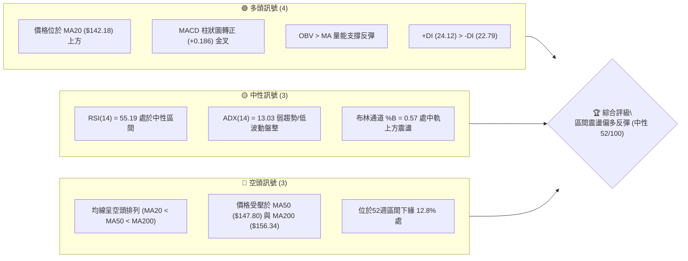
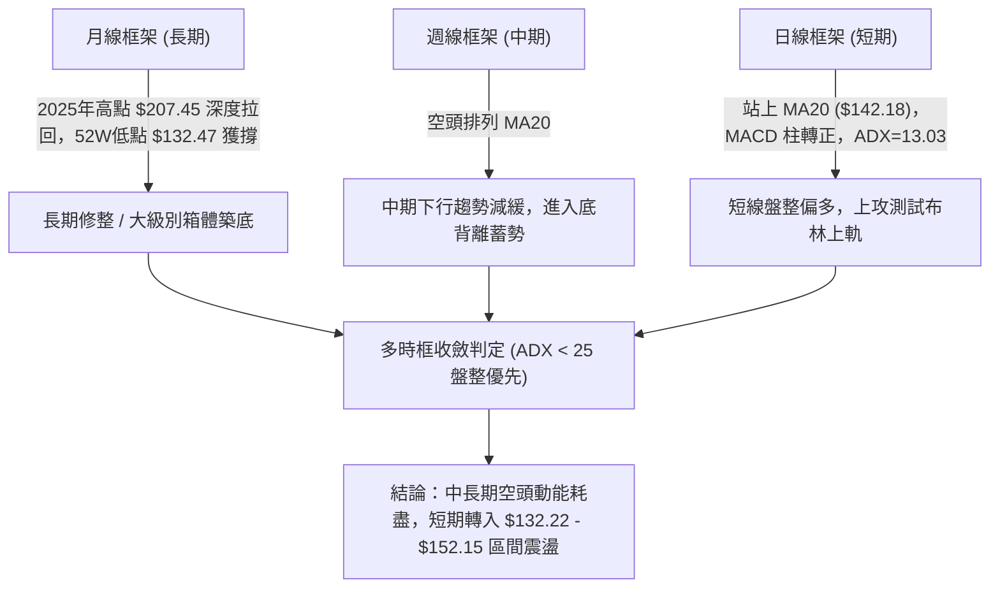
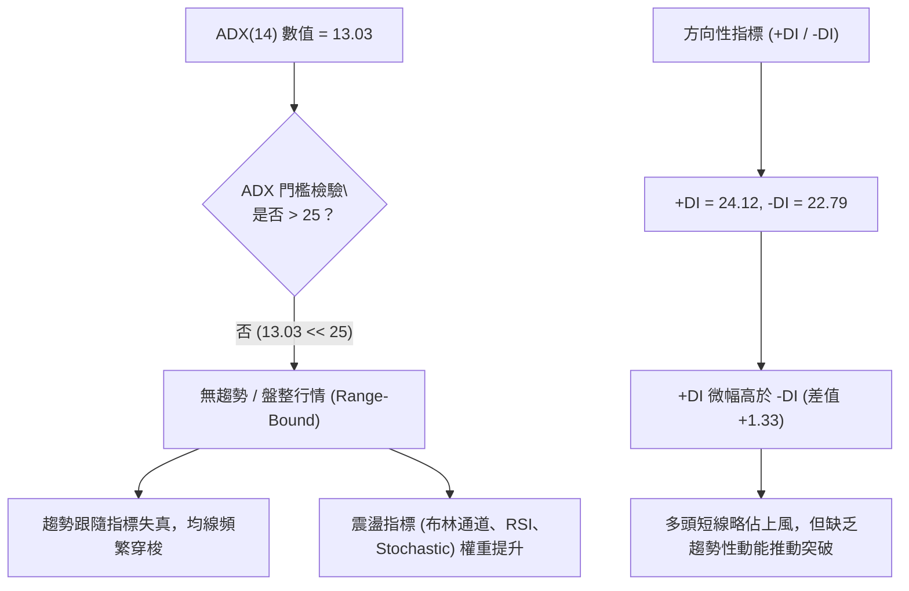
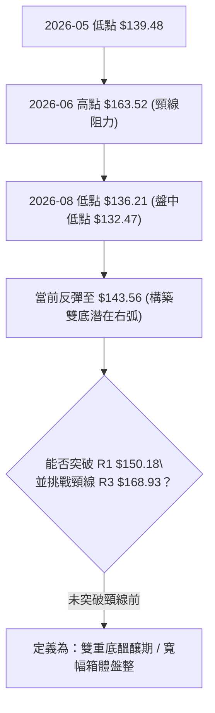
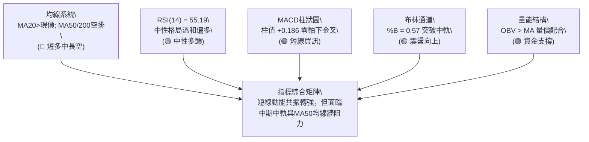
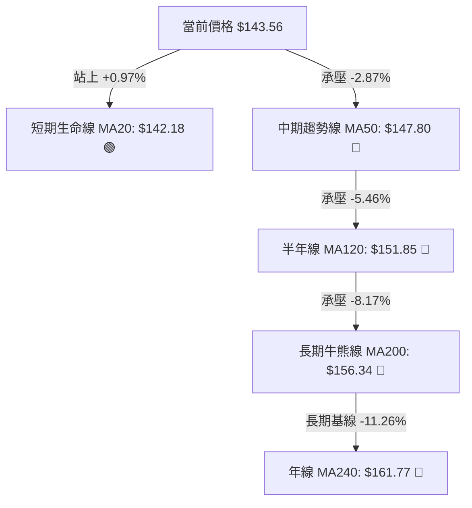
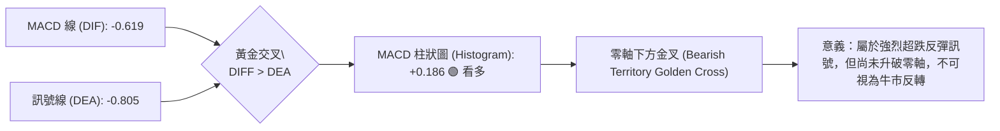
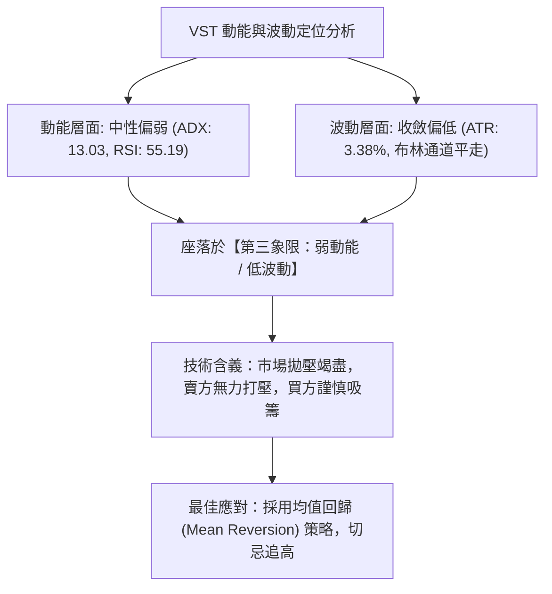
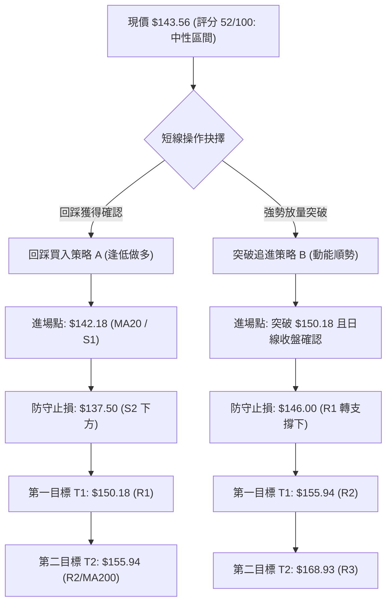
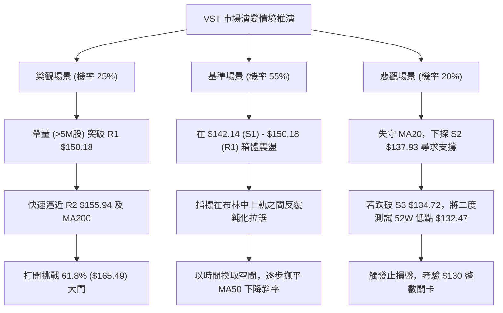

# VST 技術分析報告

> **報告日期**：2026-09-18 ｜ **語言**：繁體中文 ｜ **數據來源**：Yahoo Finance ｜ **當前價格**：$143.56

---

## 目錄

| 章節 | 內容 |
|------|------|
| [1. 技術面概覽](#1-技術面概覽) | 訊號儀表板、核心指標、評分卡 |
| [2. 趨勢分析](#2-趨勢分析) | 多時框趨勢、長中短期走勢 |
| [3. 圖表形態分析](#3-圖表形態分析) | 形態識別、K線組合、目標價 |
| [4. 支撐與阻力](#4-支撐與阻力) | 關鍵價位、斐波那契回調 |
| [5. 技術指標深度解讀](#5-技術指標深度解讀) | MA/RSI/MACD/布林/成交量 |
| [6. 動能與波動率](#6-動能與波動率) | 動能評估、ATR、Beta |
| [7. 多時框架總結](#7-多時框架總結) | 時框架評分矩陣 |
| [8. 交易策略建議](#8-交易策略建議) | 多空策略、風險報酬比 |
| [9. 風險提示與監控](#9-風險提示與監控) | 監控指標、風險場景 |

---

## 1. 技術面概覽

### 🎯 技術訊號儀表板



### 📊 核心指標速覽表

| 指標類別 | 指標名稱 | 當前數值 | 訊號 | 解讀 |
|----------|----------|----------|------|------|
| **價格** | 當前價格 | $143.56 | 🟡 | 位於52W區間12.8%處，脫離低點但仍處於相對低檔 |
| **均線** | MA20 | $142.18 | 🟢 | 現價站上短期生命線 MA20 (+0.97%)，短線翻多 |
| **均線** | MA50 | $147.80 | 🔴 | 現價位於 MA50 下方 (-2.87%)，中期趨勢仍偏空壓制 |
| **均線** | MA200 | $156.34 | 🔴 | 現價大幅低於長線牛熊分水嶺 MA200 (-8.17%) |
| **動能** | RSI(14) | 55.19 | 🟡 | 位於 50–60 溫和多頭擴張區，無超買或超賣 |
| **動能** | MACD | -0.619 | 🟢 | 快線向上穿越信號線 (-0.805)，Hist 為 +0.186 形成零軸下金叉 |
| **動能** | Stoch %K/%D | 43.30 / 34.63 | 🟢 | %K 從低檔黃金交叉 %D，短線超賣後反彈修復 |
| **趨勢** | ADX(14) | 13.03 | 🟡 | ADX < 25 且極低，顯示無明確單邊趨勢，屬箱體盤整格局 |
| **通道** | 布林帶寬 | $132.22 - $152.15 | 🟡 | %B = 0.57，剛自中軌向上挑戰，通道未明顯開口 |
| **量能** | 成交量 / 20日均量 | 3.95M / 4.34M | 🟡 | 量比 0.91x，縮量反彈，但 OBV > MA 支撐底部分歧 |
| **波動** | ATR(14) | $4.86 | 🟡 | 波動率佔價格 3.38%，處於中等收斂狀態 |

### 🏆 技術評分卡

```
╔══════════════════════════════════════════════════════════════╗
║                 技術評分卡 — VST (2026-09-18)                ║
╠══════════════════════════════════════════════════════════════╣
║ 趨勢強度 (ADX=13.03)    ██████░░░░░░░░░░░░░░  30/100 🔴 弱勢  ║
║ 動能指標 (MACD/RSI)     ████████████░░░░░░░░  60/100 🟢 偏多  ║
║ 支撐穩定度 (S1/S2/S3)   ██████████████░░░░░░  70/100 🟢 穩固  ║
║ 成交量配合 (OBV/量比)   ██████████░░░░░░░░░░  50/100 🟡 中性  ║
║ 形態完整度 (箱體整理)   ████████████░░░░░░░░  60/100 🟡 構築  ║
║ 均線系統 (空頭排列承壓) ████████░░░░░░░░░░░░  40/100 🔴 承壓  ║
╠══════════════════════════════════════════════════════════════╣
║ 綜合評分                ██████████░░░░░░░░░░  52/100 🟡 中性  ║
║ 策略定調                箱體震盪尋求築底 / 布林通道區間操作   ║
╚══════════════════════════════════════════════════════════════╝
```

---

## 2. 趨勢分析

### 🌐 多時框趨勢分析



### 📈 長期趨勢 — 12個月走勢圖（Unicode）

依據提供的月度收盤數據繪製過去 12 個月走勢圖（2025-10 至 2026-09）：

```
VST 月線走勢圖（2025-10 至 2026-09）
價格軸 ($)
$195 ┤● (10月: $187.52)
$185 ┤  ＼
$175 ┤    ●(11月: $178.12)      ●(02月: $173.41)
$165 ┤      ＼                 ／ ＼
$155 ┤        ●(12月: $160.88)●    ＼    ●(05月: $160.01)
$145 ┤             (01月:$157.91)    ●(03月: $150.12)  ●(現價: $143.56)
$135 ┤                                   ＼          ／
$125 ┤                                     ●(08月: $137.37, 低點 $132.47)
     └─┬────┬────┬────┬────┬────┬────┬────┬────┬────┬────┬────┬────
      10月 11月 12月 01月 02月 03月 04月 05月 06月 07月 08月 09月
      (2025)                           (2026)
```

#### 走勢特徵分析表格

| 階段區間 | 起止月份 | 價格區間 | 累計漲跌幅 | 走勢特徵與結構意涵 |
|----------|----------|----------|------------|--------------------|
| **第 1 階段：高檔派發期** | 2025-10 ~ 2025-12 | $187.52 → $160.88 | -14.21% | 脫離歷史高檔區（2025-07 高點 $207.45），機構高檔減持，均線失守。 |
| **第 2 階段：次級反彈頂** | 2026-01 ~ 2026-02 | $157.91 → $173.41 | +9.82% | 跌深反彈遭遇 MA200 壓制，形成反彈次高點（Lower High）。 |
| **第 3 階段：陰跌尋底期** | 2026-03 ~ 2026-06 | $150.12 → $158.63 | +5.67% | 於 $150–$160 窄幅膠著，動能逐級遞減，形成下降三角形整理。 |
| **第 4 階段：加速探底段** | 2026-07 ~ 2026-08 | $148.19 → $137.37 | -7.30% | 破位下殺至 52 週最低點 $132.47，空頭動能竭盡釋放。 |
| **第 5 階段：低檔修復期** | 2026-08 ~ 2026-09 | $137.37 → $143.56 | +4.51% | 探底回升，收復日線 MA20，形成初級底部震盪形態。 |

### 📊 中期趨勢（週線分析）

從近 20 週收盤走勢可見，價格於 2026-05-17 跌至 $139.48（RSI 25.5），隨後反彈至 2026-06-21 的 $163.52；其後於 2026-08-23 再次下探至週線收盤最低點 $136.21（觸及 52W 低點 $132.47），但 RSI 僅為 26.1，MACD 負柱由 -2.010 大幅縮減至 -0.563，呈現典型的中期動能衰竭。

```
中期週線價格與指標壓力/支撐示意圖：
$168.93 ──────── 強阻力 R3 (週線級別雙重頂頸線/2026-06波段高點)
$155.94 ──────── 關鍵阻力 R2 (MA200 壓制區與週線密集成交帶)
$150.18 ──────── 短線阻力 R1 (布林上軌與近期反彈高點 $149.30 區域)
$143.56 ════════ 現價水平 (受 MA20 $142.18 支撐)
$137.93 ──────── 關鍵支撐 S2 (8月週線收盤密集帶 $137.09)
$132.47 ──────── 絕對防守 S3 (52W 最低點 / 布林下軌 $132.22)
```

### ⚡ 趨勢強度評估（ADX 解讀）



#### ADX 趨勢強度對照表

| 指標變數 | 當前讀數 | 門檻區間 | 行情屬性解讀 | 操作策略指引 |
|----------|----------|----------|--------------|--------------|
| **ADX(14)** | **13.03** | 0 – 20: 極弱/無趨勢 | 市場處於極度冷清之低波動收斂盤整期 | 嚴禁趨勢突破追價，僅適合高拋低吸 |
| **+DI (14)** | **24.12** | > 20: 具有初級動能 | 買盤自 $132.47 低檔反撲，略高於空頭 | 短線多頭掌握局部定價權 |
| **-DI (14)** | **22.79** | 20 – 25: 壓制力減退 | 賣盤持續退潮，自 8 月恐慌拋售中平復 | 空頭放棄深度打壓，轉為防守阻力位 |

---

## 3. 圖表形態分析

### 🔍 形態識別系統

依據收盤歷史與週線軌跡，VST 在 2026-05 至 2026-09 期間展現出大型區間底部的特徵。



#### 形態識別信心度評估表

| 形態名稱 | 信心度 | 判斷依據（引用客觀數據） | 當前完成度 | 目標價（附嚴格計算式） |
|----------|--------|--------------------------|------------|------------------------|
| **潛在雙重底 (W-Bottom)** | **62%** | 兩次低點分別為 2026-05-17 收盤 $139.48 與 2026-08-23 收盤 $136.21（52W低點 $132.47）；中間波段高點為 2026-06-21 收盤 $163.52。底部抬升，但 ADX 僅 13.03 顯示尚未發動。 | 55%（尚在右底回升階段） | 形態高度 = $163.52 - $132.47 = $31.05。<br>若有效突破頸線 $163.52，量度目標 = $163.52 + $31.05 = **$194.57**（由雙底形態推算，接近斐波那契 23.6% 之 $198.51）。 |
| **矩形箱體整理 (Rectangle Range)** | **85%** | 價格嚴格運行於下軌支撐區 S3 ($134.72–$132.47) 與上軌阻力區 R1/R2 ($150.18–$155.94) 之間，近 4 個月週線反覆震盪。 | 90%（處於箱體內部向中上軌運行） | 箱體突破目標：以箱底 $134.72 與箱頂 $155.94 計算，高度 $21.22；向上突破目標 = $155.94 + $21.22 = **$177.16**（由箱體高度推算）。 |

### 🕯️ 重要K線形態分析

| 月份 / 日期 | 收盤價 | K線組合形態 | 技術面解讀 | 訊號 |
|-------------|--------|-------------|------------|------|
| **2026-08** | $137.37 | 長下影錘頭探底線 (Hammer) | 探底至 52W 低點 $132.47 後強勁拉回，單月下影線長達 $4.90，機構低接買盤湧入。 | 🟢 看多反轉 |
| **2026-09-06** | $149.30 | 週線長陽突破線 (Bullish Candle) | 單週大漲 +8.91%（自 $137.09 拉升），直接收復 MA20，週成交量達 22.13M。 | 🟢 轉強訊號 |
| **2026-09-13** | $148.38 | 高檔十字星修整 (Doji) | 在 R1 $150.18 阻力前出現十字星，週成交量縮至 18.61M，顯示追高意願減弱，短線進入蓄勢。 | 🟡 震盪整理 |
| **2026-09-20** | $143.56 | 回踩確認支撐陰線 (Pullback) | 回踩日線 MA20 ($142.18) 與支撐位 S1 ($142.14)，成交量持續收斂，屬於正常技術性洗盤。 | 🟢 支撐確認 |

### 📉 ASCII 走勢形態示意圖

```
VST 潛在雙底與箱體形態示意圖：
$165 ┤           頸線 B: $163.52 (2026-06)
$160 ┤          /\
$155 ┤         /  \              阻力區 R2: $155.94
$150 ┤        /    \    現價     短線阻力 R1: $150.18 (近期高點 $149.30)
$145 ┤       /      \   ┌─● $143.56
$140 ┤底 A  /        \ /  \      
$135 ┤$139.48         V    \     
$130 ┤                    底 B: $132.47 (52W Low, 2026-08)
     └──────────────────────────────────────────────────
      2026-05        2026-06     2026-08       2026-09
```

### 🎯 形態目標價計算

根據經典技術形態量度規則，進行雙底與箱體突破目標價推算：

```
╔══════════════════════════════════════════════════════════════╗
║                   經典形態量度目標精確計算                   ║
╠══════════════════════════════════════════════════════════════╣
║ 形態一：潛在雙底形態 (W-Bottom)                              ║
║ ├─ 頸線價位 (Neckline)      ：$163.52 (2026-06 波段收盤高點) ║
║ ├─ 最低基點 (Bottom Low)    ：$132.47 (52W 歷史最低點)       ║
║ ├─ 形態垂直高度 (Height)    ：$163.52 - $132.47 = $31.05     ║
║ └─ 量度突破目標價 (Target 1)：$163.52 + $31.05 = $194.57     ║
║                                                              ║
║ 形態二：短期矩形震盪箱體 (Trading Box)                       ║
║ ├─ 箱體上邊界 (Box High)    ：$155.94 (阻力位 R2)            ║
║ ├─ 箱體下邊界 (Box Low)     ：$134.72 (支撐位 S3)            ║
║ ├─ 箱體垂直幅度 (Height)    ：$155.94 - $134.72 = $21.22     ║
║ └─ 短期突破目標價 (Target 2)：$155.94 + $21.22 = $177.16     ║
╚══════════════════════════════════════════════════════════════╝
```

---

## 4. 支撐與阻力

### 🗺️ 關鍵價位分布圖（Unicode）

```
VST 價位結構與籌碼密集分布圖
═══════════════════════════════════════════════════════════════
$175.69 ║░░░░░░░░░░░░░░░░░░░░░░░░░░░░░░║ 斐波那契 50.0% 回調位
$168.93 ║██████████████████████████████║ 強阻力 R3 (中期頭部頸線)
$165.49 ║░░░░░░░░░░░░░░░░░░░░░░░░░░░░░░║ 斐波那契 61.8% 黃金分割位
$155.94 ║████████████████████████      ║ 關鍵阻力 R2 (MA200 壓制帶 $156.34)
$150.97 ║░░░░░░░░░░░░░░░░░░░░░░░░░░░░░░║ 斐波那契 78.6% 回調位
$150.18 ║████████████████              ║ 短線阻力 R1 (布林上軌 $152.15 聚合)
$143.56 ╠══════════════════════════════╣ ◄ 當前價格 $143.56
$142.14 ║▓▓▓▓▓▓▓▓▓▓▓▓▓▓▓▓▓▓▓▓          ║ 第一道支撐 S1 (日線 MA20 $142.18 重合)
$137.93 ║████████████████████          ║ 關鍵波段支撐 S2 (8月震盪築底密集成交帶)
$134.72 ║████████████████████████      ║ 強支撐 S3 (日線波段低點聚類)
$132.47 ║██████████████████████████████║ 絕對防守位 (52W Low / 布林下軌 $132.22)
═══════════════════════════════════════════════════════════════
```

### 🚧 阻力位分析表

所有價位嚴格引用數據源中「關鍵價位」區塊之客觀波段高點聚類數值：

| 阻力級別 | 精確價位 | 距現價幅標 | 技術成因與共振要素 | 突破難度評估 | 重要性 |
|----------|----------|------------|--------------------|--------------|--------|
| **R1** | **$150.18** | +4.61% | 近一年日線波段高點聚類；與布林通道上軌（$152.15）及斐波那契 78.6%（$150.97）形成三重共振壓制。 | 中等（需放量突破日均量 4.34M） | 🟢 短線分水嶺 |
| **R2** | **$155.94** | +8.63% | 長線牛熊生命線 MA200（$156.34）與 MA120（$151.85）密集覆蓋區；2026-05 下旬平台跌破反抽點。 | 極高（中期強阻力，空頭重兵防守） | 🟡 中期牛熊界 |
| **R3** | **$168.93** | +17.68% | 2026年第二季反彈雙頂頭部高點（2026-06-21 週收盤 $163.52 之實體上影聚類區），斐波那契 61.8%（$165.49）上方強套牢帶。 | 極高（需中長線機構重大基本面轉折） | 🔴 長期反轉點 |

### 🛡️ 支撐位分析表

所有價位嚴格引用數據源中「關鍵價位」區塊之客觀波段低點聚類數值：

| 支撐級別 | 精確價位 | 距現價幅標 | 技術成因與共振要素 | 守住機率 | 重要性 |
|----------|----------|------------|--------------------|----------|--------|
| **S1** | **$142.14** | -0.99% | 近期波段低點聚類；與日線生命線 MA20（$142.18）精確重合，構成多頭短線回踩第一道防線。 | 70% | 🟢 短線多空線 |
| **S2** | **$137.93** | -3.92% | 2026-08 月底震盪整理收盤密集平台（2026-08-30 收盤 $137.09）；日線回調次級支撐。 | 85% | 🟡 波段安全墊 |
| **S3** | **$134.72** | -6.16% | 近一年波段極端低點聚類；與 52 週最低點 $132.47 及布林通道下軌（$132.22）形成最後防線。 | 95% | 🔴 絕對底線 |

### 📐 斐波那契回調位分析

基準區間採用 52 週完整極值：最高點 $218.91 至最低點 $132.47（垂直空間 $86.44）。

```
斐波那契回調層級結構表：
  0.0%  (52W High)  : $218.91  ── 歷史高檔區（2025年高點派發頂）
  23.6% 回調位      : $198.51  ── 大級別空頭強阻力
  38.2% 回調位      : $185.89  ── 中期下降趨勢第一轉折點
  50.0% 回調位      : $175.69  ── 多空能量均衡分界點
  61.8% 黃金分割位  : $165.49  ── 牛熊大波段分水嶺（接近 R3 $168.93）
  78.6% 深度回調位  : $150.97  ── 短線反彈第一關鍵考驗區（與 R1 $150.18 共振）
 100.0% (52W Low)   : $132.47  ── 完整回撤終點（年度極端低點）
```

**位置解讀與意義**：
當前收盤價 **$143.56** 精確落於 **100.0% ($132.47) 至 78.6% ($150.97)** 之間的極深回調築底區間。
價格自 100% 低點 $132.47 發動反彈，目前正在回升測試 78.6%（$150.97）關鍵阻力。技術分析理論中，若價格能實體放量站穩 78.6% 回調位（$150.97），將正式確認底部確立，開啟邁向 61.8%（$165.49）的波段空間；若受阻於 $150.97，則行情將繼續被壓縮在 $132.47–$150.97 的低檔箱體中反覆磨底。

---

## 5. 技術指標深度解讀

### 🎛️ 指標訊號總覽



### 📈 移動平均線排列分析



#### 各週期均線數據與走勢分析

| 均線名稱 | 數值 | 距現價差額 | 偏離率 | 走勢特徵 (Sparkline 解讀) | 技術含義 |
|----------|------|------------|--------|--------------------------|----------|
| **MA 5** | $142.92 | +$0.64 | +0.45% | ▄▅▆▇██▇▆▄▄（低檔彎頭向上） | 超短線買盤支撐強勁，短多排列 |
| **MA 10** | $145.80 | -$2.24 | -1.54% | ▂▃▄▅▅▆▆▆▆（回落趨平） | 短線正處於回踩洗盤測試中 |
| **MA 20** | $142.18 | +$1.38 | +0.97% | ▁▁▁▁▁▁▁▁（長期下行後首度走平） | 月線級別築底，提供短線第一道核心支撐 |
| **MA 50** | $147.80 | -$4.24 | -2.87% | ▃▃▃▃▃▃▂▂▁▁（持續向下傾斜） | 季線下壓，是空方反撲的主要據點 |
| **MA 60** | $149.62 | -$6.06 | -4.05% | ▅▅▄▄▃▃▃▃（向下發散） | 與 R1 ($150.18) 形成重疊壓力帶 |
| **MA 120** | $151.85 | -$8.29 | -5.46% | ▄▄▃▃▃▂▂▁▁（穩定下行） | 半年線壓制，中線尚未翻多 |
| **MA 200** | $156.34 | -$12.78 | -8.17% | ▅▅▄▄▃▃▂▂（長線空頭排列） | 長期熊市壓制線，多頭終極考驗位 |
| **MA 240** | $161.77 | -$18.21 | -11.26% | ▇▇▆▆▅▅▄▄（大型壓制） | 年線壓制，確認過去一年處於派發下行期 |

**均線結構總結**：
當前均線系統呈現標準的**大週期空頭排列（MA20 < MA50 < MA200）**，但短期內價格已成功站上 MA5 ($142.92) 與 MA20 ($142.18)。這表明**短期反彈已發生，但中期趨勢仍處於逆風狀態**，價格反彈至 MA50 ($147.80) 至 MA60 ($149.62) 區間勢必引發獲利盤與解套盤的拋壓。

### 📉 RSI(14) 分析

```
RSI(14) 當前讀數：55.19
0 ══════════ 30 ══════════════ 50 ════════ 55.19 ══════ 70 ══════════ 100
[   極度超賣   ] [   弱勢整理   ] [  多空平衡  ] [ 溫和多頭 ] [   極度超買   ]
進度條展示：███████████░░░░░░░░░  55.2%
```

#### RSI 背離與動能分析
1. **數值狀態**：RSI(14) 讀數為 **55.19**，位於多空分水嶺 50 之上，且低於超買界限 70，屬於健康的「多頭控盤初段」。
2. **背離檢驗結論**：
   - **底背離現象**：回顧 2026-05-17，價格觸及 $139.48 時 RSI 跌至極端低點 **25.5**；而在 2026-08-23 價格破位收在 $136.21（盤中探至 52W 低點 $132.47）時，RSI 讀數為 **26.1**，未創出新低，呈現標準的**週線級別隱性底背離**。
   - **當前日線背離**：數據明確標注「RSI 背離：無明顯背離」，表明當前由 $132.47 展開的反彈是動能常規修復，不存在指標過熱或動能衰竭的頂背離。

### 📊 MACD(12/26/9) 訊號解讀



#### 週線與日線 MACD 演變追蹤
由「近 20 週收盤走勢」分析可見：
- 2026-05-17：MACD 柱狀圖見最低點 **-2.010**（空頭動能極限）。
- 2026-08-09：二次探底時柱值為 **-1.873**（動能顯著收縮）。
- 2026-09-06 至 2026-09-13：柱值由 **+1.366** 擴大至 **+1.582**，展現多頭快速拉抬動能。
- 2026-09-20（即時）：柱值為 **+0.186**，雖然自前週高位回落，但仍穩固保持在正值區域，確認短期多頭節奏未被破壞。

### 📦 布林通道分析

```
VST 布林通道 (20日, 2倍標準差) 結構示意圖：
$152.15 ┤────────────────────────── 布林上軌 (Upper Band)
$148.00 ┤              
$143.56 ┤              ● ← 當前價格 ($143.56, %B = 0.57)
$142.18 ┤───────────────┼────────── 布林中軌 (MA20)
$136.00 ┤             
$132.22 ┤────────────────────────── 布林下軌 (Lower Band)
```

#### 布林通道參數與動態特性解讀
- **布林上軌**：**$152.15**（與阻力位 R1 $150.18 及 78.6% 回調位 $150.97 高度吻合）。
- **布林中軌**：**$142.18**（即日線 MA20，為當前最關鍵的動態支撐）。
- **布林下軌**：**$132.22**（精確覆蓋 52W 低點 $132.47）。
- **帶寬與 %B 解讀**：帶寬為 $19.93（約 13.9%），處於中等收斂階段，無單邊張口（Band Walking）跡象。**%B 為 0.57**，代表價格剛剛向上穿越中軌（0.50）並站穩，正朝著上軌（1.00）發起技術性測壓，屬於標準的「布林通道中軌支撐反彈」形態。

### 💹 成交量分析（量價配合度）

```
成交量對比儀表：
當日成交量：  3.95M  █████████████████░░░░░░  (91%)
20日均量：    4.34M  ███████████████████░░░░  (100%)
50日均量：    4.44M  ████████████████████░░░  (102%)
```

1. **量比檢視**：最新成交量為 3,952,100 股，相較於 20 日均量 4,344,620 股，量比為 **0.91x**。這表明短線回踩 $143.56 時為**縮量整理**，並未引發恐慌性拋盤。
2. **OBV（能量潮）趨勢解讀**：數據指出「**OBV > MA → 量能支撐上漲**」。這是一項極為正面的背離驗證信號，說明在價格於 $132–$143 低檔震盪期間，主力資金存在暗中吸籌（Accumulation）行為，資金面並未隨均線空頭排列而離場，量能有效支撐了短線反彈結構。

---

## 6. 動能與波動率

### ⚡ 動能評估四象限

```
動能與波動率定位表：
┌──────────────────────────────────────┬──────────────────────────────────────┐
│  象限一：強動能 / 低波動 (最佳突破)   │  象限二：強動能 / 高波動 (極端牛市)   │
│  - 趨勢平穩且強勁發散                │  - 劇烈上漲，伴隨極端情緒與高風險    │
├──────────────────────────────────────┼──────────────────────────────────────┤
│  象限三：弱動能 / 低波動 (蓄勢震盪)   │  象限四：弱動能 / 高波動 (派發崩跌)   │
│  ★ VST 當前所處位置 (ADX=13.03)      │  - 恐慌盤湧出，高 ATR，多頭應避險    │
│  - 股價於箱體底部收斂整理            │                                      │
└──────────────────────────────────────┴──────────────────────────────────────┘
```



### 📊 ATR 波動率分析

- **ATR(14) 數值**：**$4.86**。
- **波動率佔比**：**3.38%**（處於公用事業板塊偏高、但個股歷史中等波動區間）。
- **風控與止損設定依據**：
  - 日內預期震盪範圍為現價 $\pm \$4.86$（區間：$138.70 – $148.42）。
  - **短線防守止損距離**：一般設定為 1.0 倍 ATR（即 $4.86），自現價 $143.56 下減 1.0 ATR 得 $138.70，與關鍵支撐位 S2 ($137.93) 完美契合。
  - **波段多頭防守止損距離**：設定為 1.5 倍至 2.0 倍 ATR（$7.29 – $9.72），向下覆蓋至 $133.84 – $136.27，能有效防範跌破 52W 低點 $132.47 前的假摔掃損。

### 📐 Beta 與市場相關性

- **Beta 數值**：**1.414**。
- **特徵解讀**：作為公用事業獨立電力生產商（Independent Power Producers），VST 的 Beta 高達 1.414，遠高於傳統防禦性公用事業（Beta 通常 < 0.6）。這顯示其股價受到 AI 數據中心用電題材、批發電價及宏觀市場流動性極大的驅動，具備高彈性與高進攻性。
- **大盤共振防範**：當標普 500 指數或大盤出現 1% 波動時，VST 理論波動達 1.414%。在當前 ADX < 25 的盤整市況中，高 Beta 意味著個股極易受到大盤外生變數衝擊而出現日內假突破，因此所有技術突破均需日線收盤確認。

---

## 7. 多時框架總結

### 📋 時框架評分表

| 時框架 | 趨勢方向 | 動能狀態 | 均線排列 | 圖表形態 | 綜合評分 | 建議方向 |
|--------|----------|----------|----------|----------|----------|----------|
| **月線 (長期)** | 🟡 深度修整 | 中性偏弱 (自歷史高回調) | 承壓於高位均線 | 大型回調測底 (守住$132) | 50/100 | 長期分批逢低佈局 |
| **週線 (中期)** | 🔴 偏弱空頭 | 底背離醞釀 (+DI略勝) | 空頭排列 (MA50下壓) | 潛在雙底 / 寬幅箱體 | 48/100 | 中期等待突破 $150 確立 |
| **日線 (短期)** | 🟢 震盪偏多 | 金叉向上 (MACD Hist>0) | 突破 MA20，挑戰 MA50 | 布林中軌反彈向上 | 60/100 | 區間操作，拉回偏多 |

### 🔲 綜合訊號矩陣

```
時框訊號收斂一致性檢驗：
┌───────────┬──────────────┬──────────────┬──────────────┬──────────────┐
│  時框維度 │   趨勢狀態   │   動能訊號   │   關鍵位位置 │   訊號判定   │
├───────────┼──────────────┼──────────────┼──────────────┼──────────────┤
│  短期日線 │ 震盪走高     │ 🟢 MACD金叉  │ 站上 MA20    │ 短多 (做反彈)│
│  中期週線 │ 箱體整理     │ 🟡 中性格局  │ 壓在 MA50 下 │ 中性 (等突破)│
│  長期月線 │ 下行減速     │ 🔴 均線空頭  │ 接近 52W 低點│ 偏空 (防二次)│
└───────────┴──────────────┴──────────────┴──────────────┴──────────────┘
```

### ⚖️ 多時框收斂結論

> **依據「嚴格要求 14：多時框收斂規則」進行嚴格收斂：**
> 1. **趨勢/盤整識別**：當前 **ADX(14) = 13.03 (< 25)**，技術架構明確定義為**盤整行情（Range-Bound）**，非趨勢行情。
> 2. **優先級收斂取捨**：在盤整行情中，不可採用趨勢破位追隨法，而應**以日線布林通道上下軌（$132.22 – $152.15）為主要交易區間**。中長期均線的空頭排列目前僅代表反彈空間受限，而非單邊崩跌延續。
> 3. **唯一方向性結論**：**【中性偏多，區間震盪操作】**。以回踩 MA20 / S1 作為短線做多起點，向上目標鎖定布林上軌與阻力位 R1，在確認突破前不盲目看空，亦不追高。此結論完全收斂並奠定第 8 章之交易策略。

---

## 8. 交易策略建議

### 🗺️ 策略決策流程圖



### 🧭 策略路由（依評分卡分流，不得兩頭下注）

- **當前技術評分**：**52 / 100（中性區間）**
- **主策略方向確立**：**【中性區間波段低吸策略（以日線布林通道下中軌為防守，博弈反彈向通道上軌運行）】**
  - *理由*：評分落於 40–60 之間，ADX=13.03 確立盤整市。主推以精確支撐位為進場依據之「區間操作策略」，空頭方向僅列入「風險破位觸發點」，絕不進行互相矛盾的雙向主動推薦。

### 🎯 價格情境階梯（Price Scenarios）

價位完全嚴格引用第 4 章中波段高低點聚類數值：

| 觸發條件 | 核心價位 | 下一目標 | 後續延伸目標 | 情境意涵與操作對策 |
|----------|----------|----------|--------------|--------------------|
| **強勢向上突破** | 日線實體收盤突破 **R1 $150.18** | **R2 $155.94** | **R3 $168.93** | 突破布林上軌與斐波那契 78.6%，短線升級為波段級別反彈，多單可加碼。 |
| **區間強弱分水** | 守穩日線 **MA20 / S1 $142.14** | **R1 $150.18** | **布林上軌 $152.15** | 箱體內部健康震盪，持有多單，等待動能向箱頂擴散。 |
| **防守破位轉弱** | 跌破 **S1 $142.14** | **S2 $137.93** | **S3 $134.72** | 短線反彈夭折，重新下探 8 月打底平台，短線多單應獲利了結或止損。 |
| **終極結構破壞** | 跌破 **52W Low $132.47** | **$120.00 區域** | 歷史更低聚類 | 雙底構築失敗，空頭單邊主跌浪重新啟動，全面停損出局並反手避險。 |

### 📊 情境機率分佈

| 情境劇本 | 機率估計 | 主要技術指標支撐依據 |
|----------|----------|----------------------|
| **情境一：向上反彈挑戰阻力 (R1/R2)** | **55%** | MACD 零軸下金叉且 Hist=+0.186、OBV 持續大於均線顯示資金流入、價格重回 MA20 上方、+DI > -DI。 |
| **情境二：箱體窄幅震盪 (S1–R1)** | **30%** | ADX(14) 僅為 13.03（極度低迷）、布林通道帶寬收窄平走、成交量比僅 0.91x 顯示追價動能不足。 |
| **情境三：向下破位跌破支撐 (S2/S3)** | **15%** | 長期均線系統仍呈空頭排列（MA200 在 $156.34 下壓），若大盤劇烈回調，高 Beta (1.414) 可能帶來衝擊。 |

### 🟢 主策略詳情（方向：區間反彈多頭策略）

| 策略要素 | 策略 A：回踩支撐低吸策略 (主推) | 策略 B：右側突破加碼策略 (次選) |
|----------|--------------------------------|--------------------------------|
| **操作邏輯** | 回踩日線生命線 MA20 與 S1 不破低吸 | 放量突破 R1 與斐波那契 78.6% 右側追進 |
| **進場條件** | 盤中拉回測試 $142.14–$142.50 區間企穩 | 日線實體收盤價高於 $150.18 且成交量 > 4.34M |
| **進場價格** | **$142.18** (精確錨定 MA20 / S1) | **$150.50** (突破 R1 後之確認點) |
| **目標價 T1** | **$150.18** (短線阻力位 R1，預期漲幅 +5.63%) | **$155.94** (關鍵阻力位 R2 / MA200，+3.61%) |
| **目標價 T2** | **$155.94** (關鍵阻力位 R2，預期漲幅 +9.68%) | **$168.93** (強阻力位 R3，預期漲幅 +12.25%) |
| **止損價格** | **$137.50** (跌破 S2 $137.93 平台防守位) | **$146.50** (假突破跌回 MA50 $147.80 下方) |
| **止損幅度** | -$4.68 (-3.29%) | -$4.00 (-2.66%) |
| **風險報酬比** | **1.71 : 1** (以 T1 計) / **2.94 : 1** (以 T2 計) | **1.36 : 1** (以 T1 計) / **4.61 : 1** (以 T2 計) |
| **技術成功機率** | **65%** | **55%** |
| **建議配置倉位** | **總部位之 15% - 20%** | **總部位之 10%** |

### 🔴 反向風險觸發點（對沖提示）

若出現以下訊號，宣告主多策略失效，切勿死扛：
1. **收盤跌破 $137.93 (S2)**：代表 8 月底打底平台失守，多頭必須無條件平倉退場。
2. **有效跌破 $132.47 (52W Low)**：代表雙重底完全崩潰，空頭空間打開，應立即轉入防禦或建立空頭對沖部位。

### ⭐ 整體訊號強度評星

```
╔══════════════════════════════════════════════════════════════╗
║                   整體技術訊號評星綜合看板                   ║
╠══════════════════════════════════════════════════════════════╣
║ 做多訊號強度：★★★☆☆  (3.2/5 星，短多明確但受壓於中長均線)   ║
║ 做空訊號強度：★★☆☆☆  (2.1/5 星，下行動能耗竭，低檔支撐強)   ║
║ 整體可信度  ：★★★☆☆  (3.5/5 星，盤整震盪，指標有效性高)     ║
╚══════════════════════════════════════════════════════════════╝
```

---

## 9. 風險提示與監控

### ✅ 關鍵監控指標 Checklist

```
╔══════════════════════════════════════════════════════════════╗
║                交易員每日收盤技術監控檢核清單                ║
╠══════════════════════════════════════════════════════════════╣
║ [ ] 價格防守線：日線收盤價是否守穩 MA20 ($142.18)？           ║
║ [ ] 阻力壓制線：盤中上攻是否能放量越過 R1 ($150.18)？         ║
║ [ ] MACD 柱狀圖：Hist 是否維持在 > 0 區域擴張（目前 +0.186）？║
║ [ ] RSI(14) 監測：數值是否持穩於 50 分水嶺上方？              ║
║ [ ] 成交量比：日成交量是否回升至 20 日均量 (4.34M) 之上？     ║
║ [ ] ADX 異動：ADX(14) 是否自 13.03 翻揚並升破 20（蓄勢出方向）？║
║ [ ] 外部宏觀：公用事業板塊 (XLU) 與美國長天期國債殖利率波動  ║
╚══════════════════════════════════════════════════════════════╝
```

### ⚠️ 風險場景分析



### 🛡️ 風險管理重要提醒

1. **嚴格禁止震盪市追高**：ADX 數值 13.03 明確揭示市場缺乏趨勢跟隨動能。盤中價格接近布林上軌（$152.15）或 R1（$150.18）時，勝率極低，萬不可開新倉追漲，所有多頭買點均應在拉回支撐位（S1 $142.14 附近）出現分時企穩後介入。
2. **倉位管控法則**：由於均線系統仍為中長期空頭排列（MA200 壓頂），總體持倉嚴格限制在 **總投資組合的 15%–20% 之內**。切不可因 19 位華爾街分析師平均目標價給予 $217.58 而盲目重倉；基本面共識需技術面走出右側放量型態方能提供保護。
3. **波動率保護（ATR 應用）**：當前 ATR 為 $4.86，單日波動幅度逾 3.38%，因此止損設定不可過窄（建議至少距離進場點 1.0 倍 ATR），以避免被日內無序雜訊洗盤出場。

---

## 📋 報告總結

```
╔══════════════════════════════════════════════════════════════════╗
║                   VST 技術分析報告總結精要                       ║
╠══════════════════════════════════════════════════════════════════╣
║ 報告日期：2026-09-18        當前收盤價格：$143.56                ║
║ 技術評級：⚖️ 中性偏多 (52/100) — 盤整築底階段 / 區間震盪操作     ║
╠══════════════════════════════════════════════════════════════════╣
║ 關鍵技術維度結論：                                              ║
║ ├─ 長期趨勢：🔴 偏空承壓 (承壓於 MA200 $156.34 與 MA240 $161.77)║
║ ├─ 中期趨勢：🟡 箱體築底 (於 $132.47–$163.52 構築潛在雙重底)     ║
║ ├─ 短期趨勢：🟢 震盪偏多 (收復生命線 MA20 $142.18，MACD柱為正)   ║
║ ├─ 關鍵支撐：S1: $142.14 ｜ S2: $137.93 ｜ S3: $134.72          ║
║ ├─ 關鍵阻力：R1: $150.18 ｜ R2: $155.94 ｜ R3: $168.93          ║
║ └─ 機構目標：華爾街 19 位分析師均價 $217.58 (最高 $305.00)       ║
╠══════════════════════════════════════════════════════════════════╣
║ 最優策略組合建議：                                              ║
║ 1. 🥇 最佳機會（勝率 65%）：在 $142.18 附近低吸，止損 $137.50，   ║
║    目標看 R1 $150.18 與 R2 $155.94，風險報酬比優良 (1.71~2.94)。 ║
║ 2. 🥈 次選機會（勝率 55%）：等待日線實體放量突破 R1 $150.18，    ║
║    右側跟進，目標直指牛熊線 R2 $155.94 與 R3 $168.93。           ║
║ 3. 🥉 保守選擇（觀望防守）：ADX < 25 期間靜待指標發散，若跌破   ║
║    $137.93 則取消所有做多預案，等待 $132.47 二度考驗。           ║
╚══════════════════════════════════════════════════════════════════╝
```

---

> ⚠️ **免責聲明**：本報告為 AI 自動生成之技術分析，所有數據及估算均基於提供的歷史價格資訊。本報告**僅供研究與學術參考**，**不構成任何投資建議**。投資有風險，入市需謹慎。

---

*報告生成時間：2026-09-18 ｜ 數據來源：Yahoo Finance ｜ 分析框架：多時框技術分析*